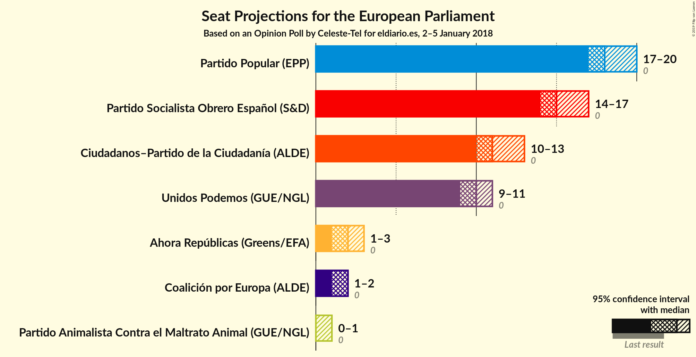
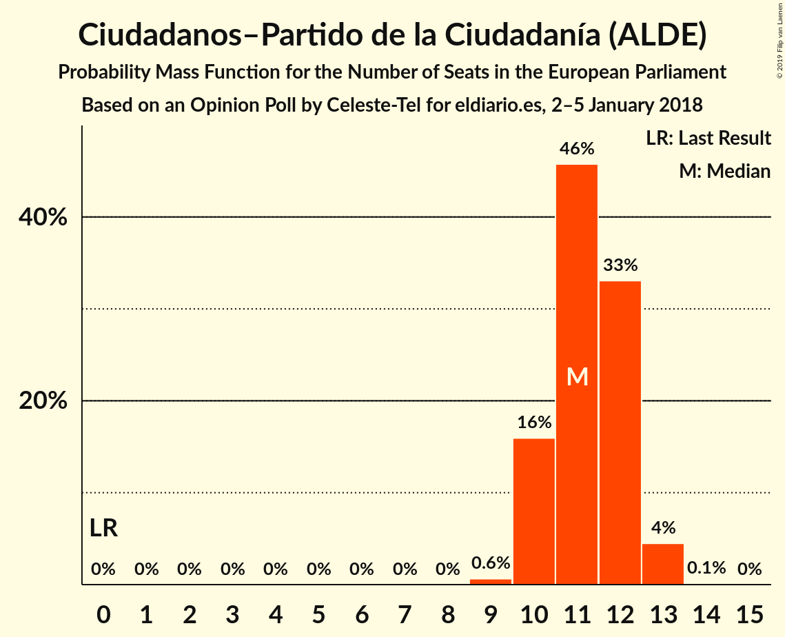
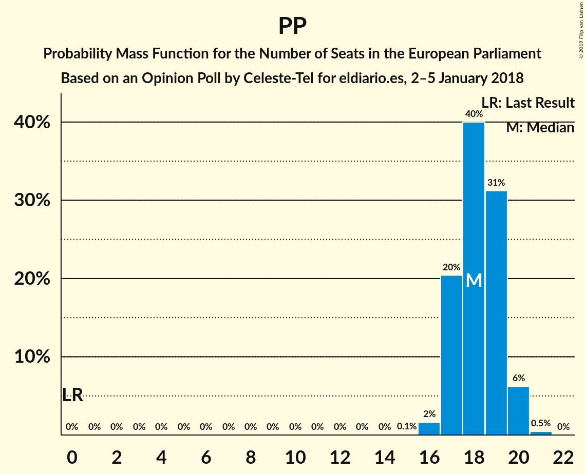

# Opinion Poll by Celeste-Tel for eldiario.es, 2–5 January 2018

<a href="#voting-intentions">Voting Intentions</a> | <a href="#seats">Seats</a> | <a href="#coalitions">Coalitions</a> | <a href="#technical-information">Technical Information</a>

## Voting Intentions

### Confidence Intervals

| Party | Last Result | Poll Result | 80% Confidence Interval | 90% Confidence Interval | 95% Confidence Interval | 99% Confidence Interval |
|:-----:|:-----------:|:-----------:|:-----------------------:|:-----------------------:|:-----------------------:|:-----------------------:|
| Partido Popular (EPP) | 0.0% | 29.8% | 28.1–31.6% |27.6–32.1% |27.2–32.6% |26.4–33.5% |
| Partido Socialista Obrero Español (S&D) | 0.0% | 25.1% | 23.5–26.8% |23.0–27.3% |22.6–27.7% |21.9–28.6% |
| Ciudadanos–Partido de la Ciudadanía (ALDE) | 0.0% | 18.6% | 17.2–20.2% |16.8–20.7% |16.4–21.0% |15.8–21.8% |
| Unidos Podemos (GUE/NGL) | 0.0% | 16.9% | 15.5–18.4% |15.1–18.9% |14.8–19.3% |14.2–20.0% |
| Ahora Repúblicas (Greens/EFA) | 0.0% | 3.6% | 3.0–4.5% |2.8–4.7% |2.7–4.9% |2.4–5.3% |
| Coalición por Europa (ALDE) | 0.0% | 3.2% | 2.6–4.0% |2.4–4.2% |2.3–4.4% |2.0–4.8% |
| Partido Animalista Contra el Maltrato Animal (GUE/NGL) | 0.0% | 1.2% | 0.9–1.7% |0.8–1.9% |0.7–2.0% |0.6–2.3% |

*Note:* The poll result column reflects the actual value used in the calculations. Published results may vary slightly, and in addition be rounded to fewer digits.

## Seats

### Confidence Intervals

| Party | Last Result | Median | 80% Confidence Interval | 90% Confidence Interval | 95% Confidence Interval | 99% Confidence Interval |
|:-----:|:-----------:|:------:|:-----------------------:|:-----------------------:|:-----------------------:|:-----------------------:|
| <a href="#partido-popular-(epp)">Partido Popular (EPP)</a> | 0 | 18 | 17–19 |17–20 |17–20 |16–20 |
| <a href="#partido-socialista-obrero-español-(s&d)">Partido Socialista Obrero Español (S&D)</a> | 0 | 15 | 14–16 |14–17 |14–17 |13–17 |
| <a href="#ciudadanos–partido-de-la-ciudadanía-(alde)">Ciudadanos–Partido de la Ciudadanía (ALDE)</a> | 0 | 11 | 10–12 |10–12 |10–13 |9–13 |
| <a href="#unidos-podemos-(gue/ngl)">Unidos Podemos (GUE/NGL)</a> | 0 | 10 | 9–11 |9–11 |9–11 |8–12 |
| <a href="#ahora-repúblicas-(greens/efa)">Ahora Repúblicas (Greens/EFA)</a> | 0 | 2 | 1–2 |1–2 |1–3 |1–3 |
| <a href="#coalición-por-europa-(alde)">Coalición por Europa (ALDE)</a> | 0 | 2 | 1–2 |1–2 |1–2 |1–2 |
| <a href="#partido-animalista-contra-el-maltrato-animal-(gue/ngl)">Partido Animalista Contra el Maltrato Animal (GUE/NGL)</a> | 0 | 0 | 0–1 |0–1 |0–1 |0–1 |

### Partido Popular (EPP)

*For a full overview of the results for this party, see the [Partido Popular (EPP)](party-partidopopularepp.html) page.*

| Number of Seats | Probability | Accumulated | Special Marks |
|:---------------:|:-----------:|:-----------:|:-------------:|
| 0 | 0% | 100% | Last Result |
| 1 | 0% | 100% |  |
| 2 | 0% | 100% |  |
| 3 | 0% | 100% |  |
| 4 | 0% | 100% |  |
| 5 | 0% | 100% |  |
| 6 | 0% | 100% |  |
| 7 | 0% | 100% |  |
| 8 | 0% | 100% |  |
| 9 | 0% | 100% |  |
| 10 | 0% | 100% |  |
| 11 | 0% | 100% |  |
| 12 | 0% | 100% |  |
| 13 | 0% | 100% |  |
| 14 | 0% | 100% |  |
| 15 | 0.1% | 100% |  |
| 16 | 2% | 99.9% |  |
| 17 | 20% | 98% |  |
| 18 | 40% | 78% | Median |
| 19 | 31% | 38% |  |
| 20 | 6% | 7% |  |
| 21 | 0.5% | 0.5% |  |
| 22 | 0% | 0% |  |

### Partido Socialista Obrero Español (S&D)

*For a full overview of the results for this party, see the [Partido Socialista Obrero Español (S&D)](party-partidosocialistaobreroespañolsd.html) page.*

| Number of Seats | Probability | Accumulated | Special Marks |
|:---------------:|:-----------:|:-----------:|:-------------:|
| 0 | 0% | 100% | Last Result |
| 1 | 0% | 100% |  |
| 2 | 0% | 100% |  |
| 3 | 0% | 100% |  |
| 4 | 0% | 100% |  |
| 5 | 0% | 100% |  |
| 6 | 0% | 100% |  |
| 7 | 0% | 100% |  |
| 8 | 0% | 100% |  |
| 9 | 0% | 100% |  |
| 10 | 0% | 100% |  |
| 11 | 0% | 100% |  |
| 12 | 0% | 100% |  |
| 13 | 1.3% | 100% |  |
| 14 | 14% | 98.7% |  |
| 15 | 45% | 85% | Median |
| 16 | 32% | 39% |  |
| 17 | 7% | 7% |  |
| 18 | 0.4% | 0.4% |  |
| 19 | 0% | 0% |  |

### Ciudadanos–Partido de la Ciudadanía (ALDE)

*For a full overview of the results for this party, see the [Ciudadanos–Partido de la Ciudadanía (ALDE)](party-ciudadanos–partidodelaciudadaníaalde.html) page.*

| Number of Seats | Probability | Accumulated | Special Marks |
|:---------------:|:-----------:|:-----------:|:-------------:|
| 0 | 0% | 100% | Last Result |
| 1 | 0% | 100% |  |
| 2 | 0% | 100% |  |
| 3 | 0% | 100% |  |
| 4 | 0% | 100% |  |
| 5 | 0% | 100% |  |
| 6 | 0% | 100% |  |
| 7 | 0% | 100% |  |
| 8 | 0% | 100% |  |
| 9 | 0.6% | 100% |  |
| 10 | 16% | 99.4% |  |
| 11 | 46% | 83% | Median |
| 12 | 33% | 38% |  |
| 13 | 4% | 5% |  |
| 14 | 0.1% | 0.1% |  |
| 15 | 0% | 0% |  |

### Unidos Podemos (GUE/NGL)

*For a full overview of the results for this party, see the [Unidos Podemos (GUE/NGL)](party-unidospodemosguengl.html) page.*

| Number of Seats | Probability | Accumulated | Special Marks |
|:---------------:|:-----------:|:-----------:|:-------------:|
| 0 | 0% | 100% | Last Result |
| 1 | 0% | 100% |  |
| 2 | 0% | 100% |  |
| 3 | 0% | 100% |  |
| 4 | 0% | 100% |  |
| 5 | 0% | 100% |  |
| 6 | 0% | 100% |  |
| 7 | 0% | 100% |  |
| 8 | 0.7% | 100% |  |
| 9 | 16% | 99.3% |  |
| 10 | 55% | 83% | Median |
| 11 | 26% | 28% |  |
| 12 | 2% | 2% |  |
| 13 | 0.1% | 0.1% |  |
| 14 | 0% | 0% |  |

### Ahora Repúblicas (Greens/EFA)

*For a full overview of the results for this party, see the [Ahora Repúblicas (Greens/EFA)](party-ahorarepúblicasgreensefa.html) page.*

| Number of Seats | Probability | Accumulated | Special Marks |
|:---------------:|:-----------:|:-----------:|:-------------:|
| 0 | 0% | 100% | Last Result |
| 1 | 11% | 100% |  |
| 2 | 85% | 89% | Median |
| 3 | 4% | 4% |  |
| 4 | 0% | 0% |  |

### Coalición por Europa (ALDE)

*For a full overview of the results for this party, see the [Coalición por Europa (ALDE)](party-coaliciónporeuropaalde.html) page.*

| Number of Seats | Probability | Accumulated | Special Marks |
|:---------------:|:-----------:|:-----------:|:-------------:|
| 0 | 0% | 100% | Last Result |
| 1 | 46% | 100% |  |
| 2 | 54% | 54% | Median |
| 3 | 0.4% | 0.4% |  |
| 4 | 0% | 0% |  |

### Partido Animalista Contra el Maltrato Animal (GUE/NGL)

*For a full overview of the results for this party, see the [Partido Animalista Contra el Maltrato Animal (GUE/NGL)](party-partidoanimalistacontraelmaltratoanimalguengl.html) page.*

| Number of Seats | Probability | Accumulated | Special Marks |
|:---------------:|:-----------:|:-----------:|:-------------:|
| 0 | 87% | 100% | Last Result, Median |
| 1 | 13% | 13% |  |
| 2 | 0% | 0% |  |

## Coalitions

### Confidence Intervals

| Coalition | Last Result | Median | Majority? | 80% Confidence Interval | 90% Confidence Interval | 95% Confidence Interval | 99% Confidence Interval |
|:---------:|:-----------:|:------:|:---------:|:-----------------------:|:-----------------------:|:-----------------------:|:-----------------------:|
| Partido Popular (EPP) | 0 | 18 | 0% | 17–19 | 17–20 | 17–20 | 16–20 |
| Partido Socialista Obrero Español (S&D) | 0 | 15 | 0% | 14–16 | 14–17 | 14–17 | 13–17 |
| Ciudadanos–Partido de la Ciudadanía (ALDE) – Coalición por Europa (ALDE) | 0 | 13 | 0% | 12–14 | 11–14 | 11–14 | 11–15 |
| Unidos Podemos (GUE/NGL) – Partido Animalista Contra el Maltrato Animal (GUE/NGL) | 0 | 10 | 0% | 9–11 | 9–11 | 9–12 | 8–12 |

### Partido Popular (EPP)

| Number of Seats | Probability | Accumulated | Special Marks |
|:---------------:|:-----------:|:-----------:|:-------------:|
| 0 | 0% | 100% | Last Result |
| 1 | 0% | 100% |  |
| 2 | 0% | 100% |  |
| 3 | 0% | 100% |  |
| 4 | 0% | 100% |  |
| 5 | 0% | 100% |  |
| 6 | 0% | 100% |  |
| 7 | 0% | 100% |  |
| 8 | 0% | 100% |  |
| 9 | 0% | 100% |  |
| 10 | 0% | 100% |  |
| 11 | 0% | 100% |  |
| 12 | 0% | 100% |  |
| 13 | 0% | 100% |  |
| 14 | 0% | 100% |  |
| 15 | 0.1% | 100% |  |
| 16 | 2% | 99.9% |  |
| 17 | 20% | 98% |  |
| 18 | 40% | 78% | Median |
| 19 | 31% | 38% |  |
| 20 | 6% | 7% |  |
| 21 | 0.5% | 0.5% |  |
| 22 | 0% | 0% |  |

### Partido Socialista Obrero Español (S&D)

| Number of Seats | Probability | Accumulated | Special Marks |
|:---------------:|:-----------:|:-----------:|:-------------:|
| 0 | 0% | 100% | Last Result |
| 1 | 0% | 100% |  |
| 2 | 0% | 100% |  |
| 3 | 0% | 100% |  |
| 4 | 0% | 100% |  |
| 5 | 0% | 100% |  |
| 6 | 0% | 100% |  |
| 7 | 0% | 100% |  |
| 8 | 0% | 100% |  |
| 9 | 0% | 100% |  |
| 10 | 0% | 100% |  |
| 11 | 0% | 100% |  |
| 12 | 0% | 100% |  |
| 13 | 1.3% | 100% |  |
| 14 | 14% | 98.7% |  |
| 15 | 45% | 85% | Median |
| 16 | 32% | 39% |  |
| 17 | 7% | 7% |  |
| 18 | 0.4% | 0.4% |  |
| 19 | 0% | 0% |  |

### Ciudadanos–Partido de la Ciudadanía (ALDE) – Coalición por Europa (ALDE)

| Number of Seats | Probability | Accumulated | Special Marks |
|:---------------:|:-----------:|:-----------:|:-------------:|
| 0 | 0% | 100% | Last Result |
| 1 | 0% | 100% |  |
| 2 | 0% | 100% |  |
| 3 | 0% | 100% |  |
| 4 | 0% | 100% |  |
| 5 | 0% | 100% |  |
| 6 | 0% | 100% |  |
| 7 | 0% | 100% |  |
| 8 | 0% | 100% |  |
| 9 | 0% | 100% |  |
| 10 | 0.2% | 100% |  |
| 11 | 5% | 99.8% |  |
| 12 | 25% | 95% |  |
| 13 | 57% | 70% | Median |
| 14 | 11% | 13% |  |
| 15 | 2% | 2% |  |
| 16 | 0.1% | 0.1% |  |
| 17 | 0% | 0% |  |

### Unidos Podemos (GUE/NGL) – Partido Animalista Contra el Maltrato Animal (GUE/NGL)

| Number of Seats | Probability | Accumulated | Special Marks |
|:---------------:|:-----------:|:-----------:|:-------------:|
| 0 | 0% | 100% | Last Result |
| 1 | 0% | 100% |  |
| 2 | 0% | 100% |  |
| 3 | 0% | 100% |  |
| 4 | 0% | 100% |  |
| 5 | 0% | 100% |  |
| 6 | 0% | 100% |  |
| 7 | 0% | 100% |  |
| 8 | 0.6% | 100% |  |
| 9 | 13% | 99.4% |  |
| 10 | 52% | 87% | Median |
| 11 | 29% | 34% |  |
| 12 | 5% | 5% |  |
| 13 | 0.3% | 0.3% |  |
| 14 | 0% | 0% |  |

## Technical Information

### Opinion Poll

+ **Polling firm:** Celeste-Tel
+ **Commissioner(s):** eldiario.es
+ **Fieldwork period:** 2–5 January 2018

### Calculations

+ **Sample size:** 1100
+ **Simulations done:** 131,072
+ **Error estimate:** 0.46%

