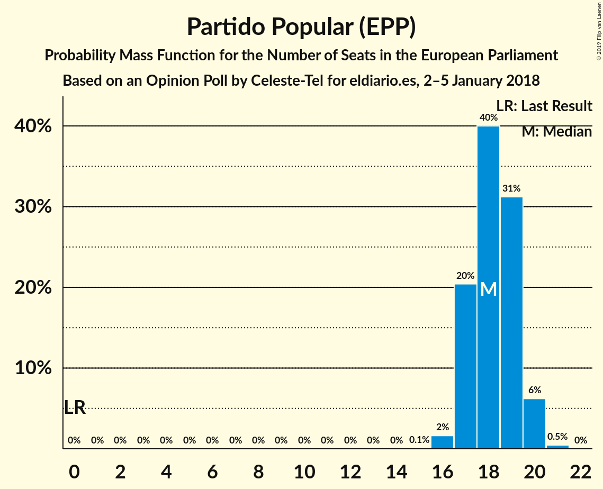
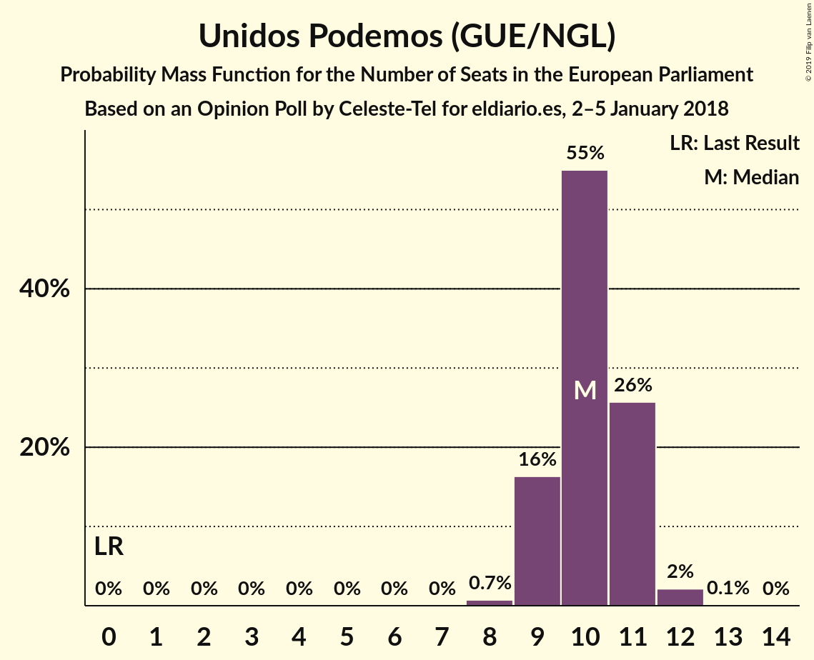
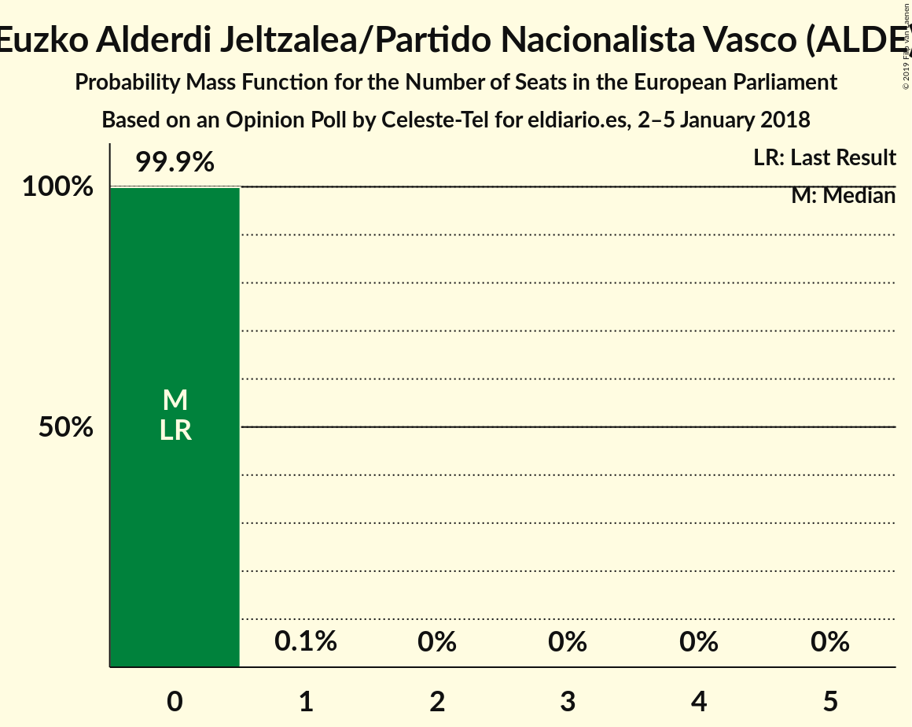
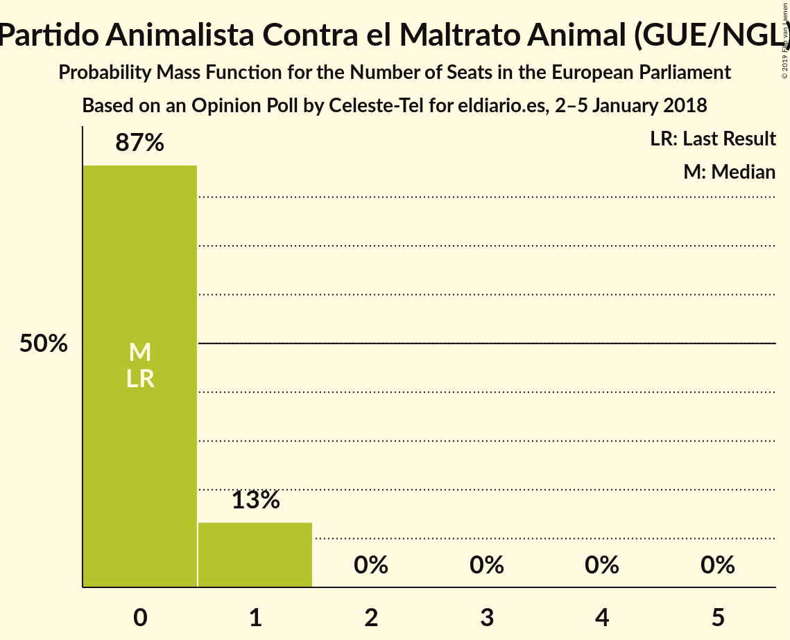
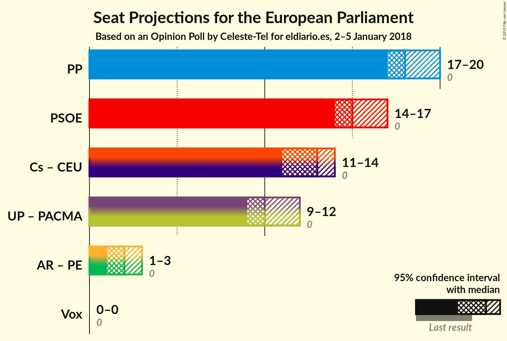
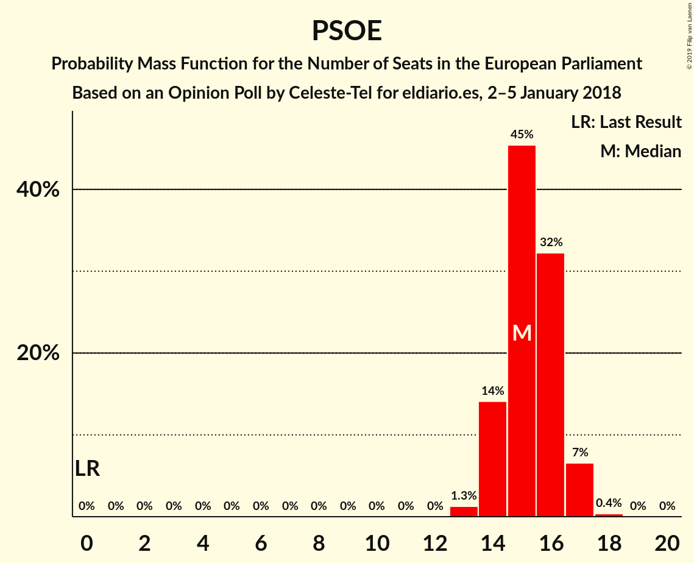

# Opinion Poll by Celeste-Tel for eldiario.es, 2–5 January 2018

<a href="#voting-intentions">Voting Intentions</a> | <a href="#seats">Seats</a> | <a href="#coalitions">Coalitions</a> | <a href="#technical-information">Technical Information</a>

## Voting Intentions

### Confidence Intervals

| Party | Last Result | Poll Result | 80% Confidence Interval | 90% Confidence Interval | 95% Confidence Interval | 99% Confidence Interval |
|:-----:|:-----------:|:-----------:|:-----------------------:|:-----------------------:|:-----------------------:|:-----------------------:|
| Partido Popular (EPP) | 0.0% | 29.8% | 28.1–31.6% |27.6–32.1% |27.2–32.6% |26.4–33.5% |
| Partido Socialista Obrero Español (S&D) | 0.0% | 25.1% | 23.5–26.8% |23.0–27.3% |22.6–27.7% |21.9–28.6% |
| Ciudadanos–Partido de la Ciudadanía (ALDE) | 0.0% | 18.6% | 17.2–20.2% |16.8–20.7% |16.4–21.0% |15.8–21.8% |
| Unidos Podemos (GUE/NGL) | 0.0% | 16.9% | 15.5–18.4% |15.1–18.9% |14.8–19.3% |14.2–20.0% |
| Esquerra Republicana de Catalunya–Euskal Herria Bildu–Bloque Nacionalista Galego (Greens/EFA) | 0.0% | 3.6% | 3.0–4.5% |2.8–4.7% |2.7–4.9% |2.4–5.3% |
| Partit Demòcrata Europeu Català (ALDE) | 0.0% | 1.7% | 1.3–2.3% |1.2–2.5% |1.1–2.7% |0.9–3.0% |
| Euzko Alderdi Jeltzalea/Partido Nacionalista Vasco (ALDE) | 0.0% | 1.2% | 0.9–1.7% |0.8–1.9% |0.7–2.0% |0.6–2.3% |
| Partido Animalista Contra el Maltrato Animal (GUE/NGL) | 0.0% | 1.2% | 0.9–1.7% |0.8–1.9% |0.7–2.0% |0.6–2.3% |
| Coalición Canaria (ALDE) | 0.0% | 0.3% | 0.2–0.6% |0.1–0.7% |0.1–0.8% |0.1–1.0% |

*Note:* The poll result column reflects the actual value used in the calculations. Published results may vary slightly, and in addition be rounded to fewer digits.

## Seats

### Confidence Intervals

| Party | Last Result | Median | 80% Confidence Interval | 90% Confidence Interval | 95% Confidence Interval | 99% Confidence Interval |
|:-----:|:-----------:|:------:|:-----------------------:|:-----------------------:|:-----------------------:|:-----------------------:|
| <a href="#partido-popular-(epp)">Partido Popular (EPP)</a> | 0 | 18 | 18 |18 |18 |18–20 |
| <a href="#partido-socialista-obrero-español-(s&d)">Partido Socialista Obrero Español (S&D)</a> | 0 | 16 | 16 |15–16 |15–16 |13–16 |
| <a href="#ciudadanos–partido-de-la-ciudadanía-(alde)">Ciudadanos–Partido de la Ciudadanía (ALDE)</a> | 0 | 12 | 12 |12 |11–12 |11–13 |
| <a href="#unidos-podemos-(gue/ngl)">Unidos Podemos (GUE/NGL)</a> | 0 | 9 | 9 |9–10 |9–10 |9–11 |
| <a href="#esquerra-republicana-de-catalunya–euskal-herria-bildu–bloque-nacionalista-galego-(greens/efa)">Esquerra Republicana de Catalunya–Euskal Herria Bildu–Bloque Nacionalista Galego (Greens/EFA)</a> | 0 | 2 | 2 |2 |2 |2 |
| <a href="#partit-demòcrata-europeu-català-(alde)">Partit Demòcrata Europeu Català (ALDE)</a> | 0 | 1 | 1 |1 |1 |0–2 |
| <a href="#euzko-alderdi-jeltzalea/partido-nacionalista-vasco-(alde)">Euzko Alderdi Jeltzalea/Partido Nacionalista Vasco (ALDE)</a> | 0 | 0 | 0 |0 |0 |0 |
| <a href="#partido-animalista-contra-el-maltrato-animal-(gue/ngl)">Partido Animalista Contra el Maltrato Animal (GUE/NGL)</a> | 0 | 0 | 0 |0 |0–1 |0–1 |
| <a href="#coalición-canaria-(alde)">Coalición Canaria (ALDE)</a> | 0 | 0 | 0 |0 |0 |0 |

### Partido Popular (EPP)

*For a full overview of the results for this party, see the [Partido Popular (EPP)](party-partidopopularepp.html) page.*

| Number of Seats | Probability | Accumulated | Special Marks |
|:---------------:|:-----------:|:-----------:|:-------------:|
| 0 | 0% | 100% | Last Result |
| 1 | 0% | 100% |  |
| 2 | 0% | 100% |  |
| 3 | 0% | 100% |  |
| 4 | 0% | 100% |  |
| 5 | 0% | 100% |  |
| 6 | 0% | 100% |  |
| 7 | 0% | 100% |  |
| 8 | 0% | 100% |  |
| 9 | 0% | 100% |  |
| 10 | 0% | 100% |  |
| 11 | 0% | 100% |  |
| 12 | 0% | 100% |  |
| 13 | 0% | 100% |  |
| 14 | 0% | 100% |  |
| 15 | 0% | 100% |  |
| 16 | 0.1% | 100% |  |
| 17 | 0% | 99.9% |  |
| 18 | 98.9% | 99.9% | Median |
| 19 | 0.1% | 1.0% |  |
| 20 | 0.9% | 1.0% |  |
| 21 | 0% | 0% |  |

### Partido Socialista Obrero Español (S&D)

*For a full overview of the results for this party, see the [Partido Socialista Obrero Español (S&D)](party-partidosocialistaobreroespañolsd.html) page.*

| Number of Seats | Probability | Accumulated | Special Marks |
|:---------------:|:-----------:|:-----------:|:-------------:|
| 0 | 0% | 100% | Last Result |
| 1 | 0% | 100% |  |
| 2 | 0% | 100% |  |
| 3 | 0% | 100% |  |
| 4 | 0% | 100% |  |
| 5 | 0% | 100% |  |
| 6 | 0% | 100% |  |
| 7 | 0% | 100% |  |
| 8 | 0% | 100% |  |
| 9 | 0% | 100% |  |
| 10 | 0% | 100% |  |
| 11 | 0% | 100% |  |
| 12 | 0% | 100% |  |
| 13 | 1.4% | 100% |  |
| 14 | 0.1% | 98.6% |  |
| 15 | 4% | 98.5% |  |
| 16 | 94% | 95% | Median |
| 17 | 0% | 0.3% |  |
| 18 | 0.2% | 0.3% |  |
| 19 | 0% | 0.1% |  |
| 20 | 0.1% | 0.1% |  |
| 21 | 0% | 0% |  |

### Ciudadanos–Partido de la Ciudadanía (ALDE)

*For a full overview of the results for this party, see the [Ciudadanos–Partido de la Ciudadanía (ALDE)](party-ciudadanos–partidodelaciudadaníaalde.html) page.*

| Number of Seats | Probability | Accumulated | Special Marks |
|:---------------:|:-----------:|:-----------:|:-------------:|
| 0 | 0% | 100% | Last Result |
| 1 | 0% | 100% |  |
| 2 | 0% | 100% |  |
| 3 | 0% | 100% |  |
| 4 | 0% | 100% |  |
| 5 | 0% | 100% |  |
| 6 | 0% | 100% |  |
| 7 | 0% | 100% |  |
| 8 | 0% | 100% |  |
| 9 | 0.1% | 100% |  |
| 10 | 0.1% | 99.9% |  |
| 11 | 4% | 99.8% |  |
| 12 | 95% | 96% | Median |
| 13 | 0.9% | 0.9% |  |
| 14 | 0% | 0% |  |

### Unidos Podemos (GUE/NGL)

*For a full overview of the results for this party, see the [Unidos Podemos (GUE/NGL)](party-unidospodemosguengl.html) page.*

| Number of Seats | Probability | Accumulated | Special Marks |
|:---------------:|:-----------:|:-----------:|:-------------:|
| 0 | 0% | 100% | Last Result |
| 1 | 0% | 100% |  |
| 2 | 0% | 100% |  |
| 3 | 0% | 100% |  |
| 4 | 0% | 100% |  |
| 5 | 0% | 100% |  |
| 6 | 0% | 100% |  |
| 7 | 0% | 100% |  |
| 8 | 0% | 100% |  |
| 9 | 95% | 100% | Median |
| 10 | 5% | 5% |  |
| 11 | 0.5% | 0.6% |  |
| 12 | 0% | 0% |  |

### Esquerra Republicana de Catalunya–Euskal Herria Bildu–Bloque Nacionalista Galego (Greens/EFA)

*For a full overview of the results for this party, see the [Esquerra Republicana de Catalunya–Euskal Herria Bildu–Bloque Nacionalista Galego (Greens/EFA)](party-esquerrarepublicanadecatalunya–euskalherriabildu–bloquenacionalistagalegogreensefa.html) page.*

| Number of Seats | Probability | Accumulated | Special Marks |
|:---------------:|:-----------:|:-----------:|:-------------:|
| 0 | 0% | 100% | Last Result |
| 1 | 0.1% | 100% |  |
| 2 | 99.8% | 99.9% | Median |
| 3 | 0.1% | 0.1% |  |
| 4 | 0% | 0% |  |

### Partit Demòcrata Europeu Català (ALDE)

*For a full overview of the results for this party, see the [Partit Demòcrata Europeu Català (ALDE)](party-partitdemòcrataeuropeucatalàalde.html) page.*

| Number of Seats | Probability | Accumulated | Special Marks |
|:---------------:|:-----------:|:-----------:|:-------------:|
| 0 | 1.1% | 100% | Last Result |
| 1 | 98% | 98.9% | Median |
| 2 | 0.5% | 0.5% |  |
| 3 | 0% | 0% |  |

### Euzko Alderdi Jeltzalea/Partido Nacionalista Vasco (ALDE)

*For a full overview of the results for this party, see the [Euzko Alderdi Jeltzalea/Partido Nacionalista Vasco (ALDE)](party-euzkoalderdijeltzaleapartidonacionalistavascoalde.html) page.*

| Number of Seats | Probability | Accumulated | Special Marks |
|:---------------:|:-----------:|:-----------:|:-------------:|
| 0 | 99.9% | 100% | Last Result, Median |
| 1 | 0.1% | 0.1% |  |
| 2 | 0% | 0% |  |

### Partido Animalista Contra el Maltrato Animal (GUE/NGL)

*For a full overview of the results for this party, see the [Partido Animalista Contra el Maltrato Animal (GUE/NGL)](party-partidoanimalistacontraelmaltratoanimalguengl.html) page.*

| Number of Seats | Probability | Accumulated | Special Marks |
|:---------------:|:-----------:|:-----------:|:-------------:|
| 0 | 96% | 100% | Last Result, Median |
| 1 | 4% | 4% |  |
| 2 | 0% | 0% |  |

### Coalición Canaria (ALDE)

*For a full overview of the results for this party, see the [Coalición Canaria (ALDE)](party-coalicióncanariaalde.html) page.*

| Number of Seats | Probability | Accumulated | Special Marks |
|:---------------:|:-----------:|:-----------:|:-------------:|
| 0 | 100% | 100% | Last Result, Median |

## Coalitions

### Confidence Intervals

| Coalition | Last Result | Median | Majority? | 80% Confidence Interval | 90% Confidence Interval | 95% Confidence Interval | 99% Confidence Interval |
|:---------:|:-----------:|:------:|:---------:|:-----------------------:|:-----------------------:|:-----------------------:|:-----------------------:|
| Partido Popular (EPP) | 0 | 18 | 0% | 18 | 18 | 18 | 18–20 |
| Partido Socialista Obrero Español (S&D) | 0 | 16 | 0% | 16 | 15–16 | 15–16 | 13–16 |
| Ciudadanos–Partido de la Ciudadanía (ALDE) – Partit Demòcrata Europeu Català (ALDE) – Euzko Alderdi Jeltzalea/Partido Nacionalista Vasco (ALDE) – Coalición Canaria (ALDE) | 0 | 13 | 0% | 13 | 13 | 12–13 | 12–14 |
| Unidos Podemos (GUE/NGL) – Partido Animalista Contra el Maltrato Animal (GUE/NGL) | 0 | 9 | 0% | 9 | 9–10 | 9–11 | 9–11 |
| Esquerra Republicana de Catalunya–Euskal Herria Bildu–Bloque Nacionalista Galego (Greens/EFA) | 0 | 2 | 0% | 2 | 2 | 2 | 2 |

### Partido Popular (EPP)

| Number of Seats | Probability | Accumulated | Special Marks |
|:---------------:|:-----------:|:-----------:|:-------------:|
| 0 | 0% | 100% | Last Result |
| 1 | 0% | 100% |  |
| 2 | 0% | 100% |  |
| 3 | 0% | 100% |  |
| 4 | 0% | 100% |  |
| 5 | 0% | 100% |  |
| 6 | 0% | 100% |  |
| 7 | 0% | 100% |  |
| 8 | 0% | 100% |  |
| 9 | 0% | 100% |  |
| 10 | 0% | 100% |  |
| 11 | 0% | 100% |  |
| 12 | 0% | 100% |  |
| 13 | 0% | 100% |  |
| 14 | 0% | 100% |  |
| 15 | 0% | 100% |  |
| 16 | 0.1% | 100% |  |
| 17 | 0% | 99.9% |  |
| 18 | 98.9% | 99.9% | Median |
| 19 | 0.1% | 1.0% |  |
| 20 | 0.9% | 1.0% |  |
| 21 | 0% | 0% |  |

### Partido Socialista Obrero Español (S&D)

| Number of Seats | Probability | Accumulated | Special Marks |
|:---------------:|:-----------:|:-----------:|:-------------:|
| 0 | 0% | 100% | Last Result |
| 1 | 0% | 100% |  |
| 2 | 0% | 100% |  |
| 3 | 0% | 100% |  |
| 4 | 0% | 100% |  |
| 5 | 0% | 100% |  |
| 6 | 0% | 100% |  |
| 7 | 0% | 100% |  |
| 8 | 0% | 100% |  |
| 9 | 0% | 100% |  |
| 10 | 0% | 100% |  |
| 11 | 0% | 100% |  |
| 12 | 0% | 100% |  |
| 13 | 1.4% | 100% |  |
| 14 | 0.1% | 98.6% |  |
| 15 | 4% | 98.5% |  |
| 16 | 94% | 95% | Median |
| 17 | 0% | 0.3% |  |
| 18 | 0.2% | 0.3% |  |
| 19 | 0% | 0.1% |  |
| 20 | 0.1% | 0.1% |  |
| 21 | 0% | 0% |  |

### Ciudadanos–Partido de la Ciudadanía (ALDE) – Partit Demòcrata Europeu Català (ALDE) – Euzko Alderdi Jeltzalea/Partido Nacionalista Vasco (ALDE) – Coalición Canaria (ALDE)

| Number of Seats | Probability | Accumulated | Special Marks |
|:---------------:|:-----------:|:-----------:|:-------------:|
| 0 | 0% | 100% | Last Result |
| 1 | 0% | 100% |  |
| 2 | 0% | 100% |  |
| 3 | 0% | 100% |  |
| 4 | 0% | 100% |  |
| 5 | 0% | 100% |  |
| 6 | 0% | 100% |  |
| 7 | 0% | 100% |  |
| 8 | 0% | 100% |  |
| 9 | 0% | 100% |  |
| 10 | 0.1% | 100% |  |
| 11 | 0.1% | 99.9% |  |
| 12 | 4% | 99.7% |  |
| 13 | 95% | 96% | Median |
| 14 | 0.5% | 0.6% |  |
| 15 | 0% | 0% |  |

### Unidos Podemos (GUE/NGL) – Partido Animalista Contra el Maltrato Animal (GUE/NGL)

| Number of Seats | Probability | Accumulated | Special Marks |
|:---------------:|:-----------:|:-----------:|:-------------:|
| 0 | 0% | 100% | Last Result |
| 1 | 0% | 100% |  |
| 2 | 0% | 100% |  |
| 3 | 0% | 100% |  |
| 4 | 0% | 100% |  |
| 5 | 0% | 100% |  |
| 6 | 0% | 100% |  |
| 7 | 0% | 100% |  |
| 8 | 0% | 100% |  |
| 9 | 95% | 100% | Median |
| 10 | 1.1% | 5% |  |
| 11 | 4% | 4% |  |
| 12 | 0% | 0% |  |

### Esquerra Republicana de Catalunya–Euskal Herria Bildu–Bloque Nacionalista Galego (Greens/EFA)

| Number of Seats | Probability | Accumulated | Special Marks |
|:---------------:|:-----------:|:-----------:|:-------------:|
| 0 | 0% | 100% | Last Result |
| 1 | 0.1% | 100% |  |
| 2 | 99.8% | 99.9% | Median |
| 3 | 0.1% | 0.1% |  |
| 4 | 0% | 0% |  |

## Technical Information

### Opinion Poll

+ **Polling firm:** Celeste-Tel
+ **Commissioner(s):** eldiario.es
+ **Fieldwork period:** 2–5 January 2018

### Calculations

+ **Sample size:** 1100
+ **Simulations done:** 1,024
+ **Error estimate:** 1.94%

