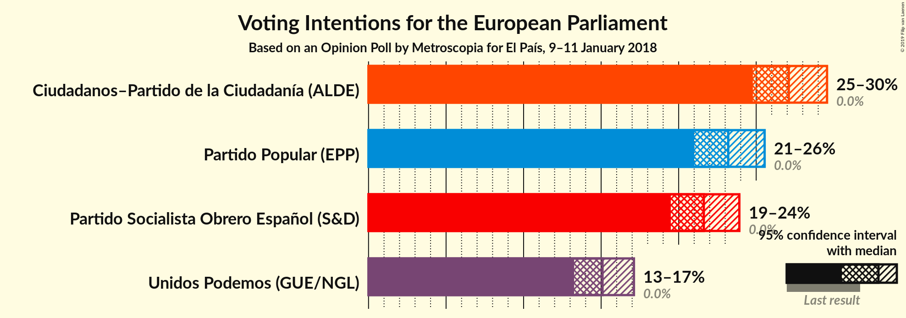
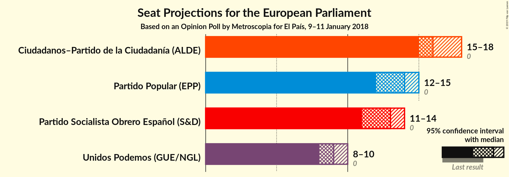
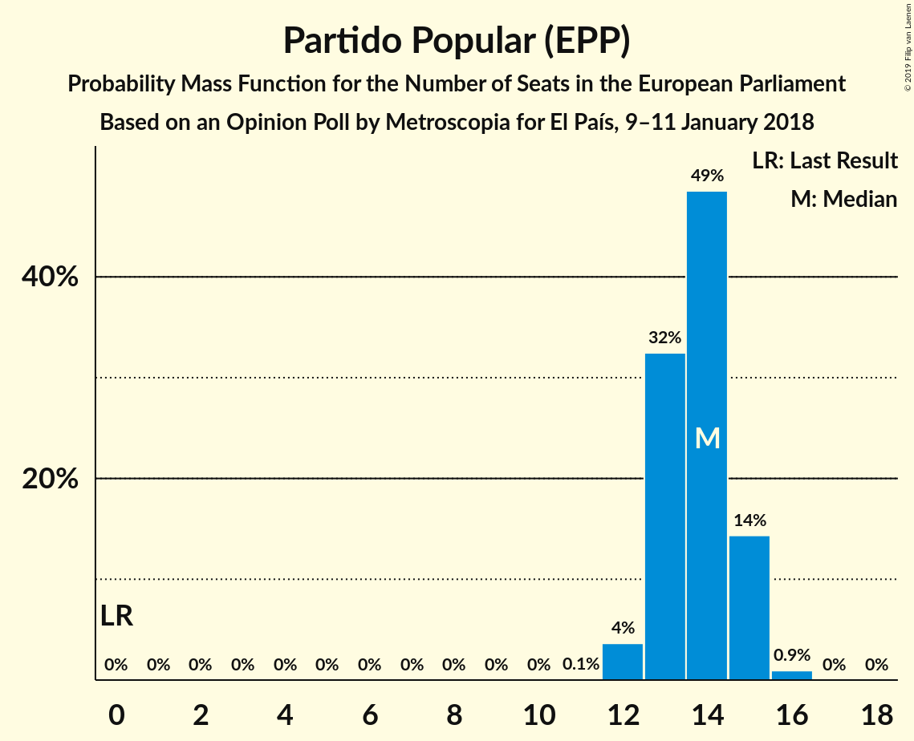
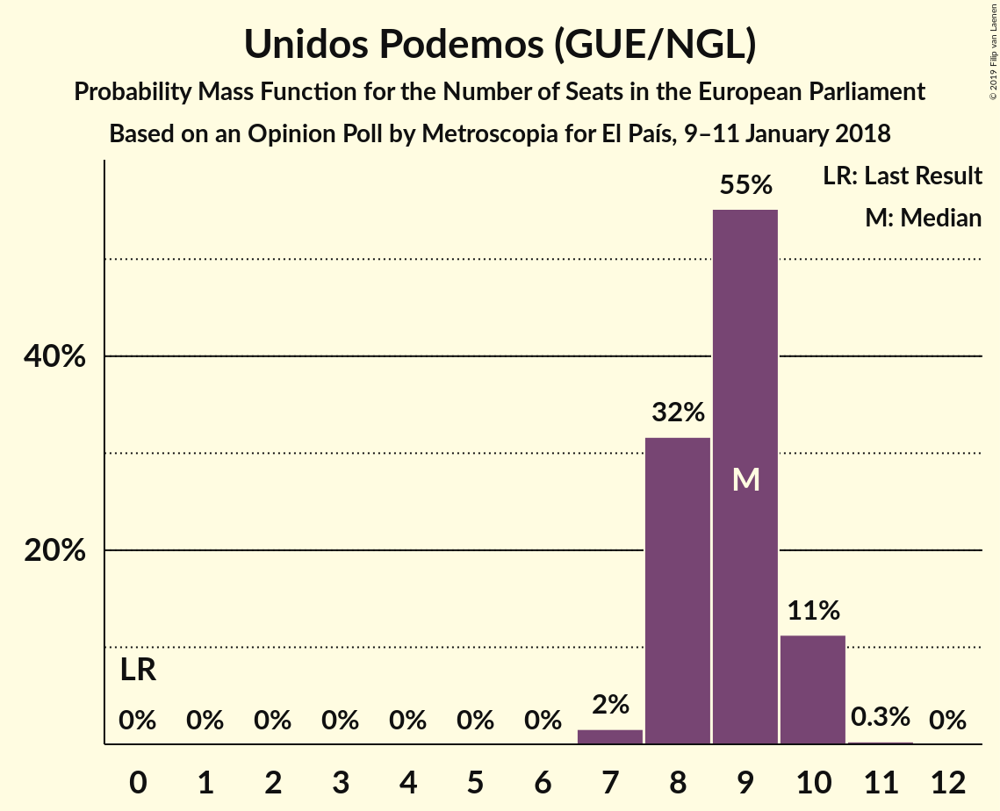
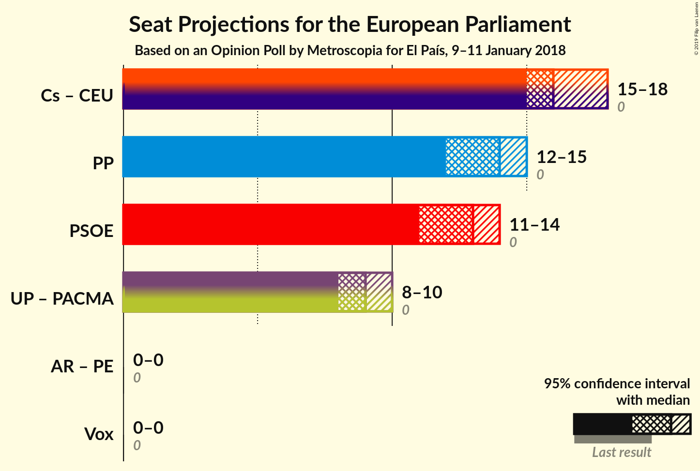
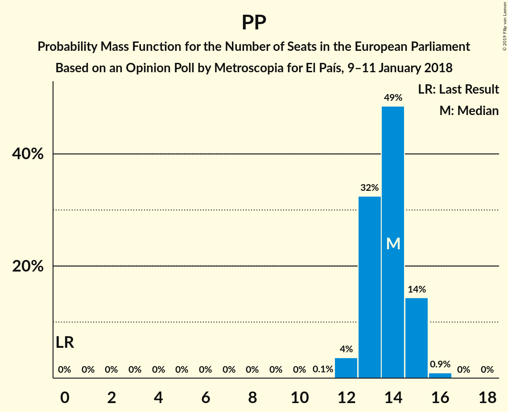
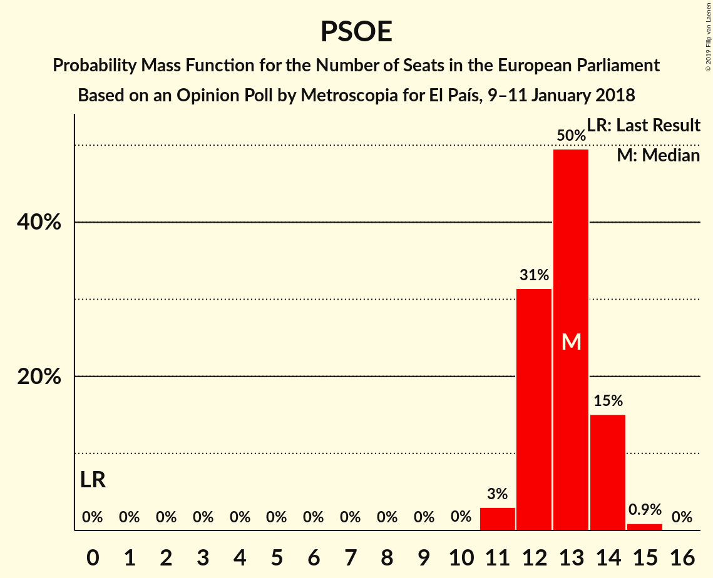

# Opinion Poll by Metroscopia for El País, 9–11 January 2018

<a href="#voting-intentions">Voting Intentions</a> | <a href="#seats">Seats</a> | <a href="#coalitions">Coalitions</a> | <a href="#technical-information">Technical Information</a>

## Voting Intentions

### Confidence Intervals

| Party | Last Result | Poll Result | 80% Confidence Interval | 90% Confidence Interval | 95% Confidence Interval | 99% Confidence Interval |
|:-----:|:-----------:|:-----------:|:-----------------------:|:-----------------------:|:-----------------------:|:-----------------------:|
| Ciudadanos–Partido de la Ciudadanía (ALDE) | 0.0% | 27.1% | 25.6–28.7% |25.1–29.2% |24.8–29.6% |24.1–30.3% |
| Partido Popular (EPP) | 0.0% | 23.2% | 21.8–24.7% |21.4–25.2% |21.0–25.5% |20.3–26.3% |
| Partido Socialista Obrero Español (S&D) | 0.0% | 21.6% | 20.2–23.1% |19.8–23.5% |19.5–23.9% |18.8–24.7% |
| Unidos Podemos (GUE/NGL) | 0.0% | 15.1% | 13.9–16.4% |13.5–16.8% |13.3–17.1% |12.7–17.8% |

*Note:* The poll result column reflects the actual value used in the calculations. Published results may vary slightly, and in addition be rounded to fewer digits.

## Seats

### Confidence Intervals

| Party | Last Result | Median | 80% Confidence Interval | 90% Confidence Interval | 95% Confidence Interval | 99% Confidence Interval |
|:-----:|:-----------:|:------:|:-----------------------:|:-----------------------:|:-----------------------:|:-----------------------:|
| <a href="#ciudadanos–partido-de-la-ciudadanía-(alde)">Ciudadanos–Partido de la Ciudadanía (ALDE)</a> | 0 | 16 | 15–17 |15–17 |15–18 |14–18 |
| <a href="#partido-popular-(epp)">Partido Popular (EPP)</a> | 0 | 14 | 13–15 |13–15 |12–15 |12–16 |
| <a href="#partido-socialista-obrero-español-(s&d)">Partido Socialista Obrero Español (S&D)</a> | 0 | 13 | 12–14 |12–14 |11–14 |11–15 |
| <a href="#unidos-podemos-(gue/ngl)">Unidos Podemos (GUE/NGL)</a> | 0 | 9 | 8–10 |8–10 |8–10 |7–10 |

### Ciudadanos–Partido de la Ciudadanía (ALDE)

*For a full overview of the results for this party, see the [Ciudadanos–Partido de la Ciudadanía (ALDE)](party-ciudadanos–partidodelaciudadaníaalde.html) page.*

| Number of Seats | Probability | Accumulated | Special Marks |
|:---------------:|:-----------:|:-----------:|:-------------:|
| 0 | 0% | 100% | Last Result |
| 1 | 0% | 100% |  |
| 2 | 0% | 100% |  |
| 3 | 0% | 100% |  |
| 4 | 0% | 100% |  |
| 5 | 0% | 100% |  |
| 6 | 0% | 100% |  |
| 7 | 0% | 100% |  |
| 8 | 0% | 100% |  |
| 9 | 0% | 100% |  |
| 10 | 0% | 100% |  |
| 11 | 0% | 100% |  |
| 12 | 0% | 100% |  |
| 13 | 0% | 100% |  |
| 14 | 1.3% | 100% |  |
| 15 | 18% | 98.7% |  |
| 16 | 47% | 81% | Median |
| 17 | 29% | 33% |  |
| 18 | 4% | 4% |  |
| 19 | 0.1% | 0.1% |  |
| 20 | 0% | 0% |  |

### Partido Popular (EPP)

*For a full overview of the results for this party, see the [Partido Popular (EPP)](party-partidopopularepp.html) page.*

| Number of Seats | Probability | Accumulated | Special Marks |
|:---------------:|:-----------:|:-----------:|:-------------:|
| 0 | 0% | 100% | Last Result |
| 1 | 0% | 100% |  |
| 2 | 0% | 100% |  |
| 3 | 0% | 100% |  |
| 4 | 0% | 100% |  |
| 5 | 0% | 100% |  |
| 6 | 0% | 100% |  |
| 7 | 0% | 100% |  |
| 8 | 0% | 100% |  |
| 9 | 0% | 100% |  |
| 10 | 0% | 100% |  |
| 11 | 0.1% | 100% |  |
| 12 | 4% | 99.9% |  |
| 13 | 32% | 96% |  |
| 14 | 49% | 64% | Median |
| 15 | 14% | 15% |  |
| 16 | 0.9% | 1.0% |  |
| 17 | 0% | 0% |  |

### Partido Socialista Obrero Español (S&D)

*For a full overview of the results for this party, see the [Partido Socialista Obrero Español (S&D)](party-partidosocialistaobreroespañolsd.html) page.*

| Number of Seats | Probability | Accumulated | Special Marks |
|:---------------:|:-----------:|:-----------:|:-------------:|
| 0 | 0% | 100% | Last Result |
| 1 | 0% | 100% |  |
| 2 | 0% | 100% |  |
| 3 | 0% | 100% |  |
| 4 | 0% | 100% |  |
| 5 | 0% | 100% |  |
| 6 | 0% | 100% |  |
| 7 | 0% | 100% |  |
| 8 | 0% | 100% |  |
| 9 | 0% | 100% |  |
| 10 | 0% | 100% |  |
| 11 | 3% | 100% |  |
| 12 | 31% | 97% |  |
| 13 | 50% | 66% | Median |
| 14 | 15% | 16% |  |
| 15 | 0.9% | 0.9% |  |
| 16 | 0% | 0% |  |

### Unidos Podemos (GUE/NGL)

*For a full overview of the results for this party, see the [Unidos Podemos (GUE/NGL)](party-unidospodemosguengl.html) page.*

| Number of Seats | Probability | Accumulated | Special Marks |
|:---------------:|:-----------:|:-----------:|:-------------:|
| 0 | 0% | 100% | Last Result |
| 1 | 0% | 100% |  |
| 2 | 0% | 100% |  |
| 3 | 0% | 100% |  |
| 4 | 0% | 100% |  |
| 5 | 0% | 100% |  |
| 6 | 0% | 100% |  |
| 7 | 2% | 100% |  |
| 8 | 32% | 98% |  |
| 9 | 55% | 67% | Median |
| 10 | 11% | 12% |  |
| 11 | 0.3% | 0.3% |  |
| 12 | 0% | 0% |  |

## Coalitions

### Confidence Intervals

| Coalition | Last Result | Median | Majority? | 80% Confidence Interval | 90% Confidence Interval | 95% Confidence Interval | 99% Confidence Interval |
|:---------:|:-----------:|:------:|:---------:|:-----------------------:|:-----------------------:|:-----------------------:|:-----------------------:|
| Partido Popular (EPP) | 0 | 14 | 0% | 13–15 | 13–15 | 12–15 | 12–16 |
| Partido Socialista Obrero Español (S&D) | 0 | 13 | 0% | 12–14 | 12–14 | 11–14 | 11–15 |

### Partido Popular (EPP)

| Number of Seats | Probability | Accumulated | Special Marks |
|:---------------:|:-----------:|:-----------:|:-------------:|
| 0 | 0% | 100% | Last Result |
| 1 | 0% | 100% |  |
| 2 | 0% | 100% |  |
| 3 | 0% | 100% |  |
| 4 | 0% | 100% |  |
| 5 | 0% | 100% |  |
| 6 | 0% | 100% |  |
| 7 | 0% | 100% |  |
| 8 | 0% | 100% |  |
| 9 | 0% | 100% |  |
| 10 | 0% | 100% |  |
| 11 | 0.1% | 100% |  |
| 12 | 4% | 99.9% |  |
| 13 | 32% | 96% |  |
| 14 | 49% | 64% | Median |
| 15 | 14% | 15% |  |
| 16 | 0.9% | 1.0% |  |
| 17 | 0% | 0% |  |

### Partido Socialista Obrero Español (S&D)

| Number of Seats | Probability | Accumulated | Special Marks |
|:---------------:|:-----------:|:-----------:|:-------------:|
| 0 | 0% | 100% | Last Result |
| 1 | 0% | 100% |  |
| 2 | 0% | 100% |  |
| 3 | 0% | 100% |  |
| 4 | 0% | 100% |  |
| 5 | 0% | 100% |  |
| 6 | 0% | 100% |  |
| 7 | 0% | 100% |  |
| 8 | 0% | 100% |  |
| 9 | 0% | 100% |  |
| 10 | 0% | 100% |  |
| 11 | 3% | 100% |  |
| 12 | 31% | 97% |  |
| 13 | 50% | 66% | Median |
| 14 | 15% | 16% |  |
| 15 | 0.9% | 0.9% |  |
| 16 | 0% | 0% |  |

## Technical Information

### Opinion Poll

+ **Polling firm:** Metroscopia
+ **Commissioner(s):** El País
+ **Fieldwork period:** 9–11 January 2018

### Calculations

+ **Sample size:** 1332
+ **Simulations done:** 131,072
+ **Error estimate:** 0.73%

