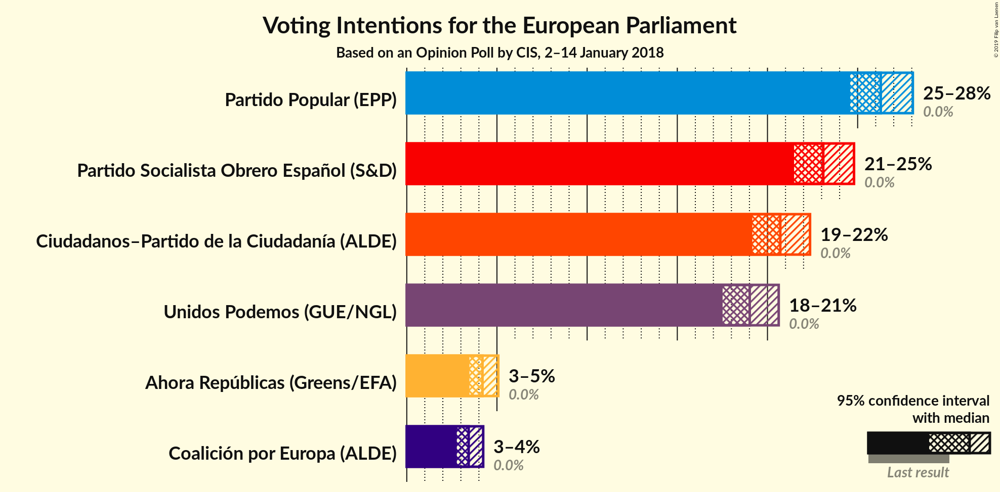
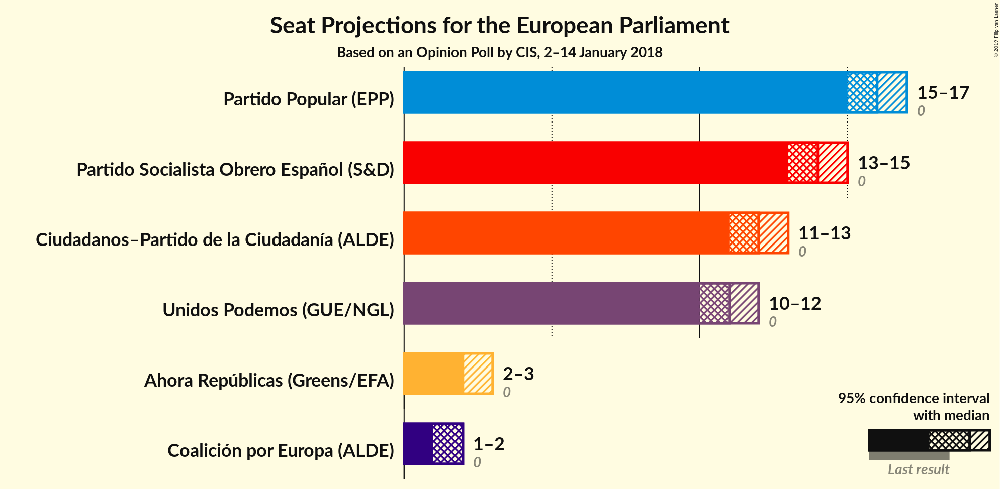
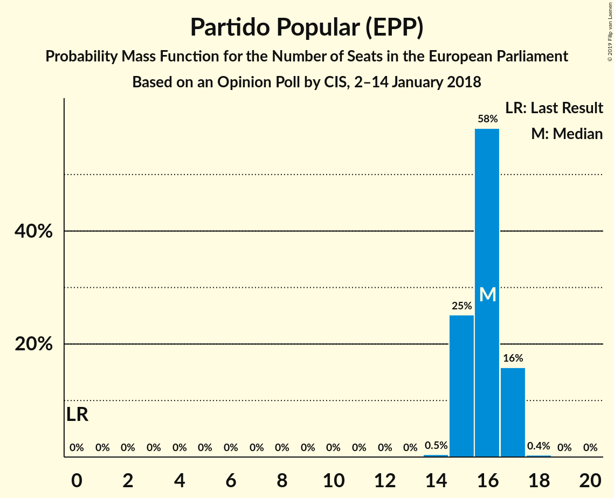
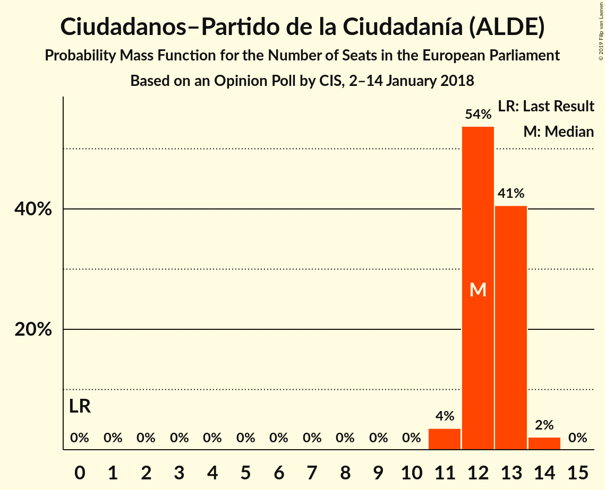
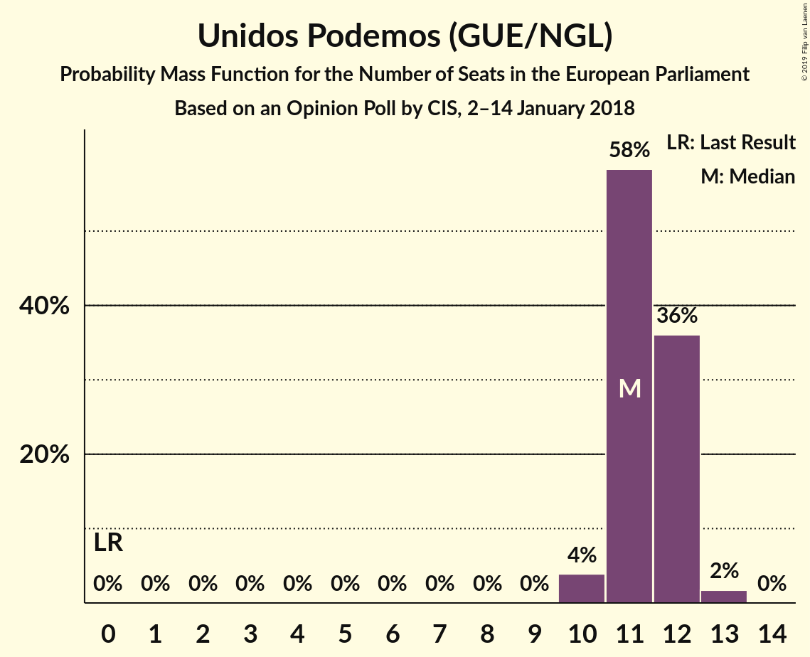
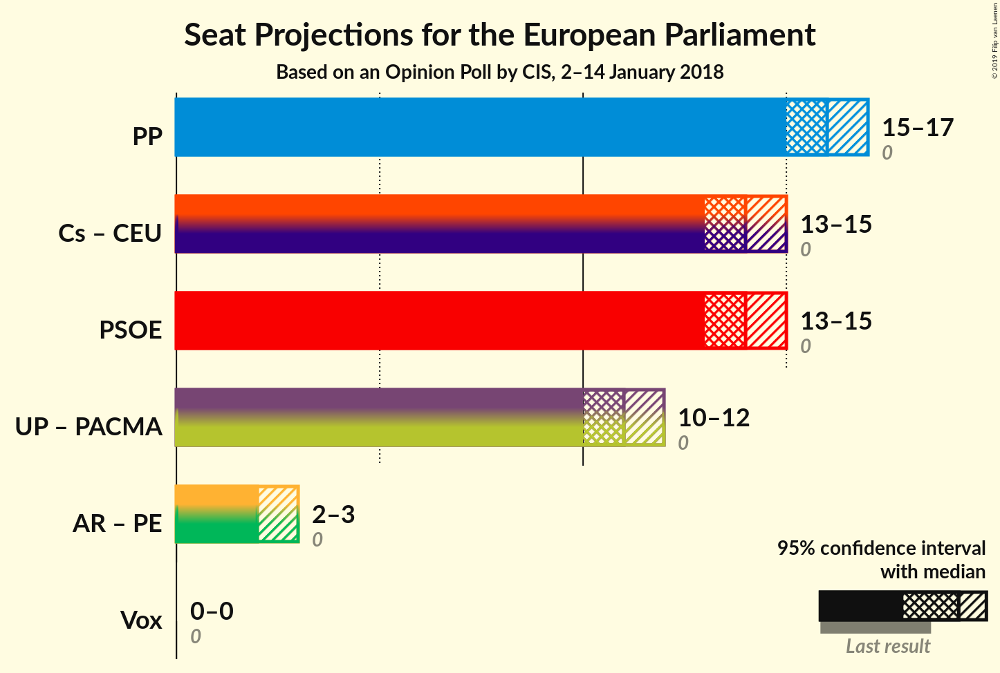
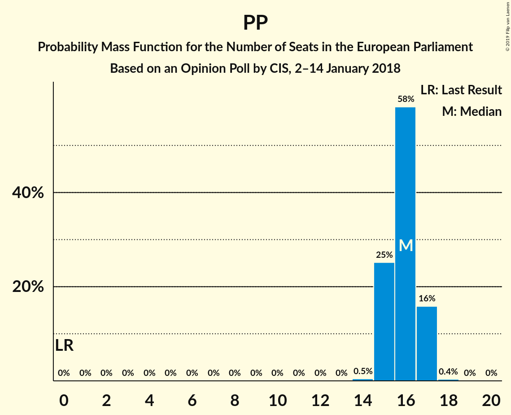
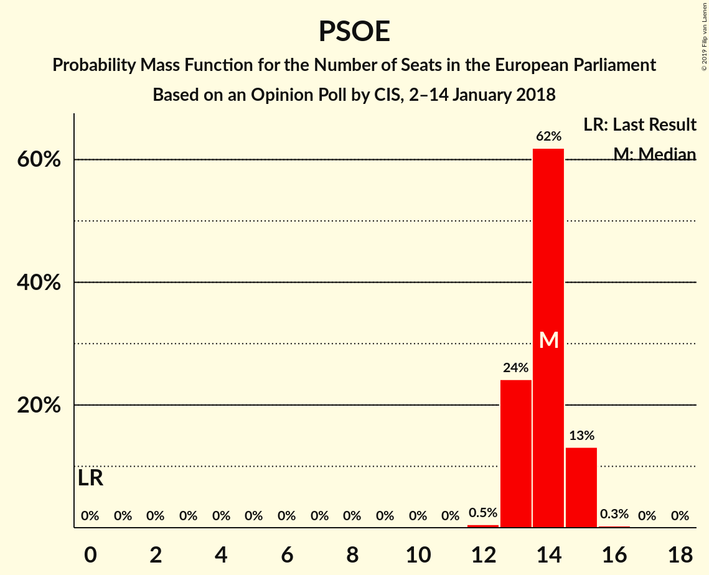

# Opinion Poll by CIS, 2–14 January 2018

<a href="#voting-intentions">Voting Intentions</a> | <a href="#seats">Seats</a> | <a href="#coalitions">Coalitions</a> | <a href="#technical-information">Technical Information</a>

## Voting Intentions

### Confidence Intervals

| Party | Last Result | Poll Result | 80% Confidence Interval | 90% Confidence Interval | 95% Confidence Interval | 99% Confidence Interval |
|:-----:|:-----------:|:-----------:|:-----------------------:|:-----------------------:|:-----------------------:|:-----------------------:|
| Partido Popular (EPP) | 0.0% | 26.3% | 25.2–27.5% |24.8–27.8% |24.6–28.1% |24.1–28.6% |
| Partido Socialista Obrero Español (S&D) | 0.0% | 23.1% | 22.0–24.2% |21.7–24.5% |21.5–24.8% |21.0–25.3% |
| Ciudadanos–Partido de la Ciudadanía (ALDE) | 0.0% | 20.7% | 19.7–21.8% |19.4–22.1% |19.2–22.4% |18.7–22.9% |
| Unidos Podemos (GUE/NGL) | 0.0% | 19.0% | 18.0–20.1% |17.8–20.4% |17.5–20.6% |17.1–21.1% |
| Esquerra Republicana de Catalunya–Euskal Herria Bildu–Bloque Nacionalista Galego (Greens/EFA) | 0.0% | 4.2% | 3.7–4.8% |3.6–4.9% |3.5–5.1% |3.3–5.3% |
| Partit Demòcrata Europeu Català (ALDE) | 0.0% | 2.0% | 1.7–2.4% |1.6–2.6% |1.5–2.7% |1.4–2.9% |
| Euzko Alderdi Jeltzalea/Partido Nacionalista Vasco (ALDE) | 0.0% | 1.2% | 1.0–1.6% |0.9–1.6% |0.8–1.7% |0.7–1.9% |
| Coalición Canaria (ALDE) | 0.0% | 0.2% | 0.1–0.4% |0.1–0.4% |0.1–0.5% |0.1–0.6% |

*Note:* The poll result column reflects the actual value used in the calculations. Published results may vary slightly, and in addition be rounded to fewer digits.

## Seats

### Confidence Intervals

| Party | Last Result | Median | 80% Confidence Interval | 90% Confidence Interval | 95% Confidence Interval | 99% Confidence Interval |
|:-----:|:-----------:|:------:|:-----------------------:|:-----------------------:|:-----------------------:|:-----------------------:|
| <a href="#partido-popular-(epp)">Partido Popular (EPP)</a> | 0 | 16 | 16 |16 |16 |15–16 |
| <a href="#partido-socialista-obrero-español-(s&d)">Partido Socialista Obrero Español (S&D)</a> | 0 | 14 | 14 |14 |14 |14–15 |
| <a href="#ciudadanos–partido-de-la-ciudadanía-(alde)">Ciudadanos–Partido de la Ciudadanía (ALDE)</a> | 0 | 13 | 13 |13 |13 |13 |
| <a href="#unidos-podemos-(gue/ngl)">Unidos Podemos (GUE/NGL)</a> | 0 | 11 | 11 |11 |11 |11 |
| <a href="#esquerra-republicana-de-catalunya–euskal-herria-bildu–bloque-nacionalista-galego-(greens/efa)">Esquerra Republicana de Catalunya–Euskal Herria Bildu–Bloque Nacionalista Galego (Greens/EFA)</a> | 0 | 2 | 2 |2 |2 |2 |
| <a href="#partit-demòcrata-europeu-català-(alde)">Partit Demòcrata Europeu Català (ALDE)</a> | 0 | 1 | 1 |1 |1 |1 |
| <a href="#euzko-alderdi-jeltzalea/partido-nacionalista-vasco-(alde)">Euzko Alderdi Jeltzalea/Partido Nacionalista Vasco (ALDE)</a> | 0 | 0 | 0–1 |0–1 |0–1 |0–1 |
| <a href="#coalición-canaria-(alde)">Coalición Canaria (ALDE)</a> | 0 | 0 | 0 |0 |0 |0 |

### Partido Popular (EPP)

*For a full overview of the results for this party, see the [Partido Popular (EPP)](party-partidopopularepp.html) page.*

| Number of Seats | Probability | Accumulated | Special Marks |
|:---------------:|:-----------:|:-----------:|:-------------:|
| 0 | 0% | 100% | Last Result |
| 1 | 0% | 100% |  |
| 2 | 0% | 100% |  |
| 3 | 0% | 100% |  |
| 4 | 0% | 100% |  |
| 5 | 0% | 100% |  |
| 6 | 0% | 100% |  |
| 7 | 0% | 100% |  |
| 8 | 0% | 100% |  |
| 9 | 0% | 100% |  |
| 10 | 0% | 100% |  |
| 11 | 0% | 100% |  |
| 12 | 0% | 100% |  |
| 13 | 0% | 100% |  |
| 14 | 0% | 100% |  |
| 15 | 0.7% | 100% |  |
| 16 | 99.0% | 99.3% | Median |
| 17 | 0.3% | 0.3% |  |
| 18 | 0% | 0% |  |

### Partido Socialista Obrero Español (S&D)

*For a full overview of the results for this party, see the [Partido Socialista Obrero Español (S&D)](party-partidosocialistaobreroespañolsd.html) page.*

| Number of Seats | Probability | Accumulated | Special Marks |
|:---------------:|:-----------:|:-----------:|:-------------:|
| 0 | 0% | 100% | Last Result |
| 1 | 0% | 100% |  |
| 2 | 0% | 100% |  |
| 3 | 0% | 100% |  |
| 4 | 0% | 100% |  |
| 5 | 0% | 100% |  |
| 6 | 0% | 100% |  |
| 7 | 0% | 100% |  |
| 8 | 0% | 100% |  |
| 9 | 0% | 100% |  |
| 10 | 0% | 100% |  |
| 11 | 0% | 100% |  |
| 12 | 0% | 100% |  |
| 13 | 0% | 100% |  |
| 14 | 99.2% | 100% | Median |
| 15 | 0.7% | 0.7% |  |
| 16 | 0% | 0% |  |

### Ciudadanos–Partido de la Ciudadanía (ALDE)

*For a full overview of the results for this party, see the [Ciudadanos–Partido de la Ciudadanía (ALDE)](party-ciudadanos–partidodelaciudadaníaalde.html) page.*

| Number of Seats | Probability | Accumulated | Special Marks |
|:---------------:|:-----------:|:-----------:|:-------------:|
| 0 | 0% | 100% | Last Result |
| 1 | 0% | 100% |  |
| 2 | 0% | 100% |  |
| 3 | 0% | 100% |  |
| 4 | 0% | 100% |  |
| 5 | 0% | 100% |  |
| 6 | 0% | 100% |  |
| 7 | 0% | 100% |  |
| 8 | 0% | 100% |  |
| 9 | 0% | 100% |  |
| 10 | 0% | 100% |  |
| 11 | 0.1% | 100% |  |
| 12 | 0.3% | 99.9% |  |
| 13 | 99.6% | 99.7% | Median |
| 14 | 0% | 0% |  |

### Unidos Podemos (GUE/NGL)

*For a full overview of the results for this party, see the [Unidos Podemos (GUE/NGL)](party-unidospodemosguengl.html) page.*

| Number of Seats | Probability | Accumulated | Special Marks |
|:---------------:|:-----------:|:-----------:|:-------------:|
| 0 | 0% | 100% | Last Result |
| 1 | 0% | 100% |  |
| 2 | 0% | 100% |  |
| 3 | 0% | 100% |  |
| 4 | 0% | 100% |  |
| 5 | 0% | 100% |  |
| 6 | 0% | 100% |  |
| 7 | 0% | 100% |  |
| 8 | 0% | 100% |  |
| 9 | 0% | 100% |  |
| 10 | 0% | 100% |  |
| 11 | 99.7% | 100% | Median |
| 12 | 0.3% | 0.3% |  |
| 13 | 0% | 0% |  |

### Esquerra Republicana de Catalunya–Euskal Herria Bildu–Bloque Nacionalista Galego (Greens/EFA)

*For a full overview of the results for this party, see the [Esquerra Republicana de Catalunya–Euskal Herria Bildu–Bloque Nacionalista Galego (Greens/EFA)](party-esquerrarepublicanadecatalunya–euskalherriabildu–bloquenacionalistagalegogreensefa.html) page.*

| Number of Seats | Probability | Accumulated | Special Marks |
|:---------------:|:-----------:|:-----------:|:-------------:|
| 0 | 0% | 100% | Last Result |
| 1 | 0% | 100% |  |
| 2 | 99.9% | 100% | Median |
| 3 | 0.1% | 0.1% |  |
| 4 | 0% | 0% |  |

### Partit Demòcrata Europeu Català (ALDE)

*For a full overview of the results for this party, see the [Partit Demòcrata Europeu Català (ALDE)](party-partitdemòcrataeuropeucatalàalde.html) page.*

| Number of Seats | Probability | Accumulated | Special Marks |
|:---------------:|:-----------:|:-----------:|:-------------:|
| 0 | 0% | 100% | Last Result |
| 1 | 100% | 100% | Median |

### Euzko Alderdi Jeltzalea/Partido Nacionalista Vasco (ALDE)

*For a full overview of the results for this party, see the [Euzko Alderdi Jeltzalea/Partido Nacionalista Vasco (ALDE)](party-euzkoalderdijeltzaleapartidonacionalistavascoalde.html) page.*

| Number of Seats | Probability | Accumulated | Special Marks |
|:---------------:|:-----------:|:-----------:|:-------------:|
| 0 | 78% | 100% | Last Result, Median |
| 1 | 22% | 22% |  |
| 2 | 0% | 0% |  |

### Coalición Canaria (ALDE)

*For a full overview of the results for this party, see the [Coalición Canaria (ALDE)](party-coalicióncanariaalde.html) page.*

| Number of Seats | Probability | Accumulated | Special Marks |
|:---------------:|:-----------:|:-----------:|:-------------:|
| 0 | 100% | 100% | Last Result, Median |

## Coalitions

### Confidence Intervals

| Coalition | Last Result | Median | Majority? | 80% Confidence Interval | 90% Confidence Interval | 95% Confidence Interval | 99% Confidence Interval |
|:---------:|:-----------:|:------:|:---------:|:-----------------------:|:-----------------------:|:-----------------------:|:-----------------------:|
| Partido Popular (EPP) | 0 | 16 | 0% | 16 | 16 | 16 | 15–16 |
| Ciudadanos–Partido de la Ciudadanía (ALDE) – Partit Demòcrata Europeu Català (ALDE) – Euzko Alderdi Jeltzalea/Partido Nacionalista Vasco (ALDE) – Coalición Canaria (ALDE) | 0 | 14 | 0% | 14–15 | 14–15 | 14–15 | 14–15 |
| Partido Socialista Obrero Español (S&D) | 0 | 14 | 0% | 14 | 14 | 14 | 14–15 |
| Esquerra Republicana de Catalunya–Euskal Herria Bildu–Bloque Nacionalista Galego (Greens/EFA) | 0 | 2 | 0% | 2 | 2 | 2 | 2 |

### Partido Popular (EPP)

| Number of Seats | Probability | Accumulated | Special Marks |
|:---------------:|:-----------:|:-----------:|:-------------:|
| 0 | 0% | 100% | Last Result |
| 1 | 0% | 100% |  |
| 2 | 0% | 100% |  |
| 3 | 0% | 100% |  |
| 4 | 0% | 100% |  |
| 5 | 0% | 100% |  |
| 6 | 0% | 100% |  |
| 7 | 0% | 100% |  |
| 8 | 0% | 100% |  |
| 9 | 0% | 100% |  |
| 10 | 0% | 100% |  |
| 11 | 0% | 100% |  |
| 12 | 0% | 100% |  |
| 13 | 0% | 100% |  |
| 14 | 0% | 100% |  |
| 15 | 0.7% | 100% |  |
| 16 | 99.0% | 99.3% | Median |
| 17 | 0.3% | 0.3% |  |
| 18 | 0% | 0% |  |

### Ciudadanos–Partido de la Ciudadanía (ALDE) – Partit Demòcrata Europeu Català (ALDE) – Euzko Alderdi Jeltzalea/Partido Nacionalista Vasco (ALDE) – Coalición Canaria (ALDE)

| Number of Seats | Probability | Accumulated | Special Marks |
|:---------------:|:-----------:|:-----------:|:-------------:|
| 0 | 0% | 100% | Last Result |
| 1 | 0% | 100% |  |
| 2 | 0% | 100% |  |
| 3 | 0% | 100% |  |
| 4 | 0% | 100% |  |
| 5 | 0% | 100% |  |
| 6 | 0% | 100% |  |
| 7 | 0% | 100% |  |
| 8 | 0% | 100% |  |
| 9 | 0% | 100% |  |
| 10 | 0% | 100% |  |
| 11 | 0% | 100% |  |
| 12 | 0.1% | 100% |  |
| 13 | 0.3% | 99.9% |  |
| 14 | 78% | 99.7% | Median |
| 15 | 22% | 22% |  |
| 16 | 0% | 0% |  |

### Partido Socialista Obrero Español (S&D)

| Number of Seats | Probability | Accumulated | Special Marks |
|:---------------:|:-----------:|:-----------:|:-------------:|
| 0 | 0% | 100% | Last Result |
| 1 | 0% | 100% |  |
| 2 | 0% | 100% |  |
| 3 | 0% | 100% |  |
| 4 | 0% | 100% |  |
| 5 | 0% | 100% |  |
| 6 | 0% | 100% |  |
| 7 | 0% | 100% |  |
| 8 | 0% | 100% |  |
| 9 | 0% | 100% |  |
| 10 | 0% | 100% |  |
| 11 | 0% | 100% |  |
| 12 | 0% | 100% |  |
| 13 | 0% | 100% |  |
| 14 | 99.2% | 100% | Median |
| 15 | 0.7% | 0.7% |  |
| 16 | 0% | 0% |  |

### Esquerra Republicana de Catalunya–Euskal Herria Bildu–Bloque Nacionalista Galego (Greens/EFA)

| Number of Seats | Probability | Accumulated | Special Marks |
|:---------------:|:-----------:|:-----------:|:-------------:|
| 0 | 0% | 100% | Last Result |
| 1 | 0% | 100% |  |
| 2 | 99.9% | 100% | Median |
| 3 | 0.1% | 0.1% |  |
| 4 | 0% | 0% |  |

## Technical Information

### Opinion Poll

+ **Polling firm:** CIS
+ **Commissioner(s):** —
+ **Fieldwork period:** 2–14 January 2018

### Calculations

+ **Sample size:** 2477
+ **Simulations done:** 1,024
+ **Error estimate:** 0.94%

