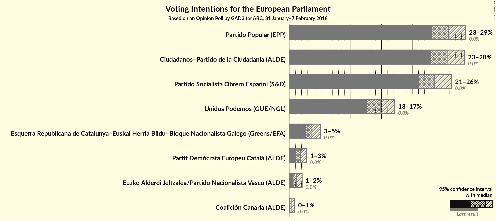

# Opinion Poll by GAD3 for ABC, 31 January–7 February 2018

<a href="#voting-intentions">Voting Intentions</a> | <a href="#seats">Seats</a> | <a href="#coalitions">Coalitions</a> | <a href="#technical-information">Technical Information</a>

## Voting Intentions

### Confidence Intervals

| Party | Last Result | Poll Result | 80% Confidence Interval | 90% Confidence Interval | 95% Confidence Interval | 99% Confidence Interval |
|:-----:|:-----------:|:-----------:|:-----------------------:|:-----------------------:|:-----------------------:|:-----------------------:|
| Partido Popular (EPP) | 0.0% | 25.8% | 24.1–27.7% |23.6–28.2% |23.2–28.7% |22.4–29.6% |
| Ciudadanos–Partido de la Ciudadanía (ALDE) | 0.0% | 25.6% | 23.9–27.5% |23.5–28.0% |23.0–28.5% |22.2–29.3% |
| Partido Socialista Obrero Español (S&D) | 0.0% | 23.7% | 22.0–25.4% |21.5–26.0% |21.1–26.4% |20.3–27.3% |
| Unidos Podemos (GUE/NGL) | 0.0% | 14.8% | 13.4–16.3% |13.0–16.7% |12.7–17.1% |12.1–17.9% |
| Esquerra Republicana de Catalunya–Euskal Herria Bildu–Bloque Nacionalista Galego (Greens/EFA) | 0.0% | 3.7% | N/A |N/A |N/A |N/A |
| Partit Demòcrata Europeu Català (ALDE) | 0.0% | 1.8% | 1.4–2.5% |1.2–2.7% |1.1–2.8% |1.0–3.2% |
| Euzko Alderdi Jeltzalea/Partido Nacionalista Vasco (ALDE) | 0.0% | 1.2% | 0.9–1.8% |0.8–1.9% |0.7–2.1% |0.5–2.4% |
| Coalición Canaria (ALDE) | 0.0% | 0.3% | 0.2–0.7% |0.1–0.8% |0.1–0.9% |0.1–1.1% |

*Note:* The poll result column reflects the actual value used in the calculations. Published results may vary slightly, and in addition be rounded to fewer digits.

## Seats

### Confidence Intervals

| Party | Last Result | Median | 80% Confidence Interval | 90% Confidence Interval | 95% Confidence Interval | 99% Confidence Interval |
|:-----:|:-----------:|:------:|:-----------------------:|:-----------------------:|:-----------------------:|:-----------------------:|
| <a href="#partido-popular-(epp)">Partido Popular (EPP)</a> | 0 | 16 | 15–17 |14–17 |14–18 |14–18 |
| <a href="#ciudadanos–partido-de-la-ciudadanía-(alde)">Ciudadanos–Partido de la Ciudadanía (ALDE)</a> | 0 | 16 | 15–17 |15–17 |14–18 |14–18 |
| <a href="#partido-socialista-obrero-español-(s&d)">Partido Socialista Obrero Español (S&D)</a> | 0 | 15 | 14–16 |13–16 |13–16 |12–17 |
| <a href="#unidos-podemos-(gue/ngl)">Unidos Podemos (GUE/NGL)</a> | 0 | 9 | 8–10 |8–10 |8–10 |7–11 |
| <a href="#esquerra-republicana-de-catalunya–euskal-herria-bildu–bloque-nacionalista-galego-(greens/efa)">Esquerra Republicana de Catalunya–Euskal Herria Bildu–Bloque Nacionalista Galego (Greens/EFA)</a> | 0 | N/A | N/A |N/A |N/A |N/A |
| <a href="#partit-demòcrata-europeu-català-(alde)">Partit Demòcrata Europeu Català (ALDE)</a> | 0 | 1 | 0–1 |0–1 |0–1 |0–1 |
| <a href="#euzko-alderdi-jeltzalea/partido-nacionalista-vasco-(alde)">Euzko Alderdi Jeltzalea/Partido Nacionalista Vasco (ALDE)</a> | 0 | 0 | 0–1 |0–1 |0–1 |0–1 |
| <a href="#coalición-canaria-(alde)">Coalición Canaria (ALDE)</a> | 0 | 0 | 0 |0 |0 |0 |

