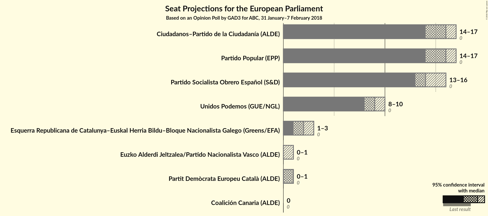
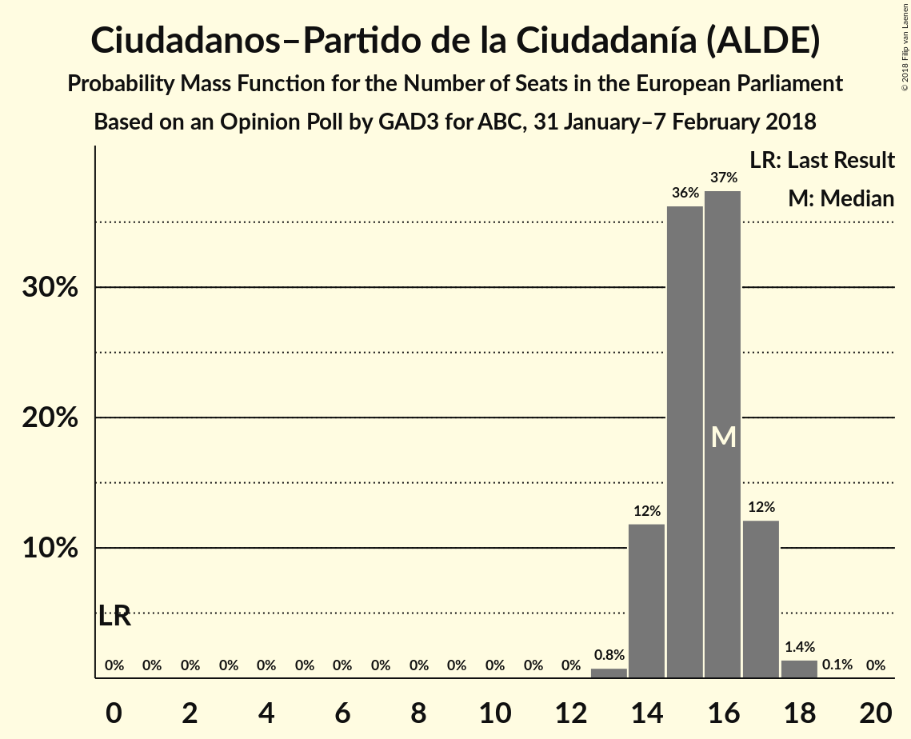
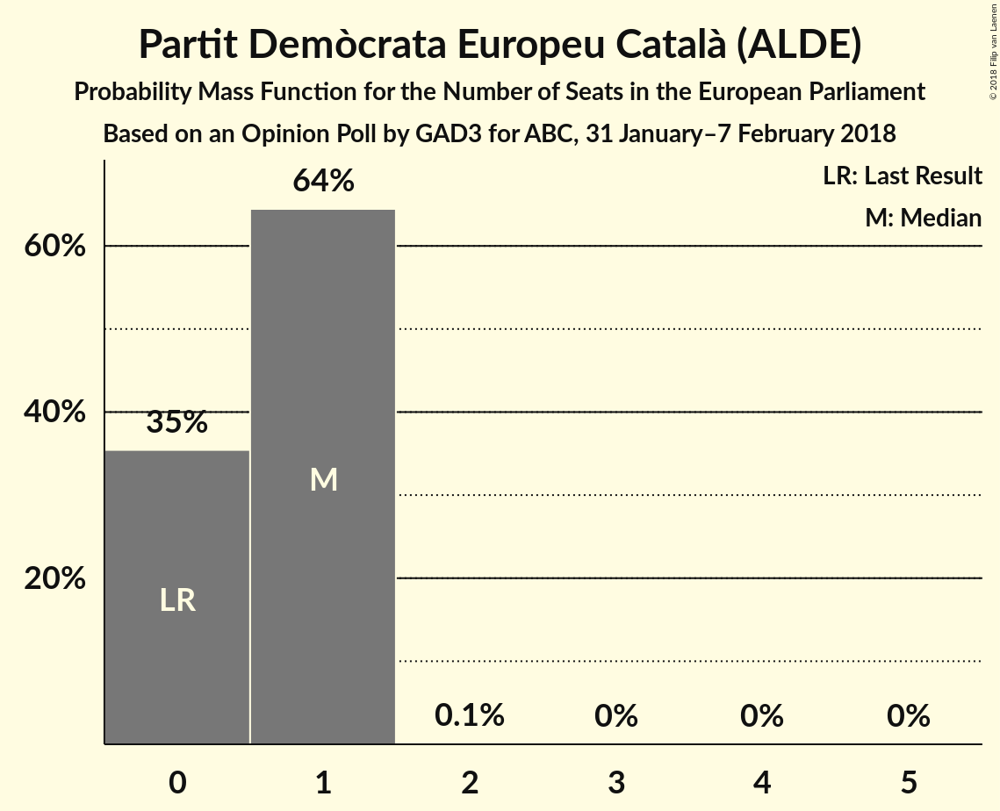
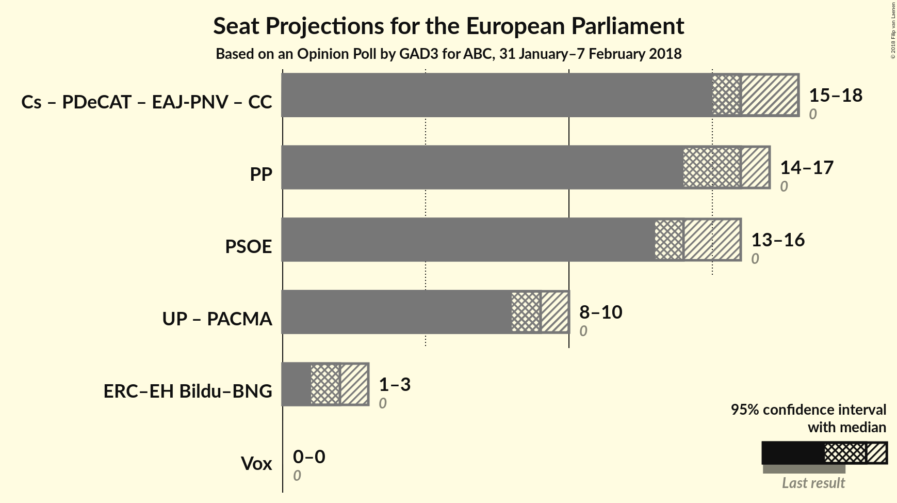

# Opinion Poll by GAD3 for ABC, 31 January–7 February 2018

<a href="#voting-intentions">Voting Intentions</a> | <a href="#seats">Seats</a> | <a href="#coalitions">Coalitions</a> | <a href="#technical-information">Technical Information</a>

## Voting Intentions

### Confidence Intervals

| Party | Last Result | Poll Result | 80% Confidence Interval | 90% Confidence Interval | 95% Confidence Interval | 99% Confidence Interval |
|:-----:|:-----------:|:-----------:|:-----------------------:|:-----------------------:|:-----------------------:|:-----------------------:|
| Partido Popular (EPP) | 0.0% | 25.8% | 24.1–27.7% |23.6–28.2% |23.2–28.7% |22.4–29.6% |
| Ciudadanos–Partido de la Ciudadanía (ALDE) | 0.0% | 25.6% | 23.9–27.5% |23.5–28.0% |23.0–28.5% |22.2–29.3% |
| Partido Socialista Obrero Español (S&D) | 0.0% | 23.7% | 22.0–25.4% |21.5–26.0% |21.1–26.4% |20.3–27.3% |
| Unidos Podemos (GUE/NGL) | 0.0% | 14.8% | 13.4–16.3% |13.0–16.7% |12.7–17.1% |12.1–17.9% |
| Esquerra Republicana de Catalunya–Euskal Herria Bildu–Bloque Nacionalista Galego (Greens/EFA) | 0.0% | 3.7% | 3.0–4.6% |2.8–4.8% |2.7–5.1% |2.4–5.5% |
| Partit Demòcrata Europeu Català (ALDE) | 0.0% | 1.8% | 1.4–2.5% |1.2–2.7% |1.1–2.8% |1.0–3.2% |
| Euzko Alderdi Jeltzalea/Partido Nacionalista Vasco (ALDE) | 0.0% | 1.2% | 0.9–1.8% |0.8–1.9% |0.7–2.1% |0.5–2.4% |
| Coalición Canaria (ALDE) | 0.0% | 0.3% | 0.2–0.7% |0.1–0.8% |0.1–0.9% |0.1–1.1% |

*Note:* The poll result column reflects the actual value used in the calculations. Published results may vary slightly, and in addition be rounded to fewer digits.

## Seats

### Confidence Intervals

| Party | Last Result | Median | 80% Confidence Interval | 90% Confidence Interval | 95% Confidence Interval | 99% Confidence Interval |
|:-----:|:-----------:|:------:|:-----------------------:|:-----------------------:|:-----------------------:|:-----------------------:|
| <a href="#partido-popular-(epp)">Partido Popular (EPP)</a> | 0 | 16 | 15–17 |14–17 |14–17 |13–18 |
| <a href="#ciudadanos–partido-de-la-ciudadanía-(alde)">Ciudadanos–Partido de la Ciudadanía (ALDE)</a> | 0 | 16 | 14–17 |14–17 |14–17 |13–18 |
| <a href="#partido-socialista-obrero-español-(s&d)">Partido Socialista Obrero Español (S&D)</a> | 0 | 14 | 13–15 |13–16 |13–16 |12–16 |
| <a href="#unidos-podemos-(gue/ngl)">Unidos Podemos (GUE/NGL)</a> | 0 | 9 | 8–10 |8–10 |8–10 |7–11 |
| <a href="#esquerra-republicana-de-catalunya–euskal-herria-bildu–bloque-nacionalista-galego-(greens/efa)">Esquerra Republicana de Catalunya–Euskal Herria Bildu–Bloque Nacionalista Galego (Greens/EFA)</a> | 0 | 2 | 2 |1–3 |1–3 |1–3 |
| <a href="#partit-demòcrata-europeu-català-(alde)">Partit Demòcrata Europeu Català (ALDE)</a> | 0 | 1 | 0–1 |0–1 |0–1 |0–1 |
| <a href="#euzko-alderdi-jeltzalea/partido-nacionalista-vasco-(alde)">Euzko Alderdi Jeltzalea/Partido Nacionalista Vasco (ALDE)</a> | 0 | 0 | 0–1 |0–1 |0–1 |0–1 |
| <a href="#coalición-canaria-(alde)">Coalición Canaria (ALDE)</a> | 0 | 0 | 0 |0 |0 |0 |

### Partido Popular (EPP)

*For a full overview of the results for this party, see the [Partido Popular (EPP)](party-partidopopularepp.html) page.*

| Number of Seats | Probability | Accumulated | Special Marks |
|:---------------:|:-----------:|:-----------:|:-------------:|
| 0 | 0% | 100% | Last Result |
| 1 | 0% | 100% |  |
| 2 | 0% | 100% |  |
| 3 | 0% | 100% |  |
| 4 | 0% | 100% |  |
| 5 | 0% | 100% |  |
| 6 | 0% | 100% |  |
| 7 | 0% | 100% |  |
| 8 | 0% | 100% |  |
| 9 | 0% | 100% |  |
| 10 | 0% | 100% |  |
| 11 | 0% | 100% |  |
| 12 | 0% | 100% |  |
| 13 | 0.5% | 100% |  |
| 14 | 8% | 99.5% |  |
| 15 | 36% | 91% |  |
| 16 | 40% | 55% | Median |
| 17 | 13% | 15% |  |
| 18 | 2% | 2% |  |
| 19 | 0.1% | 0.1% |  |
| 20 | 0% | 0% |  |

### Ciudadanos–Partido de la Ciudadanía (ALDE)

*For a full overview of the results for this party, see the [Ciudadanos–Partido de la Ciudadanía (ALDE)](party-ciudadanos–partidodelaciudadaníaalde.html) page.*

| Number of Seats | Probability | Accumulated | Special Marks |
|:---------------:|:-----------:|:-----------:|:-------------:|
| 0 | 0% | 100% | Last Result |
| 1 | 0% | 100% |  |
| 2 | 0% | 100% |  |
| 3 | 0% | 100% |  |
| 4 | 0% | 100% |  |
| 5 | 0% | 100% |  |
| 6 | 0% | 100% |  |
| 7 | 0% | 100% |  |
| 8 | 0% | 100% |  |
| 9 | 0% | 100% |  |
| 10 | 0% | 100% |  |
| 11 | 0% | 100% |  |
| 12 | 0% | 100% |  |
| 13 | 0.8% | 100% |  |
| 14 | 12% | 99.2% |  |
| 15 | 36% | 87% |  |
| 16 | 37% | 51% | Median |
| 17 | 12% | 14% |  |
| 18 | 1.4% | 1.5% |  |
| 19 | 0.1% | 0.1% |  |
| 20 | 0% | 0% |  |

### Partido Socialista Obrero Español (S&D)

*For a full overview of the results for this party, see the [Partido Socialista Obrero Español (S&D)](party-partidosocialistaobreroespañolsd.html) page.*

| Number of Seats | Probability | Accumulated | Special Marks |
|:---------------:|:-----------:|:-----------:|:-------------:|
| 0 | 0% | 100% | Last Result |
| 1 | 0% | 100% |  |
| 2 | 0% | 100% |  |
| 3 | 0% | 100% |  |
| 4 | 0% | 100% |  |
| 5 | 0% | 100% |  |
| 6 | 0% | 100% |  |
| 7 | 0% | 100% |  |
| 8 | 0% | 100% |  |
| 9 | 0% | 100% |  |
| 10 | 0% | 100% |  |
| 11 | 0% | 100% |  |
| 12 | 1.4% | 100% |  |
| 13 | 17% | 98.5% |  |
| 14 | 42% | 82% | Median |
| 15 | 33% | 40% |  |
| 16 | 6% | 7% |  |
| 17 | 0.4% | 0.4% |  |
| 18 | 0% | 0% |  |

### Unidos Podemos (GUE/NGL)

*For a full overview of the results for this party, see the [Unidos Podemos (GUE/NGL)](party-unidospodemosguengl.html) page.*

| Number of Seats | Probability | Accumulated | Special Marks |
|:---------------:|:-----------:|:-----------:|:-------------:|
| 0 | 0% | 100% | Last Result |
| 1 | 0% | 100% |  |
| 2 | 0% | 100% |  |
| 3 | 0% | 100% |  |
| 4 | 0% | 100% |  |
| 5 | 0% | 100% |  |
| 6 | 0% | 100% |  |
| 7 | 2% | 100% |  |
| 8 | 27% | 98% |  |
| 9 | 54% | 71% | Median |
| 10 | 16% | 17% |  |
| 11 | 1.4% | 1.4% |  |
| 12 | 0% | 0% |  |

### Esquerra Republicana de Catalunya–Euskal Herria Bildu–Bloque Nacionalista Galego (Greens/EFA)

*For a full overview of the results for this party, see the [Esquerra Republicana de Catalunya–Euskal Herria Bildu–Bloque Nacionalista Galego (Greens/EFA)](party-esquerrarepublicanadecatalunya–euskalherriabildu–bloquenacionalistagalegogreensefa.html) page.*

| Number of Seats | Probability | Accumulated | Special Marks |
|:---------------:|:-----------:|:-----------:|:-------------:|
| 0 | 0% | 100% | Last Result |
| 1 | 8% | 100% |  |
| 2 | 83% | 92% | Median |
| 3 | 9% | 9% |  |
| 4 | 0% | 0% |  |

### Partit Demòcrata Europeu Català (ALDE)

*For a full overview of the results for this party, see the [Partit Demòcrata Europeu Català (ALDE)](party-partitdemòcrataeuropeucatalàalde.html) page.*

| Number of Seats | Probability | Accumulated | Special Marks |
|:---------------:|:-----------:|:-----------:|:-------------:|
| 0 | 35% | 100% | Last Result |
| 1 | 64% | 65% | Median |
| 2 | 0.1% | 0.1% |  |
| 3 | 0% | 0% |  |

### Euzko Alderdi Jeltzalea/Partido Nacionalista Vasco (ALDE)

*For a full overview of the results for this party, see the [Euzko Alderdi Jeltzalea/Partido Nacionalista Vasco (ALDE)](party-euzkoalderdijeltzaleapartidonacionalistavascoalde.html) page.*

| Number of Seats | Probability | Accumulated | Special Marks |
|:---------------:|:-----------:|:-----------:|:-------------:|
| 0 | 82% | 100% | Last Result, Median |
| 1 | 18% | 18% |  |
| 2 | 0% | 0% |  |

### Coalición Canaria (ALDE)

*For a full overview of the results for this party, see the [Coalición Canaria (ALDE)](party-coalicióncanariaalde.html) page.*

| Number of Seats | Probability | Accumulated | Special Marks |
|:---------------:|:-----------:|:-----------:|:-------------:|
| 0 | 100% | 100% | Last Result, Median |

## Coalitions

### Confidence Intervals

| Coalition | Last Result | Median | Majority? | 80% Confidence Interval | 90% Confidence Interval | 95% Confidence Interval | 99% Confidence Interval |
|:---------:|:-----------:|:------:|:---------:|:-----------------------:|:-----------------------:|:-----------------------:|:-----------------------:|
| Ciudadanos–Partido de la Ciudadanía (ALDE) – Partit Demòcrata Europeu Català (ALDE) – Euzko Alderdi Jeltzalea/Partido Nacionalista Vasco (ALDE) – Coalición Canaria (ALDE) | 0 | 16 | 0% | 15–18 | 15–18 | 15–18 | 14–19 |
| Partido Popular (EPP) | 0 | 16 | 0% | 15–17 | 14–17 | 14–17 | 13–18 |
| Partido Socialista Obrero Español (S&D) | 0 | 14 | 0% | 13–15 | 13–16 | 13–16 | 12–16 |
| Esquerra Republicana de Catalunya–Euskal Herria Bildu–Bloque Nacionalista Galego (Greens/EFA) | 0 | 2 | 0% | 2 | 1–3 | 1–3 | 1–3 |

### Ciudadanos–Partido de la Ciudadanía (ALDE) – Partit Demòcrata Europeu Català (ALDE) – Euzko Alderdi Jeltzalea/Partido Nacionalista Vasco (ALDE) – Coalición Canaria (ALDE)

| Number of Seats | Probability | Accumulated | Special Marks |
|:---------------:|:-----------:|:-----------:|:-------------:|
| 0 | 0% | 100% | Last Result |
| 1 | 0% | 100% |  |
| 2 | 0% | 100% |  |
| 3 | 0% | 100% |  |
| 4 | 0% | 100% |  |
| 5 | 0% | 100% |  |
| 6 | 0% | 100% |  |
| 7 | 0% | 100% |  |
| 8 | 0% | 100% |  |
| 9 | 0% | 100% |  |
| 10 | 0% | 100% |  |
| 11 | 0% | 100% |  |
| 12 | 0% | 100% |  |
| 13 | 0.1% | 100% |  |
| 14 | 2% | 99.9% |  |
| 15 | 15% | 98% |  |
| 16 | 41% | 83% |  |
| 17 | 32% | 42% | Median |
| 18 | 9% | 10% |  |
| 19 | 1.2% | 1.3% |  |
| 20 | 0.1% | 0.1% |  |
| 21 | 0% | 0% |  |

### Partido Popular (EPP)

| Number of Seats | Probability | Accumulated | Special Marks |
|:---------------:|:-----------:|:-----------:|:-------------:|
| 0 | 0% | 100% | Last Result |
| 1 | 0% | 100% |  |
| 2 | 0% | 100% |  |
| 3 | 0% | 100% |  |
| 4 | 0% | 100% |  |
| 5 | 0% | 100% |  |
| 6 | 0% | 100% |  |
| 7 | 0% | 100% |  |
| 8 | 0% | 100% |  |
| 9 | 0% | 100% |  |
| 10 | 0% | 100% |  |
| 11 | 0% | 100% |  |
| 12 | 0% | 100% |  |
| 13 | 0.5% | 100% |  |
| 14 | 8% | 99.5% |  |
| 15 | 36% | 91% |  |
| 16 | 40% | 55% | Median |
| 17 | 13% | 15% |  |
| 18 | 2% | 2% |  |
| 19 | 0.1% | 0.1% |  |
| 20 | 0% | 0% |  |

### Partido Socialista Obrero Español (S&D)

| Number of Seats | Probability | Accumulated | Special Marks |
|:---------------:|:-----------:|:-----------:|:-------------:|
| 0 | 0% | 100% | Last Result |
| 1 | 0% | 100% |  |
| 2 | 0% | 100% |  |
| 3 | 0% | 100% |  |
| 4 | 0% | 100% |  |
| 5 | 0% | 100% |  |
| 6 | 0% | 100% |  |
| 7 | 0% | 100% |  |
| 8 | 0% | 100% |  |
| 9 | 0% | 100% |  |
| 10 | 0% | 100% |  |
| 11 | 0% | 100% |  |
| 12 | 1.4% | 100% |  |
| 13 | 17% | 98.5% |  |
| 14 | 42% | 82% | Median |
| 15 | 33% | 40% |  |
| 16 | 6% | 7% |  |
| 17 | 0.4% | 0.4% |  |
| 18 | 0% | 0% |  |

### Esquerra Republicana de Catalunya–Euskal Herria Bildu–Bloque Nacionalista Galego (Greens/EFA)

| Number of Seats | Probability | Accumulated | Special Marks |
|:---------------:|:-----------:|:-----------:|:-------------:|
| 0 | 0% | 100% | Last Result |
| 1 | 8% | 100% |  |
| 2 | 83% | 92% | Median |
| 3 | 9% | 9% |  |
| 4 | 0% | 0% |  |

## Technical Information

### Opinion Poll

+ **Polling firm:** GAD3
+ **Commissioner(s):** ABC
+ **Fieldwork period:** 31 January–7 February 2018

### Calculations

+ **Sample size:** 1002
+ **Simulations done:** 1,048,576
+ **Error estimate:** 1.33%

