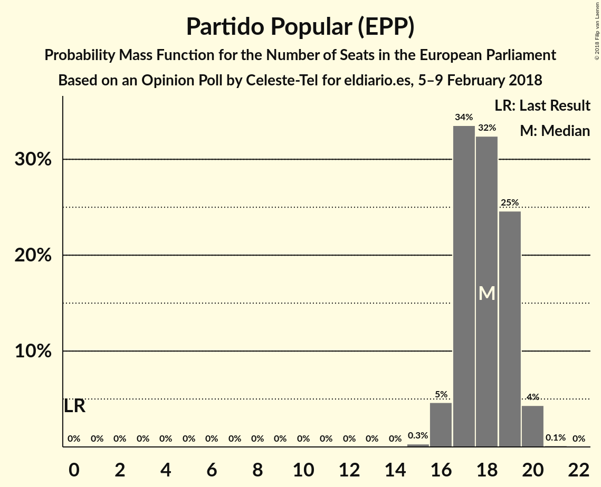
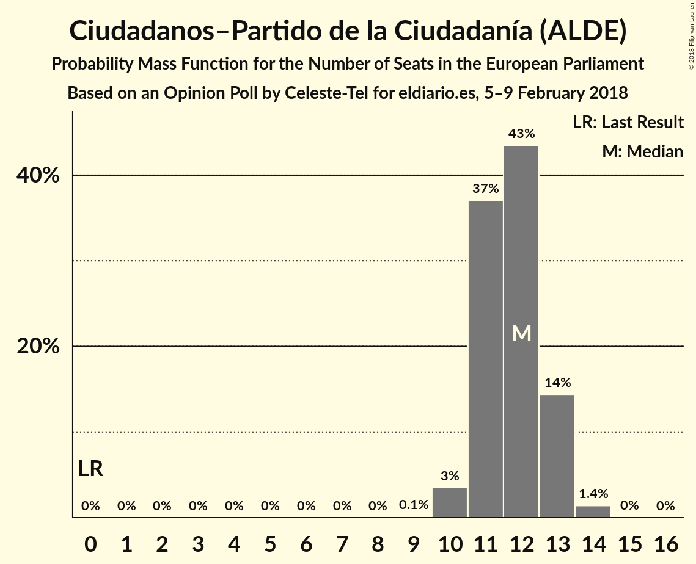
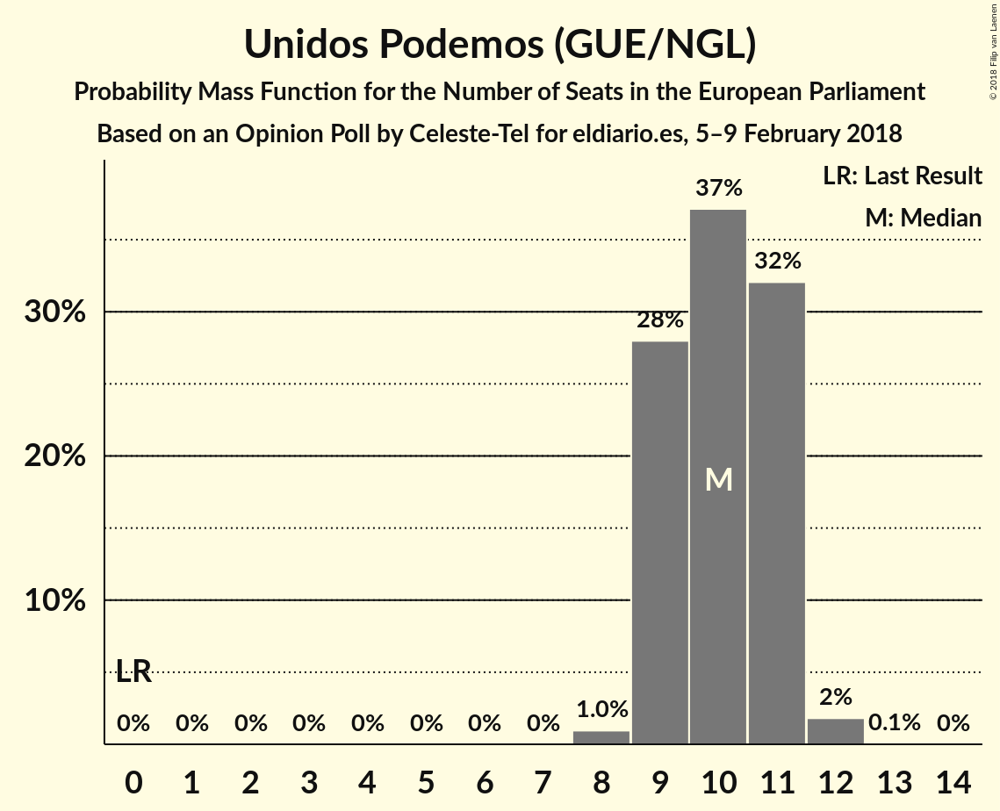
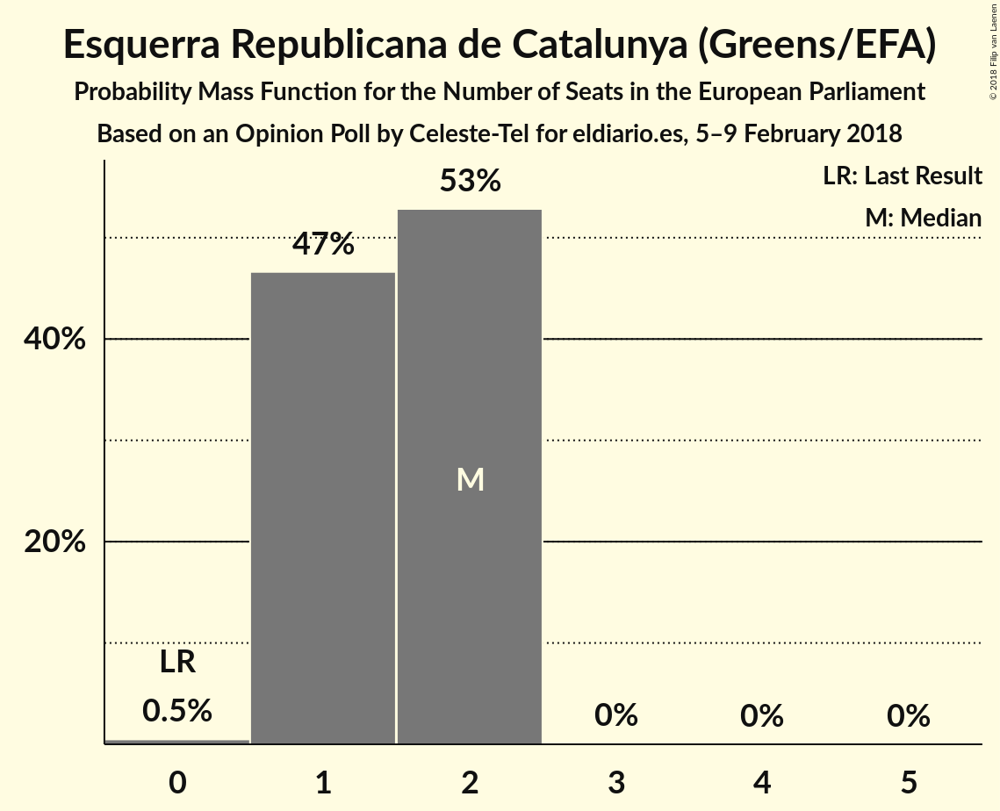
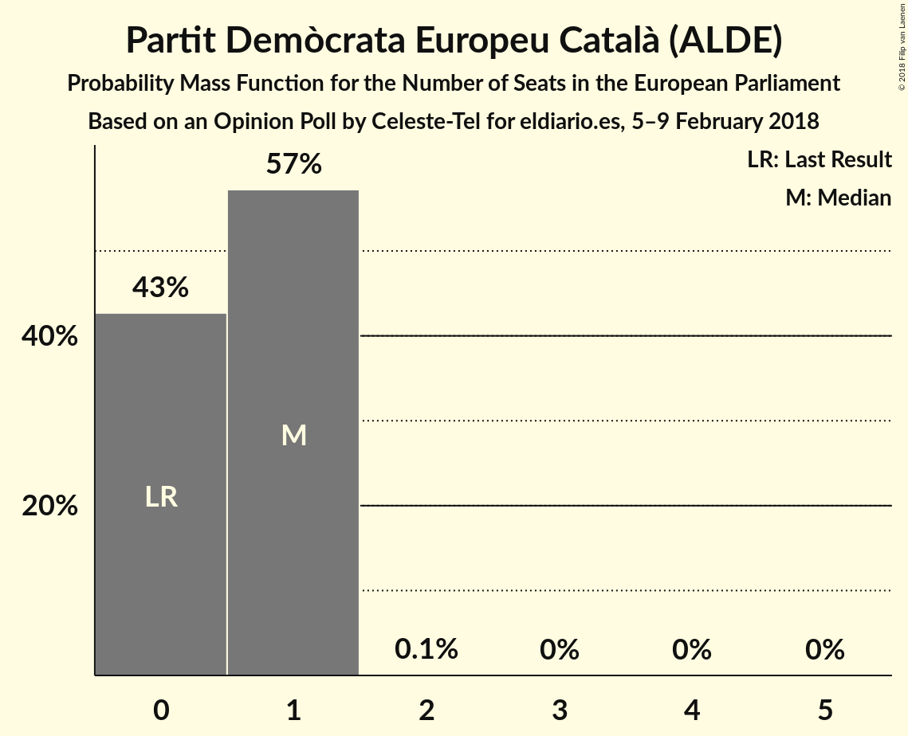
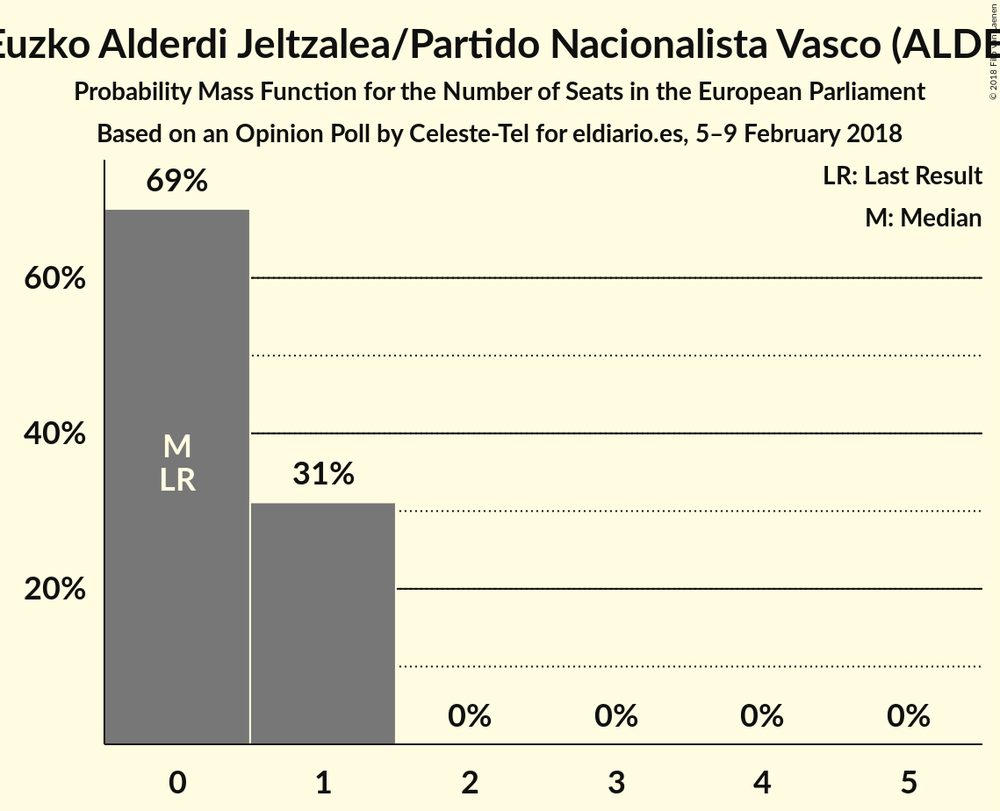
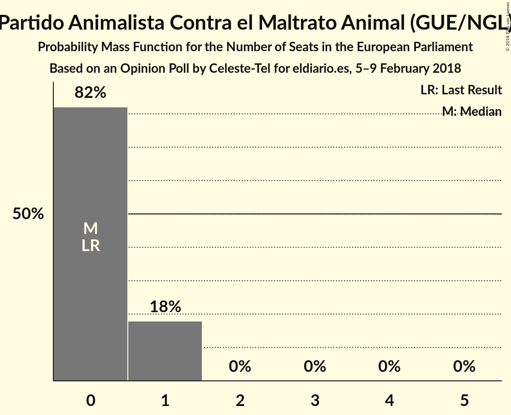
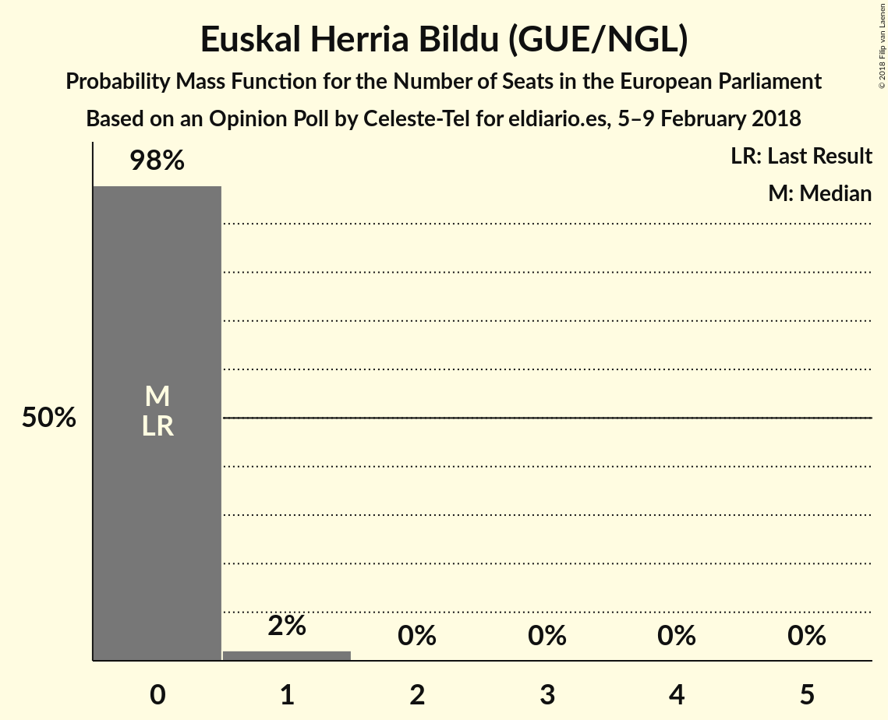
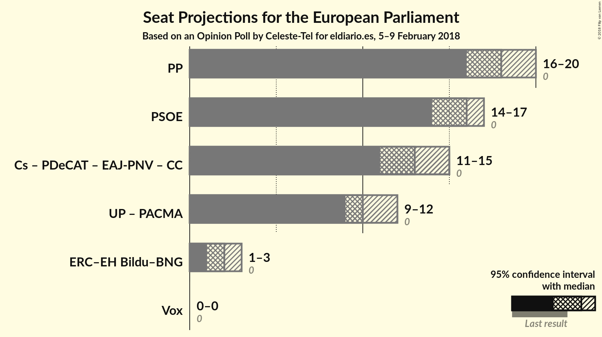

# Opinion Poll by Celeste-Tel for eldiario.es, 5–9 February 2018

<a href="#voting-intentions">Voting Intentions</a> | <a href="#seats">Seats</a> | <a href="#coalitions">Coalitions</a> | <a href="#technical-information">Technical Information</a>

## Voting Intentions

### Confidence Intervals

| Party | Last Result | Poll Result | 80% Confidence Interval | 90% Confidence Interval | 95% Confidence Interval | 99% Confidence Interval |
|:-----:|:-----------:|:-----------:|:-----------------------:|:-----------------------:|:-----------------------:|:-----------------------:|
| Partido Popular (EPP) | 0.0% | 28.9% | 27.2–30.7% |26.7–31.2% |26.3–31.7% |25.5–32.5% |
| Partido Socialista Obrero Español (S&D) | 0.0% | 25.5% | 23.9–27.3% |23.4–27.8% |23.0–28.2% |22.3–29.1% |
| Ciudadanos–Partido de la Ciudadanía (ALDE) | 0.0% | 19.3% | 17.8–20.9% |17.4–21.3% |17.0–21.7% |16.4–22.5% |
| Unidos Podemos (GUE/NGL) | 0.0% | 16.5% | 15.2–18.1% |14.8–18.5% |14.5–18.9% |13.8–19.6% |
| Esquerra Republicana de Catalunya (Greens/EFA) | 0.0% | 2.7% | 2.2–3.5% |2.0–3.7% |1.9–3.9% |1.7–4.3% |
| Partit Demòcrata Europeu Català (ALDE) | 0.0% | 1.6% | 1.2–2.3% |1.1–2.4% |1.0–2.6% |0.9–2.9% |
| Euzko Alderdi Jeltzalea/Partido Nacionalista Vasco (ALDE) | 0.0% | 1.3% | 0.9–1.8% |0.8–2.0% |0.8–2.1% |0.6–2.4% |
| Partido Animalista Contra el Maltrato Animal (GUE/NGL) | 0.0% | 1.2% | 0.9–1.7% |0.8–1.9% |0.7–2.0% |0.6–2.3% |
| Euskal Herria Bildu (GUE/NGL) | 0.0% | 0.9% | 0.6–1.4% |0.5–1.5% |0.5–1.7% |0.4–1.9% |
| Coalición Canaria (ALDE) | 0.0% | 0.3% | 0.2–0.6% |0.1–0.7% |0.1–0.8% |0.1–1.0% |
| Bloque Nacionalista Galego (Greens/EFA) | 0.0% | 0.2% | 0.1–0.5% |0.1–0.6% |0.0–0.7% |0.0–0.9% |

*Note:* The poll result column reflects the actual value used in the calculations. Published results may vary slightly, and in addition be rounded to fewer digits.

## Seats

### Confidence Intervals

| Party | Last Result | Median | 80% Confidence Interval | 90% Confidence Interval | 95% Confidence Interval | 99% Confidence Interval |
|:-----:|:-----------:|:------:|:-----------------------:|:-----------------------:|:-----------------------:|:-----------------------:|
| <a href="#partido-popular-(epp)">Partido Popular (EPP)</a> | 0 | 17 | 17–19 |16–19 |16–20 |16–20 |
| <a href="#partido-socialista-obrero-español-(s&d)">Partido Socialista Obrero Español (S&D)</a> | 0 | 15 | 15–17 |14–17 |14–18 |14–18 |
| <a href="#ciudadanos–partido-de-la-ciudadanía-(alde)">Ciudadanos–Partido de la Ciudadanía (ALDE)</a> | 0 | 12 | 11–13 |10–13 |10–14 |10–14 |
| <a href="#unidos-podemos-(gue/ngl)">Unidos Podemos (GUE/NGL)</a> | 0 | 11 | 9–11 |9–12 |9–12 |8–12 |
| <a href="#esquerra-republicana-de-catalunya-(greens/efa)">Esquerra Republicana de Catalunya (Greens/EFA)</a> | 0 | 2 | 1–2 |1–2 |1–2 |1–2 |
| <a href="#partit-demòcrata-europeu-català-(alde)">Partit Demòcrata Europeu Català (ALDE)</a> | 0 | 1 | 0–1 |0–1 |0–1 |0–1 |
| <a href="#euzko-alderdi-jeltzalea/partido-nacionalista-vasco-(alde)">Euzko Alderdi Jeltzalea/Partido Nacionalista Vasco (ALDE)</a> | 0 | 0 | 0–1 |0–1 |0–1 |0–1 |
| <a href="#partido-animalista-contra-el-maltrato-animal-(gue/ngl)">Partido Animalista Contra el Maltrato Animal (GUE/NGL)</a> | 0 | 0 | 0–1 |0–1 |0–1 |0–1 |
| <a href="#euskal-herria-bildu-(gue/ngl)">Euskal Herria Bildu (GUE/NGL)</a> | 0 | 0 | 0 |0 |0 |0–1 |
| <a href="#coalición-canaria-(alde)">Coalición Canaria (ALDE)</a> | 0 | 0 | 0 |0 |0 |0 |
| <a href="#bloque-nacionalista-galego-(greens/efa)">Bloque Nacionalista Galego (Greens/EFA)</a> | 0 | 0 | 0 |0 |0 |0 |

### Partido Popular (EPP)

*For a full overview of the results for this party, see the [Partido Popular (EPP)](party-partidopopularepp.html) page.*

| Number of Seats | Probability | Accumulated | Special Marks |
|:---------------:|:-----------:|:-----------:|:-------------:|
| 0 | 0% | 100% | Last Result |
| 1 | 0% | 100% |  |
| 2 | 0% | 100% |  |
| 3 | 0% | 100% |  |
| 4 | 0% | 100% |  |
| 5 | 0% | 100% |  |
| 6 | 0% | 100% |  |
| 7 | 0% | 100% |  |
| 8 | 0% | 100% |  |
| 9 | 0% | 100% |  |
| 10 | 0% | 100% |  |
| 11 | 0% | 100% |  |
| 12 | 0% | 100% |  |
| 13 | 0% | 100% |  |
| 14 | 0% | 100% |  |
| 15 | 0.2% | 100% |  |
| 16 | 7% | 99.8% |  |
| 17 | 54% | 93% | Median |
| 18 | 25% | 39% |  |
| 19 | 9% | 14% |  |
| 20 | 5% | 5% |  |
| 21 | 0.2% | 0.2% |  |
| 22 | 0% | 0% |  |

### Partido Socialista Obrero Español (S&D)

*For a full overview of the results for this party, see the [Partido Socialista Obrero Español (S&D)](party-partidosocialistaobreroespañolsd.html) page.*

| Number of Seats | Probability | Accumulated | Special Marks |
|:---------------:|:-----------:|:-----------:|:-------------:|
| 0 | 0% | 100% | Last Result |
| 1 | 0% | 100% |  |
| 2 | 0% | 100% |  |
| 3 | 0% | 100% |  |
| 4 | 0% | 100% |  |
| 5 | 0% | 100% |  |
| 6 | 0% | 100% |  |
| 7 | 0% | 100% |  |
| 8 | 0% | 100% |  |
| 9 | 0% | 100% |  |
| 10 | 0% | 100% |  |
| 11 | 0% | 100% |  |
| 12 | 0% | 100% |  |
| 13 | 0.1% | 100% |  |
| 14 | 8% | 99.9% |  |
| 15 | 50% | 92% | Median |
| 16 | 28% | 42% |  |
| 17 | 10% | 14% |  |
| 18 | 3% | 4% |  |
| 19 | 0.4% | 0.4% |  |
| 20 | 0% | 0% |  |

### Ciudadanos–Partido de la Ciudadanía (ALDE)

*For a full overview of the results for this party, see the [Ciudadanos–Partido de la Ciudadanía (ALDE)](party-ciudadanos–partidodelaciudadaníaalde.html) page.*

| Number of Seats | Probability | Accumulated | Special Marks |
|:---------------:|:-----------:|:-----------:|:-------------:|
| 0 | 0% | 100% | Last Result |
| 1 | 0% | 100% |  |
| 2 | 0% | 100% |  |
| 3 | 0% | 100% |  |
| 4 | 0% | 100% |  |
| 5 | 0% | 100% |  |
| 6 | 0% | 100% |  |
| 7 | 0% | 100% |  |
| 8 | 0% | 100% |  |
| 9 | 0.1% | 100% |  |
| 10 | 7% | 99.9% |  |
| 11 | 21% | 93% |  |
| 12 | 41% | 73% | Median |
| 13 | 30% | 32% |  |
| 14 | 2% | 3% |  |
| 15 | 0.1% | 0.1% |  |
| 16 | 0% | 0% |  |

### Unidos Podemos (GUE/NGL)

*For a full overview of the results for this party, see the [Unidos Podemos (GUE/NGL)](party-unidospodemosguengl.html) page.*

| Number of Seats | Probability | Accumulated | Special Marks |
|:---------------:|:-----------:|:-----------:|:-------------:|
| 0 | 0% | 100% | Last Result |
| 1 | 0% | 100% |  |
| 2 | 0% | 100% |  |
| 3 | 0% | 100% |  |
| 4 | 0% | 100% |  |
| 5 | 0% | 100% |  |
| 6 | 0% | 100% |  |
| 7 | 0% | 100% |  |
| 8 | 1.0% | 100% |  |
| 9 | 14% | 99.0% |  |
| 10 | 29% | 85% |  |
| 11 | 51% | 56% | Median |
| 12 | 5% | 5% |  |
| 13 | 0.1% | 0.1% |  |
| 14 | 0% | 0% |  |

### Esquerra Republicana de Catalunya (Greens/EFA)

*For a full overview of the results for this party, see the [Esquerra Republicana de Catalunya (Greens/EFA)](party-esquerrarepublicanadecatalunyagreensefa.html) page.*

| Number of Seats | Probability | Accumulated | Special Marks |
|:---------------:|:-----------:|:-----------:|:-------------:|
| 0 | 0.5% | 100% | Last Result |
| 1 | 47% | 99.5% |  |
| 2 | 53% | 53% | Median |
| 3 | 0% | 0% |  |

### Partit Demòcrata Europeu Català (ALDE)

*For a full overview of the results for this party, see the [Partit Demòcrata Europeu Català (ALDE)](party-partitdemòcrataeuropeucatalàalde.html) page.*

| Number of Seats | Probability | Accumulated | Special Marks |
|:---------------:|:-----------:|:-----------:|:-------------:|
| 0 | 22% | 100% | Last Result |
| 1 | 78% | 78% | Median |
| 2 | 0.4% | 0.4% |  |
| 3 | 0% | 0% |  |

### Euzko Alderdi Jeltzalea/Partido Nacionalista Vasco (ALDE)

*For a full overview of the results for this party, see the [Euzko Alderdi Jeltzalea/Partido Nacionalista Vasco (ALDE)](party-euzkoalderdijeltzaleapartidonacionalistavascoalde.html) page.*

| Number of Seats | Probability | Accumulated | Special Marks |
|:---------------:|:-----------:|:-----------:|:-------------:|
| 0 | 60% | 100% | Last Result, Median |
| 1 | 40% | 40% |  |
| 2 | 0% | 0% |  |

### Partido Animalista Contra el Maltrato Animal (GUE/NGL)

*For a full overview of the results for this party, see the [Partido Animalista Contra el Maltrato Animal (GUE/NGL)](party-partidoanimalistacontraelmaltratoanimalguengl.html) page.*

| Number of Seats | Probability | Accumulated | Special Marks |
|:---------------:|:-----------:|:-----------:|:-------------:|
| 0 | 82% | 100% | Last Result, Median |
| 1 | 18% | 18% |  |
| 2 | 0% | 0% |  |

### Euskal Herria Bildu (GUE/NGL)

*For a full overview of the results for this party, see the [Euskal Herria Bildu (GUE/NGL)](party-euskalherriabilduguengl.html) page.*

| Number of Seats | Probability | Accumulated | Special Marks |
|:---------------:|:-----------:|:-----------:|:-------------:|
| 0 | 98% | 100% | Last Result, Median |
| 1 | 2% | 2% |  |
| 2 | 0% | 0% |  |

### Coalición Canaria (ALDE)

*For a full overview of the results for this party, see the [Coalición Canaria (ALDE)](party-coalicióncanariaalde.html) page.*

| Number of Seats | Probability | Accumulated | Special Marks |
|:---------------:|:-----------:|:-----------:|:-------------:|
| 0 | 100% | 100% | Last Result, Median |

### Bloque Nacionalista Galego (Greens/EFA)

*For a full overview of the results for this party, see the [Bloque Nacionalista Galego (Greens/EFA)](party-bloquenacionalistagalegogreensefa.html) page.*

| Number of Seats | Probability | Accumulated | Special Marks |
|:---------------:|:-----------:|:-----------:|:-------------:|
| 0 | 100% | 100% | Last Result, Median |

## Coalitions

### Confidence Intervals

| Coalition | Last Result | Median | Majority? | 80% Confidence Interval | 90% Confidence Interval | 95% Confidence Interval | 99% Confidence Interval |
|:---------:|:-----------:|:------:|:---------:|:-----------------------:|:-----------------------:|:-----------------------:|:-----------------------:|
| Partido Popular (EPP) | 0 | 17 | 0% | 17–19 | 16–19 | 16–20 | 16–20 |
| Partido Socialista Obrero Español (S&D) | 0 | 15 | 0% | 15–17 | 14–17 | 14–18 | 14–18 |
| Ciudadanos–Partido de la Ciudadanía (ALDE) – Partit Demòcrata Europeu Català (ALDE) – Euzko Alderdi Jeltzalea/Partido Nacionalista Vasco (ALDE) – Coalición Canaria (ALDE) | 0 | 14 | 0% | 12–14 | 11–14 | 11–14 | 10–15 |
| Unidos Podemos (GUE/NGL) – Partido Animalista Contra el Maltrato Animal (GUE/NGL) – Euskal Herria Bildu (GUE/NGL) | 0 | 11 | 0% | 10–11 | 10–12 | 9–12 | 8–13 |
| Esquerra Republicana de Catalunya (Greens/EFA) – Bloque Nacionalista Galego (Greens/EFA) | 0 | 2 | 0% | 1–2 | 1–2 | 1–2 | 1–2 |

### Partido Popular (EPP)

| Number of Seats | Probability | Accumulated | Special Marks |
|:---------------:|:-----------:|:-----------:|:-------------:|
| 0 | 0% | 100% | Last Result |
| 1 | 0% | 100% |  |
| 2 | 0% | 100% |  |
| 3 | 0% | 100% |  |
| 4 | 0% | 100% |  |
| 5 | 0% | 100% |  |
| 6 | 0% | 100% |  |
| 7 | 0% | 100% |  |
| 8 | 0% | 100% |  |
| 9 | 0% | 100% |  |
| 10 | 0% | 100% |  |
| 11 | 0% | 100% |  |
| 12 | 0% | 100% |  |
| 13 | 0% | 100% |  |
| 14 | 0% | 100% |  |
| 15 | 0.2% | 100% |  |
| 16 | 7% | 99.8% |  |
| 17 | 54% | 93% | Median |
| 18 | 25% | 39% |  |
| 19 | 9% | 14% |  |
| 20 | 5% | 5% |  |
| 21 | 0.2% | 0.2% |  |
| 22 | 0% | 0% |  |

### Partido Socialista Obrero Español (S&D)

| Number of Seats | Probability | Accumulated | Special Marks |
|:---------------:|:-----------:|:-----------:|:-------------:|
| 0 | 0% | 100% | Last Result |
| 1 | 0% | 100% |  |
| 2 | 0% | 100% |  |
| 3 | 0% | 100% |  |
| 4 | 0% | 100% |  |
| 5 | 0% | 100% |  |
| 6 | 0% | 100% |  |
| 7 | 0% | 100% |  |
| 8 | 0% | 100% |  |
| 9 | 0% | 100% |  |
| 10 | 0% | 100% |  |
| 11 | 0% | 100% |  |
| 12 | 0% | 100% |  |
| 13 | 0.1% | 100% |  |
| 14 | 8% | 99.9% |  |
| 15 | 50% | 92% | Median |
| 16 | 28% | 42% |  |
| 17 | 10% | 14% |  |
| 18 | 3% | 4% |  |
| 19 | 0.4% | 0.4% |  |
| 20 | 0% | 0% |  |

### Ciudadanos–Partido de la Ciudadanía (ALDE) – Partit Demòcrata Europeu Català (ALDE) – Euzko Alderdi Jeltzalea/Partido Nacionalista Vasco (ALDE) – Coalición Canaria (ALDE)

| Number of Seats | Probability | Accumulated | Special Marks |
|:---------------:|:-----------:|:-----------:|:-------------:|
| 0 | 0% | 100% | Last Result |
| 1 | 0% | 100% |  |
| 2 | 0% | 100% |  |
| 3 | 0% | 100% |  |
| 4 | 0% | 100% |  |
| 5 | 0% | 100% |  |
| 6 | 0% | 100% |  |
| 7 | 0% | 100% |  |
| 8 | 0% | 100% |  |
| 9 | 0% | 100% |  |
| 10 | 0.6% | 100% |  |
| 11 | 7% | 99.4% |  |
| 12 | 23% | 92% |  |
| 13 | 15% | 70% | Median |
| 14 | 52% | 55% |  |
| 15 | 2% | 2% |  |
| 16 | 0.3% | 0.3% |  |
| 17 | 0% | 0% |  |

### Unidos Podemos (GUE/NGL) – Partido Animalista Contra el Maltrato Animal (GUE/NGL) – Euskal Herria Bildu (GUE/NGL)

| Number of Seats | Probability | Accumulated | Special Marks |
|:---------------:|:-----------:|:-----------:|:-------------:|
| 0 | 0% | 100% | Last Result |
| 1 | 0% | 100% |  |
| 2 | 0% | 100% |  |
| 3 | 0% | 100% |  |
| 4 | 0% | 100% |  |
| 5 | 0% | 100% |  |
| 6 | 0% | 100% |  |
| 7 | 0% | 100% |  |
| 8 | 0.6% | 100% |  |
| 9 | 4% | 99.4% |  |
| 10 | 34% | 96% |  |
| 11 | 55% | 62% | Median |
| 12 | 6% | 7% |  |
| 13 | 0.7% | 0.8% |  |
| 14 | 0% | 0% |  |

### Esquerra Republicana de Catalunya (Greens/EFA) – Bloque Nacionalista Galego (Greens/EFA)

| Number of Seats | Probability | Accumulated | Special Marks |
|:---------------:|:-----------:|:-----------:|:-------------:|
| 0 | 0.5% | 100% | Last Result |
| 1 | 47% | 99.5% |  |
| 2 | 53% | 53% | Median |
| 3 | 0% | 0% |  |

## Technical Information

### Opinion Poll

+ **Polling firm:** Celeste-Tel
+ **Commissioner(s):** eldiario.es
+ **Fieldwork period:** 5–9 February 2018

### Calculations

+ **Sample size:** 1100
+ **Simulations done:** 1,048,576
+ **Error estimate:** 1.37%

