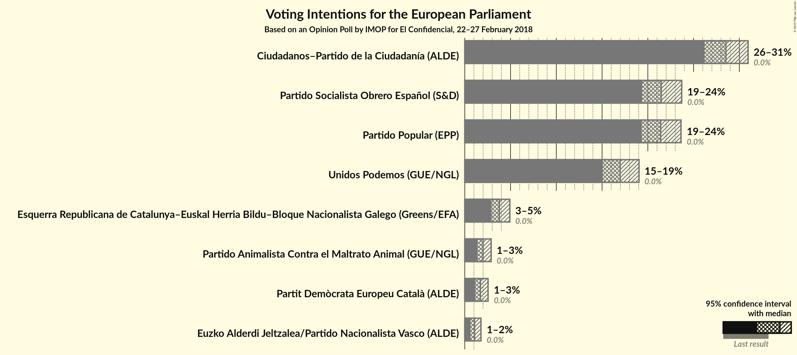

# Opinion Poll by IMOP for El Confidencial, 22–27 February 2018

<a href="#voting-intentions">Voting Intentions</a> | <a href="#seats">Seats</a> | <a href="#coalitions">Coalitions</a> | <a href="#technical-information">Technical Information</a>

## Voting Intentions

### Confidence Intervals

| Party | Last Result | Poll Result | 80% Confidence Interval | 90% Confidence Interval | 95% Confidence Interval | 99% Confidence Interval |
|:-----:|:-----------:|:-----------:|:-----------------------:|:-----------------------:|:-----------------------:|:-----------------------:|
| Ciudadanos–Partido de la Ciudadanía (ALDE) | 0.0% | 28.5% | 27.0–30.1% |26.6–30.6% |26.2–31.0% |25.5–31.7% |
| Partido Socialista Obrero Español (S&D) | 0.0% | 21.5% | 20.1–22.9% |19.7–23.4% |19.4–23.7% |18.8–24.4% |
| Partido Popular (EPP) | 0.0% | 21.4% | 20.0–22.9% |19.6–23.3% |19.3–23.6% |18.7–24.3% |
| Unidos Podemos (GUE/NGL) | 0.0% | 17.0% | 15.7–18.3% |15.4–18.7% |15.1–19.0% |14.5–19.7% |
| Esquerra Republicana de Catalunya (Greens/EFA) | 0.0% | 3.0% | 2.5–3.7% |2.3–3.9% |2.2–4.0% |2.0–4.4% |
| Partido Animalista Contra el Maltrato Animal (GUE/NGL) | 0.0% | 2.0% | N/A |N/A |N/A |N/A |
| Partit Demòcrata Europeu Català (ALDE) | 0.0% | 1.7% | 1.3–2.3% |1.2–2.4% |1.1–2.5% |1.0–2.8% |
| Euzko Alderdi Jeltzalea/Partido Nacionalista Vasco (ALDE) | 0.0% | 1.1% | 0.8–1.5% |0.7–1.6% |0.6–1.8% |0.5–2.0% |
| Euskal Herria Bildu (GUE/NGL) | 0.0% | 0.8% | 0.5–1.2% |0.5–1.3% |0.4–1.4% |0.4–1.6% |

*Note:* The poll result column reflects the actual value used in the calculations. Published results may vary slightly, and in addition be rounded to fewer digits.

## Seats

### Confidence Intervals

| Party | Last Result | Median | 80% Confidence Interval | 90% Confidence Interval | 95% Confidence Interval | 99% Confidence Interval |
|:-----:|:-----------:|:------:|:-----------------------:|:-----------------------:|:-----------------------:|:-----------------------:|
| <a href="#ciudadanos–partido-de-la-ciudadanía-(alde)">Ciudadanos–Partido de la Ciudadanía (ALDE)</a> | 0 | 18 | 17–19 |16–19 |16–19 |16–20 |
| <a href="#partido-socialista-obrero-español-(s&d)">Partido Socialista Obrero Español (S&D)</a> | 0 | 13 | 12–14 |12–14 |12–15 |11–15 |
| <a href="#partido-popular-(epp)">Partido Popular (EPP)</a> | 0 | 13 | 12–14 |12–14 |12–15 |11–15 |
| <a href="#unidos-podemos-(gue/ngl)">Unidos Podemos (GUE/NGL)</a> | 0 | 10 | 10–11 |9–11 |9–12 |9–12 |
| <a href="#esquerra-republicana-de-catalunya-(greens/efa)">Esquerra Republicana de Catalunya (Greens/EFA)</a> | 0 | 1 | 1–2 |1–2 |1–2 |1–2 |
| <a href="#partido-animalista-contra-el-maltrato-animal-(gue/ngl)">Partido Animalista Contra el Maltrato Animal (GUE/NGL)</a> | 0 | N/A | N/A |N/A |N/A |N/A |
| <a href="#partit-demòcrata-europeu-català-(alde)">Partit Demòcrata Europeu Català (ALDE)</a> | 0 | 1 | 0–1 |0–1 |0–1 |0–1 |
| <a href="#euzko-alderdi-jeltzalea/partido-nacionalista-vasco-(alde)">Euzko Alderdi Jeltzalea/Partido Nacionalista Vasco (ALDE)</a> | 0 | 0 | 0 |0–1 |0–1 |0–1 |
| <a href="#euskal-herria-bildu-(gue/ngl)">Euskal Herria Bildu (GUE/NGL)</a> | 0 | 0 | 0 |0 |0 |0–1 |

