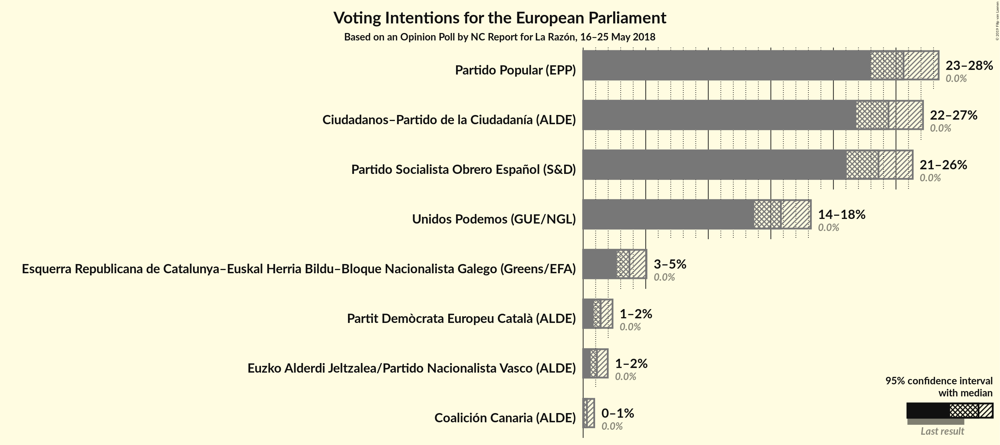
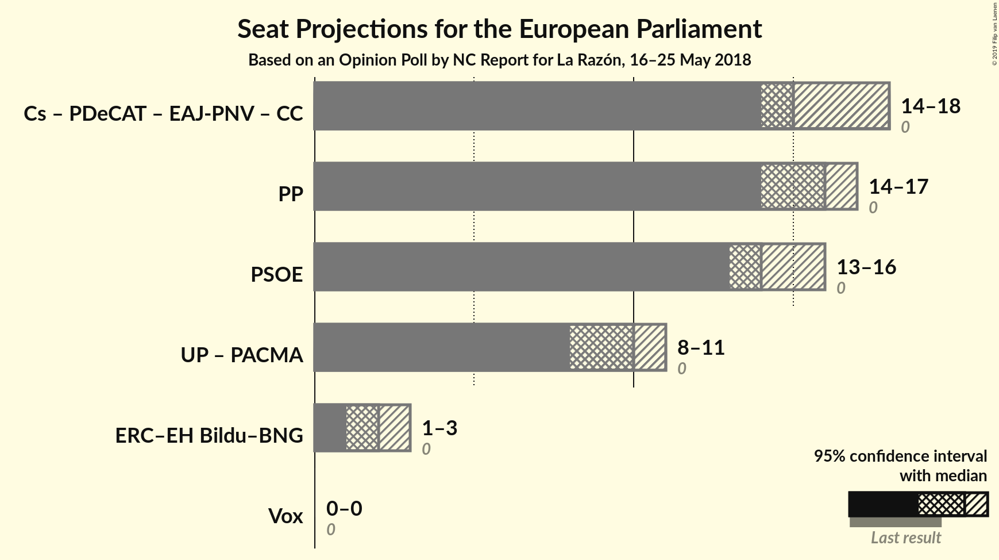

# Opinion Poll by NC Report for La Razón, 16–25 May 2018

<a href="#voting-intentions">Voting Intentions</a> | <a href="#seats">Seats</a> | <a href="#coalitions">Coalitions</a> | <a href="#technical-information">Technical Information</a>

## Voting Intentions

### Confidence Intervals

| Party | Last Result | Poll Result | 80% Confidence Interval | 90% Confidence Interval | 95% Confidence Interval | 99% Confidence Interval |
|:-----:|:-----------:|:-----------:|:-----------------------:|:-----------------------:|:-----------------------:|:-----------------------:|
| Partido Popular (EPP) | 0.0% | 25.6% | 23.9–27.4% |23.4–28.0% |23.0–28.4% |22.2–29.3% |
| Ciudadanos–Partido de la Ciudadanía (ALDE) | 0.0% | 24.4% | 22.7–26.2% |22.2–26.7% |21.8–27.2% |21.0–28.1% |
| Partido Socialista Obrero Español (S&D) | 0.0% | 23.6% | 21.9–25.4% |21.4–25.9% |21.0–26.3% |20.3–27.2% |
| Unidos Podemos (GUE/NGL) | 0.0% | 15.8% | 14.4–17.4% |14.0–17.8% |13.7–18.2% |13.0–19.0% |
| Esquerra Republicana de Catalunya (Greens/EFA) | 0.0% | 2.9% | 2.3–3.7% |2.1–3.9% |2.0–4.2% |1.8–4.6% |
| Partit Demòcrata Europeu Català (ALDE) | 0.0% | 1.4% | 1.0–2.0% |0.9–2.2% |0.8–2.4% |0.7–2.7% |
| Euzko Alderdi Jeltzalea/Partido Nacionalista Vasco (ALDE) | 0.0% | 1.1% | 0.8–1.7% |0.7–1.8% |0.6–2.0% |0.5–2.3% |
| Euskal Herria Bildu (GUE/NGL) | 0.0% | 0.8% | 0.5–1.3% |0.5–1.5% |0.4–1.6% |0.3–1.9% |
| Coalición Canaria (ALDE) | 0.0% | 0.3% | 0.1–0.7% |0.1–0.8% |0.1–0.9% |0.0–1.1% |

*Note:* The poll result column reflects the actual value used in the calculations. Published results may vary slightly, and in addition be rounded to fewer digits.

## Seats

### Confidence Intervals

| Party | Last Result | Median | 80% Confidence Interval | 90% Confidence Interval | 95% Confidence Interval | 99% Confidence Interval |
|:-----:|:-----------:|:------:|:-----------------------:|:-----------------------:|:-----------------------:|:-----------------------:|
| <a href="#partido-popular-(epp)">Partido Popular (EPP)</a> | 0 | N/A | N/A |N/A |N/A |N/A |
| <a href="#ciudadanos–partido-de-la-ciudadanía-(alde)">Ciudadanos–Partido de la Ciudadanía (ALDE)</a> | 0 | N/A | N/A |N/A |N/A |N/A |
| <a href="#partido-socialista-obrero-español-(s&d)">Partido Socialista Obrero Español (S&D)</a> | 0 | N/A | N/A |N/A |N/A |N/A |
| <a href="#unidos-podemos-(gue/ngl)">Unidos Podemos (GUE/NGL)</a> | 0 | N/A | N/A |N/A |N/A |N/A |
| <a href="#esquerra-republicana-de-catalunya-(greens/efa)">Esquerra Republicana de Catalunya (Greens/EFA)</a> | 0 | N/A | N/A |N/A |N/A |N/A |
| <a href="#partit-demòcrata-europeu-català-(alde)">Partit Demòcrata Europeu Català (ALDE)</a> | 0 | N/A | N/A |N/A |N/A |N/A |
| <a href="#euzko-alderdi-jeltzalea/partido-nacionalista-vasco-(alde)">Euzko Alderdi Jeltzalea/Partido Nacionalista Vasco (ALDE)</a> | 0 | N/A | N/A |N/A |N/A |N/A |
| <a href="#euskal-herria-bildu-(gue/ngl)">Euskal Herria Bildu (GUE/NGL)</a> | 0 | N/A | N/A |N/A |N/A |N/A |
| <a href="#coalición-canaria-(alde)">Coalición Canaria (ALDE)</a> | 0 | N/A | N/A |N/A |N/A |N/A |

## Coalitions

## Technical Information

### Opinion Poll

+ **Polling firm:** NC Report
+ **Commissioner(s):** La Razón
+ **Fieldwork period:** 16–25 May 2018

### Calculations

+ **Sample size:** 1000
+ **Simulations done:** 0
+ **Error estimate:** 100.00%

