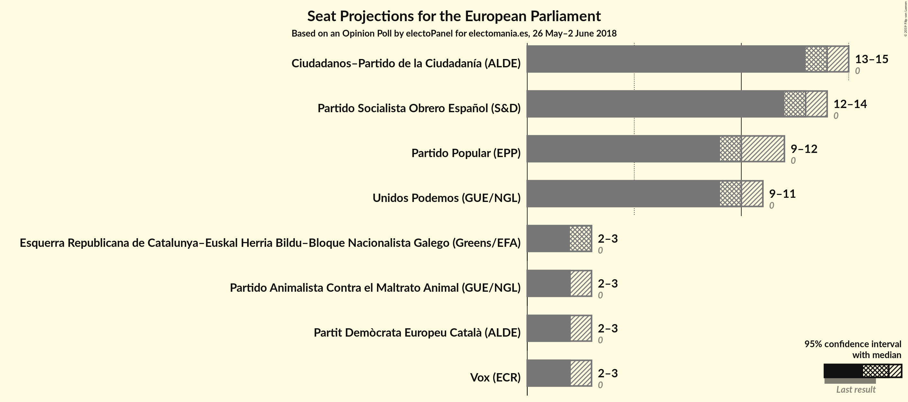

# Opinion Poll by electoPanel for electomania.es, 26 May–2 June 2018

<a href="#voting-intentions">Voting Intentions</a> | <a href="#seats">Seats</a> | <a href="#coalitions">Coalitions</a> | <a href="#technical-information">Technical Information</a>

## Voting Intentions

### Confidence Intervals

| Party | Last Result | Poll Result | 80% Confidence Interval | 90% Confidence Interval | 95% Confidence Interval | 99% Confidence Interval |
|:-----:|:-----------:|:-----------:|:-----------------------:|:-----------------------:|:-----------------------:|:-----------------------:|
| Ciudadanos–Partido de la Ciudadanía (ALDE) | 0.0% | 22.7% | 21.6–23.9% |21.2–24.3% |20.9–24.6% |20.4–25.2% |
| Partido Socialista Obrero Español (S&D) | 0.0% | 21.6% | 20.4–22.8% |20.1–23.1% |19.8–23.4% |19.3–24.0% |
| Partido Popular (EPP) | 0.0% | 17.2% | 16.1–18.3% |15.9–18.6% |15.6–18.9% |15.1–19.4% |
| Unidos Podemos (GUE/NGL) | 0.0% | 16.8% | 15.8–17.9% |15.5–18.2% |15.2–18.5% |14.7–19.0% |
| Esquerra Republicana de Catalunya–Euskal Herria Bildu–Bloque Nacionalista Galego (Greens/EFA) | 0.0% | 4.7% | N/A |N/A |N/A |N/A |
| Vox (ECR) | 0.0% | 4.6% | 4.1–5.3% |3.9–5.4% |3.8–5.6% |3.5–5.9% |
| Partido Animalista Contra el Maltrato Animal (GUE/NGL) | 0.0% | 4.2% | 3.7–4.8% |3.5–5.0% |3.4–5.2% |3.2–5.5% |
| Partit Demòcrata Europeu Català (ALDE) | 0.0% | 4.1% | 3.6–4.7% |3.4–4.9% |3.3–5.1% |3.1–5.4% |

*Note:* The poll result column reflects the actual value used in the calculations. Published results may vary slightly, and in addition be rounded to fewer digits.

## Seats

### Confidence Intervals

| Party | Last Result | Median | 80% Confidence Interval | 90% Confidence Interval | 95% Confidence Interval | 99% Confidence Interval |
|:-----:|:-----------:|:------:|:-----------------------:|:-----------------------:|:-----------------------:|:-----------------------:|
| <a href="#ciudadanos–partido-de-la-ciudadanía-(alde)">Ciudadanos–Partido de la Ciudadanía (ALDE)</a> | 0 | 14 | 13–15 |13–15 |13–15 |12–16 |
| <a href="#partido-socialista-obrero-español-(s&d)">Partido Socialista Obrero Español (S&D)</a> | 0 | 13 | 13–14 |12–14 |12–15 |12–15 |
| <a href="#partido-popular-(epp)">Partido Popular (EPP)</a> | 0 | 11 | 10–11 |10–12 |9–12 |9–12 |
| <a href="#unidos-podemos-(gue/ngl)">Unidos Podemos (GUE/NGL)</a> | 0 | 10 | 9–11 |9–11 |9–11 |9–12 |
| <a href="#esquerra-republicana-de-catalunya–euskal-herria-bildu–bloque-nacionalista-galego-(greens/efa)">Esquerra Republicana de Catalunya–Euskal Herria Bildu–Bloque Nacionalista Galego (Greens/EFA)</a> | 0 | N/A | N/A |N/A |N/A |N/A |
| <a href="#vox-(ecr)">Vox (ECR)</a> | 0 | 2 | 2–3 |2–3 |2–3 |2–3 |
| <a href="#partido-animalista-contra-el-maltrato-animal-(gue/ngl)">Partido Animalista Contra el Maltrato Animal (GUE/NGL)</a> | 0 | 2 | 2–3 |2–3 |2–3 |2–3 |
| <a href="#partit-demòcrata-europeu-català-(alde)">Partit Demòcrata Europeu Català (ALDE)</a> | 0 | 2 | 2–3 |2–3 |2–3 |1–3 |

