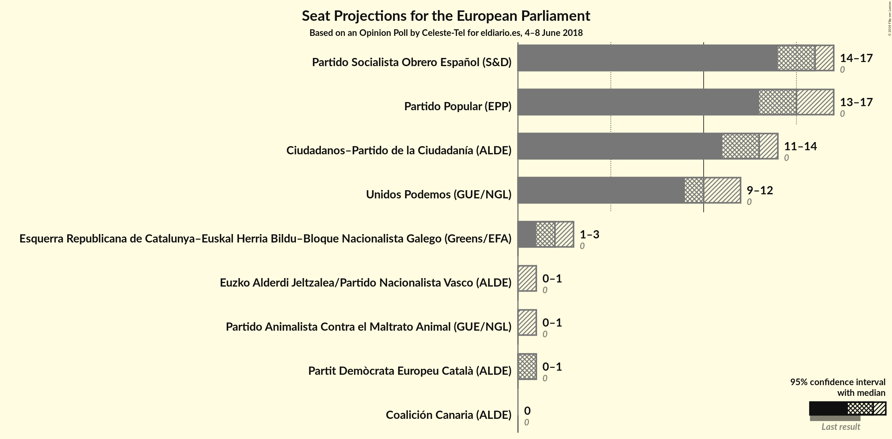

# Opinion Poll by Celeste-Tel for eldiario.es, 4–8 June 2018

<a href="#voting-intentions">Voting Intentions</a> | <a href="#seats">Seats</a> | <a href="#coalitions">Coalitions</a> | <a href="#technical-information">Technical Information</a>

## Voting Intentions

### Confidence Intervals

| Party | Last Result | Poll Result | 80% Confidence Interval | 90% Confidence Interval | 95% Confidence Interval | 99% Confidence Interval |
|:-----:|:-----------:|:-----------:|:-----------------------:|:-----------------------:|:-----------------------:|:-----------------------:|
| Partido Socialista Obrero Español (S&D) | 0.0% | 25.8% | 24.2–27.6% |23.7–28.1% |23.3–28.5% |22.5–29.3% |
| Partido Popular (EPP) | 0.0% | 24.3% | 22.7–26.0% |22.2–26.5% |21.8–26.9% |21.1–27.7% |
| Ciudadanos–Partido de la Ciudadanía (ALDE) | 0.0% | 21.1% | 19.6–22.7% |19.1–23.2% |18.8–23.6% |18.1–24.4% |
| Unidos Podemos (GUE/NGL) | 0.0% | 17.4% | 16.0–18.9% |15.6–19.3% |15.2–19.7% |14.6–20.5% |
| Esquerra Republicana de Catalunya (Greens/EFA) | 0.0% | 3.0% | 2.4–3.8% |2.3–4.0% |2.1–4.2% |1.9–4.6% |
| Partit Demòcrata Europeu Català (ALDE) | 0.0% | 1.5% | 1.2–2.1% |1.1–2.3% |1.0–2.5% |0.8–2.8% |
| Partido Animalista Contra el Maltrato Animal (GUE/NGL) | 0.0% | 1.3% | N/A |N/A |N/A |N/A |
| Euzko Alderdi Jeltzalea/Partido Nacionalista Vasco (ALDE) | 0.0% | 1.2% | 0.9–1.7% |0.8–1.9% |0.7–2.0% |0.6–2.3% |
| Euskal Herria Bildu (GUE/NGL) | 0.0% | 0.9% | N/A |N/A |N/A |N/A |
| Coalición Canaria (ALDE) | 0.0% | 0.3% | N/A |N/A |N/A |N/A |
| Bloque Nacionalista Galego (Greens/EFA) | 0.0% | 0.2% | N/A |N/A |N/A |N/A |

*Note:* The poll result column reflects the actual value used in the calculations. Published results may vary slightly, and in addition be rounded to fewer digits.

## Seats

### Confidence Intervals

| Party | Last Result | Median | 80% Confidence Interval | 90% Confidence Interval | 95% Confidence Interval | 99% Confidence Interval |
|:-----:|:-----------:|:------:|:-----------------------:|:-----------------------:|:-----------------------:|:-----------------------:|
| <a href="#partido-socialista-obrero-español-(s&d)">Partido Socialista Obrero Español (S&D)</a> | 0 | N/A | N/A |N/A |N/A |N/A |
| <a href="#partido-popular-(epp)">Partido Popular (EPP)</a> | 0 | N/A | N/A |N/A |N/A |N/A |
| <a href="#ciudadanos–partido-de-la-ciudadanía-(alde)">Ciudadanos–Partido de la Ciudadanía (ALDE)</a> | 0 | N/A | N/A |N/A |N/A |N/A |
| <a href="#unidos-podemos-(gue/ngl)">Unidos Podemos (GUE/NGL)</a> | 0 | N/A | N/A |N/A |N/A |N/A |
| <a href="#esquerra-republicana-de-catalunya-(greens/efa)">Esquerra Republicana de Catalunya (Greens/EFA)</a> | 0 | N/A | N/A |N/A |N/A |N/A |
| <a href="#partit-demòcrata-europeu-català-(alde)">Partit Demòcrata Europeu Català (ALDE)</a> | 0 | N/A | N/A |N/A |N/A |N/A |
| <a href="#partido-animalista-contra-el-maltrato-animal-(gue/ngl)">Partido Animalista Contra el Maltrato Animal (GUE/NGL)</a> | 0 | N/A | N/A |N/A |N/A |N/A |
| <a href="#euzko-alderdi-jeltzalea/partido-nacionalista-vasco-(alde)">Euzko Alderdi Jeltzalea/Partido Nacionalista Vasco (ALDE)</a> | 0 | N/A | N/A |N/A |N/A |N/A |
| <a href="#euskal-herria-bildu-(gue/ngl)">Euskal Herria Bildu (GUE/NGL)</a> | 0 | N/A | N/A |N/A |N/A |N/A |
| <a href="#coalición-canaria-(alde)">Coalición Canaria (ALDE)</a> | 0 | N/A | N/A |N/A |N/A |N/A |
| <a href="#bloque-nacionalista-galego-(greens/efa)">Bloque Nacionalista Galego (Greens/EFA)</a> | 0 | N/A | N/A |N/A |N/A |N/A |

## Coalitions

## Technical Information

### Opinion Poll

+ **Polling firm:** Celeste-Tel
+ **Commissioner(s):** eldiario.es
+ **Fieldwork period:** 4–8 June 2018

### Calculations

+ **Sample size:** 1100
+ **Simulations done:** 0
+ **Error estimate:** 100.00%

