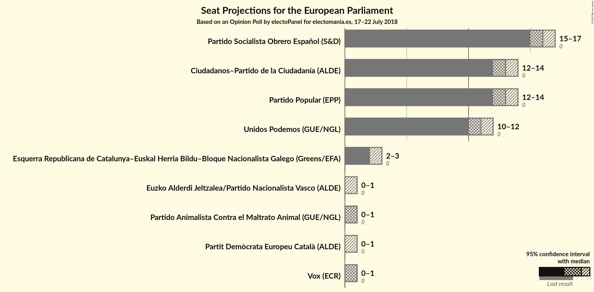

# Opinion Poll by electoPanel for electomania.es, 17–22 July 2018

<a href="#voting-intentions">Voting Intentions</a> | <a href="#seats">Seats</a> | <a href="#coalitions">Coalitions</a> | <a href="#technical-information">Technical Information</a>

## Voting Intentions

### Confidence Intervals

| Party | Last Result | Poll Result | 80% Confidence Interval | 90% Confidence Interval | 95% Confidence Interval | 99% Confidence Interval |
|:-----:|:-----------:|:-----------:|:-----------------------:|:-----------------------:|:-----------------------:|:-----------------------:|
| Partido Socialista Obrero Español (S&D) | 0.0% | 26.1% | 25.0–27.2% |24.8–27.5% |24.5–27.7% |24.0–28.3% |
| Partido Popular (EPP) | 0.0% | 21.0% | 20.0–22.0% |19.8–22.3% |19.5–22.5% |19.1–23.0% |
| Ciudadanos–Partido de la Ciudadanía (ALDE) | 0.0% | 20.8% | 19.8–21.8% |19.6–22.1% |19.3–22.3% |18.9–22.8% |
| Unidos Podemos (GUE/NGL) | 0.0% | 18.5% | 17.6–19.5% |17.3–19.7% |17.1–20.0% |16.7–20.5% |
| Esquerra Republicana de Catalunya–Euskal Herria Bildu–Bloque Nacionalista Galego (Greens/EFA) | 0.0% | 4.0% | N/A |N/A |N/A |N/A |
| Partido Animalista Contra el Maltrato Animal (GUE/NGL) | 0.0% | 1.7% | 1.4–2.0% |1.3–2.1% |1.3–2.2% |1.1–2.4% |
| Vox (ECR) | 0.0% | 1.7% | 1.4–2.0% |1.3–2.1% |1.3–2.2% |1.1–2.4% |
| Partit Demòcrata Europeu Català (ALDE) | 0.0% | 1.4% | 1.2–1.7% |1.1–1.8% |1.0–1.9% |0.9–2.1% |
| Euzko Alderdi Jeltzalea/Partido Nacionalista Vasco (ALDE) | 0.0% | 1.3% | 1.1–1.6% |1.0–1.7% |0.9–1.8% |0.8–2.0% |

*Note:* The poll result column reflects the actual value used in the calculations. Published results may vary slightly, and in addition be rounded to fewer digits.

## Seats

### Confidence Intervals

| Party | Last Result | Median | 80% Confidence Interval | 90% Confidence Interval | 95% Confidence Interval | 99% Confidence Interval |
|:-----:|:-----------:|:------:|:-----------------------:|:-----------------------:|:-----------------------:|:-----------------------:|
| <a href="#partido-socialista-obrero-español-(s&d)">Partido Socialista Obrero Español (S&D)</a> | 0 | 16 | 16–17 |15–17 |15–17 |15–18 |
| <a href="#partido-popular-(epp)">Partido Popular (EPP)</a> | 0 | 13 | 13–14 |12–14 |12–14 |12–14 |
| <a href="#ciudadanos–partido-de-la-ciudadanía-(alde)">Ciudadanos–Partido de la Ciudadanía (ALDE)</a> | 0 | 13 | 12–13 |12–14 |12–14 |12–14 |
| <a href="#unidos-podemos-(gue/ngl)">Unidos Podemos (GUE/NGL)</a> | 0 | 12 | 11–12 |11–12 |10–12 |10–13 |
| <a href="#esquerra-republicana-de-catalunya–euskal-herria-bildu–bloque-nacionalista-galego-(greens/efa)">Esquerra Republicana de Catalunya–Euskal Herria Bildu–Bloque Nacionalista Galego (Greens/EFA)</a> | 0 | N/A | N/A |N/A |N/A |N/A |
| <a href="#partido-animalista-contra-el-maltrato-animal-(gue/ngl)">Partido Animalista Contra el Maltrato Animal (GUE/NGL)</a> | 0 | 1 | 0–1 |0–1 |0–1 |0–1 |
| <a href="#vox-(ecr)">Vox (ECR)</a> | 0 | 1 | 0–1 |0–1 |0–1 |0–1 |
| <a href="#partit-demòcrata-europeu-català-(alde)">Partit Demòcrata Europeu Català (ALDE)</a> | 0 | 0 | 0–1 |0–1 |0–1 |0–1 |
| <a href="#euzko-alderdi-jeltzalea/partido-nacionalista-vasco-(alde)">Euzko Alderdi Jeltzalea/Partido Nacionalista Vasco (ALDE)</a> | 0 | 0 | 0–1 |0–1 |0–1 |0–1 |

