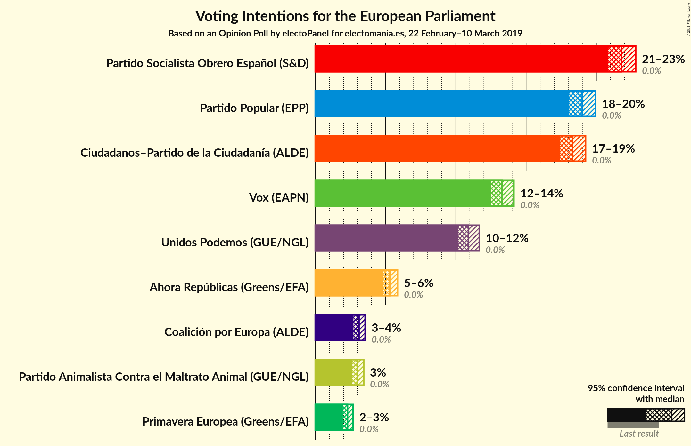
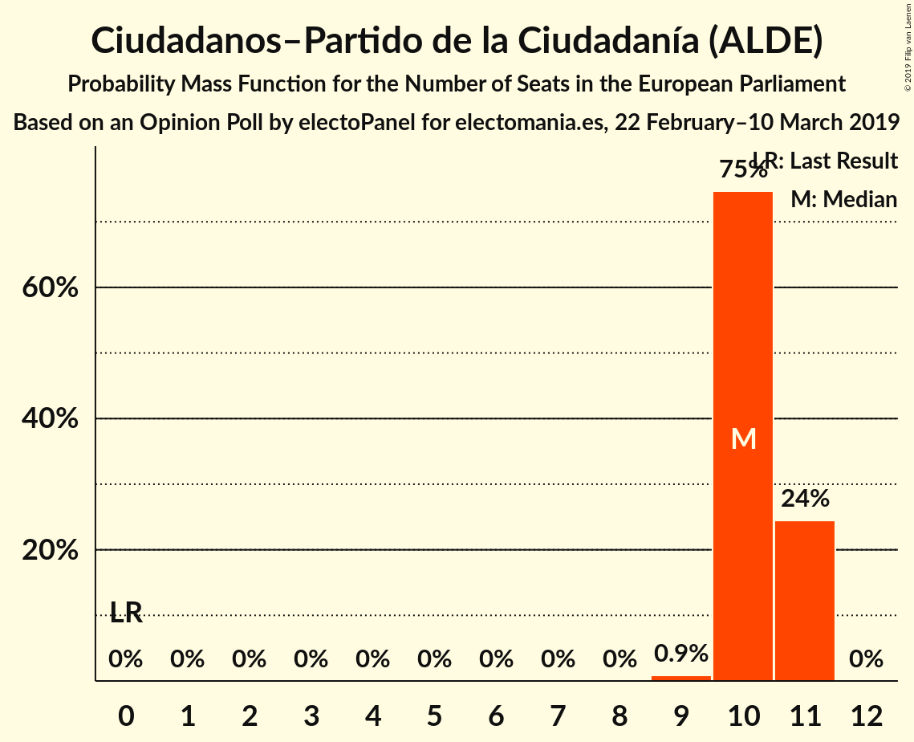
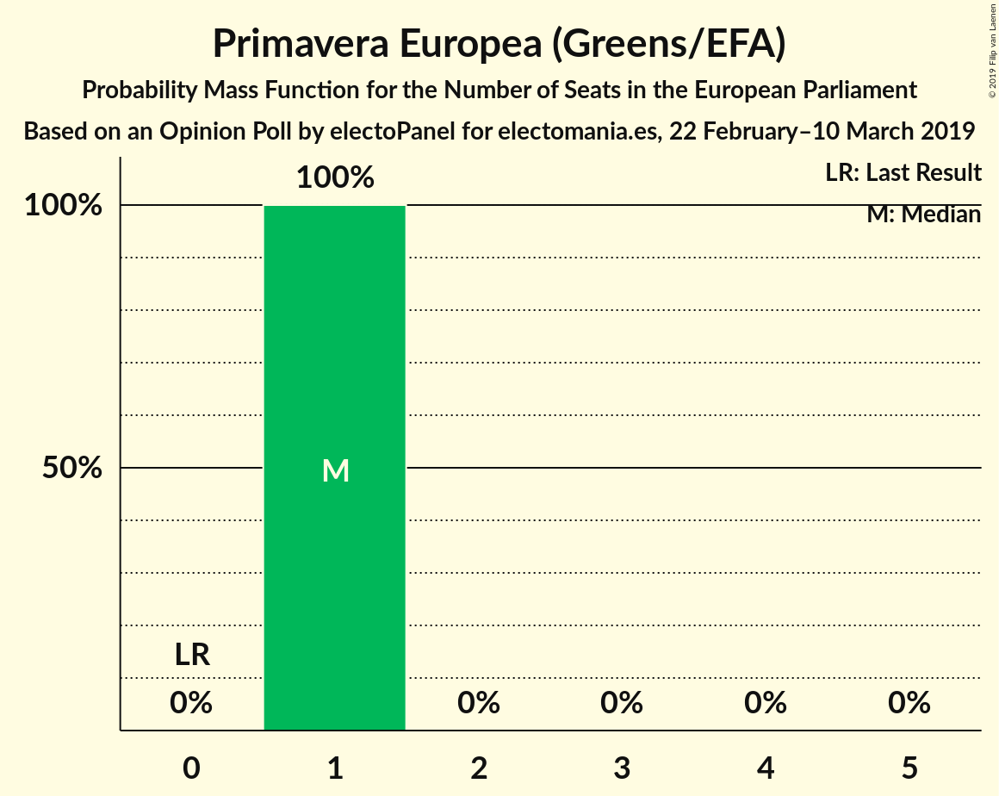
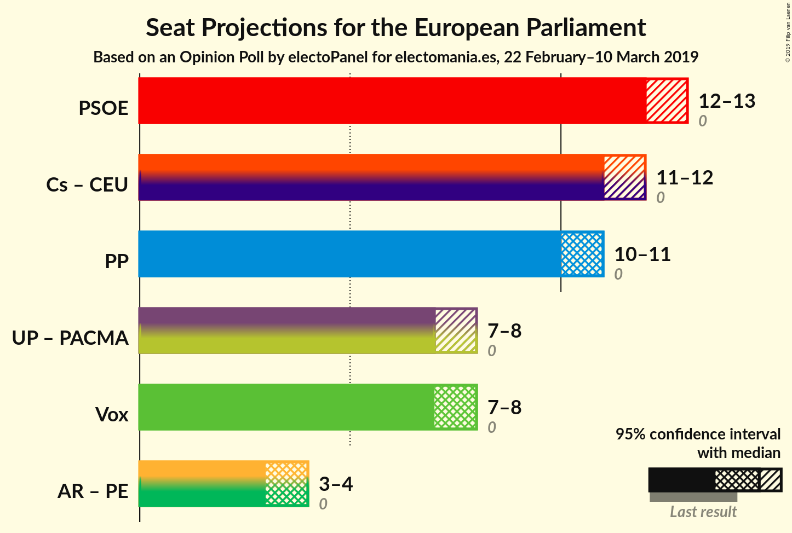
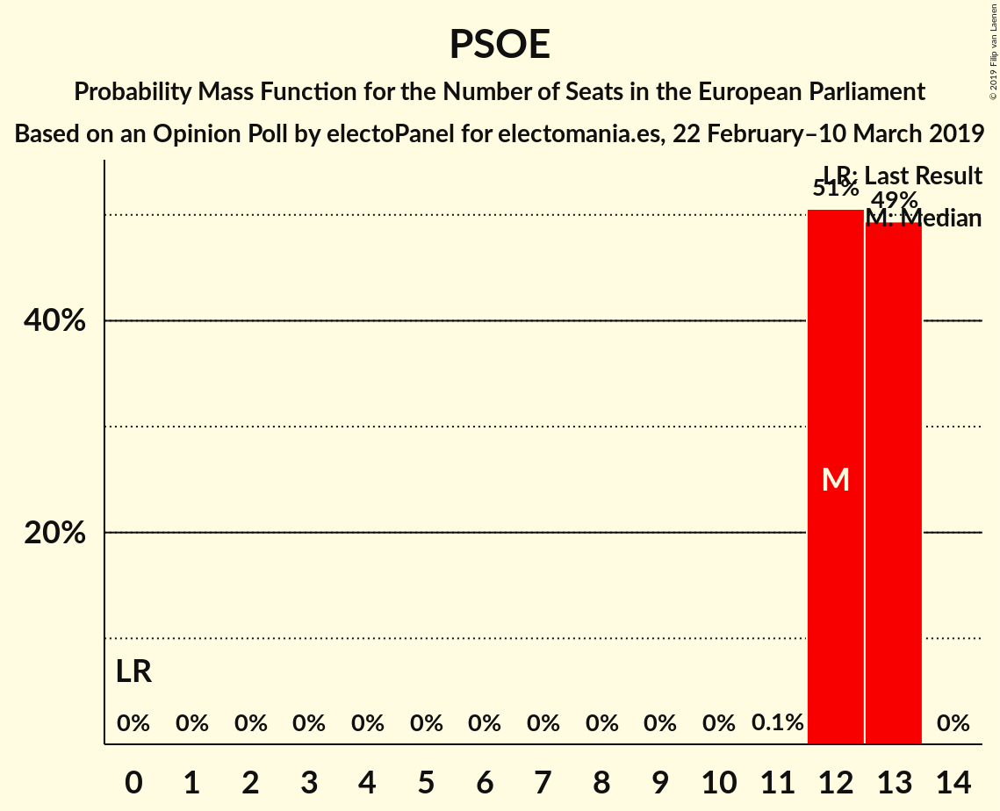
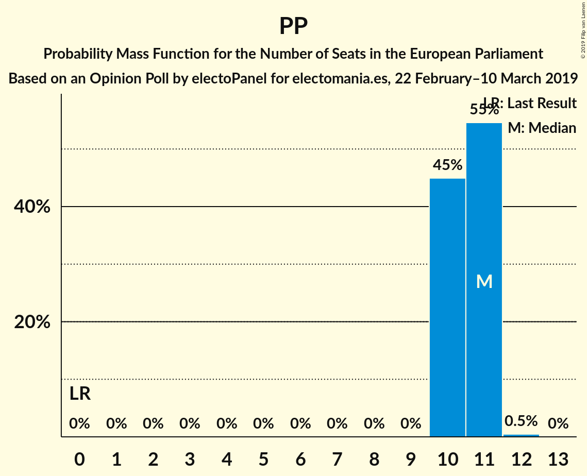

# Opinion Poll by electoPanel for electomania.es, 22 February–10 March 2019

<a href="#voting-intentions">Voting Intentions</a> | <a href="#seats">Seats</a> | <a href="#coalitions">Coalitions</a> | <a href="#technical-information">Technical Information</a>

## Voting Intentions

### Confidence Intervals

| Party | Last Result | Poll Result | 80% Confidence Interval | 90% Confidence Interval | 95% Confidence Interval | 99% Confidence Interval |
|:-----:|:-----------:|:-----------:|:-----------------------:|:-----------------------:|:-----------------------:|:-----------------------:|
| Partido Socialista Obrero Español (S&D) | 0.0% | 21.8% | 21.2–22.5% |21.0–22.6% |20.8–22.8% |20.5–23.1% |
| Partido Popular (EPP) | 0.0% | 19.0% | 18.4–19.6% |18.2–19.8% |18.1–20.0% |17.8–20.3% |
| Ciudadanos–Partido de la Ciudadanía (ALDE) | 0.0% | 18.3% | 17.7–18.9% |17.5–19.1% |17.4–19.2% |17.1–19.5% |
| Vox (ECR) | 0.0% | 13.3% | 12.8–13.8% |12.6–14.0% |12.5–14.1% |12.3–14.4% |
| Unidos Podemos (GUE/NGL) | 0.0% | 10.9% | 10.4–11.4% |10.3–11.5% |10.2–11.7% |10.0–11.9% |
| Ahora Repúblicas (Greens/EFA) | 0.0% | 5.3% | 5.0–5.7% |4.9–5.8% |4.8–5.9% |4.6–6.0% |
| Coalición por Europa (ALDE) | 0.0% | 3.1% | 2.8–3.4% |2.8–3.5% |2.7–3.6% |2.6–3.7% |
| Partido Animalista Contra el Maltrato Animal (GUE/NGL) | 0.0% | 3.0% | 2.7–3.3% |2.7–3.4% |2.6–3.4% |2.5–3.6% |
| Primavera Europea (Greens/EFA) | 0.0% | 2.3% | 2.1–2.5% |2.0–2.6% |2.0–2.7% |1.9–2.8% |

*Note:* The poll result column reflects the actual value used in the calculations. Published results may vary slightly, and in addition be rounded to fewer digits.

## Seats

### Confidence Intervals

| Party | Last Result | Median | 80% Confidence Interval | 90% Confidence Interval | 95% Confidence Interval | 99% Confidence Interval |
|:-----:|:-----------:|:------:|:-----------------------:|:-----------------------:|:-----------------------:|:-----------------------:|
| <a href="#partido-socialista-obrero-español-(s&d)">Partido Socialista Obrero Español (S&D)</a> | 0 | 14 | 13–14 |13–14 |13–14 |12–14 |
| <a href="#partido-popular-(epp)">Partido Popular (EPP)</a> | 0 | 12 | 12 |11–12 |11–12 |11–12 |
| <a href="#ciudadanos–partido-de-la-ciudadanía-(alde)">Ciudadanos–Partido de la Ciudadanía (ALDE)</a> | 0 | 11 | 10–12 |10–12 |10–12 |10–12 |
| <a href="#vox-(ecr)">Vox (ECR)</a> | 0 | 8 | 8 |8 |8–9 |7–9 |
| <a href="#unidos-podemos-(gue/ngl)">Unidos Podemos (GUE/NGL)</a> | 0 | 7 | 6–7 |6–7 |6–7 |6–7 |
| <a href="#ahora-repúblicas-(greens/efa)">Ahora Repúblicas (Greens/EFA)</a> | 0 | 3 | 3 |2–3 |2–3 |2–3 |
| <a href="#coalición-por-europa-(alde)">Coalición por Europa (ALDE)</a> | 0 | 1 | 1 |1–2 |1–2 |1–2 |
| <a href="#partido-animalista-contra-el-maltrato-animal-(gue/ngl)">Partido Animalista Contra el Maltrato Animal (GUE/NGL)</a> | 0 | 1 | 1 |1–2 |1–2 |1–2 |
| <a href="#primavera-europea-(greens/efa)">Primavera Europea (Greens/EFA)</a> | 0 | 1 | 1 |1 |1 |1 |

### Partido Socialista Obrero Español (S&D)

*For a full overview of the results for this party, see the [Partido Socialista Obrero Español (S&D)](party-partidosocialistaobreroespañolsd.html) page.*

| Number of Seats | Probability | Accumulated | Special Marks |
|:---------------:|:-----------:|:-----------:|:-------------:|
| 0 | 0% | 100% | Last Result |
| 1 | 0% | 100% |  |
| 2 | 0% | 100% |  |
| 3 | 0% | 100% |  |
| 4 | 0% | 100% |  |
| 5 | 0% | 100% |  |
| 6 | 0% | 100% |  |
| 7 | 0% | 100% |  |
| 8 | 0% | 100% |  |
| 9 | 0% | 100% |  |
| 10 | 0% | 100% |  |
| 11 | 0% | 100% |  |
| 12 | 2% | 100% |  |
| 13 | 17% | 98% |  |
| 14 | 82% | 82% | Median |
| 15 | 0.1% | 0.1% |  |
| 16 | 0% | 0% |  |

### Partido Popular (EPP)

*For a full overview of the results for this party, see the [Partido Popular (EPP)](party-partidopopularepp.html) page.*

| Number of Seats | Probability | Accumulated | Special Marks |
|:---------------:|:-----------:|:-----------:|:-------------:|
| 0 | 0% | 100% | Last Result |
| 1 | 0% | 100% |  |
| 2 | 0% | 100% |  |
| 3 | 0% | 100% |  |
| 4 | 0% | 100% |  |
| 5 | 0% | 100% |  |
| 6 | 0% | 100% |  |
| 7 | 0% | 100% |  |
| 8 | 0% | 100% |  |
| 9 | 0% | 100% |  |
| 10 | 0% | 100% |  |
| 11 | 8% | 100% |  |
| 12 | 92% | 92% | Median |
| 13 | 0.1% | 0.1% |  |
| 14 | 0% | 0% |  |

### Ciudadanos–Partido de la Ciudadanía (ALDE)

*For a full overview of the results for this party, see the [Ciudadanos–Partido de la Ciudadanía (ALDE)](party-ciudadanos–partidodelaciudadaníaalde.html) page.*

| Number of Seats | Probability | Accumulated | Special Marks |
|:---------------:|:-----------:|:-----------:|:-------------:|
| 0 | 0% | 100% | Last Result |
| 1 | 0% | 100% |  |
| 2 | 0% | 100% |  |
| 3 | 0% | 100% |  |
| 4 | 0% | 100% |  |
| 5 | 0% | 100% |  |
| 6 | 0% | 100% |  |
| 7 | 0% | 100% |  |
| 8 | 0% | 100% |  |
| 9 | 0% | 100% |  |
| 10 | 18% | 100% |  |
| 11 | 66% | 82% | Median |
| 12 | 16% | 16% |  |
| 13 | 0% | 0% |  |

### Vox (ECR)

*For a full overview of the results for this party, see the [Vox (ECR)](party-voxecr.html) page.*

| Number of Seats | Probability | Accumulated | Special Marks |
|:---------------:|:-----------:|:-----------:|:-------------:|
| 0 | 0% | 100% | Last Result |
| 1 | 0% | 100% |  |
| 2 | 0% | 100% |  |
| 3 | 0% | 100% |  |
| 4 | 0% | 100% |  |
| 5 | 0% | 100% |  |
| 6 | 0% | 100% |  |
| 7 | 2% | 100% |  |
| 8 | 95% | 98% | Median |
| 9 | 3% | 3% |  |
| 10 | 0% | 0% |  |

### Unidos Podemos (GUE/NGL)

*For a full overview of the results for this party, see the [Unidos Podemos (GUE/NGL)](party-unidospodemosguengl.html) page.*

| Number of Seats | Probability | Accumulated | Special Marks |
|:---------------:|:-----------:|:-----------:|:-------------:|
| 0 | 0% | 100% | Last Result |
| 1 | 0% | 100% |  |
| 2 | 0% | 100% |  |
| 3 | 0% | 100% |  |
| 4 | 0% | 100% |  |
| 5 | 0% | 100% |  |
| 6 | 46% | 100% |  |
| 7 | 54% | 54% | Median |
| 8 | 0% | 0% |  |

### Ahora Repúblicas (Greens/EFA)

*For a full overview of the results for this party, see the [Ahora Repúblicas (Greens/EFA)](party-ahorarepúblicasgreensefa.html) page.*

| Number of Seats | Probability | Accumulated | Special Marks |
|:---------------:|:-----------:|:-----------:|:-------------:|
| 0 | 0% | 100% | Last Result |
| 1 | 0% | 100% |  |
| 2 | 6% | 100% |  |
| 3 | 94% | 94% | Median |
| 4 | 0% | 0% |  |

### Coalición por Europa (ALDE)

*For a full overview of the results for this party, see the [Coalición por Europa (ALDE)](party-coaliciónporeuropaalde.html) page.*

| Number of Seats | Probability | Accumulated | Special Marks |
|:---------------:|:-----------:|:-----------:|:-------------:|
| 0 | 0% | 100% | Last Result |
| 1 | 93% | 100% | Median |
| 2 | 7% | 7% |  |
| 3 | 0% | 0% |  |

### Partido Animalista Contra el Maltrato Animal (GUE/NGL)

*For a full overview of the results for this party, see the [Partido Animalista Contra el Maltrato Animal (GUE/NGL)](party-partidoanimalistacontraelmaltratoanimalguengl.html) page.*

| Number of Seats | Probability | Accumulated | Special Marks |
|:---------------:|:-----------:|:-----------:|:-------------:|
| 0 | 0% | 100% | Last Result |
| 1 | 91% | 100% | Median |
| 2 | 9% | 9% |  |
| 3 | 0% | 0% |  |

### Primavera Europea (Greens/EFA)

*For a full overview of the results for this party, see the [Primavera Europea (Greens/EFA)](party-primaveraeuropeagreensefa.html) page.*

| Number of Seats | Probability | Accumulated | Special Marks |
|:---------------:|:-----------:|:-----------:|:-------------:|
| 0 | 0% | 100% | Last Result |
| 1 | 100% | 100% | Median |

## Coalitions

### Confidence Intervals

| Coalition | Last Result | Median | Majority? | 80% Confidence Interval | 90% Confidence Interval | 95% Confidence Interval | 99% Confidence Interval |
|:---------:|:-----------:|:------:|:---------:|:-----------------------:|:-----------------------:|:-----------------------:|:-----------------------:|
| Partido Socialista Obrero Español (S&D) | 0 | 14 | 0% | 13–14 | 13–14 | 13–14 | 12–14 |
| Ciudadanos–Partido de la Ciudadanía (ALDE) – Coalición por Europa (ALDE) | 0 | 12 | 0% | 11–13 | 11–13 | 11–13 | 11–14 |
| Partido Popular (EPP) | 0 | 12 | 0% | 12 | 11–12 | 11–12 | 11–12 |
| Vox (ECR) | 0 | 8 | 0% | 8 | 8 | 8–9 | 7–9 |
| Unidos Podemos (GUE/NGL) – Partido Animalista Contra el Maltrato Animal (GUE/NGL) | 0 | 8 | 0% | 7–8 | 7–8 | 7–9 | 7–9 |
| Ahora Repúblicas (Greens/EFA) – Primavera Europea (Greens/EFA) | 0 | 4 | 0% | 4 | 3–4 | 3–4 | 3–4 |

### Partido Socialista Obrero Español (S&D)

| Number of Seats | Probability | Accumulated | Special Marks |
|:---------------:|:-----------:|:-----------:|:-------------:|
| 0 | 0% | 100% | Last Result |
| 1 | 0% | 100% |  |
| 2 | 0% | 100% |  |
| 3 | 0% | 100% |  |
| 4 | 0% | 100% |  |
| 5 | 0% | 100% |  |
| 6 | 0% | 100% |  |
| 7 | 0% | 100% |  |
| 8 | 0% | 100% |  |
| 9 | 0% | 100% |  |
| 10 | 0% | 100% |  |
| 11 | 0% | 100% |  |
| 12 | 2% | 100% |  |
| 13 | 17% | 98% |  |
| 14 | 82% | 82% | Median |
| 15 | 0.1% | 0.1% |  |
| 16 | 0% | 0% |  |

### Ciudadanos–Partido de la Ciudadanía (ALDE) – Coalición por Europa (ALDE)

| Number of Seats | Probability | Accumulated | Special Marks |
|:---------------:|:-----------:|:-----------:|:-------------:|
| 0 | 0% | 100% | Last Result |
| 1 | 0% | 100% |  |
| 2 | 0% | 100% |  |
| 3 | 0% | 100% |  |
| 4 | 0% | 100% |  |
| 5 | 0% | 100% |  |
| 6 | 0% | 100% |  |
| 7 | 0% | 100% |  |
| 8 | 0% | 100% |  |
| 9 | 0% | 100% |  |
| 10 | 0% | 100% |  |
| 11 | 18% | 100% |  |
| 12 | 60% | 82% | Median |
| 13 | 22% | 23% |  |
| 14 | 0.8% | 0.8% |  |
| 15 | 0% | 0% |  |

### Partido Popular (EPP)

| Number of Seats | Probability | Accumulated | Special Marks |
|:---------------:|:-----------:|:-----------:|:-------------:|
| 0 | 0% | 100% | Last Result |
| 1 | 0% | 100% |  |
| 2 | 0% | 100% |  |
| 3 | 0% | 100% |  |
| 4 | 0% | 100% |  |
| 5 | 0% | 100% |  |
| 6 | 0% | 100% |  |
| 7 | 0% | 100% |  |
| 8 | 0% | 100% |  |
| 9 | 0% | 100% |  |
| 10 | 0% | 100% |  |
| 11 | 8% | 100% |  |
| 12 | 92% | 92% | Median |
| 13 | 0.1% | 0.1% |  |
| 14 | 0% | 0% |  |

### Vox (ECR)

| Number of Seats | Probability | Accumulated | Special Marks |
|:---------------:|:-----------:|:-----------:|:-------------:|
| 0 | 0% | 100% | Last Result |
| 1 | 0% | 100% |  |
| 2 | 0% | 100% |  |
| 3 | 0% | 100% |  |
| 4 | 0% | 100% |  |
| 5 | 0% | 100% |  |
| 6 | 0% | 100% |  |
| 7 | 2% | 100% |  |
| 8 | 95% | 98% | Median |
| 9 | 3% | 3% |  |
| 10 | 0% | 0% |  |

### Unidos Podemos (GUE/NGL) – Partido Animalista Contra el Maltrato Animal (GUE/NGL)

| Number of Seats | Probability | Accumulated | Special Marks |
|:---------------:|:-----------:|:-----------:|:-------------:|
| 0 | 0% | 100% | Last Result |
| 1 | 0% | 100% |  |
| 2 | 0% | 100% |  |
| 3 | 0% | 100% |  |
| 4 | 0% | 100% |  |
| 5 | 0% | 100% |  |
| 6 | 0% | 100% |  |
| 7 | 40% | 100% |  |
| 8 | 57% | 60% | Median |
| 9 | 3% | 3% |  |
| 10 | 0% | 0% |  |

### Ahora Repúblicas (Greens/EFA) – Primavera Europea (Greens/EFA)

| Number of Seats | Probability | Accumulated | Special Marks |
|:---------------:|:-----------:|:-----------:|:-------------:|
| 0 | 0% | 100% | Last Result |
| 1 | 0% | 100% |  |
| 2 | 0% | 100% |  |
| 3 | 6% | 100% |  |
| 4 | 94% | 94% | Median |
| 5 | 0% | 0% |  |

## Technical Information

### Opinion Poll

+ **Polling firm:** electoPanel
+ **Commissioner(s):** electomania.es
+ **Fieldwork period:** 22 February–10 March 2019

### Calculations

+ **Sample size:** 6800
+ **Simulations done:** 1,024
+ **Error estimate:** 1.62%

