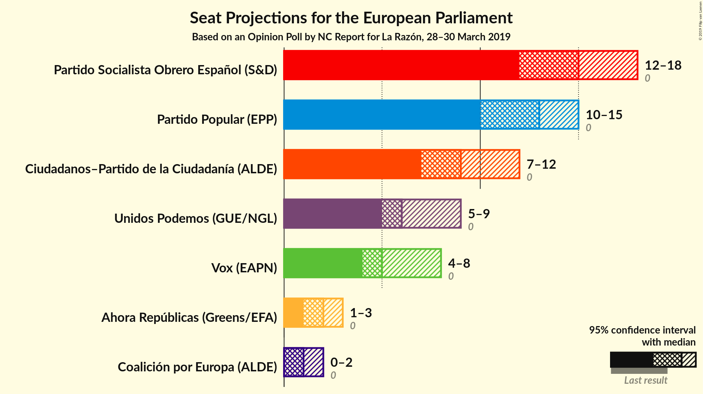
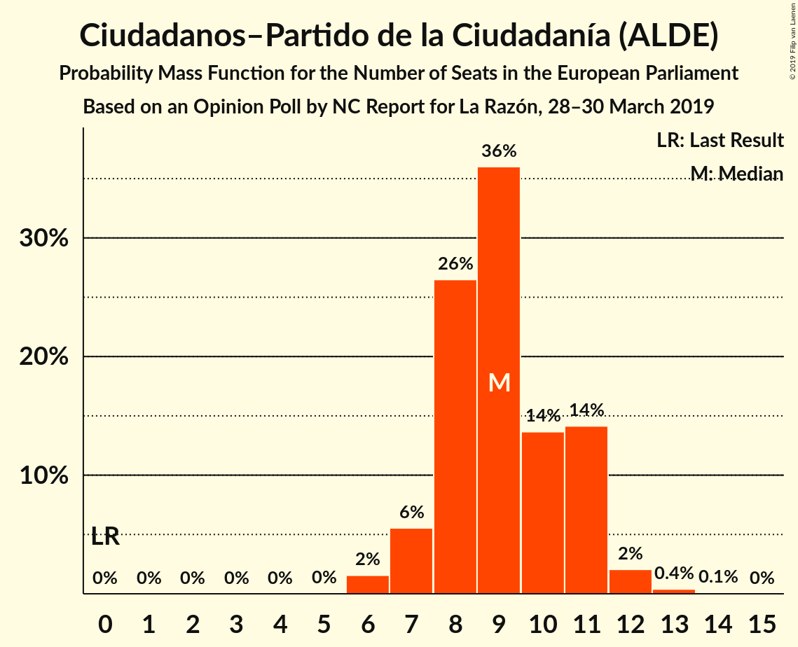
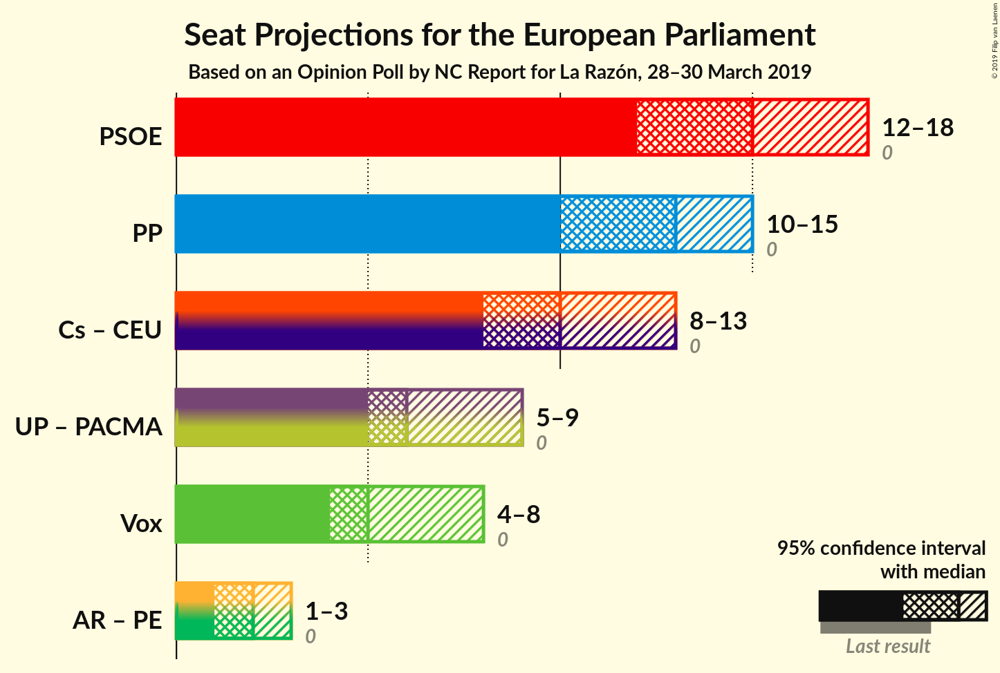
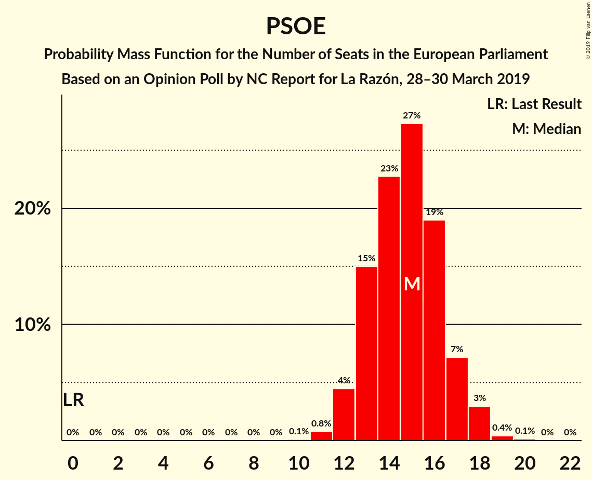

# Opinion Poll by NC Report for La Razón, 28–30 March 2019

<a href="#voting-intentions">Voting Intentions</a> | <a href="#seats">Seats</a> | <a href="#coalitions">Coalitions</a> | <a href="#technical-information">Technical Information</a>

## Voting Intentions

### Confidence Intervals

| Party | Last Result | Poll Result | 80% Confidence Interval | 90% Confidence Interval | 95% Confidence Interval | 99% Confidence Interval |
|:-----:|:-----------:|:-----------:|:-----------------------:|:-----------------------:|:-----------------------:|:-----------------------:|
| Partido Socialista Obrero Español (S&D) | 0.0% | 26.7% | 23.6–30.1% |22.7–31.1% |22.0–32.0% |20.6–33.7% |
| Partido Popular (EPP) | 0.0% | 23.0% | 20.1–26.3% |19.3–27.3% |18.6–28.1% |17.3–29.8% |
| Ciudadanos–Partido de la Ciudadanía (ALDE) | 0.0% | 16.7% | 14.2–19.7% |13.5–20.6% |12.9–21.3% |11.8–22.8% |
| Unidos Podemos (GUE/NGL) | 0.0% | 12.0% | 9.9–14.7% |9.3–15.5% |8.8–16.2% |7.9–17.6% |
| Vox (ENF) | 0.0% | 10.3% | 8.4–12.9% |7.8–13.7% |7.4–14.3% |6.5–15.6% |
| Ahora Repúblicas (Greens/EFA) | 0.0% | 3.7% | 2.6–5.5% |2.3–6.0% |2.1–6.4% |1.6–7.4% |
| Coalición por Europa (ALDE) | 0.0% | 2.7% | 1.8–4.3% |1.6–4.8% |1.4–5.2% |1.0–6.1% |

*Note:* The poll result column reflects the actual value used in the calculations. Published results may vary slightly, and in addition be rounded to fewer digits.

## Seats

### Confidence Intervals

| Party | Last Result | Median | 80% Confidence Interval | 90% Confidence Interval | 95% Confidence Interval | 99% Confidence Interval |
|:-----:|:-----------:|:------:|:-----------------------:|:-----------------------:|:-----------------------:|:-----------------------:|
| <a href="#partido-socialista-obrero-español-(s&d)">Partido Socialista Obrero Español (S&D)</a> | 0 | 15 | 13–17 |12–17 |12–18 |11–19 |
| <a href="#partido-popular-(epp)">Partido Popular (EPP)</a> | 0 | 13 | 11–14 |10–15 |10–15 |9–16 |
| <a href="#ciudadanos–partido-de-la-ciudadanía-(alde)">Ciudadanos–Partido de la Ciudadanía (ALDE)</a> | 0 | 9 | 8–11 |7–11 |7–12 |6–12 |
| <a href="#unidos-podemos-(gue/ngl)">Unidos Podemos (GUE/NGL)</a> | 0 | 6 | 5–8 |5–8 |5–9 |4–10 |
| <a href="#vox-(enf)">Vox (ENF)</a> | 0 | 5 | 4–7 |4–7 |4–8 |3–8 |
| <a href="#ahora-repúblicas-(greens/efa)">Ahora Repúblicas (Greens/EFA)</a> | 0 | 2 | 1–3 |1–3 |1–3 |0–4 |
| <a href="#coalición-por-europa-(alde)">Coalición por Europa (ALDE)</a> | 0 | 1 | 1–2 |0–2 |0–2 |0–3 |

### Partido Socialista Obrero Español (S&D)

*For a full overview of the results for this party, see the [Partido Socialista Obrero Español (S&D)](party-partidosocialistaobreroespañolsd.html) page.*

| Number of Seats | Probability | Accumulated | Special Marks |
|:---------------:|:-----------:|:-----------:|:-------------:|
| 0 | 0% | 100% | Last Result |
| 1 | 0% | 100% |  |
| 2 | 0% | 100% |  |
| 3 | 0% | 100% |  |
| 4 | 0% | 100% |  |
| 5 | 0% | 100% |  |
| 6 | 0% | 100% |  |
| 7 | 0% | 100% |  |
| 8 | 0% | 100% |  |
| 9 | 0% | 100% |  |
| 10 | 0.1% | 100% |  |
| 11 | 0.8% | 99.9% |  |
| 12 | 4% | 99.1% |  |
| 13 | 15% | 95% |  |
| 14 | 23% | 80% |  |
| 15 | 27% | 57% | Median |
| 16 | 19% | 30% |  |
| 17 | 7% | 11% |  |
| 18 | 3% | 3% |  |
| 19 | 0.4% | 0.5% |  |
| 20 | 0.1% | 0.1% |  |
| 21 | 0% | 0% |  |

### Partido Popular (EPP)

*For a full overview of the results for this party, see the [Partido Popular (EPP)](party-partidopopularepp.html) page.*

| Number of Seats | Probability | Accumulated | Special Marks |
|:---------------:|:-----------:|:-----------:|:-------------:|
| 0 | 0% | 100% | Last Result |
| 1 | 0% | 100% |  |
| 2 | 0% | 100% |  |
| 3 | 0% | 100% |  |
| 4 | 0% | 100% |  |
| 5 | 0% | 100% |  |
| 6 | 0% | 100% |  |
| 7 | 0% | 100% |  |
| 8 | 0.1% | 100% |  |
| 9 | 0.7% | 99.9% |  |
| 10 | 4% | 99.3% |  |
| 11 | 13% | 95% |  |
| 12 | 25% | 82% |  |
| 13 | 27% | 57% | Median |
| 14 | 21% | 30% |  |
| 15 | 7% | 9% |  |
| 16 | 1.4% | 2% |  |
| 17 | 0.4% | 0.4% |  |
| 18 | 0% | 0% |  |

### Ciudadanos–Partido de la Ciudadanía (ALDE)

*For a full overview of the results for this party, see the [Ciudadanos–Partido de la Ciudadanía (ALDE)](party-ciudadanos–partidodelaciudadaníaalde.html) page.*

| Number of Seats | Probability | Accumulated | Special Marks |
|:---------------:|:-----------:|:-----------:|:-------------:|
| 0 | 0% | 100% | Last Result |
| 1 | 0% | 100% |  |
| 2 | 0% | 100% |  |
| 3 | 0% | 100% |  |
| 4 | 0% | 100% |  |
| 5 | 0% | 100% |  |
| 6 | 2% | 100% |  |
| 7 | 6% | 98% |  |
| 8 | 26% | 93% |  |
| 9 | 36% | 66% | Median |
| 10 | 14% | 30% |  |
| 11 | 14% | 17% |  |
| 12 | 2% | 3% |  |
| 13 | 0.4% | 0.5% |  |
| 14 | 0.1% | 0.1% |  |
| 15 | 0% | 0% |  |

### Unidos Podemos (GUE/NGL)

*For a full overview of the results for this party, see the [Unidos Podemos (GUE/NGL)](party-unidospodemosguengl.html) page.*

| Number of Seats | Probability | Accumulated | Special Marks |
|:---------------:|:-----------:|:-----------:|:-------------:|
| 0 | 0% | 100% | Last Result |
| 1 | 0% | 100% |  |
| 2 | 0% | 100% |  |
| 3 | 0.1% | 100% |  |
| 4 | 2% | 99.9% |  |
| 5 | 15% | 98% |  |
| 6 | 37% | 82% | Median |
| 7 | 28% | 46% |  |
| 8 | 14% | 17% |  |
| 9 | 3% | 3% |  |
| 10 | 0.5% | 0.6% |  |
| 11 | 0.1% | 0.1% |  |
| 12 | 0% | 0% |  |

### Vox (ENF)

*For a full overview of the results for this party, see the [Vox (ENF)](party-voxenf.html) page.*

| Number of Seats | Probability | Accumulated | Special Marks |
|:---------------:|:-----------:|:-----------:|:-------------:|
| 0 | 0% | 100% | Last Result |
| 1 | 0% | 100% |  |
| 2 | 0% | 100% |  |
| 3 | 1.2% | 100% |  |
| 4 | 14% | 98.8% |  |
| 5 | 41% | 85% | Median |
| 6 | 28% | 43% |  |
| 7 | 12% | 15% |  |
| 8 | 3% | 3% |  |
| 9 | 0.3% | 0.3% |  |
| 10 | 0% | 0% |  |

### Ahora Repúblicas (Greens/EFA)

*For a full overview of the results for this party, see the [Ahora Repúblicas (Greens/EFA)](party-ahorarepúblicasgreensefa.html) page.*

| Number of Seats | Probability | Accumulated | Special Marks |
|:---------------:|:-----------:|:-----------:|:-------------:|
| 0 | 0.8% | 100% | Last Result |
| 1 | 33% | 99.2% |  |
| 2 | 52% | 66% | Median |
| 3 | 13% | 14% |  |
| 4 | 1.2% | 1.2% |  |
| 5 | 0% | 0% |  |

### Coalición por Europa (ALDE)

*For a full overview of the results for this party, see the [Coalición por Europa (ALDE)](party-coaliciónporeuropaalde.html) page.*

| Number of Seats | Probability | Accumulated | Special Marks |
|:---------------:|:-----------:|:-----------:|:-------------:|
| 0 | 8% | 100% | Last Result |
| 1 | 68% | 92% | Median |
| 2 | 22% | 24% |  |
| 3 | 2% | 2% |  |
| 4 | 0.1% | 0.1% |  |
| 5 | 0% | 0% |  |

## Coalitions

### Confidence Intervals

| Coalition | Last Result | Median | Majority? | 80% Confidence Interval | 90% Confidence Interval | 95% Confidence Interval | 99% Confidence Interval |
|:---------:|:-----------:|:------:|:---------:|:-----------------------:|:-----------------------:|:-----------------------:|:-----------------------:|
| Partido Socialista Obrero Español (S&D) | 0 | 15 | 0% | 13–17 | 12–17 | 12–18 | 11–19 |
| Partido Popular (EPP) | 0 | 13 | 0% | 11–14 | 10–15 | 10–15 | 9–16 |
| Ciudadanos–Partido de la Ciudadanía (ALDE) – Coalición por Europa (ALDE) | 0 | 10 | 0% | 9–12 | 8–13 | 8–13 | 7–14 |
| Vox (ENF) | 0 | 5 | 0% | 4–7 | 4–7 | 4–8 | 3–8 |

### Partido Socialista Obrero Español (S&D)

| Number of Seats | Probability | Accumulated | Special Marks |
|:---------------:|:-----------:|:-----------:|:-------------:|
| 0 | 0% | 100% | Last Result |
| 1 | 0% | 100% |  |
| 2 | 0% | 100% |  |
| 3 | 0% | 100% |  |
| 4 | 0% | 100% |  |
| 5 | 0% | 100% |  |
| 6 | 0% | 100% |  |
| 7 | 0% | 100% |  |
| 8 | 0% | 100% |  |
| 9 | 0% | 100% |  |
| 10 | 0.1% | 100% |  |
| 11 | 0.8% | 99.9% |  |
| 12 | 4% | 99.1% |  |
| 13 | 15% | 95% |  |
| 14 | 23% | 80% |  |
| 15 | 27% | 57% | Median |
| 16 | 19% | 30% |  |
| 17 | 7% | 11% |  |
| 18 | 3% | 3% |  |
| 19 | 0.4% | 0.5% |  |
| 20 | 0.1% | 0.1% |  |
| 21 | 0% | 0% |  |

### Partido Popular (EPP)

| Number of Seats | Probability | Accumulated | Special Marks |
|:---------------:|:-----------:|:-----------:|:-------------:|
| 0 | 0% | 100% | Last Result |
| 1 | 0% | 100% |  |
| 2 | 0% | 100% |  |
| 3 | 0% | 100% |  |
| 4 | 0% | 100% |  |
| 5 | 0% | 100% |  |
| 6 | 0% | 100% |  |
| 7 | 0% | 100% |  |
| 8 | 0.1% | 100% |  |
| 9 | 0.7% | 99.9% |  |
| 10 | 4% | 99.3% |  |
| 11 | 13% | 95% |  |
| 12 | 25% | 82% |  |
| 13 | 27% | 57% | Median |
| 14 | 21% | 30% |  |
| 15 | 7% | 9% |  |
| 16 | 1.4% | 2% |  |
| 17 | 0.4% | 0.4% |  |
| 18 | 0% | 0% |  |

### Ciudadanos–Partido de la Ciudadanía (ALDE) – Coalición por Europa (ALDE)

| Number of Seats | Probability | Accumulated | Special Marks |
|:---------------:|:-----------:|:-----------:|:-------------:|
| 0 | 0% | 100% | Last Result |
| 1 | 0% | 100% |  |
| 2 | 0% | 100% |  |
| 3 | 0% | 100% |  |
| 4 | 0% | 100% |  |
| 5 | 0% | 100% |  |
| 6 | 0.1% | 100% |  |
| 7 | 1.2% | 99.9% |  |
| 8 | 6% | 98.7% |  |
| 9 | 20% | 93% |  |
| 10 | 37% | 73% | Median |
| 11 | 17% | 35% |  |
| 12 | 13% | 19% |  |
| 13 | 5% | 6% |  |
| 14 | 0.8% | 1.0% |  |
| 15 | 0.2% | 0.2% |  |
| 16 | 0% | 0% |  |

### Vox (ENF)

| Number of Seats | Probability | Accumulated | Special Marks |
|:---------------:|:-----------:|:-----------:|:-------------:|
| 0 | 0% | 100% | Last Result |
| 1 | 0% | 100% |  |
| 2 | 0% | 100% |  |
| 3 | 1.2% | 100% |  |
| 4 | 14% | 98.8% |  |
| 5 | 41% | 85% | Median |
| 6 | 28% | 43% |  |
| 7 | 12% | 15% |  |
| 8 | 3% | 3% |  |
| 9 | 0.3% | 0.3% |  |
| 10 | 0% | 0% |  |

## Technical Information

### Opinion Poll

+ **Polling firm:** NC Report
+ **Commissioner(s):** La Razón
+ **Fieldwork period:** 28–30 March 2019

### Calculations

+ **Sample size:** 300
+ **Simulations done:** 131,072
+ **Error estimate:** 2.65%

