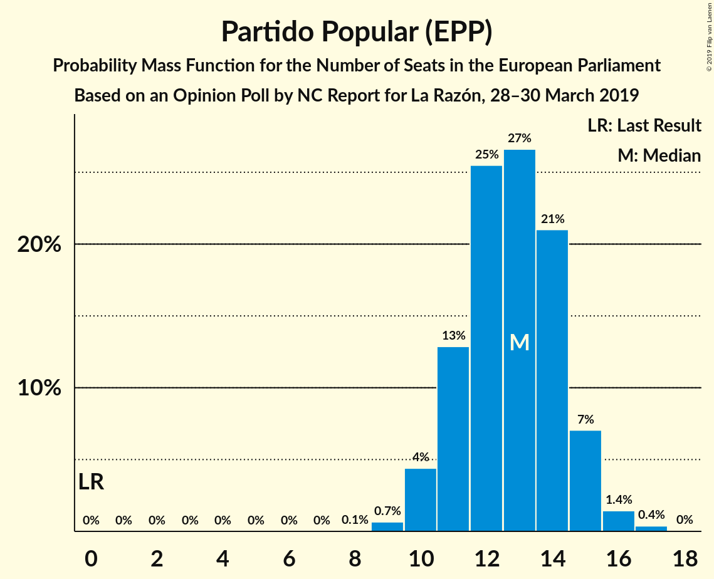
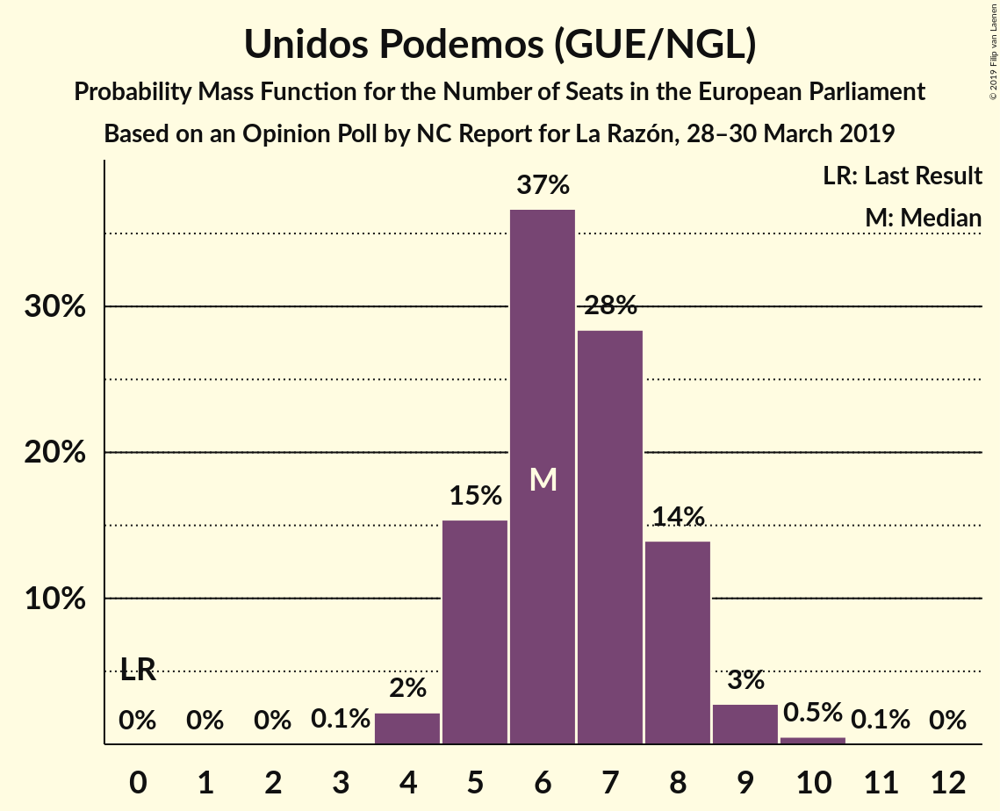
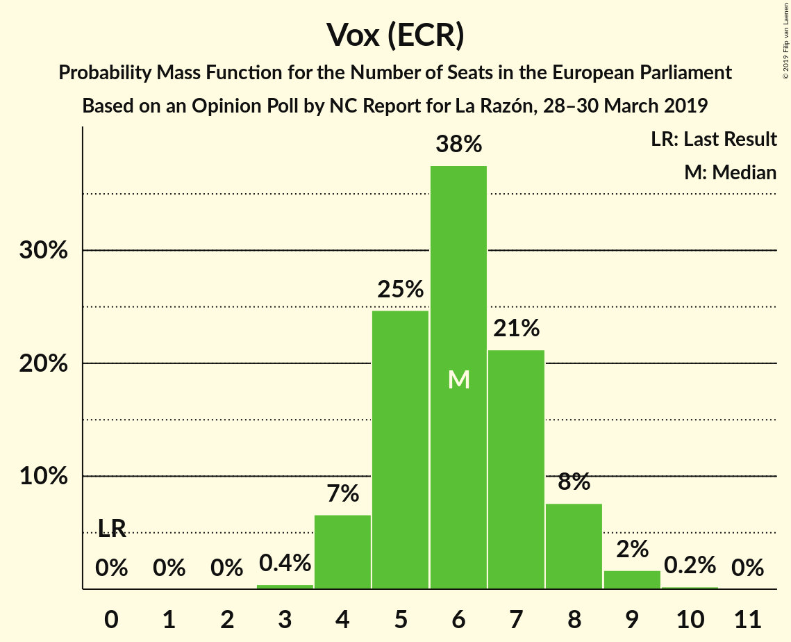

# Opinion Poll by NC Report for La Razón, 28–30 March 2019

<a href="#voting-intentions">Voting Intentions</a> | <a href="#seats">Seats</a> | <a href="#coalitions">Coalitions</a> | <a href="#technical-information">Technical Information</a>

## Voting Intentions

### Confidence Intervals

| Party | Last Result | Poll Result | 80% Confidence Interval | 90% Confidence Interval | 95% Confidence Interval | 99% Confidence Interval |
|:-----:|:-----------:|:-----------:|:-----------------------:|:-----------------------:|:-----------------------:|:-----------------------:|
| Partido Socialista Obrero Español (S&D) | 0.0% | 26.7% | 23.6–30.1% |22.7–31.1% |22.0–32.0% |20.6–33.7% |
| Partido Popular (EPP) | 0.0% | 23.0% | 20.1–26.3% |19.3–27.3% |18.6–28.1% |17.3–29.8% |
| Ciudadanos–Partido de la Ciudadanía (ALDE) | 0.0% | 16.7% | 14.2–19.7% |13.5–20.6% |12.9–21.3% |11.8–22.8% |
| Unidos Podemos (GUE/NGL) | 0.0% | 12.0% | 9.9–14.7% |9.3–15.5% |8.8–16.2% |7.9–17.6% |
| Vox (ECR) | 0.0% | 10.3% | 8.4–12.9% |7.8–13.7% |7.4–14.3% |6.5–15.6% |
| Ahora Repúblicas (Greens/EFA) | 0.0% | 3.7% | 2.6–5.5% |2.3–6.0% |2.1–6.4% |1.6–7.4% |
| Coalición por Europa (ALDE) | 0.0% | 2.7% | 1.8–4.3% |1.6–4.8% |1.4–5.2% |1.0–6.1% |

*Note:* The poll result column reflects the actual value used in the calculations. Published results may vary slightly, and in addition be rounded to fewer digits.

## Seats

### Confidence Intervals

| Party | Last Result | Median | 80% Confidence Interval | 90% Confidence Interval | 95% Confidence Interval | 99% Confidence Interval |
|:-----:|:-----------:|:------:|:-----------------------:|:-----------------------:|:-----------------------:|:-----------------------:|
| <a href="#partido-socialista-obrero-español-(s&d)">Partido Socialista Obrero Español (S&D)</a> | 0 | 16 | 14–18 |14–19 |13–19 |12–20 |
| <a href="#partido-popular-(epp)">Partido Popular (EPP)</a> | 0 | 14 | 12–16 |11–16 |11–17 |10–18 |
| <a href="#ciudadanos–partido-de-la-ciudadanía-(alde)">Ciudadanos–Partido de la Ciudadanía (ALDE)</a> | 0 | 10 | 8–12 |8–12 |7–13 |7–14 |
| <a href="#unidos-podemos-(gue/ngl)">Unidos Podemos (GUE/NGL)</a> | 0 | 7 | 6–9 |5–9 |5–9 |4–10 |
| <a href="#vox-(ecr)">Vox (ECR)</a> | 0 | 6 | 5–7 |4–8 |4–8 |4–9 |
| <a href="#ahora-repúblicas-(greens/efa)">Ahora Repúblicas (Greens/EFA)</a> | 0 | 2 | 1–3 |1–3 |1–3 |1–4 |
| <a href="#coalición-por-europa-(alde)">Coalición por Europa (ALDE)</a> | 0 | 1 | 1–2 |0–2 |0–3 |0–3 |

### Partido Socialista Obrero Español (S&D)

*For a full overview of the results for this party, see the [Partido Socialista Obrero Español (S&D)](party-partidosocialistaobreroespañolsd.html) page.*

| Number of Seats | Probability | Accumulated | Special Marks |
|:---------------:|:-----------:|:-----------:|:-------------:|
| 0 | 0% | 100% | Last Result |
| 1 | 0% | 100% |  |
| 2 | 0% | 100% |  |
| 3 | 0% | 100% |  |
| 4 | 0% | 100% |  |
| 5 | 0% | 100% |  |
| 6 | 0% | 100% |  |
| 7 | 0% | 100% |  |
| 8 | 0% | 100% |  |
| 9 | 0% | 100% |  |
| 10 | 0% | 100% |  |
| 11 | 0.1% | 100% |  |
| 12 | 0.9% | 99.9% |  |
| 13 | 4% | 99.0% |  |
| 14 | 12% | 95% |  |
| 15 | 19% | 84% |  |
| 16 | 26% | 65% | Median |
| 17 | 21% | 39% |  |
| 18 | 11% | 18% |  |
| 19 | 5% | 7% |  |
| 20 | 1.5% | 2% |  |
| 21 | 0.3% | 0.4% |  |
| 22 | 0.1% | 0.1% |  |
| 23 | 0% | 0% |  |

### Partido Popular (EPP)

*For a full overview of the results for this party, see the [Partido Popular (EPP)](party-partidopopularepp.html) page.*

| Number of Seats | Probability | Accumulated | Special Marks |
|:---------------:|:-----------:|:-----------:|:-------------:|
| 0 | 0% | 100% | Last Result |
| 1 | 0% | 100% |  |
| 2 | 0% | 100% |  |
| 3 | 0% | 100% |  |
| 4 | 0% | 100% |  |
| 5 | 0% | 100% |  |
| 6 | 0% | 100% |  |
| 7 | 0% | 100% |  |
| 8 | 0% | 100% |  |
| 9 | 0.1% | 100% |  |
| 10 | 0.9% | 99.9% |  |
| 11 | 5% | 99.0% |  |
| 12 | 14% | 94% |  |
| 13 | 24% | 81% |  |
| 14 | 24% | 57% | Median |
| 15 | 19% | 33% |  |
| 16 | 10% | 14% |  |
| 17 | 3% | 4% |  |
| 18 | 0.8% | 0.9% |  |
| 19 | 0.1% | 0.2% |  |
| 20 | 0% | 0% |  |

### Ciudadanos–Partido de la Ciudadanía (ALDE)

*For a full overview of the results for this party, see the [Ciudadanos–Partido de la Ciudadanía (ALDE)](party-ciudadanos–partidodelaciudadaníaalde.html) page.*

| Number of Seats | Probability | Accumulated | Special Marks |
|:---------------:|:-----------:|:-----------:|:-------------:|
| 0 | 0% | 100% | Last Result |
| 1 | 0% | 100% |  |
| 2 | 0% | 100% |  |
| 3 | 0% | 100% |  |
| 4 | 0% | 100% |  |
| 5 | 0% | 100% |  |
| 6 | 0.3% | 100% |  |
| 7 | 3% | 99.7% |  |
| 8 | 11% | 97% |  |
| 9 | 24% | 86% |  |
| 10 | 30% | 62% | Median |
| 11 | 20% | 32% |  |
| 12 | 9% | 12% |  |
| 13 | 3% | 3% |  |
| 14 | 0.5% | 0.6% |  |
| 15 | 0.1% | 0.1% |  |
| 16 | 0% | 0% |  |

### Unidos Podemos (GUE/NGL)

*For a full overview of the results for this party, see the [Unidos Podemos (GUE/NGL)](party-unidospodemosguengl.html) page.*

| Number of Seats | Probability | Accumulated | Special Marks |
|:---------------:|:-----------:|:-----------:|:-------------:|
| 0 | 0% | 100% | Last Result |
| 1 | 0% | 100% |  |
| 2 | 0% | 100% |  |
| 3 | 0% | 100% |  |
| 4 | 0.7% | 100% |  |
| 5 | 7% | 99.2% |  |
| 6 | 25% | 92% |  |
| 7 | 33% | 67% | Median |
| 8 | 24% | 35% |  |
| 9 | 9% | 11% |  |
| 10 | 2% | 2% |  |
| 11 | 0.3% | 0.3% |  |
| 12 | 0% | 0% |  |

### Vox (ECR)

*For a full overview of the results for this party, see the [Vox (ECR)](party-voxecr.html) page.*

| Number of Seats | Probability | Accumulated | Special Marks |
|:---------------:|:-----------:|:-----------:|:-------------:|
| 0 | 0% | 100% | Last Result |
| 1 | 0% | 100% |  |
| 2 | 0% | 100% |  |
| 3 | 0.4% | 100% |  |
| 4 | 7% | 99.6% |  |
| 5 | 25% | 93% |  |
| 6 | 38% | 68% | Median |
| 7 | 21% | 31% |  |
| 8 | 8% | 10% |  |
| 9 | 2% | 2% |  |
| 10 | 0.2% | 0.2% |  |
| 11 | 0% | 0% |  |

### Ahora Repúblicas (Greens/EFA)

*For a full overview of the results for this party, see the [Ahora Repúblicas (Greens/EFA)](party-ahorarepúblicasgreensefa.html) page.*

| Number of Seats | Probability | Accumulated | Special Marks |
|:---------------:|:-----------:|:-----------:|:-------------:|
| 0 | 0.4% | 100% | Last Result |
| 1 | 26% | 99.6% |  |
| 2 | 53% | 73% | Median |
| 3 | 18% | 20% |  |
| 4 | 2% | 2% |  |
| 5 | 0.1% | 0.2% |  |
| 6 | 0% | 0% |  |

### Coalición por Europa (ALDE)

*For a full overview of the results for this party, see the [Coalición por Europa (ALDE)](party-coaliciónporeuropaalde.html) page.*

| Number of Seats | Probability | Accumulated | Special Marks |
|:---------------:|:-----------:|:-----------:|:-------------:|
| 0 | 6% | 100% | Last Result |
| 1 | 59% | 94% | Median |
| 2 | 31% | 35% |  |
| 3 | 4% | 4% |  |
| 4 | 0.2% | 0.2% |  |
| 5 | 0% | 0% |  |

## Coalitions

### Confidence Intervals

| Coalition | Last Result | Median | Majority? | 80% Confidence Interval | 90% Confidence Interval | 95% Confidence Interval | 99% Confidence Interval |
|:---------:|:-----------:|:------:|:---------:|:-----------------------:|:-----------------------:|:-----------------------:|:-----------------------:|
| Partido Socialista Obrero Español (S&D) | 0 | 16 | 0% | 14–18 | 14–19 | 13–19 | 12–20 |
| Partido Popular (EPP) | 0 | 14 | 0% | 12–16 | 11–16 | 11–17 | 10–18 |
| Ciudadanos–Partido de la Ciudadanía (ALDE) – Coalición por Europa (ALDE) | 0 | 11 | 0% | 9–13 | 9–14 | 9–14 | 8–15 |
| Vox (ECR) | 0 | 6 | 0% | 5–7 | 4–8 | 4–8 | 4–9 |

### Partido Socialista Obrero Español (S&D)

| Number of Seats | Probability | Accumulated | Special Marks |
|:---------------:|:-----------:|:-----------:|:-------------:|
| 0 | 0% | 100% | Last Result |
| 1 | 0% | 100% |  |
| 2 | 0% | 100% |  |
| 3 | 0% | 100% |  |
| 4 | 0% | 100% |  |
| 5 | 0% | 100% |  |
| 6 | 0% | 100% |  |
| 7 | 0% | 100% |  |
| 8 | 0% | 100% |  |
| 9 | 0% | 100% |  |
| 10 | 0% | 100% |  |
| 11 | 0.1% | 100% |  |
| 12 | 0.9% | 99.9% |  |
| 13 | 4% | 99.0% |  |
| 14 | 12% | 95% |  |
| 15 | 19% | 84% |  |
| 16 | 26% | 65% | Median |
| 17 | 21% | 39% |  |
| 18 | 11% | 18% |  |
| 19 | 5% | 7% |  |
| 20 | 1.5% | 2% |  |
| 21 | 0.3% | 0.4% |  |
| 22 | 0.1% | 0.1% |  |
| 23 | 0% | 0% |  |

### Partido Popular (EPP)

| Number of Seats | Probability | Accumulated | Special Marks |
|:---------------:|:-----------:|:-----------:|:-------------:|
| 0 | 0% | 100% | Last Result |
| 1 | 0% | 100% |  |
| 2 | 0% | 100% |  |
| 3 | 0% | 100% |  |
| 4 | 0% | 100% |  |
| 5 | 0% | 100% |  |
| 6 | 0% | 100% |  |
| 7 | 0% | 100% |  |
| 8 | 0% | 100% |  |
| 9 | 0.1% | 100% |  |
| 10 | 0.9% | 99.9% |  |
| 11 | 5% | 99.0% |  |
| 12 | 14% | 94% |  |
| 13 | 24% | 81% |  |
| 14 | 24% | 57% | Median |
| 15 | 19% | 33% |  |
| 16 | 10% | 14% |  |
| 17 | 3% | 4% |  |
| 18 | 0.8% | 0.9% |  |
| 19 | 0.1% | 0.2% |  |
| 20 | 0% | 0% |  |

### Ciudadanos–Partido de la Ciudadanía (ALDE) – Coalición por Europa (ALDE)

| Number of Seats | Probability | Accumulated | Special Marks |
|:---------------:|:-----------:|:-----------:|:-------------:|
| 0 | 0% | 100% | Last Result |
| 1 | 0% | 100% |  |
| 2 | 0% | 100% |  |
| 3 | 0% | 100% |  |
| 4 | 0% | 100% |  |
| 5 | 0% | 100% |  |
| 6 | 0% | 100% |  |
| 7 | 0.2% | 100% |  |
| 8 | 2% | 99.8% |  |
| 9 | 8% | 98% |  |
| 10 | 19% | 89% |  |
| 11 | 28% | 70% | Median |
| 12 | 23% | 42% |  |
| 13 | 13% | 19% |  |
| 14 | 5% | 6% |  |
| 15 | 1.3% | 2% |  |
| 16 | 0.2% | 0.3% |  |
| 17 | 0% | 0% |  |

### Vox (ECR)

| Number of Seats | Probability | Accumulated | Special Marks |
|:---------------:|:-----------:|:-----------:|:-------------:|
| 0 | 0% | 100% | Last Result |
| 1 | 0% | 100% |  |
| 2 | 0% | 100% |  |
| 3 | 0.4% | 100% |  |
| 4 | 7% | 99.6% |  |
| 5 | 25% | 93% |  |
| 6 | 38% | 68% | Median |
| 7 | 21% | 31% |  |
| 8 | 8% | 10% |  |
| 9 | 2% | 2% |  |
| 10 | 0.2% | 0.2% |  |
| 11 | 0% | 0% |  |

## Technical Information

### Opinion Poll

+ **Polling firm:** NC Report
+ **Commissioner(s):** La Razón
+ **Fieldwork period:** 28–30 March 2019

### Calculations

+ **Sample size:** 300
+ **Simulations done:** 1,048,576
+ **Error estimate:** 1.51%

