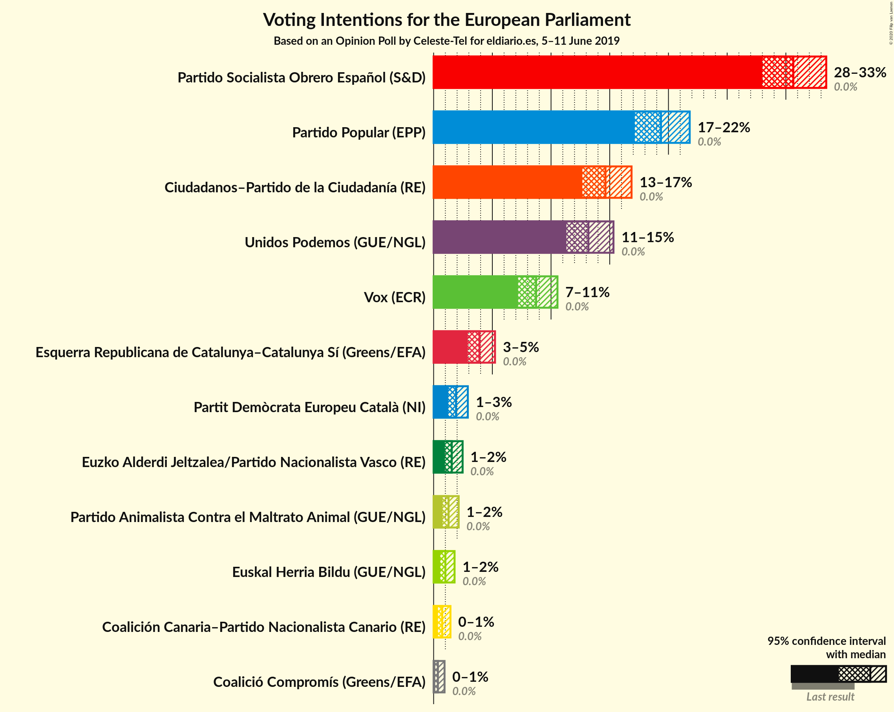
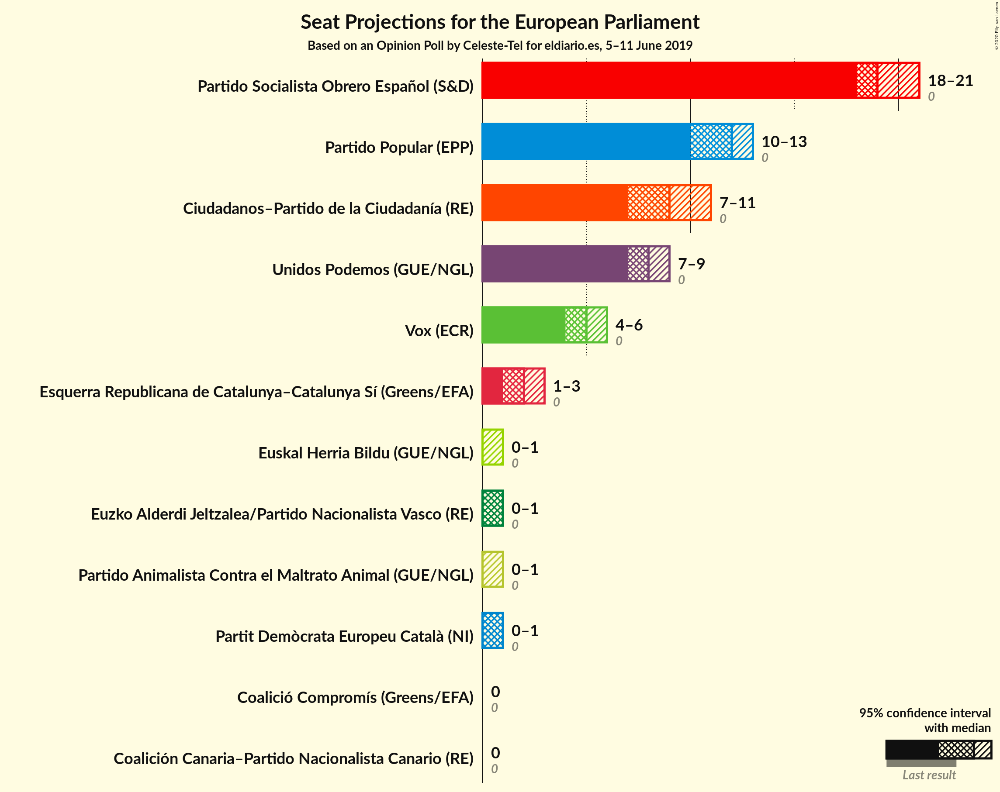

# Opinion Poll by Celeste-Tel for eldiario.es, 5–11 June 2019

<a href="#voting-intentions">Voting Intentions</a> | <a href="#seats">Seats</a> | <a href="#coalitions">Coalitions</a> | <a href="#technical-information">Technical Information</a>

## Voting Intentions

### Confidence Intervals

| Party | Last Result | Poll Result | 80% Confidence Interval | 90% Confidence Interval | 95% Confidence Interval | 99% Confidence Interval |
|:-----:|:-----------:|:-----------:|:-----------------------:|:-----------------------:|:-----------------------:|:-----------------------:|
| Partido Socialista Obrero Español (S&D) | 0.0% | 30.6% | 28.9–32.5% |28.4–33.0% |28.0–33.4% |27.2–34.3% |
| Partido Popular (EPP) | 0.0% | 19.4% | 17.9–21.0% |17.5–21.4% |17.1–21.8% |16.4–22.6% |
| Ciudadanos–Partido de la Ciudadanía (RE) | 0.0% | 14.6% | 13.3–16.1% |13.0–16.5% |12.7–16.9% |12.1–17.6% |
| Unidos Podemos (GUE/NGL) | 0.0% | 13.2% | 11.9–14.6% |11.6–15.0% |11.3–15.3% |10.7–16.0% |
| Vox (ECR) | 0.0% | 8.7% | 7.7–9.9% |7.4–10.3% |7.2–10.5% |6.7–11.1% |
| Esquerra Republicana de Catalunya–Catalunya Sí (Greens/EFA) | N/A | 3.9% | 3.2–4.8% |3.1–5.0% |2.9–5.2% |2.6–5.7% |
| Partit Demòcrata Europeu Català (NI) | 0.0% | 1.9% | 1.5–2.6% |1.4–2.7% |1.2–2.9% |1.1–3.2% |
| Euzko Alderdi Jeltzalea/Partido Nacionalista Vasco (RE) | 0.0% | 1.5% | 1.2–2.1% |1.1–2.3% |1.0–2.5% |0.8–2.8% |
| Partido Animalista Contra el Maltrato Animal (GUE/NGL) | 0.0% | 1.3% | 0.9–1.8% |0.8–2.0% |0.8–2.1% |0.6–2.4% |
| Euskal Herria Bildu (Greens/EFA) | N/A | 1.0% | 0.7–1.5% |0.6–1.7% |0.6–1.8% |0.4–2.1% |
| Coalición Canaria–Partido Nacionalista Canario (RE) | 0.0% | 0.7% | 0.5–1.2% |0.4–1.3% |0.4–1.4% |0.3–1.7% |
| Coalició Compromís (Greens/EFA) | 0.0% | 0.4% | 0.2–0.7% |0.2–0.8% |0.1–0.9% |0.1–1.1% |

*Note:* The poll result column reflects the actual value used in the calculations. Published results may vary slightly, and in addition be rounded to fewer digits.

## Seats

### Confidence Intervals

| Party | Last Result | Median | 80% Confidence Interval | 90% Confidence Interval | 95% Confidence Interval | 99% Confidence Interval |
|:-----:|:-----------:|:------:|:-----------------------:|:-----------------------:|:-----------------------:|:-----------------------:|
| <a href="#partido-socialista-obrero-español-(s&d)">Partido Socialista Obrero Español (S&D)</a> | 0 | 17 | 16–19 |16–19 |16–20 |16–20 |
| <a href="#partido-popular-(epp)">Partido Popular (EPP)</a> | 0 | 11 | 10–12 |10–12 |10–12 |9–13 |
| <a href="#ciudadanos–partido-de-la-ciudadanía-(re)">Ciudadanos–Partido de la Ciudadanía (RE)</a> | 0 | 8 | 7–9 |7–10 |7–10 |7–10 |
| <a href="#unidos-podemos-(gue/ngl)">Unidos Podemos (GUE/NGL)</a> | 0 | 7 | 7–8 |6–8 |6–9 |6–9 |
| <a href="#vox-(ecr)">Vox (ECR)</a> | 0 | 5 | 4–6 |4–6 |4–6 |4–6 |
| <a href="#esquerra-republicana-de-catalunya–catalunya-sí-(greens/efa)">Esquerra Republicana de Catalunya–Catalunya Sí (Greens/EFA)</a> | N/A | 2 | 2 |1–3 |1–3 |1–3 |
| <a href="#partit-demòcrata-europeu-català-(ni)">Partit Demòcrata Europeu Català (NI)</a> | 0 | 1 | 0–1 |0–1 |0–1 |0–1 |
| <a href="#euzko-alderdi-jeltzalea/partido-nacionalista-vasco-(re)">Euzko Alderdi Jeltzalea/Partido Nacionalista Vasco (RE)</a> | 0 | 1 | 0–1 |0–1 |0–1 |0–1 |
| <a href="#partido-animalista-contra-el-maltrato-animal-(gue/ngl)">Partido Animalista Contra el Maltrato Animal (GUE/NGL)</a> | 0 | 0 | 0–1 |0–1 |0–1 |0–1 |
| <a href="#euskal-herria-bildu-(greens/efa)">Euskal Herria Bildu (Greens/EFA)</a> | N/A | 0 | 0 |0–1 |0–1 |0–1 |
| <a href="#coalición-canaria–partido-nacionalista-canario-(re)">Coalición Canaria–Partido Nacionalista Canario (RE)</a> | 0 | 0 | 0 |0 |0 |0–1 |
| <a href="#coalició-compromís-(greens/efa)">Coalició Compromís (Greens/EFA)</a> | 0 | 0 | 0 |0 |0 |0 |

