# Opinion Poll by Celeste-Tel for eldiario.es, 5–11 June 2019

<a href="#voting-intentions">Voting Intentions</a> | <a href="#seats">Seats</a> | <a href="#coalitions">Coalitions</a> | <a href="#technical-information">Technical Information</a>

## Voting Intentions

### Confidence Intervals

| Party | Last Result | Poll Result | 80% Confidence Interval | 90% Confidence Interval | 95% Confidence Interval | 99% Confidence Interval |
|:-----:|:-----------:|:-----------:|:-----------------------:|:-----------------------:|:-----------------------:|:-----------------------:|
| Partido Socialista Obrero Español (S&D) | 0.0% | 30.6% | 28.9–32.5% |28.4–33.0% |28.0–33.4% |27.2–34.3% |
| Partido Popular (EPP) | 0.0% | 19.4% | 17.9–21.0% |17.5–21.4% |17.1–21.8% |16.4–22.6% |
| Ciudadanos–Partido de la Ciudadanía (RE) | 0.0% | 14.6% | 13.3–16.1% |13.0–16.5% |12.7–16.9% |12.1–17.6% |
| Unidos Podemos (GUE/NGL) | 0.0% | 13.2% | 11.9–14.6% |11.6–15.0% |11.3–15.3% |10.7–16.0% |
| Vox (ECR) | 0.0% | 8.7% | 7.7–9.9% |7.4–10.3% |7.2–10.5% |6.7–11.1% |
| Esquerra Republicana de Catalunya–Catalunya Sí (Greens/EFA) | 0.0% | 3.9% | 3.2–4.8% |3.1–5.0% |2.9–5.2% |2.6–5.7% |
| Partit Demòcrata Europeu Català (NI) | 0.0% | 1.9% | 1.5–2.6% |1.4–2.7% |1.2–2.9% |1.1–3.2% |
| Euzko Alderdi Jeltzalea/Partido Nacionalista Vasco (RE) | 0.0% | 1.5% | 1.2–2.1% |1.1–2.3% |1.0–2.5% |0.8–2.8% |
| Partido Animalista Contra el Maltrato Animal (GUE/NGL) | 0.0% | 1.3% | 0.9–1.8% |0.8–2.0% |0.8–2.1% |0.6–2.4% |
| Euskal Herria Bildu (GUE/NGL) | 0.0% | 1.0% | 0.7–1.5% |0.6–1.7% |0.6–1.8% |0.4–2.1% |
| Coalición Canaria–Partido Nacionalista Canario (RE) | 0.0% | 0.7% | 0.5–1.2% |0.4–1.3% |0.4–1.4% |0.3–1.7% |
| Coalició Compromís (Greens/EFA) | 0.0% | 0.4% | 0.2–0.7% |0.2–0.8% |0.1–0.9% |0.1–1.1% |

*Note:* The poll result column reflects the actual value used in the calculations. Published results may vary slightly, and in addition be rounded to fewer digits.

## Seats

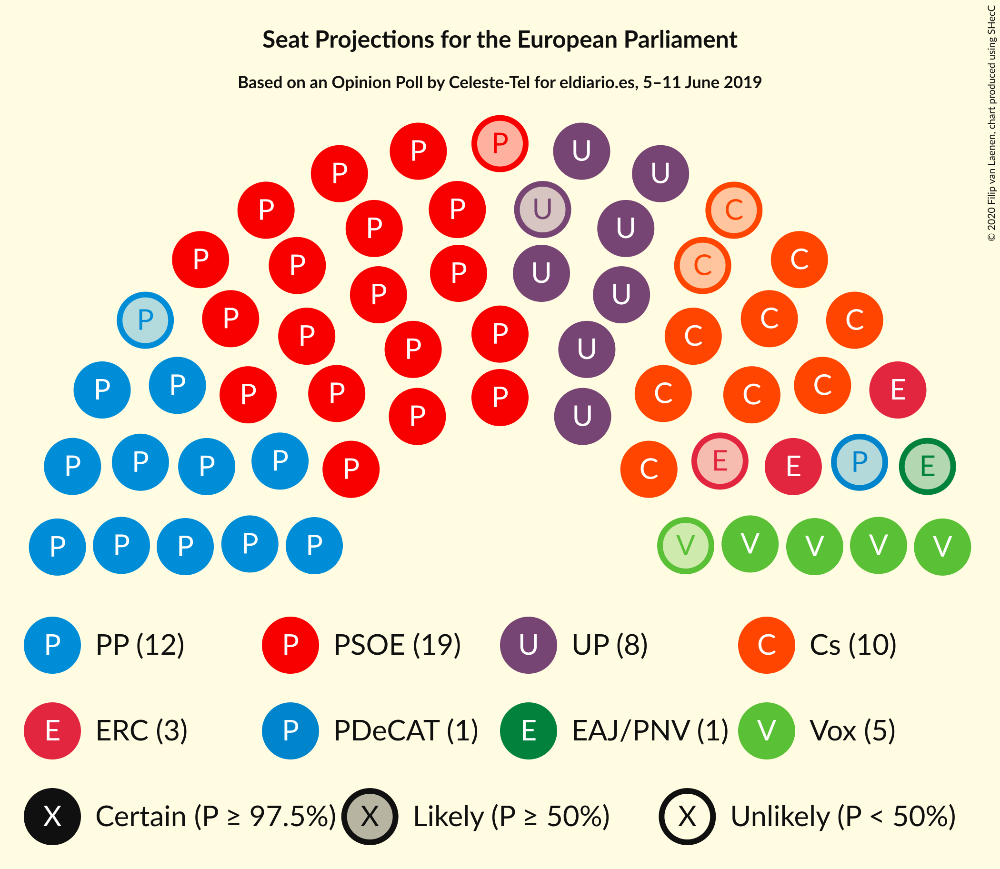

### Confidence Intervals

| Party | Last Result | Median | 80% Confidence Interval | 90% Confidence Interval | 95% Confidence Interval | 99% Confidence Interval |
|:-----:|:-----------:|:------:|:-----------------------:|:-----------------------:|:-----------------------:|:-----------------------:|
| <a href="#partido-socialista-obrero-español-(s&d)">Partido Socialista Obrero Español (S&D)</a> | 0 | 19 | 18–20 |18–21 |18–21 |17–21 |
| <a href="#partido-popular-(epp)">Partido Popular (EPP)</a> | 0 | 12 | 12 |12–13 |11–13 |10–13 |
| <a href="#ciudadanos–partido-de-la-ciudadanía-(re)">Ciudadanos–Partido de la Ciudadanía (RE)</a> | 0 | 10 | 8–10 |8–10 |8–10 |8–11 |
| <a href="#unidos-podemos-(gue/ngl)">Unidos Podemos (GUE/NGL)</a> | 0 | 8 | 7–8 |7–8 |7–9 |7–10 |
| <a href="#vox-(ecr)">Vox (ECR)</a> | 0 | 5 | 4–5 |4–5 |4–6 |4–6 |
| <a href="#esquerra-republicana-de-catalunya–catalunya-sí-(greens/efa)">Esquerra Republicana de Catalunya–Catalunya Sí (Greens/EFA)</a> | 0 | 3 | 2–3 |2–3 |2–3 |1–3 |
| <a href="#partit-demòcrata-europeu-català-(ni)">Partit Demòcrata Europeu Català (NI)</a> | 0 | 1 | 0–1 |0–1 |0–1 |0–2 |
| <a href="#euzko-alderdi-jeltzalea/partido-nacionalista-vasco-(re)">Euzko Alderdi Jeltzalea/Partido Nacionalista Vasco (RE)</a> | 0 | 1 | 0–1 |0–1 |0–1 |0–1 |
| <a href="#partido-animalista-contra-el-maltrato-animal-(gue/ngl)">Partido Animalista Contra el Maltrato Animal (GUE/NGL)</a> | 0 | 0 | 0–1 |0–1 |0–1 |0–1 |
| <a href="#euskal-herria-bildu-(gue/ngl)">Euskal Herria Bildu (GUE/NGL)</a> | 0 | 0 | 0–1 |0–1 |0–1 |0–1 |
| <a href="#coalición-canaria–partido-nacionalista-canario-(re)">Coalición Canaria–Partido Nacionalista Canario (RE)</a> | 0 | 0 | 0 |0 |0 |0 |
| <a href="#coalició-compromís-(greens/efa)">Coalició Compromís (Greens/EFA)</a> | 0 | 0 | 0 |0 |0 |0 |

### Partido Socialista Obrero Español (S&D)

*For a full overview of the results for this party, see the [Partido Socialista Obrero Español (S&D)](party-partidosocialistaobreroespañolsd.html) page.*

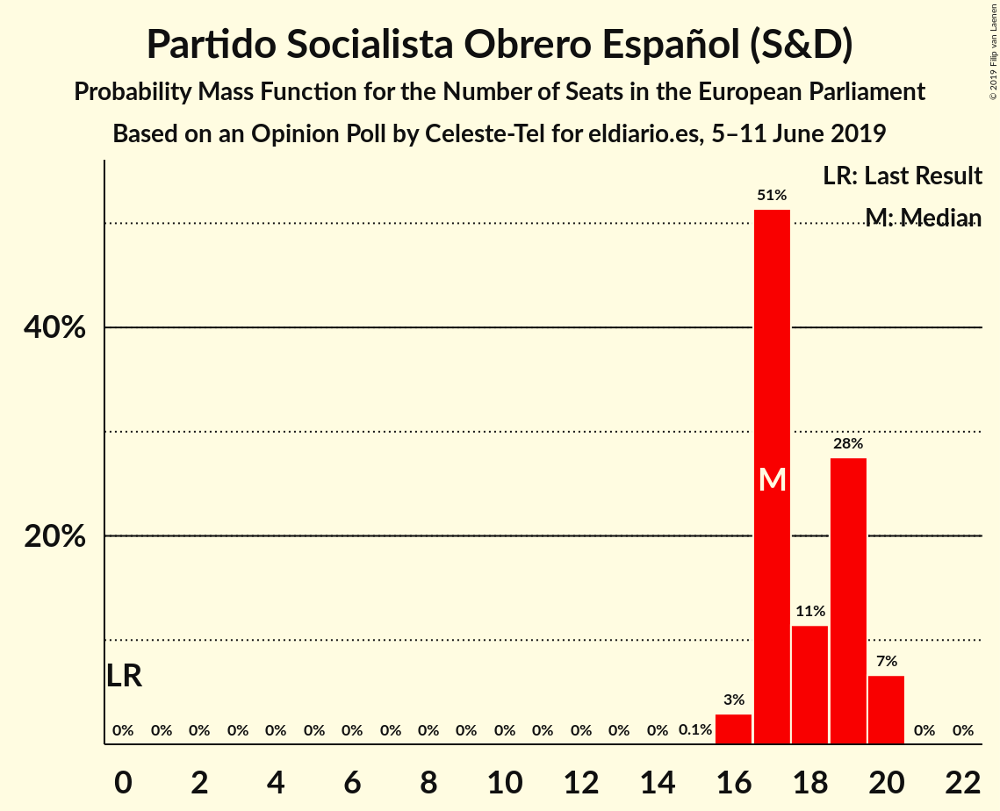

| Number of Seats | Probability | Accumulated | Special Marks |
|:---------------:|:-----------:|:-----------:|:-------------:|
| 0 | 0% | 100% | Last Result |
| 1 | 0% | 100% |  |
| 2 | 0% | 100% |  |
| 3 | 0% | 100% |  |
| 4 | 0% | 100% |  |
| 5 | 0% | 100% |  |
| 6 | 0% | 100% |  |
| 7 | 0% | 100% |  |
| 8 | 0% | 100% |  |
| 9 | 0% | 100% |  |
| 10 | 0% | 100% |  |
| 11 | 0% | 100% |  |
| 12 | 0% | 100% |  |
| 13 | 0% | 100% |  |
| 14 | 0% | 100% |  |
| 15 | 0% | 100% |  |
| 16 | 0% | 100% |  |
| 17 | 2% | 100% |  |
| 18 | 14% | 98% |  |
| 19 | 42% | 84% | Median |
| 20 | 33% | 42% |  |
| 21 | 9% | 9% |  |
| 22 | 0.4% | 0.4% |  |
| 23 | 0% | 0% |  |

### Partido Popular (EPP)

*For a full overview of the results for this party, see the [Partido Popular (EPP)](party-partidopopularepp.html) page.*

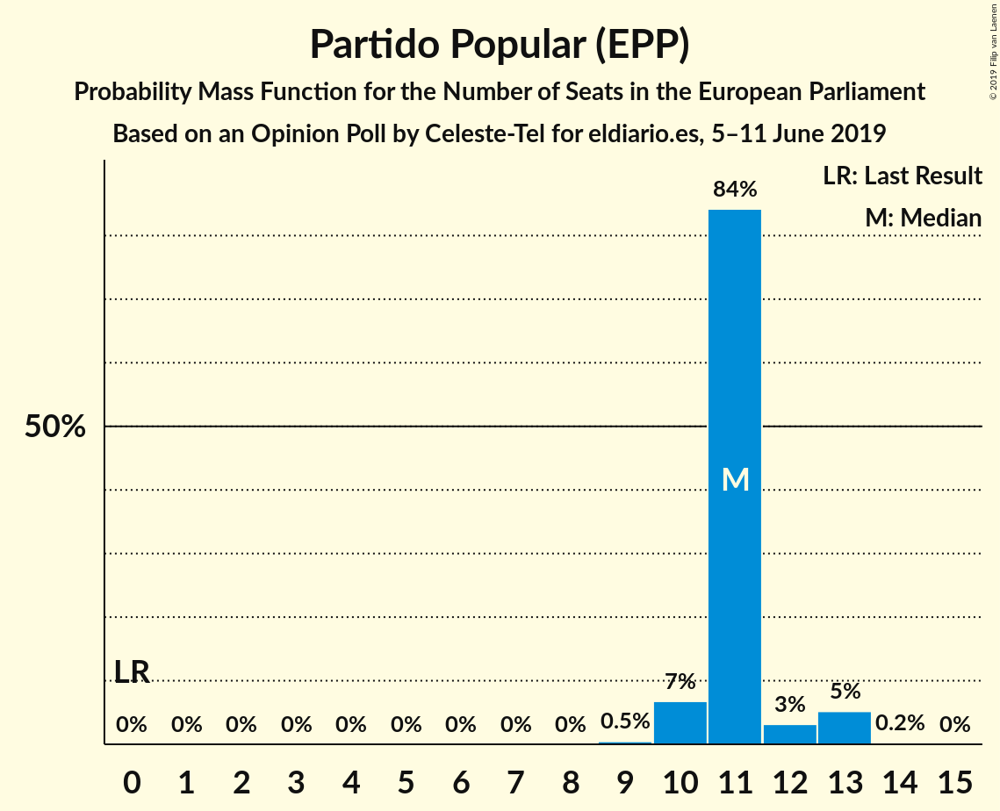

| Number of Seats | Probability | Accumulated | Special Marks |
|:---------------:|:-----------:|:-----------:|:-------------:|
| 0 | 0% | 100% | Last Result |
| 1 | 0% | 100% |  |
| 2 | 0% | 100% |  |
| 3 | 0% | 100% |  |
| 4 | 0% | 100% |  |
| 5 | 0% | 100% |  |
| 6 | 0% | 100% |  |
| 7 | 0% | 100% |  |
| 8 | 0% | 100% |  |
| 9 | 0% | 100% |  |
| 10 | 0.7% | 100% |  |
| 11 | 3% | 99.3% |  |
| 12 | 88% | 96% | Median |
| 13 | 8% | 8% |  |
| 14 | 0.2% | 0.4% |  |
| 15 | 0.2% | 0.3% |  |
| 16 | 0% | 0% |  |

### Ciudadanos–Partido de la Ciudadanía (RE)

*For a full overview of the results for this party, see the [Ciudadanos–Partido de la Ciudadanía (RE)](party-ciudadanos–partidodelaciudadaníare.html) page.*

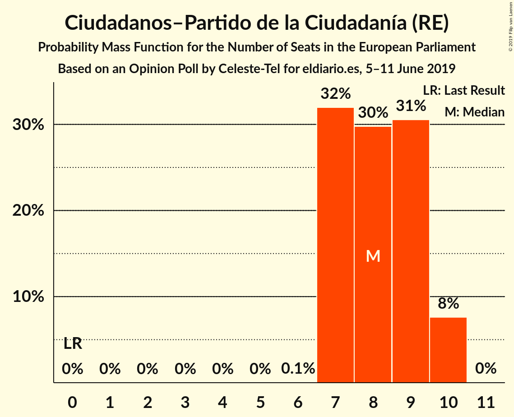

| Number of Seats | Probability | Accumulated | Special Marks |
|:---------------:|:-----------:|:-----------:|:-------------:|
| 0 | 0% | 100% | Last Result |
| 1 | 0% | 100% |  |
| 2 | 0% | 100% |  |
| 3 | 0% | 100% |  |
| 4 | 0% | 100% |  |
| 5 | 0% | 100% |  |
| 6 | 0% | 100% |  |
| 7 | 0.1% | 100% |  |
| 8 | 29% | 99.9% |  |
| 9 | 20% | 71% |  |
| 10 | 50% | 52% | Median |
| 11 | 1.4% | 1.4% |  |
| 12 | 0% | 0% |  |

### Unidos Podemos (GUE/NGL)

*For a full overview of the results for this party, see the [Unidos Podemos (GUE/NGL)](party-unidospodemosguengl.html) page.*

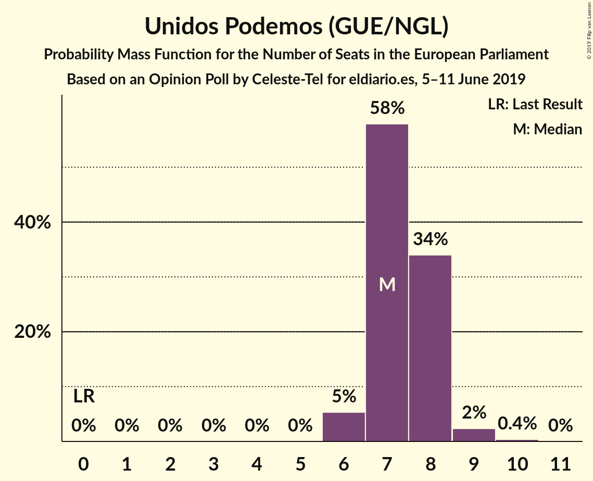

| Number of Seats | Probability | Accumulated | Special Marks |
|:---------------:|:-----------:|:-----------:|:-------------:|
| 0 | 0% | 100% | Last Result |
| 1 | 0% | 100% |  |
| 2 | 0% | 100% |  |
| 3 | 0% | 100% |  |
| 4 | 0% | 100% |  |
| 5 | 0% | 100% |  |
| 6 | 0.1% | 100% |  |
| 7 | 31% | 99.9% |  |
| 8 | 66% | 69% | Median |
| 9 | 1.1% | 3% |  |
| 10 | 1.5% | 1.5% |  |
| 11 | 0% | 0% |  |

### Vox (ECR)

*For a full overview of the results for this party, see the [Vox (ECR)](party-voxecr.html) page.*

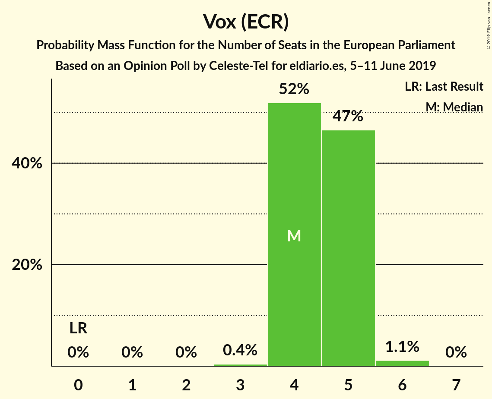

| Number of Seats | Probability | Accumulated | Special Marks |
|:---------------:|:-----------:|:-----------:|:-------------:|
| 0 | 0% | 100% | Last Result |
| 1 | 0% | 100% |  |
| 2 | 0% | 100% |  |
| 3 | 0% | 100% |  |
| 4 | 14% | 100% |  |
| 5 | 81% | 86% | Median |
| 6 | 5% | 5% |  |
| 7 | 0.2% | 0.3% |  |
| 8 | 0% | 0% |  |

### Esquerra Republicana de Catalunya–Catalunya Sí (Greens/EFA)

*For a full overview of the results for this party, see the [Esquerra Republicana de Catalunya–Catalunya Sí (Greens/EFA)](party-esquerrarepublicanadecatalunya–catalunyasígreensefa.html) page.*

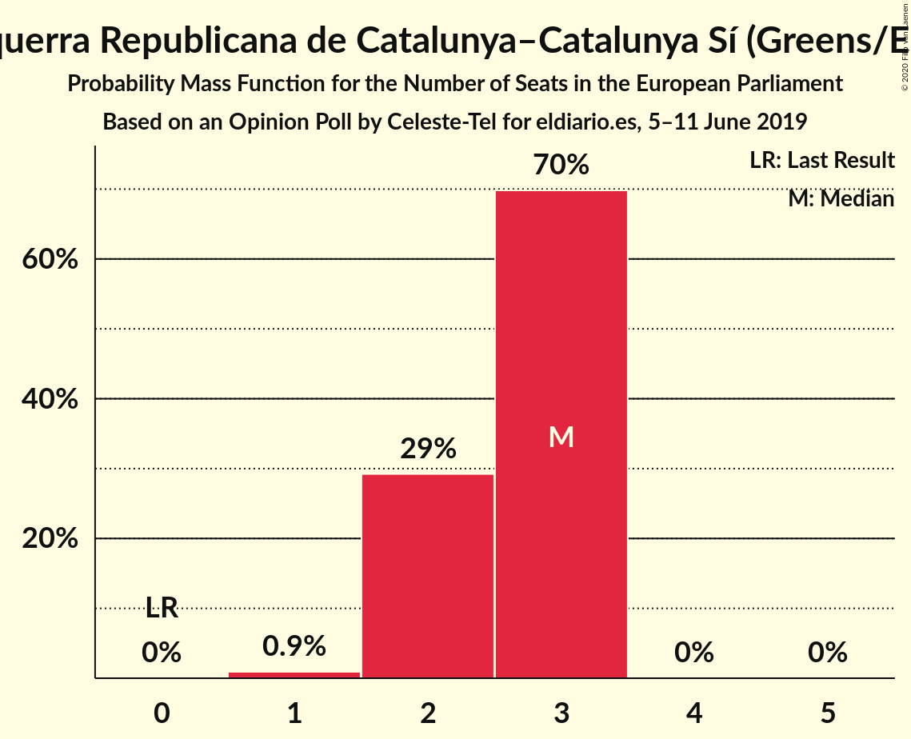

| Number of Seats | Probability | Accumulated | Special Marks |
|:---------------:|:-----------:|:-----------:|:-------------:|
| 0 | 0% | 100% | Last Result |
| 1 | 0.9% | 100% |  |
| 2 | 29% | 99.1% |  |
| 3 | 70% | 70% | Median |
| 4 | 0% | 0% |  |

### Partit Demòcrata Europeu Català (NI)

*For a full overview of the results for this party, see the [Partit Demòcrata Europeu Català (NI)](party-partitdemòcrataeuropeucatalàni.html) page.*

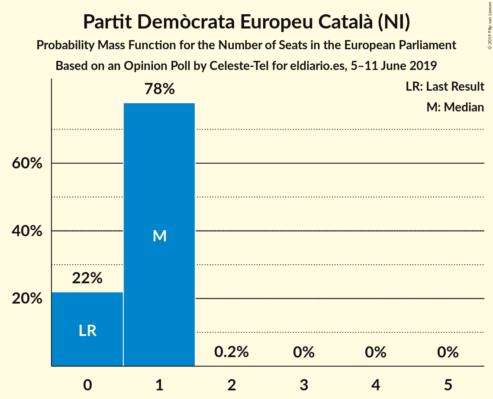

| Number of Seats | Probability | Accumulated | Special Marks |
|:---------------:|:-----------:|:-----------:|:-------------:|
| 0 | 44% | 100% | Last Result |
| 1 | 55% | 56% | Median |
| 2 | 0.9% | 0.9% |  |
| 3 | 0% | 0% |  |

### Euzko Alderdi Jeltzalea/Partido Nacionalista Vasco (RE)

*For a full overview of the results for this party, see the [Euzko Alderdi Jeltzalea/Partido Nacionalista Vasco (RE)](party-euzkoalderdijeltzaleapartidonacionalistavascore.html) page.*

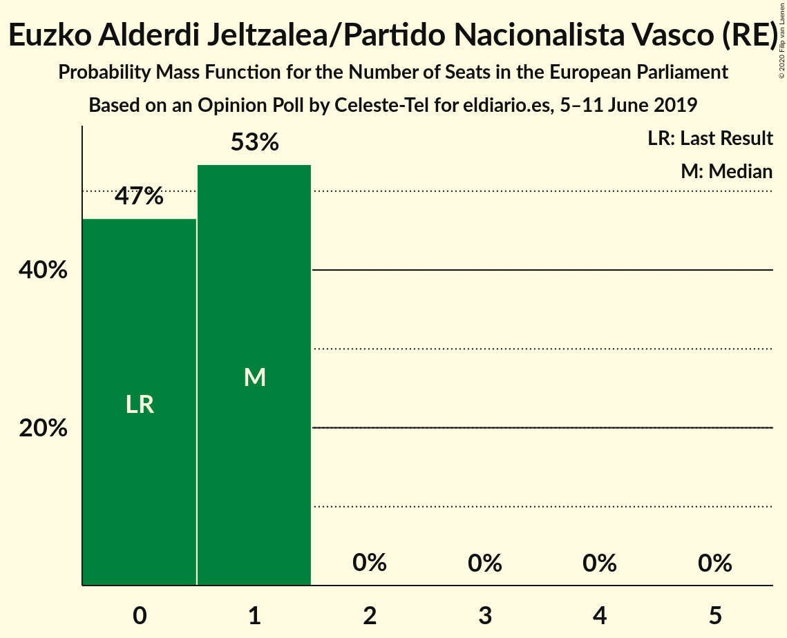

| Number of Seats | Probability | Accumulated | Special Marks |
|:---------------:|:-----------:|:-----------:|:-------------:|
| 0 | 47% | 100% | Last Result |
| 1 | 53% | 53% | Median |
| 2 | 0% | 0% |  |

### Partido Animalista Contra el Maltrato Animal (GUE/NGL)

*For a full overview of the results for this party, see the [Partido Animalista Contra el Maltrato Animal (GUE/NGL)](party-partidoanimalistacontraelmaltratoanimalguengl.html) page.*

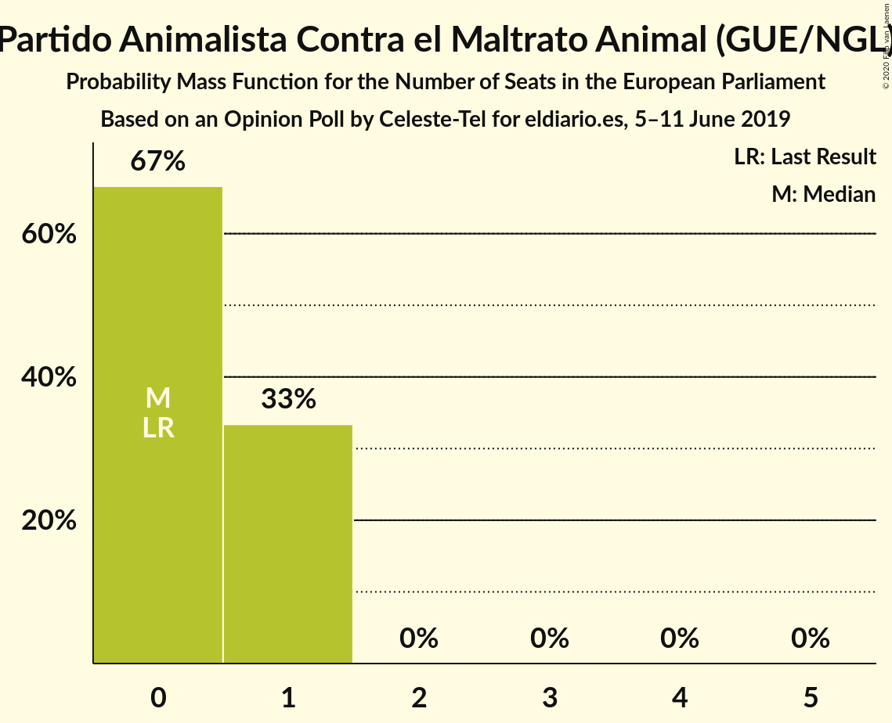

| Number of Seats | Probability | Accumulated | Special Marks |
|:---------------:|:-----------:|:-----------:|:-------------:|
| 0 | 76% | 100% | Last Result, Median |
| 1 | 24% | 24% |  |
| 2 | 0% | 0% |  |

### Euskal Herria Bildu (GUE/NGL)

*For a full overview of the results for this party, see the [Euskal Herria Bildu (GUE/NGL)](party-euskalherriabilduguengl.html) page.*

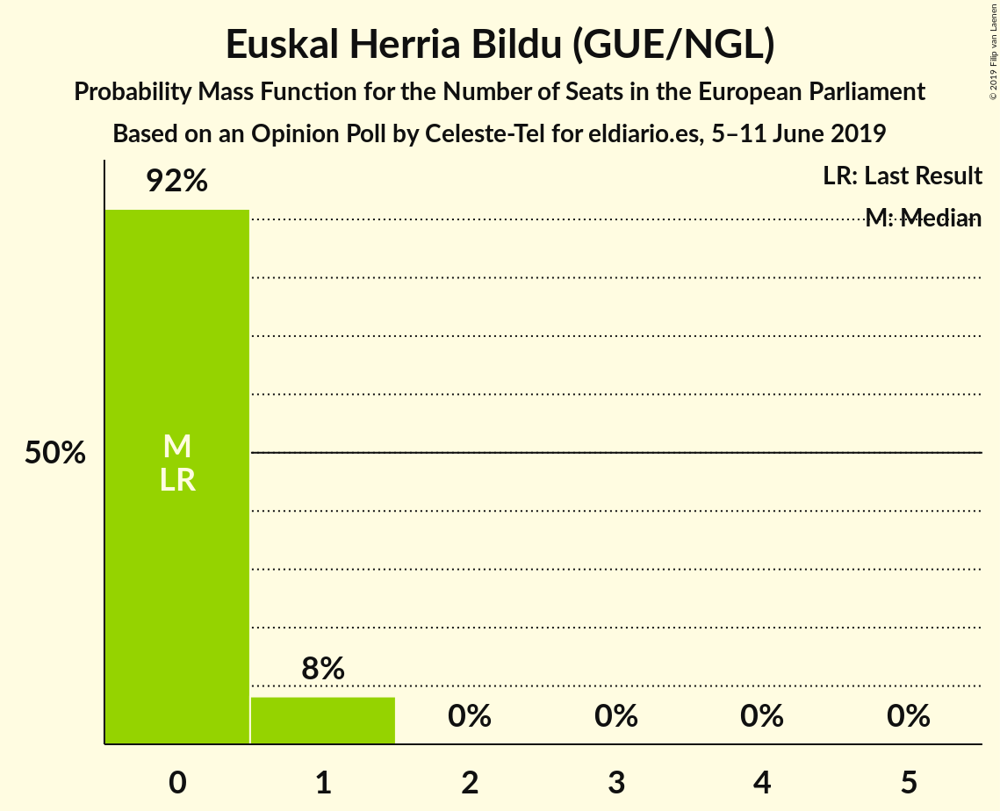

| Number of Seats | Probability | Accumulated | Special Marks |
|:---------------:|:-----------:|:-----------:|:-------------:|
| 0 | 74% | 100% | Last Result, Median |
| 1 | 26% | 26% |  |
| 2 | 0% | 0% |  |

### Coalición Canaria–Partido Nacionalista Canario (RE)

*For a full overview of the results for this party, see the [Coalición Canaria–Partido Nacionalista Canario (RE)](party-coalicióncanaria–partidonacionalistacanariore.html) page.*

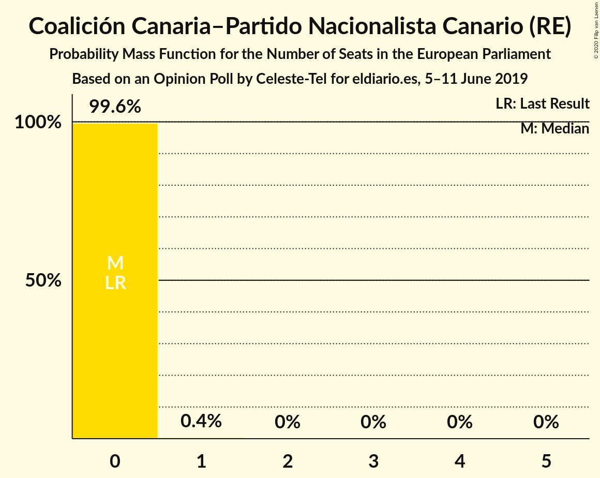

| Number of Seats | Probability | Accumulated | Special Marks |
|:---------------:|:-----------:|:-----------:|:-------------:|
| 0 | 99.8% | 100% | Last Result, Median |
| 1 | 0.2% | 0.2% |  |
| 2 | 0% | 0% |  |

### Coalició Compromís (Greens/EFA)

*For a full overview of the results for this party, see the [Coalició Compromís (Greens/EFA)](party-coaliciócompromísgreensefa.html) page.*

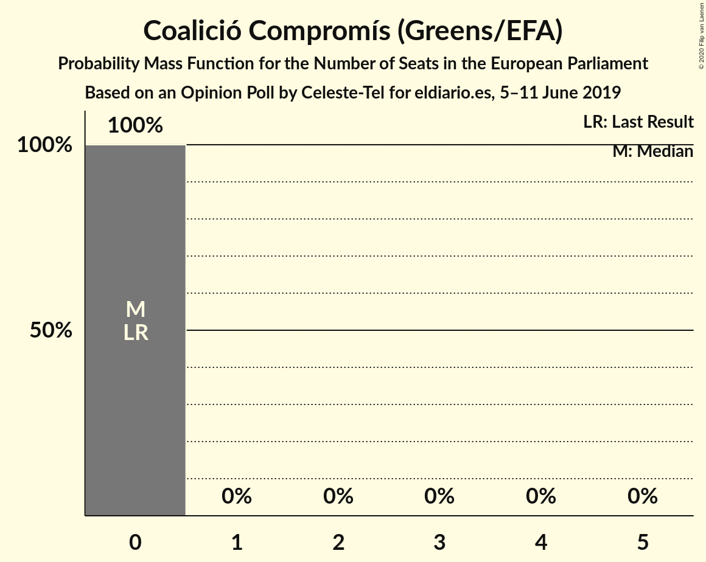

| Number of Seats | Probability | Accumulated | Special Marks |
|:---------------:|:-----------:|:-----------:|:-------------:|
| 0 | 100% | 100% | Last Result, Median |

## Coalitions

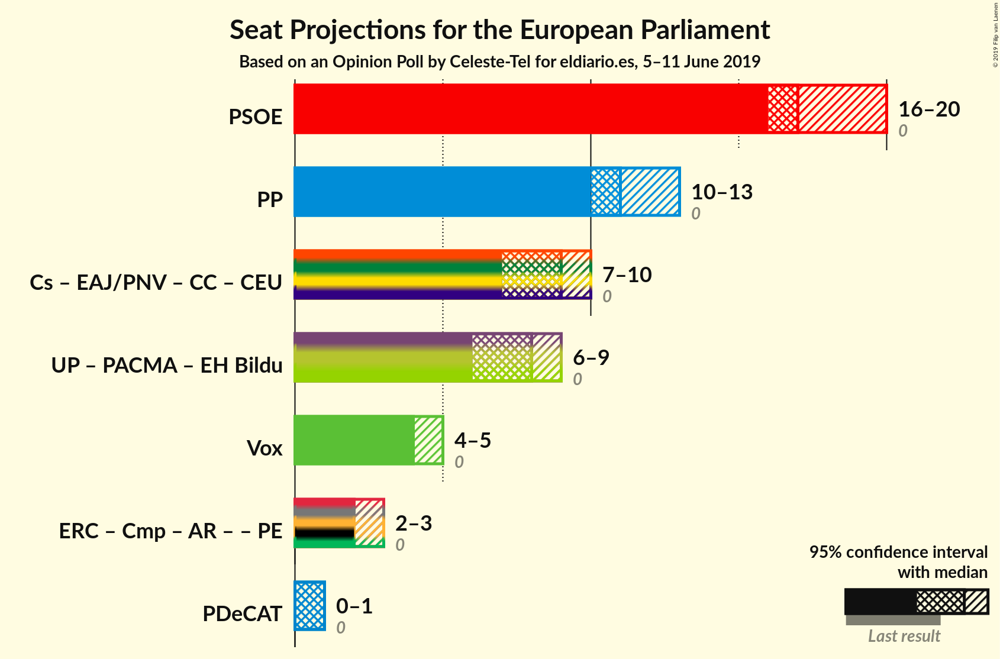

### Confidence Intervals

| Coalition | Last Result | Median | Majority? | 80% Confidence Interval | 90% Confidence Interval | 95% Confidence Interval | 99% Confidence Interval |
|:---------:|:-----------:|:------:|:---------:|:-----------------------:|:-----------------------:|:-----------------------:|:-----------------------:|
| Partido Socialista Obrero Español (S&D) | 0 | 19 | 0% | 18–20 | 18–21 | 18–21 | 17–21 |
| Partido Popular (EPP) | 0 | 12 | 0% | 12 | 12–13 | 11–13 | 10–13 |
| Unidos Podemos (GUE/NGL) – Partido Animalista Contra el Maltrato Animal (GUE/NGL) – Euskal Herria Bildu (GUE/NGL) | 0 | 8 | 0% | 8–9 | 8–9 | 7–10 | 7–11 |
| Vox (ECR) | 0 | 5 | 0% | 4–5 | 4–5 | 4–6 | 4–6 |
| Partit Demòcrata Europeu Català (NI) | 0 | 1 | 0% | 0–1 | 0–1 | 0–1 | 0–2 |

### Partido Socialista Obrero Español (S&D)

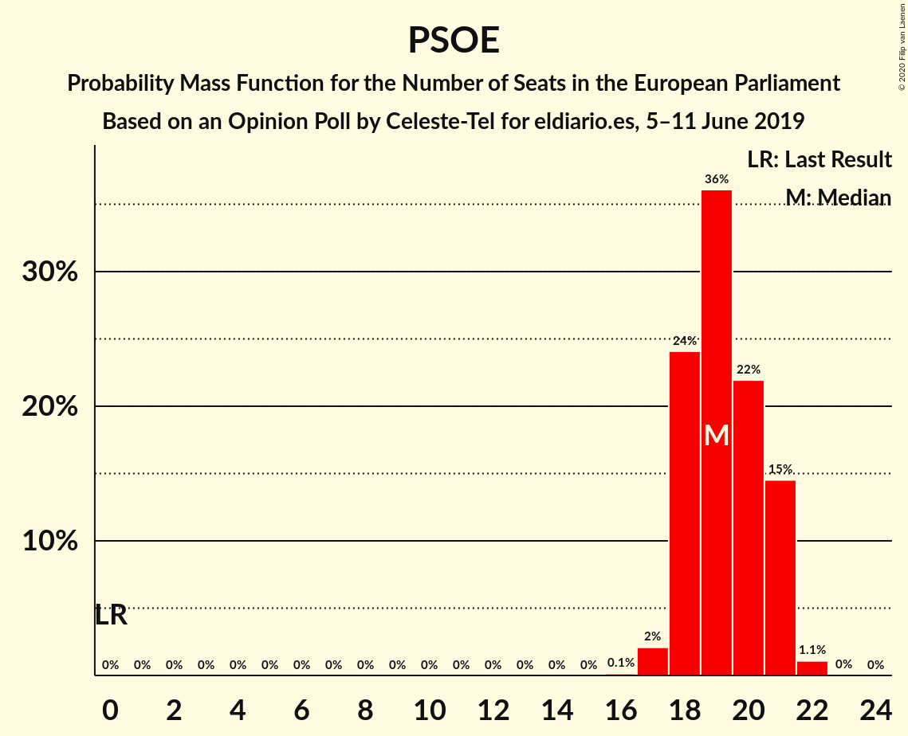

| Number of Seats | Probability | Accumulated | Special Marks |
|:---------------:|:-----------:|:-----------:|:-------------:|
| 0 | 0% | 100% | Last Result |
| 1 | 0% | 100% |  |
| 2 | 0% | 100% |  |
| 3 | 0% | 100% |  |
| 4 | 0% | 100% |  |
| 5 | 0% | 100% |  |
| 6 | 0% | 100% |  |
| 7 | 0% | 100% |  |
| 8 | 0% | 100% |  |
| 9 | 0% | 100% |  |
| 10 | 0% | 100% |  |
| 11 | 0% | 100% |  |
| 12 | 0% | 100% |  |
| 13 | 0% | 100% |  |
| 14 | 0% | 100% |  |
| 15 | 0% | 100% |  |
| 16 | 0% | 100% |  |
| 17 | 2% | 100% |  |
| 18 | 14% | 98% |  |
| 19 | 42% | 84% | Median |
| 20 | 33% | 42% |  |
| 21 | 9% | 9% |  |
| 22 | 0.4% | 0.4% |  |
| 23 | 0% | 0% |  |

### Partido Popular (EPP)

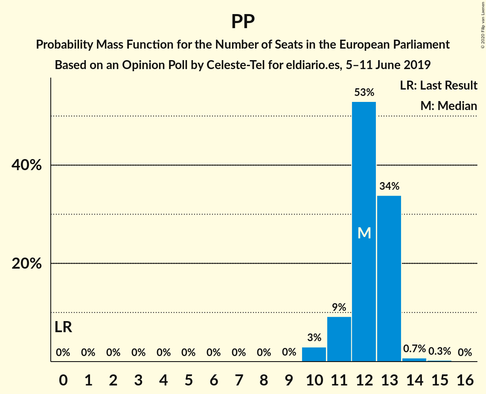

| Number of Seats | Probability | Accumulated | Special Marks |
|:---------------:|:-----------:|:-----------:|:-------------:|
| 0 | 0% | 100% | Last Result |
| 1 | 0% | 100% |  |
| 2 | 0% | 100% |  |
| 3 | 0% | 100% |  |
| 4 | 0% | 100% |  |
| 5 | 0% | 100% |  |
| 6 | 0% | 100% |  |
| 7 | 0% | 100% |  |
| 8 | 0% | 100% |  |
| 9 | 0% | 100% |  |
| 10 | 0.7% | 100% |  |
| 11 | 3% | 99.3% |  |
| 12 | 88% | 96% | Median |
| 13 | 8% | 8% |  |
| 14 | 0.2% | 0.4% |  |
| 15 | 0.2% | 0.3% |  |
| 16 | 0% | 0% |  |

### Unidos Podemos (GUE/NGL) – Partido Animalista Contra el Maltrato Animal (GUE/NGL) – Euskal Herria Bildu (GUE/NGL)

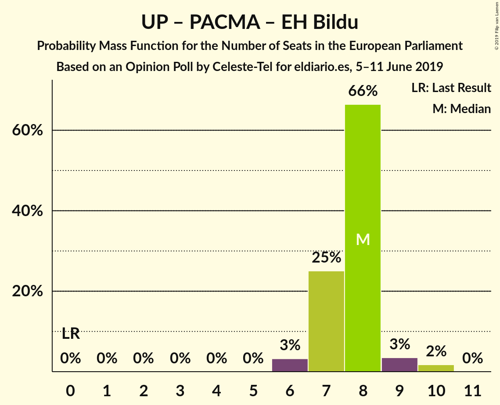

| Number of Seats | Probability | Accumulated | Special Marks |
|:---------------:|:-----------:|:-----------:|:-------------:|
| 0 | 0% | 100% | Last Result |
| 1 | 0% | 100% |  |
| 2 | 0% | 100% |  |
| 3 | 0% | 100% |  |
| 4 | 0% | 100% |  |
| 5 | 0% | 100% |  |
| 6 | 0.1% | 100% |  |
| 7 | 4% | 99.9% |  |
| 8 | 73% | 96% | Median |
| 9 | 19% | 22% |  |
| 10 | 0.9% | 3% |  |
| 11 | 2% | 2% |  |
| 12 | 0% | 0% |  |

### Vox (ECR)

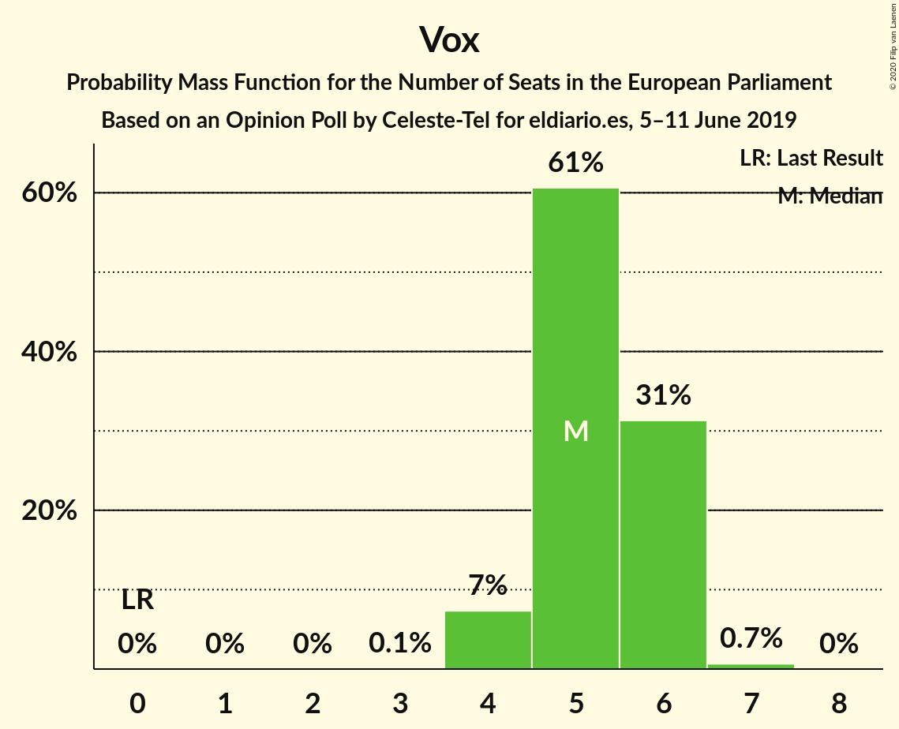

| Number of Seats | Probability | Accumulated | Special Marks |
|:---------------:|:-----------:|:-----------:|:-------------:|
| 0 | 0% | 100% | Last Result |
| 1 | 0% | 100% |  |
| 2 | 0% | 100% |  |
| 3 | 0% | 100% |  |
| 4 | 14% | 100% |  |
| 5 | 81% | 86% | Median |
| 6 | 5% | 5% |  |
| 7 | 0.2% | 0.3% |  |
| 8 | 0% | 0% |  |

### Partit Demòcrata Europeu Català (NI)

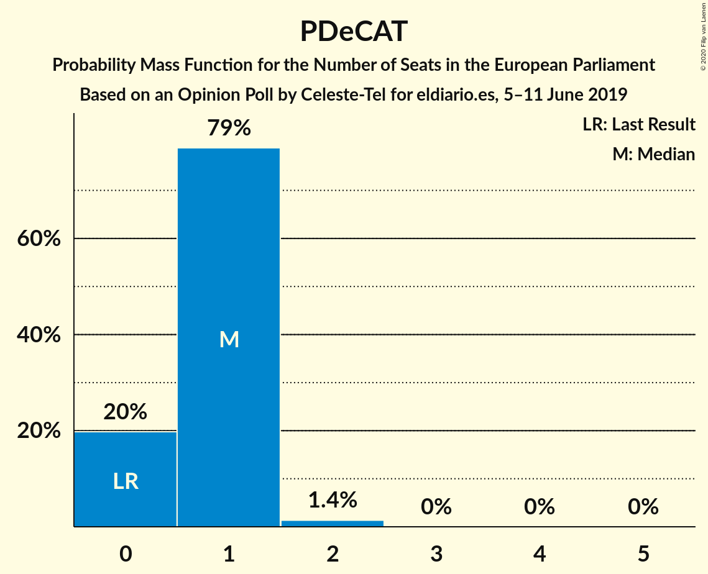

| Number of Seats | Probability | Accumulated | Special Marks |
|:---------------:|:-----------:|:-----------:|:-------------:|
| 0 | 44% | 100% | Last Result |
| 1 | 55% | 56% | Median |
| 2 | 0.9% | 0.9% |  |
| 3 | 0% | 0% |  |

## Technical Information

### Opinion Poll

+ **Polling firm:** Celeste-Tel
+ **Commissioner(s):** eldiario.es
+ **Fieldwork period:** 5–11 June 2019

### Calculations

+ **Sample size:** 1100
+ **Simulations done:** 131,072
+ **Error estimate:** 3.31%

