# Opinion Poll by Celeste-Tel for eldiario.es, 1–5 July 2019

<a href="#voting-intentions">Voting Intentions</a> | <a href="#seats">Seats</a> | <a href="#coalitions">Coalitions</a> | <a href="#technical-information">Technical Information</a>

## Voting Intentions

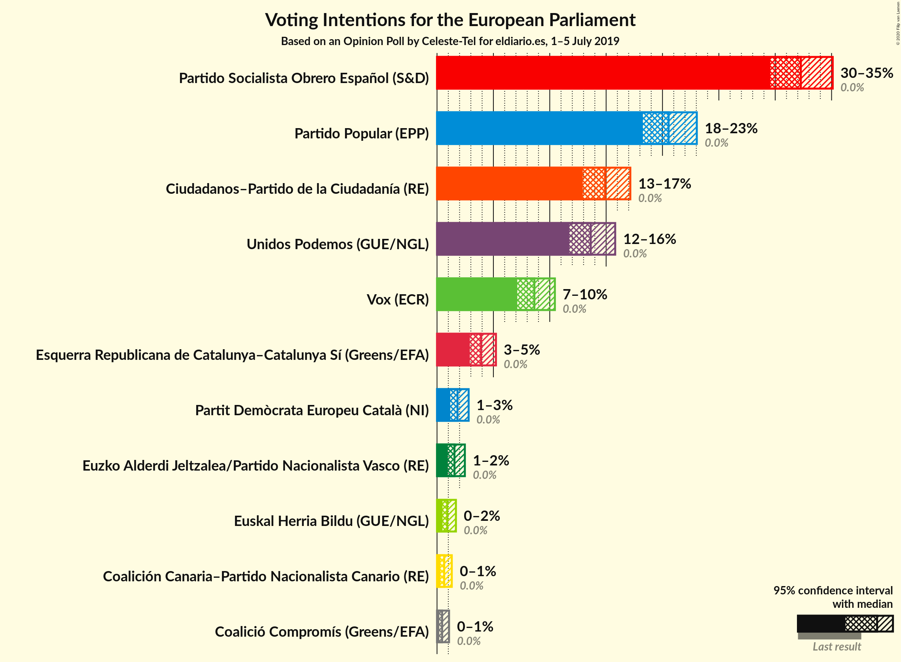

### Confidence Intervals

| Party | Last Result | Poll Result | 80% Confidence Interval | 90% Confidence Interval | 95% Confidence Interval | 99% Confidence Interval |
|:-----:|:-----------:|:-----------:|:-----------------------:|:-----------------------:|:-----------------------:|:-----------------------:|
| Partido Socialista Obrero Español (S&D) | 0.0% | 32.3% | 30.5–34.1% |30.0–34.6% |29.6–35.1% |28.7–36.0% |
| Partido Popular (EPP) | 0.0% | 20.5% | 19.0–22.2% |18.6–22.6% |18.3–23.0% |17.6–23.8% |
| Ciudadanos–Partido de la Ciudadanía (RE) | 0.0% | 14.9% | 13.6–16.4% |13.2–16.8% |12.9–17.1% |12.3–17.9% |
| Unidos Podemos (GUE/NGL) | 0.0% | 13.6% | 12.4–15.0% |12.0–15.5% |11.7–15.8% |11.2–16.5% |
| Vox (ECR) | 0.0% | 8.6% | 7.6–9.8% |7.3–10.2% |7.1–10.5% |6.7–11.1% |
| Esquerra Republicana de Catalunya–Catalunya Sí (Greens/EFA) | 0.0% | 3.9% | 3.2–4.8% |3.1–5.0% |2.9–5.2% |2.6–5.7% |
| Partit Demòcrata Europeu Català (NI) | 0.0% | 1.8% | 1.4–2.5% |1.3–2.6% |1.2–2.8% |1.0–3.1% |
| Euzko Alderdi Jeltzalea/Partido Nacionalista Vasco (RE) | 0.0% | 1.5% | 1.2–2.1% |1.1–2.3% |1.0–2.5% |0.8–2.8% |
| Euskal Herria Bildu (GUE/NGL) | 0.0% | 0.9% | 0.6–1.4% |0.5–1.5% |0.5–1.7% |0.4–1.9% |
| Coalición Canaria–Partido Nacionalista Canario (RE) | 0.0% | 0.6% | 0.4–1.1% |0.4–1.2% |0.3–1.3% |0.2–1.6% |
| Coalició Compromís (Greens/EFA) | 0.0% | 0.5% | 0.3–0.9% |0.2–1.0% |0.2–1.1% |0.1–1.3% |

*Note:* The poll result column reflects the actual value used in the calculations. Published results may vary slightly, and in addition be rounded to fewer digits.

## Seats

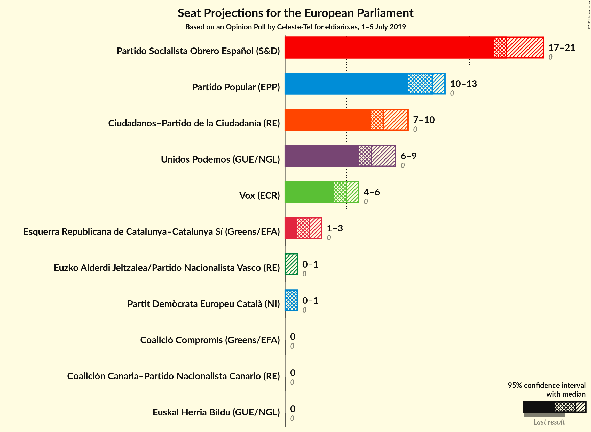

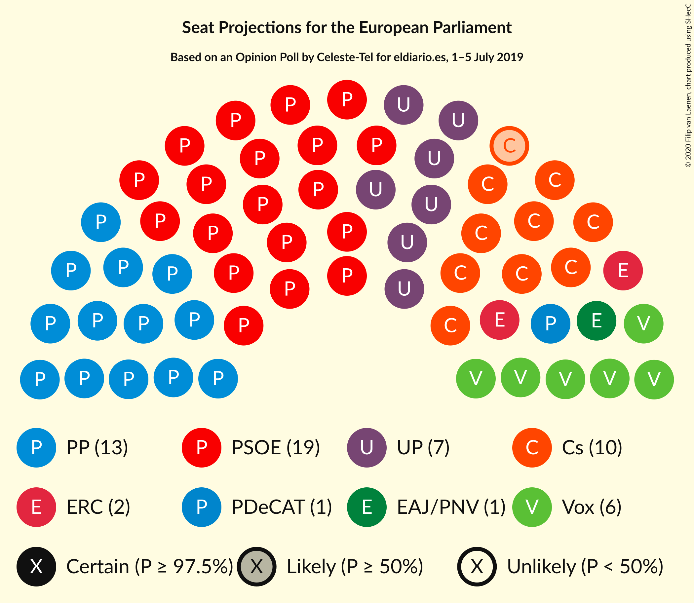

### Confidence Intervals

| Party | Last Result | Median | 80% Confidence Interval | 90% Confidence Interval | 95% Confidence Interval | 99% Confidence Interval |
|:-----:|:-----------:|:------:|:-----------------------:|:-----------------------:|:-----------------------:|:-----------------------:|
| <a href="#partido-socialista-obrero-español-(s&d)">Partido Socialista Obrero Español (S&D)</a> | 0 | 20 | 19–22 |19–22 |19–23 |18–23 |
| <a href="#partido-popular-(epp)">Partido Popular (EPP)</a> | 0 | 13 | 12–14 |11–14 |11–14 |11–15 |
| <a href="#ciudadanos–partido-de-la-ciudadanía-(re)">Ciudadanos–Partido de la Ciudadanía (RE)</a> | 0 | 9 | 8–10 |8–10 |8–11 |7–11 |
| <a href="#unidos-podemos-(gue/ngl)">Unidos Podemos (GUE/NGL)</a> | 0 | 8 | 7–9 |7–9 |7–9 |7–10 |
| <a href="#vox-(ecr)">Vox (ECR)</a> | 0 | 5 | 4–6 |4–6 |4–6 |4–6 |
| <a href="#esquerra-republicana-de-catalunya–catalunya-sí-(greens/efa)">Esquerra Republicana de Catalunya–Catalunya Sí (Greens/EFA)</a> | 0 | 2 | 2–3 |2–3 |1–3 |1–3 |
| <a href="#partit-demòcrata-europeu-català-(ni)">Partit Demòcrata Europeu Català (NI)</a> | 0 | 1 | 0–1 |0–1 |0–1 |0–2 |
| <a href="#euzko-alderdi-jeltzalea/partido-nacionalista-vasco-(re)">Euzko Alderdi Jeltzalea/Partido Nacionalista Vasco (RE)</a> | 0 | 0 | 0–1 |0–1 |0–1 |0–1 |
| <a href="#euskal-herria-bildu-(gue/ngl)">Euskal Herria Bildu (GUE/NGL)</a> | 0 | 0 | 0 |0 |0–1 |0–1 |
| <a href="#coalición-canaria–partido-nacionalista-canario-(re)">Coalición Canaria–Partido Nacionalista Canario (RE)</a> | 0 | 0 | 0 |0 |0 |0–1 |
| <a href="#coalició-compromís-(greens/efa)">Coalició Compromís (Greens/EFA)</a> | 0 | 0 | 0 |0 |0 |0 |

### Partido Socialista Obrero Español (S&D)

*For a full overview of the results for this party, see the [Partido Socialista Obrero Español (S&D)](party-partidosocialistaobreroespañolsd.html) page.*

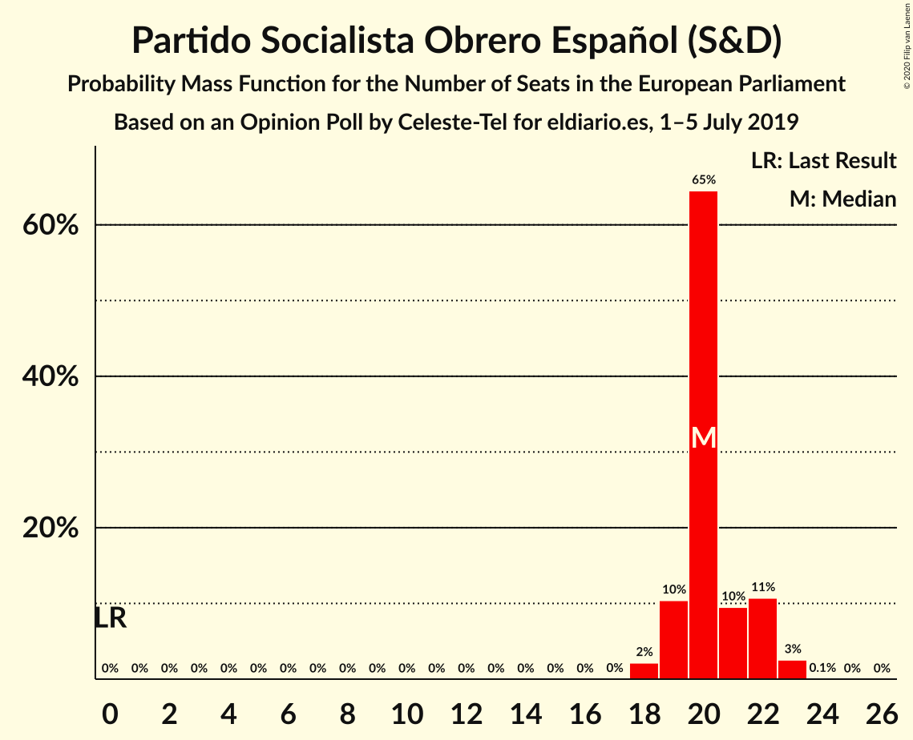

| Number of Seats | Probability | Accumulated | Special Marks |
|:---------------:|:-----------:|:-----------:|:-------------:|
| 0 | 0% | 100% | Last Result |
| 1 | 0% | 100% |  |
| 2 | 0% | 100% |  |
| 3 | 0% | 100% |  |
| 4 | 0% | 100% |  |
| 5 | 0% | 100% |  |
| 6 | 0% | 100% |  |
| 7 | 0% | 100% |  |
| 8 | 0% | 100% |  |
| 9 | 0% | 100% |  |
| 10 | 0% | 100% |  |
| 11 | 0% | 100% |  |
| 12 | 0% | 100% |  |
| 13 | 0% | 100% |  |
| 14 | 0% | 100% |  |
| 15 | 0% | 100% |  |
| 16 | 0% | 100% |  |
| 17 | 0% | 100% |  |
| 18 | 2% | 100% |  |
| 19 | 10% | 98% |  |
| 20 | 65% | 87% | Median |
| 21 | 10% | 23% |  |
| 22 | 11% | 13% |  |
| 23 | 3% | 3% |  |
| 24 | 0.1% | 0.1% |  |
| 25 | 0% | 0% |  |

### Partido Popular (EPP)

*For a full overview of the results for this party, see the [Partido Popular (EPP)](party-partidopopularepp.html) page.*

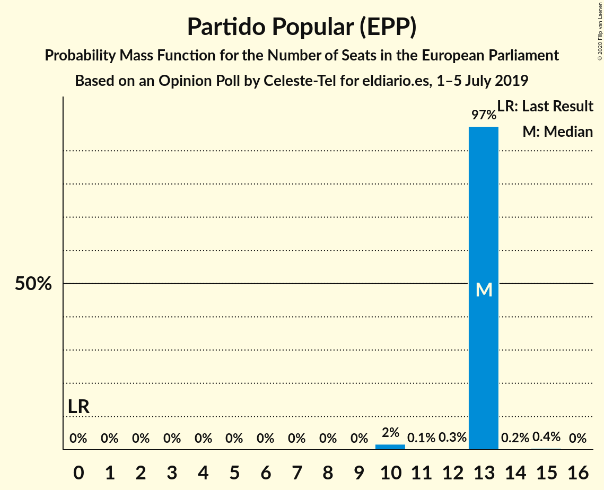

| Number of Seats | Probability | Accumulated | Special Marks |
|:---------------:|:-----------:|:-----------:|:-------------:|
| 0 | 0% | 100% | Last Result |
| 1 | 0% | 100% |  |
| 2 | 0% | 100% |  |
| 3 | 0% | 100% |  |
| 4 | 0% | 100% |  |
| 5 | 0% | 100% |  |
| 6 | 0% | 100% |  |
| 7 | 0% | 100% |  |
| 8 | 0% | 100% |  |
| 9 | 0% | 100% |  |
| 10 | 0.2% | 100% |  |
| 11 | 9% | 99.8% |  |
| 12 | 39% | 91% |  |
| 13 | 34% | 52% | Median |
| 14 | 17% | 18% |  |
| 15 | 1.2% | 1.3% |  |
| 16 | 0% | 0% |  |

### Ciudadanos–Partido de la Ciudadanía (RE)

*For a full overview of the results for this party, see the [Ciudadanos–Partido de la Ciudadanía (RE)](party-ciudadanos–partidodelaciudadaníare.html) page.*

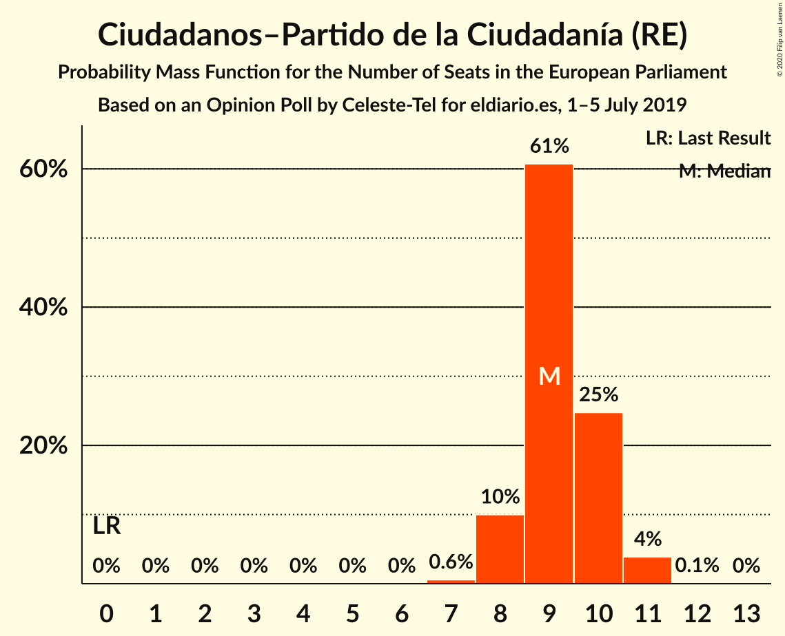

| Number of Seats | Probability | Accumulated | Special Marks |
|:---------------:|:-----------:|:-----------:|:-------------:|
| 0 | 0% | 100% | Last Result |
| 1 | 0% | 100% |  |
| 2 | 0% | 100% |  |
| 3 | 0% | 100% |  |
| 4 | 0% | 100% |  |
| 5 | 0% | 100% |  |
| 6 | 0% | 100% |  |
| 7 | 0.6% | 100% |  |
| 8 | 10% | 99.4% |  |
| 9 | 61% | 89% | Median |
| 10 | 25% | 29% |  |
| 11 | 4% | 4% |  |
| 12 | 0.1% | 0.1% |  |
| 13 | 0% | 0% |  |

### Unidos Podemos (GUE/NGL)

*For a full overview of the results for this party, see the [Unidos Podemos (GUE/NGL)](party-unidospodemosguengl.html) page.*

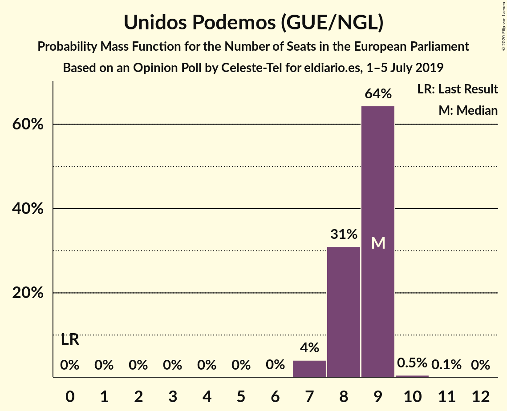

| Number of Seats | Probability | Accumulated | Special Marks |
|:---------------:|:-----------:|:-----------:|:-------------:|
| 0 | 0% | 100% | Last Result |
| 1 | 0% | 100% |  |
| 2 | 0% | 100% |  |
| 3 | 0% | 100% |  |
| 4 | 0% | 100% |  |
| 5 | 0% | 100% |  |
| 6 | 0.1% | 100% |  |
| 7 | 24% | 99.9% |  |
| 8 | 35% | 76% | Median |
| 9 | 39% | 41% |  |
| 10 | 1.4% | 2% |  |
| 11 | 0.2% | 0.2% |  |
| 12 | 0% | 0% |  |

### Vox (ECR)

*For a full overview of the results for this party, see the [Vox (ECR)](party-voxecr.html) page.*

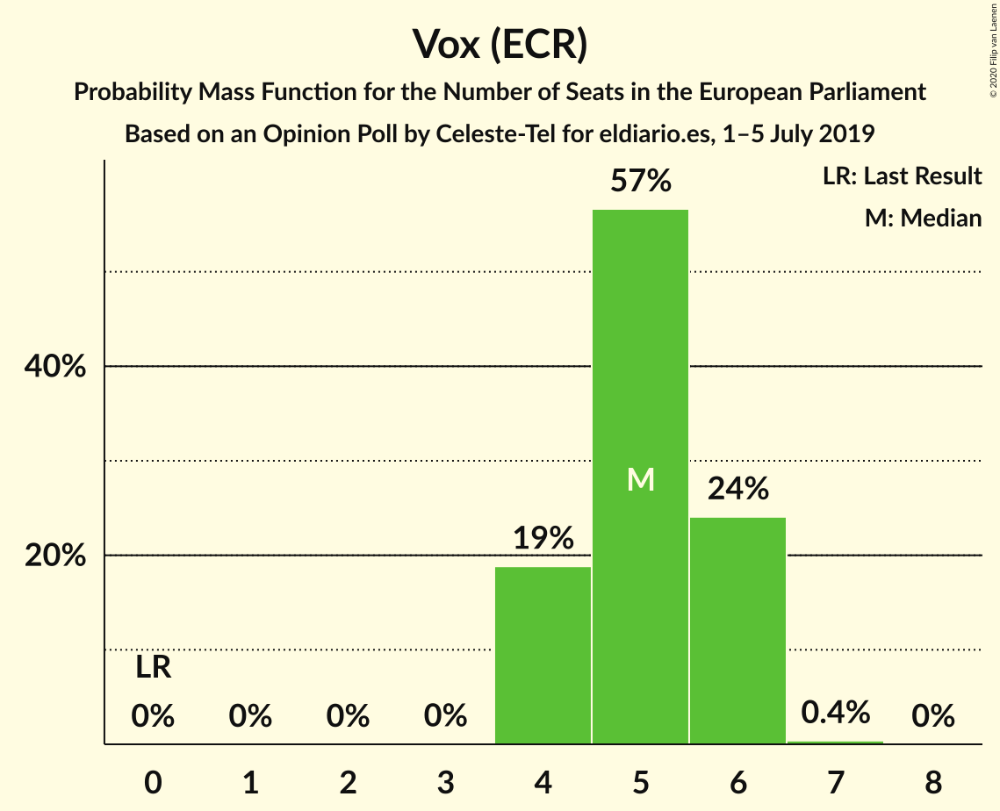

| Number of Seats | Probability | Accumulated | Special Marks |
|:---------------:|:-----------:|:-----------:|:-------------:|
| 0 | 0% | 100% | Last Result |
| 1 | 0% | 100% |  |
| 2 | 0% | 100% |  |
| 3 | 0% | 100% |  |
| 4 | 19% | 100% |  |
| 5 | 57% | 81% | Median |
| 6 | 24% | 24% |  |
| 7 | 0.4% | 0.4% |  |
| 8 | 0% | 0% |  |

### Esquerra Republicana de Catalunya–Catalunya Sí (Greens/EFA)

*For a full overview of the results for this party, see the [Esquerra Republicana de Catalunya–Catalunya Sí (Greens/EFA)](party-esquerrarepublicanadecatalunya–catalunyasígreensefa.html) page.*

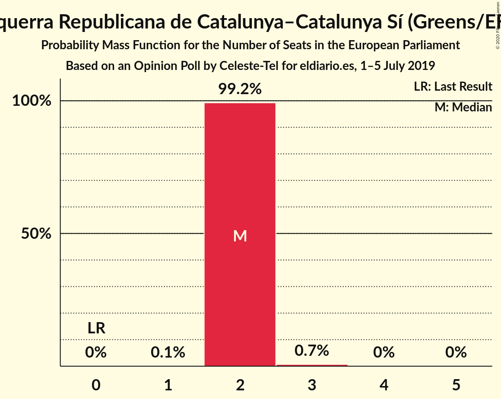

| Number of Seats | Probability | Accumulated | Special Marks |
|:---------------:|:-----------:|:-----------:|:-------------:|
| 0 | 0% | 100% | Last Result |
| 1 | 3% | 100% |  |
| 2 | 61% | 97% | Median |
| 3 | 36% | 36% |  |
| 4 | 0% | 0% |  |

### Partit Demòcrata Europeu Català (NI)

*For a full overview of the results for this party, see the [Partit Demòcrata Europeu Català (NI)](party-partitdemòcrataeuropeucatalàni.html) page.*

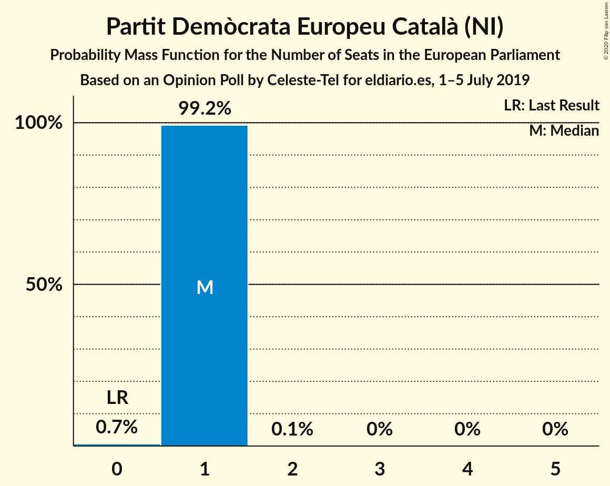

| Number of Seats | Probability | Accumulated | Special Marks |
|:---------------:|:-----------:|:-----------:|:-------------:|
| 0 | 15% | 100% | Last Result |
| 1 | 84% | 85% | Median |
| 2 | 0.8% | 0.8% |  |
| 3 | 0% | 0% |  |

### Euzko Alderdi Jeltzalea/Partido Nacionalista Vasco (RE)

*For a full overview of the results for this party, see the [Euzko Alderdi Jeltzalea/Partido Nacionalista Vasco (RE)](party-euzkoalderdijeltzaleapartidonacionalistavascore.html) page.*

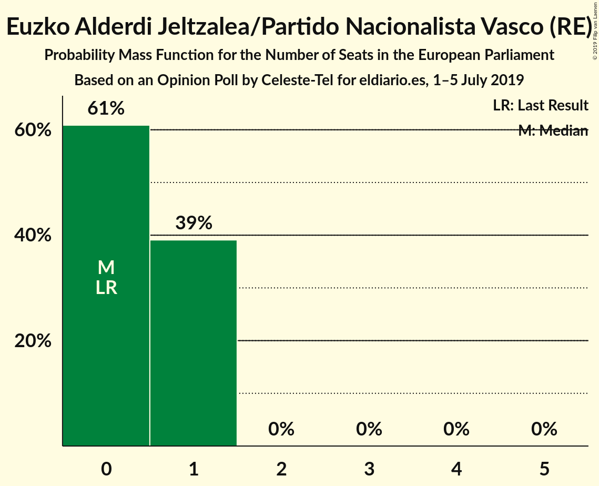

| Number of Seats | Probability | Accumulated | Special Marks |
|:---------------:|:-----------:|:-----------:|:-------------:|
| 0 | 55% | 100% | Last Result, Median |
| 1 | 45% | 45% |  |
| 2 | 0.1% | 0.1% |  |
| 3 | 0% | 0% |  |

### Euskal Herria Bildu (GUE/NGL)

*For a full overview of the results for this party, see the [Euskal Herria Bildu (GUE/NGL)](party-euskalherriabilduguengl.html) page.*

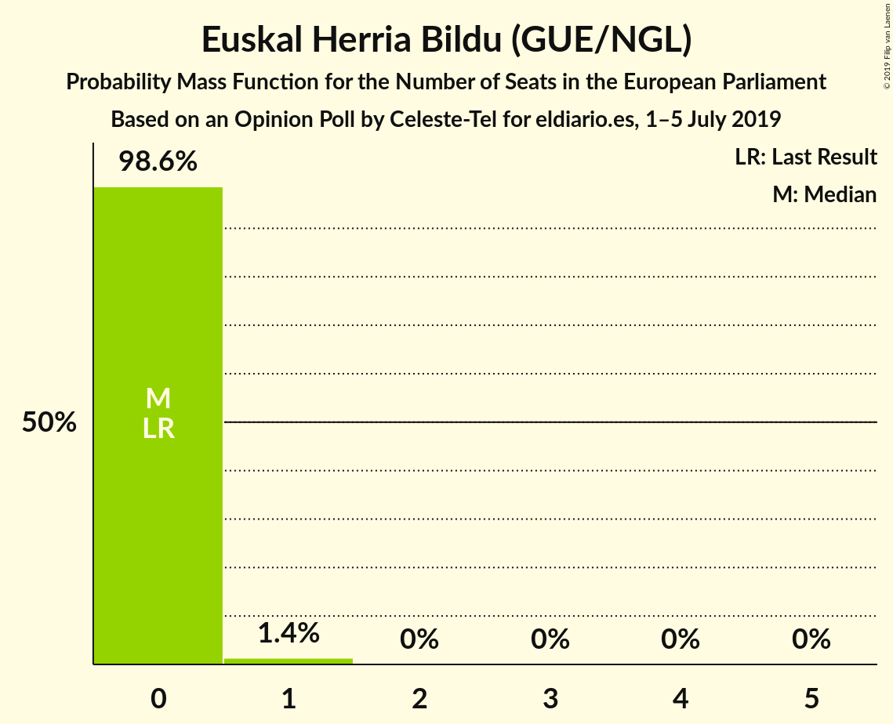

| Number of Seats | Probability | Accumulated | Special Marks |
|:---------------:|:-----------:|:-----------:|:-------------:|
| 0 | 97% | 100% | Last Result, Median |
| 1 | 3% | 3% |  |
| 2 | 0% | 0% |  |

### Coalición Canaria–Partido Nacionalista Canario (RE)

*For a full overview of the results for this party, see the [Coalición Canaria–Partido Nacionalista Canario (RE)](party-coalicióncanaria–partidonacionalistacanariore.html) page.*

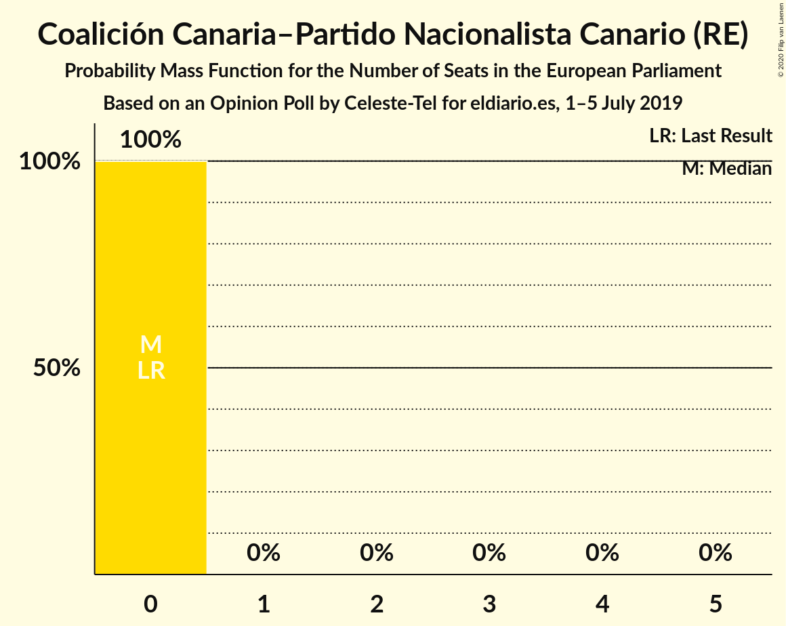

| Number of Seats | Probability | Accumulated | Special Marks |
|:---------------:|:-----------:|:-----------:|:-------------:|
| 0 | 99.2% | 100% | Last Result, Median |
| 1 | 0.8% | 0.8% |  |
| 2 | 0% | 0% |  |

### Coalició Compromís (Greens/EFA)

*For a full overview of the results for this party, see the [Coalició Compromís (Greens/EFA)](party-coaliciócompromísgreensefa.html) page.*

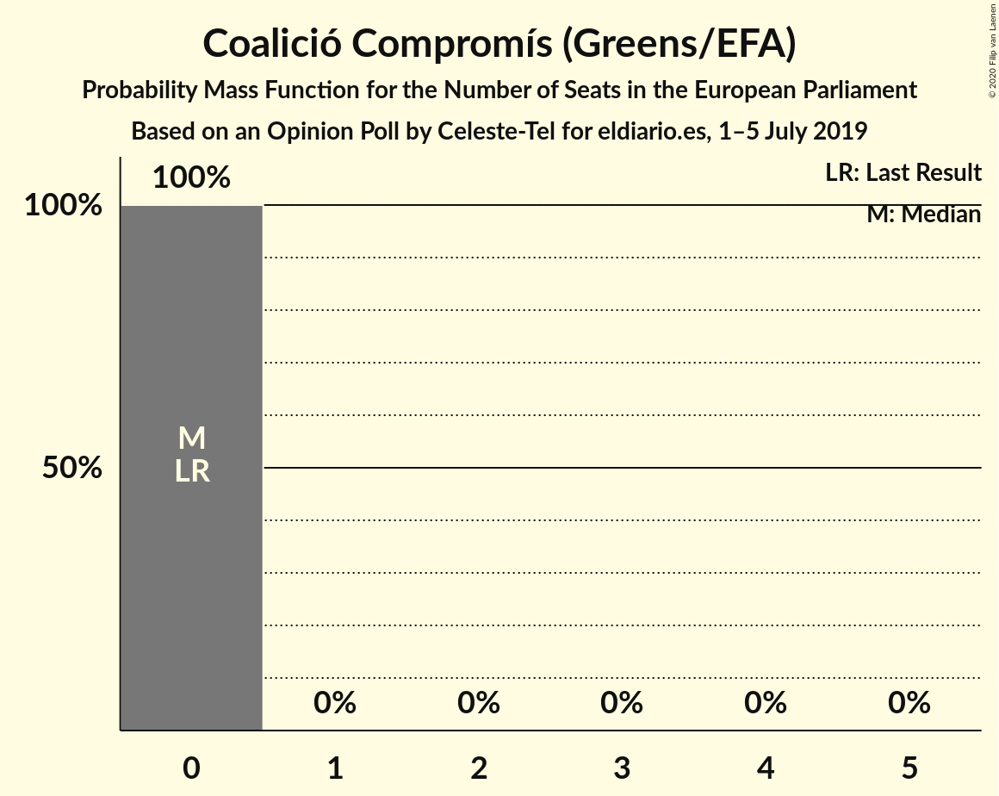

| Number of Seats | Probability | Accumulated | Special Marks |
|:---------------:|:-----------:|:-----------:|:-------------:|
| 0 | 99.9% | 100% | Last Result, Median |
| 1 | 0.1% | 0.1% |  |
| 2 | 0% | 0% |  |

## Coalitions

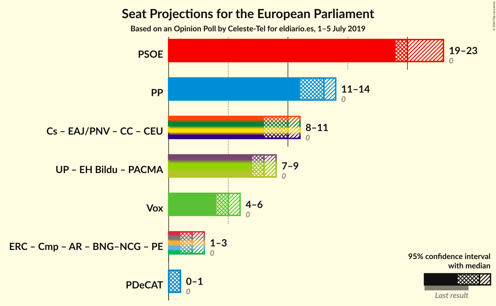

### Confidence Intervals

| Coalition | Last Result | Median | Majority? | 80% Confidence Interval | 90% Confidence Interval | 95% Confidence Interval | 99% Confidence Interval |
|:---------:|:-----------:|:------:|:---------:|:-----------------------:|:-----------------------:|:-----------------------:|:-----------------------:|
| Partido Socialista Obrero Español (S&D) | 0 | 20 | 0% | 19–22 | 19–22 | 19–23 | 18–23 |
| Partido Popular (EPP) | 0 | 13 | 0% | 12–14 | 11–14 | 11–14 | 11–15 |
| Vox (ECR) | 0 | 5 | 0% | 4–6 | 4–6 | 4–6 | 4–6 |
| Partit Demòcrata Europeu Català (NI) | 0 | 1 | 0% | 0–1 | 0–1 | 0–1 | 0–2 |

### Partido Socialista Obrero Español (S&D)

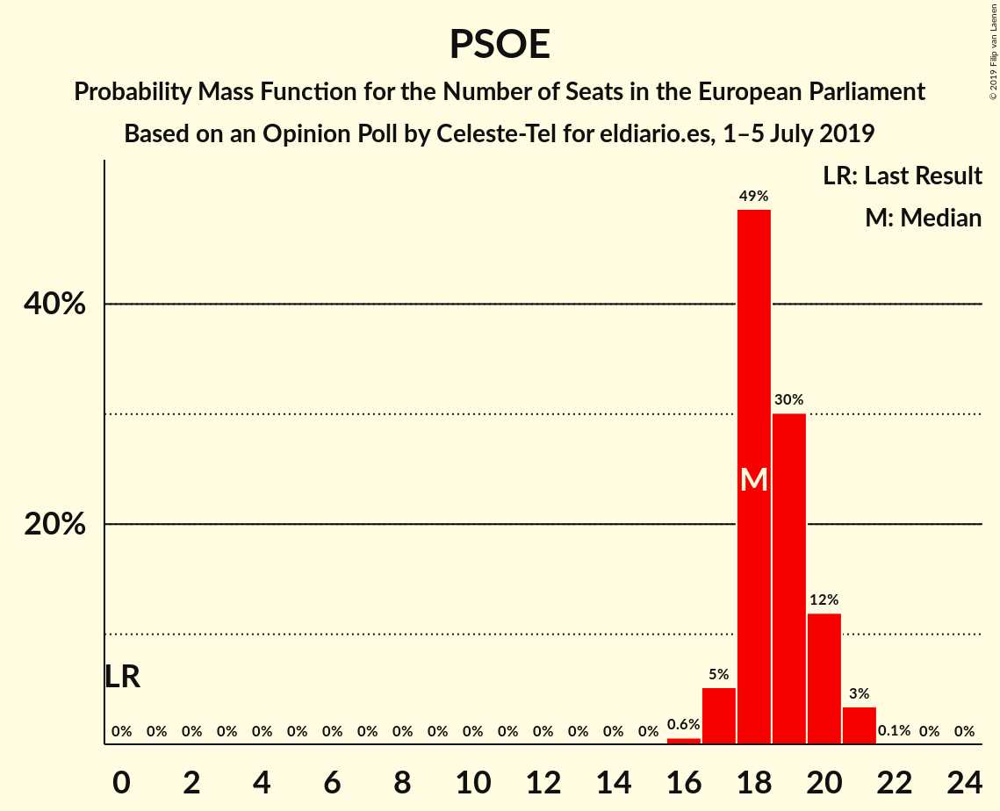

| Number of Seats | Probability | Accumulated | Special Marks |
|:---------------:|:-----------:|:-----------:|:-------------:|
| 0 | 0% | 100% | Last Result |
| 1 | 0% | 100% |  |
| 2 | 0% | 100% |  |
| 3 | 0% | 100% |  |
| 4 | 0% | 100% |  |
| 5 | 0% | 100% |  |
| 6 | 0% | 100% |  |
| 7 | 0% | 100% |  |
| 8 | 0% | 100% |  |
| 9 | 0% | 100% |  |
| 10 | 0% | 100% |  |
| 11 | 0% | 100% |  |
| 12 | 0% | 100% |  |
| 13 | 0% | 100% |  |
| 14 | 0% | 100% |  |
| 15 | 0% | 100% |  |
| 16 | 0% | 100% |  |
| 17 | 0% | 100% |  |
| 18 | 2% | 100% |  |
| 19 | 10% | 98% |  |
| 20 | 65% | 87% | Median |
| 21 | 10% | 23% |  |
| 22 | 11% | 13% |  |
| 23 | 3% | 3% |  |
| 24 | 0.1% | 0.1% |  |
| 25 | 0% | 0% |  |

### Partido Popular (EPP)

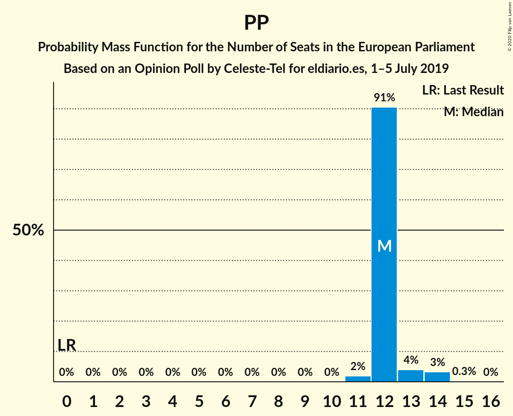

| Number of Seats | Probability | Accumulated | Special Marks |
|:---------------:|:-----------:|:-----------:|:-------------:|
| 0 | 0% | 100% | Last Result |
| 1 | 0% | 100% |  |
| 2 | 0% | 100% |  |
| 3 | 0% | 100% |  |
| 4 | 0% | 100% |  |
| 5 | 0% | 100% |  |
| 6 | 0% | 100% |  |
| 7 | 0% | 100% |  |
| 8 | 0% | 100% |  |
| 9 | 0% | 100% |  |
| 10 | 0.2% | 100% |  |
| 11 | 9% | 99.8% |  |
| 12 | 39% | 91% |  |
| 13 | 34% | 52% | Median |
| 14 | 17% | 18% |  |
| 15 | 1.2% | 1.3% |  |
| 16 | 0% | 0% |  |

### Vox (ECR)

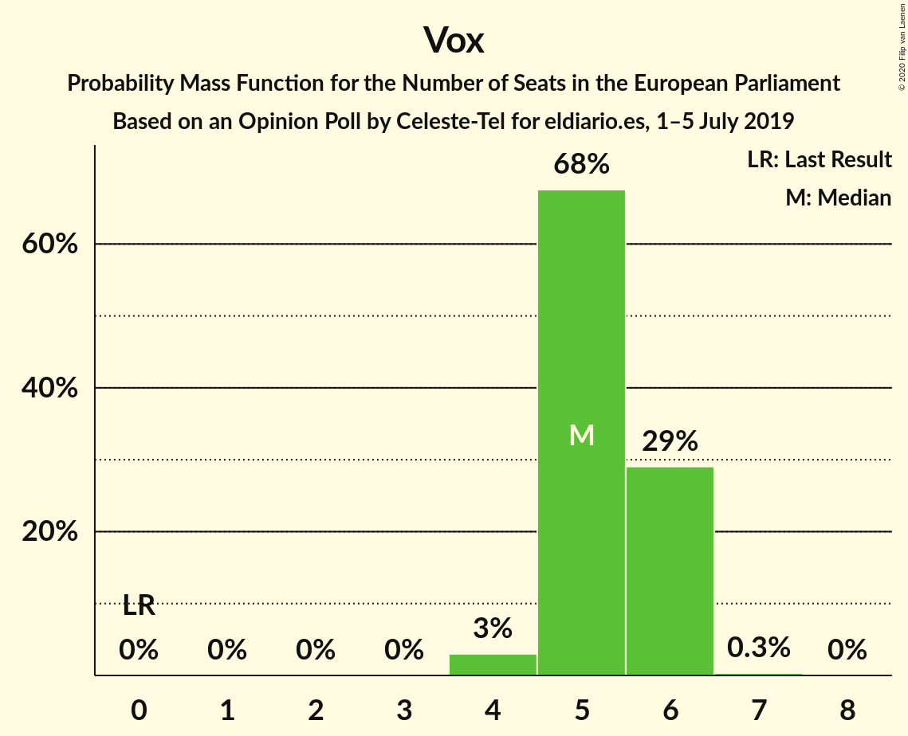

| Number of Seats | Probability | Accumulated | Special Marks |
|:---------------:|:-----------:|:-----------:|:-------------:|
| 0 | 0% | 100% | Last Result |
| 1 | 0% | 100% |  |
| 2 | 0% | 100% |  |
| 3 | 0% | 100% |  |
| 4 | 19% | 100% |  |
| 5 | 57% | 81% | Median |
| 6 | 24% | 24% |  |
| 7 | 0.4% | 0.4% |  |
| 8 | 0% | 0% |  |

### Partit Demòcrata Europeu Català (NI)

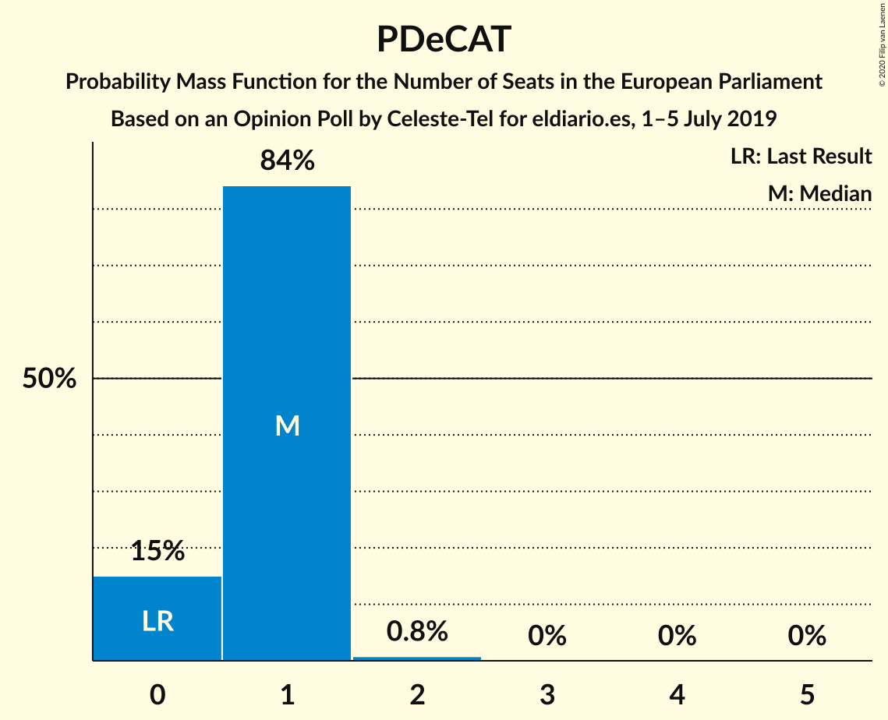

| Number of Seats | Probability | Accumulated | Special Marks |
|:---------------:|:-----------:|:-----------:|:-------------:|
| 0 | 15% | 100% | Last Result |
| 1 | 84% | 85% | Median |
| 2 | 0.8% | 0.8% |  |
| 3 | 0% | 0% |  |

## Technical Information

### Opinion Poll

+ **Polling firm:** Celeste-Tel
+ **Commissioner(s):** eldiario.es
+ **Fieldwork period:** 1–5 July 2019

### Calculations

+ **Sample size:** 1100
+ **Simulations done:** 1,048,576
+ **Error estimate:** 3.75%

