# Opinion Poll by Key Data for Público, 7 July 2019

<a href="#voting-intentions">Voting Intentions</a> | <a href="#seats">Seats</a> | <a href="#coalitions">Coalitions</a> | <a href="#technical-information">Technical Information</a>

## Voting Intentions

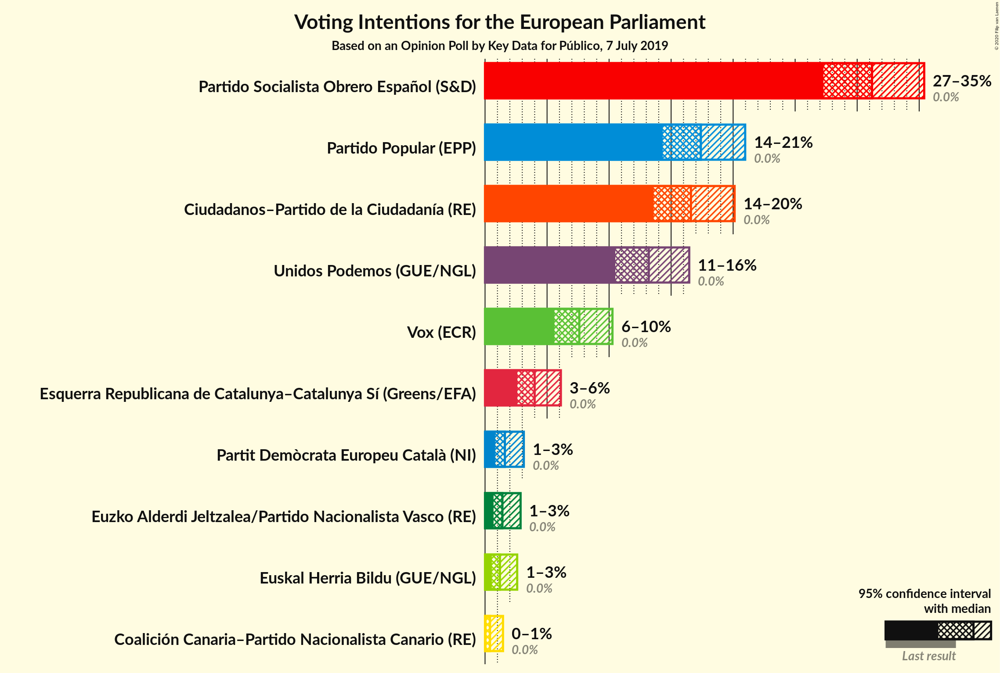

### Confidence Intervals

| Party | Last Result | Poll Result | 80% Confidence Interval | 90% Confidence Interval | 95% Confidence Interval | 99% Confidence Interval |
|:-----:|:-----------:|:-----------:|:-----------------------:|:-----------------------:|:-----------------------:|:-----------------------:|
| Partido Socialista Obrero Español (S&D) | 0.0% | 31.2% | 28.6–33.9% |27.9–34.7% |27.3–35.4% |26.1–36.7% |
| Partido Popular (EPP) | 0.0% | 17.4% | 15.4–19.7% |14.8–20.4% |14.3–21.0% |13.4–22.1% |
| Ciudadanos–Partido de la Ciudadanía (RE) | 0.0% | 16.6% | 14.6–18.9% |14.1–19.6% |13.6–20.1% |12.7–21.3% |
| Unidos Podemos (GUE/NGL) | 0.0% | 13.2% | 11.4–15.3% |10.9–15.9% |10.5–16.5% |9.7–17.5% |
| Vox (ECR) | 0.0% | 7.6% | 6.3–9.3% |5.9–9.8% |5.6–10.3% |5.0–11.2% |
| Esquerra Republicana de Catalunya–Catalunya Sí (Greens/EFA) | 0.0% | 4.0% | 3.1–5.4% |2.8–5.8% |2.6–6.1% |2.2–6.8% |
| Partit Demòcrata Europeu Català (NI) | 0.0% | 1.6% | 1.1–2.6% |0.9–2.9% |0.8–3.1% |0.6–3.7% |
| Euzko Alderdi Jeltzalea/Partido Nacionalista Vasco (RE) | 0.0% | 1.4% | 0.9–2.3% |0.8–2.6% |0.7–2.9% |0.5–3.4% |
| Euskal Herria Bildu (GUE/NGL) | 0.0% | 1.2% | 0.8–2.1% |0.7–2.4% |0.5–2.6% |0.4–3.1% |
| Coalición Canaria–Partido Nacionalista Canario (RE) | 0.0% | 0.4% | 0.2–1.1% |0.2–1.3% |0.1–1.4% |0.1–1.8% |

*Note:* The poll result column reflects the actual value used in the calculations. Published results may vary slightly, and in addition be rounded to fewer digits.

## Seats

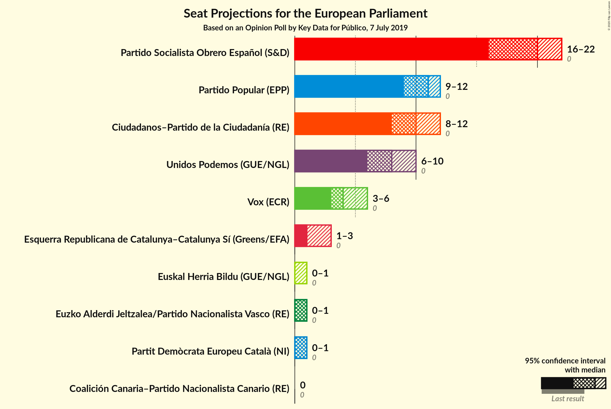

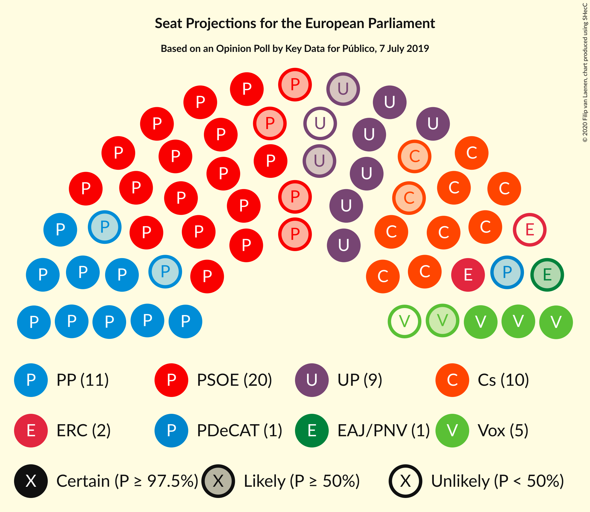

### Confidence Intervals

| Party | Last Result | Median | 80% Confidence Interval | 90% Confidence Interval | 95% Confidence Interval | 99% Confidence Interval |
|:-----:|:-----------:|:------:|:-----------------------:|:-----------------------:|:-----------------------:|:-----------------------:|
| <a href="#partido-socialista-obrero-español-(s&d)">Partido Socialista Obrero Español (S&D)</a> | 0 | 20 | 18–20 |17–20 |16–22 |16–23 |
| <a href="#partido-popular-(epp)">Partido Popular (EPP)</a> | 0 | 11 | 10–12 |10–12 |9–12 |8–13 |
| <a href="#ciudadanos–partido-de-la-ciudadanía-(re)">Ciudadanos–Partido de la Ciudadanía (RE)</a> | 0 | 10 | 9–10 |9–11 |8–12 |8–12 |
| <a href="#unidos-podemos-(gue/ngl)">Unidos Podemos (GUE/NGL)</a> | 0 | 8 | 7–9 |7–9 |6–10 |6–10 |
| <a href="#vox-(ecr)">Vox (ECR)</a> | 0 | 4 | 4–6 |3–6 |3–6 |3–6 |
| <a href="#esquerra-republicana-de-catalunya–catalunya-sí-(greens/efa)">Esquerra Republicana de Catalunya–Catalunya Sí (Greens/EFA)</a> | 0 | 1 | 1–3 |1–3 |1–3 |1–4 |
| <a href="#partit-demòcrata-europeu-català-(ni)">Partit Demòcrata Europeu Català (NI)</a> | 0 | 1 | 0–1 |0–1 |0–1 |0–2 |
| <a href="#euzko-alderdi-jeltzalea/partido-nacionalista-vasco-(re)">Euzko Alderdi Jeltzalea/Partido Nacionalista Vasco (RE)</a> | 0 | 1 | 0–1 |0–1 |0–1 |0–2 |
| <a href="#euskal-herria-bildu-(gue/ngl)">Euskal Herria Bildu (GUE/NGL)</a> | 0 | 0 | 0–1 |0–1 |0–1 |0–1 |
| <a href="#coalición-canaria–partido-nacionalista-canario-(re)">Coalición Canaria–Partido Nacionalista Canario (RE)</a> | 0 | 0 | 0 |0 |0 |0–1 |

### Partido Socialista Obrero Español (S&D)

*For a full overview of the results for this party, see the [Partido Socialista Obrero Español (S&D)](party-partidosocialistaobreroespañolsd.html) page.*

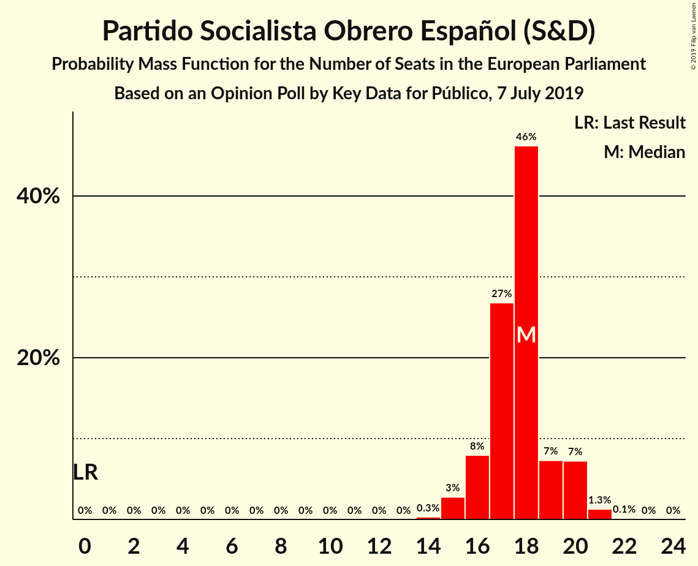

| Number of Seats | Probability | Accumulated | Special Marks |
|:---------------:|:-----------:|:-----------:|:-------------:|
| 0 | 0% | 100% | Last Result |
| 1 | 0% | 100% |  |
| 2 | 0% | 100% |  |
| 3 | 0% | 100% |  |
| 4 | 0% | 100% |  |
| 5 | 0% | 100% |  |
| 6 | 0% | 100% |  |
| 7 | 0% | 100% |  |
| 8 | 0% | 100% |  |
| 9 | 0% | 100% |  |
| 10 | 0% | 100% |  |
| 11 | 0% | 100% |  |
| 12 | 0% | 100% |  |
| 13 | 0% | 100% |  |
| 14 | 0% | 100% |  |
| 15 | 0% | 100% |  |
| 16 | 3% | 100% |  |
| 17 | 7% | 97% |  |
| 18 | 11% | 90% |  |
| 19 | 24% | 79% |  |
| 20 | 51% | 55% | Median |
| 21 | 2% | 5% |  |
| 22 | 2% | 3% |  |
| 23 | 1.0% | 1.0% |  |
| 24 | 0% | 0% |  |

### Partido Popular (EPP)

*For a full overview of the results for this party, see the [Partido Popular (EPP)](party-partidopopularepp.html) page.*

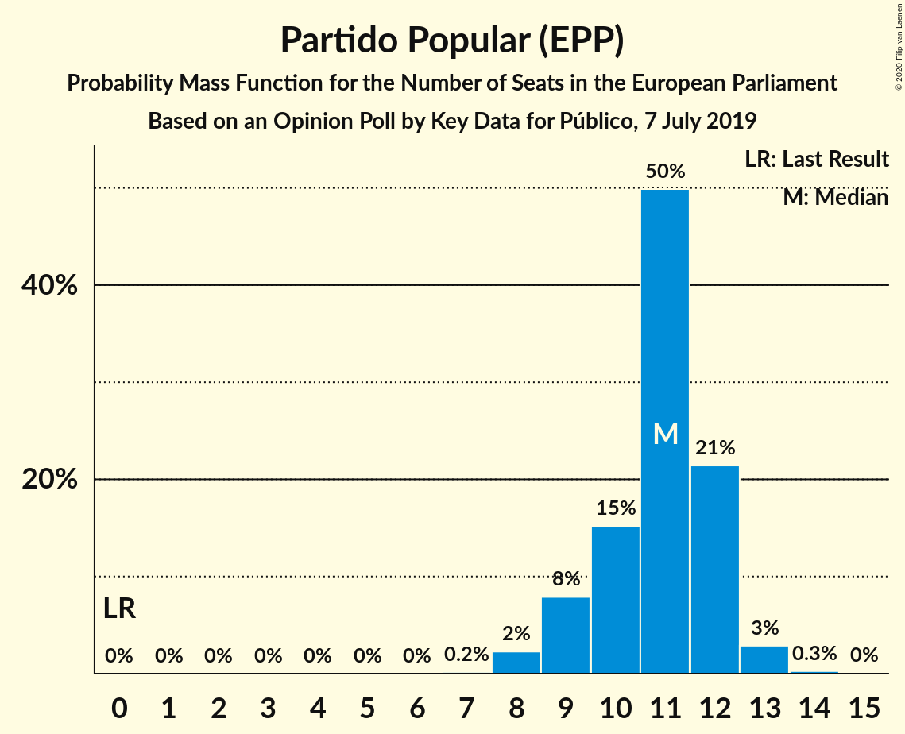

| Number of Seats | Probability | Accumulated | Special Marks |
|:---------------:|:-----------:|:-----------:|:-------------:|
| 0 | 0% | 100% | Last Result |
| 1 | 0% | 100% |  |
| 2 | 0% | 100% |  |
| 3 | 0% | 100% |  |
| 4 | 0% | 100% |  |
| 5 | 0% | 100% |  |
| 6 | 0% | 100% |  |
| 7 | 0% | 100% |  |
| 8 | 0.9% | 100% |  |
| 9 | 4% | 99.0% |  |
| 10 | 9% | 96% |  |
| 11 | 72% | 86% | Median |
| 12 | 12% | 14% |  |
| 13 | 2% | 2% |  |
| 14 | 0.2% | 0.2% |  |
| 15 | 0% | 0% |  |

### Ciudadanos–Partido de la Ciudadanía (RE)

*For a full overview of the results for this party, see the [Ciudadanos–Partido de la Ciudadanía (RE)](party-ciudadanos–partidodelaciudadaníare.html) page.*

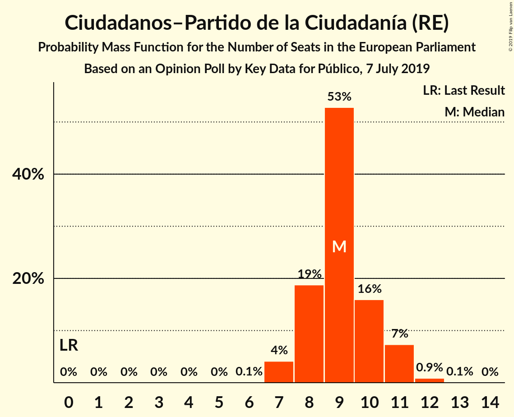

| Number of Seats | Probability | Accumulated | Special Marks |
|:---------------:|:-----------:|:-----------:|:-------------:|
| 0 | 0% | 100% | Last Result |
| 1 | 0% | 100% |  |
| 2 | 0% | 100% |  |
| 3 | 0% | 100% |  |
| 4 | 0% | 100% |  |
| 5 | 0% | 100% |  |
| 6 | 0% | 100% |  |
| 7 | 0.4% | 100% |  |
| 8 | 4% | 99.6% |  |
| 9 | 19% | 96% |  |
| 10 | 67% | 77% | Median |
| 11 | 7% | 10% |  |
| 12 | 2% | 3% |  |
| 13 | 0.1% | 0.5% |  |
| 14 | 0.3% | 0.3% |  |
| 15 | 0% | 0% |  |

### Unidos Podemos (GUE/NGL)

*For a full overview of the results for this party, see the [Unidos Podemos (GUE/NGL)](party-unidospodemosguengl.html) page.*

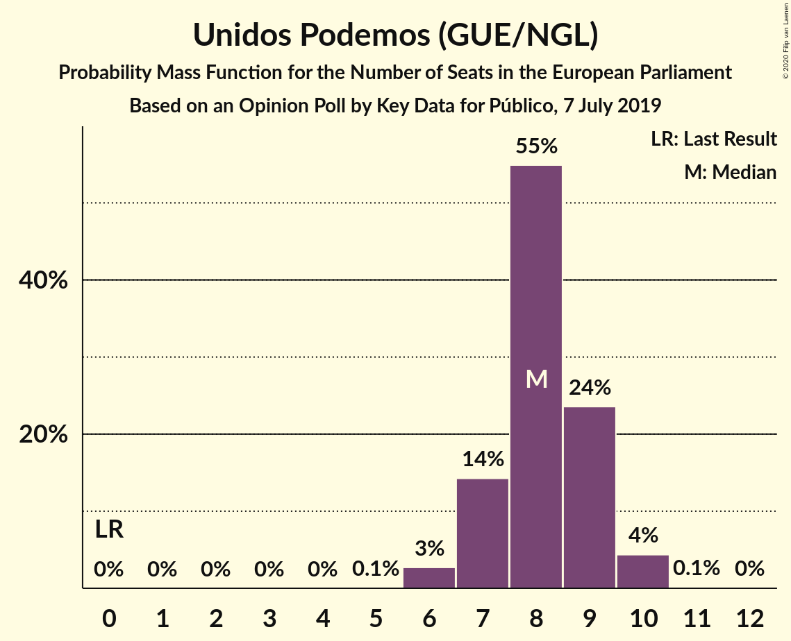

| Number of Seats | Probability | Accumulated | Special Marks |
|:---------------:|:-----------:|:-----------:|:-------------:|
| 0 | 0% | 100% | Last Result |
| 1 | 0% | 100% |  |
| 2 | 0% | 100% |  |
| 3 | 0% | 100% |  |
| 4 | 0% | 100% |  |
| 5 | 0.1% | 100% |  |
| 6 | 3% | 99.9% |  |
| 7 | 14% | 97% |  |
| 8 | 55% | 83% | Median |
| 9 | 24% | 28% |  |
| 10 | 4% | 5% |  |
| 11 | 0.1% | 0.2% |  |
| 12 | 0% | 0% |  |

### Vox (ECR)

*For a full overview of the results for this party, see the [Vox (ECR)](party-voxecr.html) page.*

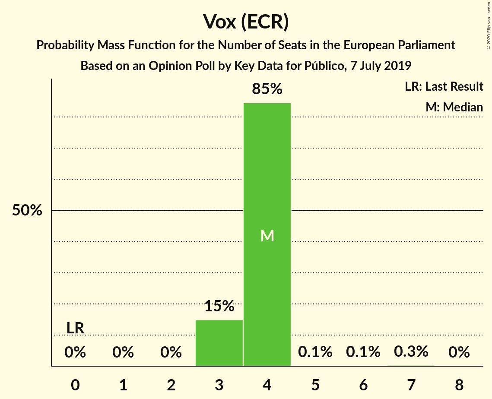

| Number of Seats | Probability | Accumulated | Special Marks |
|:---------------:|:-----------:|:-----------:|:-------------:|
| 0 | 0% | 100% | Last Result |
| 1 | 0% | 100% |  |
| 2 | 0.1% | 100% |  |
| 3 | 6% | 99.9% |  |
| 4 | 57% | 94% | Median |
| 5 | 26% | 37% |  |
| 6 | 11% | 11% |  |
| 7 | 0.5% | 0.5% |  |
| 8 | 0% | 0% |  |

### Esquerra Republicana de Catalunya–Catalunya Sí (Greens/EFA)

*For a full overview of the results for this party, see the [Esquerra Republicana de Catalunya–Catalunya Sí (Greens/EFA)](party-esquerrarepublicanadecatalunya–catalunyasígreensefa.html) page.*

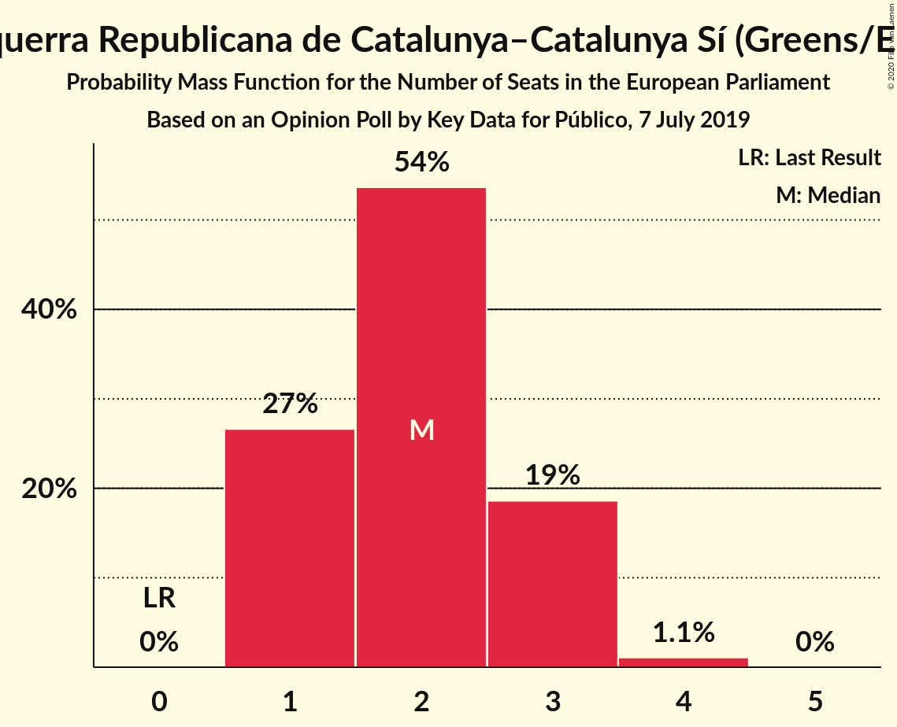

| Number of Seats | Probability | Accumulated | Special Marks |
|:---------------:|:-----------:|:-----------:|:-------------:|
| 0 | 0% | 100% | Last Result |
| 1 | 56% | 100% | Median |
| 2 | 33% | 44% |  |
| 3 | 10% | 11% |  |
| 4 | 0.9% | 1.0% |  |
| 5 | 0% | 0% |  |

### Partit Demòcrata Europeu Català (NI)

*For a full overview of the results for this party, see the [Partit Demòcrata Europeu Català (NI)](party-partitdemòcrataeuropeucatalàni.html) page.*

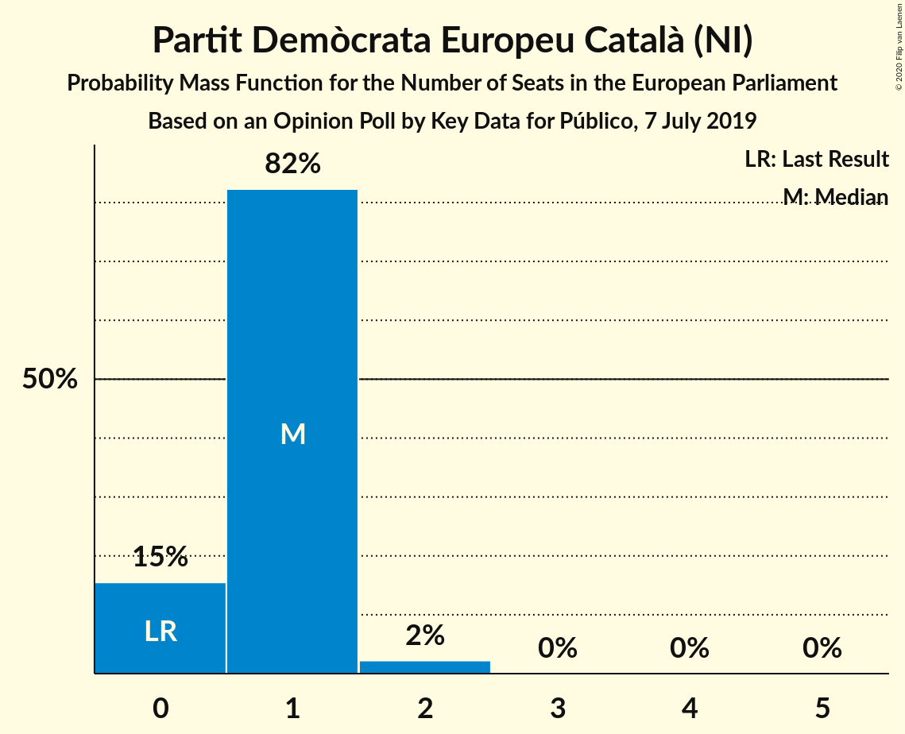

| Number of Seats | Probability | Accumulated | Special Marks |
|:---------------:|:-----------:|:-----------:|:-------------:|
| 0 | 15% | 100% | Last Result |
| 1 | 82% | 85% | Median |
| 2 | 2% | 2% |  |
| 3 | 0% | 0% |  |

### Euzko Alderdi Jeltzalea/Partido Nacionalista Vasco (RE)

*For a full overview of the results for this party, see the [Euzko Alderdi Jeltzalea/Partido Nacionalista Vasco (RE)](party-euzkoalderdijeltzaleapartidonacionalistavascore.html) page.*

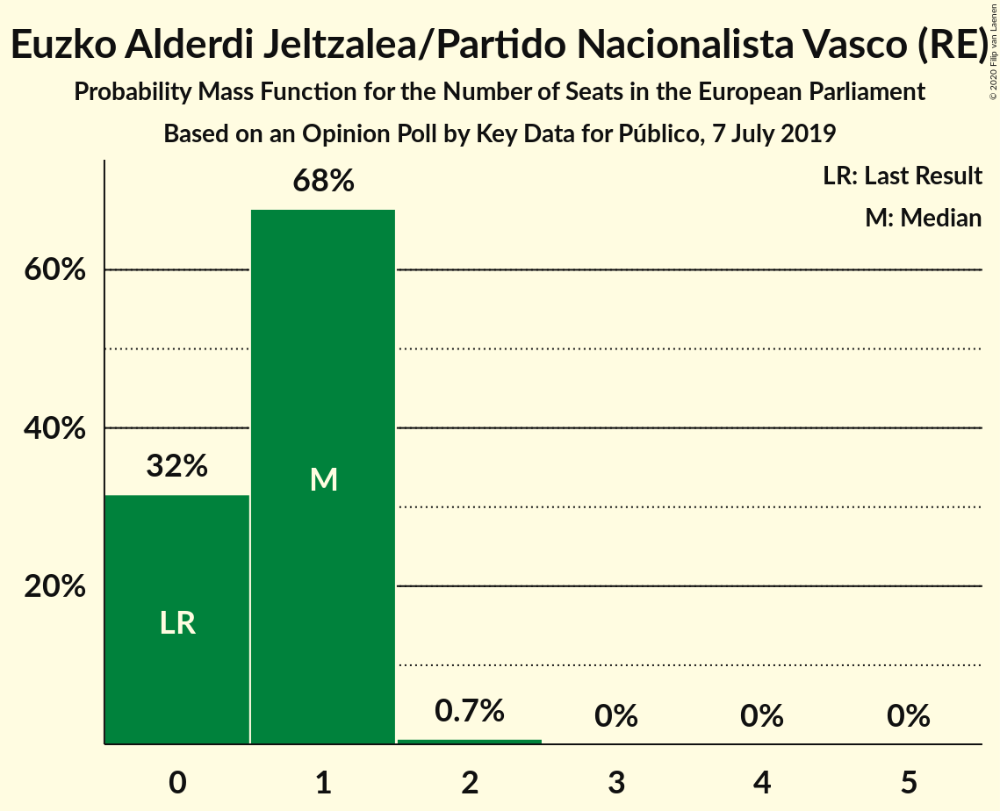

| Number of Seats | Probability | Accumulated | Special Marks |
|:---------------:|:-----------:|:-----------:|:-------------:|
| 0 | 32% | 100% | Last Result |
| 1 | 68% | 68% | Median |
| 2 | 0.7% | 0.7% |  |
| 3 | 0% | 0% |  |

### Euskal Herria Bildu (GUE/NGL)

*For a full overview of the results for this party, see the [Euskal Herria Bildu (GUE/NGL)](party-euskalherriabilduguengl.html) page.*

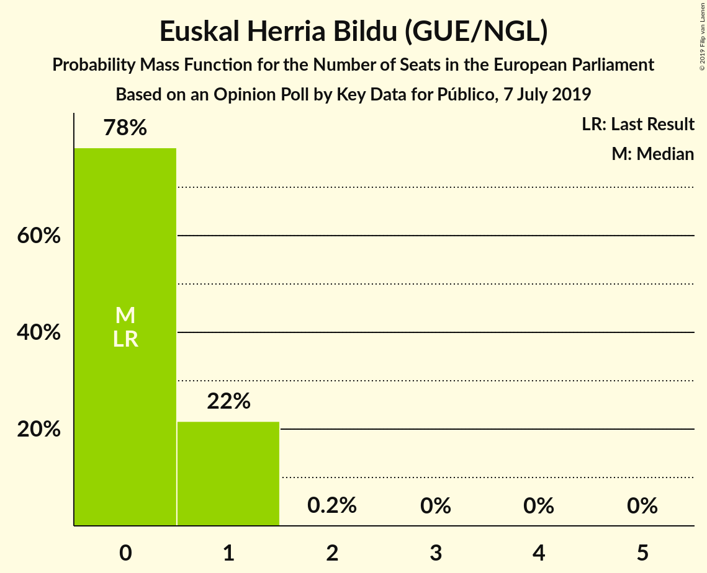

| Number of Seats | Probability | Accumulated | Special Marks |
|:---------------:|:-----------:|:-----------:|:-------------:|
| 0 | 89% | 100% | Last Result, Median |
| 1 | 11% | 11% |  |
| 2 | 0.3% | 0.3% |  |
| 3 | 0% | 0% |  |

### Coalición Canaria–Partido Nacionalista Canario (RE)

*For a full overview of the results for this party, see the [Coalición Canaria–Partido Nacionalista Canario (RE)](party-coalicióncanaria–partidonacionalistacanariore.html) page.*

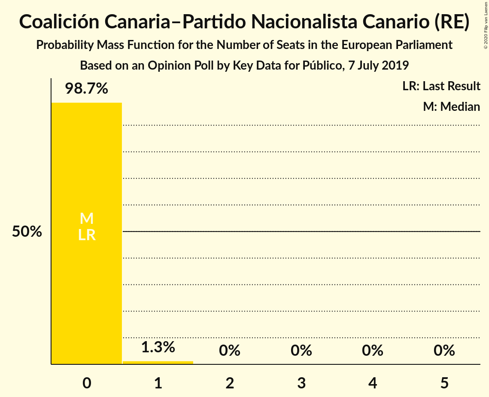

| Number of Seats | Probability | Accumulated | Special Marks |
|:---------------:|:-----------:|:-----------:|:-------------:|
| 0 | 98.7% | 100% | Last Result, Median |
| 1 | 1.3% | 1.3% |  |
| 2 | 0% | 0% |  |

## Coalitions

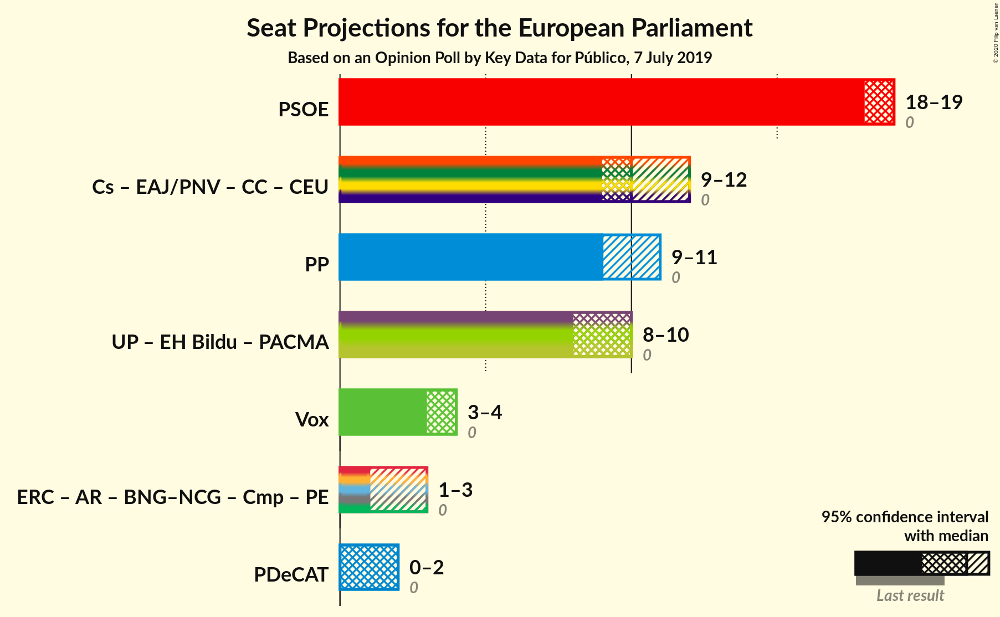

### Confidence Intervals

| Coalition | Last Result | Median | Majority? | 80% Confidence Interval | 90% Confidence Interval | 95% Confidence Interval | 99% Confidence Interval |
|:---------:|:-----------:|:------:|:---------:|:-----------------------:|:-----------------------:|:-----------------------:|:-----------------------:|
| Partido Socialista Obrero Español (S&D) | 0 | 20 | 0% | 18–20 | 17–20 | 16–22 | 16–23 |
| Partido Popular (EPP) | 0 | 11 | 0% | 10–12 | 10–12 | 9–12 | 8–13 |
| Vox (ECR) | 0 | 4 | 0% | 4–6 | 3–6 | 3–6 | 3–6 |
| Partit Demòcrata Europeu Català (NI) | 0 | 1 | 0% | 0–1 | 0–1 | 0–1 | 0–2 |

### Partido Socialista Obrero Español (S&D)

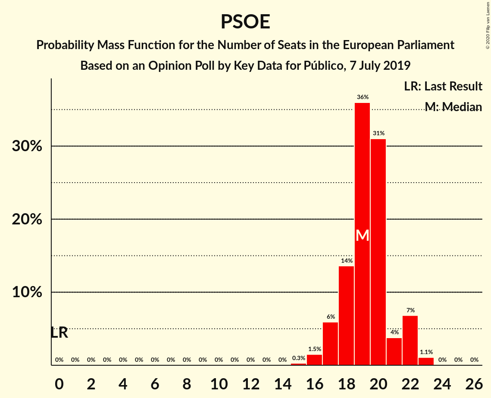

| Number of Seats | Probability | Accumulated | Special Marks |
|:---------------:|:-----------:|:-----------:|:-------------:|
| 0 | 0% | 100% | Last Result |
| 1 | 0% | 100% |  |
| 2 | 0% | 100% |  |
| 3 | 0% | 100% |  |
| 4 | 0% | 100% |  |
| 5 | 0% | 100% |  |
| 6 | 0% | 100% |  |
| 7 | 0% | 100% |  |
| 8 | 0% | 100% |  |
| 9 | 0% | 100% |  |
| 10 | 0% | 100% |  |
| 11 | 0% | 100% |  |
| 12 | 0% | 100% |  |
| 13 | 0% | 100% |  |
| 14 | 0% | 100% |  |
| 15 | 0% | 100% |  |
| 16 | 3% | 100% |  |
| 17 | 7% | 97% |  |
| 18 | 11% | 90% |  |
| 19 | 24% | 79% |  |
| 20 | 51% | 55% | Median |
| 21 | 2% | 5% |  |
| 22 | 2% | 3% |  |
| 23 | 1.0% | 1.0% |  |
| 24 | 0% | 0% |  |

### Partido Popular (EPP)

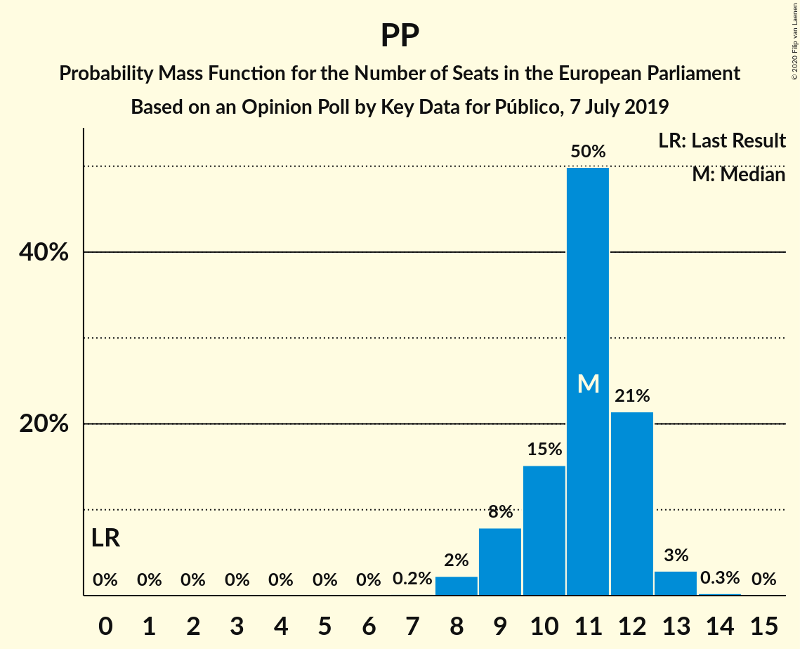

| Number of Seats | Probability | Accumulated | Special Marks |
|:---------------:|:-----------:|:-----------:|:-------------:|
| 0 | 0% | 100% | Last Result |
| 1 | 0% | 100% |  |
| 2 | 0% | 100% |  |
| 3 | 0% | 100% |  |
| 4 | 0% | 100% |  |
| 5 | 0% | 100% |  |
| 6 | 0% | 100% |  |
| 7 | 0% | 100% |  |
| 8 | 0.9% | 100% |  |
| 9 | 4% | 99.0% |  |
| 10 | 9% | 96% |  |
| 11 | 72% | 86% | Median |
| 12 | 12% | 14% |  |
| 13 | 2% | 2% |  |
| 14 | 0.2% | 0.2% |  |
| 15 | 0% | 0% |  |

### Vox (ECR)

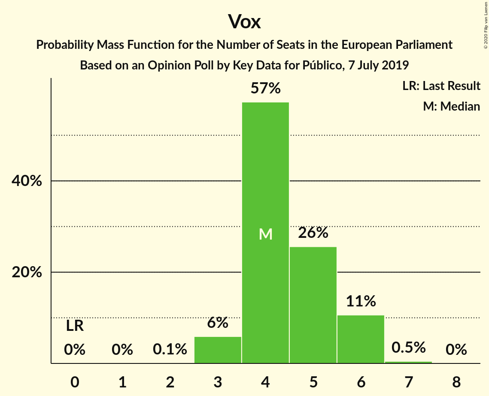

| Number of Seats | Probability | Accumulated | Special Marks |
|:---------------:|:-----------:|:-----------:|:-------------:|
| 0 | 0% | 100% | Last Result |
| 1 | 0% | 100% |  |
| 2 | 0.1% | 100% |  |
| 3 | 6% | 99.9% |  |
| 4 | 57% | 94% | Median |
| 5 | 26% | 37% |  |
| 6 | 11% | 11% |  |
| 7 | 0.5% | 0.5% |  |
| 8 | 0% | 0% |  |

### Partit Demòcrata Europeu Català (NI)

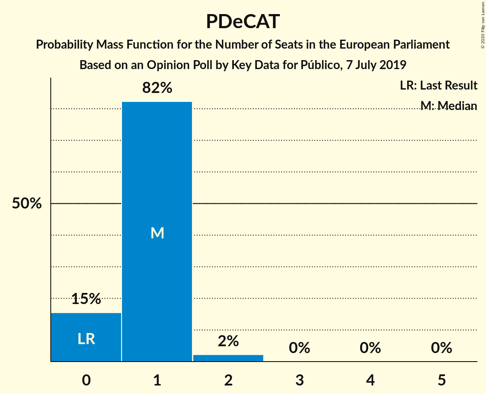

| Number of Seats | Probability | Accumulated | Special Marks |
|:---------------:|:-----------:|:-----------:|:-------------:|
| 0 | 15% | 100% | Last Result |
| 1 | 82% | 85% | Median |
| 2 | 2% | 2% |  |
| 3 | 0% | 0% |  |

## Technical Information

### Opinion Poll

+ **Polling firm:** Key Data
+ **Commissioner(s):** Público
+ **Fieldwork period:** 7 July 2019

### Calculations

+ **Sample size:** 500
+ **Simulations done:** 131,072
+ **Error estimate:** 3.99%

