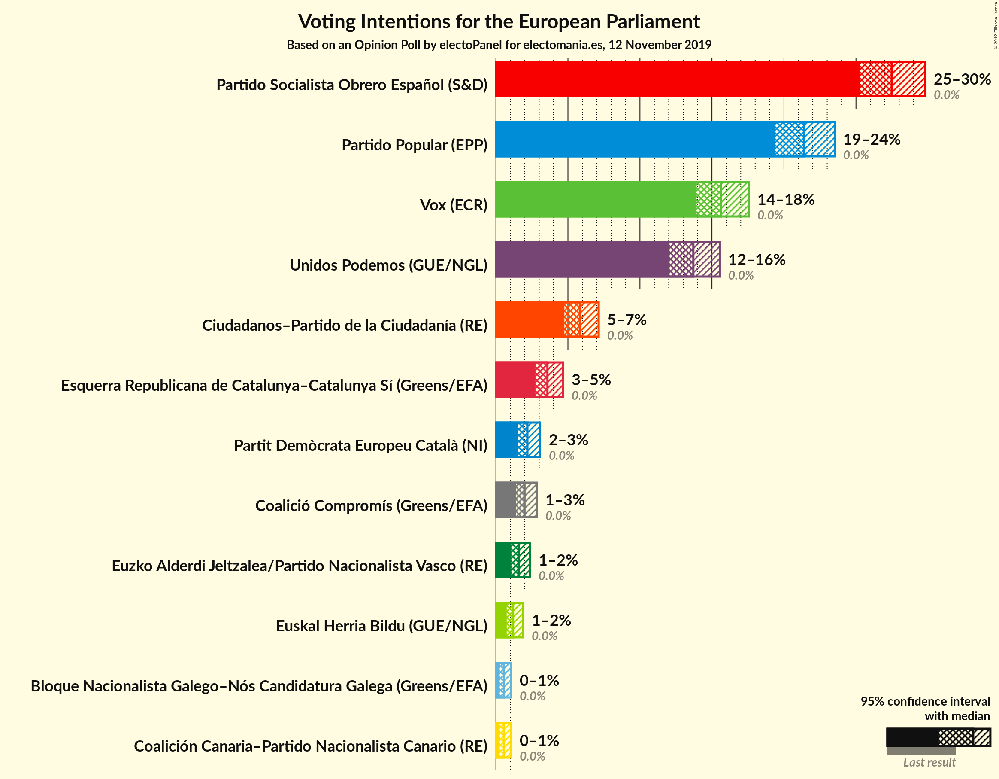
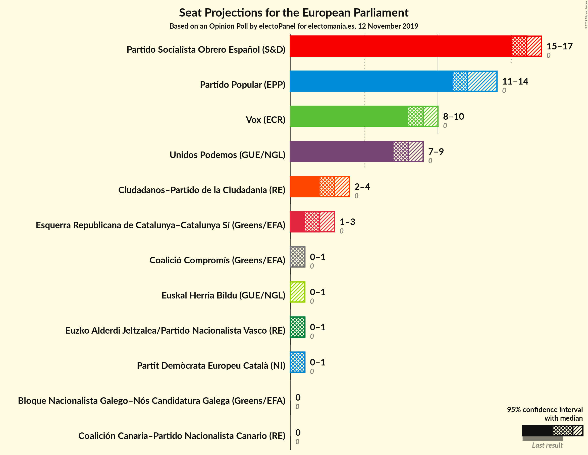
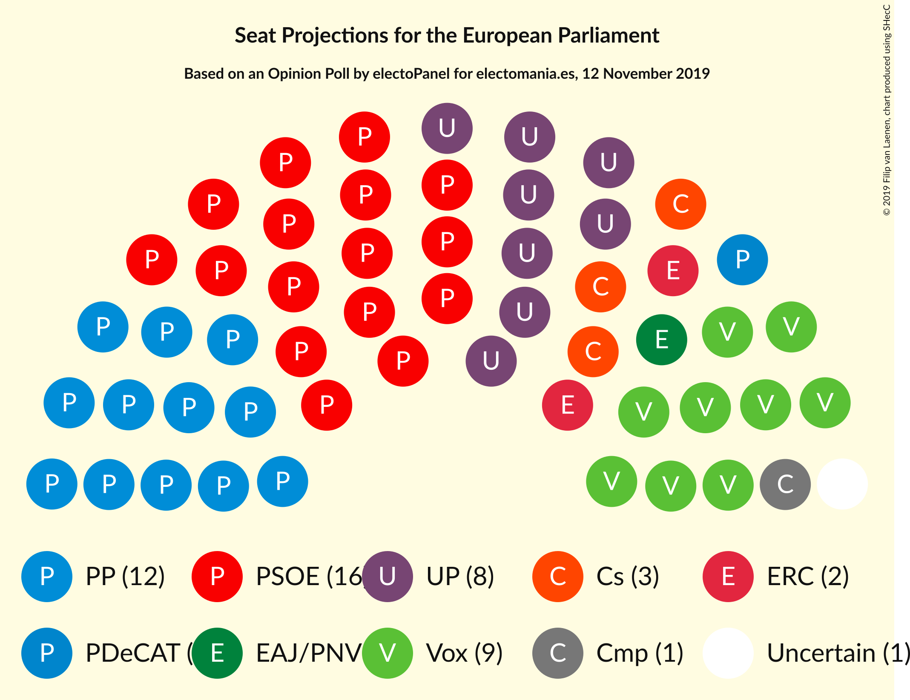

# Opinion Poll by electoPanel for electomania.es, 12 November 2019

<a href="#voting-intentions">Voting Intentions</a> | <a href="#seats">Seats</a> | <a href="#coalitions">Coalitions</a> | <a href="#technical-information">Technical Information</a>

## Voting Intentions

### Confidence Intervals

| Party | Last Result | Poll Result | 80% Confidence Interval | 90% Confidence Interval | 95% Confidence Interval | 99% Confidence Interval |
|:-----:|:-----------:|:-----------:|:-----------------------:|:-----------------------:|:-----------------------:|:-----------------------:|
| Partido Socialista Obrero Español (S&D) | 0.0% | 27.5% | 26.0–29.0% |25.6–29.4% |25.3–29.8% |24.6–30.5% |
| Partido Popular (EPP) | 0.0% | 21.4% | 20.1–22.8% |19.7–23.2% |19.4–23.5% |18.8–24.2% |
| Vox (ECR) | 0.0% | 15.6% | 14.5–16.9% |14.2–17.2% |13.9–17.6% |13.4–18.2% |
| Unidos Podemos (GUE/NGL) | 0.0% | 13.7% | 12.6–14.9% |12.3–15.2% |12.1–15.5% |11.6–16.1% |
| Ciudadanos–Partido de la Ciudadanía (RE) | 0.0% | 5.8% | 5.1–6.7% |4.9–6.9% |4.8–7.1% |4.4–7.6% |
| Esquerra Republicana de Catalunya–Catalunya Sí (Greens/EFA) | 0.0% | 3.6% | 3.0–4.3% |2.9–4.5% |2.7–4.6% |2.5–5.0% |
| Partit Demòcrata Europeu Català (NI) | 0.0% | 2.2% | 1.8–2.8% |1.6–2.9% |1.6–3.1% |1.4–3.4% |
| Coalició Compromís (Greens/EFA) | 0.0% | 2.0% | 1.6–2.5% |1.5–2.7% |1.4–2.8% |1.2–3.1% |
| Euzko Alderdi Jeltzalea/Partido Nacionalista Vasco (RE) | 0.0% | 1.6% | 1.2–2.1% |1.1–2.2% |1.1–2.4% |0.9–2.6% |
| Euskal Herria Bildu (GUE/NGL) | 0.0% | 1.2% | 0.9–1.6% |0.8–1.8% |0.7–1.9% |0.6–2.1% |
| Coalición Canaria–Partido Nacionalista Canario (RE) | 0.0% | 0.5% | 0.4–0.9% |0.3–1.0% |0.3–1.1% |0.2–1.2% |
| Bloque Nacionalista Galego–Nós Candidatura Galega (Greens/EFA) | N/A | 0.5% | 0.4–0.9% |0.3–1.0% |0.3–1.1% |0.2–1.2% |

*Note:* The poll result column reflects the actual value used in the calculations. Published results may vary slightly, and in addition be rounded to fewer digits.

## Seats

### Confidence Intervals

| Party | Last Result | Median | 80% Confidence Interval | 90% Confidence Interval | 95% Confidence Interval | 99% Confidence Interval |
|:-----:|:-----------:|:------:|:-----------------------:|:-----------------------:|:-----------------------:|:-----------------------:|
| <a href="#partido-socialista-obrero-español-(s&d)">Partido Socialista Obrero Español (S&D)</a> | 0 | 16 | 16 |15–16 |15–17 |14–17 |
| <a href="#partido-popular-(epp)">Partido Popular (EPP)</a> | 0 | 12 | 12 |11–13 |11–13 |11–14 |
| <a href="#vox-(ecr)">Vox (ECR)</a> | 0 | 8 | 8–9 |8–9 |8–10 |8–10 |
| <a href="#unidos-podemos-(gue/ngl)">Unidos Podemos (GUE/NGL)</a> | 0 | 8 | 7–8 |7–8 |7–8 |7–9 |
| <a href="#ciudadanos–partido-de-la-ciudadanía-(re)">Ciudadanos–Partido de la Ciudadanía (RE)</a> | 0 | 4 | 3–4 |3–4 |2–4 |2–4 |
| <a href="#esquerra-republicana-de-catalunya–catalunya-sí-(greens/efa)">Esquerra Republicana de Catalunya–Catalunya Sí (Greens/EFA)</a> | 0 | 2 | 2 |2 |1–2 |1–2 |
| <a href="#partit-demòcrata-europeu-català-(ni)">Partit Demòcrata Europeu Català (NI)</a> | 0 | 1 | 1 |1 |1 |0–1 |
| <a href="#coalició-compromís-(greens/efa)">Coalició Compromís (Greens/EFA)</a> | 0 | 1 | 0–1 |0–1 |0–1 |0–1 |
| <a href="#euzko-alderdi-jeltzalea/partido-nacionalista-vasco-(re)">Euzko Alderdi Jeltzalea/Partido Nacionalista Vasco (RE)</a> | 0 | 0 | 0–1 |0–1 |0–1 |0–1 |
| <a href="#euskal-herria-bildu-(gue/ngl)">Euskal Herria Bildu (GUE/NGL)</a> | 0 | 0 | 0–1 |0–1 |0–1 |0–1 |
| <a href="#coalición-canaria–partido-nacionalista-canario-(re)">Coalición Canaria–Partido Nacionalista Canario (RE)</a> | 0 | 0 | 0 |0 |0 |0 |
| <a href="#bloque-nacionalista-galego–nós-candidatura-galega-(greens/efa)">Bloque Nacionalista Galego–Nós Candidatura Galega (Greens/EFA)</a> | N/A | 0 | 0 |0 |0 |0 |

