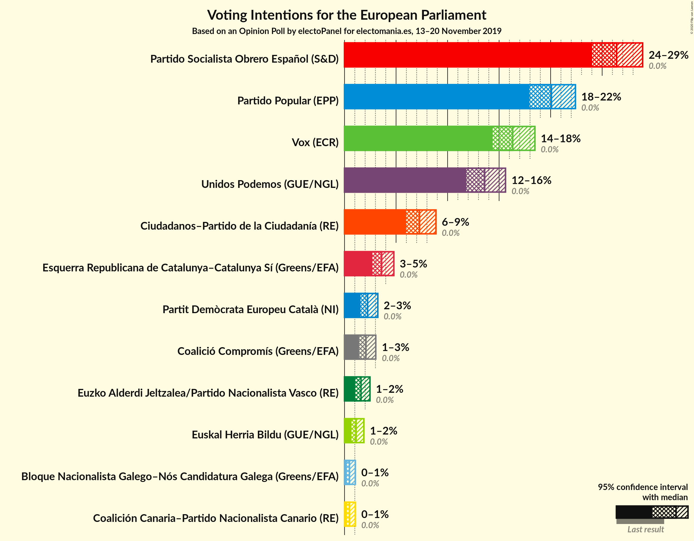
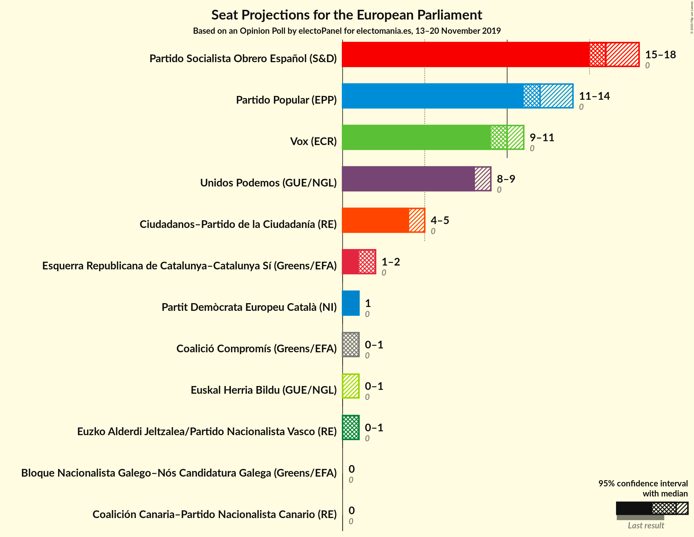
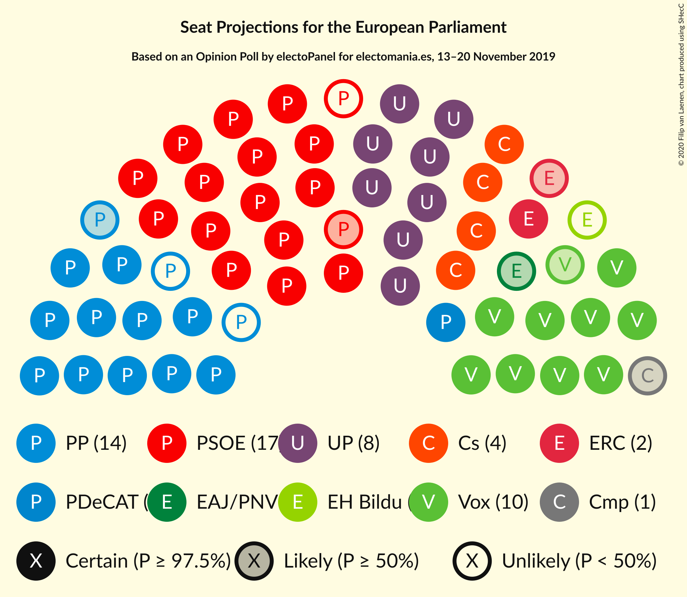

# Opinion Poll by electoPanel for electomania.es, 13–20 November 2019

<a href="#voting-intentions">Voting Intentions</a> | <a href="#seats">Seats</a> | <a href="#coalitions">Coalitions</a> | <a href="#technical-information">Technical Information</a>

## Voting Intentions

### Confidence Intervals

| Party | Last Result | Poll Result | 80% Confidence Interval | 90% Confidence Interval | 95% Confidence Interval | 99% Confidence Interval |
|:-----:|:-----------:|:-----------:|:-----------------------:|:-----------------------:|:-----------------------:|:-----------------------:|
| Partido Socialista Obrero Español (S&D) | 0.0% | 26.4% | 24.8–28.0% |24.4–28.5% |24.0–28.9% |23.3–29.7% |
| Partido Popular (EPP) | 0.0% | 20.1% | 18.7–21.6% |18.3–22.0% |17.9–22.4% |17.3–23.1% |
| Vox (ECR) | 0.0% | 16.3% | 15.0–17.7% |14.7–18.1% |14.4–18.5% |13.8–19.2% |
| Unidos Podemos (GUE/NGL) | 0.0% | 13.6% | 12.4–14.9% |12.1–15.3% |11.8–15.6% |11.3–16.3% |
| Ciudadanos–Partido de la Ciudadanía (RE) | 0.0% | 7.3% | 6.4–8.3% |6.2–8.6% |6.0–8.9% |5.6–9.4% |
| Esquerra Republicana de Catalunya–Catalunya Sí (Greens/EFA) | 0.0% | 3.6% | 3.0–4.4% |2.8–4.6% |2.7–4.8% |2.4–5.2% |
| Partit Demòcrata Europeu Català (NI) | 0.0% | 2.2% | 1.8–2.9% |1.7–3.1% |1.6–3.2% |1.4–3.6% |
| Coalició Compromís (Greens/EFA) | 0.0% | 2.1% | 1.6–2.7% |1.5–2.9% |1.4–3.0% |1.2–3.4% |
| Euzko Alderdi Jeltzalea/Partido Nacionalista Vasco (RE) | 0.0% | 1.6% | 1.2–2.2% |1.1–2.3% |1.0–2.5% |0.9–2.8% |
| Euskal Herria Bildu (GUE/NGL) | 0.0% | 1.1% | 0.8–1.6% |0.7–1.8% |0.7–1.9% |0.5–2.1% |
| Coalición Canaria–Partido Nacionalista Canario (RE) | 0.0% | 0.5% | 0.3–0.9% |0.3–0.9% |0.2–1.1% |0.2–1.2% |
| Bloque Nacionalista Galego–Nós Candidatura Galega (Greens/EFA) | N/A | 0.5% | 0.3–0.9% |0.3–0.9% |0.2–1.1% |0.2–1.2% |

*Note:* The poll result column reflects the actual value used in the calculations. Published results may vary slightly, and in addition be rounded to fewer digits.

## Seats

### Confidence Intervals

| Party | Last Result | Median | 80% Confidence Interval | 90% Confidence Interval | 95% Confidence Interval | 99% Confidence Interval |
|:-----:|:-----------:|:------:|:-----------------------:|:-----------------------:|:-----------------------:|:-----------------------:|
| <a href="#partido-socialista-obrero-español-(s&d)">Partido Socialista Obrero Español (S&D)</a> | 0 | 15 | 15–16 |14–16 |13–17 |13–17 |
| <a href="#partido-popular-(epp)">Partido Popular (EPP)</a> | 0 | 11 | 11–12 |10–12 |10–12 |10–13 |
| <a href="#vox-(ecr)">Vox (ECR)</a> | 0 | 9 | 8–9 |8–10 |8–10 |8–11 |
| <a href="#unidos-podemos-(gue/ngl)">Unidos Podemos (GUE/NGL)</a> | 0 | 7 | 7–8 |7–9 |7–9 |7–9 |
| <a href="#ciudadanos–partido-de-la-ciudadanía-(re)">Ciudadanos–Partido de la Ciudadanía (RE)</a> | 0 | 4 | 3–5 |3–5 |3–5 |3–5 |
| <a href="#esquerra-republicana-de-catalunya–catalunya-sí-(greens/efa)">Esquerra Republicana de Catalunya–Catalunya Sí (Greens/EFA)</a> | 0 | 2 | 1–2 |1–2 |1–2 |1–3 |
| <a href="#partit-demòcrata-europeu-català-(ni)">Partit Demòcrata Europeu Català (NI)</a> | 0 | 1 | 1 |1 |0–1 |0–1 |
| <a href="#coalició-compromís-(greens/efa)">Coalició Compromís (Greens/EFA)</a> | 0 | 1 | 0–1 |0–1 |0–1 |0–1 |
| <a href="#euzko-alderdi-jeltzalea/partido-nacionalista-vasco-(re)">Euzko Alderdi Jeltzalea/Partido Nacionalista Vasco (RE)</a> | 0 | 1 | 0–1 |0–1 |0–1 |0–1 |
| <a href="#euskal-herria-bildu-(gue/ngl)">Euskal Herria Bildu (GUE/NGL)</a> | 0 | 0 | 0 |0–1 |0–1 |0–1 |
| <a href="#coalición-canaria–partido-nacionalista-canario-(re)">Coalición Canaria–Partido Nacionalista Canario (RE)</a> | 0 | 0 | 0 |0 |0 |0 |
| <a href="#bloque-nacionalista-galego–nós-candidatura-galega-(greens/efa)">Bloque Nacionalista Galego–Nós Candidatura Galega (Greens/EFA)</a> | N/A | 0 | 0 |0 |0 |0 |

