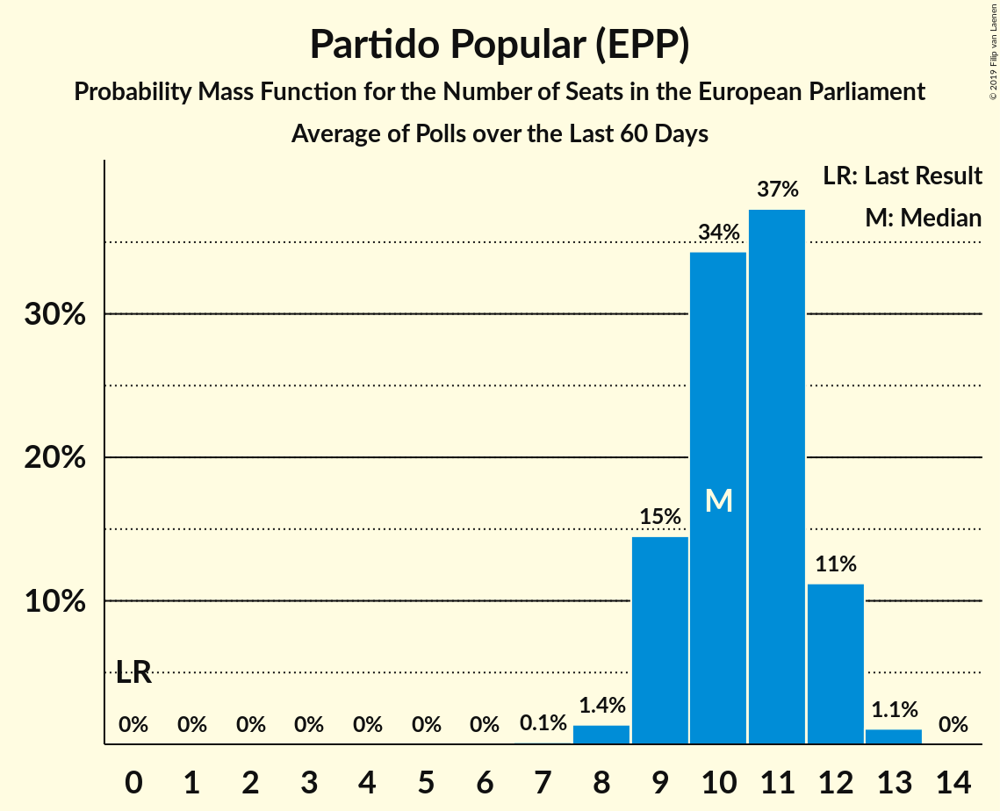
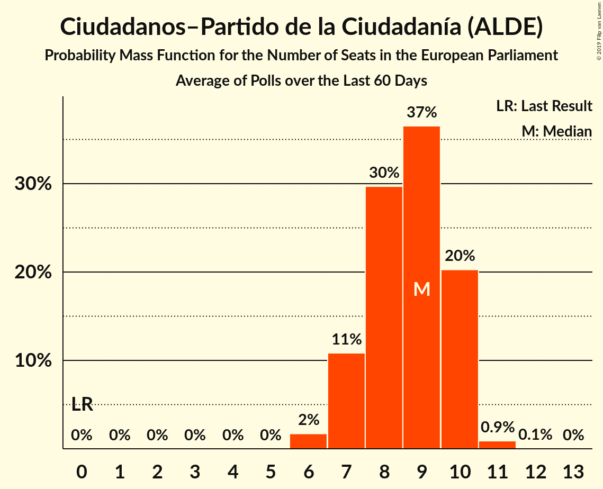
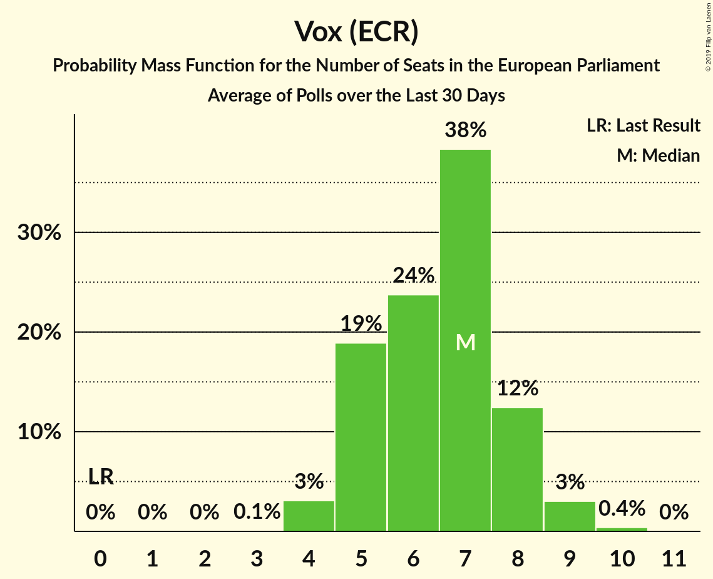
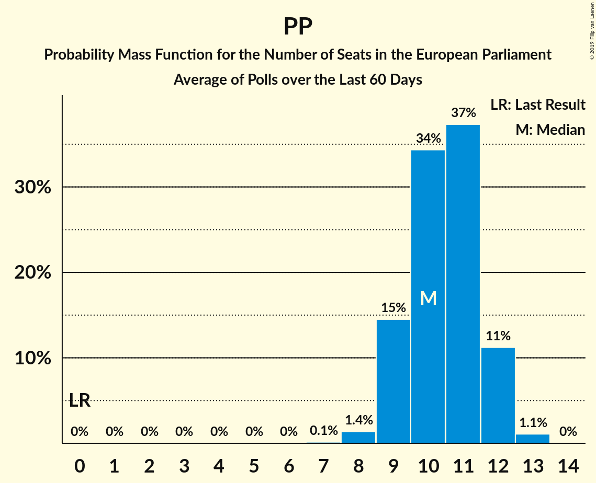

# Poll Average

<a href="#voting-intentions">Voting Intentions</a> | <a href="#seats">Seats</a> | <a href="#coalitions">Coalitions</a> | <a href="#technical-information">Technical Information</a>

## Summary

The table below lists the polls on which the average is based. They are the most recent polls (less than 30 days old) registered and analyzed so far.

| Period     | Polling firm/Commissioner(s) | PP | PSOE | UP | Cs | ERC | PDeCAT | EAJ/PNV | PACMA | EH Bildu | CC | Vox | BNG | AR | CEU | PE |
|:----------:|:----------------------------:|:--:|:--:|:--:|:--:|:--:|:--:|:--:|:--:|:--:|:--:|:--:|:--:|:--:|:--:|:--:|
| 25 May 2014 | General Election | 0.0%   0 | 0.0%   0 | 0.0%   0 | 0.0%   0 | 0.0%   0 | 0.0%   0 | 0.0%   0 | 0.0%   0 | 0.0%   0 | 0.0%   0 | 0.0%   0 | 0.0%   0 | 0.0%   0 | 0.0%   0 | 0.0%   0 |
| N/A | Poll Average | 16–24%   10–15 | 24–32%   14–20 | 10–16%   6–11 | 13–21%   7–13 | N/A   N/A | N/A   N/A | N/A   N/A | 1–4%   0–2 | N/A   N/A | N/A   N/A | 8–14%   5–8 | N/A   N/A | 3–6%   1–4 | 2–4%   1–2 | 0–4%   0–2 |
| [24–27 March 2019](2019-03-27-DemoscopiayServicios.html) | Demoscopia y Servicios   OKDIARIO | 19–23%   11–14 | 25–30%   15–19 | 12–15%   7–9 | 15–19%   9–11 | N/A   N/A | N/A   N/A | N/A   N/A | N/A   N/A | N/A   N/A | N/A   N/A | 10–13%   6–8 | N/A   N/A | 2–4%   1–2 | 2–4%   1–2 | 1–2%   0–1 |
| [21–27 March 2019](2019-03-27-Celeste-Tel.html) | Celeste-Tel   eldiario.es | 21–25%   13–16 | 24–30%   14–19 | 10–14%   6–8 | 15–19%   9–12 | N/A   N/A | N/A   N/A | N/A   N/A | 1–2%   0–1 | N/A   N/A | N/A   N/A | 8–11%   4–6 | N/A   N/A | 3–5%   1–3 | 2–4%   1–2 | 1–3%   0–1 |
| [20–26 March 2019](2019-03-26-IMOP.html) | IMOP   El Confidencial | 18–22%   11–13 | 29–33%   18–21 | 10–14%   6–8 | 13–17%   8–10 | N/A   N/A | N/A   N/A | N/A   N/A | 1–3%   0–1 | N/A   N/A | N/A   N/A | 9–12%   5–7 | N/A   N/A | 3–6%   2–3 | 2–3%   1–2 | 0–1%   0 |
| [18–25 March 2019](2019-03-25-Metroscopia.html) | Metroscopia   Henneo | 18–21%   10–12 | 27–30%   16–18 | 13–15%   7–9 | 15–18%   9–11 | N/A   N/A | N/A   N/A | N/A   N/A | N/A   N/A | N/A   N/A | N/A   N/A | 11–13%   6–8 | N/A   N/A | N/A   N/A | N/A   N/A | N/A   N/A |
| [22 February–24 March 2019](2019-03-24-electoPanel.html) | electoPanel   electomania.es | 18–20%   11–12 | 23–25%   14–15 | 10–11%   6–7 | 18–19%   11–12 | N/A   N/A | N/A   N/A | N/A   N/A | 3–4%   1–2 | N/A   N/A | N/A   N/A | 11–12%   7 | N/A   N/A | 5–6%   3 | 3–4%   1–2 | 4–5%   2 |
| [18–22 March 2019](2019-03-22-NCReport.html) | NC Report   La Razón | 20–25%   11–14 | 24–30%   15–19 | 10–14%   7–9 | 15–20%   9–11 | N/A   N/A | N/A   N/A | N/A   N/A | N/A   N/A | N/A   N/A | N/A   N/A | 9–13%   6–8 | N/A   N/A | 3–5%   2–3 | 2–4%   1–2 | 1–2%   0–1 |
| [1–22 March 2019](2019-03-22-GAD3.html) | GAD3   ABC | 21–23%   13–15 | 30–32%   18–20 | 11–12%   6–7 | 12–14%   7–8 | N/A   N/A | N/A   N/A | N/A   N/A | N/A   N/A | N/A   N/A | N/A   N/A | 11–12%   7 | N/A   N/A | 3–4%   1–2 | 3%   1–2 | 0–1%   0 |
| [15–20 March 2019](2019-03-20-Sondaxe.html) | Sondaxe   La Voz de Galicia | 17–21%   10–12 | 24–30%   15–17 | 11–16%   7–9 | 12–16%   8–9 | N/A   N/A | N/A   N/A | N/A   N/A | N/A   N/A | N/A   N/A | N/A   N/A | 12–16%   7–10 | N/A   N/A | 4–6%   3–4 | 2–4%   1–2 | N/A   N/A |
| [14–19 March 2019](2019-03-19-40dB.html) | 40dB   El País | 17–21%   11–12 | 25–29%   15–17 | 11–14%   6–7 | 16–20%   10–12 | N/A   N/A | N/A   N/A | N/A   N/A | N/A   N/A | N/A   N/A | N/A   N/A | 9–12%   5–7 | N/A   N/A | N/A   N/A | N/A   N/A | N/A   N/A |
| [4–13 March 2019](2019-03-13-SimpleLógica.html) | Simple Lógica | 15–19%   8–10 | 29–34%   17–20 | 11–14%   7–8 | 15–19%   10–11 | N/A   N/A | N/A   N/A | N/A   N/A | N/A   N/A | N/A   N/A | N/A   N/A | 7–10%   4–5 | N/A   N/A | N/A   N/A | N/A   N/A | N/A   N/A |
| [5–8 March 2019](2019-03-08-SocioMétrica.html) | SocioMétrica   El Español | 16–19%   9–11 | 25–30%   16–18 | 12–16%   7–10 | 16–20%   9–11 | N/A   N/A | N/A   N/A | N/A   N/A | 1–3%   1 | N/A   N/A | N/A   N/A | 11–14%   6–8 | N/A   N/A | 3–5%   1–3 | 2–4%   1–2 | N/A   N/A |
| [4–8 March 2019](2019-03-08-Invymark.html) | Invymark   laSexta | 18–23%   11–14 | 23–28%   13–18 | 11–15%   6–9 | 18–23%   11–14 | N/A   N/A | N/A   N/A | N/A   N/A | N/A   N/A | N/A   N/A | N/A   N/A | 10–13%   6–8 | N/A   N/A | N/A   N/A | N/A   N/A | N/A   N/A |
| [25–28 February 2019](2019-02-28-SigmaDos.html) | Sigma Dos   El Mundo | 18–23%   10–13 | 26–32%   16–20 | 13–18%   9–11 | 13–18%   8–10 | N/A   N/A | N/A   N/A | N/A   N/A | 1–2%   0–1 | N/A   N/A | N/A   N/A | 7–10%   4–6 | N/A   N/A | 3–6%   2–3 | 2–4%   0–2 | N/A   N/A |
| 25 May 2014 | General Election | 0.0%   0 | 0.0%   0 | 0.0%   0 | 0.0%   0 | 0.0%   0 | 0.0%   0 | 0.0%   0 | 0.0%   0 | 0.0%   0 | 0.0%   0 | 0.0%   0 | 0.0%   0 | 0.0%   0 | 0.0%   0 | 0.0%   0 |

Only polls for which at least the sample size has been published are included in the table above.

**Legend:**
+ **Top half of each row:** Voting intentions (95% confidence interval)
+ **Bottom half of each row:** Seat projections for the European Parliament (95% confidence interval)
+ **PP:** Partido Popular (EPP)
+ **PSOE:** Partido Socialista Obrero Español (S&D)
+ **UP:** Unidos Podemos (GUE/NGL)
+ **Cs:** Ciudadanos–Partido de la Ciudadanía (ALDE)
+ **ERC:** Esquerra Republicana de Catalunya (Greens/EFA)
+ **PDeCAT:** Partit Demòcrata Europeu Català (ALDE)
+ **EAJ/PNV:** Euzko Alderdi Jeltzalea/Partido Nacionalista Vasco (ALDE)
+ **PACMA:** Partido Animalista Contra el Maltrato Animal (GUE/NGL)
+ **EH Bildu:** Euskal Herria Bildu (GUE/NGL)
+ **CC:** Coalición Canaria (ALDE)
+ **Vox:** Vox (ECR)
+ **BNG:** Bloque Nacionalista Galego (Greens/EFA)
+ **AR:** Ahora Repúblicas (Greens/EFA)
+ **CEU:** Coalición por Europa (ALDE)
+ **PE:** Primavera Europea (Greens/EFA)
+ **N/A (single party):** Party not included the published results
+ **N/A (entire row):** Calculation for this opinion poll not started yet

## Voting Intentions

### Confidence Intervals

| Party | Last Result | Median | 80% Confidence Interval | 90% Confidence Interval | 95% Confidence Interval | 99% Confidence Interval |
|:-----:|:-----------:|:------:|:-----------------------:|:-----------------------:|:-----------------------:|:-----------------------:|
| <a href="#partido-popular-(epp)">Partido Popular (EPP)</a> | 0.0% | 19.8% | 17.5–22.6% |16.8–23.4% | 16.3–24.0% | 15.4–25.2% |
| <a href="#partido-socialista-obrero-español-(s&d)">Partido Socialista Obrero Español (S&D)</a> | 0.0% | 27.9% | 24.5–31.2% |24.0–31.8% | 23.6–32.5% | 23.0–33.6% |
| <a href="#unidos-podemos-(gue/ngl)">Unidos Podemos (GUE/NGL)</a> | 0.0% | 12.7% | 10.8–14.9% |10.4–15.6% | 10.2–16.3% | 9.8–17.4% |
| <a href="#ciudadanos–partido-de-la-ciudadanía-(alde)">Ciudadanos–Partido de la Ciudadanía (ALDE)</a> | 0.0% | 16.7% | 13.5–19.1% |13.0–20.1% | 12.7–20.9% | 12.2–22.2% |
| <a href="#esquerra-republicana-de-catalunya-(greens/efa)">Esquerra Republicana de Catalunya (Greens/EFA)</a> | 0.0% | N/A | N/A |N/A | N/A | N/A |
| <a href="#partit-demòcrata-europeu-català-(alde)">Partit Demòcrata Europeu Català (ALDE)</a> | 0.0% | N/A | N/A |N/A | N/A | N/A |
| <a href="#euzko-alderdi-jeltzalea/partido-nacionalista-vasco-(alde)">Euzko Alderdi Jeltzalea/Partido Nacionalista Vasco (ALDE)</a> | 0.0% | N/A | N/A |N/A | N/A | N/A |
| <a href="#partido-animalista-contra-el-maltrato-animal-(gue/ngl)">Partido Animalista Contra el Maltrato Animal (GUE/NGL)</a> | 0.0% | 1.9% | 1.2–3.3% |1.0–3.5% | 0.9–3.5% | 0.7–3.7% |
| <a href="#euskal-herria-bildu-(gue/ngl)">Euskal Herria Bildu (GUE/NGL)</a> | 0.0% | N/A | N/A |N/A | N/A | N/A |
| <a href="#coalición-canaria-(alde)">Coalición Canaria (ALDE)</a> | 0.0% | N/A | N/A |N/A | N/A | N/A |
| <a href="#vox-(ecr)">Vox (ECR)</a> | 0.0% | 11.0% | 8.6–12.8% |8.0–13.7% | 7.7–14.5% | 7.0–15.7% |
| <a href="#bloque-nacionalista-galego-(greens/efa)">Bloque Nacionalista Galego (Greens/EFA)</a> | 0.0% | N/A | N/A |N/A | N/A | N/A |
| <a href="#ahora-repúblicas-(greens/efa)">Ahora Repúblicas (Greens/EFA)</a> | 0.0% | 4.0% | 3.1–5.2% |2.9–5.4% | 2.7–5.6% | 2.4–6.2% |
| <a href="#coalición-por-europa-(alde)">Coalición por Europa (ALDE)</a> | 0.0% | 2.9% | 2.2–3.5% |2.0–3.8% | 1.9–4.0% | 1.6–4.5% |
| <a href="#primavera-europea-(greens/efa)">Primavera Europea (Greens/EFA)</a> | 0.0% | 1.4% | 0.5–4.3% |0.5–4.4% | 0.4–4.5% | 0.4–4.7% |

### Partido Popular (EPP)

*For a full overview of the results for this party, see the [Partido Popular (EPP)](party-partidopopularepp.html) page.*

| Voting Intentions | Probability | Accumulated | Special Marks |
|:-----------------:|:-----------:|:-----------:|:-------------:|
| 0.0–0.5% | 0% | 100% | Last Result |
| 0.5–1.5% | 0% | 100% |  |
| 1.5–2.5% | 0% | 100% |  |
| 2.5–3.5% | 0% | 100% |  |
| 3.5–4.5% | 0% | 100% |  |
| 4.5–5.5% | 0% | 100% |  |
| 5.5–6.5% | 0% | 100% |  |
| 6.5–7.5% | 0% | 100% |  |
| 7.5–8.5% | 0% | 100% |  |
| 8.5–9.5% | 0% | 100% |  |
| 9.5–10.5% | 0% | 100% |  |
| 10.5–11.5% | 0% | 100% |  |
| 11.5–12.5% | 0% | 100% |  |
| 12.5–13.5% | 0% | 100% |  |
| 13.5–14.5% | 0.1% | 100% |  |
| 14.5–15.5% | 0.6% | 99.9% |  |
| 15.5–16.5% | 3% | 99.3% |  |
| 16.5–17.5% | 7% | 96% |  |
| 17.5–18.5% | 12% | 90% |  |
| 18.5–19.5% | 22% | 77% |  |
| 19.5–20.5% | 17% | 55% | Median |
| 20.5–21.5% | 14% | 39% |  |
| 21.5–22.5% | 14% | 25% |  |
| 22.5–23.5% | 6% | 11% |  |
| 23.5–24.5% | 3% | 4% |  |
| 24.5–25.5% | 1.0% | 1.3% |  |
| 25.5–26.5% | 0.2% | 0.3% |  |
| 26.5–27.5% | 0% | 0% |  |

### Partido Socialista Obrero Español (S&D)

*For a full overview of the results for this party, see the [Partido Socialista Obrero Español (S&D)](party-partidosocialistaobreroespañolsd.html) page.*

| Voting Intentions | Probability | Accumulated | Special Marks |
|:-----------------:|:-----------:|:-----------:|:-------------:|
| 0.0–0.5% | 0% | 100% | Last Result |
| 0.5–1.5% | 0% | 100% |  |
| 1.5–2.5% | 0% | 100% |  |
| 2.5–3.5% | 0% | 100% |  |
| 3.5–4.5% | 0% | 100% |  |
| 4.5–5.5% | 0% | 100% |  |
| 5.5–6.5% | 0% | 100% |  |
| 6.5–7.5% | 0% | 100% |  |
| 7.5–8.5% | 0% | 100% |  |
| 8.5–9.5% | 0% | 100% |  |
| 9.5–10.5% | 0% | 100% |  |
| 10.5–11.5% | 0% | 100% |  |
| 11.5–12.5% | 0% | 100% |  |
| 12.5–13.5% | 0% | 100% |  |
| 13.5–14.5% | 0% | 100% |  |
| 14.5–15.5% | 0% | 100% |  |
| 15.5–16.5% | 0% | 100% |  |
| 16.5–17.5% | 0% | 100% |  |
| 17.5–18.5% | 0% | 100% |  |
| 18.5–19.5% | 0% | 100% |  |
| 19.5–20.5% | 0% | 100% |  |
| 20.5–21.5% | 0% | 100% |  |
| 21.5–22.5% | 0.1% | 100% |  |
| 22.5–23.5% | 2% | 99.9% |  |
| 23.5–24.5% | 8% | 98% |  |
| 24.5–25.5% | 7% | 90% |  |
| 25.5–26.5% | 11% | 83% |  |
| 26.5–27.5% | 16% | 71% |  |
| 27.5–28.5% | 16% | 55% | Median |
| 28.5–29.5% | 12% | 39% |  |
| 29.5–30.5% | 9% | 27% |  |
| 30.5–31.5% | 11% | 17% |  |
| 31.5–32.5% | 5% | 7% |  |
| 32.5–33.5% | 2% | 2% |  |
| 33.5–34.5% | 0.5% | 0.6% |  |
| 34.5–35.5% | 0.1% | 0.1% |  |
| 35.5–36.5% | 0% | 0% |  |

### Unidos Podemos (GUE/NGL)

*For a full overview of the results for this party, see the [Unidos Podemos (GUE/NGL)](party-unidospodemosguengl.html) page.*

| Voting Intentions | Probability | Accumulated | Special Marks |
|:-----------------:|:-----------:|:-----------:|:-------------:|
| 0.0–0.5% | 0% | 100% | Last Result |
| 0.5–1.5% | 0% | 100% |  |
| 1.5–2.5% | 0% | 100% |  |
| 2.5–3.5% | 0% | 100% |  |
| 3.5–4.5% | 0% | 100% |  |
| 4.5–5.5% | 0% | 100% |  |
| 5.5–6.5% | 0% | 100% |  |
| 6.5–7.5% | 0% | 100% |  |
| 7.5–8.5% | 0% | 100% |  |
| 8.5–9.5% | 0.1% | 100% |  |
| 9.5–10.5% | 7% | 99.9% |  |
| 10.5–11.5% | 17% | 93% |  |
| 11.5–12.5% | 22% | 76% |  |
| 12.5–13.5% | 23% | 55% | Median |
| 13.5–14.5% | 18% | 32% |  |
| 14.5–15.5% | 9% | 14% |  |
| 15.5–16.5% | 3% | 5% |  |
| 16.5–17.5% | 1.3% | 2% |  |
| 17.5–18.5% | 0.4% | 0.4% |  |
| 18.5–19.5% | 0.1% | 0.1% |  |
| 19.5–20.5% | 0% | 0% |  |

### Ciudadanos–Partido de la Ciudadanía (ALDE)

*For a full overview of the results for this party, see the [Ciudadanos–Partido de la Ciudadanía (ALDE)](party-ciudadanos–partidodelaciudadaníaalde.html) page.*

| Voting Intentions | Probability | Accumulated | Special Marks |
|:-----------------:|:-----------:|:-----------:|:-------------:|
| 0.0–0.5% | 0% | 100% | Last Result |
| 0.5–1.5% | 0% | 100% |  |
| 1.5–2.5% | 0% | 100% |  |
| 2.5–3.5% | 0% | 100% |  |
| 3.5–4.5% | 0% | 100% |  |
| 4.5–5.5% | 0% | 100% |  |
| 5.5–6.5% | 0% | 100% |  |
| 6.5–7.5% | 0% | 100% |  |
| 7.5–8.5% | 0% | 100% |  |
| 8.5–9.5% | 0% | 100% |  |
| 9.5–10.5% | 0% | 100% |  |
| 10.5–11.5% | 0.1% | 100% |  |
| 11.5–12.5% | 1.3% | 99.9% |  |
| 12.5–13.5% | 9% | 98.6% |  |
| 13.5–14.5% | 7% | 90% |  |
| 14.5–15.5% | 11% | 82% |  |
| 15.5–16.5% | 18% | 71% |  |
| 16.5–17.5% | 19% | 53% | Median |
| 17.5–18.5% | 17% | 34% |  |
| 18.5–19.5% | 11% | 17% |  |
| 19.5–20.5% | 4% | 7% |  |
| 20.5–21.5% | 2% | 3% |  |
| 21.5–22.5% | 1.0% | 1.2% |  |
| 22.5–23.5% | 0.2% | 0.3% |  |
| 23.5–24.5% | 0% | 0% |  |

### Vox (ECR)

*For a full overview of the results for this party, see the [Vox (ECR)](party-voxecr.html) page.*

| Voting Intentions | Probability | Accumulated | Special Marks |
|:-----------------:|:-----------:|:-----------:|:-------------:|
| 0.0–0.5% | 0% | 100% | Last Result |
| 0.5–1.5% | 0% | 100% |  |
| 1.5–2.5% | 0% | 100% |  |
| 2.5–3.5% | 0% | 100% |  |
| 3.5–4.5% | 0% | 100% |  |
| 4.5–5.5% | 0% | 100% |  |
| 5.5–6.5% | 0.1% | 100% |  |
| 6.5–7.5% | 2% | 99.9% |  |
| 7.5–8.5% | 8% | 98% |  |
| 8.5–9.5% | 13% | 90% |  |
| 9.5–10.5% | 16% | 77% |  |
| 10.5–11.5% | 28% | 61% | Median |
| 11.5–12.5% | 20% | 33% |  |
| 12.5–13.5% | 7% | 12% |  |
| 13.5–14.5% | 3% | 6% |  |
| 14.5–15.5% | 2% | 2% |  |
| 15.5–16.5% | 0.5% | 0.6% |  |
| 16.5–17.5% | 0.1% | 0.1% |  |
| 17.5–18.5% | 0% | 0% |  |

### Coalición por Europa (ALDE)

*For a full overview of the results for this party, see the [Coalición por Europa (ALDE)](party-coaliciónporeuropaalde.html) page.*

| Voting Intentions | Probability | Accumulated | Special Marks |
|:-----------------:|:-----------:|:-----------:|:-------------:|
| 0.0–0.5% | 0% | 100% | Last Result |
| 0.5–1.5% | 0.3% | 100% |  |
| 1.5–2.5% | 25% | 99.7% |  |
| 2.5–3.5% | 66% | 75% | Median |
| 3.5–4.5% | 9% | 9% |  |
| 4.5–5.5% | 0.4% | 0.4% |  |
| 5.5–6.5% | 0% | 0% |  |

### Ahora Repúblicas (Greens/EFA)

*For a full overview of the results for this party, see the [Ahora Repúblicas (Greens/EFA)](party-ahorarepúblicasgreensefa.html) page.*

| Voting Intentions | Probability | Accumulated | Special Marks |
|:-----------------:|:-----------:|:-----------:|:-------------:|
| 0.0–0.5% | 0% | 100% | Last Result |
| 0.5–1.5% | 0% | 100% |  |
| 1.5–2.5% | 1.3% | 100% |  |
| 2.5–3.5% | 29% | 98.7% |  |
| 3.5–4.5% | 38% | 69% | Median |
| 4.5–5.5% | 28% | 32% |  |
| 5.5–6.5% | 3% | 3% |  |
| 6.5–7.5% | 0.2% | 0.2% |  |
| 7.5–8.5% | 0% | 0% |  |

### Primavera Europea (Greens/EFA)

*For a full overview of the results for this party, see the [Primavera Europea (Greens/EFA)](party-primaveraeuropeagreensefa.html) page.*

| Voting Intentions | Probability | Accumulated | Special Marks |
|:-----------------:|:-----------:|:-----------:|:-------------:|
| 0.0–0.5% | 13% | 100% | Last Result |
| 0.5–1.5% | 45% | 87% | Median |
| 1.5–2.5% | 24% | 42% |  |
| 2.5–3.5% | 0.8% | 17% |  |
| 3.5–4.5% | 14% | 17% |  |
| 4.5–5.5% | 2% | 2% |  |
| 5.5–6.5% | 0% | 0% |  |

### Partido Animalista Contra el Maltrato Animal (GUE/NGL)

*For a full overview of the results for this party, see the [Partido Animalista Contra el Maltrato Animal (GUE/NGL)](party-partidoanimalistacontraelmaltratoanimalguengl.html) page.*

| Voting Intentions | Probability | Accumulated | Special Marks |
|:-----------------:|:-----------:|:-----------:|:-------------:|
| 0.0–0.5% | 0% | 100% | Last Result |
| 0.5–1.5% | 29% | 100% |  |
| 1.5–2.5% | 46% | 70% | Median |
| 2.5–3.5% | 22% | 24% |  |
| 3.5–4.5% | 2% | 2% |  |
| 4.5–5.5% | 0% | 0% |  |

## Seats

### Confidence Intervals

| Party | Last Result | Median | 80% Confidence Interval | 90% Confidence Interval | 95% Confidence Interval | 99% Confidence Interval |
|:-----:|:-----------:|:------:|:-----------------------:|:-----------------------:|:-----------------------:|:-----------------------:|
| <a href="#partido-popular-(epp)">Partido Popular (EPP)</a> | 0 | 12 | 10–14 |10–14 | 10–15 | 9–15 |
| <a href="#partido-socialista-obrero-español-(s&d)">Partido Socialista Obrero Español (S&D)</a> | 0 | 17 | 14–19 |14–20 | 14–20 | 13–20 |
| <a href="#unidos-podemos-(gue/ngl)">Unidos Podemos (GUE/NGL)</a> | 0 | 7 | 6–9 |6–11 | 6–11 | 6–11 |
| <a href="#ciudadanos–partido-de-la-ciudadanía-(alde)">Ciudadanos–Partido de la Ciudadanía (ALDE)</a> | 0 | 10 | 8–11 |7–12 | 7–13 | 7–14 |
| <a href="#esquerra-republicana-de-catalunya-(greens/efa)">Esquerra Republicana de Catalunya (Greens/EFA)</a> | 0 | N/A | N/A |N/A | N/A | N/A |
| <a href="#partit-demòcrata-europeu-català-(alde)">Partit Demòcrata Europeu Català (ALDE)</a> | 0 | N/A | N/A |N/A | N/A | N/A |
| <a href="#euzko-alderdi-jeltzalea/partido-nacionalista-vasco-(alde)">Euzko Alderdi Jeltzalea/Partido Nacionalista Vasco (ALDE)</a> | 0 | N/A | N/A |N/A | N/A | N/A |
| <a href="#partido-animalista-contra-el-maltrato-animal-(gue/ngl)">Partido Animalista Contra el Maltrato Animal (GUE/NGL)</a> | 0 | 1 | 0–2 |0–2 | 0–2 | 0–2 |
| <a href="#euskal-herria-bildu-(gue/ngl)">Euskal Herria Bildu (GUE/NGL)</a> | 0 | N/A | N/A |N/A | N/A | N/A |
| <a href="#coalición-canaria-(alde)">Coalición Canaria (ALDE)</a> | 0 | N/A | N/A |N/A | N/A | N/A |
| <a href="#vox-(ecr)">Vox (ECR)</a> | 0 | 6 | 5–8 |5–8 | 5–8 | 4–8 |
| <a href="#bloque-nacionalista-galego-(greens/efa)">Bloque Nacionalista Galego (Greens/EFA)</a> | 0 | N/A | N/A |N/A | N/A | N/A |
| <a href="#ahora-repúblicas-(greens/efa)">Ahora Repúblicas (Greens/EFA)</a> | 0 | 2 | 1–3 |1–4 | 1–4 | 1–4 |
| <a href="#coalición-por-europa-(alde)">Coalición por Europa (ALDE)</a> | 0 | 1 | 1–2 |1–2 | 1–2 | 0–2 |
| <a href="#primavera-europea-(greens/efa)">Primavera Europea (Greens/EFA)</a> | 0 | 0 | 0–2 |0–2 | 0–2 | 0–2 |

### Partido Popular (EPP)

*For a full overview of the results for this party, see the [Partido Popular (EPP)](party-partidopopularepp.html) page.*

| Number of Seats | Probability | Accumulated | Special Marks |
|:---------------:|:-----------:|:-----------:|:-------------:|
| 0 | 0% | 100% | Last Result |
| 1 | 0% | 100% |  |
| 2 | 0% | 100% |  |
| 3 | 0% | 100% |  |
| 4 | 0% | 100% |  |
| 5 | 0% | 100% |  |
| 6 | 0% | 100% |  |
| 7 | 0% | 100% |  |
| 8 | 0.2% | 100% |  |
| 9 | 2% | 99.8% |  |
| 10 | 14% | 98% |  |
| 11 | 22% | 84% |  |
| 12 | 33% | 62% | Median |
| 13 | 19% | 29% |  |
| 14 | 7% | 10% |  |
| 15 | 3% | 3% |  |
| 16 | 0.2% | 0.3% |  |
| 17 | 0.1% | 0.1% |  |
| 18 | 0% | 0% |  |

### Partido Socialista Obrero Español (S&D)

*For a full overview of the results for this party, see the [Partido Socialista Obrero Español (S&D)](party-partidosocialistaobreroespañolsd.html) page.*

| Number of Seats | Probability | Accumulated | Special Marks |
|:---------------:|:-----------:|:-----------:|:-------------:|
| 0 | 0% | 100% | Last Result |
| 1 | 0% | 100% |  |
| 2 | 0% | 100% |  |
| 3 | 0% | 100% |  |
| 4 | 0% | 100% |  |
| 5 | 0% | 100% |  |
| 6 | 0% | 100% |  |
| 7 | 0% | 100% |  |
| 8 | 0% | 100% |  |
| 9 | 0% | 100% |  |
| 10 | 0% | 100% |  |
| 11 | 0% | 100% |  |
| 12 | 0.1% | 100% |  |
| 13 | 2% | 99.9% |  |
| 14 | 10% | 98% |  |
| 15 | 10% | 88% |  |
| 16 | 13% | 78% |  |
| 17 | 21% | 65% | Median |
| 18 | 24% | 44% |  |
| 19 | 14% | 20% |  |
| 20 | 5% | 6% |  |
| 21 | 0.4% | 0.4% |  |
| 22 | 0% | 0% |  |

### Unidos Podemos (GUE/NGL)

*For a full overview of the results for this party, see the [Unidos Podemos (GUE/NGL)](party-unidospodemosguengl.html) page.*

| Number of Seats | Probability | Accumulated | Special Marks |
|:---------------:|:-----------:|:-----------:|:-------------:|
| 0 | 0% | 100% | Last Result |
| 1 | 0% | 100% |  |
| 2 | 0% | 100% |  |
| 3 | 0% | 100% |  |
| 4 | 0% | 100% |  |
| 5 | 0.1% | 100% |  |
| 6 | 10% | 99.9% |  |
| 7 | 42% | 90% | Median |
| 8 | 27% | 48% |  |
| 9 | 13% | 21% |  |
| 10 | 2% | 8% |  |
| 11 | 6% | 6% |  |
| 12 | 0.1% | 0.1% |  |
| 13 | 0% | 0% |  |

### Ciudadanos–Partido de la Ciudadanía (ALDE)

*For a full overview of the results for this party, see the [Ciudadanos–Partido de la Ciudadanía (ALDE)](party-ciudadanos–partidodelaciudadaníaalde.html) page.*

| Number of Seats | Probability | Accumulated | Special Marks |
|:---------------:|:-----------:|:-----------:|:-------------:|
| 0 | 0% | 100% | Last Result |
| 1 | 0% | 100% |  |
| 2 | 0% | 100% |  |
| 3 | 0% | 100% |  |
| 4 | 0% | 100% |  |
| 5 | 0% | 100% |  |
| 6 | 0% | 100% |  |
| 7 | 7% | 100% |  |
| 8 | 14% | 93% |  |
| 9 | 18% | 80% |  |
| 10 | 32% | 61% | Median |
| 11 | 21% | 29% |  |
| 12 | 5% | 9% |  |
| 13 | 3% | 4% |  |
| 14 | 0.8% | 1.0% |  |
| 15 | 0.1% | 0.1% |  |
| 16 | 0% | 0% |  |

### Vox (ECR)

*For a full overview of the results for this party, see the [Vox (ECR)](party-voxecr.html) page.*

| Number of Seats | Probability | Accumulated | Special Marks |
|:---------------:|:-----------:|:-----------:|:-------------:|
| 0 | 0% | 100% | Last Result |
| 1 | 0% | 100% |  |
| 2 | 0% | 100% |  |
| 3 | 0.1% | 100% |  |
| 4 | 1.5% | 99.9% |  |
| 5 | 23% | 98% |  |
| 6 | 29% | 76% | Median |
| 7 | 37% | 47% |  |
| 8 | 10% | 10% |  |
| 9 | 0.2% | 0.4% |  |
| 10 | 0.2% | 0.2% |  |
| 11 | 0% | 0% |  |

### Coalición por Europa (ALDE)

*For a full overview of the results for this party, see the [Coalición por Europa (ALDE)](party-coaliciónporeuropaalde.html) page.*

| Number of Seats | Probability | Accumulated | Special Marks |
|:---------------:|:-----------:|:-----------:|:-------------:|
| 0 | 1.1% | 100% | Last Result |
| 1 | 56% | 98.9% | Median |
| 2 | 43% | 43% |  |
| 3 | 0.2% | 0.2% |  |
| 4 | 0% | 0% |  |

### Ahora Repúblicas (Greens/EFA)

*For a full overview of the results for this party, see the [Ahora Repúblicas (Greens/EFA)](party-ahorarepúblicasgreensefa.html) page.*

| Number of Seats | Probability | Accumulated | Special Marks |
|:---------------:|:-----------:|:-----------:|:-------------:|
| 0 | 0% | 100% | Last Result |
| 1 | 10% | 100% |  |
| 2 | 52% | 90% | Median |
| 3 | 28% | 38% |  |
| 4 | 10% | 10% |  |
| 5 | 0% | 0% |  |

### Primavera Europea (Greens/EFA)

*For a full overview of the results for this party, see the [Primavera Europea (Greens/EFA)](party-primaveraeuropeagreensefa.html) page.*

| Number of Seats | Probability | Accumulated | Special Marks |
|:---------------:|:-----------:|:-----------:|:-------------:|
| 0 | 59% | 100% | Last Result, Median |
| 1 | 25% | 41% |  |
| 2 | 16% | 17% |  |
| 3 | 0.4% | 0.4% |  |
| 4 | 0% | 0% |  |

### Partido Animalista Contra el Maltrato Animal (GUE/NGL)

*For a full overview of the results for this party, see the [Partido Animalista Contra el Maltrato Animal (GUE/NGL)](party-partidoanimalistacontraelmaltratoanimalguengl.html) page.*

| Number of Seats | Probability | Accumulated | Special Marks |
|:---------------:|:-----------:|:-----------:|:-------------:|
| 0 | 31% | 100% | Last Result |
| 1 | 50% | 69% | Median |
| 2 | 20% | 20% |  |
| 3 | 0% | 0% |  |

## Coalitions

### Confidence Intervals

| Coalition | Last Result | Median | Majority? | 80% Confidence Interval | 90% Confidence Interval | 95% Confidence Interval | 99% Confidence Interval |
|:---------:|:-----------:|:------:|:---------:|:-----------------------:|:-----------------------:|:-----------------------:|:-----------------------:|
| Partido Socialista Obrero Español (S&D) | 0 | 17 | 0% | 14–19 | 14–20 | 14–20 | 13–20 |
| Partido Popular (EPP) | 0 | 12 | 0% | 10–14 | 10–14 | 10–15 | 9–15 |
| Ciudadanos–Partido de la Ciudadanía (ALDE) – Coalición por Europa (ALDE) | 0 | 11 | 0% | 9–13 | 9–13 | 9–13 | 9–14 |
| Partido Animalista Contra el Maltrato Animal (GUE/NGL) – Unidos Podemos (GUE/NGL) | 0 | 8 | 0% | 7–10 | 6–11 | 6–11 | 6–11 |
| Vox (ECR) | 0 | 6 | 0% | 5–8 | 5–8 | 5–8 | 4–8 |
| Ahora Repúblicas (Greens/EFA) – Primavera Europea (Greens/EFA) | 0 | 2 | 0% | 0–4 | 0–5 | 0–5 | 0–5 |

### Partido Socialista Obrero Español (S&D)

| Number of Seats | Probability | Accumulated | Special Marks |
|:---------------:|:-----------:|:-----------:|:-------------:|
| 0 | 0% | 100% | Last Result |
| 1 | 0% | 100% |  |
| 2 | 0% | 100% |  |
| 3 | 0% | 100% |  |
| 4 | 0% | 100% |  |
| 5 | 0% | 100% |  |
| 6 | 0% | 100% |  |
| 7 | 0% | 100% |  |
| 8 | 0% | 100% |  |
| 9 | 0% | 100% |  |
| 10 | 0% | 100% |  |
| 11 | 0% | 100% |  |
| 12 | 0.1% | 100% |  |
| 13 | 2% | 99.9% |  |
| 14 | 10% | 98% |  |
| 15 | 10% | 88% |  |
| 16 | 13% | 78% |  |
| 17 | 21% | 65% | Median |
| 18 | 24% | 44% |  |
| 19 | 14% | 20% |  |
| 20 | 5% | 6% |  |
| 21 | 0.4% | 0.4% |  |
| 22 | 0% | 0% |  |

### Partido Popular (EPP)

| Number of Seats | Probability | Accumulated | Special Marks |
|:---------------:|:-----------:|:-----------:|:-------------:|
| 0 | 0% | 100% | Last Result |
| 1 | 0% | 100% |  |
| 2 | 0% | 100% |  |
| 3 | 0% | 100% |  |
| 4 | 0% | 100% |  |
| 5 | 0% | 100% |  |
| 6 | 0% | 100% |  |
| 7 | 0% | 100% |  |
| 8 | 0.2% | 100% |  |
| 9 | 2% | 99.8% |  |
| 10 | 14% | 98% |  |
| 11 | 22% | 84% |  |
| 12 | 33% | 62% | Median |
| 13 | 19% | 29% |  |
| 14 | 7% | 10% |  |
| 15 | 3% | 3% |  |
| 16 | 0.2% | 0.3% |  |
| 17 | 0.1% | 0.1% |  |
| 18 | 0% | 0% |  |

### Ciudadanos–Partido de la Ciudadanía (ALDE) – Coalición por Europa (ALDE)

| Number of Seats | Probability | Accumulated | Special Marks |
|:---------------:|:-----------:|:-----------:|:-------------:|
| 0 | 0% | 100% | Last Result |
| 1 | 0% | 100% |  |
| 2 | 0% | 100% |  |
| 3 | 0% | 100% |  |
| 4 | 0% | 100% |  |
| 5 | 0% | 100% |  |
| 6 | 0% | 100% |  |
| 7 | 0% | 100% |  |
| 8 | 0.4% | 100% |  |
| 9 | 16% | 99.6% |  |
| 10 | 33% | 83% |  |
| 11 | 23% | 50% | Median |
| 12 | 15% | 28% |  |
| 13 | 12% | 13% |  |
| 14 | 1.1% | 1.3% |  |
| 15 | 0.1% | 0.1% |  |
| 16 | 0% | 0% |  |

### Partido Animalista Contra el Maltrato Animal (GUE/NGL) – Unidos Podemos (GUE/NGL)

| Number of Seats | Probability | Accumulated | Special Marks |
|:---------------:|:-----------:|:-----------:|:-------------:|
| 0 | 0% | 100% | Last Result |
| 1 | 0% | 100% |  |
| 2 | 0% | 100% |  |
| 3 | 0% | 100% |  |
| 4 | 0% | 100% |  |
| 5 | 0% | 100% |  |
| 6 | 6% | 100% |  |
| 7 | 35% | 94% |  |
| 8 | 27% | 59% | Median |
| 9 | 18% | 32% |  |
| 10 | 6% | 14% |  |
| 11 | 8% | 8% |  |
| 12 | 0.1% | 0.1% |  |
| 13 | 0% | 0% |  |

### Vox (ECR)

| Number of Seats | Probability | Accumulated | Special Marks |
|:---------------:|:-----------:|:-----------:|:-------------:|
| 0 | 0% | 100% | Last Result |
| 1 | 0% | 100% |  |
| 2 | 0% | 100% |  |
| 3 | 0.1% | 100% |  |
| 4 | 1.5% | 99.9% |  |
| 5 | 23% | 98% |  |
| 6 | 29% | 76% | Median |
| 7 | 37% | 47% |  |
| 8 | 10% | 10% |  |
| 9 | 0.2% | 0.4% |  |
| 10 | 0.2% | 0.2% |  |
| 11 | 0% | 0% |  |

### Ahora Repúblicas (Greens/EFA) – Primavera Europea (Greens/EFA)

| Number of Seats | Probability | Accumulated | Special Marks |
|:---------------:|:-----------:|:-----------:|:-------------:|
| 0 | 31% | 100% | Last Result |
| 1 | 5% | 69% |  |
| 2 | 30% | 64% | Median |
| 3 | 18% | 34% |  |
| 4 | 8% | 16% |  |
| 5 | 8% | 8% |  |
| 6 | 0% | 0% |  |

## Technical Information

+ **Number of polls included in this average:** 13
+ **Lowest number of simulations done in a poll included in this average:** 1,024
+ **Total number of simulations done in the polls included in this average:** 533,504
+ **Error estimate:** 4.45%
