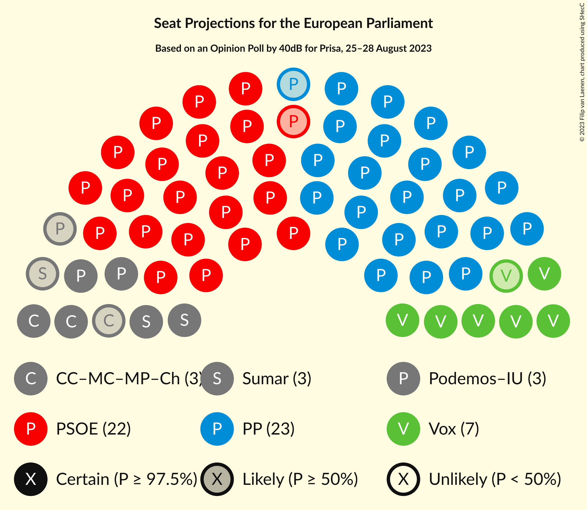
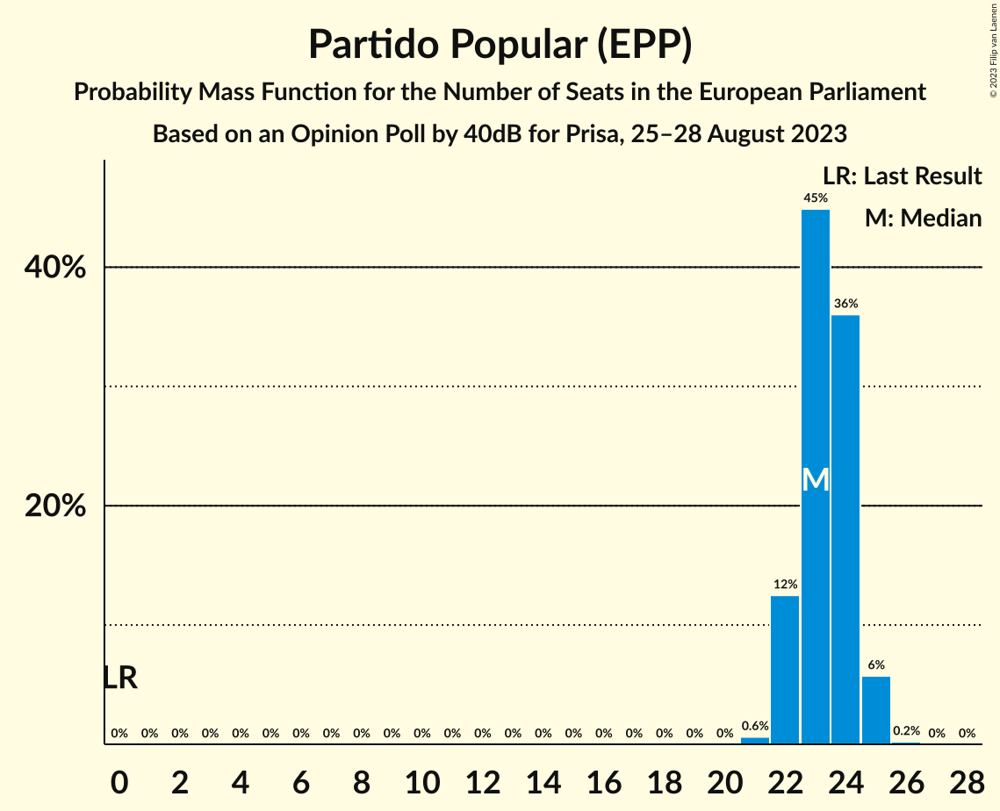
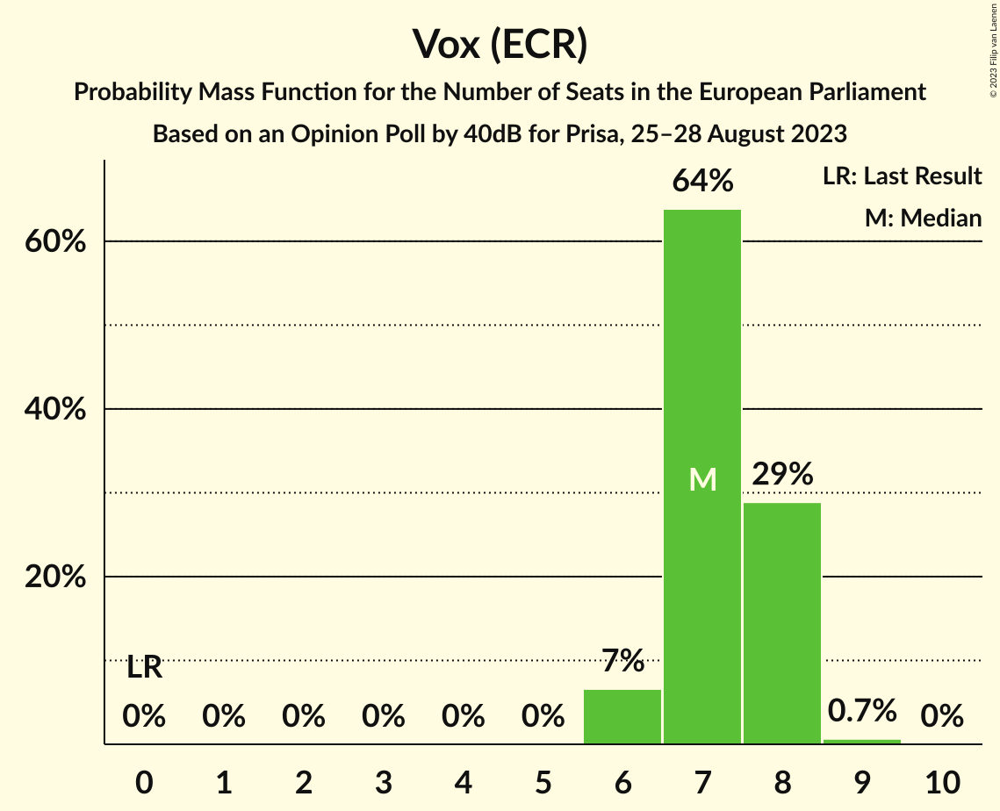
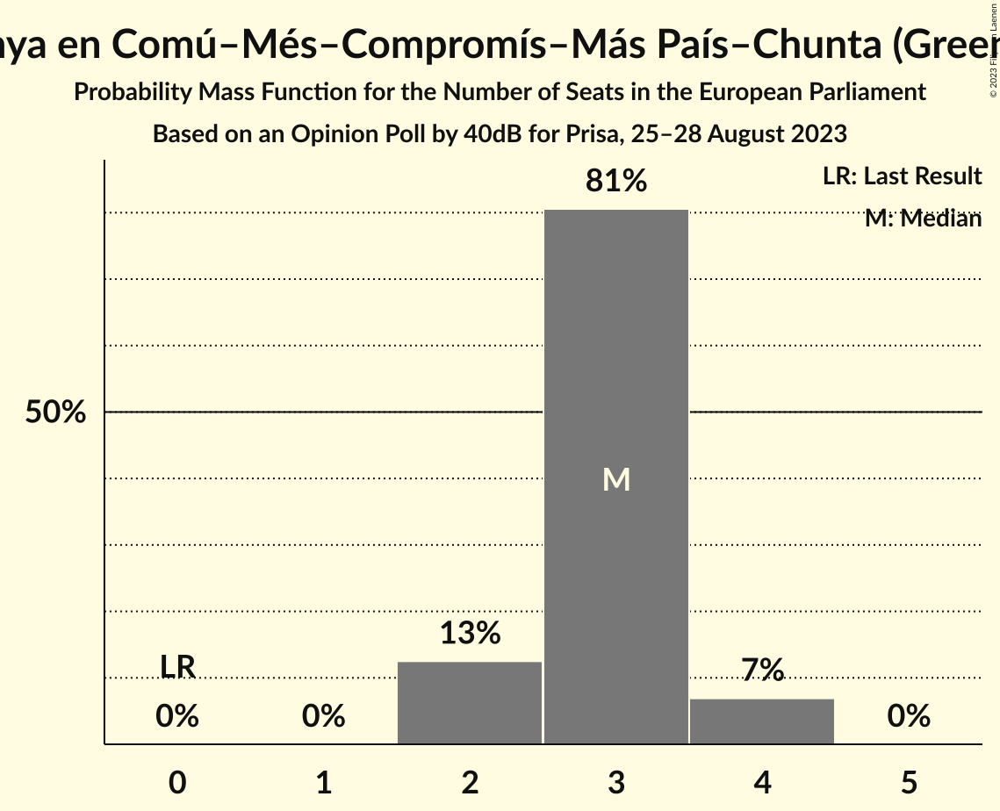
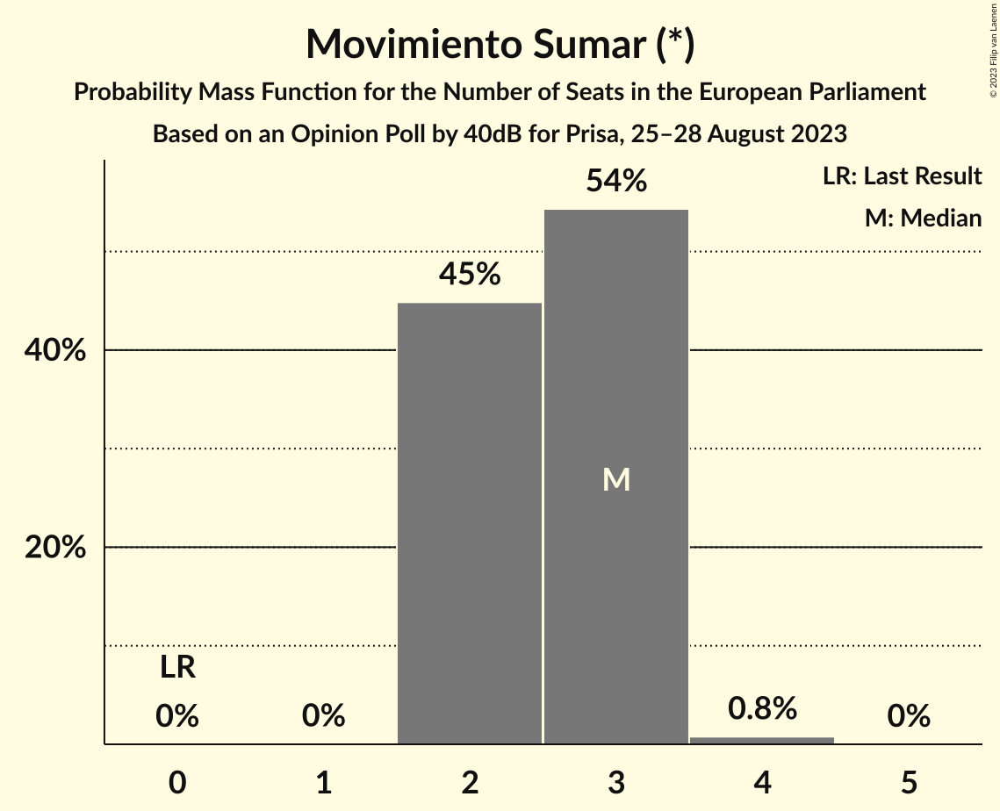
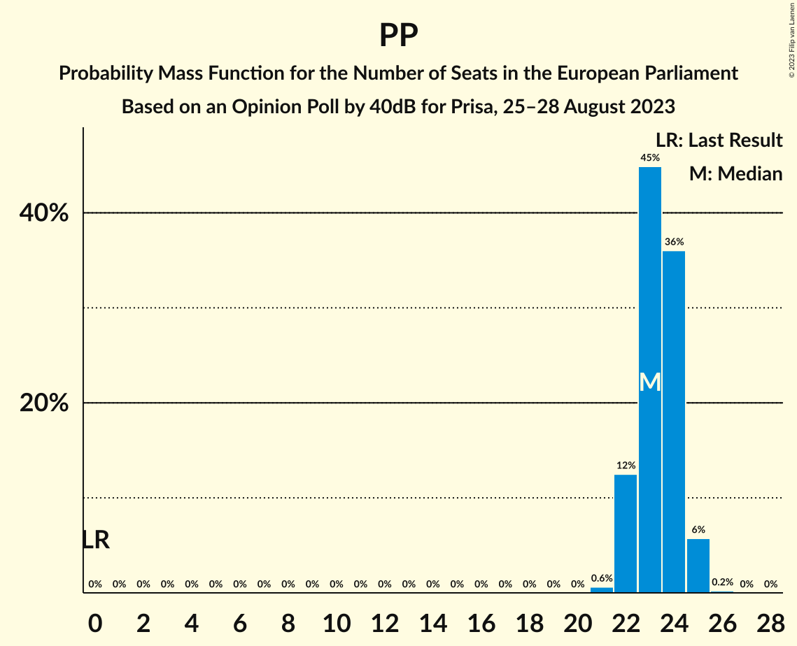
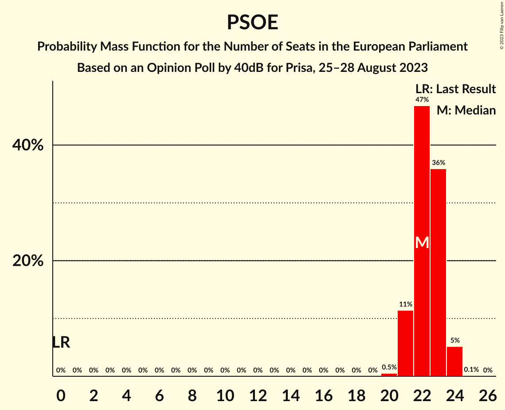

# Opinion Poll by 40dB for Prisa, 25–28 August 2023

<a href="#voting-intentions">Voting Intentions</a> | <a href="#seats">Seats</a> | <a href="#coalitions">Coalitions</a> | <a href="#technical-information">Technical Information</a>

## Voting Intentions

### Confidence Intervals

| Party | Last Result | Poll Result | 80% Confidence Interval | 90% Confidence Interval | 95% Confidence Interval | 99% Confidence Interval |
|:-----:|:-----------:|:-----------:|:-----------------------:|:-----------------------:|:-----------------------:|:-----------------------:|
| Partido Popular (EPP) | 0.0% | 33.8% | 32.5–35.2% |32.1–35.6% |31.7–35.9% |31.1–36.6% |
| Partido Socialista Obrero Español (S&D) | 0.0% | 32.3% | 31.0–33.7% |30.6–34.0% |30.3–34.4% |29.7–35.1% |
| Vox (ECR) | 0.0% | 10.9% | 10.0–11.8% |9.8–12.1% |9.6–12.3% |9.2–12.8% |
| Catalunya en Comú–Més–Compromís–Más País–Chunta (Greens/EFA) | 0.0% | 4.3% | 3.8–5.0% |3.6–5.1% |3.5–5.3% |3.2–5.6% |
| Movimiento Sumar (*) | 0.0% | 3.8% | 3.3–4.5% |3.2–4.6% |3.1–4.8% |2.9–5.1% |
| Podemos–Izquierda Unida (GUE/NGL) | 0.0% | 3.8% | 3.3–4.5% |3.2–4.6% |3.1–4.8% |2.9–5.1% |

*Note:* The poll result column reflects the actual value used in the calculations. Published results may vary slightly, and in addition be rounded to fewer digits.

## Seats

### Confidence Intervals

| Party | Last Result | Median | 80% Confidence Interval | 90% Confidence Interval | 95% Confidence Interval | 99% Confidence Interval |
|:-----:|:-----------:|:------:|:-----------------------:|:-----------------------:|:-----------------------:|:-----------------------:|
| <a href="#partido-popular-(epp)">Partido Popular (EPP)</a> | 0 | 21 | 20–22 |20–22 |20–23 |19–23 |
| <a href="#partido-socialista-obrero-español-(s&d)">Partido Socialista Obrero Español (S&D)</a> | 0 | 20 | 19–21 |19–21 |19–22 |19–22 |
| <a href="#vox-(ecr)">Vox (ECR)</a> | 0 | 7 | 6–7 |6–7 |6–7 |5–8 |
| <a href="#catalunya-en-comú–més–compromís–más-país–chunta-(greens/efa)">Catalunya en Comú–Més–Compromís–Más País–Chunta (Greens/EFA)</a> | 0 | 2 | 2–3 |2–3 |2–3 |2–3 |
| <a href="#movimiento-sumar-(*)">Movimiento Sumar (*)</a> | 0 | 2 | 2 |2 |1–3 |1–3 |
| <a href="#podemos–izquierda-unida-(gue/ngl)">Podemos–Izquierda Unida (GUE/NGL)</a> | 0 | 2 | 2 |2 |1–3 |1–3 |

### Partido Popular (EPP)

*For a full overview of the results for this party, see the [Partido Popular (EPP)](party-partidopopularepp.html) page.*

| Number of Seats | Probability | Accumulated | Special Marks |
|:---------------:|:-----------:|:-----------:|:-------------:|
| 0 | 0% | 100% | Last Result |
| 1 | 0% | 100% |  |
| 2 | 0% | 100% |  |
| 3 | 0% | 100% |  |
| 4 | 0% | 100% |  |
| 5 | 0% | 100% |  |
| 6 | 0% | 100% |  |
| 7 | 0% | 100% |  |
| 8 | 0% | 100% |  |
| 9 | 0% | 100% |  |
| 10 | 0% | 100% |  |
| 11 | 0% | 100% |  |
| 12 | 0% | 100% |  |
| 13 | 0% | 100% |  |
| 14 | 0% | 100% |  |
| 15 | 0% | 100% |  |
| 16 | 0% | 100% |  |
| 17 | 0% | 100% |  |
| 18 | 0% | 100% |  |
| 19 | 0.5% | 100% |  |
| 20 | 13% | 99.5% |  |
| 21 | 51% | 87% | Median |
| 22 | 32% | 36% |  |
| 23 | 4% | 4% |  |
| 24 | 0.1% | 0.1% |  |
| 25 | 0% | 0% |  |

### Partido Socialista Obrero Español (S&D)

*For a full overview of the results for this party, see the [Partido Socialista Obrero Español (S&D)](party-partidosocialistaobreroespañolsd.html) page.*

| Number of Seats | Probability | Accumulated | Special Marks |
|:---------------:|:-----------:|:-----------:|:-------------:|
| 0 | 0% | 100% | Last Result |
| 1 | 0% | 100% |  |
| 2 | 0% | 100% |  |
| 3 | 0% | 100% |  |
| 4 | 0% | 100% |  |
| 5 | 0% | 100% |  |
| 6 | 0% | 100% |  |
| 7 | 0% | 100% |  |
| 8 | 0% | 100% |  |
| 9 | 0% | 100% |  |
| 10 | 0% | 100% |  |
| 11 | 0% | 100% |  |
| 12 | 0% | 100% |  |
| 13 | 0% | 100% |  |
| 14 | 0% | 100% |  |
| 15 | 0% | 100% |  |
| 16 | 0% | 100% |  |
| 17 | 0% | 100% |  |
| 18 | 0.4% | 100% |  |
| 19 | 12% | 99.6% |  |
| 20 | 47% | 88% | Median |
| 21 | 36% | 40% |  |
| 22 | 4% | 4% |  |
| 23 | 0.1% | 0.1% |  |
| 24 | 0% | 0% |  |

### Vox (ECR)

*For a full overview of the results for this party, see the [Vox (ECR)](party-voxecr.html) page.*

| Number of Seats | Probability | Accumulated | Special Marks |
|:---------------:|:-----------:|:-----------:|:-------------:|
| 0 | 0% | 100% | Last Result |
| 1 | 0% | 100% |  |
| 2 | 0% | 100% |  |
| 3 | 0% | 100% |  |
| 4 | 0% | 100% |  |
| 5 | 0.8% | 100% |  |
| 6 | 45% | 99.2% |  |
| 7 | 52% | 54% | Median |
| 8 | 2% | 2% |  |
| 9 | 0% | 0% |  |

### Catalunya en Comú–Més–Compromís–Más País–Chunta (Greens/EFA)

*For a full overview of the results for this party, see the [Catalunya en Comú–Més–Compromís–Más País–Chunta (Greens/EFA)](party-catalunyaencomú–més–compromís–máspaís–chuntagreensefa.html) page.*

| Number of Seats | Probability | Accumulated | Special Marks |
|:---------------:|:-----------:|:-----------:|:-------------:|
| 0 | 0% | 100% | Last Result |
| 1 | 0.1% | 100% |  |
| 2 | 76% | 99.9% | Median |
| 3 | 23% | 23% |  |
| 4 | 0% | 0% |  |

### Movimiento Sumar (*)

*For a full overview of the results for this party, see the [Movimiento Sumar (*)](party-movimientosumar.html) page.*

| Number of Seats | Probability | Accumulated | Special Marks |
|:---------------:|:-----------:|:-----------:|:-------------:|
| 0 | 0% | 100% | Last Result |
| 1 | 4% | 100% |  |
| 2 | 92% | 96% | Median |
| 3 | 4% | 4% |  |
| 4 | 0% | 0% |  |

### Podemos–Izquierda Unida (GUE/NGL)

*For a full overview of the results for this party, see the [Podemos–Izquierda Unida (GUE/NGL)](party-podemos–izquierdaunidaguengl.html) page.*

| Number of Seats | Probability | Accumulated | Special Marks |
|:---------------:|:-----------:|:-----------:|:-------------:|
| 0 | 0% | 100% | Last Result |
| 1 | 3% | 100% |  |
| 2 | 93% | 97% | Median |
| 3 | 5% | 5% |  |
| 4 | 0% | 0% |  |

## Coalitions

### Confidence Intervals

| Coalition | Last Result | Median | Majority? | 80% Confidence Interval | 90% Confidence Interval | 95% Confidence Interval | 99% Confidence Interval |
|:---------:|:-----------:|:------:|:---------:|:-----------------------:|:-----------------------:|:-----------------------:|:-----------------------:|
| Partido Popular (EPP) | 0 | 21 | 0% | 20–22 | 20–22 | 20–23 | 19–23 |
| Partido Socialista Obrero Español (S&D) | 0 | 20 | 0% | 19–21 | 19–21 | 19–22 | 19–22 |
| Vox (ECR) | 0 | 7 | 0% | 6–7 | 6–7 | 6–7 | 5–8 |

### Partido Popular (EPP)

| Number of Seats | Probability | Accumulated | Special Marks |
|:---------------:|:-----------:|:-----------:|:-------------:|
| 0 | 0% | 100% | Last Result |
| 1 | 0% | 100% |  |
| 2 | 0% | 100% |  |
| 3 | 0% | 100% |  |
| 4 | 0% | 100% |  |
| 5 | 0% | 100% |  |
| 6 | 0% | 100% |  |
| 7 | 0% | 100% |  |
| 8 | 0% | 100% |  |
| 9 | 0% | 100% |  |
| 10 | 0% | 100% |  |
| 11 | 0% | 100% |  |
| 12 | 0% | 100% |  |
| 13 | 0% | 100% |  |
| 14 | 0% | 100% |  |
| 15 | 0% | 100% |  |
| 16 | 0% | 100% |  |
| 17 | 0% | 100% |  |
| 18 | 0% | 100% |  |
| 19 | 0.5% | 100% |  |
| 20 | 13% | 99.5% |  |
| 21 | 51% | 87% | Median |
| 22 | 32% | 36% |  |
| 23 | 4% | 4% |  |
| 24 | 0.1% | 0.1% |  |
| 25 | 0% | 0% |  |

### Partido Socialista Obrero Español (S&D)

| Number of Seats | Probability | Accumulated | Special Marks |
|:---------------:|:-----------:|:-----------:|:-------------:|
| 0 | 0% | 100% | Last Result |
| 1 | 0% | 100% |  |
| 2 | 0% | 100% |  |
| 3 | 0% | 100% |  |
| 4 | 0% | 100% |  |
| 5 | 0% | 100% |  |
| 6 | 0% | 100% |  |
| 7 | 0% | 100% |  |
| 8 | 0% | 100% |  |
| 9 | 0% | 100% |  |
| 10 | 0% | 100% |  |
| 11 | 0% | 100% |  |
| 12 | 0% | 100% |  |
| 13 | 0% | 100% |  |
| 14 | 0% | 100% |  |
| 15 | 0% | 100% |  |
| 16 | 0% | 100% |  |
| 17 | 0% | 100% |  |
| 18 | 0.4% | 100% |  |
| 19 | 12% | 99.6% |  |
| 20 | 47% | 88% | Median |
| 21 | 36% | 40% |  |
| 22 | 4% | 4% |  |
| 23 | 0.1% | 0.1% |  |
| 24 | 0% | 0% |  |

### Vox (ECR)

| Number of Seats | Probability | Accumulated | Special Marks |
|:---------------:|:-----------:|:-----------:|:-------------:|
| 0 | 0% | 100% | Last Result |
| 1 | 0% | 100% |  |
| 2 | 0% | 100% |  |
| 3 | 0% | 100% |  |
| 4 | 0% | 100% |  |
| 5 | 0.8% | 100% |  |
| 6 | 45% | 99.2% |  |
| 7 | 52% | 54% | Median |
| 8 | 2% | 2% |  |
| 9 | 0% | 0% |  |

## Technical Information

### Opinion Poll

+ **Polling firm:** 40dB
+ **Commissioner(s):** Prisa
+ **Fieldwork period:** 25–28 August 2023

### Calculations

+ **Sample size:** 2000
+ **Simulations done:** 1,048,576
+ **Error estimate:** 0.21%

