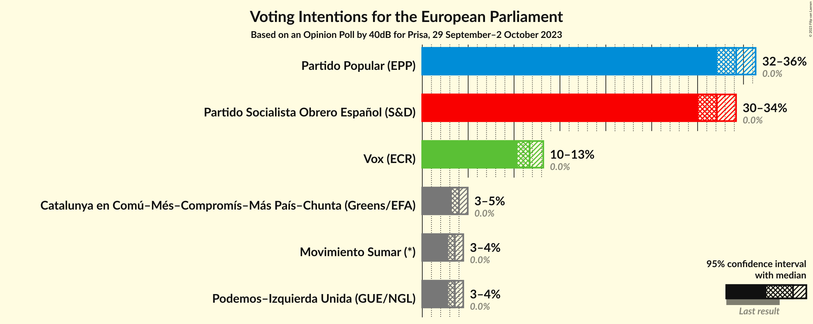
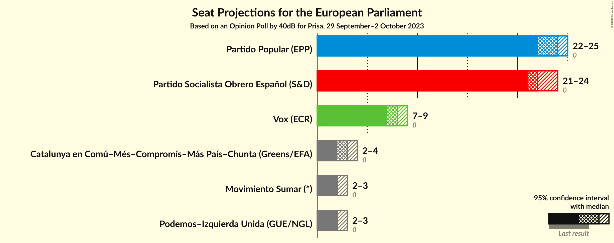
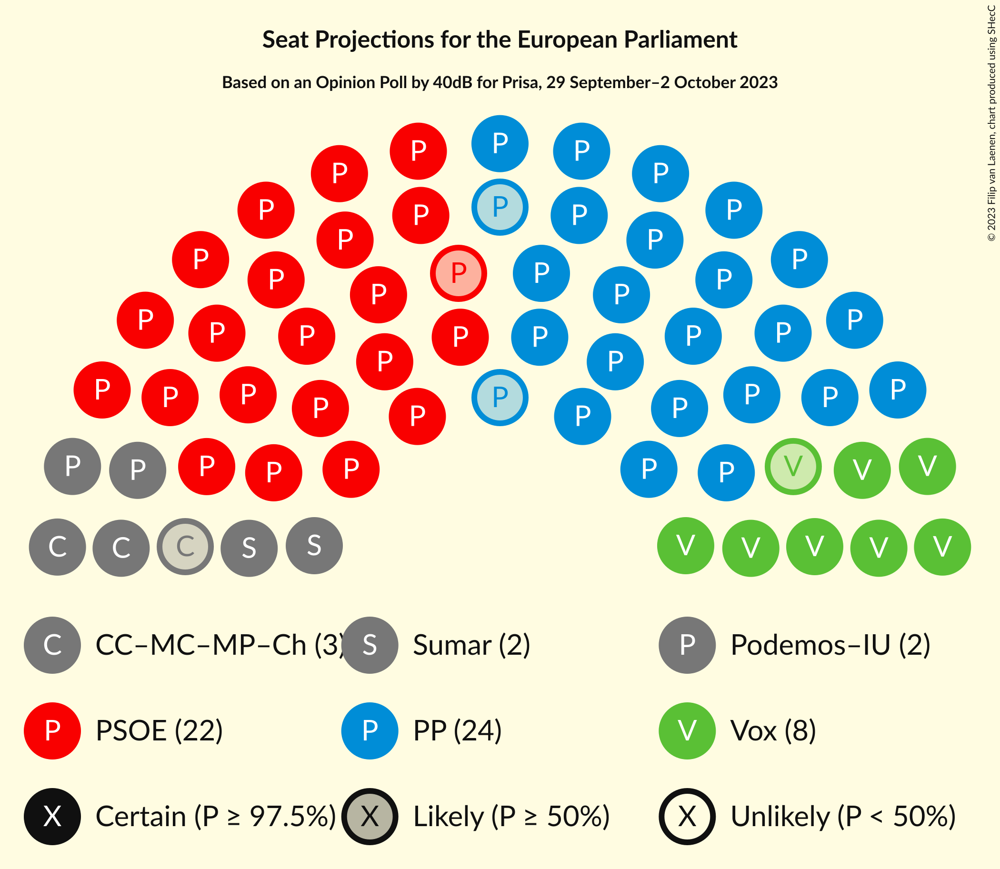
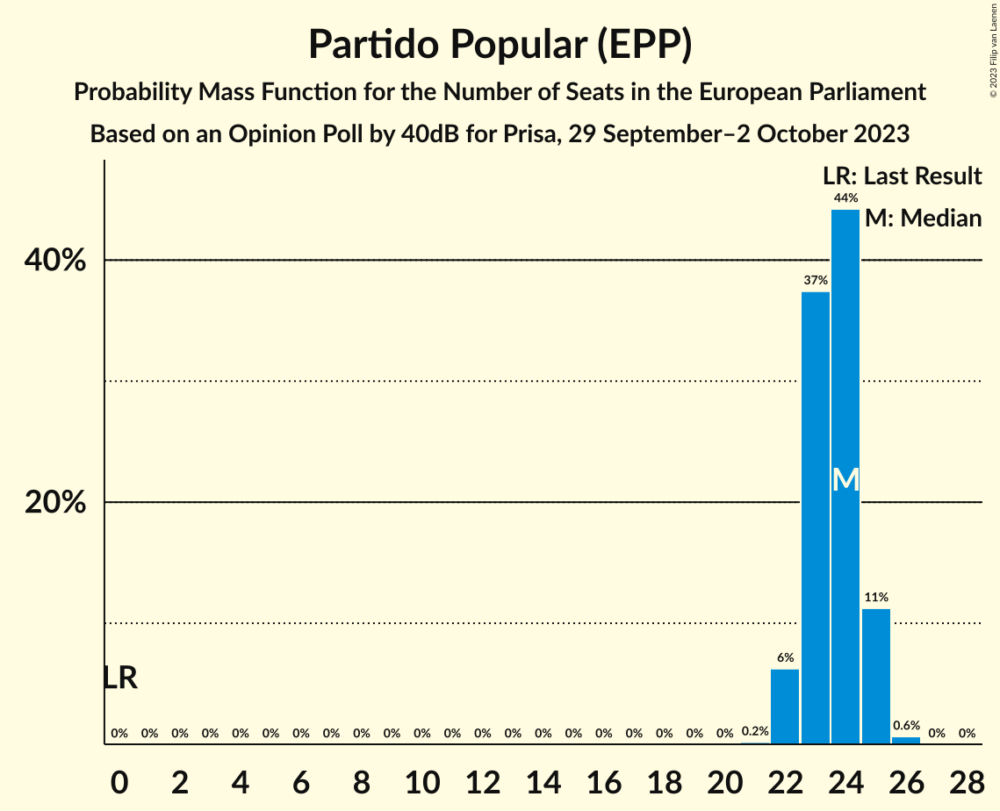
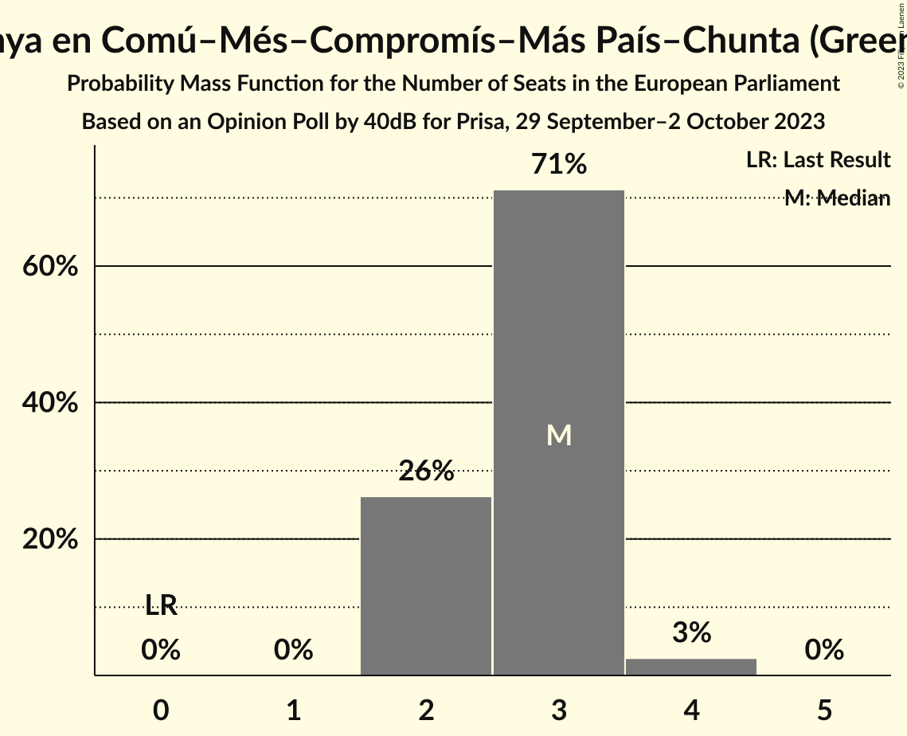
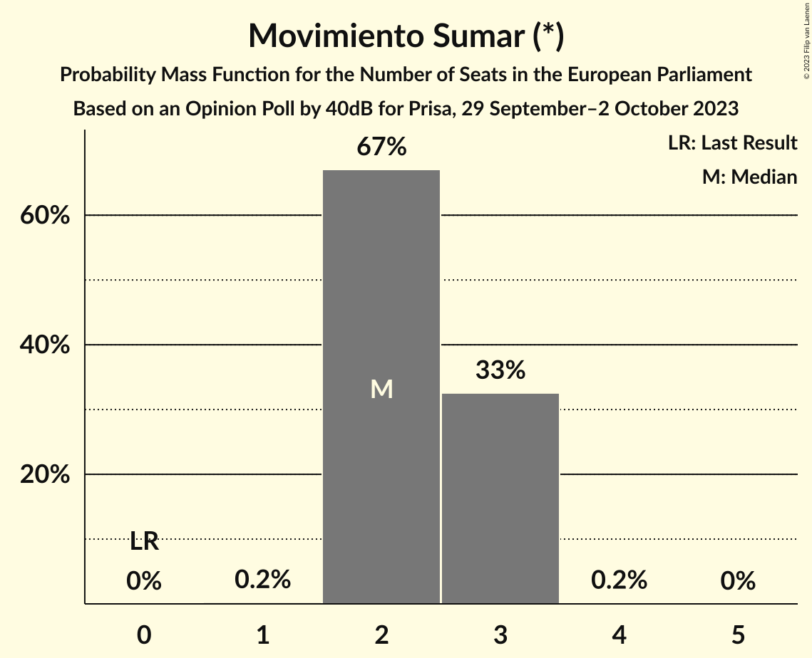
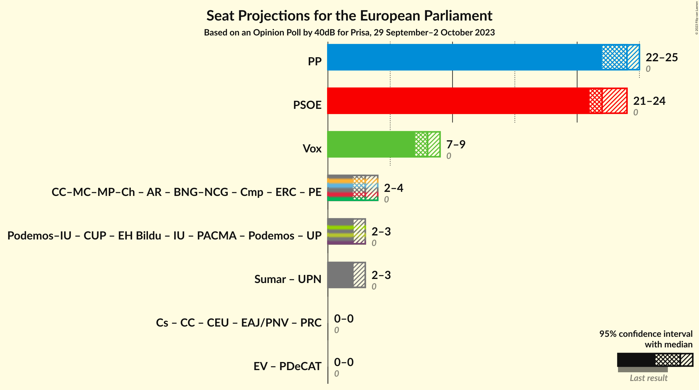
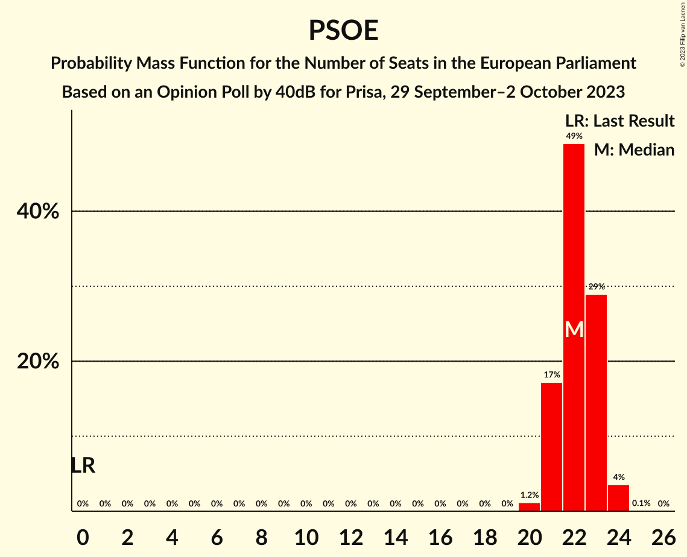
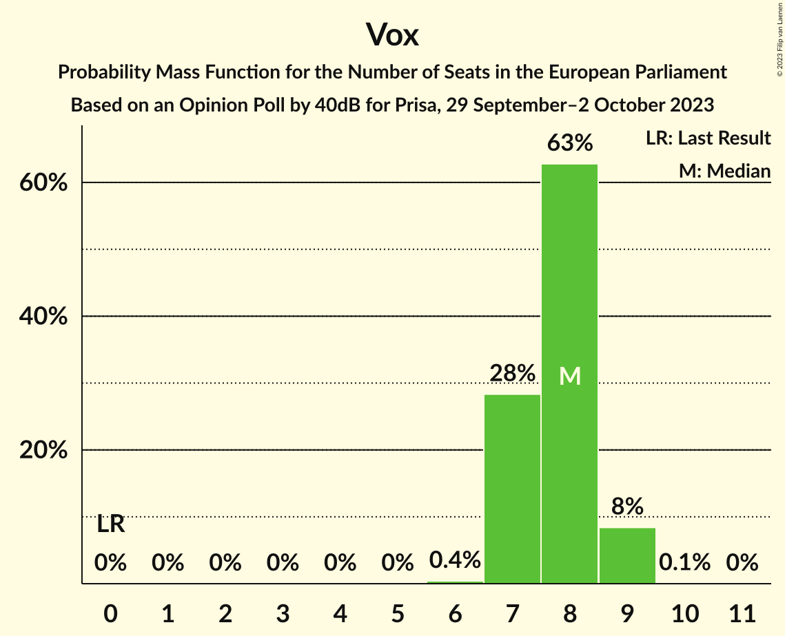

# Opinion Poll by 40dB for Prisa, 29 September–2 October 2023

<a href="#voting-intentions">Voting Intentions</a> | <a href="#seats">Seats</a> | <a href="#coalitions">Coalitions</a> | <a href="#technical-information">Technical Information</a>

## Voting Intentions

### Confidence Intervals

| Party | Last Result | Poll Result | 80% Confidence Interval | 90% Confidence Interval | 95% Confidence Interval | 99% Confidence Interval |
|:-----:|:-----------:|:-----------:|:-----------------------:|:-----------------------:|:-----------------------:|:-----------------------:|
| Partido Popular (EPP) | 0.0% | 34.2% | 32.8–35.6% |32.5–36.0% |32.1–36.3% |31.5–37.0% |
| Partido Socialista Obrero Español (S&D) | 0.0% | 32.1% | 30.8–33.5% |30.4–33.9% |30.1–34.2% |29.5–34.8% |
| Vox (ECR) | 0.0% | 11.7% | 10.8–12.7% |10.6–13.0% |10.4–13.2% |10.0–13.7% |
| Catalunya en Comú–Més–Compromís–Más País–Chunta (Greens/EFA) | 0.0% | 4.0% | 3.5–4.6% |3.3–4.8% |3.2–5.0% |3.0–5.3% |
| Movimiento Sumar (*) | 0.0% | 3.6% | 3.1–4.1% |2.9–4.3% |2.8–4.5% |2.6–4.8% |
| Podemos–Izquierda Unida (GUE/NGL) | 0.0% | 3.6% | 3.1–4.1% |2.9–4.3% |2.8–4.5% |2.6–4.8% |

*Note:* The poll result column reflects the actual value used in the calculations. Published results may vary slightly, and in addition be rounded to fewer digits.

## Seats

### Confidence Intervals

| Party | Last Result | Median | 80% Confidence Interval | 90% Confidence Interval | 95% Confidence Interval | 99% Confidence Interval |
|:-----:|:-----------:|:------:|:-----------------------:|:-----------------------:|:-----------------------:|:-----------------------:|
| <a href="#partido-popular-(epp)">Partido Popular (EPP)</a> | 0 | 24 | 23–25 |22–25 |22–25 |22–26 |
| <a href="#partido-socialista-obrero-español-(s&d)">Partido Socialista Obrero Español (S&D)</a> | 0 | 22 | 21–23 |21–23 |21–24 |20–24 |
| <a href="#vox-(ecr)">Vox (ECR)</a> | 0 | 8 | 7–8 |7–9 |7–9 |7–9 |
| <a href="#catalunya-en-comú–més–compromís–más-país–chunta-(greens/efa)">Catalunya en Comú–Més–Compromís–Más País–Chunta (Greens/EFA)</a> | 0 | 3 | 2–3 |2–3 |2–4 |2–4 |
| <a href="#movimiento-sumar-(*)">Movimiento Sumar (*)</a> | 0 | 2 | 2–3 |2–3 |2–3 |2–3 |
| <a href="#podemos–izquierda-unida-(gue/ngl)">Podemos–Izquierda Unida (GUE/NGL)</a> | 0 | 2 | 2–3 |2–3 |2–3 |2–3 |

### Partido Popular (EPP)

*For a full overview of the results for this party, see the [Partido Popular (EPP)](party-partidopopularepp.html) page.*

| Number of Seats | Probability | Accumulated | Special Marks |
|:---------------:|:-----------:|:-----------:|:-------------:|
| 0 | 0% | 100% | Last Result |
| 1 | 0% | 100% |  |
| 2 | 0% | 100% |  |
| 3 | 0% | 100% |  |
| 4 | 0% | 100% |  |
| 5 | 0% | 100% |  |
| 6 | 0% | 100% |  |
| 7 | 0% | 100% |  |
| 8 | 0% | 100% |  |
| 9 | 0% | 100% |  |
| 10 | 0% | 100% |  |
| 11 | 0% | 100% |  |
| 12 | 0% | 100% |  |
| 13 | 0% | 100% |  |
| 14 | 0% | 100% |  |
| 15 | 0% | 100% |  |
| 16 | 0% | 100% |  |
| 17 | 0% | 100% |  |
| 18 | 0% | 100% |  |
| 19 | 0% | 100% |  |
| 20 | 0% | 100% |  |
| 21 | 0.2% | 100% |  |
| 22 | 6% | 99.8% |  |
| 23 | 37% | 94% |  |
| 24 | 44% | 56% | Median |
| 25 | 11% | 12% |  |
| 26 | 0.6% | 0.7% |  |
| 27 | 0% | 0% |  |

### Partido Socialista Obrero Español (S&D)

*For a full overview of the results for this party, see the [Partido Socialista Obrero Español (S&D)](party-partidosocialistaobreroespañolsd.html) page.*

| Number of Seats | Probability | Accumulated | Special Marks |
|:---------------:|:-----------:|:-----------:|:-------------:|
| 0 | 0% | 100% | Last Result |
| 1 | 0% | 100% |  |
| 2 | 0% | 100% |  |
| 3 | 0% | 100% |  |
| 4 | 0% | 100% |  |
| 5 | 0% | 100% |  |
| 6 | 0% | 100% |  |
| 7 | 0% | 100% |  |
| 8 | 0% | 100% |  |
| 9 | 0% | 100% |  |
| 10 | 0% | 100% |  |
| 11 | 0% | 100% |  |
| 12 | 0% | 100% |  |
| 13 | 0% | 100% |  |
| 14 | 0% | 100% |  |
| 15 | 0% | 100% |  |
| 16 | 0% | 100% |  |
| 17 | 0% | 100% |  |
| 18 | 0% | 100% |  |
| 19 | 0% | 100% |  |
| 20 | 1.2% | 100% |  |
| 21 | 17% | 98.8% |  |
| 22 | 49% | 82% | Median |
| 23 | 29% | 33% |  |
| 24 | 4% | 4% |  |
| 25 | 0.1% | 0.1% |  |
| 26 | 0% | 0% |  |

### Vox (ECR)

*For a full overview of the results for this party, see the [Vox (ECR)](party-voxecr.html) page.*

| Number of Seats | Probability | Accumulated | Special Marks |
|:---------------:|:-----------:|:-----------:|:-------------:|
| 0 | 0% | 100% | Last Result |
| 1 | 0% | 100% |  |
| 2 | 0% | 100% |  |
| 3 | 0% | 100% |  |
| 4 | 0% | 100% |  |
| 5 | 0% | 100% |  |
| 6 | 0.4% | 100% |  |
| 7 | 28% | 99.6% |  |
| 8 | 63% | 71% | Median |
| 9 | 8% | 8% |  |
| 10 | 0.1% | 0.1% |  |
| 11 | 0% | 0% |  |

### Catalunya en Comú–Més–Compromís–Más País–Chunta (Greens/EFA)

*For a full overview of the results for this party, see the [Catalunya en Comú–Més–Compromís–Más País–Chunta (Greens/EFA)](party-catalunyaencomú–més–compromís–máspaís–chuntagreensefa.html) page.*

| Number of Seats | Probability | Accumulated | Special Marks |
|:---------------:|:-----------:|:-----------:|:-------------:|
| 0 | 0% | 100% | Last Result |
| 1 | 0% | 100% |  |
| 2 | 26% | 100% |  |
| 3 | 71% | 74% | Median |
| 4 | 3% | 3% |  |
| 5 | 0% | 0% |  |

### Movimiento Sumar (*)

*For a full overview of the results for this party, see the [Movimiento Sumar (*)](party-movimientosumar.html) page.*

| Number of Seats | Probability | Accumulated | Special Marks |
|:---------------:|:-----------:|:-----------:|:-------------:|
| 0 | 0% | 100% | Last Result |
| 1 | 0.2% | 100% |  |
| 2 | 67% | 99.8% | Median |
| 3 | 33% | 33% |  |
| 4 | 0.2% | 0.2% |  |
| 5 | 0% | 0% |  |

### Podemos–Izquierda Unida (GUE/NGL)

*For a full overview of the results for this party, see the [Podemos–Izquierda Unida (GUE/NGL)](party-podemos–izquierdaunidaguengl.html) page.*

| Number of Seats | Probability | Accumulated | Special Marks |
|:---------------:|:-----------:|:-----------:|:-------------:|
| 0 | 0% | 100% | Last Result |
| 1 | 0.2% | 100% |  |
| 2 | 67% | 99.8% | Median |
| 3 | 33% | 33% |  |
| 4 | 0.1% | 0.1% |  |
| 5 | 0% | 0% |  |

## Coalitions

### Confidence Intervals

| Coalition | Last Result | Median | Majority? | 80% Confidence Interval | 90% Confidence Interval | 95% Confidence Interval | 99% Confidence Interval |
|:---------:|:-----------:|:------:|:---------:|:-----------------------:|:-----------------------:|:-----------------------:|:-----------------------:|
| Partido Popular (EPP) | 0 | 24 | 0% | 23–25 | 22–25 | 22–25 | 22–26 |
| Partido Socialista Obrero Español (S&D) | 0 | 22 | 0% | 21–23 | 21–23 | 21–24 | 20–24 |
| Vox (ECR) | 0 | 8 | 0% | 7–8 | 7–9 | 7–9 | 7–9 |

### Partido Popular (EPP)

| Number of Seats | Probability | Accumulated | Special Marks |
|:---------------:|:-----------:|:-----------:|:-------------:|
| 0 | 0% | 100% | Last Result |
| 1 | 0% | 100% |  |
| 2 | 0% | 100% |  |
| 3 | 0% | 100% |  |
| 4 | 0% | 100% |  |
| 5 | 0% | 100% |  |
| 6 | 0% | 100% |  |
| 7 | 0% | 100% |  |
| 8 | 0% | 100% |  |
| 9 | 0% | 100% |  |
| 10 | 0% | 100% |  |
| 11 | 0% | 100% |  |
| 12 | 0% | 100% |  |
| 13 | 0% | 100% |  |
| 14 | 0% | 100% |  |
| 15 | 0% | 100% |  |
| 16 | 0% | 100% |  |
| 17 | 0% | 100% |  |
| 18 | 0% | 100% |  |
| 19 | 0% | 100% |  |
| 20 | 0% | 100% |  |
| 21 | 0.2% | 100% |  |
| 22 | 6% | 99.8% |  |
| 23 | 37% | 94% |  |
| 24 | 44% | 56% | Median |
| 25 | 11% | 12% |  |
| 26 | 0.6% | 0.7% |  |
| 27 | 0% | 0% |  |

### Partido Socialista Obrero Español (S&D)

| Number of Seats | Probability | Accumulated | Special Marks |
|:---------------:|:-----------:|:-----------:|:-------------:|
| 0 | 0% | 100% | Last Result |
| 1 | 0% | 100% |  |
| 2 | 0% | 100% |  |
| 3 | 0% | 100% |  |
| 4 | 0% | 100% |  |
| 5 | 0% | 100% |  |
| 6 | 0% | 100% |  |
| 7 | 0% | 100% |  |
| 8 | 0% | 100% |  |
| 9 | 0% | 100% |  |
| 10 | 0% | 100% |  |
| 11 | 0% | 100% |  |
| 12 | 0% | 100% |  |
| 13 | 0% | 100% |  |
| 14 | 0% | 100% |  |
| 15 | 0% | 100% |  |
| 16 | 0% | 100% |  |
| 17 | 0% | 100% |  |
| 18 | 0% | 100% |  |
| 19 | 0% | 100% |  |
| 20 | 1.2% | 100% |  |
| 21 | 17% | 98.8% |  |
| 22 | 49% | 82% | Median |
| 23 | 29% | 33% |  |
| 24 | 4% | 4% |  |
| 25 | 0.1% | 0.1% |  |
| 26 | 0% | 0% |  |

### Vox (ECR)

| Number of Seats | Probability | Accumulated | Special Marks |
|:---------------:|:-----------:|:-----------:|:-------------:|
| 0 | 0% | 100% | Last Result |
| 1 | 0% | 100% |  |
| 2 | 0% | 100% |  |
| 3 | 0% | 100% |  |
| 4 | 0% | 100% |  |
| 5 | 0% | 100% |  |
| 6 | 0.4% | 100% |  |
| 7 | 28% | 99.6% |  |
| 8 | 63% | 71% | Median |
| 9 | 8% | 8% |  |
| 10 | 0.1% | 0.1% |  |
| 11 | 0% | 0% |  |

## Technical Information

### Opinion Poll

+ **Polling firm:** 40dB
+ **Commissioner(s):** Prisa
+ **Fieldwork period:** 29 September–2 October 2023

### Calculations

+ **Sample size:** 2000
+ **Simulations done:** 1,048,576
+ **Error estimate:** 0.40%

