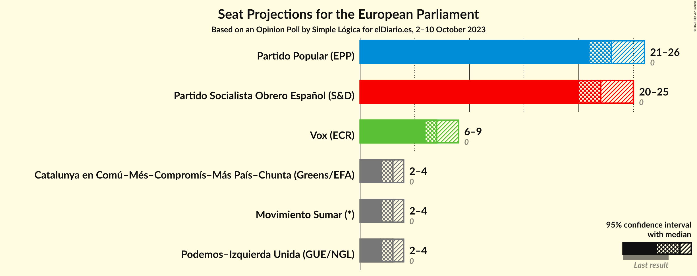
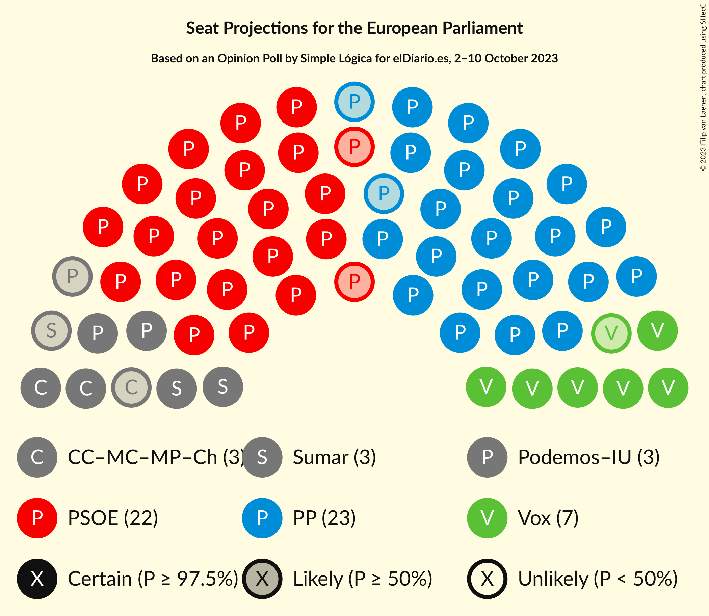

# Opinion Poll by Simple Lógica for elDiario.es, 2–10 October 2023

<a href="#voting-intentions">Voting Intentions</a> | <a href="#seats">Seats</a> | <a href="#coalitions">Coalitions</a> | <a href="#technical-information">Technical Information</a>

## Voting Intentions

### Confidence Intervals

| Party | Last Result | Poll Result | 80% Confidence Interval | 90% Confidence Interval | 95% Confidence Interval | 99% Confidence Interval |
|:-----:|:-----------:|:-----------:|:-----------------------:|:-----------------------:|:-----------------------:|:-----------------------:|
| Partido Popular (EPP) | 0.0% | 34.1% | 31.9–36.4% |31.2–37.1% |30.7–37.7% |29.6–38.8% |
| Partido Socialista Obrero Español (S&D) | 0.0% | 32.2% | 30.0–34.6% |29.4–35.2% |28.9–35.8% |27.8–36.9% |
| Vox (ECR) | 0.0% | 10.7% | 9.3–12.3% |8.9–12.8% |8.6–13.2% |8.0–14.0% |
| Movimiento Sumar–Catalunya en Comú–Més–Compromís–Más País–Chunta (Greens/EFA) | N/A | 6.3% | 5.2–7.6% |5.0–8.0% |4.7–8.3% |4.3–9.0% |
| Movimiento Sumar–Podemos–Izquierda Unida (GUE/NGL) | N/A | 5.7% | 4.7–7.0% |4.5–7.4% |4.2–7.7% |3.8–8.4% |

*Note:* The poll result column reflects the actual value used in the calculations. Published results may vary slightly, and in addition be rounded to fewer digits.

## Seats

### Confidence Intervals

| Party | Last Result | Median | 80% Confidence Interval | 90% Confidence Interval | 95% Confidence Interval | 99% Confidence Interval |
|:-----:|:-----------:|:------:|:-----------------------:|:-----------------------:|:-----------------------:|:-----------------------:|
| <a href="#partido-popular-(epp)">Partido Popular (EPP)</a> | 0 | 24 | 22–25 |22–26 |21–26 |21–27 |
| <a href="#partido-socialista-obrero-español-(s&d)">Partido Socialista Obrero Español (S&D)</a> | 0 | 22 | 21–24 |20–24 |20–25 |19–26 |
| <a href="#vox-(ecr)">Vox (ECR)</a> | 0 | 7 | 6–8 |6–9 |6–9 |5–9 |
| <a href="#movimiento-sumar–catalunya-en-comú–més–compromís–más-país–chunta-(greens/efa)">Movimiento Sumar–Catalunya en Comú–Més–Compromís–Más País–Chunta (Greens/EFA)</a> | N/A | 4 | 3–5 |3–5 |3–5 |3–6 |
| <a href="#movimiento-sumar–podemos–izquierda-unida-(gue/ngl)">Movimiento Sumar–Podemos–Izquierda Unida (GUE/NGL)</a> | N/A | 4 | 3–4 |3–5 |3–5 |2–5 |

