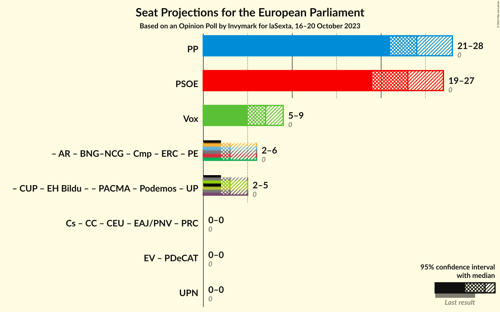
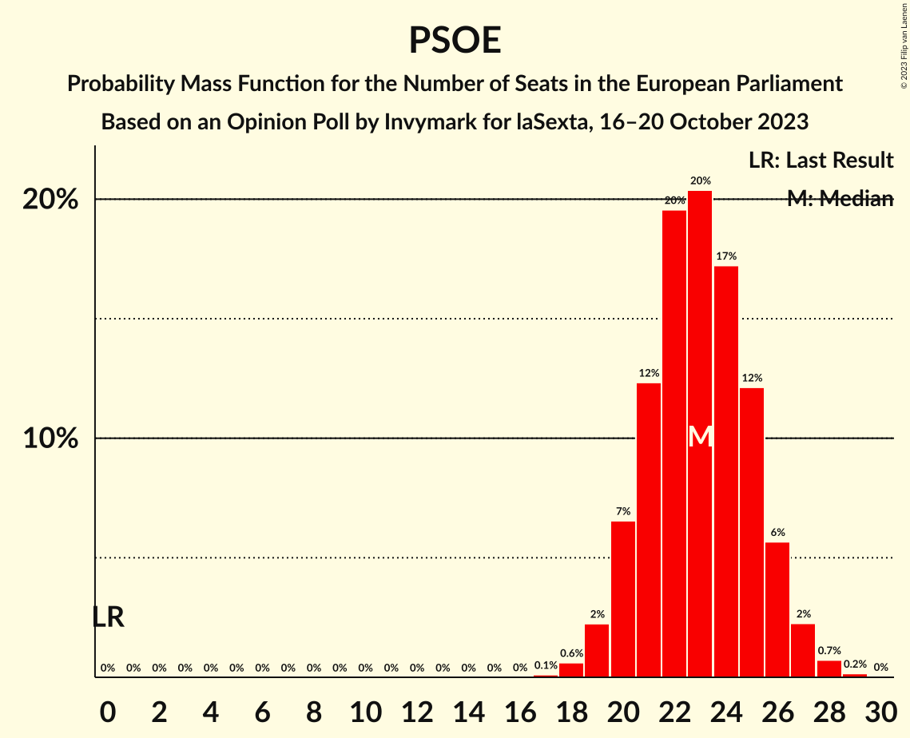
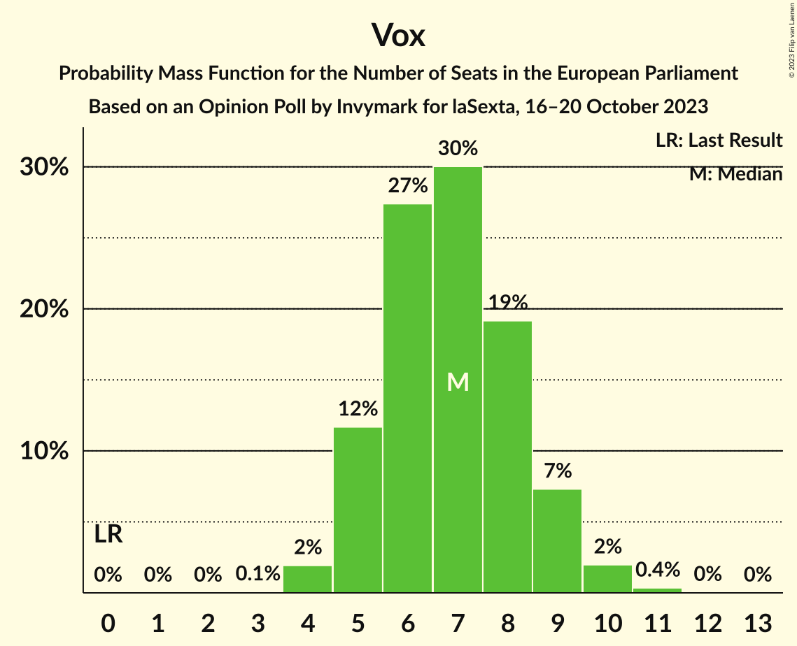

# Opinion Poll by Invymark for laSexta, 16–20 October 2023

<a href="#voting-intentions">Voting Intentions</a> | <a href="#seats">Seats</a> | <a href="#coalitions">Coalitions</a> | <a href="#technical-information">Technical Information</a>

## Voting Intentions

### Confidence Intervals

| Party | Last Result | Poll Result | 80% Confidence Interval | 90% Confidence Interval | 95% Confidence Interval | 99% Confidence Interval |
|:-----:|:-----------:|:-----------:|:-----------------------:|:-----------------------:|:-----------------------:|:-----------------------:|
| Partido Popular (EPP) | 0.0% | 34.7% | 31.3–38.3% |30.3–39.3% |29.5–40.2% |27.9–42.0% |
| Partido Socialista Obrero Español (S&D) | 0.0% | 32.7% | 29.3–36.3% |28.4–37.3% |27.6–38.2% |26.1–39.9% |
| Vox (ECR) | 0.0% | 10.0% | 8.1–12.6% |7.5–13.3% |7.1–13.9% |6.3–15.2% |
| Catalunya en Comú–Més–Compromís–Más País–Chunta (Greens/EFA) | 0.0% | 3.7% | 2.6–5.5% |2.3–6.0% |2.1–6.4% |1.6–7.4% |
| Movimiento Sumar (*) | 0.0% | 3.3% | 2.3–5.1% |2.1–5.6% |1.8–6.0% |1.4–7.0% |
| Podemos–Izquierda Unida (GUE/NGL) | 0.0% | 3.3% | 2.3–5.1% |2.1–5.6% |1.8–6.0% |1.4–7.0% |

*Note:* The poll result column reflects the actual value used in the calculations. Published results may vary slightly, and in addition be rounded to fewer digits.

## Seats

### Confidence Intervals

| Party | Last Result | Median | 80% Confidence Interval | 90% Confidence Interval | 95% Confidence Interval | 99% Confidence Interval |
|:-----:|:-----------:|:------:|:-----------------------:|:-----------------------:|:-----------------------:|:-----------------------:|
| <a href="#partido-popular-(epp)">Partido Popular (EPP)</a> | 0 | 24 | 22–26 |21–27 |20–28 |19–29 |
| <a href="#partido-socialista-obrero-español-(s&d)">Partido Socialista Obrero Español (S&D)</a> | 0 | 23 | 20–25 |20–26 |19–26 |18–28 |
| <a href="#vox-(ecr)">Vox (ECR)</a> | 0 | 7 | 5–8 |5–9 |5–9 |4–10 |
| <a href="#catalunya-en-comú–més–compromís–más-país–chunta-(greens/efa)">Catalunya en Comú–Més–Compromís–Más País–Chunta (Greens/EFA)</a> | 0 | 3 | 2–4 |1–4 |1–5 |1–5 |
| <a href="#movimiento-sumar-(*)">Movimiento Sumar (*)</a> | 0 | 2 | 1–3 |1–4 |1–4 |1–5 |
| <a href="#podemos–izquierda-unida-(gue/ngl)">Podemos–Izquierda Unida (GUE/NGL)</a> | 0 | 2 | 1–4 |1–4 |1–4 |1–5 |

### Partido Popular (EPP)

*For a full overview of the results for this party, see the [Partido Popular (EPP)](party-partidopopularepp.html) page.*

| Number of Seats | Probability | Accumulated | Special Marks |
|:---------------:|:-----------:|:-----------:|:-------------:|
| 0 | 0% | 100% | Last Result |
| 1 | 0% | 100% |  |
| 2 | 0% | 100% |  |
| 3 | 0% | 100% |  |
| 4 | 0% | 100% |  |
| 5 | 0% | 100% |  |
| 6 | 0% | 100% |  |
| 7 | 0% | 100% |  |
| 8 | 0% | 100% |  |
| 9 | 0% | 100% |  |
| 10 | 0% | 100% |  |
| 11 | 0% | 100% |  |
| 12 | 0% | 100% |  |
| 13 | 0% | 100% |  |
| 14 | 0% | 100% |  |
| 15 | 0% | 100% |  |
| 16 | 0% | 100% |  |
| 17 | 0% | 100% |  |
| 18 | 0.1% | 100% |  |
| 19 | 0.5% | 99.9% |  |
| 20 | 2% | 99.4% |  |
| 21 | 6% | 97% |  |
| 22 | 12% | 92% |  |
| 23 | 17% | 80% |  |
| 24 | 22% | 63% | Median |
| 25 | 18% | 41% |  |
| 26 | 14% | 23% |  |
| 27 | 6% | 10% |  |
| 28 | 3% | 4% |  |
| 29 | 0.8% | 1.0% |  |
| 30 | 0.2% | 0.2% |  |
| 31 | 0% | 0% | Majority |

### Partido Socialista Obrero Español (S&D)

*For a full overview of the results for this party, see the [Partido Socialista Obrero Español (S&D)](party-partidosocialistaobreroespañolsd.html) page.*

| Number of Seats | Probability | Accumulated | Special Marks |
|:---------------:|:-----------:|:-----------:|:-------------:|
| 0 | 0% | 100% | Last Result |
| 1 | 0% | 100% |  |
| 2 | 0% | 100% |  |
| 3 | 0% | 100% |  |
| 4 | 0% | 100% |  |
| 5 | 0% | 100% |  |
| 6 | 0% | 100% |  |
| 7 | 0% | 100% |  |
| 8 | 0% | 100% |  |
| 9 | 0% | 100% |  |
| 10 | 0% | 100% |  |
| 11 | 0% | 100% |  |
| 12 | 0% | 100% |  |
| 13 | 0% | 100% |  |
| 14 | 0% | 100% |  |
| 15 | 0% | 100% |  |
| 16 | 0% | 100% |  |
| 17 | 0.2% | 100% |  |
| 18 | 0.9% | 99.8% |  |
| 19 | 3% | 98.9% |  |
| 20 | 9% | 96% |  |
| 21 | 15% | 87% |  |
| 22 | 19% | 72% |  |
| 23 | 22% | 54% | Median |
| 24 | 15% | 31% |  |
| 25 | 9% | 16% |  |
| 26 | 5% | 7% |  |
| 27 | 2% | 2% |  |
| 28 | 0.4% | 0.5% |  |
| 29 | 0.1% | 0.1% |  |
| 30 | 0% | 0% |  |

### Vox (ECR)

*For a full overview of the results for this party, see the [Vox (ECR)](party-voxecr.html) page.*

| Number of Seats | Probability | Accumulated | Special Marks |
|:---------------:|:-----------:|:-----------:|:-------------:|
| 0 | 0% | 100% | Last Result |
| 1 | 0% | 100% |  |
| 2 | 0% | 100% |  |
| 3 | 0.1% | 100% |  |
| 4 | 2% | 99.9% |  |
| 5 | 13% | 98% |  |
| 6 | 27% | 85% |  |
| 7 | 31% | 57% | Median |
| 8 | 17% | 26% |  |
| 9 | 7% | 9% |  |
| 10 | 2% | 2% |  |
| 11 | 0.3% | 0.3% |  |
| 12 | 0% | 0% |  |

### Catalunya en Comú–Més–Compromís–Más País–Chunta (Greens/EFA)

*For a full overview of the results for this party, see the [Catalunya en Comú–Més–Compromís–Más País–Chunta (Greens/EFA)](party-catalunyaencomú–més–compromís–máspaís–chuntagreensefa.html) page.*

| Number of Seats | Probability | Accumulated | Special Marks |
|:---------------:|:-----------:|:-----------:|:-------------:|
| 0 | 0% | 100% | Last Result |
| 1 | 8% | 100% |  |
| 2 | 38% | 92% |  |
| 3 | 37% | 53% | Median |
| 4 | 13% | 16% |  |
| 5 | 2% | 3% |  |
| 6 | 0.3% | 0.3% |  |
| 7 | 0% | 0% |  |

### Movimiento Sumar (*)

*For a full overview of the results for this party, see the [Movimiento Sumar (*)](party-movimientosumar.html) page.*

| Number of Seats | Probability | Accumulated | Special Marks |
|:---------------:|:-----------:|:-----------:|:-------------:|
| 0 | 0% | 100% | Last Result |
| 1 | 11% | 100% |  |
| 2 | 44% | 89% | Median |
| 3 | 35% | 45% |  |
| 4 | 8% | 10% |  |
| 5 | 1.3% | 1.4% |  |
| 6 | 0.1% | 0.1% |  |
| 7 | 0% | 0% |  |

### Podemos–Izquierda Unida (GUE/NGL)

*For a full overview of the results for this party, see the [Podemos–Izquierda Unida (GUE/NGL)](party-podemos–izquierdaunidaguengl.html) page.*

| Number of Seats | Probability | Accumulated | Special Marks |
|:---------------:|:-----------:|:-----------:|:-------------:|
| 0 | 0.2% | 100% | Last Result |
| 1 | 13% | 99.8% |  |
| 2 | 46% | 86% | Median |
| 3 | 31% | 41% |  |
| 4 | 9% | 10% |  |
| 5 | 1.3% | 1.4% |  |
| 6 | 0.1% | 0.1% |  |
| 7 | 0% | 0% |  |

## Coalitions

### Confidence Intervals

| Coalition | Last Result | Median | Majority? | 80% Confidence Interval | 90% Confidence Interval | 95% Confidence Interval | 99% Confidence Interval |
|:---------:|:-----------:|:------:|:---------:|:-----------------------:|:-----------------------:|:-----------------------:|:-----------------------:|
| Partido Popular (EPP) | 0 | 24 | 0% | 22–26 | 21–27 | 20–28 | 19–29 |
| Partido Socialista Obrero Español (S&D) | 0 | 23 | 0% | 20–25 | 20–26 | 19–26 | 18–28 |
| Vox (ECR) | 0 | 7 | 0% | 5–8 | 5–9 | 5–9 | 4–10 |

### Partido Popular (EPP)

| Number of Seats | Probability | Accumulated | Special Marks |
|:---------------:|:-----------:|:-----------:|:-------------:|
| 0 | 0% | 100% | Last Result |
| 1 | 0% | 100% |  |
| 2 | 0% | 100% |  |
| 3 | 0% | 100% |  |
| 4 | 0% | 100% |  |
| 5 | 0% | 100% |  |
| 6 | 0% | 100% |  |
| 7 | 0% | 100% |  |
| 8 | 0% | 100% |  |
| 9 | 0% | 100% |  |
| 10 | 0% | 100% |  |
| 11 | 0% | 100% |  |
| 12 | 0% | 100% |  |
| 13 | 0% | 100% |  |
| 14 | 0% | 100% |  |
| 15 | 0% | 100% |  |
| 16 | 0% | 100% |  |
| 17 | 0% | 100% |  |
| 18 | 0.1% | 100% |  |
| 19 | 0.5% | 99.9% |  |
| 20 | 2% | 99.4% |  |
| 21 | 6% | 97% |  |
| 22 | 12% | 92% |  |
| 23 | 17% | 80% |  |
| 24 | 22% | 63% | Median |
| 25 | 18% | 41% |  |
| 26 | 14% | 23% |  |
| 27 | 6% | 10% |  |
| 28 | 3% | 4% |  |
| 29 | 0.8% | 1.0% |  |
| 30 | 0.2% | 0.2% |  |
| 31 | 0% | 0% | Majority |

### Partido Socialista Obrero Español (S&D)

| Number of Seats | Probability | Accumulated | Special Marks |
|:---------------:|:-----------:|:-----------:|:-------------:|
| 0 | 0% | 100% | Last Result |
| 1 | 0% | 100% |  |
| 2 | 0% | 100% |  |
| 3 | 0% | 100% |  |
| 4 | 0% | 100% |  |
| 5 | 0% | 100% |  |
| 6 | 0% | 100% |  |
| 7 | 0% | 100% |  |
| 8 | 0% | 100% |  |
| 9 | 0% | 100% |  |
| 10 | 0% | 100% |  |
| 11 | 0% | 100% |  |
| 12 | 0% | 100% |  |
| 13 | 0% | 100% |  |
| 14 | 0% | 100% |  |
| 15 | 0% | 100% |  |
| 16 | 0% | 100% |  |
| 17 | 0.2% | 100% |  |
| 18 | 0.9% | 99.8% |  |
| 19 | 3% | 98.9% |  |
| 20 | 9% | 96% |  |
| 21 | 15% | 87% |  |
| 22 | 19% | 72% |  |
| 23 | 22% | 54% | Median |
| 24 | 15% | 31% |  |
| 25 | 9% | 16% |  |
| 26 | 5% | 7% |  |
| 27 | 2% | 2% |  |
| 28 | 0.4% | 0.5% |  |
| 29 | 0.1% | 0.1% |  |
| 30 | 0% | 0% |  |

### Vox (ECR)

| Number of Seats | Probability | Accumulated | Special Marks |
|:---------------:|:-----------:|:-----------:|:-------------:|
| 0 | 0% | 100% | Last Result |
| 1 | 0% | 100% |  |
| 2 | 0% | 100% |  |
| 3 | 0.1% | 100% |  |
| 4 | 2% | 99.9% |  |
| 5 | 13% | 98% |  |
| 6 | 27% | 85% |  |
| 7 | 31% | 57% | Median |
| 8 | 17% | 26% |  |
| 9 | 7% | 9% |  |
| 10 | 2% | 2% |  |
| 11 | 0.3% | 0.3% |  |
| 12 | 0% | 0% |  |

## Technical Information

### Opinion Poll

+ **Polling firm:** Invymark
+ **Commissioner(s):** laSexta
+ **Fieldwork period:** 16–20 October 2023

### Calculations

+ **Sample size:** 300
+ **Simulations done:** 1,048,576
+ **Error estimate:** 0.91%

