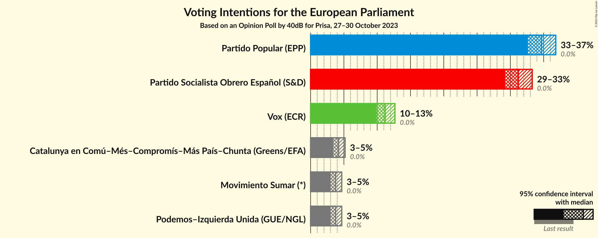
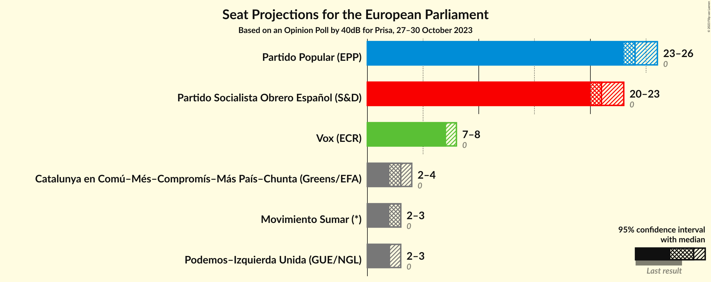
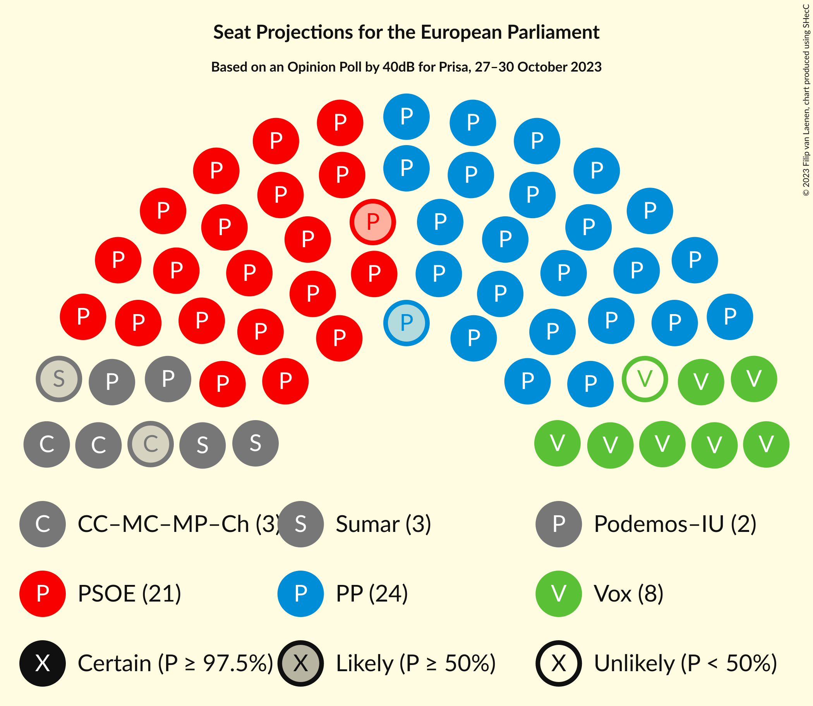

# Opinion Poll by 40dB for Prisa, 27–30 October 2023

<a href="#voting-intentions">Voting Intentions</a> | <a href="#seats">Seats</a> | <a href="#coalitions">Coalitions</a> | <a href="#technical-information">Technical Information</a>

## Voting Intentions

### Confidence Intervals

| Party | Last Result | Poll Result | 80% Confidence Interval | 90% Confidence Interval | 95% Confidence Interval | 99% Confidence Interval |
|:-----:|:-----------:|:-----------:|:-----------------------:|:-----------------------:|:-----------------------:|:-----------------------:|
| Partido Popular (EPP) | 0.0% | 34.7% | 33.3–36.1% |33.0–36.5% |32.6–36.8% |32.0–37.5% |
| Partido Socialista Obrero Español (S&D) | 0.0% | 31.2% | 29.9–32.6% |29.5–32.9% |29.2–33.3% |28.6–33.9% |
| Vox (ECR) | 0.0% | 11.2% | 10.3–12.2% |10.1–12.4% |9.9–12.7% |9.5–13.1% |
| Movimiento Sumar–Catalunya en Comú–Més–Compromís–Más País–Chunta (Greens/EFA) | N/A | 6.1% | 5.5–6.8% |5.3–7.1% |5.1–7.2% |4.8–7.6% |
| Movimiento Sumar–Podemos–Izquierda Unida (GUE/NGL) | N/A | 5.6% | 5.0–6.3% |4.8–6.5% |4.7–6.7% |4.4–7.1% |

*Note:* The poll result column reflects the actual value used in the calculations. Published results may vary slightly, and in addition be rounded to fewer digits.

## Seats

### Confidence Intervals

| Party | Last Result | Median | 80% Confidence Interval | 90% Confidence Interval | 95% Confidence Interval | 99% Confidence Interval |
|:-----:|:-----------:|:------:|:-----------------------:|:-----------------------:|:-----------------------:|:-----------------------:|
| <a href="#partido-popular-(epp)">Partido Popular (EPP)</a> | 0 | 24 | 23–25 |23–26 |23–26 |22–26 |
| <a href="#partido-socialista-obrero-español-(s&d)">Partido Socialista Obrero Español (S&D)</a> | 0 | 22 | 21–23 |21–23 |20–23 |20–24 |
| <a href="#vox-(ecr)">Vox (ECR)</a> | 0 | 8 | 7–8 |7–8 |7–9 |6–9 |
| <a href="#movimiento-sumar–catalunya-en-comú–més–compromís–más-país–chunta-(greens/efa)">Movimiento Sumar–Catalunya en Comú–Més–Compromís–Más País–Chunta (Greens/EFA)</a> | N/A | 4 | 3–4 |3–5 |3–5 |3–5 |
| <a href="#movimiento-sumar–podemos–izquierda-unida-(gue/ngl)">Movimiento Sumar–Podemos–Izquierda Unida (GUE/NGL)</a> | N/A | 4 | 3–4 |3–4 |3–4 |3–5 |

