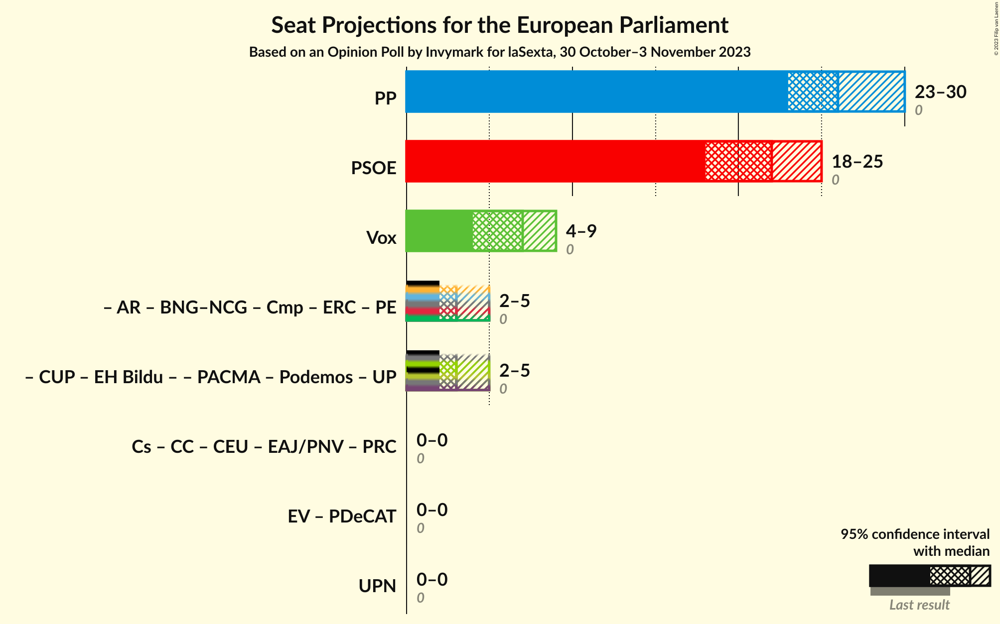
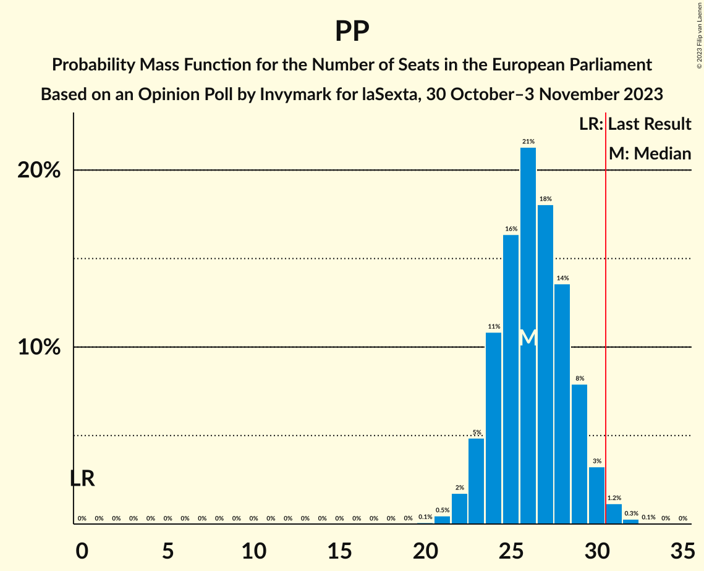

# Opinion Poll by Invymark for laSexta, 30 October–3 November 2023

<a href="#voting-intentions">Voting Intentions</a> | <a href="#seats">Seats</a> | <a href="#coalitions">Coalitions</a> | <a href="#technical-information">Technical Information</a>

## Voting Intentions

### Confidence Intervals

| Party | Last Result | Poll Result | 80% Confidence Interval | 90% Confidence Interval | 95% Confidence Interval | 99% Confidence Interval |
|:-----:|:-----------:|:-----------:|:-----------------------:|:-----------------------:|:-----------------------:|:-----------------------:|
| Partido Popular (EPP) | 0.0% | 37.3% | 33.9–41.0% |32.9–42.1% |32.0–43.0% |30.4–44.7% |
| Partido Socialista Obrero Español (S&D) | 0.0% | 31.0% | 27.7–34.6% |26.8–35.6% |26.0–36.5% |24.5–38.2% |
| Vox (ECR) | 0.0% | 9.7% | 7.8–12.2% |7.3–12.9% |6.8–13.5% |6.0–14.8% |
| Catalunya en Comú–Més–Compromís–Más País–Chunta (Greens/EFA) | 0.0% | 3.7% | 2.6–5.5% |2.3–6.0% |2.1–6.4% |1.6–7.4% |
| Movimiento Sumar (*) | 0.0% | 3.3% | 2.3–5.1% |2.1–5.6% |1.8–6.0% |1.4–7.0% |
| Podemos–Izquierda Unida (GUE/NGL) | 0.0% | 3.3% | 2.3–5.1% |2.1–5.6% |1.8–6.0% |1.4–7.0% |

*Note:* The poll result column reflects the actual value used in the calculations. Published results may vary slightly, and in addition be rounded to fewer digits.

## Seats

### Confidence Intervals

| Party | Last Result | Median | 80% Confidence Interval | 90% Confidence Interval | 95% Confidence Interval | 99% Confidence Interval |
|:-----:|:-----------:|:------:|:-----------------------:|:-----------------------:|:-----------------------:|:-----------------------:|
| <a href="#partido-popular-(epp)">Partido Popular (EPP)</a> | 0 | 26 | 23–28 |23–29 |22–30 |21–31 |
| <a href="#partido-socialista-obrero-español-(s&d)">Partido Socialista Obrero Español (S&D)</a> | 0 | 21 | 19–24 |18–24 |18–25 |17–26 |
| <a href="#vox-(ecr)">Vox (ECR)</a> | 0 | 6 | 5–8 |5–9 |4–9 |4–10 |
| <a href="#catalunya-en-comú–més–compromís–más-país–chunta-(greens/efa)">Catalunya en Comú–Més–Compromís–Más País–Chunta (Greens/EFA)</a> | 0 | 3 | 2–4 |1–4 |1–5 |1–5 |
| <a href="#movimiento-sumar-(*)">Movimiento Sumar (*)</a> | 0 | 2 | 2–3 |1–4 |1–4 |1–5 |
| <a href="#podemos–izquierda-unida-(gue/ngl)">Podemos–Izquierda Unida (GUE/NGL)</a> | 0 | 2 | 1–3 |1–4 |1–4 |1–5 |

### Partido Popular (EPP)

*For a full overview of the results for this party, see the [Partido Popular (EPP)](party-partidopopularepp.html) page.*

| Number of Seats | Probability | Accumulated | Special Marks |
|:---------------:|:-----------:|:-----------:|:-------------:|
| 0 | 0% | 100% | Last Result |
| 1 | 0% | 100% |  |
| 2 | 0% | 100% |  |
| 3 | 0% | 100% |  |
| 4 | 0% | 100% |  |
| 5 | 0% | 100% |  |
| 6 | 0% | 100% |  |
| 7 | 0% | 100% |  |
| 8 | 0% | 100% |  |
| 9 | 0% | 100% |  |
| 10 | 0% | 100% |  |
| 11 | 0% | 100% |  |
| 12 | 0% | 100% |  |
| 13 | 0% | 100% |  |
| 14 | 0% | 100% |  |
| 15 | 0% | 100% |  |
| 16 | 0% | 100% |  |
| 17 | 0% | 100% |  |
| 18 | 0% | 100% |  |
| 19 | 0% | 100% |  |
| 20 | 0.2% | 100% |  |
| 21 | 1.0% | 99.8% |  |
| 22 | 3% | 98.8% |  |
| 23 | 7% | 96% |  |
| 24 | 16% | 89% |  |
| 25 | 19% | 73% |  |
| 26 | 20% | 54% | Median |
| 27 | 18% | 34% |  |
| 28 | 10% | 17% |  |
| 29 | 5% | 7% |  |
| 30 | 2% | 3% |  |
| 31 | 0.6% | 0.7% | Majority |
| 32 | 0.1% | 0.1% |  |
| 33 | 0% | 0% |  |

### Partido Socialista Obrero Español (S&D)

*For a full overview of the results for this party, see the [Partido Socialista Obrero Español (S&D)](party-partidosocialistaobreroespañolsd.html) page.*

| Number of Seats | Probability | Accumulated | Special Marks |
|:---------------:|:-----------:|:-----------:|:-------------:|
| 0 | 0% | 100% | Last Result |
| 1 | 0% | 100% |  |
| 2 | 0% | 100% |  |
| 3 | 0% | 100% |  |
| 4 | 0% | 100% |  |
| 5 | 0% | 100% |  |
| 6 | 0% | 100% |  |
| 7 | 0% | 100% |  |
| 8 | 0% | 100% |  |
| 9 | 0% | 100% |  |
| 10 | 0% | 100% |  |
| 11 | 0% | 100% |  |
| 12 | 0% | 100% |  |
| 13 | 0% | 100% |  |
| 14 | 0% | 100% |  |
| 15 | 0% | 100% |  |
| 16 | 0.3% | 100% |  |
| 17 | 1.4% | 99.7% |  |
| 18 | 5% | 98% |  |
| 19 | 9% | 94% |  |
| 20 | 15% | 84% |  |
| 21 | 19% | 69% | Median |
| 22 | 22% | 50% |  |
| 23 | 15% | 28% |  |
| 24 | 8% | 13% |  |
| 25 | 3% | 4% |  |
| 26 | 0.9% | 1.2% |  |
| 27 | 0.2% | 0.3% |  |
| 28 | 0% | 0.1% |  |
| 29 | 0% | 0% |  |

### Vox (ECR)

*For a full overview of the results for this party, see the [Vox (ECR)](party-voxecr.html) page.*

| Number of Seats | Probability | Accumulated | Special Marks |
|:---------------:|:-----------:|:-----------:|:-------------:|
| 0 | 0% | 100% | Last Result |
| 1 | 0% | 100% |  |
| 2 | 0% | 100% |  |
| 3 | 0.2% | 100% |  |
| 4 | 4% | 99.8% |  |
| 5 | 18% | 96% |  |
| 6 | 31% | 78% | Median |
| 7 | 28% | 47% |  |
| 8 | 14% | 19% |  |
| 9 | 4% | 5% |  |
| 10 | 0.9% | 1.0% |  |
| 11 | 0.1% | 0.1% |  |
| 12 | 0% | 0% |  |

### Catalunya en Comú–Més–Compromís–Más País–Chunta (Greens/EFA)

*For a full overview of the results for this party, see the [Catalunya en Comú–Més–Compromís–Más País–Chunta (Greens/EFA)](party-catalunyaencomú–més–compromís–máspaís–chuntagreensefa.html) page.*

| Number of Seats | Probability | Accumulated | Special Marks |
|:---------------:|:-----------:|:-----------:|:-------------:|
| 0 | 0% | 100% | Last Result |
| 1 | 8% | 100% |  |
| 2 | 40% | 92% |  |
| 3 | 36% | 51% | Median |
| 4 | 12% | 15% |  |
| 5 | 2% | 3% |  |
| 6 | 0.2% | 0.3% |  |
| 7 | 0% | 0% |  |

### Movimiento Sumar (*)

*For a full overview of the results for this party, see the [Movimiento Sumar (*)](party-movimientosumar.html) page.*

| Number of Seats | Probability | Accumulated | Special Marks |
|:---------------:|:-----------:|:-----------:|:-------------:|
| 0 | 0.1% | 100% | Last Result |
| 1 | 8% | 99.9% |  |
| 2 | 50% | 92% | Median |
| 3 | 33% | 41% |  |
| 4 | 7% | 8% |  |
| 5 | 1.1% | 1.2% |  |
| 6 | 0.1% | 0.1% |  |
| 7 | 0% | 0% |  |

### Podemos–Izquierda Unida (GUE/NGL)

*For a full overview of the results for this party, see the [Podemos–Izquierda Unida (GUE/NGL)](party-podemos–izquierdaunidaguengl.html) page.*

| Number of Seats | Probability | Accumulated | Special Marks |
|:---------------:|:-----------:|:-----------:|:-------------:|
| 0 | 0.1% | 100% | Last Result |
| 1 | 12% | 99.9% |  |
| 2 | 48% | 87% | Median |
| 3 | 31% | 40% |  |
| 4 | 8% | 9% |  |
| 5 | 1.1% | 1.2% |  |
| 6 | 0.1% | 0.1% |  |
| 7 | 0% | 0% |  |

## Coalitions

### Confidence Intervals

| Coalition | Last Result | Median | Majority? | 80% Confidence Interval | 90% Confidence Interval | 95% Confidence Interval | 99% Confidence Interval |
|:---------:|:-----------:|:------:|:---------:|:-----------------------:|:-----------------------:|:-----------------------:|:-----------------------:|
| Partido Popular (EPP) | 0 | 26 | 0.7% | 23–28 | 23–29 | 22–30 | 21–31 |
| Partido Socialista Obrero Español (S&D) | 0 | 21 | 0% | 19–24 | 18–24 | 18–25 | 17–26 |
| Vox (ECR) | 0 | 6 | 0% | 5–8 | 5–9 | 4–9 | 4–10 |

### Partido Popular (EPP)

| Number of Seats | Probability | Accumulated | Special Marks |
|:---------------:|:-----------:|:-----------:|:-------------:|
| 0 | 0% | 100% | Last Result |
| 1 | 0% | 100% |  |
| 2 | 0% | 100% |  |
| 3 | 0% | 100% |  |
| 4 | 0% | 100% |  |
| 5 | 0% | 100% |  |
| 6 | 0% | 100% |  |
| 7 | 0% | 100% |  |
| 8 | 0% | 100% |  |
| 9 | 0% | 100% |  |
| 10 | 0% | 100% |  |
| 11 | 0% | 100% |  |
| 12 | 0% | 100% |  |
| 13 | 0% | 100% |  |
| 14 | 0% | 100% |  |
| 15 | 0% | 100% |  |
| 16 | 0% | 100% |  |
| 17 | 0% | 100% |  |
| 18 | 0% | 100% |  |
| 19 | 0% | 100% |  |
| 20 | 0.2% | 100% |  |
| 21 | 1.0% | 99.8% |  |
| 22 | 3% | 98.8% |  |
| 23 | 7% | 96% |  |
| 24 | 16% | 89% |  |
| 25 | 19% | 73% |  |
| 26 | 20% | 54% | Median |
| 27 | 18% | 34% |  |
| 28 | 10% | 17% |  |
| 29 | 5% | 7% |  |
| 30 | 2% | 3% |  |
| 31 | 0.6% | 0.7% | Majority |
| 32 | 0.1% | 0.1% |  |
| 33 | 0% | 0% |  |

### Partido Socialista Obrero Español (S&D)

| Number of Seats | Probability | Accumulated | Special Marks |
|:---------------:|:-----------:|:-----------:|:-------------:|
| 0 | 0% | 100% | Last Result |
| 1 | 0% | 100% |  |
| 2 | 0% | 100% |  |
| 3 | 0% | 100% |  |
| 4 | 0% | 100% |  |
| 5 | 0% | 100% |  |
| 6 | 0% | 100% |  |
| 7 | 0% | 100% |  |
| 8 | 0% | 100% |  |
| 9 | 0% | 100% |  |
| 10 | 0% | 100% |  |
| 11 | 0% | 100% |  |
| 12 | 0% | 100% |  |
| 13 | 0% | 100% |  |
| 14 | 0% | 100% |  |
| 15 | 0% | 100% |  |
| 16 | 0.3% | 100% |  |
| 17 | 1.4% | 99.7% |  |
| 18 | 5% | 98% |  |
| 19 | 9% | 94% |  |
| 20 | 15% | 84% |  |
| 21 | 19% | 69% | Median |
| 22 | 22% | 50% |  |
| 23 | 15% | 28% |  |
| 24 | 8% | 13% |  |
| 25 | 3% | 4% |  |
| 26 | 0.9% | 1.2% |  |
| 27 | 0.2% | 0.3% |  |
| 28 | 0% | 0.1% |  |
| 29 | 0% | 0% |  |

### Vox (ECR)

| Number of Seats | Probability | Accumulated | Special Marks |
|:---------------:|:-----------:|:-----------:|:-------------:|
| 0 | 0% | 100% | Last Result |
| 1 | 0% | 100% |  |
| 2 | 0% | 100% |  |
| 3 | 0.2% | 100% |  |
| 4 | 4% | 99.8% |  |
| 5 | 18% | 96% |  |
| 6 | 31% | 78% | Median |
| 7 | 28% | 47% |  |
| 8 | 14% | 19% |  |
| 9 | 4% | 5% |  |
| 10 | 0.9% | 1.0% |  |
| 11 | 0.1% | 0.1% |  |
| 12 | 0% | 0% |  |

## Technical Information

### Opinion Poll

+ **Polling firm:** Invymark
+ **Commissioner(s):** laSexta
+ **Fieldwork period:** 30 October–3 November 2023

### Calculations

+ **Sample size:** 300
+ **Simulations done:** 1,048,576
+ **Error estimate:** 1.27%

