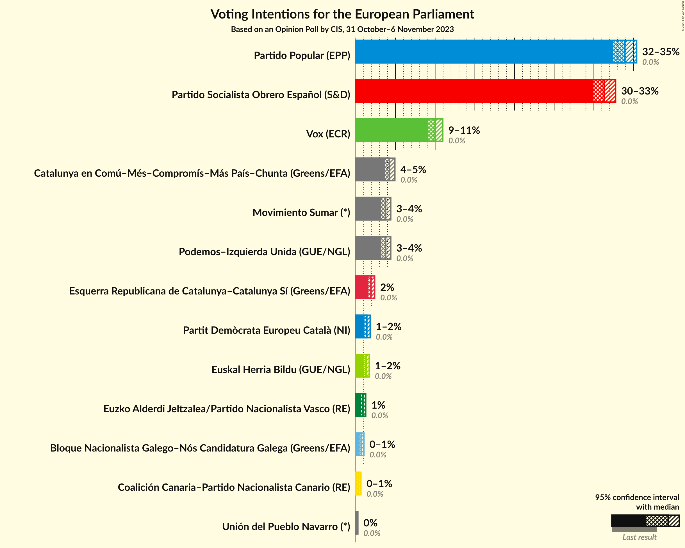
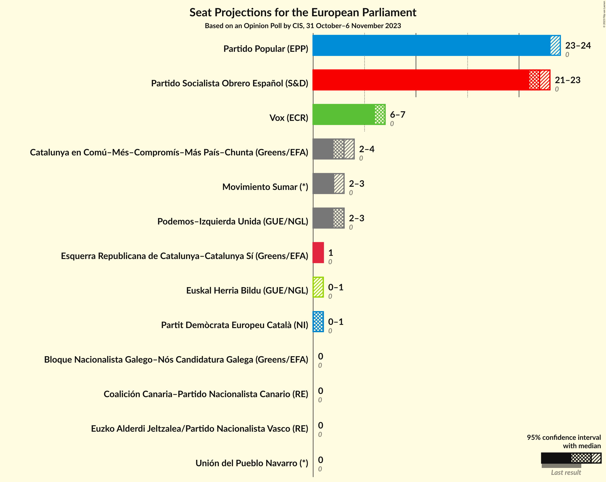
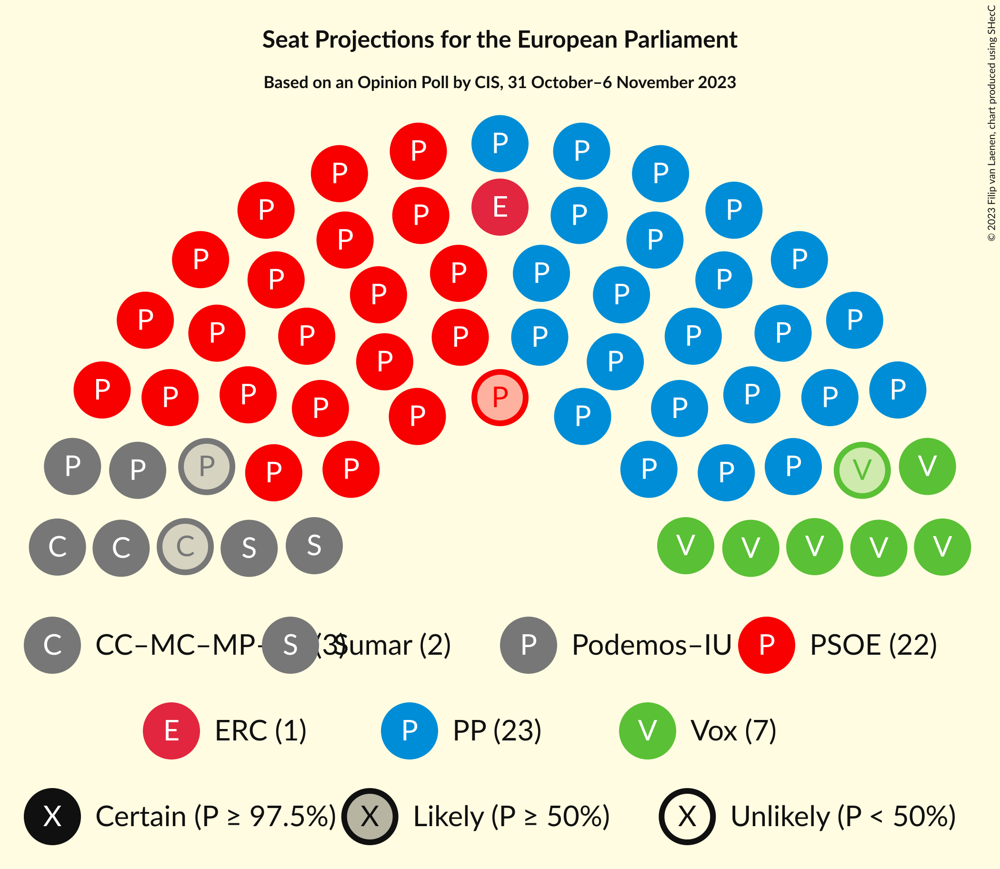

# Opinion Poll by CIS, 31 October–6 November 2023

<a href="#voting-intentions">Voting Intentions</a> | <a href="#seats">Seats</a> | <a href="#coalitions">Coalitions</a> | <a href="#technical-information">Technical Information</a>

## Voting Intentions

### Confidence Intervals

| Party | Last Result | Poll Result | 80% Confidence Interval | 90% Confidence Interval | 95% Confidence Interval | 99% Confidence Interval |
|:-----:|:-----------:|:-----------:|:-----------------------:|:-----------------------:|:-----------------------:|:-----------------------:|
| Partido Popular (EPP) | 0.0% | 33.9% | 33.0–34.9% |32.7–35.1% |32.5–35.4% |32.0–35.8% |
| Partido Socialista Obrero Español (S&D) | 0.0% | 31.3% | 30.4–32.2% |30.1–32.5% |29.9–32.7% |29.4–33.2% |
| Vox (ECR) | 0.0% | 10.0% | 9.4–10.6% |9.3–10.8% |9.1–11.0% |8.8–11.3% |
| Movimiento Sumar–Catalunya en Comú–Més–Compromís–Más País–Chunta (Greens/EFA) | N/A | 6.1% | 5.7–6.6% |5.5–6.8% |5.4–6.9% |5.2–7.2% |
| Movimiento Sumar–Podemos–Izquierda Unida (GUE/NGL) | N/A | 5.7% | 5.2–6.2% |5.1–6.3% |5.0–6.4% |4.8–6.7% |
| Esquerra Republicana de Catalunya–Catalunya Sí (Greens/EFA) | 0.0% | 1.9% | 1.6–2.2% |1.6–2.3% |1.5–2.4% |1.4–2.5% |
| Partit Demòcrata Europeu Català (NI) | 0.0% | 1.4% | 1.2–1.7% |1.1–1.7% |1.1–1.8% |1.0–2.0% |
| Euskal Herria Bildu (GUE/NGL) | 0.0% | 1.3% | 1.1–1.6% |1.0–1.6% |1.0–1.7% |0.9–1.8% |
| Euzko Alderdi Jeltzalea/Partido Nacionalista Vasco (RE) | 0.0% | 0.9% | 0.7–1.1% |0.7–1.2% |0.7–1.2% |0.6–1.4% |
| Bloque Nacionalista Galego–Nós Candidatura Galega (Greens/EFA) | 0.0% | 0.7% | 0.6–0.9% |0.5–1.0% |0.5–1.0% |0.4–1.1% |
| Coalición Canaria–Partido Nacionalista Canario (RE) | 0.0% | 0.4% | 0.3–0.5% |0.3–0.6% |0.2–0.6% |0.2–0.7% |
| Unión del Pueblo Navarro (*) | 0.0% | 0.1% | 0.0–0.2% |0.0–0.2% |0.0–0.3% |0.0–0.3% |

*Note:* The poll result column reflects the actual value used in the calculations. Published results may vary slightly, and in addition be rounded to fewer digits.

## Seats

### Confidence Intervals

| Party | Last Result | Median | 80% Confidence Interval | 90% Confidence Interval | 95% Confidence Interval | 99% Confidence Interval |
|:-----:|:-----------:|:------:|:-----------------------:|:-----------------------:|:-----------------------:|:-----------------------:|
| <a href="#partido-popular-(epp)">Partido Popular (EPP)</a> | 0 | 24 | 23–24 |23–24 |23–24 |22–25 |
| <a href="#partido-socialista-obrero-español-(s&d)">Partido Socialista Obrero Español (S&D)</a> | 0 | 22 | 22 |21–22 |21–23 |21–23 |
| <a href="#vox-(ecr)">Vox (ECR)</a> | 0 | 6 | 6–7 |6–7 |6–7 |6–7 |
| <a href="#movimiento-sumar–catalunya-en-comú–més–compromís–más-país–chunta-(greens/efa)">Movimiento Sumar–Catalunya en Comú–Més–Compromís–Más País–Chunta (Greens/EFA)</a> | N/A | 4 | 4 |4 |3–4 |3–4 |
| <a href="#movimiento-sumar–podemos–izquierda-unida-(gue/ngl)">Movimiento Sumar–Podemos–Izquierda Unida (GUE/NGL)</a> | N/A | 3 | 3–4 |3–4 |3–4 |3–4 |
| <a href="#esquerra-republicana-de-catalunya–catalunya-sí-(greens/efa)">Esquerra Republicana de Catalunya–Catalunya Sí (Greens/EFA)</a> | 0 | 1 | 1 |1 |1 |1 |
| <a href="#partit-demòcrata-europeu-català-(ni)">Partit Demòcrata Europeu Català (NI)</a> | 0 | 0 | 0–1 |0–1 |0–1 |0–1 |
| <a href="#euskal-herria-bildu-(gue/ngl)">Euskal Herria Bildu (GUE/NGL)</a> | 0 | 1 | 0–1 |0–1 |0–1 |0–1 |
| <a href="#euzko-alderdi-jeltzalea/partido-nacionalista-vasco-(re)">Euzko Alderdi Jeltzalea/Partido Nacionalista Vasco (RE)</a> | 0 | 0 | 0 |0 |0 |0 |
| <a href="#bloque-nacionalista-galego–nós-candidatura-galega-(greens/efa)">Bloque Nacionalista Galego–Nós Candidatura Galega (Greens/EFA)</a> | 0 | 0 | 0 |0 |0 |0 |
| <a href="#coalición-canaria–partido-nacionalista-canario-(re)">Coalición Canaria–Partido Nacionalista Canario (RE)</a> | 0 | 0 | 0 |0 |0 |0 |
| <a href="#unión-del-pueblo-navarro-(*)">Unión del Pueblo Navarro (*)</a> | 0 | 0 | 0 |0 |0 |0 |

