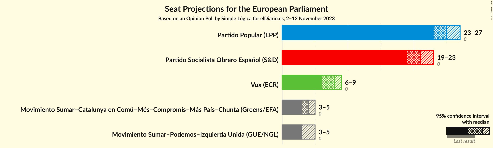
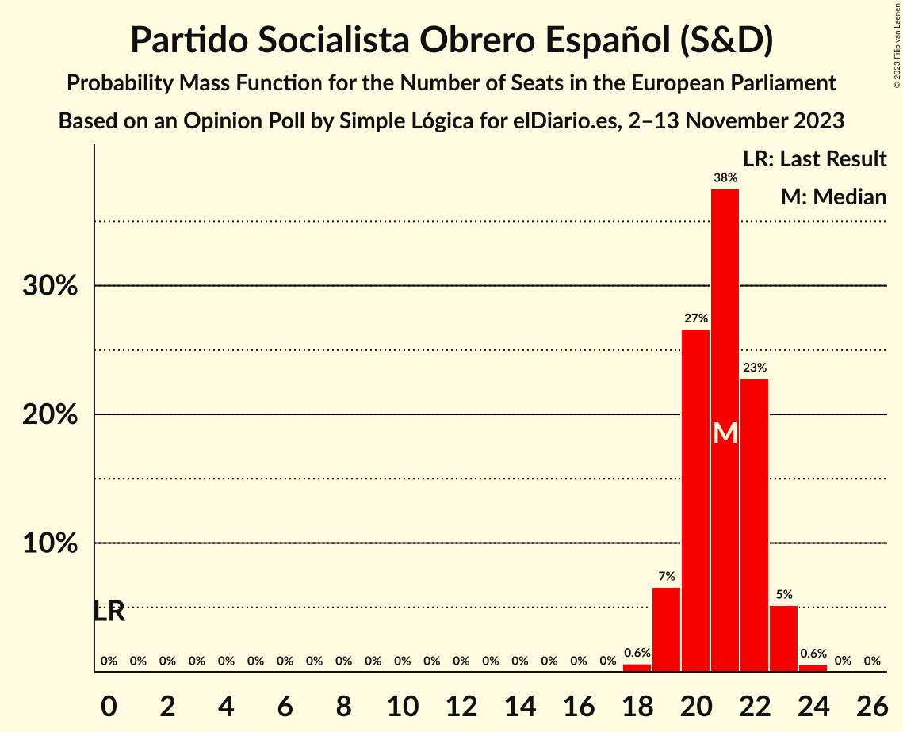
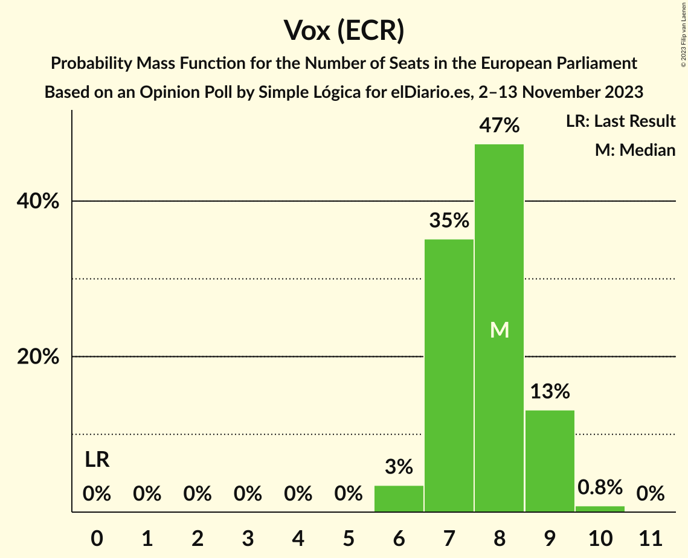
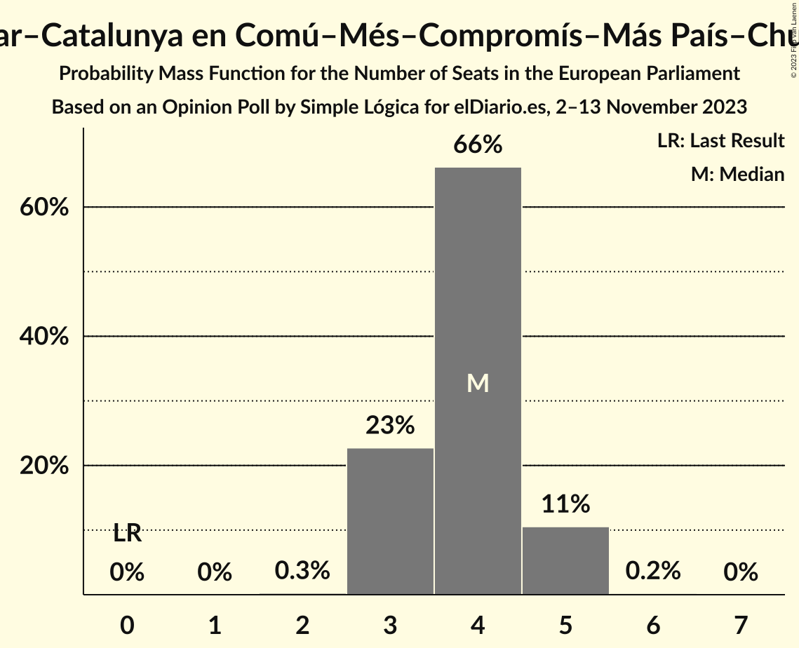
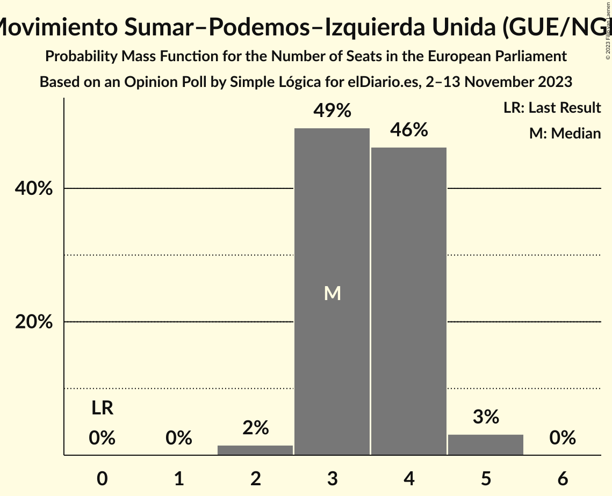
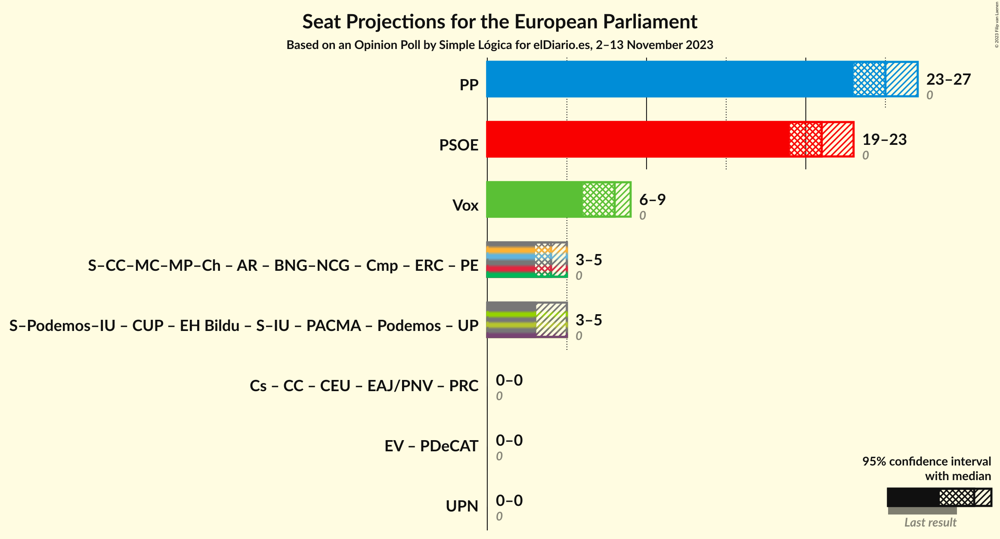
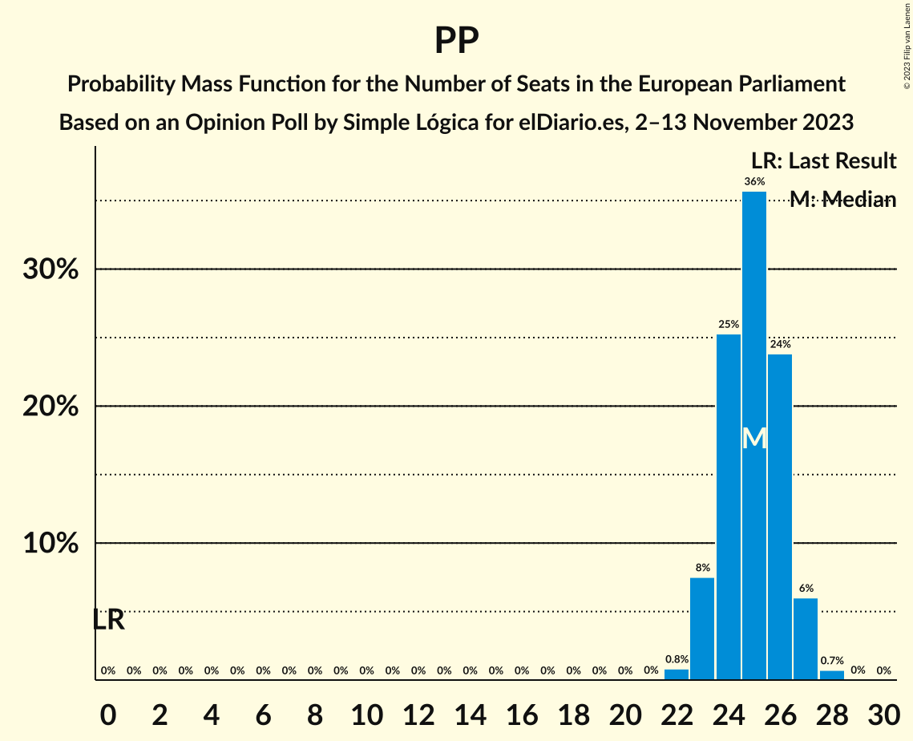
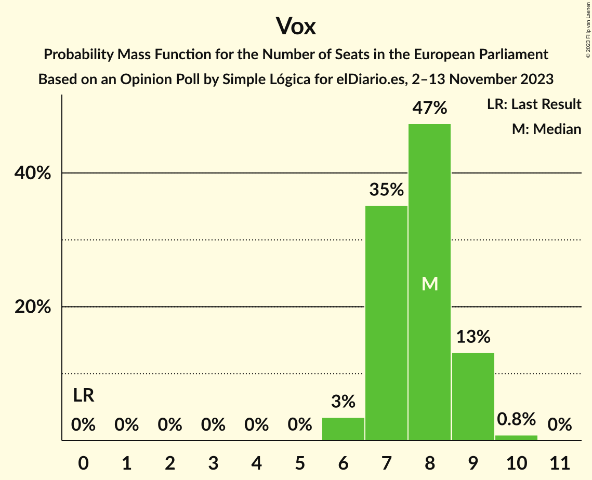

# Opinion Poll by Simple Lógica for elDiario.es, 2–13 November 2023

<a href="#voting-intentions">Voting Intentions</a> | <a href="#seats">Seats</a> | <a href="#coalitions">Coalitions</a> | <a href="#technical-information">Technical Information</a>

## Voting Intentions

### Confidence Intervals

| Party | Last Result | Poll Result | 80% Confidence Interval | 90% Confidence Interval | 95% Confidence Interval | 99% Confidence Interval |
|:-----:|:-----------:|:-----------:|:-----------------------:|:-----------------------:|:-----------------------:|:-----------------------:|
| Partido Popular (EPP) | 0.0% | 35.9% | 34.0–37.9% |33.5–38.5% |33.1–38.9% |32.2–39.9% |
| Partido Socialista Obrero Español (S&D) | 0.0% | 30.3% | 28.5–32.2% |28.0–32.7% |27.5–33.2% |26.7–34.1% |
| Vox (ECR) | 0.0% | 11.6% | 10.4–12.9% |10.0–13.3% |9.7–13.7% |9.2–14.4% |
| Movimiento Sumar–Catalunya en Comú–Més–Compromís–Más País–Chunta (Greens/EFA) | 0.0% | 6.1% | 5.2–7.1% |5.0–7.5% |4.8–7.7% |4.4–8.3% |
| Movimiento Sumar–Podemos–Izquierda Unida (GUE/NGL) | 0.0% | 5.6% | 4.8–6.6% |4.5–6.9% |4.3–7.2% |4.0–7.7% |

*Note:* The poll result column reflects the actual value used in the calculations. Published results may vary slightly, and in addition be rounded to fewer digits.

## Seats

### Confidence Intervals

| Party | Last Result | Median | 80% Confidence Interval | 90% Confidence Interval | 95% Confidence Interval | 99% Confidence Interval |
|:-----:|:-----------:|:------:|:-----------------------:|:-----------------------:|:-----------------------:|:-----------------------:|
| <a href="#partido-popular-(epp)">Partido Popular (EPP)</a> | 0 | 25 | 24–26 |23–27 |23–27 |22–28 |
| <a href="#partido-socialista-obrero-español-(s&d)">Partido Socialista Obrero Español (S&D)</a> | 0 | 21 | 20–22 |19–23 |19–23 |18–24 |
| <a href="#vox-(ecr)">Vox (ECR)</a> | 0 | 8 | 7–9 |7–9 |6–9 |6–10 |
| <a href="#movimiento-sumar–catalunya-en-comú–més–compromís–más-país–chunta-(greens/efa)">Movimiento Sumar–Catalunya en Comú–Més–Compromís–Más País–Chunta (Greens/EFA)</a> | 0 | 4 | 3–5 |3–5 |3–5 |3–5 |
| <a href="#movimiento-sumar–podemos–izquierda-unida-(gue/ngl)">Movimiento Sumar–Podemos–Izquierda Unida (GUE/NGL)</a> | 0 | 3 | 3–4 |3–4 |3–5 |2–5 |

### Partido Popular (EPP)

*For a full overview of the results for this party, see the [Partido Popular (EPP)](party-partidopopularepp.html) page.*

| Number of Seats | Probability | Accumulated | Special Marks |
|:---------------:|:-----------:|:-----------:|:-------------:|
| 0 | 0% | 100% | Last Result |
| 1 | 0% | 100% |  |
| 2 | 0% | 100% |  |
| 3 | 0% | 100% |  |
| 4 | 0% | 100% |  |
| 5 | 0% | 100% |  |
| 6 | 0% | 100% |  |
| 7 | 0% | 100% |  |
| 8 | 0% | 100% |  |
| 9 | 0% | 100% |  |
| 10 | 0% | 100% |  |
| 11 | 0% | 100% |  |
| 12 | 0% | 100% |  |
| 13 | 0% | 100% |  |
| 14 | 0% | 100% |  |
| 15 | 0% | 100% |  |
| 16 | 0% | 100% |  |
| 17 | 0% | 100% |  |
| 18 | 0% | 100% |  |
| 19 | 0% | 100% |  |
| 20 | 0% | 100% |  |
| 21 | 0% | 100% |  |
| 22 | 0.8% | 100% |  |
| 23 | 8% | 99.1% |  |
| 24 | 25% | 92% |  |
| 25 | 36% | 66% | Median |
| 26 | 24% | 31% |  |
| 27 | 6% | 7% |  |
| 28 | 0.7% | 0.8% |  |
| 29 | 0% | 0% |  |

### Partido Socialista Obrero Español (S&D)

*For a full overview of the results for this party, see the [Partido Socialista Obrero Español (S&D)](party-partidosocialistaobreroespañolsd.html) page.*

| Number of Seats | Probability | Accumulated | Special Marks |
|:---------------:|:-----------:|:-----------:|:-------------:|
| 0 | 0% | 100% | Last Result |
| 1 | 0% | 100% |  |
| 2 | 0% | 100% |  |
| 3 | 0% | 100% |  |
| 4 | 0% | 100% |  |
| 5 | 0% | 100% |  |
| 6 | 0% | 100% |  |
| 7 | 0% | 100% |  |
| 8 | 0% | 100% |  |
| 9 | 0% | 100% |  |
| 10 | 0% | 100% |  |
| 11 | 0% | 100% |  |
| 12 | 0% | 100% |  |
| 13 | 0% | 100% |  |
| 14 | 0% | 100% |  |
| 15 | 0% | 100% |  |
| 16 | 0% | 100% |  |
| 17 | 0% | 100% |  |
| 18 | 0.6% | 100% |  |
| 19 | 7% | 99.3% |  |
| 20 | 27% | 93% |  |
| 21 | 38% | 66% | Median |
| 22 | 23% | 29% |  |
| 23 | 5% | 6% |  |
| 24 | 0.6% | 0.6% |  |
| 25 | 0% | 0% |  |

### Vox (ECR)

*For a full overview of the results for this party, see the [Vox (ECR)](party-voxecr.html) page.*

| Number of Seats | Probability | Accumulated | Special Marks |
|:---------------:|:-----------:|:-----------:|:-------------:|
| 0 | 0% | 100% | Last Result |
| 1 | 0% | 100% |  |
| 2 | 0% | 100% |  |
| 3 | 0% | 100% |  |
| 4 | 0% | 100% |  |
| 5 | 0% | 100% |  |
| 6 | 3% | 100% |  |
| 7 | 35% | 97% |  |
| 8 | 47% | 61% | Median |
| 9 | 13% | 14% |  |
| 10 | 0.8% | 0.8% |  |
| 11 | 0% | 0% |  |

### Movimiento Sumar–Catalunya en Comú–Més–Compromís–Más País–Chunta (Greens/EFA)

*For a full overview of the results for this party, see the [Movimiento Sumar–Catalunya en Comú–Més–Compromís–Más País–Chunta (Greens/EFA)](party-movimientosumar–catalunyaencomú–més–compromís–máspaís–chuntagreensefa.html) page.*

| Number of Seats | Probability | Accumulated | Special Marks |
|:---------------:|:-----------:|:-----------:|:-------------:|
| 0 | 0% | 100% | Last Result |
| 1 | 0% | 100% |  |
| 2 | 0.3% | 100% |  |
| 3 | 23% | 99.7% |  |
| 4 | 66% | 77% | Median |
| 5 | 11% | 11% |  |
| 6 | 0.2% | 0.2% |  |
| 7 | 0% | 0% |  |

### Movimiento Sumar–Podemos–Izquierda Unida (GUE/NGL)

*For a full overview of the results for this party, see the [Movimiento Sumar–Podemos–Izquierda Unida (GUE/NGL)](party-movimientosumar–podemos–izquierdaunidaguengl.html) page.*

| Number of Seats | Probability | Accumulated | Special Marks |
|:---------------:|:-----------:|:-----------:|:-------------:|
| 0 | 0% | 100% | Last Result |
| 1 | 0% | 100% |  |
| 2 | 2% | 100% |  |
| 3 | 49% | 98% | Median |
| 4 | 46% | 49% |  |
| 5 | 3% | 3% |  |
| 6 | 0% | 0% |  |

## Coalitions

### Confidence Intervals

| Coalition | Last Result | Median | Majority? | 80% Confidence Interval | 90% Confidence Interval | 95% Confidence Interval | 99% Confidence Interval |
|:---------:|:-----------:|:------:|:---------:|:-----------------------:|:-----------------------:|:-----------------------:|:-----------------------:|
| Partido Popular (EPP) | 0 | 25 | 0% | 24–26 | 23–27 | 23–27 | 22–28 |
| Partido Socialista Obrero Español (S&D) | 0 | 21 | 0% | 20–22 | 19–23 | 19–23 | 18–24 |
| Vox (ECR) | 0 | 8 | 0% | 7–9 | 7–9 | 6–9 | 6–10 |

### Partido Popular (EPP)

| Number of Seats | Probability | Accumulated | Special Marks |
|:---------------:|:-----------:|:-----------:|:-------------:|
| 0 | 0% | 100% | Last Result |
| 1 | 0% | 100% |  |
| 2 | 0% | 100% |  |
| 3 | 0% | 100% |  |
| 4 | 0% | 100% |  |
| 5 | 0% | 100% |  |
| 6 | 0% | 100% |  |
| 7 | 0% | 100% |  |
| 8 | 0% | 100% |  |
| 9 | 0% | 100% |  |
| 10 | 0% | 100% |  |
| 11 | 0% | 100% |  |
| 12 | 0% | 100% |  |
| 13 | 0% | 100% |  |
| 14 | 0% | 100% |  |
| 15 | 0% | 100% |  |
| 16 | 0% | 100% |  |
| 17 | 0% | 100% |  |
| 18 | 0% | 100% |  |
| 19 | 0% | 100% |  |
| 20 | 0% | 100% |  |
| 21 | 0% | 100% |  |
| 22 | 0.8% | 100% |  |
| 23 | 8% | 99.1% |  |
| 24 | 25% | 92% |  |
| 25 | 36% | 66% | Median |
| 26 | 24% | 31% |  |
| 27 | 6% | 7% |  |
| 28 | 0.7% | 0.8% |  |
| 29 | 0% | 0% |  |

### Partido Socialista Obrero Español (S&D)

| Number of Seats | Probability | Accumulated | Special Marks |
|:---------------:|:-----------:|:-----------:|:-------------:|
| 0 | 0% | 100% | Last Result |
| 1 | 0% | 100% |  |
| 2 | 0% | 100% |  |
| 3 | 0% | 100% |  |
| 4 | 0% | 100% |  |
| 5 | 0% | 100% |  |
| 6 | 0% | 100% |  |
| 7 | 0% | 100% |  |
| 8 | 0% | 100% |  |
| 9 | 0% | 100% |  |
| 10 | 0% | 100% |  |
| 11 | 0% | 100% |  |
| 12 | 0% | 100% |  |
| 13 | 0% | 100% |  |
| 14 | 0% | 100% |  |
| 15 | 0% | 100% |  |
| 16 | 0% | 100% |  |
| 17 | 0% | 100% |  |
| 18 | 0.6% | 100% |  |
| 19 | 7% | 99.3% |  |
| 20 | 27% | 93% |  |
| 21 | 38% | 66% | Median |
| 22 | 23% | 29% |  |
| 23 | 5% | 6% |  |
| 24 | 0.6% | 0.6% |  |
| 25 | 0% | 0% |  |

### Vox (ECR)

| Number of Seats | Probability | Accumulated | Special Marks |
|:---------------:|:-----------:|:-----------:|:-------------:|
| 0 | 0% | 100% | Last Result |
| 1 | 0% | 100% |  |
| 2 | 0% | 100% |  |
| 3 | 0% | 100% |  |
| 4 | 0% | 100% |  |
| 5 | 0% | 100% |  |
| 6 | 3% | 100% |  |
| 7 | 35% | 97% |  |
| 8 | 47% | 61% | Median |
| 9 | 13% | 14% |  |
| 10 | 0.8% | 0.8% |  |
| 11 | 0% | 0% |  |

## Technical Information

### Opinion Poll

+ **Polling firm:** Simple Lógica
+ **Commissioner(s):** elDiario.es
+ **Fieldwork period:** 2–13 November 2023

### Calculations

+ **Sample size:** 1021
+ **Simulations done:** 1,048,576
+ **Error estimate:** 0.26%

