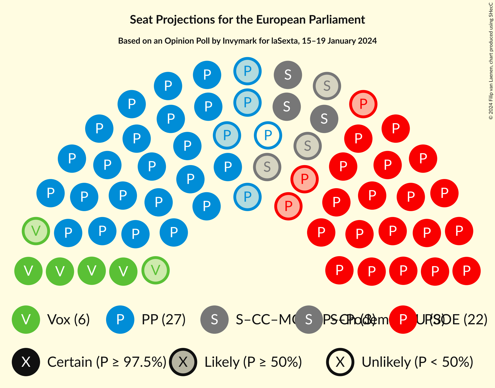
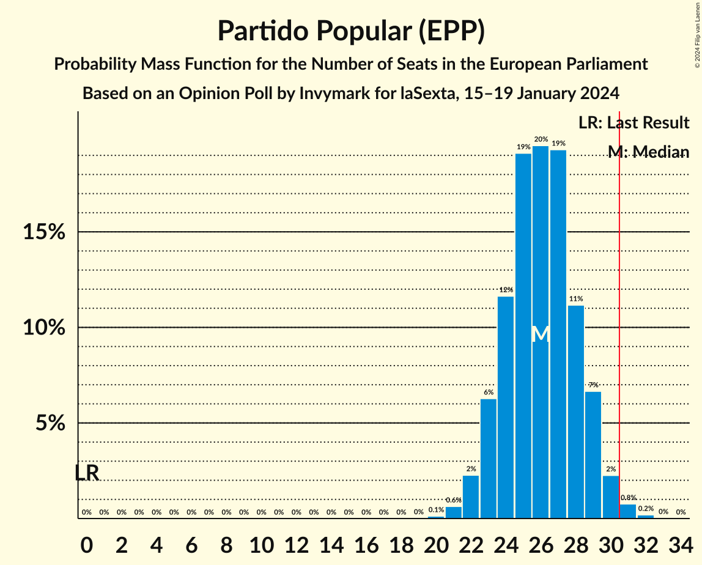
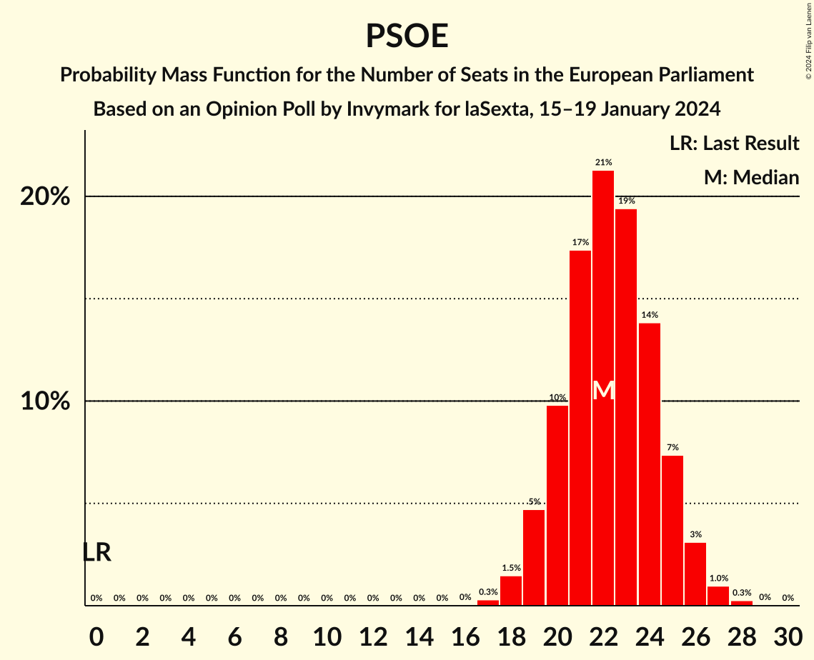

# Opinion Poll by Invymark for laSexta, 15–19 January 2024

<a href="#voting-intentions">Voting Intentions</a> | <a href="#seats">Seats</a> | <a href="#coalitions">Coalitions</a> | <a href="#technical-information">Technical Information</a>

## Voting Intentions

### Confidence Intervals

| Party | Last Result | Poll Result | 80% Confidence Interval | 90% Confidence Interval | 95% Confidence Interval | 99% Confidence Interval |
|:-----:|:-----------:|:-----------:|:-----------------------:|:-----------------------:|:-----------------------:|:-----------------------:|
| Partido Popular (EPP) | 0.0% | 37.7% | 34.2–41.4% |33.2–42.4% |32.4–43.3% |30.7–45.1% |
| Partido Socialista Obrero Español (S&D) | 0.0% | 32.3% | 29.0–35.9% |28.1–36.9% |27.3–37.8% |25.8–39.6% |
| Vox (ECR) | 0.0% | 9.7% | 7.8–12.2% |7.3–12.9% |6.8–13.5% |6.0–14.8% |
| Movimiento Sumar–Catalunya en Comú–Més–Compromís–Más País–Chunta (Greens/EFA) | 0.0% | 5.0% | 3.7–7.0% |3.4–7.6% |3.1–8.1% |2.5–9.2% |
| Movimiento Sumar–Podemos–Izquierda Unida (GUE/NGL) | 0.0% | 4.7% | 3.4–6.6% |3.1–7.2% |2.8–7.7% |2.3–8.7% |

*Note:* The poll result column reflects the actual value used in the calculations. Published results may vary slightly, and in addition be rounded to fewer digits.

## Seats

### Confidence Intervals

| Party | Last Result | Median | 80% Confidence Interval | 90% Confidence Interval | 95% Confidence Interval | 99% Confidence Interval |
|:-----:|:-----------:|:------:|:-----------------------:|:-----------------------:|:-----------------------:|:-----------------------:|
| <a href="#partido-popular-(epp)">Partido Popular (EPP)</a> | 0 | 26 | 24–29 |23–29 |22–30 |21–31 |
| <a href="#partido-socialista-obrero-español-(s&d)">Partido Socialista Obrero Español (S&D)</a> | 0 | 22 | 20–25 |19–25 |19–26 |18–27 |
| <a href="#vox-(ecr)">Vox (ECR)</a> | 0 | 6 | 5–8 |5–9 |4–9 |4–10 |
| <a href="#movimiento-sumar–catalunya-en-comú–més–compromís–más-país–chunta-(greens/efa)">Movimiento Sumar–Catalunya en Comú–Més–Compromís–Más País–Chunta (Greens/EFA)</a> | 0 | 3 | 2–4 |2–5 |2–5 |1–6 |
| <a href="#movimiento-sumar–podemos–izquierda-unida-(gue/ngl)">Movimiento Sumar–Podemos–Izquierda Unida (GUE/NGL)</a> | 0 | 3 | 2–4 |2–5 |1–5 |1–6 |

### Partido Popular (EPP)

*For a full overview of the results for this party, see the [Partido Popular (EPP)](party-partidopopularepp.html) page.*

| Number of Seats | Probability | Accumulated | Special Marks |
|:---------------:|:-----------:|:-----------:|:-------------:|
| 0 | 0% | 100% | Last Result |
| 1 | 0% | 100% |  |
| 2 | 0% | 100% |  |
| 3 | 0% | 100% |  |
| 4 | 0% | 100% |  |
| 5 | 0% | 100% |  |
| 6 | 0% | 100% |  |
| 7 | 0% | 100% |  |
| 8 | 0% | 100% |  |
| 9 | 0% | 100% |  |
| 10 | 0% | 100% |  |
| 11 | 0% | 100% |  |
| 12 | 0% | 100% |  |
| 13 | 0% | 100% |  |
| 14 | 0% | 100% |  |
| 15 | 0% | 100% |  |
| 16 | 0% | 100% |  |
| 17 | 0% | 100% |  |
| 18 | 0% | 100% |  |
| 19 | 0% | 100% |  |
| 20 | 0.1% | 100% |  |
| 21 | 0.6% | 99.8% |  |
| 22 | 2% | 99.2% |  |
| 23 | 6% | 97% |  |
| 24 | 12% | 91% |  |
| 25 | 19% | 79% |  |
| 26 | 19% | 60% | Median |
| 27 | 20% | 41% |  |
| 28 | 11% | 21% |  |
| 29 | 7% | 10% |  |
| 30 | 2% | 3% |  |
| 31 | 0.8% | 1.0% | Majority |
| 32 | 0.2% | 0.2% |  |
| 33 | 0% | 0% |  |

### Partido Socialista Obrero Español (S&D)

*For a full overview of the results for this party, see the [Partido Socialista Obrero Español (S&D)](party-partidosocialistaobreroespañolsd.html) page.*

| Number of Seats | Probability | Accumulated | Special Marks |
|:---------------:|:-----------:|:-----------:|:-------------:|
| 0 | 0% | 100% | Last Result |
| 1 | 0% | 100% |  |
| 2 | 0% | 100% |  |
| 3 | 0% | 100% |  |
| 4 | 0% | 100% |  |
| 5 | 0% | 100% |  |
| 6 | 0% | 100% |  |
| 7 | 0% | 100% |  |
| 8 | 0% | 100% |  |
| 9 | 0% | 100% |  |
| 10 | 0% | 100% |  |
| 11 | 0% | 100% |  |
| 12 | 0% | 100% |  |
| 13 | 0% | 100% |  |
| 14 | 0% | 100% |  |
| 15 | 0% | 100% |  |
| 16 | 0% | 100% |  |
| 17 | 0.3% | 99.9% |  |
| 18 | 1.4% | 99.7% |  |
| 19 | 5% | 98% |  |
| 20 | 10% | 93% |  |
| 21 | 17% | 84% |  |
| 22 | 22% | 67% | Median |
| 23 | 19% | 45% |  |
| 24 | 13% | 25% |  |
| 25 | 7% | 12% |  |
| 26 | 3% | 4% |  |
| 27 | 1.0% | 1.3% |  |
| 28 | 0.3% | 0.3% |  |
| 29 | 0% | 0.1% |  |
| 30 | 0% | 0% |  |

### Vox (ECR)

*For a full overview of the results for this party, see the [Vox (ECR)](party-voxecr.html) page.*

| Number of Seats | Probability | Accumulated | Special Marks |
|:---------------:|:-----------:|:-----------:|:-------------:|
| 0 | 0% | 100% | Last Result |
| 1 | 0% | 100% |  |
| 2 | 0% | 100% |  |
| 3 | 0.2% | 100% |  |
| 4 | 4% | 99.8% |  |
| 5 | 17% | 96% |  |
| 6 | 31% | 79% | Median |
| 7 | 28% | 47% |  |
| 8 | 14% | 19% |  |
| 9 | 4% | 5% |  |
| 10 | 0.9% | 1.1% |  |
| 11 | 0.1% | 0.2% |  |
| 12 | 0% | 0% |  |

### Movimiento Sumar–Catalunya en Comú–Més–Compromís–Más País–Chunta (Greens/EFA)

*For a full overview of the results for this party, see the [Movimiento Sumar–Catalunya en Comú–Més–Compromís–Más País–Chunta (Greens/EFA)](party-movimientosumar–catalunyaencomú–més–compromís–máspaís–chuntagreensefa.html) page.*

| Number of Seats | Probability | Accumulated | Special Marks |
|:---------------:|:-----------:|:-----------:|:-------------:|
| 0 | 0% | 100% | Last Result |
| 1 | 1.3% | 100% |  |
| 2 | 21% | 98.7% |  |
| 3 | 43% | 78% | Median |
| 4 | 27% | 35% |  |
| 5 | 7% | 9% |  |
| 6 | 1.1% | 1.2% |  |
| 7 | 0.1% | 0.1% |  |
| 8 | 0% | 0% |  |

### Movimiento Sumar–Podemos–Izquierda Unida (GUE/NGL)

*For a full overview of the results for this party, see the [Movimiento Sumar–Podemos–Izquierda Unida (GUE/NGL)](party-movimientosumar–podemos–izquierdaunidaguengl.html) page.*

| Number of Seats | Probability | Accumulated | Special Marks |
|:---------------:|:-----------:|:-----------:|:-------------:|
| 0 | 0% | 100% | Last Result |
| 1 | 3% | 100% |  |
| 2 | 28% | 97% |  |
| 3 | 43% | 69% | Median |
| 4 | 21% | 26% |  |
| 5 | 5% | 5% |  |
| 6 | 0.6% | 0.7% |  |
| 7 | 0.1% | 0.1% |  |
| 8 | 0% | 0% |  |

## Coalitions

### Confidence Intervals

| Coalition | Last Result | Median | Majority? | 80% Confidence Interval | 90% Confidence Interval | 95% Confidence Interval | 99% Confidence Interval |
|:---------:|:-----------:|:------:|:---------:|:-----------------------:|:-----------------------:|:-----------------------:|:-----------------------:|
| Partido Popular (EPP) | 0 | 26 | 1.0% | 24–29 | 23–29 | 22–30 | 21–31 |
| Partido Socialista Obrero Español (S&D) | 0 | 22 | 0% | 20–25 | 19–25 | 19–26 | 18–27 |
| Vox (ECR) | 0 | 6 | 0% | 5–8 | 5–9 | 4–9 | 4–10 |

### Partido Popular (EPP)

| Number of Seats | Probability | Accumulated | Special Marks |
|:---------------:|:-----------:|:-----------:|:-------------:|
| 0 | 0% | 100% | Last Result |
| 1 | 0% | 100% |  |
| 2 | 0% | 100% |  |
| 3 | 0% | 100% |  |
| 4 | 0% | 100% |  |
| 5 | 0% | 100% |  |
| 6 | 0% | 100% |  |
| 7 | 0% | 100% |  |
| 8 | 0% | 100% |  |
| 9 | 0% | 100% |  |
| 10 | 0% | 100% |  |
| 11 | 0% | 100% |  |
| 12 | 0% | 100% |  |
| 13 | 0% | 100% |  |
| 14 | 0% | 100% |  |
| 15 | 0% | 100% |  |
| 16 | 0% | 100% |  |
| 17 | 0% | 100% |  |
| 18 | 0% | 100% |  |
| 19 | 0% | 100% |  |
| 20 | 0.1% | 100% |  |
| 21 | 0.6% | 99.8% |  |
| 22 | 2% | 99.2% |  |
| 23 | 6% | 97% |  |
| 24 | 12% | 91% |  |
| 25 | 19% | 79% |  |
| 26 | 19% | 60% | Median |
| 27 | 20% | 41% |  |
| 28 | 11% | 21% |  |
| 29 | 7% | 10% |  |
| 30 | 2% | 3% |  |
| 31 | 0.8% | 1.0% | Majority |
| 32 | 0.2% | 0.2% |  |
| 33 | 0% | 0% |  |

### Partido Socialista Obrero Español (S&D)

| Number of Seats | Probability | Accumulated | Special Marks |
|:---------------:|:-----------:|:-----------:|:-------------:|
| 0 | 0% | 100% | Last Result |
| 1 | 0% | 100% |  |
| 2 | 0% | 100% |  |
| 3 | 0% | 100% |  |
| 4 | 0% | 100% |  |
| 5 | 0% | 100% |  |
| 6 | 0% | 100% |  |
| 7 | 0% | 100% |  |
| 8 | 0% | 100% |  |
| 9 | 0% | 100% |  |
| 10 | 0% | 100% |  |
| 11 | 0% | 100% |  |
| 12 | 0% | 100% |  |
| 13 | 0% | 100% |  |
| 14 | 0% | 100% |  |
| 15 | 0% | 100% |  |
| 16 | 0% | 100% |  |
| 17 | 0.3% | 99.9% |  |
| 18 | 1.4% | 99.7% |  |
| 19 | 5% | 98% |  |
| 20 | 10% | 93% |  |
| 21 | 17% | 84% |  |
| 22 | 22% | 67% | Median |
| 23 | 19% | 45% |  |
| 24 | 13% | 25% |  |
| 25 | 7% | 12% |  |
| 26 | 3% | 4% |  |
| 27 | 1.0% | 1.3% |  |
| 28 | 0.3% | 0.3% |  |
| 29 | 0% | 0.1% |  |
| 30 | 0% | 0% |  |

### Vox (ECR)

| Number of Seats | Probability | Accumulated | Special Marks |
|:---------------:|:-----------:|:-----------:|:-------------:|
| 0 | 0% | 100% | Last Result |
| 1 | 0% | 100% |  |
| 2 | 0% | 100% |  |
| 3 | 0.2% | 100% |  |
| 4 | 4% | 99.8% |  |
| 5 | 17% | 96% |  |
| 6 | 31% | 79% | Median |
| 7 | 28% | 47% |  |
| 8 | 14% | 19% |  |
| 9 | 4% | 5% |  |
| 10 | 0.9% | 1.1% |  |
| 11 | 0.1% | 0.2% |  |
| 12 | 0% | 0% |  |

## Technical Information

### Opinion Poll

+ **Polling firm:** Invymark
+ **Commissioner(s):** laSexta
+ **Fieldwork period:** 15–19 January 2024

### Calculations

+ **Sample size:** 300
+ **Simulations done:** 1,048,576
+ **Error estimate:** 1.11%

