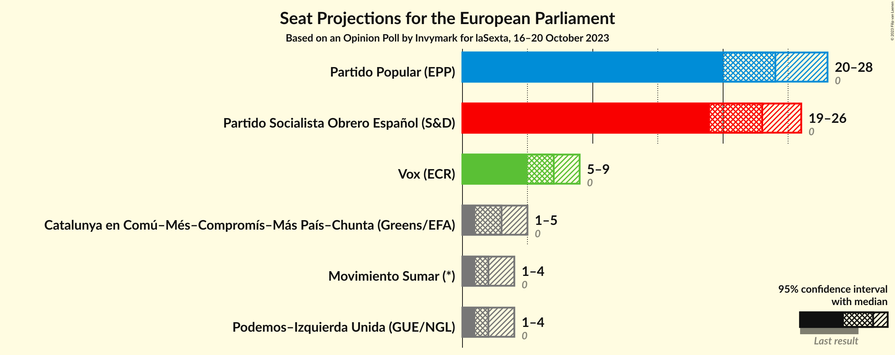
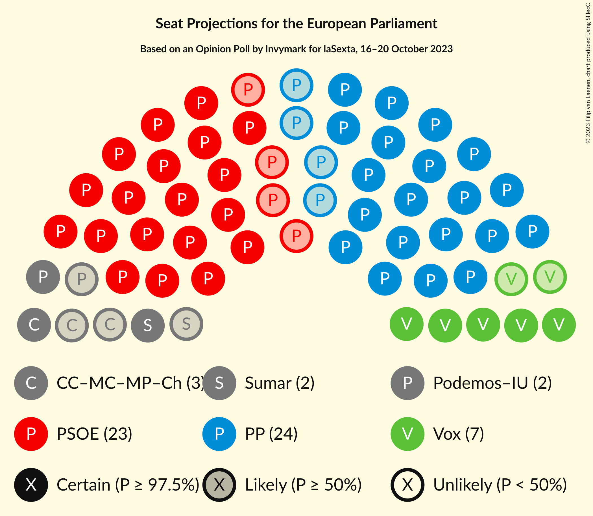

# Opinion Poll by Invymark for laSexta, 16–20 October 2023

<a href="#voting-intentions">Voting Intentions</a> | <a href="#seats">Seats</a> | <a href="#coalitions">Coalitions</a> | <a href="#technical-information">Technical Information</a>

## Voting Intentions

### Confidence Intervals

| Party | Last Result | Poll Result | 80% Confidence Interval | 90% Confidence Interval | 95% Confidence Interval | 99% Confidence Interval |
|:-----:|:-----------:|:-----------:|:-----------------------:|:-----------------------:|:-----------------------:|:-----------------------:|
| Partido Popular (EPP) | 0.0% | 34.7% | 31.3–38.3% |30.3–39.3% |29.5–40.2% |27.9–42.0% |
| Partido Socialista Obrero Español (S&D) | 0.0% | 32.7% | 29.3–36.3% |28.4–37.3% |27.6–38.2% |26.1–39.9% |
| Vox (ECR) | 0.0% | 10.0% | 8.1–12.6% |7.5–13.3% |7.1–13.9% |6.3–15.2% |
| Movimiento Sumar–Catalunya en Comú–Més–Compromís–Más País–Chunta (Greens/EFA) | N/A | 5.3% | 4.0–7.4% |3.6–8.0% |3.3–8.5% |2.8–9.6% |
| Movimiento Sumar–Podemos–Izquierda Unida (GUE/NGL) | N/A | 5.0% | 3.7–7.0% |3.4–7.6% |3.1–8.1% |2.5–9.2% |

*Note:* The poll result column reflects the actual value used in the calculations. Published results may vary slightly, and in addition be rounded to fewer digits.

## Seats

### Confidence Intervals

| Party | Last Result | Median | 80% Confidence Interval | 90% Confidence Interval | 95% Confidence Interval | 99% Confidence Interval |
|:-----:|:-----------:|:------:|:-----------------------:|:-----------------------:|:-----------------------:|:-----------------------:|
| <a href="#partido-popular-(epp)">Partido Popular (EPP)</a> | 0 | 24 | 22–27 |21–28 |21–28 |20–29 |
| <a href="#partido-socialista-obrero-español-(s&d)">Partido Socialista Obrero Español (S&D)</a> | 0 | 23 | 21–25 |20–26 |19–27 |18–28 |
| <a href="#vox-(ecr)">Vox (ECR)</a> | 0 | 7 | 5–8 |5–9 |5–9 |4–10 |
| <a href="#movimiento-sumar–catalunya-en-comú–més–compromís–más-país–chunta-(greens/efa)">Movimiento Sumar–Catalunya en Comú–Més–Compromís–Más País–Chunta (Greens/EFA)</a> | N/A | 3 | 2–5 |2–5 |2–6 |1–6 |
| <a href="#movimiento-sumar–podemos–izquierda-unida-(gue/ngl)">Movimiento Sumar–Podemos–Izquierda Unida (GUE/NGL)</a> | N/A | 3 | 2–5 |2–5 |2–5 |1–6 |

