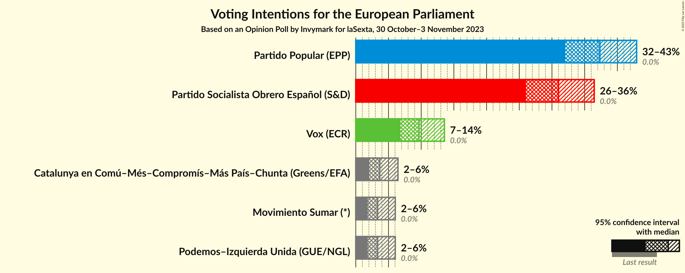
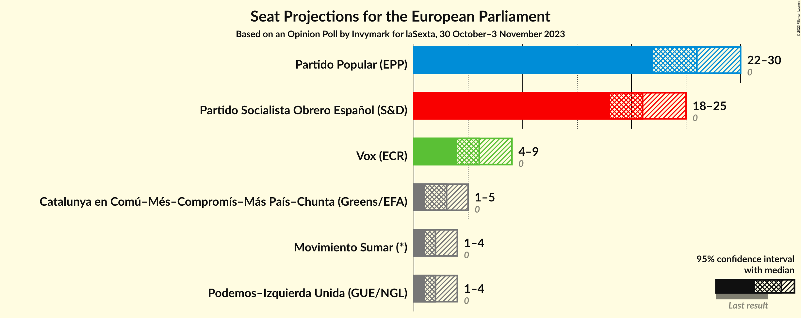
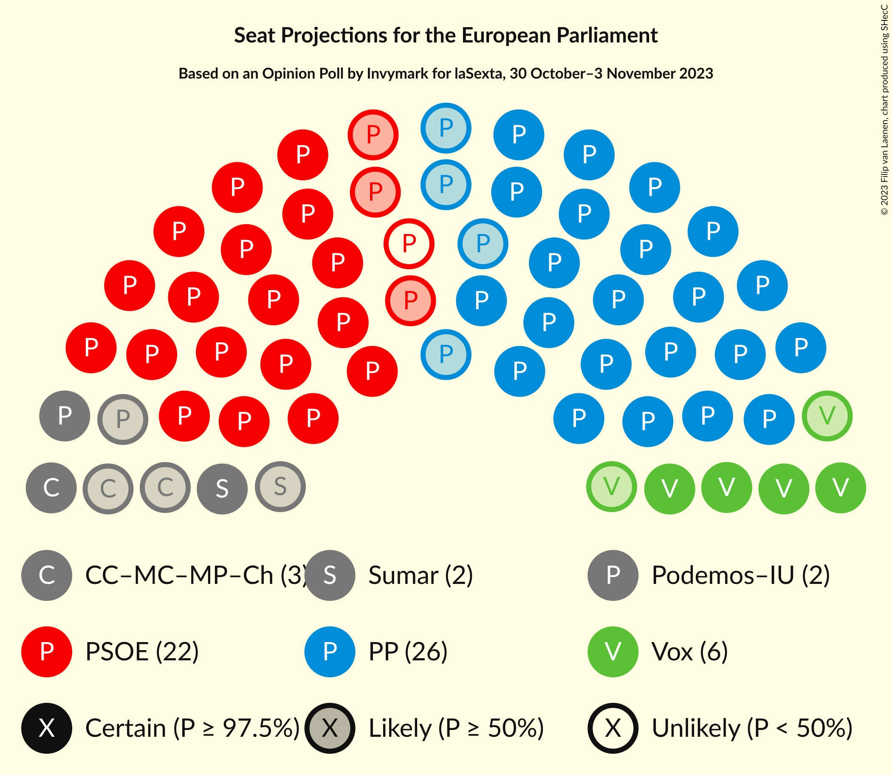

# Opinion Poll by Invymark for laSexta, 30 October–3 November 2023

<a href="#voting-intentions">Voting Intentions</a> | <a href="#seats">Seats</a> | <a href="#coalitions">Coalitions</a> | <a href="#technical-information">Technical Information</a>

## Voting Intentions

### Confidence Intervals

| Party | Last Result | Poll Result | 80% Confidence Interval | 90% Confidence Interval | 95% Confidence Interval | 99% Confidence Interval |
|:-----:|:-----------:|:-----------:|:-----------------------:|:-----------------------:|:-----------------------:|:-----------------------:|
| Partido Popular (EPP) | 0.0% | 37.3% | 33.9–41.0% |32.9–42.1% |32.0–43.0% |30.4–44.7% |
| Partido Socialista Obrero Español (S&D) | 0.0% | 31.0% | 27.7–34.6% |26.8–35.6% |26.0–36.5% |24.5–38.2% |
| Vox (ECR) | 0.0% | 9.7% | 7.8–12.2% |7.3–12.9% |6.8–13.5% |6.0–14.8% |
| Movimiento Sumar–Catalunya en Comú–Més–Compromís–Más País–Chunta (Greens/EFA) | N/A | 5.0% | 3.7–7.0% |3.4–7.6% |3.1–8.1% |2.5–9.2% |
| Movimiento Sumar–Podemos–Izquierda Unida (GUE/NGL) | N/A | 4.7% | 3.4–6.6% |3.1–7.2% |2.8–7.7% |2.3–8.7% |

*Note:* The poll result column reflects the actual value used in the calculations. Published results may vary slightly, and in addition be rounded to fewer digits.

## Seats

### Confidence Intervals

| Party | Last Result | Median | 80% Confidence Interval | 90% Confidence Interval | 95% Confidence Interval | 99% Confidence Interval |
|:-----:|:-----------:|:------:|:-----------------------:|:-----------------------:|:-----------------------:|:-----------------------:|
| <a href="#partido-popular-(epp)">Partido Popular (EPP)</a> | 0 | 26 | 24–29 |23–29 |23–30 |21–31 |
| <a href="#partido-socialista-obrero-español-(s&d)">Partido Socialista Obrero Español (S&D)</a> | 0 | 22 | 19–24 |19–25 |18–25 |17–27 |
| <a href="#vox-(ecr)">Vox (ECR)</a> | 0 | 7 | 5–8 |5–9 |4–9 |4–10 |
| <a href="#movimiento-sumar–catalunya-en-comú–més–compromís–más-país–chunta-(greens/efa)">Movimiento Sumar–Catalunya en Comú–Més–Compromís–Más País–Chunta (Greens/EFA)</a> | N/A | 3 | 2–5 |2–5 |2–5 |1–6 |
| <a href="#movimiento-sumar–podemos–izquierda-unida-(gue/ngl)">Movimiento Sumar–Podemos–Izquierda Unida (GUE/NGL)</a> | N/A | 3 | 2–4 |2–5 |2–5 |1–6 |

