# Poll Average

<a href="#voting-intentions">Voting Intentions</a> | <a href="#seats">Seats</a> | <a href="#coalitions">Coalitions</a> | <a href="#technical-information">Technical Information</a>

## Summary

The table below lists the polls on which the average is based. They are the most recent polls (less than 90 days old) registered and analyzed so far.

| Period     | Polling firm/Commissioner(s) | PP | PSOE | UP | Cs | ERC | PDeCAT | EAJ/PNV | PACMA | EH Bildu | CC | Vox | BNG | AR | CEU | PE | Cmp |
|:----------:|:----------------------------:|:--:|:--:|:--:|:--:|:--:|:--:|:--:|:--:|:--:|:--:|:--:|:--:|:--:|:--:|:--:|:--:|
| 26 May 2019 | General Election | 0.0%   0 | 0.0%   0 | 0.0%   0 | 0.0%   0 | 0.0%   0 | 0.0%   0 | 0.0%   0 | 0.0%   0 | 0.0%   0 | 0.0%   0 | 0.0%   0 | 0.0%   0 | 0.0%   0 | 0.0%   0 | 0.0%   0 | 0.0%   0 |
| N/A | Poll Average | 16–23%   8–13 | 28–37%   16–21 | 11–16%   6–9 | 11–17%   6–9 | 3–5%   1–3 | 1–3%   0–1 | 1–2%   0–1 | N/A   N/A | 1–2%   0–1 | 0–1%   0 | 6–12%   3–6 | N/A   N/A | N/A   N/A | N/A   N/A | N/A   N/A | 0–1%   0 |
| [27–30 August 2019](2019-08-30-SocioMétrica.html) | SocioMétrica   El Español | 16–20%   9–12 | 29–34%   16–20 | 12–16%   7–9 | 10–14%   6–8 | 3–5%   1–3 | 1–3%   0–1 | 1–3%   0–1 | N/A   N/A | 1–2%   0–1 | 0–1%   0 | 8–12%   4–7 | N/A   N/A | N/A   N/A | N/A   N/A | N/A   N/A | 0–2%   0 |
| [27–29 August 2019](2019-08-29-SigmaDos.html) | Sigma Dos   El Mundo | 17–22%   9–12 | 31–36%   17–21 | 12–17%   7–9 | 10–14%   5–8 | 3–6%   1–3 | 1–2%   0–1 | 1–2%   0–1 | N/A   N/A | N/A   N/A | N/A   N/A | 7–10%   3–5 | N/A   N/A | N/A   N/A | N/A   N/A | N/A   N/A | N/A   N/A |
| [20–24 August 2019](2019-08-24-NCReport.html) | NC Report   La Razón | 19–25%   11–14 | 27–32%   15–19 | 11–15%   6–9 | 12–16%   7–9 | 3–5%   1–2 | 1–3%   0–1 | 1–2%   0–1 | N/A   N/A | 1–2%   0–1 | 0–1%   0 | 6–10%   3–5 | N/A   N/A | N/A   N/A | N/A   N/A | N/A   N/A | 0–1%   0 |
| [1–15 August 2019](2019-08-15-electoPanel.html) | electoPanel   electomania.es | 19–23%   11–13 | 28–31%   16–18 | 12–15%   7–8 | 11–14%   6–8 | 4–5%   2–3 | 2–3%   0–1 | 1–2%   0–1 | N/A   N/A | 1–2%   0 | 0–1%   0 | 8–10%   4–6 | N/A   N/A | N/A   N/A | N/A   N/A | N/A   N/A | 1%   0 |
| [1–7 August 2019](2019-08-07-Celeste-Tel.html) | Celeste-Tel   eldiario.es | 18–23%   10–13 | 28–34%   16–20 | 11–16%   6–9 | 12–16%   7–9 | 3–5%   1–2 | 1–3%   0–1 | 1–2%   0–1 | N/A   N/A | 0–2%   0–1 | 0–1%   0 | 7–10%   4–6 | N/A   N/A | N/A   N/A | N/A   N/A | N/A   N/A | 0–1%   0 |
| [1–5 August 2019](2019-08-05-SimpleLógica.html) | Simple Lógica | 15–20%   8–11 | 29–34%   16–19 | 12–16%   6–9 | 13–17%   7–9 | N/A   N/A | N/A   N/A | N/A   N/A | N/A   N/A | N/A   N/A | N/A   N/A | 9–13%   5–7 | N/A   N/A | N/A   N/A | N/A   N/A | N/A   N/A | N/A   N/A |
| [5 August 2019](2019-08-05-KeyData.html) | Key Data   Público | 16–22%   8–12 | 28–36%   15–20 | 11–17%   6–9 | 12–18%   6–10 | N/A   N/A | N/A   N/A | N/A   N/A | N/A   N/A | N/A   N/A | N/A   N/A | 6–10%   3–5 | N/A   N/A | N/A   N/A | N/A   N/A | N/A   N/A | N/A   N/A |
| [29 July–1 August 2019](2019-08-01-Invymark.html) | Invymark   laSexta | 15–19%   8–10 | 33–39%   18–22 | 11–14%   6–8 | 11–15%   6–8 | N/A   N/A | N/A   N/A | N/A   N/A | N/A   N/A | N/A   N/A | N/A   N/A | 5–8%   2–4 | N/A   N/A | N/A   N/A | N/A   N/A | N/A   N/A | N/A   N/A |
| 26 May 2019 | General Election | 0.0%   0 | 0.0%   0 | 0.0%   0 | 0.0%   0 | 0.0%   0 | 0.0%   0 | 0.0%   0 | 0.0%   0 | 0.0%   0 | 0.0%   0 | 0.0%   0 | 0.0%   0 | 0.0%   0 | 0.0%   0 | 0.0%   0 | 0.0%   0 |

Only polls for which at least the sample size has been published are included in the table above.

**Legend:**
+ **Top half of each row:** Voting intentions (95% confidence interval)
+ **Bottom half of each row:** Seat projections for the European Parliament (95% confidence interval)
+ **PP:** Partido Popular (EPP)
+ **PSOE:** Partido Socialista Obrero Español (S&D)
+ **UP:** Unidos Podemos (GUE/NGL)
+ **Cs:** Ciudadanos–Partido de la Ciudadanía (RE)
+ **ERC:** Esquerra Republicana de Catalunya–Catalunya Sí (Greens/EFA)
+ **PDeCAT:** Partit Demòcrata Europeu Català (NI)
+ **EAJ/PNV:** Euzko Alderdi Jeltzalea/Partido Nacionalista Vasco (RE)
+ **PACMA:** Partido Animalista Contra el Maltrato Animal (GUE/NGL)
+ **EH Bildu:** Euskal Herria Bildu (GUE/NGL)
+ **CC:** Coalición Canaria–Partido Nacionalista Canario (RE)
+ **Vox:** Vox (ECR)
+ **BNG:** Bloque Nacionalista Galego (Greens/EFA)
+ **AR:** Ahora Repúblicas (Greens/EFA)
+ **CEU:** Coalición por Europa (RE)
+ **PE:** Primavera Europea (Greens/EFA)
+ **Cmp:** Coalició Compromís (Greens/EFA)
+ **N/A (single party):** Party not included the published results
+ **N/A (entire row):** Calculation for this opinion poll not started yet

## Voting Intentions

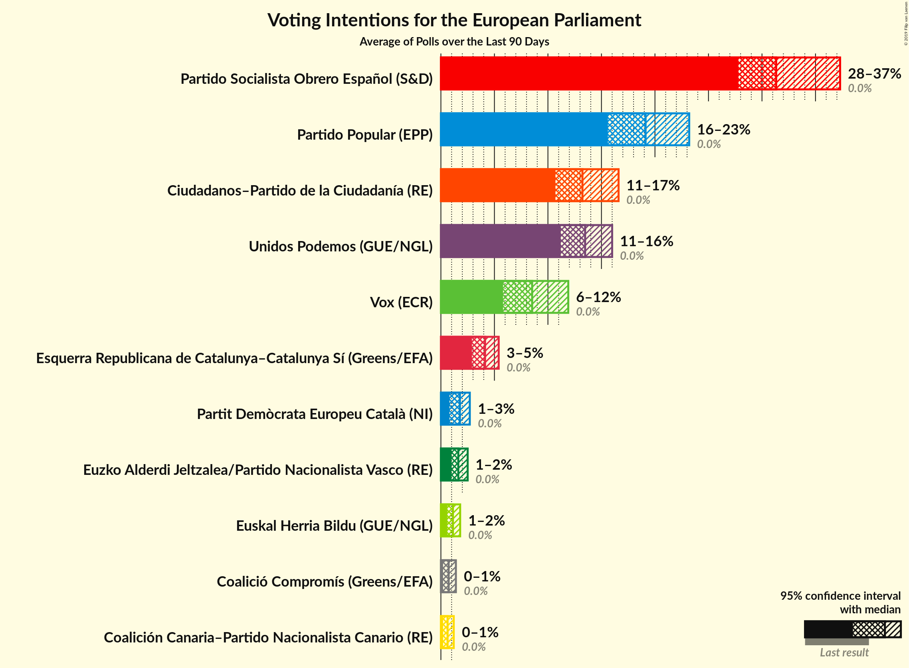

### Confidence Intervals

| Party | Last Result | Median | 80% Confidence Interval | 90% Confidence Interval | 95% Confidence Interval | 99% Confidence Interval |
|:-----:|:-----------:|:------:|:-----------------------:|:-----------------------:|:-----------------------:|:-----------------------:|
| <a href="#partido-popular-(epp)">Partido Popular (EPP)</a> | 0.0% | 19.1% | 16.6–21.9% |16.0–22.6% | 15.6–23.2% | 14.8–24.3% |
| <a href="#partido-socialista-obrero-español-(s&d)">Partido Socialista Obrero Español (S&D)</a> | 0.0% | 31.3% | 28.8–35.5% |28.3–36.6% | 27.8–37.3% | 26.8–38.6% |
| <a href="#unidos-podemos-(gue/ngl)">Unidos Podemos (GUE/NGL)</a> | 0.0% | 13.5% | 12.0–15.0% |11.6–15.5% | 11.2–16.0% | 10.5–16.9% |
| <a href="#ciudadanos–partido-de-la-ciudadanía-(re)">Ciudadanos–Partido de la Ciudadanía (RE)</a> | 0.0% | 13.2% | 11.5–15.5% |11.1–16.1% | 10.7–16.6% | 10.0–17.6% |
| <a href="#esquerra-republicana-de-catalunya–catalunya-sí-(greens/efa)">Esquerra Republicana de Catalunya–Catalunya Sí (Greens/EFA)</a> | 0.0% | 4.1% | 3.3–5.0% |3.0–5.2% | 2.9–5.4% | 2.5–5.9% |
| <a href="#partit-demòcrata-europeu-català-(ni)">Partit Demòcrata Europeu Català (NI)</a> | 0.0% | 1.8% | 1.1–2.3% |0.9–2.5% | 0.8–2.7% | 0.6–3.0% |
| <a href="#euzko-alderdi-jeltzalea/partido-nacionalista-vasco-(re)">Euzko Alderdi Jeltzalea/Partido Nacionalista Vasco (RE)</a> | 0.0% | 1.6% | 1.2–2.2% |1.1–2.4% | 1.0–2.5% | 0.8–2.9% |
| <a href="#partido-animalista-contra-el-maltrato-animal-(gue/ngl)">Partido Animalista Contra el Maltrato Animal (GUE/NGL)</a> | 0.0% | N/A | N/A |N/A | N/A | N/A |
| <a href="#euskal-herria-bildu-(gue/ngl)">Euskal Herria Bildu (GUE/NGL)</a> | 0.0% | 1.1% | 0.8–1.5% |0.7–1.7% | 0.6–1.8% | 0.5–2.1% |
| <a href="#coalición-canaria–partido-nacionalista-canario-(re)">Coalición Canaria–Partido Nacionalista Canario (RE)</a> | 0.0% | 0.6% | 0.3–1.0% |0.3–1.1% | 0.2–1.2% | 0.1–1.5% |
| <a href="#vox-(ecr)">Vox (ECR)</a> | 0.0% | 8.5% | 6.6–10.7% |6.2–11.4% | 5.8–11.9% | 5.3–12.8% |
| <a href="#bloque-nacionalista-galego-(greens/efa)">Bloque Nacionalista Galego (Greens/EFA)</a> | 0.0% | N/A | N/A |N/A | N/A | N/A |
| <a href="#ahora-repúblicas-(greens/efa)">Ahora Repúblicas (Greens/EFA)</a> | 0.0% | N/A | N/A |N/A | N/A | N/A |
| <a href="#coalición-por-europa-(re)">Coalición por Europa (RE)</a> | 0.0% | N/A | N/A |N/A | N/A | N/A |
| <a href="#primavera-europea-(greens/efa)">Primavera Europea (Greens/EFA)</a> | 0.0% | N/A | N/A |N/A | N/A | N/A |
| <a href="#coalició-compromís-(greens/efa)">Coalició Compromís (Greens/EFA)</a> | 0.0% | 0.7% | 0.3–1.1% |0.3–1.3% | 0.2–1.4% | 0.1–1.6% |

### Partido Popular (EPP)

*For a full overview of the results for this party, see the [Partido Popular (EPP)](party-partidopopularepp.html) page.*

| Voting Intentions | Probability | Accumulated | Special Marks |
|:-----------------:|:-----------:|:-----------:|:-------------:|
| 0.0–0.5% | 0% | 100% | Last Result |
| 0.5–1.5% | 0% | 100% |  |
| 1.5–2.5% | 0% | 100% |  |
| 2.5–3.5% | 0% | 100% |  |
| 3.5–4.5% | 0% | 100% |  |
| 4.5–5.5% | 0% | 100% |  |
| 5.5–6.5% | 0% | 100% |  |
| 6.5–7.5% | 0% | 100% |  |
| 7.5–8.5% | 0% | 100% |  |
| 8.5–9.5% | 0% | 100% |  |
| 9.5–10.5% | 0% | 100% |  |
| 10.5–11.5% | 0% | 100% |  |
| 11.5–12.5% | 0% | 100% |  |
| 12.5–13.5% | 0% | 100% |  |
| 13.5–14.5% | 0.2% | 100% |  |
| 14.5–15.5% | 2% | 99.7% |  |
| 15.5–16.5% | 8% | 98% |  |
| 16.5–17.5% | 14% | 90% |  |
| 17.5–18.5% | 17% | 76% |  |
| 18.5–19.5% | 15% | 59% | Median |
| 19.5–20.5% | 15% | 44% |  |
| 20.5–21.5% | 15% | 29% |  |
| 21.5–22.5% | 9% | 14% |  |
| 22.5–23.5% | 4% | 5% |  |
| 23.5–24.5% | 1.2% | 2% |  |
| 24.5–25.5% | 0.3% | 0.3% |  |
| 25.5–26.5% | 0% | 0.1% |  |
| 26.5–27.5% | 0% | 0% |  |

### Partido Socialista Obrero Español (S&D)

*For a full overview of the results for this party, see the [Partido Socialista Obrero Español (S&D)](party-partidosocialistaobreroespañolsd.html) page.*

| Voting Intentions | Probability | Accumulated | Special Marks |
|:-----------------:|:-----------:|:-----------:|:-------------:|
| 0.0–0.5% | 0% | 100% | Last Result |
| 0.5–1.5% | 0% | 100% |  |
| 1.5–2.5% | 0% | 100% |  |
| 2.5–3.5% | 0% | 100% |  |
| 3.5–4.5% | 0% | 100% |  |
| 4.5–5.5% | 0% | 100% |  |
| 5.5–6.5% | 0% | 100% |  |
| 6.5–7.5% | 0% | 100% |  |
| 7.5–8.5% | 0% | 100% |  |
| 8.5–9.5% | 0% | 100% |  |
| 9.5–10.5% | 0% | 100% |  |
| 10.5–11.5% | 0% | 100% |  |
| 11.5–12.5% | 0% | 100% |  |
| 12.5–13.5% | 0% | 100% |  |
| 13.5–14.5% | 0% | 100% |  |
| 14.5–15.5% | 0% | 100% |  |
| 15.5–16.5% | 0% | 100% |  |
| 16.5–17.5% | 0% | 100% |  |
| 17.5–18.5% | 0% | 100% |  |
| 18.5–19.5% | 0% | 100% |  |
| 19.5–20.5% | 0% | 100% |  |
| 20.5–21.5% | 0% | 100% |  |
| 21.5–22.5% | 0% | 100% |  |
| 22.5–23.5% | 0% | 100% |  |
| 23.5–24.5% | 0% | 100% |  |
| 24.5–25.5% | 0% | 100% |  |
| 25.5–26.5% | 0.3% | 100% |  |
| 26.5–27.5% | 1.5% | 99.7% |  |
| 27.5–28.5% | 6% | 98% |  |
| 28.5–29.5% | 13% | 93% |  |
| 29.5–30.5% | 17% | 80% |  |
| 30.5–31.5% | 17% | 63% | Median |
| 31.5–32.5% | 14% | 47% |  |
| 32.5–33.5% | 10% | 32% |  |
| 33.5–34.5% | 7% | 22% |  |
| 34.5–35.5% | 5% | 15% |  |
| 35.5–36.5% | 5% | 10% |  |
| 36.5–37.5% | 3% | 5% |  |
| 37.5–38.5% | 1.4% | 2% |  |
| 38.5–39.5% | 0.4% | 0.5% |  |
| 39.5–40.5% | 0.1% | 0.1% |  |
| 40.5–41.5% | 0% | 0% |  |

### Unidos Podemos (GUE/NGL)

*For a full overview of the results for this party, see the [Unidos Podemos (GUE/NGL)](party-unidospodemosguengl.html) page.*

| Voting Intentions | Probability | Accumulated | Special Marks |
|:-----------------:|:-----------:|:-----------:|:-------------:|
| 0.0–0.5% | 0% | 100% | Last Result |
| 0.5–1.5% | 0% | 100% |  |
| 1.5–2.5% | 0% | 100% |  |
| 2.5–3.5% | 0% | 100% |  |
| 3.5–4.5% | 0% | 100% |  |
| 4.5–5.5% | 0% | 100% |  |
| 5.5–6.5% | 0% | 100% |  |
| 6.5–7.5% | 0% | 100% |  |
| 7.5–8.5% | 0% | 100% |  |
| 8.5–9.5% | 0% | 100% |  |
| 9.5–10.5% | 0.6% | 100% |  |
| 10.5–11.5% | 4% | 99.4% |  |
| 11.5–12.5% | 16% | 95% |  |
| 12.5–13.5% | 32% | 79% | Median |
| 13.5–14.5% | 28% | 46% |  |
| 14.5–15.5% | 13% | 18% |  |
| 15.5–16.5% | 4% | 5% |  |
| 16.5–17.5% | 0.8% | 0.9% |  |
| 17.5–18.5% | 0.1% | 0.1% |  |
| 18.5–19.5% | 0% | 0% |  |

### Ciudadanos–Partido de la Ciudadanía (RE)

*For a full overview of the results for this party, see the [Ciudadanos–Partido de la Ciudadanía (RE)](party-ciudadanos–partidodelaciudadaníare.html) page.*

| Voting Intentions | Probability | Accumulated | Special Marks |
|:-----------------:|:-----------:|:-----------:|:-------------:|
| 0.0–0.5% | 0% | 100% | Last Result |
| 0.5–1.5% | 0% | 100% |  |
| 1.5–2.5% | 0% | 100% |  |
| 2.5–3.5% | 0% | 100% |  |
| 3.5–4.5% | 0% | 100% |  |
| 4.5–5.5% | 0% | 100% |  |
| 5.5–6.5% | 0% | 100% |  |
| 6.5–7.5% | 0% | 100% |  |
| 7.5–8.5% | 0% | 100% |  |
| 8.5–9.5% | 0.1% | 100% |  |
| 9.5–10.5% | 2% | 99.9% |  |
| 10.5–11.5% | 9% | 98% |  |
| 11.5–12.5% | 22% | 89% |  |
| 12.5–13.5% | 25% | 68% | Median |
| 13.5–14.5% | 20% | 43% |  |
| 14.5–15.5% | 14% | 23% |  |
| 15.5–16.5% | 7% | 9% |  |
| 16.5–17.5% | 2% | 3% |  |
| 17.5–18.5% | 0.5% | 0.6% |  |
| 18.5–19.5% | 0.1% | 0.1% |  |
| 19.5–20.5% | 0% | 0% |  |

### Esquerra Republicana de Catalunya–Catalunya Sí (Greens/EFA)

*For a full overview of the results for this party, see the [Esquerra Republicana de Catalunya–Catalunya Sí (Greens/EFA)](party-esquerrarepublicanadecatalunya–catalunyasígreensefa.html) page.*

| Voting Intentions | Probability | Accumulated | Special Marks |
|:-----------------:|:-----------:|:-----------:|:-------------:|
| 0.0–0.5% | 0% | 100% | Last Result |
| 0.5–1.5% | 0% | 100% |  |
| 1.5–2.5% | 0.5% | 100% |  |
| 2.5–3.5% | 20% | 99.5% |  |
| 3.5–4.5% | 54% | 80% | Median |
| 4.5–5.5% | 25% | 26% |  |
| 5.5–6.5% | 2% | 2% |  |
| 6.5–7.5% | 0% | 0% |  |

### Partit Demòcrata Europeu Català (NI)

*For a full overview of the results for this party, see the [Partit Demòcrata Europeu Català (NI)](party-partitdemòcrataeuropeucatalàni.html) page.*

| Voting Intentions | Probability | Accumulated | Special Marks |
|:-----------------:|:-----------:|:-----------:|:-------------:|
| 0.0–0.5% | 0.2% | 100% | Last Result |
| 0.5–1.5% | 33% | 99.8% |  |
| 1.5–2.5% | 62% | 67% | Median |
| 2.5–3.5% | 4% | 4% |  |
| 3.5–4.5% | 0% | 0% |  |

### Euzko Alderdi Jeltzalea/Partido Nacionalista Vasco (RE)

*For a full overview of the results for this party, see the [Euzko Alderdi Jeltzalea/Partido Nacionalista Vasco (RE)](party-euzkoalderdijeltzaleapartidonacionalistavascore.html) page.*

| Voting Intentions | Probability | Accumulated | Special Marks |
|:-----------------:|:-----------:|:-----------:|:-------------:|
| 0.0–0.5% | 0% | 100% | Last Result |
| 0.5–1.5% | 40% | 100% |  |
| 1.5–2.5% | 57% | 60% | Median |
| 2.5–3.5% | 2% | 2% |  |
| 3.5–4.5% | 0% | 0% |  |

### Euskal Herria Bildu (GUE/NGL)

*For a full overview of the results for this party, see the [Euskal Herria Bildu (GUE/NGL)](party-euskalherriabilduguengl.html) page.*

| Voting Intentions | Probability | Accumulated | Special Marks |
|:-----------------:|:-----------:|:-----------:|:-------------:|
| 0.0–0.5% | 2% | 100% | Last Result |
| 0.5–1.5% | 89% | 98% | Median |
| 1.5–2.5% | 9% | 9% |  |
| 2.5–3.5% | 0% | 0% |  |
| 3.5–4.5% | 0% | 0% |  |

### Coalición Canaria–Partido Nacionalista Canario (RE)

*For a full overview of the results for this party, see the [Coalición Canaria–Partido Nacionalista Canario (RE)](party-coalicióncanaria–partidonacionalistacanariore.html) page.*

| Voting Intentions | Probability | Accumulated | Special Marks |
|:-----------------:|:-----------:|:-----------:|:-------------:|
| 0.0–0.5% | 40% | 100% | Last Result |
| 0.5–1.5% | 60% | 60% | Median |
| 1.5–2.5% | 0.3% | 0.3% |  |
| 2.5–3.5% | 0% | 0% |  |

### Vox (ECR)

*For a full overview of the results for this party, see the [Vox (ECR)](party-voxecr.html) page.*

| Voting Intentions | Probability | Accumulated | Special Marks |
|:-----------------:|:-----------:|:-----------:|:-------------:|
| 0.0–0.5% | 0% | 100% | Last Result |
| 0.5–1.5% | 0% | 100% |  |
| 1.5–2.5% | 0% | 100% |  |
| 2.5–3.5% | 0% | 100% |  |
| 3.5–4.5% | 0% | 100% |  |
| 4.5–5.5% | 1.2% | 100% |  |
| 5.5–6.5% | 8% | 98.8% |  |
| 6.5–7.5% | 17% | 91% |  |
| 7.5–8.5% | 24% | 74% |  |
| 8.5–9.5% | 25% | 49% | Median |
| 9.5–10.5% | 13% | 25% |  |
| 10.5–11.5% | 8% | 12% |  |
| 11.5–12.5% | 3% | 4% |  |
| 12.5–13.5% | 0.7% | 0.8% |  |
| 13.5–14.5% | 0.1% | 0.1% |  |
| 14.5–15.5% | 0% | 0% |  |

### Coalició Compromís (Greens/EFA)

*For a full overview of the results for this party, see the [Coalició Compromís (Greens/EFA)](party-coaliciócompromísgreensefa.html) page.*

| Voting Intentions | Probability | Accumulated | Special Marks |
|:-----------------:|:-----------:|:-----------:|:-------------:|
| 0.0–0.5% | 32% | 100% | Last Result |
| 0.5–1.5% | 67% | 68% | Median |
| 1.5–2.5% | 0.7% | 0.7% |  |
| 2.5–3.5% | 0% | 0% |  |

## Seats

### Confidence Intervals

| Party | Last Result | Median | 80% Confidence Interval | 90% Confidence Interval | 95% Confidence Interval | 99% Confidence Interval |
|:-----:|:-----------:|:------:|:-----------------------:|:-----------------------:|:-----------------------:|:-----------------------:|
| <a href="#partido-popular-(epp)">Partido Popular (EPP)</a> | 0 | 11 | 9–12 |9–13 | 8–13 | 8–14 |
| <a href="#partido-socialista-obrero-español-(s&d)">Partido Socialista Obrero Español (S&D)</a> | 0 | 18 | 16–20 |16–20 | 16–21 | 15–21 |
| <a href="#unidos-podemos-(gue/ngl)">Unidos Podemos (GUE/NGL)</a> | 0 | 7 | 6–8 |6–9 | 6–9 | 5–9 |
| <a href="#ciudadanos–partido-de-la-ciudadanía-(re)">Ciudadanos–Partido de la Ciudadanía (RE)</a> | 0 | 7 | 6–9 |6–9 | 6–9 | 5–10 |
| <a href="#esquerra-republicana-de-catalunya–catalunya-sí-(greens/efa)">Esquerra Republicana de Catalunya–Catalunya Sí (Greens/EFA)</a> | 0 | 2 | 1–2 |1–3 | 1–3 | 1–3 |
| <a href="#partit-demòcrata-europeu-català-(ni)">Partit Demòcrata Europeu Català (NI)</a> | 0 | 1 | 0–1 |0–1 | 0–1 | 0–1 |
| <a href="#euzko-alderdi-jeltzalea/partido-nacionalista-vasco-(re)">Euzko Alderdi Jeltzalea/Partido Nacionalista Vasco (RE)</a> | 0 | 0 | 0–1 |0–1 | 0–1 | 0–1 |
| <a href="#partido-animalista-contra-el-maltrato-animal-(gue/ngl)">Partido Animalista Contra el Maltrato Animal (GUE/NGL)</a> | 0 | N/A | N/A |N/A | N/A | N/A |
| <a href="#euskal-herria-bildu-(gue/ngl)">Euskal Herria Bildu (GUE/NGL)</a> | 0 | 0 | 0–1 |0–1 | 0–1 | 0–1 |
| <a href="#coalición-canaria–partido-nacionalista-canario-(re)">Coalición Canaria–Partido Nacionalista Canario (RE)</a> | 0 | 0 | 0 |0 | 0 | 0 |
| <a href="#vox-(ecr)">Vox (ECR)</a> | 0 | 5 | 3–6 |3–6 | 3–6 | 2–7 |
| <a href="#bloque-nacionalista-galego-(greens/efa)">Bloque Nacionalista Galego (Greens/EFA)</a> | 0 | N/A | N/A |N/A | N/A | N/A |
| <a href="#ahora-repúblicas-(greens/efa)">Ahora Repúblicas (Greens/EFA)</a> | 0 | N/A | N/A |N/A | N/A | N/A |
| <a href="#coalición-por-europa-(re)">Coalición por Europa (RE)</a> | 0 | N/A | N/A |N/A | N/A | N/A |
| <a href="#primavera-europea-(greens/efa)">Primavera Europea (Greens/EFA)</a> | 0 | N/A | N/A |N/A | N/A | N/A |
| <a href="#coalició-compromís-(greens/efa)">Coalició Compromís (Greens/EFA)</a> | 0 | 0 | 0 |0 | 0 | 0 |

### Partido Popular (EPP)

*For a full overview of the results for this party, see the [Partido Popular (EPP)](party-partidopopularepp.html) page.*

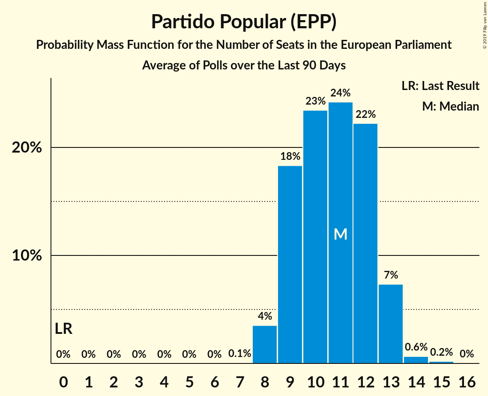

| Number of Seats | Probability | Accumulated | Special Marks |
|:---------------:|:-----------:|:-----------:|:-------------:|
| 0 | 0% | 100% | Last Result |
| 1 | 0% | 100% |  |
| 2 | 0% | 100% |  |
| 3 | 0% | 100% |  |
| 4 | 0% | 100% |  |
| 5 | 0% | 100% |  |
| 6 | 0% | 100% |  |
| 7 | 0.1% | 100% |  |
| 8 | 4% | 99.9% |  |
| 9 | 18% | 96% |  |
| 10 | 23% | 78% |  |
| 11 | 24% | 55% | Median |
| 12 | 22% | 30% |  |
| 13 | 7% | 8% |  |
| 14 | 0.6% | 0.9% |  |
| 15 | 0.2% | 0.2% |  |
| 16 | 0% | 0% |  |

### Partido Socialista Obrero Español (S&D)

*For a full overview of the results for this party, see the [Partido Socialista Obrero Español (S&D)](party-partidosocialistaobreroespañolsd.html) page.*

| Number of Seats | Probability | Accumulated | Special Marks |
|:---------------:|:-----------:|:-----------:|:-------------:|
| 0 | 0% | 100% | Last Result |
| 1 | 0% | 100% |  |
| 2 | 0% | 100% |  |
| 3 | 0% | 100% |  |
| 4 | 0% | 100% |  |
| 5 | 0% | 100% |  |
| 6 | 0% | 100% |  |
| 7 | 0% | 100% |  |
| 8 | 0% | 100% |  |
| 9 | 0% | 100% |  |
| 10 | 0% | 100% |  |
| 11 | 0% | 100% |  |
| 12 | 0% | 100% |  |
| 13 | 0% | 100% |  |
| 14 | 0.1% | 100% |  |
| 15 | 1.3% | 99.9% |  |
| 16 | 10% | 98.6% |  |
| 17 | 31% | 88% |  |
| 18 | 28% | 57% | Median |
| 19 | 15% | 30% |  |
| 20 | 10% | 15% |  |
| 21 | 4% | 4% |  |
| 22 | 0.5% | 0.5% |  |
| 23 | 0% | 0% |  |

### Unidos Podemos (GUE/NGL)

*For a full overview of the results for this party, see the [Unidos Podemos (GUE/NGL)](party-unidospodemosguengl.html) page.*

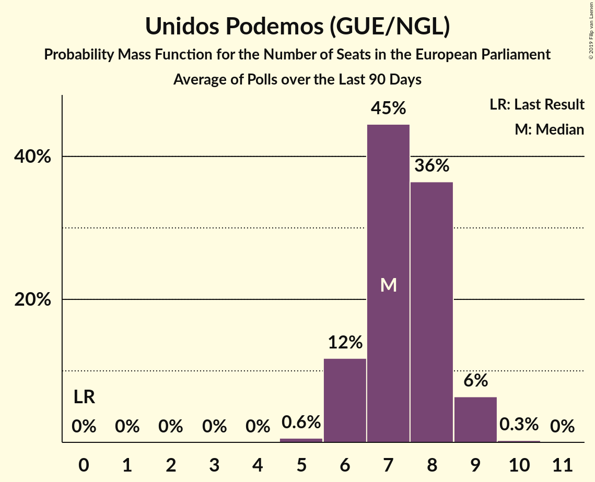

| Number of Seats | Probability | Accumulated | Special Marks |
|:---------------:|:-----------:|:-----------:|:-------------:|
| 0 | 0% | 100% | Last Result |
| 1 | 0% | 100% |  |
| 2 | 0% | 100% |  |
| 3 | 0% | 100% |  |
| 4 | 0% | 100% |  |
| 5 | 0.6% | 100% |  |
| 6 | 12% | 99.4% |  |
| 7 | 45% | 88% | Median |
| 8 | 36% | 43% |  |
| 9 | 6% | 7% |  |
| 10 | 0.3% | 0.3% |  |
| 11 | 0% | 0% |  |

### Ciudadanos–Partido de la Ciudadanía (RE)

*For a full overview of the results for this party, see the [Ciudadanos–Partido de la Ciudadanía (RE)](party-ciudadanos–partidodelaciudadaníare.html) page.*

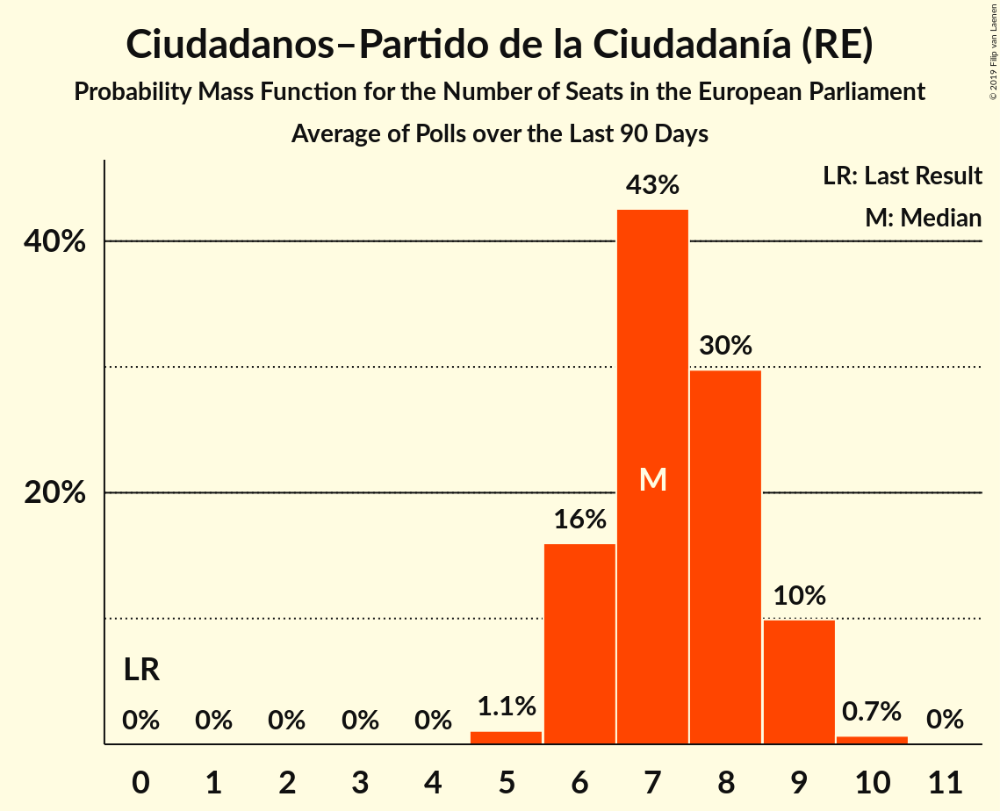

| Number of Seats | Probability | Accumulated | Special Marks |
|:---------------:|:-----------:|:-----------:|:-------------:|
| 0 | 0% | 100% | Last Result |
| 1 | 0% | 100% |  |
| 2 | 0% | 100% |  |
| 3 | 0% | 100% |  |
| 4 | 0% | 100% |  |
| 5 | 1.1% | 100% |  |
| 6 | 16% | 98.9% |  |
| 7 | 43% | 83% | Median |
| 8 | 30% | 40% |  |
| 9 | 10% | 11% |  |
| 10 | 0.7% | 0.7% |  |
| 11 | 0% | 0% |  |

### Esquerra Republicana de Catalunya–Catalunya Sí (Greens/EFA)

*For a full overview of the results for this party, see the [Esquerra Republicana de Catalunya–Catalunya Sí (Greens/EFA)](party-esquerrarepublicanadecatalunya–catalunyasígreensefa.html) page.*

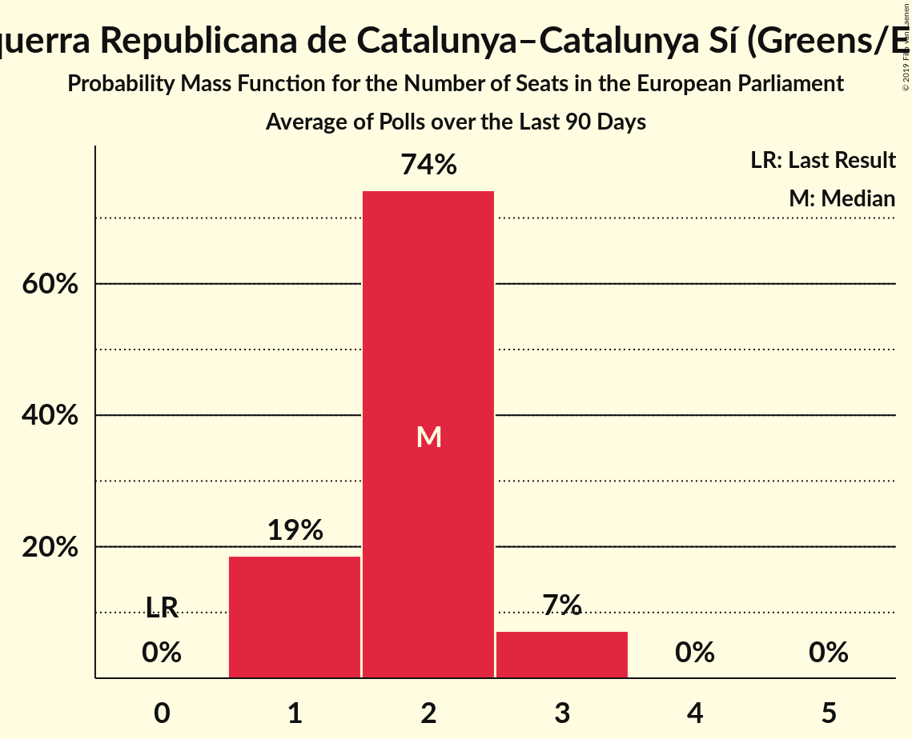

| Number of Seats | Probability | Accumulated | Special Marks |
|:---------------:|:-----------:|:-----------:|:-------------:|
| 0 | 0% | 100% | Last Result |
| 1 | 19% | 100% |  |
| 2 | 74% | 81% | Median |
| 3 | 7% | 7% |  |
| 4 | 0% | 0% |  |

### Partit Demòcrata Europeu Català (NI)

*For a full overview of the results for this party, see the [Partit Demòcrata Europeu Català (NI)](party-partitdemòcrataeuropeucatalàni.html) page.*

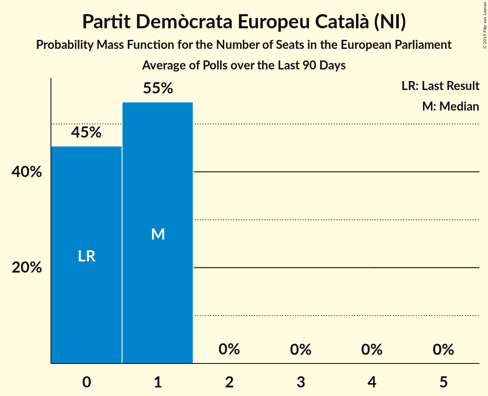

| Number of Seats | Probability | Accumulated | Special Marks |
|:---------------:|:-----------:|:-----------:|:-------------:|
| 0 | 45% | 100% | Last Result |
| 1 | 55% | 55% | Median |
| 2 | 0% | 0% |  |

### Euzko Alderdi Jeltzalea/Partido Nacionalista Vasco (RE)

*For a full overview of the results for this party, see the [Euzko Alderdi Jeltzalea/Partido Nacionalista Vasco (RE)](party-euzkoalderdijeltzaleapartidonacionalistavascore.html) page.*

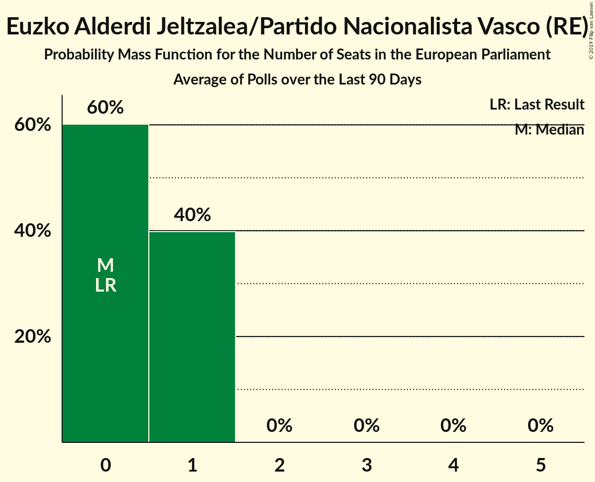

| Number of Seats | Probability | Accumulated | Special Marks |
|:---------------:|:-----------:|:-----------:|:-------------:|
| 0 | 60% | 100% | Last Result, Median |
| 1 | 40% | 40% |  |
| 2 | 0% | 0% |  |

### Euskal Herria Bildu (GUE/NGL)

*For a full overview of the results for this party, see the [Euskal Herria Bildu (GUE/NGL)](party-euskalherriabilduguengl.html) page.*

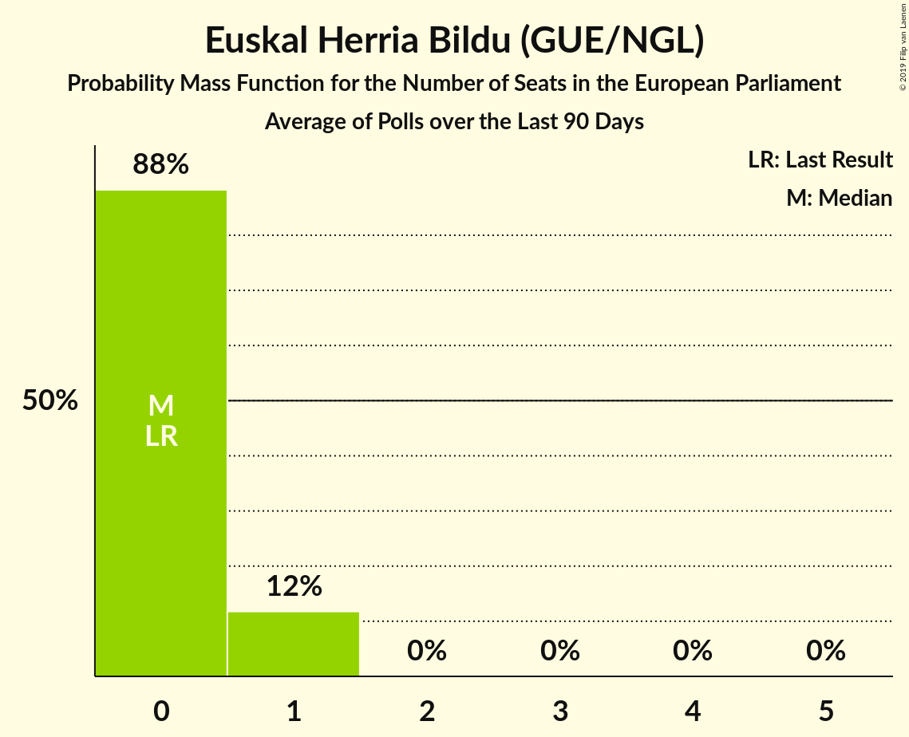

| Number of Seats | Probability | Accumulated | Special Marks |
|:---------------:|:-----------:|:-----------:|:-------------:|
| 0 | 88% | 100% | Last Result, Median |
| 1 | 12% | 12% |  |
| 2 | 0% | 0% |  |

### Coalición Canaria–Partido Nacionalista Canario (RE)

*For a full overview of the results for this party, see the [Coalición Canaria–Partido Nacionalista Canario (RE)](party-coalicióncanaria–partidonacionalistacanariore.html) page.*

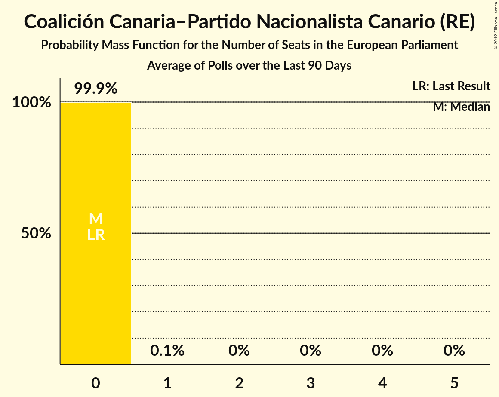

| Number of Seats | Probability | Accumulated | Special Marks |
|:---------------:|:-----------:|:-----------:|:-------------:|
| 0 | 99.9% | 100% | Last Result, Median |
| 1 | 0.1% | 0.1% |  |
| 2 | 0% | 0% |  |

### Vox (ECR)

*For a full overview of the results for this party, see the [Vox (ECR)](party-voxecr.html) page.*

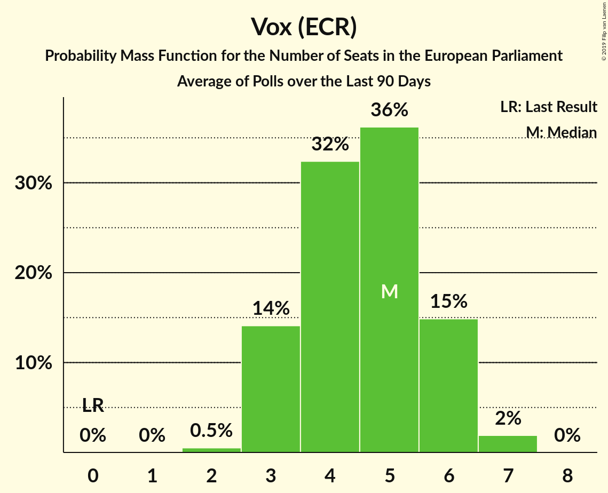

| Number of Seats | Probability | Accumulated | Special Marks |
|:---------------:|:-----------:|:-----------:|:-------------:|
| 0 | 0% | 100% | Last Result |
| 1 | 0% | 100% |  |
| 2 | 0.5% | 100% |  |
| 3 | 14% | 99.5% |  |
| 4 | 32% | 85% |  |
| 5 | 36% | 53% | Median |
| 6 | 15% | 17% |  |
| 7 | 2% | 2% |  |
| 8 | 0% | 0% |  |

### Coalició Compromís (Greens/EFA)

*For a full overview of the results for this party, see the [Coalició Compromís (Greens/EFA)](party-coaliciócompromísgreensefa.html) page.*

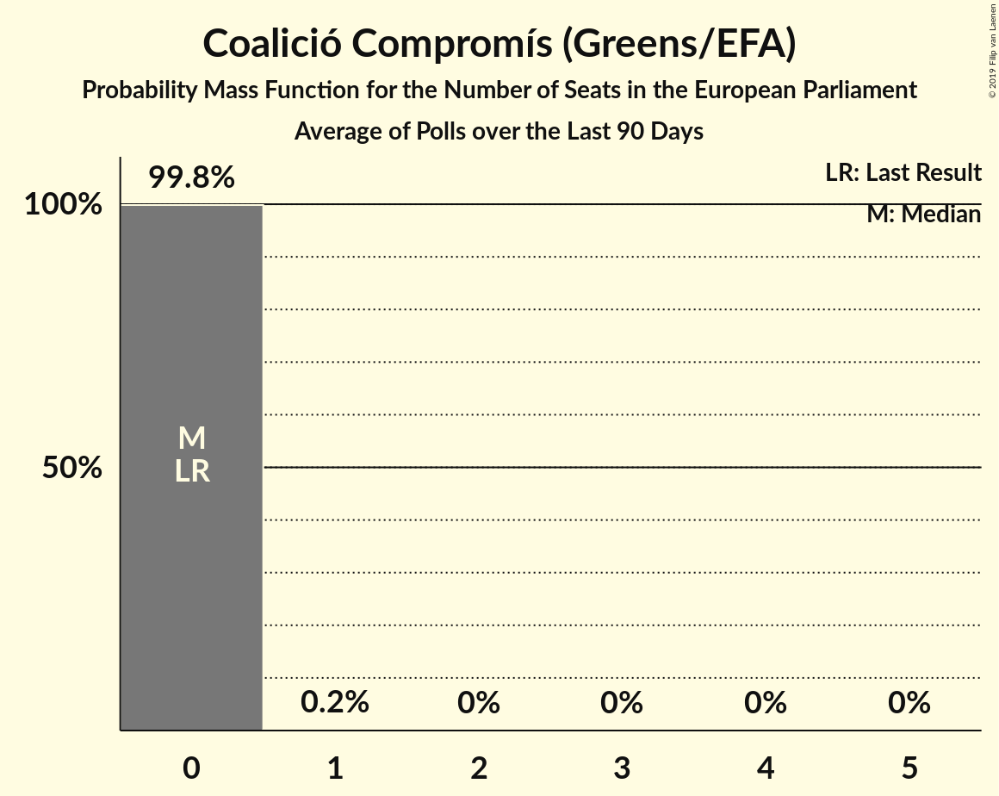

| Number of Seats | Probability | Accumulated | Special Marks |
|:---------------:|:-----------:|:-----------:|:-------------:|
| 0 | 99.8% | 100% | Last Result, Median |
| 1 | 0.2% | 0.2% |  |
| 2 | 0% | 0% |  |

## Coalitions

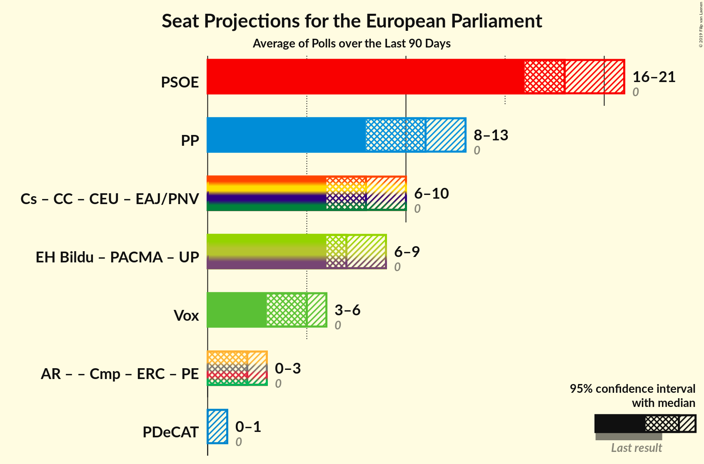

### Confidence Intervals

| Coalition | Last Result | Median | Majority? | 80% Confidence Interval | 90% Confidence Interval | 95% Confidence Interval | 99% Confidence Interval |
|:---------:|:-----------:|:------:|:---------:|:-----------------------:|:-----------------------:|:-----------------------:|:-----------------------:|
| Partido Socialista Obrero Español (S&D) | 0 | 18 | 0% | 16–20 | 16–20 | 16–21 | 15–21 |
| Partido Popular (EPP) | 0 | 11 | 0% | 9–12 | 9–13 | 8–13 | 8–14 |
| Ciudadanos–Partido de la Ciudadanía (RE) – Coalición Canaria–Partido Nacionalista Canario (RE) – Coalición por Europa (RE) – Euzko Alderdi Jeltzalea/Partido Nacionalista Vasco (RE) | 0 | 8 | 0% | 6–9 | 6–9 | 6–10 | 5–10 |
| Euskal Herria Bildu (GUE/NGL) – Partido Animalista Contra el Maltrato Animal (GUE/NGL) – Unidos Podemos (GUE/NGL) | 0 | 7 | 0% | 6–8 | 6–9 | 6–9 | 5–9 |
| Vox (ECR) | 0 | 5 | 0% | 3–6 | 3–6 | 3–6 | 2–7 |
| Partit Demòcrata Europeu Català (NI) | 0 | 0 | 0% | 0–1 | 0–1 | 0–1 | 0–1 |

### Partido Socialista Obrero Español (S&D)

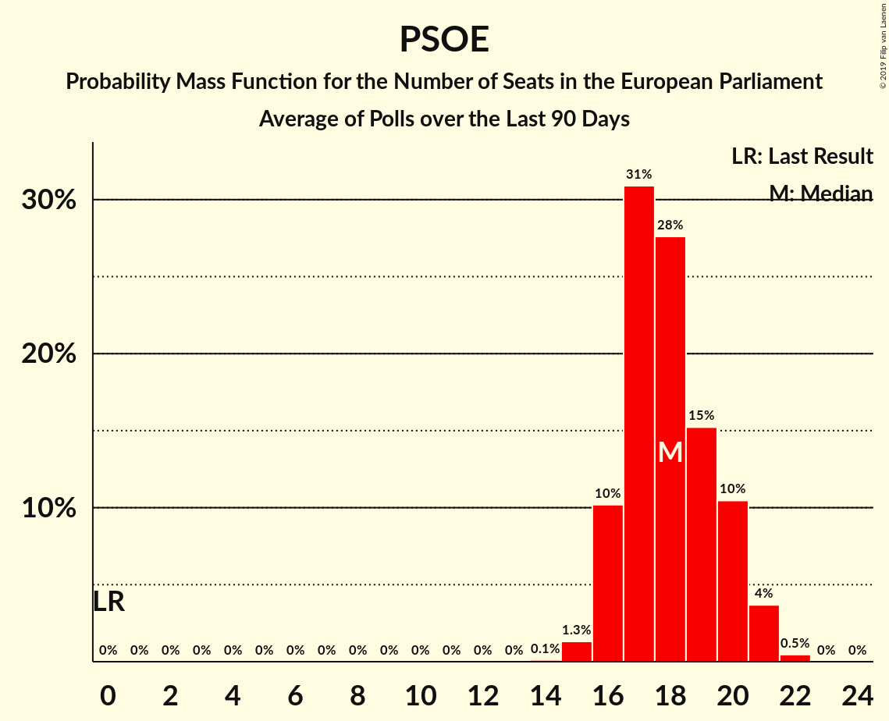

| Number of Seats | Probability | Accumulated | Special Marks |
|:---------------:|:-----------:|:-----------:|:-------------:|
| 0 | 0% | 100% | Last Result |
| 1 | 0% | 100% |  |
| 2 | 0% | 100% |  |
| 3 | 0% | 100% |  |
| 4 | 0% | 100% |  |
| 5 | 0% | 100% |  |
| 6 | 0% | 100% |  |
| 7 | 0% | 100% |  |
| 8 | 0% | 100% |  |
| 9 | 0% | 100% |  |
| 10 | 0% | 100% |  |
| 11 | 0% | 100% |  |
| 12 | 0% | 100% |  |
| 13 | 0% | 100% |  |
| 14 | 0.1% | 100% |  |
| 15 | 1.3% | 99.9% |  |
| 16 | 10% | 98.6% |  |
| 17 | 31% | 88% |  |
| 18 | 28% | 57% | Median |
| 19 | 15% | 30% |  |
| 20 | 10% | 15% |  |
| 21 | 4% | 4% |  |
| 22 | 0.5% | 0.5% |  |
| 23 | 0% | 0% |  |

### Partido Popular (EPP)

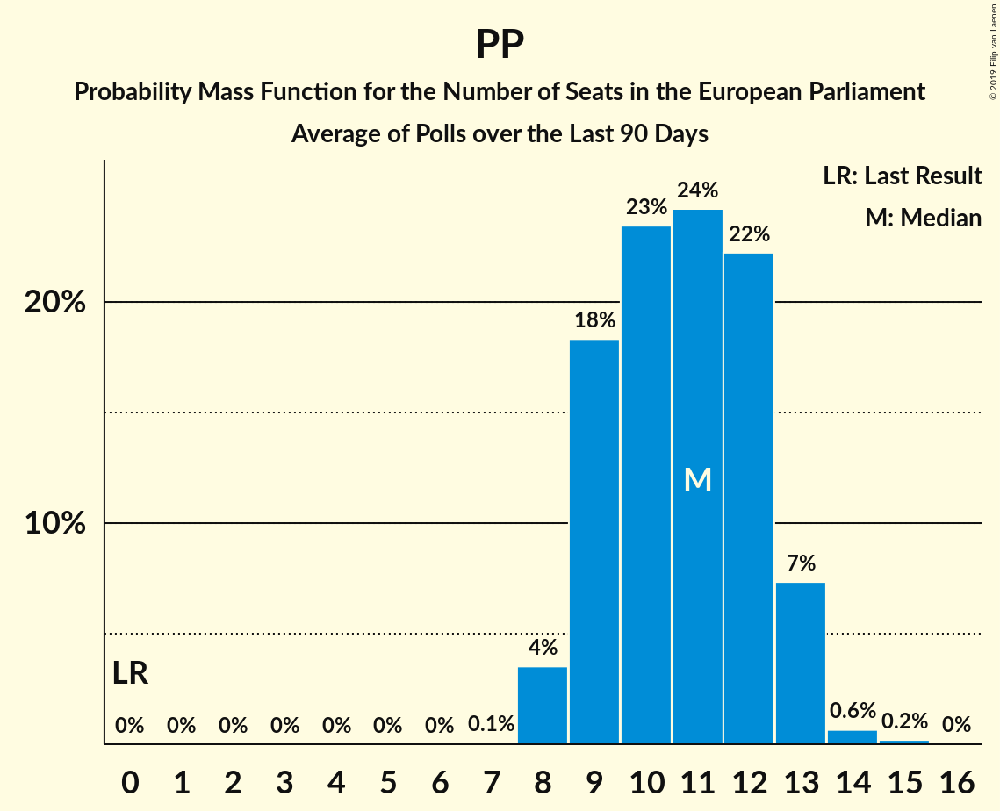

| Number of Seats | Probability | Accumulated | Special Marks |
|:---------------:|:-----------:|:-----------:|:-------------:|
| 0 | 0% | 100% | Last Result |
| 1 | 0% | 100% |  |
| 2 | 0% | 100% |  |
| 3 | 0% | 100% |  |
| 4 | 0% | 100% |  |
| 5 | 0% | 100% |  |
| 6 | 0% | 100% |  |
| 7 | 0.1% | 100% |  |
| 8 | 4% | 99.9% |  |
| 9 | 18% | 96% |  |
| 10 | 23% | 78% |  |
| 11 | 24% | 55% | Median |
| 12 | 22% | 30% |  |
| 13 | 7% | 8% |  |
| 14 | 0.6% | 0.9% |  |
| 15 | 0.2% | 0.2% |  |
| 16 | 0% | 0% |  |

### Ciudadanos–Partido de la Ciudadanía (RE) – Coalición Canaria–Partido Nacionalista Canario (RE) – Coalición por Europa (RE) – Euzko Alderdi Jeltzalea/Partido Nacionalista Vasco (RE)

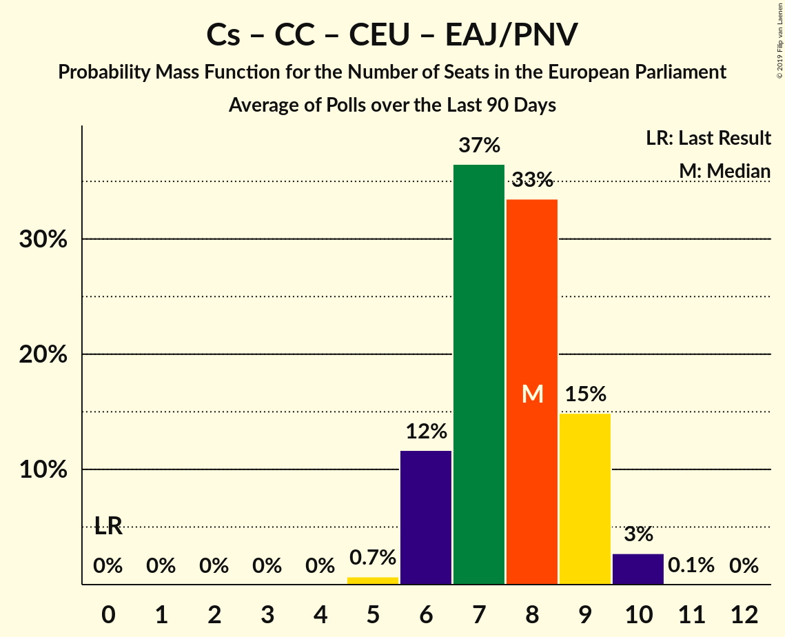

| Number of Seats | Probability | Accumulated | Special Marks |
|:---------------:|:-----------:|:-----------:|:-------------:|
| 0 | 0% | 100% | Last Result |
| 1 | 0% | 100% |  |
| 2 | 0% | 100% |  |
| 3 | 0% | 100% |  |
| 4 | 0% | 100% |  |
| 5 | 0.7% | 100% |  |
| 6 | 12% | 99.3% |  |
| 7 | 37% | 88% | Median |
| 8 | 33% | 51% |  |
| 9 | 15% | 18% |  |
| 10 | 3% | 3% |  |
| 11 | 0.1% | 0.1% |  |
| 12 | 0% | 0% |  |

### Euskal Herria Bildu (GUE/NGL) – Partido Animalista Contra el Maltrato Animal (GUE/NGL) – Unidos Podemos (GUE/NGL)

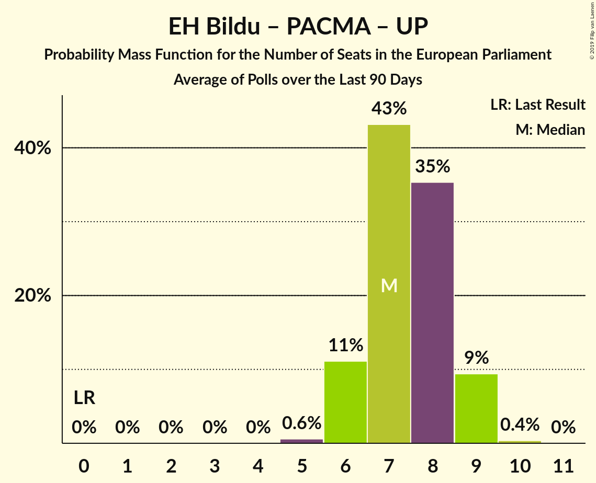

| Number of Seats | Probability | Accumulated | Special Marks |
|:---------------:|:-----------:|:-----------:|:-------------:|
| 0 | 0% | 100% | Last Result |
| 1 | 0% | 100% |  |
| 2 | 0% | 100% |  |
| 3 | 0% | 100% |  |
| 4 | 0% | 100% |  |
| 5 | 0.6% | 100% |  |
| 6 | 11% | 99.4% |  |
| 7 | 43% | 88% | Median |
| 8 | 35% | 45% |  |
| 9 | 9% | 10% |  |
| 10 | 0.4% | 0.4% |  |
| 11 | 0% | 0% |  |

### Vox (ECR)

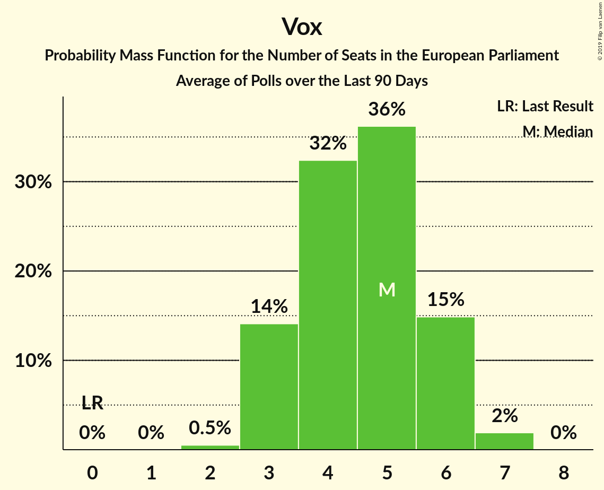

| Number of Seats | Probability | Accumulated | Special Marks |
|:---------------:|:-----------:|:-----------:|:-------------:|
| 0 | 0% | 100% | Last Result |
| 1 | 0% | 100% |  |
| 2 | 0.5% | 100% |  |
| 3 | 14% | 99.5% |  |
| 4 | 32% | 85% |  |
| 5 | 36% | 53% | Median |
| 6 | 15% | 17% |  |
| 7 | 2% | 2% |  |
| 8 | 0% | 0% |  |

### Partit Demòcrata Europeu Català (NI)

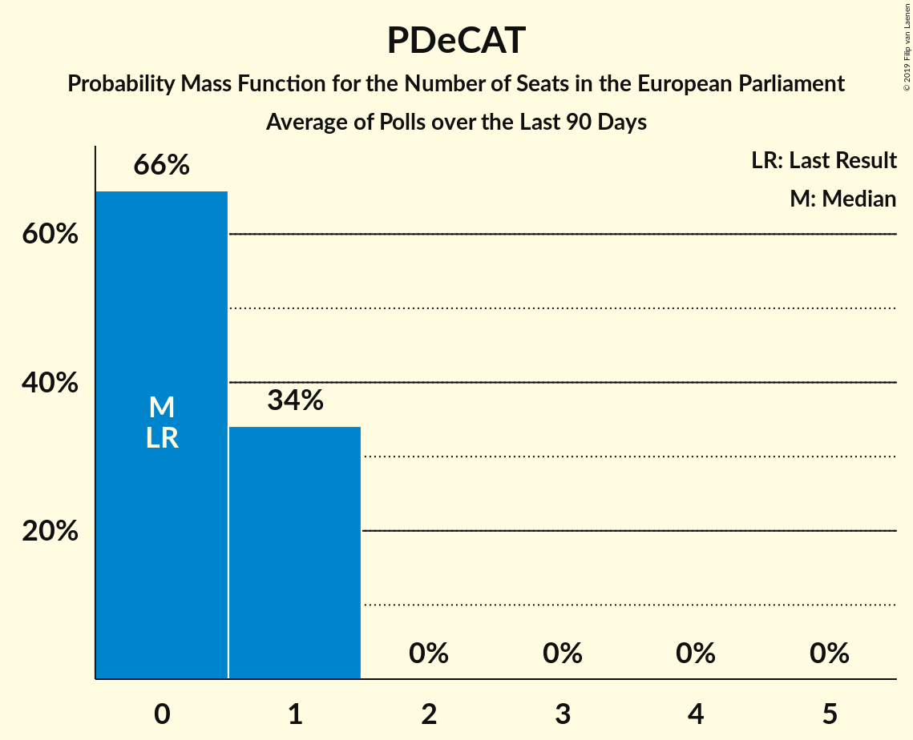

| Number of Seats | Probability | Accumulated | Special Marks |
|:---------------:|:-----------:|:-----------:|:-------------:|
| 0 | 66% | 100% | Last Result |
| 1 | 34% | 34% | Median |
| 2 | 0% | 0% |  |

## Technical Information

+ **Number of polls included in this average:** 8
+ **Lowest number of simulations done in a poll included in this average:** 1,048,576
+ **Total number of simulations done in the polls included in this average:** 8,388,608
+ **Error estimate:** 2.65%
