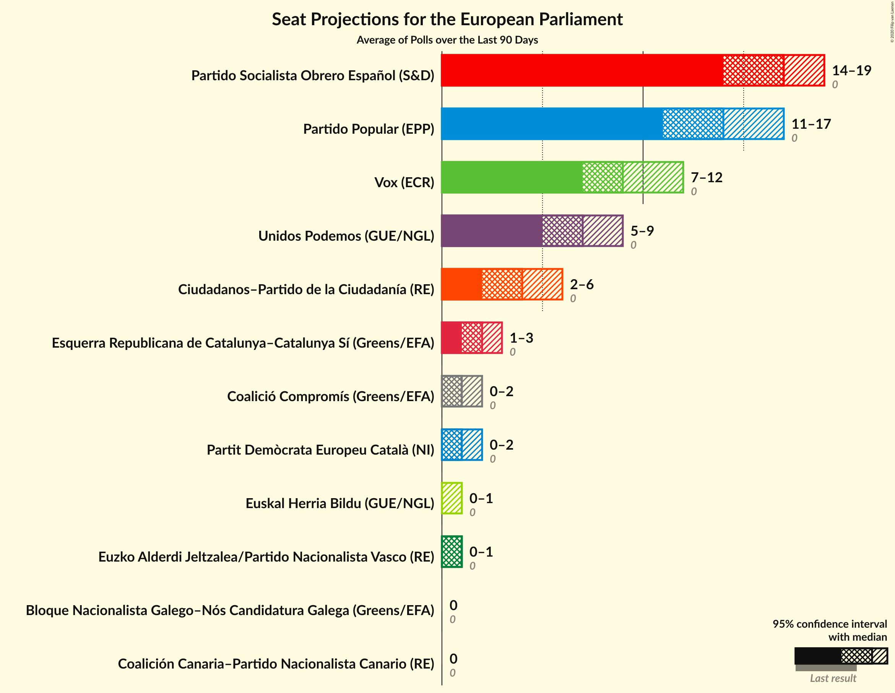
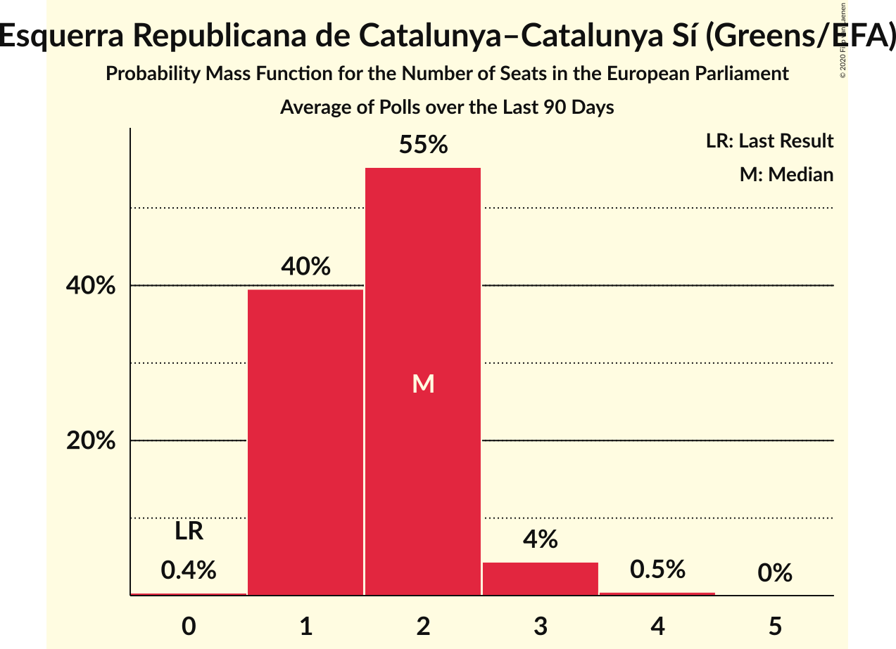
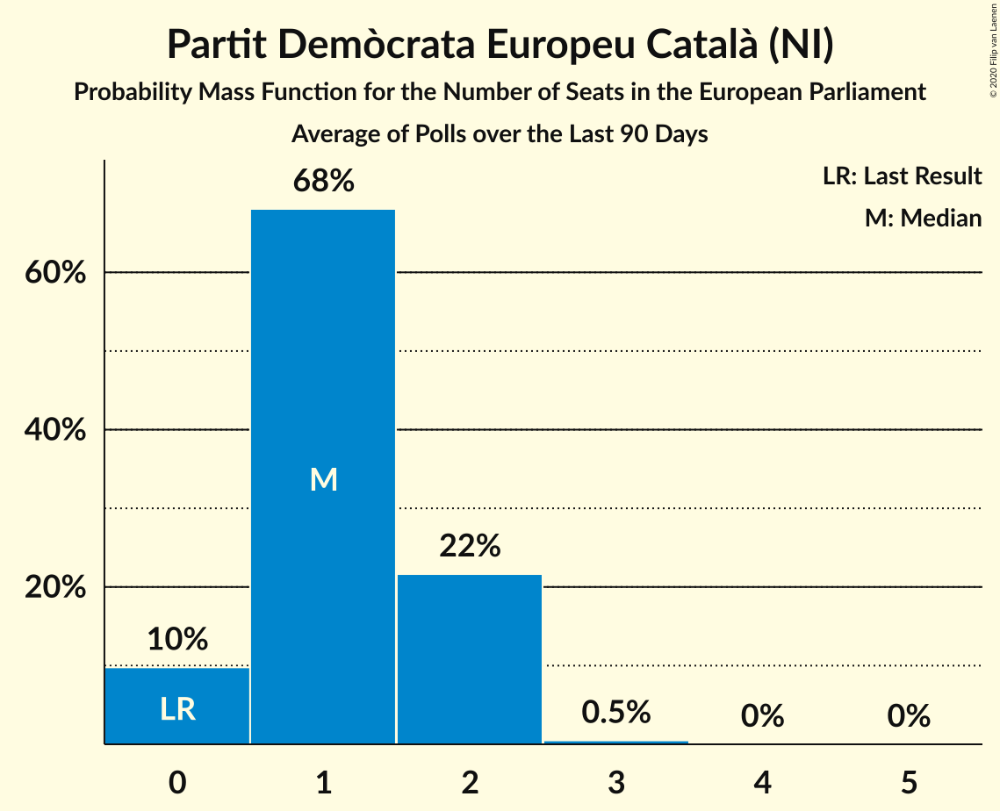
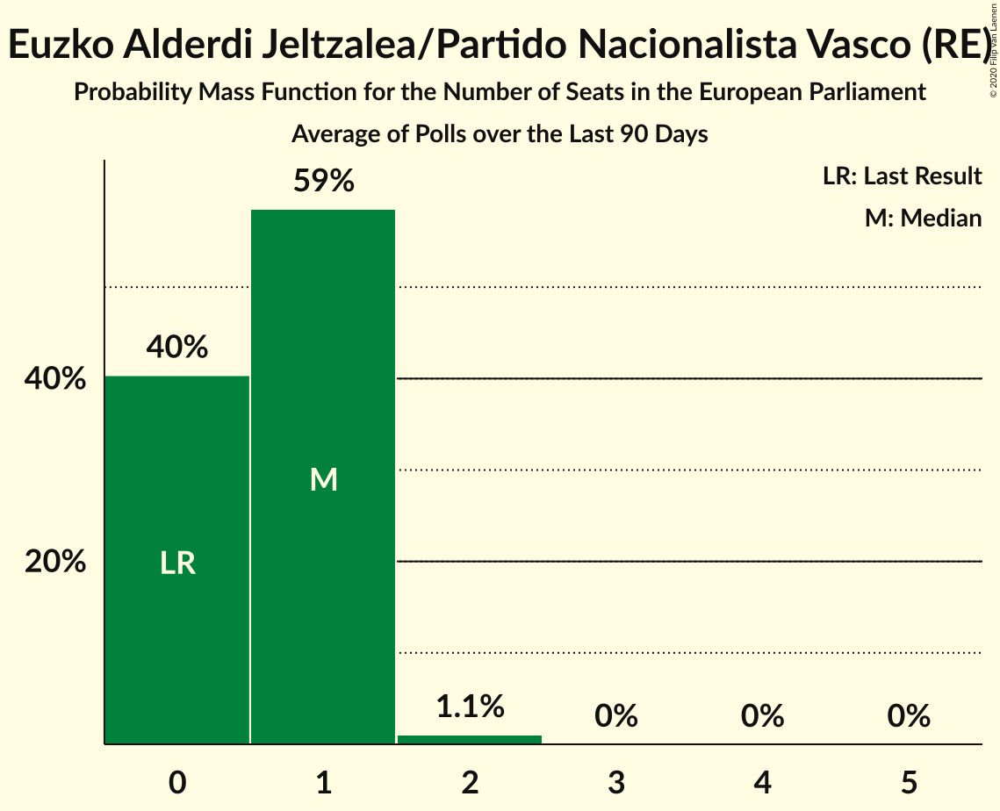
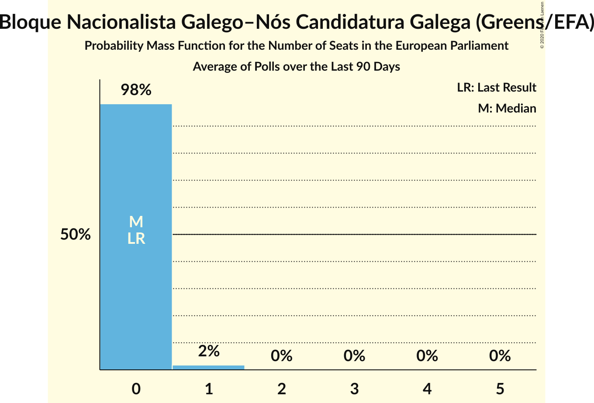
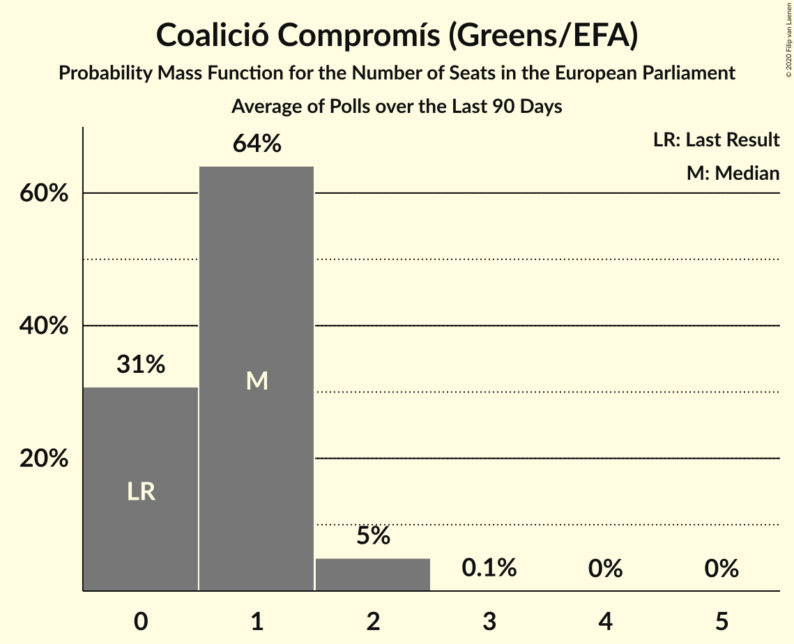
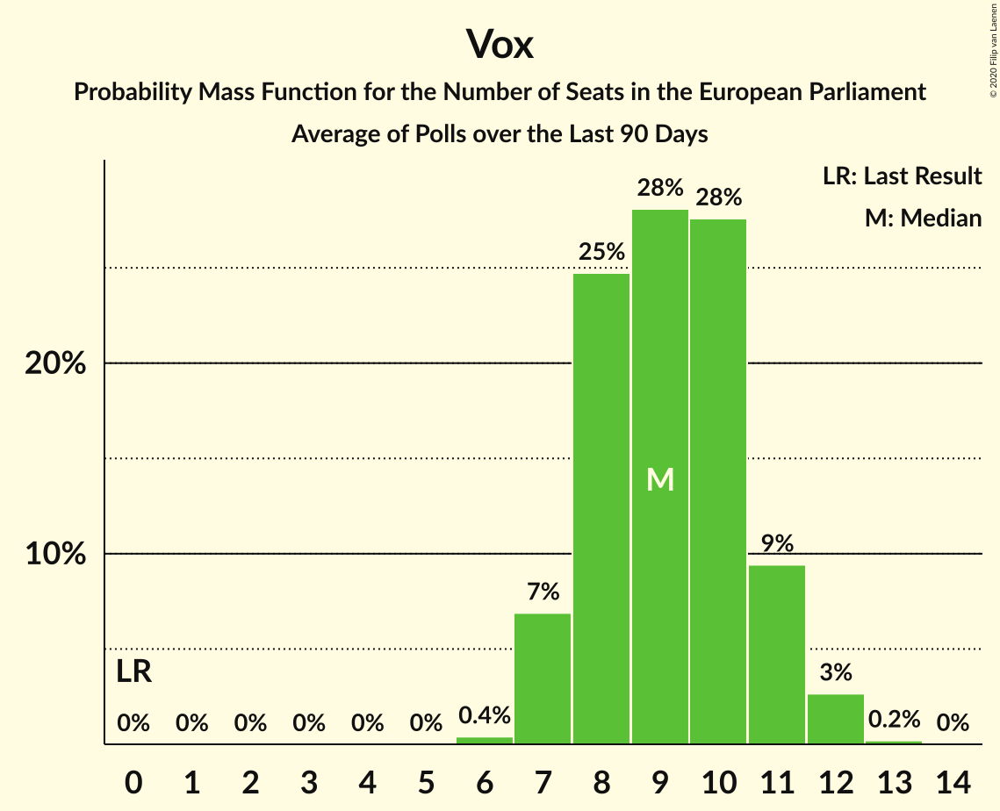
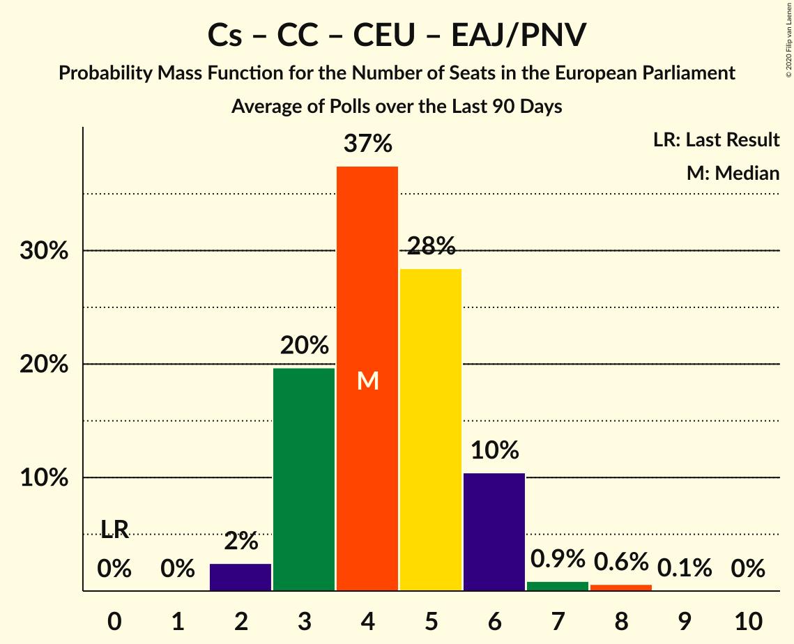
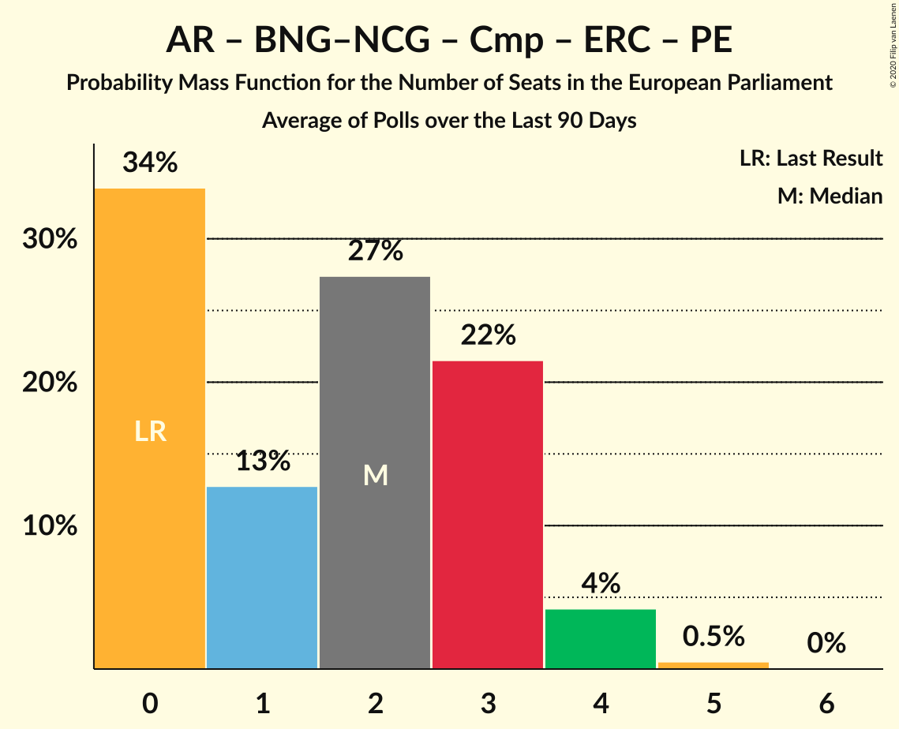

# Poll Average

<a href="#voting-intentions">Voting Intentions</a> | <a href="#seats">Seats</a> | <a href="#coalitions">Coalitions</a> | <a href="#technical-information">Technical Information</a>

## Summary

The table below lists the polls on which the average is based. They are the most recent polls (less than 90 days old) registered and analyzed so far.

| Period     | Polling firm/Commissioner(s) | PP | PSOE | UP | Cs | ERC | PDeCAT | EAJ/PNV | PACMA | EH Bildu | CC | Vox | BNG | BNG–NCG | AR | CEU | PE | Cmp |
|:----------:|:----------------------------:|:--:|:--:|:--:|:--:|:--:|:--:|:--:|:--:|:--:|:--:|:--:|:--:|:--:|:--:|:--:|:--:|:--:|
| 26 May 2019 | General Election | 0.0%   0 | 0.0%   0 | 0.0%   0 | 0.0%   0 | 0.0%   0 | 0.0%   0 | 0.0%   0 | 0.0%   0 | 0.0%   0 | 0.0%   0 | 0.0%   0 | 0.0%   0 | 0.0%   0 | 0.0%   0 | 0.0%   0 | 0.0%   0 | 0.0%   0 |
| N/A | Poll Average | 19–27%   11–17 | 24–31%   14–19 | 9–15%   5–9 | 5–10%   2–6 | 2–5%   1–3 | 1–4%   0–2 | 1–3%   0–1 | N/A   N/A | 1–2%   0–1 | 0–2%   0 | 12–19%   7–12 | N/A   N/A | 0–1%   0 | N/A   N/A | N/A   N/A | N/A   N/A | 1–4%   0–2 |
| [22–25 September 2020](2020-09-25-electoPanel.html) | electoPanel   electomania.es | 18–22%   11–14 | 25–30%   16–19 | 9–13%   6–8 | 7–10%   4–6 | 3–4%   1–3 | 2–4%   1–2 | 1–2%   0–1 | N/A   N/A | 1–2%   0–1 | 0–1%   0 | 15–19%   9–12 | N/A   N/A | 0–1%   0 | N/A   N/A | N/A   N/A | N/A   N/A | 2–3%   1–2 |
| [16–20 September 2020](2020-09-20-DYM.html) | DYM   Henneo | 21–27%   13–16 | 23–29%   14–17 | 9–13%   5–7 | 7–11%   4–6 | N/A   N/A | N/A   N/A | N/A   N/A | N/A   N/A | N/A   N/A | N/A   N/A | 12–16%   7–9 | N/A   N/A | N/A   N/A | N/A   N/A | N/A   N/A | N/A   N/A | N/A   N/A |
| [15–19 September 2020](2020-09-19-NCReport.html) | NC Report   La Razón | 21–28%   13–17 | 23–30%   14–19 | 9–14%   5–9 | 5–8%   2–5 | 2–5%   1–3 | 2–4%   1–2 | 1–3%   0–1 | N/A   N/A | 1–2%   0–1 | N/A   N/A | 13–18%   8–11 | N/A   N/A | N/A   N/A | N/A   N/A | N/A   N/A | N/A   N/A | 1–4%   0–2 |
| [17–19 September 2020](2020-09-19-DemoscopiayServicios.html) | Demoscopia y Servicios   ESdiario | 21–26%   13–17 | 23–29%   15–18 | 11–15%   7–9 | 5–8%   3–5 | 2–4%   1–2 | 2–4%   1–2 | 1–2%   0–1 | N/A   N/A | 1–2%   0–1 | 0–1%   0 | 13–18%   8–11 | N/A   N/A | 0–1%   0–1 | N/A   N/A | N/A   N/A | N/A   N/A | 1–3%   0–1 |
| [18 September 2020](2020-09-18-KeyData.html) | Key Data   Público | 19–28%   11–17 | 23–33%   14–20 | 8–15%   5–9 | 5–11%   3–7 | 2–6%   1–4 | 1–5%   0–2 | 1–3%   0–2 | N/A   N/A | 0–3%   0–2 | 0–2%   0–1 | 11–19%   7–11 | N/A   N/A | N/A   N/A | N/A   N/A | N/A   N/A | N/A   N/A | 1–4%   0–2 |
| [17 September 2020](2020-09-17-Metroscopia.html) | Metroscopia | 18–24%   11–15 | 25–32%   15–19 | 8–13%   5–7 | 4–8%   2–4 | 2–4%   1–2 | N/A   N/A | N/A   N/A | N/A   N/A | N/A   N/A | N/A   N/A | 15–21%   9–12 | N/A   N/A | N/A   N/A | N/A   N/A | N/A   N/A | N/A   N/A | N/A   N/A |
| [1–11 September 2020](2020-09-11-SimpleLógica.html) | Simple Lógica | 19–25%   11–15 | 25–32%   15–19 | 10–15%   6–9 | 5–8%   2–5 | N/A   N/A | N/A   N/A | N/A   N/A | N/A   N/A | N/A   N/A | N/A   N/A | 13–19%   8–11 | N/A   N/A | N/A   N/A | N/A   N/A | N/A   N/A | N/A   N/A | N/A   N/A |
| [7–11 September 2020](2020-09-11-Invymark.html) | Invymark   laSexta | 20–25%   12–15 | 26–31%   15–19 | 9–13%   5–8 | 6–9%   3–5 | N/A   N/A | N/A   N/A | N/A   N/A | N/A   N/A | N/A   N/A | N/A   N/A | 12–17%   7–10 | N/A   N/A | N/A   N/A | N/A   N/A | N/A   N/A | N/A   N/A | N/A   N/A |
| [6 September 2020](2020-09-06-SigmaDos.html) | Sigma Dos   Antena 3 | 23–28%   14–17 | 26–32%   16–20 | 10–14%   6–9 | 5–8%   3–5 | 2–5%   1–2 | 1–3%   0–1 | 1–3%   0–1 | N/A   N/A | N/A   N/A | N/A   N/A | 12–16%   7–10 | N/A   N/A | N/A   N/A | N/A   N/A | N/A   N/A | N/A   N/A | 0–2%   0–1 |
| 26 May 2019 | General Election | 0.0%   0 | 0.0%   0 | 0.0%   0 | 0.0%   0 | 0.0%   0 | 0.0%   0 | 0.0%   0 | 0.0%   0 | 0.0%   0 | 0.0%   0 | 0.0%   0 | 0.0%   0 | 0.0%   0 | 0.0%   0 | 0.0%   0 | 0.0%   0 | 0.0%   0 |

Only polls for which at least the sample size has been published are included in the table above.

**Legend:**
+ **Top half of each row:** Voting intentions (95% confidence interval)
+ **Bottom half of each row:** Seat projections for the European Parliament (95% confidence interval)
+ **PP:** Partido Popular (EPP)
+ **PSOE:** Partido Socialista Obrero Español (S&D)
+ **UP:** Unidos Podemos (GUE/NGL)
+ **Cs:** Ciudadanos–Partido de la Ciudadanía (RE)
+ **ERC:** Esquerra Republicana de Catalunya–Catalunya Sí (Greens/EFA)
+ **PDeCAT:** Partit Demòcrata Europeu Català (NI)
+ **EAJ/PNV:** Euzko Alderdi Jeltzalea/Partido Nacionalista Vasco (RE)
+ **PACMA:** Partido Animalista Contra el Maltrato Animal (GUE/NGL)
+ **EH Bildu:** Euskal Herria Bildu (GUE/NGL)
+ **CC:** Coalición Canaria–Partido Nacionalista Canario (RE)
+ **Vox:** Vox (ECR)
+ **BNG:** Bloque Nacionalista Galego (Greens/EFA)
+ **BNG–NCG:** Bloque Nacionalista Galego–Nós Candidatura Galega (Greens/EFA)
+ **AR:** Ahora Repúblicas (Greens/EFA)
+ **CEU:** Coalición por Europa (RE)
+ **PE:** Primavera Europea (Greens/EFA)
+ **Cmp:** Coalició Compromís (Greens/EFA)
+ **N/A (single party):** Party not included the published results
+ **N/A (entire row):** Calculation for this opinion poll not started yet

## Voting Intentions

### Confidence Intervals

| Party | Last Result | Median | 80% Confidence Interval | 90% Confidence Interval | 95% Confidence Interval | 99% Confidence Interval |
|:-----:|:-----------:|:------:|:-----------------------:|:-----------------------:|:-----------------------:|:-----------------------:|
| <a href="#partido-popular-(epp)">Partido Popular (EPP)</a> | 0.0% | 22.9% | 20.1–25.7% |19.4–26.4% | 18.9–27.0% | 17.9–28.3% |
| <a href="#partido-socialista-obrero-español-(s&d)">Partido Socialista Obrero Español (S&D)</a> | 0.0% | 27.5% | 25.0–30.1% |24.3–30.8% | 23.8–31.4% | 22.7–32.7% |
| <a href="#unidos-podemos-(gue/ngl)">Unidos Podemos (GUE/NGL)</a> | 0.0% | 11.5% | 9.8–13.5% |9.4–14.1% | 8.9–14.6% | 8.1–15.6% |
| <a href="#ciudadanos–partido-de-la-ciudadanía-(re)">Ciudadanos–Partido de la Ciudadanía (RE)</a> | 0.0% | 7.0% | 5.4–9.0% |5.1–9.6% | 4.8–10.0% | 4.2–11.0% |
| <a href="#esquerra-republicana-de-catalunya–catalunya-sí-(greens/efa)">Esquerra Republicana de Catalunya–Catalunya Sí (Greens/EFA)</a> | 0.0% | 3.3% | 2.5–4.3% |2.2–4.7% | 2.0–5.1% | 1.7–6.1% |
| <a href="#partit-demòcrata-europeu-català-(ni)">Partit Demòcrata Europeu Català (NI)</a> | 0.0% | 2.5% | 1.6–3.4% |1.3–3.7% | 1.2–4.0% | 1.0–4.7% |
| <a href="#euzko-alderdi-jeltzalea/partido-nacionalista-vasco-(re)">Euzko Alderdi Jeltzalea/Partido Nacionalista Vasco (RE)</a> | 0.0% | 1.6% | 1.1–2.4% |1.0–2.6% | 0.8–2.9% | 0.6–3.5% |
| <a href="#partido-animalista-contra-el-maltrato-animal-(gue/ngl)">Partido Animalista Contra el Maltrato Animal (GUE/NGL)</a> | 0.0% | N/A | N/A |N/A | N/A | N/A |
| <a href="#euskal-herria-bildu-(gue/ngl)">Euskal Herria Bildu (GUE/NGL)</a> | 0.0% | 1.3% | 0.8–2.0% |0.7–2.2% | 0.6–2.5% | 0.4–3.1% |
| <a href="#coalición-canaria–partido-nacionalista-canario-(re)">Coalición Canaria–Partido Nacionalista Canario (RE)</a> | 0.0% | 0.6% | 0.3–1.1% |0.2–1.4% | 0.2–1.7% | 0.1–2.3% |
| <a href="#vox-(ecr)">Vox (ECR)</a> | 0.0% | 15.2% | 13.0–17.7% |12.5–18.4% | 12.1–19.1% | 11.2–20.3% |
| <a href="#bloque-nacionalista-galego-(greens/efa)">Bloque Nacionalista Galego (Greens/EFA)</a> | 0.0% | N/A | N/A |N/A | N/A | N/A |
| <a href="#bloque-nacionalista-galego–nós-candidatura-galega-(greens/efa)">Bloque Nacionalista Galego–Nós Candidatura Galega (Greens/EFA)</a> | 0.0% | 0.6% | 0.4–1.0% |0.3–1.1% | 0.3–1.2% | 0.2–1.5% |
| <a href="#ahora-repúblicas-(greens/efa)">Ahora Repúblicas (Greens/EFA)</a> | 0.0% | N/A | N/A |N/A | N/A | N/A |
| <a href="#coalición-por-europa-(re)">Coalición por Europa (RE)</a> | 0.0% | N/A | N/A |N/A | N/A | N/A |
| <a href="#primavera-europea-(greens/efa)">Primavera Europea (Greens/EFA)</a> | 0.0% | N/A | N/A |N/A | N/A | N/A |
| <a href="#coalició-compromís-(greens/efa)">Coalició Compromís (Greens/EFA)</a> | 0.0% | 1.9% | 0.9–2.9% |0.8–3.2% | 0.6–3.5% | 0.5–4.2% |

### Partido Popular (EPP)

*For a full overview of the results for this party, see the [Partido Popular (EPP)](party-partidopopularepp.html) page.*

| Voting Intentions | Probability | Accumulated | Special Marks |
|:-----------------:|:-----------:|:-----------:|:-------------:|
| 0.0–0.5% | 0% | 100% | Last Result |
| 0.5–1.5% | 0% | 100% |  |
| 1.5–2.5% | 0% | 100% |  |
| 2.5–3.5% | 0% | 100% |  |
| 3.5–4.5% | 0% | 100% |  |
| 4.5–5.5% | 0% | 100% |  |
| 5.5–6.5% | 0% | 100% |  |
| 6.5–7.5% | 0% | 100% |  |
| 7.5–8.5% | 0% | 100% |  |
| 8.5–9.5% | 0% | 100% |  |
| 9.5–10.5% | 0% | 100% |  |
| 10.5–11.5% | 0% | 100% |  |
| 11.5–12.5% | 0% | 100% |  |
| 12.5–13.5% | 0% | 100% |  |
| 13.5–14.5% | 0% | 100% |  |
| 14.5–15.5% | 0% | 100% |  |
| 15.5–16.5% | 0% | 100% |  |
| 16.5–17.5% | 0.2% | 100% |  |
| 17.5–18.5% | 1.2% | 99.8% |  |
| 18.5–19.5% | 5% | 98.5% |  |
| 19.5–20.5% | 9% | 94% |  |
| 20.5–21.5% | 13% | 85% |  |
| 21.5–22.5% | 16% | 72% |  |
| 22.5–23.5% | 17% | 56% | Median |
| 23.5–24.5% | 16% | 39% |  |
| 24.5–25.5% | 12% | 23% |  |
| 25.5–26.5% | 7% | 11% |  |
| 26.5–27.5% | 3% | 4% |  |
| 27.5–28.5% | 1.0% | 1.3% |  |
| 28.5–29.5% | 0.3% | 0.3% |  |
| 29.5–30.5% | 0.1% | 0.1% |  |
| 30.5–31.5% | 0% | 0% |  |

### Partido Socialista Obrero Español (S&D)

*For a full overview of the results for this party, see the [Partido Socialista Obrero Español (S&D)](party-partidosocialistaobreroespañolsd.html) page.*

| Voting Intentions | Probability | Accumulated | Special Marks |
|:-----------------:|:-----------:|:-----------:|:-------------:|
| 0.0–0.5% | 0% | 100% | Last Result |
| 0.5–1.5% | 0% | 100% |  |
| 1.5–2.5% | 0% | 100% |  |
| 2.5–3.5% | 0% | 100% |  |
| 3.5–4.5% | 0% | 100% |  |
| 4.5–5.5% | 0% | 100% |  |
| 5.5–6.5% | 0% | 100% |  |
| 6.5–7.5% | 0% | 100% |  |
| 7.5–8.5% | 0% | 100% |  |
| 8.5–9.5% | 0% | 100% |  |
| 9.5–10.5% | 0% | 100% |  |
| 10.5–11.5% | 0% | 100% |  |
| 11.5–12.5% | 0% | 100% |  |
| 12.5–13.5% | 0% | 100% |  |
| 13.5–14.5% | 0% | 100% |  |
| 14.5–15.5% | 0% | 100% |  |
| 15.5–16.5% | 0% | 100% |  |
| 16.5–17.5% | 0% | 100% |  |
| 17.5–18.5% | 0% | 100% |  |
| 18.5–19.5% | 0% | 100% |  |
| 19.5–20.5% | 0% | 100% |  |
| 20.5–21.5% | 0.1% | 100% |  |
| 21.5–22.5% | 0.3% | 99.9% |  |
| 22.5–23.5% | 1.5% | 99.6% |  |
| 23.5–24.5% | 5% | 98% |  |
| 24.5–25.5% | 10% | 93% |  |
| 25.5–26.5% | 15% | 84% |  |
| 26.5–27.5% | 19% | 68% |  |
| 27.5–28.5% | 19% | 49% | Median |
| 28.5–29.5% | 15% | 31% |  |
| 29.5–30.5% | 9% | 16% |  |
| 30.5–31.5% | 4% | 7% |  |
| 31.5–32.5% | 2% | 2% |  |
| 32.5–33.5% | 0.5% | 0.6% |  |
| 33.5–34.5% | 0.1% | 0.2% |  |
| 34.5–35.5% | 0% | 0.1% |  |
| 35.5–36.5% | 0% | 0% |  |

### Unidos Podemos (GUE/NGL)

*For a full overview of the results for this party, see the [Unidos Podemos (GUE/NGL)](party-unidospodemosguengl.html) page.*

| Voting Intentions | Probability | Accumulated | Special Marks |
|:-----------------:|:-----------:|:-----------:|:-------------:|
| 0.0–0.5% | 0% | 100% | Last Result |
| 0.5–1.5% | 0% | 100% |  |
| 1.5–2.5% | 0% | 100% |  |
| 2.5–3.5% | 0% | 100% |  |
| 3.5–4.5% | 0% | 100% |  |
| 4.5–5.5% | 0% | 100% |  |
| 5.5–6.5% | 0% | 100% |  |
| 6.5–7.5% | 0.1% | 100% |  |
| 7.5–8.5% | 1.1% | 99.9% |  |
| 8.5–9.5% | 6% | 98.8% |  |
| 9.5–10.5% | 17% | 93% |  |
| 10.5–11.5% | 27% | 76% |  |
| 11.5–12.5% | 24% | 49% | Median |
| 12.5–13.5% | 15% | 25% |  |
| 13.5–14.5% | 7% | 10% |  |
| 14.5–15.5% | 2% | 3% |  |
| 15.5–16.5% | 0.5% | 0.5% |  |
| 16.5–17.5% | 0.1% | 0.1% |  |
| 17.5–18.5% | 0% | 0% |  |

### Ciudadanos–Partido de la Ciudadanía (RE)

*For a full overview of the results for this party, see the [Ciudadanos–Partido de la Ciudadanía (RE)](party-ciudadanos–partidodelaciudadaníare.html) page.*

| Voting Intentions | Probability | Accumulated | Special Marks |
|:-----------------:|:-----------:|:-----------:|:-------------:|
| 0.0–0.5% | 0% | 100% | Last Result |
| 0.5–1.5% | 0% | 100% |  |
| 1.5–2.5% | 0% | 100% |  |
| 2.5–3.5% | 0% | 100% |  |
| 3.5–4.5% | 1.4% | 100% |  |
| 4.5–5.5% | 11% | 98.5% |  |
| 5.5–6.5% | 26% | 87% |  |
| 6.5–7.5% | 25% | 61% | Median |
| 7.5–8.5% | 19% | 36% |  |
| 8.5–9.5% | 12% | 17% |  |
| 9.5–10.5% | 4% | 5% |  |
| 10.5–11.5% | 0.8% | 1.0% |  |
| 11.5–12.5% | 0.1% | 0.2% |  |
| 12.5–13.5% | 0% | 0% |  |

### Esquerra Republicana de Catalunya–Catalunya Sí (Greens/EFA)

*For a full overview of the results for this party, see the [Esquerra Republicana de Catalunya–Catalunya Sí (Greens/EFA)](party-esquerrarepublicanadecatalunya–catalunyasígreensefa.html) page.*

| Voting Intentions | Probability | Accumulated | Special Marks |
|:-----------------:|:-----------:|:-----------:|:-------------:|
| 0.0–0.5% | 0% | 100% | Last Result |
| 0.5–1.5% | 0.3% | 100% |  |
| 1.5–2.5% | 12% | 99.7% |  |
| 2.5–3.5% | 51% | 87% | Median |
| 3.5–4.5% | 30% | 37% |  |
| 4.5–5.5% | 5% | 6% |  |
| 5.5–6.5% | 1.0% | 1.2% |  |
| 6.5–7.5% | 0.2% | 0.2% |  |
| 7.5–8.5% | 0% | 0% |  |

### Partit Demòcrata Europeu Català (NI)

*For a full overview of the results for this party, see the [Partit Demòcrata Europeu Català (NI)](party-partitdemòcrataeuropeucatalàni.html) page.*

| Voting Intentions | Probability | Accumulated | Special Marks |
|:-----------------:|:-----------:|:-----------:|:-------------:|
| 0.0–0.5% | 0% | 100% | Last Result |
| 0.5–1.5% | 10% | 100% |  |
| 1.5–2.5% | 41% | 90% |  |
| 2.5–3.5% | 42% | 49% | Median |
| 3.5–4.5% | 7% | 8% |  |
| 4.5–5.5% | 0.7% | 0.7% |  |
| 5.5–6.5% | 0.1% | 0.1% |  |
| 6.5–7.5% | 0% | 0% |  |

### Euzko Alderdi Jeltzalea/Partido Nacionalista Vasco (RE)

*For a full overview of the results for this party, see the [Euzko Alderdi Jeltzalea/Partido Nacionalista Vasco (RE)](party-euzkoalderdijeltzaleapartidonacionalistavascore.html) page.*

| Voting Intentions | Probability | Accumulated | Special Marks |
|:-----------------:|:-----------:|:-----------:|:-------------:|
| 0.0–0.5% | 0.3% | 100% | Last Result |
| 0.5–1.5% | 43% | 99.7% |  |
| 1.5–2.5% | 50% | 56% | Median |
| 2.5–3.5% | 6% | 6% |  |
| 3.5–4.5% | 0.4% | 0.4% |  |
| 4.5–5.5% | 0% | 0% |  |

### Euskal Herria Bildu (GUE/NGL)

*For a full overview of the results for this party, see the [Euskal Herria Bildu (GUE/NGL)](party-euskalherriabilduguengl.html) page.*

| Voting Intentions | Probability | Accumulated | Special Marks |
|:-----------------:|:-----------:|:-----------:|:-------------:|
| 0.0–0.5% | 2% | 100% | Last Result |
| 0.5–1.5% | 68% | 98% | Median |
| 1.5–2.5% | 28% | 31% |  |
| 2.5–3.5% | 2% | 2% |  |
| 3.5–4.5% | 0.2% | 0.2% |  |
| 4.5–5.5% | 0% | 0% |  |

### Coalición Canaria–Partido Nacionalista Canario (RE)

*For a full overview of the results for this party, see the [Coalición Canaria–Partido Nacionalista Canario (RE)](party-coalicióncanaria–partidonacionalistacanariore.html) page.*

| Voting Intentions | Probability | Accumulated | Special Marks |
|:-----------------:|:-----------:|:-----------:|:-------------:|
| 0.0–0.5% | 48% | 100% | Last Result |
| 0.5–1.5% | 49% | 52% | Median |
| 1.5–2.5% | 3% | 3% |  |
| 2.5–3.5% | 0.3% | 0.3% |  |
| 3.5–4.5% | 0% | 0% |  |

### Vox (ECR)

*For a full overview of the results for this party, see the [Vox (ECR)](party-voxecr.html) page.*

| Voting Intentions | Probability | Accumulated | Special Marks |
|:-----------------:|:-----------:|:-----------:|:-------------:|
| 0.0–0.5% | 0% | 100% | Last Result |
| 0.5–1.5% | 0% | 100% |  |
| 1.5–2.5% | 0% | 100% |  |
| 2.5–3.5% | 0% | 100% |  |
| 3.5–4.5% | 0% | 100% |  |
| 4.5–5.5% | 0% | 100% |  |
| 5.5–6.5% | 0% | 100% |  |
| 6.5–7.5% | 0% | 100% |  |
| 7.5–8.5% | 0% | 100% |  |
| 8.5–9.5% | 0% | 100% |  |
| 9.5–10.5% | 0.1% | 100% |  |
| 10.5–11.5% | 0.9% | 99.9% |  |
| 11.5–12.5% | 4% | 99.0% |  |
| 12.5–13.5% | 12% | 95% |  |
| 13.5–14.5% | 19% | 82% |  |
| 14.5–15.5% | 20% | 64% | Median |
| 15.5–16.5% | 18% | 44% |  |
| 16.5–17.5% | 13% | 26% |  |
| 17.5–18.5% | 8% | 12% |  |
| 18.5–19.5% | 3% | 4% |  |
| 19.5–20.5% | 1.0% | 1.4% |  |
| 20.5–21.5% | 0.3% | 0.4% |  |
| 21.5–22.5% | 0.1% | 0.1% |  |
| 22.5–23.5% | 0% | 0% |  |

### Coalició Compromís (Greens/EFA)

*For a full overview of the results for this party, see the [Coalició Compromís (Greens/EFA)](party-coaliciócompromísgreensefa.html) page.*

| Voting Intentions | Probability | Accumulated | Special Marks |
|:-----------------:|:-----------:|:-----------:|:-------------:|
| 0.0–0.5% | 1.1% | 100% | Last Result |
| 0.5–1.5% | 32% | 98.9% |  |
| 1.5–2.5% | 46% | 67% | Median |
| 2.5–3.5% | 18% | 21% |  |
| 3.5–4.5% | 2% | 2% |  |
| 4.5–5.5% | 0.2% | 0.2% |  |
| 5.5–6.5% | 0% | 0% |  |

### Bloque Nacionalista Galego–Nós Candidatura Galega (Greens/EFA)

*For a full overview of the results for this party, see the [Bloque Nacionalista Galego–Nós Candidatura Galega (Greens/EFA)](party-bloquenacionalistagalego–nóscandidaturagalegagreensefa.html) page.*

| Voting Intentions | Probability | Accumulated | Special Marks |
|:-----------------:|:-----------:|:-----------:|:-------------:|
| 0.0–0.5% | 34% | 100% | Last Result |
| 0.5–1.5% | 66% | 66% | Median |
| 1.5–2.5% | 0.3% | 0.3% |  |
| 2.5–3.5% | 0% | 0% |  |

## Seats

### Confidence Intervals

| Party | Last Result | Median | 80% Confidence Interval | 90% Confidence Interval | 95% Confidence Interval | 99% Confidence Interval |
|:-----:|:-----------:|:------:|:-----------------------:|:-----------------------:|:-----------------------:|:-----------------------:|
| <a href="#partido-popular-(epp)">Partido Popular (EPP)</a> | 0 | 14 | 12–16 |12–16 | 11–17 | 11–18 |
| <a href="#partido-socialista-obrero-español-(s&d)">Partido Socialista Obrero Español (S&D)</a> | 0 | 17 | 15–18 |15–19 | 14–19 | 14–20 |
| <a href="#unidos-podemos-(gue/ngl)">Unidos Podemos (GUE/NGL)</a> | 0 | 7 | 6–8 |5–8 | 5–9 | 4–9 |
| <a href="#ciudadanos–partido-de-la-ciudadanía-(re)">Ciudadanos–Partido de la Ciudadanía (RE)</a> | 0 | 4 | 3–5 |3–5 | 2–6 | 2–6 |
| <a href="#esquerra-republicana-de-catalunya–catalunya-sí-(greens/efa)">Esquerra Republicana de Catalunya–Catalunya Sí (Greens/EFA)</a> | 0 | 2 | 1–2 |1–2 | 1–3 | 1–3 |
| <a href="#partit-demòcrata-europeu-català-(ni)">Partit Demòcrata Europeu Català (NI)</a> | 0 | 1 | 1–2 |0–2 | 0–2 | 0–3 |
| <a href="#euzko-alderdi-jeltzalea/partido-nacionalista-vasco-(re)">Euzko Alderdi Jeltzalea/Partido Nacionalista Vasco (RE)</a> | 0 | 1 | 0–1 |0–1 | 0–1 | 0–2 |
| <a href="#partido-animalista-contra-el-maltrato-animal-(gue/ngl)">Partido Animalista Contra el Maltrato Animal (GUE/NGL)</a> | 0 | N/A | N/A |N/A | N/A | N/A |
| <a href="#euskal-herria-bildu-(gue/ngl)">Euskal Herria Bildu (GUE/NGL)</a> | 0 | 0 | 0–1 |0–1 | 0–1 | 0–2 |
| <a href="#coalición-canaria–partido-nacionalista-canario-(re)">Coalición Canaria–Partido Nacionalista Canario (RE)</a> | 0 | 0 | 0 |0 | 0 | 0–1 |
| <a href="#vox-(ecr)">Vox (ECR)</a> | 0 | 9 | 8–11 |7–11 | 7–12 | 7–12 |
| <a href="#bloque-nacionalista-galego-(greens/efa)">Bloque Nacionalista Galego (Greens/EFA)</a> | 0 | N/A | N/A |N/A | N/A | N/A |
| <a href="#bloque-nacionalista-galego–nós-candidatura-galega-(greens/efa)">Bloque Nacionalista Galego–Nós Candidatura Galega (Greens/EFA)</a> | 0 | 0 | 0 |0 | 0 | 0–1 |
| <a href="#ahora-repúblicas-(greens/efa)">Ahora Repúblicas (Greens/EFA)</a> | 0 | N/A | N/A |N/A | N/A | N/A |
| <a href="#coalición-por-europa-(re)">Coalición por Europa (RE)</a> | 0 | N/A | N/A |N/A | N/A | N/A |
| <a href="#primavera-europea-(greens/efa)">Primavera Europea (Greens/EFA)</a> | 0 | N/A | N/A |N/A | N/A | N/A |
| <a href="#coalició-compromís-(greens/efa)">Coalició Compromís (Greens/EFA)</a> | 0 | 1 | 0–1 |0–2 | 0–2 | 0–2 |

### Partido Popular (EPP)

*For a full overview of the results for this party, see the [Partido Popular (EPP)](party-partidopopularepp.html) page.*

| Number of Seats | Probability | Accumulated | Special Marks |
|:---------------:|:-----------:|:-----------:|:-------------:|
| 0 | 0% | 100% | Last Result |
| 1 | 0% | 100% |  |
| 2 | 0% | 100% |  |
| 3 | 0% | 100% |  |
| 4 | 0% | 100% |  |
| 5 | 0% | 100% |  |
| 6 | 0% | 100% |  |
| 7 | 0% | 100% |  |
| 8 | 0% | 100% |  |
| 9 | 0% | 100% |  |
| 10 | 0.2% | 100% |  |
| 11 | 3% | 99.8% |  |
| 12 | 11% | 97% |  |
| 13 | 27% | 85% |  |
| 14 | 25% | 58% | Median |
| 15 | 20% | 33% |  |
| 16 | 9% | 13% |  |
| 17 | 3% | 4% |  |
| 18 | 0.5% | 0.6% |  |
| 19 | 0% | 0% |  |

### Partido Socialista Obrero Español (S&D)

*For a full overview of the results for this party, see the [Partido Socialista Obrero Español (S&D)](party-partidosocialistaobreroespañolsd.html) page.*

| Number of Seats | Probability | Accumulated | Special Marks |
|:---------------:|:-----------:|:-----------:|:-------------:|
| 0 | 0% | 100% | Last Result |
| 1 | 0% | 100% |  |
| 2 | 0% | 100% |  |
| 3 | 0% | 100% |  |
| 4 | 0% | 100% |  |
| 5 | 0% | 100% |  |
| 6 | 0% | 100% |  |
| 7 | 0% | 100% |  |
| 8 | 0% | 100% |  |
| 9 | 0% | 100% |  |
| 10 | 0% | 100% |  |
| 11 | 0% | 100% |  |
| 12 | 0% | 100% |  |
| 13 | 0.2% | 100% |  |
| 14 | 2% | 99.8% |  |
| 15 | 11% | 97% |  |
| 16 | 28% | 87% |  |
| 17 | 28% | 59% | Median |
| 18 | 22% | 30% |  |
| 19 | 7% | 8% |  |
| 20 | 1.3% | 1.4% |  |
| 21 | 0.1% | 0.1% |  |
| 22 | 0% | 0% |  |

### Unidos Podemos (GUE/NGL)

*For a full overview of the results for this party, see the [Unidos Podemos (GUE/NGL)](party-unidospodemosguengl.html) page.*

| Number of Seats | Probability | Accumulated | Special Marks |
|:---------------:|:-----------:|:-----------:|:-------------:|
| 0 | 0% | 100% | Last Result |
| 1 | 0% | 100% |  |
| 2 | 0% | 100% |  |
| 3 | 0% | 100% |  |
| 4 | 0.5% | 100% |  |
| 5 | 7% | 99.5% |  |
| 6 | 32% | 93% |  |
| 7 | 37% | 61% | Median |
| 8 | 19% | 24% |  |
| 9 | 5% | 5% |  |
| 10 | 0.3% | 0.3% |  |
| 11 | 0% | 0% |  |

### Ciudadanos–Partido de la Ciudadanía (RE)

*For a full overview of the results for this party, see the [Ciudadanos–Partido de la Ciudadanía (RE)](party-ciudadanos–partidodelaciudadaníare.html) page.*

| Number of Seats | Probability | Accumulated | Special Marks |
|:---------------:|:-----------:|:-----------:|:-------------:|
| 0 | 0% | 100% | Last Result |
| 1 | 0% | 100% |  |
| 2 | 3% | 100% |  |
| 3 | 30% | 97% |  |
| 4 | 40% | 67% | Median |
| 5 | 23% | 27% |  |
| 6 | 4% | 4% |  |
| 7 | 0.4% | 0.5% |  |
| 8 | 0% | 0% |  |

### Esquerra Republicana de Catalunya–Catalunya Sí (Greens/EFA)

*For a full overview of the results for this party, see the [Esquerra Republicana de Catalunya–Catalunya Sí (Greens/EFA)](party-esquerrarepublicanadecatalunya–catalunyasígreensefa.html) page.*

| Number of Seats | Probability | Accumulated | Special Marks |
|:---------------:|:-----------:|:-----------:|:-------------:|
| 0 | 0.4% | 100% | Last Result |
| 1 | 40% | 99.6% |  |
| 2 | 55% | 60% | Median |
| 3 | 4% | 5% |  |
| 4 | 0.5% | 0.5% |  |
| 5 | 0% | 0% |  |

### Partit Demòcrata Europeu Català (NI)

*For a full overview of the results for this party, see the [Partit Demòcrata Europeu Català (NI)](party-partitdemòcrataeuropeucatalàni.html) page.*

| Number of Seats | Probability | Accumulated | Special Marks |
|:---------------:|:-----------:|:-----------:|:-------------:|
| 0 | 10% | 100% | Last Result |
| 1 | 68% | 90% | Median |
| 2 | 22% | 22% |  |
| 3 | 0.5% | 0.5% |  |
| 4 | 0% | 0% |  |

### Euzko Alderdi Jeltzalea/Partido Nacionalista Vasco (RE)

*For a full overview of the results for this party, see the [Euzko Alderdi Jeltzalea/Partido Nacionalista Vasco (RE)](party-euzkoalderdijeltzaleapartidonacionalistavascore.html) page.*

| Number of Seats | Probability | Accumulated | Special Marks |
|:---------------:|:-----------:|:-----------:|:-------------:|
| 0 | 40% | 100% | Last Result |
| 1 | 59% | 60% | Median |
| 2 | 1.1% | 1.1% |  |
| 3 | 0% | 0% |  |

### Partido Animalista Contra el Maltrato Animal (GUE/NGL)

*For a full overview of the results for this party, see the [Partido Animalista Contra el Maltrato Animal (GUE/NGL)](party-partidoanimalistacontraelmaltratoanimalguengl.html) page.*

### Euskal Herria Bildu (GUE/NGL)

*For a full overview of the results for this party, see the [Euskal Herria Bildu (GUE/NGL)](party-euskalherriabilduguengl.html) page.*

| Number of Seats | Probability | Accumulated | Special Marks |
|:---------------:|:-----------:|:-----------:|:-------------:|
| 0 | 64% | 100% | Last Result, Median |
| 1 | 36% | 36% |  |
| 2 | 0.7% | 0.7% |  |
| 3 | 0% | 0% |  |

### Coalición Canaria–Partido Nacionalista Canario (RE)

*For a full overview of the results for this party, see the [Coalición Canaria–Partido Nacionalista Canario (RE)](party-coalicióncanaria–partidonacionalistacanariore.html) page.*

| Number of Seats | Probability | Accumulated | Special Marks |
|:---------------:|:-----------:|:-----------:|:-------------:|
| 0 | 98% | 100% | Last Result, Median |
| 1 | 2% | 2% |  |
| 2 | 0% | 0% |  |

### Vox (ECR)

*For a full overview of the results for this party, see the [Vox (ECR)](party-voxecr.html) page.*

| Number of Seats | Probability | Accumulated | Special Marks |
|:---------------:|:-----------:|:-----------:|:-------------:|
| 0 | 0% | 100% | Last Result |
| 1 | 0% | 100% |  |
| 2 | 0% | 100% |  |
| 3 | 0% | 100% |  |
| 4 | 0% | 100% |  |
| 5 | 0% | 100% |  |
| 6 | 0.4% | 100% |  |
| 7 | 7% | 99.6% |  |
| 8 | 25% | 93% |  |
| 9 | 28% | 68% | Median |
| 10 | 28% | 40% |  |
| 11 | 9% | 12% |  |
| 12 | 3% | 3% |  |
| 13 | 0.2% | 0.2% |  |
| 14 | 0% | 0% |  |

### Bloque Nacionalista Galego (Greens/EFA)

*For a full overview of the results for this party, see the [Bloque Nacionalista Galego (Greens/EFA)](party-bloquenacionalistagalegogreensefa.html) page.*

### Bloque Nacionalista Galego–Nós Candidatura Galega (Greens/EFA)

*For a full overview of the results for this party, see the [Bloque Nacionalista Galego–Nós Candidatura Galega (Greens/EFA)](party-bloquenacionalistagalego–nóscandidaturagalegagreensefa.html) page.*

| Number of Seats | Probability | Accumulated | Special Marks |
|:---------------:|:-----------:|:-----------:|:-------------:|
| 0 | 98% | 100% | Last Result, Median |
| 1 | 2% | 2% |  |
| 2 | 0% | 0% |  |

### Ahora Repúblicas (Greens/EFA)

*For a full overview of the results for this party, see the [Ahora Repúblicas (Greens/EFA)](party-ahorarepúblicasgreensefa.html) page.*

### Coalición por Europa (RE)

*For a full overview of the results for this party, see the [Coalición por Europa (RE)](party-coaliciónporeuropare.html) page.*

### Primavera Europea (Greens/EFA)

*For a full overview of the results for this party, see the [Primavera Europea (Greens/EFA)](party-primaveraeuropeagreensefa.html) page.*

### Coalició Compromís (Greens/EFA)

*For a full overview of the results for this party, see the [Coalició Compromís (Greens/EFA)](party-coaliciócompromísgreensefa.html) page.*

| Number of Seats | Probability | Accumulated | Special Marks |
|:---------------:|:-----------:|:-----------:|:-------------:|
| 0 | 31% | 100% | Last Result |
| 1 | 64% | 69% | Median |
| 2 | 5% | 5% |  |
| 3 | 0.1% | 0.1% |  |
| 4 | 0% | 0% |  |

## Coalitions

### Confidence Intervals

| Coalition | Last Result | Median | Majority? | 80% Confidence Interval | 90% Confidence Interval | 95% Confidence Interval | 99% Confidence Interval |
|:---------:|:-----------:|:------:|:---------:|:-----------------------:|:-----------------------:|:-----------------------:|:-----------------------:|
| Partido Socialista Obrero Español (S&D) | 0 | 17 | 0% | 15–18 | 15–19 | 14–19 | 14–20 |
| Partido Popular (EPP) | 0 | 14 | 0% | 12–16 | 12–16 | 11–17 | 11–18 |
| Vox (ECR) | 0 | 9 | 0% | 8–11 | 7–11 | 7–12 | 7–12 |
| Euskal Herria Bildu (GUE/NGL) – Partido Animalista Contra el Maltrato Animal (GUE/NGL) – Unidos Podemos (GUE/NGL) | 0 | 7 | 0% | 6–8 | 5–9 | 5–9 | 5–10 |
| Ciudadanos–Partido de la Ciudadanía (RE) – Coalición Canaria–Partido Nacionalista Canario (RE) – Coalición por Europa (RE) – Euzko Alderdi Jeltzalea/Partido Nacionalista Vasco (RE) | 0 | 4 | 0% | 3–6 | 3–6 | 3–6 | 2–8 |
| Ahora Repúblicas (Greens/EFA) – Bloque Nacionalista Galego–Nós Candidatura Galega (Greens/EFA) – Coalició Compromís (Greens/EFA) – Esquerra Republicana de Catalunya–Catalunya Sí (Greens/EFA) – Primavera Europea (Greens/EFA) | 0 | 2 | 0% | 0–3 | 0–3 | 0–4 | 0–5 |
| Partit Demòcrata Europeu Català (NI) | 0 | 1 | 0% | 0–2 | 0–2 | 0–2 | 0–2 |

### Partido Socialista Obrero Español (S&D)

| Number of Seats | Probability | Accumulated | Special Marks |
|:---------------:|:-----------:|:-----------:|:-------------:|
| 0 | 0% | 100% | Last Result |
| 1 | 0% | 100% |  |
| 2 | 0% | 100% |  |
| 3 | 0% | 100% |  |
| 4 | 0% | 100% |  |
| 5 | 0% | 100% |  |
| 6 | 0% | 100% |  |
| 7 | 0% | 100% |  |
| 8 | 0% | 100% |  |
| 9 | 0% | 100% |  |
| 10 | 0% | 100% |  |
| 11 | 0% | 100% |  |
| 12 | 0% | 100% |  |
| 13 | 0.2% | 100% |  |
| 14 | 2% | 99.8% |  |
| 15 | 11% | 97% |  |
| 16 | 28% | 87% |  |
| 17 | 28% | 59% | Median |
| 18 | 22% | 30% |  |
| 19 | 7% | 8% |  |
| 20 | 1.3% | 1.4% |  |
| 21 | 0.1% | 0.1% |  |
| 22 | 0% | 0% |  |

### Partido Popular (EPP)

| Number of Seats | Probability | Accumulated | Special Marks |
|:---------------:|:-----------:|:-----------:|:-------------:|
| 0 | 0% | 100% | Last Result |
| 1 | 0% | 100% |  |
| 2 | 0% | 100% |  |
| 3 | 0% | 100% |  |
| 4 | 0% | 100% |  |
| 5 | 0% | 100% |  |
| 6 | 0% | 100% |  |
| 7 | 0% | 100% |  |
| 8 | 0% | 100% |  |
| 9 | 0% | 100% |  |
| 10 | 0.2% | 100% |  |
| 11 | 3% | 99.8% |  |
| 12 | 11% | 97% |  |
| 13 | 27% | 85% |  |
| 14 | 25% | 58% | Median |
| 15 | 20% | 33% |  |
| 16 | 9% | 13% |  |
| 17 | 3% | 4% |  |
| 18 | 0.5% | 0.6% |  |
| 19 | 0% | 0% |  |

### Vox (ECR)

| Number of Seats | Probability | Accumulated | Special Marks |
|:---------------:|:-----------:|:-----------:|:-------------:|
| 0 | 0% | 100% | Last Result |
| 1 | 0% | 100% |  |
| 2 | 0% | 100% |  |
| 3 | 0% | 100% |  |
| 4 | 0% | 100% |  |
| 5 | 0% | 100% |  |
| 6 | 0.4% | 100% |  |
| 7 | 7% | 99.6% |  |
| 8 | 25% | 93% |  |
| 9 | 28% | 68% | Median |
| 10 | 28% | 40% |  |
| 11 | 9% | 12% |  |
| 12 | 3% | 3% |  |
| 13 | 0.2% | 0.2% |  |
| 14 | 0% | 0% |  |

### Euskal Herria Bildu (GUE/NGL) – Partido Animalista Contra el Maltrato Animal (GUE/NGL) – Unidos Podemos (GUE/NGL)

| Number of Seats | Probability | Accumulated | Special Marks |
|:---------------:|:-----------:|:-----------:|:-------------:|
| 0 | 0% | 100% | Last Result |
| 1 | 0% | 100% |  |
| 2 | 0% | 100% |  |
| 3 | 0% | 100% |  |
| 4 | 0.4% | 100% |  |
| 5 | 6% | 99.6% |  |
| 6 | 28% | 93% |  |
| 7 | 35% | 65% | Median |
| 8 | 20% | 30% |  |
| 9 | 9% | 10% |  |
| 10 | 0.7% | 0.8% |  |
| 11 | 0.1% | 0.1% |  |
| 12 | 0% | 0% |  |

### Ciudadanos–Partido de la Ciudadanía (RE) – Coalición Canaria–Partido Nacionalista Canario (RE) – Coalición por Europa (RE) – Euzko Alderdi Jeltzalea/Partido Nacionalista Vasco (RE)

| Number of Seats | Probability | Accumulated | Special Marks |
|:---------------:|:-----------:|:-----------:|:-------------:|
| 0 | 0% | 100% | Last Result |
| 1 | 0% | 100% |  |
| 2 | 2% | 100% |  |
| 3 | 20% | 98% |  |
| 4 | 37% | 78% |  |
| 5 | 28% | 40% | Median |
| 6 | 10% | 12% |  |
| 7 | 0.9% | 2% |  |
| 8 | 0.6% | 0.7% |  |
| 9 | 0.1% | 0.1% |  |
| 10 | 0% | 0% |  |

### Ahora Repúblicas (Greens/EFA) – Bloque Nacionalista Galego–Nós Candidatura Galega (Greens/EFA) – Coalició Compromís (Greens/EFA) – Esquerra Republicana de Catalunya–Catalunya Sí (Greens/EFA) – Primavera Europea (Greens/EFA)

| Number of Seats | Probability | Accumulated | Special Marks |
|:---------------:|:-----------:|:-----------:|:-------------:|
| 0 | 34% | 100% | Last Result |
| 1 | 13% | 66% |  |
| 2 | 27% | 54% |  |
| 3 | 22% | 26% | Median |
| 4 | 4% | 5% |  |
| 5 | 0.5% | 0.6% |  |
| 6 | 0% | 0% |  |

### Partit Demòcrata Europeu Català (NI)

| Number of Seats | Probability | Accumulated | Special Marks |
|:---------------:|:-----------:|:-----------:|:-------------:|
| 0 | 50% | 100% | Last Result |
| 1 | 38% | 50% | Median |
| 2 | 12% | 12% |  |
| 3 | 0.3% | 0.3% |  |
| 4 | 0% | 0% |  |

## Technical Information

+ **Number of polls included in this average:** 9
+ **Lowest number of simulations done in a poll included in this average:** 1,048,576
+ **Total number of simulations done in the polls included in this average:** 9,437,184
+ **Error estimate:** 3.38%
