# Poll Average

<a href="#voting-intentions">Voting Intentions</a> | <a href="#seats">Seats</a> | <a href="#coalitions">Coalitions</a> | <a href="#technical-information">Technical Information</a>

## Summary

The table below lists the polls on which the average is based. They are the most recent polls (less than 90 days old) registered and analyzed so far.

| Period     | Polling firm/Commissioner(s) | PP | PSOE | UP | Cs | ERC | PDeCAT | EAJ/PNV | PACMA | EH Bildu | CC | Vox | BNG | BNG–NCG | AR | CEU | PE | Cmp |
|:----------:|:----------------------------:|:--:|:--:|:--:|:--:|:--:|:--:|:--:|:--:|:--:|:--:|:--:|:--:|:--:|:--:|:--:|:--:|:--:|
| 26 May 2019 | General Election | 0.0%   0 | 0.0%   0 | 0.0%   0 | 0.0%   0 | 0.0%   0 | 0.0%   0 | 0.0%   0 | 0.0%   0 | 0.0%   0 | 0.0%   0 | 0.0%   0 | 0.0%   0 | 0.0%   0 | 0.0%   0 | 0.0%   0 | 0.0%   0 | 0.0%   0 |
| N/A | Poll Average | 22–31%   14–19 | 22–31%   14–20 | 9–14%   5–9 | 1–4%   0–2 | 2–5%   1–3 | 1–3%   0–2 | 1–3%   0–1 | N/A   N/A | 1–2%   0–1 | 0–1%   0 | 15–24%   9–15 | N/A   N/A | 0–2%   0 | N/A   N/A | N/A   N/A | N/A   N/A | 2–4%   1–2 |
| [21–27 May 2022](2022-05-27-electoPanel.html) | electoPanel   electomania.es | 21–26%   14–16 | 23–28%   14–17 | 10–14%   6–8 | 2–4%   1–2 | 2–4%   1–2 | 2–3%   1–2 | 1–2%   0–1 | N/A   N/A | 1–2%   0–1 | 0–1%   0 | 20–25%   13–15 | N/A   N/A | 1–2%   0 | N/A   N/A | N/A   N/A | N/A   N/A | 2–4%   1–2 |
| [26 May 2022](2022-05-26-KeyData.html) | Key Data   Público | 21–31%   13–18 | 22–31%   14–19 | 8–15%   5–8 | 1–5%   0–2 | 2–6%   1–3 | 1–4%   0–2 | 1–3%   0–2 | N/A   N/A | 0–3%   0–1 | 0–2%   0–1 | 15–24%   9–14 | N/A   N/A | N/A   N/A | N/A   N/A | N/A   N/A | N/A   N/A | 1–5%   0–3 |
| [18–23 May 2022](2022-05-23-40dB.html) | 40dB   Prisa | 25–28%   15–17 | 25–29%   15–18 | 10–13%   6–8 | 3–4%   1–2 | N/A   N/A | N/A   N/A | N/A   N/A | N/A   N/A | N/A   N/A | N/A   N/A | 15–18%   9–11 | N/A   N/A | N/A   N/A | N/A   N/A | N/A   N/A | N/A   N/A | 2–4%   1–2 |
| [9–21 May 2022](2022-05-21-IMOP.html) | IMOP   El Confidencial | 24–28%   15–18 | 23–28%   15–18 | 9–12%   5–7 | 1–3%   0–1 | 2–4%   1–2 | 1–3%   0–1 | 1–2%   0–1 | N/A   N/A | 1–2%   0–1 | 0–1%   0 | 18–23%   11–14 | N/A   N/A | 1–2%   0–1 | N/A   N/A | N/A   N/A | N/A   N/A | 2–3%   1–2 |
| [25 April–18 May 2022](2022-05-18-CEMOP.html) | CEMOP | 26–31%   16–19 | 25–30%   15–18 | 11–15%   6–9 | 1–2%   0–1 | N/A   N/A | N/A   N/A | N/A   N/A | N/A   N/A | N/A   N/A | N/A   N/A | 15–19%   9–11 | N/A   N/A | N/A   N/A | N/A   N/A | N/A   N/A | N/A   N/A | N/A   N/A |
| [9–14 May 2022](2022-05-14-SWDemoscopia.html) | SW Demoscopia | 20–25%   13–16 | 24–29%   15–18 | 8–12%   5–7 | 1–3%   0–2 | 3–5%   1–3 | 1–3%   0–1 | 1–3%   0–1 | N/A   N/A | 1–2%   0–1 | 0–1%   0 | 19–24%   12–15 | N/A   N/A | N/A   N/A | N/A   N/A | N/A   N/A | N/A   N/A | 2–4%   1–2 |
| [11–13 May 2022](2022-05-13-DYM.html) | DYM   Henneo | 26–31%   15–19 | 24–29%   14–18 | 10–14%   6–8 | 2–4%   1–2 | N/A   N/A | N/A   N/A | N/A   N/A | N/A   N/A | N/A   N/A | N/A   N/A | 14–18%   8–11 | N/A   N/A | N/A   N/A | N/A   N/A | N/A   N/A | N/A   N/A | 2–4%   1–2 |
| [9–13 May 2022](2022-05-13-Celeste-Tel.html) | Celeste-Tel   Onda Cero | 24–30%   15–19 | 24–29%   15–18 | 9–13%   6–8 | 2–4%   1–2 | 2–4%   1–2 | 1–3%   0–1 | 1–2%   0–1 | N/A   N/A | 1–2%   0–1 | 0–1%   0 | 15–20%   10–12 | N/A   N/A | 0–2%   0–1 | N/A   N/A | N/A   N/A | N/A   N/A | 2–5%   1–2 |
| [3–12 May 2022](2022-05-12-CIS.html) | CIS | 27–30%   18 | 29–32%   19–20 | 9–11%   6 | 1–2%   1 | 2–3%   1 | 1–2%   0 | 1–2%   0 | N/A   N/A | 1–2%   0 | 0–1%   0 | 15–18%   10–11 | N/A   N/A | 0–1%   0 | N/A   N/A | N/A   N/A | N/A   N/A | 2–3%   1 |
| [3–11 May 2022](2022-05-11-SimpleLógica.html) | Simple Lógica   elDiario.es | 26–33%   16–20 | 23–29%   13–18 | 8–13%   5–7 | 2–4%   1–2 | N/A   N/A | N/A   N/A | N/A   N/A | N/A   N/A | N/A   N/A | N/A   N/A | 16–21%   9–13 | N/A   N/A | N/A   N/A | N/A   N/A | N/A   N/A | N/A   N/A | 2–4%   0–2 |
| [5–9 May 2022](2022-05-09-ÁgoraIntegral.html) | Ágora Integral   Canarias Ahora | 21–28%   13–18 | 21–28%   13–17 | 11–16%   7–10 | 1–4%   0–2 | 2–5%   1–3 | 1–4%   0–2 | 1–3%   0–1 | N/A   N/A | 1–3%   0–1 | 0–1%   0 | 16–22%   9–13 | N/A   N/A | 0–2%   0–1 | N/A   N/A | N/A   N/A | N/A   N/A | 2–5%   1–3 |
| [4–7 May 2022](2022-05-07-SocioMétrica.html) | SocioMétrica   El Español | 23–28%   14–17 | 23–28%   14–18 | 10–13%   6–8 | 2–4%   1–2 | 2–4%   1–2 | 1–3%   0–1 | 1–2%   0–1 | N/A   N/A | 1–2%   0–1 | 0–1%   0 | 17–21%   10–13 | N/A   N/A | 0–1%   0 | N/A   N/A | N/A   N/A | N/A   N/A | 2–4%   1–2 |
| [5–6 May 2022](2022-05-06-Data10.html) | Data10   OKDiario | 22–27%   14–16 | 21–27%   13–17 | 9–13%   6–8 | 1–3%   0–2 | 2–4%   1–2 | 1–3%   0–2 | 1–3%   0–1 | N/A   N/A | 1–2%   0–1 | 0–1%   0 | 20–25%   12–16 | N/A   N/A | 0–2%   0 | N/A   N/A | N/A   N/A | N/A   N/A | 2–4%   1–2 |
| 26 May 2019 | General Election | 0.0%   0 | 0.0%   0 | 0.0%   0 | 0.0%   0 | 0.0%   0 | 0.0%   0 | 0.0%   0 | 0.0%   0 | 0.0%   0 | 0.0%   0 | 0.0%   0 | 0.0%   0 | 0.0%   0 | 0.0%   0 | 0.0%   0 | 0.0%   0 | 0.0%   0 |

Only polls for which at least the sample size has been published are included in the table above.

**Legend:**
+ **Top half of each row:** Voting intentions (95% confidence interval)
+ **Bottom half of each row:** Seat projections for the European Parliament (95% confidence interval)
+ **PP:** Partido Popular (EPP)
+ **PSOE:** Partido Socialista Obrero Español (S&D)
+ **UP:** Unidos Podemos (GUE/NGL)
+ **Cs:** Ciudadanos–Partido de la Ciudadanía (RE)
+ **ERC:** Esquerra Republicana de Catalunya–Catalunya Sí (Greens/EFA)
+ **PDeCAT:** Partit Demòcrata Europeu Català (NI)
+ **EAJ/PNV:** Euzko Alderdi Jeltzalea/Partido Nacionalista Vasco (RE)
+ **PACMA:** Partido Animalista Contra el Maltrato Animal (GUE/NGL)
+ **EH Bildu:** Euskal Herria Bildu (GUE/NGL)
+ **CC:** Coalición Canaria–Partido Nacionalista Canario (RE)
+ **Vox:** Vox (ECR)
+ **BNG:** Bloque Nacionalista Galego (Greens/EFA)
+ **BNG–NCG:** Bloque Nacionalista Galego–Nós Candidatura Galega (Greens/EFA)
+ **AR:** Ahora Repúblicas (Greens/EFA)
+ **CEU:** Coalición por Europa (RE)
+ **PE:** Primavera Europea (Greens/EFA)
+ **Cmp:** Coalició Compromís (Greens/EFA)
+ **N/A (single party):** Party not included the published results
+ **N/A (entire row):** Calculation for this opinion poll not started yet

## Voting Intentions

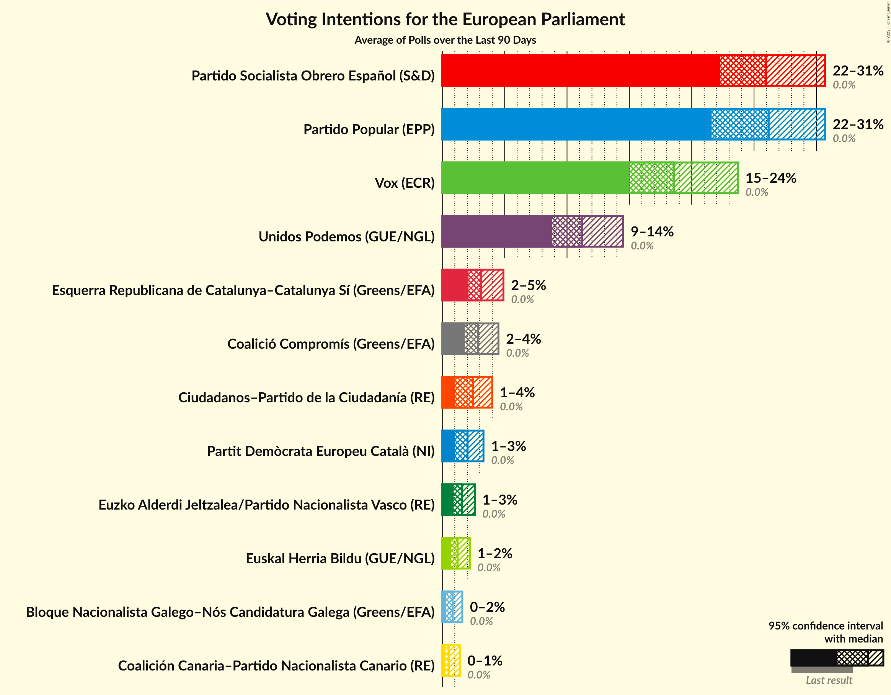

### Confidence Intervals

| Party | Last Result | Median | 80% Confidence Interval | 90% Confidence Interval | 95% Confidence Interval | 99% Confidence Interval |
|:-----:|:-----------:|:------:|:-----------------------:|:-----------------------:|:-----------------------:|:-----------------------:|
| <a href="#partido-popular-(epp)">Partido Popular (EPP)</a> | 0.0% | 26.2% | 22.8–29.3% |22.1–30.0% | 21.6–30.7% | 20.6–32.2% |
| <a href="#partido-socialista-obrero-español-(s&d)">Partido Socialista Obrero Español (S&D)</a> | 0.0% | 26.0% | 23.6–29.0% |22.9–30.2% | 22.3–30.7% | 21.1–31.5% |
| <a href="#unidos-podemos-(gue/ngl)">Unidos Podemos (GUE/NGL)</a> | 0.0% | 11.2% | 9.5–13.3% |9.1–13.9% | 8.8–14.5% | 8.1–15.8% |
| <a href="#ciudadanos–partido-de-la-ciudadanía-(re)">Ciudadanos–Partido de la Ciudadanía (RE)</a> | 0.0% | 2.5% | 1.5–3.5% |1.3–3.8% | 1.0–4.0% | 0.8–4.5% |
| <a href="#esquerra-republicana-de-catalunya–catalunya-sí-(greens/efa)">Esquerra Republicana de Catalunya–Catalunya Sí (Greens/EFA)</a> | 0.0% | 3.1% | 2.4–4.2% |2.2–4.6% | 2.1–4.9% | 1.8–5.7% |
| <a href="#partit-demòcrata-europeu-català-(ni)">Partit Demòcrata Europeu Català (NI)</a> | 0.0% | 2.0% | 1.3–2.8% |1.1–3.1% | 1.0–3.3% | 0.9–4.0% |
| <a href="#euzko-alderdi-jeltzalea/partido-nacionalista-vasco-(re)">Euzko Alderdi Jeltzalea/Partido Nacionalista Vasco (RE)</a> | 0.0% | 1.6% | 1.1–2.2% |1.0–2.4% | 0.9–2.6% | 0.7–3.2% |
| <a href="#partido-animalista-contra-el-maltrato-animal-(gue/ngl)">Partido Animalista Contra el Maltrato Animal (GUE/NGL)</a> | 0.0% | N/A | N/A |N/A | N/A | N/A |
| <a href="#euskal-herria-bildu-(gue/ngl)">Euskal Herria Bildu (GUE/NGL)</a> | 0.0% | 1.2% | 0.9–1.8% |0.8–2.0% | 0.7–2.2% | 0.5–2.8% |
| <a href="#coalición-canaria–partido-nacionalista-canario-(re)">Coalición Canaria–Partido Nacionalista Canario (RE)</a> | 0.0% | 0.5% | 0.3–1.0% |0.2–1.2% | 0.2–1.4% | 0.1–1.9% |
| <a href="#vox-(ecr)">Vox (ECR)</a> | 0.0% | 18.6% | 15.9–22.4% |15.4–23.1% | 15.0–23.7% | 14.2–24.8% |
| <a href="#bloque-nacionalista-galego-(greens/efa)">Bloque Nacionalista Galego (Greens/EFA)</a> | 0.0% | N/A | N/A |N/A | N/A | N/A |
| <a href="#bloque-nacionalista-galego–nós-candidatura-galega-(greens/efa)">Bloque Nacionalista Galego–Nós Candidatura Galega (Greens/EFA)</a> | 0.0% | 0.8% | 0.5–1.3% |0.4–1.5% | 0.3–1.6% | 0.3–1.9% |
| <a href="#ahora-repúblicas-(greens/efa)">Ahora Repúblicas (Greens/EFA)</a> | 0.0% | N/A | N/A |N/A | N/A | N/A |
| <a href="#coalición-por-europa-(re)">Coalición por Europa (RE)</a> | 0.0% | N/A | N/A |N/A | N/A | N/A |
| <a href="#primavera-europea-(greens/efa)">Primavera Europea (Greens/EFA)</a> | 0.0% | N/A | N/A |N/A | N/A | N/A |
| <a href="#coalició-compromís-(greens/efa)">Coalició Compromís (Greens/EFA)</a> | 0.0% | 2.9% | 2.1–3.9% |1.9–4.2% | 1.8–4.5% | 1.5–5.3% |

### Partido Popular (EPP)

*For a full overview of the results for this party, see the [Partido Popular (EPP)](party-partidopopularepp.html) page.*

| Voting Intentions | Probability | Accumulated | Special Marks |
|:-----------------:|:-----------:|:-----------:|:-------------:|
| 0.0–0.5% | 0% | 100% | Last Result |
| 0.5–1.5% | 0% | 100% |  |
| 1.5–2.5% | 0% | 100% |  |
| 2.5–3.5% | 0% | 100% |  |
| 3.5–4.5% | 0% | 100% |  |
| 4.5–5.5% | 0% | 100% |  |
| 5.5–6.5% | 0% | 100% |  |
| 6.5–7.5% | 0% | 100% |  |
| 7.5–8.5% | 0% | 100% |  |
| 8.5–9.5% | 0% | 100% |  |
| 9.5–10.5% | 0% | 100% |  |
| 10.5–11.5% | 0% | 100% |  |
| 11.5–12.5% | 0% | 100% |  |
| 12.5–13.5% | 0% | 100% |  |
| 13.5–14.5% | 0% | 100% |  |
| 14.5–15.5% | 0% | 100% |  |
| 15.5–16.5% | 0% | 100% |  |
| 16.5–17.5% | 0% | 100% |  |
| 17.5–18.5% | 0% | 100% |  |
| 18.5–19.5% | 0.1% | 100% |  |
| 19.5–20.5% | 0.4% | 99.9% |  |
| 20.5–21.5% | 2% | 99.5% |  |
| 21.5–22.5% | 5% | 98% |  |
| 22.5–23.5% | 9% | 92% |  |
| 23.5–24.5% | 11% | 83% |  |
| 24.5–25.5% | 13% | 71% |  |
| 25.5–26.5% | 14% | 59% | Median |
| 26.5–27.5% | 13% | 45% |  |
| 27.5–28.5% | 13% | 32% |  |
| 28.5–29.5% | 11% | 19% |  |
| 29.5–30.5% | 5% | 8% |  |
| 30.5–31.5% | 2% | 3% |  |
| 31.5–32.5% | 0.7% | 1.0% |  |
| 32.5–33.5% | 0.2% | 0.3% |  |
| 33.5–34.5% | 0.1% | 0.1% |  |
| 34.5–35.5% | 0% | 0% |  |

### Partido Socialista Obrero Español (S&D)

*For a full overview of the results for this party, see the [Partido Socialista Obrero Español (S&D)](party-partidosocialistaobreroespañolsd.html) page.*

| Voting Intentions | Probability | Accumulated | Special Marks |
|:-----------------:|:-----------:|:-----------:|:-------------:|
| 0.0–0.5% | 0% | 100% | Last Result |
| 0.5–1.5% | 0% | 100% |  |
| 1.5–2.5% | 0% | 100% |  |
| 2.5–3.5% | 0% | 100% |  |
| 3.5–4.5% | 0% | 100% |  |
| 4.5–5.5% | 0% | 100% |  |
| 5.5–6.5% | 0% | 100% |  |
| 6.5–7.5% | 0% | 100% |  |
| 7.5–8.5% | 0% | 100% |  |
| 8.5–9.5% | 0% | 100% |  |
| 9.5–10.5% | 0% | 100% |  |
| 10.5–11.5% | 0% | 100% |  |
| 11.5–12.5% | 0% | 100% |  |
| 12.5–13.5% | 0% | 100% |  |
| 13.5–14.5% | 0% | 100% |  |
| 14.5–15.5% | 0% | 100% |  |
| 15.5–16.5% | 0% | 100% |  |
| 16.5–17.5% | 0% | 100% |  |
| 17.5–18.5% | 0% | 100% |  |
| 18.5–19.5% | 0% | 100% |  |
| 19.5–20.5% | 0.2% | 100% |  |
| 20.5–21.5% | 0.7% | 99.8% |  |
| 21.5–22.5% | 2% | 99.1% |  |
| 22.5–23.5% | 6% | 97% |  |
| 23.5–24.5% | 13% | 90% |  |
| 24.5–25.5% | 19% | 78% |  |
| 25.5–26.5% | 21% | 59% | Median |
| 26.5–27.5% | 17% | 38% |  |
| 27.5–28.5% | 9% | 21% |  |
| 28.5–29.5% | 4% | 12% |  |
| 29.5–30.5% | 5% | 8% |  |
| 30.5–31.5% | 3% | 3% |  |
| 31.5–32.5% | 0.4% | 0.5% |  |
| 32.5–33.5% | 0% | 0% |  |
| 33.5–34.5% | 0% | 0% |  |

### Unidos Podemos (GUE/NGL)

*For a full overview of the results for this party, see the [Unidos Podemos (GUE/NGL)](party-unidospodemosguengl.html) page.*

| Voting Intentions | Probability | Accumulated | Special Marks |
|:-----------------:|:-----------:|:-----------:|:-------------:|
| 0.0–0.5% | 0% | 100% | Last Result |
| 0.5–1.5% | 0% | 100% |  |
| 1.5–2.5% | 0% | 100% |  |
| 2.5–3.5% | 0% | 100% |  |
| 3.5–4.5% | 0% | 100% |  |
| 4.5–5.5% | 0% | 100% |  |
| 5.5–6.5% | 0% | 100% |  |
| 6.5–7.5% | 0.1% | 100% |  |
| 7.5–8.5% | 1.2% | 99.9% |  |
| 8.5–9.5% | 10% | 98.6% |  |
| 9.5–10.5% | 21% | 89% |  |
| 10.5–11.5% | 26% | 67% | Median |
| 11.5–12.5% | 22% | 41% |  |
| 12.5–13.5% | 12% | 19% |  |
| 13.5–14.5% | 5% | 8% |  |
| 14.5–15.5% | 2% | 2% |  |
| 15.5–16.5% | 0.5% | 0.7% |  |
| 16.5–17.5% | 0.1% | 0.2% |  |
| 17.5–18.5% | 0% | 0% |  |

### Ciudadanos–Partido de la Ciudadanía (RE)

*For a full overview of the results for this party, see the [Ciudadanos–Partido de la Ciudadanía (RE)](party-ciudadanos–partidodelaciudadaníare.html) page.*

| Voting Intentions | Probability | Accumulated | Special Marks |
|:-----------------:|:-----------:|:-----------:|:-------------:|
| 0.0–0.5% | 0% | 100% | Last Result |
| 0.5–1.5% | 10% | 100% |  |
| 1.5–2.5% | 44% | 90% | Median |
| 2.5–3.5% | 37% | 46% |  |
| 3.5–4.5% | 8% | 9% |  |
| 4.5–5.5% | 0.4% | 0.5% |  |
| 5.5–6.5% | 0% | 0% |  |

### Esquerra Republicana de Catalunya–Catalunya Sí (Greens/EFA)

*For a full overview of the results for this party, see the [Esquerra Republicana de Catalunya–Catalunya Sí (Greens/EFA)](party-esquerrarepublicanadecatalunya–catalunyasígreensefa.html) page.*

| Voting Intentions | Probability | Accumulated | Special Marks |
|:-----------------:|:-----------:|:-----------:|:-------------:|
| 0.0–0.5% | 0% | 100% | Last Result |
| 0.5–1.5% | 0.1% | 100% |  |
| 1.5–2.5% | 18% | 99.9% |  |
| 2.5–3.5% | 52% | 82% | Median |
| 3.5–4.5% | 25% | 30% |  |
| 4.5–5.5% | 5% | 5% |  |
| 5.5–6.5% | 0.6% | 0.7% |  |
| 6.5–7.5% | 0.1% | 0.1% |  |
| 7.5–8.5% | 0% | 0% |  |

### Partit Demòcrata Europeu Català (NI)

*For a full overview of the results for this party, see the [Partit Demòcrata Europeu Català (NI)](party-partitdemòcrataeuropeucatalàni.html) page.*

| Voting Intentions | Probability | Accumulated | Special Marks |
|:-----------------:|:-----------:|:-----------:|:-------------:|
| 0.0–0.5% | 0% | 100% | Last Result |
| 0.5–1.5% | 21% | 100% |  |
| 1.5–2.5% | 61% | 79% | Median |
| 2.5–3.5% | 17% | 18% |  |
| 3.5–4.5% | 1.3% | 1.4% |  |
| 4.5–5.5% | 0.1% | 0.1% |  |
| 5.5–6.5% | 0% | 0% |  |

### Euzko Alderdi Jeltzalea/Partido Nacionalista Vasco (RE)

*For a full overview of the results for this party, see the [Euzko Alderdi Jeltzalea/Partido Nacionalista Vasco (RE)](party-euzkoalderdijeltzaleapartidonacionalistavascore.html) page.*

| Voting Intentions | Probability | Accumulated | Special Marks |
|:-----------------:|:-----------:|:-----------:|:-------------:|
| 0.0–0.5% | 0.2% | 100% | Last Result |
| 0.5–1.5% | 49% | 99.8% |  |
| 1.5–2.5% | 48% | 51% | Median |
| 2.5–3.5% | 3% | 3% |  |
| 3.5–4.5% | 0.2% | 0.2% |  |
| 4.5–5.5% | 0% | 0% |  |

### Euskal Herria Bildu (GUE/NGL)

*For a full overview of the results for this party, see the [Euskal Herria Bildu (GUE/NGL)](party-euskalherriabilduguengl.html) page.*

| Voting Intentions | Probability | Accumulated | Special Marks |
|:-----------------:|:-----------:|:-----------:|:-------------:|
| 0.0–0.5% | 0.8% | 100% | Last Result |
| 0.5–1.5% | 77% | 99.2% | Median |
| 1.5–2.5% | 21% | 22% |  |
| 2.5–3.5% | 1.0% | 1.1% |  |
| 3.5–4.5% | 0.1% | 0.1% |  |
| 4.5–5.5% | 0% | 0% |  |

### Coalición Canaria–Partido Nacionalista Canario (RE)

*For a full overview of the results for this party, see the [Coalición Canaria–Partido Nacionalista Canario (RE)](party-coalicióncanaria–partidonacionalistacanariore.html) page.*

| Voting Intentions | Probability | Accumulated | Special Marks |
|:-----------------:|:-----------:|:-----------:|:-------------:|
| 0.0–0.5% | 51% | 100% | Last Result |
| 0.5–1.5% | 47% | 49% | Median |
| 1.5–2.5% | 1.3% | 1.4% |  |
| 2.5–3.5% | 0.1% | 0.1% |  |
| 3.5–4.5% | 0% | 0% |  |

### Vox (ECR)

*For a full overview of the results for this party, see the [Vox (ECR)](party-voxecr.html) page.*

| Voting Intentions | Probability | Accumulated | Special Marks |
|:-----------------:|:-----------:|:-----------:|:-------------:|
| 0.0–0.5% | 0% | 100% | Last Result |
| 0.5–1.5% | 0% | 100% |  |
| 1.5–2.5% | 0% | 100% |  |
| 2.5–3.5% | 0% | 100% |  |
| 3.5–4.5% | 0% | 100% |  |
| 4.5–5.5% | 0% | 100% |  |
| 5.5–6.5% | 0% | 100% |  |
| 6.5–7.5% | 0% | 100% |  |
| 7.5–8.5% | 0% | 100% |  |
| 8.5–9.5% | 0% | 100% |  |
| 9.5–10.5% | 0% | 100% |  |
| 10.5–11.5% | 0% | 100% |  |
| 11.5–12.5% | 0% | 100% |  |
| 12.5–13.5% | 0.1% | 100% |  |
| 13.5–14.5% | 1.0% | 99.9% |  |
| 14.5–15.5% | 5% | 98.9% |  |
| 15.5–16.5% | 14% | 94% |  |
| 16.5–17.5% | 16% | 80% |  |
| 17.5–18.5% | 13% | 63% |  |
| 18.5–19.5% | 12% | 51% | Median |
| 19.5–20.5% | 11% | 39% |  |
| 20.5–21.5% | 11% | 28% |  |
| 21.5–22.5% | 9% | 18% |  |
| 22.5–23.5% | 6% | 9% |  |
| 23.5–24.5% | 2% | 3% |  |
| 24.5–25.5% | 0.6% | 0.8% |  |
| 25.5–26.5% | 0.1% | 0.1% |  |
| 26.5–27.5% | 0% | 0% |  |

### Coalició Compromís (Greens/EFA)

*For a full overview of the results for this party, see the [Coalició Compromís (Greens/EFA)](party-coaliciócompromísgreensefa.html) page.*

| Voting Intentions | Probability | Accumulated | Special Marks |
|:-----------------:|:-----------:|:-----------:|:-------------:|
| 0.0–0.5% | 0% | 100% | Last Result |
| 0.5–1.5% | 0.7% | 100% |  |
| 1.5–2.5% | 30% | 99.3% |  |
| 2.5–3.5% | 50% | 69% | Median |
| 3.5–4.5% | 16% | 18% |  |
| 4.5–5.5% | 2% | 2% |  |
| 5.5–6.5% | 0.2% | 0.2% |  |
| 6.5–7.5% | 0% | 0% |  |

### Bloque Nacionalista Galego–Nós Candidatura Galega (Greens/EFA)

*For a full overview of the results for this party, see the [Bloque Nacionalista Galego–Nós Candidatura Galega (Greens/EFA)](party-bloquenacionalistagalego–nóscandidaturagalegagreensefa.html) page.*

| Voting Intentions | Probability | Accumulated | Special Marks |
|:-----------------:|:-----------:|:-----------:|:-------------:|
| 0.0–0.5% | 19% | 100% | Last Result |
| 0.5–1.5% | 78% | 81% | Median |
| 1.5–2.5% | 3% | 3% |  |
| 2.5–3.5% | 0% | 0% |  |

## Seats

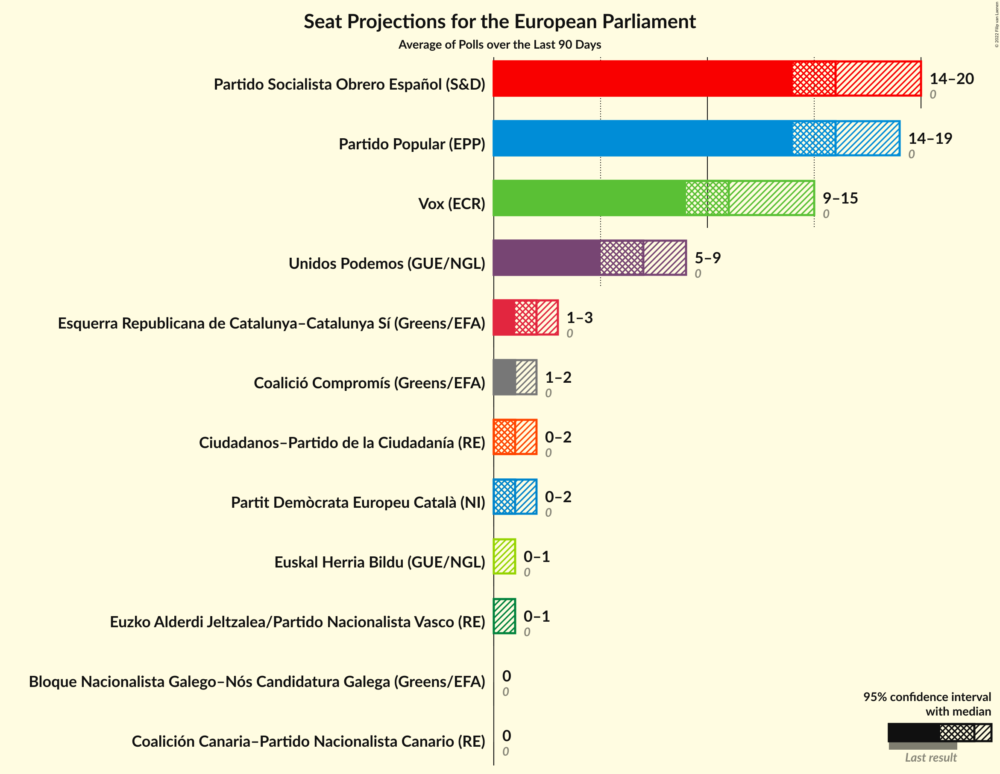

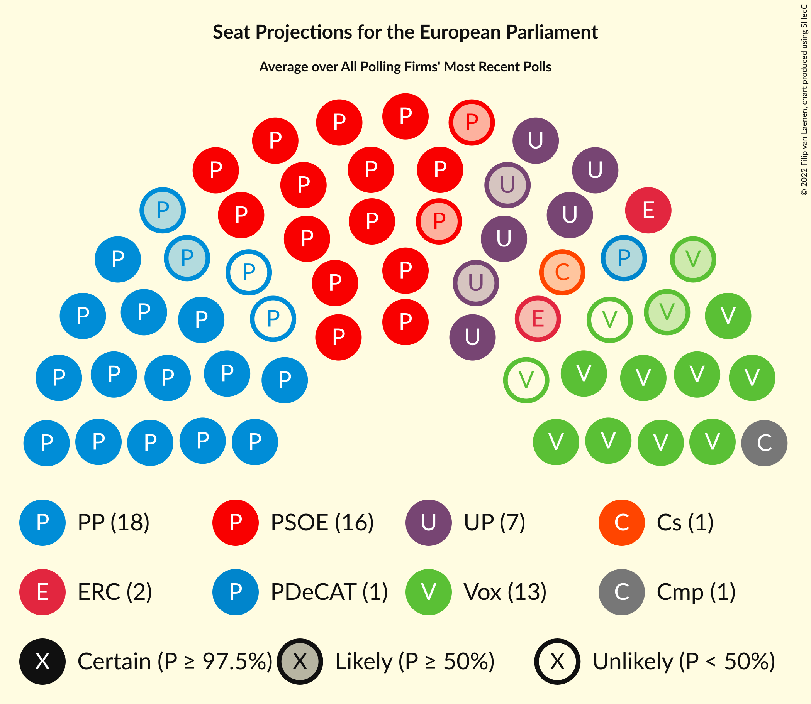

### Confidence Intervals

| Party | Last Result | Median | 80% Confidence Interval | 90% Confidence Interval | 95% Confidence Interval | 99% Confidence Interval |
|:-----:|:-----------:|:------:|:-----------------------:|:-----------------------:|:-----------------------:|:-----------------------:|
| <a href="#partido-popular-(epp)">Partido Popular (EPP)</a> | 0 | 16 | 14–18 |14–18 | 14–19 | 13–20 |
| <a href="#partido-socialista-obrero-español-(s&d)">Partido Socialista Obrero Español (S&D)</a> | 0 | 16 | 15–18 |14–20 | 14–20 | 13–20 |
| <a href="#unidos-podemos-(gue/ngl)">Unidos Podemos (GUE/NGL)</a> | 0 | 7 | 6–8 |5–8 | 5–9 | 5–10 |
| <a href="#ciudadanos–partido-de-la-ciudadanía-(re)">Ciudadanos–Partido de la Ciudadanía (RE)</a> | 0 | 1 | 1–2 |0–2 | 0–2 | 0–2 |
| <a href="#esquerra-republicana-de-catalunya–catalunya-sí-(greens/efa)">Esquerra Republicana de Catalunya–Catalunya Sí (Greens/EFA)</a> | 0 | 2 | 1–2 |1–3 | 1–3 | 1–3 |
| <a href="#partit-demòcrata-europeu-català-(ni)">Partit Demòcrata Europeu Català (NI)</a> | 0 | 1 | 0–1 |0–1 | 0–2 | 0–2 |
| <a href="#euzko-alderdi-jeltzalea/partido-nacionalista-vasco-(re)">Euzko Alderdi Jeltzalea/Partido Nacionalista Vasco (RE)</a> | 0 | 0 | 0–1 |0–1 | 0–1 | 0–2 |
| <a href="#partido-animalista-contra-el-maltrato-animal-(gue/ngl)">Partido Animalista Contra el Maltrato Animal (GUE/NGL)</a> | 0 | N/A | N/A |N/A | N/A | N/A |
| <a href="#euskal-herria-bildu-(gue/ngl)">Euskal Herria Bildu (GUE/NGL)</a> | 0 | 0 | 0–1 |0–1 | 0–1 | 0–1 |
| <a href="#coalición-canaria–partido-nacionalista-canario-(re)">Coalición Canaria–Partido Nacionalista Canario (RE)</a> | 0 | 0 | 0 |0 | 0 | 0–1 |
| <a href="#vox-(ecr)">Vox (ECR)</a> | 0 | 11 | 9–14 |9–14 | 9–15 | 8–16 |
| <a href="#bloque-nacionalista-galego-(greens/efa)">Bloque Nacionalista Galego (Greens/EFA)</a> | 0 | N/A | N/A |N/A | N/A | N/A |
| <a href="#bloque-nacionalista-galego–nós-candidatura-galega-(greens/efa)">Bloque Nacionalista Galego–Nós Candidatura Galega (Greens/EFA)</a> | 0 | 0 | 0 |0 | 0 | 0–1 |
| <a href="#ahora-repúblicas-(greens/efa)">Ahora Repúblicas (Greens/EFA)</a> | 0 | N/A | N/A |N/A | N/A | N/A |
| <a href="#coalición-por-europa-(re)">Coalición por Europa (RE)</a> | 0 | N/A | N/A |N/A | N/A | N/A |
| <a href="#primavera-europea-(greens/efa)">Primavera Europea (Greens/EFA)</a> | 0 | N/A | N/A |N/A | N/A | N/A |
| <a href="#coalició-compromís-(greens/efa)">Coalició Compromís (Greens/EFA)</a> | 0 | 1 | 1–2 |1–2 | 1–2 | 0–3 |

### Partido Popular (EPP)

*For a full overview of the results for this party, see the [Partido Popular (EPP)](party-partidopopularepp.html) page.*

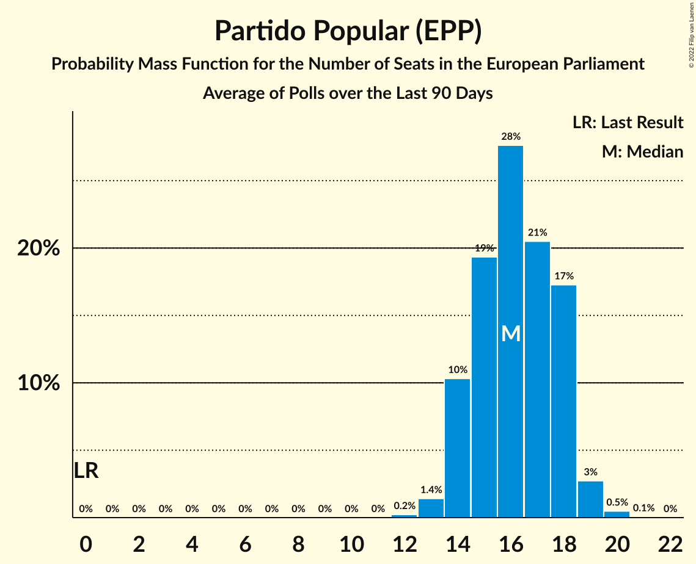

| Number of Seats | Probability | Accumulated | Special Marks |
|:---------------:|:-----------:|:-----------:|:-------------:|
| 0 | 0% | 100% | Last Result |
| 1 | 0% | 100% |  |
| 2 | 0% | 100% |  |
| 3 | 0% | 100% |  |
| 4 | 0% | 100% |  |
| 5 | 0% | 100% |  |
| 6 | 0% | 100% |  |
| 7 | 0% | 100% |  |
| 8 | 0% | 100% |  |
| 9 | 0% | 100% |  |
| 10 | 0% | 100% |  |
| 11 | 0% | 100% |  |
| 12 | 0.2% | 100% |  |
| 13 | 1.4% | 99.8% |  |
| 14 | 10% | 98% |  |
| 15 | 19% | 88% |  |
| 16 | 28% | 69% | Median |
| 17 | 21% | 41% |  |
| 18 | 17% | 21% |  |
| 19 | 3% | 3% |  |
| 20 | 0.5% | 0.6% |  |
| 21 | 0.1% | 0.1% |  |
| 22 | 0% | 0% |  |

### Partido Socialista Obrero Español (S&D)

*For a full overview of the results for this party, see the [Partido Socialista Obrero Español (S&D)](party-partidosocialistaobreroespañolsd.html) page.*

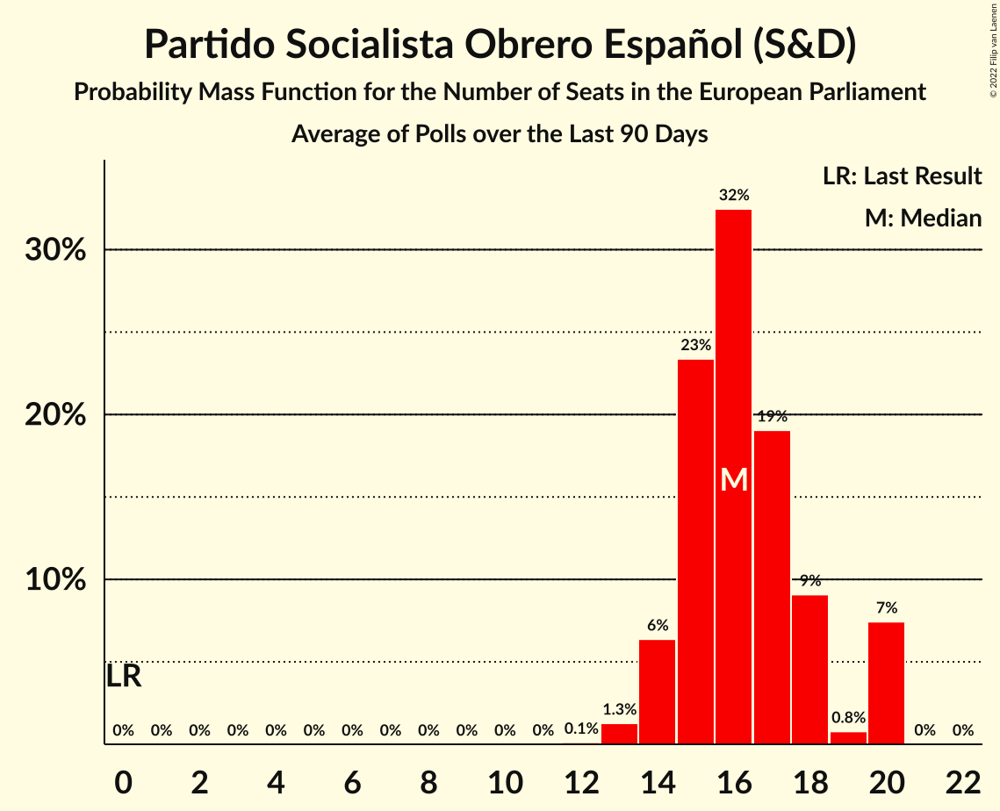

| Number of Seats | Probability | Accumulated | Special Marks |
|:---------------:|:-----------:|:-----------:|:-------------:|
| 0 | 0% | 100% | Last Result |
| 1 | 0% | 100% |  |
| 2 | 0% | 100% |  |
| 3 | 0% | 100% |  |
| 4 | 0% | 100% |  |
| 5 | 0% | 100% |  |
| 6 | 0% | 100% |  |
| 7 | 0% | 100% |  |
| 8 | 0% | 100% |  |
| 9 | 0% | 100% |  |
| 10 | 0% | 100% |  |
| 11 | 0% | 100% |  |
| 12 | 0.1% | 100% |  |
| 13 | 1.3% | 99.9% |  |
| 14 | 6% | 98.6% |  |
| 15 | 23% | 92% |  |
| 16 | 32% | 69% | Median |
| 17 | 19% | 36% |  |
| 18 | 9% | 17% |  |
| 19 | 0.8% | 8% |  |
| 20 | 7% | 7% |  |
| 21 | 0% | 0% |  |

### Unidos Podemos (GUE/NGL)

*For a full overview of the results for this party, see the [Unidos Podemos (GUE/NGL)](party-unidospodemosguengl.html) page.*

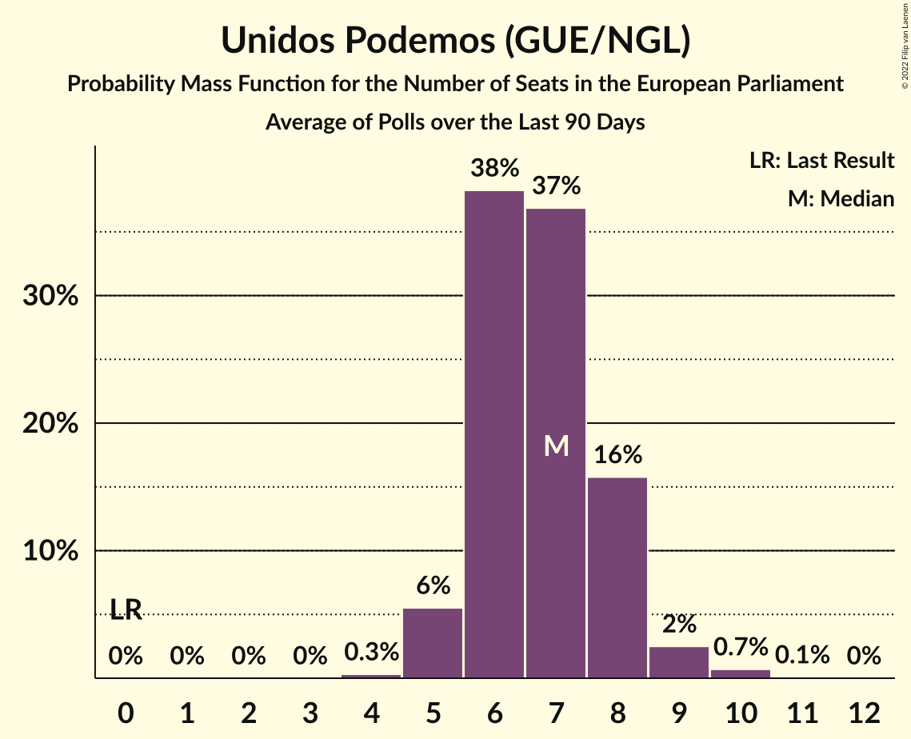

| Number of Seats | Probability | Accumulated | Special Marks |
|:---------------:|:-----------:|:-----------:|:-------------:|
| 0 | 0% | 100% | Last Result |
| 1 | 0% | 100% |  |
| 2 | 0% | 100% |  |
| 3 | 0% | 100% |  |
| 4 | 0.3% | 100% |  |
| 5 | 6% | 99.7% |  |
| 6 | 38% | 94% |  |
| 7 | 37% | 56% | Median |
| 8 | 16% | 19% |  |
| 9 | 2% | 3% |  |
| 10 | 0.7% | 0.8% |  |
| 11 | 0.1% | 0.1% |  |
| 12 | 0% | 0% |  |

### Ciudadanos–Partido de la Ciudadanía (RE)

*For a full overview of the results for this party, see the [Ciudadanos–Partido de la Ciudadanía (RE)](party-ciudadanos–partidodelaciudadaníare.html) page.*

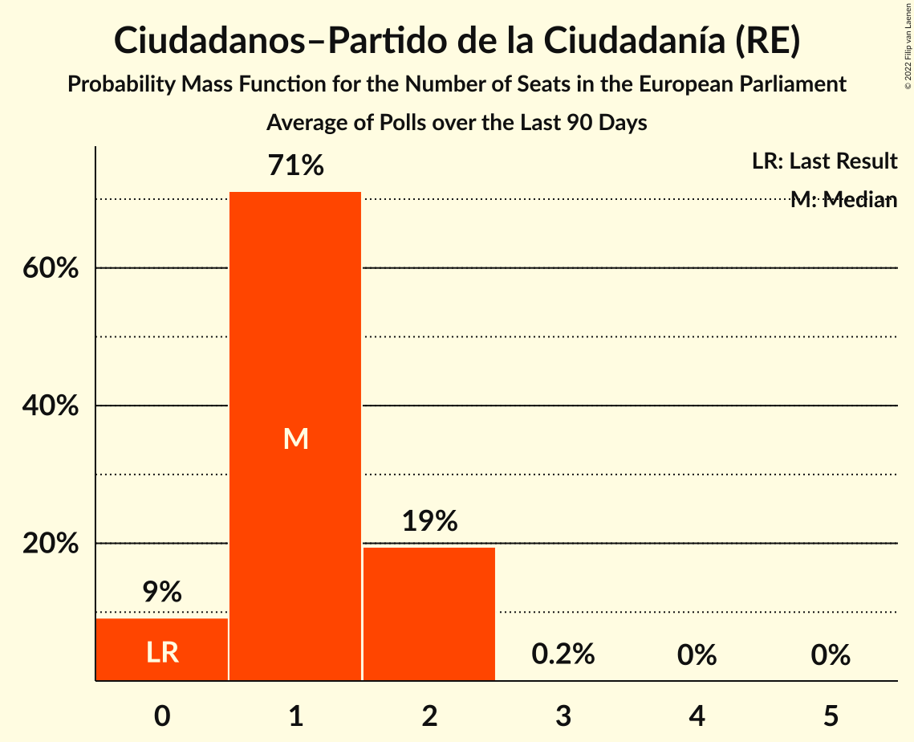

| Number of Seats | Probability | Accumulated | Special Marks |
|:---------------:|:-----------:|:-----------:|:-------------:|
| 0 | 9% | 100% | Last Result |
| 1 | 71% | 91% | Median |
| 2 | 19% | 20% |  |
| 3 | 0.2% | 0.2% |  |
| 4 | 0% | 0% |  |

### Esquerra Republicana de Catalunya–Catalunya Sí (Greens/EFA)

*For a full overview of the results for this party, see the [Esquerra Republicana de Catalunya–Catalunya Sí (Greens/EFA)](party-esquerrarepublicanadecatalunya–catalunyasígreensefa.html) page.*

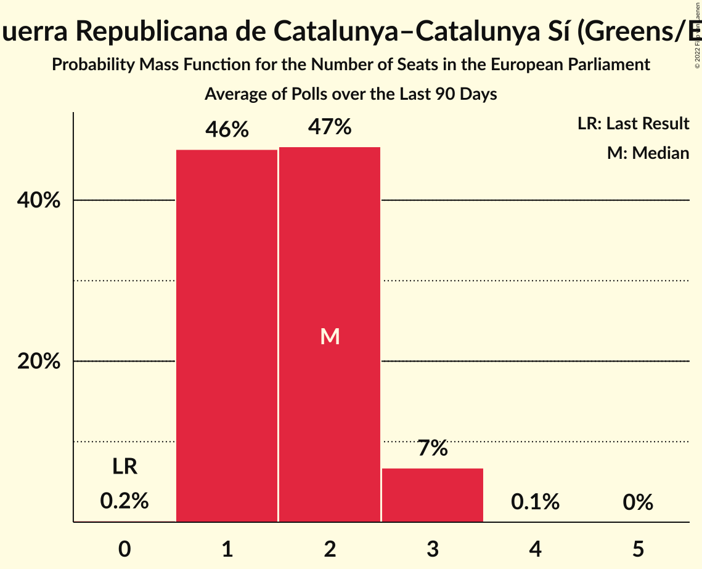

| Number of Seats | Probability | Accumulated | Special Marks |
|:---------------:|:-----------:|:-----------:|:-------------:|
| 0 | 0.2% | 100% | Last Result |
| 1 | 46% | 99.8% |  |
| 2 | 47% | 53% | Median |
| 3 | 7% | 7% |  |
| 4 | 0.1% | 0.1% |  |
| 5 | 0% | 0% |  |

### Partit Demòcrata Europeu Català (NI)

*For a full overview of the results for this party, see the [Partit Demòcrata Europeu Català (NI)](party-partitdemòcrataeuropeucatalàni.html) page.*

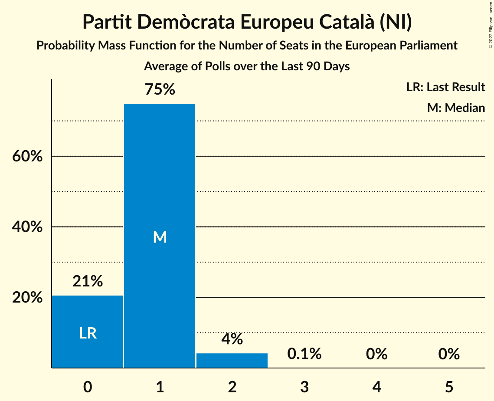

| Number of Seats | Probability | Accumulated | Special Marks |
|:---------------:|:-----------:|:-----------:|:-------------:|
| 0 | 21% | 100% | Last Result |
| 1 | 75% | 79% | Median |
| 2 | 4% | 4% |  |
| 3 | 0.1% | 0.1% |  |
| 4 | 0% | 0% |  |

### Euzko Alderdi Jeltzalea/Partido Nacionalista Vasco (RE)

*For a full overview of the results for this party, see the [Euzko Alderdi Jeltzalea/Partido Nacionalista Vasco (RE)](party-euzkoalderdijeltzaleapartidonacionalistavascore.html) page.*

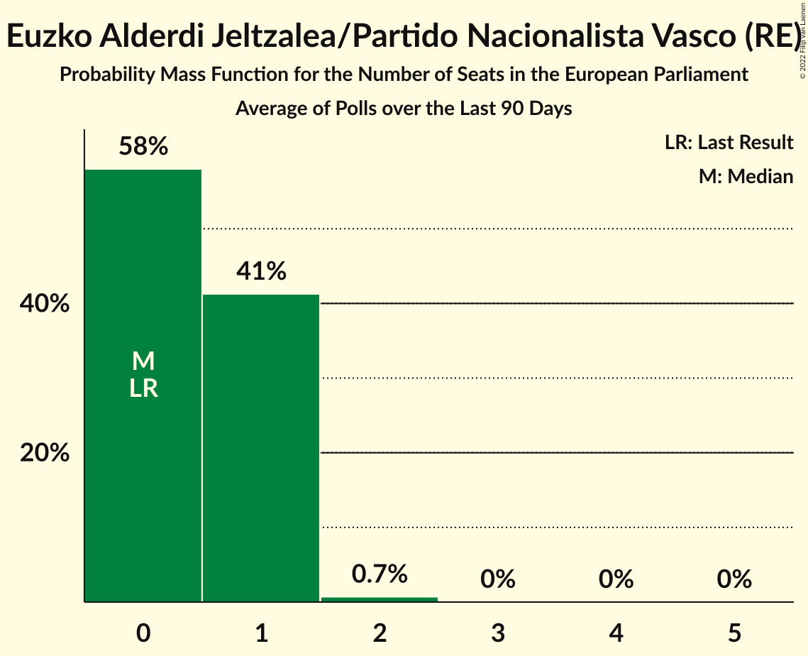

| Number of Seats | Probability | Accumulated | Special Marks |
|:---------------:|:-----------:|:-----------:|:-------------:|
| 0 | 58% | 100% | Last Result, Median |
| 1 | 41% | 42% |  |
| 2 | 0.7% | 0.7% |  |
| 3 | 0% | 0% |  |

### Partido Animalista Contra el Maltrato Animal (GUE/NGL)

*For a full overview of the results for this party, see the [Partido Animalista Contra el Maltrato Animal (GUE/NGL)](party-partidoanimalistacontraelmaltratoanimalguengl.html) page.*

### Euskal Herria Bildu (GUE/NGL)

*For a full overview of the results for this party, see the [Euskal Herria Bildu (GUE/NGL)](party-euskalherriabilduguengl.html) page.*

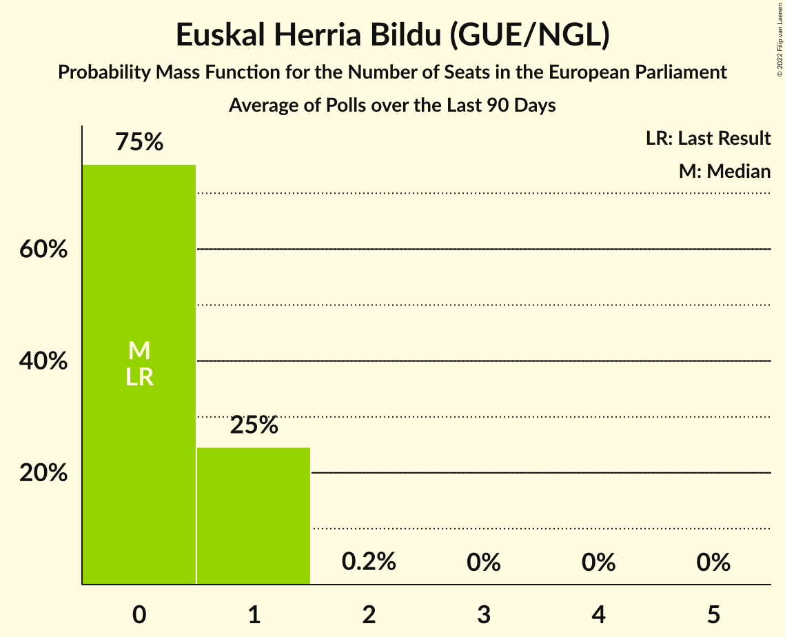

| Number of Seats | Probability | Accumulated | Special Marks |
|:---------------:|:-----------:|:-----------:|:-------------:|
| 0 | 75% | 100% | Last Result, Median |
| 1 | 25% | 25% |  |
| 2 | 0.2% | 0.2% |  |
| 3 | 0% | 0% |  |

### Coalición Canaria–Partido Nacionalista Canario (RE)

*For a full overview of the results for this party, see the [Coalición Canaria–Partido Nacionalista Canario (RE)](party-coalicióncanaria–partidonacionalistacanariore.html) page.*

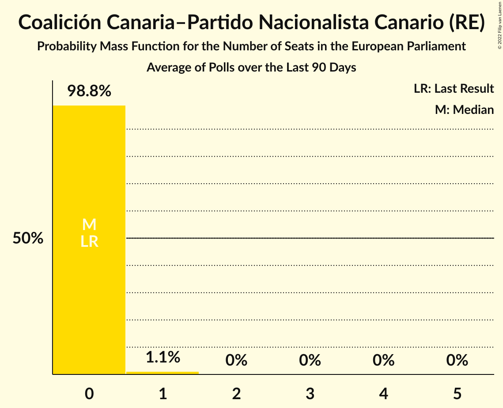

| Number of Seats | Probability | Accumulated | Special Marks |
|:---------------:|:-----------:|:-----------:|:-------------:|
| 0 | 98.8% | 100% | Last Result, Median |
| 1 | 1.1% | 1.2% |  |
| 2 | 0% | 0% |  |

### Vox (ECR)

*For a full overview of the results for this party, see the [Vox (ECR)](party-voxecr.html) page.*

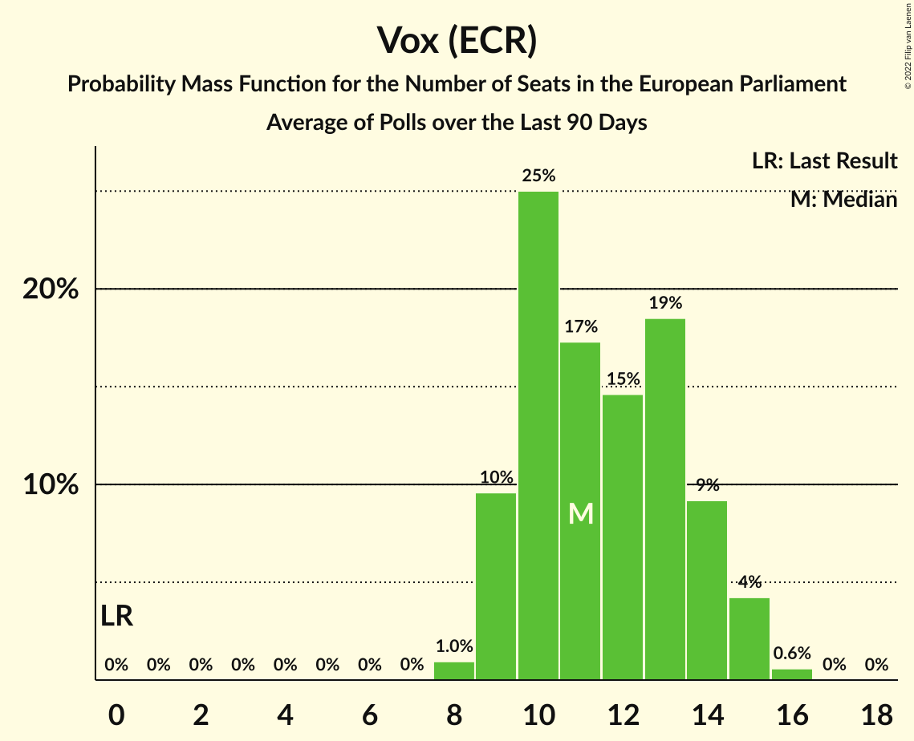

| Number of Seats | Probability | Accumulated | Special Marks |
|:---------------:|:-----------:|:-----------:|:-------------:|
| 0 | 0% | 100% | Last Result |
| 1 | 0% | 100% |  |
| 2 | 0% | 100% |  |
| 3 | 0% | 100% |  |
| 4 | 0% | 100% |  |
| 5 | 0% | 100% |  |
| 6 | 0% | 100% |  |
| 7 | 0% | 100% |  |
| 8 | 1.0% | 100% |  |
| 9 | 10% | 99.0% |  |
| 10 | 25% | 89% |  |
| 11 | 17% | 64% | Median |
| 12 | 15% | 47% |  |
| 13 | 19% | 33% |  |
| 14 | 9% | 14% |  |
| 15 | 4% | 5% |  |
| 16 | 0.6% | 0.6% |  |
| 17 | 0% | 0% |  |

### Bloque Nacionalista Galego (Greens/EFA)

*For a full overview of the results for this party, see the [Bloque Nacionalista Galego (Greens/EFA)](party-bloquenacionalistagalegogreensefa.html) page.*

### Bloque Nacionalista Galego–Nós Candidatura Galega (Greens/EFA)

*For a full overview of the results for this party, see the [Bloque Nacionalista Galego–Nós Candidatura Galega (Greens/EFA)](party-bloquenacionalistagalego–nóscandidaturagalegagreensefa.html) page.*

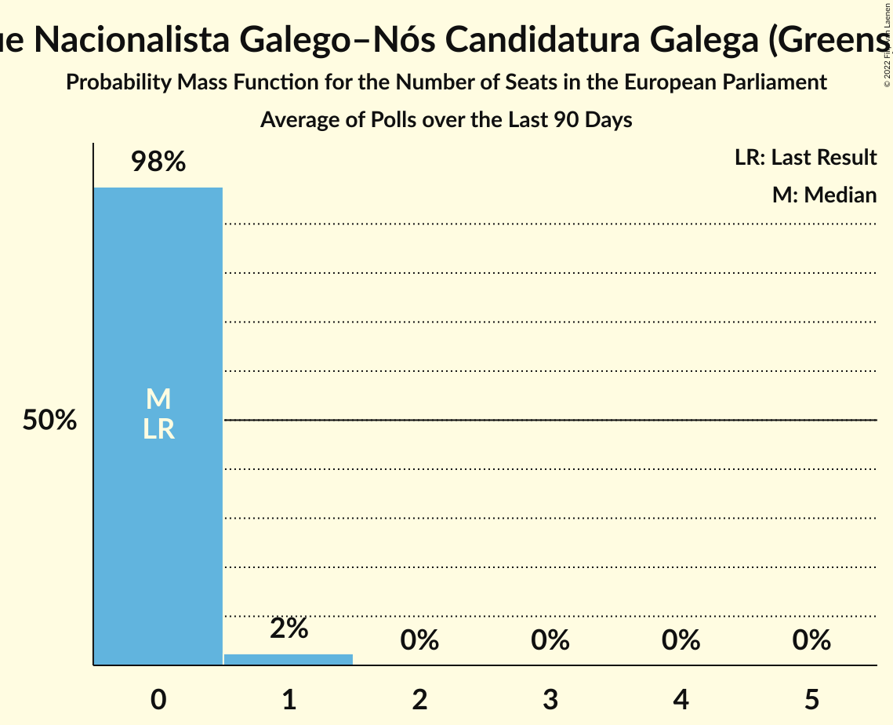

| Number of Seats | Probability | Accumulated | Special Marks |
|:---------------:|:-----------:|:-----------:|:-------------:|
| 0 | 98% | 100% | Last Result, Median |
| 1 | 2% | 2% |  |
| 2 | 0% | 0% |  |

### Ahora Repúblicas (Greens/EFA)

*For a full overview of the results for this party, see the [Ahora Repúblicas (Greens/EFA)](party-ahorarepúblicasgreensefa.html) page.*

### Coalición por Europa (RE)

*For a full overview of the results for this party, see the [Coalición por Europa (RE)](party-coaliciónporeuropare.html) page.*

### Primavera Europea (Greens/EFA)

*For a full overview of the results for this party, see the [Primavera Europea (Greens/EFA)](party-primaveraeuropeagreensefa.html) page.*

### Coalició Compromís (Greens/EFA)

*For a full overview of the results for this party, see the [Coalició Compromís (Greens/EFA)](party-coaliciócompromísgreensefa.html) page.*

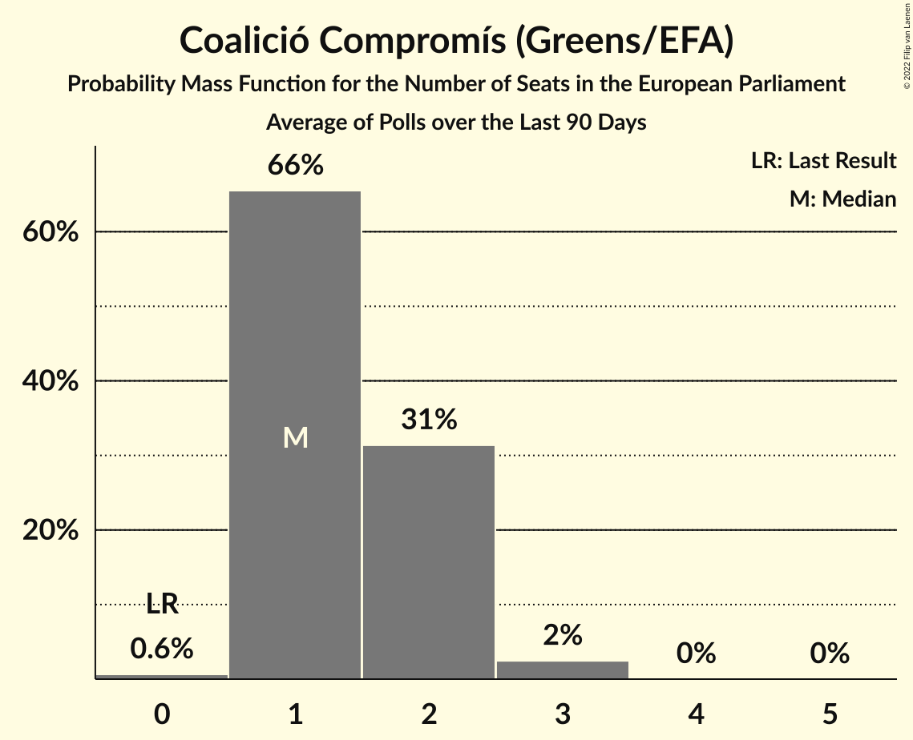

| Number of Seats | Probability | Accumulated | Special Marks |
|:---------------:|:-----------:|:-----------:|:-------------:|
| 0 | 0.6% | 100% | Last Result |
| 1 | 66% | 99.4% | Median |
| 2 | 31% | 34% |  |
| 3 | 2% | 2% |  |
| 4 | 0% | 0% |  |

## Coalitions

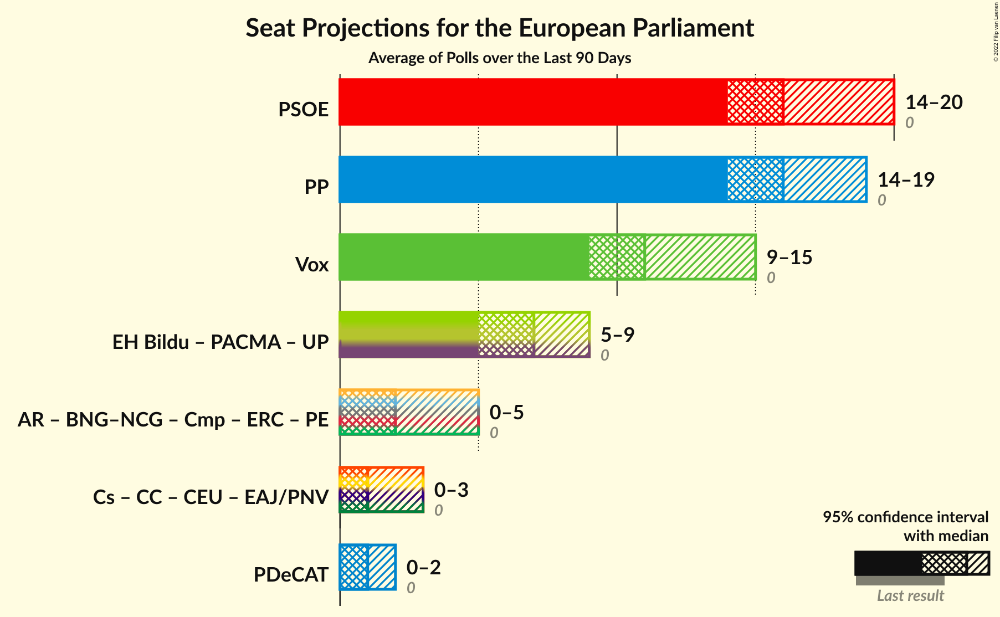

### Confidence Intervals

| Coalition | Last Result | Median | Majority? | 80% Confidence Interval | 90% Confidence Interval | 95% Confidence Interval | 99% Confidence Interval |
|:---------:|:-----------:|:------:|:---------:|:-----------------------:|:-----------------------:|:-----------------------:|:-----------------------:|
| Partido Socialista Obrero Español (S&D) | 0 | 16 | 0% | 15–18 | 14–20 | 14–20 | 13–20 |
| Partido Popular (EPP) | 0 | 16 | 0% | 14–18 | 14–18 | 14–19 | 13–20 |
| Vox (ECR) | 0 | 11 | 0% | 9–14 | 9–14 | 9–15 | 8–16 |
| Euskal Herria Bildu (GUE/NGL) – Partido Animalista Contra el Maltrato Animal (GUE/NGL) – Unidos Podemos (GUE/NGL) | 0 | 7 | 0% | 6–8 | 5–9 | 5–9 | 5–10 |
| Ahora Repúblicas (Greens/EFA) – Bloque Nacionalista Galego–Nós Candidatura Galega (Greens/EFA) – Coalició Compromís (Greens/EFA) – Esquerra Republicana de Catalunya–Catalunya Sí (Greens/EFA) – Primavera Europea (Greens/EFA) | 0 | 2 | 0% | 1–4 | 0–4 | 0–5 | 0–5 |
| Ciudadanos–Partido de la Ciudadanía (RE) – Coalición Canaria–Partido Nacionalista Canario (RE) – Coalición por Europa (RE) – Euzko Alderdi Jeltzalea/Partido Nacionalista Vasco (RE) | 0 | 1 | 0% | 1–2 | 0–2 | 0–3 | 0–3 |
| Partit Demòcrata Europeu Català (NI) | 0 | 1 | 0% | 0–1 | 0–1 | 0–2 | 0–2 |

### Partido Socialista Obrero Español (S&D)

| Number of Seats | Probability | Accumulated | Special Marks |
|:---------------:|:-----------:|:-----------:|:-------------:|
| 0 | 0% | 100% | Last Result |
| 1 | 0% | 100% |  |
| 2 | 0% | 100% |  |
| 3 | 0% | 100% |  |
| 4 | 0% | 100% |  |
| 5 | 0% | 100% |  |
| 6 | 0% | 100% |  |
| 7 | 0% | 100% |  |
| 8 | 0% | 100% |  |
| 9 | 0% | 100% |  |
| 10 | 0% | 100% |  |
| 11 | 0% | 100% |  |
| 12 | 0.1% | 100% |  |
| 13 | 1.3% | 99.9% |  |
| 14 | 6% | 98.6% |  |
| 15 | 23% | 92% |  |
| 16 | 32% | 69% | Median |
| 17 | 19% | 36% |  |
| 18 | 9% | 17% |  |
| 19 | 0.8% | 8% |  |
| 20 | 7% | 7% |  |
| 21 | 0% | 0% |  |

### Partido Popular (EPP)

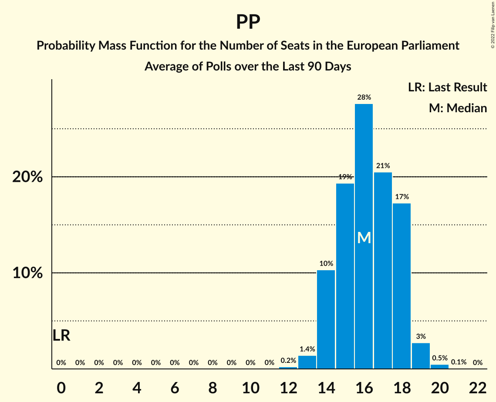

| Number of Seats | Probability | Accumulated | Special Marks |
|:---------------:|:-----------:|:-----------:|:-------------:|
| 0 | 0% | 100% | Last Result |
| 1 | 0% | 100% |  |
| 2 | 0% | 100% |  |
| 3 | 0% | 100% |  |
| 4 | 0% | 100% |  |
| 5 | 0% | 100% |  |
| 6 | 0% | 100% |  |
| 7 | 0% | 100% |  |
| 8 | 0% | 100% |  |
| 9 | 0% | 100% |  |
| 10 | 0% | 100% |  |
| 11 | 0% | 100% |  |
| 12 | 0.2% | 100% |  |
| 13 | 1.4% | 99.8% |  |
| 14 | 10% | 98% |  |
| 15 | 19% | 88% |  |
| 16 | 28% | 69% | Median |
| 17 | 21% | 41% |  |
| 18 | 17% | 21% |  |
| 19 | 3% | 3% |  |
| 20 | 0.5% | 0.6% |  |
| 21 | 0.1% | 0.1% |  |
| 22 | 0% | 0% |  |

### Vox (ECR)

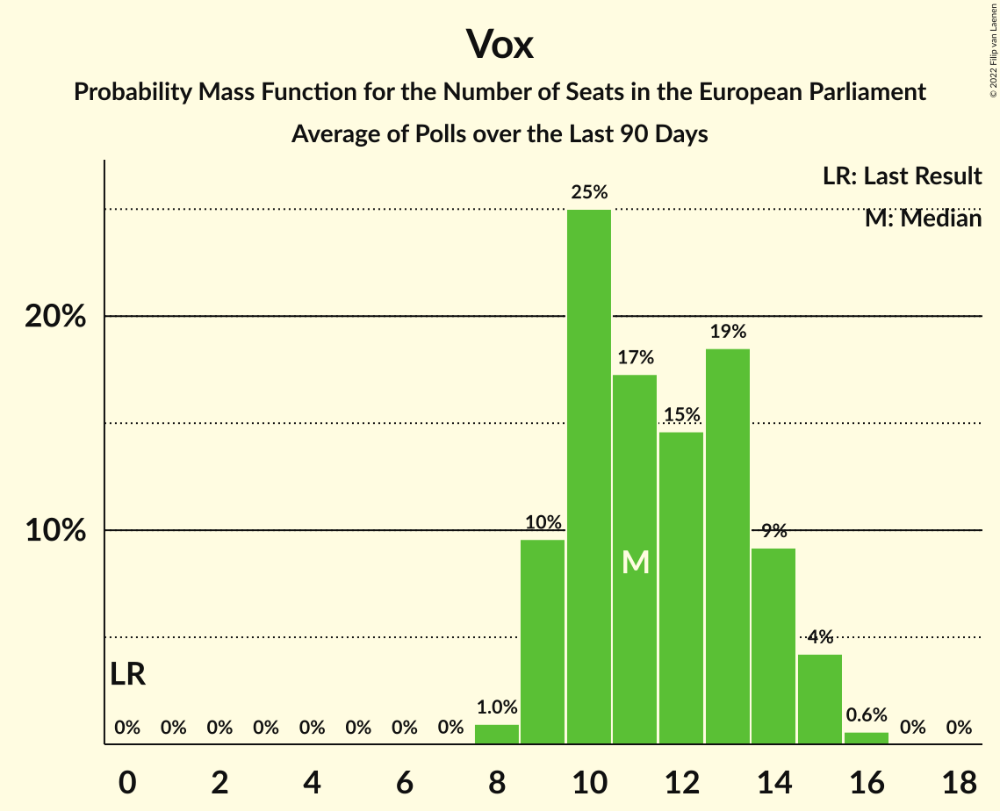

| Number of Seats | Probability | Accumulated | Special Marks |
|:---------------:|:-----------:|:-----------:|:-------------:|
| 0 | 0% | 100% | Last Result |
| 1 | 0% | 100% |  |
| 2 | 0% | 100% |  |
| 3 | 0% | 100% |  |
| 4 | 0% | 100% |  |
| 5 | 0% | 100% |  |
| 6 | 0% | 100% |  |
| 7 | 0% | 100% |  |
| 8 | 1.0% | 100% |  |
| 9 | 10% | 99.0% |  |
| 10 | 25% | 89% |  |
| 11 | 17% | 64% | Median |
| 12 | 15% | 47% |  |
| 13 | 19% | 33% |  |
| 14 | 9% | 14% |  |
| 15 | 4% | 5% |  |
| 16 | 0.6% | 0.6% |  |
| 17 | 0% | 0% |  |

### Euskal Herria Bildu (GUE/NGL) – Partido Animalista Contra el Maltrato Animal (GUE/NGL) – Unidos Podemos (GUE/NGL)

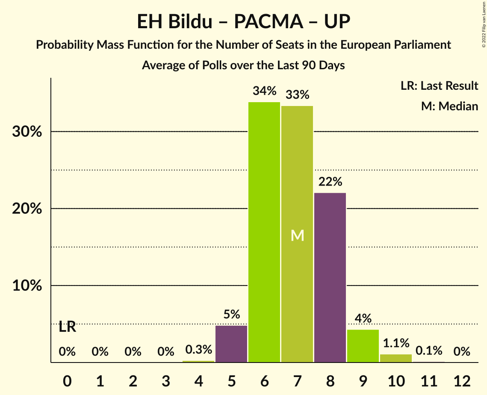

| Number of Seats | Probability | Accumulated | Special Marks |
|:---------------:|:-----------:|:-----------:|:-------------:|
| 0 | 0% | 100% | Last Result |
| 1 | 0% | 100% |  |
| 2 | 0% | 100% |  |
| 3 | 0% | 100% |  |
| 4 | 0.3% | 100% |  |
| 5 | 5% | 99.7% |  |
| 6 | 34% | 95% |  |
| 7 | 33% | 61% | Median |
| 8 | 22% | 28% |  |
| 9 | 4% | 6% |  |
| 10 | 1.1% | 1.3% |  |
| 11 | 0.1% | 0.1% |  |
| 12 | 0% | 0% |  |

### Ahora Repúblicas (Greens/EFA) – Bloque Nacionalista Galego–Nós Candidatura Galega (Greens/EFA) – Coalició Compromís (Greens/EFA) – Esquerra Republicana de Catalunya–Catalunya Sí (Greens/EFA) – Primavera Europea (Greens/EFA)

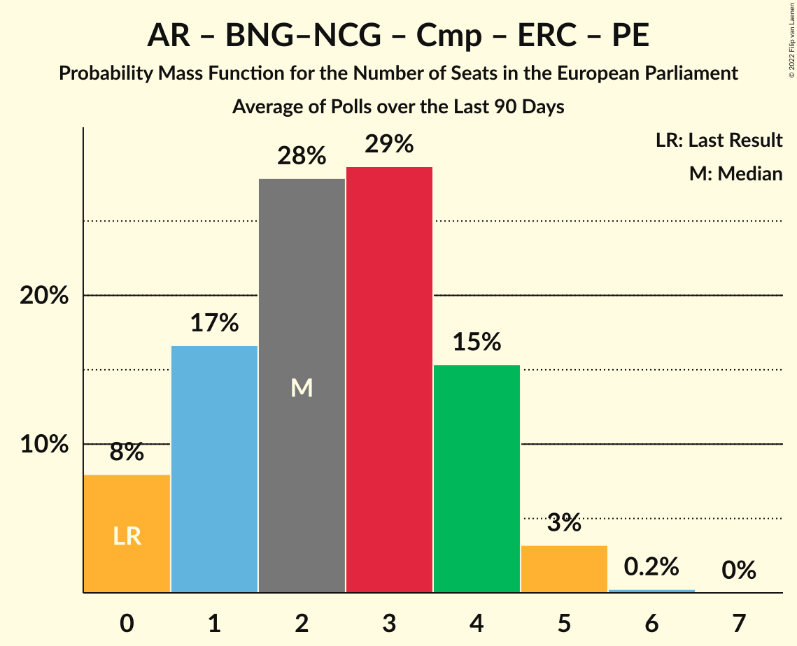

| Number of Seats | Probability | Accumulated | Special Marks |
|:---------------:|:-----------:|:-----------:|:-------------:|
| 0 | 8% | 100% | Last Result |
| 1 | 17% | 92% |  |
| 2 | 28% | 75% |  |
| 3 | 29% | 48% | Median |
| 4 | 15% | 19% |  |
| 5 | 3% | 3% |  |
| 6 | 0.2% | 0.3% |  |
| 7 | 0% | 0% |  |

### Ciudadanos–Partido de la Ciudadanía (RE) – Coalición Canaria–Partido Nacionalista Canario (RE) – Coalición por Europa (RE) – Euzko Alderdi Jeltzalea/Partido Nacionalista Vasco (RE)

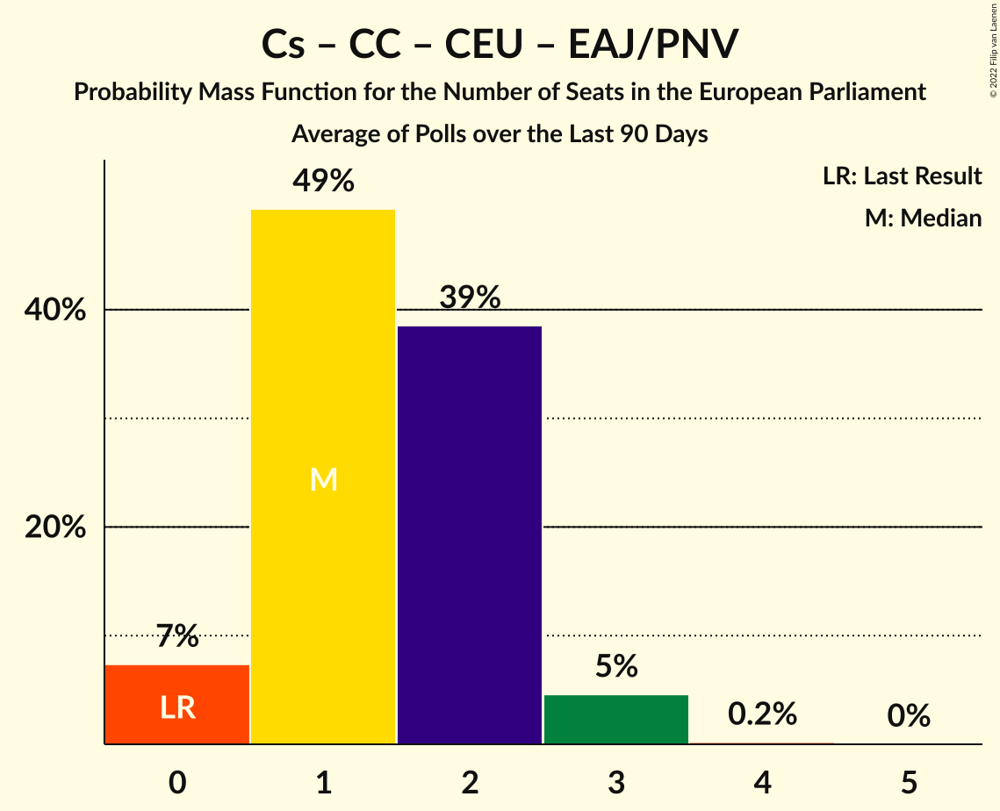

| Number of Seats | Probability | Accumulated | Special Marks |
|:---------------:|:-----------:|:-----------:|:-------------:|
| 0 | 7% | 100% | Last Result |
| 1 | 49% | 93% | Median |
| 2 | 39% | 43% |  |
| 3 | 5% | 5% |  |
| 4 | 0.2% | 0.2% |  |
| 5 | 0% | 0% |  |

### Partit Demòcrata Europeu Català (NI)

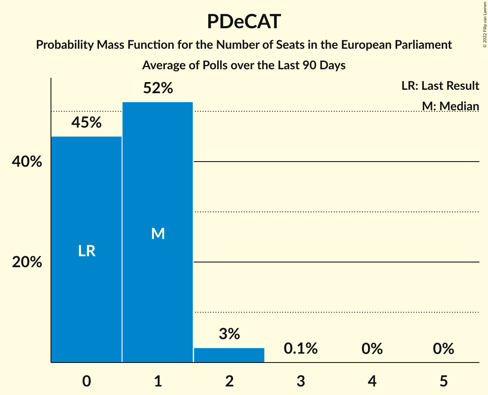

| Number of Seats | Probability | Accumulated | Special Marks |
|:---------------:|:-----------:|:-----------:|:-------------:|
| 0 | 45% | 100% | Last Result |
| 1 | 52% | 55% | Median |
| 2 | 3% | 3% |  |
| 3 | 0.1% | 0.1% |  |
| 4 | 0% | 0% |  |

## Technical Information

+ **Number of polls included in this average:** 13
+ **Lowest number of simulations done in a poll included in this average:** 1,048,576
+ **Total number of simulations done in the polls included in this average:** 13,631,488
+ **Error estimate:** 3.67%
