# Poll Average

<a href="#voting-intentions">Voting Intentions</a> | <a href="#seats">Seats</a> | <a href="#coalitions">Coalitions</a> | <a href="#technical-information">Technical Information</a>

## Summary

The table below lists the polls on which the average is based. They are the most recent polls (less than 14 days old) registered and analyzed so far.

| Period     | Polling firm/Commissioner(s) | PP | PSOE | UP | Cs | ERC | PDeCAT | EAJ/PNV | PACMA | EH Bildu | CC | Vox | BNG | BNG–NCG | AR | CEU | PE | Cmp | Podemos | CUP | UPN | PRC | EV | S–Podemos–IU | S–IU | S–CC–MC–MP–Ch | SALF |
|:----------:|:----------------------------:|:--:|:--:|:--:|:--:|:--:|:--:|:--:|:--:|:--:|:--:|:--:|:--:|:--:|:--:|:--:|:--:|:--:|:--:|:--:|:--:|:--:|:--:|:--:|:--:|:--:|:--:|
| 26 May 2019 | General Election | 0.0%   0 | 0.0%   0 | 0.0%   0 | 0.0%   0 | 0.0%   0 | 0.0%   0 | 0.0%   0 | 0.0%   0 | 0.0%   0 | 0.0%   0 | 0.0%   0 | 0.0%   0 | 0.0%   0 | 0.0%   0 | 0.0%   0 | 0.0%   0 | 0.0%   0 | 0.0%   0 | 0.0%   0 | 0.0%   0 | 0.0%   0 | 0.0%   0 | 0.0%   0 | 0.0%   0 | 0.0%   0 | 0.0%   0 |
| N/A | Poll Average | 29–38%   20–26 | 27–33%   17–23 | N/A   N/A | 0–2%   0–1 | 1–4%   1–3 | 2–4%   1–2 | N/A   N/A | 1–2%   0–1 | 1–3%   1–2 | N/A   N/A | 8–12%   5–8 | N/A   N/A | 0–1%   0 | N/A   N/A | 1–3%   0–2 | N/A   N/A | N/A   N/A | 3–5%   1–3 | N/A   N/A | N/A   N/A | N/A   N/A | N/A   N/A | N/A   N/A | 2–4%   1–2 | 3–5%   1–3 | 2–5%   1–3 |
| [27 May–3 June 2024](2024-06-03-SigmaDos.html) | Sigma Dos   El Mundo | 32–35%   21–23 | 29–32%   20–21 | N/A   N/A | N/A   N/A | 2–3%   1–2 | 1–2%   1 | N/A   N/A | N/A   N/A | 1–2%   1–2 | N/A   N/A | 10–12%   6–8 | N/A   N/A | 0–1%   0 | N/A   N/A | 1–2%   0–1 | N/A   N/A | N/A   N/A | 3–5%   2–3 | N/A   N/A | N/A   N/A | N/A   N/A | N/A   N/A | N/A   N/A | 2–3%   1 | 3–4%   2–3 | 3–4%   1–2 |
| [2–3 June 2024](2024-06-03-Data10.html) | Data10   OKDiario | 32–37%   22–26 | 28–33%   19–22 | N/A   N/A | 1–2%   0–1 | 2–3%   1–2 | 2–3%   1–2 | N/A   N/A | N/A   N/A | 1–3%   1–2 | N/A   N/A | 9–12%   6–8 | N/A   N/A | 0–1%   0 | N/A   N/A | 1–2%   0–1 | N/A   N/A | N/A   N/A | 3–5%   2–3 | N/A   N/A | N/A   N/A | N/A   N/A | N/A   N/A | N/A   N/A | 2–3%   1–2 | 3–5%   1–3 | N/A   N/A |
| [30 May–2 June 2024](2024-06-02-SocioMétrica.html) | SocioMétrica   El Español | 31–38%   21–25 | 26–33%   17–21 | N/A   N/A | 0–2%   0–1 | 1–3%   1–2 | 2–4%   1–2 | N/A   N/A | N/A   N/A | 1–3%   1–2 | N/A   N/A | 8–13%   5–8 | N/A   N/A | 0–1%   0 | N/A   N/A | 1–3%   0–2 | N/A   N/A | N/A   N/A | 2–5%   1–4 | N/A   N/A | N/A   N/A | N/A   N/A | N/A   N/A | N/A   N/A | 1–4%   1–2 | 3–6%   2–3 | 2–4%   1–2 |
| [29–31 May 2024](2024-05-31-TargetPoint.html) | Target Point   El Debate | 31–36%   22–26 | 28–34%   20–24 | N/A   N/A | N/A   N/A | N/A   N/A | 2–4%   1–2 | N/A   N/A | N/A   N/A | N/A   N/A | N/A   N/A | 7–11%   5–7 | N/A   N/A | N/A   N/A | N/A   N/A | N/A   N/A | N/A   N/A | N/A   N/A | 3–5%   2–3 | N/A   N/A | N/A   N/A | N/A   N/A | N/A   N/A | N/A   N/A | 2–3%   1–2 | 3–5%   1–3 | 2–4%   1–2 |
| [27–31 May 2024](2024-05-31-NCReport.html) | NC Report   La Razón | 31–39%   21–26 | 25–33%   17–22 | N/A   N/A | N/A   N/A | 1–4%   1–3 | 2–5%   1–3 | N/A   N/A | N/A   N/A | 1–4%   1–3 | N/A   N/A | 8–13%   5–8 | N/A   N/A | 0–1%   0–1 | N/A   N/A | 1–4%   0–2 | N/A   N/A | N/A   N/A | 2–6%   1–3 | N/A   N/A | N/A   N/A | N/A   N/A | N/A   N/A | N/A   N/A | 1–4%   0–2 | 3–6%   1–3 | 1–4%   0–2 |
| [23–31 May 2024](2024-05-31-HamalgamaMétrica.html) | Hamalgama Métrica   VozPópuli | 32–38%   22–26 | 27–33%   18–22 | N/A   N/A | 0–2%   0–1 | 2–3%   1–3 | 2–4%   1–2 | N/A   N/A | N/A   N/A | 1–3%   1–2 | N/A   N/A | 8–12%   5–8 | N/A   N/A | 0–1%   0 | N/A   N/A | N/A   N/A | N/A   N/A | N/A   N/A | 3–5%   1–3 | N/A   N/A | N/A   N/A | N/A   N/A | N/A   N/A | N/A   N/A | 2–4%   1–2 | 3–5%   1–3 | 1–3%   0–2 |
| [27–31 May 2024](2024-05-31-GESOP.html) | GESOP   Prensa Ibérica | 29–36%   19–24 | 28–35%   19–23 | N/A   N/A | 0–2%   0–1 | 2–4%   1–3 | 1–4%   0–2 | N/A   N/A | N/A   N/A | 1–4%   1–2 | N/A   N/A | 6–11%   4–6 | N/A   N/A | 0–1%   0 | N/A   N/A | 1–3%   0–1 | N/A   N/A | N/A   N/A | 3–6%   2–4 | N/A   N/A | N/A   N/A | N/A   N/A | N/A   N/A | N/A   N/A | 1–4%   1–2 | 2–5%   1–3 | 2–5%   1–3 |
| [29–31 May 2024](2024-05-31-Cluster17.html) | Cluster17   Agenda Pública | 32–36%   22–24 | 28–32%   19–21 | N/A   N/A | N/A   N/A | 2–3%   1–2 | 2–3%   1–2 | N/A   N/A | N/A   N/A | 1–3%   1–2 | N/A   N/A | 9–12%   6–8 | N/A   N/A | 0–1%   0 | N/A   N/A | 1–2%   0–1 | N/A   N/A | N/A   N/A | 3–4%   2–3 | N/A   N/A | N/A   N/A | N/A   N/A | N/A   N/A | N/A   N/A | 2–3%   1–2 | 3–5%   2–3 | 2–3%   1–2 |
| [27–30 May 2024](2024-05-30-GAD3.html) | GAD3   ABC | 32–38%   22–25 | 27–33%   18–21 | N/A   N/A | N/A   N/A | 2–4%   1–2 | 2–4%   1–2 | N/A   N/A | N/A   N/A | 1–3%   1–2 | N/A   N/A | 8–12%   5–7 | N/A   N/A | 0–1%   0 | N/A   N/A | 1–3%   0–1 | N/A   N/A | N/A   N/A | 3–5%   1–3 | N/A   N/A | N/A   N/A | N/A   N/A | N/A   N/A | N/A   N/A | 2–3%   1–2 | 3–5%   1–3 | 2–4%   1–2 |
| [27–30 May 2024](2024-05-30-CIS.html) | CIS | 28–30%   19–21 | 31–33%   22–23 | N/A   N/A | 1%   0 | 2%   1–2 | 1–2%   0–1 | N/A   N/A | N/A   N/A | 1–2%   1 | N/A   N/A | 10–11%   6–8 | N/A   N/A | 0%   0 | N/A   N/A | 1%   0–1 | N/A   N/A | N/A   N/A | 3–4%   2–3 | N/A   N/A | N/A   N/A | N/A   N/A | N/A   N/A | N/A   N/A | 2–3%   1 | 3–4%   2–3 | 5–6%   3–4 |
| [28–30 May 2024](2024-05-30-40dB.html) | 40dB   Prisa | 31–35%   21–24 | 28–32%   19–22 | N/A   N/A | 1–2%   0–1 | 2–3%   1–2 | 2–3%   0–2 | N/A   N/A | N/A   N/A | 2–3%   1–2 | N/A   N/A | 9–12%   6–8 | N/A   N/A | 0–1%   0 | N/A   N/A | 1–2%   0–1 | N/A   N/A | N/A   N/A | 3–5%   2–3 | N/A   N/A | N/A   N/A | N/A   N/A | N/A   N/A | N/A   N/A | 2–3%   1–2 | 3–4%   1–3 | 2–3%   1–2 |
| [23–29 May 2024](2024-05-29-Sondaxe.html) | Sondaxe   La Voz de Galicia | 32–38%   21–25 | 27–33%   18–22 | N/A   N/A | 0–1%   0 | 1–3%   1–2 | 2–3%   0–2 | N/A   N/A | N/A   N/A | 1–3%   0–2 | N/A   N/A | 8–12%   5–8 | N/A   N/A | 0–1%   0 | N/A   N/A | 1–3%   0–2 | N/A   N/A | N/A   N/A | 3–5%   1–3 | N/A   N/A | N/A   N/A | N/A   N/A | N/A   N/A | N/A   N/A | 2–4%   1–2 | 3–5%   2–3 | 2–4%   1–2 |
| [28–29 May 2024](2024-05-29-Metroscopia.html) | Metroscopia | 30–38%   20–26 | 26–34%   17–23 | N/A   N/A | 0–2%   0–1 | 1–4%   1–3 | 1–4%   0–2 | N/A   N/A | N/A   N/A | 1–4%   0–2 | N/A   N/A | 8–13%   5–8 | N/A   N/A | 0–1%   0–1 | N/A   N/A | 1–3%   0–2 | N/A   N/A | N/A   N/A | 2–6%   1–3 | N/A   N/A | N/A   N/A | N/A   N/A | N/A   N/A | N/A   N/A | 1–4%   1–2 | 2–6%   1–3 | 2–5%   1–3 |
| [23–28 May 2024](2024-05-28-DYM.html) | DYM   Henneo | 31–37%   21–25 | 28–34%   18–22 | N/A   N/A | 1–2%   0–1 | 1–3%   1–2 | 2–4%   1–2 | N/A   N/A | 1–2%   0–1 | 1–3%   1–2 | N/A   N/A | 9–12%   5–8 | N/A   N/A | 0–1%   0 | N/A   N/A | 1–2%   0–1 | N/A   N/A | N/A   N/A | 2–5%   1–2 | N/A   N/A | N/A   N/A | N/A   N/A | N/A   N/A | N/A   N/A | 2–3%   1–2 | 3–5%   2–3 | 2–4%   1–2 |
| [23–28 May 2024](2024-05-28-Celeste-Tel.html) | Celeste-Tel   Onda Cero | 31–39%   21–26 | 26–33%   17–22 | N/A   N/A | 0–2%   0–1 | 1–4%   1–3 | 2–4%   1–2 | N/A   N/A | 1–2%   0–1 | 1–4%   0–2 | N/A   N/A | 8–13%   4–8 | N/A   N/A | 0–1%   0 | N/A   N/A | 1–3%   0–2 | N/A   N/A | N/A   N/A | 2–6%   1–3 | N/A   N/A | N/A   N/A | N/A   N/A | N/A   N/A | N/A   N/A | 1–4%   1–2 | 3–6%   1–4 | 1–3%   0–2 |
| 26 May 2019 | General Election | 0.0%   0 | 0.0%   0 | 0.0%   0 | 0.0%   0 | 0.0%   0 | 0.0%   0 | 0.0%   0 | 0.0%   0 | 0.0%   0 | 0.0%   0 | 0.0%   0 | 0.0%   0 | 0.0%   0 | 0.0%   0 | 0.0%   0 | 0.0%   0 | 0.0%   0 | 0.0%   0 | 0.0%   0 | 0.0%   0 | 0.0%   0 | 0.0%   0 | 0.0%   0 | 0.0%   0 | 0.0%   0 | 0.0%   0 |

Only polls for which at least the sample size has been published are included in the table above.

**Legend:**
+ **Top half of each row:** Voting intentions (95% confidence interval)
+ **Bottom half of each row:** Seat projections for the European Parliament (95% confidence interval)
+ **PP:** Partido Popular (EPP)
+ **PSOE:** Partido Socialista Obrero Español (S&D)
+ **UP:** Unidos Podemos (GUE/NGL)
+ **Cs:** Ciudadanos–Partido de la Ciudadanía (RE)
+ **ERC:** Esquerra Republicana de Catalunya–Catalunya Sí (Greens/EFA)
+ **PDeCAT:** Partit Demòcrata Europeu Català (NI)
+ **EAJ/PNV:** Euzko Alderdi Jeltzalea/Partido Nacionalista Vasco (RE)
+ **PACMA:** Partido Animalista Contra el Maltrato Animal (GUE/NGL)
+ **EH Bildu:** Euskal Herria Bildu (GUE/NGL)
+ **CC:** Coalición Canaria–Partido Nacionalista Canario (RE)
+ **Vox:** Vox (ECR)
+ **BNG:** Bloque Nacionalista Galego (Greens/EFA)
+ **BNG–NCG:** Bloque Nacionalista Galego–Nós Candidatura Galega (Greens/EFA)
+ **AR:** Ahora Repúblicas (Greens/EFA)
+ **CEU:** Coalición por Europa (RE)
+ **PE:** Primavera Europea (Greens/EFA)
+ **Cmp:** Coalició Compromís (Greens/EFA)
+ **Podemos:** Podemos (GUE/NGL)
+ **CUP:** Candidatura d’Unitat Popular (GUE/NGL)
+ **UPN:** Unión del Pueblo Navarro (*)
+ **PRC:** Partido Regionalista de Cantabria (RE)
+ **EV:** España Vaciada (NI)
+ **S–Podemos–IU:** Movimiento Sumar–Podemos–Izquierda Unida (GUE/NGL)
+ **S–IU:** Movimiento Sumar–Izquierda Unida (GUE/NGL)
+ **S–CC–MC–MP–Ch:** Movimiento Sumar–Catalunya en Comú–Més–Compromís–Más País–Chunta (Greens/EFA)
+ **SALF:** Se Acabó La Fiesta (*)
+ **N/A (single party):** Party not included the published results
+ **N/A (entire row):** Calculation for this opinion poll not started yet

## Voting Intentions

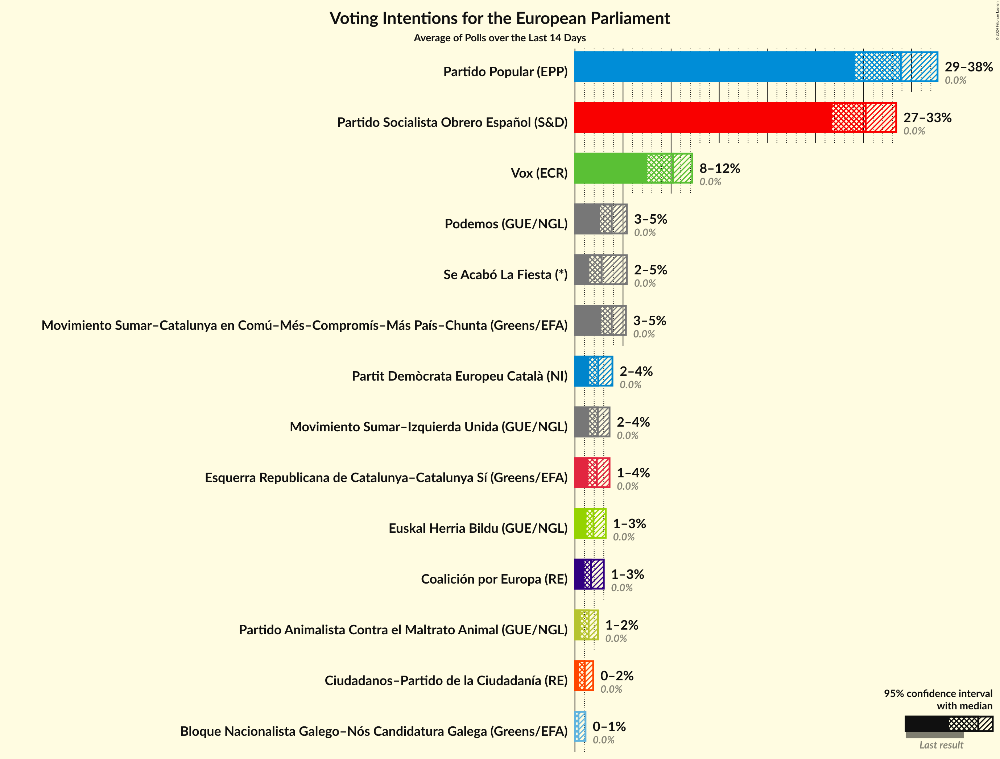

### Confidence Intervals

| Party | Last Result | Median | 80% Confidence Interval | 90% Confidence Interval | 95% Confidence Interval | 99% Confidence Interval |
|:-----:|:-----------:|:------:|:-----------------------:|:-----------------------:|:-----------------------:|:-----------------------:|
| <a href="#partido-popular-(epp)">Partido Popular (EPP)</a> | 0.0% | 33.9% | 30.9–36.3% |29.6–37.1% | 29.1–37.7% | 28.5–39.1% |
| <a href="#partido-socialista-obrero-español-(s&d)">Partido Socialista Obrero Español (S&D)</a> | 0.0% | 30.2% | 28.1–32.4% |27.4–33.0% | 26.7–33.4% | 25.4–34.7% |
| <a href="#unidos-podemos-(gue/ngl)">Unidos Podemos (GUE/NGL)</a> | 0.0% | N/A | N/A |N/A | N/A | N/A |
| <a href="#ciudadanos–partido-de-la-ciudadanía-(re)">Ciudadanos–Partido de la Ciudadanía (RE)</a> | 0.0% | 1.0% | 0.6–1.5% |0.5–1.7% | 0.4–1.9% | 0.3–2.3% |
| <a href="#esquerra-republicana-de-catalunya–catalunya-sí-(greens/efa)">Esquerra Republicana de Catalunya–Catalunya Sí (Greens/EFA)</a> | 0.0% | 2.3% | 1.7–3.0% |1.6–3.3% | 1.4–3.6% | 1.2–4.2% |
| <a href="#partit-demòcrata-europeu-català-(ni)">Partit Demòcrata Europeu Català (NI)</a> | 0.0% | 2.4% | 1.7–3.3% |1.6–3.6% | 1.5–3.9% | 1.3–4.5% |
| <a href="#euzko-alderdi-jeltzalea/partido-nacionalista-vasco-(re)">Euzko Alderdi Jeltzalea/Partido Nacionalista Vasco (RE)</a> | 0.0% | N/A | N/A |N/A | N/A | N/A |
| <a href="#partido-animalista-contra-el-maltrato-animal-(gue/ngl)">Partido Animalista Contra el Maltrato Animal (GUE/NGL)</a> | 0.0% | 1.4% | 0.8–2.0% |0.7–2.2% | 0.6–2.4% | 0.4–2.8% |
| <a href="#euskal-herria-bildu-(gue/ngl)">Euskal Herria Bildu (GUE/NGL)</a> | 0.0% | 1.9% | 1.5–2.7% |1.3–3.0% | 1.2–3.2% | 0.9–3.8% |
| <a href="#coalición-canaria–partido-nacionalista-canario-(re)">Coalición Canaria–Partido Nacionalista Canario (RE)</a> | 0.0% | N/A | N/A |N/A | N/A | N/A |
| <a href="#vox-(ecr)">Vox (ECR)</a> | 0.0% | 10.2% | 8.5–11.4% |8.0–11.8% | 7.5–12.2% | 6.6–13.1% |
| <a href="#bloque-nacionalista-galego-(greens/efa)">Bloque Nacionalista Galego (Greens/EFA)</a> | 0.0% | N/A | N/A |N/A | N/A | N/A |
| <a href="#bloque-nacionalista-galego–nós-candidatura-galega-(greens/efa)">Bloque Nacionalista Galego–Nós Candidatura Galega (Greens/EFA)</a> | 0.0% | 0.4% | 0.2–0.7% |0.2–0.9% | 0.1–1.1% | 0.1–1.5% |
| <a href="#ahora-repúblicas-(greens/efa)">Ahora Repúblicas (Greens/EFA)</a> | 0.0% | N/A | N/A |N/A | N/A | N/A |
| <a href="#coalición-por-europa-(re)">Coalición por Europa (RE)</a> | 0.0% | 1.7% | 1.2–2.5% |1.0–2.8% | 1.0–3.0% | 0.7–3.6% |
| <a href="#primavera-europea-(greens/efa)">Primavera Europea (Greens/EFA)</a> | 0.0% | N/A | N/A |N/A | N/A | N/A |
| <a href="#coalició-compromís-(greens/efa)">Coalició Compromís (Greens/EFA)</a> | 0.0% | N/A | N/A |N/A | N/A | N/A |
| <a href="#podemos-(gue/ngl)">Podemos (GUE/NGL)</a> | 0.0% | 3.8% | 3.0–4.7% |2.8–5.0% | 2.6–5.4% | 2.2–6.1% |
| <a href="#candidatura-d’unitat-popular-(gue/ngl)">Candidatura d’Unitat Popular (GUE/NGL)</a> | 0.0% | N/A | N/A |N/A | N/A | N/A |
| <a href="#unión-del-pueblo-navarro-(*)">Unión del Pueblo Navarro (*)</a> | 0.0% | N/A | N/A |N/A | N/A | N/A |
| <a href="#partido-regionalista-de-cantabria-(re)">Partido Regionalista de Cantabria (RE)</a> | 0.0% | N/A | N/A |N/A | N/A | N/A |
| <a href="#españa-vaciada-(ni)">España Vaciada (NI)</a> | 0.0% | N/A | N/A |N/A | N/A | N/A |
| <a href="#movimiento-sumar–podemos–izquierda-unida-(gue/ngl)">Movimiento Sumar–Podemos–Izquierda Unida (GUE/NGL)</a> | 0.0% | N/A | N/A |N/A | N/A | N/A |
| <a href="#movimiento-sumar–izquierda-unida-(gue/ngl)">Movimiento Sumar–Izquierda Unida (GUE/NGL)</a> | 0.0% | 2.4% | 1.8–3.1% |1.7–3.3% | 1.5–3.6% | 1.2–4.2% |
| <a href="#movimiento-sumar–catalunya-en-comú–més–compromís–más-país–chunta-(greens/efa)">Movimiento Sumar–Catalunya en Comú–Més–Compromís–Más País–Chunta (Greens/EFA)</a> | 0.0% | 3.8% | 3.1–4.7% |2.9–5.0% | 2.7–5.3% | 2.3–6.0% |
| <a href="#se-acabó-la-fiesta-(*)">Se Acabó La Fiesta (*)</a> | 0.0% | 2.8% | 1.9–4.3% |1.7–5.2% | 1.5–5.4% | 1.1–5.7% |

### Partido Socialista Obrero Español (S&D)

*For a full overview of the results for this party, see the [Partido Socialista Obrero Español (S&D)](party-partidosocialistaobreroespañolsd.html) page.*

| Voting Intentions | Probability | Accumulated | Special Marks |
|:-----------------:|:-----------:|:-----------:|:-------------:|
| 0.0–0.5% | 0% | 100% | Last Result |
| 0.5–1.5% | 0% | 100% |  |
| 1.5–2.5% | 0% | 100% |  |
| 2.5–3.5% | 0% | 100% |  |
| 3.5–4.5% | 0% | 100% |  |
| 4.5–5.5% | 0% | 100% |  |
| 5.5–6.5% | 0% | 100% |  |
| 6.5–7.5% | 0% | 100% |  |
| 7.5–8.5% | 0% | 100% |  |
| 8.5–9.5% | 0% | 100% |  |
| 9.5–10.5% | 0% | 100% |  |
| 10.5–11.5% | 0% | 100% |  |
| 11.5–12.5% | 0% | 100% |  |
| 12.5–13.5% | 0% | 100% |  |
| 13.5–14.5% | 0% | 100% |  |
| 14.5–15.5% | 0% | 100% |  |
| 15.5–16.5% | 0% | 100% |  |
| 16.5–17.5% | 0% | 100% |  |
| 17.5–18.5% | 0% | 100% |  |
| 18.5–19.5% | 0% | 100% |  |
| 19.5–20.5% | 0% | 100% |  |
| 20.5–21.5% | 0% | 100% |  |
| 21.5–22.5% | 0% | 100% |  |
| 22.5–23.5% | 0% | 100% |  |
| 23.5–24.5% | 0.1% | 100% |  |
| 24.5–25.5% | 0.5% | 99.9% |  |
| 25.5–26.5% | 2% | 99.4% |  |
| 26.5–27.5% | 4% | 98% |  |
| 27.5–28.5% | 9% | 94% |  |
| 28.5–29.5% | 19% | 84% |  |
| 29.5–30.5% | 24% | 66% | Median |
| 30.5–31.5% | 19% | 42% |  |
| 31.5–32.5% | 13% | 22% |  |
| 32.5–33.5% | 6% | 9% |  |
| 33.5–34.5% | 2% | 2% |  |
| 34.5–35.5% | 0.4% | 0.6% |  |
| 35.5–36.5% | 0.1% | 0.2% |  |
| 36.5–37.5% | 0% | 0% |  |

### Podemos (GUE/NGL)

*For a full overview of the results for this party, see the [Podemos (GUE/NGL)](party-podemosguengl.html) page.*

| Voting Intentions | Probability | Accumulated | Special Marks |
|:-----------------:|:-----------:|:-----------:|:-------------:|
| 0.0–0.5% | 0% | 100% | Last Result |
| 0.5–1.5% | 0% | 100% |  |
| 1.5–2.5% | 2% | 100% |  |
| 2.5–3.5% | 31% | 98% |  |
| 3.5–4.5% | 54% | 67% | Median |
| 4.5–5.5% | 12% | 13% |  |
| 5.5–6.5% | 1.5% | 2% |  |
| 6.5–7.5% | 0.1% | 0.2% |  |
| 7.5–8.5% | 0% | 0% |  |

### Esquerra Republicana de Catalunya–Catalunya Sí (Greens/EFA)

*For a full overview of the results for this party, see the [Esquerra Republicana de Catalunya–Catalunya Sí (Greens/EFA)](party-esquerrarepublicanadecatalunya–catalunyasígreensefa.html) page.*

| Voting Intentions | Probability | Accumulated | Special Marks |
|:-----------------:|:-----------:|:-----------:|:-------------:|
| 0.0–0.5% | 0% | 100% | Last Result |
| 0.5–1.5% | 5% | 100% |  |
| 1.5–2.5% | 66% | 95% | Median |
| 2.5–3.5% | 27% | 30% |  |
| 3.5–4.5% | 3% | 3% |  |
| 4.5–5.5% | 0.2% | 0.2% |  |
| 5.5–6.5% | 0% | 0% |  |

### Euskal Herria Bildu (GUE/NGL)

*For a full overview of the results for this party, see the [Euskal Herria Bildu (GUE/NGL)](party-euskalherriabilduguengl.html) page.*

| Voting Intentions | Probability | Accumulated | Special Marks |
|:-----------------:|:-----------:|:-----------:|:-------------:|
| 0.0–0.5% | 0% | 100% | Last Result |
| 0.5–1.5% | 15% | 100% |  |
| 1.5–2.5% | 71% | 85% | Median |
| 2.5–3.5% | 13% | 14% |  |
| 3.5–4.5% | 1.0% | 1.1% |  |
| 4.5–5.5% | 0.1% | 0.1% |  |
| 5.5–6.5% | 0% | 0% |  |

### Bloque Nacionalista Galego–Nós Candidatura Galega (Greens/EFA)

*For a full overview of the results for this party, see the [Bloque Nacionalista Galego–Nós Candidatura Galega (Greens/EFA)](party-bloquenacionalistagalego–nóscandidaturagalegagreensefa.html) page.*

| Voting Intentions | Probability | Accumulated | Special Marks |
|:-----------------:|:-----------:|:-----------:|:-------------:|
| 0.0–0.5% | 77% | 100% | Last Result, Median |
| 0.5–1.5% | 23% | 23% |  |
| 1.5–2.5% | 0.3% | 0.3% |  |
| 2.5–3.5% | 0% | 0% |  |

### Coalición por Europa (RE)

*For a full overview of the results for this party, see the [Coalición por Europa (RE)](party-coaliciónporeuropare.html) page.*

| Voting Intentions | Probability | Accumulated | Special Marks |
|:-----------------:|:-----------:|:-----------:|:-------------:|
| 0.0–0.5% | 0.1% | 100% | Last Result |
| 0.5–1.5% | 42% | 99.9% |  |
| 1.5–2.5% | 49% | 58% | Median |
| 2.5–3.5% | 8% | 9% |  |
| 3.5–4.5% | 0.5% | 0.5% |  |
| 4.5–5.5% | 0% | 0% |  |

### Partido Popular (EPP)

*For a full overview of the results for this party, see the [Partido Popular (EPP)](party-partidopopularepp.html) page.*

| Voting Intentions | Probability | Accumulated | Special Marks |
|:-----------------:|:-----------:|:-----------:|:-------------:|
| 0.0–0.5% | 0% | 100% | Last Result |
| 0.5–1.5% | 0% | 100% |  |
| 1.5–2.5% | 0% | 100% |  |
| 2.5–3.5% | 0% | 100% |  |
| 3.5–4.5% | 0% | 100% |  |
| 4.5–5.5% | 0% | 100% |  |
| 5.5–6.5% | 0% | 100% |  |
| 6.5–7.5% | 0% | 100% |  |
| 7.5–8.5% | 0% | 100% |  |
| 8.5–9.5% | 0% | 100% |  |
| 9.5–10.5% | 0% | 100% |  |
| 10.5–11.5% | 0% | 100% |  |
| 11.5–12.5% | 0% | 100% |  |
| 12.5–13.5% | 0% | 100% |  |
| 13.5–14.5% | 0% | 100% |  |
| 14.5–15.5% | 0% | 100% |  |
| 15.5–16.5% | 0% | 100% |  |
| 16.5–17.5% | 0% | 100% |  |
| 17.5–18.5% | 0% | 100% |  |
| 18.5–19.5% | 0% | 100% |  |
| 19.5–20.5% | 0% | 100% |  |
| 20.5–21.5% | 0% | 100% |  |
| 21.5–22.5% | 0% | 100% |  |
| 22.5–23.5% | 0% | 100% |  |
| 23.5–24.5% | 0% | 100% |  |
| 24.5–25.5% | 0% | 100% |  |
| 25.5–26.5% | 0% | 100% |  |
| 26.5–27.5% | 0% | 100% |  |
| 27.5–28.5% | 0.5% | 99.9% |  |
| 28.5–29.5% | 4% | 99.4% |  |
| 29.5–30.5% | 4% | 95% |  |
| 30.5–31.5% | 4% | 91% |  |
| 31.5–32.5% | 10% | 87% |  |
| 32.5–33.5% | 19% | 77% |  |
| 33.5–34.5% | 22% | 57% | Median |
| 34.5–35.5% | 17% | 35% |  |
| 35.5–36.5% | 11% | 19% |  |
| 36.5–37.5% | 5% | 8% |  |
| 37.5–38.5% | 2% | 3% |  |
| 38.5–39.5% | 0.7% | 1.0% |  |
| 39.5–40.5% | 0.2% | 0.3% |  |
| 40.5–41.5% | 0.1% | 0.1% |  |
| 41.5–42.5% | 0% | 0% |  |

### Movimiento Sumar–Catalunya en Comú–Més–Compromís–Más País–Chunta (Greens/EFA)

*For a full overview of the results for this party, see the [Movimiento Sumar–Catalunya en Comú–Més–Compromís–Más País–Chunta (Greens/EFA)](party-movimientosumar–catalunyaencomú–més–compromís–máspaís–chuntagreensefa.html) page.*

| Voting Intentions | Probability | Accumulated | Special Marks |
|:-----------------:|:-----------:|:-----------:|:-------------:|
| 0.0–0.5% | 0% | 100% | Last Result |
| 0.5–1.5% | 0% | 100% |  |
| 1.5–2.5% | 1.4% | 100% |  |
| 2.5–3.5% | 30% | 98.6% |  |
| 3.5–4.5% | 55% | 68% | Median |
| 4.5–5.5% | 12% | 13% |  |
| 5.5–6.5% | 1.4% | 2% |  |
| 6.5–7.5% | 0.1% | 0.1% |  |
| 7.5–8.5% | 0% | 0% |  |

### Movimiento Sumar–Izquierda Unida (GUE/NGL)

*For a full overview of the results for this party, see the [Movimiento Sumar–Izquierda Unida (GUE/NGL)](party-movimientosumar–izquierdaunidaguengl.html) page.*

| Voting Intentions | Probability | Accumulated | Special Marks |
|:-----------------:|:-----------:|:-----------:|:-------------:|
| 0.0–0.5% | 0% | 100% | Last Result |
| 0.5–1.5% | 3% | 100% |  |
| 1.5–2.5% | 62% | 97% | Median |
| 2.5–3.5% | 32% | 35% |  |
| 3.5–4.5% | 3% | 3% |  |
| 4.5–5.5% | 0.1% | 0.2% |  |
| 5.5–6.5% | 0% | 0% |  |

### Se Acabó La Fiesta (*)

*For a full overview of the results for this party, see the [Se Acabó La Fiesta (*)](party-seacabólafiesta.html) page.*

| Voting Intentions | Probability | Accumulated | Special Marks |
|:-----------------:|:-----------:|:-----------:|:-------------:|
| 0.0–0.5% | 0% | 100% | Last Result |
| 0.5–1.5% | 4% | 100% |  |
| 1.5–2.5% | 36% | 96% |  |
| 2.5–3.5% | 40% | 60% | Median |
| 3.5–4.5% | 11% | 20% |  |
| 4.5–5.5% | 8% | 9% |  |
| 5.5–6.5% | 1.5% | 1.5% |  |
| 6.5–7.5% | 0% | 0% |  |

### Vox (ECR)

*For a full overview of the results for this party, see the [Vox (ECR)](party-voxecr.html) page.*

| Voting Intentions | Probability | Accumulated | Special Marks |
|:-----------------:|:-----------:|:-----------:|:-------------:|
| 0.0–0.5% | 0% | 100% | Last Result |
| 0.5–1.5% | 0% | 100% |  |
| 1.5–2.5% | 0% | 100% |  |
| 2.5–3.5% | 0% | 100% |  |
| 3.5–4.5% | 0% | 100% |  |
| 4.5–5.5% | 0% | 100% |  |
| 5.5–6.5% | 0.4% | 100% |  |
| 6.5–7.5% | 2% | 99.6% |  |
| 7.5–8.5% | 8% | 97% |  |
| 8.5–9.5% | 19% | 89% |  |
| 9.5–10.5% | 36% | 70% | Median |
| 10.5–11.5% | 27% | 34% |  |
| 11.5–12.5% | 6% | 8% |  |
| 12.5–13.5% | 1.2% | 1.4% |  |
| 13.5–14.5% | 0.2% | 0.2% |  |
| 14.5–15.5% | 0% | 0% |  |

### Partit Demòcrata Europeu Català (NI)

*For a full overview of the results for this party, see the [Partit Demòcrata Europeu Català (NI)](party-partitdemòcrataeuropeucatalàni.html) page.*

| Voting Intentions | Probability | Accumulated | Special Marks |
|:-----------------:|:-----------:|:-----------:|:-------------:|
| 0.0–0.5% | 0% | 100% | Last Result |
| 0.5–1.5% | 5% | 100% |  |
| 1.5–2.5% | 54% | 95% | Median |
| 2.5–3.5% | 36% | 41% |  |
| 3.5–4.5% | 5% | 5% |  |
| 4.5–5.5% | 0.4% | 0.5% |  |
| 5.5–6.5% | 0% | 0% |  |

### Ciudadanos–Partido de la Ciudadanía (RE)

*For a full overview of the results for this party, see the [Ciudadanos–Partido de la Ciudadanía (RE)](party-ciudadanos–partidodelaciudadaníare.html) page.*

| Voting Intentions | Probability | Accumulated | Special Marks |
|:-----------------:|:-----------:|:-----------:|:-------------:|
| 0.0–0.5% | 6% | 100% | Last Result |
| 0.5–1.5% | 84% | 94% | Median |
| 1.5–2.5% | 10% | 10% |  |
| 2.5–3.5% | 0.2% | 0.2% |  |
| 3.5–4.5% | 0% | 0% |  |

### Partido Animalista Contra el Maltrato Animal (GUE/NGL)

*For a full overview of the results for this party, see the [Partido Animalista Contra el Maltrato Animal (GUE/NGL)](party-partidoanimalistacontraelmaltratoanimalguengl.html) page.*

| Voting Intentions | Probability | Accumulated | Special Marks |
|:-----------------:|:-----------:|:-----------:|:-------------:|
| 0.0–0.5% | 2% | 100% | Last Result |
| 0.5–1.5% | 61% | 98% | Median |
| 1.5–2.5% | 36% | 38% |  |
| 2.5–3.5% | 1.5% | 1.5% |  |
| 3.5–4.5% | 0% | 0% |  |

## Seats

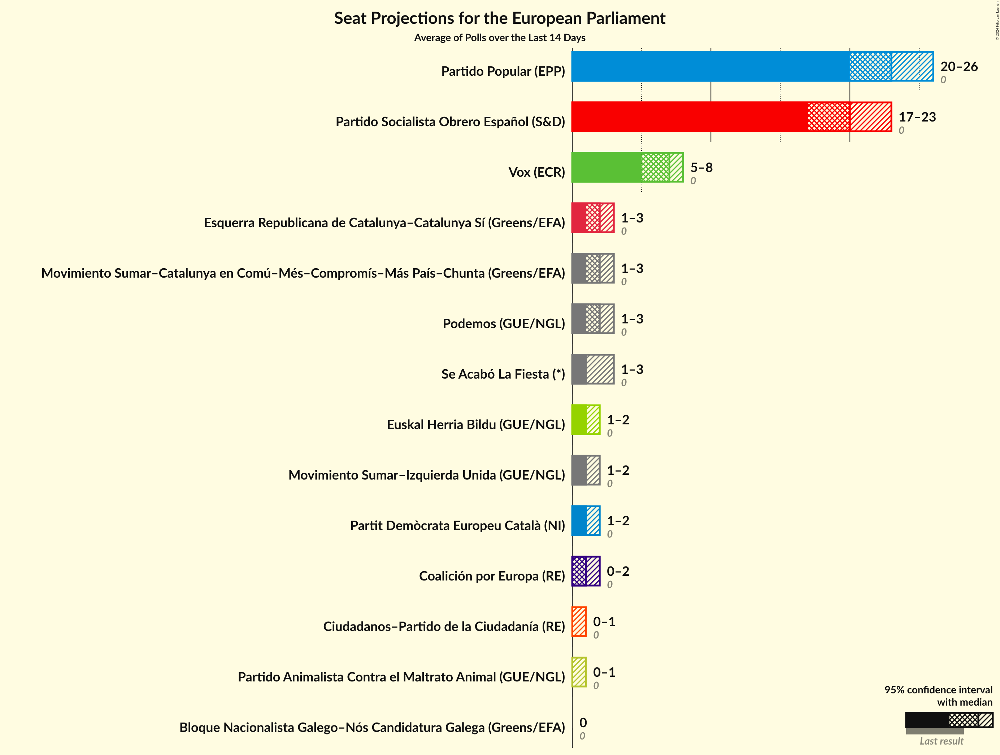

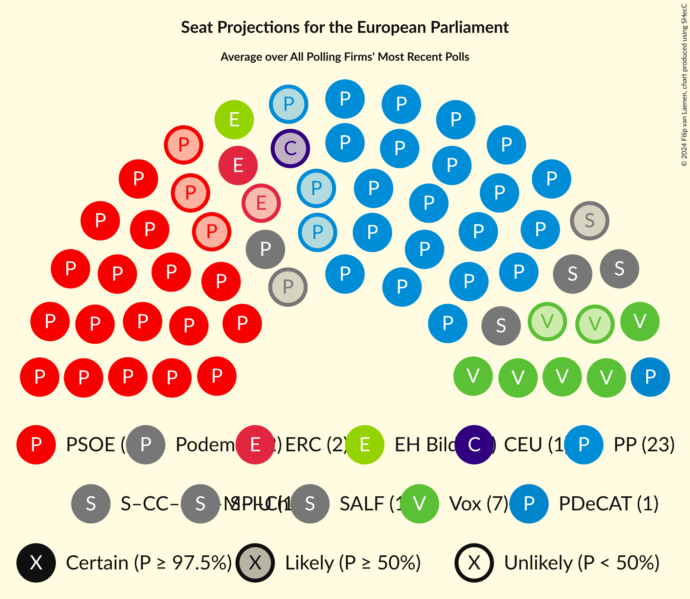

### Confidence Intervals

| Party | Last Result | Median | 80% Confidence Interval | 90% Confidence Interval | 95% Confidence Interval | 99% Confidence Interval |
|:-----:|:-----------:|:------:|:-----------------------:|:-----------------------:|:-----------------------:|:-----------------------:|
| <a href="#partido-popular-(epp)">Partido Popular (EPP)</a> | 0 | 23 | 21–25 |20–26 | 20–26 | 19–26 |
| <a href="#partido-socialista-obrero-español-(s&d)">Partido Socialista Obrero Español (S&D)</a> | 0 | 20 | 18–22 |18–22 | 17–23 | 17–24 |
| <a href="#unidos-podemos-(gue/ngl)">Unidos Podemos (GUE/NGL)</a> | 0 | N/A | N/A |N/A | N/A | N/A |
| <a href="#ciudadanos–partido-de-la-ciudadanía-(re)">Ciudadanos–Partido de la Ciudadanía (RE)</a> | 0 | 0 | 0–1 |0–1 | 0–1 | 0–1 |
| <a href="#esquerra-republicana-de-catalunya–catalunya-sí-(greens/efa)">Esquerra Republicana de Catalunya–Catalunya Sí (Greens/EFA)</a> | 0 | 2 | 1–2 |1–2 | 1–3 | 1–3 |
| <a href="#partit-demòcrata-europeu-català-(ni)">Partit Demòcrata Europeu Català (NI)</a> | 0 | 1 | 1–2 |1–2 | 1–2 | 0–3 |
| <a href="#euzko-alderdi-jeltzalea/partido-nacionalista-vasco-(re)">Euzko Alderdi Jeltzalea/Partido Nacionalista Vasco (RE)</a> | 0 | N/A | N/A |N/A | N/A | N/A |
| <a href="#partido-animalista-contra-el-maltrato-animal-(gue/ngl)">Partido Animalista Contra el Maltrato Animal (GUE/NGL)</a> | 0 | 0 | 0–1 |0–1 | 0–1 | 0–1 |
| <a href="#euskal-herria-bildu-(gue/ngl)">Euskal Herria Bildu (GUE/NGL)</a> | 0 | 1 | 1–2 |1–2 | 1–2 | 0–3 |
| <a href="#coalición-canaria–partido-nacionalista-canario-(re)">Coalición Canaria–Partido Nacionalista Canario (RE)</a> | 0 | N/A | N/A |N/A | N/A | N/A |
| <a href="#vox-(ecr)">Vox (ECR)</a> | 0 | 7 | 5–7 |5–8 | 5–8 | 4–8 |
| <a href="#bloque-nacionalista-galego-(greens/efa)">Bloque Nacionalista Galego (Greens/EFA)</a> | 0 | N/A | N/A |N/A | N/A | N/A |
| <a href="#bloque-nacionalista-galego–nós-candidatura-galega-(greens/efa)">Bloque Nacionalista Galego–Nós Candidatura Galega (Greens/EFA)</a> | 0 | 0 | 0 |0 | 0 | 0–1 |
| <a href="#ahora-repúblicas-(greens/efa)">Ahora Repúblicas (Greens/EFA)</a> | 0 | N/A | N/A |N/A | N/A | N/A |
| <a href="#coalición-por-europa-(re)">Coalición por Europa (RE)</a> | 0 | 1 | 0–1 |0–1 | 0–2 | 0–2 |
| <a href="#primavera-europea-(greens/efa)">Primavera Europea (Greens/EFA)</a> | 0 | N/A | N/A |N/A | N/A | N/A |
| <a href="#coalició-compromís-(greens/efa)">Coalició Compromís (Greens/EFA)</a> | 0 | N/A | N/A |N/A | N/A | N/A |
| <a href="#podemos-(gue/ngl)">Podemos (GUE/NGL)</a> | 0 | 2 | 1–3 |1–3 | 1–3 | 1–4 |
| <a href="#candidatura-d’unitat-popular-(gue/ngl)">Candidatura d’Unitat Popular (GUE/NGL)</a> | 0 | N/A | N/A |N/A | N/A | N/A |
| <a href="#unión-del-pueblo-navarro-(*)">Unión del Pueblo Navarro (*)</a> | 0 | N/A | N/A |N/A | N/A | N/A |
| <a href="#partido-regionalista-de-cantabria-(re)">Partido Regionalista de Cantabria (RE)</a> | 0 | N/A | N/A |N/A | N/A | N/A |
| <a href="#españa-vaciada-(ni)">España Vaciada (NI)</a> | 0 | N/A | N/A |N/A | N/A | N/A |
| <a href="#movimiento-sumar–podemos–izquierda-unida-(gue/ngl)">Movimiento Sumar–Podemos–Izquierda Unida (GUE/NGL)</a> | 0 | N/A | N/A |N/A | N/A | N/A |
| <a href="#movimiento-sumar–izquierda-unida-(gue/ngl)">Movimiento Sumar–Izquierda Unida (GUE/NGL)</a> | 0 | 1 | 1–2 |1–2 | 1–2 | 0–2 |
| <a href="#movimiento-sumar–catalunya-en-comú–més–compromís–más-país–chunta-(greens/efa)">Movimiento Sumar–Catalunya en Comú–Més–Compromís–Más País–Chunta (Greens/EFA)</a> | 0 | 2 | 2–3 |1–3 | 1–3 | 1–4 |
| <a href="#se-acabó-la-fiesta-(*)">Se Acabó La Fiesta (*)</a> | 0 | 1 | 1–2 |1–3 | 1–3 | 0–4 |

### Partido Popular (EPP)

*For a full overview of the results for this party, see the [Partido Popular (EPP)](party-partidopopularepp.html) page.*

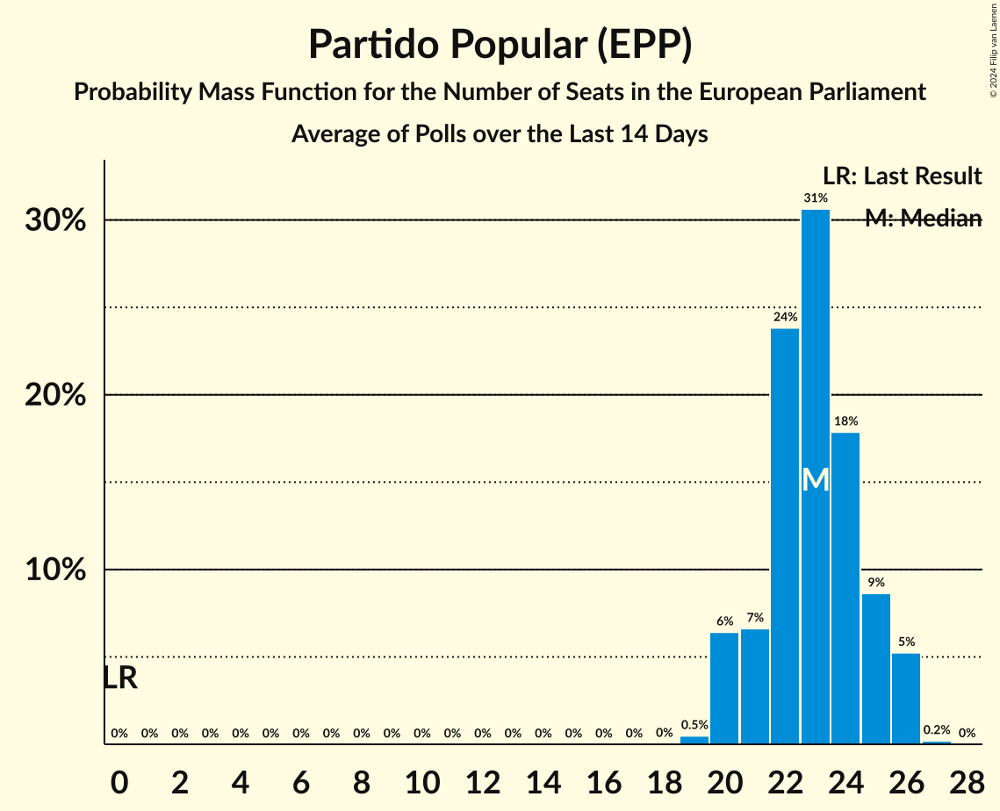

| Number of Seats | Probability | Accumulated | Special Marks |
|:---------------:|:-----------:|:-----------:|:-------------:|
| 0 | 0% | 100% | Last Result |
| 1 | 0% | 100% |  |
| 2 | 0% | 100% |  |
| 3 | 0% | 100% |  |
| 4 | 0% | 100% |  |
| 5 | 0% | 100% |  |
| 6 | 0% | 100% |  |
| 7 | 0% | 100% |  |
| 8 | 0% | 100% |  |
| 9 | 0% | 100% |  |
| 10 | 0% | 100% |  |
| 11 | 0% | 100% |  |
| 12 | 0% | 100% |  |
| 13 | 0% | 100% |  |
| 14 | 0% | 100% |  |
| 15 | 0% | 100% |  |
| 16 | 0% | 100% |  |
| 17 | 0% | 100% |  |
| 18 | 0% | 100% |  |
| 19 | 0.5% | 100% |  |
| 20 | 6% | 99.5% |  |
| 21 | 7% | 93% |  |
| 22 | 24% | 86% |  |
| 23 | 31% | 63% | Median |
| 24 | 18% | 32% |  |
| 25 | 9% | 14% |  |
| 26 | 5% | 5% |  |
| 27 | 0.2% | 0.2% |  |
| 28 | 0% | 0% |  |

### Partido Socialista Obrero Español (S&D)

*For a full overview of the results for this party, see the [Partido Socialista Obrero Español (S&D)](party-partidosocialistaobreroespañolsd.html) page.*

| Number of Seats | Probability | Accumulated | Special Marks |
|:---------------:|:-----------:|:-----------:|:-------------:|
| 0 | 0% | 100% | Last Result |
| 1 | 0% | 100% |  |
| 2 | 0% | 100% |  |
| 3 | 0% | 100% |  |
| 4 | 0% | 100% |  |
| 5 | 0% | 100% |  |
| 6 | 0% | 100% |  |
| 7 | 0% | 100% |  |
| 8 | 0% | 100% |  |
| 9 | 0% | 100% |  |
| 10 | 0% | 100% |  |
| 11 | 0% | 100% |  |
| 12 | 0% | 100% |  |
| 13 | 0% | 100% |  |
| 14 | 0% | 100% |  |
| 15 | 0% | 100% |  |
| 16 | 0.2% | 100% |  |
| 17 | 2% | 99.8% |  |
| 18 | 9% | 97% |  |
| 19 | 22% | 89% |  |
| 20 | 29% | 66% | Median |
| 21 | 15% | 37% |  |
| 22 | 17% | 21% |  |
| 23 | 4% | 4% |  |
| 24 | 0.7% | 0.8% |  |
| 25 | 0.1% | 0.1% |  |
| 26 | 0% | 0% |  |

### Unidos Podemos (GUE/NGL)

*For a full overview of the results for this party, see the [Unidos Podemos (GUE/NGL)](party-unidospodemosguengl.html) page.*

### Ciudadanos–Partido de la Ciudadanía (RE)

*For a full overview of the results for this party, see the [Ciudadanos–Partido de la Ciudadanía (RE)](party-ciudadanos–partidodelaciudadaníare.html) page.*

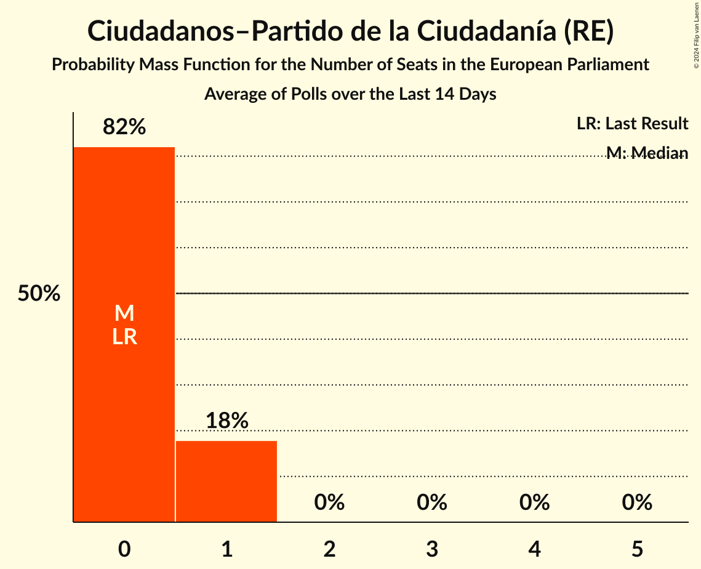

| Number of Seats | Probability | Accumulated | Special Marks |
|:---------------:|:-----------:|:-----------:|:-------------:|
| 0 | 82% | 100% | Last Result, Median |
| 1 | 18% | 18% |  |
| 2 | 0% | 0% |  |

### Esquerra Republicana de Catalunya–Catalunya Sí (Greens/EFA)

*For a full overview of the results for this party, see the [Esquerra Republicana de Catalunya–Catalunya Sí (Greens/EFA)](party-esquerrarepublicanadecatalunya–catalunyasígreensefa.html) page.*

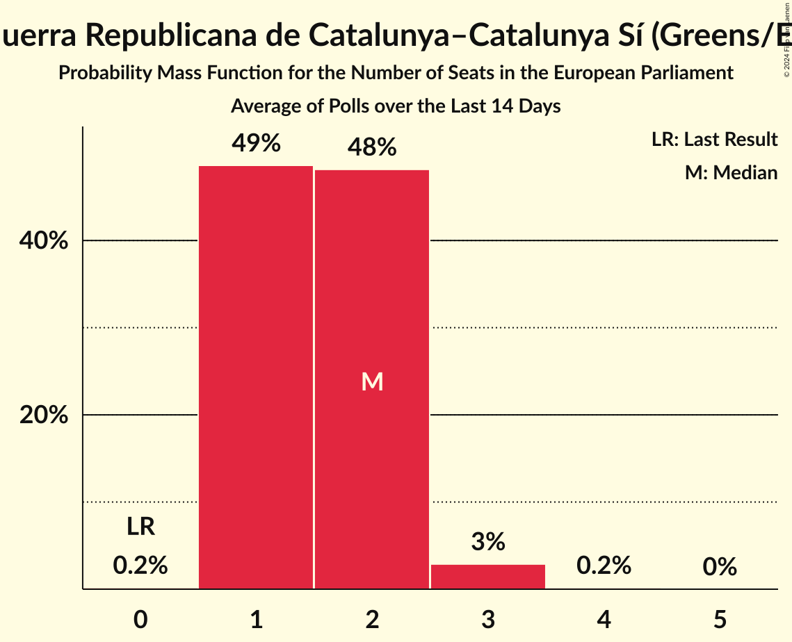

| Number of Seats | Probability | Accumulated | Special Marks |
|:---------------:|:-----------:|:-----------:|:-------------:|
| 0 | 0.2% | 100% | Last Result |
| 1 | 49% | 99.8% |  |
| 2 | 48% | 51% | Median |
| 3 | 3% | 3% |  |
| 4 | 0.2% | 0.2% |  |
| 5 | 0% | 0% |  |

### Partit Demòcrata Europeu Català (NI)

*For a full overview of the results for this party, see the [Partit Demòcrata Europeu Català (NI)](party-partitdemòcrataeuropeucatalàni.html) page.*

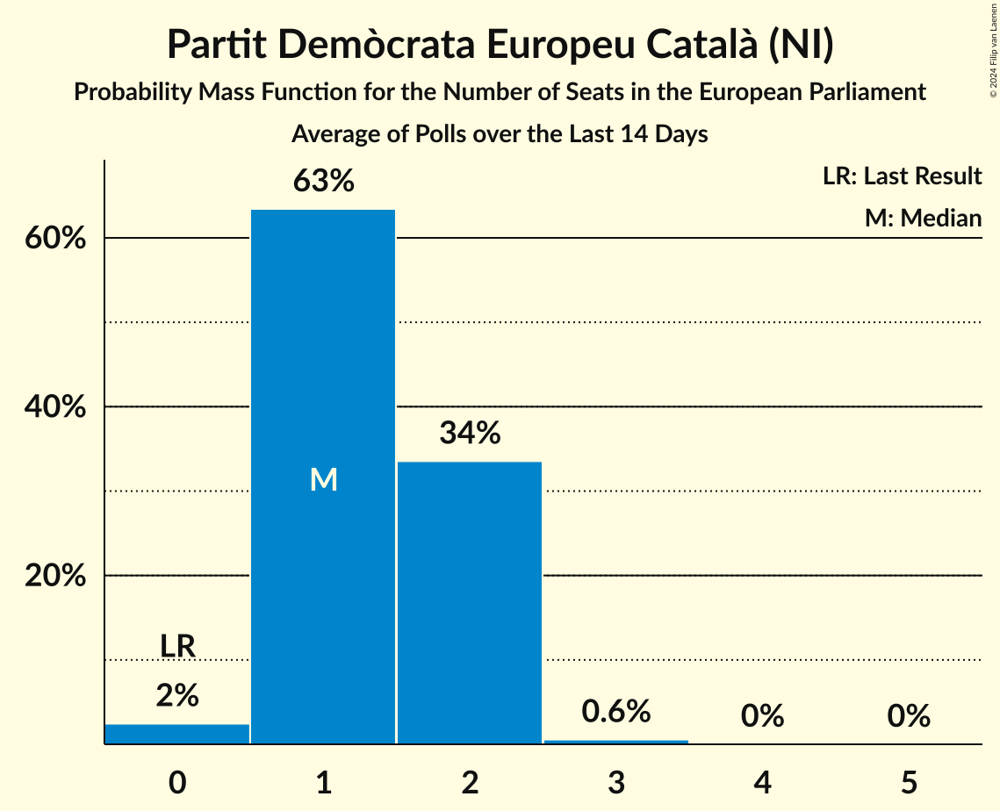

| Number of Seats | Probability | Accumulated | Special Marks |
|:---------------:|:-----------:|:-----------:|:-------------:|
| 0 | 2% | 100% | Last Result |
| 1 | 63% | 98% | Median |
| 2 | 34% | 34% |  |
| 3 | 0.6% | 0.6% |  |
| 4 | 0% | 0% |  |

### Euzko Alderdi Jeltzalea/Partido Nacionalista Vasco (RE)

*For a full overview of the results for this party, see the [Euzko Alderdi Jeltzalea/Partido Nacionalista Vasco (RE)](party-euzkoalderdijeltzaleapartidonacionalistavascore.html) page.*

### Partido Animalista Contra el Maltrato Animal (GUE/NGL)

*For a full overview of the results for this party, see the [Partido Animalista Contra el Maltrato Animal (GUE/NGL)](party-partidoanimalistacontraelmaltratoanimalguengl.html) page.*

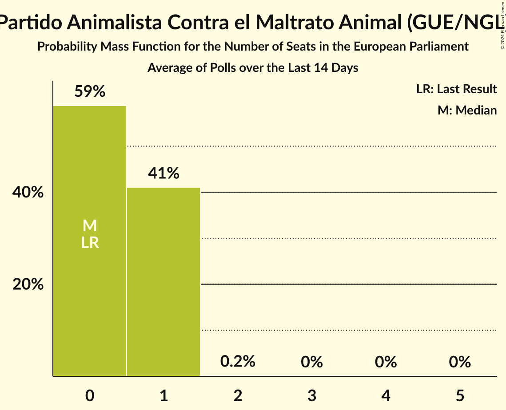

| Number of Seats | Probability | Accumulated | Special Marks |
|:---------------:|:-----------:|:-----------:|:-------------:|
| 0 | 59% | 100% | Last Result, Median |
| 1 | 41% | 41% |  |
| 2 | 0.2% | 0.2% |  |
| 3 | 0% | 0% |  |

### Euskal Herria Bildu (GUE/NGL)

*For a full overview of the results for this party, see the [Euskal Herria Bildu (GUE/NGL)](party-euskalherriabilduguengl.html) page.*

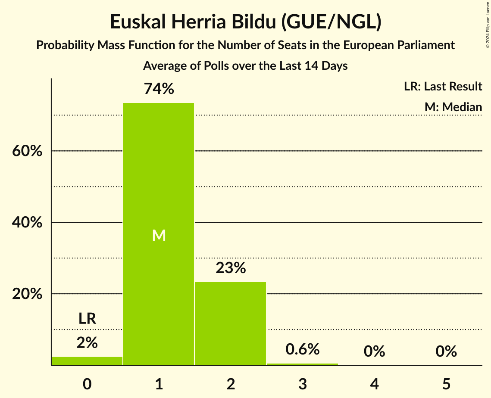

| Number of Seats | Probability | Accumulated | Special Marks |
|:---------------:|:-----------:|:-----------:|:-------------:|
| 0 | 2% | 100% | Last Result |
| 1 | 74% | 98% | Median |
| 2 | 23% | 24% |  |
| 3 | 0.6% | 0.6% |  |
| 4 | 0% | 0% |  |

### Coalición Canaria–Partido Nacionalista Canario (RE)

*For a full overview of the results for this party, see the [Coalición Canaria–Partido Nacionalista Canario (RE)](party-coalicióncanaria–partidonacionalistacanariore.html) page.*

### Vox (ECR)

*For a full overview of the results for this party, see the [Vox (ECR)](party-voxecr.html) page.*

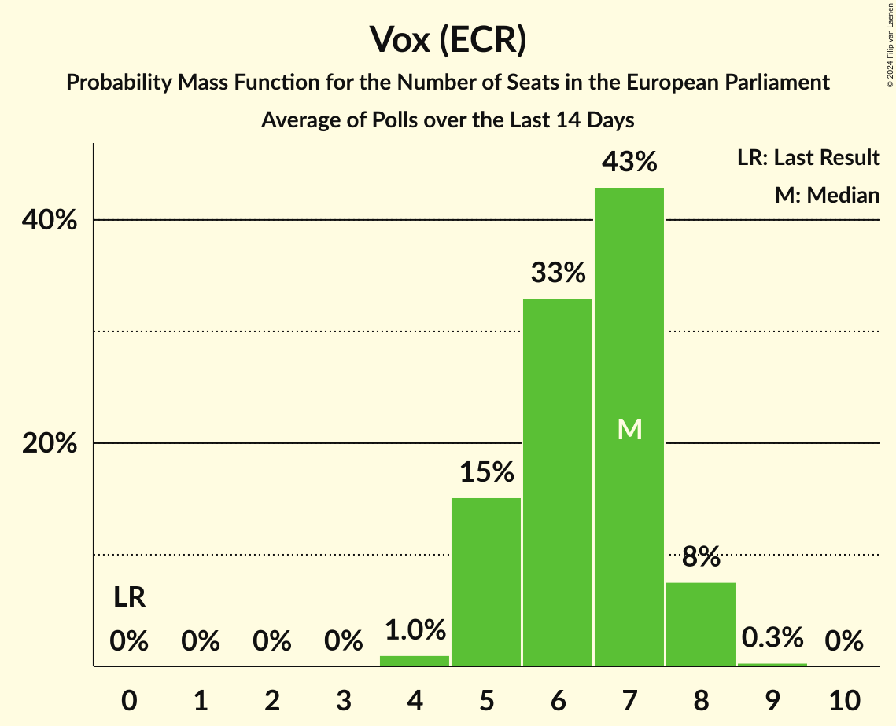

| Number of Seats | Probability | Accumulated | Special Marks |
|:---------------:|:-----------:|:-----------:|:-------------:|
| 0 | 0% | 100% | Last Result |
| 1 | 0% | 100% |  |
| 2 | 0% | 100% |  |
| 3 | 0% | 100% |  |
| 4 | 1.0% | 100% |  |
| 5 | 15% | 99.0% |  |
| 6 | 33% | 84% |  |
| 7 | 43% | 51% | Median |
| 8 | 8% | 8% |  |
| 9 | 0.3% | 0.3% |  |
| 10 | 0% | 0% |  |

### Bloque Nacionalista Galego (Greens/EFA)

*For a full overview of the results for this party, see the [Bloque Nacionalista Galego (Greens/EFA)](party-bloquenacionalistagalegogreensefa.html) page.*

### Bloque Nacionalista Galego–Nós Candidatura Galega (Greens/EFA)

*For a full overview of the results for this party, see the [Bloque Nacionalista Galego–Nós Candidatura Galega (Greens/EFA)](party-bloquenacionalistagalego–nóscandidaturagalegagreensefa.html) page.*

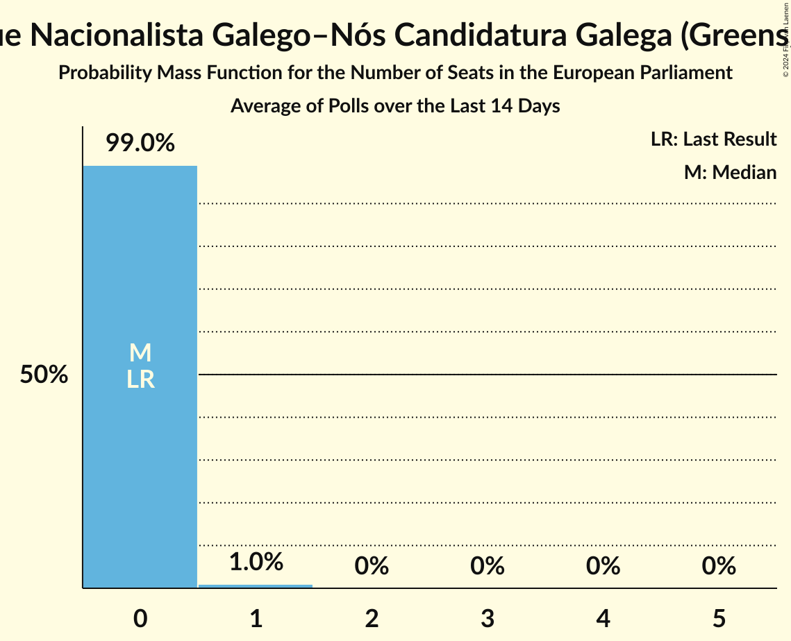

| Number of Seats | Probability | Accumulated | Special Marks |
|:---------------:|:-----------:|:-----------:|:-------------:|
| 0 | 99.0% | 100% | Last Result, Median |
| 1 | 1.0% | 1.0% |  |
| 2 | 0% | 0% |  |

### Ahora Repúblicas (Greens/EFA)

*For a full overview of the results for this party, see the [Ahora Repúblicas (Greens/EFA)](party-ahorarepúblicasgreensefa.html) page.*

### Coalición por Europa (RE)

*For a full overview of the results for this party, see the [Coalición por Europa (RE)](party-coaliciónporeuropare.html) page.*

| Number of Seats | Probability | Accumulated | Special Marks |
|:---------------:|:-----------:|:-----------:|:-------------:|
| 0 | 39% | 100% | Last Result |
| 1 | 57% | 61% | Median |
| 2 | 3% | 3% |  |
| 3 | 0% | 0% |  |

### Primavera Europea (Greens/EFA)

*For a full overview of the results for this party, see the [Primavera Europea (Greens/EFA)](party-primaveraeuropeagreensefa.html) page.*

### Coalició Compromís (Greens/EFA)

*For a full overview of the results for this party, see the [Coalició Compromís (Greens/EFA)](party-coaliciócompromísgreensefa.html) page.*

### Podemos (GUE/NGL)

*For a full overview of the results for this party, see the [Podemos (GUE/NGL)](party-podemosguengl.html) page.*

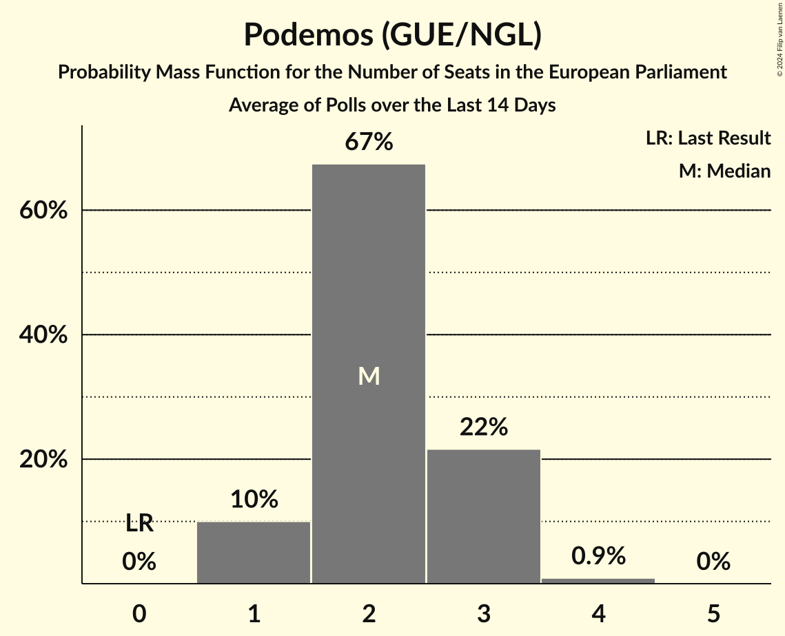

| Number of Seats | Probability | Accumulated | Special Marks |
|:---------------:|:-----------:|:-----------:|:-------------:|
| 0 | 0% | 100% | Last Result |
| 1 | 10% | 100% |  |
| 2 | 67% | 90% | Median |
| 3 | 22% | 23% |  |
| 4 | 0.9% | 0.9% |  |
| 5 | 0% | 0% |  |

### Candidatura d’Unitat Popular (GUE/NGL)

*For a full overview of the results for this party, see the [Candidatura d’Unitat Popular (GUE/NGL)](party-candidaturad’unitatpopularguengl.html) page.*

### Unión del Pueblo Navarro (*)

*For a full overview of the results for this party, see the [Unión del Pueblo Navarro (*)](party-unióndelpueblonavarro.html) page.*

### Partido Regionalista de Cantabria (RE)

*For a full overview of the results for this party, see the [Partido Regionalista de Cantabria (RE)](party-partidoregionalistadecantabriare.html) page.*

### España Vaciada (NI)

*For a full overview of the results for this party, see the [España Vaciada (NI)](party-españavaciadani.html) page.*

### Movimiento Sumar–Podemos–Izquierda Unida (GUE/NGL)

*For a full overview of the results for this party, see the [Movimiento Sumar–Podemos–Izquierda Unida (GUE/NGL)](party-movimientosumar–podemos–izquierdaunidaguengl.html) page.*

### Movimiento Sumar–Izquierda Unida (GUE/NGL)

*For a full overview of the results for this party, see the [Movimiento Sumar–Izquierda Unida (GUE/NGL)](party-movimientosumar–izquierdaunidaguengl.html) page.*

| Number of Seats | Probability | Accumulated | Special Marks |
|:---------------:|:-----------:|:-----------:|:-------------:|
| 0 | 1.1% | 100% | Last Result |
| 1 | 85% | 98.9% | Median |
| 2 | 13% | 14% |  |
| 3 | 0.2% | 0.2% |  |
| 4 | 0% | 0% |  |

### Movimiento Sumar–Catalunya en Comú–Més–Compromís–Más País–Chunta (Greens/EFA)

*For a full overview of the results for this party, see the [Movimiento Sumar–Catalunya en Comú–Més–Compromís–Más País–Chunta (Greens/EFA)](party-movimientosumar–catalunyaencomú–més–compromís–máspaís–chuntagreensefa.html) page.*

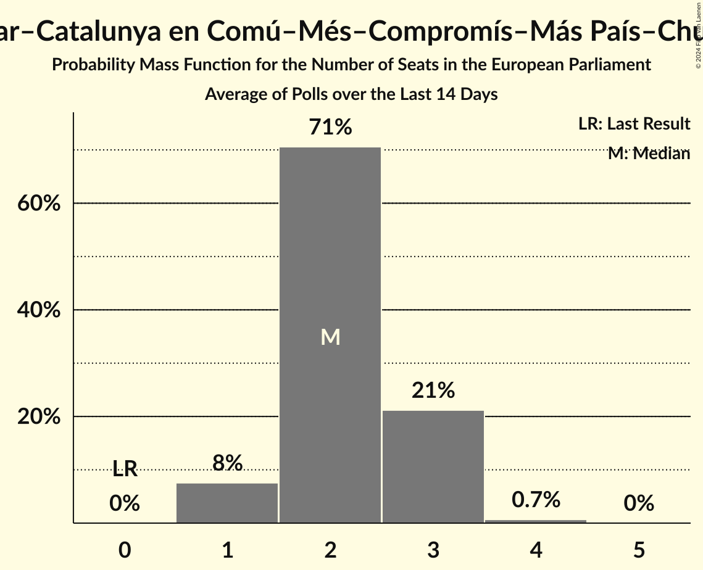

| Number of Seats | Probability | Accumulated | Special Marks |
|:---------------:|:-----------:|:-----------:|:-------------:|
| 0 | 0% | 100% | Last Result |
| 1 | 8% | 100% |  |
| 2 | 71% | 92% | Median |
| 3 | 21% | 22% |  |
| 4 | 0.7% | 0.7% |  |
| 5 | 0% | 0% |  |

### Se Acabó La Fiesta (*)

*For a full overview of the results for this party, see the [Se Acabó La Fiesta (*)](party-seacabólafiesta.html) page.*

| Number of Seats | Probability | Accumulated | Special Marks |
|:---------------:|:-----------:|:-----------:|:-------------:|
| 0 | 2% | 100% | Last Result |
| 1 | 51% | 98% | Median |
| 2 | 38% | 46% |  |
| 3 | 7% | 8% |  |
| 4 | 2% | 2% |  |
| 5 | 0% | 0% |  |

## Coalitions

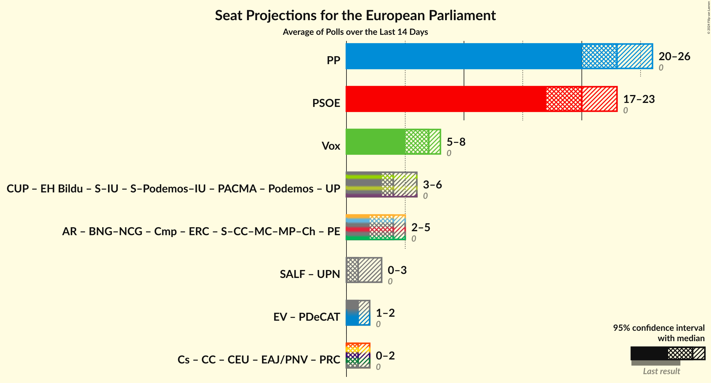

### Confidence Intervals

| Coalition | Last Result | Median | Majority? | 80% Confidence Interval | 90% Confidence Interval | 95% Confidence Interval | 99% Confidence Interval |
|:---------:|:-----------:|:------:|:---------:|:-----------------------:|:-----------------------:|:-----------------------:|:-----------------------:|
| Partido Popular (EPP) | 0 | 23 | 0% | 21–25 | 20–26 | 20–26 | 19–26 |
| Partido Socialista Obrero Español (S&D) | 0 | 20 | 0% | 18–22 | 18–22 | 17–23 | 17–24 |
| Vox (ECR) | 0 | 7 | 0% | 5–7 | 5–8 | 5–8 | 4–8 |
| Candidatura d’Unitat Popular (GUE/NGL) – Euskal Herria Bildu (GUE/NGL) – Movimiento Sumar–Izquierda Unida (GUE/NGL) – Movimiento Sumar–Podemos–Izquierda Unida (GUE/NGL) – Partido Animalista Contra el Maltrato Animal (GUE/NGL) – Podemos (GUE/NGL) – Unidos Podemos (GUE/NGL) | 0 | 4 | 0% | 4–6 | 3–6 | 3–6 | 3–7 |
| Ahora Repúblicas (Greens/EFA) – Bloque Nacionalista Galego–Nós Candidatura Galega (Greens/EFA) – Coalició Compromís (Greens/EFA) – Esquerra Republicana de Catalunya–Catalunya Sí (Greens/EFA) – Movimiento Sumar–Catalunya en Comú–Més–Compromís–Más País–Chunta (Greens/EFA) – Primavera Europea (Greens/EFA) | 0 | 4 | 0% | 3–5 | 2–5 | 2–5 | 2–6 |
| Se Acabó La Fiesta (*) – Unión del Pueblo Navarro (*) | 0 | 1 | 0% | 1–2 | 0–3 | 0–3 | 0–4 |
| España Vaciada (NI) – Partit Demòcrata Europeu Català (NI) | 0 | 1 | 0% | 1–2 | 1–2 | 1–2 | 0–3 |
| Ciudadanos–Partido de la Ciudadanía (RE) – Coalición Canaria–Partido Nacionalista Canario (RE) – Coalición por Europa (RE) – Euzko Alderdi Jeltzalea/Partido Nacionalista Vasco (RE) – Partido Regionalista de Cantabria (RE) | 0 | 1 | 0% | 0–1 | 0–2 | 0–2 | 0–2 |

### Partido Popular (EPP)

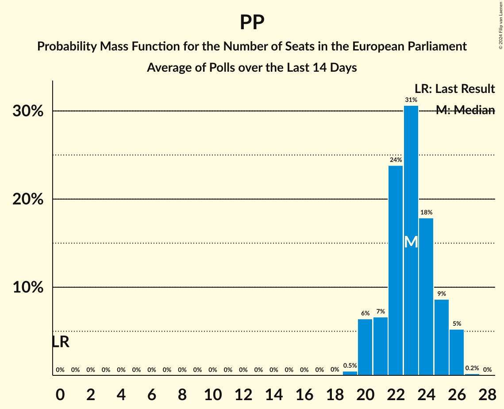

| Number of Seats | Probability | Accumulated | Special Marks |
|:---------------:|:-----------:|:-----------:|:-------------:|
| 0 | 0% | 100% | Last Result |
| 1 | 0% | 100% |  |
| 2 | 0% | 100% |  |
| 3 | 0% | 100% |  |
| 4 | 0% | 100% |  |
| 5 | 0% | 100% |  |
| 6 | 0% | 100% |  |
| 7 | 0% | 100% |  |
| 8 | 0% | 100% |  |
| 9 | 0% | 100% |  |
| 10 | 0% | 100% |  |
| 11 | 0% | 100% |  |
| 12 | 0% | 100% |  |
| 13 | 0% | 100% |  |
| 14 | 0% | 100% |  |
| 15 | 0% | 100% |  |
| 16 | 0% | 100% |  |
| 17 | 0% | 100% |  |
| 18 | 0% | 100% |  |
| 19 | 0.5% | 100% |  |
| 20 | 6% | 99.5% |  |
| 21 | 7% | 93% |  |
| 22 | 24% | 86% |  |
| 23 | 31% | 63% | Median |
| 24 | 18% | 32% |  |
| 25 | 9% | 14% |  |
| 26 | 5% | 5% |  |
| 27 | 0.2% | 0.2% |  |
| 28 | 0% | 0% |  |

### Partido Socialista Obrero Español (S&D)

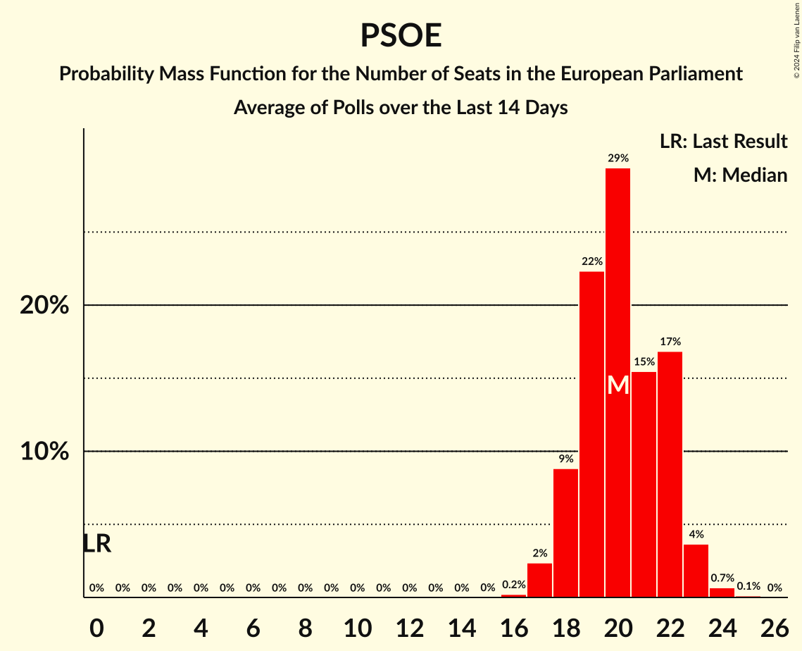

| Number of Seats | Probability | Accumulated | Special Marks |
|:---------------:|:-----------:|:-----------:|:-------------:|
| 0 | 0% | 100% | Last Result |
| 1 | 0% | 100% |  |
| 2 | 0% | 100% |  |
| 3 | 0% | 100% |  |
| 4 | 0% | 100% |  |
| 5 | 0% | 100% |  |
| 6 | 0% | 100% |  |
| 7 | 0% | 100% |  |
| 8 | 0% | 100% |  |
| 9 | 0% | 100% |  |
| 10 | 0% | 100% |  |
| 11 | 0% | 100% |  |
| 12 | 0% | 100% |  |
| 13 | 0% | 100% |  |
| 14 | 0% | 100% |  |
| 15 | 0% | 100% |  |
| 16 | 0.2% | 100% |  |
| 17 | 2% | 99.8% |  |
| 18 | 9% | 97% |  |
| 19 | 22% | 89% |  |
| 20 | 29% | 66% | Median |
| 21 | 15% | 37% |  |
| 22 | 17% | 21% |  |
| 23 | 4% | 4% |  |
| 24 | 0.7% | 0.8% |  |
| 25 | 0.1% | 0.1% |  |
| 26 | 0% | 0% |  |

### Vox (ECR)

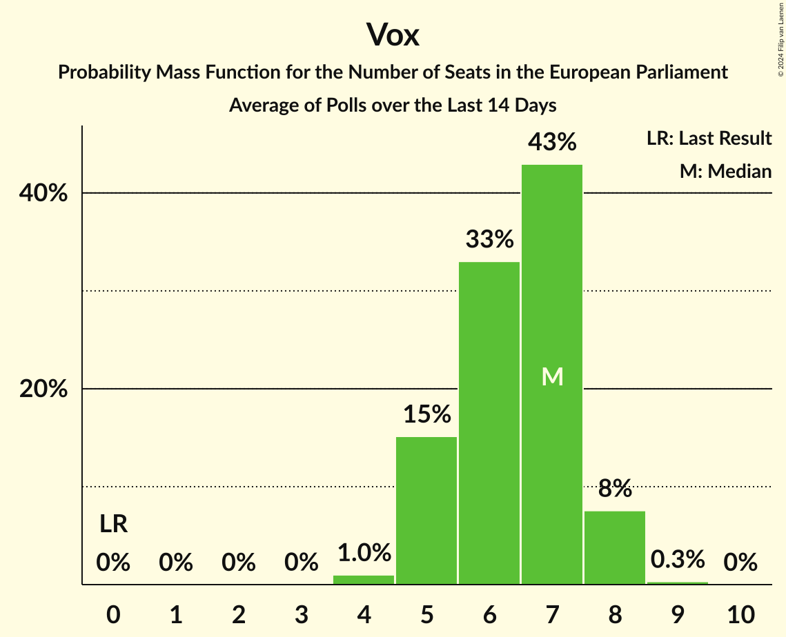

| Number of Seats | Probability | Accumulated | Special Marks |
|:---------------:|:-----------:|:-----------:|:-------------:|
| 0 | 0% | 100% | Last Result |
| 1 | 0% | 100% |  |
| 2 | 0% | 100% |  |
| 3 | 0% | 100% |  |
| 4 | 1.0% | 100% |  |
| 5 | 15% | 99.0% |  |
| 6 | 33% | 84% |  |
| 7 | 43% | 51% | Median |
| 8 | 8% | 8% |  |
| 9 | 0.3% | 0.3% |  |
| 10 | 0% | 0% |  |

### Candidatura d’Unitat Popular (GUE/NGL) – Euskal Herria Bildu (GUE/NGL) – Movimiento Sumar–Izquierda Unida (GUE/NGL) – Movimiento Sumar–Podemos–Izquierda Unida (GUE/NGL) – Partido Animalista Contra el Maltrato Animal (GUE/NGL) – Podemos (GUE/NGL) – Unidos Podemos (GUE/NGL)

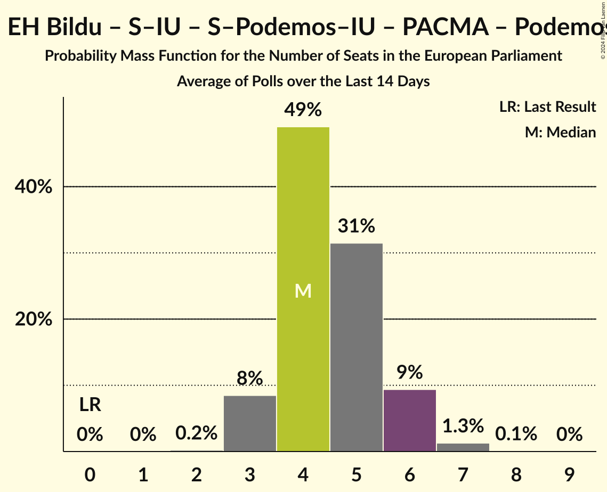

| Number of Seats | Probability | Accumulated | Special Marks |
|:---------------:|:-----------:|:-----------:|:-------------:|
| 0 | 0% | 100% | Last Result |
| 1 | 0% | 100% |  |
| 2 | 0.2% | 100% |  |
| 3 | 8% | 99.8% |  |
| 4 | 49% | 91% | Median |
| 5 | 31% | 42% |  |
| 6 | 9% | 11% |  |
| 7 | 1.3% | 1.4% |  |
| 8 | 0.1% | 0.1% |  |
| 9 | 0% | 0% |  |

### Ahora Repúblicas (Greens/EFA) – Bloque Nacionalista Galego–Nós Candidatura Galega (Greens/EFA) – Coalició Compromís (Greens/EFA) – Esquerra Republicana de Catalunya–Catalunya Sí (Greens/EFA) – Movimiento Sumar–Catalunya en Comú–Més–Compromís–Más País–Chunta (Greens/EFA) – Primavera Europea (Greens/EFA)

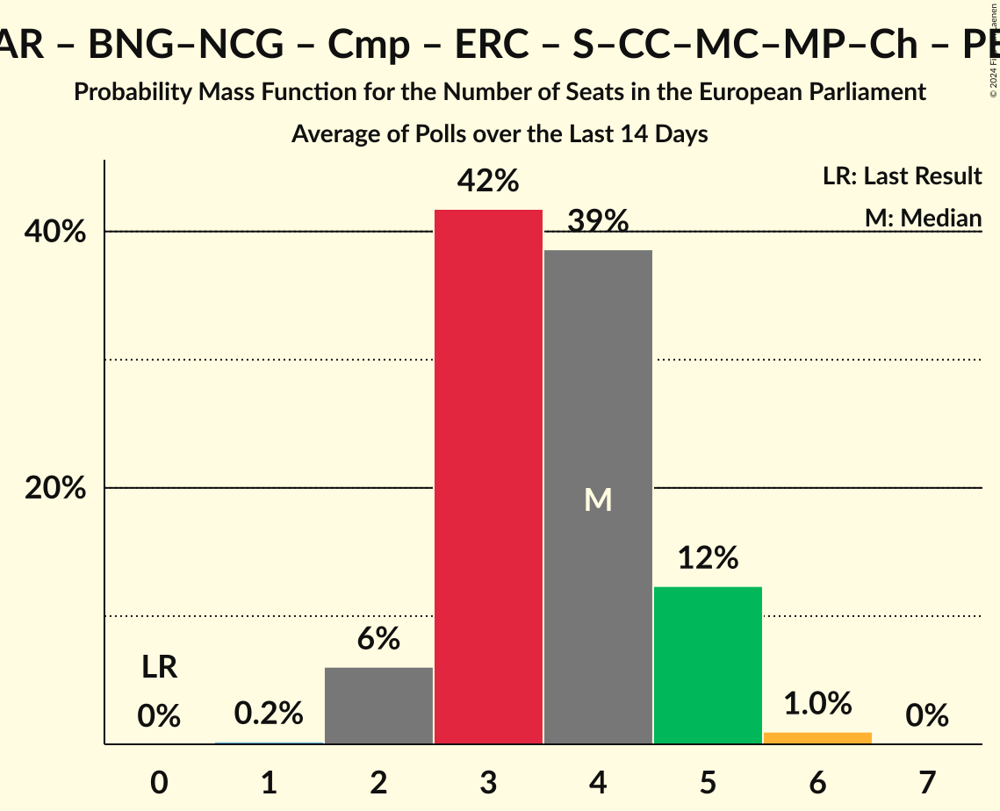

| Number of Seats | Probability | Accumulated | Special Marks |
|:---------------:|:-----------:|:-----------:|:-------------:|
| 0 | 0% | 100% | Last Result |
| 1 | 0.2% | 100% |  |
| 2 | 6% | 99.8% |  |
| 3 | 42% | 94% |  |
| 4 | 39% | 52% | Median |
| 5 | 12% | 13% |  |
| 6 | 1.0% | 1.0% |  |
| 7 | 0% | 0% |  |

### Se Acabó La Fiesta (*) – Unión del Pueblo Navarro (*)

| Number of Seats | Probability | Accumulated | Special Marks |
|:---------------:|:-----------:|:-----------:|:-------------:|
| 0 | 9% | 100% | Last Result |
| 1 | 48% | 91% | Median |
| 2 | 35% | 43% |  |
| 3 | 6% | 8% |  |
| 4 | 2% | 2% |  |
| 5 | 0% | 0% |  |

### España Vaciada (NI) – Partit Demòcrata Europeu Català (NI)

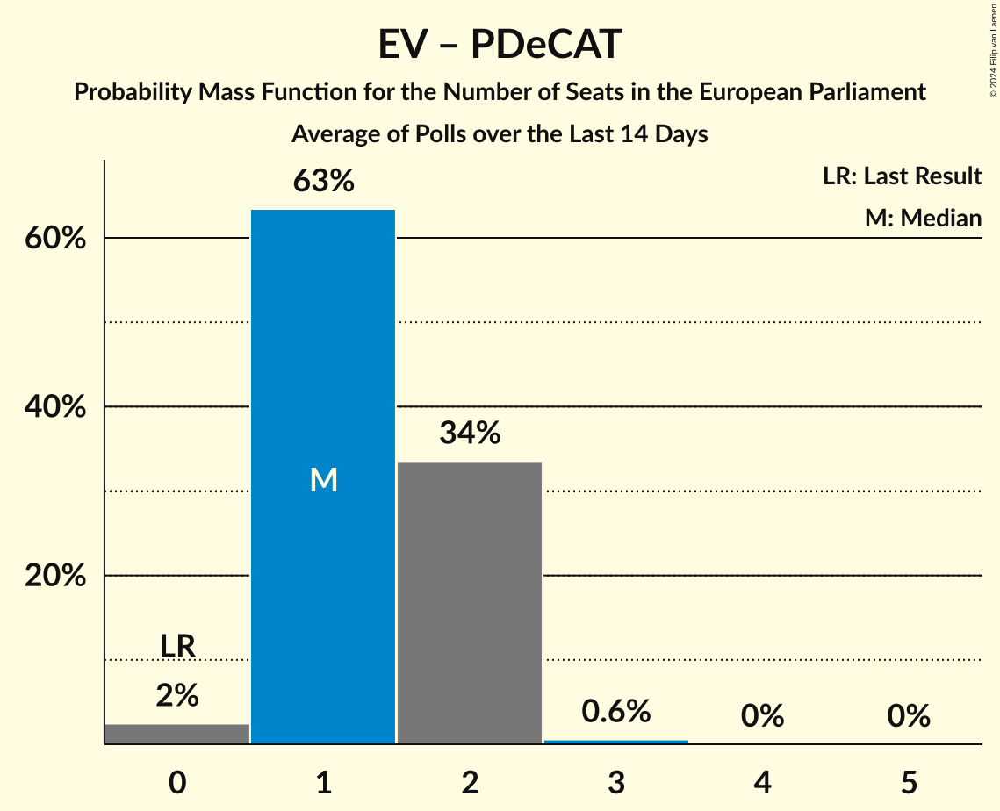

| Number of Seats | Probability | Accumulated | Special Marks |
|:---------------:|:-----------:|:-----------:|:-------------:|
| 0 | 2% | 100% | Last Result |
| 1 | 63% | 98% | Median |
| 2 | 34% | 34% |  |
| 3 | 0.6% | 0.6% |  |
| 4 | 0% | 0% |  |

### Ciudadanos–Partido de la Ciudadanía (RE) – Coalición Canaria–Partido Nacionalista Canario (RE) – Coalición por Europa (RE) – Euzko Alderdi Jeltzalea/Partido Nacionalista Vasco (RE) – Partido Regionalista de Cantabria (RE)

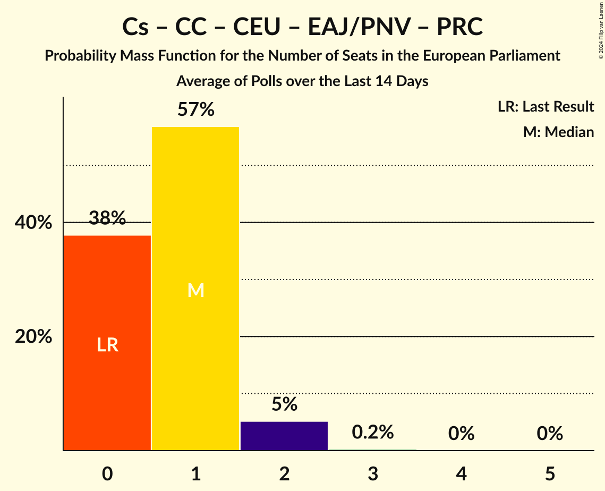

| Number of Seats | Probability | Accumulated | Special Marks |
|:---------------:|:-----------:|:-----------:|:-------------:|
| 0 | 38% | 100% | Last Result |
| 1 | 57% | 62% | Median |
| 2 | 5% | 5% |  |
| 3 | 0.2% | 0.2% |  |
| 4 | 0% | 0% |  |

## Technical Information

+ **Number of polls included in this average:** 15
+ **Lowest number of simulations done in a poll included in this average:** 2,097,152
+ **Total number of simulations done in the polls included in this average:** 31,457,280
+ **Error estimate:** 4.24%
