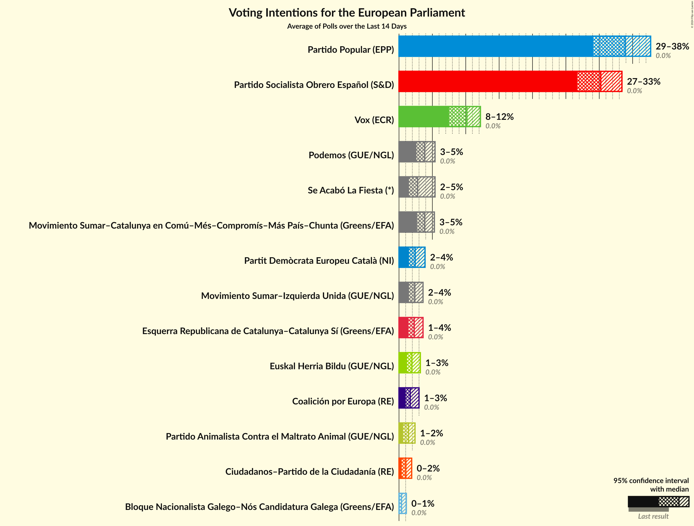
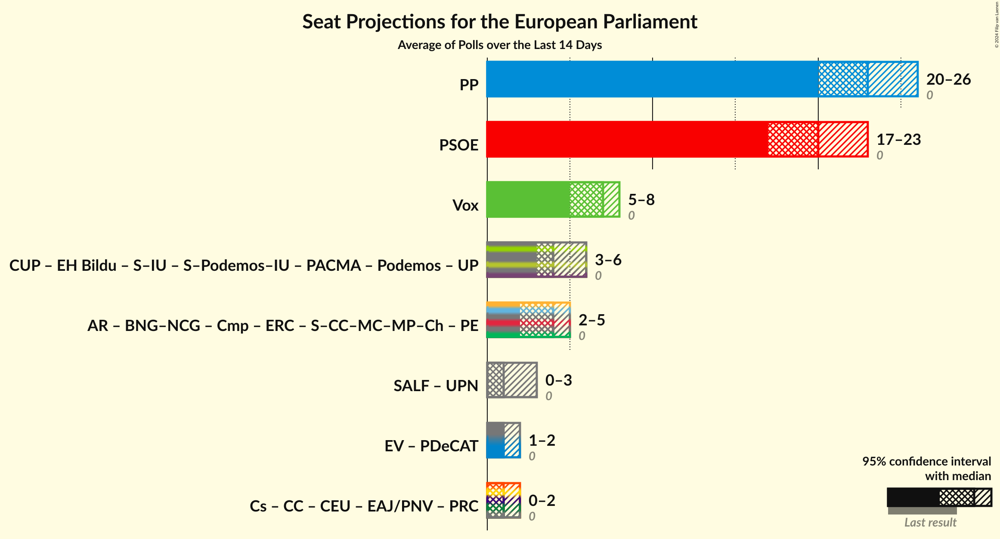

# Overview

The table below lists the most recent polls (less than 14 days old) registered and analyzed so far.

| Period     | Polling firm/Commissioner(s) | PP | PSOE | UP | Cs | ERC | PDeCAT | EAJ/PNV | PACMA | EH Bildu | CC | Vox | BNG | BNG–NCG | AR | CEU | PE | Cmp | Podemos | CUP | UPN | PRC | EV | S–Podemos–IU | S–IU | S–CC–MC–MP–Ch | SALF |
|:----------:|:----------------------------:|:--:|:--:|:--:|:--:|:--:|:--:|:--:|:--:|:--:|:--:|:--:|:--:|:--:|:--:|:--:|:--:|:--:|:--:|:--:|:--:|:--:|:--:|:--:|:--:|:--:|:--:|
| 26 May 2019 | General Election | 0.0%   0 | 0.0%   0 | 0.0%   0 | 0.0%   0 | 0.0%   0 | 0.0%   0 | 0.0%   0 | 0.0%   0 | 0.0%   0 | 0.0%   0 | 0.0%   0 | 0.0%   0 | 0.0%   0 | 0.0%   0 | 0.0%   0 | 0.0%   0 | 0.0%   0 | 0.0%   0 | 0.0%   0 | 0.0%   0 | 0.0%   0 | 0.0%   0 | 0.0%   0 | 0.0%   0 | 0.0%   0 | 0.0%   0 |
| N/A | [Poll Average](average.html) | 29–38%   20–26 | 27–33%   17–23 | N/A   N/A | 0–2%   0–1 | 1–4%   1–3 | 2–4%   1–2 | N/A   N/A | 1–2%   0–1 | 1–3%   1–2 | N/A   N/A | 8–12%   5–8 | N/A   N/A | 0–1%   0 | N/A   N/A | 1–3%   0–2 | N/A   N/A | N/A   N/A | 3–5%   1–3 | N/A   N/A | N/A   N/A | N/A   N/A | N/A   N/A | N/A   N/A | 2–4%   1–2 | 3–5%   1–3 | 2–5%   1–3 |
| [27 May–3 June 2024](2024-06-03-SigmaDos.html) | Sigma Dos   El Mundo | 32–35%   21–23 | 29–32%   20–21 | N/A   N/A | N/A   N/A | 2–3%   1–2 | 1–2%   1 | N/A   N/A | N/A   N/A | 1–2%   1–2 | N/A   N/A | 10–12%   6–8 | N/A   N/A | 0–1%   0 | N/A   N/A | 1–2%   0–1 | N/A   N/A | N/A   N/A | 3–5%   2–3 | N/A   N/A | N/A   N/A | N/A   N/A | N/A   N/A | N/A   N/A | 2–3%   1 | 3–4%   2–3 | 3–4%   1–2 |
| [2–3 June 2024](2024-06-03-Data10.html) | Data10   OKDiario | 32–37%   22–26 | 28–33%   19–22 | N/A   N/A | 1–2%   0–1 | 2–3%   1–2 | 2–3%   1–2 | N/A   N/A | N/A   N/A | 1–3%   1–2 | N/A   N/A | 9–12%   6–8 | N/A   N/A | 0–1%   0 | N/A   N/A | 1–2%   0–1 | N/A   N/A | N/A   N/A | 3–5%   2–3 | N/A   N/A | N/A   N/A | N/A   N/A | N/A   N/A | N/A   N/A | 2–3%   1–2 | 3–5%   1–3 | N/A   N/A |
| [30 May–2 June 2024](2024-06-02-SocioMétrica.html) | SocioMétrica   El Español | 31–38%   21–25 | 26–33%   17–21 | N/A   N/A | 0–2%   0–1 | 1–3%   1–2 | 2–4%   1–2 | N/A   N/A | N/A   N/A | 1–3%   1–2 | N/A   N/A | 8–13%   5–8 | N/A   N/A | 0–1%   0 | N/A   N/A | 1–3%   0–2 | N/A   N/A | N/A   N/A | 2–5%   1–4 | N/A   N/A | N/A   N/A | N/A   N/A | N/A   N/A | N/A   N/A | 1–4%   1–2 | 3–6%   2–3 | 2–4%   1–2 |
| [29–31 May 2024](2024-05-31-TargetPoint.html) | Target Point   El Debate | 31–36%   22–26 | 28–34%   20–24 | N/A   N/A | N/A   N/A | N/A   N/A | 2–4%   1–2 | N/A   N/A | N/A   N/A | N/A   N/A | N/A   N/A | 7–11%   5–7 | N/A   N/A | N/A   N/A | N/A   N/A | N/A   N/A | N/A   N/A | N/A   N/A | 3–5%   2–3 | N/A   N/A | N/A   N/A | N/A   N/A | N/A   N/A | N/A   N/A | 2–3%   1–2 | 3–5%   1–3 | 2–4%   1–2 |
| [27–31 May 2024](2024-05-31-NCReport.html) | NC Report   La Razón | 31–39%   21–26 | 25–33%   17–22 | N/A   N/A | N/A   N/A | 1–4%   1–3 | 2–5%   1–3 | N/A   N/A | N/A   N/A | 1–4%   1–3 | N/A   N/A | 8–13%   5–8 | N/A   N/A | 0–1%   0–1 | N/A   N/A | 1–4%   0–2 | N/A   N/A | N/A   N/A | 2–6%   1–3 | N/A   N/A | N/A   N/A | N/A   N/A | N/A   N/A | N/A   N/A | 1–4%   0–2 | 3–6%   1–3 | 1–4%   0–2 |
| [23–31 May 2024](2024-05-31-HamalgamaMétrica.html) | Hamalgama Métrica   VozPópuli | 32–38%   22–26 | 27–33%   18–22 | N/A   N/A | 0–2%   0–1 | 2–3%   1–3 | 2–4%   1–2 | N/A   N/A | N/A   N/A | 1–3%   1–2 | N/A   N/A | 8–12%   5–8 | N/A   N/A | 0–1%   0 | N/A   N/A | N/A   N/A | N/A   N/A | N/A   N/A | 3–5%   1–3 | N/A   N/A | N/A   N/A | N/A   N/A | N/A   N/A | N/A   N/A | 2–4%   1–2 | 3–5%   1–3 | 1–3%   0–2 |
| [27–31 May 2024](2024-05-31-GESOP.html) | GESOP   Prensa Ibérica | 29–36%   19–24 | 28–35%   19–23 | N/A   N/A | 0–2%   0–1 | 2–4%   1–3 | 1–4%   0–2 | N/A   N/A | N/A   N/A | 1–4%   1–2 | N/A   N/A | 6–11%   4–6 | N/A   N/A | 0–1%   0 | N/A   N/A | 1–3%   0–1 | N/A   N/A | N/A   N/A | 3–6%   2–4 | N/A   N/A | N/A   N/A | N/A   N/A | N/A   N/A | N/A   N/A | 1–4%   1–2 | 2–5%   1–3 | 2–5%   1–3 |
| [29–31 May 2024](2024-05-31-Cluster17.html) | Cluster17   Agenda Pública | 32–36%   22–24 | 28–32%   19–21 | N/A   N/A | N/A   N/A | 2–3%   1–2 | 2–3%   1–2 | N/A   N/A | N/A   N/A | 1–3%   1–2 | N/A   N/A | 9–12%   6–8 | N/A   N/A | 0–1%   0 | N/A   N/A | 1–2%   0–1 | N/A   N/A | N/A   N/A | 3–4%   2–3 | N/A   N/A | N/A   N/A | N/A   N/A | N/A   N/A | N/A   N/A | 2–3%   1–2 | 3–5%   2–3 | 2–3%   1–2 |
| [27–30 May 2024](2024-05-30-GAD3.html) | GAD3   ABC | 32–38%   22–25 | 27–33%   18–21 | N/A   N/A | N/A   N/A | 2–4%   1–2 | 2–4%   1–2 | N/A   N/A | N/A   N/A | 1–3%   1–2 | N/A   N/A | 8–12%   5–7 | N/A   N/A | 0–1%   0 | N/A   N/A | 1–3%   0–1 | N/A   N/A | N/A   N/A | 3–5%   1–3 | N/A   N/A | N/A   N/A | N/A   N/A | N/A   N/A | N/A   N/A | 2–3%   1–2 | 3–5%   1–3 | 2–4%   1–2 |
| [27–30 May 2024](2024-05-30-CIS.html) | CIS | 28–30%   19–21 | 31–33%   22–23 | N/A   N/A | 1%   0 | 2%   1–2 | 1–2%   0–1 | N/A   N/A | N/A   N/A | 1–2%   1 | N/A   N/A | 10–11%   6–8 | N/A   N/A | 0%   0 | N/A   N/A | 1%   0–1 | N/A   N/A | N/A   N/A | 3–4%   2–3 | N/A   N/A | N/A   N/A | N/A   N/A | N/A   N/A | N/A   N/A | 2–3%   1 | 3–4%   2–3 | 5–6%   3–4 |
| [28–30 May 2024](2024-05-30-40dB.html) | 40dB   Prisa | 31–35%   21–24 | 28–32%   19–22 | N/A   N/A | 1–2%   0–1 | 2–3%   1–2 | 2–3%   0–2 | N/A   N/A | N/A   N/A | 2–3%   1–2 | N/A   N/A | 9–12%   6–8 | N/A   N/A | 0–1%   0 | N/A   N/A | 1–2%   0–1 | N/A   N/A | N/A   N/A | 3–5%   2–3 | N/A   N/A | N/A   N/A | N/A   N/A | N/A   N/A | N/A   N/A | 2–3%   1–2 | 3–4%   1–3 | 2–3%   1–2 |
| [23–29 May 2024](2024-05-29-Sondaxe.html) | Sondaxe   La Voz de Galicia | 32–38%   21–25 | 27–33%   18–22 | N/A   N/A | 0–1%   0 | 1–3%   1–2 | 2–3%   0–2 | N/A   N/A | N/A   N/A | 1–3%   0–2 | N/A   N/A | 8–12%   5–8 | N/A   N/A | 0–1%   0 | N/A   N/A | 1–3%   0–2 | N/A   N/A | N/A   N/A | 3–5%   1–3 | N/A   N/A | N/A   N/A | N/A   N/A | N/A   N/A | N/A   N/A | 2–4%   1–2 | 3–5%   2–3 | 2–4%   1–2 |
| [28–29 May 2024](2024-05-29-Metroscopia.html) | Metroscopia | 30–38%   20–26 | 26–34%   17–23 | N/A   N/A | 0–2%   0–1 | 1–4%   1–3 | 1–4%   0–2 | N/A   N/A | N/A   N/A | 1–4%   0–2 | N/A   N/A | 8–13%   5–8 | N/A   N/A | 0–1%   0–1 | N/A   N/A | 1–3%   0–2 | N/A   N/A | N/A   N/A | 2–6%   1–3 | N/A   N/A | N/A   N/A | N/A   N/A | N/A   N/A | N/A   N/A | 1–4%   1–2 | 2–6%   1–3 | 2–5%   1–3 |
| [23–28 May 2024](2024-05-28-DYM.html) | DYM   Henneo | 31–37%   21–25 | 28–34%   18–22 | N/A   N/A | 1–2%   0–1 | 1–3%   1–2 | 2–4%   1–2 | N/A   N/A | 1–2%   0–1 | 1–3%   1–2 | N/A   N/A | 9–12%   5–8 | N/A   N/A | 0–1%   0 | N/A   N/A | 1–2%   0–1 | N/A   N/A | N/A   N/A | 2–5%   1–2 | N/A   N/A | N/A   N/A | N/A   N/A | N/A   N/A | N/A   N/A | 2–3%   1–2 | 3–5%   2–3 | 2–4%   1–2 |
| [23–28 May 2024](2024-05-28-Celeste-Tel.html) | Celeste-Tel   Onda Cero | 31–39%   21–26 | 26–33%   17–22 | N/A   N/A | 0–2%   0–1 | 1–4%   1–3 | 2–4%   1–2 | N/A   N/A | 1–2%   0–1 | 1–4%   0–2 | N/A   N/A | 8–13%   4–8 | N/A   N/A | 0–1%   0 | N/A   N/A | 1–3%   0–2 | N/A   N/A | N/A   N/A | 2–6%   1–3 | N/A   N/A | N/A   N/A | N/A   N/A | N/A   N/A | N/A   N/A | 1–4%   1–2 | 3–6%   1–4 | 1–3%   0–2 |
| 26 May 2019 | General Election | 0.0%   0 | 0.0%   0 | 0.0%   0 | 0.0%   0 | 0.0%   0 | 0.0%   0 | 0.0%   0 | 0.0%   0 | 0.0%   0 | 0.0%   0 | 0.0%   0 | 0.0%   0 | 0.0%   0 | 0.0%   0 | 0.0%   0 | 0.0%   0 | 0.0%   0 | 0.0%   0 | 0.0%   0 | 0.0%   0 | 0.0%   0 | 0.0%   0 | 0.0%   0 | 0.0%   0 | 0.0%   0 | 0.0%   0 |

Only polls for which at least the sample size has been published are included in the table above.

**Legend:**
+ **Top half of each row:** Voting intentions (95% confidence interval)
+ **Bottom half of each row:** Seat projections for the European Parliament (95% confidence interval)
+ **PP:** Partido Popular (EPP)
+ **PSOE:** Partido Socialista Obrero Español (S&D)
+ **UP:** Unidos Podemos (GUE/NGL)
+ **Cs:** Ciudadanos–Partido de la Ciudadanía (RE)
+ **ERC:** Esquerra Republicana de Catalunya–Catalunya Sí (Greens/EFA)
+ **PDeCAT:** Partit Demòcrata Europeu Català (NI)
+ **EAJ/PNV:** Euzko Alderdi Jeltzalea/Partido Nacionalista Vasco (RE)
+ **PACMA:** Partido Animalista Contra el Maltrato Animal (GUE/NGL)
+ **EH Bildu:** Euskal Herria Bildu (GUE/NGL)
+ **CC:** Coalición Canaria–Partido Nacionalista Canario (RE)
+ **Vox:** Vox (ECR)
+ **BNG:** Bloque Nacionalista Galego (Greens/EFA)
+ **BNG–NCG:** Bloque Nacionalista Galego–Nós Candidatura Galega (Greens/EFA)
+ **AR:** Ahora Repúblicas (Greens/EFA)
+ **CEU:** Coalición por Europa (RE)
+ **PE:** Primavera Europea (Greens/EFA)
+ **Cmp:** Coalició Compromís (Greens/EFA)
+ **Podemos:** Podemos (GUE/NGL)
+ **CUP:** Candidatura d’Unitat Popular (GUE/NGL)
+ **UPN:** Unión del Pueblo Navarro (*)
+ **PRC:** Partido Regionalista de Cantabria (RE)
+ **EV:** España Vaciada (NI)
+ **S–Podemos–IU:** Movimiento Sumar–Podemos–Izquierda Unida (GUE/NGL)
+ **S–IU:** Movimiento Sumar–Izquierda Unida (GUE/NGL)
+ **S–CC–MC–MP–Ch:** Movimiento Sumar–Catalunya en Comú–Més–Compromís–Más País–Chunta (Greens/EFA)
+ **SALF:** Se Acabó La Fiesta (*)
+ **N/A (single party):** Party not included the published results
+ **N/A (entire row):** Calculation for this opinion poll not started yet

