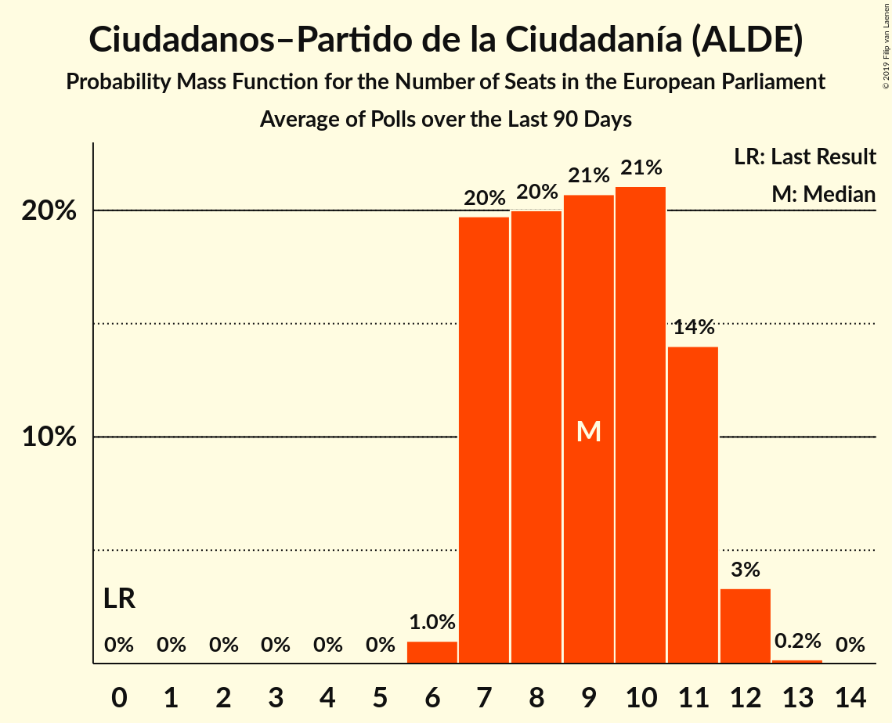

# Ciudadanos–Partido de la Ciudadanía (ALDE)

<a href="#voting-intentions">Voting Intentions</a> | <a href="#seats">Seats</a>

## Voting Intentions

Last result: **0.0%** (General Election of 26 May 2019)

### Confidence Intervals

| Period     | Polling firm/Commissioner(s) | Median | 80% Confidence Interval | 90% Confidence Interval | 95% Confidence Interval | 99% Confidence Interval |
|:----------:|:----------------:|:-----------:|:-----------------------:|:-----------------------:|:-----------------------:|:-----------------------:|
| N/A | [Poll Average](average.html) | 16.2% | 13.5–20.1% | 13.0–20.8% | 12.6–21.3% | 12.0–22.3% |
| [17–21 June 2019](2019-06-21-Invymark.html) | Invymark   laSexta | 14.0% | 12.8–15.4% | 12.4–15.7% | 12.1–16.1% | 11.6–16.8% |
| [3–11 June 2019](2019-06-11-SimpleLógica.html) | Simple Lógica | 19.7% | 18.2–21.3% | 17.8–21.8% | 17.5–22.2% | 16.8–23.0% |
| [5–11 June 2019](2019-06-11-Celeste-Tel.html) | Celeste-Tel   eldiario.es | 14.6% | 13.3–16.1% | 13.0–16.5% | 12.7–16.9% | 12.1–17.6% |
| [4–7 June 2019](2019-06-07-DemoscopiayServicios.html) | Demoscopia y Servicios   ESDiario | 17.6% | 16.1–19.2% | 15.7–19.7% | 15.4–20.1% | 14.7–20.9% |
| [27–31 May 2019](2019-05-31-Invymark.html) | Invymark   laSexta | 15.1% | 13.8–16.5% | 13.5–16.9% | 13.2–17.2% | 12.6–17.9% |

### Probability Mass Function

The following table shows the probability mass function per percentage block of voting intentions for the [poll average](average.html) for Ciudadanos–Partido de la Ciudadanía (ALDE).

| Voting Intentions | Probability | Accumulated | Special Marks |
|:-----------------:|:-----------:|:-----------:|:-------------:|
| 0.0–0.5% | 0% | 100% | Last Result |
| 0.5–1.5% | 0% | 100% |  |
| 1.5–2.5% | 0% | 100% |  |
| 2.5–3.5% | 0% | 100% |  |
| 3.5–4.5% | 0% | 100% |  |
| 4.5–5.5% | 0% | 100% |  |
| 5.5–6.5% | 0% | 100% |  |
| 6.5–7.5% | 0% | 100% |  |
| 7.5–8.5% | 0% | 100% |  |
| 8.5–9.5% | 0% | 100% |  |
| 9.5–10.5% | 0% | 100% |  |
| 10.5–11.5% | 0.1% | 100% |  |
| 11.5–12.5% | 2% | 99.9% |  |
| 12.5–13.5% | 9% | 98% |  |
| 13.5–14.5% | 18% | 89% |  |
| 14.5–15.5% | 15% | 71% |  |
| 15.5–16.5% | 9% | 56% | Median |
| 16.5–17.5% | 9% | 47% |  |
| 17.5–18.5% | 11% | 38% |  |
| 18.5–19.5% | 11% | 27% |  |
| 19.5–20.5% | 9% | 16% |  |
| 20.5–21.5% | 5% | 7% |  |
| 21.5–22.5% | 2% | 2% |  |
| 22.5–23.5% | 0.3% | 0.3% |  |
| 23.5–24.5% | 0% | 0% |  |

## Seats

Last result: **0** seats (General Election of 26 May 2019)

### Confidence Intervals

| Period     | Polling firm/Commissioner(s) | Median | 80% Confidence Interval | 90% Confidence Interval | 95% Confidence Interval | 99% Confidence Interval |
|:----------:|:----------------:|:------:|:-----------------------:|:-----------------------:|:-----------------------:|:-----------------------:|
| N/A | [Poll Average](average.html) | 9 | 7–11 | 7–11 | 7–12 | 6–12 |
| [17–21 June 2019](2019-06-21-Invymark.html) | Invymark   laSexta | 7 | 7–8 | 7–8 | 6–9 | 6–9 |
| [3–11 June 2019](2019-06-11-SimpleLógica.html) | Simple Lógica | 11 | 10–12 | 10–12 | 9–12 | 9–13 |
| [5–11 June 2019](2019-06-11-Celeste-Tel.html) | Celeste-Tel   eldiario.es | 8 | 7–9 | 7–10 | 7–10 | 7–10 |
| [4–7 June 2019](2019-06-07-DemoscopiayServicios.html) | Demoscopia y Servicios   ESDiario | 9 | 9–10 | 8–11 | 8–11 | 8–11 |
| [27–31 May 2019](2019-05-31-Invymark.html) | Invymark   laSexta | 8 | 7–9 | 7–9 | 7–9 | 7–10 |

### Probability Mass Function

The following table shows the probability mass function per seat for the [poll average](average.html) for Ciudadanos–Partido de la Ciudadanía (ALDE).

| Number of Seats | Probability | Accumulated | Special Marks |
|:---------------:|:-----------:|:-----------:|:-------------:|
| 0 | 0% | 100% | Last Result |
| 1 | 0% | 100% |  |
| 2 | 0% | 100% |  |
| 3 | 0% | 100% |  |
| 4 | 0% | 100% |  |
| 5 | 0% | 100% |  |
| 6 | 1.0% | 100% |  |
| 7 | 20% | 99.0% |  |
| 8 | 20% | 79% |  |
| 9 | 21% | 59% | Median |
| 10 | 21% | 39% |  |
| 11 | 14% | 18% |  |
| 12 | 3% | 3% |  |
| 13 | 0.2% | 0.2% |  |
| 14 | 0% | 0% |  |

