# Opinion Poll by Invymark for laSexta, 16–20 June 2025

<a href="#voting-intentions">Voting Intentions</a> | <a href="#seats">Seats</a> | <a href="#coalitions">Coalitions</a> | <a href="#technical-information">Technical Information</a>

## Voting Intentions

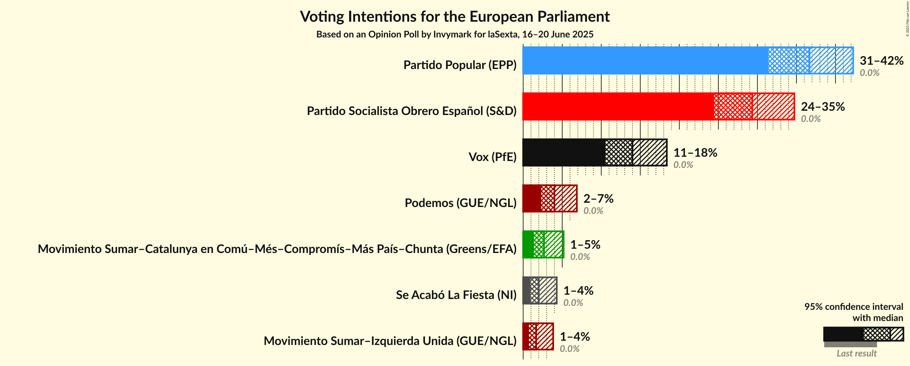

### Confidence Intervals

| Party | Last Result | Poll Result | 80% Confidence Interval | 90% Confidence Interval | 95% Confidence Interval | 99% Confidence Interval |
|:-----:|:-----------:|:-----------:|:-----------------------:|:-----------------------:|:-----------------------:|:-----------------------:|
| Partido Popular (EPP) | 0.0% | 36.7% | 33.2–40.3% |32.2–41.4% |31.4–42.3% |29.8–44.0% |
| Partido Socialista Obrero Español (S&D) | 0.0% | 29.3% | 26.1–32.9% |25.2–33.9% |24.5–34.7% |23.0–36.5% |
| Vox (PfE) | 0.0% | 14.0% | 11.7–16.9% |11.1–17.7% |10.5–18.4% |9.5–19.8% |
| Podemos (GUE/NGL) | 0.0% | 4.0% | 2.9–5.9% |2.6–6.4% |2.3–6.9% |1.9–7.9% |
| Movimiento Sumar–Catalunya en Comú–Més–Compromís–Más País–Chunta (Greens/EFA) | 0.0% | 2.7% | 1.8–4.3% |1.6–4.8% |1.4–5.2% |1.0–6.1% |
| Se Acabó La Fiesta (NI) | 0.0% | 2.0% | 1.3–3.5% |1.1–3.9% |0.9–4.3% |0.7–5.1% |
| Movimiento Sumar–Izquierda Unida (GUE/NGL) | 0.0% | 1.7% | 1.0–3.1% |0.9–3.5% |0.7–3.8% |0.5–4.6% |

*Note:* The poll result column reflects the actual value used in the calculations. Published results may vary slightly, and in addition be rounded to fewer digits.

## Seats

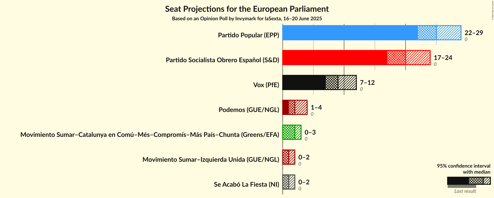

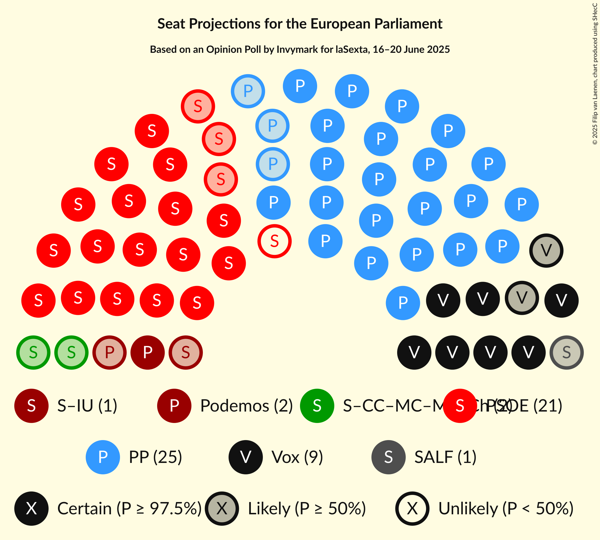

### Confidence Intervals

| Party | Last Result | Median | 80% Confidence Interval | 90% Confidence Interval | 95% Confidence Interval | 99% Confidence Interval |
|:-----:|:-----------:|:------:|:-----------------------:|:-----------------------:|:-----------------------:|:-----------------------:|
| <a href="#partido-popular-(epp)">Partido Popular (EPP)</a> | 0 | 25 | 23–28 |22–29 |22–29 |20–30 |
| <a href="#partido-socialista-obrero-español-(s&d)">Partido Socialista Obrero Español (S&D)</a> | 0 | 20 | 18–22 |17–23 |17–24 |16–25 |
| <a href="#vox-(pfe)">Vox (PfE)</a> | 0 | 9 | 8–11 |7–12 |7–12 |6–13 |
| <a href="#podemos-(gue/ngl)">Podemos (GUE/NGL)</a> | 0 | 2 | 2–4 |1–4 |1–4 |1–5 |
| <a href="#movimiento-sumar–catalunya-en-comú–més–compromís–más-país–chunta-(greens/efa)">Movimiento Sumar–Catalunya en Comú–Més–Compromís–Más País–Chunta (Greens/EFA)</a> | 0 | 2 | 1–3 |1–3 |0–3 |0–4 |
| <a href="#se-acabó-la-fiesta-(ni)">Se Acabó La Fiesta (NI)</a> | 0 | 1 | 0–2 |0–2 |0–3 |0–3 |
| <a href="#movimiento-sumar–izquierda-unida-(gue/ngl)">Movimiento Sumar–Izquierda Unida (GUE/NGL)</a> | 0 | 1 | 0–2 |0–2 |0–2 |0–3 |

### Partido Popular (EPP)

*For a full overview of the results for this party, see the [Partido Popular (EPP)](party-partidopopularepp.html) page.*

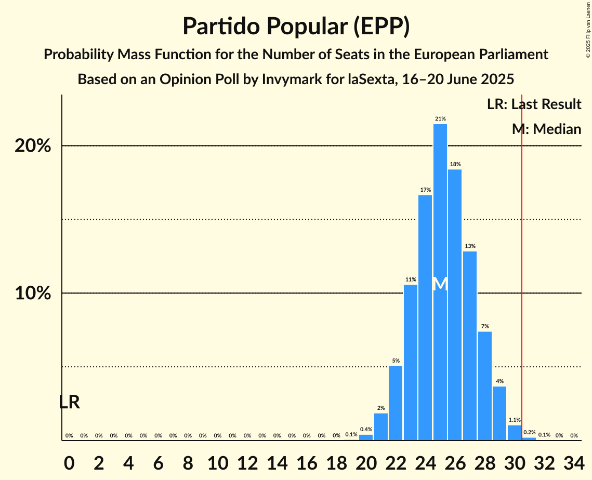

| Number of Seats | Probability | Accumulated | Special Marks |
|:---------------:|:-----------:|:-----------:|:-------------:|
| 0 | 0% | 100% | Last Result |
| 1 | 0% | 100% |  |
| 2 | 0% | 100% |  |
| 3 | 0% | 100% |  |
| 4 | 0% | 100% |  |
| 5 | 0% | 100% |  |
| 6 | 0% | 100% |  |
| 7 | 0% | 100% |  |
| 8 | 0% | 100% |  |
| 9 | 0% | 100% |  |
| 10 | 0% | 100% |  |
| 11 | 0% | 100% |  |
| 12 | 0% | 100% |  |
| 13 | 0% | 100% |  |
| 14 | 0% | 100% |  |
| 15 | 0% | 100% |  |
| 16 | 0% | 100% |  |
| 17 | 0% | 100% |  |
| 18 | 0% | 100% |  |
| 19 | 0.1% | 100% |  |
| 20 | 0.4% | 99.9% |  |
| 21 | 2% | 99.5% |  |
| 22 | 5% | 98% |  |
| 23 | 11% | 93% |  |
| 24 | 17% | 82% |  |
| 25 | 21% | 65% | Median |
| 26 | 18% | 44% |  |
| 27 | 13% | 25% |  |
| 28 | 7% | 12% |  |
| 29 | 4% | 5% |  |
| 30 | 1.1% | 1.4% |  |
| 31 | 0.2% | 0.3% | Majority |
| 32 | 0.1% | 0.1% |  |
| 33 | 0% | 0% |  |

### Partido Socialista Obrero Español (S&D)

*For a full overview of the results for this party, see the [Partido Socialista Obrero Español (S&D)](party-partidosocialistaobreroespañolsd.html) page.*

| Number of Seats | Probability | Accumulated | Special Marks |
|:---------------:|:-----------:|:-----------:|:-------------:|
| 0 | 0% | 100% | Last Result |
| 1 | 0% | 100% |  |
| 2 | 0% | 100% |  |
| 3 | 0% | 100% |  |
| 4 | 0% | 100% |  |
| 5 | 0% | 100% |  |
| 6 | 0% | 100% |  |
| 7 | 0% | 100% |  |
| 8 | 0% | 100% |  |
| 9 | 0% | 100% |  |
| 10 | 0% | 100% |  |
| 11 | 0% | 100% |  |
| 12 | 0% | 100% |  |
| 13 | 0% | 100% |  |
| 14 | 0% | 100% |  |
| 15 | 0.3% | 100% |  |
| 16 | 1.4% | 99.6% |  |
| 17 | 5% | 98% |  |
| 18 | 10% | 93% |  |
| 19 | 18% | 83% |  |
| 20 | 20% | 64% | Median |
| 21 | 20% | 44% |  |
| 22 | 15% | 24% |  |
| 23 | 6% | 9% |  |
| 24 | 2% | 3% |  |
| 25 | 0.7% | 0.9% |  |
| 26 | 0.2% | 0.2% |  |
| 27 | 0% | 0% |  |

### Vox (PfE)

*For a full overview of the results for this party, see the [Vox (PfE)](party-voxpfe.html) page.*

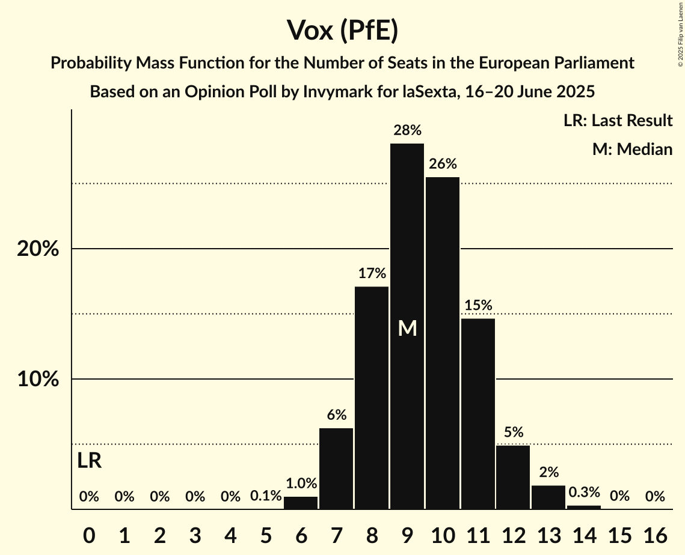

| Number of Seats | Probability | Accumulated | Special Marks |
|:---------------:|:-----------:|:-----------:|:-------------:|
| 0 | 0% | 100% | Last Result |
| 1 | 0% | 100% |  |
| 2 | 0% | 100% |  |
| 3 | 0% | 100% |  |
| 4 | 0% | 100% |  |
| 5 | 0.1% | 100% |  |
| 6 | 1.0% | 99.9% |  |
| 7 | 6% | 98.9% |  |
| 8 | 17% | 93% |  |
| 9 | 28% | 76% | Median |
| 10 | 26% | 47% |  |
| 11 | 15% | 22% |  |
| 12 | 5% | 7% |  |
| 13 | 2% | 2% |  |
| 14 | 0.3% | 0.4% |  |
| 15 | 0% | 0.1% |  |
| 16 | 0% | 0% |  |

### Podemos (GUE/NGL)

*For a full overview of the results for this party, see the [Podemos (GUE/NGL)](party-podemosguengl.html) page.*

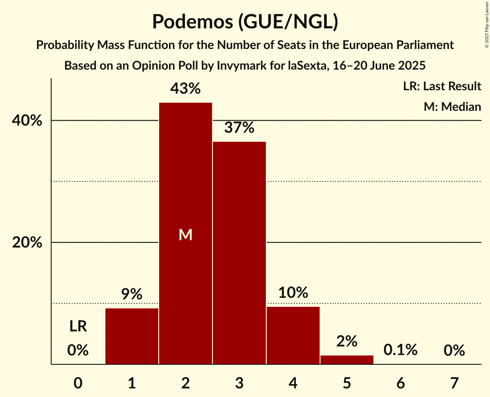

| Number of Seats | Probability | Accumulated | Special Marks |
|:---------------:|:-----------:|:-----------:|:-------------:|
| 0 | 0% | 100% | Last Result |
| 1 | 9% | 100% |  |
| 2 | 44% | 91% | Median |
| 3 | 36% | 47% |  |
| 4 | 10% | 11% |  |
| 5 | 1.5% | 2% |  |
| 6 | 0.1% | 0.1% |  |
| 7 | 0% | 0% |  |

### Movimiento Sumar–Catalunya en Comú–Més–Compromís–Más País–Chunta (Greens/EFA)

*For a full overview of the results for this party, see the [Movimiento Sumar–Catalunya en Comú–Més–Compromís–Más País–Chunta (Greens/EFA)](party-movimientosumar–catalunyaencomú–més–compromís–máspaís–chuntagreensefa.html) page.*

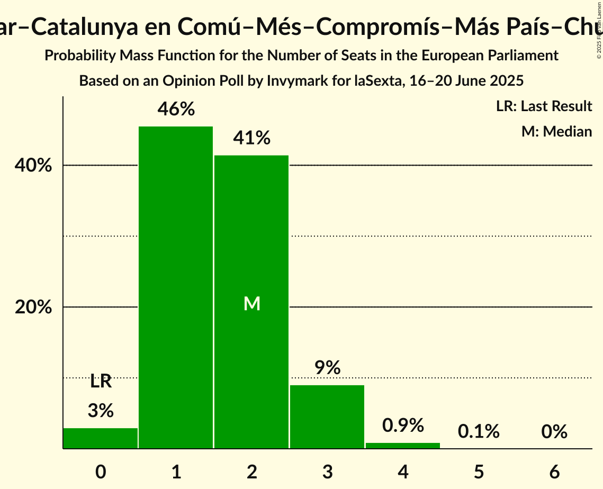

| Number of Seats | Probability | Accumulated | Special Marks |
|:---------------:|:-----------:|:-----------:|:-------------:|
| 0 | 3% | 100% | Last Result |
| 1 | 46% | 97% |  |
| 2 | 41% | 51% | Median |
| 3 | 9% | 10% |  |
| 4 | 0.9% | 1.0% |  |
| 5 | 0.1% | 0.1% |  |
| 6 | 0% | 0% |  |

### Se Acabó La Fiesta (NI)

*For a full overview of the results for this party, see the [Se Acabó La Fiesta (NI)](party-seacabólafiestani.html) page.*

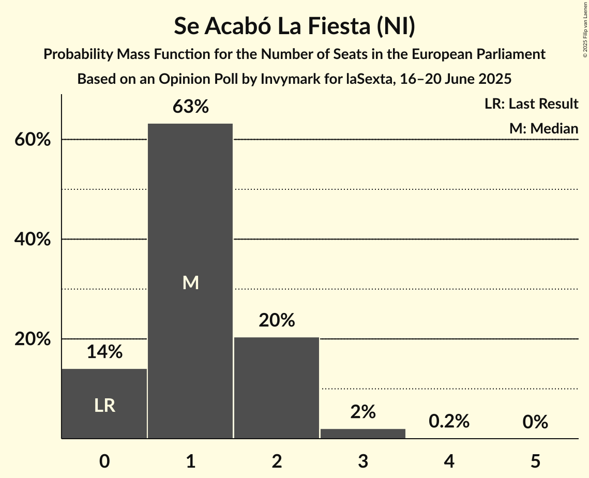

| Number of Seats | Probability | Accumulated | Special Marks |
|:---------------:|:-----------:|:-----------:|:-------------:|
| 0 | 15% | 100% | Last Result |
| 1 | 62% | 85% | Median |
| 2 | 21% | 24% |  |
| 3 | 2% | 3% |  |
| 4 | 0.1% | 0.2% |  |
| 5 | 0% | 0% |  |

### Movimiento Sumar–Izquierda Unida (GUE/NGL)

*For a full overview of the results for this party, see the [Movimiento Sumar–Izquierda Unida (GUE/NGL)](party-movimientosumar–izquierdaunidaguengl.html) page.*

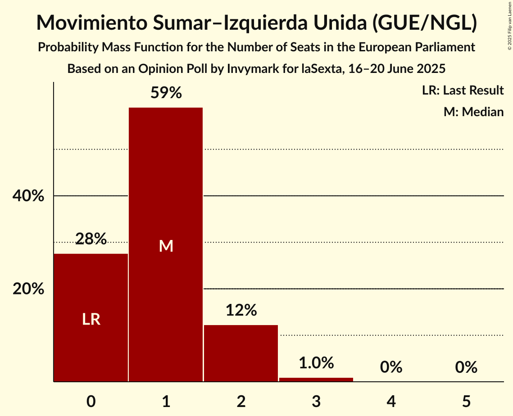

| Number of Seats | Probability | Accumulated | Special Marks |
|:---------------:|:-----------:|:-----------:|:-------------:|
| 0 | 28% | 100% | Last Result |
| 1 | 59% | 72% | Median |
| 2 | 12% | 13% |  |
| 3 | 1.0% | 1.0% |  |
| 4 | 0% | 0% |  |

## Coalitions

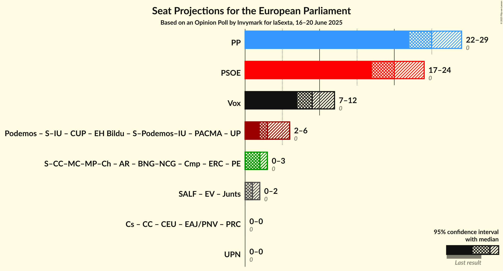

### Confidence Intervals

| Coalition | Last Result | Median | Majority? | 80% Confidence Interval | 90% Confidence Interval | 95% Confidence Interval | 99% Confidence Interval |
|:---------:|:-----------:|:------:|:---------:|:-----------------------:|:-----------------------:|:-----------------------:|:-----------------------:|
| Partido Popular (EPP) | 0 | 25 | 0.3% | 23–28 | 22–29 | 22–29 | 20–30 |
| Partido Socialista Obrero Español (S&D) | 0 | 20 | 0% | 18–22 | 17–23 | 17–24 | 16–25 |
| Vox (PfE) | 0 | 9 | 0% | 8–11 | 7–12 | 7–12 | 6–13 |

### Partido Popular (EPP)

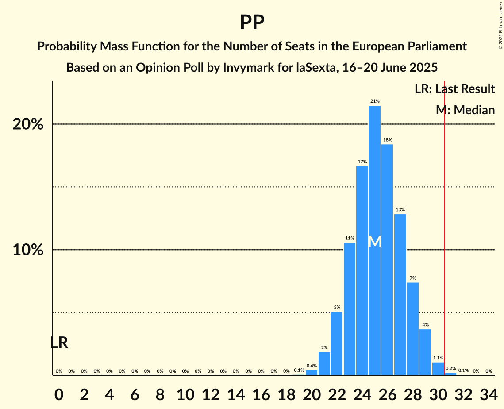

| Number of Seats | Probability | Accumulated | Special Marks |
|:---------------:|:-----------:|:-----------:|:-------------:|
| 0 | 0% | 100% | Last Result |
| 1 | 0% | 100% |  |
| 2 | 0% | 100% |  |
| 3 | 0% | 100% |  |
| 4 | 0% | 100% |  |
| 5 | 0% | 100% |  |
| 6 | 0% | 100% |  |
| 7 | 0% | 100% |  |
| 8 | 0% | 100% |  |
| 9 | 0% | 100% |  |
| 10 | 0% | 100% |  |
| 11 | 0% | 100% |  |
| 12 | 0% | 100% |  |
| 13 | 0% | 100% |  |
| 14 | 0% | 100% |  |
| 15 | 0% | 100% |  |
| 16 | 0% | 100% |  |
| 17 | 0% | 100% |  |
| 18 | 0% | 100% |  |
| 19 | 0.1% | 100% |  |
| 20 | 0.4% | 99.9% |  |
| 21 | 2% | 99.5% |  |
| 22 | 5% | 98% |  |
| 23 | 11% | 93% |  |
| 24 | 17% | 82% |  |
| 25 | 21% | 65% | Median |
| 26 | 18% | 44% |  |
| 27 | 13% | 25% |  |
| 28 | 7% | 12% |  |
| 29 | 4% | 5% |  |
| 30 | 1.1% | 1.4% |  |
| 31 | 0.2% | 0.3% | Majority |
| 32 | 0.1% | 0.1% |  |
| 33 | 0% | 0% |  |

### Partido Socialista Obrero Español (S&D)

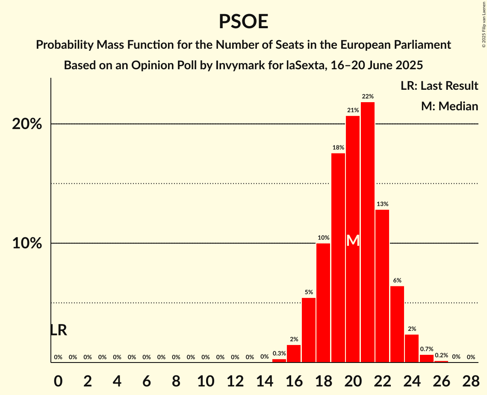

| Number of Seats | Probability | Accumulated | Special Marks |
|:---------------:|:-----------:|:-----------:|:-------------:|
| 0 | 0% | 100% | Last Result |
| 1 | 0% | 100% |  |
| 2 | 0% | 100% |  |
| 3 | 0% | 100% |  |
| 4 | 0% | 100% |  |
| 5 | 0% | 100% |  |
| 6 | 0% | 100% |  |
| 7 | 0% | 100% |  |
| 8 | 0% | 100% |  |
| 9 | 0% | 100% |  |
| 10 | 0% | 100% |  |
| 11 | 0% | 100% |  |
| 12 | 0% | 100% |  |
| 13 | 0% | 100% |  |
| 14 | 0% | 100% |  |
| 15 | 0.3% | 100% |  |
| 16 | 1.4% | 99.6% |  |
| 17 | 5% | 98% |  |
| 18 | 10% | 93% |  |
| 19 | 18% | 83% |  |
| 20 | 20% | 64% | Median |
| 21 | 20% | 44% |  |
| 22 | 15% | 24% |  |
| 23 | 6% | 9% |  |
| 24 | 2% | 3% |  |
| 25 | 0.7% | 0.9% |  |
| 26 | 0.2% | 0.2% |  |
| 27 | 0% | 0% |  |

### Vox (PfE)

| Number of Seats | Probability | Accumulated | Special Marks |
|:---------------:|:-----------:|:-----------:|:-------------:|
| 0 | 0% | 100% | Last Result |
| 1 | 0% | 100% |  |
| 2 | 0% | 100% |  |
| 3 | 0% | 100% |  |
| 4 | 0% | 100% |  |
| 5 | 0.1% | 100% |  |
| 6 | 1.0% | 99.9% |  |
| 7 | 6% | 98.9% |  |
| 8 | 17% | 93% |  |
| 9 | 28% | 76% | Median |
| 10 | 26% | 47% |  |
| 11 | 15% | 22% |  |
| 12 | 5% | 7% |  |
| 13 | 2% | 2% |  |
| 14 | 0.3% | 0.4% |  |
| 15 | 0% | 0.1% |  |
| 16 | 0% | 0% |  |

## Technical Information

### Opinion Poll

+ **Polling firm:** Invymark
+ **Commissioner(s):** laSexta
+ **Fieldwork period:** 16–20 June 2025

### Calculations

+ **Sample size:** 300
+ **Simulations done:** 2,097,152
+ **Error estimate:** 1.52%

