# Poll Average

<a href="#voting-intentions">Voting Intentions</a> | <a href="#seats">Seats</a> | <a href="#coalitions">Coalitions</a> | <a href="#technical-information">Technical Information</a>

## Summary

The table below lists the polls on which the average is based. They are the most recent polls (less than 90 days old) registered and analyzed so far.

| Period     | Polling firm/Commissioner(s) | PP | PSOE | UP | Cs | ERC | PDeCAT | EAJ/PNV | PACMA | EH Bildu | CC | Vox | BNG | AR | CEU | PE |
|:----------:|:----------------------------:|:--:|:--:|:--:|:--:|:--:|:--:|:--:|:--:|:--:|:--:|:--:|:--:|:--:|:--:|:--:|
| 25 May 2014 | General Election | 0.0%   0 | 0.0%   0 | 0.0%   0 | 0.0%   0 | 0.0%   0 | 0.0%   0 | 0.0%   0 | 0.0%   0 | 0.0%   0 | 0.0%   0 | 0.0%   0 | 0.0%   0 | 0.0%   0 | 0.0%   0 | 0.0%   0 |
| N/A | Poll Average | 16–25%   9–14 | 23–32%   13–18 | 11–15%   6–8 | 12–18%   7–10 | N/A   N/A | N/A   N/A | N/A   N/A | 1–4%   0–2 | N/A   N/A | N/A   N/A | 8–14%   4–8 | N/A   N/A | 3–6%   1–3 | 2–4%   0–2 | 1–3%   0–1 |
| [9–15 April 2019](2019-04-15-GAD3.html) | GAD3   ABC | 19–23%   10–12 | 29–33%   16–19 | 11–14%   6–7 | 12–15%   6–8 | N/A   N/A | N/A   N/A | N/A   N/A | N/A   N/A | N/A   N/A | N/A   N/A | 10–13%   5–7 | N/A   N/A | N/A   N/A | N/A   N/A | N/A   N/A |
| [7–14 April 2019](2019-04-14-SocioMétrica.html) | SocioMétrica   El Español | 17–21%   9–12 | 28–33%   16–18 | 11–14%   6–8 | 14–18%   8–10 | N/A   N/A | N/A   N/A | N/A   N/A | 1–2%   0 | N/A   N/A | N/A   N/A | 10–12%   5–7 | N/A   N/A | 3–5%   2–3 | 2–3%   1 | 0–1%   0 |
| [30 March–14 April 2019](2019-04-14-NCReport.html) | NC Report   La Razón | 22–27%   12–15 | 25–30%   14–17 | 10–14%   5–8 | 14–18%   7–10 | N/A   N/A | N/A   N/A | N/A   N/A | N/A   N/A | N/A   N/A | N/A   N/A | 7–11%   4–6 | N/A   N/A | 3–5%   1–2 | 2–4%   1–2 | 1–3%   0–1 |
| [7–13 April 2019](2019-04-13-IMOP.html) | IMOP   El Confidencial | 17–21%   10–11 | 29–33%   16–19 | 12–15%   7–8 | 14–18%   8–10 | N/A   N/A | N/A   N/A | N/A   N/A | 1–3%   0–1 | N/A   N/A | N/A   N/A | 8–11%   4–6 | N/A   N/A | 3–5%   1–2 | 2–4%   1–2 | 1–2%   0 |
| [11 April 2019](2019-04-11-SigmaDos.html) | Sigma Dos   El Mundo | 19–24%   11–14 | 27–33%   15–18 | 11–15%   6–8 | 12–16%   6–9 | N/A   N/A | N/A   N/A | N/A   N/A | 1–2%   0–1 | N/A   N/A | N/A   N/A | 8–12%   4–6 | N/A   N/A | 4–7%   2–3 | 1–3%   0–1 | N/A   N/A |
| [8–11 April 2019](2019-04-11-Invymark.html) | Invymark   laSexta | 19–23%   10–13 | 25–30%   13–16 | 11–15%   6–8 | 14–19%   8–10 | N/A   N/A | N/A   N/A | N/A   N/A | N/A   N/A | N/A   N/A | N/A   N/A | 11–15%   6–8 | N/A   N/A | N/A   N/A | N/A   N/A | N/A   N/A |
| [8–11 April 2019](2019-04-11-DemoscopiayServicios.html) | Demoscopia y Servicios   ESdiario | 18–24%   10–13 | 25–31%   14–18 | 11–16%   6–9 | 14–19%   8–11 | N/A   N/A | N/A   N/A | N/A   N/A | N/A   N/A | N/A   N/A | N/A   N/A | 10–14%   5–8 | N/A   N/A | 2–5%   1–2 | 2–4%   1–2 | 1–2%   0–1 |
| [4–10 April 2019](2019-04-10-Celeste-Tel.html) | Celeste-Tel   eldiario.es | 21–27%   12–15 | 25–30%   14–17 | 11–15%   6–8 | 14–18%   8–10 | N/A   N/A | N/A   N/A | N/A   N/A | 1–2%   0–1 | N/A   N/A | N/A   N/A | 6–10%   3–5 | N/A   N/A | 3–5%   1–3 | 2–4%   1–2 | 1–2%   0–1 |
| [22 February–7 April 2019](2019-04-07-electoPanel.html) | electoPanel   electomania.es | 19–21%   11–12 | 22–24%   13–14 | 11–12%   6–7 | 16–18%   9–10 | N/A   N/A | N/A   N/A | N/A   N/A | 3–4%   1–2 | N/A   N/A | N/A   N/A | 11–12%   6–7 | N/A   N/A | 5%   2–3 | 3–4%   1–2 | 2–3%   1 |
| [1–5 April 2019](2019-04-05-SimpleLógica.html) | Simple Lógica | 15–19%   8–10 | 28–33%   15–18 | 12–17%   7–9 | 13–18%   7–10 | N/A   N/A | N/A   N/A | N/A   N/A | N/A   N/A | N/A   N/A | N/A   N/A | 8–12%   4–6 | N/A   N/A | N/A   N/A | N/A   N/A | N/A   N/A |
| [1–5 April 2019](2019-04-05-GESOP.html) | GESOP   El Periódico | 19–23%   10–13 | 28–32%   15–18 | 10–14%   5–7 | 13–16%   7–9 | N/A   N/A | N/A   N/A | N/A   N/A | N/A   N/A | N/A   N/A | N/A   N/A | 9–12%   5–6 | N/A   N/A | N/A   N/A | N/A   N/A | N/A   N/A |
| [18–25 March 2019](2019-03-25-Metroscopia.html) | Metroscopia   Henneo | 18–21%   9–11 | 27–30%   15–17 | 13–15%   7–8 | 15–18%   8–10 | N/A   N/A | N/A   N/A | N/A   N/A | N/A   N/A | N/A   N/A | N/A   N/A | 11–13%   5–7 | N/A   N/A | N/A   N/A | N/A   N/A | N/A   N/A |
| [15–20 March 2019](2019-03-20-Sondaxe.html) | Sondaxe   La Voz de Galicia | 17–21%   9–12 | 24–30%   13–17 | 11–16%   6–8 | 12–16%   6–9 | N/A   N/A | N/A   N/A | N/A   N/A | N/A   N/A | N/A   N/A | N/A   N/A | 12–16%   6–9 | N/A   N/A | 4–6%   2–3 | 2–4%   1–2 | N/A   N/A |
| [14–19 March 2019](2019-03-19-40dB.html) | 40dB   El País | 17–21%   9–12 | 25–29%   14–16 | 11–14%   6–8 | 16–20%   8–11 | N/A   N/A | N/A   N/A | N/A   N/A | N/A   N/A | N/A   N/A | N/A   N/A | 9–12%   5–6 | N/A   N/A | N/A   N/A | N/A   N/A | N/A   N/A |
| [1–18 March 2019](2019-03-18-CIS.html) | CIS | 17–18%   9–10 | 29–31%   17–18 | 12–13%   7–8 | 13–14%   7–8 | N/A   N/A | N/A   N/A | N/A   N/A | 1–2%   0 | N/A   N/A | N/A   N/A | 11–12%   6–7 | N/A   N/A | 5–6%   3 | 3%   1 | 1%   0 |
| 25 May 2014 | General Election | 0.0%   0 | 0.0%   0 | 0.0%   0 | 0.0%   0 | 0.0%   0 | 0.0%   0 | 0.0%   0 | 0.0%   0 | 0.0%   0 | 0.0%   0 | 0.0%   0 | 0.0%   0 | 0.0%   0 | 0.0%   0 | 0.0%   0 |

Only polls for which at least the sample size has been published are included in the table above.

**Legend:**
+ **Top half of each row:** Voting intentions (95% confidence interval)
+ **Bottom half of each row:** Seat projections for the European Parliament (95% confidence interval)
+ **PP:** Partido Popular (EPP)
+ **PSOE:** Partido Socialista Obrero Español (S&D)
+ **UP:** Unidos Podemos (GUE/NGL)
+ **Cs:** Ciudadanos–Partido de la Ciudadanía (ALDE)
+ **ERC:** Esquerra Republicana de Catalunya (Greens/EFA)
+ **PDeCAT:** Partit Demòcrata Europeu Català (ALDE)
+ **EAJ/PNV:** Euzko Alderdi Jeltzalea/Partido Nacionalista Vasco (ALDE)
+ **PACMA:** Partido Animalista Contra el Maltrato Animal (GUE/NGL)
+ **EH Bildu:** Euskal Herria Bildu (GUE/NGL)
+ **CC:** Coalición Canaria (ALDE)
+ **Vox:** Vox (ENF)
+ **BNG:** Bloque Nacionalista Galego (Greens/EFA)
+ **AR:** Ahora Repúblicas (Greens/EFA)
+ **CEU:** Coalición por Europa (ALDE)
+ **PE:** Primavera Europea (Greens/EFA)
+ **N/A (single party):** Party not included the published results
+ **N/A (entire row):** Calculation for this opinion poll not started yet

## Voting Intentions

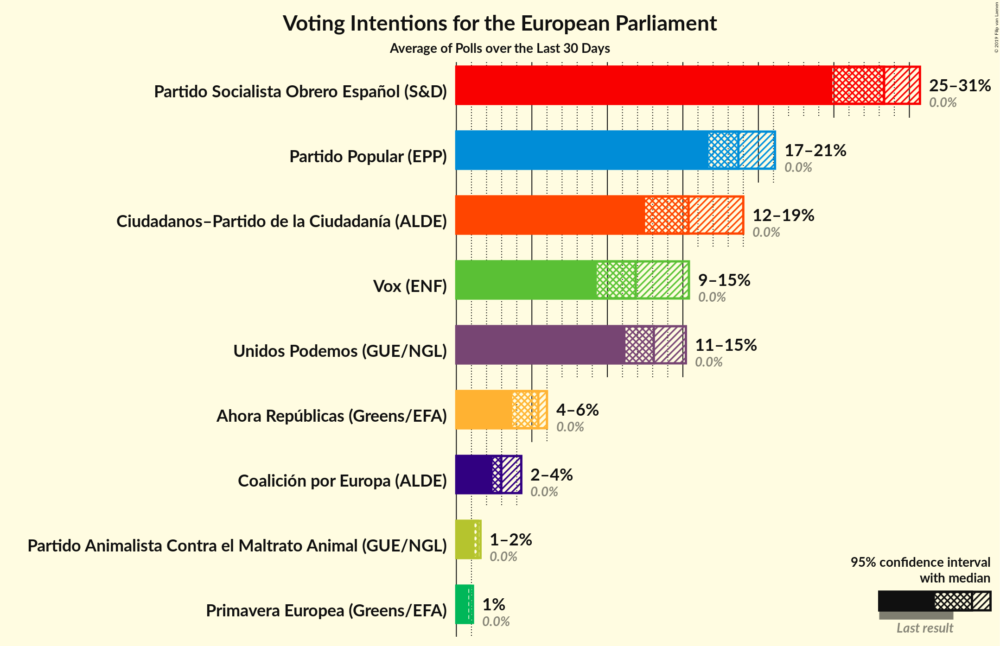

### Confidence Intervals

| Party | Last Result | Median | 80% Confidence Interval | 90% Confidence Interval | 95% Confidence Interval | 99% Confidence Interval |
|:-----:|:-----------:|:------:|:-----------------------:|:-----------------------:|:-----------------------:|:-----------------------:|
| <a href="#partido-popular-(epp)">Partido Popular (EPP)</a> | 0.0% | 20.0% | 17.3–23.5% |16.8–24.5% | 16.3–25.2% | 15.1–26.5% |
| <a href="#partido-socialista-obrero-español-(s&d)">Partido Socialista Obrero Español (S&D)</a> | 0.0% | 28.9% | 25.5–31.4% |23.4–32.0% | 23.0–32.5% | 22.5–33.5% |
| <a href="#unidos-podemos-(gue/ngl)">Unidos Podemos (GUE/NGL)</a> | 0.0% | 12.9% | 11.3–14.5% |11.0–14.9% | 10.8–15.4% | 10.3–16.2% |
| <a href="#ciudadanos–partido-de-la-ciudadanía-(alde)">Ciudadanos–Partido de la Ciudadanía (ALDE)</a> | 0.0% | 15.6% | 13.3–17.5% |12.9–18.0% | 12.5–18.5% | 11.8–19.4% |
| <a href="#esquerra-republicana-de-catalunya-(greens/efa)">Esquerra Republicana de Catalunya (Greens/EFA)</a> | 0.0% | N/A | N/A |N/A | N/A | N/A |
| <a href="#partit-demòcrata-europeu-català-(alde)">Partit Demòcrata Europeu Català (ALDE)</a> | 0.0% | N/A | N/A |N/A | N/A | N/A |
| <a href="#euzko-alderdi-jeltzalea/partido-nacionalista-vasco-(alde)">Euzko Alderdi Jeltzalea/Partido Nacionalista Vasco (ALDE)</a> | 0.0% | N/A | N/A |N/A | N/A | N/A |
| <a href="#partido-animalista-contra-el-maltrato-animal-(gue/ngl)">Partido Animalista Contra el Maltrato Animal (GUE/NGL)</a> | 0.0% | 1.5% | 0.9–3.5% |0.8–3.6% | 0.7–3.7% | 0.5–3.9% |
| <a href="#euskal-herria-bildu-(gue/ngl)">Euskal Herria Bildu (GUE/NGL)</a> | 0.0% | N/A | N/A |N/A | N/A | N/A |
| <a href="#coalición-canaria-(alde)">Coalición Canaria (ALDE)</a> | 0.0% | N/A | N/A |N/A | N/A | N/A |
| <a href="#vox-(enf)">Vox (ENF)</a> | 0.0% | 11.1% | 8.7–12.9% |8.0–13.8% | 7.5–14.5% | 6.7–15.6% |
| <a href="#bloque-nacionalista-galego-(greens/efa)">Bloque Nacionalista Galego (Greens/EFA)</a> | 0.0% | N/A | N/A |N/A | N/A | N/A |
| <a href="#ahora-repúblicas-(greens/efa)">Ahora Repúblicas (Greens/EFA)</a> | 0.0% | 4.4% | 3.3–5.6% |3.0–5.8% | 2.8–5.9% | 2.4–6.4% |
| <a href="#coalición-por-europa-(alde)">Coalición por Europa (ALDE)</a> | 0.0% | 2.9% | 2.2–3.6% |1.9–3.8% | 1.7–4.1% | 1.4–4.5% |
| <a href="#primavera-europea-(greens/efa)">Primavera Europea (Greens/EFA)</a> | 0.0% | 1.2% | 0.7–2.4% |0.6–2.5% | 0.6–2.6% | 0.4–2.8% |

### Partido Popular (EPP)

*For a full overview of the results for this party, see the [Partido Popular (EPP)](party-partidopopularepp.html) page.*

| Voting Intentions | Probability | Accumulated | Special Marks |
|:-----------------:|:-----------:|:-----------:|:-------------:|
| 0.0–0.5% | 0% | 100% | Last Result |
| 0.5–1.5% | 0% | 100% |  |
| 1.5–2.5% | 0% | 100% |  |
| 2.5–3.5% | 0% | 100% |  |
| 3.5–4.5% | 0% | 100% |  |
| 4.5–5.5% | 0% | 100% |  |
| 5.5–6.5% | 0% | 100% |  |
| 6.5–7.5% | 0% | 100% |  |
| 7.5–8.5% | 0% | 100% |  |
| 8.5–9.5% | 0% | 100% |  |
| 9.5–10.5% | 0% | 100% |  |
| 10.5–11.5% | 0% | 100% |  |
| 11.5–12.5% | 0% | 100% |  |
| 12.5–13.5% | 0% | 100% |  |
| 13.5–14.5% | 0.2% | 100% |  |
| 14.5–15.5% | 0.8% | 99.8% |  |
| 15.5–16.5% | 2% | 99.0% |  |
| 16.5–17.5% | 10% | 97% |  |
| 17.5–18.5% | 11% | 86% |  |
| 18.5–19.5% | 17% | 75% |  |
| 19.5–20.5% | 20% | 58% | Median |
| 20.5–21.5% | 14% | 38% |  |
| 21.5–22.5% | 9% | 25% |  |
| 22.5–23.5% | 6% | 16% |  |
| 23.5–24.5% | 5% | 10% |  |
| 24.5–25.5% | 3% | 5% |  |
| 25.5–26.5% | 1.3% | 2% |  |
| 26.5–27.5% | 0.4% | 0.4% |  |
| 27.5–28.5% | 0.1% | 0.1% |  |
| 28.5–29.5% | 0% | 0% |  |

### Partido Socialista Obrero Español (S&D)

*For a full overview of the results for this party, see the [Partido Socialista Obrero Español (S&D)](party-partidosocialistaobreroespañolsd.html) page.*

| Voting Intentions | Probability | Accumulated | Special Marks |
|:-----------------:|:-----------:|:-----------:|:-------------:|
| 0.0–0.5% | 0% | 100% | Last Result |
| 0.5–1.5% | 0% | 100% |  |
| 1.5–2.5% | 0% | 100% |  |
| 2.5–3.5% | 0% | 100% |  |
| 3.5–4.5% | 0% | 100% |  |
| 4.5–5.5% | 0% | 100% |  |
| 5.5–6.5% | 0% | 100% |  |
| 6.5–7.5% | 0% | 100% |  |
| 7.5–8.5% | 0% | 100% |  |
| 8.5–9.5% | 0% | 100% |  |
| 9.5–10.5% | 0% | 100% |  |
| 10.5–11.5% | 0% | 100% |  |
| 11.5–12.5% | 0% | 100% |  |
| 12.5–13.5% | 0% | 100% |  |
| 13.5–14.5% | 0% | 100% |  |
| 14.5–15.5% | 0% | 100% |  |
| 15.5–16.5% | 0% | 100% |  |
| 16.5–17.5% | 0% | 100% |  |
| 17.5–18.5% | 0% | 100% |  |
| 18.5–19.5% | 0% | 100% |  |
| 19.5–20.5% | 0% | 100% |  |
| 20.5–21.5% | 0% | 100% |  |
| 21.5–22.5% | 0.7% | 100% |  |
| 22.5–23.5% | 5% | 99.3% |  |
| 23.5–24.5% | 2% | 94% |  |
| 24.5–25.5% | 3% | 93% |  |
| 25.5–26.5% | 8% | 90% |  |
| 26.5–27.5% | 13% | 82% |  |
| 27.5–28.5% | 14% | 69% |  |
| 28.5–29.5% | 15% | 55% | Median |
| 29.5–30.5% | 19% | 40% |  |
| 30.5–31.5% | 13% | 21% |  |
| 31.5–32.5% | 6% | 9% |  |
| 32.5–33.5% | 2% | 2% |  |
| 33.5–34.5% | 0.4% | 0.4% |  |
| 34.5–35.5% | 0% | 0% |  |

### Unidos Podemos (GUE/NGL)

*For a full overview of the results for this party, see the [Unidos Podemos (GUE/NGL)](party-unidospodemosguengl.html) page.*

| Voting Intentions | Probability | Accumulated | Special Marks |
|:-----------------:|:-----------:|:-----------:|:-------------:|
| 0.0–0.5% | 0% | 100% | Last Result |
| 0.5–1.5% | 0% | 100% |  |
| 1.5–2.5% | 0% | 100% |  |
| 2.5–3.5% | 0% | 100% |  |
| 3.5–4.5% | 0% | 100% |  |
| 4.5–5.5% | 0% | 100% |  |
| 5.5–6.5% | 0% | 100% |  |
| 6.5–7.5% | 0% | 100% |  |
| 7.5–8.5% | 0% | 100% |  |
| 8.5–9.5% | 0% | 100% |  |
| 9.5–10.5% | 1.0% | 100% |  |
| 10.5–11.5% | 13% | 99.0% |  |
| 11.5–12.5% | 24% | 86% |  |
| 12.5–13.5% | 34% | 62% | Median |
| 13.5–14.5% | 19% | 28% |  |
| 14.5–15.5% | 7% | 9% |  |
| 15.5–16.5% | 2% | 2% |  |
| 16.5–17.5% | 0.2% | 0.3% |  |
| 17.5–18.5% | 0% | 0% |  |

### Ciudadanos–Partido de la Ciudadanía (ALDE)

*For a full overview of the results for this party, see the [Ciudadanos–Partido de la Ciudadanía (ALDE)](party-ciudadanos–partidodelaciudadaníaalde.html) page.*

| Voting Intentions | Probability | Accumulated | Special Marks |
|:-----------------:|:-----------:|:-----------:|:-------------:|
| 0.0–0.5% | 0% | 100% | Last Result |
| 0.5–1.5% | 0% | 100% |  |
| 1.5–2.5% | 0% | 100% |  |
| 2.5–3.5% | 0% | 100% |  |
| 3.5–4.5% | 0% | 100% |  |
| 4.5–5.5% | 0% | 100% |  |
| 5.5–6.5% | 0% | 100% |  |
| 6.5–7.5% | 0% | 100% |  |
| 7.5–8.5% | 0% | 100% |  |
| 8.5–9.5% | 0% | 100% |  |
| 9.5–10.5% | 0% | 100% |  |
| 10.5–11.5% | 0.2% | 100% |  |
| 11.5–12.5% | 3% | 99.7% |  |
| 12.5–13.5% | 11% | 97% |  |
| 13.5–14.5% | 16% | 86% |  |
| 14.5–15.5% | 17% | 70% |  |
| 15.5–16.5% | 23% | 52% | Median |
| 16.5–17.5% | 20% | 29% |  |
| 17.5–18.5% | 7% | 9% |  |
| 18.5–19.5% | 2% | 2% |  |
| 19.5–20.5% | 0.3% | 0.4% |  |
| 20.5–21.5% | 0% | 0% |  |

### Vox (ENF)

*For a full overview of the results for this party, see the [Vox (ENF)](party-voxenf.html) page.*

| Voting Intentions | Probability | Accumulated | Special Marks |
|:-----------------:|:-----------:|:-----------:|:-------------:|
| 0.0–0.5% | 0% | 100% | Last Result |
| 0.5–1.5% | 0% | 100% |  |
| 1.5–2.5% | 0% | 100% |  |
| 2.5–3.5% | 0% | 100% |  |
| 3.5–4.5% | 0% | 100% |  |
| 4.5–5.5% | 0% | 100% |  |
| 5.5–6.5% | 0.3% | 100% |  |
| 6.5–7.5% | 2% | 99.7% |  |
| 7.5–8.5% | 6% | 97% |  |
| 8.5–9.5% | 13% | 91% |  |
| 9.5–10.5% | 18% | 78% |  |
| 10.5–11.5% | 21% | 60% | Median |
| 11.5–12.5% | 25% | 38% |  |
| 12.5–13.5% | 7% | 13% |  |
| 13.5–14.5% | 4% | 6% |  |
| 14.5–15.5% | 2% | 2% |  |
| 15.5–16.5% | 0.5% | 0.5% |  |
| 16.5–17.5% | 0.1% | 0.1% |  |
| 17.5–18.5% | 0% | 0% |  |

### Partido Animalista Contra el Maltrato Animal (GUE/NGL)

*For a full overview of the results for this party, see the [Partido Animalista Contra el Maltrato Animal (GUE/NGL)](party-partidoanimalistacontraelmaltratoanimalguengl.html) page.*

| Voting Intentions | Probability | Accumulated | Special Marks |
|:-----------------:|:-----------:|:-----------:|:-------------:|
| 0.0–0.5% | 0.5% | 100% | Last Result |
| 0.5–1.5% | 55% | 99.5% | Median |
| 1.5–2.5% | 26% | 44% |  |
| 2.5–3.5% | 12% | 19% |  |
| 3.5–4.5% | 7% | 7% |  |
| 4.5–5.5% | 0% | 0% |  |

### Coalición por Europa (ALDE)

*For a full overview of the results for this party, see the [Coalición por Europa (ALDE)](party-coaliciónporeuropaalde.html) page.*

| Voting Intentions | Probability | Accumulated | Special Marks |
|:-----------------:|:-----------:|:-----------:|:-------------:|
| 0.0–0.5% | 0% | 100% | Last Result |
| 0.5–1.5% | 1.2% | 100% |  |
| 1.5–2.5% | 22% | 98.8% |  |
| 2.5–3.5% | 64% | 77% | Median |
| 3.5–4.5% | 12% | 13% |  |
| 4.5–5.5% | 0.5% | 0.5% |  |
| 5.5–6.5% | 0% | 0% |  |

### Ahora Repúblicas (Greens/EFA)

*For a full overview of the results for this party, see the [Ahora Repúblicas (Greens/EFA)](party-ahorarepúblicasgreensefa.html) page.*

| Voting Intentions | Probability | Accumulated | Special Marks |
|:-----------------:|:-----------:|:-----------:|:-------------:|
| 0.0–0.5% | 0% | 100% | Last Result |
| 0.5–1.5% | 0% | 100% |  |
| 1.5–2.5% | 0.8% | 100% |  |
| 2.5–3.5% | 16% | 99.2% |  |
| 3.5–4.5% | 37% | 83% | Median |
| 4.5–5.5% | 35% | 46% |  |
| 5.5–6.5% | 11% | 12% |  |
| 6.5–7.5% | 0.3% | 0.4% |  |
| 7.5–8.5% | 0% | 0% |  |

### Primavera Europea (Greens/EFA)

*For a full overview of the results for this party, see the [Primavera Europea (Greens/EFA)](party-primaveraeuropeagreensefa.html) page.*

| Voting Intentions | Probability | Accumulated | Special Marks |
|:-----------------:|:-----------:|:-----------:|:-------------:|
| 0.0–0.5% | 2% | 100% | Last Result |
| 0.5–1.5% | 63% | 98% | Median |
| 1.5–2.5% | 31% | 35% |  |
| 2.5–3.5% | 4% | 4% |  |
| 3.5–4.5% | 0% | 0% |  |

## Seats

### Confidence Intervals

| Party | Last Result | Median | 80% Confidence Interval | 90% Confidence Interval | 95% Confidence Interval | 99% Confidence Interval |
|:-----:|:-----------:|:------:|:-----------------------:|:-----------------------:|:-----------------------:|:-----------------------:|
| <a href="#partido-popular-(epp)">Partido Popular (EPP)</a> | 0 | 11 | 10–13 |9–14 | 9–14 | 8–15 |
| <a href="#partido-socialista-obrero-español-(s&d)">Partido Socialista Obrero Español (S&D)</a> | 0 | 16 | 14–18 |13–18 | 13–18 | 13–19 |
| <a href="#unidos-podemos-(gue/ngl)">Unidos Podemos (GUE/NGL)</a> | 0 | 7 | 6–8 |6–8 | 6–8 | 5–9 |
| <a href="#ciudadanos–partido-de-la-ciudadanía-(alde)">Ciudadanos–Partido de la Ciudadanía (ALDE)</a> | 0 | 9 | 7–10 |7–10 | 7–10 | 6–11 |
| <a href="#esquerra-republicana-de-catalunya-(greens/efa)">Esquerra Republicana de Catalunya (Greens/EFA)</a> | 0 | N/A | N/A |N/A | N/A | N/A |
| <a href="#partit-demòcrata-europeu-català-(alde)">Partit Demòcrata Europeu Català (ALDE)</a> | 0 | N/A | N/A |N/A | N/A | N/A |
| <a href="#euzko-alderdi-jeltzalea/partido-nacionalista-vasco-(alde)">Euzko Alderdi Jeltzalea/Partido Nacionalista Vasco (ALDE)</a> | 0 | N/A | N/A |N/A | N/A | N/A |
| <a href="#partido-animalista-contra-el-maltrato-animal-(gue/ngl)">Partido Animalista Contra el Maltrato Animal (GUE/NGL)</a> | 0 | 0 | 0–2 |0–2 | 0–2 | 0–2 |
| <a href="#euskal-herria-bildu-(gue/ngl)">Euskal Herria Bildu (GUE/NGL)</a> | 0 | N/A | N/A |N/A | N/A | N/A |
| <a href="#coalición-canaria-(alde)">Coalición Canaria (ALDE)</a> | 0 | N/A | N/A |N/A | N/A | N/A |
| <a href="#vox-(enf)">Vox (ENF)</a> | 0 | 6 | 4–7 |4–7 | 4–8 | 3–9 |
| <a href="#bloque-nacionalista-galego-(greens/efa)">Bloque Nacionalista Galego (Greens/EFA)</a> | 0 | N/A | N/A |N/A | N/A | N/A |
| <a href="#ahora-repúblicas-(greens/efa)">Ahora Repúblicas (Greens/EFA)</a> | 0 | 2 | 1–3 |1–3 | 1–3 | 1–3 |
| <a href="#coalición-por-europa-(alde)">Coalición por Europa (ALDE)</a> | 0 | 1 | 1–2 |1–2 | 0–2 | 0–2 |
| <a href="#primavera-europea-(greens/efa)">Primavera Europea (Greens/EFA)</a> | 0 | 0 | 0–1 |0–1 | 0–1 | 0–1 |

### Partido Popular (EPP)

*For a full overview of the results for this party, see the [Partido Popular (EPP)](party-partidopopularepp.html) page.*

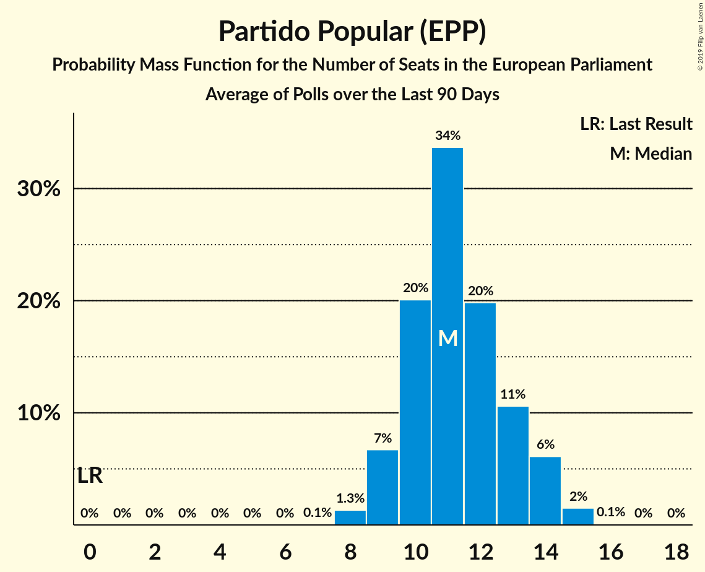

| Number of Seats | Probability | Accumulated | Special Marks |
|:---------------:|:-----------:|:-----------:|:-------------:|
| 0 | 0% | 100% | Last Result |
| 1 | 0% | 100% |  |
| 2 | 0% | 100% |  |
| 3 | 0% | 100% |  |
| 4 | 0% | 100% |  |
| 5 | 0% | 100% |  |
| 6 | 0% | 100% |  |
| 7 | 0.1% | 100% |  |
| 8 | 2% | 99.9% |  |
| 9 | 6% | 98% |  |
| 10 | 27% | 92% |  |
| 11 | 31% | 65% | Median |
| 12 | 17% | 34% |  |
| 13 | 9% | 17% |  |
| 14 | 6% | 8% |  |
| 15 | 2% | 2% |  |
| 16 | 0.1% | 0.1% |  |
| 17 | 0% | 0% |  |

### Partido Socialista Obrero Español (S&D)

*For a full overview of the results for this party, see the [Partido Socialista Obrero Español (S&D)](party-partidosocialistaobreroespañolsd.html) page.*

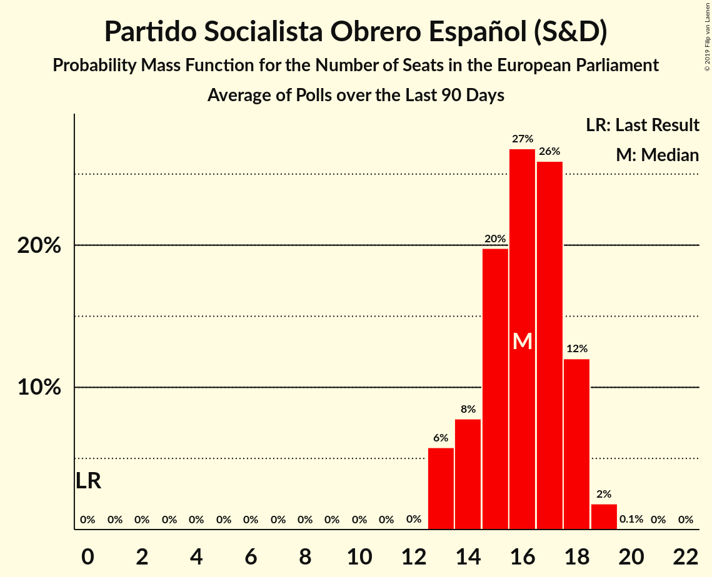

| Number of Seats | Probability | Accumulated | Special Marks |
|:---------------:|:-----------:|:-----------:|:-------------:|
| 0 | 0% | 100% | Last Result |
| 1 | 0% | 100% |  |
| 2 | 0% | 100% |  |
| 3 | 0% | 100% |  |
| 4 | 0% | 100% |  |
| 5 | 0% | 100% |  |
| 6 | 0% | 100% |  |
| 7 | 0% | 100% |  |
| 8 | 0% | 100% |  |
| 9 | 0% | 100% |  |
| 10 | 0% | 100% |  |
| 11 | 0% | 100% |  |
| 12 | 0.1% | 100% |  |
| 13 | 5% | 99.9% |  |
| 14 | 9% | 94% |  |
| 15 | 19% | 85% |  |
| 16 | 25% | 66% | Median |
| 17 | 24% | 41% |  |
| 18 | 15% | 17% |  |
| 19 | 2% | 2% |  |
| 20 | 0.1% | 0.1% |  |
| 21 | 0% | 0% |  |

### Unidos Podemos (GUE/NGL)

*For a full overview of the results for this party, see the [Unidos Podemos (GUE/NGL)](party-unidospodemosguengl.html) page.*

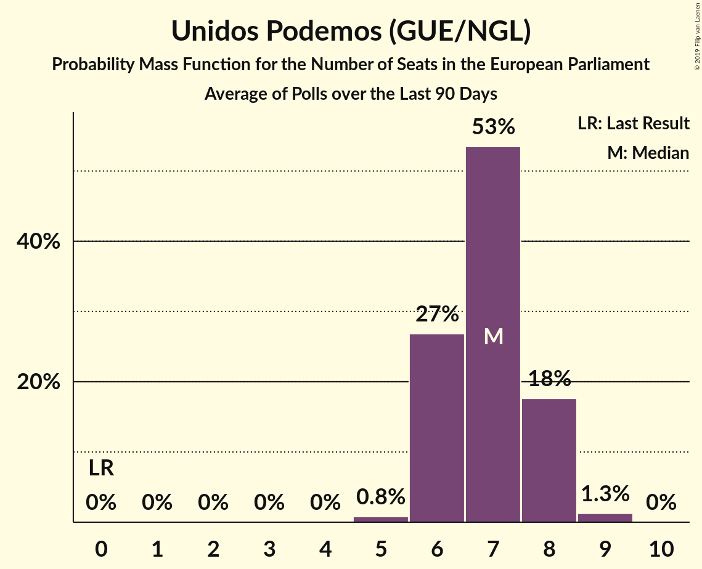

| Number of Seats | Probability | Accumulated | Special Marks |
|:---------------:|:-----------:|:-----------:|:-------------:|
| 0 | 0% | 100% | Last Result |
| 1 | 0% | 100% |  |
| 2 | 0% | 100% |  |
| 3 | 0% | 100% |  |
| 4 | 0% | 100% |  |
| 5 | 0.7% | 100% |  |
| 6 | 26% | 99.3% |  |
| 7 | 51% | 73% | Median |
| 8 | 20% | 22% |  |
| 9 | 1.4% | 1.5% |  |
| 10 | 0% | 0% |  |

### Ciudadanos–Partido de la Ciudadanía (ALDE)

*For a full overview of the results for this party, see the [Ciudadanos–Partido de la Ciudadanía (ALDE)](party-ciudadanos–partidodelaciudadaníaalde.html) page.*

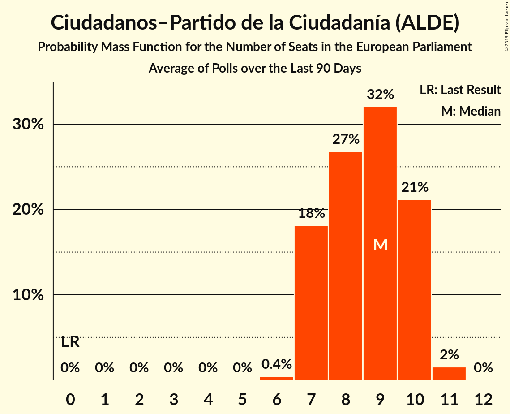

| Number of Seats | Probability | Accumulated | Special Marks |
|:---------------:|:-----------:|:-----------:|:-------------:|
| 0 | 0% | 100% | Last Result |
| 1 | 0% | 100% |  |
| 2 | 0% | 100% |  |
| 3 | 0% | 100% |  |
| 4 | 0% | 100% |  |
| 5 | 0% | 100% |  |
| 6 | 1.4% | 100% |  |
| 7 | 17% | 98.6% |  |
| 8 | 30% | 82% |  |
| 9 | 37% | 52% | Median |
| 10 | 14% | 15% |  |
| 11 | 0.8% | 0.8% |  |
| 12 | 0% | 0% |  |

### Vox (ENF)

*For a full overview of the results for this party, see the [Vox (ENF)](party-voxenf.html) page.*

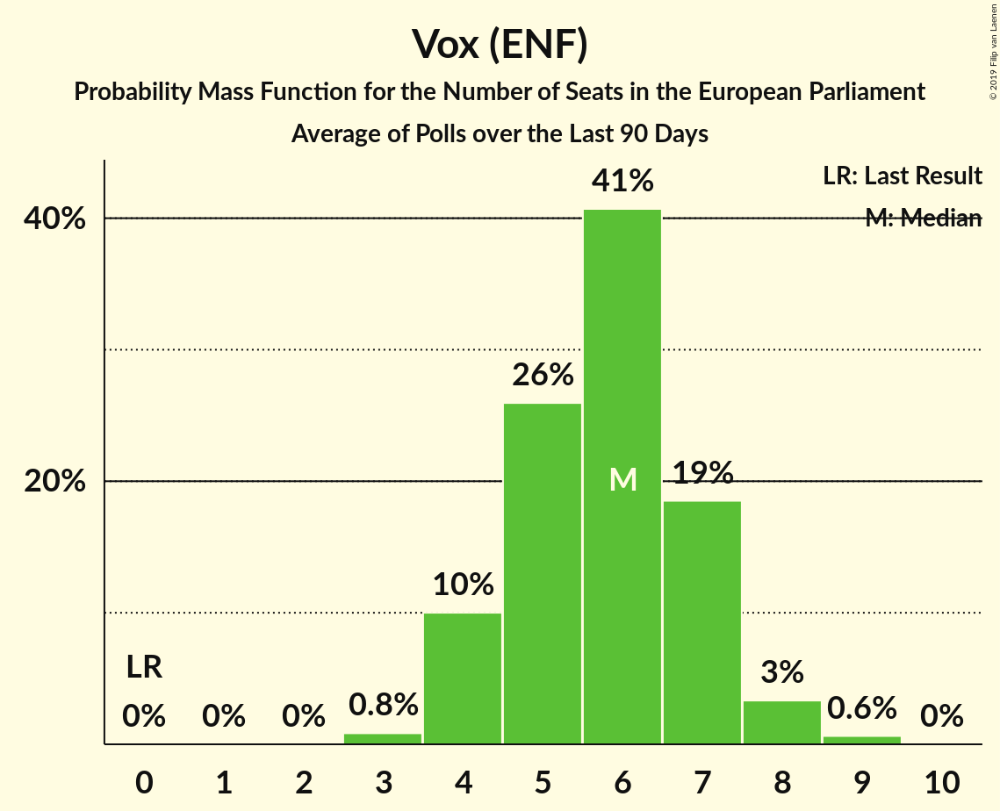

| Number of Seats | Probability | Accumulated | Special Marks |
|:---------------:|:-----------:|:-----------:|:-------------:|
| 0 | 0% | 100% | Last Result |
| 1 | 0% | 100% |  |
| 2 | 0% | 100% |  |
| 3 | 0.8% | 100% |  |
| 4 | 10% | 99.2% |  |
| 5 | 26% | 89% |  |
| 6 | 41% | 63% | Median |
| 7 | 19% | 22% |  |
| 8 | 3% | 4% |  |
| 9 | 0.6% | 0.7% |  |
| 10 | 0% | 0% |  |

### Partido Animalista Contra el Maltrato Animal (GUE/NGL)

*For a full overview of the results for this party, see the [Partido Animalista Contra el Maltrato Animal (GUE/NGL)](party-partidoanimalistacontraelmaltratoanimalguengl.html) page.*

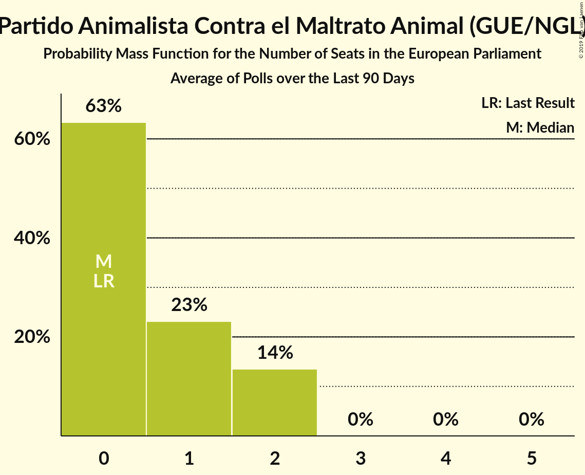

| Number of Seats | Probability | Accumulated | Special Marks |
|:---------------:|:-----------:|:-----------:|:-------------:|
| 0 | 63% | 100% | Last Result, Median |
| 1 | 25% | 37% |  |
| 2 | 12% | 12% |  |
| 3 | 0% | 0% |  |

### Coalición por Europa (ALDE)

*For a full overview of the results for this party, see the [Coalición por Europa (ALDE)](party-coaliciónporeuropaalde.html) page.*

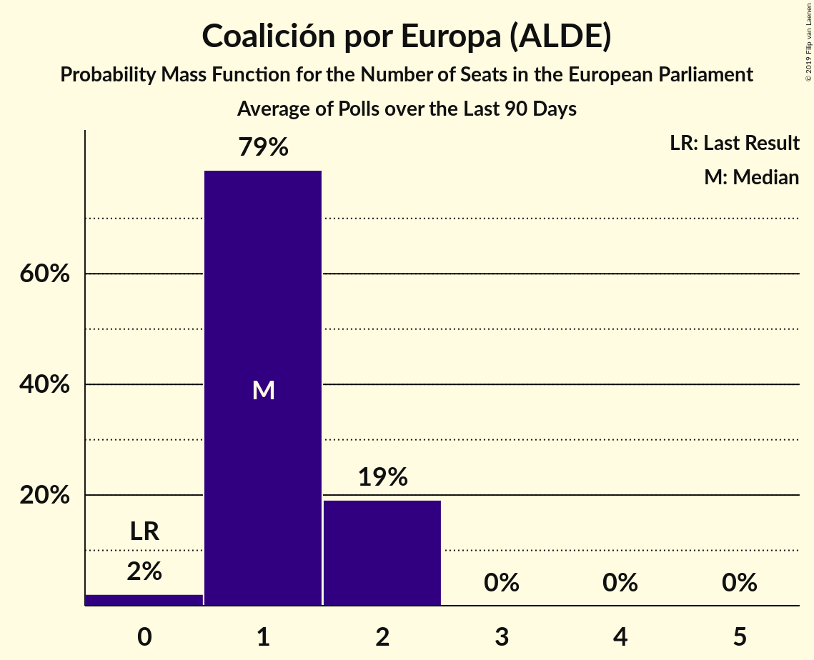

| Number of Seats | Probability | Accumulated | Special Marks |
|:---------------:|:-----------:|:-----------:|:-------------:|
| 0 | 3% | 100% | Last Result |
| 1 | 74% | 97% | Median |
| 2 | 23% | 23% |  |
| 3 | 0% | 0% |  |

### Ahora Repúblicas (Greens/EFA)

*For a full overview of the results for this party, see the [Ahora Repúblicas (Greens/EFA)](party-ahorarepúblicasgreensefa.html) page.*

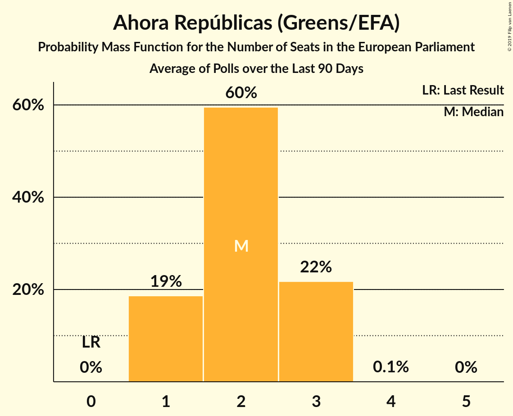

| Number of Seats | Probability | Accumulated | Special Marks |
|:---------------:|:-----------:|:-----------:|:-------------:|
| 0 | 0% | 100% | Last Result |
| 1 | 13% | 100% |  |
| 2 | 64% | 87% | Median |
| 3 | 22% | 22% |  |
| 4 | 0.1% | 0.1% |  |
| 5 | 0% | 0% |  |

### Primavera Europea (Greens/EFA)

*For a full overview of the results for this party, see the [Primavera Europea (Greens/EFA)](party-primaveraeuropeagreensefa.html) page.*

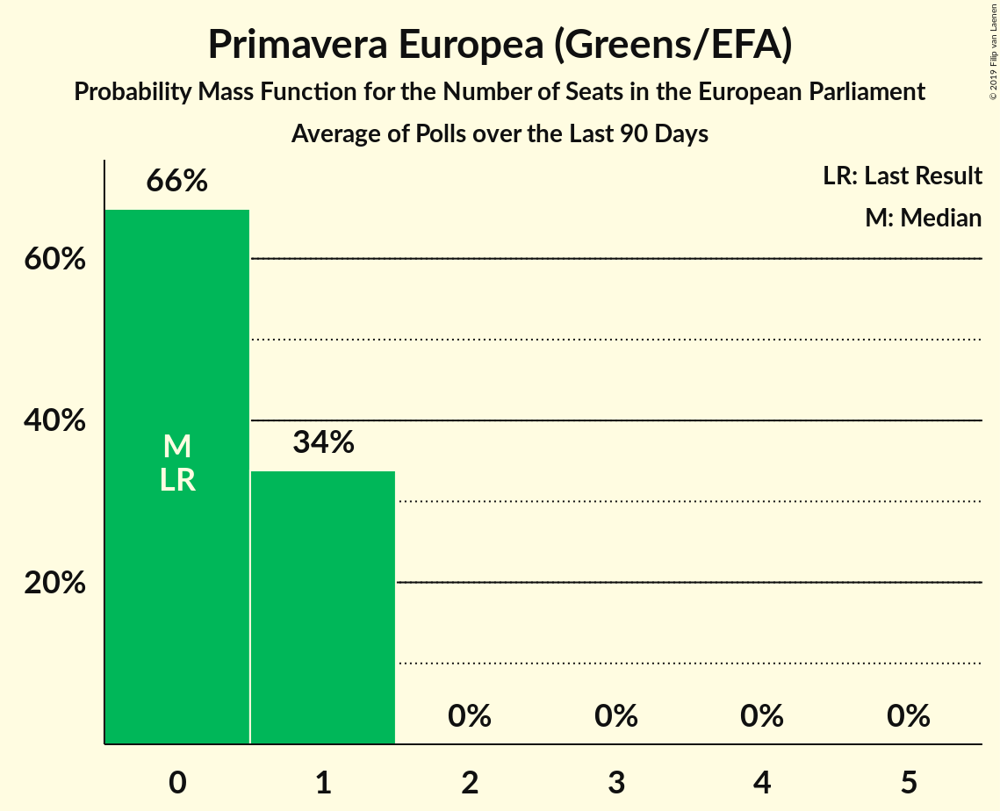

| Number of Seats | Probability | Accumulated | Special Marks |
|:---------------:|:-----------:|:-----------:|:-------------:|
| 0 | 71% | 100% | Last Result, Median |
| 1 | 29% | 29% |  |
| 2 | 0% | 0% |  |

## Coalitions

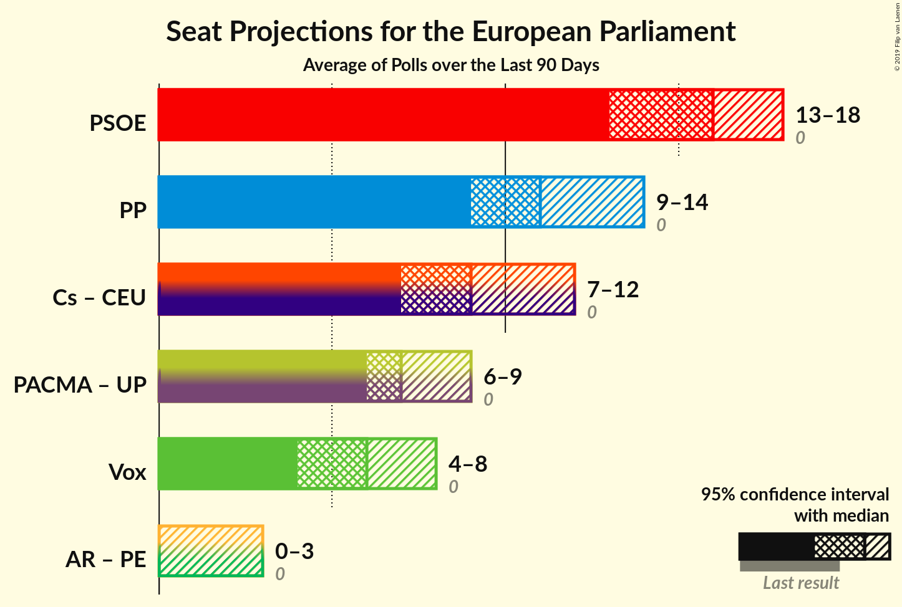

### Confidence Intervals

| Coalition | Last Result | Median | Majority? | 80% Confidence Interval | 90% Confidence Interval | 95% Confidence Interval | 99% Confidence Interval |
|:---------:|:-----------:|:------:|:---------:|:-----------------------:|:-----------------------:|:-----------------------:|:-----------------------:|
| Partido Socialista Obrero Español (S&D) | 0 | 16 | 0% | 14–18 | 13–18 | 13–18 | 13–19 |
| Partido Popular (EPP) | 0 | 11 | 0% | 10–13 | 9–14 | 9–14 | 8–15 |
| Ciudadanos–Partido de la Ciudadanía (ALDE) – Coalición por Europa (ALDE) | 0 | 9 | 0% | 8–11 | 7–11 | 7–12 | 6–12 |
| Partido Animalista Contra el Maltrato Animal (GUE/NGL) – Unidos Podemos (GUE/NGL) | 0 | 7 | 0% | 6–8 | 6–8 | 6–9 | 5–9 |
| Vox (ENF) | 0 | 6 | 0% | 4–7 | 4–7 | 4–8 | 3–9 |
| Ahora Repúblicas (Greens/EFA) – Primavera Europea (Greens/EFA) | 0 | 2 | 0% | 0–3 | 0–3 | 0–3 | 0–4 |

### Partido Socialista Obrero Español (S&D)

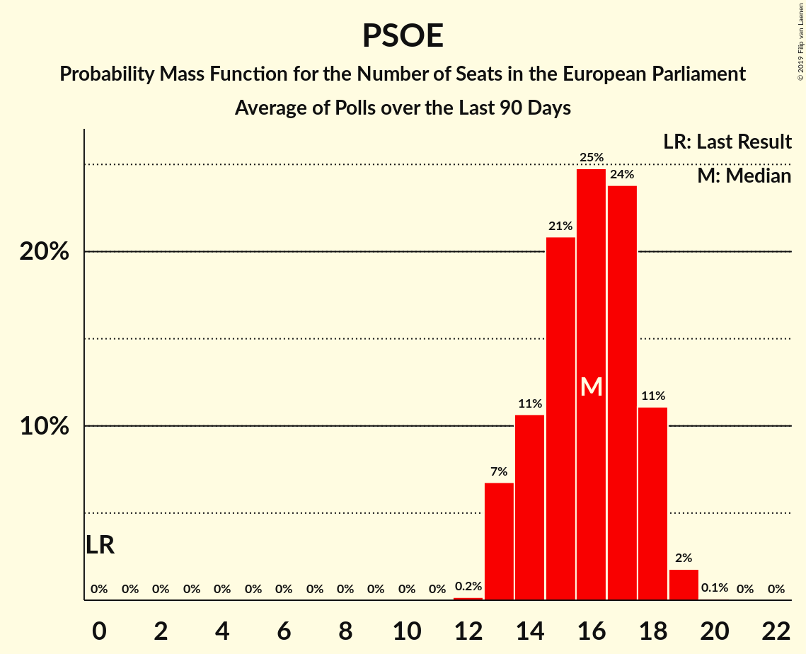

| Number of Seats | Probability | Accumulated | Special Marks |
|:---------------:|:-----------:|:-----------:|:-------------:|
| 0 | 0% | 100% | Last Result |
| 1 | 0% | 100% |  |
| 2 | 0% | 100% |  |
| 3 | 0% | 100% |  |
| 4 | 0% | 100% |  |
| 5 | 0% | 100% |  |
| 6 | 0% | 100% |  |
| 7 | 0% | 100% |  |
| 8 | 0% | 100% |  |
| 9 | 0% | 100% |  |
| 10 | 0% | 100% |  |
| 11 | 0% | 100% |  |
| 12 | 0.1% | 100% |  |
| 13 | 5% | 99.9% |  |
| 14 | 9% | 94% |  |
| 15 | 19% | 85% |  |
| 16 | 25% | 66% | Median |
| 17 | 24% | 41% |  |
| 18 | 15% | 17% |  |
| 19 | 2% | 2% |  |
| 20 | 0.1% | 0.1% |  |
| 21 | 0% | 0% |  |

### Partido Popular (EPP)

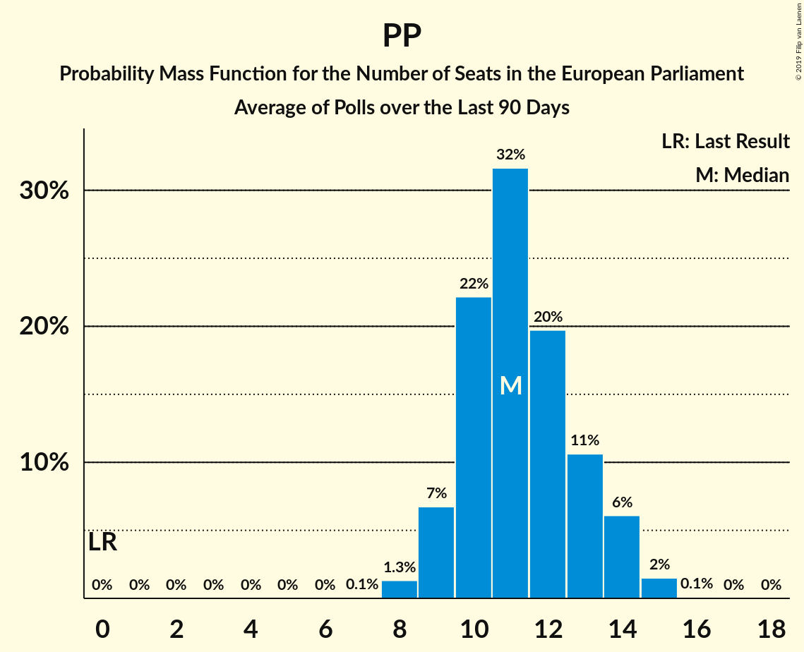

| Number of Seats | Probability | Accumulated | Special Marks |
|:---------------:|:-----------:|:-----------:|:-------------:|
| 0 | 0% | 100% | Last Result |
| 1 | 0% | 100% |  |
| 2 | 0% | 100% |  |
| 3 | 0% | 100% |  |
| 4 | 0% | 100% |  |
| 5 | 0% | 100% |  |
| 6 | 0% | 100% |  |
| 7 | 0.1% | 100% |  |
| 8 | 2% | 99.9% |  |
| 9 | 6% | 98% |  |
| 10 | 27% | 92% |  |
| 11 | 31% | 65% | Median |
| 12 | 17% | 34% |  |
| 13 | 9% | 17% |  |
| 14 | 6% | 8% |  |
| 15 | 2% | 2% |  |
| 16 | 0.1% | 0.1% |  |
| 17 | 0% | 0% |  |

### Ciudadanos–Partido de la Ciudadanía (ALDE) – Coalición por Europa (ALDE)

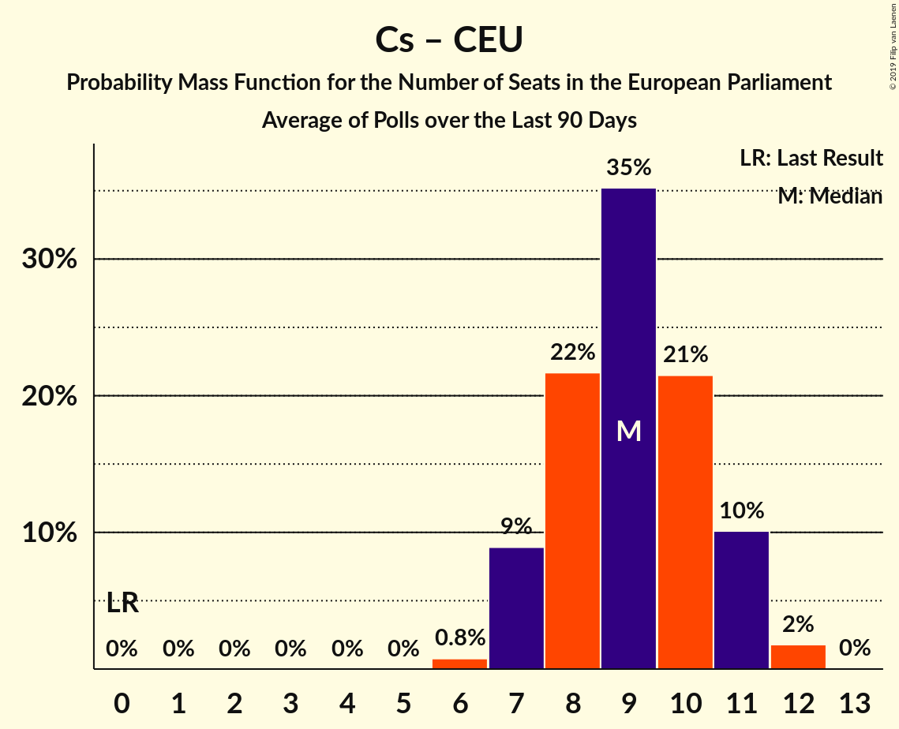

| Number of Seats | Probability | Accumulated | Special Marks |
|:---------------:|:-----------:|:-----------:|:-------------:|
| 0 | 0% | 100% | Last Result |
| 1 | 0% | 100% |  |
| 2 | 0% | 100% |  |
| 3 | 0% | 100% |  |
| 4 | 0% | 100% |  |
| 5 | 0% | 100% |  |
| 6 | 0.8% | 100% |  |
| 7 | 8% | 99.2% |  |
| 8 | 21% | 91% |  |
| 9 | 30% | 70% |  |
| 10 | 24% | 40% | Median |
| 11 | 12% | 16% |  |
| 12 | 4% | 4% |  |
| 13 | 0.1% | 0.1% |  |
| 14 | 0% | 0% |  |

### Partido Animalista Contra el Maltrato Animal (GUE/NGL) – Unidos Podemos (GUE/NGL)

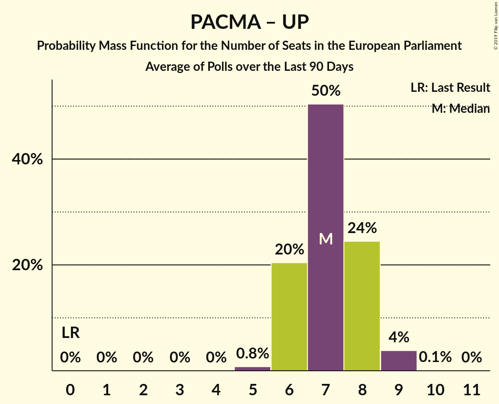

| Number of Seats | Probability | Accumulated | Special Marks |
|:---------------:|:-----------:|:-----------:|:-------------:|
| 0 | 0% | 100% | Last Result |
| 1 | 0% | 100% |  |
| 2 | 0% | 100% |  |
| 3 | 0% | 100% |  |
| 4 | 0% | 100% |  |
| 5 | 0.7% | 100% |  |
| 6 | 20% | 99.3% |  |
| 7 | 47% | 79% | Median |
| 8 | 28% | 32% |  |
| 9 | 4% | 4% |  |
| 10 | 0.1% | 0.1% |  |
| 11 | 0% | 0% |  |

### Vox (ENF)

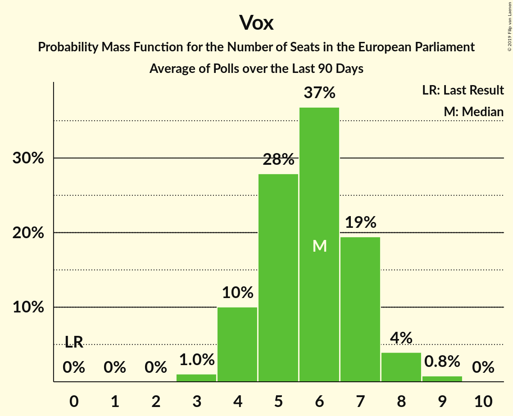

| Number of Seats | Probability | Accumulated | Special Marks |
|:---------------:|:-----------:|:-----------:|:-------------:|
| 0 | 0% | 100% | Last Result |
| 1 | 0% | 100% |  |
| 2 | 0% | 100% |  |
| 3 | 0.8% | 100% |  |
| 4 | 10% | 99.2% |  |
| 5 | 26% | 89% |  |
| 6 | 41% | 63% | Median |
| 7 | 19% | 22% |  |
| 8 | 3% | 4% |  |
| 9 | 0.6% | 0.7% |  |
| 10 | 0% | 0% |  |

### Ahora Repúblicas (Greens/EFA) – Primavera Europea (Greens/EFA)

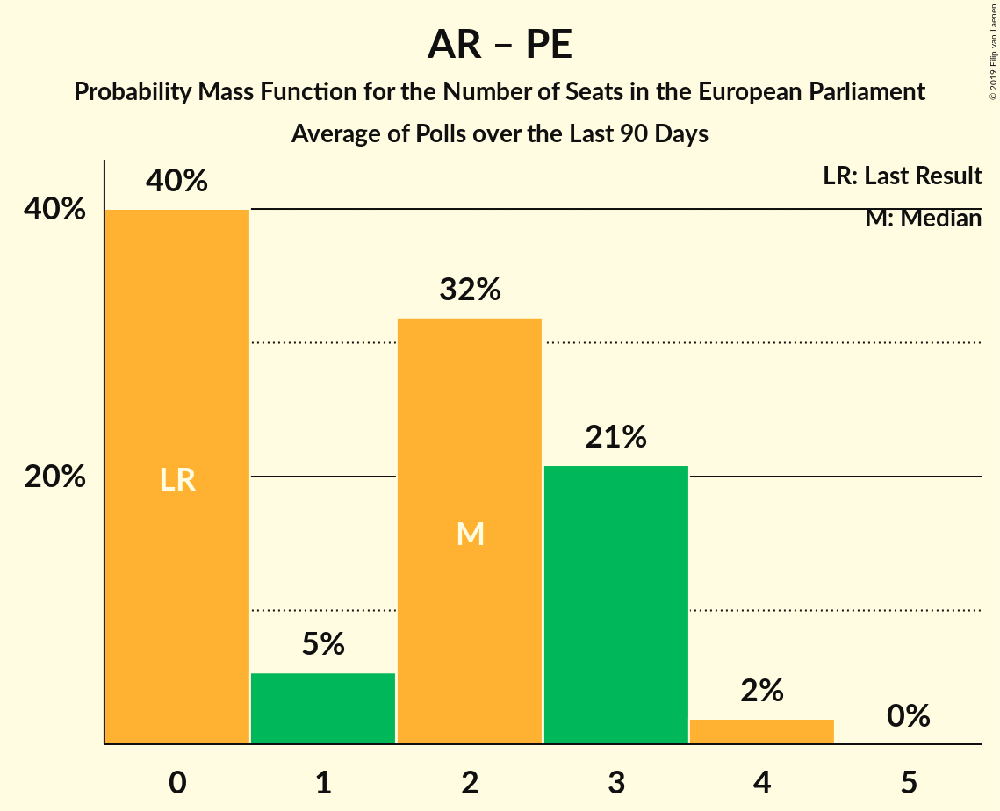

| Number of Seats | Probability | Accumulated | Special Marks |
|:---------------:|:-----------:|:-----------:|:-------------:|
| 0 | 40% | 100% | Last Result |
| 1 | 5% | 60% |  |
| 2 | 32% | 55% | Median |
| 3 | 21% | 23% |  |
| 4 | 2% | 2% |  |
| 5 | 0% | 0% |  |

## Technical Information

+ **Number of polls included in this average:** 15
+ **Lowest number of simulations done in a poll included in this average:** 65,536
+ **Total number of simulations done in the polls included in this average:** 3,211,264
+ **Error estimate:** 2.56%
