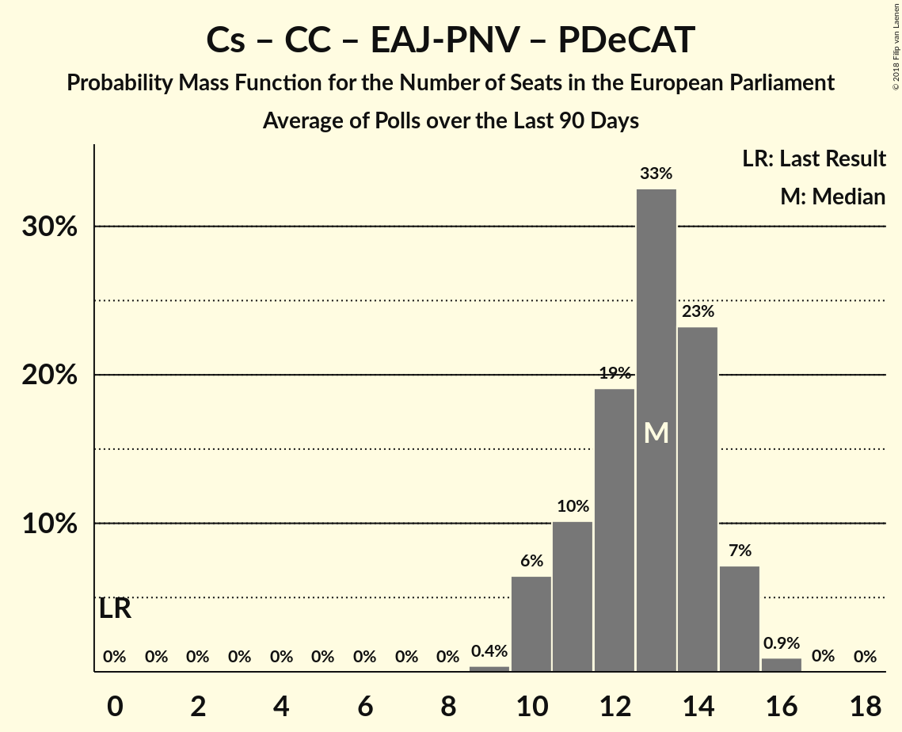
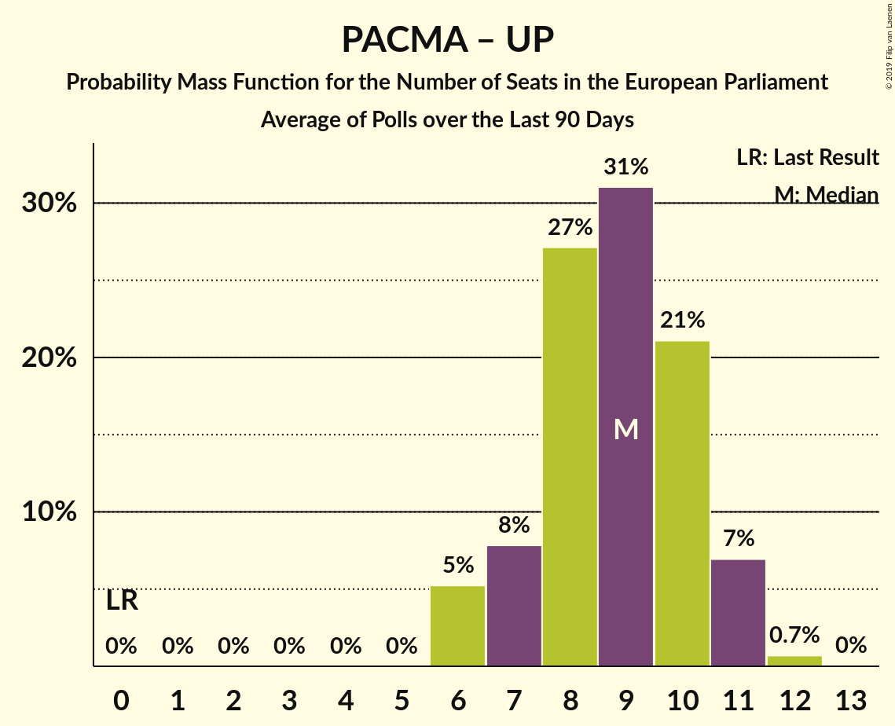
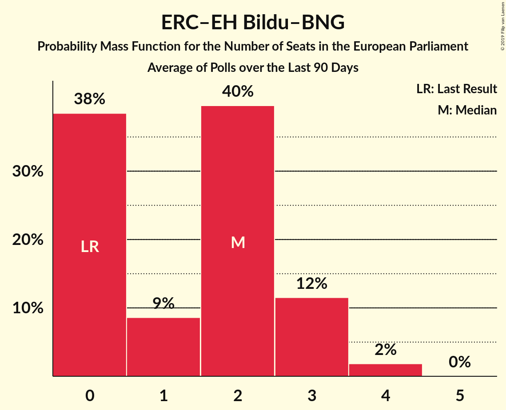

# Poll Average

<a href="#voting-intentions">Voting Intentions</a> | <a href="#seats">Seats</a> | <a href="#coalitions">Coalitions</a> | <a href="#technical-information">Technical Information</a>

## Summary

The table below lists the polls on which the average is based. They are the most recent polls (less than 90 days old) registered and analyzed so far.

| Period     | Polling firm/Commissioner(s) | PP | PSOE | UP | Cs | ERC | PDeCAT | EAJ-PNV | PACMA | EH Bildu | CC | Vox | BNG | ERC–EH Bildu–BNG |
|:----------:|:----------------------------:|:--:|:--:|:--:|:--:|:--:|:--:|:--:|:--:|:--:|:--:|:--:|:--:|:--:|
| 25 May 2014 | General Election | 0.0%   0 | 0.0%   0 | 0.0%   0 | 0.0%   0 | 0.0%   0 | 0.0%   0 | 0.0%   0 | 0.0%   0 | 0.0%   0 | 0.0%   0 | 0.0%   0 | 0.0%   0 | 0.0%   0 |
| N/A | Poll Average | 15–25%   9–16 | 20–30%   12–19 | 11–18%   7–11 | 16–24%   10–14 | N/A   N/A | 1–2%   0–1 | 1–2%   0–1 | 1–2%   0–1 | N/A   N/A | 0–1%   0 | 4–14%   2–8 | N/A   N/A | 3–6%   1–4 |
| [21–25 January 2019](2019-01-25-NCReport.html) | NC Report   La Razón | 21–27%   13–16 | 22–27%   13–17 | 14–19%   8–12 | 16–21%   10–13 | N/A   N/A | 1–2%   0–1 | 0–2%   0–1 | N/A   N/A | N/A   N/A | N/A   N/A | 8–11%   4–7 | N/A   N/A | 3–5%   1–3 |
| [14–24 January 2019](2019-01-24-GAD3.html) | GAD3   ABC | 21–25%   13–15 | 25–29%   15–18 | 10–13%   6–8 | 15–19%   9–11 | N/A   N/A | 1–2%   0–1 | 1–2%   0–1 | N/A   N/A | N/A   N/A | 0–1%   0 | 8–11%   5–7 | N/A   N/A | 3–4%   1–2 |
| [9–15 January 2019](2019-01-15-Metroscopia.html) | Metroscopia   Henneo | 18–21%   10–12 | 22–25%   13–15 | 16–19%   9–11 | 16–19%   10–12 | N/A   N/A | N/A   N/A | N/A   N/A | N/A   N/A | N/A   N/A | N/A   N/A | 11–13%   6–8 | N/A   N/A | N/A   N/A |
| [6–13 January 2019](2019-01-13-electoPanel.html) | electoPanel   electomania.es | 17–21%   10–13 | 19–24%   12–14 | 14–18%   8–11 | 18–22%   11–13 | N/A   N/A | N/A   N/A | N/A   N/A | 1–2%   0–1 | N/A   N/A | N/A   N/A | 11–15%   7–9 | N/A   N/A | N/A   N/A |
| [1–13 January 2019](2019-01-13-CIS.html) | CIS | 14–16%   8–10 | 28–32%   18–20 | 14–17%   9–10 | 16–19%   10–12 | N/A   N/A | 1%   0 | 1–2%   0–1 | 1–2%   0–1 | N/A   N/A | 0%   0 | 6–7%   3–4 | N/A   N/A | 5–7%   3–4 |
| [3–9 January 2019](2019-01-09-SimpleLógica.html) | Simple Lógica | 16–21%   9–12 | 23–28%   13–17 | 12–16%   7–10 | 16–20%   9–12 | N/A   N/A | N/A   N/A | N/A   N/A | N/A   N/A | N/A   N/A | N/A   N/A | 10–14%   5–8 | N/A   N/A | N/A   N/A |
| [2–8 January 2019](2019-01-08-Celeste-Tel.html) | Celeste-Tel   eldiario.es | 21–26%   13–16 | 22–27%   13–17 | 14–18%   9–11 | 17–22%   11–14 | N/A   N/A | 1–2%   0–1 | 1–2%   0–1 | 0–2%   0 | N/A   N/A | 0–1%   0 | 7–10%   4–6 | N/A   N/A | 3–5%   1–3 |
| [22 December 2018–5 January 2019](2019-01-05-SocioMétrica.html) | SocioMétrica   El Español | 17–20%   10–12 | 21–24%   13–15 | 16–19%   9–11 | 17–20%   10–12 | N/A   N/A | 1–2%   0–1 | 1–2%   0–1 | N/A   N/A | N/A   N/A | 0–1%   0 | 11–14%   7–8 | N/A   N/A | 3–5%   2–3 |
| [21–27 December 2018](2018-12-27-SigmaDos.html) | Sigma Dos   El Mundo | 17–22%   10–13 | 20–25%   12–15 | 14–18%   8–11 | 16–21%   10–13 | N/A   N/A | 1–2%   0–1 | 1–2%   0–1 | N/A   N/A | N/A   N/A | N/A   N/A | 11–15%   6–9 | N/A   N/A | 3–5%   1–3 |
| [10–13 December 2018](2018-12-13-IMOP.html) | IMOP   El Confidencial | 17–22%   10–14 | 23–29%   14–18 | 13–18%   8–11 | 18–23%   11–14 | N/A   N/A | 1–3%   0–1 | 1–2%   0–1 | 1–3%   0–1 | N/A   N/A | N/A   N/A | 7–10%   4–6 | N/A   N/A | 3–5%   1–3 |
| [3–7 December 2018](2018-12-07-Invymark.html) | Invymark   laSexta | 21–25%   12–15 | 21–26%   12–15 | 13–17%   7–10 | 21–25%   12–15 | N/A   N/A | N/A   N/A | N/A   N/A | N/A   N/A | N/A   N/A | N/A   N/A | 6–9%   3–5 | N/A   N/A | N/A   N/A |
| [22–30 October 2018](2018-10-30-GESOP.html) | GESOP   El Periódico | 19–24%   11–15 | 23–28%   14–17 | 14–19%   8–11 | 19–25%   12–15 | N/A   N/A | 1–3%   0–1 | N/A   N/A | N/A   N/A | N/A   N/A | N/A   N/A | 3–6%   1–3 | N/A   N/A | 2–5%   1–2 |
| 25 May 2014 | General Election | 0.0%   0 | 0.0%   0 | 0.0%   0 | 0.0%   0 | 0.0%   0 | 0.0%   0 | 0.0%   0 | 0.0%   0 | 0.0%   0 | 0.0%   0 | 0.0%   0 | 0.0%   0 | 0.0%   0 |

Only polls for which at least the sample size has been published are included in the table above.

**Legend:**
+ **Top half of each row:** Voting intentions (95% confidence interval)
+ **Bottom half of each row:** Seat projections for the European Parliament (95% confidence interval)
+ **PP:** Partido Popular (EPP)
+ **PSOE:** Partido Socialista Obrero Español (S&D)
+ **UP:** Unidos Podemos (GUE/NGL)
+ **Cs:** Ciudadanos–Partido de la Ciudadanía (ALDE)
+ **ERC:** Esquerra Republicana de Catalunya (Greens/EFA)
+ **PDeCAT:** Partit Demòcrata Europeu Català (ALDE)
+ **EAJ-PNV:** Euzko Alderdi Jeltzalea/Partido Nacionalista Vasco (ALDE)
+ **PACMA:** Partido Animalista Contra el Maltrato Animal (GUE/NGL)
+ **EH Bildu:** Euskal Herria Bildu (GUE/NGL)
+ **CC:** Coalición Canaria (ALDE)
+ **Vox:** Vox (ECR)
+ **BNG:** Bloque Nacionalista Galego (Greens/EFA)
+ **ERC–EH Bildu–BNG:** Esquerra Republicana de Catalunya–Euskal Herria Bildu–Bloque Nacionalista Galego (Greens/EFA)
+ **N/A (single party):** Party not included the published results
+ **N/A (entire row):** Calculation for this opinion poll not started yet

## Voting Intentions

### Confidence Intervals

| Party | Last Result | Median | 80% Confidence Interval | 90% Confidence Interval | 95% Confidence Interval | 99% Confidence Interval |
|:-----:|:-----------:|:------:|:-----------------------:|:-----------------------:|:-----------------------:|:-----------------------:|
| <a href="#partido-popular-(epp)">Partido Popular (EPP)</a> | 0.0% | 20.0% | 16.9–24.1% |15.1–24.9% | 14.6–25.4% | 13.9–26.5% |
| <a href="#partido-socialista-obrero-español-(s&d)">Partido Socialista Obrero Español (S&D)</a> | 0.0% | 24.2% | 21.7–27.9% |21.0–29.7% | 20.5–30.4% | 19.6–31.2% |
| <a href="#unidos-podemos-(gue/ngl)">Unidos Podemos (GUE/NGL)</a> | 0.0% | 15.8% | 13.1–17.6% |11.8–18.0% | 11.2–18.4% | 10.5–19.1% |
| <a href="#ciudadanos–partido-de-la-ciudadanía-(alde)">Ciudadanos–Partido de la Ciudadanía (ALDE)</a> | 0.0% | 19.0% | 17.0–22.3% |16.6–23.2% | 16.3–23.9% | 15.6–25.0% |
| <a href="#esquerra-republicana-de-catalunya-(greens/efa)">Esquerra Republicana de Catalunya (Greens/EFA)</a> | 0.0% | N/A | N/A |N/A | N/A | N/A |
| <a href="#partit-demòcrata-europeu-català-(alde)">Partit Demòcrata Europeu Català (ALDE)</a> | 0.0% | 1.4% | 0.9–2.0% |0.8–2.2% | 0.7–2.4% | 0.6–2.7% |
| <a href="#euzko-alderdi-jeltzalea/partido-nacionalista-vasco-(alde)">Euzko Alderdi Jeltzalea/Partido Nacionalista Vasco (ALDE)</a> | 0.0% | 1.2% | 0.8–1.6% |0.7–1.7% | 0.6–1.9% | 0.5–2.2% |
| <a href="#partido-animalista-contra-el-maltrato-animal-(gue/ngl)">Partido Animalista Contra el Maltrato Animal (GUE/NGL)</a> | 0.0% | 1.4% | 0.8–2.0% |0.6–2.2% | 0.6–2.3% | 0.4–2.7% |
| <a href="#euskal-herria-bildu-(gue/ngl)">Euskal Herria Bildu (GUE/NGL)</a> | 0.0% | N/A | N/A |N/A | N/A | N/A |
| <a href="#coalición-canaria-(alde)">Coalición Canaria (ALDE)</a> | 0.0% | 0.3% | 0.1–0.5% |0.1–0.6% | 0.1–0.7% | 0.1–0.8% |
| <a href="#vox-(ecr)">Vox (ECR)</a> | 0.0% | 9.7% | 6.1–13.1% |4.5–13.7% | 4.0–14.1% | 3.4–14.9% |
| <a href="#bloque-nacionalista-galego-(greens/efa)">Bloque Nacionalista Galego (Greens/EFA)</a> | 0.0% | N/A | N/A |N/A | N/A | N/A |
| <a href="#esquerra-republicana-de-catalunya–euskal-herria-bildu–bloque-nacionalista-galego-(greens/efa)">Esquerra Republicana de Catalunya–Euskal Herria Bildu–Bloque Nacionalista Galego (Greens/EFA)</a> | 0.0% | 3.8% | 3.0–5.5% |2.8–5.9% | 2.6–6.2% | 2.3–6.6% |

### Partido Popular (EPP)

*For a full overview of the results for this party, see the [Partido Popular (EPP)](party-partidopopularepp.html) page.*

| Voting Intentions | Probability | Accumulated | Special Marks |
|:-----------------:|:-----------:|:-----------:|:-------------:|
| 0.0–0.5% | 0% | 100% | Last Result |
| 0.5–1.5% | 0% | 100% |  |
| 1.5–2.5% | 0% | 100% |  |
| 2.5–3.5% | 0% | 100% |  |
| 3.5–4.5% | 0% | 100% |  |
| 4.5–5.5% | 0% | 100% |  |
| 5.5–6.5% | 0% | 100% |  |
| 6.5–7.5% | 0% | 100% |  |
| 7.5–8.5% | 0% | 100% |  |
| 8.5–9.5% | 0% | 100% |  |
| 9.5–10.5% | 0% | 100% |  |
| 10.5–11.5% | 0% | 100% |  |
| 11.5–12.5% | 0% | 100% |  |
| 12.5–13.5% | 0.1% | 100% |  |
| 13.5–14.5% | 2% | 99.9% |  |
| 14.5–15.5% | 5% | 98% |  |
| 15.5–16.5% | 2% | 93% |  |
| 16.5–17.5% | 5% | 91% |  |
| 17.5–18.5% | 13% | 86% |  |
| 18.5–19.5% | 17% | 73% |  |
| 19.5–20.5% | 12% | 56% | Median |
| 20.5–21.5% | 8% | 44% |  |
| 21.5–22.5% | 9% | 36% |  |
| 22.5–23.5% | 11% | 27% |  |
| 23.5–24.5% | 9% | 16% |  |
| 24.5–25.5% | 5% | 7% |  |
| 25.5–26.5% | 2% | 2% |  |
| 26.5–27.5% | 0.4% | 0.5% |  |
| 27.5–28.5% | 0.1% | 0.1% |  |
| 28.5–29.5% | 0% | 0% |  |

### Partido Socialista Obrero Español (S&D)

*For a full overview of the results for this party, see the [Partido Socialista Obrero Español (S&D)](party-partidosocialistaobreroespañolsd.html) page.*

| Voting Intentions | Probability | Accumulated | Special Marks |
|:-----------------:|:-----------:|:-----------:|:-------------:|
| 0.0–0.5% | 0% | 100% | Last Result |
| 0.5–1.5% | 0% | 100% |  |
| 1.5–2.5% | 0% | 100% |  |
| 2.5–3.5% | 0% | 100% |  |
| 3.5–4.5% | 0% | 100% |  |
| 4.5–5.5% | 0% | 100% |  |
| 5.5–6.5% | 0% | 100% |  |
| 6.5–7.5% | 0% | 100% |  |
| 7.5–8.5% | 0% | 100% |  |
| 8.5–9.5% | 0% | 100% |  |
| 9.5–10.5% | 0% | 100% |  |
| 10.5–11.5% | 0% | 100% |  |
| 11.5–12.5% | 0% | 100% |  |
| 12.5–13.5% | 0% | 100% |  |
| 13.5–14.5% | 0% | 100% |  |
| 14.5–15.5% | 0% | 100% |  |
| 15.5–16.5% | 0% | 100% |  |
| 16.5–17.5% | 0% | 100% |  |
| 17.5–18.5% | 0% | 100% |  |
| 18.5–19.5% | 0.4% | 100% |  |
| 19.5–20.5% | 2% | 99.5% |  |
| 20.5–21.5% | 6% | 97% |  |
| 21.5–22.5% | 12% | 91% |  |
| 22.5–23.5% | 17% | 79% |  |
| 23.5–24.5% | 17% | 62% | Median |
| 24.5–25.5% | 15% | 45% |  |
| 25.5–26.5% | 12% | 30% |  |
| 26.5–27.5% | 7% | 18% |  |
| 27.5–28.5% | 3% | 11% |  |
| 28.5–29.5% | 3% | 9% |  |
| 29.5–30.5% | 4% | 6% |  |
| 30.5–31.5% | 2% | 2% |  |
| 31.5–32.5% | 0.2% | 0.2% |  |
| 32.5–33.5% | 0% | 0% |  |

### Unidos Podemos (GUE/NGL)

*For a full overview of the results for this party, see the [Unidos Podemos (GUE/NGL)](party-unidospodemosguengl.html) page.*

| Voting Intentions | Probability | Accumulated | Special Marks |
|:-----------------:|:-----------:|:-----------:|:-------------:|
| 0.0–0.5% | 0% | 100% | Last Result |
| 0.5–1.5% | 0% | 100% |  |
| 1.5–2.5% | 0% | 100% |  |
| 2.5–3.5% | 0% | 100% |  |
| 3.5–4.5% | 0% | 100% |  |
| 4.5–5.5% | 0% | 100% |  |
| 5.5–6.5% | 0% | 100% |  |
| 6.5–7.5% | 0% | 100% |  |
| 7.5–8.5% | 0% | 100% |  |
| 8.5–9.5% | 0% | 100% |  |
| 9.5–10.5% | 0.6% | 100% |  |
| 10.5–11.5% | 3% | 99.4% |  |
| 11.5–12.5% | 4% | 96% |  |
| 12.5–13.5% | 4% | 92% |  |
| 13.5–14.5% | 10% | 88% |  |
| 14.5–15.5% | 21% | 78% |  |
| 15.5–16.5% | 26% | 57% | Median |
| 16.5–17.5% | 21% | 32% |  |
| 17.5–18.5% | 9% | 11% |  |
| 18.5–19.5% | 2% | 2% |  |
| 19.5–20.5% | 0.2% | 0.2% |  |
| 20.5–21.5% | 0% | 0% |  |

### Ciudadanos–Partido de la Ciudadanía (ALDE)

*For a full overview of the results for this party, see the [Ciudadanos–Partido de la Ciudadanía (ALDE)](party-ciudadanos–partidodelaciudadaníaalde.html) page.*

| Voting Intentions | Probability | Accumulated | Special Marks |
|:-----------------:|:-----------:|:-----------:|:-------------:|
| 0.0–0.5% | 0% | 100% | Last Result |
| 0.5–1.5% | 0% | 100% |  |
| 1.5–2.5% | 0% | 100% |  |
| 2.5–3.5% | 0% | 100% |  |
| 3.5–4.5% | 0% | 100% |  |
| 4.5–5.5% | 0% | 100% |  |
| 5.5–6.5% | 0% | 100% |  |
| 6.5–7.5% | 0% | 100% |  |
| 7.5–8.5% | 0% | 100% |  |
| 8.5–9.5% | 0% | 100% |  |
| 9.5–10.5% | 0% | 100% |  |
| 10.5–11.5% | 0% | 100% |  |
| 11.5–12.5% | 0% | 100% |  |
| 12.5–13.5% | 0% | 100% |  |
| 13.5–14.5% | 0% | 100% |  |
| 14.5–15.5% | 0.5% | 100% |  |
| 15.5–16.5% | 4% | 99.5% |  |
| 16.5–17.5% | 14% | 96% |  |
| 17.5–18.5% | 23% | 81% |  |
| 18.5–19.5% | 19% | 58% | Median |
| 19.5–20.5% | 14% | 39% |  |
| 20.5–21.5% | 10% | 25% |  |
| 21.5–22.5% | 7% | 16% |  |
| 22.5–23.5% | 5% | 9% |  |
| 23.5–24.5% | 3% | 4% |  |
| 24.5–25.5% | 0.9% | 1.1% |  |
| 25.5–26.5% | 0.2% | 0.2% |  |
| 26.5–27.5% | 0% | 0% |  |

### Partit Demòcrata Europeu Català (ALDE)

*For a full overview of the results for this party, see the [Partit Demòcrata Europeu Català (ALDE)](party-partitdemòcrataeuropeucatalàalde.html) page.*

| Voting Intentions | Probability | Accumulated | Special Marks |
|:-----------------:|:-----------:|:-----------:|:-------------:|
| 0.0–0.5% | 0.4% | 100% | Last Result |
| 0.5–1.5% | 62% | 99.6% | Median |
| 1.5–2.5% | 37% | 38% |  |
| 2.5–3.5% | 1.0% | 1.1% |  |
| 3.5–4.5% | 0% | 0% |  |

### Euzko Alderdi Jeltzalea/Partido Nacionalista Vasco (ALDE)

*For a full overview of the results for this party, see the [Euzko Alderdi Jeltzalea/Partido Nacionalista Vasco (ALDE)](party-euzkoalderdijeltzaleapartidonacionalistavascoalde.html) page.*

| Voting Intentions | Probability | Accumulated | Special Marks |
|:-----------------:|:-----------:|:-----------:|:-------------:|
| 0.0–0.5% | 1.2% | 100% | Last Result |
| 0.5–1.5% | 86% | 98.8% | Median |
| 1.5–2.5% | 13% | 13% |  |
| 2.5–3.5% | 0.1% | 0.1% |  |
| 3.5–4.5% | 0% | 0% |  |

### Vox (ECR)

*For a full overview of the results for this party, see the [Vox (ECR)](party-voxecr.html) page.*

| Voting Intentions | Probability | Accumulated | Special Marks |
|:-----------------:|:-----------:|:-----------:|:-------------:|
| 0.0–0.5% | 0% | 100% | Last Result |
| 0.5–1.5% | 0% | 100% |  |
| 1.5–2.5% | 0% | 100% |  |
| 2.5–3.5% | 0.9% | 100% |  |
| 3.5–4.5% | 4% | 99.1% |  |
| 4.5–5.5% | 3% | 95% |  |
| 5.5–6.5% | 6% | 92% |  |
| 6.5–7.5% | 11% | 86% |  |
| 7.5–8.5% | 12% | 74% |  |
| 8.5–9.5% | 11% | 62% |  |
| 9.5–10.5% | 9% | 52% | Median |
| 10.5–11.5% | 8% | 43% |  |
| 11.5–12.5% | 15% | 34% |  |
| 12.5–13.5% | 13% | 19% |  |
| 13.5–14.5% | 5% | 6% |  |
| 14.5–15.5% | 1.0% | 1.1% |  |
| 15.5–16.5% | 0.1% | 0.1% |  |
| 16.5–17.5% | 0% | 0% |  |

### Esquerra Republicana de Catalunya–Euskal Herria Bildu–Bloque Nacionalista Galego (Greens/EFA)

*For a full overview of the results for this party, see the [Esquerra Republicana de Catalunya–Euskal Herria Bildu–Bloque Nacionalista Galego (Greens/EFA)](party-esquerrarepublicanadecatalunya–euskalherriabildu–bloquenacionalistagalegogreensefa.html) page.*

| Voting Intentions | Probability | Accumulated | Special Marks |
|:-----------------:|:-----------:|:-----------:|:-------------:|
| 0.0–0.5% | 0% | 100% | Last Result |
| 0.5–1.5% | 0% | 100% |  |
| 1.5–2.5% | 2% | 100% |  |
| 2.5–3.5% | 35% | 98% |  |
| 3.5–4.5% | 44% | 63% | Median |
| 4.5–5.5% | 10% | 19% |  |
| 5.5–6.5% | 9% | 9% |  |
| 6.5–7.5% | 0.6% | 0.6% |  |
| 7.5–8.5% | 0% | 0% |  |

### Coalición Canaria (ALDE)

*For a full overview of the results for this party, see the [Coalición Canaria (ALDE)](party-coalicióncanariaalde.html) page.*

| Voting Intentions | Probability | Accumulated | Special Marks |
|:-----------------:|:-----------:|:-----------:|:-------------:|
| 0.0–0.5% | 93% | 100% | Last Result, Median |
| 0.5–1.5% | 7% | 7% |  |
| 1.5–2.5% | 0% | 0% |  |

### Partido Animalista Contra el Maltrato Animal (GUE/NGL)

*For a full overview of the results for this party, see the [Partido Animalista Contra el Maltrato Animal (GUE/NGL)](party-partidoanimalistacontraelmaltratoanimalguengl.html) page.*

| Voting Intentions | Probability | Accumulated | Special Marks |
|:-----------------:|:-----------:|:-----------:|:-------------:|
| 0.0–0.5% | 2% | 100% | Last Result |
| 0.5–1.5% | 59% | 98% | Median |
| 1.5–2.5% | 37% | 38% |  |
| 2.5–3.5% | 0.9% | 0.9% |  |
| 3.5–4.5% | 0% | 0% |  |

## Seats

### Confidence Intervals

| Party | Last Result | Median | 80% Confidence Interval | 90% Confidence Interval | 95% Confidence Interval | 99% Confidence Interval |
|:-----:|:-----------:|:------:|:-----------------------:|:-----------------------:|:-----------------------:|:-----------------------:|
| <a href="#partido-popular-(epp)">Partido Popular (EPP)</a> | 0 | 12 | 10–15 |9–15 | 9–16 | 8–16 |
| <a href="#partido-socialista-obrero-español-(s&d)">Partido Socialista Obrero Español (S&D)</a> | 0 | 15 | 13–17 |13–19 | 12–19 | 12–20 |
| <a href="#unidos-podemos-(gue/ngl)">Unidos Podemos (GUE/NGL)</a> | 0 | 9 | 8–11 |7–11 | 7–11 | 6–12 |
| <a href="#ciudadanos–partido-de-la-ciudadanía-(alde)">Ciudadanos–Partido de la Ciudadanía (ALDE)</a> | 0 | 11 | 10–13 |10–14 | 10–14 | 9–15 |
| <a href="#esquerra-republicana-de-catalunya-(greens/efa)">Esquerra Republicana de Catalunya (Greens/EFA)</a> | 0 | N/A | N/A |N/A | N/A | N/A |
| <a href="#partit-demòcrata-europeu-català-(alde)">Partit Demòcrata Europeu Català (ALDE)</a> | 0 | 0 | 0–1 |0–1 | 0–1 | 0–1 |
| <a href="#euzko-alderdi-jeltzalea/partido-nacionalista-vasco-(alde)">Euzko Alderdi Jeltzalea/Partido Nacionalista Vasco (ALDE)</a> | 0 | 0 | 0–1 |0–1 | 0–1 | 0–1 |
| <a href="#partido-animalista-contra-el-maltrato-animal-(gue/ngl)">Partido Animalista Contra el Maltrato Animal (GUE/NGL)</a> | 0 | 0 | 0–1 |0–1 | 0–1 | 0–1 |
| <a href="#euskal-herria-bildu-(gue/ngl)">Euskal Herria Bildu (GUE/NGL)</a> | 0 | N/A | N/A |N/A | N/A | N/A |
| <a href="#coalición-canaria-(alde)">Coalición Canaria (ALDE)</a> | 0 | 0 | 0 |0 | 0 | 0 |
| <a href="#vox-(ecr)">Vox (ECR)</a> | 0 | 6 | 3–8 |2–8 | 2–8 | 2–9 |
| <a href="#bloque-nacionalista-galego-(greens/efa)">Bloque Nacionalista Galego (Greens/EFA)</a> | 0 | N/A | N/A |N/A | N/A | N/A |
| <a href="#esquerra-republicana-de-catalunya–euskal-herria-bildu–bloque-nacionalista-galego-(greens/efa)">Esquerra Republicana de Catalunya–Euskal Herria Bildu–Bloque Nacionalista Galego (Greens/EFA)</a> | 0 | 2 | 1–3 |1–3 | 1–4 | 1–4 |

### Partido Popular (EPP)

*For a full overview of the results for this party, see the [Partido Popular (EPP)](party-partidopopularepp.html) page.*

| Number of Seats | Probability | Accumulated | Special Marks |
|:---------------:|:-----------:|:-----------:|:-------------:|
| 0 | 0% | 100% | Last Result |
| 1 | 0% | 100% |  |
| 2 | 0% | 100% |  |
| 3 | 0% | 100% |  |
| 4 | 0% | 100% |  |
| 5 | 0% | 100% |  |
| 6 | 0% | 100% |  |
| 7 | 0% | 100% |  |
| 8 | 0.7% | 100% |  |
| 9 | 6% | 99.3% |  |
| 10 | 7% | 93% |  |
| 11 | 23% | 86% |  |
| 12 | 21% | 63% | Median |
| 13 | 12% | 43% |  |
| 14 | 16% | 30% |  |
| 15 | 10% | 14% |  |
| 16 | 3% | 4% |  |
| 17 | 0.4% | 0.4% |  |
| 18 | 0% | 0% |  |

### Partido Socialista Obrero Español (S&D)

*For a full overview of the results for this party, see the [Partido Socialista Obrero Español (S&D)](party-partidosocialistaobreroespañolsd.html) page.*

| Number of Seats | Probability | Accumulated | Special Marks |
|:---------------:|:-----------:|:-----------:|:-------------:|
| 0 | 0% | 100% | Last Result |
| 1 | 0% | 100% |  |
| 2 | 0% | 100% |  |
| 3 | 0% | 100% |  |
| 4 | 0% | 100% |  |
| 5 | 0% | 100% |  |
| 6 | 0% | 100% |  |
| 7 | 0% | 100% |  |
| 8 | 0% | 100% |  |
| 9 | 0% | 100% |  |
| 10 | 0% | 100% |  |
| 11 | 0.2% | 100% |  |
| 12 | 4% | 99.8% |  |
| 13 | 13% | 96% |  |
| 14 | 27% | 83% |  |
| 15 | 23% | 56% | Median |
| 16 | 17% | 33% |  |
| 17 | 7% | 16% |  |
| 18 | 3% | 9% |  |
| 19 | 5% | 6% |  |
| 20 | 0.8% | 0.8% |  |
| 21 | 0% | 0% |  |

### Unidos Podemos (GUE/NGL)

*For a full overview of the results for this party, see the [Unidos Podemos (GUE/NGL)](party-unidospodemosguengl.html) page.*

| Number of Seats | Probability | Accumulated | Special Marks |
|:---------------:|:-----------:|:-----------:|:-------------:|
| 0 | 0% | 100% | Last Result |
| 1 | 0% | 100% |  |
| 2 | 0% | 100% |  |
| 3 | 0% | 100% |  |
| 4 | 0% | 100% |  |
| 5 | 0% | 100% |  |
| 6 | 2% | 100% |  |
| 7 | 7% | 98% |  |
| 8 | 11% | 91% |  |
| 9 | 31% | 80% | Median |
| 10 | 37% | 49% |  |
| 11 | 11% | 12% |  |
| 12 | 0.9% | 0.9% |  |
| 13 | 0% | 0% |  |

### Ciudadanos–Partido de la Ciudadanía (ALDE)

*For a full overview of the results for this party, see the [Ciudadanos–Partido de la Ciudadanía (ALDE)](party-ciudadanos–partidodelaciudadaníaalde.html) page.*

| Number of Seats | Probability | Accumulated | Special Marks |
|:---------------:|:-----------:|:-----------:|:-------------:|
| 0 | 0% | 100% | Last Result |
| 1 | 0% | 100% |  |
| 2 | 0% | 100% |  |
| 3 | 0% | 100% |  |
| 4 | 0% | 100% |  |
| 5 | 0% | 100% |  |
| 6 | 0% | 100% |  |
| 7 | 0% | 100% |  |
| 8 | 0% | 100% |  |
| 9 | 1.1% | 100% |  |
| 10 | 16% | 98.8% |  |
| 11 | 35% | 83% | Median |
| 12 | 24% | 48% |  |
| 13 | 15% | 24% |  |
| 14 | 8% | 10% |  |
| 15 | 2% | 2% |  |
| 16 | 0.1% | 0.1% |  |
| 17 | 0% | 0% |  |

### Partit Demòcrata Europeu Català (ALDE)

*For a full overview of the results for this party, see the [Partit Demòcrata Europeu Català (ALDE)](party-partitdemòcrataeuropeucatalàalde.html) page.*

| Number of Seats | Probability | Accumulated | Special Marks |
|:---------------:|:-----------:|:-----------:|:-------------:|
| 0 | 62% | 100% | Last Result, Median |
| 1 | 38% | 38% |  |
| 2 | 0% | 0% |  |

### Euzko Alderdi Jeltzalea/Partido Nacionalista Vasco (ALDE)

*For a full overview of the results for this party, see the [Euzko Alderdi Jeltzalea/Partido Nacionalista Vasco (ALDE)](party-euzkoalderdijeltzaleapartidonacionalistavascoalde.html) page.*

| Number of Seats | Probability | Accumulated | Special Marks |
|:---------------:|:-----------:|:-----------:|:-------------:|
| 0 | 88% | 100% | Last Result, Median |
| 1 | 12% | 12% |  |
| 2 | 0% | 0% |  |

### Vox (ECR)

*For a full overview of the results for this party, see the [Vox (ECR)](party-voxecr.html) page.*

| Number of Seats | Probability | Accumulated | Special Marks |
|:---------------:|:-----------:|:-----------:|:-------------:|
| 0 | 0% | 100% | Last Result |
| 1 | 0.2% | 100% |  |
| 2 | 6% | 99.8% |  |
| 3 | 6% | 94% |  |
| 4 | 18% | 88% |  |
| 5 | 17% | 70% |  |
| 6 | 15% | 53% | Median |
| 7 | 21% | 38% |  |
| 8 | 15% | 16% |  |
| 9 | 2% | 2% |  |
| 10 | 0.1% | 0.1% |  |
| 11 | 0% | 0% |  |

### Esquerra Republicana de Catalunya–Euskal Herria Bildu–Bloque Nacionalista Galego (Greens/EFA)

*For a full overview of the results for this party, see the [Esquerra Republicana de Catalunya–Euskal Herria Bildu–Bloque Nacionalista Galego (Greens/EFA)](party-esquerrarepublicanadecatalunya–euskalherriabildu–bloquenacionalistagalegogreensefa.html) page.*

| Number of Seats | Probability | Accumulated | Special Marks |
|:---------------:|:-----------:|:-----------:|:-------------:|
| 0 | 0% | 100% | Last Result |
| 1 | 18% | 100% |  |
| 2 | 66% | 82% | Median |
| 3 | 14% | 17% |  |
| 4 | 3% | 3% |  |
| 5 | 0% | 0% |  |

### Coalición Canaria (ALDE)

*For a full overview of the results for this party, see the [Coalición Canaria (ALDE)](party-coalicióncanariaalde.html) page.*

| Number of Seats | Probability | Accumulated | Special Marks |
|:---------------:|:-----------:|:-----------:|:-------------:|
| 0 | 100% | 100% | Last Result, Median |

### Partido Animalista Contra el Maltrato Animal (GUE/NGL)

*For a full overview of the results for this party, see the [Partido Animalista Contra el Maltrato Animal (GUE/NGL)](party-partidoanimalistacontraelmaltratoanimalguengl.html) page.*

| Number of Seats | Probability | Accumulated | Special Marks |
|:---------------:|:-----------:|:-----------:|:-------------:|
| 0 | 67% | 100% | Last Result, Median |
| 1 | 33% | 33% |  |
| 2 | 0% | 0% |  |

## Coalitions

### Confidence Intervals

| Coalition | Last Result | Median | Majority? | 80% Confidence Interval | 90% Confidence Interval | 95% Confidence Interval | 99% Confidence Interval |
|:---------:|:-----------:|:------:|:---------:|:-----------------------:|:-----------------------:|:-----------------------:|:-----------------------:|
| Partido Socialista Obrero Español (S&D) | 0 | 15 | 0% | 13–17 | 13–19 | 12–19 | 12–20 |
| Partido Popular (EPP) | 0 | 12 | 0% | 10–15 | 9–15 | 9–16 | 8–16 |
| Ciudadanos–Partido de la Ciudadanía (ALDE) – Coalición Canaria (ALDE) – Euzko Alderdi Jeltzalea/Partido Nacionalista Vasco (ALDE) – Partit Demòcrata Europeu Català (ALDE) | 0 | 12 | 0% | 10–14 | 10–14 | 10–15 | 9–16 |
| Partido Animalista Contra el Maltrato Animal (GUE/NGL) – Unidos Podemos (GUE/NGL) | 0 | 10 | 0% | 8–11 | 7–11 | 7–11 | 6–12 |
| Vox (ECR) | 0 | 6 | 0% | 3–8 | 2–8 | 2–8 | 2–9 |
| Esquerra Republicana de Catalunya–Euskal Herria Bildu–Bloque Nacionalista Galego (Greens/EFA) | 0 | 2 | 0% | 0–3 | 0–3 | 0–3 | 0–4 |

### Partido Socialista Obrero Español (S&D)

| Number of Seats | Probability | Accumulated | Special Marks |
|:---------------:|:-----------:|:-----------:|:-------------:|
| 0 | 0% | 100% | Last Result |
| 1 | 0% | 100% |  |
| 2 | 0% | 100% |  |
| 3 | 0% | 100% |  |
| 4 | 0% | 100% |  |
| 5 | 0% | 100% |  |
| 6 | 0% | 100% |  |
| 7 | 0% | 100% |  |
| 8 | 0% | 100% |  |
| 9 | 0% | 100% |  |
| 10 | 0% | 100% |  |
| 11 | 0.2% | 100% |  |
| 12 | 4% | 99.8% |  |
| 13 | 13% | 96% |  |
| 14 | 27% | 83% |  |
| 15 | 23% | 56% | Median |
| 16 | 17% | 33% |  |
| 17 | 7% | 16% |  |
| 18 | 3% | 9% |  |
| 19 | 5% | 6% |  |
| 20 | 0.8% | 0.8% |  |
| 21 | 0% | 0% |  |

### Partido Popular (EPP)

| Number of Seats | Probability | Accumulated | Special Marks |
|:---------------:|:-----------:|:-----------:|:-------------:|
| 0 | 0% | 100% | Last Result |
| 1 | 0% | 100% |  |
| 2 | 0% | 100% |  |
| 3 | 0% | 100% |  |
| 4 | 0% | 100% |  |
| 5 | 0% | 100% |  |
| 6 | 0% | 100% |  |
| 7 | 0% | 100% |  |
| 8 | 0.7% | 100% |  |
| 9 | 6% | 99.3% |  |
| 10 | 7% | 93% |  |
| 11 | 23% | 86% |  |
| 12 | 21% | 63% | Median |
| 13 | 12% | 43% |  |
| 14 | 16% | 30% |  |
| 15 | 10% | 14% |  |
| 16 | 3% | 4% |  |
| 17 | 0.4% | 0.4% |  |
| 18 | 0% | 0% |  |

### Ciudadanos–Partido de la Ciudadanía (ALDE) – Coalición Canaria (ALDE) – Euzko Alderdi Jeltzalea/Partido Nacionalista Vasco (ALDE) – Partit Demòcrata Europeu Català (ALDE)

| Number of Seats | Probability | Accumulated | Special Marks |
|:---------------:|:-----------:|:-----------:|:-------------:|
| 0 | 0% | 100% | Last Result |
| 1 | 0% | 100% |  |
| 2 | 0% | 100% |  |
| 3 | 0% | 100% |  |
| 4 | 0% | 100% |  |
| 5 | 0% | 100% |  |
| 6 | 0% | 100% |  |
| 7 | 0% | 100% |  |
| 8 | 0% | 100% |  |
| 9 | 0.8% | 100% |  |
| 10 | 11% | 99.2% |  |
| 11 | 30% | 89% | Median |
| 12 | 25% | 58% |  |
| 13 | 17% | 33% |  |
| 14 | 12% | 16% |  |
| 15 | 4% | 4% |  |
| 16 | 0.5% | 0.5% |  |
| 17 | 0% | 0% |  |

### Partido Animalista Contra el Maltrato Animal (GUE/NGL) – Unidos Podemos (GUE/NGL)

| Number of Seats | Probability | Accumulated | Special Marks |
|:---------------:|:-----------:|:-----------:|:-------------:|
| 0 | 0% | 100% | Last Result |
| 1 | 0% | 100% |  |
| 2 | 0% | 100% |  |
| 3 | 0% | 100% |  |
| 4 | 0% | 100% |  |
| 5 | 0% | 100% |  |
| 6 | 2% | 100% |  |
| 7 | 7% | 98% |  |
| 8 | 10% | 91% |  |
| 9 | 26% | 81% | Median |
| 10 | 40% | 55% |  |
| 11 | 14% | 15% |  |
| 12 | 1.3% | 1.3% |  |
| 13 | 0% | 0% |  |

### Vox (ECR)

| Number of Seats | Probability | Accumulated | Special Marks |
|:---------------:|:-----------:|:-----------:|:-------------:|
| 0 | 0% | 100% | Last Result |
| 1 | 0.2% | 100% |  |
| 2 | 6% | 99.8% |  |
| 3 | 6% | 94% |  |
| 4 | 18% | 88% |  |
| 5 | 17% | 70% |  |
| 6 | 15% | 53% | Median |
| 7 | 21% | 38% |  |
| 8 | 15% | 16% |  |
| 9 | 2% | 2% |  |
| 10 | 0.1% | 0.1% |  |
| 11 | 0% | 0% |  |

### Esquerra Republicana de Catalunya–Euskal Herria Bildu–Bloque Nacionalista Galego (Greens/EFA)

| Number of Seats | Probability | Accumulated | Special Marks |
|:---------------:|:-----------:|:-----------:|:-------------:|
| 0 | 33% | 100% | Last Result |
| 1 | 12% | 67% |  |
| 2 | 44% | 55% | Median |
| 3 | 9% | 11% |  |
| 4 | 2% | 2% |  |
| 5 | 0% | 0% |  |

## Technical Information

+ **Number of polls included in this average:** 12
+ **Lowest number of simulations done in a poll included in this average:** 524,288
+ **Total number of simulations done in the polls included in this average:** 12,058,624
+ **Error estimate:** 2.36%
