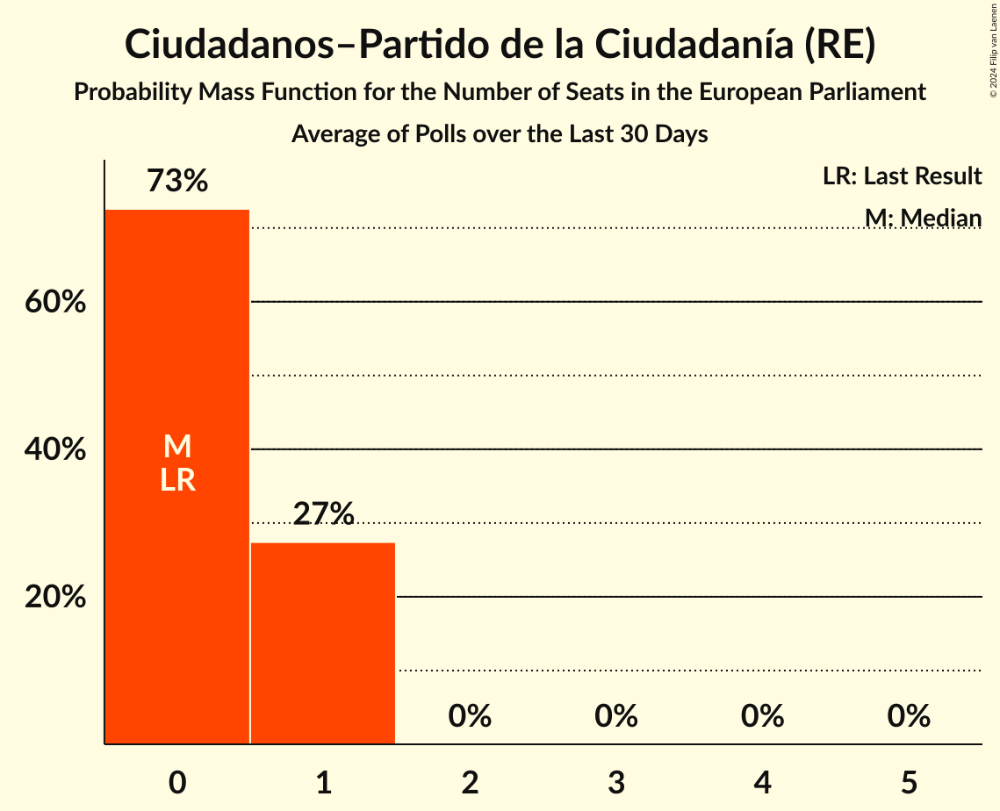

# Ciudadanos–Partido de la Ciudadanía (RE)

<a href="#voting-intentions">Voting Intentions</a> | <a href="#seats">Seats</a>

## Voting Intentions

Last result: **0.0%** (General Election of 26 May 2019)

### Confidence Intervals

| Period     | Polling firm/Commissioner(s) | Median | 80% Confidence Interval | 90% Confidence Interval | 95% Confidence Interval | 99% Confidence Interval |
|:----------:|:----------------:|:-----------:|:-----------------------:|:-----------------------:|:-----------------------:|:-----------------------:|
| N/A | [Poll Average](average.html) | 1.4% | 0.3–2.4% | 0.2–2.6% | 0.1–2.7% | 0.1–2.9% |
| [30 May–3 June 2023](2023-06-03-SocioMétrica.html) | SocioMétrica   El Español | 0.0% | N/A | N/A | N/A | N/A |
| [30 May–3 June 2023](2023-06-03-NCReport.html) | NC Report   La Razón | 0.0% | N/A | N/A | N/A | N/A |
| [31 May–2 June 2023](2023-06-02-TargetPoint.html) | Target Point   El Debate | 0.0% | N/A | N/A | N/A | N/A |
| [29 May–2 June 2023](2023-06-02-InvyMark.html) | InvyMark   laSexta | 0.0% | N/A | N/A | N/A | N/A |
| [1–2 June 2023](2023-06-02-Data10.html) | Data10   OKDiario | 0.0% | N/A | N/A | N/A | N/A |
| [29 May–1 June 2023](2023-06-01-SigmaDos.html) | Sigma Dos   El Mundo | 0.0% | N/A | N/A | N/A | N/A |
| [30 May–1 June 2023](2023-06-01-GESOP.html) | GESOP   Prensa Ibérica | 0.0% | N/A | N/A | N/A | N/A |
| [31 May–1 June 2023](2023-06-01-40dB.html) | 40dB   Prisa | 0.0% | N/A | N/A | N/A | N/A |
| [29–30 May 2023](2023-05-30-IMOP.html) | IMOP   El Confidencial | 0.2% | 0.1–0.6% | 0.1–0.7% | 0.1–0.8% | 0.0–1.0% |
| [29 May 2023](2023-05-29-Data10.html) | Data10   OKDiario | 1.4% | 1.1–1.9% | 1.0–2.0% | 0.9–2.1% | 0.8–2.4% |
| [3–11 May 2023](2023-05-11-SimpleLógica.html) | Simple Lógica   elDiario.es | 1.3% | 0.9–2.0% | 0.8–2.2% | 0.7–2.4% | 0.5–2.8% |
| [8–9 May 2023](2023-05-09-GAD3.html) | GAD3   NIUS | 1.4% | 1.0–2.0% | 0.9–2.2% | 0.8–2.3% | 0.7–2.6% |
| [3–8 May 2023](2023-05-08-CIS.html) | CIS | 2.3% | 2.0–2.7% | 2.0–2.7% | 1.9–2.8% | 1.8–3.0% |
| [6 May 2023](2023-05-06-NCReport.html) | NC Report   La Razón | 0.0% | N/A | N/A | N/A | N/A |
| [2–5 May 2023](2023-05-05-SocioMétrica.html) | SocioMétrica   El Español | 2.4% | 1.9–3.2% | 1.7–3.5% | 1.6–3.7% | 1.4–4.1% |
| [24–28 April 2023](2023-04-28-InvyMark.html) | InvyMark   laSexta | 0.9% | 0.6–1.4% | 0.6–1.5% | 0.5–1.6% | 0.4–1.9% |
| [24–27 April 2023](2023-04-27-SigmaDos.html) | Sigma Dos   El Mundo | 1.2% | 0.9–1.6% | 0.9–1.7% | 0.8–1.8% | 0.7–2.0% |
| [25–27 April 2023](2023-04-27-Data10.html) | Data10   OKDiario | 2.1% | 1.7–2.7% | 1.6–2.9% | 1.5–3.0% | 1.3–3.3% |
| [21–25 April 2023](2023-04-25-40dB.html) | 40dB   Prisa | 2.0% | 1.6–2.5% | 1.6–2.6% | 1.5–2.7% | 1.3–3.0% |
| [19–21 April 2023](2023-04-21-DYM.html) | DYM   Henneo | 2.2% | 1.7–2.9% | 1.6–3.1% | 1.4–3.3% | 1.2–3.7% |
| [17–21 April 2023](2023-04-21-Celeste-Tel.html) | Celeste-Tel   Onda Cero | 2.4% | 1.8–3.3% | 1.6–3.6% | 1.5–3.8% | 1.2–4.3% |
| [10–13 April 2023](2023-04-13-HamalgamaMétrica.html) | Hamalgama Métrica   VozPópuli | 1.5% | 1.1–2.1% | 1.0–2.3% | 0.9–2.5% | 0.7–2.8% |
| [3–12 April 2023](2023-04-12-SimpleLógica.html) | Simple Lógica   elDiario.es | 2.0% | 1.4–2.9% | 1.3–3.1% | 1.2–3.3% | 0.9–3.8% |
| [4–8 April 2023](2023-04-08-SocioMétrica.html) | SocioMétrica   El Español | 2.6% | 2.0–3.4% | 1.8–3.6% | 1.7–3.8% | 1.5–4.2% |
| [3–6 April 2023](2023-04-06-NCReport.html) | NC Report   La Razón | 1.7% | 1.2–2.5% | 1.1–2.8% | 0.9–3.0% | 0.7–3.4% |
| [3–5 April 2023](2023-04-05-SigmaDos.html) | Sigma Dos   El Mundo | 2.0% | 1.6–2.5% | 1.5–2.6% | 1.4–2.8% | 1.3–3.0% |
| [1–2 April 2023](2023-04-02-Data10.html) | Data10   OKDiario | 0.0% | N/A | N/A | N/A | N/A |
| [24–27 March 2023](2023-03-27-40dB.html) | 40dB   Prisa | 2.9% | 2.5–3.4% | 2.3–3.6% | 2.2–3.7% | 2.1–4.0% |
| [20–24 March 2023](2023-03-24-InvyMark.html) | InvyMark   laSexta | 0.9% | 0.6–1.4% | 0.6–1.5% | 0.5–1.6% | 0.4–1.9% |
| [22–24 March 2023](2023-03-24-GAD3.html) | GAD3   ABC | 1.7% | 1.2–2.5% | 1.1–2.8% | 0.9–3.0% | 0.7–3.4% |
| [23–24 March 2023](2023-03-24-DYM.html) | DYM   Henneo | 2.2% | 1.7–2.9% | 1.6–3.1% | 1.4–3.3% | 1.2–3.7% |
| [21–23 March 2023](2023-03-23-Data10.html) | Data10   OKDiario | 1.9% | 1.5–2.5% | 1.4–2.6% | 1.3–2.8% | 1.2–3.0% |
| [1–11 March 2023](2023-03-11-CIS.html) | CIS | 2.5% | 2.2–2.9% | 2.1–3.0% | 2.0–3.1% | 1.9–3.2% |
| [6–10 March 2023](2023-03-10-InvyMark.html) | InvyMark   laSexta | 0.8% | 0.5–1.3% | 0.5–1.4% | 0.4–1.6% | 0.3–1.9% |
| [3–8 March 2023](2023-03-08-HamalgamaMétrica.html) | Hamalgama Métrica   VozPópuli | 1.4% | 1.0–2.0% | 0.9–2.2% | 0.8–2.3% | 0.7–2.7% |
| [1–7 March 2023](2023-03-07-SimpleLógica.html) | Simple Lógica   elDiario.es | 2.1% | 1.5–3.0% | 1.4–3.2% | 1.2–3.4% | 1.0–3.9% |
| [1–6 March 2023](2023-03-06-Celeste-Tel.html) | Celeste-Tel   Onda Cero | 2.3% | 1.7–3.2% | 1.5–3.4% | 1.4–3.6% | 1.2–4.1% |
| [28 February–3 March 2023](2023-03-03-SocioMétrica.html) | SocioMétrica   El Español | 2.1% | 1.6–2.9% | 1.5–3.1% | 1.4–3.3% | 1.1–3.7% |
| [24 February–2 March 2023](2023-03-02-SigmaDos.html) | Sigma Dos   El Mundo | 2.4% | 2.0–3.0% | 1.9–3.1% | 1.8–3.3% | 1.6–3.5% |
| [27 February–1 March 2023](2023-03-01-GESOP.html) | GESOP   Prensa Ibérica | 2.0% | 1.5–2.7% | 1.4–2.9% | 1.3–3.1% | 1.1–3.4% |
| [23–26 February 2023](2023-02-26-40dB.html) | 40dB   Prisa | 2.5% | 2.1–3.0% | 2.0–3.2% | 1.9–3.3% | 1.7–3.6% |
| [20–24 February 2023](2023-02-24-NCReport.html) | NC Report   La Razón | 2.0% | 1.4–2.9% | 1.3–3.1% | 1.2–3.3% | 0.9–3.8% |
| [20–24 February 2023](2023-02-24-InvyMark.html) | InvyMark   laSexta | 0.8% | 0.5–1.3% | 0.5–1.4% | 0.4–1.6% | 0.3–1.9% |
| [21–23 February 2023](2023-02-23-Data10.html) | Data10   OKDiario | 1.9% | 1.5–2.5% | 1.4–2.6% | 1.3–2.8% | 1.2–3.0% |
| [16–22 February 2023](2023-02-22-SigmaDos.html) | Sigma Dos   Antena 3 | 2.5% | 2.0–3.3% | 1.8–3.5% | 1.7–3.7% | 1.5–4.1% |
| [20–22 February 2023](2023-02-22-GAD3.html) | GAD3   NIUS | 1.5% | 1.0–2.3% | 0.9–2.5% | 0.8–2.7% | 0.6–3.1% |
| [15–19 February 2023](2023-02-19-DYM.html) | DYM   Henneo | 2.0% | 1.5–2.7% | 1.4–2.9% | 1.3–3.1% | 1.1–3.4% |
| [6–10 February 2023](2023-02-10-InvyMark.html) | InvyMark   laSexta | 0.9% | 0.6–1.4% | 0.5–1.6% | 0.5–1.7% | 0.4–2.0% |
| [6–9 February 2023](2023-02-09-HamalgamaMétrica.html) | Hamalgama Métrica   VozPópuli | 1.5% | 1.1–2.1% | 1.0–2.3% | 0.9–2.5% | 0.7–2.8% |
| [1–7 February 2023](2023-02-07-SimpleLógica.html) | Simple Lógica   elDiario.es | 1.7% | 1.3–2.5% | 1.1–2.7% | 1.0–2.9% | 0.8–3.3% |
| [30 January–3 February 2023](2023-02-03-SocioMétrica.html) | SocioMétrica   El Español | 1.8% | 1.3–2.5% | 1.2–2.7% | 1.1–2.9% | 0.9–3.3% |
| [27 January–2 February 2023](2023-02-02-SigmaDos.html) | Sigma Dos   El Mundo | 2.2% | 1.8–2.7% | 1.7–2.9% | 1.6–3.0% | 1.4–3.3% |
| [26–29 January 2023](2023-01-29-40dB.html) | 40dB   Prisa | 2.6% | 2.2–3.1% | 2.1–3.3% | 2.0–3.4% | 1.8–3.7% |
| [23–27 January 2023](2023-01-27-InvyMark.html) | InvyMark   laSexta | 1.0% | 0.7–1.5% | 0.6–1.7% | 0.5–1.8% | 0.4–2.1% |
| [24–26 January 2023](2023-01-26-Data10.html) | Data10   OKDiario | 1.7% | 1.4–2.3% | 1.3–2.4% | 1.2–2.5% | 1.0–2.8% |
| [25 January 2023](2023-01-25-SigmaDos.html) | Sigma Dos   Antena 3 | 2.0% | 1.5–2.7% | 1.4–2.9% | 1.3–3.1% | 1.1–3.4% |
| [18–20 January 2023](2023-01-20-DYM.html) | DYM   Henneo | 2.1% | 1.6–2.8% | 1.5–3.0% | 1.4–3.2% | 1.2–3.6% |
| [12–20 January 2023](2023-01-20-Celeste-Tel.html) | Celeste-Tel   Onda Cero | 2.0% | 1.4–2.8% | 1.3–3.0% | 1.2–3.3% | 1.0–3.7% |
| [15 January 2023](2023-01-15-ÁgoraIntegral.html) | Ágora Integral   Canarias Ahora | 0.8% | 0.5–1.4% | 0.4–1.6% | 0.3–1.8% | 0.2–2.1% |
| [9–13 January 2023](2023-01-13-InvyMark.html) | InvyMark   laSexta | 0.9% | 0.6–1.4% | 0.5–1.6% | 0.5–1.7% | 0.4–2.0% |
| [5–11 January 2023](2023-01-11-HamalgamaMétrica.html) | Hamalgama Métrica   VozPópuli | 1.6% | 1.2–2.2% | 1.1–2.4% | 1.0–2.6% | 0.8–2.9% |
| [2–10 January 2023](2023-01-10-SimpleLógica.html) | Simple Lógica   elDiario.es | 1.7% | 1.2–2.6% | 1.1–2.8% | 1.0–3.0% | 0.8–3.5% |
| [28 December 2022–4 January 2023](2023-01-04-GAD3.html) | GAD3   NIUS | 1.0% | 0.7–1.8% | 0.6–2.0% | 0.5–2.1% | 0.4–2.5% |
| [28–31 December 2022](2022-12-31-SocioMétrica.html) | SocioMétrica   El Español | 1.7% | 1.3–2.3% | 1.2–2.4% | 1.1–2.6% | 0.9–2.9% |
| [27–31 December 2022](2022-12-31-40dB.html) | 40dB   Prisa | 2.4% | 2.0–2.9% | 1.9–3.0% | 1.8–3.2% | 1.6–3.4% |
| [26–30 December 2022](2022-12-30-SigmaDos.html) | Sigma Dos   El Mundo | 1.7% | 1.3–2.1% | 1.3–2.3% | 1.2–2.4% | 1.1–2.6% |
| [27–29 December 2022](2022-12-29-Data10.html) | Data10   OKDiario | 1.8% | 1.4–2.5% | 1.2–2.7% | 1.1–2.8% | 1.0–3.2% |
| [26–28 December 2022](2022-12-28-TargetPoint.html) | Target Point   El Debate | 1.6% | 1.2–2.2% | 1.1–2.4% | 1.0–2.6% | 0.8–2.9% |
| [28 December 2022](2022-12-28-SigmaDos.html) | Sigma Dos   Antena 3 | 2.2% | N/A | N/A | N/A | N/A |
| [19–23 December 2022](2022-12-23-InvyMark.html) | InvyMark   laSexta | 0.8% | 0.5–1.3% | 0.5–1.4% | 0.4–1.6% | 0.3–1.9% |
| [12–21 December 2022](2022-12-21-Celeste-Tel.html) | Celeste-Tel   Onda Cero | 2.3% | 1.8–3.0% | 1.6–3.2% | 1.5–3.3% | 1.3–3.7% |
| [29 November–19 December 2022](2022-12-19-Metroscopia.html) | Metroscopia   Periodismo 2030 | 1.1% | 0.9–1.3% | 0.9–1.4% | 0.8–1.4% | 0.8–1.5% |
| [13–17 December 2022](2022-12-17-NCReport.html) | NC Report   La Razón | 1.8% | 1.3–2.7% | 1.2–2.9% | 1.1–3.2% | 0.8–3.6% |
| [14–17 December 2022](2022-12-17-DYM.html) | DYM   Henneo | 2.0% | 1.5–2.7% | 1.4–2.9% | 1.3–3.0% | 1.1–3.4% |
| [5–16 December 2022](2022-12-16-IMOP.html) | IMOP   El Confidencial | 1.3% | 1.0–1.9% | 0.9–2.0% | 0.8–2.1% | 0.7–2.4% |
| [1–14 December 2022](2022-12-14-CIS.html) | CIS | 2.9% | 2.6–3.3% | 2.5–3.4% | 2.4–3.5% | 2.3–3.7% |
| [1–13 December 2022](2022-12-13-SimpleLógica.html) | Simple Lógica   elDiario.es | 0.3% | 0.2–0.8% | 0.1–0.9% | 0.1–1.1% | 0.0–1.4% |
| [2–7 December 2022](2022-12-07-HamalgamaMétrica.html) | Hamalgama Métrica   VozPópuli | 1.7% | 1.3–2.4% | 1.2–2.5% | 1.1–2.7% | 0.9–3.1% |
| [28 November–2 December 2022](2022-12-02-SocioMétrica.html) | SocioMétrica   El Español | 2.0% | 1.6–2.6% | 1.4–2.8% | 1.3–3.0% | 1.2–3.3% |
| [28 November–2 December 2022](2022-12-02-InvyMark.html) | InvyMark   laSexta | 0.8% | 0.5–1.3% | 0.5–1.4% | 0.4–1.6% | 0.3–1.9% |
| [21 November–2 December 2022](2022-12-02-IMOP.html) | IMOP   El Confidencial | 1.3% | 1.0–1.8% | 0.9–2.0% | 0.8–2.1% | 0.7–2.4% |
| [29 November–1 December 2022](2022-12-01-Data10.html) | Data10   OKDiario | 1.9% | 1.4–2.6% | 1.3–2.8% | 1.2–3.0% | 1.0–3.3% |
| [25–30 November 2022](2022-11-30-SigmaDos.html) | Sigma Dos   El Mundo | 2.5% | 2.0–3.1% | 1.9–3.2% | 1.8–3.4% | 1.6–3.7% |
| [23–26 November 2022](2022-11-26-40dB.html) | 40dB   Prisa | 2.2% | 1.8–2.7% | 1.7–2.8% | 1.6–2.9% | 1.5–3.2% |
| [21–24 November 2022](2022-11-24-GESOP.html) | GESOP   Prensa Ibérica | 2.2% | 1.7–2.9% | 1.6–3.1% | 1.4–3.3% | 1.2–3.7% |
| [17–23 November 2022](2022-11-23-SigmaDos.html) | Sigma Dos   Antena 3 | 2.1% | N/A | N/A | N/A | N/A |
| [1 September–23 November 2022](2022-11-23-GAD3.html) | GAD3   ABC | 1.6% | 1.4–1.8% | 1.3–1.9% | 1.3–2.0% | 1.2–2.1% |
| [16–22 November 2022](2022-11-22-DYM.html) | DYM   Henneo | 2.4% | 1.9–3.1% | 1.7–3.4% | 1.6–3.5% | 1.4–3.9% |
| [7–20 November 2022](2022-11-20-IMOP.html) | IMOP   El Confidencial | 1.7% | 1.3–2.2% | 1.2–2.4% | 1.1–2.5% | 0.9–2.8% |
| [15–17 November 2022](2022-11-17-TargetPoint.html) | Target Point   El Debate | 2.3% | 1.8–3.0% | 1.6–3.2% | 1.5–3.4% | 1.3–3.8% |
| [16–17 November 2022](2022-11-17-InvyMark.html) | InvyMark   laSexta | 0.9% | 0.6–1.4% | 0.6–1.5% | 0.5–1.6% | 0.4–1.9% |
| [7–16 November 2022](2022-11-16-Celeste-Tel.html) | Celeste-Tel   Onda Cero | 2.2% | 1.7–3.1% | 1.5–3.4% | 1.4–3.6% | 1.2–4.1% |
| [7–14 November 2022](2022-11-14-ÁgoraIntegral.html) | Ágora Integral   Canarias Ahora | 0.4% | 0.2–0.8% | 0.2–0.9% | 0.2–1.0% | 0.1–1.3% |
| [8–12 November 2022](2022-11-12-NCReport.html) | NC Report   La Razón | 1.7% | 1.2–2.5% | 1.1–2.8% | 0.9–3.0% | 0.7–3.5% |
| [2–12 November 2022](2022-11-12-CIS.html) | CIS | 2.5% | 2.2–2.9% | 2.1–3.0% | 2.1–3.1% | 1.9–3.2% |
| [2–11 November 2022](2022-11-11-SimpleLógica.html) | Simple Lógica   elDiario.es | 1.7% | 1.2–2.5% | 1.1–2.8% | 0.9–3.0% | 0.7–3.4% |
| [4–10 November 2022](2022-11-10-HamalgamaMétrica.html) | Hamalgama Métrica   VozPópuli | 1.8% | 1.4–2.5% | 1.2–2.7% | 1.1–2.8% | 1.0–3.2% |
| [24 October–4 November 2022](2022-11-04-IMOP.html) | IMOP   El Confidencial | 1.5% | 1.2–2.1% | 1.1–2.2% | 1.0–2.3% | 0.8–2.6% |
| [31 October–2 November 2022](2022-11-02-SocioMétrica.html) | SocioMétrica   El Español | 2.4% | 1.9–3.1% | 1.8–3.3% | 1.7–3.5% | 1.5–3.8% |
| [24–31 October 2022](2022-10-31-SigmaDos.html) | Sigma Dos   El Mundo | 2.2% | 1.9–2.6% | 1.8–2.7% | 1.7–2.9% | 1.5–3.1% |
| [27–30 October 2022](2022-10-30-40dB.html) | 40dB   Prisa | 2.3% | 1.9–2.8% | 1.8–2.9% | 1.7–3.1% | 1.6–3.3% |
| [24–28 October 2022](2022-10-28-InvyMark.html) | InvyMark   laSexta | 0.8% | 0.5–1.3% | 0.5–1.4% | 0.4–1.6% | 0.3–1.9% |
| [25–27 October 2022](2022-10-27-Data10.html) | Data10   OKDiario | 1.7% | 1.3–2.4% | 1.2–2.5% | 1.1–2.7% | 0.9–3.1% |
| [19–23 October 2022](2022-10-23-DYM.html) | DYM   Henneo | 2.2% | 1.7–2.9% | 1.6–3.1% | 1.4–3.3% | 1.2–3.7% |
| [10–22 October 2022](2022-10-22-IMOP.html) | IMOP   El Confidencial | 1.2% | 0.9–1.7% | 0.8–1.9% | 0.7–2.0% | 0.6–2.2% |
| [16 October 2022](2022-10-16-SigmaDos.html) | Sigma Dos   Antena 3 | 2.1% | 1.6–2.8% | 1.5–3.0% | 1.4–3.2% | 1.2–3.6% |
| [3–14 October 2022](2022-10-14-SimpleLógica.html) | Simple Lógica   elDiario.es | 1.6% | 1.2–2.5% | 1.0–2.7% | 0.9–2.9% | 0.7–3.4% |
| [10–14 October 2022](2022-10-14-NCReport.html) | NC Report   La Razón | 1.5% | 1.1–2.3% | 0.9–2.6% | 0.8–2.8% | 0.7–3.2% |
| [10–13 October 2022](2022-10-13-TargetPoint.html) | Target Point   El Debate | 1.9% | 1.4–2.6% | 1.3–2.8% | 1.2–3.0% | 1.0–3.3% |
| [26 September–8 October 2022](2022-10-08-IMOP.html) | IMOP   El Confidencial | 1.7% | 1.3–2.2% | 1.2–2.4% | 1.1–2.5% | 0.9–2.8% |
| [3–7 October 2022](2022-10-07-InvyMark.html) | InvyMark   laSexta | 1.0% | 0.7–1.5% | 0.6–1.7% | 0.5–1.8% | 0.4–2.1% |
| [3–6 October 2022](2022-10-06-HamalgamaMétrica.html) | Hamalgama Métrica   VozPópuli | 1.8% | 1.4–2.5% | 1.2–2.7% | 1.1–2.8% | 1.0–3.2% |
| [26–30 September 2022](2022-09-30-SocioMétrica.html) | SocioMétrica   El Español | 2.6% | 2.1–3.3% | 1.9–3.5% | 1.8–3.7% | 1.6–4.0% |
| [26–30 September 2022](2022-09-30-Celeste-Tel.html) | Celeste-Tel   Onda Cero | 2.2% | 1.7–2.9% | 1.6–3.1% | 1.5–3.2% | 1.3–3.6% |
| [26–29 September 2022](2022-09-29-SigmaDos.html) | Sigma Dos   El Mundo | 2.3% | 1.8–2.9% | 1.7–3.0% | 1.6–3.2% | 1.4–3.4% |
| [27–29 September 2022](2022-09-29-Data10.html) | Data10   OKDiario | 1.8% | 1.4–2.5% | 1.2–2.7% | 1.1–2.8% | 1.0–3.2% |
| [22–26 September 2022](2022-09-26-40dB.html) | 40dB   Prisa | 2.2% | 1.8–2.7% | 1.7–2.8% | 1.6–2.9% | 1.5–3.2% |
| [12–24 September 2022](2022-09-24-IMOP.html) | IMOP   El Confidencial | 1.2% | 0.9–1.7% | 0.8–1.8% | 0.7–2.0% | 0.6–2.2% |
| [19–23 September 2022](2022-09-23-InvyMark.html) | InvyMark   laSexta | 0.9% | 0.6–1.4% | 0.5–1.6% | 0.5–1.7% | 0.4–2.0% |
| [19–22 September 2022](2022-09-22-GAD3.html) | GAD3   NIUS | 1.3% | 0.9–1.9% | 0.8–2.0% | 0.7–2.2% | 0.6–2.5% |
| [14–18 September 2022](2022-09-18-DYM.html) | DYM   Henneo | 2.4% | 1.9–3.1% | 1.7–3.3% | 1.6–3.5% | 1.4–3.9% |
| [29 August–10 September 2022](2022-09-10-IMOP.html) | IMOP   El Confidencial | 1.1% | 0.8–1.6% | 0.7–1.7% | 0.6–1.8% | 0.5–2.1% |
| [1–9 September 2022](2022-09-09-SimpleLógica.html) | Simple Lógica   elDiario.es | 3.0% | 2.3–4.0% | 2.1–4.3% | 1.9–4.5% | 1.6–5.1% |
| [6–9 September 2022](2022-09-09-GAD3.html) | GAD3   ABC | 1.3% | 0.9–1.9% | 0.8–2.1% | 0.8–2.2% | 0.6–2.5% |
| [7–8 September 2022](2022-09-08-TargetPoint.html) | Target Point   El Debate | 2.0% | 1.5–2.7% | 1.4–2.9% | 1.3–3.1% | 1.1–3.4% |
| [2–8 September 2022](2022-09-08-SigmaDos.html) | Sigma Dos   Antena 3 | 1.9% | 1.4–2.6% | 1.3–2.8% | 1.2–3.0% | 1.0–3.3% |
| [29 August–3 September 2022](2022-09-03-SocioMétrica.html) | SocioMétrica   El Español | 2.3% | 1.9–3.0% | 1.7–3.2% | 1.6–3.4% | 1.4–3.7% |
| [1–2 September 2022](2022-09-02-ÁgoraIntegral.html) | Ágora Integral   Canarias Ahora | 0.5% | 0.3–0.9% | 0.3–1.1% | 0.2–1.2% | 0.2–1.4% |
| [29 August–2 September 2022](2022-09-02-SigmaDos.html) | Sigma Dos   El Mundo | 1.8% | 1.4–2.5% | 1.2–2.7% | 1.1–2.8% | 1.0–3.2% |
| [30 August–1 September 2022](2022-09-01-Data10.html) | Data10   OKDiario | 1.7% | 1.3–2.4% | 1.2–2.5% | 1.1–2.7% | 0.9–3.1% |
| [23–28 August 2022](2022-08-28-40dB.html) | 40dB   Prisa | 2.6% | 2.2–3.1% | 2.1–3.3% | 2.0–3.4% | 1.8–3.7% |
| [23–27 August 2022](2022-08-27-NCReport.html) | NC Report   La Razón | 0.0% | N/A | N/A | N/A | N/A |
| [16–20 August 2022](2022-08-20-Celeste-Tel.html) | Celeste-Tel   Onda Cero | 2.3% | 1.9–3.2% | 1.7–3.4% | 1.6–3.6% | 1.4–3.9% |
| [5–10 August 2022](2022-08-10-HamalgamaMétrica.html) | Hamalgama Métrica   VozPópuli | 2.4% | 1.9–3.2% | 1.7–3.4% | 1.6–3.6% | 1.4–3.9% |
| [1–8 August 2022](2022-08-08-SimpleLógica.html) | Simple Lógica   elDiario.es | 1.6% | 1.1–2.4% | 1.0–2.7% | 0.9–2.9% | 0.7–3.3% |
| [18–29 July 2022](2022-07-29-IMOP.html) | IMOP   El Confidencial | 0.8% | 0.5–1.2% | 0.5–1.3% | 0.4–1.4% | 0.3–1.7% |
| [18–22 July 2022](2022-07-22-SigmaDos.html) | Sigma Dos   Antena 3 | 2.0% | 1.5–2.7% | 1.4–2.9% | 1.3–3.1% | 1.1–3.4% |
| [18–21 July 2022](2022-07-21-NCReport.html) | NC Report   La Razón | 2.0% | 1.4–2.9% | 1.3–3.1% | 1.2–3.4% | 0.9–3.8% |
| [14–17 July 2022](2022-07-17-DYM.html) | DYM   Henneo | 2.6% | 2.1–3.4% | 1.9–3.6% | 1.8–3.8% | 1.6–4.2% |
| [14–16 July 2022](2022-07-16-SocioMétrica.html) | SocioMétrica   El Español | 2.6% | 2.2–3.1% | 2.1–3.3% | 2.0–3.4% | 1.8–3.7% |
| [4–15 July 2022](2022-07-15-IMOP.html) | IMOP   El Confidencial | 1.3% | 1.0–1.8% | 0.9–2.0% | 0.8–2.1% | 0.7–2.4% |
| [12–14 July 2022](2022-07-14-GAD3.html) | GAD3   NIUS | 1.2% | 0.8–2.0% | 0.7–2.2% | 0.6–2.4% | 0.5–2.8% |
| [14 July 2022](2022-07-14-Data10.html) | Data10   OKDiario | 1.6% | 1.2–2.2% | 1.1–2.4% | 1.0–2.6% | 0.8–2.9% |
| [7–12 July 2022](2022-07-12-Celeste-Tel.html) | Celeste-Tel   Onda Cero | 2.9% | 2.3–3.7% | 2.2–3.9% | 2.1–4.1% | 1.8–4.5% |
| [1–12 July 2022](2022-07-12-CIS.html) | CIS | 1.7% | 1.5–2.0% | 1.4–2.1% | 1.3–2.2% | 1.2–2.3% |
| [1–11 July 2022](2022-07-11-SimpleLógica.html) | Simple Lógica   elDiario.es | 1.6% | 1.2–2.4% | 1.1–2.7% | 0.9–2.9% | 0.8–3.3% |
| [7–9 July 2022](2022-07-09-Merca2.html) | Merca2 | 0.0% | N/A | N/A | N/A | N/A |
| [5–8 July 2022](2022-07-08-HamalgamaMétrica.html) | Hamalgama Métrica   VozPópuli | 2.8% | 2.2–3.6% | 2.1–3.8% | 1.9–4.0% | 1.7–4.4% |
| [5–7 July 2022](2022-07-07-TargetPoint.html) | Target Point   El Debate | 2.0% | 1.5–2.7% | 1.4–2.9% | 1.3–3.1% | 1.1–3.4% |
| [4–6 July 2022](2022-07-06-GAD3.html) | GAD3   ABC | 1.1% | 0.8–1.7% | 0.7–1.8% | 0.6–2.0% | 0.5–2.3% |
| [29 June–1 July 2022](2022-07-01-SWDemoscopia.html) | SW Demoscopia | 1.7% | 1.3–2.3% | 1.2–2.5% | 1.1–2.7% | 0.9–3.1% |
| [20 June–1 July 2022](2022-07-01-IMOP.html) | IMOP   El Confidencial | 2.0% | 1.6–2.6% | 1.4–2.8% | 1.4–2.9% | 1.2–3.2% |
| [29–30 June 2022](2022-06-30-Data10.html) | Data10   OKDiario | 1.5% | 1.1–2.1% | 1.0–2.3% | 0.9–2.5% | 0.7–2.8% |
| [27–29 June 2022](2022-06-29-SigmaDos.html) | Sigma Dos   El Mundo | 2.4% | 1.9–3.1% | 1.8–3.2% | 1.7–3.4% | 1.5–3.8% |
| [23–27 June 2022](2022-06-27-40dB.html) | 40dB   Prisa | 2.9% | 2.5–3.4% | 2.3–3.6% | 2.2–3.7% | 2.1–4.0% |
| [26 June 2022](2022-06-26-SigmaDos.html) | Sigma Dos   Antena 3 | 2.3% | N/A | N/A | N/A | N/A |
| [21–24 June 2022](2022-06-24-SocioMétrica.html) | SocioMétrica   El Español | 2.0% | 1.6–2.6% | 1.4–2.8% | 1.3–3.0% | 1.2–3.3% |
| [20–24 June 2022](2022-06-24-InvyMark.html) | InvyMark   laSexta | 0.8% | 0.5–1.3% | 0.5–1.4% | 0.4–1.6% | 0.3–1.9% |
| [20–22 June 2022](2022-06-22-GESOP.html) | GESOP   Prensa Ibérica | 2.0% | 1.5–2.7% | 1.4–2.9% | 1.3–3.1% | 1.1–3.4% |
| [20 June 2022](2022-06-20-Data10.html) | Data10   OKDiario | 1.7% | 1.3–2.4% | 1.2–2.5% | 1.1–2.7% | 0.9–3.1% |
| [1–9 June 2022](2022-06-09-SimpleLógica.html) | Simple Lógica   elDiario.es | 2.2% | 1.6–3.2% | 1.5–3.4% | 1.4–3.7% | 1.1–4.1% |
| [1–9 June 2022](2022-06-09-CIS.html) | CIS | 1.9% | 1.6–2.2% | 1.6–2.3% | 1.5–2.4% | 1.4–2.6% |
| [30 May–3 June 2022](2022-06-03-InvyMark.html) | InvyMark   laSexta | 1.3% | 0.9–1.9% | 0.8–2.1% | 0.8–2.2% | 0.6–2.5% |
| [31 May–1 June 2022](2022-06-01-Data10.html) | Data10   OKDiario | 2.4% | N/A | N/A | N/A | N/A |
| [18–23 May 2022](2022-05-23-40dB.html) | 40dB   Prisa | 3.3% | 2.8–3.9% | 2.7–4.0% | 2.6–4.2% | 2.4–4.5% |
| [9–21 May 2022](2022-05-21-IMOP.html) | IMOP   El Confidencial | 1.9% | 1.5–2.5% | 1.4–2.7% | 1.3–2.8% | 1.1–3.1% |
| [25 April–18 May 2022](2022-05-18-CEMOP.html) | CEMOP | 1.1% | 0.8–1.6% | 0.7–1.8% | 0.7–1.9% | 0.5–2.2% |
| [9–14 May 2022](2022-05-14-SWDemoscopia.html) | SW Demoscopia | 2.2% | 1.7–2.8% | 1.6–3.0% | 1.5–3.2% | 1.3–3.5% |
| [11–13 May 2022](2022-05-13-DYM.html) | DYM   Henneo | 3.1% | 2.5–3.9% | 2.3–4.2% | 2.2–4.4% | 1.9–4.8% |
| [9–13 May 2022](2022-05-13-Celeste-Tel.html) | Celeste-Tel   Onda Cero | 2.8% | 2.3–3.6% | 2.1–3.8% | 2.0–4.0% | 1.8–4.4% |
| [3–12 May 2022](2022-05-12-CIS.html) | CIS | 1.8% | 1.6–2.1% | 1.5–2.2% | 1.4–2.3% | 1.3–2.4% |
| [3–11 May 2022](2022-05-11-SimpleLógica.html) | Simple Lógica   elDiario.es | 2.9% | 2.2–3.9% | 2.0–4.1% | 1.9–4.4% | 1.6–4.9% |
| [5–9 May 2022](2022-05-09-ÁgoraIntegral.html) | Ágora Integral   Canarias Ahora | 2.2% | 1.6–3.2% | 1.5–3.5% | 1.3–3.7% | 1.1–4.3% |
| [25 April–8 May 2022](2022-05-08-IMOP.html) | IMOP   El Confidencial | 1.9% | 1.5–2.5% | 1.4–2.7% | 1.3–2.8% | 1.1–3.1% |
| [4–7 May 2022](2022-05-07-SocioMétrica.html) | SocioMétrica   El Español | 2.7% | 2.1–3.4% | 2.0–3.6% | 1.9–3.7% | 1.7–4.1% |
| [5–6 May 2022](2022-05-06-Data10.html) | Data10   OKDiario | 2.2% | 1.7–2.9% | 1.6–3.1% | 1.4–3.3% | 1.2–3.7% |
| [20–25 April 2022](2022-04-25-40dB.html) | 40dB   Prisa | 3.4% | 2.9–4.0% | 2.8–4.1% | 2.7–4.3% | 2.5–4.6% |
| [11–23 April 2022](2022-04-23-IMOP.html) | IMOP   El Confidencial | 1.7% | 1.3–2.2% | 1.2–2.4% | 1.1–2.5% | 0.9–2.8% |
| [18–22 April 2022](2022-04-22-InvyMark.html) | InvyMark   laSexta | 1.3% | 0.9–1.9% | 0.8–2.1% | 0.8–2.2% | 0.6–2.5% |
| [20–22 April 2022](2022-04-22-DYM.html) | DYM   Henneo | 2.9% | 2.3–3.7% | 2.1–3.9% | 2.0–4.1% | 1.8–4.5% |
| [11–20 April 2022](2022-04-20-Celeste-Tel.html) | Celeste-Tel   Onda Cero | 3.0% | 2.4–3.8% | 2.3–4.0% | 2.1–4.2% | 1.9–4.6% |
| [11–18 April 2022](2022-04-18-SWDemoscopia.html) | SW Demoscopia | 2.4% | 1.9–3.1% | 1.8–3.3% | 1.7–3.4% | 1.5–3.8% |
| [15 April 2022](2022-04-15-NCReport.html) | NC Report   La Razón | 3.0% | 2.4–3.8% | 2.2–4.1% | 2.1–4.3% | 1.9–4.7% |
| [9 April 2022](2022-04-09-SocioMétrica.html) | SocioMétrica   El Español | 3.1% | 2.5–4.0% | 2.3–4.2% | 2.2–4.5% | 1.9–4.9% |
| [1–9 April 2022](2022-04-09-CIS.html) | CIS | 2.0% | 1.7–2.3% | 1.6–2.4% | 1.6–2.5% | 1.5–2.7% |
| [28 March–8 April 2022](2022-04-08-IMOP.html) | IMOP   El Confidencial | 1.9% | 1.5–2.5% | 1.4–2.7% | 1.3–2.8% | 1.1–3.1% |
| [4–7 April 2022](2022-04-07-TargetPoint.html) | Target Point   El Debate | 2.3% | 1.8–3.0% | 1.6–3.2% | 1.5–3.4% | 1.3–3.8% |
| [1–7 April 2022](2022-04-07-SimpleLógica.html) | Simple Lógica   elDiario.es | 2.5% | 1.9–3.4% | 1.7–3.7% | 1.6–4.0% | 1.3–4.5% |
| [5–7 April 2022](2022-04-07-SigmaDos.html) | Sigma Dos   El Mundo | 2.5% | 2.1–3.0% | 2.0–3.1% | 1.9–3.2% | 1.8–3.4% |
| [4–7 April 2022](2022-04-07-HamalgamaMétrica.html) | Hamalgama Métrica   VozPópuli | 3.0% | 2.4–3.9% | 2.2–4.1% | 2.1–4.3% | 1.8–4.8% |
| [6–7 April 2022](2022-04-07-Data10.html) | Data10   OKDiario | 2.6% | 2.1–3.4% | 1.9–3.6% | 1.8–3.8% | 1.6–4.2% |
| [4–6 April 2022](2022-04-06-Metroscopia.html) | Metroscopia | 1.1% | 0.8–1.6% | 0.7–1.7% | 0.6–1.8% | 0.5–2.1% |
| [4–6 April 2022](2022-04-06-GESOP.html) | GESOP   El Periódico | 2.0% | 1.5–2.7% | 1.4–2.9% | 1.3–3.1% | 1.1–3.4% |
| [4–6 April 2022](2022-04-06-GAD3.html) | GAD3   ABC | 2.4% | 1.9–3.2% | 1.7–3.4% | 1.6–3.6% | 1.4–3.9% |
| [28–30 March 2022](2022-03-30-Metroscopia.html) | Metroscopia | 1.0% | 0.7–1.5% | 0.6–1.6% | 0.6–1.8% | 0.5–2.0% |
| [29 March 2022](2022-03-29-SigmaDos.html) | Sigma Dos   Antena 3 | 3.6% | 2.9–4.5% | 2.8–4.7% | 2.6–5.0% | 2.3–5.4% |
| [22–28 March 2022](2022-03-28-40dB.html) | 40dB   Prisa | 3.6% | 3.1–4.2% | 3.0–4.4% | 2.9–4.5% | 2.7–4.8% |
| [14–25 March 2022](2022-03-25-IMOP.html) | IMOP   El Confidencial | 2.0% | 1.6–2.6% | 1.4–2.7% | 1.3–2.9% | 1.2–3.2% |
| [21–23 March 2022](2022-03-23-Metroscopia.html) | Metroscopia | 1.0% | N/A | N/A | N/A | N/A |
| [16–19 March 2022](2022-03-19-DYM.html) | DYM   Henneo | 3.6% | 3.0–4.5% | 2.8–4.8% | 2.6–5.0% | 2.4–5.4% |
| [16–17 March 2022](2022-03-17-Data10.html) | Data10   OKDiario | 2.5% | 2.0–3.3% | 1.8–3.5% | 1.7–3.7% | 1.5–4.1% |
| [14–16 March 2022](2022-03-16-Metroscopia.html) | Metroscopia | 1.0% | N/A | N/A | N/A | N/A |
| [28 February–12 March 2022](2022-03-12-IMOP.html) | IMOP   El Confidencial | 2.0% | 1.6–2.6% | 1.5–2.8% | 1.4–2.9% | 1.2–3.2% |
| [7–11 March 2022](2022-03-11-InvyMark.html) | InvyMark   laSexta | 1.4% | 1.0–2.0% | 0.9–2.2% | 0.8–2.3% | 0.7–2.7% |
| [1–11 March 2022](2022-03-11-CIS.html) | CIS | 3.2% | 2.9–3.6% | 2.8–3.7% | 2.7–3.8% | 2.5–4.0% |
| [1–10 March 2022](2022-03-10-SimpleLógica.html) | Simple Lógica   elDiario.es | 2.4% | 1.9–3.1% | 1.8–3.3% | 1.6–3.5% | 1.4–3.9% |
| [7–9 March 2022](2022-03-09-Metroscopia.html) | Metroscopia | 2.0% | N/A | N/A | N/A | N/A |
| [3–9 March 2022](2022-03-09-HamalgamaMétrica.html) | Hamalgama Métrica   VozPópuli | 3.1% | 2.5–3.9% | 2.3–4.2% | 2.2–4.4% | 1.9–4.8% |
| [2–9 March 2022](2022-03-09-Celeste-Tel.html) | Celeste-Tel   Onda Cero | 3.7% | 3.1–4.6% | 2.9–4.8% | 2.8–5.0% | 2.5–5.5% |
| [4–7 March 2022](2022-03-07-SigmaDos.html) | Sigma Dos   El Mundo | 4.0% | 3.5–4.6% | 3.4–4.8% | 3.2–5.0% | 3.0–5.3% |
| [1–4 March 2022](2022-03-04-NCReport.html) | NC Report   La Razón | 3.2% | 2.5–4.3% | 2.3–4.6% | 2.1–4.9% | 1.8–5.5% |
| [3–4 March 2022](2022-03-04-Data10.html) | Data10   OKDiario | 2.9% | 2.3–3.7% | 2.2–3.9% | 2.0–4.1% | 1.8–4.6% |
| [2 March 2022](2022-03-02-SigmaDos.html) | Sigma Dos   Antena 3 | 3.7% | 3.0–4.6% | 2.9–4.8% | 2.7–5.1% | 2.4–5.5% |
| [28 February–2 March 2022](2022-03-02-Metroscopia.html) | Metroscopia | 2.0% | N/A | N/A | N/A | N/A |
| [22–28 February 2022](2022-02-28-40dB.html) | 40dB   Prisa | 4.3% | 3.8–5.0% | 3.6–5.1% | 3.5–5.3% | 3.2–5.6% |
| [23–25 February 2022](2022-02-25-ÁgoraIntegral.html) | Ágora Integral   Canarias Ahora | 3.7% | 2.9–4.8% | 2.7–5.2% | 2.5–5.5% | 2.1–6.1% |
| [23–25 February 2022](2022-02-25-TargetPoint.html) | Target Point   El Debate | 3.5% | 2.8–4.3% | 2.7–4.6% | 2.5–4.8% | 2.2–5.3% |
| [21–25 February 2022](2022-02-25-InvyMark.html) | InvyMark   laSexta | 1.3% | 0.9–1.9% | 0.8–2.1% | 0.8–2.2% | 0.6–2.5% |
| [14–25 February 2022](2022-02-25-IMOP.html) | IMOP   El Confidencial | 2.8% | 2.3–3.5% | 2.2–3.7% | 2.1–3.9% | 1.8–4.2% |
| [24–25 February 2022](2022-02-25-Data10.html) | Data10   OKDiario | 3.2% | 2.6–4.0% | 2.4–4.3% | 2.3–4.5% | 2.0–4.9% |
| [21–23 February 2022](2022-02-23-Metroscopia.html) | Metroscopia | 3.0% | N/A | N/A | N/A | N/A |
| [16–20 February 2022](2022-02-20-DYM.html) | DYM   Henneo | 3.6% | 2.9–4.4% | 2.7–4.7% | 2.6–4.9% | 2.3–5.3% |
| [18–19 February 2022](2022-02-19-SocioMétrica.html) | SocioMétrica   El Español | 3.7% | 3.0–4.6% | 2.9–4.8% | 2.7–5.1% | 2.4–5.5% |
| [19 February 2022](2022-02-19-Data10.html) | Data10   OKDiario | 3.1% | 2.5–3.9% | 2.3–4.2% | 2.2–4.4% | 1.9–4.8% |
| [18 February 2022](2022-02-18-SigmaDos.html) | Sigma Dos   El Mundo | 4.0% | 3.3–4.9% | 3.1–5.2% | 2.9–5.4% | 2.7–5.9% |
| [14–18 February 2022](2022-02-18-InvyMark.html) | InvyMark   laSexta | 1.2% | N/A | N/A | N/A | N/A |
| [14–17 February 2022](2022-02-17-SigmaDos.html) | Sigma Dos   El Mundo | 3.0% | N/A | N/A | N/A | N/A |
| [14–17 February 2022](2022-02-17-GAD3.html) | GAD3   NIUS | 3.8% | 2.9–4.9% | 2.7–5.2% | 2.5–5.5% | 2.2–6.1% |
| [14–16 February 2022](2022-02-16-Metroscopia.html) | Metroscopia | 3.0% | N/A | N/A | N/A | N/A |
| [14–16 February 2022](2022-02-16-GESOP.html) | GESOP   El Periódico | 3.3% | 2.7–4.1% | 2.5–4.4% | 2.3–4.6% | 2.1–5.0% |
| [1–12 February 2022](2022-02-12-CIS.html) | CIS | 4.8% | 4.4–5.3% | 4.3–5.4% | 4.2–5.5% | 4.0–5.8% |
| [1–10 February 2022](2022-02-10-SimpleLógica.html) | Simple Lógica   elDiario.es | 3.1% | 2.5–3.8% | 2.4–4.0% | 2.2–4.2% | 2.0–4.6% |
| [7–9 February 2022](2022-02-09-Metroscopia.html) | Metroscopia | 3.0% | N/A | N/A | N/A | N/A |
| [27 January–1 February 2022](2022-02-01-40dB.html) | 40dB   Prisa | 3.5% | 3.0–4.1% | 2.9–4.3% | 2.8–4.4% | 2.6–4.7% |
| [24–28 January 2022](2022-01-28-NCReport.html) | NC Report   La Razón | 3.0% | 2.3–4.1% | 2.1–4.4% | 2.0–4.7% | 1.7–5.3% |
| [17–28 January 2022](2022-01-28-IMOP.html) | IMOP   El Confidencial | 3.1% | 2.6–3.8% | 2.4–4.0% | 2.3–4.2% | 2.1–4.5% |
| [19–23 January 2022](2022-01-23-DYM.html) | DYM   Henneo | 3.4% | 2.7–4.2% | 2.6–4.5% | 2.4–4.7% | 2.1–5.1% |
| [10–14 January 2022](2022-01-14-InvyMark.html) | InvyMark   laSexta | 1.3% | 0.9–1.9% | 0.8–2.1% | 0.8–2.2% | 0.6–2.5% |
| [3–14 January 2022](2022-01-14-IMOP.html) | IMOP   El Confidencial | 2.6% | 2.1–3.2% | 2.0–3.4% | 1.9–3.6% | 1.6–3.9% |
| [10–14 January 2022](2022-01-14-Celeste-Tel.html) | Celeste-Tel   Onda Cero | 3.4% | 2.8–4.2% | 2.6–4.4% | 2.4–4.6% | 2.2–5.0% |
| [3–14 January 2022](2022-01-14-CIS.html) | CIS | 4.0% | 3.6–4.5% | 3.5–4.6% | 3.4–4.7% | 3.2–4.9% |
| [3–13 January 2022](2022-01-13-SimpleLógica.html) | Simple Lógica   elDiario.es | 2.4% | 1.8–3.4% | 1.6–3.7% | 1.5–3.9% | 1.3–4.5% |
| [3–5 January 2022](2022-01-05-Data10.html) | Data10   OKDiario | 2.7% | 2.1–3.5% | 2.0–3.7% | 1.9–3.9% | 1.6–4.3% |
| [20–30 December 2021](2021-12-30-SocioMétrica.html) | SocioMétrica   El Español | 4.3% | 3.9–4.8% | 3.7–5.0% | 3.6–5.1% | 3.4–5.3% |
| [20–30 December 2021](2021-12-30-IMOP.html) | IMOP   El Confidencial | 2.8% | 2.3–3.5% | 2.2–3.7% | 2.0–3.9% | 1.8–4.2% |
| [23–30 December 2021](2021-12-30-40dB.html) | 40dB   Prisa | 3.6% | 3.1–4.2% | 3.0–4.4% | 2.9–4.5% | 2.7–4.8% |
| [26 December 2021](2021-12-26-SigmaDos.html) | Sigma Dos   Antena 3 | 3.2% | 2.6–4.0% | 2.4–4.3% | 2.3–4.5% | 2.0–4.9% |
| [20–24 December 2021](2021-12-24-SigmaDos.html) | Sigma Dos   El Mundo | 3.1% | N/A | N/A | N/A | N/A |
| [15–19 December 2021](2021-12-19-DYM.html) | DYM   Henneo | 4.7% | 4.0–5.7% | 3.8–6.0% | 3.6–6.2% | 3.3–6.7% |
| [6–17 December 2021](2021-12-17-IMOP.html) | IMOP   El Confidencial | 2.4% | 1.9–3.0% | 1.8–3.2% | 1.7–3.4% | 1.5–3.7% |
| [13–17 December 2021](2021-12-17-Celeste-Tel.html) | Celeste-Tel   Onda Cero | 3.4% | 2.8–4.2% | 2.6–4.4% | 2.4–4.6% | 2.2–5.0% |
| [13–16 December 2021](2021-12-16-GAD3.html) | GAD3   ABC | 2.5% | 1.9–3.4% | 1.7–3.7% | 1.6–4.0% | 1.3–4.5% |
| [1–13 December 2021](2021-12-13-SimpleLógica.html) | Simple Lógica | 3.5% | 2.8–4.6% | 2.6–4.9% | 2.4–5.2% | 2.1–5.8% |
| [8–11 December 2021](2021-12-11-NCReport.html) | NC Report   La Razón | 3.1% | 2.3–4.1% | 2.1–4.5% | 2.0–4.7% | 1.7–5.3% |
| [2–9 December 2021](2021-12-09-HamalgamaMétrica.html) | Hamalgama Métrica   VozPópuli | 2.9% | 2.3–3.7% | 2.2–3.9% | 2.0–4.1% | 1.8–4.6% |
| [7–9 December 2021](2021-12-09-Data10.html) | Data10   OKDiario | 2.8% | 2.2–3.6% | 2.1–3.8% | 1.9–4.0% | 1.7–4.4% |
| [1–5 December 2021](2021-12-05-ÁgoraIntegral.html) | Ágora Integral   Canarias Ahora | 3.2% | 2.6–4.1% | 2.4–4.3% | 2.2–4.5% | 2.0–5.0% |
| [22 November–3 December 2021](2021-12-03-IMOP.html) | IMOP   El Confidencial | 2.3% | 1.8–2.9% | 1.7–3.1% | 1.6–3.2% | 1.4–3.6% |
| [30 November–1 December 2021](2021-12-01-SigmaDos.html) | Sigma Dos   El Mundo | 3.5% | 3.0–4.1% | 2.8–4.3% | 2.7–4.5% | 2.5–4.8% |
| [23–24 November 2021](2021-11-24-SWDemoscopia.html) | SW Demoscopia   Publicaciones Sur | 3.0% | 2.2–4.0% | 2.0–4.3% | 1.9–4.6% | 1.6–5.2% |
| [22 November 2021](2021-11-22-SigmaDos.html) | Sigma Dos   Antena 3 | 3.4% | 2.8–4.3% | 2.6–4.5% | 2.4–4.7% | 2.2–5.2% |
| [17–21 November 2021](2021-11-21-DYM.html) | DYM   Henneo | 4.7% | 3.9–5.7% | 3.7–5.9% | 3.6–6.2% | 3.2–6.7% |
| [15–19 November 2021](2021-11-19-InvyMark.html) | InvyMark   laSexta | 1.3% | 0.9–1.9% | 0.8–2.1% | 0.8–2.2% | 0.6–2.5% |
| [8–19 November 2021](2021-11-19-IMOP.html) | IMOP   El Confidencial | 2.2% | 1.8–2.9% | 1.7–3.0% | 1.6–3.2% | 1.4–3.5% |
| [11–16 November 2021](2021-11-16-Celeste-Tel.html) | Celeste-Tel   Onda Cero | 3.4% | 2.7–4.5% | 2.5–4.8% | 2.3–5.1% | 2.0–5.6% |
| [30 October–15 November 2021](2021-11-15-SimpleLógica.html) | Simple Lógica | 2.8% | 2.1–3.8% | 1.9–4.1% | 1.8–4.4% | 1.5–4.9% |
| [10–11 November 2021](2021-11-11-SigmaDos.html) | Sigma Dos   El Mundo | 3.0% | 2.5–3.6% | 2.4–3.8% | 2.3–4.0% | 2.1–4.3% |
| [8–11 November 2021](2021-11-11-GAD3.html) | GAD3   NIUS | 2.6% | 1.9–3.6% | 1.8–3.8% | 1.6–4.1% | 1.4–4.6% |
| [2–11 November 2021](2021-11-11-CIS.html) | CIS | 5.7% | 5.2–6.2% | 5.1–6.4% | 5.0–6.5% | 4.8–6.7% |
| [3–10 November 2021](2021-11-10-HamalgamaMétrica.html) | Hamalgama Métrica   VozPópuli | 2.8% | 2.2–3.6% | 2.1–3.8% | 1.9–4.0% | 1.7–4.4% |
| [5–8 November 2021](2021-11-08-SocioMétrica.html) | SocioMétrica   El Español | 3.9% | 3.3–4.7% | 3.1–5.0% | 3.0–5.2% | 2.7–5.6% |
| [2–6 November 2021](2021-11-06-NCReport.html) | NC Report   La Razón | 2.9% | 2.2–3.9% | 2.0–4.2% | 1.8–4.5% | 1.5–5.1% |
| [25 October–6 November 2021](2021-11-06-IMOP.html) | IMOP   El Confidencial | 2.4% | 1.9–3.0% | 1.8–3.2% | 1.7–3.4% | 1.5–3.7% |
| [1–5 November 2021](2021-11-05-InvyMark.html) | InvyMark   laSexta | 1.5% | N/A | N/A | N/A | N/A |
| [21 October–4 November 2021](2021-11-04-Metroscopia.html) | Metroscopia | 2.7% | 2.3–3.2% | 2.2–3.3% | 2.1–3.4% | 2.0–3.7% |
| [2–4 November 2021](2021-11-04-Data10.html) | Data10   OKDiario | 2.5% | 2.0–3.3% | 1.8–3.5% | 1.7–3.7% | 1.5–4.1% |
| [20–30 October 2021](2021-10-30-SWDemoscopia.html) | SW Demoscopia | 3.0% | 2.4–3.7% | 2.3–3.9% | 2.2–4.1% | 1.9–4.5% |
| [20–24 October 2021](2021-10-24-DYM.html) | DYM   Henneo | 3.7% | 3.0–4.6% | 2.9–4.8% | 2.7–5.1% | 2.4–5.5% |
| [11–22 October 2021](2021-10-22-IMOP.html) | IMOP   El Confidencial | 2.6% | N/A | N/A | N/A | N/A |
| [18–22 October 2021](2021-10-22-Celeste-Tel.html) | Celeste-Tel   Onda Cero | 3.4% | N/A | N/A | N/A | N/A |
| [19–21 October 2021](2021-10-21-SigmaDos.html) | Sigma Dos   El Mundo | 3.1% | N/A | N/A | N/A | N/A |
| [30 September–15 October 2021](2021-10-15-SimpleLógica.html) | Simple Lógica | 4.0% | N/A | N/A | N/A | N/A |
| [13–15 October 2021](2021-10-15-NCReport.html) | NC Report   La Razón | 2.7% | N/A | N/A | N/A | N/A |
| [11–15 October 2021](2021-10-15-InvyMark.html) | InvyMark   laSexta | 1.5% | N/A | N/A | N/A | N/A |
| [8–14 October 2021](2021-10-14-GAD3.html) | GAD3   ABC | 2.8% | N/A | N/A | N/A | N/A |
| [1–13 October 2021](2021-10-13-CIS.html) | CIS | 6.0% | N/A | N/A | N/A | N/A |
| [11 October 2021](2021-10-11-SigmaDos.html) | Sigma Dos   Antena 3 | 3.3% | N/A | N/A | N/A | N/A |
| [10 October 2021](2021-10-10-Metroscopia.html) | Metroscopia | 2.5% | N/A | N/A | N/A | N/A |
| [27 September–8 October 2021](2021-10-08-IMOP.html) | IMOP   El Confidencial | 2.6% | N/A | N/A | N/A | N/A |
| [4–7 October 2021](2021-10-07-SocioMétrica.html) | SocioMétrica   El Español | 4.3% | N/A | N/A | N/A | N/A |
| [5–7 October 2021](2021-10-07-Data10.html) | Data10   OKDiario | 2.8% | N/A | N/A | N/A | N/A |
| [1–6 October 2021](2021-10-06-HamalgamaMétrica.html) | Hamalgama Métrica   VozPópuli | 2.7% | N/A | N/A | N/A | N/A |
| [23–27 September 2021](2021-09-27-ÁgoraIntegral.html) | Ágora Integral | 3.2% | 2.5–4.3% | 2.3–4.7% | 2.1–4.9% | 1.8–5.5% |
| [13–24 September 2021](2021-09-24-IMOP.html) | IMOP   El Confidencial | 2.6% | N/A | N/A | N/A | N/A |
| [16–21 September 2021](2021-09-21-Celeste-Tel.html) | Celeste-Tel   Onda Cero | 3.5% | N/A | N/A | N/A | N/A |
| [20 September 2021](2021-09-20-Metroscopia.html) | Metroscopia | 2.0% | N/A | N/A | N/A | N/A |
| [19–20 September 2021](2021-09-20-Data10.html) | Data10   OKDiario | 2.9% | N/A | N/A | N/A | N/A |
| [16–19 September 2021](2021-09-19-DYM.html) | DYM   Henneo | 3.9% | N/A | N/A | N/A | N/A |
| [14–18 September 2021](2021-09-18-NCReport.html) | NC Report   La Razón | 2.7% | N/A | N/A | N/A | N/A |
| [1–16 September 2021](2021-09-16-SimpleLógica.html) | Simple Lógica | 3.3% | N/A | N/A | N/A | N/A |
| [13–16 September 2021](2021-09-16-GAD3.html) | GAD3   NIUS | 2.8% | N/A | N/A | N/A | N/A |
| [1–13 September 2021](2021-09-13-CIS.html) | CIS | 6.5% | N/A | N/A | N/A | N/A |
| [30 August–10 September 2021](2021-09-10-IMOP.html) | IMOP   El Confidencial | 2.9% | N/A | N/A | N/A | N/A |
| [30 August–2 September 2021](2021-09-02-SigmaDos.html) | Sigma Dos   El Mundo | 3.1% | N/A | N/A | N/A | N/A |
| [30 August–1 September 2021](2021-09-01-Data10.html) | Data10   OKDiario | 2.8% | N/A | N/A | N/A | N/A |
| [30 August 2021](2021-08-30-SigmaDos.html) | Sigma Dos   Antena 3 | 2.9% | N/A | N/A | N/A | N/A |
| [24–27 August 2021](2021-08-27-NCReport.html) | NC Report   La Razón | 2.7% | N/A | N/A | N/A | N/A |
| [16–20 August 2021](2021-08-20-Celeste-Tel.html) | Celeste-Tel   Onda Cero | 3.5% | N/A | N/A | N/A | N/A |
| [4–6 August 2021](2021-08-06-Data10.html) | Data10   OKDiario | 2.9% | 2.3–3.7% | 2.2–3.9% | 2.0–4.1% | 1.8–4.6% |
| [2–4 August 2021](2021-08-04-SimpleLógica.html) | Simple Lógica | 2.8% | N/A | N/A | N/A | N/A |
| [26–29 July 2021](2021-07-29-SocioMétrica.html) | SocioMétrica   El Español | 5.0% | 4.3–5.9% | 4.1–6.2% | 3.9–6.4% | 3.6–6.8% |
| [20–23 July 2021](2021-07-23-Celeste-Tel.html) | Celeste-Tel   Onda Cero | 3.3% | 2.7–4.1% | 2.5–4.3% | 2.4–4.5% | 2.1–4.9% |
| [16–22 July 2021](2021-07-22-GAD3.html) | GAD3   ABC | 3.5% | 2.8–4.5% | 2.6–4.8% | 2.4–5.0% | 2.1–5.5% |
| [19 July 2021](2021-07-19-SigmaDos.html) | Sigma Dos   Antena 3 | 2.8% | 2.2–3.6% | 2.1–3.8% | 1.9–4.0% | 1.7–4.4% |
| [15–19 July 2021](2021-07-19-DYM.html) | DYM   Henneo | 4.0% | 3.3–4.9% | 3.1–5.2% | 3.0–5.4% | 2.7–5.9% |
| [16–17 July 2021](2021-07-17-Data10.html) | Data10   OKDiario | 2.3% | 1.8–3.0% | 1.6–3.2% | 1.5–3.4% | 1.3–3.8% |
| [16 July 2021](2021-07-16-NCReport.html) | NC Report   La Razón | 2.7% | 2.1–3.5% | 2.0–3.7% | 1.9–3.9% | 1.6–4.3% |
| [12–16 July 2021](2021-07-16-InvyMark.html) | InvyMark   laSexta | 1.4% | N/A | N/A | N/A | N/A |
| [15 July 2021](2021-07-15-Metroscopia.html) | Metroscopia | 2.5% | N/A | N/A | N/A | N/A |
| [14–15 July 2021](2021-07-15-GESOP.html) | GESOP   El Periódico | 3.9% | 3.1–4.9% | 2.9–5.2% | 2.7–5.4% | 2.4–6.0% |
| [2–15 July 2021](2021-07-15-CIS.html) | CIS | 5.5% | 5.0–6.0% | 4.9–6.2% | 4.8–6.3% | 4.6–6.5% |
| [5–12 July 2021](2021-07-12-SimpleLógica.html) | Simple Lógica | 2.4% | 1.8–3.4% | 1.7–3.6% | 1.5–3.9% | 1.3–4.4% |
| [28 June–2 July 2021](2021-07-02-InvyMark.html) | InvyMark   laSexta | 1.5% | N/A | N/A | N/A | N/A |
| [28 June–1 July 2021](2021-07-01-SigmaDos.html) | Sigma Dos   El Mundo | 2.5% | 2.0–3.3% | 1.9–3.5% | 1.7–3.7% | 1.5–4.1% |
| [29 June–1 July 2021](2021-07-01-Data10.html) | Data10   OKDiario | 2.8% | 2.2–3.6% | 2.1–3.8% | 1.9–4.0% | 1.7–4.4% |
| [27 June 2021](2021-06-27-SocioMétrica.html) | SocioMétrica   El Español | 5.2% | 4.4–6.3% | 4.1–6.6% | 3.9–6.9% | 3.6–7.4% |
| [23–26 June 2021](2021-06-26-NCReport.html) | NC Report   La Razón | 2.6% | 2.1–3.4% | 1.9–3.6% | 1.8–3.8% | 1.6–4.2% |
| [21 June 2021](2021-06-21-SigmaDos.html) | Sigma Dos   Antena 3 | 2.5% | 2.0–3.3% | 1.8–3.5% | 1.7–3.7% | 1.5–4.1% |
| [17–21 June 2021](2021-06-21-DYM.html) | DYM   Henneo | 3.5% | 2.9–4.4% | 2.7–4.6% | 2.5–4.8% | 2.2–5.3% |
| [20 June 2021](2021-06-20-Metroscopia.html) | Metroscopia | 2.0% | N/A | N/A | N/A | N/A |
| [14–18 June 2021](2021-06-18-Celeste-Tel.html) | Celeste-Tel   Onda Cero | 2.4% | 1.9–3.1% | 1.7–3.3% | 1.6–3.4% | 1.4–3.8% |
| [2–15 June 2021](2021-06-15-CIS.html) | CIS | 5.7% | 5.2–6.2% | 5.1–6.4% | 5.0–6.5% | 4.8–6.7% |
| [7–10 June 2021](2021-06-10-GAD3.html) | GAD3   NIUS | 2.8% | 2.2–3.9% | 2.0–4.1% | 1.8–4.4% | 1.6–5.0% |
| [1–9 June 2021](2021-06-09-SimpleLógica.html) | Simple Lógica | 3.4% | 2.6–4.5% | 2.4–4.8% | 2.2–5.0% | 1.9–5.6% |
| [1–3 June 2021](2021-06-03-Data10.html) | Data10   OKDiario | 2.7% | 2.1–3.5% | 2.0–3.7% | 1.9–3.9% | 1.6–4.3% |
| [31 May–1 June 2021](2021-06-01-SigmaDos.html) | Sigma Dos   El Mundo | 3.2% | 2.6–4.0% | 2.4–4.3% | 2.3–4.5% | 2.0–4.9% |
| [26–29 May 2021](2021-05-29-SocioMétrica.html) | SocioMétrica   El Español | 3.1% | 2.5–3.9% | 2.3–4.1% | 2.2–4.3% | 2.0–4.7% |
| [21–24 May 2021](2021-05-24-DYM.html) | DYM   Henneo | 3.4% | 2.7–4.2% | 2.6–4.5% | 2.4–4.7% | 2.1–5.1% |
| [22 May 2021](2021-05-22-NCReport.html) | NC Report   La Razón | 3.0% | 2.3–3.7% | 2.2–3.9% | 2.0–4.1% | 1.8–4.6% |
| [17–21 May 2021](2021-05-21-InvyMark.html) | InvyMark   laSexta | 1.4% | N/A | N/A | N/A | N/A |
| [20 May 2021](2021-05-20-Metroscopia.html) | Metroscopia | 2.2% | N/A | N/A | N/A | N/A |
| [12–18 May 2021](2021-05-18-GAD3.html) | GAD3   ABC | 3.3% | 2.7–4.1% | 2.6–4.3% | 2.5–4.5% | 2.2–4.9% |
| [17 May 2021](2021-05-17-SigmaDos.html) | Sigma Dos   Antena 3 | 3.1% | 2.5–3.9% | 2.3–4.2% | 2.2–4.4% | 1.9–4.8% |
| [10–14 May 2021](2021-05-14-Celeste-Tel.html) | Celeste-Tel   Onda Cero | 2.5% | 1.9–3.5% | 1.8–3.7% | 1.6–4.0% | 1.4–4.5% |
| [4–13 May 2021](2021-05-13-CIS.html) | CIS | 5.3% | 4.8–5.8% | 4.7–5.9% | 4.6–6.1% | 4.4–6.3% |
| [4–12 May 2021](2021-05-12-SimpleLógica.html) | Simple Lógica | 4.0% | 3.2–5.2% | 3.0–5.5% | 2.8–5.8% | 2.5–6.4% |
| [10–11 May 2021](2021-05-11-HamalgamaMétrica.html) | Hamalgama Métrica   OKDiario | 2.3% | 1.8–3.0% | 1.6–3.2% | 1.5–3.4% | 1.3–3.8% |
| [4–8 May 2021](2021-05-08-NCReport.html) | NC Report   La Razón | 2.8% | 2.1–3.8% | 1.9–4.1% | 1.8–4.4% | 1.5–4.9% |
| [5–7 May 2021](2021-05-07-InvyMark.html) | InvyMark   laSexta | 1.2% | N/A | N/A | N/A | N/A |
| [5–6 May 2021](2021-05-06-SigmaDos.html) | Sigma Dos   El Mundo | 3.6% | 2.9–4.5% | 2.8–4.7% | 2.6–5.0% | 2.3–5.4% |
| [5–6 May 2021](2021-05-06-DemoscopiayServicios.html) | Demoscopia y Servicios   ESdiario | 2.3% | 1.8–3.0% | 1.6–3.2% | 1.5–3.4% | 1.3–3.8% |
| [12–16 April 2021](2021-04-16-InvyMark.html) | InvyMark   laSexta | 3.6% | N/A | N/A | N/A | N/A |
| [14–16 April 2021](2021-04-16-GAD3.html) | GAD3   NIUS | 4.4% | 3.6–5.7% | 3.3–6.0% | 3.1–6.3% | 2.7–7.0% |
| [15 April 2021](2021-04-15-Metroscopia.html) | Metroscopia | 2.1% | N/A | N/A | N/A | N/A |
| [5–13 April 2021](2021-04-13-SimpleLógica.html) | Simple Lógica | 3.8% | 3.0–4.9% | 2.8–5.2% | 2.6–5.5% | 2.3–6.0% |
| [26–31 March 2021](2021-03-31-NCReport.html) | NC Report   La Razón | 4.0% | 3.1–5.2% | 2.9–5.5% | 2.7–5.8% | 2.3–6.4% |
| [15–19 March 2021](2021-03-19-InvyMark.html) | InvyMark   laSexta | 4.4% | N/A | N/A | N/A | N/A |
| [15 March 2021](2021-03-15-Metroscopia.html) | Metroscopia | 3.0% | N/A | N/A | N/A | N/A |
| [1–11 March 2021](2021-03-11-CIS.html) | CIS | 9.5% | 8.9–10.2% | 8.7–10.3% | 8.6–10.5% | 8.3–10.8% |
| [1–9 March 2021](2021-03-09-SimpleLógica.html) | Simple Lógica | 7.6% | 6.4–9.1% | 6.1–9.5% | 5.8–9.8% | 5.3–10.6% |
| [1–5 March 2021](2021-03-05-InvyMark.html) | InvyMark   laSexta | 6.6% | N/A | N/A | N/A | N/A |
| [1–3 March 2021](2021-03-03-SigmaDos.html) | Sigma Dos   El Mundo | 5.4% | 4.6–6.4% | 4.4–6.6% | 4.2–6.9% | 3.8–7.4% |
| [24–28 February 2021](2021-02-28-NCReport.html) | NC Report   La Razón | 4.3% | 3.6–5.2% | 3.4–5.5% | 3.2–5.7% | 2.9–6.2% |
| [22–25 February 2021](2021-02-25-GAD3.html) | GAD3   NIUS | 6.0% | 4.9–7.4% | 4.6–7.8% | 4.4–8.1% | 3.9–8.9% |
| [19–23 February 2021](2021-02-23-DYM.html) | DYM   Henneo | 7.5% | 6.5–8.7% | 6.2–9.0% | 6.0–9.3% | 5.6–9.9% |
| [17–23 February 2021](2021-02-23-Celeste-Tel.html) | Celeste-Tel   Onda Cero | 4.7% | 3.8–5.9% | 3.5–6.2% | 3.3–6.5% | 3.0–7.1% |
| [19–22 February 2021](2021-02-22-HamalgamaMétrica.html) | Hamalgama Métrica   OKDiario | 3.1% | 2.5–3.9% | 2.3–4.2% | 2.2–4.4% | 1.9–4.8% |
| [15–17 February 2021](2021-02-17-SigmaDos.html) | Sigma Dos   El Mundo | 6.3% | 5.5–7.3% | 5.2–7.6% | 5.0–7.8% | 4.6–8.4% |
| [15 February 2021](2021-02-15-Metroscopia.html) | Metroscopia | 4.6% | N/A | N/A | N/A | N/A |
| [3–11 February 2021](2021-02-11-CIS.html) | CIS | 9.3% | 8.7–9.9% | 8.6–10.1% | 8.4–10.3% | 8.2–10.6% |
| [1–5 February 2021](2021-02-05-SimpleLógica.html) | Simple Lógica | 9.2% | 7.9–10.8% | 7.5–11.2% | 7.2–11.7% | 6.6–12.5% |
| [7–25 January 2021](2021-01-25-CIS.html) | CIS | 9.3% | 8.7–9.9% | 8.6–10.1% | 8.4–10.3% | 8.1–10.6% |
| [18–22 January 2021](2021-01-22-InvyMark.html) | InvyMark   laSexta | 7.0% | N/A | N/A | N/A | N/A |
| [15 January 2021](2021-01-15-Metroscopia.html) | Metroscopia | 6.4% | N/A | N/A | N/A | N/A |
| [11–15 January 2021](2021-01-15-Celeste-Tel.html) | Celeste-Tel   Onda Cero | 6.7% | 5.7–8.1% | 5.4–8.5% | 5.1–8.8% | 4.6–9.5% |
| [12–14 January 2021](2021-01-14-HamalgamaMétrica.html) | Hamalgama Métrica   OKDiario | 5.2% | 4.4–6.2% | 4.2–6.5% | 4.0–6.8% | 3.6–7.3% |
| [4–13 January 2021](2021-01-13-SimpleLógica.html) | Simple Lógica | 8.9% | 7.8–10.1% | 7.6–10.5% | 7.3–10.8% | 6.8–11.4% |
| [7–10 January 2021](2021-01-10-SyMConsulting.html) | SyM Consulting | 6.6% | 6.0–7.4% | 5.8–7.6% | 5.6–7.8% | 5.3–8.2% |
| [28 December 2020–5 January 2021](2021-01-05-SocioMétrica.html) | SocioMétrica   El Español | 6.7% | 5.9–7.7% | 5.6–8.0% | 5.4–8.3% | 5.1–8.8% |
| [18–30 December 2020](2020-12-30-NCReport.html) | NC Report   La Razón | 6.7% | 5.6–8.1% | 5.2–8.6% | 5.0–8.9% | 4.5–9.7% |
| [22–29 December 2020](2020-12-29-SigmaDos.html) | Sigma Dos   El Mundo | 7.6% | 6.7–8.7% | 6.4–9.0% | 6.2–9.3% | 5.8–9.8% |
| [14–18 December 2020](2020-12-18-InvyMark.html) | InvyMark   laSexta | 7.7% | N/A | N/A | N/A | N/A |
| [15–17 December 2020](2020-12-17-DYM.html) | DYM   Henneo | 8.2% | 7.2–9.4% | 6.9–9.8% | 6.6–10.1% | 6.2–10.7% |
| [9–15 December 2020](2020-12-15-Celeste-Tel.html) | Celeste-Tel   Onda Cero | 6.5% | 5.4–7.8% | 5.1–8.2% | 4.9–8.6% | 4.4–9.2% |
| [30 November–14 December 2020](2020-12-14-GAD3.html) | GAD3   COPE | 7.1% | 6.2–8.1% | 6.0–8.4% | 5.8–8.6% | 5.4–9.1% |
| [30 November–9 December 2020](2020-12-09-SimpleLógica.html) | Simple Lógica | 7.7% | 6.7–8.9% | 6.5–9.2% | 6.2–9.5% | 5.8–10.0% |
| [1–9 December 2020](2020-12-09-CIS.html) | CIS | 10.5% | 9.9–11.2% | 9.7–11.4% | 9.6–11.5% | 9.3–11.9% |
| [7 December 2020](2020-12-07-SigmaDos.html) | Sigma Dos   Antena 3 | 7.0% | 6.1–8.2% | 5.8–8.5% | 5.6–8.8% | 5.2–9.3% |
| [26 November–5 December 2020](2020-12-05-SWDemoscopia.html) | SW Demoscopia   infoLibre | 8.4% | 7.5–9.5% | 7.2–9.8% | 7.0–10.1% | 6.6–10.6% |
| [2–5 December 2020](2020-12-05-HamalgamaMétrica.html) | Hamalgama Métrica   OKDiario | 5.3% | 4.5–6.3% | 4.3–6.6% | 4.1–6.9% | 3.7–7.4% |
| [18–20 November 2020](2020-11-20-DYM.html) | DYM   Henneo | 8.9% | 7.8–10.2% | 7.5–10.5% | 7.3–10.8% | 6.8–11.5% |
| [3–12 November 2020](2020-11-12-CIS.html) | CIS | 9.5% | 8.9–10.1% | 8.7–10.3% | 8.6–10.5% | 8.3–10.8% |
| [4–11 November 2020](2020-11-11-SimpleLógica.html) | Simple Lógica | 5.2% | 4.2–6.5% | 3.9–6.8% | 3.7–7.1% | 3.3–7.8% |
| [4–9 November 2020](2020-11-09-Celeste-Tel.html) | Celeste-Tel   Onda Cero | 6.7% | 5.6–8.0% | 5.3–8.4% | 5.0–8.7% | 4.6–9.4% |
| [30 October–7 November 2020](2020-11-07-NCReport.html) | NC Report   La Razón | 7.1% | 6.0–8.6% | 5.6–9.0% | 5.4–9.4% | 4.9–10.2% |
| [26–30 October 2020](2020-10-30-InvyMark.html) | InvyMark   laSexta | 7.3% | N/A | N/A | N/A | N/A |
| [24 October 2020](2020-10-24-SigmaDos.html) | Sigma Dos   El Mundo | 6.8% | 5.9–7.9% | 5.6–8.3% | 5.4–8.5% | 5.0–9.1% |
| [22–23 October 2020](2020-10-23-SigmaDos.html) | Sigma Dos   El Mundo | 6.8% | 5.9–7.9% | 5.6–8.3% | 5.4–8.5% | 5.0–9.1% |
| [21–23 October 2020](2020-10-23-HamalgamaMétrica.html) | Hamalgama Métrica   OKDiario | 6.1% | 5.2–7.2% | 5.0–7.5% | 4.8–7.8% | 4.4–8.3% |
| [22–23 October 2020](2020-10-23-DYM.html) | DYM   Henneo | 7.8% | 6.8–8.9% | 6.5–9.3% | 6.2–9.6% | 5.8–10.2% |
| [15–17 October 2020](2020-10-17-SocioMétrica.html) | SocioMétrica   El Español | 7.1% | 6.4–7.9% | 6.2–8.1% | 6.1–8.3% | 5.7–8.7% |
| [13–17 October 2020](2020-10-17-NCReport.html) | NC Report   La Razón | 6.2% | 5.2–7.7% | 4.8–8.0% | 4.6–8.4% | 4.1–9.1% |
| [23 September–14 October 2020](2020-10-14-GIPEyOP.html) | GIPEyOP | 5.5% | 4.7–6.5% | 4.5–6.8% | 4.3–7.0% | 4.0–7.5% |
| [10 October 2020](2020-10-10-SigmaDos.html) | Sigma Dos   Antena 3 | 7.2% | 6.2–8.4% | 6.0–8.7% | 5.7–9.0% | 5.3–9.6% |
| [1–9 October 2020](2020-10-09-SimpleLógica.html) | Simple Lógica | 7.6% | 6.4–9.0% | 6.1–9.4% | 5.8–9.8% | 5.3–10.6% |
| [5–9 October 2020](2020-10-09-InvyMark.html) | InvyMark   laSexta | 7.4% | N/A | N/A | N/A | N/A |
| [1–7 October 2020](2020-10-07-CIS.html) | CIS | 8.8% | 8.1–9.5% | 8.0–9.7% | 7.8–9.9% | 7.5–10.2% |
| [28 September–2 October 2020](2020-10-02-GAD3.html) | GAD3   ABC | 5.8% | 5.0–6.9% | 4.7–7.2% | 4.5–7.5% | 4.1–8.1% |
| [21–25 September 2020](2020-09-25-InvyMark.html) | InvyMark   laSexta | 7.7% | N/A | N/A | N/A | N/A |
| [16–20 September 2020](2020-09-20-DYM.html) | DYM   Henneo | 8.8% | 7.8–10.1% | 7.5–10.4% | 7.2–10.7% | 6.8–11.4% |
| [15–19 September 2020](2020-09-19-NCReport.html) | NC Report   La Razón | 6.2% | 5.2–7.7% | 4.9–8.1% | 4.6–8.4% | 4.1–9.2% |
| [17–19 September 2020](2020-09-19-DemoscopiayServicios.html) | Demoscopia y Servicios   ESdiario | 6.5% | 5.6–7.6% | 5.3–7.9% | 5.1–8.2% | 4.7–8.8% |
| [17 September 2020](2020-09-17-Metroscopia.html) | Metroscopia | 5.7% | 4.7–7.1% | 4.4–7.5% | 4.2–7.8% | 3.7–8.5% |
| [1–11 September 2020](2020-09-11-SimpleLógica.html) | Simple Lógica | 6.1% | 5.0–7.4% | 4.8–7.8% | 4.5–8.1% | 4.1–8.8% |
| [7–11 September 2020](2020-09-11-InvyMark.html) | InvyMark   laSexta | 7.3% | N/A | N/A | N/A | N/A |
| [6 September 2020](2020-09-06-SigmaDos.html) | Sigma Dos   Antena 3 | 6.2% | 5.3–7.3% | 5.1–7.6% | 4.9–7.9% | 4.5–8.4% |
| [28–30 August 2020](2020-08-30-SocioMétrica.html) | SocioMétrica   El Español | 8.7% | 7.7–10.0% | 7.4–10.3% | 7.1–10.7% | 6.7–11.3% |
| [25–29 August 2020](2020-08-29-NCReport.html) | NC Report   La Razón | 5.7% | 4.9–6.8% | 4.6–7.1% | 4.4–7.3% | 4.1–7.9% |
| [19–21 August 2020](2020-08-21-SWDemoscopia.html) | SW Demoscopia | 9.5% | 8.4–10.8% | 8.1–11.2% | 7.8–11.5% | 7.3–12.1% |
| [3–6 August 2020](2020-08-06-SimpleLógica.html) | Simple Lógica | 6.3% | 5.3–7.7% | 5.0–8.1% | 4.7–8.4% | 4.3–9.1% |
| [27–31 July 2020](2020-07-31-Celeste-Tel.html) | Celeste-Tel   eldiario.es | 5.2% | 4.3–6.5% | 4.1–6.8% | 3.8–7.2% | 3.4–7.8% |
| [26 July 2020](2020-07-26-Metroscopia.html) | Metroscopia | 5.5% | 4.7–6.5% | 4.5–6.8% | 4.3–7.0% | 3.9–7.5% |
| [20–24 July 2020](2020-07-24-InvyMark.html) | InvyMark   laSexta | 7.9% | N/A | N/A | N/A | N/A |
| [9–19 July 2020](2020-07-19-CIS.html) | CIS | 8.7% | 8.1–9.4% | 7.9–9.6% | 7.7–9.8% | 7.4–10.2% |
| [14–18 July 2020](2020-07-18-NCReport.html) | NC Report   La Razón | 5.5% | 4.5–6.8% | 4.2–7.2% | 3.9–7.5% | 3.5–8.2% |
| [6–14 July 2020](2020-07-14-GAD3.html) | GAD3   ABC | 5.2% | 4.7–5.9% | 4.5–6.1% | 4.4–6.2% | 4.1–6.5% |
| [1–9 July 2020](2020-07-09-IMOP.html) | IMOP   CIS | 8.8% | 8.2–9.5% | 8.0–9.7% | 7.8–9.9% | 7.5–10.2% |
| [1–8 July 2020](2020-07-08-SimpleLógica.html) | Simple Lógica | 6.3% | 5.3–7.7% | 5.0–8.1% | 4.7–8.5% | 4.3–9.2% |
| [24–27 June 2020](2020-06-27-DYM.html) | DYM   Henneo | 8.3% | 7.3–9.5% | 7.0–9.9% | 6.7–10.2% | 6.3–10.8% |
| [22–26 June 2020](2020-06-26-InvyMark.html) | InvyMark   laSexta | 8.7% | N/A | N/A | N/A | N/A |
| [22–26 June 2020](2020-06-26-GESOP.html) | GESOP | 6.0% | 5.0–7.3% | 4.7–7.6% | 4.5–7.9% | 4.1–8.6% |
| [17–19 June 2020](2020-06-19-DemoscopiayServicios.html) | Demoscopia y Servicios   ESdiario | 6.2% | 5.3–7.3% | 5.1–7.6% | 4.9–7.9% | 4.5–8.4% |
| [15–17 June 2020](2020-06-17-SigmaDos.html) | Sigma Dos   El Mundo | 8.3% | 7.3–9.5% | 7.0–9.9% | 6.7–10.2% | 6.3–10.8% |
| [9–13 June 2020](2020-06-13-NCReport.html) | NC Report   La Razón | 5.7% | 4.6–7.1% | 4.3–7.5% | 4.1–7.8% | 3.7–8.5% |
| [1–5 June 2020](2020-06-05-SimpleLógica.html) | Simple Lógica | 7.6% | 6.4–9.1% | 6.0–9.5% | 5.7–9.9% | 5.2–10.7% |
| [18 May–5 June 2020](2020-06-05-GAD3.html) | GAD3   ABC | 7.6% | 7.0–8.3% | 6.9–8.4% | 6.7–8.6% | 6.4–8.9% |
| [1–5 June 2020](2020-06-05-Celeste-Tel.html) | Celeste-Tel   eldiario.es | 6.8% | 5.7–8.2% | 5.3–8.6% | 5.1–8.9% | 4.6–9.6% |
| [27–29 May 2020](2020-05-29-SocioMétrica.html) | SocioMétrica   El Español | 7.9% | 7.1–8.8% | 6.9–9.0% | 6.8–9.2% | 6.4–9.6% |
| [25–29 May 2020](2020-05-29-InvyMark.html) | InvyMark   laSexta | 8.6% | N/A | N/A | N/A | N/A |
| [21–24 May 2020](2020-05-24-DYM.html) | DYM   Henneo | 9.0% | 8.0–10.3% | 7.7–10.6% | 7.4–10.9% | 7.0–11.6% |
| [17 May 2020](2020-05-17-SigmaDos.html) | Sigma Dos   Antena 3 | 6.0% | 5.1–7.1% | 4.9–7.4% | 4.7–7.7% | 4.3–8.2% |
| [12–16 May 2020](2020-05-16-NCReport.html) | NC Report   La Razón | 5.2% | 4.2–6.5% | 3.9–6.9% | 3.7–7.2% | 3.2–7.9% |
| [8–15 May 2020](2020-05-15-SWDemoscopia.html) | SW Demoscopia   Grupo Viva | 8.9% | 8.1–9.8% | 7.9–10.0% | 7.7–10.2% | 7.4–10.7% |
| [12–15 May 2020](2020-05-15-HamalgamaMétrica.html) | Hamalgama Métrica   OKDiario | 4.0% | 3.3–4.9% | 3.1–5.2% | 2.9–5.4% | 2.7–5.9% |
| [11–15 May 2020](2020-05-15-GESOP.html) | GESOP   El Periódico | 6.5% | 5.5–7.8% | 5.2–8.2% | 5.0–8.5% | 4.5–9.2% |
| [28 April–14 May 2020](2020-05-14-GIPEyOP.html) | GIPEyOP | 5.6% | 5.2–6.0% | 5.1–6.1% | 5.0–6.2% | 4.8–6.5% |
| [13 May 2020](2020-05-13-Metroscopia.html) | Metroscopia | 7.0% | 6.1–8.1% | 5.9–8.4% | 5.7–8.7% | 5.3–9.3% |
| [7–9 May 2020](2020-05-09-DemoscopiayServicios.html) | Demoscopia y Servicios   ESdiario | 6.4% | 5.6–7.4% | 5.3–7.7% | 5.2–8.0% | 4.8–8.5% |
| [4–8 May 2020](2020-05-08-SimpleLógica.html) | Simple Lógica | 9.8% | 8.5–11.5% | 8.1–12.0% | 7.8–12.4% | 7.2–13.2% |
| [5–8 May 2020](2020-05-08-SWDemoscopia.html) | SW Demoscopia | 9.0% | 7.9–10.2% | 7.7–10.5% | 7.4–10.8% | 7.0–11.4% |
| [4–8 May 2020](2020-05-08-GAD3.html) | GAD3   ABC | 5.9% | 5.0–7.0% | 4.8–7.2% | 4.6–7.5% | 4.2–8.1% |
| [4–8 May 2020](2020-05-08-Celeste-Tel.html) | Celeste-Tel   eldiario.es | 6.6% | 5.5–8.0% | 5.2–8.3% | 4.9–8.7% | 4.5–9.4% |
| [28 April–4 May 2020](2020-05-04-Sináptica.html) | Sináptica   Público | 7.5% | 6.5–8.7% | 6.2–9.0% | 6.0–9.3% | 5.6–9.9% |
| [27 April–1 May 2020](2020-05-01-InvyMark.html) | InvyMark   laSexta | 6.9% | N/A | N/A | N/A | N/A |
| [27–30 April 2020](2020-04-30-NCReport.html) | NC Report   La Razón | 6.2% | 5.2–7.7% | 4.8–8.1% | 4.6–8.4% | 4.1–9.2% |
| [23–25 April 2020](2020-04-25-DYM.html) | DYM   Henneo | 7.8% | 6.8–9.0% | 6.5–9.3% | 6.3–9.6% | 5.8–10.2% |
| [21–24 April 2020](2020-04-24-SocioMétrica.html) | SocioMétrica   El Español | 7.5% | 6.6–8.6% | 6.4–8.9% | 6.1–9.1% | 5.7–9.7% |
| [20–24 April 2020](2020-04-24-Metroscopia.html) | Metroscopia | 0.0% | N/A | N/A | N/A | N/A |
| [14–17 April 2020](2020-04-17-HamalgamaMétrica.html) | Hamalgama Métrica   OKDIARIO | 5.3% | 4.5–6.3% | 4.3–6.6% | 4.1–6.9% | 3.7–7.4% |
| [13–15 April 2020](2020-04-15-SigmaDos.html) | Sigma Dos   El Mundo | 5.4% | 4.9–5.9% | 4.8–6.1% | 4.7–6.2% | 4.5–6.5% |
| [1–7 April 2020](2020-04-07-SimpleLógica.html) | Simple Lógica | 5.7% | 4.9–6.7% | 4.6–7.0% | 4.4–7.3% | 4.1–7.8% |
| [1–7 April 2020](2020-04-07-Celeste-Tel.html) | Celeste-Tel   eldiario.es | 7.0% | 6.1–8.1% | 5.9–8.4% | 5.6–8.7% | 5.2–9.2% |
| [30 March–7 April 2020](2020-04-07-CIS.html) | CIS | 8.1% | 7.5–8.7% | 7.3–8.9% | 7.1–9.1% | 6.9–9.4% |
| [25 March–1 April 2020](2020-04-01-SigmaDos.html) | Sigma Dos   El Mundo | 4.4% | 3.8–5.1% | 3.7–5.3% | 3.5–5.4% | 3.3–5.8% |
| [27–31 March 2020](2020-03-31-SWDemoscopia.html) | SW Demoscopia | 5.3% | 4.6–6.3% | 4.5–6.5% | 4.3–6.8% | 3.9–7.2% |
| [26–27 March 2020](2020-03-27-DYM.html) | DYM   Prensa Ibérica | 7.2% | 6.2–8.4% | 6.0–8.7% | 5.7–9.0% | 5.3–9.6% |
| [23–26 March 2020](2020-03-26-SyMConsulting.html) | SyM Consulting   EPDA | 5.2% | 4.7–5.7% | 4.6–5.9% | 4.5–6.0% | 4.2–6.3% |
| [16–17 March 2020](2020-03-17-DemoscopiayServicios.html) | Demoscopia y Servicios   ESdiario | 8.6% | 7.6–9.8% | 7.3–10.2% | 7.0–10.5% | 6.5–11.1% |
| [1–13 March 2020](2020-03-13-CIS.html) | CIS | 7.6% | 7.0–8.1% | 6.9–8.3% | 6.8–8.4% | 6.5–8.7% |
| [2–6 March 2020](2020-03-06-SimpleLógica.html) | Simple Lógica | 7.7% | 6.7–8.9% | 6.4–9.2% | 6.2–9.5% | 5.8–10.1% |
| [2–6 March 2020](2020-03-06-InvyMark.html) | InvyMark   laSexta | 3.3% | N/A | N/A | N/A | N/A |
| [5 March 2020](2020-03-05-SocioMétrica.html) | SocioMétrica   El Español | 5.6% | 4.7–6.7% | 4.4–7.0% | 4.2–7.3% | 3.9–7.8% |
| [24–28 February 2020](2020-02-28-SWDemoscopia.html) | SW Demoscopia | 3.9% | 3.3–4.7% | 3.1–4.9% | 3.0–5.1% | 2.7–5.5% |
| [17–21 February 2020](2020-02-21-InvyMark.html) | InvyMark   laSexta | 3.5% | N/A | N/A | N/A | N/A |
| [14 February 2020](2020-02-14-NCReport.html) | NC Report   La Razon | 5.7% | 4.8–6.6% | 4.5–7.0% | 4.3–7.2% | 4.0–7.7% |
| [3–11 February 2020](2020-02-11-SimpleLógica.html) | Simple Lógica | 7.9% | 7.0–9.1% | 6.7–9.4% | 6.4–9.7% | 6.0–10.3% |
| [1–11 February 2020](2020-02-11-CIS.html) | CIS | 8.1% | 7.5–8.8% | 7.3–9.0% | 7.2–9.2% | 6.9–9.5% |
| [3–7 February 2020](2020-02-07-Celeste-Tel.html) | Celeste-Tel   eldiario.es | 6.2% | 5.3–7.2% | 5.1–7.5% | 4.9–7.8% | 4.5–8.3% |
| [2 February 2020](2020-02-02-InvyMark.html) | InvyMark   laSexta | 3.9% | N/A | N/A | N/A | N/A |
| [31 January 2020](2020-01-31-SWDemoscopia.html) | SW Demoscopia | 4.8% | 4.0–5.5% | 3.8–5.8% | 3.7–6.0% | 3.4–6.4% |
| [27–31 January 2020](2020-01-31-InvyMark.html) | InvyMark   laSexta | 3.9% | N/A | N/A | N/A | N/A |
| [13–29 January 2020](2020-01-29-Metroscopia.html) | Metroscopia | 6.1% | 5.6–6.6% | 5.5–6.7% | 5.4–6.9% | 5.2–7.1% |
| [15–18 January 2020](2020-01-18-SocioMétrica.html) | SocioMétrica   El Español | 5.8% | 4.9–6.7% | 4.7–7.0% | 4.5–7.3% | 4.1–7.8% |
| [7–17 January 2020](2020-01-17-NCReport.html) | NC Report   La Razón | 5.6% | 4.8–6.6% | 4.5–7.0% | 4.3–7.2% | 4.0–7.7% |
| [13–17 January 2020](2020-01-17-InvyMark.html) | InvyMark   laSexta | 3.8% | N/A | N/A | N/A | N/A |
| [2–13 January 2020](2020-01-13-CIS.html) | CIS | 6.5% | 5.9–7.1% | 5.8–7.3% | 5.6–7.4% | 5.4–7.8% |
| [7–10 January 2020](2020-01-10-SimpleLógica.html) | Simple Lógica | 7.9% | 7.0–9.1% | 6.7–9.4% | 6.5–9.7% | 6.0–10.3% |
| [7–10 January 2020](2020-01-10-InvyMark.html) | InvyMark   laSexta | 4.0% | N/A | N/A | N/A | N/A |
| [7–10 January 2020](2020-01-10-GAD3.html) | GAD3   ABC | 7.3% | 6.3–8.5% | 6.1–8.8% | 5.8–9.1% | 5.4–9.7% |
| [2–9 January 2020](2020-01-09-Celeste-Tel.html) | Celeste-Tel   eldiario.es | 6.3% | 5.5–7.4% | 5.3–7.7% | 5.1–8.0% | 4.7–8.5% |
| [30 December 2019–2 January 2020](2020-01-02-SWDemoscopia.html) | SW Demoscopia | 5.1% | 4.4–5.9% | 4.2–6.2% | 4.0–6.4% | 3.7–6.9% |
| [26–27 December 2019](2019-12-27-SigmaDos.html) | Sigma Dos   El Mundo | 4.8% | 4.0–5.8% | 3.8–6.1% | 3.6–6.3% | 3.3–6.8% |
| [20–21 December 2019](2019-12-21-SocioMétrica.html) | SocioMétrica   El Español | 5.8% | 5.2–6.5% | 5.0–6.7% | 4.9–6.9% | 4.6–7.2% |
| [29 November–19 December 2019](2019-12-19-CIS.html) | CIS | 5.9% | 5.5–6.4% | 5.4–6.5% | 5.3–6.6% | 5.1–6.9% |
| [10–13 December 2019](2019-12-13-NCReport.html) | NC Report   La Razón | 5.8% | 5.0–6.9% | 4.7–7.2% | 4.5–7.4% | 4.1–8.0% |
| [9–13 December 2019](2019-12-13-InvyMark.html) | InvyMark   laSexta | 3.9% | N/A | N/A | N/A | N/A |
| [2–12 December 2019](2019-12-12-SimpleLógica.html) | Simple Lógica | 7.2% | 6.2–8.3% | 6.0–8.6% | 5.7–8.9% | 5.3–9.4% |
| [19–27 November 2019](2019-11-27-GAD3.html) | GAD3   ABC | 6.5% | 5.8–7.3% | 5.6–7.5% | 5.4–7.7% | 5.1–8.1% |
| [5–7 November 2019](2019-11-07-GESOP.html) | GESOP   El Periòdic | 7.2% | 6.2–8.4% | 5.9–8.8% | 5.7–9.1% | 5.2–9.7% |
| [5–6 November 2019](2019-11-06-GESOP.html) | GESOP   El Periòdic | 7.7% | 6.7–9.0% | 6.4–9.4% | 6.2–9.7% | 5.7–10.3% |
| [3–5 November 2019](2019-11-05-GESOP.html) | GESOP   El Periòdic | 8.6% | 7.4–9.8% | 7.1–10.2% | 6.9–10.5% | 6.4–11.2% |
| [31 October–4 November 2019](2019-11-04-GESOP.html) | GESOP   El Periòdic | 9.1% | 7.9–10.4% | 7.6–10.8% | 7.3–11.2% | 6.8–11.9% |
| [3 November 2019](2019-11-03-GIInternacional.html) | GI Internacional   Diario16 | 10.0% | N/A | N/A | N/A | N/A |
| [31 October–2 November 2019](2019-11-02-SocioMétrica.html) | SocioMétrica   El Español | 9.0% | 7.9–10.1% | 7.6–10.5% | 7.4–10.7% | 6.9–11.3% |
| [28 October–2 November 2019](2019-11-02-SWDemoscopia.html) | SW Demoscopia   infoLibre | 9.3% | 8.5–10.4% | 8.2–10.7% | 8.0–10.9% | 7.6–11.4% |
| [29 October–2 November 2019](2019-11-02-IMOP.html) | IMOP   El Confidencial | 10.1% | 9.2–11.2% | 9.0–11.4% | 8.7–11.7% | 8.3–12.2% |
| [30 October–2 November 2019](2019-11-02-DemoscopiayServicios.html) | Demoscopia y Servicios   ESdiario | 9.2% | 8.1–10.5% | 7.8–10.8% | 7.6–11.2% | 7.1–11.8% |
| [28–31 October 2019](2019-10-31-Sondaxe.html) | Sondaxe   La Voz de Galicia | 9.7% | 8.7–11.1% | 8.4–11.5% | 8.1–11.8% | 7.6–12.5% |
| [24–31 October 2019](2019-10-31-SigmaDos.html) | Sigma Dos   El Mundo | 8.9% | 8.1–9.8% | 7.8–10.1% | 7.7–10.3% | 7.3–10.8% |
| [14–31 October 2019](2019-10-31-NCReport.html) | NC Report   La Razón | 8.7% | 7.7–10.1% | 7.4–10.4% | 7.2–10.7% | 6.7–11.4% |
| [28–31 October 2019](2019-10-31-InvyMark.html) | InvyMark   laSexta | 9.9% | N/A | N/A | N/A | N/A |
| [29–31 October 2019](2019-10-31-HamalgamaMétrica.html) | Hamalgama Métrica   OKDIARIO | 9.1% | 8.0–10.4% | 7.7–10.7% | 7.5–11.1% | 7.0–11.7% |
| [28–31 October 2019](2019-10-31-GESOP.html) | GESOP   El Periódico | 8.7% | 7.8–9.7% | 7.6–10.0% | 7.4–10.3% | 7.0–10.7% |
| [14–31 October 2019](2019-10-31-GAD3.html) | GAD3   ABC | 8.4% | 8.0–8.8% | 7.9–9.0% | 7.8–9.1% | 7.6–9.3% |
| [25–31 October 2019](2019-10-31-Celeste-Tel.html) | Celeste-Tel   eldiario.es | 9.5% | 8.5–10.8% | 8.2–11.1% | 7.9–11.4% | 7.5–12.1% |
| [25–30 October 2019](2019-10-30-DYM.html) | DYM   Prensa Ibérica | 10.0% | 8.9–11.4% | 8.6–11.7% | 8.3–12.1% | 7.8–12.7% |
| [21–29 October 2019](2019-10-29-SigmaDos.html) | Sigma Dos   El Mundo | 8.9% | 8.1–9.8% | 7.8–10.1% | 7.7–10.3% | 7.3–10.8% |
| [28–29 October 2019](2019-10-29-Ipsos.html) | Ipsos   Henneo | 10.0% | 9.2–10.9% | 8.9–11.2% | 8.7–11.4% | 8.4–11.9% |
| [25–29 October 2019](2019-10-29-HamalgamaMétrica.html) | Hamalgama Métrica   OKDIARIO | 9.3% | 8.2–10.6% | 7.9–10.9% | 7.7–11.3% | 7.2–11.9% |
| [23–29 October 2019](2019-10-29-40dB.html) | 40dB   El País | 8.3% | 7.5–9.1% | 7.3–9.4% | 7.2–9.6% | 6.8–10.0% |
| [26–27 October 2019](2019-10-27-SyMConsulting.html) | SyM Consulting   EPDA | 10.3% | 9.4–11.2% | 9.2–11.5% | 9.0–11.7% | 8.6–12.2% |
| [27 October 2019](2019-10-27-SigmaDos.html) | Sigma Dos   El Mundo | 9.4% | 8.3–10.7% | 8.0–11.1% | 7.7–11.4% | 7.2–12.0% |
| [24–26 October 2019](2019-10-26-SocioMétrica.html) | SocioMétrica   El Español | 9.7% | 8.7–11.0% | 8.4–11.3% | 8.1–11.6% | 7.6–12.3% |
| [16–25 October 2019](2019-10-25-NCReport.html) | NC Report   La Razón | 9.0% | 7.9–10.3% | 7.6–10.6% | 7.4–10.9% | 6.9–11.6% |
| [21–25 October 2019](2019-10-25-InvyMark.html) | InvyMark   laSexta | 10.6% | N/A | N/A | N/A | N/A |
| [22–25 October 2019](2019-10-25-HamalgamaMétrica.html) | Hamalgama Métrica   OKDIARIO | 9.5% | 8.4–10.8% | 8.1–11.2% | 7.8–11.5% | 7.3–12.1% |
| [16–24 October 2019](2019-10-24-SigmaDos.html) | Sigma Dos   El Mundo | 8.6% | 7.8–9.6% | 7.5–9.9% | 7.3–10.1% | 7.0–10.6% |
| [21–24 October 2019](2019-10-24-GAD3.html) | GAD3   ABC | 9.3% | 8.6–10.0% | 8.4–10.2% | 8.2–10.4% | 7.9–10.8% |
| [21–24 October 2019](2019-10-24-Celeste-Tel.html) | Celeste-Tel   eldiario.es | 10.3% | 9.2–11.5% | 8.9–11.9% | 8.6–12.2% | 8.1–12.8% |
| [11–22 October 2019](2019-10-22-SigmaDos.html) | Sigma Dos   El Mundo | 8.8% | 8.0–9.8% | 7.7–10.1% | 7.5–10.3% | 7.1–10.8% |
| [18–22 October 2019](2019-10-22-HamalgamaMétrica.html) | Hamalgama Métrica   OKDIARIO | 9.8% | 8.7–11.1% | 8.4–11.5% | 8.1–11.8% | 7.6–12.5% |
| [14–18 October 2019](2019-10-18-SocioMétrica.html) | SocioMétrica   El Español | 10.1% | 9.1–11.5% | 8.7–11.9% | 8.5–12.2% | 8.0–12.9% |
| [9–18 October 2019](2019-10-18-NCReport.html) | NC Report   La Razón | 9.7% | 8.7–11.1% | 8.4–11.5% | 8.1–11.8% | 7.6–12.5% |
| [14–18 October 2019](2019-10-18-InvyMark.html) | InvyMark   laSexta | 11.2% | N/A | N/A | N/A | N/A |
| [16–18 October 2019](2019-10-18-HamalgamaMétrica.html) | Hamalgama Métrica   OKDIARIO | 10.4% | 9.3–11.7% | 8.9–12.1% | 8.7–12.5% | 8.1–13.1% |
| [14–18 October 2019](2019-10-18-GAD3.html) | GAD3   ABC | 8.7% | 8.0–9.3% | 7.9–9.5% | 7.7–9.7% | 7.5–10.0% |
| [15–17 October 2019](2019-10-17-Ipsos.html) | Ipsos   Henneo | 9.4% | 8.6–10.3% | 8.4–10.5% | 8.2–10.8% | 7.8–11.2% |
| [4–6 October 2019](2019-10-06-GAD3.html) | GAD3   ABC | 12.7% | 11.3–14.4% | 10.9–14.8% | 10.6–15.3% | 10.0–16.1% |
| [30 September–4 October 2019](2019-10-04-SocioMétrica.html) | SocioMétrica   El Español | 11.2% | 10.0–12.6% | 9.7–13.0% | 9.4–13.3% | 8.8–14.0% |
| [1–4 October 2019](2019-10-04-SimpleLógica.html) | Simple Lógica | 11.4% | 10.2–12.7% | 9.9–13.1% | 9.6–13.5% | 9.1–14.1% |
| [30 September–4 October 2019](2019-10-04-InvyMark.html) | InvyMark   laSexta | 13.6% | N/A | N/A | N/A | N/A |
| [30 September–4 October 2019](2019-10-04-HamalgamaMétrica.html) | Hamalgama Métrica   OKDIARIO | 12.2% | 10.9–13.7% | 10.5–14.2% | 10.2–14.5% | 9.6–15.3% |
| [1–4 October 2019](2019-10-04-Celeste-Tel.html) | Celeste-Tel   eldiario.es | 12.6% | 11.3–13.9% | 11.0–14.3% | 10.7–14.6% | 10.2–15.3% |
| [1–3 October 2019](2019-10-03-IMOP.html) | IMOP   El Confidencial | 11.3% | 10.2–12.6% | 9.9–12.9% | 9.7–13.2% | 9.2–13.9% |
| [30 September–3 October 2019](2019-10-03-GESOP.html) | GESOP   El Periódico | 11.5% | 10.2–12.8% | 9.9–13.2% | 9.6–13.6% | 9.1–14.3% |
| [30 September–2 October 2019](2019-10-02-SigmaDos.html) | Sigma Dos   El Mundo | 10.8% | 9.6–12.2% | 9.3–12.5% | 9.0–12.9% | 8.5–13.6% |
| [23–26 September 2019](2019-09-26-Sondaxe.html) | Sondaxe   La Voz de Galicia | 12.0% | 10.9–13.5% | 10.5–13.9% | 10.2–14.3% | 9.6–15.0% |
| [23–25 September 2019](2019-09-25-GAD3.html) | GAD3   ABC | 11.3% | 10.2–12.5% | 9.9–12.9% | 9.6–13.2% | 9.1–13.8% |
| [19–23 September 2019](2019-09-23-Celeste-Tel.html) | Celeste-Tel   eldiario.es | 13.4% | 12.1–14.8% | 11.8–15.2% | 11.5–15.5% | 10.9–16.2% |
| [18–21 September 2019](2019-09-21-NCReport.html) | NC Report   La Razón | 13.7% | 12.4–15.2% | 12.0–15.6% | 11.7–16.0% | 11.1–16.7% |
| [18–20 September 2019](2019-09-20-SocioMétrica.html) | SocioMétrica   El Español | 11.9% | 10.7–13.3% | 10.3–13.7% | 10.0–14.1% | 9.5–14.8% |
| [18–20 September 2019](2019-09-20-Ipsos.html) | Ipsos   Henneo | 14.2% | 13.2–15.3% | 12.9–15.6% | 12.7–15.9% | 12.2–16.4% |
| [16–20 September 2019](2019-09-20-InvyMark.html) | InvyMark   laSexta | 12.1% | N/A | N/A | N/A | N/A |
| [16–20 September 2019](2019-09-20-GAD3.html) | GAD3   ABC | 13.1% | 11.8–14.6% | 11.5–15.0% | 11.2–15.4% | 10.6–16.1% |
| [18–20 September 2019](2019-09-20-40dB.html) | 40dB   El País | 13.3% | 12.2–14.4% | 11.9–14.8% | 11.7–15.1% | 11.2–15.7% |
| [12–14 September 2019](2019-09-14-DemoscopiayServicios.html) | Demoscopia y Servicios   ESDiario | 14.0% | 12.7–15.5% | 12.3–15.9% | 12.0–16.3% | 11.4–17.0% |
| [9–13 September 2019](2019-09-13-InvyMark.html) | InvyMark   laSexta | 11.7% | N/A | N/A | N/A | N/A |
| [9–12 September 2019](2019-09-12-DYM.html) | DYM   El Independiente | 13.3% | 12.0–14.8% | 11.6–15.2% | 11.3–15.5% | 10.7–16.3% |
| [2–6 September 2019](2019-09-06-SimpleLógica.html) | Simple Lógica | 13.6% | 12.3–15.0% | 12.0–15.4% | 11.7–15.8% | 11.1–16.5% |
| [2–6 September 2019](2019-09-06-InvyMark.html) | InvyMark   laSexta | 11.5% | N/A | N/A | N/A | N/A |
| [2–6 September 2019](2019-09-06-GAD3.html) | GAD3   ABC | 14.0% | 12.7–15.5% | 12.3–15.9% | 12.0–16.3% | 11.4–17.0% |
| [2–5 September 2019](2019-09-05-Celeste-Tel.html) | Celeste-Tel   eldiario.es | 13.4% | 12.1–14.8% | 11.8–15.2% | 11.5–15.5% | 10.9–16.2% |
| [27–30 August 2019](2019-08-30-SocioMétrica.html) | SocioMétrica   El Español | 12.2% | 11.0–13.5% | 10.7–13.9% | 10.4–14.3% | 9.8–14.9% |
| [27–29 August 2019](2019-08-29-SigmaDos.html) | Sigma Dos   El Mundo | 11.8% | 10.6–13.2% | 10.2–13.6% | 9.9–14.0% | 9.4–14.7% |
| [20–24 August 2019](2019-08-24-NCReport.html) | NC Report   La Razón | 13.9% | 12.6–15.4% | 12.2–15.8% | 11.9–16.2% | 11.3–16.9% |
| [11 August 2019](2019-08-11-NCReport.html) | NC Report   La Razón | 14.0% | 12.8–15.6% | 12.4–16.0% | 12.1–16.4% | 11.5–17.1% |
| [1–7 August 2019](2019-08-07-Celeste-Tel.html) | Celeste-Tel   eldiario.es | 14.3% | 13.0–15.7% | 12.6–16.1% | 12.3–16.5% | 11.7–17.2% |
| [1–5 August 2019](2019-08-05-SimpleLógica.html) | Simple Lógica | 14.9% | 13.6–16.4% | 13.2–16.8% | 12.9–17.2% | 12.3–17.9% |
| [29 July–1 August 2019](2019-08-01-InvyMark.html) | InvyMark   laSexta | 12.6% | N/A | N/A | N/A | N/A |
| [25–26 July 2019](2019-07-26-SocioMétrica.html) | SocioMétrica   El Español | 16.2% | 14.8–17.8% | 14.4–18.2% | 14.0–18.6% | 13.4–19.4% |
| [15–19 July 2019](2019-07-19-InvyMark.html) | InvyMark   laSexta | 12.9% | N/A | N/A | N/A | N/A |
| [11–12 July 2019](2019-07-12-Metroscopia.html) | Metroscopia   Henneo | 13.0% | 11.9–14.3% | 11.6–14.7% | 11.3–15.0% | 10.7–15.7% |
| [1–9 July 2019](2019-07-09-SimpleLógica.html) | Simple Lógica | 13.1% | 11.8–14.6% | 11.5–15.0% | 11.2–15.3% | 10.6–16.0% |
| [3–6 July 2019](2019-07-06-InvyMark.html) | InvyMark   laSexta | 13.2% | N/A | N/A | N/A | N/A |
| [2–5 July 2019](2019-07-05-DemoscopiayServicios.html) | Demoscopia y Servicios   ESDiario | 16.2% | 14.8–17.8% | 14.4–18.2% | 14.0–18.6% | 13.4–19.4% |
| [1–5 July 2019](2019-07-05-Celeste-Tel.html) | Celeste-Tel   eldiario.es | 14.8% | 13.6–16.4% | 13.2–16.8% | 12.9–17.1% | 12.3–17.9% |
| [21 June 2019](2019-06-21-SigmaDos.html) | Sigma Dos   El Mundo | 13.1% | 11.8–14.6% | 11.4–15.0% | 11.1–15.3% | 10.6–16.1% |
| [17–21 June 2019](2019-06-21-InvyMark.html) | InvyMark   laSexta | 14.0% | N/A | N/A | N/A | N/A |
| [19 June 2019](2019-06-19-GAD3.html) | GAD3   ABC | 16.1% | 14.7–18.0% | 14.2–18.5% | 13.9–19.0% | 13.1–19.9% |
| [7–13 June 2019](2019-06-13-NCReport.html) | NC Report   La Razón | 14.9% | 13.5–16.4% | 13.2–16.9% | 12.8–17.3% | 12.2–18.0% |
| [3–11 June 2019](2019-06-11-SimpleLógica.html) | Simple Lógica | 19.7% | 18.2–21.3% | 17.8–21.8% | 17.5–22.2% | 16.8–23.0% |
| [5–11 June 2019](2019-06-11-Celeste-Tel.html) | Celeste-Tel   eldiario.es | 14.6% | 13.3–16.1% | 13.0–16.5% | 12.7–16.9% | 12.1–17.6% |
| [4–7 June 2019](2019-06-07-DemoscopiayServicios.html) | Demoscopia y Servicios   ESDiario | 17.6% | 16.1–19.2% | 15.7–19.7% | 15.4–20.1% | 14.7–20.9% |
| [27–31 May 2019](2019-05-31-InvyMark.html) | InvyMark   laSexta | 15.1% | N/A | N/A | N/A | N/A |

### Probability Mass Function

The following table shows the probability mass function per percentage block of voting intentions for the [poll average](average.html) for Ciudadanos–Partido de la Ciudadanía (RE).

| Voting Intentions | Probability | Accumulated | Special Marks |
|:-----------------:|:-----------:|:-----------:|:-------------:|
| 0.0–0.5% | 22% | 100% | Last Result |
| 0.5–1.5% | 35% | 78% | Median |
| 1.5–2.5% | 38% | 43% |  |
| 2.5–3.5% | 5% | 5% |  |
| 3.5–4.5% | 0% | 0% |  |

## Seats

Last result: **0** seats (General Election of 26 May 2019)

### Confidence Intervals

| Period     | Polling firm/Commissioner(s) | Median | 80% Confidence Interval | 90% Confidence Interval | 95% Confidence Interval | 99% Confidence Interval |
|:----------:|:----------------:|:------:|:-----------------------:|:-----------------------:|:-----------------------:|:-----------------------:|
| N/A | [Poll Average](average.html) | 0 | 0–1 | 0–1 | 0–1 | 0–1 |
| [30 May–3 June 2023](2023-06-03-SocioMétrica.html) | SocioMétrica   El Español |  |  |  |  |  |
| [30 May–3 June 2023](2023-06-03-NCReport.html) | NC Report   La Razón |  |  |  |  |  |
| [31 May–2 June 2023](2023-06-02-TargetPoint.html) | Target Point   El Debate |  |  |  |  |  |
| [29 May–2 June 2023](2023-06-02-InvyMark.html) | InvyMark   laSexta |  |  |  |  |  |
| [1–2 June 2023](2023-06-02-Data10.html) | Data10   OKDiario |  |  |  |  |  |
| [29 May–1 June 2023](2023-06-01-SigmaDos.html) | Sigma Dos   El Mundo |  |  |  |  |  |
| [30 May–1 June 2023](2023-06-01-GESOP.html) | GESOP   Prensa Ibérica |  |  |  |  |  |
| [31 May–1 June 2023](2023-06-01-40dB.html) | 40dB   Prisa |  |  |  |  |  |
| [29–30 May 2023](2023-05-30-IMOP.html) | IMOP   El Confidencial | 0 | 0 | 0 | 0 | 0 |
| [29 May 2023](2023-05-29-Data10.html) | Data10   OKDiario | 1 | 1 | 1 | 0–1 | 0–1 |
| [3–11 May 2023](2023-05-11-SimpleLógica.html) | Simple Lógica   elDiario.es | 0 | 0–1 | 0–1 | 0–1 | 0–1 |
| [8–9 May 2023](2023-05-09-GAD3.html) | GAD3   NIUS | 0 | 0–1 | 0–1 | 0–1 | 0–1 |
| [3–8 May 2023](2023-05-08-CIS.html) | CIS | 1 | 1 | 1 | 1 | 1 |
| [6 May 2023](2023-05-06-NCReport.html) | NC Report   La Razón |  |  |  |  |  |
| [2–5 May 2023](2023-05-05-SocioMétrica.html) | SocioMétrica   El Español | 1 | 1 | 1 | 1 | 1–2 |
| [24–28 April 2023](2023-04-28-InvyMark.html) | InvyMark   laSexta | 0 | 0 | 0 | 0–1 | 0–1 |
| [24–27 April 2023](2023-04-27-SigmaDos.html) | Sigma Dos   El Mundo | 0 | 0–1 | 0–1 | 0–1 | 0–1 |
| [25–27 April 2023](2023-04-27-Data10.html) | Data10   OKDiario | 1 | 1 | 0–1 | 0–1 | 0–2 |
| [21–25 April 2023](2023-04-25-40dB.html) | 40dB   Prisa | 1 | 1 | 0–1 | 0–1 | 0–1 |
| [19–21 April 2023](2023-04-21-DYM.html) | DYM   Henneo | 1 | 1 | 0–1 | 0–2 | 0–2 |
| [17–21 April 2023](2023-04-21-Celeste-Tel.html) | Celeste-Tel   Onda Cero | 1 | 1 | 1–2 | 1–2 | 1–2 |
| [10–13 April 2023](2023-04-13-HamalgamaMétrica.html) | Hamalgama Métrica   VozPópuli | 1 | 0–1 | 0–1 | 0–1 | 0–1 |
| [3–12 April 2023](2023-04-12-SimpleLógica.html) | Simple Lógica   elDiario.es | 1 | 0–1 | 0–1 | 0–2 | 0–2 |
| [4–8 April 2023](2023-04-08-SocioMétrica.html) | SocioMétrica   El Español | 1 | 1 | 1–2 | 1–2 | 1–2 |
| [3–6 April 2023](2023-04-06-NCReport.html) | NC Report   La Razón | 1 | 0–1 | 0–1 | 0–1 | 0–2 |
| [3–5 April 2023](2023-04-05-SigmaDos.html) | Sigma Dos   El Mundo | 1 | 1 | 0–1 | 0–1 | 0–1 |
| [1–2 April 2023](2023-04-02-Data10.html) | Data10   OKDiario |  |  |  |  |  |
| [24–27 March 2023](2023-03-27-40dB.html) | 40dB   Prisa | 1 | 1–2 | 1–2 | 1–2 | 1–2 |
| [20–24 March 2023](2023-03-24-InvyMark.html) | InvyMark   laSexta | 0 | 0 | 0 | 0–1 | 0–1 |
| [22–24 March 2023](2023-03-24-GAD3.html) | GAD3   ABC | 1 | 0–1 | 0–1 | 0–2 | 0–2 |
| [23–24 March 2023](2023-03-24-DYM.html) | DYM   Henneo | 1 | 1 | 0–1 | 0–2 | 0–2 |
| [21–23 March 2023](2023-03-23-Data10.html) | Data10   OKDiario | 1 | 1 | 1 | 1 | 0–1 |
| [1–11 March 2023](2023-03-11-CIS.html) | CIS | 1 | 1 | 1 | 1 | 1–2 |
| [6–10 March 2023](2023-03-10-InvyMark.html) | InvyMark   laSexta | 0 | 0 | 0 | 0 | 0–1 |
| [3–8 March 2023](2023-03-08-HamalgamaMétrica.html) | Hamalgama Métrica   VozPópuli | 0 | 0–1 | 0–1 | 0–1 | 0–1 |
| [1–7 March 2023](2023-03-07-SimpleLógica.html) | Simple Lógica   elDiario.es | 1 | 1 | 1 | 1 | 0–2 |
| [1–6 March 2023](2023-03-06-Celeste-Tel.html) | Celeste-Tel   Onda Cero | 1 | 1–2 | 1–2 | 0–2 | 0–2 |
| [28 February–3 March 2023](2023-03-03-SocioMétrica.html) | SocioMétrica   El Español | 1 | 1–2 | 0–2 | 0–2 | 0–2 |
| [24 February–2 March 2023](2023-03-02-SigmaDos.html) | Sigma Dos   El Mundo | 1 | 1 | 1 | 1–2 | 0–2 |
| [27 February–1 March 2023](2023-03-01-GESOP.html) | GESOP   Prensa Ibérica | 1 | 0–1 | 0–1 | 0–1 | 0–2 |
| [23–26 February 2023](2023-02-26-40dB.html) | 40dB   Prisa | 1 | 1 | 1 | 1–2 | 1–2 |
| [20–24 February 2023](2023-02-24-NCReport.html) | NC Report   La Razón | 1 | 0–1 | 0–2 | 0–2 | 0–2 |
| [20–24 February 2023](2023-02-24-InvyMark.html) | InvyMark   laSexta | 0 | 0 | 0 | 0 | 0–1 |
| [21–23 February 2023](2023-02-23-Data10.html) | Data10   OKDiario | 1 | 1 | 1 | 0–1 | 0–1 |
| [16–22 February 2023](2023-02-22-SigmaDos.html) | Sigma Dos   Antena 3 | 1 | 1–2 | 1–2 | 1–2 | 0–2 |
| [20–22 February 2023](2023-02-22-GAD3.html) | GAD3   NIUS | 0 | 0–1 | 0–1 | 0–1 | 0–2 |
| [15–19 February 2023](2023-02-19-DYM.html) | DYM   Henneo | 1 | 0–1 | 0–1 | 0–1 | 0–2 |
| [6–10 February 2023](2023-02-10-InvyMark.html) | InvyMark   laSexta | 0 | 0 | 0 | 0–1 | 0–1 |
| [6–9 February 2023](2023-02-09-HamalgamaMétrica.html) | Hamalgama Métrica   VozPópuli | 0 | 0–1 | 0–1 | 0–1 | 0–1 |
| [1–7 February 2023](2023-02-07-SimpleLógica.html) | Simple Lógica   elDiario.es | 1 | 0–1 | 0–1 | 0–1 | 0–2 |
| [30 January–3 February 2023](2023-02-03-SocioMétrica.html) | SocioMétrica   El Español | 1 | 0–1 | 0–1 | 0–1 | 0–2 |
| [27 January–2 February 2023](2023-02-02-SigmaDos.html) | Sigma Dos   El Mundo | 1 | 1 | 1 | 1 | 0–2 |
| [26–29 January 2023](2023-01-29-40dB.html) | 40dB   Prisa | 1 | 1 | 1–2 | 1–2 | 1–2 |
| [23–27 January 2023](2023-01-27-InvyMark.html) | InvyMark   laSexta | 0 | 0 | 0–1 | 0–1 | 0–1 |
| [24–26 January 2023](2023-01-26-Data10.html) | Data10   OKDiario | 1 | 0–1 | 0–1 | 0–1 | 0–1 |
| [25 January 2023](2023-01-25-SigmaDos.html) | Sigma Dos   Antena 3 | 1 | 0–1 | 0–1 | 0–1 | 0–2 |
| [18–20 January 2023](2023-01-20-DYM.html) | DYM   Henneo | 1 | 0–1 | 0–1 | 0–1 | 0–1 |
| [12–20 January 2023](2023-01-20-Celeste-Tel.html) | Celeste-Tel   Onda Cero | 1 | 0–1 | 0–1 | 0–1 | 0–2 |
| [15 January 2023](2023-01-15-ÁgoraIntegral.html) | Ágora Integral   Canarias Ahora | 0 | 0 | 0 | 0 | 0–1 |
| [9–13 January 2023](2023-01-13-InvyMark.html) | InvyMark   laSexta | 0 | 0 | 0 | 0–1 | 0–1 |
| [5–11 January 2023](2023-01-11-HamalgamaMétrica.html) | Hamalgama Métrica   VozPópuli | 0 | 0–1 | 0–1 | 0–1 | 0–1 |
| [2–10 January 2023](2023-01-10-SimpleLógica.html) | Simple Lógica   elDiario.es | 1 | 0–1 | 0–1 | 0–1 | 0–2 |
| [28 December 2022–4 January 2023](2023-01-04-GAD3.html) | GAD3   NIUS | 0 | 0–1 | 0–1 | 0–1 | 0–1 |
| [28–31 December 2022](2022-12-31-SocioMétrica.html) | SocioMétrica   El Español | 1 | 0–1 | 0–1 | 0–1 | 0–1 |
| [27–31 December 2022](2022-12-31-40dB.html) | 40dB   Prisa | 1 | 1 | 1 | 1 | 1–2 |
| [26–30 December 2022](2022-12-30-SigmaDos.html) | Sigma Dos   El Mundo | 1 | 0–1 | 0–1 | 0–1 | 0–1 |
| [27–29 December 2022](2022-12-29-Data10.html) | Data10   OKDiario | 1 | 0–1 | 0–1 | 0–1 | 0–2 |
| [26–28 December 2022](2022-12-28-TargetPoint.html) | Target Point   El Debate | 1 | 0–1 | 0–1 | 0–1 | 0–1 |
| [28 December 2022](2022-12-28-SigmaDos.html) | Sigma Dos   Antena 3 |  |  |  |  |  |
| [19–23 December 2022](2022-12-23-InvyMark.html) | InvyMark   laSexta | 0 | 0 | 0 | 0 | 0–1 |
| [12–21 December 2022](2022-12-21-Celeste-Tel.html) | Celeste-Tel   Onda Cero | 1 | 1 | 0–1 | 0–2 | 0–2 |
| [29 November–19 December 2022](2022-12-19-Metroscopia.html) | Metroscopia   Periodismo 2030 | 0 | 0 | 0 | 0 | 0 |
| [13–17 December 2022](2022-12-17-NCReport.html) | NC Report   La Razón | 1 | 0–1 | 0–1 | 0–1 | 0–2 |
| [14–17 December 2022](2022-12-17-DYM.html) | DYM   Henneo | 1 | 0–1 | 0–1 | 0–1 | 0–2 |
| [5–16 December 2022](2022-12-16-IMOP.html) | IMOP   El Confidencial | 0 | 0–1 | 0–1 | 0–1 | 0–1 |
| [1–14 December 2022](2022-12-14-CIS.html) | CIS | 1 | 1–2 | 1–2 | 1–2 | 1–2 |
| [1–13 December 2022](2022-12-13-SimpleLógica.html) | Simple Lógica   elDiario.es | 0 | 0 | 0 | 0 | 0 |
| [2–7 December 2022](2022-12-07-HamalgamaMétrica.html) | Hamalgama Métrica   VozPópuli | 1 | 0–1 | 0–1 | 0–1 | 0–1 |
| [28 November–2 December 2022](2022-12-02-SocioMétrica.html) | SocioMétrica   El Español | 1 | 0–1 | 0–1 | 0–2 | 0–2 |
| [28 November–2 December 2022](2022-12-02-InvyMark.html) | InvyMark   laSexta | 0 | 0 | 0 | 0 | 0–1 |
| [21 November–2 December 2022](2022-12-02-IMOP.html) | IMOP   El Confidencial | 0 | 0–1 | 0–1 | 0–1 | 0–1 |
| [29 November–1 December 2022](2022-12-01-Data10.html) | Data10   OKDiario | 1 | 0–1 | 0–1 | 0–1 | 0–2 |
| [25–30 November 2022](2022-11-30-SigmaDos.html) | Sigma Dos   El Mundo | 1 | 1 | 1–2 | 1–2 | 1–2 |
| [23–26 November 2022](2022-11-26-40dB.html) | 40dB   Prisa | 1 | 1 | 1 | 1 | 0–1 |
| [21–24 November 2022](2022-11-24-GESOP.html) | GESOP   Prensa Ibérica | 1 | 1 | 0–1 | 0–2 | 0–2 |
| [17–23 November 2022](2022-11-23-SigmaDos.html) | Sigma Dos   Antena 3 |  |  |  |  |  |
| [1 September–23 November 2022](2022-11-23-GAD3.html) | GAD3   ABC | 1 | 1 | 0–1 | 0–1 | 0–1 |
| [16–22 November 2022](2022-11-22-DYM.html) | DYM   Henneo | 1 | 1 | 1–2 | 1–2 | 0–2 |
| [7–20 November 2022](2022-11-20-IMOP.html) | IMOP   El Confidencial | 0 | 0–1 | 0–1 | 0–1 | 0–1 |
| [15–17 November 2022](2022-11-17-TargetPoint.html) | Target Point   El Debate | 1 | 1 | 1–2 | 0–2 | 0–2 |
| [16–17 November 2022](2022-11-17-InvyMark.html) | InvyMark   laSexta | 0 | 0 | 0 | 0–1 | 0–1 |
| [7–16 November 2022](2022-11-16-Celeste-Tel.html) | Celeste-Tel   Onda Cero | 1 | 0–1 | 0–2 | 0–2 | 0–2 |
| [7–14 November 2022](2022-11-14-ÁgoraIntegral.html) | Ágora Integral   Canarias Ahora | 0 | 0 | 0 | 0 | 0 |
| [8–12 November 2022](2022-11-12-NCReport.html) | NC Report   La Razón | 1 | 0–1 | 0–1 | 0–1 | 0–2 |
| [2–12 November 2022](2022-11-12-CIS.html) | CIS | 1 | 1 | 1 | 1 | 1–2 |
| [2–11 November 2022](2022-11-11-SimpleLógica.html) | Simple Lógica   elDiario.es | 1 | 0–1 | 0–1 | 0–1 | 0–2 |
| [4–10 November 2022](2022-11-10-HamalgamaMétrica.html) | Hamalgama Métrica   VozPópuli | 1 | 0–1 | 0–1 | 0–1 | 0–2 |
| [24 October–4 November 2022](2022-11-04-IMOP.html) | IMOP   El Confidencial | 0 | 0–1 | 0–1 | 0–1 | 0–1 |
| [31 October–2 November 2022](2022-11-02-SocioMétrica.html) | SocioMétrica   El Español | 1 | 1 | 1–2 | 1–2 | 0–2 |
| [24–31 October 2022](2022-10-31-SigmaDos.html) | Sigma Dos   El Mundo | 1 | 1 | 1 | 1 | 1 |
| [27–30 October 2022](2022-10-30-40dB.html) | 40dB   Prisa | 1 | 1 | 1 | 1 | 0–2 |
| [24–28 October 2022](2022-10-28-InvyMark.html) | InvyMark   laSexta | 0 | 0 | 0 | 0 | 0–1 |
| [25–27 October 2022](2022-10-27-Data10.html) | Data10   OKDiario | 1 | 0–1 | 0–1 | 0–1 | 0–1 |
| [19–23 October 2022](2022-10-23-DYM.html) | DYM   Henneo | 1 | 1 | 0–1 | 0–2 | 0–2 |
| [10–22 October 2022](2022-10-22-IMOP.html) | IMOP   El Confidencial | 0 | 0–1 | 0–1 | 0–1 | 0–1 |
| [16 October 2022](2022-10-16-SigmaDos.html) | Sigma Dos   Antena 3 | 1 | 1 | 0–1 | 0–2 | 0–2 |
| [3–14 October 2022](2022-10-14-SimpleLógica.html) | Simple Lógica   elDiario.es | 1 | 0–1 | 0–1 | 0–1 | 0–2 |
| [10–14 October 2022](2022-10-14-NCReport.html) | NC Report   La Razón | 0 | 0–1 | 0–1 | 0–1 | 0–2 |
| [10–13 October 2022](2022-10-13-TargetPoint.html) | Target Point   El Debate | 1 | 0–1 | 0–1 | 0–1 | 0–2 |
| [26 September–8 October 2022](2022-10-08-IMOP.html) | IMOP   El Confidencial | 1 | 0–1 | 0–1 | 0–1 | 0–1 |
| [3–7 October 2022](2022-10-07-InvyMark.html) | InvyMark   laSexta | 0 | 0 | 0–1 | 0–1 | 0–1 |
| [3–6 October 2022](2022-10-06-HamalgamaMétrica.html) | Hamalgama Métrica   VozPópuli | 0 | 0–1 | 0–1 | 0–1 | 0–1 |
| [26–30 September 2022](2022-09-30-SocioMétrica.html) | SocioMétrica   El Español | 1 | 1 | 1–2 | 1–2 | 1–2 |
| [26–30 September 2022](2022-09-30-Celeste-Tel.html) | Celeste-Tel   Onda Cero | 1 | 1 | 1 | 0–2 | 0–2 |
| [26–29 September 2022](2022-09-29-SigmaDos.html) | Sigma Dos   El Mundo | 1 | 1 | 1 | 1 | 0–2 |
| [27–29 September 2022](2022-09-29-Data10.html) | Data10   OKDiario | 1 | 1 | 0–1 | 0–1 | 0–2 |
| [22–26 September 2022](2022-09-26-40dB.html) | 40dB   Prisa | 1 | 1 | 1 | 1 | 0–1 |
| [12–24 September 2022](2022-09-24-IMOP.html) | IMOP   El Confidencial | 0 | 0–1 | 0–1 | 0–1 | 0–1 |
| [19–23 September 2022](2022-09-23-InvyMark.html) | InvyMark   laSexta | 0 | 0 | 0 | 0–1 | 0–1 |
| [19–22 September 2022](2022-09-22-GAD3.html) | GAD3   NIUS | 0 | 0–1 | 0–1 | 0–1 | 0–1 |
| [14–18 September 2022](2022-09-18-DYM.html) | DYM   Henneo | 1 | 1 | 1–2 | 0–2 | 0–2 |
| [29 August–10 September 2022](2022-09-10-IMOP.html) | IMOP   El Confidencial | 0 | 0–1 | 0–1 | 0–1 | 0–1 |
| [1–9 September 2022](2022-09-09-SimpleLógica.html) | Simple Lógica   elDiario.es | 1 | 1–2 | 1–2 | 1–2 | 1–3 |
| [6–9 September 2022](2022-09-09-GAD3.html) | GAD3   ABC | 0 | 0–1 | 0–1 | 0–1 | 0–1 |
| [7–8 September 2022](2022-09-08-TargetPoint.html) | Target Point   El Debate | 1 | 0–1 | 0–1 | 0–1 | 0–2 |
| [2–8 September 2022](2022-09-08-SigmaDos.html) | Sigma Dos   Antena 3 | 1 | 0–1 | 0–1 | 0–1 | 0–2 |
| [29 August–3 September 2022](2022-09-03-SocioMétrica.html) | SocioMétrica   El Español | 1 | 1–2 | 1–2 | 1–2 | 0–2 |
| [1–2 September 2022](2022-09-02-ÁgoraIntegral.html) | Ágora Integral   Canarias Ahora | 0 | 0 | 0 | 0 | 0 |
| [29 August–2 September 2022](2022-09-02-SigmaDos.html) | Sigma Dos   El Mundo | 1 | 0–1 | 0–1 | 0–1 | 0–2 |
| [30 August–1 September 2022](2022-09-01-Data10.html) | Data10   OKDiario | 1 | 0–1 | 0–1 | 0–1 | 0–2 |
| [23–28 August 2022](2022-08-28-40dB.html) | 40dB   Prisa | 1 | 1 | 1–2 | 1–2 | 1–2 |
| [23–27 August 2022](2022-08-27-NCReport.html) | NC Report   La Razón |  |  |  |  |  |
| [16–20 August 2022](2022-08-20-Celeste-Tel.html) | Celeste-Tel   Onda Cero | 1 | 1–2 | 1–2 | 1–2 | 1–2 |
| [5–10 August 2022](2022-08-10-HamalgamaMétrica.html) | Hamalgama Métrica   VozPópuli | 1 | 1–2 | 1–2 | 1–2 | 0–2 |
| [1–8 August 2022](2022-08-08-SimpleLógica.html) | Simple Lógica   elDiario.es | 1 | 0–1 | 0–1 | 0–1 | 0–2 |
| [18–29 July 2022](2022-07-29-IMOP.html) | IMOP   El Confidencial | 0 | 0 | 0 | 0 | 0 |
| [18–22 July 2022](2022-07-22-SigmaDos.html) | Sigma Dos   Antena 3 | 1 | 0–1 | 0–1 | 0–1 | 0–2 |
| [18–21 July 2022](2022-07-21-NCReport.html) | NC Report   La Razón | 1 | 0–1 | 0–2 | 0–2 | 0–2 |
| [14–17 July 2022](2022-07-17-DYM.html) | DYM   Henneo | 1 | 1–2 | 1–2 | 1–2 | 0–2 |
| [14–16 July 2022](2022-07-16-SocioMétrica.html) | SocioMétrica   El Español | 1 | 1 | 1–2 | 1–2 | 1–2 |
| [4–15 July 2022](2022-07-15-IMOP.html) | IMOP   El Confidencial | 0 | 0–1 | 0–1 | 0–1 | 0–1 |
| [12–14 July 2022](2022-07-14-GAD3.html) | GAD3   NIUS | 0 | 0–1 | 0–1 | 0–1 | 0–1 |
| [14 July 2022](2022-07-14-Data10.html) | Data10   OKDiario | 1 | 0–1 | 0–1 | 0–1 | 0–1 |
| [7–12 July 2022](2022-07-12-Celeste-Tel.html) | Celeste-Tel   Onda Cero | 1 | 1–2 | 1–2 | 1–2 | 1–2 |
| [1–12 July 2022](2022-07-12-CIS.html) | CIS | 1 | 1 | 1 | 0–1 | 0–1 |
| [1–11 July 2022](2022-07-11-SimpleLógica.html) | Simple Lógica   elDiario.es | 1 | 0–1 | 0–1 | 0–1 | 0–2 |
| [7–9 July 2022](2022-07-09-Merca2.html) | Merca2 |  |  |  |  |  |
| [5–8 July 2022](2022-07-08-HamalgamaMétrica.html) | Hamalgama Métrica   VozPópuli | 1 | 1–2 | 1–2 | 1–2 | 1–2 |
| [5–7 July 2022](2022-07-07-TargetPoint.html) | Target Point   El Debate | 1 | 0–1 | 0–1 | 0–1 | 0–2 |
| [4–6 July 2022](2022-07-06-GAD3.html) | GAD3   ABC | 0 | 0–1 | 0–1 | 0–1 | 0–1 |
| [29 June–1 July 2022](2022-07-01-SWDemoscopia.html) | SW Demoscopia | 1 | 0–1 | 0–1 | 0–1 | 0–1 |
| [20 June–1 July 2022](2022-07-01-IMOP.html) | IMOP   El Confidencial | 1 | 1 | 0–1 | 0–1 | 0–2 |
| [29–30 June 2022](2022-06-30-Data10.html) | Data10   OKDiario | 1 | 0–1 | 0–1 | 0–1 | 0–1 |
| [27–29 June 2022](2022-06-29-SigmaDos.html) | Sigma Dos   El Mundo | 1 | 1 | 1–2 | 1–2 | 0–2 |
| [23–27 June 2022](2022-06-27-40dB.html) | 40dB   Prisa | 1 | 1–2 | 1–2 | 1–2 | 1–2 |
| [26 June 2022](2022-06-26-SigmaDos.html) | Sigma Dos   Antena 3 |  |  |  |  |  |
| [21–24 June 2022](2022-06-24-SocioMétrica.html) | SocioMétrica   El Español | 1 | 0–1 | 0–1 | 0–1 | 0–2 |
| [20–24 June 2022](2022-06-24-InvyMark.html) | InvyMark   laSexta | 0 | 0 | 0 | 0 | 0–1 |
| [20–22 June 2022](2022-06-22-GESOP.html) | GESOP   Prensa Ibérica | 1 | 0–1 | 0–1 | 0–1 | 0–2 |
| [20 June 2022](2022-06-20-Data10.html) | Data10   OKDiario | 1 | 0–1 | 0–1 | 0–1 | 0–2 |
| [1–9 June 2022](2022-06-09-SimpleLógica.html) | Simple Lógica   elDiario.es | 1 | 1 | 0–2 | 0–2 | 0–2 |
| [1–9 June 2022](2022-06-09-CIS.html) | CIS | 1 | 1 | 0–1 | 0–1 | 0–1 |
| [30 May–3 June 2022](2022-06-03-InvyMark.html) | InvyMark   laSexta | 0 | 0–1 | 0–1 | 0–1 | 0–1 |
| [31 May–1 June 2022](2022-06-01-Data10.html) | Data10   OKDiario |  |  |  |  |  |
| [18–23 May 2022](2022-05-23-40dB.html) | 40dB   Prisa | 2 | 1–2 | 1–2 | 1–2 | 1–2 |
| [9–21 May 2022](2022-05-21-IMOP.html) | IMOP   El Confidencial | 1 | 1 | 0–1 | 0–1 | 0–1 |
| [25 April–18 May 2022](2022-05-18-CEMOP.html) | CEMOP | 0 | 0–1 | 0–1 | 0–1 | 0–1 |
| [9–14 May 2022](2022-05-14-SWDemoscopia.html) | SW Demoscopia | 1 | 1 | 1 | 0–2 | 0–2 |
| [11–13 May 2022](2022-05-13-DYM.html) | DYM   Henneo | 1 | 1–2 | 1–2 | 1–2 | 1–2 |
| [9–13 May 2022](2022-05-13-Celeste-Tel.html) | Celeste-Tel   Onda Cero | 1 | 1–2 | 1–2 | 1–2 | 1–2 |
| [3–12 May 2022](2022-05-12-CIS.html) | CIS | 1 | 1 | 1 | 1 | 0–1 |
| [3–11 May 2022](2022-05-11-SimpleLógica.html) | Simple Lógica   elDiario.es | 1 | 1–2 | 1–2 | 1–2 | 0–3 |
| [5–9 May 2022](2022-05-09-ÁgoraIntegral.html) | Ágora Integral   Canarias Ahora | 1 | 1 | 0–2 | 0–2 | 0–2 |
| [25 April–8 May 2022](2022-05-08-IMOP.html) | IMOP   El Confidencial | 1 | 0–1 | 0–1 | 0–1 | 0–2 |
| [4–7 May 2022](2022-05-07-SocioMétrica.html) | SocioMétrica   El Español | 1 | 1–2 | 1–2 | 1–2 | 1–2 |
| [5–6 May 2022](2022-05-06-Data10.html) | Data10   OKDiario | 1 | 1 | 1 | 0–2 | 0–2 |
| [20–25 April 2022](2022-04-25-40dB.html) | 40dB   Prisa | 2 | 1–2 | 1–2 | 1–2 | 1–2 |
| [11–23 April 2022](2022-04-23-IMOP.html) | IMOP   El Confidencial | 1 | 0–1 | 0–1 | 0–1 | 0–1 |
| [18–22 April 2022](2022-04-22-InvyMark.html) | InvyMark   laSexta | 0 | 0–1 | 0–1 | 0–1 | 0–1 |
| [20–22 April 2022](2022-04-22-DYM.html) | DYM   Henneo | 1 | 1–2 | 1–2 | 1–2 | 1–2 |
| [11–20 April 2022](2022-04-20-Celeste-Tel.html) | Celeste-Tel   Onda Cero | 1 | 1–2 | 1–2 | 1–2 | 1–2 |
| [11–18 April 2022](2022-04-18-SWDemoscopia.html) | SW Demoscopia | 1 | 1 | 1–2 | 1–2 | 0–2 |
| [15 April 2022](2022-04-15-NCReport.html) | NC Report   La Razón | 1 | 1–2 | 1–2 | 1–2 | 1–2 |
| [9 April 2022](2022-04-09-SocioMétrica.html) | SocioMétrica   El Español | 1 | 1–2 | 1–2 | 1–2 | 1–2 |
| [1–9 April 2022](2022-04-09-CIS.html) | CIS | 1 | 1 | 1 | 1 | 0–1 |
| [28 March–8 April 2022](2022-04-08-IMOP.html) | IMOP   El Confidencial | 1 | 1 | 0–1 | 0–1 | 0–2 |
| [4–7 April 2022](2022-04-07-TargetPoint.html) | Target Point   El Debate | 1 | 1 | 1–2 | 0–2 | 0–2 |
| [1–7 April 2022](2022-04-07-SimpleLógica.html) | Simple Lógica   elDiario.es | 1 | 1–2 | 1–2 | 0–2 | 0–2 |
| [5–7 April 2022](2022-04-07-SigmaDos.html) | Sigma Dos   El Mundo | 1 | 1 | 1 | 1–2 | 1–2 |
| [4–7 April 2022](2022-04-07-HamalgamaMétrica.html) | Hamalgama Métrica   VozPópuli | 2 | 1–2 | 1–2 | 1–2 | 1–2 |
| [6–7 April 2022](2022-04-07-Data10.html) | Data10   OKDiario | 1 | 1–2 | 1–2 | 1–2 | 0–2 |
| [4–6 April 2022](2022-04-06-Metroscopia.html) | Metroscopia | 0 | 0 | 0–1 | 0–1 | 0–1 |
| [4–6 April 2022](2022-04-06-GESOP.html) | GESOP   El Periódico | 1 | 0–1 | 0–1 | 0–1 | 0–2 |
| [4–6 April 2022](2022-04-06-GAD3.html) | GAD3   ABC | 1 | 1 | 1–2 | 0–2 | 0–2 |
| [28–30 March 2022](2022-03-30-Metroscopia.html) | Metroscopia | 0 | 0 | 0 | 0–1 | 0–1 |
| [29 March 2022](2022-03-29-SigmaDos.html) | Sigma Dos   Antena 3 | 2 | 1–2 | 1–2 | 1–3 | 1–3 |
| [22–28 March 2022](2022-03-28-40dB.html) | 40dB   Prisa | 2 | 1–2 | 1–2 | 1–2 | 1–3 |
| [14–25 March 2022](2022-03-25-IMOP.html) | IMOP   El Confidencial | 1 | 0–1 | 0–1 | 0–1 | 0–1 |
| [21–23 March 2022](2022-03-23-Metroscopia.html) | Metroscopia |  |  |  |  |  |
| [16–19 March 2022](2022-03-19-DYM.html) | DYM   Henneo | 2 | 1–2 | 1–2 | 1–3 | 1–3 |
| [16–17 March 2022](2022-03-17-Data10.html) | Data10   OKDiario | 1 | 1–2 | 1–2 | 1–2 | 1–2 |
| [14–16 March 2022](2022-03-16-Metroscopia.html) | Metroscopia |  |  |  |  |  |
| [28 February–12 March 2022](2022-03-12-IMOP.html) | IMOP   El Confidencial | 1 | 1 | 1 | 0–1 | 0–2 |
| [7–11 March 2022](2022-03-11-InvyMark.html) | InvyMark   laSexta | 0 | 0–1 | 0–1 | 0–1 | 0–1 |
| [1–11 March 2022](2022-03-11-CIS.html) | CIS | 2 | 1–2 | 1–2 | 1–2 | 1–2 |
| [1–10 March 2022](2022-03-10-SimpleLógica.html) | Simple Lógica   elDiario.es | 1 | 1 | 1–2 | 1–2 | 0–2 |
| [7–9 March 2022](2022-03-09-Metroscopia.html) | Metroscopia |  |  |  |  |  |
| [3–9 March 2022](2022-03-09-HamalgamaMétrica.html) | Hamalgama Métrica   VozPópuli | 2 | 1–2 | 1–2 | 1–2 | 1–3 |
| [2–9 March 2022](2022-03-09-Celeste-Tel.html) | Celeste-Tel   Onda Cero | 2 | 2 | 1–2 | 1–3 | 1–3 |
| [4–7 March 2022](2022-03-07-SigmaDos.html) | Sigma Dos   El Mundo | 2 | 2 | 2–3 | 2–3 | 1–3 |
| [1–4 March 2022](2022-03-04-NCReport.html) | NC Report   La Razón | 2 | 1–2 | 1–2 | 1–3 | 1–3 |
| [3–4 March 2022](2022-03-04-Data10.html) | Data10   OKDiario | 1 | 1–2 | 1–2 | 1–2 | 1–2 |
| [2 March 2022](2022-03-02-SigmaDos.html) | Sigma Dos   Antena 3 | 2 | 1–2 | 1–3 | 1–3 | 1–3 |
| [28 February–2 March 2022](2022-03-02-Metroscopia.html) | Metroscopia |  |  |  |  |  |
| [22–28 February 2022](2022-02-28-40dB.html) | 40dB   Prisa | 2 | 2–3 | 2–3 | 2–3 | 2–3 |
| [23–25 February 2022](2022-02-25-ÁgoraIntegral.html) | Ágora Integral   Canarias Ahora | 2 | 1–3 | 1–3 | 1–3 | 1–3 |
| [23–25 February 2022](2022-02-25-TargetPoint.html) | Target Point   El Debate | 2 | 1–2 | 1–2 | 1–2 | 1–3 |
| [21–25 February 2022](2022-02-25-InvyMark.html) | InvyMark   laSexta | 0 | 0–1 | 0–1 | 0–1 | 0–1 |
| [14–25 February 2022](2022-02-25-IMOP.html) | IMOP   El Confidencial | 1 | 1–2 | 1–2 | 1–2 | 1–3 |
| [24–25 February 2022](2022-02-25-Data10.html) | Data10   OKDiario | 1 | 1–2 | 1–2 | 1–2 | 1–3 |
| [21–23 February 2022](2022-02-23-Metroscopia.html) | Metroscopia |  |  |  |  |  |
| [16–20 February 2022](2022-02-20-DYM.html) | DYM   Henneo | 2 | 1–2 | 1–2 | 1–3 | 1–3 |
| [18–19 February 2022](2022-02-19-SocioMétrica.html) | SocioMétrica   El Español | 2 | 2 | 1–3 | 1–3 | 1–3 |
| [19 February 2022](2022-02-19-Data10.html) | Data10   OKDiario | 2 | 1–2 | 1–2 | 1–2 | 1–3 |
| [18 February 2022](2022-02-18-SigmaDos.html) | Sigma Dos   El Mundo | 2 | 2–3 | 1–3 | 1–3 | 1–3 |
| [14–18 February 2022](2022-02-18-InvyMark.html) | InvyMark   laSexta |  |  |  |  |  |
| [14–17 February 2022](2022-02-17-SigmaDos.html) | Sigma Dos   El Mundo |  |  |  |  |  |
| [14–17 February 2022](2022-02-17-GAD3.html) | GAD3   NIUS | 2 | 1–3 | 1–3 | 1–3 | 1–3 |
| [14–16 February 2022](2022-02-16-Metroscopia.html) | Metroscopia |  |  |  |  |  |
| [14–16 February 2022](2022-02-16-GESOP.html) | GESOP   El Periódico | 2 | 1–2 | 1–2 | 1–2 | 1–3 |
| [1–12 February 2022](2022-02-12-CIS.html) | CIS | 3 | 2–3 | 2–3 | 2–3 | 2–3 |
| [1–10 February 2022](2022-02-10-SimpleLógica.html) | Simple Lógica   elDiario.es | 1 | 1–2 | 1–2 | 1–2 | 1–2 |
| [7–9 February 2022](2022-02-09-Metroscopia.html) | Metroscopia |  |  |  |  |  |
| [27 January–1 February 2022](2022-02-01-40dB.html) | 40dB   Prisa | 2 | 1–2 | 1–2 | 1–2 | 1–2 |
| [24–28 January 2022](2022-01-28-NCReport.html) | NC Report   La Razón | 1 | 1–2 | 1–2 | 1–2 | 1–3 |
| [17–28 January 2022](2022-01-28-IMOP.html) | IMOP   El Confidencial | 2 | 1–2 | 1–2 | 1–2 | 1–3 |
| [19–23 January 2022](2022-01-23-DYM.html) | DYM   Henneo | 2 | 1–2 | 1–2 | 1–2 | 1–3 |
| [10–14 January 2022](2022-01-14-InvyMark.html) | InvyMark   laSexta | 0 | 0–1 | 0–1 | 0–1 | 0–1 |
| [3–14 January 2022](2022-01-14-IMOP.html) | IMOP   El Confidencial | 1 | 1–2 | 1–2 | 1–2 | 1–2 |
| [10–14 January 2022](2022-01-14-Celeste-Tel.html) | Celeste-Tel   Onda Cero | 2 | 1–2 | 1–2 | 1–2 | 1–3 |
| [3–14 January 2022](2022-01-14-CIS.html) | CIS | 2 | 2 | 2 | 2 | 2–3 |
| [3–13 January 2022](2022-01-13-SimpleLógica.html) | Simple Lógica   elDiario.es | 1 | 1–2 | 1–2 | 0–2 | 0–2 |
| [3–5 January 2022](2022-01-05-Data10.html) | Data10   OKDiario | 1 | 1–2 | 1–2 | 1–2 | 1–2 |
| [20–30 December 2021](2021-12-30-SocioMétrica.html) | SocioMétrica   El Español | 3 | 2–3 | 2–3 | 2–3 | 2–3 |
| [20–30 December 2021](2021-12-30-IMOP.html) | IMOP   El Confidencial | 2 | 1–2 | 1–2 | 1–2 | 1–2 |
| [23–30 December 2021](2021-12-30-40dB.html) | 40dB   Prisa | 2 | 1–2 | 1–2 | 1–2 | 1–2 |
| [26 December 2021](2021-12-26-SigmaDos.html) | Sigma Dos   Antena 3 | 2 | 1–2 | 1–2 | 1–2 | 1–3 |
| [20–24 December 2021](2021-12-24-SigmaDos.html) | Sigma Dos   El Mundo |  |  |  |  |  |
| [15–19 December 2021](2021-12-19-DYM.html) | DYM   Henneo | 2 | 2–3 | 2–3 | 2–3 | 2–4 |
| [6–17 December 2021](2021-12-17-IMOP.html) | IMOP   El Confidencial | 1 | 1–2 | 1–2 | 1–2 | 1–2 |
| [13–17 December 2021](2021-12-17-Celeste-Tel.html) | Celeste-Tel   Onda Cero | 2 | 1–2 | 1–2 | 1–2 | 1–3 |
| [13–16 December 2021](2021-12-16-GAD3.html) | GAD3   ABC | 1 | 1–2 | 1–2 | 0–2 | 0–2 |
| [1–13 December 2021](2021-12-13-SimpleLógica.html) | Simple Lógica | 2 | 1–2 | 1–3 | 1–3 | 1–3 |
| [8–11 December 2021](2021-12-11-NCReport.html) | NC Report   La Razón | 1 | 1–2 | 1–2 | 1–2 | 1–3 |
| [2–9 December 2021](2021-12-09-HamalgamaMétrica.html) | Hamalgama Métrica   VozPópuli | 1 | 1–2 | 1–2 | 1–2 | 1–2 |
| [7–9 December 2021](2021-12-09-Data10.html) | Data10   OKDiario | 1 | 1–2 | 1–2 | 1–2 | 1–2 |
| [1–5 December 2021](2021-12-05-ÁgoraIntegral.html) | Ágora Integral   Canarias Ahora | 2 | 1–3 | 1–3 | 1–3 | 1–3 |
| [22 November–3 December 2021](2021-12-03-IMOP.html) | IMOP   El Confidencial | 1 | 1 | 1–2 | 1–2 | 0–2 |
| [30 November–1 December 2021](2021-12-01-SigmaDos.html) | Sigma Dos   El Mundo | 2 | 1–2 | 1–2 | 1–2 | 1–3 |
| [23–24 November 2021](2021-11-24-SWDemoscopia.html) | SW Demoscopia   Publicaciones Sur | 1 | 1–2 | 1–2 | 1–2 | 0–3 |
| [22 November 2021](2021-11-22-SigmaDos.html) | Sigma Dos   Antena 3 | 2 | 1–2 | 1–2 | 1–2 | 1–3 |
| [17–21 November 2021](2021-11-21-DYM.html) | DYM   Henneo | 2 | 2–3 | 2–3 | 2–3 | 2–4 |
| [15–19 November 2021](2021-11-19-InvyMark.html) | InvyMark   laSexta | 0 | 0–1 | 0–1 | 0–1 | 0–1 |
| [8–19 November 2021](2021-11-19-IMOP.html) | IMOP   El Confidencial | 1 | 1 | 1–2 | 1–2 | 1–2 |
| [11–16 November 2021](2021-11-16-Celeste-Tel.html) | Celeste-Tel   Onda Cero | 2 | 1–2 | 1–2 | 1–3 | 1–3 |
| [30 October–15 November 2021](2021-11-15-SimpleLógica.html) | Simple Lógica | 1 | 1–2 | 1–2 | 1–2 | 0–3 |
| [10–11 November 2021](2021-11-11-SigmaDos.html) | Sigma Dos   El Mundo | 1 | 1–2 | 1–2 | 1–2 | 1–2 |
| [8–11 November 2021](2021-11-11-GAD3.html) | GAD3   NIUS | 1 | 0–2 | 0–2 | 0–2 | 0–2 |
| [2–11 November 2021](2021-11-11-CIS.html) | CIS | 3 | 3–4 | 3–4 | 3–4 | 2–4 |
| [3–10 November 2021](2021-11-10-HamalgamaMétrica.html) | Hamalgama Métrica   VozPópuli | 1 | 1–2 | 1–2 | 1–2 | 1–2 |
| [5–8 November 2021](2021-11-08-SocioMétrica.html) | SocioMétrica   El Español | 2 | 2–3 | 2–3 | 1–3 | 1–3 |
| [2–6 November 2021](2021-11-06-NCReport.html) | NC Report   La Razón | 1 | 1–2 | 1–2 | 1–2 | 0–3 |
| [25 October–6 November 2021](2021-11-06-IMOP.html) | IMOP   El Confidencial | 1 | 1 | 1 | 1–2 | 0–2 |
| [1–5 November 2021](2021-11-05-InvyMark.html) | InvyMark   laSexta |  |  |  |  |  |
| [21 October–4 November 2021](2021-11-04-Metroscopia.html) | Metroscopia | 1 | 1 | 1–2 | 1–2 | 1–2 |
| [2–4 November 2021](2021-11-04-Data10.html) | Data10   OKDiario | 1 | 1–2 | 1–2 | 1–2 | 0–2 |
| [20–30 October 2021](2021-10-30-SWDemoscopia.html) | SW Demoscopia | 1 | 1–2 | 1–2 | 1–2 | 1–3 |
| [20–24 October 2021](2021-10-24-DYM.html) | DYM   Henneo | 2 | 1–2 | 1–2 | 1–3 | 1–3 |
| [11–22 October 2021](2021-10-22-IMOP.html) | IMOP   El Confidencial |  |  |  |  |  |
| [18–22 October 2021](2021-10-22-Celeste-Tel.html) | Celeste-Tel   Onda Cero |  |  |  |  |  |
| [19–21 October 2021](2021-10-21-SigmaDos.html) | Sigma Dos   El Mundo |  |  |  |  |  |
| [30 September–15 October 2021](2021-10-15-SimpleLógica.html) | Simple Lógica |  |  |  |  |  |
| [13–15 October 2021](2021-10-15-NCReport.html) | NC Report   La Razón |  |  |  |  |  |
| [11–15 October 2021](2021-10-15-InvyMark.html) | InvyMark   laSexta |  |  |  |  |  |
| [8–14 October 2021](2021-10-14-GAD3.html) | GAD3   ABC |  |  |  |  |  |
| [1–13 October 2021](2021-10-13-CIS.html) | CIS |  |  |  |  |  |
| [11 October 2021](2021-10-11-SigmaDos.html) | Sigma Dos   Antena 3 |  |  |  |  |  |
| [10 October 2021](2021-10-10-Metroscopia.html) | Metroscopia |  |  |  |  |  |
| [27 September–8 October 2021](2021-10-08-IMOP.html) | IMOP   El Confidencial |  |  |  |  |  |
| [4–7 October 2021](2021-10-07-SocioMétrica.html) | SocioMétrica   El Español |  |  |  |  |  |
| [5–7 October 2021](2021-10-07-Data10.html) | Data10   OKDiario |  |  |  |  |  |
| [1–6 October 2021](2021-10-06-HamalgamaMétrica.html) | Hamalgama Métrica   VozPópuli |  |  |  |  |  |
| [23–27 September 2021](2021-09-27-ÁgoraIntegral.html) | Ágora Integral | 2 | 2 | 1–2 | 1–2 | 1–3 |
| [13–24 September 2021](2021-09-24-IMOP.html) | IMOP   El Confidencial |  |  |  |  |  |
| [16–21 September 2021](2021-09-21-Celeste-Tel.html) | Celeste-Tel   Onda Cero |  |  |  |  |  |
| [20 September 2021](2021-09-20-Metroscopia.html) | Metroscopia |  |  |  |  |  |
| [19–20 September 2021](2021-09-20-Data10.html) | Data10   OKDiario |  |  |  |  |  |
| [16–19 September 2021](2021-09-19-DYM.html) | DYM   Henneo |  |  |  |  |  |
| [14–18 September 2021](2021-09-18-NCReport.html) | NC Report   La Razón |  |  |  |  |  |
| [1–16 September 2021](2021-09-16-SimpleLógica.html) | Simple Lógica |  |  |  |  |  |
| [13–16 September 2021](2021-09-16-GAD3.html) | GAD3   NIUS |  |  |  |  |  |
| [1–13 September 2021](2021-09-13-CIS.html) | CIS |  |  |  |  |  |
| [30 August–10 September 2021](2021-09-10-IMOP.html) | IMOP   El Confidencial |  |  |  |  |  |
| [30 August–2 September 2021](2021-09-02-SigmaDos.html) | Sigma Dos   El Mundo |  |  |  |  |  |
| [30 August–1 September 2021](2021-09-01-Data10.html) | Data10   OKDiario |  |  |  |  |  |
| [30 August 2021](2021-08-30-SigmaDos.html) | Sigma Dos   Antena 3 |  |  |  |  |  |
| [24–27 August 2021](2021-08-27-NCReport.html) | NC Report   La Razón |  |  |  |  |  |
| [16–20 August 2021](2021-08-20-Celeste-Tel.html) | Celeste-Tel   Onda Cero |  |  |  |  |  |
| [4–6 August 2021](2021-08-06-Data10.html) | Data10   OKDiario | 1 | 1–2 | 1–2 | 1–2 | 1–2 |
| [2–4 August 2021](2021-08-04-SimpleLógica.html) | Simple Lógica |  |  |  |  |  |
| [26–29 July 2021](2021-07-29-SocioMétrica.html) | SocioMétrica   El Español | 2 | 2–3 | 2–3 | 2–3 | 2–4 |
| [20–23 July 2021](2021-07-23-Celeste-Tel.html) | Celeste-Tel   Onda Cero | 2 | 1–2 | 1–2 | 1–3 | 1–3 |
| [16–22 July 2021](2021-07-22-GAD3.html) | GAD3   ABC | 2 | 1–3 | 1–3 | 1–3 | 1–3 |
| [19 July 2021](2021-07-19-SigmaDos.html) | Sigma Dos   Antena 3 | 1 | 1–2 | 1–2 | 1–2 | 1–2 |
| [15–19 July 2021](2021-07-19-DYM.html) | DYM   Henneo | 2 | 2–3 | 1–3 | 1–3 | 1–3 |
| [16–17 July 2021](2021-07-17-Data10.html) | Data10   OKDiario | 1 | 1–2 | 1–2 | 1–2 | 0–2 |
| [16 July 2021](2021-07-16-NCReport.html) | NC Report   La Razón | 1 | 1–2 | 1–2 | 1–2 | 1–2 |
| [12–16 July 2021](2021-07-16-InvyMark.html) | InvyMark   laSexta |  |  |  |  |  |
| [15 July 2021](2021-07-15-Metroscopia.html) | Metroscopia |  |  |  |  |  |
| [14–15 July 2021](2021-07-15-GESOP.html) | GESOP   El Periódico | 2 | 1–3 | 1–3 | 1–3 | 1–3 |
| [2–15 July 2021](2021-07-15-CIS.html) | CIS | 3 | 3 | 3 | 3–4 | 2–4 |
| [5–12 July 2021](2021-07-12-SimpleLógica.html) | Simple Lógica | 1 | 1–2 | 1–2 | 0–2 | 0–2 |
| [28 June–2 July 2021](2021-07-02-InvyMark.html) | InvyMark   laSexta |  |  |  |  |  |
| [28 June–1 July 2021](2021-07-01-SigmaDos.html) | Sigma Dos   El Mundo | 1 | 1–2 | 1–2 | 1–2 | 0–2 |
| [29 June–1 July 2021](2021-07-01-Data10.html) | Data10   OKDiario | 1 | 1–2 | 1–2 | 1–2 | 1–2 |
| [27 June 2021](2021-06-27-SocioMétrica.html) | SocioMétrica   El Español | 3 | 2–4 | 2–4 | 2–4 | 2–4 |
| [23–26 June 2021](2021-06-26-NCReport.html) | NC Report   La Razón | 1 | 1–2 | 1–2 | 1–2 | 0–2 |
| [21 June 2021](2021-06-21-SigmaDos.html) | Sigma Dos   Antena 3 | 1 | 1–2 | 1–2 | 1–2 | 0–2 |
| [17–21 June 2021](2021-06-21-DYM.html) | DYM   Henneo | 2 | 1–2 | 1–2 | 1–2 | 1–3 |
| [20 June 2021](2021-06-20-Metroscopia.html) | Metroscopia |  |  |  |  |  |
| [14–18 June 2021](2021-06-18-Celeste-Tel.html) | Celeste-Tel   Onda Cero | 1 | 1 | 1–2 | 1–2 | 0–2 |
| [2–15 June 2021](2021-06-15-CIS.html) | CIS | 3 | 3 | 3–4 | 3–4 | 3–4 |
| [7–10 June 2021](2021-06-10-GAD3.html) | GAD3   NIUS | 1 | 1 | 1–2 | 1–2 | 0–2 |
| [1–9 June 2021](2021-06-09-SimpleLógica.html) | Simple Lógica | 2 | 1–2 | 1–2 | 1–3 | 1–3 |
| [1–3 June 2021](2021-06-03-Data10.html) | Data10   OKDiario | 1 | 1–2 | 1–2 | 1–2 | 1–2 |
| [31 May–1 June 2021](2021-06-01-SigmaDos.html) | Sigma Dos   El Mundo | 2 | 1–2 | 1–2 | 1–2 | 1–3 |
| [26–29 May 2021](2021-05-29-SocioMétrica.html) | SocioMétrica   El Español | 1 | 1–2 | 1–2 | 1–2 | 1–2 |
| [21–24 May 2021](2021-05-24-DYM.html) | DYM   Henneo | 2 | 1–2 | 1–2 | 1–2 | 1–3 |
| [22 May 2021](2021-05-22-NCReport.html) | NC Report   La Razón | 1 | 1–2 | 1–2 | 1–2 | 1–2 |
| [17–21 May 2021](2021-05-21-InvyMark.html) | InvyMark   laSexta |  |  |  |  |  |
| [20 May 2021](2021-05-20-Metroscopia.html) | Metroscopia |  |  |  |  |  |
| [12–18 May 2021](2021-05-18-GAD3.html) | GAD3   ABC | 2 | 1–2 | 1–2 | 1–2 | 1–3 |
| [17 May 2021](2021-05-17-SigmaDos.html) | Sigma Dos   Antena 3 | 1 | 1–2 | 1–2 | 1–2 | 1–3 |
| [10–14 May 2021](2021-05-14-Celeste-Tel.html) | Celeste-Tel   Onda Cero | 1 | 1–2 | 1–2 | 1–2 | 1–2 |
| [4–13 May 2021](2021-05-13-CIS.html) | CIS | 3 | 3 | 2–3 | 2–3 | 2–4 |
| [4–12 May 2021](2021-05-12-SimpleLógica.html) | Simple Lógica | 2 | 1–3 | 1–3 | 1–3 | 1–3 |
| [10–11 May 2021](2021-05-11-HamalgamaMétrica.html) | Hamalgama Métrica   OKDiario | 1 | 1 | 0–1 | 0–2 | 0–2 |
| [4–8 May 2021](2021-05-08-NCReport.html) | NC Report   La Razón | 1 | 1–2 | 1–2 | 1–2 | 0–3 |
| [5–7 May 2021](2021-05-07-InvyMark.html) | InvyMark   laSexta |  |  |  |  |  |
| [5–6 May 2021](2021-05-06-SigmaDos.html) | Sigma Dos   El Mundo | 2 | 1–2 | 1–2 | 1–3 | 1–3 |
| [5–6 May 2021](2021-05-06-DemoscopiayServicios.html) | Demoscopia y Servicios   ESdiario | 1 | 1 | 1 | 0–2 | 0–2 |
| [12–16 April 2021](2021-04-16-InvyMark.html) | InvyMark   laSexta |  |  |  |  |  |
| [14–16 April 2021](2021-04-16-GAD3.html) | GAD3   NIUS | 2 | 2–3 | 2–3 | 2–3 | 1–4 |
| [15 April 2021](2021-04-15-Metroscopia.html) | Metroscopia |  |  |  |  |  |
| [5–13 April 2021](2021-04-13-SimpleLógica.html) | Simple Lógica | 2 | 1–3 | 1–3 | 1–3 | 1–3 |
| [26–31 March 2021](2021-03-31-NCReport.html) | NC Report   La Razón | 2 | 1–3 | 1–3 | 1–3 | 1–4 |
| [15–19 March 2021](2021-03-19-InvyMark.html) | InvyMark   laSexta |  |  |  |  |  |
| [15 March 2021](2021-03-15-Metroscopia.html) | Metroscopia |  |  |  |  |  |
| [1–11 March 2021](2021-03-11-CIS.html) | CIS | 6 | 5–6 | 5–6 | 5–6 | 5–7 |
| [1–9 March 2021](2021-03-09-SimpleLógica.html) | Simple Lógica | 4 | 3–5 | 3–5 | 3–6 | 3–6 |
| [1–5 March 2021](2021-03-05-InvyMark.html) | InvyMark   laSexta |  |  |  |  |  |
| [1–3 March 2021](2021-03-03-SigmaDos.html) | Sigma Dos   El Mundo | 3 | 2–3 | 2–4 | 2–4 | 2–4 |
| [24–28 February 2021](2021-02-28-NCReport.html) | NC Report   La Razón | 2 | 2–3 | 2–3 | 2–3 | 1–3 |
| [22–25 February 2021](2021-02-25-GAD3.html) | GAD3   NIUS | 4 | 3–4 | 3–4 | 3–5 | 2–5 |
| [19–23 February 2021](2021-02-23-DYM.html) | DYM   Henneo | 4 | 4–5 | 3–5 | 3–5 | 3–6 |
| [17–23 February 2021](2021-02-23-Celeste-Tel.html) | Celeste-Tel   Onda Cero | 3 | 2–3 | 2–4 | 2–4 | 1–4 |
| [19–22 February 2021](2021-02-22-HamalgamaMétrica.html) | Hamalgama Métrica   OKDiario | 1 | 1–2 | 1–2 | 1–2 | 1–2 |
| [15–17 February 2021](2021-02-17-SigmaDos.html) | Sigma Dos   El Mundo | 4 | 3–4 | 3–4 | 3–5 | 3–5 |
| [15 February 2021](2021-02-15-Metroscopia.html) | Metroscopia |  |  |  |  |  |
| [3–11 February 2021](2021-02-11-CIS.html) | CIS | 6 | 5–6 | 5–6 | 5–6 | 5–6 |
| [1–5 February 2021](2021-02-05-SimpleLógica.html) | Simple Lógica | 5 | 4–6 | 4–6 | 4–7 | 4–7 |
| [7–25 January 2021](2021-01-25-CIS.html) | CIS | 6 | 5–6 | 5–6 | 5–6 | 5–6 |
| [18–22 January 2021](2021-01-22-InvyMark.html) | InvyMark   laSexta |  |  |  |  |  |
| [15 January 2021](2021-01-15-Metroscopia.html) | Metroscopia |  |  |  |  |  |
| [11–15 January 2021](2021-01-15-Celeste-Tel.html) | Celeste-Tel   Onda Cero | 4 | 3–5 | 3–5 | 3–5 | 3–6 |
| [12–14 January 2021](2021-01-14-HamalgamaMétrica.html) | Hamalgama Métrica   OKDiario | 3 | 2–3 | 2–4 | 2–4 | 2–4 |
| [4–13 January 2021](2021-01-13-SimpleLógica.html) | Simple Lógica | 5 | 4–6 | 4–6 | 4–6 | 4–7 |
| [7–10 January 2021](2021-01-10-SyMConsulting.html) | SyM Consulting | 4 | 3–4 | 3–4 | 3–4 | 3–5 |
| [28 December 2020–5 January 2021](2021-01-05-SocioMétrica.html) | SocioMétrica   El Español | 4 | 3–5 | 3–5 | 3–5 | 3–5 |
| [18–30 December 2020](2020-12-30-NCReport.html) | NC Report   La Razón | 4 | 3–5 | 3–5 | 3–5 | 2–5 |
| [22–29 December 2020](2020-12-29-SigmaDos.html) | Sigma Dos   El Mundo | 4 | 4–5 | 4–5 | 3–5 | 3–6 |
| [14–18 December 2020](2020-12-18-InvyMark.html) | InvyMark   laSexta |  |  |  |  |  |
| [15–17 December 2020](2020-12-17-DYM.html) | DYM   Henneo | 5 | 4–5 | 4–6 | 4–6 | 3–6 |
| [9–15 December 2020](2020-12-15-Celeste-Tel.html) | Celeste-Tel   Onda Cero | 4 | 3–5 | 3–5 | 3–5 | 2–6 |
| [30 November–14 December 2020](2020-12-14-GAD3.html) | GAD3   COPE | 5 | 4–5 | 4–5 | 3–5 | 3–5 |
| [30 November–9 December 2020](2020-12-09-SimpleLógica.html) | Simple Lógica | 4 | 4–5 | 4–5 | 3–5 | 3–6 |
| [1–9 December 2020](2020-12-09-CIS.html) | CIS | 6 | 6–7 | 6–7 | 6–7 | 6–7 |
| [7 December 2020](2020-12-07-SigmaDos.html) | Sigma Dos   Antena 3 | 4 | 3–5 | 3–5 | 3–5 | 3–6 |
| [26 November–5 December 2020](2020-12-05-SWDemoscopia.html) | SW Demoscopia   infoLibre | 5 | 4–5 | 4–6 | 4–6 | 4–6 |
| [2–5 December 2020](2020-12-05-HamalgamaMétrica.html) | Hamalgama Métrica   OKDiario | 3 | 2–3 | 2–4 | 2–4 | 2–4 |
| [18–20 November 2020](2020-11-20-DYM.html) | DYM   Henneo | 5 | 4–6 | 4–6 | 4–6 | 4–7 |
| [3–12 November 2020](2020-11-12-CIS.html) | CIS | 6 | 5–6 | 5–6 | 5–6 | 5–6 |
| [4–11 November 2020](2020-11-11-SimpleLógica.html) | Simple Lógica | 3 | 2–3 | 2–4 | 2–4 | 2–4 |
| [4–9 November 2020](2020-11-09-Celeste-Tel.html) | Celeste-Tel   Onda Cero | 4 | 3–5 | 3–5 | 3–5 | 2–6 |
| [30 October–7 November 2020](2020-11-07-NCReport.html) | NC Report   La Razón | 4 | 3–5 | 3–6 | 3–6 | 3–7 |
| [26–30 October 2020](2020-10-30-InvyMark.html) | InvyMark   laSexta |  |  |  |  |  |
| [24 October 2020](2020-10-24-SigmaDos.html) | Sigma Dos   El Mundo | 4 | 3–4 | 3–5 | 3–5 | 3–5 |
| [22–23 October 2020](2020-10-23-SigmaDos.html) | Sigma Dos   El Mundo | 4 | 3–5 | 3–5 | 3–5 | 3–5 |
| [21–23 October 2020](2020-10-23-HamalgamaMétrica.html) | Hamalgama Métrica   OKDiario | 3 | 3–4 | 3–4 | 2–4 | 2–5 |
| [22–23 October 2020](2020-10-23-DYM.html) | DYM   Henneo | 4 | 4–5 | 4–5 | 3–5 | 3–6 |
| [15–17 October 2020](2020-10-17-SocioMétrica.html) | SocioMétrica   El Español | 4 | 4–5 | 4–5 | 4–5 | 3–5 |
| [13–17 October 2020](2020-10-17-NCReport.html) | NC Report   La Razón | 4 | 3–4 | 3–5 | 2–5 | 2–5 |
| [23 September–14 October 2020](2020-10-14-GIPEyOP.html) | GIPEyOP | 3 | 3–4 | 3–4 | 2–4 | 2–4 |
| [10 October 2020](2020-10-10-SigmaDos.html) | Sigma Dos   Antena 3 | 4 | 3–5 | 3–5 | 3–5 | 3–6 |
| [1–9 October 2020](2020-10-09-SimpleLógica.html) | Simple Lógica | 4 | 3–5 | 3–5 | 3–6 | 3–6 |
| [5–9 October 2020](2020-10-09-InvyMark.html) | InvyMark   laSexta |  |  |  |  |  |
| [1–7 October 2020](2020-10-07-CIS.html) | CIS | 5 | 5–6 | 5–6 | 5–6 | 4–6 |
| [28 September–2 October 2020](2020-10-02-GAD3.html) | GAD3   ABC | 4 | 3–4 | 3–4 | 3–4 | 2–4 |
| [21–25 September 2020](2020-09-25-InvyMark.html) | InvyMark   laSexta |  |  |  |  |  |
| [16–20 September 2020](2020-09-20-DYM.html) | DYM   Henneo | 5 | 4–6 | 4–6 | 4–6 | 4–7 |
| [15–19 September 2020](2020-09-19-NCReport.html) | NC Report   La Razón | 3 | 3–4 | 3–5 | 2–5 | 2–5 |
| [17–19 September 2020](2020-09-19-DemoscopiayServicios.html) | Demoscopia y Servicios   ESdiario | 4 | 3–4 | 3–5 | 3–5 | 2–5 |
| [17 September 2020](2020-09-17-Metroscopia.html) | Metroscopia | 3 | 2–4 | 2–4 | 2–4 | 2–5 |
| [1–11 September 2020](2020-09-11-SimpleLógica.html) | Simple Lógica | 3 | 3–4 | 2–4 | 2–5 | 2–5 |
| [7–11 September 2020](2020-09-11-InvyMark.html) | InvyMark   laSexta |  |  |  |  |  |
| [6 September 2020](2020-09-06-SigmaDos.html) | Sigma Dos   Antena 3 | 3 | 3–4 | 3–4 | 3–5 | 2–5 |
| [28–30 August 2020](2020-08-30-SocioMétrica.html) | SocioMétrica   El Español | 5 | 5 | 4–6 | 4–6 | 4–7 |
| [25–29 August 2020](2020-08-29-NCReport.html) | NC Report   La Razón | 3 | 3–4 | 2–4 | 2–4 | 2–5 |
| [19–21 August 2020](2020-08-21-SWDemoscopia.html) | SW Demoscopia | 5 | 5–6 | 5–7 | 5–7 | 4–7 |
| [3–6 August 2020](2020-08-06-SimpleLógica.html) | Simple Lógica | 3 | 3–4 | 3–4 | 2–5 | 2–5 |
| [27–31 July 2020](2020-07-31-Celeste-Tel.html) | Celeste-Tel   eldiario.es | 3 | 2–3 | 2–4 | 2–4 | 2–5 |
| [26 July 2020](2020-07-26-Metroscopia.html) | Metroscopia | 3 | 2–3 | 2–4 | 2–4 | 2–4 |
| [20–24 July 2020](2020-07-24-InvyMark.html) | InvyMark   laSexta |  |  |  |  |  |
| [9–19 July 2020](2020-07-19-CIS.html) | CIS | 5 | 5–6 | 5–6 | 5–6 | 4–6 |
| [14–18 July 2020](2020-07-18-NCReport.html) | NC Report   La Razón | 3 | 2–4 | 2–4 | 2–4 | 2–5 |
| [6–14 July 2020](2020-07-14-GAD3.html) | GAD3   ABC | 3 | 2–3 | 2–3 | 2–3 | 2–4 |
| [1–9 July 2020](2020-07-09-IMOP.html) | IMOP   CIS | 5 | 5–6 | 5–6 | 4–6 | 4–6 |
| [1–8 July 2020](2020-07-08-SimpleLógica.html) | Simple Lógica | 3 | 3–4 | 3–4 | 2–5 | 2–5 |
| [24–27 June 2020](2020-06-27-DYM.html) | DYM   Henneo | 5 | 4–5 | 4–6 | 4–6 | 3–6 |
| [22–26 June 2020](2020-06-26-InvyMark.html) | InvyMark   laSexta |  |  |  |  |  |
| [22–26 June 2020](2020-06-26-GESOP.html) | GESOP | 3 | 3–4 | 2–4 | 2–4 | 2–5 |
| [17–19 June 2020](2020-06-19-DemoscopiayServicios.html) | Demoscopia y Servicios   ESdiario | 3 | 3–4 | 3–5 | 3–5 | 2–5 |
| [15–17 June 2020](2020-06-17-SigmaDos.html) | Sigma Dos   El Mundo | 5 | 4–5 | 4–6 | 4–6 | 3–6 |
| [9–13 June 2020](2020-06-13-NCReport.html) | NC Report   La Razón | 3 | 3–4 | 2–5 | 2–5 | 2–5 |
| [1–5 June 2020](2020-06-05-SimpleLógica.html) | Simple Lógica | 4 | 3–5 | 3–5 | 3–6 | 3–6 |
| [18 May–5 June 2020](2020-06-05-GAD3.html) | GAD3   ABC | 4 | 4–5 | 4–5 | 4–5 | 4–5 |
| [1–5 June 2020](2020-06-05-Celeste-Tel.html) | Celeste-Tel   eldiario.es | 4 | 3–5 | 3–5 | 3–5 | 2–5 |
| [27–29 May 2020](2020-05-29-SocioMétrica.html) | SocioMétrica   El Español | 5 | 4–5 | 4–5 | 4–5 | 4–6 |
| [25–29 May 2020](2020-05-29-InvyMark.html) | InvyMark   laSexta |  |  |  |  |  |
| [21–24 May 2020](2020-05-24-DYM.html) | DYM   Henneo | 5 | 4–6 | 4–6 | 4–6 | 4–7 |
| [17 May 2020](2020-05-17-SigmaDos.html) | Sigma Dos   Antena 3 | 3 | 3–4 | 3–4 | 2–4 | 2–5 |
| [12–16 May 2020](2020-05-16-NCReport.html) | NC Report   La Razón | 3 | 2–4 | 2–4 | 2–4 | 2–4 |
| [8–15 May 2020](2020-05-15-SWDemoscopia.html) | SW Demoscopia   Grupo Viva | 5 | 5–6 | 4–6 | 4–6 | 4–6 |
| [12–15 May 2020](2020-05-15-HamalgamaMétrica.html) | Hamalgama Métrica   OKDiario | 2 | 2–3 | 2–3 | 1–3 | 1–3 |
| [11–15 May 2020](2020-05-15-GESOP.html) | GESOP   El Periódico | 4 | 3–4 | 3–5 | 3–5 | 2–5 |
| [28 April–14 May 2020](2020-05-14-GIPEyOP.html) | GIPEyOP | 3 | 3–4 | 3–4 | 3–4 | 3–4 |
| [13 May 2020](2020-05-13-Metroscopia.html) | Metroscopia | 4 | 3–5 | 3–5 | 3–5 | 3–5 |
| [7–9 May 2020](2020-05-09-DemoscopiayServicios.html) | Demoscopia y Servicios   ESdiario | 4 | 3–4 | 3–4 | 3–4 | 3–5 |
| [4–8 May 2020](2020-05-08-SimpleLógica.html) | Simple Lógica | 6 | 5–7 | 5–7 | 4–7 | 4–8 |
| [5–8 May 2020](2020-05-08-SWDemoscopia.html) | SW Demoscopia | 5 | 5–6 | 4–7 | 4–7 | 4–7 |
| [4–8 May 2020](2020-05-08-GAD3.html) | GAD3   ABC | 3 | 3–4 | 2–4 | 2–4 | 2–5 |
| [4–8 May 2020](2020-05-08-Celeste-Tel.html) | Celeste-Tel   eldiario.es | 4 | 3–4 | 3–4 | 3–5 | 3–5 |
| [28 April–4 May 2020](2020-05-04-Sináptica.html) | Sináptica   Público | 4 | 4–5 | 3–5 | 3–5 | 3–6 |
| [27 April–1 May 2020](2020-05-01-InvyMark.html) | InvyMark   laSexta |  |  |  |  |  |
| [27–30 April 2020](2020-04-30-NCReport.html) | NC Report   La Razón | 4 | 3–5 | 3–5 | 3–5 | 2–5 |
| [23–25 April 2020](2020-04-25-DYM.html) | DYM   Henneo | 4 | 4–5 | 4–5 | 3–5 | 3–6 |
| [21–24 April 2020](2020-04-24-SocioMétrica.html) | SocioMétrica   El Español | 5 | 4–5 | 4–5 | 4–5 | 3–6 |
| [20–24 April 2020](2020-04-24-Metroscopia.html) | Metroscopia |  |  |  |  |  |
| [14–17 April 2020](2020-04-17-HamalgamaMétrica.html) | Hamalgama Métrica   OKDIARIO | 3 | 2–3 | 2–4 | 2–4 | 2–4 |
| [13–15 April 2020](2020-04-15-SigmaDos.html) | Sigma Dos   El Mundo | 3 | 3 | 3 | 2–3 | 2–4 |
| [1–7 April 2020](2020-04-07-SimpleLógica.html) | Simple Lógica | 3 | 2–4 | 2–4 | 2–4 | 2–4 |
| [1–7 April 2020](2020-04-07-Celeste-Tel.html) | Celeste-Tel   eldiario.es | 4 | 4 | 3–5 | 3–5 | 3–5 |
| [30 March–7 April 2020](2020-04-07-CIS.html) | CIS | 5 | 4–5 | 4–5 | 4–5 | 4–5 |
| [25 March–1 April 2020](2020-04-01-SigmaDos.html) | Sigma Dos   El Mundo | 2 | 2–3 | 2–3 | 2–3 | 2–3 |
| [27–31 March 2020](2020-03-31-SWDemoscopia.html) | SW Demoscopia | 3 | 3–4 | 2–4 | 2–4 | 2–4 |
| [26–27 March 2020](2020-03-27-DYM.html) | DYM   Prensa Ibérica | 4 | 3–5 | 3–5 | 3–5 | 3–5 |
| [23–26 March 2020](2020-03-26-SyMConsulting.html) | SyM Consulting   EPDA | 3 | 2–3 | 2–3 | 2–3 | 2–3 |
| [16–17 March 2020](2020-03-17-DemoscopiayServicios.html) | Demoscopia y Servicios   ESdiario | 5 | 4–6 | 4–6 | 4–6 | 4–7 |
| [1–13 March 2020](2020-03-13-CIS.html) | CIS | 5 | 4–5 | 4–5 | 4–5 | 4–5 |
| [2–6 March 2020](2020-03-06-SimpleLógica.html) | Simple Lógica | 4 | 4–5 | 3–5 | 3–5 | 3–6 |
| [2–6 March 2020](2020-03-06-InvyMark.html) | InvyMark   laSexta |  |  |  |  |  |
| [5 March 2020](2020-03-05-SocioMétrica.html) | SocioMétrica   El Español | 3 | 2–4 | 2–4 | 2–4 | 2–4 |
| [24–28 February 2020](2020-02-28-SWDemoscopia.html) | SW Demoscopia | 2 | 2 | 2–3 | 1–3 | 1–3 |
| [17–21 February 2020](2020-02-21-InvyMark.html) | InvyMark   laSexta |  |  |  |  |  |
| [14 February 2020](2020-02-14-NCReport.html) | NC Report   La Razon | 3 | 3–4 | 2–4 | 2–4 | 2–4 |
| [3–11 February 2020](2020-02-11-SimpleLógica.html) | Simple Lógica | 4 | 4–5 | 4–5 | 3–5 | 3–6 |
| [1–11 February 2020](2020-02-11-CIS.html) | CIS | 4 | 4–5 | 4–5 | 4–5 | 4–6 |
| [3–7 February 2020](2020-02-07-Celeste-Tel.html) | Celeste-Tel   eldiario.es | 4 | 3–4 | 3–4 | 3–4 | 2–5 |
| [2 February 2020](2020-02-02-InvyMark.html) | InvyMark   laSexta |  |  |  |  |  |
| [31 January 2020](2020-01-31-SWDemoscopia.html) | SW Demoscopia | 2 | 2–3 | 2–3 | 2–3 | 2–3 |
| [27–31 January 2020](2020-01-31-InvyMark.html) | InvyMark   laSexta |  |  |  |  |  |
| [13–29 January 2020](2020-01-29-Metroscopia.html) | Metroscopia | 3 | 3–4 | 3–4 | 3–4 | 3–4 |
| [15–18 January 2020](2020-01-18-SocioMétrica.html) | SocioMétrica   El Español | 3 | 3–4 | 3–4 | 2–4 | 2–4 |
| [7–17 January 2020](2020-01-17-NCReport.html) | NC Report   La Razón | 3 | 3–4 | 2–4 | 2–4 | 2–5 |
| [13–17 January 2020](2020-01-17-InvyMark.html) | InvyMark   laSexta |  |  |  |  |  |
| [2–13 January 2020](2020-01-13-CIS.html) | CIS | 4 | 3–4 | 3–4 | 3–4 | 3–4 |
| [7–10 January 2020](2020-01-10-SimpleLógica.html) | Simple Lógica | 4 | 4–5 | 4–5 | 3–5 | 3–6 |
| [7–10 January 2020](2020-01-10-InvyMark.html) | InvyMark   laSexta |  |  |  |  |  |
| [7–10 January 2020](2020-01-10-GAD3.html) | GAD3   ABC | 4 | 3–5 | 3–5 | 3–5 | 3–6 |
| [2–9 January 2020](2020-01-09-Celeste-Tel.html) | Celeste-Tel   eldiario.es | 4 | 3–4 | 3–4 | 3–5 | 3–5 |
| [30 December 2019–2 January 2020](2020-01-02-SWDemoscopia.html) | SW Demoscopia | 3 | 2–3 | 2–4 | 2–4 | 2–4 |
| [26–27 December 2019](2019-12-27-SigmaDos.html) | Sigma Dos   El Mundo | 3 | 2–3 | 2–3 | 2–3 | 2–4 |
| [20–21 December 2019](2019-12-21-SocioMétrica.html) | SocioMétrica   El Español | 3 | 3–4 | 3–4 | 3–4 | 2–4 |
| [29 November–19 December 2019](2019-12-19-CIS.html) | CIS | 3 | 3–4 | 3–4 | 3–4 | 3–4 |
| [10–13 December 2019](2019-12-13-NCReport.html) | NC Report   La Razón | 3 | 3–4 | 3–4 | 2–4 | 2–5 |
| [9–13 December 2019](2019-12-13-InvyMark.html) | InvyMark   laSexta |  |  |  |  |  |
| [2–12 December 2019](2019-12-12-SimpleLógica.html) | Simple Lógica | 4 | 3–5 | 3–5 | 3–5 | 3–5 |
| [19–27 November 2019](2019-11-27-GAD3.html) | GAD3   ABC | 4 | 3–4 | 3–4 | 3–5 | 3–5 |
| [5–7 November 2019](2019-11-07-GESOP.html) | GESOP   El Periòdic | 4 | 3–5 | 3–5 | 3–5 | 3–6 |
| [5–6 November 2019](2019-11-06-GESOP.html) | GESOP   El Periòdic | 4 | 4–5 | 4–5 | 3–6 | 3–6 |
| [3–5 November 2019](2019-11-05-GESOP.html) | GESOP   El Periòdic | 5 | 4–6 | 4–6 | 4–6 | 4–7 |
| [31 October–4 November 2019](2019-11-04-GESOP.html) | GESOP   El Periòdic | 5 | 4–6 | 4–6 | 4–7 | 4–7 |
| [3 November 2019](2019-11-03-GIInternacional.html) | GI Internacional   Diario16 |  |  |  |  |  |
| [31 October–2 November 2019](2019-11-02-SocioMétrica.html) | SocioMétrica   El Español | 5 | 5–6 | 4–6 | 4–6 | 4–7 |
| [28 October–2 November 2019](2019-11-02-SWDemoscopia.html) | SW Demoscopia   infoLibre | 5 | 5–6 | 5–6 | 5–6 | 4–7 |
| [29 October–2 November 2019](2019-11-02-IMOP.html) | IMOP   El Confidencial | 6 | 5–6 | 5–7 | 5–7 | 5–7 |
| [30 October–2 November 2019](2019-11-02-DemoscopiayServicios.html) | Demoscopia y Servicios   ESdiario | 5 | 5–6 | 4–6 | 4–6 | 4–7 |
| [28–31 October 2019](2019-10-31-Sondaxe.html) | Sondaxe   La Voz de Galicia | 6 | 5–7 | 5–7 | 5–7 | 4–7 |
| [24–31 October 2019](2019-10-31-SigmaDos.html) | Sigma Dos   El Mundo | 5 | 5–6 | 4–6 | 4–6 | 4–6 |
| [14–31 October 2019](2019-10-31-NCReport.html) | NC Report   La Razón | 5 | 4–6 | 4–6 | 4–6 | 4–7 |
| [28–31 October 2019](2019-10-31-InvyMark.html) | InvyMark   laSexta |  |  |  |  |  |
| [29–31 October 2019](2019-10-31-HamalgamaMétrica.html) | Hamalgama Métrica   OKDIARIO | 5 | 5–6 | 4–6 | 4–7 | 4–8 |
| [28–31 October 2019](2019-10-31-GESOP.html) | GESOP   El Periódico | 5 | 4–6 | 4–6 | 4–6 | 4–6 |
| [14–31 October 2019](2019-10-31-GAD3.html) | GAD3   ABC | 5 | 5 | 5 | 5 | 4–5 |
| [25–31 October 2019](2019-10-31-Celeste-Tel.html) | Celeste-Tel   eldiario.es | 6 | 5–6 | 5–7 | 5–7 | 4–7 |
| [25–30 October 2019](2019-10-30-DYM.html) | DYM   Prensa Ibérica | 6 | 5–7 | 5–7 | 5–7 | 4–7 |
| [21–29 October 2019](2019-10-29-SigmaDos.html) | Sigma Dos   El Mundo | 5 | 5–6 | 5–6 | 4–6 | 4–6 |
| [28–29 October 2019](2019-10-29-Ipsos.html) | Ipsos   Henneo | 6 | 5–6 | 5–7 | 5–7 | 5–7 |
| [25–29 October 2019](2019-10-29-HamalgamaMétrica.html) | Hamalgama Métrica   OKDIARIO | 6 | 5–7 | 5–7 | 4–7 | 4–7 |
| [23–29 October 2019](2019-10-29-40dB.html) | 40dB   El País | 5 | 4–5 | 4–5 | 4–5 | 4–6 |
| [26–27 October 2019](2019-10-27-SyMConsulting.html) | SyM Consulting   EPDA | 6 | 5–7 | 5–7 | 5–7 | 5–7 |
| [27 October 2019](2019-10-27-SigmaDos.html) | Sigma Dos   El Mundo | 5 | 5–6 | 5–6 | 4–7 | 4–7 |
| [24–26 October 2019](2019-10-26-SocioMétrica.html) | SocioMétrica   El Español | 6 | 5–7 | 5–7 | 5–7 | 5–7 |
| [16–25 October 2019](2019-10-25-NCReport.html) | NC Report   La Razón | 5 | 4–6 | 4–6 | 4–6 | 4–7 |
| [21–25 October 2019](2019-10-25-InvyMark.html) | InvyMark   laSexta |  |  |  |  |  |
| [22–25 October 2019](2019-10-25-HamalgamaMétrica.html) | Hamalgama Métrica   OKDIARIO | 6 | 5–6 | 5–7 | 5–7 | 4–7 |
| [16–24 October 2019](2019-10-24-SigmaDos.html) | Sigma Dos   El Mundo | 5 | 5–6 | 4–6 | 4–6 | 4–6 |
| [21–24 October 2019](2019-10-24-GAD3.html) | GAD3   ABC | 5 | 5–6 | 5–6 | 5–6 | 5–6 |
| [21–24 October 2019](2019-10-24-Celeste-Tel.html) | Celeste-Tel   eldiario.es | 6 | 6–7 | 5–7 | 5–7 | 5–8 |
| [11–22 October 2019](2019-10-22-SigmaDos.html) | Sigma Dos   El Mundo | 5 | 4–6 | 4–6 | 4–6 | 4–6 |
| [18–22 October 2019](2019-10-22-HamalgamaMétrica.html) | Hamalgama Métrica   OKDIARIO | 6 | 5–6 | 5–7 | 5–7 | 4–7 |
| [14–18 October 2019](2019-10-18-SocioMétrica.html) | SocioMétrica   El Español | 6 | 6–7 | 5–7 | 5–7 | 5–8 |
| [9–18 October 2019](2019-10-18-NCReport.html) | NC Report   La Razón | 6 | 5–7 | 5–7 | 5–7 | 4–7 |
| [14–18 October 2019](2019-10-18-InvyMark.html) | InvyMark   laSexta |  |  |  |  |  |
| [16–18 October 2019](2019-10-18-HamalgamaMétrica.html) | Hamalgama Métrica   OKDIARIO | 7 | 6–7 | 6–7 | 5–7 | 5–8 |
| [14–18 October 2019](2019-10-18-GAD3.html) | GAD3   ABC | 5 | 5 | 5–6 | 4–6 | 4–6 |
| [15–17 October 2019](2019-10-17-Ipsos.html) | Ipsos   Henneo | 5 | 5–6 | 5–6 | 5–6 | 4–7 |
| [4–6 October 2019](2019-10-06-GAD3.html) | GAD3   ABC | 7 | 7–8 | 6–9 | 6–9 | 6–9 |
| [30 September–4 October 2019](2019-10-04-SocioMétrica.html) | SocioMétrica   El Español | 7 | 6–7 | 6–8 | 6–8 | 5–8 |
| [1–4 October 2019](2019-10-04-SimpleLógica.html) | Simple Lógica | 7 | 6–7 | 6–8 | 5–8 | 5–8 |
| [30 September–4 October 2019](2019-10-04-InvyMark.html) | InvyMark   laSexta |  |  |  |  |  |
| [30 September–4 October 2019](2019-10-04-HamalgamaMétrica.html) | Hamalgama Métrica   OKDIARIO | 7 | 6–8 | 6–9 | 6–9 | 6–9 |
| [1–4 October 2019](2019-10-04-Celeste-Tel.html) | Celeste-Tel   eldiario.es | 7 | 7–9 | 7–9 | 6–9 | 6–9 |
| [1–3 October 2019](2019-10-03-IMOP.html) | IMOP   El Confidencial | 7 | 6–8 | 6–8 | 6–8 | 5–8 |
| [30 September–3 October 2019](2019-10-03-GESOP.html) | GESOP   El Periódico | 7 | 6–8 | 6–8 | 6–8 | 5–8 |
| [30 September–2 October 2019](2019-10-02-SigmaDos.html) | Sigma Dos   El Mundo | 6 | 6–7 | 5–7 | 5–8 | 5–8 |
| [23–26 September 2019](2019-09-26-Sondaxe.html) | Sondaxe   La Voz de Galicia | 7 | 6–8 | 6–8 | 6–8 | 5–9 |
| [23–25 September 2019](2019-09-25-GAD3.html) | GAD3   ABC | 7 | 6–7 | 6–8 | 6–8 | 5–8 |
| [19–23 September 2019](2019-09-23-Celeste-Tel.html) | Celeste-Tel   eldiario.es | 8 | 7–9 | 7–9 | 7–9 | 7–10 |
| [18–21 September 2019](2019-09-21-NCReport.html) | NC Report   La Razón | 8 | 7–9 | 7–9 | 7–9 | 6–10 |
| [18–20 September 2019](2019-09-20-SocioMétrica.html) | SocioMétrica   El Español | 7 | 6–8 | 6–8 | 6–8 | 6–9 |
| [18–20 September 2019](2019-09-20-Ipsos.html) | Ipsos   Henneo | 9 | 8–9 | 8–9 | 8–10 | 7–10 |
| [16–20 September 2019](2019-09-20-InvyMark.html) | InvyMark   laSexta |  |  |  |  |  |
| [16–20 September 2019](2019-09-20-GAD3.html) | GAD3   ABC | 8 | 7–9 | 7–9 | 7–9 | 6–10 |
| [18–20 September 2019](2019-09-20-40dB.html) | 40dB   El País | 8 | 7–9 | 7–9 | 7–9 | 6–9 |
| [12–14 September 2019](2019-09-14-DemoscopiayServicios.html) | Demoscopia y Servicios   ESDiario | 8 | 7–9 | 7–9 | 7–10 | 7–10 |
| [9–13 September 2019](2019-09-13-InvyMark.html) | InvyMark   laSexta |  |  |  |  |  |
| [9–12 September 2019](2019-09-12-DYM.html) | DYM   El Independiente | 8 | 7–9 | 7–9 | 6–9 | 6–10 |
| [2–6 September 2019](2019-09-06-SimpleLógica.html) | Simple Lógica | 8 | 7–9 | 7–9 | 7–9 | 6–10 |
| [2–6 September 2019](2019-09-06-InvyMark.html) | InvyMark   laSexta |  |  |  |  |  |
| [2–6 September 2019](2019-09-06-GAD3.html) | GAD3   ABC | 8 | 8–9 | 7–10 | 7–10 | 7–10 |
| [2–5 September 2019](2019-09-05-Celeste-Tel.html) | Celeste-Tel   eldiario.es | 8 | 7–9 | 7–9 | 7–9 | 7–10 |
| [27–30 August 2019](2019-08-30-SocioMétrica.html) | SocioMétrica   El Español | 8 | 7–8 | 6–8 | 6–9 | 6–9 |
| [27–29 August 2019](2019-08-29-SigmaDos.html) | Sigma Dos   El Mundo | 7 | 6–8 | 6–8 | 6–8 | 5–9 |
| [20–24 August 2019](2019-08-24-NCReport.html) | NC Report   La Razón | 9 | 8–9 | 7–10 | 7–10 | 7–10 |
| [11 August 2019](2019-08-11-NCReport.html) | NC Report   La Razón | 9 | 8–10 | 8–10 | 7–10 | 7–11 |
| [1–7 August 2019](2019-08-07-Celeste-Tel.html) | Celeste-Tel   eldiario.es | 9 | 8–10 | 8–10 | 8–10 | 7–10 |
| [1–5 August 2019](2019-08-05-SimpleLógica.html) | Simple Lógica | 9 | 8–10 | 8–10 | 7–10 | 7–11 |
| [29 July–1 August 2019](2019-08-01-InvyMark.html) | InvyMark   laSexta |  |  |  |  |  |
| [25–26 July 2019](2019-07-26-SocioMétrica.html) | SocioMétrica   El Español | 10 | 9–10 | 8–11 | 8–11 | 8–12 |
| [15–19 July 2019](2019-07-19-InvyMark.html) | InvyMark   laSexta |  |  |  |  |  |
| [11–12 July 2019](2019-07-12-Metroscopia.html) | Metroscopia   Henneo | 8 | 7–8 | 7–9 | 6–9 | 6–9 |
| [1–9 July 2019](2019-07-09-SimpleLógica.html) | Simple Lógica | 8 | 7–8 | 7–9 | 6–9 | 6–9 |
| [3–6 July 2019](2019-07-06-InvyMark.html) | InvyMark   laSexta |  |  |  |  |  |
| [2–5 July 2019](2019-07-05-DemoscopiayServicios.html) | Demoscopia y Servicios   ESDiario | 10 | 9–10 | 8–11 | 8–11 | 8–11 |
| [1–5 July 2019](2019-07-05-Celeste-Tel.html) | Celeste-Tel   eldiario.es | 9 | 8–10 | 8–10 | 8–11 | 7–11 |
| [21 June 2019](2019-06-21-SigmaDos.html) | Sigma Dos   El Mundo | 8 | 7–9 | 7–9 | 7–9 | 6–10 |
| [17–21 June 2019](2019-06-21-InvyMark.html) | InvyMark   laSexta |  |  |  |  |  |
| [19 June 2019](2019-06-19-GAD3.html) | GAD3   ABC | 10 | 9–11 | 8–11 | 8–11 | 8–12 |
| [7–13 June 2019](2019-06-13-NCReport.html) | NC Report   La Razón | 9 | 8–10 | 8–10 | 8–11 | 7–11 |
| [3–11 June 2019](2019-06-11-SimpleLógica.html) | Simple Lógica | 12 | 11–13 | 10–13 | 10–13 | 10–14 |
| [5–11 June 2019](2019-06-11-Celeste-Tel.html) | Celeste-Tel   eldiario.es | 9 | 8–10 | 7–10 | 7–11 | 7–11 |
| [4–7 June 2019](2019-06-07-DemoscopiayServicios.html) | Demoscopia y Servicios   ESDiario | 10 | 9–11 | 9–12 | 9–12 | 9–12 |
| [27–31 May 2019](2019-05-31-InvyMark.html) | InvyMark   laSexta |  |  |  |  |  |

### Probability Mass Function

The following table shows the probability mass function per seat for the [poll average](average.html) for Ciudadanos–Partido de la Ciudadanía (RE).

| Number of Seats | Probability | Accumulated | Special Marks |
|:---------------:|:-----------:|:-----------:|:-------------:|
| 0 | 59% | 100% | Last Result, Median |
| 1 | 41% | 41% |  |
| 2 | 0% | 0% |  |

