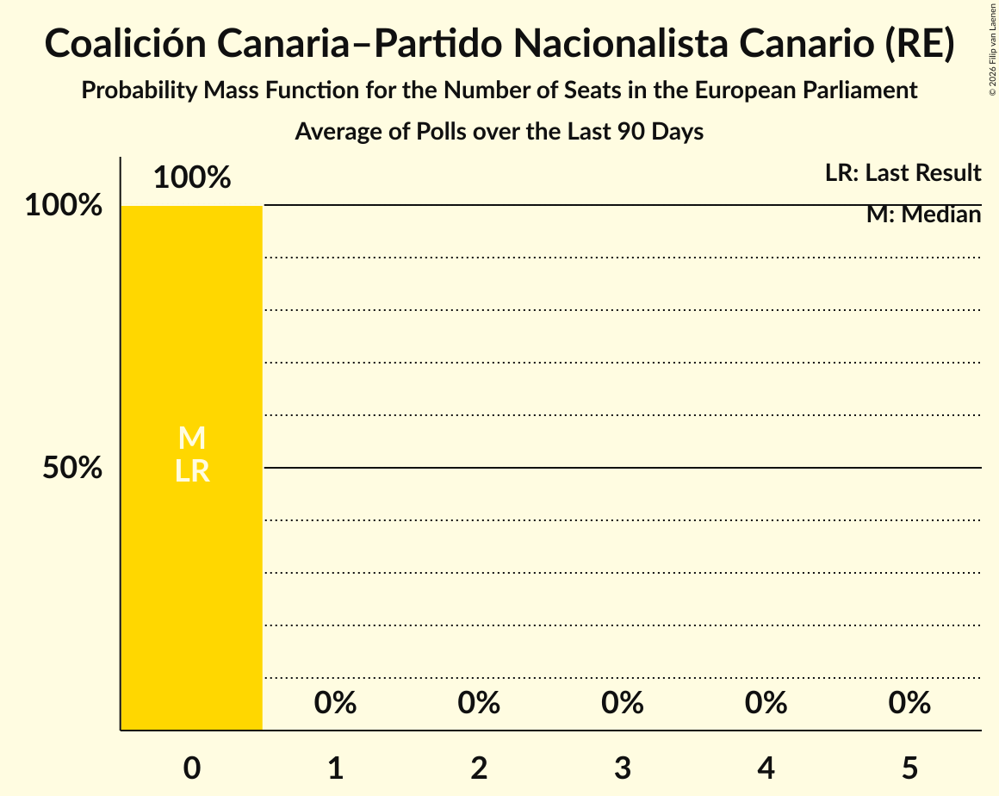

# Coalición Canaria–Partido Nacionalista Canario (RE)

<a href="#voting-intentions">Voting Intentions</a> | <a href="#seats">Seats</a>

## Voting Intentions

Last result: **0.0%** (General Election of 26 May 2019)

### Confidence Intervals

| Period     | Polling firm/Commissioner(s) | Median | 80% Confidence Interval | 90% Confidence Interval | 95% Confidence Interval | 99% Confidence Interval |
|:----------:|:----------------:|:-----------:|:-----------------------:|:-----------------------:|:-----------------------:|:-----------------------:|
| N/A | [Poll Average](average.html) | 0.5% | 0.3–0.9% | 0.2–1.0% | 0.2–1.2% | 0.1–1.4% |
| [1–12 August 2022](2022-08-12-electoPanel.html) | electoPanel   electomania.es | 0.5% | 0.3–0.9% | 0.3–1.0% | 0.2–1.1% | 0.2–1.2% |
| [5–10 August 2022](2022-08-10-HamalgamaMétrica.html) | Hamalgama Métrica   VozPópuli | 0.5% | 0.3–0.9% | 0.3–1.1% | 0.2–1.2% | 0.2–1.4% |
| [31 July–5 August 2022](2022-08-05-electoPanel.html) | electoPanel   electomania.es | 0.5% | N/A | N/A | N/A | N/A |
| [23–29 July 2022](2022-07-29-electoPanel.html) | electoPanel   electomania.es | 0.5% | 0.3–0.9% | 0.2–1.0% | 0.2–1.2% | 0.1–1.4% |
| [18–29 July 2022](2022-07-29-IMOP.html) | IMOP   El Confidencial | 0.3% | 0.2–0.6% | 0.2–0.7% | 0.1–0.8% | 0.1–1.0% |
| [15–22 July 2022](2022-07-22-electoPanel.html) | electoPanel   electomania.es | 0.5% | 0.3–0.9% | 0.2–1.0% | 0.2–1.1% | 0.1–1.4% |
| [18–22 July 2022](2022-07-22-SigmaDos.html) | Sigma Dos   Antena 3 | 0.0% | N/A | N/A | N/A | N/A |
| [18–21 July 2022](2022-07-21-NCReport.html) | NC Report   La Razón | 0.0% | N/A | N/A | N/A | N/A |
| [21 July 2022](2022-07-21-KeyData.html) | Key Data   Público | 0.6% | N/A | N/A | N/A | N/A |
| [14–17 July 2022](2022-07-17-DYM.html) | DYM   Henneo | 0.0% | N/A | N/A | N/A | N/A |
| [14–16 July 2022](2022-07-16-SocioMétrica.html) | SocioMétrica   El Español | 0.5% | 0.4–0.8% | 0.3–0.9% | 0.3–1.0% | 0.2–1.1% |
| [9–15 July 2022](2022-07-15-electoPanel.html) | electoPanel   electomania.es | 0.5% | 0.3–0.9% | 0.3–1.0% | 0.2–1.1% | 0.2–1.4% |
| [4–15 July 2022](2022-07-15-IMOP.html) | IMOP   El Confidencial | 0.3% | 0.2–0.6% | 0.2–0.7% | 0.1–0.8% | 0.1–1.0% |
| [12–14 July 2022](2022-07-14-GAD3.html) | GAD3   NIUS | 0.5% | 0.3–1.0% | 0.2–1.2% | 0.2–1.3% | 0.1–1.7% |
| [14 July 2022](2022-07-14-Data10.html) | Data10   OKDiario | 0.6% | 0.4–1.1% | 0.3–1.2% | 0.3–1.3% | 0.2–1.6% |
| [7–12 July 2022](2022-07-12-Celeste-Tel.html) | Celeste-Tel   Onda Cero | 0.6% | 0.4–1.1% | 0.4–1.2% | 0.3–1.3% | 0.2–1.6% |
| [1–12 July 2022](2022-07-12-CIS.html) | CIS | 0.3% | 0.2–0.5% | 0.2–0.5% | 0.2–0.5% | 0.1–0.6% |
| [1–11 July 2022](2022-07-11-SimpleLógica.html) | Simple Lógica   elDiario.es | 0.0% | N/A | N/A | N/A | N/A |
| [7–9 July 2022](2022-07-09-Merca2.html) | Merca2 | 0.0% | N/A | N/A | N/A | N/A |
| [3–8 July 2022](2022-07-08-electoPanel.html) | electoPanel   electomania.es | 0.5% | 0.3–0.9% | 0.3–1.0% | 0.2–1.1% | 0.2–1.3% |
| [5–8 July 2022](2022-07-08-HamalgamaMétrica.html) | Hamalgama Métrica   VozPópuli | 0.5% | 0.3–0.9% | 0.3–1.1% | 0.2–1.2% | 0.2–1.4% |
| [5–7 July 2022](2022-07-07-TargetPoint.html) | Target Point   El Debate | 0.0% | N/A | N/A | N/A | N/A |
| [4–6 July 2022](2022-07-06-GAD3.html) | GAD3   ABC | 0.4% | 0.2–0.8% | 0.2–0.9% | 0.2–1.0% | 0.1–1.2% |
| [27 June–1 July 2022](2022-07-01-electoPanel.html) | electoPanel   electomania.es | 0.5% | N/A | N/A | N/A | N/A |
| [29 June–1 July 2022](2022-07-01-SWDemoscopia.html) | SW Demoscopia | 0.5% | 0.3–0.9% | 0.3–1.1% | 0.2–1.2% | 0.2–1.4% |
| [20 June–1 July 2022](2022-07-01-IMOP.html) | IMOP   El Confidencial | 0.4% | 0.2–0.7% | 0.2–0.8% | 0.2–0.9% | 0.1–1.1% |
| [29–30 June 2022](2022-06-30-Data10.html) | Data10   OKDiario | 0.5% | 0.3–0.9% | 0.3–1.1% | 0.2–1.2% | 0.2–1.4% |
| [27–29 June 2022](2022-06-29-SigmaDos.html) | Sigma Dos   El Mundo | 0.0% | N/A | N/A | N/A | N/A |
| [23–27 June 2022](2022-06-27-40dB.html) | 40dB   Prisa | 0.0% | N/A | N/A | N/A | N/A |
| [26 June 2022](2022-06-26-SigmaDos.html) | Sigma Dos   Antena 3 | 0.0% | N/A | N/A | N/A | N/A |
| [19–24 June 2022](2022-06-24-electoPanel.html) | electoPanel   electomania.es | 0.5% | 0.3–0.7% | 0.3–0.8% | 0.3–0.9% | 0.2–1.0% |
| [21–24 June 2022](2022-06-24-SocioMétrica.html) | SocioMétrica   El Español | 0.6% | 0.4–1.0% | 0.3–1.1% | 0.3–1.2% | 0.2–1.4% |
| [20–24 June 2022](2022-06-24-InvyMark.html) | InvyMark   laSexta | 0.0% | N/A | N/A | N/A | N/A |
| [23 June 2022](2022-06-23-KeyData.html) | Key Data   Público | 0.6% | 0.3–1.5% | 0.2–1.8% | 0.2–2.1% | 0.1–2.7% |
| [20–22 June 2022](2022-06-22-GESOP.html) | GESOP   Prensa Ibérica | 0.0% | N/A | N/A | N/A | N/A |
| [20 June 2022](2022-06-20-Data10.html) | Data10   OKDiario | 0.5% | 0.3–0.9% | 0.3–1.1% | 0.2–1.2% | 0.2–1.4% |
| [7–10 June 2022](2022-06-10-electoPanel.html) | electoPanel   electomania.es | 0.6% | 0.4–1.1% | 0.4–1.2% | 0.3–1.3% | 0.2–1.6% |
| [1–9 June 2022](2022-06-09-SimpleLógica.html) | Simple Lógica   elDiario.es | 0.0% | N/A | N/A | N/A | N/A |
| [1–9 June 2022](2022-06-09-CIS.html) | CIS | 0.3% | 0.2–0.5% | 0.2–0.5% | 0.2–0.5% | 0.1–0.6% |
| [30 May–3 June 2022](2022-06-03-InvyMark.html) | InvyMark   laSexta | 0.0% | N/A | N/A | N/A | N/A |
| [28 May–2 June 2022](2022-06-02-electoPanel.html) | electoPanel   electomania.es | 0.6% | N/A | N/A | N/A | N/A |
| [31 May–1 June 2022](2022-06-01-Data10.html) | Data10   OKDiario | 0.5% | N/A | N/A | N/A | N/A |
| [21–27 May 2022](2022-05-27-electoPanel.html) | electoPanel   electomania.es | 0.6% | 0.4–1.0% | 0.3–1.1% | 0.3–1.2% | 0.2–1.4% |
| [26 May 2022](2022-05-26-KeyData.html) | Key Data   Público | 0.6% | 0.3–1.6% | 0.2–1.9% | 0.2–2.1% | 0.1–2.7% |
| [18–23 May 2022](2022-05-23-40dB.html) | 40dB   Prisa | 0.0% | N/A | N/A | N/A | N/A |
| [9–21 May 2022](2022-05-21-IMOP.html) | IMOP   El Confidencial | 0.3% | 0.2–0.6% | 0.1–0.7% | 0.1–0.8% | 0.1–1.0% |
| [14–19 May 2022](2022-05-19-electoPanel.html) | electoPanel   electomania.es | 0.6% | 0.4–0.9% | 0.4–1.0% | 0.3–1.1% | 0.3–1.2% |
| [25 April–18 May 2022](2022-05-18-CEMOP.html) | CEMOP | 0.0% | N/A | N/A | N/A | N/A |
| [9–14 May 2022](2022-05-14-SWDemoscopia.html) | SW Demoscopia | 0.5% | 0.3–0.9% | 0.3–1.0% | 0.2–1.1% | 0.2–1.3% |
| [6–13 May 2022](2022-05-13-electoPanel.html) | electoPanel   electomania.es | 0.7% | 0.5–1.1% | 0.4–1.2% | 0.4–1.3% | 0.3–1.5% |
| [11–13 May 2022](2022-05-13-DYM.html) | DYM   Henneo | 0.0% | N/A | N/A | N/A | N/A |
| [9–13 May 2022](2022-05-13-Celeste-Tel.html) | Celeste-Tel   Onda Cero | 0.6% | 0.4–1.1% | 0.4–1.2% | 0.3–1.3% | 0.2–1.6% |
| [3–12 May 2022](2022-05-12-CIS.html) | CIS | 0.3% | 0.2–0.5% | 0.2–0.5% | 0.2–0.5% | 0.1–0.6% |
| [3–11 May 2022](2022-05-11-SimpleLógica.html) | Simple Lógica   elDiario.es | 0.0% | N/A | N/A | N/A | N/A |
| [5–9 May 2022](2022-05-09-ÁgoraIntegral.html) | Ágora Integral   Canarias Ahora | 0.5% | 0.3–1.1% | 0.2–1.2% | 0.2–1.4% | 0.1–1.8% |
| [25 April–8 May 2022](2022-05-08-IMOP.html) | IMOP   El Confidencial | 0.3% | 0.2–0.6% | 0.1–0.7% | 0.1–0.8% | 0.1–1.0% |
| [4–7 May 2022](2022-05-07-SocioMétrica.html) | SocioMétrica   El Español | 0.5% | 0.3–0.9% | 0.3–1.0% | 0.2–1.1% | 0.2–1.3% |
| [29 April–6 May 2022](2022-05-06-electoPanel.html) | electoPanel   electomania.es | 0.7% | 0.5–1.1% | 0.4–1.2% | 0.4–1.3% | 0.3–1.5% |
| [5–6 May 2022](2022-05-06-Data10.html) | Data10   OKDiario | 0.5% | 0.3–0.9% | 0.3–1.1% | 0.2–1.2% | 0.2–1.4% |
| [22–29 April 2022](2022-04-29-electoPanel.html) | electoPanel   electomania.es | 0.5% | 0.4–0.7% | 0.3–0.8% | 0.3–0.8% | 0.2–0.9% |
| [20–25 April 2022](2022-04-25-40dB.html) | 40dB   Prisa | 0.0% | N/A | N/A | N/A | N/A |
| [11–23 April 2022](2022-04-23-IMOP.html) | IMOP   El Confidencial | 0.3% | 0.2–0.6% | 0.1–0.7% | 0.1–0.8% | 0.1–1.0% |
| [15–22 April 2022](2022-04-22-electoPanel.html) | electoPanel   electomania.es | 0.6% | 0.4–0.9% | 0.4–1.0% | 0.3–1.1% | 0.3–1.2% |
| [18–22 April 2022](2022-04-22-InvyMark.html) | InvyMark   laSexta | 0.0% | N/A | N/A | N/A | N/A |
| [20–22 April 2022](2022-04-22-DYM.html) | DYM   Henneo | 0.0% | N/A | N/A | N/A | N/A |
| [20 April 2022](2022-04-20-KeyData.html) | Key Data   Público | 0.6% | 0.3–1.5% | 0.2–1.8% | 0.2–2.1% | 0.1–2.7% |
| [11–20 April 2022](2022-04-20-Celeste-Tel.html) | Celeste-Tel   Onda Cero | 0.0% | N/A | N/A | N/A | N/A |
| [11–18 April 2022](2022-04-18-SWDemoscopia.html) | SW Demoscopia | 0.6% | 0.4–1.0% | 0.3–1.1% | 0.3–1.2% | 0.2–1.4% |
| [8–15 April 2022](2022-04-15-electoPanel.html) | electoPanel   electomania.es | 0.6% | 0.4–1.0% | 0.4–1.1% | 0.3–1.2% | 0.2–1.4% |
| [15 April 2022](2022-04-15-NCReport.html) | NC Report   La Razón | 0.0% | N/A | N/A | N/A | N/A |
| [9 April 2022](2022-04-09-SocioMétrica.html) | SocioMétrica   El Español | 0.6% | 0.3–1.0% | 0.3–1.2% | 0.2–1.3% | 0.2–1.6% |
| [1–9 April 2022](2022-04-09-CIS.html) | CIS | 0.3% | 0.2–0.5% | 0.2–0.5% | 0.2–0.5% | 0.1–0.6% |
| [1–8 April 2022](2022-04-08-electoPanel.html) | electoPanel   electomania.es | 0.6% | N/A | N/A | N/A | N/A |
| [28 March–8 April 2022](2022-04-08-IMOP.html) | IMOP   El Confidencial | 0.3% | 0.2–0.6% | 0.1–0.7% | 0.1–0.8% | 0.1–1.0% |
| [4–7 April 2022](2022-04-07-TargetPoint.html) | Target Point   El Debate | 0.0% | N/A | N/A | N/A | N/A |
| [1–7 April 2022](2022-04-07-SimpleLógica.html) | Simple Lógica   elDiario.es | 0.0% | N/A | N/A | N/A | N/A |
| [5–7 April 2022](2022-04-07-SigmaDos.html) | Sigma Dos   El Mundo | 0.0% | N/A | N/A | N/A | N/A |
| [4–7 April 2022](2022-04-07-HamalgamaMétrica.html) | Hamalgama Métrica   VozPópuli | 0.6% | 0.3–1.0% | 0.3–1.2% | 0.2–1.3% | 0.2–1.6% |
| [6–7 April 2022](2022-04-07-Data10.html) | Data10   OKDiario | 0.6% | 0.4–1.1% | 0.3–1.2% | 0.3–1.3% | 0.2–1.6% |
| [4–6 April 2022](2022-04-06-Metroscopia.html) | Metroscopia | 0.0% | N/A | N/A | N/A | N/A |
| [4–6 April 2022](2022-04-06-GESOP.html) | GESOP   El Periódico | 0.0% | N/A | N/A | N/A | N/A |
| [4–6 April 2022](2022-04-06-GAD3.html) | GAD3   ABC | 0.0% | N/A | N/A | N/A | N/A |
| [25 March–1 April 2022](2022-04-01-electoPanel.html) | electoPanel   electomania.es | 0.6% | 0.4–1.0% | 0.4–1.1% | 0.3–1.2% | 0.3–1.4% |
| [28–30 March 2022](2022-03-30-Metroscopia.html) | Metroscopia | 0.0% | N/A | N/A | N/A | N/A |
| [29 March 2022](2022-03-29-SigmaDos.html) | Sigma Dos   Antena 3 | 0.0% | N/A | N/A | N/A | N/A |
| [22–28 March 2022](2022-03-28-40dB.html) | 40dB   Prisa | 0.0% | N/A | N/A | N/A | N/A |
| [18–25 March 2022](2022-03-25-electoPanel.html) | electoPanel   electomania.es | 0.6% | 0.4–1.0% | 0.4–1.1% | 0.3–1.1% | 0.2–1.3% |
| [14–25 March 2022](2022-03-25-IMOP.html) | IMOP   El Confidencial | 0.3% | 0.2–0.6% | 0.1–0.7% | 0.1–0.8% | 0.1–1.0% |
| [21–23 March 2022](2022-03-23-Metroscopia.html) | Metroscopia | 0.0% | N/A | N/A | N/A | N/A |
| [16–19 March 2022](2022-03-19-DYM.html) | DYM   Henneo | 0.0% | N/A | N/A | N/A | N/A |
| [11–18 March 2022](2022-03-18-electoPanel.html) | electoPanel   electomania.es | 0.6% | 0.4–0.9% | 0.4–0.9% | 0.3–1.0% | 0.3–1.2% |
| [18 March 2022](2022-03-18-KeyData.html) | Key Data   Público | 0.6% | 0.3–1.6% | 0.2–1.8% | 0.2–2.1% | 0.1–2.7% |
| [16–17 March 2022](2022-03-17-Data10.html) | Data10   OKDiario | 0.5% | 0.3–0.9% | 0.3–1.1% | 0.2–1.2% | 0.2–1.4% |
| [14–16 March 2022](2022-03-16-Metroscopia.html) | Metroscopia | 0.0% | N/A | N/A | N/A | N/A |
| [28 February–12 March 2022](2022-03-12-IMOP.html) | IMOP   El Confidencial | 0.5% | 0.4–0.9% | 0.3–1.0% | 0.3–1.1% | 0.2–1.3% |
| [4–11 March 2022](2022-03-11-electoPanel.html) | electoPanel   electomania.es | 0.6% | 0.4–1.0% | 0.4–1.1% | 0.3–1.1% | 0.2–1.3% |
| [7–11 March 2022](2022-03-11-InvyMark.html) | InvyMark   laSexta | 0.0% | N/A | N/A | N/A | N/A |
| [1–11 March 2022](2022-03-11-CIS.html) | CIS | 0.4% | 0.3–0.6% | 0.3–0.6% | 0.2–0.7% | 0.2–0.8% |
| [1–10 March 2022](2022-03-10-SimpleLógica.html) | Simple Lógica   elDiario.es | 0.0% | N/A | N/A | N/A | N/A |
| [7–9 March 2022](2022-03-09-Metroscopia.html) | Metroscopia | 0.0% | N/A | N/A | N/A | N/A |
| [3–9 March 2022](2022-03-09-HamalgamaMétrica.html) | Hamalgama Métrica   VozPópuli | 0.5% | 0.3–0.9% | 0.3–1.1% | 0.2–1.2% | 0.2–1.4% |
| [2–9 March 2022](2022-03-09-Celeste-Tel.html) | Celeste-Tel   Onda Cero | 0.6% | 0.4–1.1% | 0.4–1.2% | 0.3–1.3% | 0.2–1.6% |
| [4–7 March 2022](2022-03-07-SigmaDos.html) | Sigma Dos   El Mundo | 0.0% | N/A | N/A | N/A | N/A |
| [1–5 March 2022](2022-03-05-electoPanel.html) | electoPanel   electomania.es | 0.6% | 0.4–0.9% | 0.4–0.9% | 0.4–1.0% | 0.3–1.1% |
| [1–4 March 2022](2022-03-04-NCReport.html) | NC Report   La Razón | 0.0% | N/A | N/A | N/A | N/A |
| [3–4 March 2022](2022-03-04-Data10.html) | Data10   OKDiario | 0.4% | 0.2–0.8% | 0.2–0.9% | 0.2–1.0% | 0.1–1.3% |
| [2 March 2022](2022-03-02-SigmaDos.html) | Sigma Dos   Antena 3 | 0.0% | N/A | N/A | N/A | N/A |
| [28 February–2 March 2022](2022-03-02-Metroscopia.html) | Metroscopia | 0.0% | N/A | N/A | N/A | N/A |
| [22–28 February 2022](2022-02-28-40dB.html) | 40dB   Prisa | 0.0% | N/A | N/A | N/A | N/A |
| [23–25 February 2022](2022-02-25-ÁgoraIntegral.html) | Ágora Integral   Canarias Ahora | 0.5% | 0.3–1.1% | 0.2–1.2% | 0.2–1.4% | 0.1–1.8% |
| [20–25 February 2022](2022-02-25-electoPanel.html) | electoPanel   electomania.es | 0.6% | 0.4–0.9% | 0.4–1.0% | 0.4–1.0% | 0.3–1.2% |
| [23–25 February 2022](2022-02-25-TargetPoint.html) | Target Point   El Debate | 0.0% | N/A | N/A | N/A | N/A |
| [21–25 February 2022](2022-02-25-InvyMark.html) | InvyMark   laSexta | 0.0% | N/A | N/A | N/A | N/A |
| [14–25 February 2022](2022-02-25-IMOP.html) | IMOP   El Confidencial | 0.5% | 0.4–0.9% | 0.3–1.0% | 0.3–1.1% | 0.2–1.3% |
| [24–25 February 2022](2022-02-25-Data10.html) | Data10   OKDiario | 0.4% | 0.2–0.8% | 0.2–0.9% | 0.2–1.0% | 0.1–1.3% |
| [24 February 2022](2022-02-24-KeyData.html) | Key Data   Público | 0.3% | 0.2–1.2% | 0.1–1.4% | 0.1–1.7% | 0.0–2.2% |
| [21–23 February 2022](2022-02-23-Metroscopia.html) | Metroscopia | 0.0% | N/A | N/A | N/A | N/A |
| [19–20 February 2022](2022-02-20-electoPanel.html) | electoPanel   electomania.es | 0.7% | 0.5–0.9% | 0.5–1.0% | 0.5–1.1% | 0.4–1.2% |
| [16–20 February 2022](2022-02-20-DYM.html) | DYM   Henneo | 0.0% | N/A | N/A | N/A | N/A |
| [18–19 February 2022](2022-02-19-SocioMétrica.html) | SocioMétrica   El Español | 0.6% | 0.4–1.1% | 0.3–1.2% | 0.3–1.3% | 0.2–1.6% |
| [19 February 2022](2022-02-19-Data10.html) | Data10   OKDiario | 0.4% | 0.2–0.8% | 0.2–0.9% | 0.2–1.0% | 0.1–1.3% |
| [14–18 February 2022](2022-02-18-electoPanel.html) | electoPanel   electomania.es | 0.7% | N/A | N/A | N/A | N/A |
| [18 February 2022](2022-02-18-SigmaDos.html) | Sigma Dos   El Mundo | 0.0% | N/A | N/A | N/A | N/A |
| [14–18 February 2022](2022-02-18-InvyMark.html) | InvyMark   laSexta | 0.0% | N/A | N/A | N/A | N/A |
| [14–17 February 2022](2022-02-17-SigmaDos.html) | Sigma Dos   El Mundo | 0.0% | N/A | N/A | N/A | N/A |
| [14–17 February 2022](2022-02-17-GAD3.html) | GAD3   NIUS | 0.5% | 0.3–1.1% | 0.2–1.2% | 0.2–1.4% | 0.1–1.7% |
| [14–16 February 2022](2022-02-16-Metroscopia.html) | Metroscopia | 0.0% | N/A | N/A | N/A | N/A |
| [14–16 February 2022](2022-02-16-GESOP.html) | GESOP   El Periódico | 0.0% | N/A | N/A | N/A | N/A |
| [13–14 February 2022](2022-02-14-electoPanel.html) | electoPanel   electomania.es | 0.7% | 0.4–1.1% | 0.4–1.2% | 0.3–1.4% | 0.2–1.6% |
| [1–12 February 2022](2022-02-12-CIS.html) | CIS | 0.1% | 0.1–0.2% | 0.0–0.2% | 0.0–0.3% | 0.0–0.3% |
| [1–10 February 2022](2022-02-10-SimpleLógica.html) | Simple Lógica   elDiario.es | 0.0% | N/A | N/A | N/A | N/A |
| [7–9 February 2022](2022-02-09-Metroscopia.html) | Metroscopia | 0.0% | N/A | N/A | N/A | N/A |
| [29 January–4 February 2022](2022-02-04-electoPanel.html) | electoPanel   electomania.es | 0.6% | N/A | N/A | N/A | N/A |
| [27 January–1 February 2022](2022-02-01-40dB.html) | 40dB   Prisa | 0.0% | N/A | N/A | N/A | N/A |
| [21–28 January 2022](2022-01-28-electoPanel.html) | electoPanel   electomania.es | 0.6% | 0.4–1.0% | 0.3–1.1% | 0.3–1.2% | 0.2–1.5% |
| [24–28 January 2022](2022-01-28-NCReport.html) | NC Report   La Razón | 0.0% | N/A | N/A | N/A | N/A |
| [17–28 January 2022](2022-01-28-IMOP.html) | IMOP   El Confidencial | 0.4% | 0.2–0.7% | 0.2–0.8% | 0.2–0.9% | 0.1–1.1% |
| [19–23 January 2022](2022-01-23-DYM.html) | DYM   Henneo | 0.0% | N/A | N/A | N/A | N/A |
| [21 January 2022](2022-01-21-KeyData.html) | Key Data   Público | 0.3% | 0.2–1.1% | 0.1–1.4% | 0.1–1.6% | 0.0–2.2% |
| [14–20 January 2022](2022-01-20-electoPanel.html) | electoPanel   electomania.es | 0.6% | 0.4–1.0% | 0.3–1.1% | 0.3–1.2% | 0.2–1.4% |
| [10–14 January 2022](2022-01-14-InvyMark.html) | InvyMark   laSexta | 0.0% | N/A | N/A | N/A | N/A |
| [3–14 January 2022](2022-01-14-IMOP.html) | IMOP   El Confidencial | 0.5% | 0.4–0.9% | 0.3–1.0% | 0.3–1.1% | 0.2–1.3% |
| [10–14 January 2022](2022-01-14-Celeste-Tel.html) | Celeste-Tel   Onda Cero | 0.6% | 0.4–1.1% | 0.4–1.2% | 0.3–1.3% | 0.2–1.6% |
| [3–14 January 2022](2022-01-14-CIS.html) | CIS | 0.4% | 0.3–0.6% | 0.3–0.6% | 0.2–0.7% | 0.2–0.7% |
| [7–13 January 2022](2022-01-13-electoPanel.html) | electoPanel   electomania.es | 0.6% | 0.4–1.0% | 0.4–1.1% | 0.3–1.2% | 0.2–1.4% |
| [3–13 January 2022](2022-01-13-SimpleLógica.html) | Simple Lógica   elDiario.es | 0.0% | N/A | N/A | N/A | N/A |
| [31 December 2021–6 January 2022](2022-01-06-electoPanel.html) | electoPanel   electomania.es | 0.7% | 0.5–1.1% | 0.5–1.1% | 0.4–1.2% | 0.3–1.4% |
| [3–5 January 2022](2022-01-05-Data10.html) | Data10   OKDiario | 0.4% | 0.2–0.8% | 0.2–0.9% | 0.2–1.0% | 0.1–1.3% |
| [24–30 December 2021](2021-12-30-electoPanel.html) | electoPanel   electomania.es | 0.7% | 0.4–1.1% | 0.4–1.2% | 0.3–1.3% | 0.3–1.6% |
| [20–30 December 2021](2021-12-30-SocioMétrica.html) | SocioMétrica   El Español | 0.6% | 0.4–0.8% | 0.4–0.9% | 0.4–1.0% | 0.3–1.1% |
| [20–30 December 2021](2021-12-30-IMOP.html) | IMOP   El Confidencial | 0.4% | 0.2–0.7% | 0.2–0.8% | 0.2–0.9% | 0.1–1.1% |
| [23–30 December 2021](2021-12-30-40dB.html) | 40dB   Prisa | 0.0% | N/A | N/A | N/A | N/A |
| [26 December 2021](2021-12-26-SigmaDos.html) | Sigma Dos   Antena 3 | 0.0% | N/A | N/A | N/A | N/A |
| [20–24 December 2021](2021-12-24-SigmaDos.html) | Sigma Dos   El Mundo | 0.0% | N/A | N/A | N/A | N/A |
| [17–23 December 2021](2021-12-23-electoPanel.html) | electoPanel   electomania.es | 0.6% | 0.4–1.0% | 0.4–1.1% | 0.3–1.2% | 0.2–1.4% |
| [22 December 2021](2021-12-22-KeyData.html) | Key Data   Público | 0.6% | 0.3–1.6% | 0.2–1.9% | 0.2–2.1% | 0.1–2.7% |
| [15–19 December 2021](2021-12-19-DYM.html) | DYM   Henneo | 0.0% | N/A | N/A | N/A | N/A |
| [6–17 December 2021](2021-12-17-IMOP.html) | IMOP   El Confidencial | 0.5% | 0.3–0.8% | 0.2–0.9% | 0.2–1.0% | 0.2–1.2% |
| [13–17 December 2021](2021-12-17-Celeste-Tel.html) | Celeste-Tel   Onda Cero | 0.6% | 0.4–1.1% | 0.4–1.2% | 0.3–1.3% | 0.2–1.6% |
| [10–16 December 2021](2021-12-16-electoPanel.html) | electoPanel   electomania.es | 0.6% | 0.4–1.0% | 0.4–1.1% | 0.3–1.2% | 0.2–1.4% |
| [13–16 December 2021](2021-12-16-GAD3.html) | GAD3   ABC | 0.6% | 0.4–1.2% | 0.3–1.3% | 0.2–1.5% | 0.2–1.8% |
| [1–13 December 2021](2021-12-13-SimpleLógica.html) | Simple Lógica | 0.0% | N/A | N/A | N/A | N/A |
| [8–11 December 2021](2021-12-11-NCReport.html) | NC Report   La Razón | 0.0% | N/A | N/A | N/A | N/A |
| [3–10 December 2021](2021-12-10-electoPanel.html) | electoPanel   electomania.es | 0.6% | N/A | N/A | N/A | N/A |
| [2–9 December 2021](2021-12-09-HamalgamaMétrica.html) | Hamalgama Métrica   VozPópuli | 0.5% | 0.3–0.9% | 0.3–1.1% | 0.2–1.2% | 0.2–1.4% |
| [7–9 December 2021](2021-12-09-Data10.html) | Data10   OKDiario | 0.4% | 0.2–0.8% | 0.2–0.9% | 0.2–1.0% | 0.1–1.3% |
| [1–5 December 2021](2021-12-05-ÁgoraIntegral.html) | Ágora Integral   Canarias Ahora | 0.4% | 0.3–0.9% | 0.2–1.0% | 0.2–1.1% | 0.1–1.3% |
| [26 November–3 December 2021](2021-12-03-electoPanel.html) | electoPanel   electomania.es | 0.6% | 0.4–1.1% | 0.4–1.2% | 0.3–1.3% | 0.2–1.5% |
| [22 November–3 December 2021](2021-12-03-IMOP.html) | IMOP   El Confidencial | 0.4% | 0.2–0.7% | 0.2–0.8% | 0.2–0.9% | 0.1–1.1% |
| [30 November–1 December 2021](2021-12-01-SigmaDos.html) | Sigma Dos   El Mundo | 0.0% | N/A | N/A | N/A | N/A |
| [19–26 November 2021](2021-11-26-electoPanel.html) | electoPanel   electomania.es | 0.6% | 0.3–1.3% | 0.3–1.6% | 0.2–1.8% | 0.1–2.2% |
| [23–24 November 2021](2021-11-24-SWDemoscopia.html) | SW Demoscopia   Publicaciones Sur | 0.0% | N/A | N/A | N/A | N/A |
| [22 November 2021](2021-11-22-SigmaDos.html) | Sigma Dos   Antena 3 | 0.0% | N/A | N/A | N/A | N/A |
| [22 November 2021](2021-11-22-KeyData.html) | Key Data   Público | 0.6% | 0.3–1.3% | 0.3–1.6% | 0.2–1.8% | 0.1–2.2% |
| [17–21 November 2021](2021-11-21-DYM.html) | DYM   Henneo | 0.0% | N/A | N/A | N/A | N/A |
| [12–19 November 2021](2021-11-19-electoPanel.html) | electoPanel   electomania.es | 0.5% | 0.3–0.8% | 0.3–0.9% | 0.3–1.0% | 0.2–1.2% |
| [15–19 November 2021](2021-11-19-InvyMark.html) | InvyMark   laSexta | 0.0% | N/A | N/A | N/A | N/A |
| [8–19 November 2021](2021-11-19-IMOP.html) | IMOP   El Confidencial | 0.4% | 0.2–0.7% | 0.2–0.8% | 0.2–0.9% | 0.1–1.1% |
| [11–16 November 2021](2021-11-16-Celeste-Tel.html) | Celeste-Tel   Onda Cero | 0.4% | 0.2–1.0% | 0.2–1.1% | 0.2–1.3% | 0.1–1.6% |
| [30 October–15 November 2021](2021-11-15-SimpleLógica.html) | Simple Lógica | 0.0% | N/A | N/A | N/A | N/A |
| [4–11 November 2021](2021-11-11-electoPanel.html) | electoPanel   electomania.es | 0.5% | N/A | N/A | N/A | N/A |
| [10–11 November 2021](2021-11-11-SigmaDos.html) | Sigma Dos   El Mundo | 0.0% | N/A | N/A | N/A | N/A |
| [8–11 November 2021](2021-11-11-GAD3.html) | GAD3   NIUS | 0.6% | 0.4–1.2% | 0.3–1.4% | 0.2–1.6% | 0.2–1.9% |
| [2–11 November 2021](2021-11-11-CIS.html) | CIS | 0.4% | 0.3–0.6% | 0.3–0.6% | 0.2–0.7% | 0.2–0.7% |
| [3–10 November 2021](2021-11-10-HamalgamaMétrica.html) | Hamalgama Métrica   VozPópuli | 0.5% | 0.3–0.9% | 0.3–1.1% | 0.2–1.2% | 0.2–1.4% |
| [5–8 November 2021](2021-11-08-SocioMétrica.html) | SocioMétrica   El Español | 0.6% | 0.4–1.0% | 0.3–1.1% | 0.3–1.2% | 0.2–1.4% |
| [2–6 November 2021](2021-11-06-NCReport.html) | NC Report   La Razón | 0.0% | N/A | N/A | N/A | N/A |
| [25 October–6 November 2021](2021-11-06-IMOP.html) | IMOP   El Confidencial | 0.4% | 0.2–0.7% | 0.2–0.8% | 0.2–0.9% | 0.1–1.1% |
| [1–5 November 2021](2021-11-05-InvyMark.html) | InvyMark   laSexta | 0.0% | N/A | N/A | N/A | N/A |
| [29 October–4 November 2021](2021-11-04-electoPanel.html) | electoPanel   electomania.es | 0.5% | 0.3–0.8% | 0.3–0.9% | 0.2–1.0% | 0.2–1.2% |
| [21 October–4 November 2021](2021-11-04-Metroscopia.html) | Metroscopia | 0.0% | N/A | N/A | N/A | N/A |
| [2–4 November 2021](2021-11-04-Data10.html) | Data10   OKDiario | 0.4% | 0.2–0.8% | 0.2–0.9% | 0.2–1.0% | 0.1–1.3% |
| [20–30 October 2021](2021-10-30-SWDemoscopia.html) | SW Demoscopia | 0.6% | 0.4–1.0% | 0.3–1.1% | 0.3–1.2% | 0.2–1.4% |
| [22–29 October 2021](2021-10-29-electoPanel.html) | electoPanel   electomania.es | 0.5% | N/A | N/A | N/A | N/A |
| [20–24 October 2021](2021-10-24-DYM.html) | DYM   Henneo | 0.0% | N/A | N/A | N/A | N/A |
| [15–22 October 2021](2021-10-22-electoPanel.html) | electoPanel   electomania.es | 0.5% | N/A | N/A | N/A | N/A |
| [11–22 October 2021](2021-10-22-IMOP.html) | IMOP   El Confidencial | 0.3% | N/A | N/A | N/A | N/A |
| [18–22 October 2021](2021-10-22-Celeste-Tel.html) | Celeste-Tel   Onda Cero | 0.5% | N/A | N/A | N/A | N/A |
| [19–21 October 2021](2021-10-21-SigmaDos.html) | Sigma Dos   El Mundo | 0.0% | N/A | N/A | N/A | N/A |
| [20 October 2021](2021-10-20-KeyData.html) | Key Data   Público | 0.6% | 0.3–1.6% | 0.2–1.9% | 0.2–2.2% | 0.1–2.8% |
| [8–15 October 2021](2021-10-15-electoPanel.html) | electoPanel   electomania.es | 0.5% | N/A | N/A | N/A | N/A |
| [30 September–15 October 2021](2021-10-15-SimpleLógica.html) | Simple Lógica | 0.0% | N/A | N/A | N/A | N/A |
| [13–15 October 2021](2021-10-15-NCReport.html) | NC Report   La Razón | 0.0% | N/A | N/A | N/A | N/A |
| [11–15 October 2021](2021-10-15-InvyMark.html) | InvyMark   laSexta | 0.0% | N/A | N/A | N/A | N/A |
| [8–14 October 2021](2021-10-14-GAD3.html) | GAD3   ABC | 0.0% | N/A | N/A | N/A | N/A |
| [1–13 October 2021](2021-10-13-CIS.html) | CIS | 0.4% | N/A | N/A | N/A | N/A |
| [11 October 2021](2021-10-11-SigmaDos.html) | Sigma Dos   Antena 3 | 0.0% | N/A | N/A | N/A | N/A |
| [10 October 2021](2021-10-10-Metroscopia.html) | Metroscopia | 0.0% | N/A | N/A | N/A | N/A |
| [1–8 October 2021](2021-10-08-electoPanel.html) | electoPanel   electomania.es | 0.5% | N/A | N/A | N/A | N/A |
| [27 September–8 October 2021](2021-10-08-IMOP.html) | IMOP   El Confidencial | 0.5% | N/A | N/A | N/A | N/A |
| [4–7 October 2021](2021-10-07-SocioMétrica.html) | SocioMétrica   El Español | 0.5% | N/A | N/A | N/A | N/A |
| [5–7 October 2021](2021-10-07-Data10.html) | Data10   OKDiario | 0.4% | N/A | N/A | N/A | N/A |
| [1–6 October 2021](2021-10-06-HamalgamaMétrica.html) | Hamalgama Métrica   VozPópuli | 0.5% | N/A | N/A | N/A | N/A |
| [24 September–1 October 2021](2021-10-01-electoPanel.html) | electoPanel   electomania.es | 0.5% | N/A | N/A | N/A | N/A |
| [23–27 September 2021](2021-09-27-ÁgoraIntegral.html) | Ágora Integral | 0.3% | 0.2–0.9% | 0.1–1.0% | 0.1–1.2% | 0.0–1.5% |
| [17–24 September 2021](2021-09-24-electoPanel.html) | electoPanel   electomania.es | 0.5% | N/A | N/A | N/A | N/A |
| [13–24 September 2021](2021-09-24-IMOP.html) | IMOP   El Confidencial | 0.5% | N/A | N/A | N/A | N/A |
| [23 September 2021](2021-09-23-KeyData.html) | Key Data   Público | 0.6% | N/A | N/A | N/A | N/A |
| [16–21 September 2021](2021-09-21-Celeste-Tel.html) | Celeste-Tel   Onda Cero | 0.4% | N/A | N/A | N/A | N/A |
| [20 September 2021](2021-09-20-Metroscopia.html) | Metroscopia | 0.0% | N/A | N/A | N/A | N/A |
| [19–20 September 2021](2021-09-20-Data10.html) | Data10   OKDiario | 0.4% | N/A | N/A | N/A | N/A |
| [16–19 September 2021](2021-09-19-DYM.html) | DYM   Henneo | 0.0% | N/A | N/A | N/A | N/A |
| [14–18 September 2021](2021-09-18-NCReport.html) | NC Report   La Razón | 0.0% | N/A | N/A | N/A | N/A |
| [10–17 September 2021](2021-09-17-electoPanel.html) | electoPanel   electomania.es | 0.5% | N/A | N/A | N/A | N/A |
| [1–16 September 2021](2021-09-16-SimpleLógica.html) | Simple Lógica | 0.0% | N/A | N/A | N/A | N/A |
| [13–16 September 2021](2021-09-16-GAD3.html) | GAD3   NIUS | 0.5% | N/A | N/A | N/A | N/A |
| [1–13 September 2021](2021-09-13-CIS.html) | CIS | 0.4% | N/A | N/A | N/A | N/A |
| [30 August–10 September 2021](2021-09-10-IMOP.html) | IMOP   El Confidencial | 0.5% | N/A | N/A | N/A | N/A |
| [3–9 September 2021](2021-09-09-electoPanel.html) | electoPanel   electomania.es | 0.5% | N/A | N/A | N/A | N/A |
| [27 August–3 September 2021](2021-09-03-electoPanel.html) | electoPanel   electomania.es | 0.5% | N/A | N/A | N/A | N/A |
| [30 August–2 September 2021](2021-09-02-SigmaDos.html) | Sigma Dos   El Mundo | 0.0% | N/A | N/A | N/A | N/A |
| [30 August–1 September 2021](2021-09-01-Data10.html) | Data10   OKDiario | 0.4% | N/A | N/A | N/A | N/A |
| [30 August 2021](2021-08-30-SigmaDos.html) | Sigma Dos   Antena 3 | 0.0% | N/A | N/A | N/A | N/A |
| [30 August 2021](2021-08-30-KeyData.html) | Key Data   Público | 0.6% | N/A | N/A | N/A | N/A |
| [24–27 August 2021](2021-08-27-NCReport.html) | NC Report   La Razón | 0.0% | N/A | N/A | N/A | N/A |
| [20–26 August 2021](2021-08-26-electoPanel.html) | electoPanel   electomania.es | 0.5% | N/A | N/A | N/A | N/A |
| [14–21 August 2021](2021-08-21-electoPanel.html) | electoPanel   electomania.es | 0.5% | N/A | N/A | N/A | N/A |
| [16–20 August 2021](2021-08-20-Celeste-Tel.html) | Celeste-Tel   Onda Cero | 0.4% | N/A | N/A | N/A | N/A |
| [6–13 August 2021](2021-08-13-electoPanel.html) | electoPanel   electomania.es | 0.5% | N/A | N/A | N/A | N/A |
| [31 July–6 August 2021](2021-08-06-electoPanel.html) | electoPanel   electomania.es | 0.5% | 0.3–0.9% | 0.3–1.0% | 0.2–1.1% | 0.2–1.3% |
| [4–6 August 2021](2021-08-06-Data10.html) | Data10   OKDiario | 0.4% | 0.2–0.8% | 0.2–0.9% | 0.2–1.0% | 0.1–1.3% |
| [2–4 August 2021](2021-08-04-SimpleLógica.html) | Simple Lógica | 0.0% | N/A | N/A | N/A | N/A |
| [23–30 July 2021](2021-07-30-electoPanel.html) | electoPanel   electomania.es | 0.5% | 0.3–0.9% | 0.2–1.1% | 0.2–1.2% | 0.1–1.4% |
| [26–29 July 2021](2021-07-29-SocioMétrica.html) | SocioMétrica   El Español | 0.4% | 0.3–0.8% | 0.2–0.9% | 0.2–1.0% | 0.1–1.2% |
| [16–23 July 2021](2021-07-23-electoPanel.html) | electoPanel   electomania.es | 0.5% | 0.3–0.8% | 0.3–0.9% | 0.2–1.0% | 0.2–1.2% |
| [20–23 July 2021](2021-07-23-Celeste-Tel.html) | Celeste-Tel   Onda Cero | 0.4% | 0.2–0.7% | 0.2–0.8% | 0.1–0.9% | 0.1–1.1% |
| [22 July 2021](2021-07-22-KeyData.html) | Key Data   Público | 0.6% | N/A | N/A | N/A | N/A |
| [16–22 July 2021](2021-07-22-GAD3.html) | GAD3   ABC | 0.5% | 0.3–1.0% | 0.2–1.1% | 0.2–1.3% | 0.1–1.6% |
| [19 July 2021](2021-07-19-SigmaDos.html) | Sigma Dos   Antena 3 | 0.0% | N/A | N/A | N/A | N/A |
| [15–19 July 2021](2021-07-19-DYM.html) | DYM   Henneo | 0.0% | N/A | N/A | N/A | N/A |
| [16–17 July 2021](2021-07-17-Data10.html) | Data10   OKDiario | 0.5% | 0.3–0.9% | 0.3–1.1% | 0.2–1.2% | 0.2–1.4% |
| [11–16 July 2021](2021-07-16-electoPanel.html) | electoPanel   electomania.es | 0.5% | 0.4–0.8% | 0.3–0.9% | 0.3–0.9% | 0.2–1.1% |
| [16 July 2021](2021-07-16-NCReport.html) | NC Report   La Razón | 0.0% | N/A | N/A | N/A | N/A |
| [12–16 July 2021](2021-07-16-InvyMark.html) | InvyMark   laSexta | 0.0% | N/A | N/A | N/A | N/A |
| [15 July 2021](2021-07-15-Metroscopia.html) | Metroscopia | 0.0% | N/A | N/A | N/A | N/A |
| [14–15 July 2021](2021-07-15-GESOP.html) | GESOP   El Periódico | 0.0% | N/A | N/A | N/A | N/A |
| [2–15 July 2021](2021-07-15-CIS.html) | CIS | 0.3% | 0.2–0.4% | 0.2–0.5% | 0.2–0.5% | 0.1–0.6% |
| [5–12 July 2021](2021-07-12-SimpleLógica.html) | Simple Lógica | 0.0% | N/A | N/A | N/A | N/A |
| [8–10 July 2021](2021-07-10-electoPanel.html) | electoPanel   electomania.es | 0.5% | 0.3–0.8% | 0.3–0.8% | 0.2–0.9% | 0.2–1.1% |
| [24 June–2 July 2021](2021-07-02-electoPanel.html) | electoPanel   electomania.es | 0.5% | 0.4–0.7% | 0.3–0.8% | 0.3–0.9% | 0.2–1.0% |
| [28 June–2 July 2021](2021-07-02-InvyMark.html) | InvyMark   laSexta | 0.0% | N/A | N/A | N/A | N/A |
| [28 June–1 July 2021](2021-07-01-SigmaDos.html) | Sigma Dos   El Mundo | 0.0% | N/A | N/A | N/A | N/A |
| [29 June–1 July 2021](2021-07-01-Data10.html) | Data10   OKDiario | 0.4% | 0.2–0.8% | 0.2–0.9% | 0.2–1.0% | 0.1–1.3% |
| [27 June 2021](2021-06-27-SocioMétrica.html) | SocioMétrica   El Español | 0.4% | 0.3–0.9% | 0.2–1.0% | 0.2–1.1% | 0.1–1.4% |
| [24–26 June 2021](2021-06-26-electoPanel.html) | electoPanel   electomania.es | 0.5% | 0.3–0.8% | 0.3–0.9% | 0.2–1.0% | 0.2–1.1% |
| [23–26 June 2021](2021-06-26-NCReport.html) | NC Report   La Razón | 0.0% | N/A | N/A | N/A | N/A |
| [21 June 2021](2021-06-21-SigmaDos.html) | Sigma Dos   Antena 3 | 0.0% | N/A | N/A | N/A | N/A |
| [21 June 2021](2021-06-21-KeyData.html) | Key Data   Público | 0.6% | 0.3–1.6% | 0.2–1.9% | 0.2–2.1% | 0.1–2.7% |
| [17–21 June 2021](2021-06-21-DYM.html) | DYM   Henneo | 0.0% | N/A | N/A | N/A | N/A |
| [20 June 2021](2021-06-20-Metroscopia.html) | Metroscopia | 0.0% | N/A | N/A | N/A | N/A |
| [12–18 June 2021](2021-06-18-electoPanel.html) | electoPanel   electomania.es | 0.5% | 0.3–0.9% | 0.3–1.0% | 0.3–1.1% | 0.2–1.3% |
| [14–18 June 2021](2021-06-18-Celeste-Tel.html) | Celeste-Tel   Onda Cero | 0.4% | 0.2–0.7% | 0.2–0.8% | 0.1–0.9% | 0.1–1.1% |
| [2–15 June 2021](2021-06-15-CIS.html) | CIS | 0.2% | 0.1–0.4% | 0.1–0.4% | 0.1–0.4% | 0.1–0.5% |
| [5–11 June 2021](2021-06-11-electoPanel.html) | electoPanel   electomania.es | 0.5% | 0.3–0.8% | 0.3–0.9% | 0.2–0.9% | 0.2–1.1% |
| [7–10 June 2021](2021-06-10-GAD3.html) | GAD3   NIUS | 0.6% | 0.4–1.2% | 0.3–1.4% | 0.2–1.5% | 0.2–1.9% |
| [1–9 June 2021](2021-06-09-SimpleLógica.html) | Simple Lógica | 0.0% | N/A | N/A | N/A | N/A |
| [30 May–4 June 2021](2021-06-04-electoPanel.html) | electoPanel   electomania.es | 0.5% | 0.3–0.8% | 0.3–0.9% | 0.2–1.0% | 0.2–1.2% |
| [1–3 June 2021](2021-06-03-Data10.html) | Data10   OKDiario | 0.5% | 0.3–0.9% | 0.3–1.1% | 0.2–1.2% | 0.2–1.4% |
| [31 May–1 June 2021](2021-06-01-SigmaDos.html) | Sigma Dos   El Mundo | 0.0% | N/A | N/A | N/A | N/A |
| [26–29 May 2021](2021-05-29-SocioMétrica.html) | SocioMétrica   El Español | 0.4% | 0.2–0.7% | 0.2–0.8% | 0.1–0.9% | 0.1–1.1% |
| [23–28 May 2021](2021-05-28-electoPanel.html) | electoPanel   electomania.es | 0.5% | 0.3–0.8% | 0.2–0.9% | 0.2–1.0% | 0.2–1.2% |
| [21–24 May 2021](2021-05-24-DYM.html) | DYM   Henneo | 0.0% | N/A | N/A | N/A | N/A |
| [17–22 May 2021](2021-05-22-electoPanel.html) | electoPanel   electomania.es | 0.5% | 0.3–0.8% | 0.3–0.9% | 0.3–1.0% | 0.2–1.2% |
| [22 May 2021](2021-05-22-NCReport.html) | NC Report   La Razón | 0.0% | N/A | N/A | N/A | N/A |
| [17–21 May 2021](2021-05-21-InvyMark.html) | InvyMark   laSexta | 0.0% | N/A | N/A | N/A | N/A |
| [20 May 2021](2021-05-20-Metroscopia.html) | Metroscopia | 0.0% | N/A | N/A | N/A | N/A |
| [20 May 2021](2021-05-20-KeyData.html) | Key Data   Público | 0.6% | 0.3–1.5% | 0.2–1.8% | 0.2–2.1% | 0.1–2.7% |
| [12–18 May 2021](2021-05-18-GAD3.html) | GAD3   ABC | 0.4% | 0.3–0.8% | 0.2–0.9% | 0.2–1.0% | 0.1–1.2% |
| [17 May 2021](2021-05-17-SigmaDos.html) | Sigma Dos   Antena 3 | 0.0% | N/A | N/A | N/A | N/A |
| [10–15 May 2021](2021-05-15-electoPanel.html) | electoPanel   electomania.es | 0.5% | 0.4–0.8% | 0.3–0.9% | 0.3–1.0% | 0.2–1.1% |
| [10–14 May 2021](2021-05-14-Celeste-Tel.html) | Celeste-Tel   Onda Cero | 0.4% | 0.2–0.9% | 0.2–1.1% | 0.2–1.2% | 0.1–1.5% |
| [4–13 May 2021](2021-05-13-CIS.html) | CIS | 0.3% | 0.2–0.4% | 0.2–0.5% | 0.2–0.5% | 0.1–0.6% |
| [4–12 May 2021](2021-05-12-SimpleLógica.html) | Simple Lógica | 0.0% | N/A | N/A | N/A | N/A |
| [10–11 May 2021](2021-05-11-HamalgamaMétrica.html) | Hamalgama Métrica   OKDiario | 0.5% | 0.3–0.9% | 0.3–1.1% | 0.2–1.2% | 0.2–1.4% |
| [4–8 May 2021](2021-05-08-NCReport.html) | NC Report   La Razón | 0.0% | N/A | N/A | N/A | N/A |
| [5–7 May 2021](2021-05-07-InvyMark.html) | InvyMark   laSexta | 0.0% | N/A | N/A | N/A | N/A |
| [4–6 May 2021](2021-05-06-electoPanel.html) | electoPanel   electomania.es | 0.5% | 0.3–0.8% | 0.3–0.9% | 0.3–0.9% | 0.2–1.1% |
| [5–6 May 2021](2021-05-06-SigmaDos.html) | Sigma Dos   El Mundo | 0.0% | N/A | N/A | N/A | N/A |
| [5–6 May 2021](2021-05-06-DemoscopiayServicios.html) | Demoscopia y Servicios   ESdiario | 0.4% | 0.2–0.8% | 0.2–0.9% | 0.2–1.0% | 0.1–1.3% |
| [24 April–2 May 2021](2021-05-02-electoPanel.html) | electoPanel   electomania.es | 0.5% | 0.4–0.7% | 0.4–0.7% | 0.3–0.8% | 0.3–0.9% |
| [18–24 April 2021](2021-04-24-electoPanel.html) | electoPanel   electomania.es | 0.5% | 0.4–0.7% | 0.3–0.8% | 0.3–0.8% | 0.3–0.9% |
| [10–17 April 2021](2021-04-17-electoPanel.html) | electoPanel   electomania.es | 0.5% | 0.4–0.7% | 0.3–0.8% | 0.3–0.9% | 0.2–1.0% |
| [12–16 April 2021](2021-04-16-InvyMark.html) | InvyMark   laSexta | 0.0% | N/A | N/A | N/A | N/A |
| [14–16 April 2021](2021-04-16-GAD3.html) | GAD3   NIUS | 0.5% | 0.3–1.1% | 0.2–1.2% | 0.2–1.4% | 0.1–1.7% |
| [15 April 2021](2021-04-15-Metroscopia.html) | Metroscopia | 0.0% | N/A | N/A | N/A | N/A |
| [5–13 April 2021](2021-04-13-SimpleLógica.html) | Simple Lógica | 0.0% | N/A | N/A | N/A | N/A |
| [2–9 April 2021](2021-04-09-electoPanel.html) | electoPanel   electomania.es | 0.5% | 0.4–0.8% | 0.3–0.9% | 0.3–0.9% | 0.2–1.1% |
| [26 March–2 April 2021](2021-04-02-electoPanel.html) | electoPanel   electomania.es | 0.5% | 0.4–0.8% | 0.3–0.9% | 0.3–0.9% | 0.2–1.1% |
| [26–31 March 2021](2021-03-31-NCReport.html) | NC Report   La Razón | 0.0% | N/A | N/A | N/A | N/A |
| [22–26 March 2021](2021-03-26-electoPanel.html) | electoPanel   electomania.es | 0.5% | 0.4–0.8% | 0.3–0.9% | 0.3–0.9% | 0.2–1.1% |
| [16–20 March 2021](2021-03-20-electoPanel.html) | electoPanel   electomania.es | 0.5% | 0.4–0.8% | 0.3–0.8% | 0.3–0.9% | 0.2–1.0% |
| [15–19 March 2021](2021-03-19-InvyMark.html) | InvyMark   laSexta | 0.0% | N/A | N/A | N/A | N/A |
| [15 March 2021](2021-03-15-electoPanel.html) | electoPanel   electomania.es | 0.5% | 0.4–0.7% | 0.3–0.8% | 0.3–0.9% | 0.2–1.0% |
| [15 March 2021](2021-03-15-Metroscopia.html) | Metroscopia | 0.0% | N/A | N/A | N/A | N/A |
| [12–13 March 2021](2021-03-13-electoPanel.html) | electoPanel   electomania.es | 0.5% | 0.4–0.7% | 0.3–0.8% | 0.3–0.9% | 0.2–1.0% |
| [1–11 March 2021](2021-03-11-CIS.html) | CIS | 0.2% | 0.1–0.4% | 0.1–0.4% | 0.1–0.4% | 0.1–0.5% |
| [1–9 March 2021](2021-03-09-SimpleLógica.html) | Simple Lógica | 0.0% | N/A | N/A | N/A | N/A |
| [28 February–5 March 2021](2021-03-05-electoPanel.html) | electoPanel   electomania.es | 0.5% | 0.3–0.8% | 0.3–0.9% | 0.2–1.0% | 0.2–1.2% |
| [1–5 March 2021](2021-03-05-InvyMark.html) | InvyMark   laSexta | 0.0% | N/A | N/A | N/A | N/A |
| [1–3 March 2021](2021-03-03-SigmaDos.html) | Sigma Dos   El Mundo | 0.0% | N/A | N/A | N/A | N/A |
| [1 March 2021](2021-03-01-KeyData.html) | Key Data   Público | 0.6% | 0.3–1.6% | 0.2–1.8% | 0.2–2.1% | 0.1–2.7% |
| [24–28 February 2021](2021-02-28-NCReport.html) | NC Report   La Razón | 0.0% | N/A | N/A | N/A | N/A |
| [20–27 February 2021](2021-02-27-electoPanel.html) | electoPanel   electomania.es | 0.5% | 0.3–0.8% | 0.3–0.9% | 0.2–1.0% | 0.2–1.2% |
| [22–25 February 2021](2021-02-25-GAD3.html) | GAD3   NIUS | 0.3% | 0.2–0.9% | 0.1–1.0% | 0.1–1.2% | 0.0–1.5% |
| [19–23 February 2021](2021-02-23-DYM.html) | DYM   Henneo | 0.0% | N/A | N/A | N/A | N/A |
| [17–23 February 2021](2021-02-23-Celeste-Tel.html) | Celeste-Tel   Onda Cero | 0.6% | 0.3–1.1% | 0.3–1.3% | 0.2–1.4% | 0.2–1.8% |
| [19–22 February 2021](2021-02-22-HamalgamaMétrica.html) | Hamalgama Métrica   OKDiario | 0.0% | N/A | N/A | N/A | N/A |
| [17–20 February 2021](2021-02-20-electoPanel.html) | electoPanel   electomania.es | 0.5% | 0.3–0.8% | 0.3–0.9% | 0.2–1.0% | 0.2–1.2% |
| [15–17 February 2021](2021-02-17-SigmaDos.html) | Sigma Dos   El Mundo | 0.0% | N/A | N/A | N/A | N/A |
| [14–16 February 2021](2021-02-16-electoPanel.html) | electoPanel   electomania.es | 0.5% | 0.3–0.9% | 0.3–1.0% | 0.2–1.1% | 0.2–1.3% |
| [15 February 2021](2021-02-15-Metroscopia.html) | Metroscopia | 0.0% | N/A | N/A | N/A | N/A |
| [6–12 February 2021](2021-02-12-electoPanel.html) | electoPanel   electomania.es | 0.5% | 0.4–0.8% | 0.3–0.8% | 0.3–0.9% | 0.2–1.0% |
| [3–11 February 2021](2021-02-11-CIS.html) | CIS | 0.4% | 0.3–0.6% | 0.3–0.6% | 0.2–0.6% | 0.2–0.7% |
| [30 January–6 February 2021](2021-02-06-electoPanel.html) | electoPanel   electomania.es | 0.5% | 0.3–0.8% | 0.3–0.9% | 0.3–0.9% | 0.2–1.1% |
| [1–5 February 2021](2021-02-05-SimpleLógica.html) | Simple Lógica | 0.0% | N/A | N/A | N/A | N/A |
| [22–29 January 2021](2021-01-29-electoPanel.html) | electoPanel   electomania.es | 0.5% | 0.3–0.8% | 0.3–0.9% | 0.2–1.0% | 0.2–1.1% |
| [7–25 January 2021](2021-01-25-CIS.html) | CIS | 0.5% | 0.4–0.7% | 0.3–0.7% | 0.3–0.8% | 0.3–0.9% |
| [18–22 January 2021](2021-01-22-electoPanel.html) | electoPanel   electomania.es | 0.5% | 0.3–0.8% | 0.3–0.9% | 0.2–1.0% | 0.2–1.2% |
| [18–22 January 2021](2021-01-22-InvyMark.html) | InvyMark   laSexta | 0.0% | N/A | N/A | N/A | N/A |
| [11–15 January 2021](2021-01-15-electoPanel.html) | electoPanel   electomania.es | 0.5% | 0.3–0.9% | 0.3–1.0% | 0.2–1.1% | 0.2–1.2% |
| [15 January 2021](2021-01-15-Metroscopia.html) | Metroscopia | 0.0% | N/A | N/A | N/A | N/A |
| [11–15 January 2021](2021-01-15-Celeste-Tel.html) | Celeste-Tel   Onda Cero | 0.6% | 0.3–1.1% | 0.3–1.3% | 0.2–1.4% | 0.1–1.8% |
| [12–14 January 2021](2021-01-14-HamalgamaMétrica.html) | Hamalgama Métrica   OKDiario | 0.0% | N/A | N/A | N/A | N/A |
| [4–13 January 2021](2021-01-13-SimpleLógica.html) | Simple Lógica | 0.0% | N/A | N/A | N/A | N/A |
| [7–10 January 2021](2021-01-10-SyMConsulting.html) | SyM Consulting | 0.0% | N/A | N/A | N/A | N/A |
| [3–9 January 2021](2021-01-09-electoPanel.html) | electoPanel   electomania.es | 0.5% | 0.3–0.8% | 0.3–0.9% | 0.3–1.0% | 0.2–1.2% |
| [28 December 2020–5 January 2021](2021-01-05-SocioMétrica.html) | SocioMétrica   El Español | 0.8% | 0.6–1.3% | 0.5–1.4% | 0.4–1.5% | 0.4–1.8% |
| [28 December 2020–2 January 2021](2021-01-02-electoPanel.html) | electoPanel   electomania.es | 0.5% | 0.4–0.9% | 0.3–1.0% | 0.3–1.1% | 0.2–1.3% |
| [18–30 December 2020](2020-12-30-NCReport.html) | NC Report   La Razón | 0.5% | 0.3–1.1% | 0.2–1.2% | 0.2–1.4% | 0.1–1.7% |
| [22–29 December 2020](2020-12-29-SigmaDos.html) | Sigma Dos   El Mundo | 0.0% | N/A | N/A | N/A | N/A |
| [21–25 December 2020](2020-12-25-electoPanel.html) | electoPanel   electomania.es | 0.5% | 0.3–0.8% | 0.3–0.9% | 0.2–1.0% | 0.2–1.2% |
| [24 December 2020](2020-12-24-KeyData.html) | Key Data   Público | 0.6% | 0.3–1.6% | 0.2–1.9% | 0.2–2.1% | 0.1–2.7% |
| [14–18 December 2020](2020-12-18-InvyMark.html) | InvyMark   laSexta | 0.0% | N/A | N/A | N/A | N/A |
| [15–17 December 2020](2020-12-17-electoPanel.html) | electoPanel   electomania.es | 0.5% | 0.3–0.8% | 0.3–0.9% | 0.2–1.0% | 0.2–1.2% |
| [15–17 December 2020](2020-12-17-DYM.html) | DYM   Henneo | 0.0% | N/A | N/A | N/A | N/A |
| [9–15 December 2020](2020-12-15-Celeste-Tel.html) | Celeste-Tel   Onda Cero | 0.6% | 0.3–1.1% | 0.3–1.3% | 0.2–1.4% | 0.1–1.8% |
| [30 November–14 December 2020](2020-12-14-GAD3.html) | GAD3   COPE | 0.6% | 0.4–1.0% | 0.4–1.1% | 0.3–1.2% | 0.2–1.4% |
| [7–11 December 2020](2020-12-11-electoPanel.html) | electoPanel   electomania.es | 0.5% | 0.4–0.9% | 0.3–0.9% | 0.3–1.0% | 0.2–1.2% |
| [30 November–9 December 2020](2020-12-09-SimpleLógica.html) | Simple Lógica | 0.0% | N/A | N/A | N/A | N/A |
| [1–9 December 2020](2020-12-09-CIS.html) | CIS | 0.5% | 0.4–0.7% | 0.3–0.7% | 0.3–0.8% | 0.3–0.9% |
| [7 December 2020](2020-12-07-SigmaDos.html) | Sigma Dos   Antena 3 | 0.0% | N/A | N/A | N/A | N/A |
| [2–5 December 2020](2020-12-05-electoPanel.html) | electoPanel   electomania.es | 0.5% | 0.3–0.8% | 0.3–0.9% | 0.2–0.9% | 0.2–1.1% |
| [26 November–5 December 2020](2020-12-05-SWDemoscopia.html) | SW Demoscopia   infoLibre | 0.0% | N/A | N/A | N/A | N/A |
| [2–5 December 2020](2020-12-05-HamalgamaMétrica.html) | Hamalgama Métrica   OKDiario | 0.0% | N/A | N/A | N/A | N/A |
| [22–27 November 2020](2020-11-27-electoPanel.html) | electoPanel   electomania.es | 0.5% | 0.4–0.9% | 0.3–1.0% | 0.3–1.1% | 0.2–1.3% |
| [24 November 2020](2020-11-24-KeyData.html) | Key Data   Público | 0.3% | 0.2–1.2% | 0.1–1.4% | 0.1–1.7% | 0.0–2.2% |
| [16–20 November 2020](2020-11-20-electoPanel.html) | electoPanel   electomania.es | 0.5% | 0.4–0.7% | 0.3–0.8% | 0.3–0.9% | 0.2–1.0% |
| [18–20 November 2020](2020-11-20-DYM.html) | DYM   Henneo | 0.0% | N/A | N/A | N/A | N/A |
| [10–13 November 2020](2020-11-13-electoPanel.html) | electoPanel   electomania.es | 0.5% | 0.3–0.8% | 0.2–0.9% | 0.2–1.0% | 0.2–1.2% |
| [3–12 November 2020](2020-11-12-CIS.html) | CIS | 0.4% | 0.3–0.6% | 0.3–0.6% | 0.2–0.7% | 0.2–0.7% |
| [4–11 November 2020](2020-11-11-SimpleLógica.html) | Simple Lógica | 0.0% | N/A | N/A | N/A | N/A |
| [4–9 November 2020](2020-11-09-Celeste-Tel.html) | Celeste-Tel   Onda Cero | 0.6% | 0.3–1.1% | 0.3–1.3% | 0.2–1.4% | 0.2–1.8% |
| [6–7 November 2020](2020-11-07-electoPanel.html) | electoPanel   electomania.es | 0.5% | 0.3–0.8% | 0.3–0.9% | 0.2–1.0% | 0.2–1.2% |
| [30 October–7 November 2020](2020-11-07-NCReport.html) | NC Report   La Razón | 0.5% | 0.3–1.1% | 0.2–1.2% | 0.2–1.4% | 0.1–1.7% |
| [30–31 October 2020](2020-10-31-electoPanel.html) | electoPanel   electomania.es | 0.5% | 0.4–0.8% | 0.3–0.9% | 0.3–1.0% | 0.2–1.2% |
| [26–30 October 2020](2020-10-30-InvyMark.html) | InvyMark   laSexta | 0.0% | N/A | N/A | N/A | N/A |
| [24 October 2020](2020-10-24-SigmaDos.html) | Sigma Dos   El Mundo | 0.0% | N/A | N/A | N/A | N/A |
| [22–23 October 2020](2020-10-23-SigmaDos.html) | Sigma Dos   El Mundo | 0.0% | N/A | N/A | N/A | N/A |
| [21–23 October 2020](2020-10-23-HamalgamaMétrica.html) | Hamalgama Métrica   OKDiario | 0.0% | N/A | N/A | N/A | N/A |
| [22–23 October 2020](2020-10-23-DYM.html) | DYM   Henneo | 0.0% | N/A | N/A | N/A | N/A |
| [19–22 October 2020](2020-10-22-electoPanel.html) | electoPanel   electomania.es | 0.5% | 0.4–0.7% | 0.4–0.7% | 0.3–0.8% | 0.3–0.8% |
| [20 October 2020](2020-10-20-KeyData.html) | Key Data   Público | 0.6% | 0.3–1.6% | 0.2–1.9% | 0.2–2.1% | 0.1–2.8% |
| [15–17 October 2020](2020-10-17-SocioMétrica.html) | SocioMétrica   El Español | 0.4% | 0.2–0.6% | 0.2–0.7% | 0.2–0.8% | 0.1–0.9% |
| [13–17 October 2020](2020-10-17-NCReport.html) | NC Report   La Razón | 0.0% | N/A | N/A | N/A | N/A |
| [12–16 October 2020](2020-10-16-electoPanel.html) | electoPanel   electomania.es | 0.5% | 0.3–0.8% | 0.3–0.9% | 0.2–1.0% | 0.2–1.2% |
| [23 September–14 October 2020](2020-10-14-GIPEyOP.html) | GIPEyOP | 0.5% | 0.3–0.9% | 0.3–1.0% | 0.2–1.1% | 0.2–1.4% |
| [10 October 2020](2020-10-10-SigmaDos.html) | Sigma Dos   Antena 3 | 0.0% | N/A | N/A | N/A | N/A |
| [5–9 October 2020](2020-10-09-electoPanel.html) | electoPanel   electomania.es | 0.5% | 0.3–0.8% | 0.3–0.9% | 0.2–1.0% | 0.2–1.2% |
| [1–9 October 2020](2020-10-09-SimpleLógica.html) | Simple Lógica | 0.0% | N/A | N/A | N/A | N/A |
| [5–9 October 2020](2020-10-09-InvyMark.html) | InvyMark   laSexta | 0.0% | N/A | N/A | N/A | N/A |
| [1–7 October 2020](2020-10-07-CIS.html) | CIS | 0.2% | 0.1–0.4% | 0.1–0.4% | 0.1–0.5% | 0.1–0.5% |
| [1–3 October 2020](2020-10-03-electoPanel.html) | electoPanel   electomania.es | 0.5% | 0.3–0.8% | 0.3–0.9% | 0.2–1.0% | 0.2–1.2% |
| [28 September–2 October 2020](2020-10-02-GAD3.html) | GAD3   ABC | 0.4% | 0.2–0.8% | 0.2–1.0% | 0.2–1.1% | 0.1–1.3% |
| [22–25 September 2020](2020-09-25-electoPanel.html) | electoPanel   electomania.es | 0.5% | 0.3–0.8% | 0.3–0.9% | 0.2–1.0% | 0.2–1.2% |
| [21–25 September 2020](2020-09-25-InvyMark.html) | InvyMark   laSexta | 0.0% | N/A | N/A | N/A | N/A |
| [16–20 September 2020](2020-09-20-DYM.html) | DYM   Henneo | 0.0% | N/A | N/A | N/A | N/A |
| [16–19 September 2020](2020-09-19-electoPanel.html) | electoPanel   electomania.es | 0.5% | 0.3–0.8% | 0.3–0.9% | 0.2–1.0% | 0.2–1.1% |
| [15–19 September 2020](2020-09-19-NCReport.html) | NC Report   La Razón | 0.0% | N/A | N/A | N/A | N/A |
| [17–19 September 2020](2020-09-19-DemoscopiayServicios.html) | Demoscopia y Servicios   ESdiario | 0.4% | 0.2–0.8% | 0.2–0.9% | 0.2–1.0% | 0.1–1.3% |
| [18 September 2020](2020-09-18-KeyData.html) | Key Data   Público | 0.6% | 0.3–1.6% | 0.2–1.9% | 0.2–2.1% | 0.1–2.7% |
| [17 September 2020](2020-09-17-Metroscopia.html) | Metroscopia | 0.0% | N/A | N/A | N/A | N/A |
| [7–11 September 2020](2020-09-11-electoPanel.html) | electoPanel   electomania.es | 0.5% | 0.3–0.9% | 0.3–1.0% | 0.2–1.1% | 0.2–1.3% |
| [1–11 September 2020](2020-09-11-SimpleLógica.html) | Simple Lógica | 0.0% | N/A | N/A | N/A | N/A |
| [7–11 September 2020](2020-09-11-InvyMark.html) | InvyMark   laSexta | 0.0% | N/A | N/A | N/A | N/A |
| [6 September 2020](2020-09-06-SigmaDos.html) | Sigma Dos   Antena 3 | 0.0% | N/A | N/A | N/A | N/A |
| [30 August–3 September 2020](2020-09-03-electoPanel.html) | electoPanel   electomania.es | 0.5% | 0.3–0.9% | 0.3–1.0% | 0.2–1.1% | 0.2–1.3% |
| [28–30 August 2020](2020-08-30-SocioMétrica.html) | SocioMétrica   El Español | 0.6% | 0.4–1.1% | 0.3–1.2% | 0.3–1.3% | 0.2–1.6% |
| [25–29 August 2020](2020-08-29-NCReport.html) | NC Report   La Razón | 0.0% | N/A | N/A | N/A | N/A |
| [23–27 August 2020](2020-08-27-electoPanel.html) | electoPanel   electomania.es | 0.5% | 0.3–0.8% | 0.3–0.9% | 0.2–1.0% | 0.2–1.2% |
| [18–21 August 2020](2020-08-21-electoPanel.html) | electoPanel   electomania.es | 0.5% | 0.4–0.9% | 0.3–1.0% | 0.3–1.0% | 0.2–1.2% |
| [19–21 August 2020](2020-08-21-SWDemoscopia.html) | SW Demoscopia | 0.0% | N/A | N/A | N/A | N/A |
| [10–13 August 2020](2020-08-13-electoPanel.html) | electoPanel   electomania.es | 0.5% | 0.3–0.8% | 0.3–0.9% | 0.3–1.0% | 0.2–1.1% |
| [3–6 August 2020](2020-08-06-electoPanel.html) | electoPanel   electomania.es | 0.5% | 0.4–0.8% | 0.3–0.9% | 0.3–0.9% | 0.2–1.1% |
| [3–6 August 2020](2020-08-06-SimpleLógica.html) | Simple Lógica | 0.0% | N/A | N/A | N/A | N/A |
| [3–4 August 2020](2020-08-04-electoPanel.html) | electoPanel   electomania.es | 0.5% | 0.4–0.9% | 0.3–0.9% | 0.3–1.0% | 0.2–1.2% |
| [25–31 July 2020](2020-07-31-electoPanel.html) | electoPanel   electomania.es | 0.5% | 0.4–0.8% | 0.3–0.9% | 0.3–1.0% | 0.2–1.2% |
| [27–31 July 2020](2020-07-31-Celeste-Tel.html) | Celeste-Tel   eldiario.es | 0.6% | 0.3–1.1% | 0.3–1.3% | 0.2–1.4% | 0.2–1.8% |
| [26 July 2020](2020-07-26-Metroscopia.html) | Metroscopia | 0.0% | N/A | N/A | N/A | N/A |
| [20–24 July 2020](2020-07-24-electoPanel.html) | electoPanel   electomania.es | 0.5% | 0.4–0.9% | 0.3–1.0% | 0.3–1.1% | 0.2–1.2% |
| [20–24 July 2020](2020-07-24-InvyMark.html) | InvyMark   laSexta | 0.0% | N/A | N/A | N/A | N/A |
| [9–19 July 2020](2020-07-19-CIS.html) | CIS | 0.5% | 0.4–0.7% | 0.3–0.8% | 0.3–0.9% | 0.3–1.0% |
| [14–18 July 2020](2020-07-18-NCReport.html) | NC Report   La Razón | 0.0% | N/A | N/A | N/A | N/A |
| [12–17 July 2020](2020-07-17-electoPanel.html) | electoPanel   electomania.es | 0.5% | 0.4–0.9% | 0.3–1.0% | 0.3–1.1% | 0.2–1.2% |
| [17 July 2020](2020-07-17-KeyData.html) | Key Data   Público | 0.6% | 0.3–1.6% | 0.2–1.8% | 0.2–2.1% | 0.1–2.7% |
| [6–14 July 2020](2020-07-14-GAD3.html) | GAD3   ABC | 0.0% | N/A | N/A | N/A | N/A |
| [3–10 July 2020](2020-07-10-electoPanel.html) | electoPanel   electomania.es | 0.5% | 0.4–0.7% | 0.4–0.8% | 0.3–0.8% | 0.3–0.9% |
| [1–9 July 2020](2020-07-09-IMOP.html) | IMOP   CIS | 0.4% | 0.3–0.6% | 0.2–0.6% | 0.2–0.7% | 0.2–0.8% |
| [1–8 July 2020](2020-07-08-SimpleLógica.html) | Simple Lógica | 0.0% | N/A | N/A | N/A | N/A |
| [29 June–2 July 2020](2020-07-02-electoPanel.html) | electoPanel   electomania.es | 0.5% | 0.4–0.7% | 0.3–0.8% | 0.3–0.8% | 0.3–1.0% |
| [24–27 June 2020](2020-06-27-DYM.html) | DYM   Henneo | 0.0% | N/A | N/A | N/A | N/A |
| [22–26 June 2020](2020-06-26-electoPanel.html) | electoPanel   electomania.es | 0.5% | 0.4–0.7% | 0.3–0.8% | 0.3–0.8% | 0.2–0.9% |
| [22–26 June 2020](2020-06-26-InvyMark.html) | InvyMark   laSexta | 0.0% | N/A | N/A | N/A | N/A |
| [22–26 June 2020](2020-06-26-GESOP.html) | GESOP | 0.0% | N/A | N/A | N/A | N/A |
| [13–19 June 2020](2020-06-19-electoPanel.html) | electoPanel   electomania.es | 0.5% | 0.4–0.7% | 0.4–0.8% | 0.3–0.8% | 0.3–0.9% |
| [17–19 June 2020](2020-06-19-DemoscopiayServicios.html) | Demoscopia y Servicios   ESdiario | 0.4% | 0.2–0.8% | 0.2–0.9% | 0.2–1.0% | 0.1–1.3% |
| [15–17 June 2020](2020-06-17-SigmaDos.html) | Sigma Dos   El Mundo | 0.0% | N/A | N/A | N/A | N/A |
| [9–13 June 2020](2020-06-13-NCReport.html) | NC Report   La Razón | 0.5% | 0.3–1.1% | 0.2–1.2% | 0.2–1.4% | 0.1–1.8% |
| [6–12 June 2020](2020-06-12-electoPanel.html) | electoPanel   electomania.es | 0.5% | 0.4–0.8% | 0.3–0.9% | 0.3–0.9% | 0.2–1.1% |
| [1–5 June 2020](2020-06-05-SimpleLógica.html) | Simple Lógica | 0.0% | N/A | N/A | N/A | N/A |
| [18 May–5 June 2020](2020-06-05-GAD3.html) | GAD3   ABC | 0.0% | N/A | N/A | N/A | N/A |
| [1–5 June 2020](2020-06-05-Celeste-Tel.html) | Celeste-Tel   eldiario.es | 0.4% | 0.2–1.0% | 0.2–1.1% | 0.2–1.3% | 0.1–1.6% |
| [2–3 June 2020](2020-06-03-electoPanel.html) | electoPanel   electomania.es | 0.5% | 0.3–0.9% | 0.3–0.9% | 0.2–1.0% | 0.2–1.2% |
| [29–31 May 2020](2020-05-31-electoPanel.html) | electoPanel   electomania.es | 0.5% | 0.4–0.8% | 0.3–0.8% | 0.3–0.9% | 0.2–1.0% |
| [27–29 May 2020](2020-05-29-SocioMétrica.html) | SocioMétrica   El Español | 0.6% | 0.4–0.9% | 0.4–1.0% | 0.3–1.1% | 0.3–1.2% |
| [25–29 May 2020](2020-05-29-InvyMark.html) | InvyMark   laSexta | 0.0% | N/A | N/A | N/A | N/A |
| [21–24 May 2020](2020-05-24-DYM.html) | DYM   Henneo | 0.0% | N/A | N/A | N/A | N/A |
| [18–23 May 2020](2020-05-23-electoPanel.html) | electoPanel   electomania.es | 0.5% | 0.4–0.7% | 0.4–0.7% | 0.3–0.8% | 0.3–0.9% |
| [17 May 2020](2020-05-17-SigmaDos.html) | Sigma Dos   Antena 3 | 0.0% | N/A | N/A | N/A | N/A |
| [17 May 2020](2020-05-17-KeyData.html) | Key Data   Público | 0.6% | 0.3–1.6% | 0.2–1.9% | 0.2–2.2% | 0.1–2.8% |
| [12–16 May 2020](2020-05-16-NCReport.html) | NC Report   La Razón | 0.0% | N/A | N/A | N/A | N/A |
| [8–15 May 2020](2020-05-15-SWDemoscopia.html) | SW Demoscopia   Grupo Viva | 0.0% | N/A | N/A | N/A | N/A |
| [12–15 May 2020](2020-05-15-HamalgamaMétrica.html) | Hamalgama Métrica   OKDiario | 0.0% | N/A | N/A | N/A | N/A |
| [11–15 May 2020](2020-05-15-GESOP.html) | GESOP   El Periódico | 0.0% | N/A | N/A | N/A | N/A |
| [28 April–14 May 2020](2020-05-14-GIPEyOP.html) | GIPEyOP | 0.7% | 0.6–0.9% | 0.5–0.9% | 0.5–1.0% | 0.4–1.1% |
| [11–13 May 2020](2020-05-13-electoPanel.html) | electoPanel   electomania.es | 0.5% | 0.4–0.8% | 0.3–0.9% | 0.3–1.0% | 0.2–1.2% |
| [13 May 2020](2020-05-13-Metroscopia.html) | Metroscopia | 0.0% | N/A | N/A | N/A | N/A |
| [7–9 May 2020](2020-05-09-DemoscopiayServicios.html) | Demoscopia y Servicios   ESdiario | 0.4% | 0.3–0.8% | 0.2–0.9% | 0.2–1.0% | 0.1–1.2% |
| [4–8 May 2020](2020-05-08-SimpleLógica.html) | Simple Lógica | 0.0% | N/A | N/A | N/A | N/A |
| [5–8 May 2020](2020-05-08-SWDemoscopia.html) | SW Demoscopia | 0.4% | 0.2–0.7% | 0.2–0.8% | 0.1–0.9% | 0.1–1.1% |
| [4–8 May 2020](2020-05-08-GAD3.html) | GAD3   ABC | 0.0% | N/A | N/A | N/A | N/A |
| [4–8 May 2020](2020-05-08-Celeste-Tel.html) | Celeste-Tel   eldiario.es | 0.4% | 0.2–1.0% | 0.2–1.1% | 0.2–1.3% | 0.1–1.6% |
| [2–7 May 2020](2020-05-07-electoPanel.html) | electoPanel   electomania.es | 0.5% | 0.4–0.7% | 0.4–0.7% | 0.3–0.8% | 0.3–0.8% |
| [28 April–4 May 2020](2020-05-04-Sináptica.html) | Sináptica   Público | 0.0% | N/A | N/A | N/A | N/A |
| [27 April–1 May 2020](2020-05-01-InvyMark.html) | InvyMark   laSexta | 0.0% | N/A | N/A | N/A | N/A |
| [27–30 April 2020](2020-04-30-NCReport.html) | NC Report   La Razón | 0.5% | 0.3–1.1% | 0.2–1.2% | 0.2–1.4% | 0.1–1.8% |
| [26–29 April 2020](2020-04-29-electoPanel.html) | electoPanel   electomania.es | 0.5% | 0.3–0.8% | 0.3–0.9% | 0.2–1.0% | 0.2–1.2% |
| [23–25 April 2020](2020-04-25-DYM.html) | DYM   Henneo | 0.0% | N/A | N/A | N/A | N/A |
| [21–24 April 2020](2020-04-24-SocioMétrica.html) | SocioMétrica   El Español | 0.3% | 0.2–0.7% | 0.2–0.8% | 0.1–0.9% | 0.1–1.1% |
| [20–24 April 2020](2020-04-24-Metroscopia.html) | Metroscopia | 0.0% | N/A | N/A | N/A | N/A |
| [20–22 April 2020](2020-04-22-electoPanel.html) | electoPanel   electomania.es | 0.5% | 0.4–0.9% | 0.3–1.0% | 0.3–1.1% | 0.2–1.2% |
| [17 April 2020](2020-04-17-KeyData.html) | Key Data   Público | 0.3% | 0.2–1.1% | 0.1–1.4% | 0.1–1.6% | 0.0–2.1% |
| [14–17 April 2020](2020-04-17-HamalgamaMétrica.html) | Hamalgama Métrica   OKDIARIO | 0.0% | N/A | N/A | N/A | N/A |
| [13–15 April 2020](2020-04-15-SigmaDos.html) | Sigma Dos   El Mundo | 0.0% | N/A | N/A | N/A | N/A |
| [8–14 April 2020](2020-04-14-electoPanel.html) | electoPanel   electomania.es | 0.5% | 0.4–0.7% | 0.4–0.8% | 0.3–0.8% | 0.3–0.9% |
| [2–7 April 2020](2020-04-07-electoPanel.html) | electoPanel   electomania.es | 0.6% | 0.4–0.9% | 0.4–1.0% | 0.4–1.1% | 0.3–1.2% |
| [1–7 April 2020](2020-04-07-SimpleLógica.html) | Simple Lógica | 0.0% | N/A | N/A | N/A | N/A |
| [1–7 April 2020](2020-04-07-Celeste-Tel.html) | Celeste-Tel   eldiario.es | 0.5% | 0.4–1.0% | 0.3–1.1% | 0.2–1.2% | 0.2–1.4% |
| [30 March–7 April 2020](2020-04-07-CIS.html) | CIS | 0.4% | 0.3–0.6% | 0.3–0.7% | 0.2–0.7% | 0.2–0.9% |
| [25 March–1 April 2020](2020-04-01-SigmaDos.html) | Sigma Dos   El Mundo | 0.0% | N/A | N/A | N/A | N/A |
| [27–31 March 2020](2020-03-31-SWDemoscopia.html) | SW Demoscopia | 0.6% | 0.4–1.0% | 0.4–1.1% | 0.3–1.2% | 0.2–1.4% |
| [26–30 March 2020](2020-03-30-electoPanel.html) | electoPanel   electomania.es | 0.6% | 0.5–0.9% | 0.4–1.0% | 0.4–1.1% | 0.3–1.2% |
| [30 March 2020](2020-03-30-KeyData.html) | Key Data   Público | 0.6% | 0.3–1.3% | 0.3–1.6% | 0.2–1.8% | 0.1–2.2% |
| [26–27 March 2020](2020-03-27-DYM.html) | DYM   Prensa Ibérica | 0.0% | N/A | N/A | N/A | N/A |
| [23–26 March 2020](2020-03-26-SyMConsulting.html) | SyM Consulting   EPDA | 0.0% | N/A | N/A | N/A | N/A |
| [16–17 March 2020](2020-03-17-DemoscopiayServicios.html) | Demoscopia y Servicios   ESdiario | 0.5% | 0.3–0.9% | 0.3–1.1% | 0.2–1.2% | 0.2–1.4% |
| [12–13 March 2020](2020-03-13-electoPanel.html) | electoPanel   electomania.es | 0.5% | 0.3–0.9% | 0.3–1.0% | 0.2–1.1% | 0.2–1.3% |
| [1–13 March 2020](2020-03-13-CIS.html) | CIS | 0.4% | 0.3–0.6% | 0.3–0.6% | 0.2–0.7% | 0.2–0.8% |
| [2–6 March 2020](2020-03-06-SimpleLógica.html) | Simple Lógica | 0.0% | N/A | N/A | N/A | N/A |
| [2–6 March 2020](2020-03-06-InvyMark.html) | InvyMark   laSexta | 0.0% | N/A | N/A | N/A | N/A |
| [1–5 March 2020](2020-03-05-electoPanel.html) | electoPanel   electomania.es | 0.5% | 0.3–0.9% | 0.3–0.9% | 0.2–1.1% | 0.2–1.2% |
| [5 March 2020](2020-03-05-SocioMétrica.html) | SocioMétrica   El Español | 0.0% | N/A | N/A | N/A | N/A |
| [5 March 2020](2020-03-05-KeyData.html) | Key Data   Público | 0.6% | 0.3–1.5% | 0.2–1.8% | 0.2–2.0% | 0.1–2.6% |
| [24–28 February 2020](2020-02-28-SWDemoscopia.html) | SW Demoscopia | 0.6% | 0.4–1.0% | 0.4–1.1% | 0.3–1.2% | 0.2–1.4% |
| [23–25 February 2020](2020-02-25-electoPanel.html) | electoPanel   electomania.es | 0.5% | 0.3–0.9% | 0.3–0.9% | 0.2–1.1% | 0.2–1.2% |
| [17–21 February 2020](2020-02-21-InvyMark.html) | InvyMark   laSexta | 0.0% | N/A | N/A | N/A | N/A |
| [14 February 2020](2020-02-14-NCReport.html) | NC Report   La Razon | 0.0% | N/A | N/A | N/A | N/A |
| [3–11 February 2020](2020-02-11-SimpleLógica.html) | Simple Lógica | 0.0% | N/A | N/A | N/A | N/A |
| [1–11 February 2020](2020-02-11-CIS.html) | CIS | 0.2% | 0.1–0.4% | 0.1–0.4% | 0.1–0.4% | 0.1–0.5% |
| [3–7 February 2020](2020-02-07-Celeste-Tel.html) | Celeste-Tel   eldiario.es | 0.5% | 0.4–1.0% | 0.3–1.1% | 0.2–1.2% | 0.2–1.4% |
| [3–5 February 2020](2020-02-05-electoPanel.html) | electoPanel   electomania.es | 0.5% | 0.3–0.8% | 0.3–0.9% | 0.2–1.0% | 0.2–1.2% |
| [2 February 2020](2020-02-02-InvyMark.html) | InvyMark   laSexta | 0.0% | N/A | N/A | N/A | N/A |
| [30 January–1 February 2020](2020-02-01-electoPanel.html) | electoPanel   electomania.es | 0.5% | 0.3–0.9% | 0.3–0.9% | 0.2–1.1% | 0.2–1.2% |
| [31 January 2020](2020-01-31-SWDemoscopia.html) | SW Demoscopia | 0.0% | N/A | N/A | N/A | N/A |
| [27–31 January 2020](2020-01-31-InvyMark.html) | InvyMark   laSexta | 0.0% | N/A | N/A | N/A | N/A |
| [13–29 January 2020](2020-01-29-Metroscopia.html) | Metroscopia | 0.0% | N/A | N/A | N/A | N/A |
| [21–23 January 2020](2020-01-23-electoPanel.html) | electoPanel   electomania.es | 0.6% | 0.4–0.9% | 0.3–1.1% | 0.3–1.2% | 0.2–1.4% |
| [21 January 2020](2020-01-21-KeyData.html) | Key Data   Público | 0.6% | 0.3–1.3% | 0.3–1.6% | 0.2–1.8% | 0.1–2.2% |
| [15–18 January 2020](2020-01-18-SocioMétrica.html) | SocioMétrica   El Español | 0.5% | 0.4–1.0% | 0.3–1.1% | 0.2–1.2% | 0.2–1.4% |
| [7–17 January 2020](2020-01-17-NCReport.html) | NC Report   La Razón | 0.5% | 0.3–0.9% | 0.3–1.1% | 0.2–1.2% | 0.2–1.4% |
| [13–17 January 2020](2020-01-17-InvyMark.html) | InvyMark   laSexta | 0.0% | N/A | N/A | N/A | N/A |
| [13–15 January 2020](2020-01-15-electoPanel.html) | electoPanel   electomania.es | 0.5% | 0.4–0.8% | 0.3–0.8% | 0.3–0.9% | 0.2–1.0% |
| [2–13 January 2020](2020-01-13-CIS.html) | CIS | 0.3% | 0.2–0.5% | 0.2–0.5% | 0.2–0.6% | 0.1–0.7% |
| [7–10 January 2020](2020-01-10-SimpleLógica.html) | Simple Lógica | 0.0% | N/A | N/A | N/A | N/A |
| [7–10 January 2020](2020-01-10-InvyMark.html) | InvyMark   laSexta | 0.0% | N/A | N/A | N/A | N/A |
| [7–10 January 2020](2020-01-10-GAD3.html) | GAD3   ABC | 0.0% | N/A | N/A | N/A | N/A |
| [2–9 January 2020](2020-01-09-Celeste-Tel.html) | Celeste-Tel   eldiario.es | 0.5% | 0.4–1.0% | 0.3–1.1% | 0.2–1.2% | 0.2–1.4% |
| [7–8 January 2020](2020-01-08-electoPanel.html) | electoPanel   electomania.es | 0.5% | 0.3–0.9% | 0.3–0.9% | 0.2–1.1% | 0.2–1.2% |
| [29 December 2019–2 January 2020](2020-01-02-electoPanel.html) | electoPanel   electomania.es | 0.5% | 0.3–0.9% | 0.3–0.9% | 0.2–1.1% | 0.2–1.2% |
| [30 December 2019–2 January 2020](2020-01-02-SWDemoscopia.html) | SW Demoscopia | 0.6% | 0.4–1.0% | 0.4–1.1% | 0.3–1.2% | 0.2–1.4% |
| [25–28 December 2019](2019-12-28-electoPanel.html) | electoPanel   electomania.es | 0.5% | 0.3–0.9% | 0.3–0.9% | 0.2–1.1% | 0.2–1.2% |
| [26–27 December 2019](2019-12-27-SigmaDos.html) | Sigma Dos   El Mundo | 0.0% | N/A | N/A | N/A | N/A |
| [23 December 2019](2019-12-23-KeyData.html) | Key Data   Público | 0.6% | 0.3–1.3% | 0.3–1.6% | 0.2–1.8% | 0.1–2.2% |
| [20–21 December 2019](2019-12-21-SocioMétrica.html) | SocioMétrica   El Español | 0.6% | 0.4–0.9% | 0.4–1.0% | 0.4–1.0% | 0.3–1.2% |
| [17–19 December 2019](2019-12-19-electoPanel.html) | electoPanel   electomania.es | 0.5% | 0.3–0.9% | 0.3–0.9% | 0.2–1.1% | 0.2–1.2% |
| [29 November–19 December 2019](2019-12-19-CIS.html) | CIS | 0.5% | 0.4–0.7% | 0.4–0.7% | 0.4–0.8% | 0.3–0.9% |
| [10–13 December 2019](2019-12-13-NCReport.html) | NC Report   La Razón | 0.0% | N/A | N/A | N/A | N/A |
| [9–13 December 2019](2019-12-13-InvyMark.html) | InvyMark   laSexta | 0.0% | N/A | N/A | N/A | N/A |
| [10–12 December 2019](2019-12-12-electoPanel.html) | electoPanel   electomania.es | 0.5% | 0.3–0.9% | 0.3–0.9% | 0.2–1.1% | 0.2–1.2% |
| [2–12 December 2019](2019-12-12-SimpleLógica.html) | Simple Lógica | 0.0% | N/A | N/A | N/A | N/A |
| [3–5 December 2019](2019-12-05-electoPanel.html) | electoPanel   electomania.es | 0.5% | 0.3–0.9% | 0.3–0.9% | 0.2–1.1% | 0.2–1.2% |
| [21–27 November 2019](2019-11-27-electoPanel.html) | electoPanel   electomania.es | 0.5% | 0.3–0.9% | 0.3–0.9% | 0.2–1.1% | 0.2–1.2% |
| [19–27 November 2019](2019-11-27-GAD3.html) | GAD3   ABC | 0.5% | 0.3–0.8% | 0.3–0.9% | 0.3–1.0% | 0.2–1.1% |
| [13–20 November 2019](2019-11-20-electoPanel.html) | electoPanel   electomania.es | 0.5% | 0.3–0.9% | 0.3–0.9% | 0.2–1.1% | 0.2–1.2% |
| [12 November 2019](2019-11-12-electoPanel.html) | electoPanel   electomania.es | 0.5% | 0.4–0.9% | 0.3–1.0% | 0.3–1.1% | 0.2–1.2% |
| [5–7 November 2019](2019-11-07-GESOP.html) | GESOP   El Periòdic | 0.0% | N/A | N/A | N/A | N/A |
| [5–6 November 2019](2019-11-06-GESOP.html) | GESOP   El Periòdic | 0.0% | N/A | N/A | N/A | N/A |
| [3–5 November 2019](2019-11-05-GESOP.html) | GESOP   El Periòdic | 0.0% | N/A | N/A | N/A | N/A |
| [3–4 November 2019](2019-11-04-electoPanel.html) | electoPanel   electomania.es | 0.6% | 0.4–1.1% | 0.4–1.2% | 0.3–1.3% | 0.2–1.5% |
| [31 October–4 November 2019](2019-11-04-GESOP.html) | GESOP   El Periòdic | 0.0% | N/A | N/A | N/A | N/A |
| [2–3 November 2019](2019-11-03-electoPanel.html) | electoPanel   electomania.es | 0.6% | 0.4–1.1% | 0.4–1.2% | 0.3–1.3% | 0.2–1.5% |
| [1–2 November 2019](2019-11-02-electoPanel.html) | electoPanel   electomania.es | 0.0% | N/A | N/A | N/A | N/A |
| [31 October–2 November 2019](2019-11-02-SocioMétrica.html) | SocioMétrica   El Español | 0.6% | 0.4–1.1% | 0.4–1.2% | 0.3–1.3% | 0.2–1.6% |
| [28 October–2 November 2019](2019-11-02-SWDemoscopia.html) | SW Demoscopia   infoLibre | 0.0% | N/A | N/A | N/A | N/A |
| [29 October–2 November 2019](2019-11-02-IMOP.html) | IMOP   El Confidencial | 0.0% | N/A | N/A | N/A | N/A |
| [30 October–2 November 2019](2019-11-02-DemoscopiayServicios.html) | Demoscopia y Servicios   ESdiario | 0.0% | N/A | N/A | N/A | N/A |
| [31 October–1 November 2019](2019-11-01-electoPanel.html) | electoPanel   electomania.es | 0.6% | 0.4–1.1% | 0.4–1.2% | 0.3–1.3% | 0.2–1.5% |
| [30–31 October 2019](2019-10-31-electoPanel.html) | electoPanel   electomania.es | 0.0% | N/A | N/A | N/A | N/A |
| [28–31 October 2019](2019-10-31-Sondaxe.html) | Sondaxe   La Voz de Galicia | 0.5% | 0.3–0.9% | 0.3–1.1% | 0.2–1.2% | 0.2–1.4% |
| [24–31 October 2019](2019-10-31-SigmaDos.html) | Sigma Dos   El Mundo | 0.0% | N/A | N/A | N/A | N/A |
| [14–31 October 2019](2019-10-31-NCReport.html) | NC Report   La Razón | 0.0% | N/A | N/A | N/A | N/A |
| [28–31 October 2019](2019-10-31-InvyMark.html) | InvyMark   laSexta | 0.0% | N/A | N/A | N/A | N/A |
| [29–31 October 2019](2019-10-31-HamalgamaMétrica.html) | Hamalgama Métrica   OKDIARIO | 0.7% | 0.5–1.2% | 0.4–1.3% | 0.3–1.4% | 0.2–1.7% |
| [28–31 October 2019](2019-10-31-GESOP.html) | GESOP   El Periódico | 0.0% | N/A | N/A | N/A | N/A |
| [14–31 October 2019](2019-10-31-GAD3.html) | GAD3   ABC | 0.4% | 0.3–0.5% | 0.3–0.6% | 0.3–0.6% | 0.3–0.7% |
| [25–31 October 2019](2019-10-31-Celeste-Tel.html) | Celeste-Tel   eldiario.es | 0.8% | 0.6–1.3% | 0.5–1.4% | 0.4–1.6% | 0.3–1.8% |
| [29–30 October 2019](2019-10-30-electoPanel.html) | electoPanel   electomania.es | 0.6% | 0.4–1.1% | 0.4–1.2% | 0.3–1.3% | 0.2–1.5% |
| [25–30 October 2019](2019-10-30-DYM.html) | DYM   Prensa Ibérica | 0.0% | N/A | N/A | N/A | N/A |
| [28–29 October 2019](2019-10-29-electoPanel.html) | electoPanel   electomania.es | 0.0% | N/A | N/A | N/A | N/A |
| [21–29 October 2019](2019-10-29-SigmaDos.html) | Sigma Dos   El Mundo | 0.0% | N/A | N/A | N/A | N/A |
| [28–29 October 2019](2019-10-29-Ipsos.html) | Ipsos   Henneo | 0.0% | N/A | N/A | N/A | N/A |
| [25–29 October 2019](2019-10-29-HamalgamaMétrica.html) | Hamalgama Métrica   OKDIARIO | 0.6% | 0.4–1.1% | 0.3–1.2% | 0.3–1.3% | 0.2–1.6% |
| [23–29 October 2019](2019-10-29-40dB.html) | 40dB   El País | 0.0% | N/A | N/A | N/A | N/A |
| [27–28 October 2019](2019-10-28-electoPanel.html) | electoPanel   electomania.es | 0.6% | 0.4–1.1% | 0.4–1.2% | 0.3–1.3% | 0.2–1.5% |
| [26–27 October 2019](2019-10-27-electoPanel.html) | electoPanel   electomania.es | 0.0% | N/A | N/A | N/A | N/A |
| [26–27 October 2019](2019-10-27-SyMConsulting.html) | SyM Consulting   EPDA | 0.0% | N/A | N/A | N/A | N/A |
| [27 October 2019](2019-10-27-SigmaDos.html) | Sigma Dos   El Mundo | 0.0% | N/A | N/A | N/A | N/A |
| [25–26 October 2019](2019-10-26-electoPanel.html) | electoPanel   electomania.es | 0.6% | 0.4–1.1% | 0.4–1.2% | 0.3–1.3% | 0.2–1.5% |
| [24–26 October 2019](2019-10-26-SocioMétrica.html) | SocioMétrica   El Español | 0.5% | 0.3–0.9% | 0.2–1.0% | 0.2–1.1% | 0.1–1.3% |
| [26 October 2019](2019-10-26-KeyData.html) | Key Data   Público | 0.6% | 0.3–1.3% | 0.3–1.6% | 0.2–1.8% | 0.1–2.2% |
| [24–25 October 2019](2019-10-25-electoPanel.html) | electoPanel   electomania.es | 0.0% | N/A | N/A | N/A | N/A |
| [16–25 October 2019](2019-10-25-NCReport.html) | NC Report   La Razón | 0.0% | N/A | N/A | N/A | N/A |
| [21–25 October 2019](2019-10-25-InvyMark.html) | InvyMark   laSexta | 0.0% | N/A | N/A | N/A | N/A |
| [22–25 October 2019](2019-10-25-HamalgamaMétrica.html) | Hamalgama Métrica   OKDIARIO | 0.4% | 0.2–0.8% | 0.2–0.9% | 0.2–1.0% | 0.1–1.3% |
| [23–24 October 2019](2019-10-24-electoPanel.html) | electoPanel   electomania.es | 0.6% | 0.4–1.1% | 0.4–1.2% | 0.3–1.3% | 0.2–1.5% |
| [16–24 October 2019](2019-10-24-SigmaDos.html) | Sigma Dos   El Mundo | 0.0% | N/A | N/A | N/A | N/A |
| [21–24 October 2019](2019-10-24-GAD3.html) | GAD3   ABC | 0.4% | 0.3–0.6% | 0.2–0.7% | 0.2–0.7% | 0.2–0.8% |
| [21–24 October 2019](2019-10-24-Celeste-Tel.html) | Celeste-Tel   eldiario.es | 0.7% | 0.5–1.2% | 0.4–1.3% | 0.4–1.4% | 0.3–1.7% |
| [22–23 October 2019](2019-10-23-electoPanel.html) | electoPanel   electomania.es | 0.0% | N/A | N/A | N/A | N/A |
| [21–22 October 2019](2019-10-22-electoPanel.html) | electoPanel   electomania.es | 0.6% | 0.4–1.1% | 0.4–1.2% | 0.3–1.3% | 0.2–1.5% |
| [11–22 October 2019](2019-10-22-SigmaDos.html) | Sigma Dos   El Mundo | 0.0% | N/A | N/A | N/A | N/A |
| [18–22 October 2019](2019-10-22-HamalgamaMétrica.html) | Hamalgama Métrica   OKDIARIO | 0.0% | N/A | N/A | N/A | N/A |
| [20–21 October 2019](2019-10-21-electoPanel.html) | electoPanel   electomania.es | 0.0% | N/A | N/A | N/A | N/A |
| [19–20 October 2019](2019-10-20-electoPanel.html) | electoPanel   electomania.es | 0.6% | 0.4–1.1% | 0.4–1.2% | 0.3–1.3% | 0.2–1.5% |
| [18–19 October 2019](2019-10-19-electoPanel.html) | electoPanel   electomania.es | 0.0% | N/A | N/A | N/A | N/A |
| [17–18 October 2019](2019-10-18-electoPanel.html) | electoPanel   electomania.es | 0.6% | 0.4–1.1% | 0.4–1.2% | 0.3–1.3% | 0.2–1.5% |
| [14–18 October 2019](2019-10-18-SocioMétrica.html) | SocioMétrica   El Español | 0.3% | 0.2–0.7% | 0.1–0.8% | 0.1–0.9% | 0.1–1.1% |
| [9–18 October 2019](2019-10-18-NCReport.html) | NC Report   La Razón | 0.0% | N/A | N/A | N/A | N/A |
| [14–18 October 2019](2019-10-18-InvyMark.html) | InvyMark   laSexta | 0.0% | N/A | N/A | N/A | N/A |
| [16–18 October 2019](2019-10-18-HamalgamaMétrica.html) | Hamalgama Métrica   OKDIARIO | 0.6% | 0.4–1.1% | 0.3–1.2% | 0.3–1.3% | 0.2–1.6% |
| [14–18 October 2019](2019-10-18-GAD3.html) | GAD3   ABC | 0.3% | 0.2–0.5% | 0.2–0.5% | 0.2–0.6% | 0.1–0.7% |
| [16–17 October 2019](2019-10-17-electoPanel.html) | electoPanel   electomania.es | 0.0% | N/A | N/A | N/A | N/A |
| [15–17 October 2019](2019-10-17-Ipsos.html) | Ipsos   Henneo | 0.0% | N/A | N/A | N/A | N/A |
| [4–6 October 2019](2019-10-06-GAD3.html) | GAD3   ABC | 0.0% | N/A | N/A | N/A | N/A |
| [30 September–4 October 2019](2019-10-04-SocioMétrica.html) | SocioMétrica   El Español | 0.4% | 0.2–0.8% | 0.2–0.9% | 0.2–1.0% | 0.1–1.3% |
| [1–4 October 2019](2019-10-04-SimpleLógica.html) | Simple Lógica | 0.0% | N/A | N/A | N/A | N/A |
| [4 October 2019](2019-10-04-KeyData.html) | Key Data   Público | 0.4% | 0.2–1.1% | 0.2–1.3% | 0.1–1.4% | 0.1–1.8% |
| [30 September–4 October 2019](2019-10-04-InvyMark.html) | InvyMark   laSexta | 0.0% | N/A | N/A | N/A | N/A |
| [30 September–4 October 2019](2019-10-04-HamalgamaMétrica.html) | Hamalgama Métrica   OKDIARIO | 0.7% | 0.4–1.2% | 0.4–1.3% | 0.3–1.4% | 0.2–1.7% |
| [1–4 October 2019](2019-10-04-Celeste-Tel.html) | Celeste-Tel   eldiario.es | 0.7% | 0.5–1.2% | 0.4–1.3% | 0.4–1.4% | 0.3–1.7% |
| [1–3 October 2019](2019-10-03-IMOP.html) | IMOP   El Confidencial | 0.3% | 0.2–0.7% | 0.2–0.7% | 0.1–0.8% | 0.1–1.0% |
| [30 September–3 October 2019](2019-10-03-GESOP.html) | GESOP   El Periódico | 0.0% | N/A | N/A | N/A | N/A |
| [30 September–2 October 2019](2019-10-02-SigmaDos.html) | Sigma Dos   El Mundo | 0.0% | N/A | N/A | N/A | N/A |
| [1 October 2019](2019-10-01-electoPanel.html) | electoPanel   electomania.es | 0.7% | 0.4–1.1% | 0.4–1.2% | 0.3–1.3% | 0.3–1.6% |
| [22–27 September 2019](2019-09-27-electoPanel.html) | electoPanel   electomania.es | 0.7% | 0.6–1.0% | 0.5–1.1% | 0.5–1.1% | 0.4–1.2% |
| [23–26 September 2019](2019-09-26-Sondaxe.html) | Sondaxe   La Voz de Galicia | 0.0% | N/A | N/A | N/A | N/A |
| [23–25 September 2019](2019-09-25-GAD3.html) | GAD3   ABC | 0.4% | 0.3–0.8% | 0.2–0.9% | 0.2–1.0% | 0.1–1.2% |
| [19–23 September 2019](2019-09-23-Celeste-Tel.html) | Celeste-Tel   eldiario.es | 0.6% | 0.4–1.1% | 0.4–1.2% | 0.3–1.3% | 0.2–1.6% |
| [18–21 September 2019](2019-09-21-NCReport.html) | NC Report   La Razón | 0.0% | N/A | N/A | N/A | N/A |
| [18–20 September 2019](2019-09-20-SocioMétrica.html) | SocioMétrica   El Español | 0.6% | 0.4–1.1% | 0.3–1.2% | 0.3–1.3% | 0.2–1.6% |
| [18–20 September 2019](2019-09-20-Ipsos.html) | Ipsos   Henneo | 0.0% | N/A | N/A | N/A | N/A |
| [16–20 September 2019](2019-09-20-InvyMark.html) | InvyMark   laSexta | 0.0% | N/A | N/A | N/A | N/A |
| [16–20 September 2019](2019-09-20-GAD3.html) | GAD3   ABC | 0.0% | N/A | N/A | N/A | N/A |
| [18–20 September 2019](2019-09-20-40dB.html) | 40dB   El País | 0.4% | 0.2–0.7% | 0.2–0.8% | 0.2–0.9% | 0.1–1.0% |
| [17–18 September 2019](2019-09-18-electoPanel.html) | electoPanel   electomania.es | 0.5% | 0.3–0.9% | 0.3–1.1% | 0.2–1.2% | 0.2–1.4% |
| [10–15 September 2019](2019-09-15-electoPanel.html) | electoPanel   electomania.es | 0.5% | 0.3–0.9% | 0.3–1.0% | 0.2–1.1% | 0.2–1.3% |
| [12–14 September 2019](2019-09-14-DemoscopiayServicios.html) | Demoscopia y Servicios   ESDiario | 0.0% | N/A | N/A | N/A | N/A |
| [9–13 September 2019](2019-09-13-InvyMark.html) | InvyMark   laSexta | 0.0% | N/A | N/A | N/A | N/A |
| [9–12 September 2019](2019-09-12-DYM.html) | DYM   El Independiente | 0.0% | N/A | N/A | N/A | N/A |
| [2–6 September 2019](2019-09-06-SimpleLógica.html) | Simple Lógica | 0.0% | N/A | N/A | N/A | N/A |
| [6 September 2019](2019-09-06-KeyData.html) | Key Data   Público | 0.6% | 0.3–1.3% | 0.3–1.6% | 0.2–1.8% | 0.1–2.2% |
| [2–6 September 2019](2019-09-06-InvyMark.html) | InvyMark   laSexta | 0.0% | N/A | N/A | N/A | N/A |
| [2–6 September 2019](2019-09-06-GAD3.html) | GAD3   ABC | 0.0% | N/A | N/A | N/A | N/A |
| [2–5 September 2019](2019-09-05-Celeste-Tel.html) | Celeste-Tel   eldiario.es | 0.6% | 0.4–1.1% | 0.4–1.2% | 0.3–1.3% | 0.2–1.6% |
| [27–30 August 2019](2019-08-30-SocioMétrica.html) | SocioMétrica   El Español | 0.4% | 0.2–0.7% | 0.2–0.8% | 0.1–0.9% | 0.1–1.1% |
| [27–29 August 2019](2019-08-29-SigmaDos.html) | Sigma Dos   El Mundo | 0.0% | N/A | N/A | N/A | N/A |
| [20–24 August 2019](2019-08-24-NCReport.html) | NC Report   La Razón | 0.6% | 0.4–1.1% | 0.3–1.2% | 0.3–1.3% | 0.2–1.6% |
| [1–15 August 2019](2019-08-15-electoPanel.html) | electoPanel   electomania.es | 0.6% | 0.4–0.9% | 0.4–0.9% | 0.4–1.0% | 0.3–1.1% |
| [11 August 2019](2019-08-11-NCReport.html) | NC Report   La Razón | 0.7% | 0.5–1.2% | 0.4–1.3% | 0.3–1.4% | 0.2–1.7% |
| [1–7 August 2019](2019-08-07-Celeste-Tel.html) | Celeste-Tel   eldiario.es | 0.6% | 0.4–1.1% | 0.4–1.2% | 0.3–1.3% | 0.2–1.6% |
| [1–5 August 2019](2019-08-05-SimpleLógica.html) | Simple Lógica | 0.0% | N/A | N/A | N/A | N/A |
| [5 August 2019](2019-08-05-KeyData.html) | Key Data   Público | 0.0% | N/A | N/A | N/A | N/A |
| [29 July–1 August 2019](2019-08-01-InvyMark.html) | InvyMark   laSexta | 0.0% | N/A | N/A | N/A | N/A |
| [24–26 July 2019](2019-07-26-electoPanel.html) | electoPanel   electomania.es | 0.0% | N/A | N/A | N/A | N/A |
| [25–26 July 2019](2019-07-26-SocioMétrica.html) | SocioMétrica   El Español | 0.0% | N/A | N/A | N/A | N/A |
| [23 July 2019](2019-07-23-electoPanel.html) | electoPanel   electomania.es | 0.0% | N/A | N/A | N/A | N/A |
| [21 July 2019](2019-07-21-electoPanel.html) | electoPanel   electomania.es | 0.0% | N/A | N/A | N/A | N/A |
| [15–19 July 2019](2019-07-19-InvyMark.html) | InvyMark   laSexta | 0.0% | N/A | N/A | N/A | N/A |
| [11–12 July 2019](2019-07-12-Metroscopia.html) | Metroscopia   Henneo | 0.0% | N/A | N/A | N/A | N/A |
| [1–9 July 2019](2019-07-09-SimpleLógica.html) | Simple Lógica | 0.0% | N/A | N/A | N/A | N/A |
| [7 July 2019](2019-07-07-KeyData.html) | Key Data   Público | 0.4% | 0.2–1.1% | 0.2–1.3% | 0.1–1.4% | 0.1–1.8% |
| [3–6 July 2019](2019-07-06-InvyMark.html) | InvyMark   laSexta | 0.0% | N/A | N/A | N/A | N/A |
| [2–5 July 2019](2019-07-05-DemoscopiayServicios.html) | Demoscopia y Servicios   ESDiario | 0.0% | N/A | N/A | N/A | N/A |
| [1–5 July 2019](2019-07-05-Celeste-Tel.html) | Celeste-Tel   eldiario.es | 0.6% | 0.4–1.1% | 0.4–1.2% | 0.3–1.3% | 0.2–1.6% |
| [22–25 June 2019](2019-06-25-electoPanel.html) | electoPanel   electomania.es | 0.0% | N/A | N/A | N/A | N/A |
| [21 June 2019](2019-06-21-SigmaDos.html) | Sigma Dos   El Mundo | 0.0% | N/A | N/A | N/A | N/A |
| [17–21 June 2019](2019-06-21-InvyMark.html) | InvyMark   laSexta | 0.0% | N/A | N/A | N/A | N/A |
| [19 June 2019](2019-06-19-GAD3.html) | GAD3   ABC | 0.0% | N/A | N/A | N/A | N/A |
| [7–13 June 2019](2019-06-13-NCReport.html) | NC Report   La Razón | 0.7% | 0.5–1.2% | 0.4–1.3% | 0.3–1.4% | 0.2–1.7% |
| [3–11 June 2019](2019-06-11-SimpleLógica.html) | Simple Lógica | 0.0% | N/A | N/A | N/A | N/A |
| [5–11 June 2019](2019-06-11-Celeste-Tel.html) | Celeste-Tel   eldiario.es | 0.7% | 0.5–1.2% | 0.4–1.3% | 0.4–1.4% | 0.3–1.7% |
| [4–7 June 2019](2019-06-07-DemoscopiayServicios.html) | Demoscopia y Servicios   ESDiario | 0.0% | N/A | N/A | N/A | N/A |
| [27–31 May 2019](2019-05-31-InvyMark.html) | InvyMark   laSexta | 0.0% | N/A | N/A | N/A | N/A |

### Probability Mass Function

The following table shows the probability mass function per percentage block of voting intentions for the [poll average](average.html) for Coalición Canaria–Partido Nacionalista Canario (RE).

| Voting Intentions | Probability | Accumulated | Special Marks |
|:-----------------:|:-----------:|:-----------:|:-------------:|
| 0.0–0.5% | 51% | 100% | Last Result |
| 0.5–1.5% | 49% | 49% | Median |
| 1.5–2.5% | 0.3% | 0.3% |  |
| 2.5–3.5% | 0% | 0% |  |

## Seats

Last result: **0** seats (General Election of 26 May 2019)

### Confidence Intervals

| Period     | Polling firm/Commissioner(s) | Median | 80% Confidence Interval | 90% Confidence Interval | 95% Confidence Interval | 99% Confidence Interval |
|:----------:|:----------------:|:------:|:-----------------------:|:-----------------------:|:-----------------------:|:-----------------------:|
| N/A | [Poll Average](average.html) | 0 | 0 | 0 | 0 | 0 |
| [1–12 August 2022](2022-08-12-electoPanel.html) | electoPanel   electomania.es | 0 | 0 | 0 | 0 | 0 |
| [5–10 August 2022](2022-08-10-HamalgamaMétrica.html) | Hamalgama Métrica   VozPópuli | 0 | 0 | 0 | 0 | 0 |
| [31 July–5 August 2022](2022-08-05-electoPanel.html) | electoPanel   electomania.es |  |  |  |  |  |
| [23–29 July 2022](2022-07-29-electoPanel.html) | electoPanel   electomania.es | 0 | 0 | 0 | 0 | 0 |
| [18–29 July 2022](2022-07-29-IMOP.html) | IMOP   El Confidencial | 0 | 0 | 0 | 0 | 0 |
| [15–22 July 2022](2022-07-22-electoPanel.html) | electoPanel   electomania.es | 0 | 0 | 0 | 0 | 0 |
| [18–22 July 2022](2022-07-22-SigmaDos.html) | Sigma Dos   Antena 3 |  |  |  |  |  |
| [18–21 July 2022](2022-07-21-NCReport.html) | NC Report   La Razón |  |  |  |  |  |
| [21 July 2022](2022-07-21-KeyData.html) | Key Data   Público |  |  |  |  |  |
| [14–17 July 2022](2022-07-17-DYM.html) | DYM   Henneo |  |  |  |  |  |
| [14–16 July 2022](2022-07-16-SocioMétrica.html) | SocioMétrica   El Español | 0 | 0 | 0 | 0 | 0 |
| [9–15 July 2022](2022-07-15-electoPanel.html) | electoPanel   electomania.es | 0 | 0 | 0 | 0 | 0 |
| [4–15 July 2022](2022-07-15-IMOP.html) | IMOP   El Confidencial | 0 | 0 | 0 | 0 | 0 |
| [12–14 July 2022](2022-07-14-GAD3.html) | GAD3   NIUS | 0 | 0 | 0 | 0 | 0–1 |
| [14 July 2022](2022-07-14-Data10.html) | Data10   OKDiario | 0 | 0 | 0 | 0 | 0 |
| [7–12 July 2022](2022-07-12-Celeste-Tel.html) | Celeste-Tel   Onda Cero | 0 | 0 | 0 | 0 | 0–1 |
| [1–12 July 2022](2022-07-12-CIS.html) | CIS | 0 | 0 | 0 | 0 | 0 |
| [1–11 July 2022](2022-07-11-SimpleLógica.html) | Simple Lógica   elDiario.es |  |  |  |  |  |
| [7–9 July 2022](2022-07-09-Merca2.html) | Merca2 |  |  |  |  |  |
| [3–8 July 2022](2022-07-08-electoPanel.html) | electoPanel   electomania.es | 0 | 0 | 0 | 0 | 0 |
| [5–8 July 2022](2022-07-08-HamalgamaMétrica.html) | Hamalgama Métrica   VozPópuli | 0 | 0 | 0 | 0 | 0 |
| [5–7 July 2022](2022-07-07-TargetPoint.html) | Target Point   El Debate |  |  |  |  |  |
| [4–6 July 2022](2022-07-06-GAD3.html) | GAD3   ABC | 0 | 0 | 0 | 0 | 0 |
| [27 June–1 July 2022](2022-07-01-electoPanel.html) | electoPanel   electomania.es |  |  |  |  |  |
| [29 June–1 July 2022](2022-07-01-SWDemoscopia.html) | SW Demoscopia | 0 | 0 | 0 | 0 | 0 |
| [20 June–1 July 2022](2022-07-01-IMOP.html) | IMOP   El Confidencial | 0 | 0 | 0 | 0 | 0 |
| [29–30 June 2022](2022-06-30-Data10.html) | Data10   OKDiario | 0 | 0 | 0 | 0 | 0 |
| [27–29 June 2022](2022-06-29-SigmaDos.html) | Sigma Dos   El Mundo |  |  |  |  |  |
| [23–27 June 2022](2022-06-27-40dB.html) | 40dB   Prisa |  |  |  |  |  |
| [26 June 2022](2022-06-26-SigmaDos.html) | Sigma Dos   Antena 3 |  |  |  |  |  |
| [19–24 June 2022](2022-06-24-electoPanel.html) | electoPanel   electomania.es | 0 | 0 | 0 | 0 | 0 |
| [21–24 June 2022](2022-06-24-SocioMétrica.html) | SocioMétrica   El Español | 0 | 0 | 0 | 0 | 0 |
| [20–24 June 2022](2022-06-24-InvyMark.html) | InvyMark   laSexta |  |  |  |  |  |
| [23 June 2022](2022-06-23-KeyData.html) | Key Data   Público | 0 | 0 | 0–1 | 0–1 | 0–1 |
| [20–22 June 2022](2022-06-22-GESOP.html) | GESOP   Prensa Ibérica |  |  |  |  |  |
| [20 June 2022](2022-06-20-Data10.html) | Data10   OKDiario | 0 | 0 | 0 | 0 | 0 |
| [7–10 June 2022](2022-06-10-electoPanel.html) | electoPanel   electomania.es | 0 | 0 | 0 | 0 | 0 |
| [1–9 June 2022](2022-06-09-SimpleLógica.html) | Simple Lógica   elDiario.es |  |  |  |  |  |
| [1–9 June 2022](2022-06-09-CIS.html) | CIS | 0 | 0 | 0 | 0 | 0 |
| [30 May–3 June 2022](2022-06-03-InvyMark.html) | InvyMark   laSexta |  |  |  |  |  |
| [28 May–2 June 2022](2022-06-02-electoPanel.html) | electoPanel   electomania.es |  |  |  |  |  |
| [31 May–1 June 2022](2022-06-01-Data10.html) | Data10   OKDiario |  |  |  |  |  |
| [21–27 May 2022](2022-05-27-electoPanel.html) | electoPanel   electomania.es | 0 | 0 | 0 | 0 | 0 |
| [26 May 2022](2022-05-26-KeyData.html) | Key Data   Público | 0 | 0 | 0–1 | 0–1 | 0–1 |
| [18–23 May 2022](2022-05-23-40dB.html) | 40dB   Prisa |  |  |  |  |  |
| [9–21 May 2022](2022-05-21-IMOP.html) | IMOP   El Confidencial | 0 | 0 | 0 | 0 | 0 |
| [14–19 May 2022](2022-05-19-electoPanel.html) | electoPanel   electomania.es | 0 | 0 | 0 | 0 | 0 |
| [25 April–18 May 2022](2022-05-18-CEMOP.html) | CEMOP |  |  |  |  |  |
| [9–14 May 2022](2022-05-14-SWDemoscopia.html) | SW Demoscopia | 0 | 0 | 0 | 0 | 0 |
| [6–13 May 2022](2022-05-13-electoPanel.html) | electoPanel   electomania.es | 0 | 0 | 0 | 0 | 0 |
| [11–13 May 2022](2022-05-13-DYM.html) | DYM   Henneo |  |  |  |  |  |
| [9–13 May 2022](2022-05-13-Celeste-Tel.html) | Celeste-Tel   Onda Cero | 0 | 0 | 0 | 0 | 0 |
| [3–12 May 2022](2022-05-12-CIS.html) | CIS | 0 | 0 | 0 | 0 | 0 |
| [3–11 May 2022](2022-05-11-SimpleLógica.html) | Simple Lógica   elDiario.es |  |  |  |  |  |
| [5–9 May 2022](2022-05-09-ÁgoraIntegral.html) | Ágora Integral   Canarias Ahora | 0 | 0 | 0 | 0 | 0–1 |
| [25 April–8 May 2022](2022-05-08-IMOP.html) | IMOP   El Confidencial | 0 | 0 | 0 | 0 | 0 |
| [4–7 May 2022](2022-05-07-SocioMétrica.html) | SocioMétrica   El Español | 0 | 0 | 0 | 0 | 0 |
| [29 April–6 May 2022](2022-05-06-electoPanel.html) | electoPanel   electomania.es | 0 | 0 | 0 | 0 | 0 |
| [5–6 May 2022](2022-05-06-Data10.html) | Data10   OKDiario | 0 | 0 | 0 | 0 | 0 |
| [22–29 April 2022](2022-04-29-electoPanel.html) | electoPanel   electomania.es | 0 | 0 | 0 | 0 | 0 |
| [20–25 April 2022](2022-04-25-40dB.html) | 40dB   Prisa |  |  |  |  |  |
| [11–23 April 2022](2022-04-23-IMOP.html) | IMOP   El Confidencial | 0 | 0 | 0 | 0 | 0 |
| [15–22 April 2022](2022-04-22-electoPanel.html) | electoPanel   electomania.es | 0 | 0 | 0 | 0 | 0 |
| [18–22 April 2022](2022-04-22-InvyMark.html) | InvyMark   laSexta |  |  |  |  |  |
| [20–22 April 2022](2022-04-22-DYM.html) | DYM   Henneo |  |  |  |  |  |
| [20 April 2022](2022-04-20-KeyData.html) | Key Data   Público | 0 | 0 | 0–1 | 0–1 | 0–1 |
| [11–20 April 2022](2022-04-20-Celeste-Tel.html) | Celeste-Tel   Onda Cero |  |  |  |  |  |
| [11–18 April 2022](2022-04-18-SWDemoscopia.html) | SW Demoscopia | 0 | 0 | 0 | 0 | 0 |
| [8–15 April 2022](2022-04-15-electoPanel.html) | electoPanel   electomania.es | 0 | 0 | 0 | 0 | 0–1 |
| [15 April 2022](2022-04-15-NCReport.html) | NC Report   La Razón |  |  |  |  |  |
| [9 April 2022](2022-04-09-SocioMétrica.html) | SocioMétrica   El Español | 0 | 0 | 0 | 0 | 0 |
| [1–9 April 2022](2022-04-09-CIS.html) | CIS | 0 | 0 | 0 | 0 | 0 |
| [1–8 April 2022](2022-04-08-electoPanel.html) | electoPanel   electomania.es |  |  |  |  |  |
| [28 March–8 April 2022](2022-04-08-IMOP.html) | IMOP   El Confidencial | 0 | 0 | 0 | 0 | 0 |
| [4–7 April 2022](2022-04-07-TargetPoint.html) | Target Point   El Debate |  |  |  |  |  |
| [1–7 April 2022](2022-04-07-SimpleLógica.html) | Simple Lógica   elDiario.es |  |  |  |  |  |
| [5–7 April 2022](2022-04-07-SigmaDos.html) | Sigma Dos   El Mundo |  |  |  |  |  |
| [4–7 April 2022](2022-04-07-HamalgamaMétrica.html) | Hamalgama Métrica   VozPópuli | 0 | 0 | 0 | 0 | 0 |
| [6–7 April 2022](2022-04-07-Data10.html) | Data10   OKDiario | 0 | 0 | 0 | 0 | 0 |
| [4–6 April 2022](2022-04-06-Metroscopia.html) | Metroscopia |  |  |  |  |  |
| [4–6 April 2022](2022-04-06-GESOP.html) | GESOP   El Periódico |  |  |  |  |  |
| [4–6 April 2022](2022-04-06-GAD3.html) | GAD3   ABC |  |  |  |  |  |
| [25 March–1 April 2022](2022-04-01-electoPanel.html) | electoPanel   electomania.es | 0 | 0 | 0 | 0 | 0 |
| [28–30 March 2022](2022-03-30-Metroscopia.html) | Metroscopia |  |  |  |  |  |
| [29 March 2022](2022-03-29-SigmaDos.html) | Sigma Dos   Antena 3 |  |  |  |  |  |
| [22–28 March 2022](2022-03-28-40dB.html) | 40dB   Prisa |  |  |  |  |  |
| [18–25 March 2022](2022-03-25-electoPanel.html) | electoPanel   electomania.es | 0 | 0 | 0 | 0 | 0 |
| [14–25 March 2022](2022-03-25-IMOP.html) | IMOP   El Confidencial | 0 | 0 | 0 | 0 | 0 |
| [21–23 March 2022](2022-03-23-Metroscopia.html) | Metroscopia |  |  |  |  |  |
| [16–19 March 2022](2022-03-19-DYM.html) | DYM   Henneo |  |  |  |  |  |
| [11–18 March 2022](2022-03-18-electoPanel.html) | electoPanel   electomania.es | 0 | 0 | 0 | 0 | 0 |
| [18 March 2022](2022-03-18-KeyData.html) | Key Data   Público | 0 | 0 | 0–1 | 0–1 | 0–1 |
| [16–17 March 2022](2022-03-17-Data10.html) | Data10   OKDiario | 0 | 0 | 0 | 0 | 0 |
| [14–16 March 2022](2022-03-16-Metroscopia.html) | Metroscopia |  |  |  |  |  |
| [28 February–12 March 2022](2022-03-12-IMOP.html) | IMOP   El Confidencial | 0 | 0 | 0 | 0 | 0 |
| [4–11 March 2022](2022-03-11-electoPanel.html) | electoPanel   electomania.es | 0 | 0 | 0 | 0 | 0 |
| [7–11 March 2022](2022-03-11-InvyMark.html) | InvyMark   laSexta |  |  |  |  |  |
| [1–11 March 2022](2022-03-11-CIS.html) | CIS | 0 | 0 | 0 | 0 | 0 |
| [1–10 March 2022](2022-03-10-SimpleLógica.html) | Simple Lógica   elDiario.es |  |  |  |  |  |
| [7–9 March 2022](2022-03-09-Metroscopia.html) | Metroscopia |  |  |  |  |  |
| [3–9 March 2022](2022-03-09-HamalgamaMétrica.html) | Hamalgama Métrica   VozPópuli | 0 | 0 | 0 | 0 | 0 |
| [2–9 March 2022](2022-03-09-Celeste-Tel.html) | Celeste-Tel   Onda Cero | 0 | 0 | 0 | 0 | 0 |
| [4–7 March 2022](2022-03-07-SigmaDos.html) | Sigma Dos   El Mundo |  |  |  |  |  |
| [1–5 March 2022](2022-03-05-electoPanel.html) | electoPanel   electomania.es | 0 | 0 | 0 | 0 | 0 |
| [1–4 March 2022](2022-03-04-NCReport.html) | NC Report   La Razón |  |  |  |  |  |
| [3–4 March 2022](2022-03-04-Data10.html) | Data10   OKDiario | 0 | 0 | 0 | 0 | 0 |
| [2 March 2022](2022-03-02-SigmaDos.html) | Sigma Dos   Antena 3 |  |  |  |  |  |
| [28 February–2 March 2022](2022-03-02-Metroscopia.html) | Metroscopia |  |  |  |  |  |
| [22–28 February 2022](2022-02-28-40dB.html) | 40dB   Prisa |  |  |  |  |  |
| [23–25 February 2022](2022-02-25-ÁgoraIntegral.html) | Ágora Integral   Canarias Ahora | 0 | 0 | 0 | 0 | 0–1 |
| [20–25 February 2022](2022-02-25-electoPanel.html) | electoPanel   electomania.es | 0 | 0 | 0 | 0 | 0 |
| [23–25 February 2022](2022-02-25-TargetPoint.html) | Target Point   El Debate |  |  |  |  |  |
| [21–25 February 2022](2022-02-25-InvyMark.html) | InvyMark   laSexta |  |  |  |  |  |
| [14–25 February 2022](2022-02-25-IMOP.html) | IMOP   El Confidencial | 0 | 0 | 0 | 0 | 0 |
| [24–25 February 2022](2022-02-25-Data10.html) | Data10   OKDiario | 0 | 0 | 0 | 0 | 0 |
| [24 February 2022](2022-02-24-KeyData.html) | Key Data   Público | 0 | 0 | 0 | 0–1 | 0–1 |
| [21–23 February 2022](2022-02-23-Metroscopia.html) | Metroscopia |  |  |  |  |  |
| [19–20 February 2022](2022-02-20-electoPanel.html) | electoPanel   electomania.es | 0 | 0 | 0 | 0 | 0 |
| [16–20 February 2022](2022-02-20-DYM.html) | DYM   Henneo |  |  |  |  |  |
| [18–19 February 2022](2022-02-19-SocioMétrica.html) | SocioMétrica   El Español | 0 | 0 | 0 | 0 | 0–1 |
| [19 February 2022](2022-02-19-Data10.html) | Data10   OKDiario | 0 | 0 | 0 | 0 | 0 |
| [14–18 February 2022](2022-02-18-electoPanel.html) | electoPanel   electomania.es |  |  |  |  |  |
| [18 February 2022](2022-02-18-SigmaDos.html) | Sigma Dos   El Mundo |  |  |  |  |  |
| [14–18 February 2022](2022-02-18-InvyMark.html) | InvyMark   laSexta |  |  |  |  |  |
| [14–17 February 2022](2022-02-17-SigmaDos.html) | Sigma Dos   El Mundo |  |  |  |  |  |
| [14–17 February 2022](2022-02-17-GAD3.html) | GAD3   NIUS | 0 | 0 | 0 | 0 | 0–1 |
| [14–16 February 2022](2022-02-16-Metroscopia.html) | Metroscopia |  |  |  |  |  |
| [14–16 February 2022](2022-02-16-GESOP.html) | GESOP   El Periódico |  |  |  |  |  |
| [13–14 February 2022](2022-02-14-electoPanel.html) | electoPanel   electomania.es | 0 | 0 | 0 | 0 | 0–1 |
| [1–12 February 2022](2022-02-12-CIS.html) | CIS | 0 | 0 | 0 | 0 | 0 |
| [1–10 February 2022](2022-02-10-SimpleLógica.html) | Simple Lógica   elDiario.es |  |  |  |  |  |
| [7–9 February 2022](2022-02-09-Metroscopia.html) | Metroscopia |  |  |  |  |  |
| [29 January–4 February 2022](2022-02-04-electoPanel.html) | electoPanel   electomania.es |  |  |  |  |  |
| [27 January–1 February 2022](2022-02-01-40dB.html) | 40dB   Prisa |  |  |  |  |  |
| [21–28 January 2022](2022-01-28-electoPanel.html) | electoPanel   electomania.es | 0 | 0 | 0 | 0 | 0 |
| [24–28 January 2022](2022-01-28-NCReport.html) | NC Report   La Razón |  |  |  |  |  |
| [17–28 January 2022](2022-01-28-IMOP.html) | IMOP   El Confidencial | 0 | 0 | 0 | 0 | 0 |
| [19–23 January 2022](2022-01-23-DYM.html) | DYM   Henneo |  |  |  |  |  |
| [21 January 2022](2022-01-21-KeyData.html) | Key Data   Público | 0 | 0 | 0–1 | 0–1 | 0–1 |
| [14–20 January 2022](2022-01-20-electoPanel.html) | electoPanel   electomania.es | 0 | 0 | 0 | 0 | 0 |
| [10–14 January 2022](2022-01-14-InvyMark.html) | InvyMark   laSexta |  |  |  |  |  |
| [3–14 January 2022](2022-01-14-IMOP.html) | IMOP   El Confidencial | 0 | 0 | 0 | 0 | 0 |
| [10–14 January 2022](2022-01-14-Celeste-Tel.html) | Celeste-Tel   Onda Cero | 0 | 0 | 0 | 0 | 0–1 |
| [3–14 January 2022](2022-01-14-CIS.html) | CIS | 0 | 0 | 0 | 0 | 0 |
| [7–13 January 2022](2022-01-13-electoPanel.html) | electoPanel   electomania.es | 0 | 0 | 0 | 0 | 0 |
| [3–13 January 2022](2022-01-13-SimpleLógica.html) | Simple Lógica   elDiario.es |  |  |  |  |  |
| [31 December 2021–6 January 2022](2022-01-06-electoPanel.html) | electoPanel   electomania.es | 0 | 0 | 0 | 0 | 0 |
| [3–5 January 2022](2022-01-05-Data10.html) | Data10   OKDiario | 0 | 0 | 0 | 0 | 0 |
| [24–30 December 2021](2021-12-30-electoPanel.html) | electoPanel   electomania.es | 0 | 0 | 0 | 0 | 0–1 |
| [20–30 December 2021](2021-12-30-SocioMétrica.html) | SocioMétrica   El Español | 0 | 0 | 0 | 0 | 0 |
| [20–30 December 2021](2021-12-30-IMOP.html) | IMOP   El Confidencial | 0 | 0 | 0 | 0 | 0 |
| [23–30 December 2021](2021-12-30-40dB.html) | 40dB   Prisa |  |  |  |  |  |
| [26 December 2021](2021-12-26-SigmaDos.html) | Sigma Dos   Antena 3 |  |  |  |  |  |
| [20–24 December 2021](2021-12-24-SigmaDos.html) | Sigma Dos   El Mundo |  |  |  |  |  |
| [17–23 December 2021](2021-12-23-electoPanel.html) | electoPanel   electomania.es | 0 | 0 | 0 | 0 | 0 |
| [22 December 2021](2021-12-22-KeyData.html) | Key Data   Público | 0 | 0 | 0–1 | 0–1 | 0–1 |
| [15–19 December 2021](2021-12-19-DYM.html) | DYM   Henneo |  |  |  |  |  |
| [6–17 December 2021](2021-12-17-IMOP.html) | IMOP   El Confidencial | 0 | 0 | 0 | 0 | 0 |
| [13–17 December 2021](2021-12-17-Celeste-Tel.html) | Celeste-Tel   Onda Cero | 0 | 0 | 0 | 0 | 0–1 |
| [10–16 December 2021](2021-12-16-electoPanel.html) | electoPanel   electomania.es | 0 | 0 | 0 | 0 | 0–1 |
| [13–16 December 2021](2021-12-16-GAD3.html) | GAD3   ABC | 0 | 0 | 0 | 0 | 0–1 |
| [1–13 December 2021](2021-12-13-SimpleLógica.html) | Simple Lógica |  |  |  |  |  |
| [8–11 December 2021](2021-12-11-NCReport.html) | NC Report   La Razón |  |  |  |  |  |
| [3–10 December 2021](2021-12-10-electoPanel.html) | electoPanel   electomania.es |  |  |  |  |  |
| [2–9 December 2021](2021-12-09-HamalgamaMétrica.html) | Hamalgama Métrica   VozPópuli | 0 | 0 | 0 | 0 | 0 |
| [7–9 December 2021](2021-12-09-Data10.html) | Data10   OKDiario | 0 | 0 | 0 | 0 | 0 |
| [1–5 December 2021](2021-12-05-ÁgoraIntegral.html) | Ágora Integral   Canarias Ahora | 0 | 0 | 0 | 0 | 0 |
| [26 November–3 December 2021](2021-12-03-electoPanel.html) | electoPanel   electomania.es | 0 | 0 | 0 | 0 | 0 |
| [22 November–3 December 2021](2021-12-03-IMOP.html) | IMOP   El Confidencial | 0 | 0 | 0 | 0 | 0 |
| [30 November–1 December 2021](2021-12-01-SigmaDos.html) | Sigma Dos   El Mundo |  |  |  |  |  |
| [19–26 November 2021](2021-11-26-electoPanel.html) | electoPanel   electomania.es | 0 | 0 | 0 | 0 | 0–1 |
| [23–24 November 2021](2021-11-24-SWDemoscopia.html) | SW Demoscopia   Publicaciones Sur |  |  |  |  |  |
| [22 November 2021](2021-11-22-SigmaDos.html) | Sigma Dos   Antena 3 |  |  |  |  |  |
| [22 November 2021](2021-11-22-KeyData.html) | Key Data   Público | 0 | 0 | 0 | 0–1 | 0–1 |
| [17–21 November 2021](2021-11-21-DYM.html) | DYM   Henneo |  |  |  |  |  |
| [12–19 November 2021](2021-11-19-electoPanel.html) | electoPanel   electomania.es | 0 | 0 | 0 | 0 | 0 |
| [15–19 November 2021](2021-11-19-InvyMark.html) | InvyMark   laSexta |  |  |  |  |  |
| [8–19 November 2021](2021-11-19-IMOP.html) | IMOP   El Confidencial | 0 | 0 | 0 | 0 | 0 |
| [11–16 November 2021](2021-11-16-Celeste-Tel.html) | Celeste-Tel   Onda Cero | 0 | 0 | 0 | 0 | 0–1 |
| [30 October–15 November 2021](2021-11-15-SimpleLógica.html) | Simple Lógica |  |  |  |  |  |
| [4–11 November 2021](2021-11-11-electoPanel.html) | electoPanel   electomania.es |  |  |  |  |  |
| [10–11 November 2021](2021-11-11-SigmaDos.html) | Sigma Dos   El Mundo |  |  |  |  |  |
| [8–11 November 2021](2021-11-11-GAD3.html) | GAD3   NIUS | 0 | 0 | 0 | 0 | 0–1 |
| [2–11 November 2021](2021-11-11-CIS.html) | CIS | 0 | 0 | 0 | 0 | 0 |
| [3–10 November 2021](2021-11-10-HamalgamaMétrica.html) | Hamalgama Métrica   VozPópuli | 0 | 0 | 0 | 0 | 0 |
| [5–8 November 2021](2021-11-08-SocioMétrica.html) | SocioMétrica   El Español | 0 | 0 | 0 | 0 | 0 |
| [2–6 November 2021](2021-11-06-NCReport.html) | NC Report   La Razón |  |  |  |  |  |
| [25 October–6 November 2021](2021-11-06-IMOP.html) | IMOP   El Confidencial | 0 | 0 | 0 | 0 | 0 |
| [1–5 November 2021](2021-11-05-InvyMark.html) | InvyMark   laSexta |  |  |  |  |  |
| [29 October–4 November 2021](2021-11-04-electoPanel.html) | electoPanel   electomania.es | 0 | 0 | 0 | 0 | 0 |
| [21 October–4 November 2021](2021-11-04-Metroscopia.html) | Metroscopia |  |  |  |  |  |
| [2–4 November 2021](2021-11-04-Data10.html) | Data10   OKDiario | 0 | 0 | 0 | 0 | 0 |
| [20–30 October 2021](2021-10-30-SWDemoscopia.html) | SW Demoscopia | 0 | 0 | 0 | 0 | 0 |
| [22–29 October 2021](2021-10-29-electoPanel.html) | electoPanel   electomania.es |  |  |  |  |  |
| [20–24 October 2021](2021-10-24-DYM.html) | DYM   Henneo |  |  |  |  |  |
| [15–22 October 2021](2021-10-22-electoPanel.html) | electoPanel   electomania.es |  |  |  |  |  |
| [11–22 October 2021](2021-10-22-IMOP.html) | IMOP   El Confidencial |  |  |  |  |  |
| [18–22 October 2021](2021-10-22-Celeste-Tel.html) | Celeste-Tel   Onda Cero |  |  |  |  |  |
| [19–21 October 2021](2021-10-21-SigmaDos.html) | Sigma Dos   El Mundo |  |  |  |  |  |
| [20 October 2021](2021-10-20-KeyData.html) | Key Data   Público | 0 | 0–1 | 0–1 | 0–1 | 0–1 |
| [8–15 October 2021](2021-10-15-electoPanel.html) | electoPanel   electomania.es |  |  |  |  |  |
| [30 September–15 October 2021](2021-10-15-SimpleLógica.html) | Simple Lógica |  |  |  |  |  |
| [13–15 October 2021](2021-10-15-NCReport.html) | NC Report   La Razón |  |  |  |  |  |
| [11–15 October 2021](2021-10-15-InvyMark.html) | InvyMark   laSexta |  |  |  |  |  |
| [8–14 October 2021](2021-10-14-GAD3.html) | GAD3   ABC |  |  |  |  |  |
| [1–13 October 2021](2021-10-13-CIS.html) | CIS |  |  |  |  |  |
| [11 October 2021](2021-10-11-SigmaDos.html) | Sigma Dos   Antena 3 |  |  |  |  |  |
| [10 October 2021](2021-10-10-Metroscopia.html) | Metroscopia |  |  |  |  |  |
| [1–8 October 2021](2021-10-08-electoPanel.html) | electoPanel   electomania.es |  |  |  |  |  |
| [27 September–8 October 2021](2021-10-08-IMOP.html) | IMOP   El Confidencial |  |  |  |  |  |
| [4–7 October 2021](2021-10-07-SocioMétrica.html) | SocioMétrica   El Español |  |  |  |  |  |
| [5–7 October 2021](2021-10-07-Data10.html) | Data10   OKDiario |  |  |  |  |  |
| [1–6 October 2021](2021-10-06-HamalgamaMétrica.html) | Hamalgama Métrica   VozPópuli |  |  |  |  |  |
| [24 September–1 October 2021](2021-10-01-electoPanel.html) | electoPanel   electomania.es |  |  |  |  |  |
| [23–27 September 2021](2021-09-27-ÁgoraIntegral.html) | Ágora Integral | 0 | 0 | 0 | 0 | 0 |
| [17–24 September 2021](2021-09-24-electoPanel.html) | electoPanel   electomania.es |  |  |  |  |  |
| [13–24 September 2021](2021-09-24-IMOP.html) | IMOP   El Confidencial |  |  |  |  |  |
| [23 September 2021](2021-09-23-KeyData.html) | Key Data   Público |  |  |  |  |  |
| [16–21 September 2021](2021-09-21-Celeste-Tel.html) | Celeste-Tel   Onda Cero |  |  |  |  |  |
| [20 September 2021](2021-09-20-Metroscopia.html) | Metroscopia |  |  |  |  |  |
| [19–20 September 2021](2021-09-20-Data10.html) | Data10   OKDiario |  |  |  |  |  |
| [16–19 September 2021](2021-09-19-DYM.html) | DYM   Henneo |  |  |  |  |  |
| [14–18 September 2021](2021-09-18-NCReport.html) | NC Report   La Razón |  |  |  |  |  |
| [10–17 September 2021](2021-09-17-electoPanel.html) | electoPanel   electomania.es |  |  |  |  |  |
| [1–16 September 2021](2021-09-16-SimpleLógica.html) | Simple Lógica |  |  |  |  |  |
| [13–16 September 2021](2021-09-16-GAD3.html) | GAD3   NIUS |  |  |  |  |  |
| [1–13 September 2021](2021-09-13-CIS.html) | CIS |  |  |  |  |  |
| [30 August–10 September 2021](2021-09-10-IMOP.html) | IMOP   El Confidencial |  |  |  |  |  |
| [3–9 September 2021](2021-09-09-electoPanel.html) | electoPanel   electomania.es |  |  |  |  |  |
| [27 August–3 September 2021](2021-09-03-electoPanel.html) | electoPanel   electomania.es |  |  |  |  |  |
| [30 August–2 September 2021](2021-09-02-SigmaDos.html) | Sigma Dos   El Mundo |  |  |  |  |  |
| [30 August–1 September 2021](2021-09-01-Data10.html) | Data10   OKDiario |  |  |  |  |  |
| [30 August 2021](2021-08-30-SigmaDos.html) | Sigma Dos   Antena 3 |  |  |  |  |  |
| [30 August 2021](2021-08-30-KeyData.html) | Key Data   Público |  |  |  |  |  |
| [24–27 August 2021](2021-08-27-NCReport.html) | NC Report   La Razón |  |  |  |  |  |
| [20–26 August 2021](2021-08-26-electoPanel.html) | electoPanel   electomania.es |  |  |  |  |  |
| [14–21 August 2021](2021-08-21-electoPanel.html) | electoPanel   electomania.es |  |  |  |  |  |
| [16–20 August 2021](2021-08-20-Celeste-Tel.html) | Celeste-Tel   Onda Cero |  |  |  |  |  |
| [6–13 August 2021](2021-08-13-electoPanel.html) | electoPanel   electomania.es |  |  |  |  |  |
| [31 July–6 August 2021](2021-08-06-electoPanel.html) | electoPanel   electomania.es | 0 | 0 | 0 | 0 | 0 |
| [4–6 August 2021](2021-08-06-Data10.html) | Data10   OKDiario | 0 | 0 | 0 | 0 | 0 |
| [2–4 August 2021](2021-08-04-SimpleLógica.html) | Simple Lógica |  |  |  |  |  |
| [23–30 July 2021](2021-07-30-electoPanel.html) | electoPanel   electomania.es | 0 | 0 | 0 | 0 | 0 |
| [26–29 July 2021](2021-07-29-SocioMétrica.html) | SocioMétrica   El Español | 0 | 0 | 0 | 0 | 0 |
| [16–23 July 2021](2021-07-23-electoPanel.html) | electoPanel   electomania.es | 0 | 0 | 0 | 0 | 0 |
| [20–23 July 2021](2021-07-23-Celeste-Tel.html) | Celeste-Tel   Onda Cero | 0 | 0 | 0 | 0 | 0 |
| [22 July 2021](2021-07-22-KeyData.html) | Key Data   Público |  |  |  |  |  |
| [16–22 July 2021](2021-07-22-GAD3.html) | GAD3   ABC | 0 | 0 | 0 | 0 | 0 |
| [19 July 2021](2021-07-19-SigmaDos.html) | Sigma Dos   Antena 3 |  |  |  |  |  |
| [15–19 July 2021](2021-07-19-DYM.html) | DYM   Henneo |  |  |  |  |  |
| [16–17 July 2021](2021-07-17-Data10.html) | Data10   OKDiario | 0 | 0 | 0 | 0 | 0 |
| [11–16 July 2021](2021-07-16-electoPanel.html) | electoPanel   electomania.es | 0 | 0 | 0 | 0 | 0 |
| [16 July 2021](2021-07-16-NCReport.html) | NC Report   La Razón |  |  |  |  |  |
| [12–16 July 2021](2021-07-16-InvyMark.html) | InvyMark   laSexta |  |  |  |  |  |
| [15 July 2021](2021-07-15-Metroscopia.html) | Metroscopia |  |  |  |  |  |
| [14–15 July 2021](2021-07-15-GESOP.html) | GESOP   El Periódico |  |  |  |  |  |
| [2–15 July 2021](2021-07-15-CIS.html) | CIS | 0 | 0 | 0 | 0 | 0 |
| [5–12 July 2021](2021-07-12-SimpleLógica.html) | Simple Lógica |  |  |  |  |  |
| [8–10 July 2021](2021-07-10-electoPanel.html) | electoPanel   electomania.es | 0 | 0 | 0 | 0 | 0 |
| [24 June–2 July 2021](2021-07-02-electoPanel.html) | electoPanel   electomania.es | 0 | 0 | 0 | 0 | 0 |
| [28 June–2 July 2021](2021-07-02-InvyMark.html) | InvyMark   laSexta |  |  |  |  |  |
| [28 June–1 July 2021](2021-07-01-SigmaDos.html) | Sigma Dos   El Mundo |  |  |  |  |  |
| [29 June–1 July 2021](2021-07-01-Data10.html) | Data10   OKDiario | 0 | 0 | 0 | 0 | 0 |
| [27 June 2021](2021-06-27-SocioMétrica.html) | SocioMétrica   El Español | 0 | 0 | 0 | 0 | 0 |
| [24–26 June 2021](2021-06-26-electoPanel.html) | electoPanel   electomania.es | 0 | 0 | 0 | 0 | 0 |
| [23–26 June 2021](2021-06-26-NCReport.html) | NC Report   La Razón |  |  |  |  |  |
| [21 June 2021](2021-06-21-SigmaDos.html) | Sigma Dos   Antena 3 |  |  |  |  |  |
| [21 June 2021](2021-06-21-KeyData.html) | Key Data   Público | 0 | 0 | 0–1 | 0–1 | 0–1 |
| [17–21 June 2021](2021-06-21-DYM.html) | DYM   Henneo |  |  |  |  |  |
| [20 June 2021](2021-06-20-Metroscopia.html) | Metroscopia |  |  |  |  |  |
| [12–18 June 2021](2021-06-18-electoPanel.html) | electoPanel   electomania.es | 0 | 0 | 0 | 0 | 0 |
| [14–18 June 2021](2021-06-18-Celeste-Tel.html) | Celeste-Tel   Onda Cero | 0 | 0 | 0 | 0 | 0 |
| [2–15 June 2021](2021-06-15-CIS.html) | CIS | 0 | 0 | 0 | 0 | 0 |
| [5–11 June 2021](2021-06-11-electoPanel.html) | electoPanel   electomania.es | 0 | 0 | 0 | 0 | 0 |
| [7–10 June 2021](2021-06-10-GAD3.html) | GAD3   NIUS | 0 | 0 | 0 | 0 | 0–1 |
| [1–9 June 2021](2021-06-09-SimpleLógica.html) | Simple Lógica |  |  |  |  |  |
| [30 May–4 June 2021](2021-06-04-electoPanel.html) | electoPanel   electomania.es | 0 | 0 | 0 | 0 | 0 |
| [1–3 June 2021](2021-06-03-Data10.html) | Data10   OKDiario | 0 | 0 | 0 | 0 | 0–1 |
| [31 May–1 June 2021](2021-06-01-SigmaDos.html) | Sigma Dos   El Mundo |  |  |  |  |  |
| [26–29 May 2021](2021-05-29-SocioMétrica.html) | SocioMétrica   El Español | 0 | 0 | 0 | 0 | 0 |
| [23–28 May 2021](2021-05-28-electoPanel.html) | electoPanel   electomania.es | 0 | 0 | 0 | 0 | 0 |
| [21–24 May 2021](2021-05-24-DYM.html) | DYM   Henneo |  |  |  |  |  |
| [17–22 May 2021](2021-05-22-electoPanel.html) | electoPanel   electomania.es | 0 | 0 | 0 | 0 | 0 |
| [22 May 2021](2021-05-22-NCReport.html) | NC Report   La Razón |  |  |  |  |  |
| [17–21 May 2021](2021-05-21-InvyMark.html) | InvyMark   laSexta |  |  |  |  |  |
| [20 May 2021](2021-05-20-Metroscopia.html) | Metroscopia |  |  |  |  |  |
| [20 May 2021](2021-05-20-KeyData.html) | Key Data   Público | 0 | 0–1 | 0–1 | 0–1 | 0–1 |
| [12–18 May 2021](2021-05-18-GAD3.html) | GAD3   ABC | 0 | 0 | 0 | 0 | 0 |
| [17 May 2021](2021-05-17-SigmaDos.html) | Sigma Dos   Antena 3 |  |  |  |  |  |
| [10–15 May 2021](2021-05-15-electoPanel.html) | electoPanel   electomania.es | 0 | 0 | 0 | 0 | 0 |
| [10–14 May 2021](2021-05-14-Celeste-Tel.html) | Celeste-Tel   Onda Cero | 0 | 0 | 0 | 0 | 0–1 |
| [4–13 May 2021](2021-05-13-CIS.html) | CIS | 0 | 0 | 0 | 0 | 0 |
| [4–12 May 2021](2021-05-12-SimpleLógica.html) | Simple Lógica |  |  |  |  |  |
| [10–11 May 2021](2021-05-11-HamalgamaMétrica.html) | Hamalgama Métrica   OKDiario | 0 | 0 | 0 | 0 | 0 |
| [4–8 May 2021](2021-05-08-NCReport.html) | NC Report   La Razón |  |  |  |  |  |
| [5–7 May 2021](2021-05-07-InvyMark.html) | InvyMark   laSexta |  |  |  |  |  |
| [4–6 May 2021](2021-05-06-electoPanel.html) | electoPanel   electomania.es | 0 | 0 | 0 | 0 | 0 |
| [5–6 May 2021](2021-05-06-SigmaDos.html) | Sigma Dos   El Mundo |  |  |  |  |  |
| [5–6 May 2021](2021-05-06-DemoscopiayServicios.html) | Demoscopia y Servicios   ESdiario | 0 | 0 | 0 | 0 | 0 |
| [24 April–2 May 2021](2021-05-02-electoPanel.html) | electoPanel   electomania.es | 0 | 0 | 0 | 0 | 0 |
| [18–24 April 2021](2021-04-24-electoPanel.html) | electoPanel   electomania.es | 0 | 0 | 0 | 0 | 0 |
| [10–17 April 2021](2021-04-17-electoPanel.html) | electoPanel   electomania.es | 0 | 0 | 0 | 0 | 0 |
| [12–16 April 2021](2021-04-16-InvyMark.html) | InvyMark   laSexta |  |  |  |  |  |
| [14–16 April 2021](2021-04-16-GAD3.html) | GAD3   NIUS | 0 | 0 | 0 | 0 | 0 |
| [15 April 2021](2021-04-15-Metroscopia.html) | Metroscopia |  |  |  |  |  |
| [5–13 April 2021](2021-04-13-SimpleLógica.html) | Simple Lógica |  |  |  |  |  |
| [2–9 April 2021](2021-04-09-electoPanel.html) | electoPanel   electomania.es | 0 | 0 | 0 | 0 | 0 |
| [26 March–2 April 2021](2021-04-02-electoPanel.html) | electoPanel   electomania.es | 0 | 0 | 0 | 0 | 0 |
| [26–31 March 2021](2021-03-31-NCReport.html) | NC Report   La Razón |  |  |  |  |  |
| [22–26 March 2021](2021-03-26-electoPanel.html) | electoPanel   electomania.es | 0 | 0 | 0 | 0 | 0 |
| [16–20 March 2021](2021-03-20-electoPanel.html) | electoPanel   electomania.es | 0 | 0 | 0 | 0 | 0 |
| [15–19 March 2021](2021-03-19-InvyMark.html) | InvyMark   laSexta |  |  |  |  |  |
| [15 March 2021](2021-03-15-electoPanel.html) | electoPanel   electomania.es | 0 | 0 | 0 | 0 | 0 |
| [15 March 2021](2021-03-15-Metroscopia.html) | Metroscopia |  |  |  |  |  |
| [12–13 March 2021](2021-03-13-electoPanel.html) | electoPanel   electomania.es | 0 | 0 | 0 | 0 | 0 |
| [1–11 March 2021](2021-03-11-CIS.html) | CIS | 0 | 0 | 0 | 0 | 0 |
| [1–9 March 2021](2021-03-09-SimpleLógica.html) | Simple Lógica |  |  |  |  |  |
| [28 February–5 March 2021](2021-03-05-electoPanel.html) | electoPanel   electomania.es | 0 | 0 | 0 | 0 | 0 |
| [1–5 March 2021](2021-03-05-InvyMark.html) | InvyMark   laSexta |  |  |  |  |  |
| [1–3 March 2021](2021-03-03-SigmaDos.html) | Sigma Dos   El Mundo |  |  |  |  |  |
| [1 March 2021](2021-03-01-KeyData.html) | Key Data   Público | 0 | 0–1 | 0–1 | 0–1 | 0–1 |
| [24–28 February 2021](2021-02-28-NCReport.html) | NC Report   La Razón |  |  |  |  |  |
| [20–27 February 2021](2021-02-27-electoPanel.html) | electoPanel   electomania.es | 0 | 0 | 0 | 0 | 0 |
| [22–25 February 2021](2021-02-25-GAD3.html) | GAD3   NIUS | 0 | 0 | 0 | 0 | 0 |
| [19–23 February 2021](2021-02-23-DYM.html) | DYM   Henneo |  |  |  |  |  |
| [17–23 February 2021](2021-02-23-Celeste-Tel.html) | Celeste-Tel   Onda Cero | 0 | 0 | 0 | 0 | 0–1 |
| [19–22 February 2021](2021-02-22-HamalgamaMétrica.html) | Hamalgama Métrica   OKDiario |  |  |  |  |  |
| [17–20 February 2021](2021-02-20-electoPanel.html) | electoPanel   electomania.es | 0 | 0 | 0 | 0 | 0 |
| [15–17 February 2021](2021-02-17-SigmaDos.html) | Sigma Dos   El Mundo |  |  |  |  |  |
| [14–16 February 2021](2021-02-16-electoPanel.html) | electoPanel   electomania.es | 0 | 0 | 0 | 0 | 0 |
| [15 February 2021](2021-02-15-Metroscopia.html) | Metroscopia |  |  |  |  |  |
| [6–12 February 2021](2021-02-12-electoPanel.html) | electoPanel   electomania.es | 0 | 0 | 0 | 0 | 0 |
| [3–11 February 2021](2021-02-11-CIS.html) | CIS | 0 | 0 | 0 | 0 | 0 |
| [30 January–6 February 2021](2021-02-06-electoPanel.html) | electoPanel   electomania.es | 0 | 0 | 0 | 0 | 0 |
| [1–5 February 2021](2021-02-05-SimpleLógica.html) | Simple Lógica |  |  |  |  |  |
| [22–29 January 2021](2021-01-29-electoPanel.html) | electoPanel   electomania.es | 0 | 0 | 0 | 0 | 0 |
| [7–25 January 2021](2021-01-25-CIS.html) | CIS | 0 | 0 | 0 | 0 | 0 |
| [18–22 January 2021](2021-01-22-electoPanel.html) | electoPanel   electomania.es | 0 | 0 | 0 | 0 | 0 |
| [18–22 January 2021](2021-01-22-InvyMark.html) | InvyMark   laSexta |  |  |  |  |  |
| [11–15 January 2021](2021-01-15-electoPanel.html) | electoPanel   electomania.es | 0 | 0 | 0 | 0 | 0 |
| [15 January 2021](2021-01-15-Metroscopia.html) | Metroscopia |  |  |  |  |  |
| [11–15 January 2021](2021-01-15-Celeste-Tel.html) | Celeste-Tel   Onda Cero | 0 | 0 | 0 | 0 | 0–1 |
| [12–14 January 2021](2021-01-14-HamalgamaMétrica.html) | Hamalgama Métrica   OKDiario |  |  |  |  |  |
| [4–13 January 2021](2021-01-13-SimpleLógica.html) | Simple Lógica |  |  |  |  |  |
| [7–10 January 2021](2021-01-10-SyMConsulting.html) | SyM Consulting |  |  |  |  |  |
| [3–9 January 2021](2021-01-09-electoPanel.html) | electoPanel   electomania.es | 0 | 0 | 0 | 0 | 0 |
| [28 December 2020–5 January 2021](2021-01-05-SocioMétrica.html) | SocioMétrica   El Español | 0 | 0 | 0 | 0 | 0–1 |
| [28 December 2020–2 January 2021](2021-01-02-electoPanel.html) | electoPanel   electomania.es | 0 | 0 | 0 | 0 | 0 |
| [18–30 December 2020](2020-12-30-NCReport.html) | NC Report   La Razón | 0 | 0 | 0 | 0 | 0–1 |
| [22–29 December 2020](2020-12-29-SigmaDos.html) | Sigma Dos   El Mundo |  |  |  |  |  |
| [21–25 December 2020](2020-12-25-electoPanel.html) | electoPanel   electomania.es | 0 | 0 | 0 | 0 | 0 |
| [24 December 2020](2020-12-24-KeyData.html) | Key Data   Público | 0 | 0 | 0–1 | 0–1 | 0–1 |
| [14–18 December 2020](2020-12-18-InvyMark.html) | InvyMark   laSexta |  |  |  |  |  |
| [15–17 December 2020](2020-12-17-electoPanel.html) | electoPanel   electomania.es | 0 | 0 | 0 | 0 | 0 |
| [15–17 December 2020](2020-12-17-DYM.html) | DYM   Henneo |  |  |  |  |  |
| [9–15 December 2020](2020-12-15-Celeste-Tel.html) | Celeste-Tel   Onda Cero | 0 | 0 | 0 | 0–1 | 0–1 |
| [30 November–14 December 2020](2020-12-14-GAD3.html) | GAD3   COPE | 0 | 0 | 0 | 0 | 0 |
| [7–11 December 2020](2020-12-11-electoPanel.html) | electoPanel   electomania.es | 0 | 0 | 0 | 0 | 0 |
| [30 November–9 December 2020](2020-12-09-SimpleLógica.html) | Simple Lógica |  |  |  |  |  |
| [1–9 December 2020](2020-12-09-CIS.html) | CIS | 0 | 0 | 0 | 0 | 0 |
| [7 December 2020](2020-12-07-SigmaDos.html) | Sigma Dos   Antena 3 |  |  |  |  |  |
| [2–5 December 2020](2020-12-05-electoPanel.html) | electoPanel   electomania.es | 0 | 0 | 0 | 0 | 0 |
| [26 November–5 December 2020](2020-12-05-SWDemoscopia.html) | SW Demoscopia   infoLibre |  |  |  |  |  |
| [2–5 December 2020](2020-12-05-HamalgamaMétrica.html) | Hamalgama Métrica   OKDiario |  |  |  |  |  |
| [22–27 November 2020](2020-11-27-electoPanel.html) | electoPanel   electomania.es | 0 | 0 | 0 | 0 | 0 |
| [24 November 2020](2020-11-24-KeyData.html) | Key Data   Público | 0 | 0 | 0 | 0 | 0–1 |
| [16–20 November 2020](2020-11-20-electoPanel.html) | electoPanel   electomania.es | 0 | 0 | 0 | 0 | 0 |
| [18–20 November 2020](2020-11-20-DYM.html) | DYM   Henneo |  |  |  |  |  |
| [10–13 November 2020](2020-11-13-electoPanel.html) | electoPanel   electomania.es | 0 | 0 | 0 | 0 | 0 |
| [3–12 November 2020](2020-11-12-CIS.html) | CIS | 0 | 0 | 0 | 0 | 0 |
| [4–11 November 2020](2020-11-11-SimpleLógica.html) | Simple Lógica |  |  |  |  |  |
| [4–9 November 2020](2020-11-09-Celeste-Tel.html) | Celeste-Tel   Onda Cero | 0 | 0 | 0 | 0 | 0–1 |
| [6–7 November 2020](2020-11-07-electoPanel.html) | electoPanel   electomania.es | 0 | 0 | 0 | 0 | 0 |
| [30 October–7 November 2020](2020-11-07-NCReport.html) | NC Report   La Razón | 0 | 0 | 0 | 0 | 0–1 |
| [30–31 October 2020](2020-10-31-electoPanel.html) | electoPanel   electomania.es | 0 | 0 | 0 | 0 | 0 |
| [26–30 October 2020](2020-10-30-InvyMark.html) | InvyMark   laSexta |  |  |  |  |  |
| [24 October 2020](2020-10-24-SigmaDos.html) | Sigma Dos   El Mundo |  |  |  |  |  |
| [22–23 October 2020](2020-10-23-SigmaDos.html) | Sigma Dos   El Mundo |  |  |  |  |  |
| [21–23 October 2020](2020-10-23-HamalgamaMétrica.html) | Hamalgama Métrica   OKDiario |  |  |  |  |  |
| [22–23 October 2020](2020-10-23-DYM.html) | DYM   Henneo |  |  |  |  |  |
| [19–22 October 2020](2020-10-22-electoPanel.html) | electoPanel   electomania.es | 0 | 0 | 0 | 0 | 0 |
| [20 October 2020](2020-10-20-KeyData.html) | Key Data   Público | 0 | 0 | 0–1 | 0–1 | 0–1 |
| [15–17 October 2020](2020-10-17-SocioMétrica.html) | SocioMétrica   El Español | 0 | 0 | 0 | 0 | 0 |
| [13–17 October 2020](2020-10-17-NCReport.html) | NC Report   La Razón |  |  |  |  |  |
| [12–16 October 2020](2020-10-16-electoPanel.html) | electoPanel   electomania.es | 0 | 0 | 0 | 0 | 0 |
| [23 September–14 October 2020](2020-10-14-GIPEyOP.html) | GIPEyOP | 0 | 0 | 0 | 0 | 0 |
| [10 October 2020](2020-10-10-SigmaDos.html) | Sigma Dos   Antena 3 |  |  |  |  |  |
| [5–9 October 2020](2020-10-09-electoPanel.html) | electoPanel   electomania.es | 0 | 0 | 0 | 0 | 0 |
| [1–9 October 2020](2020-10-09-SimpleLógica.html) | Simple Lógica |  |  |  |  |  |
| [5–9 October 2020](2020-10-09-InvyMark.html) | InvyMark   laSexta |  |  |  |  |  |
| [1–7 October 2020](2020-10-07-CIS.html) | CIS | 0 | 0 | 0 | 0 | 0 |
| [1–3 October 2020](2020-10-03-electoPanel.html) | electoPanel   electomania.es | 0 | 0 | 0 | 0 | 0 |
| [28 September–2 October 2020](2020-10-02-GAD3.html) | GAD3   ABC | 0 | 0 | 0 | 0 | 0 |
| [22–25 September 2020](2020-09-25-electoPanel.html) | electoPanel   electomania.es | 0 | 0 | 0 | 0 | 0 |
| [21–25 September 2020](2020-09-25-InvyMark.html) | InvyMark   laSexta |  |  |  |  |  |
| [16–20 September 2020](2020-09-20-DYM.html) | DYM   Henneo |  |  |  |  |  |
| [16–19 September 2020](2020-09-19-electoPanel.html) | electoPanel   electomania.es | 0 | 0 | 0 | 0 | 0 |
| [15–19 September 2020](2020-09-19-NCReport.html) | NC Report   La Razón |  |  |  |  |  |
| [17–19 September 2020](2020-09-19-DemoscopiayServicios.html) | Demoscopia y Servicios   ESdiario | 0 | 0 | 0 | 0 | 0 |
| [18 September 2020](2020-09-18-KeyData.html) | Key Data   Público | 0 | 0 | 0–1 | 0–1 | 0–1 |
| [17 September 2020](2020-09-17-Metroscopia.html) | Metroscopia |  |  |  |  |  |
| [7–11 September 2020](2020-09-11-electoPanel.html) | electoPanel   electomania.es | 0 | 0 | 0 | 0 | 0 |
| [1–11 September 2020](2020-09-11-SimpleLógica.html) | Simple Lógica |  |  |  |  |  |
| [7–11 September 2020](2020-09-11-InvyMark.html) | InvyMark   laSexta |  |  |  |  |  |
| [6 September 2020](2020-09-06-SigmaDos.html) | Sigma Dos   Antena 3 |  |  |  |  |  |
| [30 August–3 September 2020](2020-09-03-electoPanel.html) | electoPanel   electomania.es | 0 | 0 | 0 | 0 | 0 |
| [28–30 August 2020](2020-08-30-SocioMétrica.html) | SocioMétrica   El Español | 0 | 0 | 0 | 0 | 0 |
| [25–29 August 2020](2020-08-29-NCReport.html) | NC Report   La Razón |  |  |  |  |  |
| [23–27 August 2020](2020-08-27-electoPanel.html) | electoPanel   electomania.es | 0 | 0 | 0 | 0 | 0 |
| [18–21 August 2020](2020-08-21-electoPanel.html) | electoPanel   electomania.es | 0 | 0 | 0 | 0 | 0 |
| [19–21 August 2020](2020-08-21-SWDemoscopia.html) | SW Demoscopia |  |  |  |  |  |
| [10–13 August 2020](2020-08-13-electoPanel.html) | electoPanel   electomania.es | 0 | 0 | 0 | 0 | 0 |
| [3–6 August 2020](2020-08-06-electoPanel.html) | electoPanel   electomania.es | 0 | 0 | 0 | 0 | 0 |
| [3–6 August 2020](2020-08-06-SimpleLógica.html) | Simple Lógica |  |  |  |  |  |
| [3–4 August 2020](2020-08-04-electoPanel.html) | electoPanel   electomania.es | 0 | 0 | 0 | 0 | 0 |
| [25–31 July 2020](2020-07-31-electoPanel.html) | electoPanel   electomania.es | 0 | 0 | 0 | 0 | 0 |
| [27–31 July 2020](2020-07-31-Celeste-Tel.html) | Celeste-Tel   eldiario.es | 0 | 0 | 0 | 0 | 0–1 |
| [26 July 2020](2020-07-26-Metroscopia.html) | Metroscopia |  |  |  |  |  |
| [20–24 July 2020](2020-07-24-electoPanel.html) | electoPanel   electomania.es | 0 | 0 | 0 | 0 | 0 |
| [20–24 July 2020](2020-07-24-InvyMark.html) | InvyMark   laSexta |  |  |  |  |  |
| [9–19 July 2020](2020-07-19-CIS.html) | CIS | 0 | 0 | 0 | 0 | 0 |
| [14–18 July 2020](2020-07-18-NCReport.html) | NC Report   La Razón |  |  |  |  |  |
| [12–17 July 2020](2020-07-17-electoPanel.html) | electoPanel   electomania.es | 0 | 0 | 0 | 0 | 0 |
| [17 July 2020](2020-07-17-KeyData.html) | Key Data   Público | 0 | 0 | 0–1 | 0–1 | 0–1 |
| [6–14 July 2020](2020-07-14-GAD3.html) | GAD3   ABC |  |  |  |  |  |
| [3–10 July 2020](2020-07-10-electoPanel.html) | electoPanel   electomania.es | 0 | 0 | 0 | 0 | 0 |
| [1–9 July 2020](2020-07-09-IMOP.html) | IMOP   CIS | 0 | 0 | 0 | 0 | 0 |
| [1–8 July 2020](2020-07-08-SimpleLógica.html) | Simple Lógica |  |  |  |  |  |
| [29 June–2 July 2020](2020-07-02-electoPanel.html) | electoPanel   electomania.es | 0 | 0 | 0 | 0 | 0 |
| [24–27 June 2020](2020-06-27-DYM.html) | DYM   Henneo |  |  |  |  |  |
| [22–26 June 2020](2020-06-26-electoPanel.html) | electoPanel   electomania.es | 0 | 0 | 0 | 0 | 0 |
| [22–26 June 2020](2020-06-26-InvyMark.html) | InvyMark   laSexta |  |  |  |  |  |
| [22–26 June 2020](2020-06-26-GESOP.html) | GESOP |  |  |  |  |  |
| [13–19 June 2020](2020-06-19-electoPanel.html) | electoPanel   electomania.es | 0 | 0 | 0 | 0 | 0 |
| [17–19 June 2020](2020-06-19-DemoscopiayServicios.html) | Demoscopia y Servicios   ESdiario | 0 | 0 | 0 | 0 | 0 |
| [15–17 June 2020](2020-06-17-SigmaDos.html) | Sigma Dos   El Mundo |  |  |  |  |  |
| [9–13 June 2020](2020-06-13-NCReport.html) | NC Report   La Razón | 0 | 0 | 0 | 0 | 0–1 |
| [6–12 June 2020](2020-06-12-electoPanel.html) | electoPanel   electomania.es | 0 | 0 | 0 | 0 | 0 |
| [1–5 June 2020](2020-06-05-SimpleLógica.html) | Simple Lógica |  |  |  |  |  |
| [18 May–5 June 2020](2020-06-05-GAD3.html) | GAD3   ABC |  |  |  |  |  |
| [1–5 June 2020](2020-06-05-Celeste-Tel.html) | Celeste-Tel   eldiario.es | 0 | 0 | 0 | 0 | 0 |
| [2–3 June 2020](2020-06-03-electoPanel.html) | electoPanel   electomania.es | 0 | 0 | 0 | 0 | 0 |
| [29–31 May 2020](2020-05-31-electoPanel.html) | electoPanel   electomania.es | 0 | 0 | 0 | 0 | 0 |
| [27–29 May 2020](2020-05-29-SocioMétrica.html) | SocioMétrica   El Español | 0 | 0 | 0 | 0 | 0 |
| [25–29 May 2020](2020-05-29-InvyMark.html) | InvyMark   laSexta |  |  |  |  |  |
| [21–24 May 2020](2020-05-24-DYM.html) | DYM   Henneo |  |  |  |  |  |
| [18–23 May 2020](2020-05-23-electoPanel.html) | electoPanel   electomania.es | 0 | 0 | 0 | 0 | 0 |
| [17 May 2020](2020-05-17-SigmaDos.html) | Sigma Dos   Antena 3 |  |  |  |  |  |
| [17 May 2020](2020-05-17-KeyData.html) | Key Data   Público | 0 | 0 | 0–1 | 0–1 | 0–1 |
| [12–16 May 2020](2020-05-16-NCReport.html) | NC Report   La Razón |  |  |  |  |  |
| [8–15 May 2020](2020-05-15-SWDemoscopia.html) | SW Demoscopia   Grupo Viva |  |  |  |  |  |
| [12–15 May 2020](2020-05-15-HamalgamaMétrica.html) | Hamalgama Métrica   OKDiario |  |  |  |  |  |
| [11–15 May 2020](2020-05-15-GESOP.html) | GESOP   El Periódico |  |  |  |  |  |
| [28 April–14 May 2020](2020-05-14-GIPEyOP.html) | GIPEyOP | 0 | 0 | 0 | 0 | 0 |
| [11–13 May 2020](2020-05-13-electoPanel.html) | electoPanel   electomania.es | 0 | 0 | 0 | 0 | 0 |
| [13 May 2020](2020-05-13-Metroscopia.html) | Metroscopia |  |  |  |  |  |
| [7–9 May 2020](2020-05-09-DemoscopiayServicios.html) | Demoscopia y Servicios   ESdiario | 0 | 0 | 0 | 0 | 0 |
| [4–8 May 2020](2020-05-08-SimpleLógica.html) | Simple Lógica |  |  |  |  |  |
| [5–8 May 2020](2020-05-08-SWDemoscopia.html) | SW Demoscopia | 0 | 0 | 0 | 0 | 0 |
| [4–8 May 2020](2020-05-08-GAD3.html) | GAD3   ABC |  |  |  |  |  |
| [4–8 May 2020](2020-05-08-Celeste-Tel.html) | Celeste-Tel   eldiario.es | 0 | 0 | 0 | 0 | 0 |
| [2–7 May 2020](2020-05-07-electoPanel.html) | electoPanel   electomania.es | 0 | 0 | 0 | 0 | 0 |
| [28 April–4 May 2020](2020-05-04-Sináptica.html) | Sináptica   Público |  |  |  |  |  |
| [27 April–1 May 2020](2020-05-01-InvyMark.html) | InvyMark   laSexta |  |  |  |  |  |
| [27–30 April 2020](2020-04-30-NCReport.html) | NC Report   La Razón | 0 | 0 | 0 | 0 | 0–1 |
| [26–29 April 2020](2020-04-29-electoPanel.html) | electoPanel   electomania.es | 0 | 0 | 0 | 0 | 0 |
| [23–25 April 2020](2020-04-25-DYM.html) | DYM   Henneo |  |  |  |  |  |
| [21–24 April 2020](2020-04-24-SocioMétrica.html) | SocioMétrica   El Español | 0 | 0 | 0 | 0 | 0 |
| [20–24 April 2020](2020-04-24-Metroscopia.html) | Metroscopia |  |  |  |  |  |
| [20–22 April 2020](2020-04-22-electoPanel.html) | electoPanel   electomania.es | 0 | 0 | 0 | 0 | 0 |
| [17 April 2020](2020-04-17-KeyData.html) | Key Data   Público | 0 | 0 | 0 | 0 | 0–1 |
| [14–17 April 2020](2020-04-17-HamalgamaMétrica.html) | Hamalgama Métrica   OKDIARIO |  |  |  |  |  |
| [13–15 April 2020](2020-04-15-SigmaDos.html) | Sigma Dos   El Mundo |  |  |  |  |  |
| [8–14 April 2020](2020-04-14-electoPanel.html) | electoPanel   electomania.es | 0 | 0 | 0 | 0 | 0 |
| [2–7 April 2020](2020-04-07-electoPanel.html) | electoPanel   electomania.es | 0 | 0 | 0 | 0 | 0 |
| [1–7 April 2020](2020-04-07-SimpleLógica.html) | Simple Lógica |  |  |  |  |  |
| [1–7 April 2020](2020-04-07-Celeste-Tel.html) | Celeste-Tel   eldiario.es | 0 | 0 | 0 | 0 | 0 |
| [30 March–7 April 2020](2020-04-07-CIS.html) | CIS | 0 | 0 | 0 | 0 | 0 |
| [25 March–1 April 2020](2020-04-01-SigmaDos.html) | Sigma Dos   El Mundo |  |  |  |  |  |
| [27–31 March 2020](2020-03-31-SWDemoscopia.html) | SW Demoscopia | 0 | 0 | 0 | 0 | 0 |
| [26–30 March 2020](2020-03-30-electoPanel.html) | electoPanel   electomania.es | 0 | 0 | 0 | 0 | 0 |
| [30 March 2020](2020-03-30-KeyData.html) | Key Data   Público | 0 | 0 | 0–1 | 0–1 | 0–1 |
| [26–27 March 2020](2020-03-27-DYM.html) | DYM   Prensa Ibérica |  |  |  |  |  |
| [23–26 March 2020](2020-03-26-SyMConsulting.html) | SyM Consulting   EPDA |  |  |  |  |  |
| [16–17 March 2020](2020-03-17-DemoscopiayServicios.html) | Demoscopia y Servicios   ESdiario | 0 | 0 | 0 | 0 | 0 |
| [12–13 March 2020](2020-03-13-electoPanel.html) | electoPanel   electomania.es | 0 | 0 | 0 | 0 | 0 |
| [1–13 March 2020](2020-03-13-CIS.html) | CIS | 0 | 0 | 0 | 0 | 0 |
| [2–6 March 2020](2020-03-06-SimpleLógica.html) | Simple Lógica |  |  |  |  |  |
| [2–6 March 2020](2020-03-06-InvyMark.html) | InvyMark   laSexta |  |  |  |  |  |
| [1–5 March 2020](2020-03-05-electoPanel.html) | electoPanel   electomania.es | 0 | 0 | 0 | 0 | 0 |
| [5 March 2020](2020-03-05-SocioMétrica.html) | SocioMétrica   El Español |  |  |  |  |  |
| [5 March 2020](2020-03-05-KeyData.html) | Key Data   Público | 0 | 0 | 0–1 | 0–1 | 0–1 |
| [24–28 February 2020](2020-02-28-SWDemoscopia.html) | SW Demoscopia | 0 | 0 | 0 | 0 | 0 |
| [23–25 February 2020](2020-02-25-electoPanel.html) | electoPanel   electomania.es | 0 | 0 | 0 | 0 | 0 |
| [17–21 February 2020](2020-02-21-InvyMark.html) | InvyMark   laSexta |  |  |  |  |  |
| [14 February 2020](2020-02-14-NCReport.html) | NC Report   La Razon |  |  |  |  |  |
| [3–11 February 2020](2020-02-11-SimpleLógica.html) | Simple Lógica |  |  |  |  |  |
| [1–11 February 2020](2020-02-11-CIS.html) | CIS | 0 | 0 | 0 | 0 | 0 |
| [3–7 February 2020](2020-02-07-Celeste-Tel.html) | Celeste-Tel   eldiario.es | 0 | 0 | 0 | 0 | 0 |
| [3–5 February 2020](2020-02-05-electoPanel.html) | electoPanel   electomania.es | 0 | 0 | 0 | 0 | 0 |
| [2 February 2020](2020-02-02-InvyMark.html) | InvyMark   laSexta |  |  |  |  |  |
| [30 January–1 February 2020](2020-02-01-electoPanel.html) | electoPanel   electomania.es | 0 | 0 | 0 | 0 | 0 |
| [31 January 2020](2020-01-31-SWDemoscopia.html) | SW Demoscopia |  |  |  |  |  |
| [27–31 January 2020](2020-01-31-InvyMark.html) | InvyMark   laSexta |  |  |  |  |  |
| [13–29 January 2020](2020-01-29-Metroscopia.html) | Metroscopia |  |  |  |  |  |
| [21–23 January 2020](2020-01-23-electoPanel.html) | electoPanel   electomania.es | 0 | 0 | 0 | 0 | 0–1 |
| [21 January 2020](2020-01-21-KeyData.html) | Key Data   Público | 0 | 0 | 0 | 0–1 | 0–1 |
| [15–18 January 2020](2020-01-18-SocioMétrica.html) | SocioMétrica   El Español | 0 | 0 | 0 | 0 | 0 |
| [7–17 January 2020](2020-01-17-NCReport.html) | NC Report   La Razón | 0 | 0 | 0 | 0 | 0 |
| [13–17 January 2020](2020-01-17-InvyMark.html) | InvyMark   laSexta |  |  |  |  |  |
| [13–15 January 2020](2020-01-15-electoPanel.html) | electoPanel   electomania.es | 0 | 0 | 0 | 0 | 0 |
| [2–13 January 2020](2020-01-13-CIS.html) | CIS | 0 | 0 | 0 | 0 | 0 |
| [7–10 January 2020](2020-01-10-SimpleLógica.html) | Simple Lógica |  |  |  |  |  |
| [7–10 January 2020](2020-01-10-InvyMark.html) | InvyMark   laSexta |  |  |  |  |  |
| [7–10 January 2020](2020-01-10-GAD3.html) | GAD3   ABC |  |  |  |  |  |
| [2–9 January 2020](2020-01-09-Celeste-Tel.html) | Celeste-Tel   eldiario.es | 0 | 0 | 0 | 0 | 0 |
| [7–8 January 2020](2020-01-08-electoPanel.html) | electoPanel   electomania.es | 0 | 0 | 0 | 0 | 0 |
| [29 December 2019–2 January 2020](2020-01-02-electoPanel.html) | electoPanel   electomania.es | 0 | 0 | 0 | 0 | 0 |
| [30 December 2019–2 January 2020](2020-01-02-SWDemoscopia.html) | SW Demoscopia | 0 | 0 | 0 | 0 | 0 |
| [25–28 December 2019](2019-12-28-electoPanel.html) | electoPanel   electomania.es | 0 | 0 | 0 | 0 | 0 |
| [26–27 December 2019](2019-12-27-SigmaDos.html) | Sigma Dos   El Mundo |  |  |  |  |  |
| [23 December 2019](2019-12-23-KeyData.html) | Key Data   Público | 0 | 0 | 0 | 0–1 | 0–1 |
| [20–21 December 2019](2019-12-21-SocioMétrica.html) | SocioMétrica   El Español | 0 | 0 | 0 | 0 | 0 |
| [17–19 December 2019](2019-12-19-electoPanel.html) | electoPanel   electomania.es | 0 | 0 | 0 | 0 | 0 |
| [29 November–19 December 2019](2019-12-19-CIS.html) | CIS | 0 | 0 | 0 | 0 | 0 |
| [10–13 December 2019](2019-12-13-NCReport.html) | NC Report   La Razón |  |  |  |  |  |
| [9–13 December 2019](2019-12-13-InvyMark.html) | InvyMark   laSexta |  |  |  |  |  |
| [10–12 December 2019](2019-12-12-electoPanel.html) | electoPanel   electomania.es | 0 | 0 | 0 | 0 | 0 |
| [2–12 December 2019](2019-12-12-SimpleLógica.html) | Simple Lógica |  |  |  |  |  |
| [3–5 December 2019](2019-12-05-electoPanel.html) | electoPanel   electomania.es | 0 | 0 | 0 | 0 | 0 |
| [21–27 November 2019](2019-11-27-electoPanel.html) | electoPanel   electomania.es | 0 | 0 | 0 | 0 | 0 |
| [19–27 November 2019](2019-11-27-GAD3.html) | GAD3   ABC | 0 | 0 | 0 | 0 | 0 |
| [13–20 November 2019](2019-11-20-electoPanel.html) | electoPanel   electomania.es | 0 | 0 | 0 | 0 | 0 |
| [12 November 2019](2019-11-12-electoPanel.html) | electoPanel   electomania.es | 0 | 0 | 0 | 0 | 0 |
| [5–7 November 2019](2019-11-07-GESOP.html) | GESOP   El Periòdic |  |  |  |  |  |
| [5–6 November 2019](2019-11-06-GESOP.html) | GESOP   El Periòdic |  |  |  |  |  |
| [3–5 November 2019](2019-11-05-GESOP.html) | GESOP   El Periòdic |  |  |  |  |  |
| [3–4 November 2019](2019-11-04-electoPanel.html) | electoPanel   electomania.es | 0 | 0 | 0 | 0 | 0–1 |
| [31 October–4 November 2019](2019-11-04-GESOP.html) | GESOP   El Periòdic |  |  |  |  |  |
| [2–3 November 2019](2019-11-03-electoPanel.html) | electoPanel   electomania.es | 0 | 0 | 0 | 0 | 0 |
| [1–2 November 2019](2019-11-02-electoPanel.html) | electoPanel   electomania.es |  |  |  |  |  |
| [31 October–2 November 2019](2019-11-02-SocioMétrica.html) | SocioMétrica   El Español | 0 | 0 | 0 | 0 | 0 |
| [28 October–2 November 2019](2019-11-02-SWDemoscopia.html) | SW Demoscopia   infoLibre |  |  |  |  |  |
| [29 October–2 November 2019](2019-11-02-IMOP.html) | IMOP   El Confidencial |  |  |  |  |  |
| [30 October–2 November 2019](2019-11-02-DemoscopiayServicios.html) | Demoscopia y Servicios   ESdiario |  |  |  |  |  |
| [31 October–1 November 2019](2019-11-01-electoPanel.html) | electoPanel   electomania.es | 0 | 0 | 0 | 0 | 0 |
| [30–31 October 2019](2019-10-31-electoPanel.html) | electoPanel   electomania.es |  |  |  |  |  |
| [28–31 October 2019](2019-10-31-Sondaxe.html) | Sondaxe   La Voz de Galicia | 0 | 0 | 0 | 0 | 0 |
| [24–31 October 2019](2019-10-31-SigmaDos.html) | Sigma Dos   El Mundo |  |  |  |  |  |
| [14–31 October 2019](2019-10-31-NCReport.html) | NC Report   La Razón |  |  |  |  |  |
| [28–31 October 2019](2019-10-31-InvyMark.html) | InvyMark   laSexta |  |  |  |  |  |
| [29–31 October 2019](2019-10-31-HamalgamaMétrica.html) | Hamalgama Métrica   OKDIARIO | 0 | 0 | 0 | 0 | 0–1 |
| [28–31 October 2019](2019-10-31-GESOP.html) | GESOP   El Periódico |  |  |  |  |  |
| [14–31 October 2019](2019-10-31-GAD3.html) | GAD3   ABC | 0 | 0 | 0 | 0 | 0 |
| [25–31 October 2019](2019-10-31-Celeste-Tel.html) | Celeste-Tel   eldiario.es | 0 | 0 | 0 | 0–1 | 0–1 |
| [29–30 October 2019](2019-10-30-electoPanel.html) | electoPanel   electomania.es | 0 | 0 | 0 | 0 | 0 |
| [25–30 October 2019](2019-10-30-DYM.html) | DYM   Prensa Ibérica |  |  |  |  |  |
| [28–29 October 2019](2019-10-29-electoPanel.html) | electoPanel   electomania.es |  |  |  |  |  |
| [21–29 October 2019](2019-10-29-SigmaDos.html) | Sigma Dos   El Mundo |  |  |  |  |  |
| [28–29 October 2019](2019-10-29-Ipsos.html) | Ipsos   Henneo |  |  |  |  |  |
| [25–29 October 2019](2019-10-29-HamalgamaMétrica.html) | Hamalgama Métrica   OKDIARIO | 0 | 0 | 0 | 0 | 0–1 |
| [23–29 October 2019](2019-10-29-40dB.html) | 40dB   El País |  |  |  |  |  |
| [27–28 October 2019](2019-10-28-electoPanel.html) | electoPanel   electomania.es | 0 | 0 | 0 | 0 | 0 |
| [26–27 October 2019](2019-10-27-electoPanel.html) | electoPanel   electomania.es |  |  |  |  |  |
| [26–27 October 2019](2019-10-27-SyMConsulting.html) | SyM Consulting   EPDA |  |  |  |  |  |
| [27 October 2019](2019-10-27-SigmaDos.html) | Sigma Dos   El Mundo |  |  |  |  |  |
| [25–26 October 2019](2019-10-26-electoPanel.html) | electoPanel   electomania.es | 0 | 0 | 0 | 0 | 0 |
| [24–26 October 2019](2019-10-26-SocioMétrica.html) | SocioMétrica   El Español | 0 | 0 | 0 | 0 | 0 |
| [26 October 2019](2019-10-26-KeyData.html) | Key Data   Público | 0 | 0–1 | 0–1 | 0–1 | 0–1 |
| [24–25 October 2019](2019-10-25-electoPanel.html) | electoPanel   electomania.es |  |  |  |  |  |
| [16–25 October 2019](2019-10-25-NCReport.html) | NC Report   La Razón |  |  |  |  |  |
| [21–25 October 2019](2019-10-25-InvyMark.html) | InvyMark   laSexta |  |  |  |  |  |
| [22–25 October 2019](2019-10-25-HamalgamaMétrica.html) | Hamalgama Métrica   OKDIARIO | 0 | 0 | 0 | 0 | 0 |
| [23–24 October 2019](2019-10-24-electoPanel.html) | electoPanel   electomania.es | 0 | 0 | 0 | 0 | 0 |
| [16–24 October 2019](2019-10-24-SigmaDos.html) | Sigma Dos   El Mundo |  |  |  |  |  |
| [21–24 October 2019](2019-10-24-GAD3.html) | GAD3   ABC | 0 | 0 | 0 | 0 | 0 |
| [21–24 October 2019](2019-10-24-Celeste-Tel.html) | Celeste-Tel   eldiario.es | 0 | 0 | 0 | 0 | 0–1 |
| [22–23 October 2019](2019-10-23-electoPanel.html) | electoPanel   electomania.es |  |  |  |  |  |
| [21–22 October 2019](2019-10-22-electoPanel.html) | electoPanel   electomania.es | 0 | 0 | 0 | 0 | 0 |
| [11–22 October 2019](2019-10-22-SigmaDos.html) | Sigma Dos   El Mundo |  |  |  |  |  |
| [18–22 October 2019](2019-10-22-HamalgamaMétrica.html) | Hamalgama Métrica   OKDIARIO |  |  |  |  |  |
| [20–21 October 2019](2019-10-21-electoPanel.html) | electoPanel   electomania.es |  |  |  |  |  |
| [19–20 October 2019](2019-10-20-electoPanel.html) | electoPanel   electomania.es | 0 | 0 | 0 | 0 | 0–1 |
| [18–19 October 2019](2019-10-19-electoPanel.html) | electoPanel   electomania.es |  |  |  |  |  |
| [17–18 October 2019](2019-10-18-electoPanel.html) | electoPanel   electomania.es | 0 | 0 | 0 | 0 | 0 |
| [14–18 October 2019](2019-10-18-SocioMétrica.html) | SocioMétrica   El Español | 0 | 0 | 0 | 0 | 0 |
| [9–18 October 2019](2019-10-18-NCReport.html) | NC Report   La Razón |  |  |  |  |  |
| [14–18 October 2019](2019-10-18-InvyMark.html) | InvyMark   laSexta |  |  |  |  |  |
| [16–18 October 2019](2019-10-18-HamalgamaMétrica.html) | Hamalgama Métrica   OKDIARIO | 0 | 0 | 0 | 0 | 0 |
| [14–18 October 2019](2019-10-18-GAD3.html) | GAD3   ABC | 0 | 0 | 0 | 0 | 0 |
| [16–17 October 2019](2019-10-17-electoPanel.html) | electoPanel   electomania.es |  |  |  |  |  |
| [15–17 October 2019](2019-10-17-Ipsos.html) | Ipsos   Henneo |  |  |  |  |  |
| [4–6 October 2019](2019-10-06-GAD3.html) | GAD3   ABC |  |  |  |  |  |
| [30 September–4 October 2019](2019-10-04-SocioMétrica.html) | SocioMétrica   El Español | 0 | 0 | 0 | 0 | 0 |
| [1–4 October 2019](2019-10-04-SimpleLógica.html) | Simple Lógica |  |  |  |  |  |
| [4 October 2019](2019-10-04-KeyData.html) | Key Data   Público | 0 | 0 | 0 | 0–1 | 0–1 |
| [30 September–4 October 2019](2019-10-04-InvyMark.html) | InvyMark   laSexta |  |  |  |  |  |
| [30 September–4 October 2019](2019-10-04-HamalgamaMétrica.html) | Hamalgama Métrica   OKDIARIO | 0 | 0 | 0 | 0 | 0–1 |
| [1–4 October 2019](2019-10-04-Celeste-Tel.html) | Celeste-Tel   eldiario.es | 0 | 0 | 0 | 0 | 0–1 |
| [1–3 October 2019](2019-10-03-IMOP.html) | IMOP   El Confidencial | 0 | 0 | 0 | 0 | 0 |
| [30 September–3 October 2019](2019-10-03-GESOP.html) | GESOP   El Periódico |  |  |  |  |  |
| [30 September–2 October 2019](2019-10-02-SigmaDos.html) | Sigma Dos   El Mundo |  |  |  |  |  |
| [1 October 2019](2019-10-01-electoPanel.html) | electoPanel   electomania.es | 0 | 0 | 0 | 0 | 0–1 |
| [22–27 September 2019](2019-09-27-electoPanel.html) | electoPanel   electomania.es | 0 | 0 | 0 | 0 | 0 |
| [23–26 September 2019](2019-09-26-Sondaxe.html) | Sondaxe   La Voz de Galicia |  |  |  |  |  |
| [23–25 September 2019](2019-09-25-GAD3.html) | GAD3   ABC | 0 | 0 | 0 | 0 | 0 |
| [19–23 September 2019](2019-09-23-Celeste-Tel.html) | Celeste-Tel   eldiario.es | 0 | 0 | 0 | 0 | 0–1 |
| [18–21 September 2019](2019-09-21-NCReport.html) | NC Report   La Razón |  |  |  |  |  |
| [18–20 September 2019](2019-09-20-SocioMétrica.html) | SocioMétrica   El Español | 0 | 0 | 0 | 0 | 0 |
| [18–20 September 2019](2019-09-20-Ipsos.html) | Ipsos   Henneo |  |  |  |  |  |
| [16–20 September 2019](2019-09-20-InvyMark.html) | InvyMark   laSexta |  |  |  |  |  |
| [16–20 September 2019](2019-09-20-GAD3.html) | GAD3   ABC |  |  |  |  |  |
| [18–20 September 2019](2019-09-20-40dB.html) | 40dB   El País | 0 | 0 | 0 | 0 | 0 |
| [17–18 September 2019](2019-09-18-electoPanel.html) | electoPanel   electomania.es | 0 | 0 | 0 | 0 | 0 |
| [10–15 September 2019](2019-09-15-electoPanel.html) | electoPanel   electomania.es | 0 | 0 | 0 | 0 | 0 |
| [12–14 September 2019](2019-09-14-DemoscopiayServicios.html) | Demoscopia y Servicios   ESDiario |  |  |  |  |  |
| [9–13 September 2019](2019-09-13-InvyMark.html) | InvyMark   laSexta |  |  |  |  |  |
| [9–12 September 2019](2019-09-12-DYM.html) | DYM   El Independiente |  |  |  |  |  |
| [2–6 September 2019](2019-09-06-SimpleLógica.html) | Simple Lógica |  |  |  |  |  |
| [6 September 2019](2019-09-06-KeyData.html) | Key Data   Público | 0 | 0 | 0 | 0–1 | 0–1 |
| [2–6 September 2019](2019-09-06-InvyMark.html) | InvyMark   laSexta |  |  |  |  |  |
| [2–6 September 2019](2019-09-06-GAD3.html) | GAD3   ABC |  |  |  |  |  |
| [2–5 September 2019](2019-09-05-Celeste-Tel.html) | Celeste-Tel   eldiario.es | 0 | 0 | 0 | 0 | 0–1 |
| [27–30 August 2019](2019-08-30-SocioMétrica.html) | SocioMétrica   El Español | 0 | 0 | 0 | 0 | 0 |
| [27–29 August 2019](2019-08-29-SigmaDos.html) | Sigma Dos   El Mundo |  |  |  |  |  |
| [20–24 August 2019](2019-08-24-NCReport.html) | NC Report   La Razón | 0 | 0 | 0 | 0 | 0 |
| [1–15 August 2019](2019-08-15-electoPanel.html) | electoPanel   electomania.es | 0 | 0 | 0 | 0 | 0 |
| [11 August 2019](2019-08-11-NCReport.html) | NC Report   La Razón | 0 | 0 | 0 | 0 | 0–1 |
| [1–7 August 2019](2019-08-07-Celeste-Tel.html) | Celeste-Tel   eldiario.es | 0 | 0 | 0 | 0 | 0 |
| [1–5 August 2019](2019-08-05-SimpleLógica.html) | Simple Lógica |  |  |  |  |  |
| [5 August 2019](2019-08-05-KeyData.html) | Key Data   Público |  |  |  |  |  |
| [29 July–1 August 2019](2019-08-01-InvyMark.html) | InvyMark   laSexta |  |  |  |  |  |
| [24–26 July 2019](2019-07-26-electoPanel.html) | electoPanel   electomania.es |  |  |  |  |  |
| [25–26 July 2019](2019-07-26-SocioMétrica.html) | SocioMétrica   El Español |  |  |  |  |  |
| [23 July 2019](2019-07-23-electoPanel.html) | electoPanel   electomania.es |  |  |  |  |  |
| [21 July 2019](2019-07-21-electoPanel.html) | electoPanel   electomania.es |  |  |  |  |  |
| [15–19 July 2019](2019-07-19-InvyMark.html) | InvyMark   laSexta |  |  |  |  |  |
| [11–12 July 2019](2019-07-12-Metroscopia.html) | Metroscopia   Henneo |  |  |  |  |  |
| [1–9 July 2019](2019-07-09-SimpleLógica.html) | Simple Lógica |  |  |  |  |  |
| [7 July 2019](2019-07-07-KeyData.html) | Key Data   Público | 0 | 0 | 0 | 0 | 0–1 |
| [3–6 July 2019](2019-07-06-InvyMark.html) | InvyMark   laSexta |  |  |  |  |  |
| [2–5 July 2019](2019-07-05-DemoscopiayServicios.html) | Demoscopia y Servicios   ESDiario |  |  |  |  |  |
| [1–5 July 2019](2019-07-05-Celeste-Tel.html) | Celeste-Tel   eldiario.es | 0 | 0 | 0 | 0 | 0–1 |
| [22–25 June 2019](2019-06-25-electoPanel.html) | electoPanel   electomania.es |  |  |  |  |  |
| [21 June 2019](2019-06-21-SigmaDos.html) | Sigma Dos   El Mundo |  |  |  |  |  |
| [17–21 June 2019](2019-06-21-InvyMark.html) | InvyMark   laSexta |  |  |  |  |  |
| [19 June 2019](2019-06-19-GAD3.html) | GAD3   ABC |  |  |  |  |  |
| [7–13 June 2019](2019-06-13-NCReport.html) | NC Report   La Razón | 0 | 0 | 0 | 0 | 0–1 |
| [3–11 June 2019](2019-06-11-SimpleLógica.html) | Simple Lógica |  |  |  |  |  |
| [5–11 June 2019](2019-06-11-Celeste-Tel.html) | Celeste-Tel   eldiario.es | 0 | 0 | 0 | 0 | 0–1 |
| [4–7 June 2019](2019-06-07-DemoscopiayServicios.html) | Demoscopia y Servicios   ESDiario |  |  |  |  |  |
| [27–31 May 2019](2019-05-31-InvyMark.html) | InvyMark   laSexta |  |  |  |  |  |

### Probability Mass Function

The following table shows the probability mass function per seat for the [poll average](average.html) for Coalición Canaria–Partido Nacionalista Canario (RE).

| Number of Seats | Probability | Accumulated | Special Marks |
|:---------------:|:-----------:|:-----------:|:-------------:|
| 0 | 99.7% | 100% | Last Result, Median |
| 1 | 0.3% | 0.3% |  |
| 2 | 0% | 0% |  |

