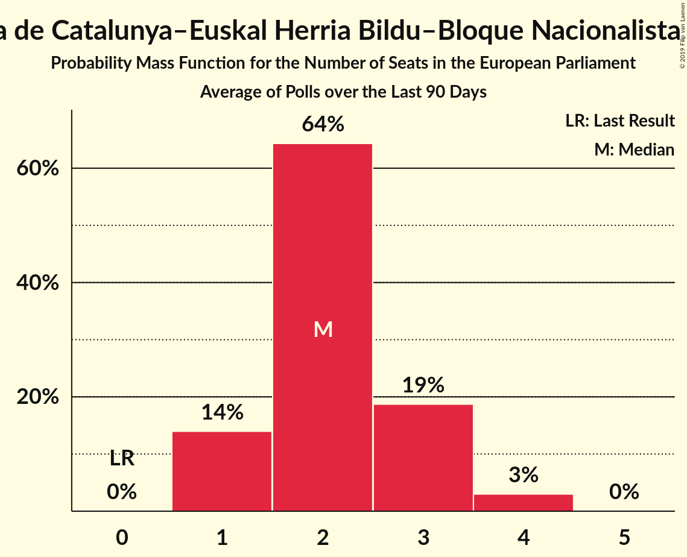

# Esquerra Republicana de Catalunya–Euskal Herria Bildu–Bloque Nacionalista Galego (Greens/EFA)

<a href="#voting-intentions">Voting Intentions</a> | <a href="#seats">Seats</a>

## Voting Intentions

Last result: **0.0%** (General Election of 25 May 2014)

### Confidence Intervals

| Period     | Polling firm/Commissioner(s) | Median | 80% Confidence Interval | 90% Confidence Interval | 95% Confidence Interval | 99% Confidence Interval |
|:----------:|:----------------:|:-----------:|:-----------------------:|:-----------------------:|:-----------------------:|:-----------------------:|
| N/A | [Poll Average](average.html) | 3.8% | 3.0–5.0% | 2.8–5.3% | 2.6–5.5% | 2.3–5.9% |
| [16 December 2018](2018-12-16-SigmaDos.html) | Sigma Dos   Antena 3 | 0.0% | N/A | N/A | N/A | N/A |
| [10–14 December 2018](2018-12-14-SocioMétrica.html) | SocioMétrica   El Español | 3.8% | 3.1–4.7% | 2.9–5.0% | 2.7–5.2% | 2.4–5.7% |
| [3–14 December 2018](2018-12-14-SimpleLógica.html) | Simple Lógica | 0.0% | N/A | N/A | N/A | N/A |
| [5–14 December 2018](2018-12-14-NCReport.html) | NC Report   La Razón | 3.4% | 2.8–4.3% | 2.6–4.5% | 2.4–4.7% | 2.2–5.2% |
| [10–14 December 2018](2018-12-14-GAD3.html) | GAD3   ABC | 3.5% | 2.8–4.3% | 2.7–4.6% | 2.5–4.8% | 2.2–5.3% |
| [10–13 December 2018](2018-12-13-IMOP.html) | IMOP   El Confidencial | 3.9% | 3.2–4.8% | 3.0–5.0% | 2.9–5.2% | 2.6–5.7% |
| [10–12 December 2018](2018-12-12-Metroscopia.html) | Metroscopia   Henneo | 0.0% | N/A | N/A | N/A | N/A |
| [3–11 December 2018](2018-12-11-Celeste-Tel.html) | Celeste-Tel   eldiario.es | 3.7% | 3.1–4.6% | 2.9–4.8% | 2.8–5.0% | 2.5–5.5% |
| [3–7 December 2018](2018-12-07-Invymark.html) | Invymark   laSexta | 0.0% | N/A | N/A | N/A | N/A |
| [3–4 December 2018](2018-12-04-electoPanel.html) | electoPanel   electomania.es | 3.9% | 3.3–4.6% | 3.1–4.8% | 3.0–5.0% | 2.7–5.3% |
| [2–14 November 2018](2018-11-14-SimpleLógica.html) | Simple Lógica | 0.0% | N/A | N/A | N/A | N/A |
| [5–9 November 2018](2018-11-09-NCReport.html) | NC Report   La Razón | 3.6% | 2.9–4.5% | 2.8–4.7% | 2.6–5.0% | 2.3–5.4% |
| [5–9 November 2018](2018-11-09-Celeste-Tel.html) | Celeste-Tel   eldiario.es | 3.7% | 3.1–4.6% | 2.9–4.8% | 2.8–5.0% | 2.5–5.5% |
| [22–30 October 2018](2018-10-30-GESOP.html) | GESOP   El Periódico | 3.3% | 2.7–4.2% | 2.5–4.5% | 2.3–4.7% | 2.0–5.1% |
| [20–26 October 2018](2018-10-26-electoPanel.html) | electoPanel   electomania.es | 4.1% | 3.4–5.1% | 3.2–5.3% | 3.1–5.5% | 2.8–6.0% |
| [16–18 October 2018](2018-10-18-Metroscopia.html) | Metroscopia   Henneo | 0.0% | N/A | N/A | N/A | N/A |
| [1–11 October 2018](2018-10-11-NCReport.html) | NC Report   La Razón | 3.7% | 3.0–4.6% | 2.9–4.8% | 2.7–5.1% | 2.4–5.5% |
| [1–9 October 2018](2018-10-09-CIS.html) | CIS | 5.1% | 4.6–5.7% | 4.5–5.8% | 4.4–6.0% | 4.1–6.2% |
| [1–5 October 2018](2018-10-05-SimpleLógica.html) | Simple Lógica | 0.0% | N/A | N/A | N/A | N/A |
| [1–5 October 2018](2018-10-05-Celeste-Tel.html) | Celeste-Tel   eldiario.es | 4.0% | 3.3–4.9% | 3.1–5.1% | 3.0–5.3% | 2.7–5.8% |
| [2 October 2018](2018-10-02-SimpleLógica.html) | Simple Lógica   eldebate.es | 0.0% | N/A | N/A | N/A | N/A |
| [17–19 September 2018](2018-09-19-Metroscopia.html) | Metroscopia   Henneo | 0.0% | N/A | N/A | N/A | N/A |
| [17–19 September 2018](2018-09-19-InstitutoDYM.html) | Instituto DYM   El Independiente | 0.0% | N/A | N/A | N/A | N/A |
| [6–11 September 2018](2018-09-11-IMOP.html) | IMOP   El Confidencial | 3.5% | 2.8–4.3% | 2.6–4.6% | 2.5–4.8% | 2.2–5.2% |
| [1–11 September 2018](2018-09-11-CIS.html) | CIS | 5.2% | N/A | N/A | N/A | N/A |
| [7–9 September 2018](2018-09-09-electoPanel.html) | electoPanel   electomania.es | 4.1% | 3.4–5.0% | 3.2–5.3% | 3.0–5.5% | 2.7–5.9% |
| [3–7 September 2018](2018-09-07-SimpleLógica.html) | Simple Lógica | 0.0% | N/A | N/A | N/A | N/A |
| [3–7 September 2018](2018-09-07-GAD3.html) | GAD3   ABC | 3.5% | 2.9–4.4% | 2.7–4.6% | 2.5–4.8% | 2.2–5.3% |
| [3–7 September 2018](2018-09-07-Celeste-Tel.html) | Celeste-Tel   eldiario.es | 4.0% | 3.3–4.9% | 3.1–5.1% | 3.0–5.3% | 2.7–5.8% |
| [27–31 August 2018](2018-08-31-NCReport.html) | NC Report   La Razón | 3.8% | 3.1–4.7% | 2.9–5.0% | 2.8–5.2% | 2.5–5.6% |
| [22–30 August 2018](2018-08-30-SocioMétrica.html) | SocioMétrica   El Español | 3.7% | 3.0–4.5% | 2.9–4.7% | 2.7–4.9% | 2.5–5.3% |
| [1–7 August 2018](2018-08-07-Celeste-Tel.html) | Celeste-Tel   eldiario.es | 4.1% | N/A | N/A | N/A | N/A |
| [27 July–3 August 2018](2018-08-03-electoPanel.html) | electoPanel   electomania.es | 4.1% | N/A | N/A | N/A | N/A |
| [1–3 August 2018](2018-08-03-SimpleLógica.html) | Simple Lógica | 0.0% | N/A | N/A | N/A | N/A |
| [23–27 July 2018](2018-07-27-NCReport.html) | NC Report   La Razón | 3.9% | N/A | N/A | N/A | N/A |
| [24–26 July 2018](2018-07-26-GAD3.html) | GAD3   ABC | 3.7% | 3.0–4.7% | 2.8–5.0% | 2.6–5.3% | 2.3–5.8% |
| [16–25 July 2018](2018-07-25-Metroscopia.html) | Metroscopia   Henneo | 0.0% | N/A | N/A | N/A | N/A |
| [22–25 July 2018](2018-07-25-DemoscopiayServicios.html) | Demoscopia y Servicios   OKDIARIO | 3.2% | N/A | N/A | N/A | N/A |
| [17–22 July 2018](2018-07-22-electoPanel.html) | electoPanel   electomania.es | 4.0% | N/A | N/A | N/A | N/A |
| [9–12 July 2018](2018-07-12-SigmaDos.html) | Sigma Dos   El Mundo | 3.2% | N/A | N/A | N/A | N/A |
| [1–10 July 2018](2018-07-10-CIS.html) | CIS | 4.5% | N/A | N/A | N/A | N/A |
| [2–6 July 2018](2018-07-06-SimpleLógica.html) | Simple Lógica | 0.0% | N/A | N/A | N/A | N/A |
| [2–6 July 2018](2018-07-06-Celeste-Tel.html) | Celeste-Tel   eldiario.es | 4.2% | 3.5–5.1% | 3.3–5.3% | 3.1–5.5% | 2.9–6.0% |
| [25–30 June 2018](2018-06-30-NCReport.html) | NC Report   La Razón | 3.9% | 3.2–4.8% | 3.0–5.1% | 2.9–5.3% | 2.6–5.8% |
| [19–22 June 2018](2018-06-22-SocioMétrica.html) | SocioMétrica   El Español | 3.7% | N/A | N/A | N/A | N/A |
| [11–13 June 2018](2018-06-13-GESOP.html) | GESOP   El Periódico | 2.6% | N/A | N/A | N/A | N/A |
| [11–12 June 2018](2018-06-12-InstitutoDYM.html) | Instituto DYM   El Independiente | 0.0% | N/A | N/A | N/A | N/A |
| [1–9 June 2018](2018-06-09-NCReport.html) | NC Report   La Razón | 3.9% | N/A | N/A | N/A | N/A |
| [4–8 June 2018](2018-06-08-SimpleLógica.html) | Simple Lógica | 0.0% | N/A | N/A | N/A | N/A |
| [7–8 June 2018](2018-06-08-GAD3.html) | GAD3   ABC | 4.0% | N/A | N/A | N/A | N/A |
| [4–8 June 2018](2018-06-08-Celeste-Tel.html) | Celeste-Tel   eldiario.es | 4.1% | 3.4–5.0% | 3.2–5.2% | 3.1–5.4% | 2.8–5.9% |
| [26 May–2 June 2018](2018-06-02-electoPanel.html) | electoPanel   electomania.es | 4.7% | N/A | N/A | N/A | N/A |
| [26–28 May 2018](2018-05-28-electoPanel.html) | electoPanel   electomania.es | 4.1% | N/A | N/A | N/A | N/A |
| [23–28 May 2018](2018-05-28-IMOP.html) | IMOP   El Confidencial | 3.1% | N/A | N/A | N/A | N/A |
| [17–26 May 2018](2018-05-26-SocioMétrica.html) | SocioMétrica   El Español | 4.3% | N/A | N/A | N/A | N/A |
| [16–25 May 2018](2018-05-25-NCReport.html) | NC Report   La Razón | 3.7% | N/A | N/A | N/A | N/A |
| [3–10 May 2018](2018-05-10-SimpleLógica.html) | Simple Lógica | 0.0% | N/A | N/A | N/A | N/A |
| [7–9 May 2018](2018-05-09-Metroscopia.html) | Metroscopia   El País | 0.0% | N/A | N/A | N/A | N/A |
| [26–30 April 2018](2018-04-30-Celeste-Tel.html) | Celeste-Tel   PSOE | 4.4% | N/A | N/A | N/A | N/A |
| [12–18 April 2018](2018-04-18-GESOP.html) | GESOP   El Periódico | 3.0% | N/A | N/A | N/A | N/A |
| [9–13 April 2018](2018-04-13-NCReport.html) | NC Report   La Razón | 3.7% | N/A | N/A | N/A | N/A |
| [1–10 April 2018](2018-04-10-CIS.html) | CIS | 3.6% | N/A | N/A | N/A | N/A |
| [2–9 April 2018](2018-04-09-SimpleLógica.html) | Simple Lógica | 0.0% | N/A | N/A | N/A | N/A |
| [2–6 April 2018](2018-04-06-Celeste-Tel.html) | Celeste-Tel   eldiario.es | 4.0% | N/A | N/A | N/A | N/A |
| [4–5 April 2018](2018-04-05-Metroscopia.html) | Metroscopia   El País | 0.0% | N/A | N/A | N/A | N/A |
| [19–29 March 2018](2018-03-29-SocioMétrica.html) | SocioMétrica   El Español | 4.9% | 4.1–5.9% | 3.9–6.2% | 3.7–6.4% | 3.4–6.9% |
| [23–27 March 2018](2018-03-27-SigmaDos.html) | Sigma Dos   El Mundo | 3.3% | N/A | N/A | N/A | N/A |
| [13–16 March 2018](2018-03-16-MyWord.html) | MyWord   Cadena SER | 0.0% | N/A | N/A | N/A | N/A |
| [12–14 March 2018](2018-03-14-GAD3.html) | GAD3   La Vanguardia | 3.5% | N/A | N/A | N/A | N/A |
| [1–7 March 2018](2018-03-07-SimpleLógica.html) | Simple Lógica | 0.0% | N/A | N/A | N/A | N/A |
| [1–7 March 2018](2018-03-07-Celeste-Tel.html) | Celeste-Tel   eldiario.es | 3.7% | 3.1–4.6% | 2.9–4.8% | 2.8–5.0% | 2.5–5.5% |
| [2–5 March 2018](2018-03-05-Metroscopia.html) | Metroscopia   El País | 0.0% | N/A | N/A | N/A | N/A |
| [26 February–2 March 2018](2018-03-02-NCReport.html) | NC Report   La Razón | 3.6% | N/A | N/A | N/A | N/A |
| [22–27 February 2018](2018-02-27-IMOP.html) | IMOP   El Confidencial | 3.8% | N/A | N/A | N/A | N/A |
| [7–14 February 2018](2018-02-14-MyWord.html) | MyWord   Cadena SER | 0.0% | N/A | N/A | N/A | N/A |
| [5–9 February 2018](2018-02-09-Celeste-Tel.html) | Celeste-Tel   eldiario.es | 3.8% | N/A | N/A | N/A | N/A |
| [5–8 February 2018](2018-02-08-Metroscopia.html) | Metroscopia   El País | 0.0% | N/A | N/A | N/A | N/A |
| [1–7 February 2018](2018-02-07-SimpleLógica.html) | Simple Lógica | 0.0% | N/A | N/A | N/A | N/A |
| [31 January–7 February 2018](2018-02-07-GAD3.html) | GAD3   ABC | 3.7% | N/A | N/A | N/A | N/A |

### Probability Mass Function

The following table shows the probability mass function per percentage block of voting intentions for the [poll average](average.html) for Esquerra Republicana de Catalunya–Euskal Herria Bildu–Bloque Nacionalista Galego (Greens/EFA).

| Voting Intentions | Probability | Accumulated | Special Marks |
|:-----------------:|:-----------:|:-----------:|:-------------:|
| 0.0–0.5% | 0% | 100% | Last Result |
| 0.5–1.5% | 0% | 100% |  |
| 1.5–2.5% | 2% | 100% |  |
| 2.5–3.5% | 34% | 98% |  |
| 3.5–4.5% | 45% | 64% | Median |
| 4.5–5.5% | 17% | 20% |  |
| 5.5–6.5% | 2% | 2% |  |
| 6.5–7.5% | 0% | 0% |  |

## Seats

Last result: **0** seats (General Election of 25 May 2014)

### Confidence Intervals

| Period     | Polling firm/Commissioner(s) | Median | 80% Confidence Interval | 90% Confidence Interval | 95% Confidence Interval | 99% Confidence Interval |
|:----------:|:----------------:|:------:|:-----------------------:|:-----------------------:|:-----------------------:|:-----------------------:|
| N/A | [Poll Average](average.html) | 2 | 1–3 | 1–3 | 1–3 | 1–3 |
| [16 December 2018](2018-12-16-SigmaDos.html) | Sigma Dos   Antena 3 |  |  |  |  |  |
| [10–14 December 2018](2018-12-14-SocioMétrica.html) | SocioMétrica   El Español | 2 | 1–2 | 1–3 | 1–3 | 1–3 |
| [3–14 December 2018](2018-12-14-SimpleLógica.html) | Simple Lógica |  |  |  |  |  |
| [5–14 December 2018](2018-12-14-NCReport.html) | NC Report   La Razón | 2 | 1–2 | 1–2 | 1–2 | 1–3 |
| [10–14 December 2018](2018-12-14-GAD3.html) | GAD3   ABC | 2 | 1–2 | 1–2 | 1–3 | 1–3 |
| [10–13 December 2018](2018-12-13-IMOP.html) | IMOP   El Confidencial | 2 | 2 | 1–3 | 1–3 | 1–3 |
| [10–12 December 2018](2018-12-12-Metroscopia.html) | Metroscopia   Henneo |  |  |  |  |  |
| [3–11 December 2018](2018-12-11-Celeste-Tel.html) | Celeste-Tel   eldiario.es | 2 | 1–2 | 1–3 | 1–3 | 1–3 |
| [3–7 December 2018](2018-12-07-Invymark.html) | Invymark   laSexta |  |  |  |  |  |
| [3–4 December 2018](2018-12-04-electoPanel.html) | electoPanel   electomania.es | 2 | 2 | 2–3 | 1–3 | 1–3 |
| [2–14 November 2018](2018-11-14-SimpleLógica.html) | Simple Lógica |  |  |  |  |  |
| [5–9 November 2018](2018-11-09-NCReport.html) | NC Report   La Razón | 2 | 1–2 | 1–2 | 1–3 | 1–3 |
| [5–9 November 2018](2018-11-09-Celeste-Tel.html) | Celeste-Tel   eldiario.es | 2 | 1–3 | 1–3 | 1–3 | 1–3 |
| [22–30 October 2018](2018-10-30-GESOP.html) | GESOP   El Periódico | 2 | 1–2 | 1–2 | 1–2 | 1–3 |
| [20–26 October 2018](2018-10-26-electoPanel.html) | electoPanel   electomania.es | 2 | 2–3 | 2–3 | 1–3 | 1–3 |
| [16–18 October 2018](2018-10-18-Metroscopia.html) | Metroscopia   Henneo |  |  |  |  |  |
| [1–11 October 2018](2018-10-11-NCReport.html) | NC Report   La Razón | 2 | 1–2 | 1–3 | 1–3 | 1–3 |
| [1–9 October 2018](2018-10-09-CIS.html) | CIS | 3 | 2–3 | 2–3 | 2–3 | 2–4 |
| [1–5 October 2018](2018-10-05-SimpleLógica.html) | Simple Lógica |  |  |  |  |  |
| [1–5 October 2018](2018-10-05-Celeste-Tel.html) | Celeste-Tel   eldiario.es | 2 | 2–3 | 2–3 | 1–3 | 1–3 |
| [2 October 2018](2018-10-02-SimpleLógica.html) | Simple Lógica   eldebate.es |  |  |  |  |  |
| [17–19 September 2018](2018-09-19-Metroscopia.html) | Metroscopia   Henneo |  |  |  |  |  |
| [17–19 September 2018](2018-09-19-InstitutoDYM.html) | Instituto DYM   El Independiente |  |  |  |  |  |
| [6–11 September 2018](2018-09-11-IMOP.html) | IMOP   El Confidencial | 2 | 1–2 | 1–2 | 1–3 | 1–3 |
| [1–11 September 2018](2018-09-11-CIS.html) | CIS |  |  |  |  |  |
| [7–9 September 2018](2018-09-09-electoPanel.html) | electoPanel   electomania.es | 2 | 2–3 | 2–3 | 1–3 | 1–3 |
| [3–7 September 2018](2018-09-07-SimpleLógica.html) | Simple Lógica |  |  |  |  |  |
| [3–7 September 2018](2018-09-07-GAD3.html) | GAD3   ABC | 2 | 1–2 | 1–2 | 1–3 | 1–3 |
| [3–7 September 2018](2018-09-07-Celeste-Tel.html) | Celeste-Tel   eldiario.es | 2 | 2–3 | 1–3 | 1–3 | 1–3 |
| [27–31 August 2018](2018-08-31-NCReport.html) | NC Report   La Razón | 2 | 2 | 2–3 | 2–3 | 1–3 |
| [22–30 August 2018](2018-08-30-SocioMétrica.html) | SocioMétrica   El Español | 2 | 1–2 | 1–3 | 1–3 | 1–3 |
| [1–7 August 2018](2018-08-07-Celeste-Tel.html) | Celeste-Tel   eldiario.es |  |  |  |  |  |
| [27 July–3 August 2018](2018-08-03-electoPanel.html) | electoPanel   electomania.es |  |  |  |  |  |
| [1–3 August 2018](2018-08-03-SimpleLógica.html) | Simple Lógica |  |  |  |  |  |
| [23–27 July 2018](2018-07-27-NCReport.html) | NC Report   La Razón |  |  |  |  |  |
| [24–26 July 2018](2018-07-26-GAD3.html) | GAD3   ABC | 2 | 1–2 | 1–3 | 1–3 | 1–3 |
| [16–25 July 2018](2018-07-25-Metroscopia.html) | Metroscopia   Henneo |  |  |  |  |  |
| [22–25 July 2018](2018-07-25-DemoscopiayServicios.html) | Demoscopia y Servicios   OKDIARIO |  |  |  |  |  |
| [17–22 July 2018](2018-07-22-electoPanel.html) | electoPanel   electomania.es |  |  |  |  |  |
| [9–12 July 2018](2018-07-12-SigmaDos.html) | Sigma Dos   El Mundo |  |  |  |  |  |
| [1–10 July 2018](2018-07-10-CIS.html) | CIS |  |  |  |  |  |
| [2–6 July 2018](2018-07-06-SimpleLógica.html) | Simple Lógica |  |  |  |  |  |
| [2–6 July 2018](2018-07-06-Celeste-Tel.html) | Celeste-Tel   eldiario.es | 2 | 2–3 | 2–3 | 2–3 | 1–3 |
| [25–30 June 2018](2018-06-30-NCReport.html) | NC Report   La Razón | 2 | 2–3 | 1–3 | 1–3 | 1–3 |
| [19–22 June 2018](2018-06-22-SocioMétrica.html) | SocioMétrica   El Español |  |  |  |  |  |
| [11–13 June 2018](2018-06-13-GESOP.html) | GESOP   El Periódico |  |  |  |  |  |
| [11–12 June 2018](2018-06-12-InstitutoDYM.html) | Instituto DYM   El Independiente |  |  |  |  |  |
| [1–9 June 2018](2018-06-09-NCReport.html) | NC Report   La Razón |  |  |  |  |  |
| [4–8 June 2018](2018-06-08-SimpleLógica.html) | Simple Lógica |  |  |  |  |  |
| [7–8 June 2018](2018-06-08-GAD3.html) | GAD3   ABC |  |  |  |  |  |
| [4–8 June 2018](2018-06-08-Celeste-Tel.html) | Celeste-Tel   eldiario.es | 2 | 2–3 | 2–3 | 1–3 | 1–3 |
| [26 May–2 June 2018](2018-06-02-electoPanel.html) | electoPanel   electomania.es |  |  |  |  |  |
| [26–28 May 2018](2018-05-28-electoPanel.html) | electoPanel   electomania.es |  |  |  |  |  |
| [23–28 May 2018](2018-05-28-IMOP.html) | IMOP   El Confidencial |  |  |  |  |  |
| [17–26 May 2018](2018-05-26-SocioMétrica.html) | SocioMétrica   El Español |  |  |  |  |  |
| [16–25 May 2018](2018-05-25-NCReport.html) | NC Report   La Razón |  |  |  |  |  |
| [3–10 May 2018](2018-05-10-SimpleLógica.html) | Simple Lógica |  |  |  |  |  |
| [7–9 May 2018](2018-05-09-Metroscopia.html) | Metroscopia   El País |  |  |  |  |  |
| [26–30 April 2018](2018-04-30-Celeste-Tel.html) | Celeste-Tel   PSOE |  |  |  |  |  |
| [12–18 April 2018](2018-04-18-GESOP.html) | GESOP   El Periódico |  |  |  |  |  |
| [9–13 April 2018](2018-04-13-NCReport.html) | NC Report   La Razón |  |  |  |  |  |
| [1–10 April 2018](2018-04-10-CIS.html) | CIS |  |  |  |  |  |
| [2–9 April 2018](2018-04-09-SimpleLógica.html) | Simple Lógica |  |  |  |  |  |
| [2–6 April 2018](2018-04-06-Celeste-Tel.html) | Celeste-Tel   eldiario.es |  |  |  |  |  |
| [4–5 April 2018](2018-04-05-Metroscopia.html) | Metroscopia   El País |  |  |  |  |  |
| [19–29 March 2018](2018-03-29-SocioMétrica.html) | SocioMétrica   El Español | 3 | 2–3 | 2–3 | 2–4 | 2–4 |
| [23–27 March 2018](2018-03-27-SigmaDos.html) | Sigma Dos   El Mundo |  |  |  |  |  |
| [13–16 March 2018](2018-03-16-MyWord.html) | MyWord   Cadena SER |  |  |  |  |  |
| [12–14 March 2018](2018-03-14-GAD3.html) | GAD3   La Vanguardia |  |  |  |  |  |
| [1–7 March 2018](2018-03-07-SimpleLógica.html) | Simple Lógica |  |  |  |  |  |
| [1–7 March 2018](2018-03-07-Celeste-Tel.html) | Celeste-Tel   eldiario.es | 2 | 1–2 | 1–3 | 1–3 | 1–3 |
| [2–5 March 2018](2018-03-05-Metroscopia.html) | Metroscopia   El País |  |  |  |  |  |
| [26 February–2 March 2018](2018-03-02-NCReport.html) | NC Report   La Razón |  |  |  |  |  |
| [22–27 February 2018](2018-02-27-IMOP.html) | IMOP   El Confidencial |  |  |  |  |  |
| [7–14 February 2018](2018-02-14-MyWord.html) | MyWord   Cadena SER |  |  |  |  |  |
| [5–9 February 2018](2018-02-09-Celeste-Tel.html) | Celeste-Tel   eldiario.es |  |  |  |  |  |
| [5–8 February 2018](2018-02-08-Metroscopia.html) | Metroscopia   El País |  |  |  |  |  |
| [1–7 February 2018](2018-02-07-SimpleLógica.html) | Simple Lógica |  |  |  |  |  |
| [31 January–7 February 2018](2018-02-07-GAD3.html) | GAD3   ABC |  |  |  |  |  |

### Probability Mass Function

The following table shows the probability mass function per seat for the [poll average](average.html) for Esquerra Republicana de Catalunya–Euskal Herria Bildu–Bloque Nacionalista Galego (Greens/EFA).

| Number of Seats | Probability | Accumulated | Special Marks |
|:---------------:|:-----------:|:-----------:|:-------------:|
| 0 | 0% | 100% | Last Result |
| 1 | 17% | 100% |  |
| 2 | 67% | 83% | Median |
| 3 | 16% | 16% |  |
| 4 | 0.2% | 0.2% |  |
| 5 | 0% | 0% |  |

