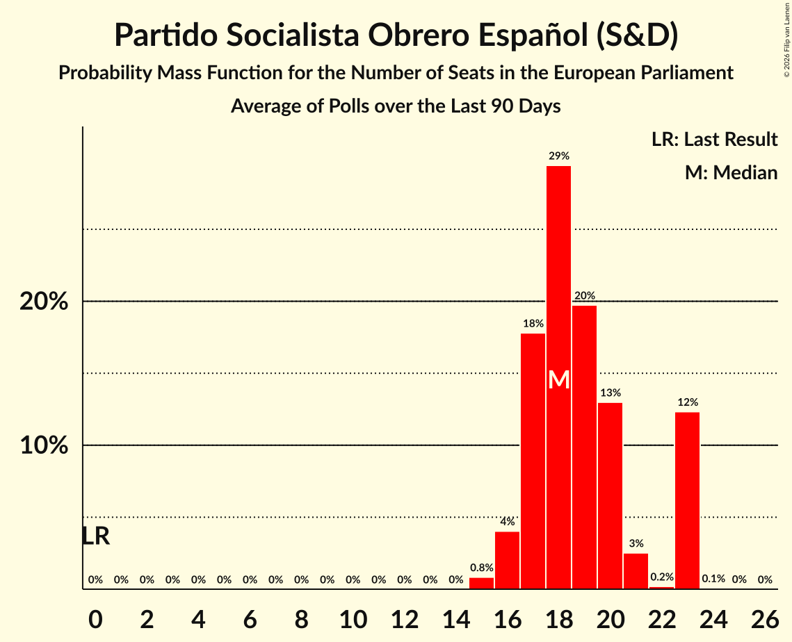

# Partido Socialista Obrero Español (S&D)

<a href="#voting-intentions">Voting Intentions</a> | <a href="#seats">Seats</a>

## Voting Intentions

Last result: **0.0%** (General Election of 9 June 2024)

### Confidence Intervals

| Period     | Polling firm/Commissioner(s) | Median | 80% Confidence Interval | 90% Confidence Interval | 95% Confidence Interval | 99% Confidence Interval |
|:----------:|:----------------:|:-----------:|:-----------------------:|:-----------------------:|:-----------------------:|:-----------------------:|
| N/A | [Poll Average](average.html) | 26.6% | 24.5–31.2% | 23.9–32.0% | 23.4–32.4% | 22.5–33.1% |
| [2–6 March 2026](2026-03-06-CIS.html) | CIS | 31.8% | 30.9–32.8% | 30.6–33.0% | 30.4–33.3% | 29.9–33.7% |
| [23–27 February 2026](2026-02-27-SigmaDos.html) | Sigma Dos   El Mundo | 26.4% | 25.2–27.7% | 24.8–28.1% | 24.5–28.4% | 23.9–29.0% |
| [20–23 February 2026](2026-02-23-40dB.html) | 40dB   Prisa | 27.7% | 26.4–29.0% | 26.1–29.4% | 25.8–29.7% | 25.2–30.3% |
| [18–22 February 2026](2026-02-22-AteneodelDato.html) | Ateneo del Dato   elDiario.es | 27.0% | 25.7–28.3% | 25.4–28.7% | 25.1–29.0% | 24.5–29.6% |
| [17–19 February 2026](2026-02-19-TargetPoint.html) | Target Point   El Debate | 25.8% | 24.1–27.6% | 23.6–28.1% | 23.2–28.6% | 22.4–29.5% |
| [11–13 February 2026](2026-02-13-SocioMétrica.html) | SocioMétrica   El Español | 25.0% | 23.4–26.7% | 23.0–27.1% | 22.6–27.5% | 21.9–28.3% |
| [10–13 February 2026](2026-02-13-NCReport.html) | NC Report   La Razón | 25.9% | 24.2–27.7% | 23.7–28.3% | 23.3–28.7% | 22.5–29.6% |
| [10 February 2026](2026-02-10-Data10.html) | Data10   Okdiario | 26.0% | 24.3–27.8% | 23.8–28.4% | 23.4–28.8% | 22.6–29.7% |
| [2–6 February 2026](2026-02-06-CIS.html) | CIS | 32.6% | 31.7–33.6% | 31.4–33.8% | 31.2–34.1% | 30.7–34.5% |
| [30 January–2 February 2026](2026-02-02-40dB.html) | 40dB   Prisa | 27.7% | 26.4–29.0% | 26.1–29.4% | 25.8–29.7% | 25.2–30.3% |
| [26–30 January 2026](2026-01-30-SigmaDos.html) | Sigma Dos   El Mundo | 26.1% | 24.8–27.5% | 24.4–27.9% | 24.1–28.2% | 23.5–28.9% |
| [22–25 January 2026](2026-01-25-DYM.html) | DYM   Henneo | 27.0% | 25.3–28.9% | 24.8–29.4% | 24.4–29.9% | 23.5–30.8% |
| [14–18 January 2026](2026-01-18-DYM.html) | DYM   Henneo | 27.1% | N/A | N/A | N/A | N/A |
| [13–15 January 2026](2026-01-15-TargetPoint.html) | Target Point   El Debate | 26.1% | 24.4–27.9% | 23.9–28.5% | 23.5–28.9% | 22.7–29.8% |
| [12–15 January 2026](2026-01-15-GESOP.html) | GESOP   Prensa Ibérica | 26.5% | 24.8–28.4% | 24.3–28.9% | 23.9–29.4% | 23.1–30.3% |
| [7–10 January 2026](2026-01-10-SocioMétrica.html) | SocioMétrica   El Español | 25.7% | 24.2–27.3% | 23.7–27.8% | 23.4–28.2% | 22.7–28.9% |
| [5–10 January 2026](2026-01-10-CIS.html) | CIS | 31.7% | 30.8–32.7% | 30.5–32.9% | 30.3–33.2% | 29.8–33.6% |
| [5–9 January 2026](2026-01-09-NCReport.html) | NC Report   La Razón | 26.3% | 24.6–28.2% | 24.1–28.7% | 23.7–29.1% | 22.8–30.0% |
| [29 December 2025–5 January 2026](2026-01-05-40dB.html) | 40dB   Prisa | 27.1% | 25.8–28.4% | 25.5–28.8% | 25.2–29.1% | 24.6–29.7% |
| [22–29 December 2025](2025-12-29-SigmaDos.html) | Sigma Dos   El Mundo | 26.5% | 25.3–27.7% | 25.0–28.1% | 24.7–28.4% | 24.1–29.0% |
| [15 December 2025](2025-12-15-Invymark.html) | Invymark   laSexta | 27.4% | 25.7–29.1% | 25.2–29.6% | 24.8–30.1% | 24.0–30.9% |
| [5–7 December 2025](2025-12-07-SocioMétrica.html) | SocioMétrica   El Español | 26.2% | 24.5–27.9% | 24.1–28.4% | 23.7–28.9% | 22.9–29.7% |
| [26 November–5 December 2025](2025-12-05-SigmaDos.html) | Sigma Dos   El Mundo | 27.4% | 26.0–28.9% | 25.6–29.3% | 25.3–29.7% | 24.6–30.4% |
| [1–5 December 2025](2025-12-05-CIS.html) | CIS | 31.4% | 30.5–32.3% | 30.2–32.6% | 30.0–32.8% | 29.5–33.3% |
| [1 December 2025](2025-12-01-Invymark.html) | Invymark   laSexta | 27.6% | 26.0–29.4% | 25.5–29.9% | 25.1–30.4% | 24.3–31.2% |
| [27 November–1 December 2025](2025-12-01-40dB.html) | 40dB   Prisa | 27.8% | 26.7–29.0% | 26.4–29.3% | 26.1–29.6% | 25.5–30.2% |
| [17–19 November 2025](2025-11-19-TargetPoint.html) | Target Point   El Debate | 28.1% | 26.5–29.8% | 26.0–30.3% | 25.6–30.7% | 24.8–31.5% |
| [17 November 2025](2025-11-17-Invymark.html) | Invymark   laSexta | 28.6% | 26.9–30.4% | 26.4–30.9% | 26.0–31.4% | 25.2–32.3% |
| [11–14 November 2025](2025-11-14-NCReport.html) | NC Report   La Razón | 27.2% | 25.4–29.1% | 25.0–29.6% | 24.5–30.1% | 23.7–31.0% |
| [12–14 November 2025](2025-11-14-DYM.html) | DYM   Henneo | 27.3% | 25.5–29.2% | 25.0–29.7% | 24.6–30.1% | 23.8–31.1% |
| [3–12 November 2025](2025-11-12-CIS.html) | CIS | 32.6% | 31.7–33.6% | 31.4–33.8% | 31.2–34.1% | 30.7–34.5% |
| [6–8 November 2025](2025-11-08-SocioMétrica.html) | SocioMétrica   El Español | 27.2% | 25.5–29.0% | 25.0–29.5% | 24.6–29.9% | 23.8–30.8% |
| [30 October–6 November 2025](2025-11-06-SigmaDos.html) | Sigma Dos   El Mundo | 27.4% | 26.0–28.9% | 25.6–29.3% | 25.2–29.7% | 24.6–30.4% |
| [4–6 November 2025](2025-11-06-Cluster17.html) | Cluster17   Agenda Pública | 28.4% | 27.1–29.8% | 26.7–30.2% | 26.4–30.5% | 25.8–31.2% |
| [31 October–4 November 2025](2025-11-04-Opina360.html) | Opina 360   Telecinco | 28.1% | 26.5–29.8% | 26.0–30.3% | 25.7–30.7% | 24.9–31.6% |
| [28 October–4 November 2025](2025-11-04-HamalgamaMétrica.html) | Hamalgama Métrica   Vozpópuli | 26.5% | 24.8–28.3% | 24.3–28.9% | 23.9–29.3% | 23.0–30.2% |
| [24–26 October 2025](2025-10-26-40dB.html) | 40dB   Prisa | 28.3% | 27.0–29.6% | 26.7–30.0% | 26.4–30.3% | 25.8–31.0% |
| [6–10 October 2025](2025-10-10-SocioMétrica.html) | SocioMétrica   El Español | 26.9% | 25.1–28.9% | 24.5–29.4% | 24.1–29.9% | 23.2–30.8% |
| [3–9 October 2025](2025-10-09-GESOP.html) | GESOP   Prensa Ibérica | 27.8% | 26.0–29.7% | 25.5–30.2% | 25.1–30.7% | 24.3–31.6% |
| [1–7 October 2025](2025-10-07-CIS.html) | CIS | 34.8% | 33.8–35.8% | 33.6–36.0% | 33.3–36.3% | 32.9–36.8% |
| [1–4 October 2025](2025-10-04-NCReport.html) | NC Report   La Razón | 26.6% | 24.9–28.5% | 24.4–29.0% | 23.9–29.4% | 23.1–30.3% |
| [17 September–1 October 2025](2025-10-01-SigmaDos.html) | Sigma Dos   El Mundo | 27.2% | 26.0–28.4% | 25.7–28.8% | 25.4–29.1% | 24.9–29.6% |
| [25–30 September 2025](2025-09-30-Opina360.html) | Opina 360   Antena 3 | 30.4% | 28.8–32.2% | 28.3–32.7% | 27.9–33.1% | 27.1–33.9% |
| [26–28 September 2025](2025-09-28-40dB.html) | 40dB   Prisa | 29.4% | 28.1–30.7% | 27.8–31.1% | 27.4–31.4% | 26.8–32.1% |
| [15–19 September 2025](2025-09-19-Invymark.html) | Invymark   laSexta | 28.3% | 26.6–30.1% | 26.1–30.6% | 25.7–31.0% | 24.9–31.9% |
| [10–15 September 2025](2025-09-15-DYM.html) | DYM   Henneo | 26.9% | 25.1–28.7% | 24.6–29.2% | 24.2–29.7% | 23.4–30.6% |
| [8–12 September 2025](2025-09-12-Celeste-Tel.html) | Celeste-Tel   Onda Cero | 26.1% | 24.4–27.8% | 24.0–28.3% | 23.6–28.8% | 22.8–29.6% |
| [10–11 September 2025](2025-09-11-TargetPoint.html) | Target Point   El Debate | 27.0% | 25.2–28.8% | 24.8–29.3% | 24.3–29.8% | 23.5–30.7% |
| [5–11 September 2025](2025-09-11-GAD3.html) | GAD3   ABC | 26.9% | 25.1–28.7% | 24.6–29.2% | 24.2–29.7% | 23.4–30.6% |
| [3–9 September 2025](2025-09-09-HamalgamaMétrica.html) | Hamalgama Métrica   Vozpópuli | 25.8% | 24.1–27.6% | 23.6–28.2% | 23.2–28.6% | 22.4–29.5% |
| [1–6 September 2025](2025-09-06-NCReport.html) | NC Report   La Razón | 25.8% | 24.1–27.6% | 23.6–28.2% | 23.2–28.6% | 22.4–29.5% |
| [1–6 September 2025](2025-09-06-CIS.html) | CIS | 32.7% | 31.8–33.7% | 31.5–33.9% | 31.3–34.2% | 30.8–34.6% |
| [2–5 September 2025](2025-09-05-DemoscopiayServicios.html) | Demoscopia y Servicios   esRadio | 26.6% | 25.6–27.7% | 25.3–28.0% | 25.0–28.2% | 24.6–28.7% |
| [29 August–1 September 2025](2025-09-01-40dB.html) | 40dB   Prisa | 27.7% | 26.4–29.0% | 26.1–29.4% | 25.8–29.7% | 25.2–30.3% |
| [26–29 August 2025](2025-08-29-SocioMétrica.html) | SocioMétrica   El Español | 26.2% | 24.5–27.9% | 24.1–28.4% | 23.7–28.9% | 22.9–29.7% |
| [20–28 August 2025](2025-08-28-SigmaDos.html) | Sigma Dos   El Mundo | 27.0% | 25.7–28.4% | 25.3–28.7% | 25.0–29.1% | 24.3–29.8% |
| [21–30 July 2025](2025-07-30-SigmaDos.html) | Sigma Dos   El Mundo | 26.7% | 25.5–27.9% | 25.2–28.3% | 24.9–28.5% | 24.3–29.1% |
| [21–24 July 2025](2025-07-24-SocioMétrica.html) | SocioMétrica   El Español | 25.0% | 23.4–26.7% | 22.9–27.2% | 22.5–27.6% | 21.8–28.5% |
| [14–18 July 2025](2025-07-18-HamalgamaMétrica.html) | Hamalgama Métrica   Vozpópuli | 25.4% | 23.7–27.2% | 23.2–27.7% | 22.8–28.2% | 22.0–29.1% |
| [11–14 July 2025](2025-07-14-DYM.html) | DYM   Henneo | 26.1% | 24.4–27.9% | 23.9–28.5% | 23.5–28.9% | 22.7–29.8% |
| [10–14 July 2025](2025-07-14-Celeste-Tel.html) | Celeste-Tel   Onda Cero | 25.6% | 24.0–27.4% | 23.5–27.9% | 23.1–28.3% | 22.4–29.2% |
| [9–10 July 2025](2025-07-10-TargetPoint.html) | Target Point   El Debate | 26.0% | 24.3–27.9% | 23.8–28.4% | 23.4–28.9% | 22.6–29.8% |
| [1–7 July 2025](2025-07-07-CIS.html) | CIS | 27.0% | 26.1–27.9% | 25.9–28.2% | 25.7–28.4% | 25.2–28.9% |
| [30 June–4 July 2025](2025-07-04-Invymark.html) | Invymark   laSexta | 29.2% | 26.1–32.9% | 25.2–33.9% | 24.5–34.7% | 23.0–36.5% |
| [27–30 June 2025](2025-06-30-40dB.html) | 40dB   Prisa | 27.0% | 25.7–28.3% | 25.4–28.7% | 25.1–29.0% | 24.5–29.6% |
| [20–27 June 2025](2025-06-27-SigmaDos.html) | Sigma Dos   El Mundo | 26.8% | 25.5–28.2% | 25.2–28.5% | 24.9–28.9% | 24.3–29.5% |
| [18–21 June 2025](2025-06-21-SocioMétrica.html) | SocioMétrica   El Español | 26.7% | 25.1–28.4% | 24.6–28.9% | 24.2–29.3% | 23.5–30.2% |
| [19–21 June 2025](2025-06-21-NCReport.html) | NC Report   La Razón | 25.5% | 23.8–27.3% | 23.3–27.8% | 22.9–28.3% | 22.1–29.2% |
| [18–20 June 2025](2025-06-20-TargetPoint.html) | Target Point   El Debate | 26.3% | 24.6–28.2% | 24.1–28.7% | 23.7–29.1% | 22.8–30.0% |
| [16–20 June 2025](2025-06-20-Invymark.html) | Invymark   laSexta | 29.3% | 26.1–32.9% | 25.2–33.9% | 24.5–34.7% | 23.0–36.5% |
| [17 June 2025](2025-06-17-DYM.html) | DYM   Henneo | 26.1% | 24.4–27.9% | 23.9–28.4% | 23.5–28.9% | 22.7–29.7% |
| [9–13 June 2025](2025-06-13-Invymark.html) | Invymark   laSexta | 30.2% | N/A | N/A | N/A | N/A |
| [10–12 June 2025](2025-06-12-GESOP.html) | GESOP   Prensa Ibérica | 27.0% | 25.3–28.9% | 24.8–29.4% | 24.4–29.9% | 23.6–30.8% |
| [2–7 June 2025](2025-06-07-CIS.html) | CIS | 34.3% | 33.3–35.3% | 33.1–35.5% | 32.8–35.8% | 32.4–36.2% |
| [27–29 May 2025](2025-05-29-GAD3.html) | GAD3   ABC | 27.6% | 25.8–29.4% | 25.3–29.9% | 24.9–30.4% | 24.1–31.3% |
| [21 April–28 May 2025](2025-05-28-SigmaDos.html) | Sigma Dos   El Mundo | 28.4% | 27.7–29.1% | 27.5–29.3% | 27.4–29.5% | 27.0–29.8% |
| [23–26 May 2025](2025-05-26-40dB.html) | 40dB   Prisa | 29.8% | 28.5–31.1% | 28.1–31.5% | 27.8–31.9% | 27.2–32.5% |
| [23–25 May 2025](2025-05-25-40dB.html) | 40dB   Prisa | 29.8% | 28.5–31.1% | 28.1–31.5% | 27.8–31.9% | 27.2–32.5% |
| [21–23 May 2025](2025-05-23-TargetPoint.html) | Target Point   El Debate | 28.8% | 27.1–30.7% | 26.6–31.3% | 26.1–31.7% | 25.3–32.6% |
| [20–23 May 2025](2025-05-23-HamalgamaMétrica.html) | Hamalgama Métrica   Vozpópuli | 27.6% | 25.8–29.5% | 25.3–30.0% | 24.9–30.5% | 24.1–31.4% |
| [19–22 May 2025](2025-05-22-SocioMétrica.html) | SocioMétrica   El Español | 29.0% | 27.6–30.4% | 27.3–30.8% | 26.9–31.1% | 26.3–31.8% |
| [15–21 May 2025](2025-05-21-Ipsos.html) | Ipsos   La Vanguardia | 30.4% | 29.1–31.7% | 28.7–32.1% | 28.4–32.5% | 27.8–33.1% |
| [14–19 May 2025](2025-05-19-DYM.html) | DYM   Henneo | 28.7% | 26.9–30.5% | 26.4–31.0% | 26.0–31.5% | 25.2–32.4% |
| [5–8 May 2025](2025-05-08-CIS.html) | CIS | 32.0% | 31.1–33.0% | 30.8–33.2% | 30.6–33.5% | 30.1–33.9% |
| [28 April–6 May 2025](2025-05-06-Celeste-Tel.html) | Celeste-Tel   Onda Cero | 28.4% | 26.7–30.2% | 26.2–30.7% | 25.8–31.1% | 25.0–32.0% |
| [24–27 April 2025](2025-04-27-40dB.html) | 40dB   Prisa | 29.3% | 28.0–30.6% | 27.6–31.0% | 27.3–31.3% | 26.7–32.0% |
| [23–25 April 2025](2025-04-25-TargetPoint.html) | Target Point   El Debate | 28.1% | 26.3–29.9% | 25.8–30.4% | 25.4–30.9% | 24.5–31.8% |
| [21–25 April 2025](2025-04-25-SocioMétrica.html) | SocioMétrica   El Español | 29.5% | 27.7–31.4% | 27.2–31.9% | 26.7–32.4% | 25.9–33.3% |
| [14–17 April 2025](2025-04-17-NCReport.html) | NC Report   La Razón | 28.6% | 26.8–30.5% | 26.3–31.0% | 25.9–31.5% | 25.0–32.4% |
| [4–15 April 2025](2025-04-15-SigmaDos.html) | Sigma Dos   El Mundo | 27.9% | 26.6–29.3% | 26.2–29.7% | 25.9–30.0% | 25.3–30.7% |
| [9–15 April 2025](2025-04-15-HamalgamaMétrica.html) | Hamalgama Métrica   Vozpópuli | 27.8% | 26.0–29.7% | 25.5–30.2% | 25.1–30.7% | 24.3–31.6% |
| [1–8 April 2025](2025-04-08-CIS.html) | CIS | 32.6% | 31.7–33.6% | 31.4–33.8% | 31.2–34.1% | 30.7–34.5% |
| [28–31 March 2025](2025-03-31-40dB.html) | 40dB   Prisa | 29.5% | 28.2–30.8% | 27.8–31.2% | 27.5–31.6% | 26.9–32.2% |
| [27–28 March 2025](2025-03-28-Data10.html) | Data10   OKDiario | 28.6% | 27.1–30.1% | 26.7–30.6% | 26.4–30.9% | 25.7–31.7% |
| [19–21 March 2025](2025-03-21-TargetPoint.html) | Target Point   El Debate | 30.2% | 28.4–32.1% | 27.9–32.6% | 27.4–33.1% | 26.6–34.0% |
| [19–21 March 2025](2025-03-21-SocioMétrica.html) | SocioMétrica   El Español | 28.3% | 27.0–29.7% | 26.7–30.1% | 26.3–30.4% | 25.7–31.0% |
| [14–21 March 2025](2025-03-21-Celeste-Tel.html) | Celeste-Tel   Onda Cero | 28.0% | 26.3–29.8% | 25.8–30.3% | 25.4–30.7% | 24.6–31.6% |
| [12–16 March 2025](2025-03-16-DYM.html) | DYM   Henneo | 29.1% | 27.3–31.0% | 26.8–31.5% | 26.3–32.0% | 25.5–32.9% |
| [24 February–7 March 2025](2025-03-07-SigmaDos.html) | Sigma Dos   El Mundo | 27.8% | 26.7–28.9% | 26.4–29.2% | 26.2–29.5% | 25.7–30.0% |
| [3–7 March 2025](2025-03-07-NCReport.html) | NC Report   La Razón | 28.5% | 27.1–30.1% | 26.7–30.5% | 26.3–30.9% | 25.6–31.6% |
| [28 February–7 March 2025](2025-03-07-CIS.html) | CIS | 35.9% | 34.9–36.9% | 34.6–37.1% | 34.4–37.4% | 34.0–37.9% |
| [3–6 March 2025](2025-03-06-GESOP.html) | GESOP   Prensa Ibérica | 27.0% | 25.3–28.9% | 24.8–29.4% | 24.3–29.8% | 23.5–30.7% |
| [24–28 February 2025](2025-02-28-HamalgamaMétrica.html) | Hamalgama Métrica   VozPópuli | 27.5% | 25.7–29.4% | 25.2–29.9% | 24.8–30.4% | 24.0–31.3% |
| [21–24 February 2025](2025-02-24-40dB.html) | 40dB   Prisa | 29.6% | 28.3–30.9% | 28.0–31.3% | 27.6–31.6% | 27.0–32.3% |
| [19–21 February 2025](2025-02-21-TargetPoint.html) | Target Point   El Debate | 29.9% | 28.1–31.8% | 27.6–32.3% | 27.1–32.8% | 26.3–33.7% |
| [12–17 February 2025](2025-02-17-Celeste-Tel.html) | Celeste-Tel   Onda Cero | 27.9% | 26.2–29.7% | 25.7–30.2% | 25.3–30.6% | 24.5–31.5% |
| [12–14 February 2025](2025-02-14-SocioMétrica.html) | SocioMétrica   El Español | 27.8% | 26.5–29.2% | 26.1–29.6% | 25.8–29.9% | 25.2–30.6% |
| [4–7 February 2025](2025-02-07-NCReport.html) | NC Report   La Razón | 27.9% | 26.1–29.8% | 25.6–30.3% | 25.2–30.8% | 24.4–31.7% |
| [31 January–6 February 2025](2025-02-06-CIS.html) | CIS | 33.4% | 32.4–34.4% | 32.2–34.6% | 32.0–34.9% | 31.5–35.3% |
| [24–31 January 2025](2025-01-31-SigmaDos.html) | Sigma Dos   El Mundo | 27.6% | 26.4–28.8% | 26.1–29.2% | 25.8–29.5% | 25.3–30.1% |
| [28–31 January 2025](2025-01-31-HamalgamaMétrica.html) | Hamalgama Métrica   VozPópuli | 27.8% | 26.0–29.7% | 25.5–30.2% | 25.1–30.7% | 24.3–31.6% |
| [24–27 January 2025](2025-01-27-40dB.html) | 40dB   Prisa | 28.4% | 27.1–29.7% | 26.8–30.1% | 26.5–30.4% | 25.9–31.1% |
| [22–24 January 2025](2025-01-24-TargetPoint.html) | Target Point   El Debate | 28.9% | 27.1–30.8% | 26.6–31.3% | 26.1–31.8% | 25.3–32.7% |
| [16–23 January 2025](2025-01-23-GAD3.html) | GAD3   ABC | 27.3% | 25.6–29.2% | 25.1–29.7% | 24.7–30.1% | 23.9–31.0% |
| [16–20 January 2025](2025-01-20-DYM.html) | DYM   Henneo | 28.8% | 27.0–30.7% | 26.5–31.2% | 26.1–31.7% | 25.3–32.6% |
| [7–11 January 2025](2025-01-11-Celeste-Tel.html) | Celeste-Tel   Onda Cero | 28.1% | 26.4–29.9% | 25.9–30.4% | 25.5–30.8% | 24.7–31.7% |
| [31 December 2024–3 January 2025](2025-01-03-HamalgamaMétrica.html) | Hamalgama Métrica   VozPópuli | 28.3% | 26.5–30.2% | 26.0–30.7% | 25.6–31.2% | 24.8–32.1% |
| [26–30 December 2024](2024-12-30-TargetPoint.html) | Target Point   El Debate | 28.5% | 26.8–30.4% | 26.3–31.0% | 25.8–31.4% | 25.0–32.3% |
| [26–30 December 2024](2024-12-30-SocioMétrica.html) | SocioMétrica   El Español | 28.3% | 27.3–29.4% | 27.0–29.7% | 26.7–30.0% | 26.2–30.5% |
| [20–27 December 2024](2024-12-27-NCReport.html) | NC Report   La Razón | 28.0% | 26.2–29.9% | 25.7–30.4% | 25.3–30.9% | 24.5–31.8% |
| [13–26 December 2024](2024-12-26-SigmaDos.html) | Sigma Dos   El Mundo | 27.1% | 26.0–28.3% | 25.6–28.6% | 25.4–28.9% | 24.8–29.4% |
| [20–26 December 2024](2024-12-26-40dB.html) | 40dB   Prisa | 29.5% | 28.2–30.8% | 27.8–31.2% | 27.5–31.6% | 26.9–32.2% |
| [10–12 December 2024](2024-12-12-HamalgamaMétrica.html) | Hamalgama Métrica   VozPópuli | 28.1% | 26.3–30.0% | 25.8–30.5% | 25.4–31.0% | 24.6–31.9% |
| [5–11 December 2024](2024-12-11-Sondaxe.html) | Sondaxe   La Voz de Galicia | 28.2% | 26.5–29.9% | 26.0–30.5% | 25.6–30.9% | 24.8–31.8% |
| [25 November–4 December 2024](2024-12-04-SigmaDos.html) | Sigma Dos   El Mundo | 27.4% | 26.2–28.7% | 25.8–29.1% | 25.5–29.4% | 24.9–30.0% |
| [2–4 December 2024](2024-12-04-GESOP.html) | GESOP   Prensa Ibérica | 28.3% | 26.5–30.1% | 26.0–30.7% | 25.6–31.2% | 24.7–32.1% |
| [25–29 November 2024](2024-11-29-NCReport.html) | NC Report   La Razón | 28.4% | 26.6–30.3% | 26.1–30.8% | 25.7–31.3% | 24.8–32.2% |
| [25–27 November 2024](2024-11-27-40dB.html) | 40dB   Prisa | 29.9% | 28.6–31.2% | 28.2–31.6% | 27.9–31.9% | 27.3–32.6% |
| [22–24 November 2024](2024-11-24-SocioMétrica.html) | SocioMétrica   El Español | 26.7% | 25.1–28.4% | 24.7–28.9% | 24.3–29.3% | 23.6–30.1% |
| [20–22 November 2024](2024-11-22-TargetPoint.html) | Target Point   El Debate | 28.3% | 26.7–30.0% | 26.3–30.4% | 25.9–30.8% | 25.2–31.6% |
| [18–22 November 2024](2024-11-22-Ipsos.html) | Ipsos   La Vanguardia | 28.4% | 26.8–30.2% | 26.3–30.7% | 25.9–31.1% | 25.1–31.9% |
| [7–15 November 2024](2024-11-15-Celeste-Tel.html) | Celeste-Tel   Onda Cero | 28.7% | 27.0–30.5% | 26.5–31.0% | 26.1–31.5% | 25.3–32.4% |
| [11–14 November 2024](2024-11-14-GAD3.html) | GAD3   Mediaset | 27.7% | 26.0–29.5% | 25.5–30.1% | 25.1–30.5% | 24.2–31.4% |
| [8–11 November 2024](2024-11-11-DYM.html) | DYM   Henneo | 28.2% | 26.4–30.0% | 25.9–30.6% | 25.5–31.0% | 24.7–31.9% |
| [5–8 November 2024](2024-11-08-HamalgamaMétrica.html) | Hamalgama Métrica   VozPópuli | 28.5% | 26.7–30.4% | 26.2–30.9% | 25.8–31.4% | 25.0–32.3% |
| [24–31 October 2024](2024-10-31-SigmaDos.html) | Sigma Dos   El Mundo | 28.2% | 26.8–29.6% | 26.5–30.0% | 26.2–30.3% | 25.5–31.0% |
| [21–24 October 2024](2024-10-24-GAD3.html) | GAD3   ABC | 28.2% | 26.4–30.1% | 25.9–30.6% | 25.5–31.0% | 24.7–31.9% |
| [16–18 October 2024](2024-10-18-TargetPoint.html) | Target Point   El Debate | 29.2% | 27.4–31.1% | 26.9–31.6% | 26.5–32.1% | 25.7–33.0% |
| [16–18 October 2024](2024-10-18-SocioMétrica.html) | SocioMétrica   El Español | 28.3% | 27.1–29.6% | 26.8–29.9% | 26.5–30.2% | 25.9–30.8% |
| [16–18 October 2024](2024-10-18-DYM.html) | DYM   Henneo | 28.8% | 27.0–30.7% | 26.5–31.2% | 26.1–31.7% | 25.2–32.6% |
| [8–11 October 2024](2024-10-11-HamalgamaMétrica.html) | Hamalgama Métrica   VozPópuli | 28.9% | 27.1–30.8% | 26.6–31.3% | 26.2–31.8% | 25.3–32.7% |
| [4–9 October 2024](2024-10-09-Celeste-Tel.html) | Celeste-Tel   Onda Cero | 29.3% | N/A | N/A | N/A | N/A |
| [20–27 September 2024](2024-09-27-SigmaDos.html) | Sigma Dos   El Mundo | 28.7% | 27.4–30.1% | 27.0–30.5% | 26.7–30.8% | 26.1–31.4% |
| [25–27 September 2024](2024-09-27-40dB.html) | 40dB   Prisa | 29.7% | 28.4–31.0% | 28.0–31.4% | 27.7–31.7% | 27.1–32.4% |
| [23–26 September 2024](2024-09-26-GESOP.html) | GESOP   Prensa Ibérica | 27.0% | 25.2–28.9% | 24.8–29.4% | 24.3–29.8% | 23.5–30.7% |
| [16–20 September 2024](2024-09-20-Invymark.html) | Invymark   laSexta | 30.1% | N/A | N/A | N/A | N/A |
| [18–19 September 2024](2024-09-19-TargetPoint.html) | Target Point   El Debate | 30.3% | 28.5–32.2% | 27.9–32.7% | 27.5–33.2% | 26.6–34.1% |
| [1–13 September 2024](2024-09-13-SimpleLógica.html) | Simple Lógica   elDiario.es | 30.6% | 28.8–32.5% | 28.3–33.0% | 27.9–33.5% | 27.0–34.4% |
| [3–6 September 2024](2024-09-06-HamalgamaMétrica.html) | Hamalgama Métrica   VozPópuli | 29.2% | 27.4–31.1% | 26.9–31.6% | 26.5–32.1% | 25.6–33.0% |
| [2–6 September 2024](2024-09-06-Celeste-Tel.html) | Celeste-Tel   Onda Cero | 29.6% | 27.9–31.5% | 27.4–32.0% | 27.0–32.4% | 26.2–33.3% |
| [2–6 September 2024](2024-09-06-CIS.html) | CIS | 33.0% | 32.1–34.0% | 31.8–34.2% | 31.6–34.5% | 31.1–34.9% |
| [26–31 August 2024](2024-08-31-SocioMétrica.html) | SocioMétrica   El Español | 29.1% | 27.9–30.3% | 27.6–30.7% | 27.3–31.0% | 26.7–31.6% |
| [22–29 August 2024](2024-08-29-SigmaDos.html) | Sigma Dos   El Mundo | 28.8% | 27.6–30.0% | 27.3–30.3% | 27.0–30.7% | 26.4–31.2% |
| [20–23 August 2024](2024-08-23-NCReport.html) | NC Report   La Razón | 28.7% | 26.5–31.0% | 25.9–31.7% | 25.4–32.3% | 24.3–33.4% |
| [19–23 August 2024](2024-08-23-40dB.html) | 40dB   Prisa | 30.5% | 29.2–31.9% | 28.8–32.2% | 28.5–32.6% | 27.9–33.2% |
| [1–9 August 2024](2024-08-09-SimpleLógica.html) | Simple Lógica   elDiario.es | 30.5% | 28.3–32.9% | 27.6–33.6% | 27.1–34.2% | 26.0–35.4% |
| [5–8 August 2024](2024-08-08-SigmaDos.html) | Sigma Dos   El Mundo | 28.9% | 27.6–30.2% | 27.3–30.5% | 27.0–30.9% | 26.4–31.5% |
| [22 July 2024](2024-07-22-TargetPoint.html) | Target Point   El Debate | 30.7% | 28.5–33.2% | 27.8–33.8% | 27.3–34.4% | 26.2–35.6% |
| [18–20 July 2024](2024-07-20-SocioMétrica.html) | SocioMétrica   El Español | 29.3% | 27.7–31.1% | 27.2–31.6% | 26.8–32.0% | 26.0–32.8% |
| [12–18 July 2024](2024-07-18-SigmaDos.html) | Sigma Dos   El Mundo | 29.9% | 28.7–31.1% | 28.4–31.4% | 28.1–31.7% | 27.6–32.3% |
| [1–10 July 2024](2024-07-10-SimpleLógica.html) | Simple Lógica   elDiario.es | 31.7% | 29.4–34.1% | 28.7–34.8% | 28.2–35.4% | 27.1–36.6% |
| [1–4 July 2024](2024-07-04-HamalgamaMétrica.html) | Hamalgama Métrica   VozPópuli | 29.9% | 28.1–31.8% | 27.6–32.3% | 27.1–32.8% | 26.3–33.7% |
| [1–4 July 2024](2024-07-04-CIS.html) | CIS | 32.9% | 31.9–33.9% | 31.7–34.1% | 31.4–34.4% | 31.0–34.8% |
| [21–28 June 2024](2024-06-28-SigmaDos.html) | Sigma Dos   El Mundo | 30.0% | 28.7–31.3% | 28.3–31.7% | 28.0–32.1% | 27.4–32.7% |
| [25–27 June 2024](2024-06-27-TargetPoint.html) | Target Point   El Debate | 29.6% | N/A | N/A | N/A | N/A |
| [21–24 June 2024](2024-06-24-40dB.html) | 40dB   Prisa | 31.2% | 29.9–32.6% | 29.5–32.9% | 29.2–33.3% | 28.6–33.9% |
| [11–15 June 2024](2024-06-15-NCReport.html) | NC Report   La Razón | 29.8% | 27.5–32.1% | 26.9–32.8% | 26.4–33.4% | 25.3–34.5% |
| [10–14 June 2024](2024-06-14-Invymark.html) | Invymark   laSexta | 31.7% | 28.4–35.3% | 27.5–36.3% | 26.7–37.1% | 25.1–38.9% |
| [1–11 June 2024](2024-06-11-SimpleLógica.html) | Simple Lógica   elDiario.es | 30.1% | N/A | N/A | N/A | N/A |

### Probability Mass Function

The following table shows the probability mass function per percentage block of voting intentions for the [poll average](average.html) for Partido Socialista Obrero Español (S&D).

| Voting Intentions | Probability | Accumulated | Special Marks |
|:-----------------:|:-----------:|:-----------:|:-------------:|
| 0.0–0.5% | 0% | 100% | Last Result |
| 0.5–1.5% | 0% | 100% |  |
| 1.5–2.5% | 0% | 100% |  |
| 2.5–3.5% | 0% | 100% |  |
| 3.5–4.5% | 0% | 100% |  |
| 4.5–5.5% | 0% | 100% |  |
| 5.5–6.5% | 0% | 100% |  |
| 6.5–7.5% | 0% | 100% |  |
| 7.5–8.5% | 0% | 100% |  |
| 8.5–9.5% | 0% | 100% |  |
| 9.5–10.5% | 0% | 100% |  |
| 10.5–11.5% | 0% | 100% |  |
| 11.5–12.5% | 0% | 100% |  |
| 12.5–13.5% | 0% | 100% |  |
| 13.5–14.5% | 0% | 100% |  |
| 14.5–15.5% | 0% | 100% |  |
| 15.5–16.5% | 0% | 100% |  |
| 16.5–17.5% | 0% | 100% |  |
| 17.5–18.5% | 0% | 100% |  |
| 18.5–19.5% | 0% | 100% |  |
| 19.5–20.5% | 0% | 100% |  |
| 20.5–21.5% | 0% | 100% |  |
| 21.5–22.5% | 0.5% | 100% |  |
| 22.5–23.5% | 2% | 99.5% |  |
| 23.5–24.5% | 8% | 97% |  |
| 24.5–25.5% | 16% | 89% |  |
| 25.5–26.5% | 22% | 74% |  |
| 26.5–27.5% | 22% | 51% | Median |
| 27.5–28.5% | 12% | 30% |  |
| 28.5–29.5% | 4% | 17% |  |
| 29.5–30.5% | 1.2% | 13% |  |
| 30.5–31.5% | 4% | 12% |  |
| 31.5–32.5% | 6% | 8% |  |
| 32.5–33.5% | 2% | 2% |  |
| 33.5–34.5% | 0.1% | 0.1% |  |
| 34.5–35.5% | 0% | 0% |  |

## Seats

Last result: **0** seats (General Election of 9 June 2024)

### Confidence Intervals

| Period     | Polling firm/Commissioner(s) | Median | 80% Confidence Interval | 90% Confidence Interval | 95% Confidence Interval | 99% Confidence Interval |
|:----------:|:----------------:|:------:|:-----------------------:|:-----------------------:|:-----------------------:|:-----------------------:|
| N/A | [Poll Average](average.html) | 18 | 17–23 | 17–23 | 16–23 | 15–23 |
| [2–6 March 2026](2026-03-06-CIS.html) | CIS | 23 | 23 | 23 | 23 | 22–24 |
| [23–27 February 2026](2026-02-27-SigmaDos.html) | Sigma Dos   El Mundo | 18 | 17–19 | 16–19 | 16–19 | 16–20 |
| [20–23 February 2026](2026-02-23-40dB.html) | 40dB   Prisa | 20 | 19–21 | 19–21 | 18–21 | 18–22 |
| [18–22 February 2026](2026-02-22-AteneodelDato.html) | Ateneo del Dato   elDiario.es | 19 | 18–20 | 18–20 | 18–21 | 17–21 |
| [17–19 February 2026](2026-02-19-TargetPoint.html) | Target Point   El Debate | 18 | 17–19 | 17–20 | 16–20 | 16–21 |
| [11–13 February 2026](2026-02-13-SocioMétrica.html) | SocioMétrica   El Español | 17 | 16–19 | 16–19 | 16–19 | 15–20 |
| [10–13 February 2026](2026-02-13-NCReport.html) | NC Report   La Razón | 18 | 17–19 | 16–19 | 16–20 | 16–20 |
| [10 February 2026](2026-02-10-Data10.html) | Data10   Okdiario | 18 | 17–20 | 16–20 | 15–20 | 15–20 |
| [2–6 February 2026](2026-02-06-CIS.html) | CIS | 23 | 22–24 | 22–24 | 22–24 | 22–24 |
| [30 January–2 February 2026](2026-02-02-40dB.html) | 40dB   Prisa | 20 | 19–21 | 18–21 | 18–21 | 18–22 |
| [26–30 January 2026](2026-01-30-SigmaDos.html) | Sigma Dos   El Mundo | 18 | 17–19 | 17–20 | 17–20 | 16–20 |
| [22–25 January 2026](2026-01-25-DYM.html) | DYM   Henneo | 19 | 18–20 | 17–21 | 17–21 | 17–22 |
| [14–18 January 2026](2026-01-18-DYM.html) | DYM   Henneo |  |  |  |  |  |
| [13–15 January 2026](2026-01-15-TargetPoint.html) | Target Point   El Debate | 18 | 17–20 | 17–20 | 17–20 | 16–21 |
| [12–15 January 2026](2026-01-15-GESOP.html) | GESOP   Prensa Ibérica | 18 | 17–19 | 17–20 | 17–20 | 16–21 |
| [7–10 January 2026](2026-01-10-SocioMétrica.html) | SocioMétrica   El Español | 17 | 16–19 | 16–19 | 16–19 | 15–20 |
| [5–10 January 2026](2026-01-10-CIS.html) | CIS | 24 | 22–24 | 21–24 | 21–24 | 21–25 |
| [5–9 January 2026](2026-01-09-NCReport.html) | NC Report   La Razón | 18 | 17–19 | 16–20 | 16–21 | 15–21 |
| [29 December 2025–5 January 2026](2026-01-05-40dB.html) | 40dB   Prisa | 19 | 18–20 | 18–21 | 18–21 | 18–21 |
| [22–29 December 2025](2025-12-29-SigmaDos.html) | Sigma Dos   El Mundo | 18 | 17–19 | 17–20 | 17–20 | 16–20 |
| [15 December 2025](2025-12-15-Invymark.html) | Invymark   laSexta | 18 | 17–20 | 16–20 | 16–20 | 16–21 |
| [5–7 December 2025](2025-12-07-SocioMétrica.html) | SocioMétrica   El Español | 19 | 16–19 | 16–19 | 16–19 | 16–21 |
| [26 November–5 December 2025](2025-12-05-SigmaDos.html) | Sigma Dos   El Mundo | 19 | 18–19 | 17–20 | 17–20 | 17–21 |
| [1–5 December 2025](2025-12-05-CIS.html) | CIS | 22 | 21–22 | 21–23 | 21–23 | 21–24 |
| [1 December 2025](2025-12-01-Invymark.html) | Invymark   laSexta | 19 | 18–21 | 18–21 | 17–21 | 17–22 |
| [27 November–1 December 2025](2025-12-01-40dB.html) | 40dB   Prisa | 20 | 19–21 | 19–21 | 19–21 | 18–22 |
| [17–19 November 2025](2025-11-19-TargetPoint.html) | Target Point   El Debate | 20 | 19–21 | 18–22 | 18–22 | 18–23 |
| [17 November 2025](2025-11-17-Invymark.html) | Invymark   laSexta | 22 | 21–23 | 20–24 | 20–24 | 19–25 |
| [11–14 November 2025](2025-11-14-NCReport.html) | NC Report   La Razón | 18 | 17–19 | 17–19 | 17–20 | 16–21 |
| [12–14 November 2025](2025-11-14-DYM.html) | DYM   Henneo | 20 | 18–21 | 18–21 | 18–22 | 17–22 |
| [3–12 November 2025](2025-11-12-CIS.html) | CIS | 23 | 23–24 | 22–24 | 22–25 | 22–25 |
| [6–8 November 2025](2025-11-08-SocioMétrica.html) | SocioMétrica   El Español | 18 | 17–18 | 17–19 | 17–20 | 16–20 |
| [30 October–6 November 2025](2025-11-06-SigmaDos.html) | Sigma Dos   El Mundo | 17 | 17–20 | 17–20 | 17–20 | 17–21 |
| [4–6 November 2025](2025-11-06-Cluster17.html) | Cluster17   Agenda Pública | 20 | 19–21 | 18–21 | 18–21 | 18–21 |
| [31 October–4 November 2025](2025-11-04-Opina360.html) | Opina 360   Telecinco | 19 | 18–20 | 18–21 | 18–22 | 17–22 |
| [28 October–4 November 2025](2025-11-04-HamalgamaMétrica.html) | Hamalgama Métrica   Vozpópuli | 18 | 17–19 | 16–20 | 16–20 | 15–20 |
| [24–26 October 2025](2025-10-26-40dB.html) | 40dB   Prisa | 20 | 19–21 | 19–22 | 19–22 | 18–22 |
| [6–10 October 2025](2025-10-10-SocioMétrica.html) | SocioMétrica   El Español | 19 | 18–19 | 17–19 | 17–19 | 16–20 |
| [3–9 October 2025](2025-10-09-GESOP.html) | GESOP   Prensa Ibérica | 19 | 18–21 | 17–21 | 17–21 | 17–22 |
| [1–7 October 2025](2025-10-07-CIS.html) | CIS | 25 | 24–26 | 24–26 | 24–27 | 24–27 |
| [1–4 October 2025](2025-10-04-NCReport.html) | NC Report   La Razón | 18 | 16–19 | 16–19 | 16–20 | 16–20 |
| [17 September–1 October 2025](2025-10-01-SigmaDos.html) | Sigma Dos   El Mundo | 19 | 17–19 | 17–20 | 17–20 | 17–20 |
| [25–30 September 2025](2025-09-30-Opina360.html) | Opina 360   Antena 3 | 20 | 19–21 | 19–22 | 19–22 | 18–23 |
| [26–28 September 2025](2025-09-28-40dB.html) | 40dB   Prisa | 21 | 20–22 | 20–22 | 20–23 | 19–23 |
| [15–19 September 2025](2025-09-19-Invymark.html) | Invymark   laSexta | 19 | 18–21 | 18–21 | 18–21 | 17–22 |
| [10–15 September 2025](2025-09-15-DYM.html) | DYM   Henneo | 19 | 18–20 | 17–21 | 17–21 | 17–22 |
| [8–12 September 2025](2025-09-12-Celeste-Tel.html) | Celeste-Tel   Onda Cero | 19 | 17–19 | 17–19 | 16–19 | 15–21 |
| [10–11 September 2025](2025-09-11-TargetPoint.html) | Target Point   El Debate | 19 | 18–20 | 17–21 | 17–21 | 16–21 |
| [5–11 September 2025](2025-09-11-GAD3.html) | GAD3   ABC | 18 | 17–19 | 16–20 | 16–20 | 16–21 |
| [3–9 September 2025](2025-09-09-HamalgamaMétrica.html) | Hamalgama Métrica   Vozpópuli | 19 | 16–20 | 16–20 | 15–20 | 15–21 |
| [1–6 September 2025](2025-09-06-NCReport.html) | NC Report   La Razón | 17 | 16–18 | 16–19 | 16–20 | 15–21 |
| [1–6 September 2025](2025-09-06-CIS.html) | CIS | 23 | 22–23 | 22–24 | 22–24 | 22–24 |
| [2–5 September 2025](2025-09-05-DemoscopiayServicios.html) | Demoscopia y Servicios   esRadio | 18 | 17–19 | 17–19 | 17–19 | 16–19 |
| [29 August–1 September 2025](2025-09-01-40dB.html) | 40dB   Prisa | 20 | 19–21 | 19–21 | 18–21 | 18–22 |
| [26–29 August 2025](2025-08-29-SocioMétrica.html) | SocioMétrica   El Español | 17 | 16–19 | 16–19 | 16–19 | 15–20 |
| [20–28 August 2025](2025-08-28-SigmaDos.html) | Sigma Dos   El Mundo | 19 | 17–20 | 17–20 | 17–20 | 16–21 |
| [21–30 July 2025](2025-07-30-SigmaDos.html) | Sigma Dos   El Mundo | 18 | 18–19 | 17–19 | 17–19 | 16–20 |
| [21–24 July 2025](2025-07-24-SocioMétrica.html) | SocioMétrica   El Español | 17 | 16–18 | 15–19 | 15–19 | 15–20 |
| [14–18 July 2025](2025-07-18-HamalgamaMétrica.html) | Hamalgama Métrica   Vozpópuli | 17 | 16–19 | 16–19 | 15–19 | 15–19 |
| [11–14 July 2025](2025-07-14-DYM.html) | DYM   Henneo | 19 | 17–20 | 17–20 | 17–21 | 16–21 |
| [10–14 July 2025](2025-07-14-Celeste-Tel.html) | Celeste-Tel   Onda Cero | 17 | 16–18 | 16–19 | 15–19 | 15–20 |
| [9–10 July 2025](2025-07-10-TargetPoint.html) | Target Point   El Debate | 18 | 17–20 | 17–20 | 16–20 | 16–21 |
| [1–7 July 2025](2025-07-07-CIS.html) | CIS | 19 | 19 | 19 | 18–19 | 18–20 |
| [30 June–4 July 2025](2025-07-04-Invymark.html) | Invymark   laSexta | 20 | 18–22 | 17–23 | 17–24 | 15–25 |
| [27–30 June 2025](2025-06-30-40dB.html) | 40dB   Prisa | 19 | 18–20 | 18–21 | 18–21 | 17–21 |
| [20–27 June 2025](2025-06-27-SigmaDos.html) | Sigma Dos   El Mundo | 18 | 18–20 | 17–20 | 17–20 | 16–21 |
| [18–21 June 2025](2025-06-21-SocioMétrica.html) | SocioMétrica   El Español | 17 | 17–18 | 17–19 | 16–20 | 16–20 |
| [19–21 June 2025](2025-06-21-NCReport.html) | NC Report   La Razón | 18 | 17–19 | 16–19 | 16–20 | 15–20 |
| [18–20 June 2025](2025-06-20-TargetPoint.html) | Target Point   El Debate | 18 | 17–20 | 17–20 | 17–21 | 16–21 |
| [16–20 June 2025](2025-06-20-Invymark.html) | Invymark   laSexta | 20 | 18–22 | 17–23 | 17–24 | 16–25 |
| [17 June 2025](2025-06-17-DYM.html) | DYM   Henneo | 19 | 17–20 | 17–20 | 17–21 | 16–21 |
| [9–13 June 2025](2025-06-13-Invymark.html) | Invymark   laSexta |  |  |  |  |  |
| [10–12 June 2025](2025-06-12-GESOP.html) | GESOP   Prensa Ibérica | 19 | 18–20 | 17–21 | 17–21 | 16–22 |
| [2–7 June 2025](2025-06-07-CIS.html) | CIS | 24 | 24–25 | 24–25 | 23–26 | 23–26 |
| [27–29 May 2025](2025-05-29-GAD3.html) | GAD3   ABC | 19 | 18–21 | 17–21 | 17–21 | 16–21 |
| [21 April–28 May 2025](2025-05-28-SigmaDos.html) | Sigma Dos   El Mundo | 19 | 19–20 | 19–20 | 19–20 | 18–20 |
| [23–26 May 2025](2025-05-26-40dB.html) | 40dB   Prisa | 21 | 21–22 | 20–23 | 20–23 | 20–23 |
| [23–25 May 2025](2025-05-25-40dB.html) | 40dB   Prisa | 21 | 21–22 | 20–23 | 20–23 | 20–23 |
| [21–23 May 2025](2025-05-23-TargetPoint.html) | Target Point   El Debate | 20 | 19–22 | 19–22 | 18–22 | 18–23 |
| [20–23 May 2025](2025-05-23-HamalgamaMétrica.html) | Hamalgama Métrica   Vozpópuli | 20 | 18–20 | 18–20 | 17–21 | 17–21 |
| [19–22 May 2025](2025-05-22-SocioMétrica.html) | SocioMétrica   El Español | 19 | 19–21 | 19–22 | 18–22 | 18–22 |
| [15–21 May 2025](2025-05-21-Ipsos.html) | Ipsos   La Vanguardia | 21 | 20–22 | 20–22 | 20–22 | 19–22 |
| [14–19 May 2025](2025-05-19-DYM.html) | DYM   Henneo | 20 | 19–22 | 19–22 | 18–22 | 18–23 |
| [5–8 May 2025](2025-05-08-CIS.html) | CIS | 23 | 22–24 | 22–24 | 22–24 | 21–24 |
| [28 April–6 May 2025](2025-05-06-Celeste-Tel.html) | Celeste-Tel   Onda Cero | 19 | 18–21 | 18–22 | 17–22 | 17–22 |
| [24–27 April 2025](2025-04-27-40dB.html) | 40dB   Prisa | 21 | 20–22 | 20–22 | 20–23 | 19–23 |
| [23–25 April 2025](2025-04-25-TargetPoint.html) | Target Point   El Debate | 20 | 18–21 | 18–21 | 18–22 | 17–22 |
| [21–25 April 2025](2025-04-25-SocioMétrica.html) | SocioMétrica   El Español | 19 | 18–21 | 18–21 | 17–22 | 17–22 |
| [14–17 April 2025](2025-04-17-NCReport.html) | NC Report   La Razón | 21 | 19–21 | 19–21 | 19–22 | 17–22 |
| [4–15 April 2025](2025-04-15-SigmaDos.html) | Sigma Dos   El Mundo | 19 | 19 | 19 | 18–20 | 17–20 |
| [9–15 April 2025](2025-04-15-HamalgamaMétrica.html) | Hamalgama Métrica   Vozpópuli | 19 | 17–20 | 17–21 | 17–21 | 16–22 |
| [1–8 April 2025](2025-04-08-CIS.html) | CIS | 23 | 23–24 | 23–24 | 23–24 | 22–25 |
| [28–31 March 2025](2025-03-31-40dB.html) | 40dB   Prisa | 21 | 20–22 | 20–22 | 20–23 | 19–23 |
| [27–28 March 2025](2025-03-28-Data10.html) | Data10   OKDiario | 21 | 20–22 | 19–22 | 19–22 | 19–23 |
| [19–21 March 2025](2025-03-21-TargetPoint.html) | Target Point   El Debate | 21 | 20–22 | 20–23 | 19–23 | 19–24 |
| [19–21 March 2025](2025-03-21-SocioMétrica.html) | SocioMétrica   El Español | 18 | 18–19 | 18–20 | 18–20 | 18–21 |
| [14–21 March 2025](2025-03-21-Celeste-Tel.html) | Celeste-Tel   Onda Cero | 19 | 19 | 19–20 | 18–22 | 17–22 |
| [12–16 March 2025](2025-03-16-DYM.html) | DYM   Henneo | 21 | 20–22 | 19–22 | 19–23 | 18–23 |
| [24 February–7 March 2025](2025-03-07-SigmaDos.html) | Sigma Dos   El Mundo | 18 | 18–20 | 18–20 | 18–20 | 18–21 |
| [3–7 March 2025](2025-03-07-NCReport.html) | NC Report   La Razón | 21 | 19–21 | 18–21 | 18–21 | 18–21 |
| [28 February–7 March 2025](2025-03-07-CIS.html) | CIS | 25 | 23–25 | 23–25 | 23–25 | 23–26 |
| [3–6 March 2025](2025-03-06-GESOP.html) | GESOP   Prensa Ibérica | 19 | 18–20 | 17–21 | 17–21 | 16–22 |
| [24–28 February 2025](2025-02-28-HamalgamaMétrica.html) | Hamalgama Métrica   VozPópuli | 19 | 18–20 | 17–20 | 17–20 | 16–21 |
| [21–24 February 2025](2025-02-24-40dB.html) | 40dB   Prisa | 21 | 20–22 | 20–23 | 20–23 | 19–23 |
| [19–21 February 2025](2025-02-21-TargetPoint.html) | Target Point   El Debate | 21 | 20–22 | 19–23 | 19–23 | 18–23 |
| [12–17 February 2025](2025-02-17-Celeste-Tel.html) | Celeste-Tel   Onda Cero | 20 | 18–20 | 17–20 | 16–20 | 16–21 |
| [12–14 February 2025](2025-02-14-SocioMétrica.html) | SocioMétrica   El Español | 18 | 18–20 | 18–20 | 17–20 | 17–21 |
| [4–7 February 2025](2025-02-07-NCReport.html) | NC Report   La Razón | 18 | 18–20 | 18–21 | 17–21 | 17–22 |
| [31 January–6 February 2025](2025-02-06-CIS.html) | CIS | 23 | 22–25 | 22–25 | 22–25 | 22–25 |
| [24–31 January 2025](2025-01-31-SigmaDos.html) | Sigma Dos   El Mundo | 19 | 18–20 | 18–20 | 18–20 | 17–21 |
| [28–31 January 2025](2025-01-31-HamalgamaMétrica.html) | Hamalgama Métrica   VozPópuli | 19 | 18–20 | 17–20 | 17–21 | 16–21 |
| [24–27 January 2025](2025-01-27-40dB.html) | 40dB   Prisa | 21 | 20–22 | 19–22 | 19–22 | 19–23 |
| [22–24 January 2025](2025-01-24-TargetPoint.html) | Target Point   El Debate | 20 | 19–21 | 18–22 | 18–22 | 17–23 |
| [16–23 January 2025](2025-01-23-GAD3.html) | GAD3   ABC | 19 | 18–19 | 17–20 | 17–20 | 16–21 |
| [16–20 January 2025](2025-01-20-DYM.html) | DYM   Henneo | 20 | 19–22 | 19–22 | 18–22 | 18–23 |
| [7–11 January 2025](2025-01-11-Celeste-Tel.html) | Celeste-Tel   Onda Cero | 18 | 18–19 | 17–20 | 17–20 | 17–21 |
| [31 December 2024–3 January 2025](2025-01-03-HamalgamaMétrica.html) | Hamalgama Métrica   VozPópuli | 20 | 19–21 | 18–22 | 18–22 | 17–23 |
| [26–30 December 2024](2024-12-30-TargetPoint.html) | Target Point   El Debate | 20 | 19–21 | 18–21 | 18–22 | 17–22 |
| [26–30 December 2024](2024-12-30-SocioMétrica.html) | SocioMétrica   El Español | 19 | 18–19 | 18–20 | 18–20 | 18–21 |
| [20–27 December 2024](2024-12-27-NCReport.html) | NC Report   La Razón | 20 | 17–21 | 17–22 | 17–22 | 17–22 |
| [13–26 December 2024](2024-12-26-SigmaDos.html) | Sigma Dos   El Mundo | 19 | 17–20 | 17–20 | 17–20 | 17–20 |
| [20–26 December 2024](2024-12-26-40dB.html) | 40dB   Prisa | 21 | 20–22 | 20–22 | 20–23 | 19–23 |
| [10–12 December 2024](2024-12-12-HamalgamaMétrica.html) | Hamalgama Métrica   VozPópuli | 19 | 17–21 | 17–21 | 17–21 | 16–21 |
| [5–11 December 2024](2024-12-11-Sondaxe.html) | Sondaxe   La Voz de Galicia | 18 | 18–19 | 18–20 | 18–20 | 18–21 |
| [25 November–4 December 2024](2024-12-04-SigmaDos.html) | Sigma Dos   El Mundo | 19 | 18–19 | 18–20 | 18–21 | 17–21 |
| [2–4 December 2024](2024-12-04-GESOP.html) | GESOP   Prensa Ibérica | 20 | 18–21 | 18–21 | 18–22 | 17–22 |
| [25–29 November 2024](2024-11-29-NCReport.html) | NC Report   La Razón | 20 | 18–20 | 18–21 | 18–22 | 17–22 |
| [25–27 November 2024](2024-11-27-40dB.html) | 40dB   Prisa | 21 | 21–22 | 20–23 | 20–23 | 20–23 |
| [22–24 November 2024](2024-11-24-SocioMétrica.html) | SocioMétrica   El Español | 18 | 17–19 | 17–19 | 17–20 | 16–20 |
| [20–22 November 2024](2024-11-22-TargetPoint.html) | Target Point   El Debate | 20 | 19–21 | 19–22 | 18–22 | 18–22 |
| [18–22 November 2024](2024-11-22-Ipsos.html) | Ipsos   La Vanguardia | 19 | 18–20 | 17–21 | 17–21 | 17–22 |
| [7–15 November 2024](2024-11-15-Celeste-Tel.html) | Celeste-Tel   Onda Cero | 19 | 19–20 | 18–20 | 18–20 | 17–22 |
| [11–14 November 2024](2024-11-14-GAD3.html) | GAD3   Mediaset | 20 | 18–21 | 18–21 | 18–22 | 17–22 |
| [8–11 November 2024](2024-11-11-DYM.html) | DYM   Henneo | 20 | 19–21 | 18–22 | 18–22 | 17–23 |
| [5–8 November 2024](2024-11-08-HamalgamaMétrica.html) | Hamalgama Métrica   VozPópuli | 19 | 19–21 | 19–21 | 18–21 | 17–22 |
| [24–31 October 2024](2024-10-31-SigmaDos.html) | Sigma Dos   El Mundo | 19 | 19–20 | 18–20 | 18–20 | 18–21 |
| [21–24 October 2024](2024-10-24-GAD3.html) | GAD3   ABC | 19 | 17–20 | 16–20 | 16–21 | 16–22 |
| [16–18 October 2024](2024-10-18-TargetPoint.html) | Target Point   El Debate | 20 | 19–22 | 19–22 | 18–22 | 18–23 |
| [16–18 October 2024](2024-10-18-SocioMétrica.html) | SocioMétrica   El Español | 20 | 19–20 | 18–20 | 18–20 | 18–21 |
| [16–18 October 2024](2024-10-18-DYM.html) | DYM   Henneo | 20 | 19–22 | 19–22 | 18–22 | 18–23 |
| [8–11 October 2024](2024-10-11-HamalgamaMétrica.html) | Hamalgama Métrica   VozPópuli | 19 | 18–21 | 18–21 | 18–21 | 17–22 |
| [4–9 October 2024](2024-10-09-Celeste-Tel.html) | Celeste-Tel   Onda Cero |  |  |  |  |  |
| [20–27 September 2024](2024-09-27-SigmaDos.html) | Sigma Dos   El Mundo | 20 | 19–21 | 19–21 | 19–21 | 18–21 |
| [25–27 September 2024](2024-09-27-40dB.html) | 40dB   Prisa | 21 | 20–22 | 20–22 | 20–23 | 19–23 |
| [23–26 September 2024](2024-09-26-GESOP.html) | GESOP   Prensa Ibérica | 18 | 17–20 | 17–20 | 17–20 | 16–21 |
| [16–20 September 2024](2024-09-20-Invymark.html) | Invymark   laSexta |  |  |  |  |  |
| [18–19 September 2024](2024-09-19-TargetPoint.html) | Target Point   El Debate | 21 | 20–22 | 19–23 | 19–23 | 18–24 |
| [1–13 September 2024](2024-09-13-SimpleLógica.html) | Simple Lógica   elDiario.es | 22 | 20–23 | 20–23 | 20–24 | 19–24 |
| [3–6 September 2024](2024-09-06-HamalgamaMétrica.html) | Hamalgama Métrica   VozPópuli | 20 | 19–21 | 18–22 | 18–22 | 17–23 |
| [2–6 September 2024](2024-09-06-Celeste-Tel.html) | Celeste-Tel   Onda Cero | 20 | 19–20 | 18–20 | 18–21 | 18–22 |
| [2–6 September 2024](2024-09-06-CIS.html) | CIS | 24 | 23–24 | 22–24 | 22–24 | 22–24 |
| [26–31 August 2024](2024-08-31-SocioMétrica.html) | SocioMétrica   El Español | 20 | 20 | 19–20 | 19–21 | 18–22 |
| [22–29 August 2024](2024-08-29-SigmaDos.html) | Sigma Dos   El Mundo | 20 | 18–20 | 18–21 | 18–21 | 17–21 |
| [20–23 August 2024](2024-08-23-NCReport.html) | NC Report   La Razón | 20 | 20 | 19–20 | 18–21 | 18–22 |
| [19–23 August 2024](2024-08-23-40dB.html) | 40dB   Prisa | 22 | 21–23 | 20–23 | 20–23 | 20–24 |
| [1–9 August 2024](2024-08-09-SimpleLógica.html) | Simple Lógica   elDiario.es | 21 | 20–23 | 19–23 | 19–24 | 18–25 |
| [5–8 August 2024](2024-08-08-SigmaDos.html) | Sigma Dos   El Mundo | 19 | 19–21 | 19–21 | 19–21 | 18–22 |
| [22 July 2024](2024-07-22-TargetPoint.html) | Target Point   El Debate | 21 | 20–23 | 19–23 | 19–24 | 18–25 |
| [18–20 July 2024](2024-07-20-SocioMétrica.html) | SocioMétrica   El Español | 20 | 20–21 | 19–21 | 18–21 | 18–22 |
| [12–18 July 2024](2024-07-18-SigmaDos.html) | Sigma Dos   El Mundo | 20 | 20–21 | 20–21 | 19–21 | 19–23 |
| [1–10 July 2024](2024-07-10-SimpleLógica.html) | Simple Lógica   elDiario.es | 22 | 20–24 | 20–24 | 20–24 | 19–25 |
| [1–4 July 2024](2024-07-04-HamalgamaMétrica.html) | Hamalgama Métrica   VozPópuli | 20 | 19–21 | 19–21 | 18–22 | 18–22 |
| [1–4 July 2024](2024-07-04-CIS.html) | CIS | 22 | 22–23 | 22–24 | 22–24 | 21–24 |
| [21–28 June 2024](2024-06-28-SigmaDos.html) | Sigma Dos   El Mundo | 22 | 22 | 22 | 21–22 | 19–23 |
| [25–27 June 2024](2024-06-27-TargetPoint.html) | Target Point   El Debate |  |  |  |  |  |
| [21–24 June 2024](2024-06-24-40dB.html) | 40dB   Prisa | 22 | 21–23 | 21–24 | 21–24 | 20–24 |
| [11–15 June 2024](2024-06-15-NCReport.html) | NC Report   La Razón | 19 | 19–21 | 18–21 | 18–21 | 18–23 |
| [10–14 June 2024](2024-06-14-Invymark.html) | Invymark   laSexta | 22 | 19–24 | 19–25 | 18–25 | 17–27 |
| [1–11 June 2024](2024-06-11-SimpleLógica.html) | Simple Lógica   elDiario.es |  |  |  |  |  |

### Probability Mass Function

The following table shows the probability mass function per seat for the [poll average](average.html) for Partido Socialista Obrero Español (S&D).

| Number of Seats | Probability | Accumulated | Special Marks |
|:---------------:|:-----------:|:-----------:|:-------------:|
| 0 | 0% | 100% | Last Result |
| 1 | 0% | 100% |  |
| 2 | 0% | 100% |  |
| 3 | 0% | 100% |  |
| 4 | 0% | 100% |  |
| 5 | 0% | 100% |  |
| 6 | 0% | 100% |  |
| 7 | 0% | 100% |  |
| 8 | 0% | 100% |  |
| 9 | 0% | 100% |  |
| 10 | 0% | 100% |  |
| 11 | 0% | 100% |  |
| 12 | 0% | 100% |  |
| 13 | 0% | 100% |  |
| 14 | 0% | 100% |  |
| 15 | 0.8% | 100% |  |
| 16 | 4% | 99.2% |  |
| 17 | 18% | 95% |  |
| 18 | 29% | 77% | Median |
| 19 | 20% | 48% |  |
| 20 | 13% | 28% |  |
| 21 | 3% | 15% |  |
| 22 | 0.2% | 13% |  |
| 23 | 12% | 12% |  |
| 24 | 0.1% | 0.1% |  |
| 25 | 0% | 0% |  |

