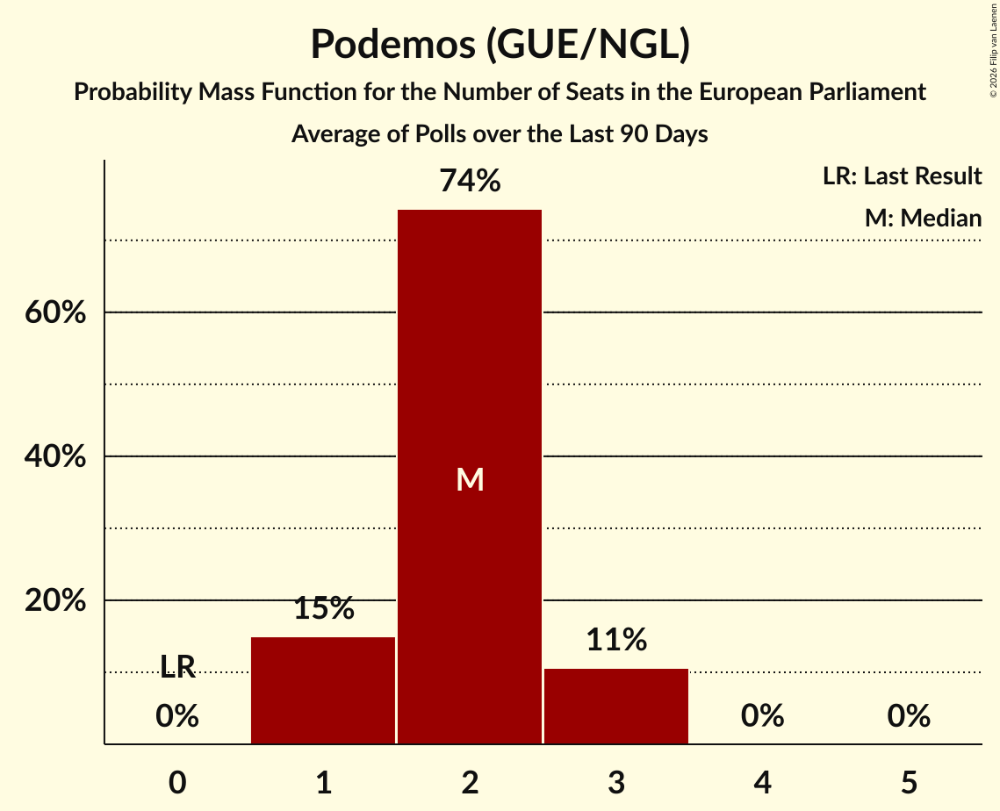

# Podemos (GUE/NGL)

<a href="#voting-intentions">Voting Intentions</a> | <a href="#seats">Seats</a>

## Voting Intentions

Last result: **0.0%** (General Election of 9 June 2024)

### Confidence Intervals

| Period     | Polling firm/Commissioner(s) | Median | 80% Confidence Interval | 90% Confidence Interval | 95% Confidence Interval | 99% Confidence Interval |
|:----------:|:----------------:|:-----------:|:-----------------------:|:-----------------------:|:-----------------------:|:-----------------------:|
| N/A | [Poll Average](average.html) | 3.2% | 2.3–4.4% | 1.9–4.7% | 1.7–5.0% | 1.4–5.6% |
| [6–20 July 2026](2026-07-20-SigmaDos.html) | Sigma Dos   El Mundo | 3.0% | 2.7–3.4% | 2.6–3.5% | 2.5–3.6% | 2.3–3.8% |
| [15–20 July 2026](2026-07-20-DYM.html) | DYM   Henneo | 4.1% | 3.4–5.1% | 3.2–5.3% | 3.1–5.6% | 2.8–6.0% |
| [15–17 July 2026](2026-07-17-TargetPoint.html) | Target Point   El Debate | 2.7% | 2.1–3.5% | 2.0–3.7% | 1.8–3.9% | 1.6–4.3% |
| [6–9 July 2026](2026-07-09-GESOP.html) | GESOP   Prensa Ibérica | 4.0% | 3.3–4.9% | 3.1–5.2% | 2.9–5.4% | 2.6–5.9% |
| [30 June–6 July 2026](2026-07-06-HamalgamaMétrica.html) | Hamalgama Métrica   Vozpópuli | 3.8% | 3.1–4.7% | 2.9–5.0% | 2.8–5.2% | 2.5–5.6% |
| [1–6 July 2026](2026-07-06-CIS.html) | CIS | 2.5% | 2.2–2.9% | 2.1–3.0% | 2.1–3.0% | 1.9–3.2% |
| [2–4 July 2026](2026-07-04-SocioMétrica.html) | SocioMétrica   El Español | 2.8% | 2.3–3.5% | 2.2–3.7% | 2.1–3.8% | 1.9–4.2% |
| [25 June–1 July 2026](2026-07-01-NCReport.html) | NC Report   La Razón | 3.7% | 2.9–4.8% | 2.6–5.2% | 2.5–5.4% | 2.1–6.1% |
| [16–29 June 2026](2026-06-29-Ipsos.html) | Ipsos   La Vanguardia | 1.8% | 1.4–2.4% | 1.3–2.6% | 1.2–2.7% | 1.1–3.0% |
| [26–29 June 2026](2026-06-29-40dB.html) | 40dB   Prisa | 3.1% | 2.7–3.7% | 2.5–3.8% | 2.4–4.0% | 2.2–4.3% |
| [24–28 June 2026](2026-06-28-MoreinCommon.html) | More in Common | 3.3% | 2.8–4.0% | 2.6–4.2% | 2.5–4.3% | 2.3–4.7% |
| [22–26 June 2026](2026-06-26-Invymark.html) | Invymark   laSexta | 3.5% | 2.9–4.4% | 2.7–4.6% | 2.6–4.8% | 2.3–5.2% |
| [17–18 June 2026](2026-06-18-TargetPoint.html) | Target Point   El Debate | 3.2% | 2.6–4.1% | 2.5–4.3% | 2.3–4.5% | 2.0–4.9% |
| [1–11 June 2026](2026-06-11-SigmaDos.html) | Sigma Dos   El Mundo | 3.4% | 2.9–4.0% | 2.8–4.2% | 2.7–4.3% | 2.5–4.6% |
| [1–4 June 2026](2026-06-04-CIS.html) | CIS | 2.8% | 2.5–3.2% | 2.4–3.3% | 2.3–3.4% | 2.2–3.6% |
| [28 May–1 June 2026](2026-06-01-40dB.html) | 40dB   Prisa | 2.3% | N/A | N/A | N/A | N/A |
| [28–30 May 2026](2026-05-30-SocioMétrica.html) | SocioMétrica   El Español | 2.2% | 1.7–2.8% | 1.6–3.0% | 1.5–3.2% | 1.3–3.5% |
| [25–29 May 2026](2026-05-29-Invymark.html) | Invymark   laSexta | 3.6% | N/A | N/A | N/A | N/A |
| [27–28 May 2026](2026-05-28-TargetPoint.html) | Target Point   El Debate | 3.1% | N/A | N/A | N/A | N/A |
| [26–28 May 2026](2026-05-28-GAD3.html) | GAD3   ABC | 3.1% | 2.5–3.9% | 2.3–4.1% | 2.2–4.3% | 1.9–4.8% |
| [25–27 May 2026](2026-05-27-NCReport.html) | NC Report   La Razón | 3.5% | 2.7–4.7% | 2.5–5.0% | 2.3–5.3% | 2.0–5.9% |
| [20–22 May 2026](2026-05-22-DYM.html) | DYM   Henneo | 3.5% | 2.8–4.3% | 2.7–4.6% | 2.5–4.8% | 2.2–5.2% |
| [4–18 May 2026](2026-05-18-CIS.html) | CIS | 2.5% | N/A | N/A | N/A | N/A |
| [24–29 April 2026](2026-04-29-SigmaDos.html) | Sigma Dos   El Mundo | 3.5% | N/A | N/A | N/A | N/A |
| [24–27 April 2026](2026-04-27-40dB.html) | 40dB   Prisa | 2.5% | N/A | N/A | N/A | N/A |
| [22–26 April 2026](2026-04-26-AteneodelDato.html) | Ateneo del Dato | 3.8% | 3.3–4.4% | 3.2–4.6% | 3.0–4.7% | 2.8–5.0% |
| [21–25 April 2026](2026-04-25-MoreinCommon.html) | More in Common | 2.9% | N/A | N/A | N/A | N/A |
| [15–18 April 2026](2026-04-18-SocioMétrica.html) | SocioMétrica   El Español | 3.4% | N/A | N/A | N/A | N/A |
| [6–10 April 2026](2026-04-10-CIS.html) | CIS | 2.2% | N/A | N/A | N/A | N/A |
| [6–9 April 2026](2026-04-09-NCReport.html) | NC Report   La Razón | 3.8% | N/A | N/A | N/A | N/A |
| [23 March–8 April 2026](2026-04-08-Ipsos.html) | Ipsos   La Vanguardia | 1.8% | N/A | N/A | N/A | N/A |
| [16–31 March 2026](2026-03-31-SigmaDos.html) | Sigma Dos   El Mundo | 3.5% | N/A | N/A | N/A | N/A |
| [24–26 March 2026](2026-03-26-TargetPoint.html) | Target Point   El Debate | 3.3% | N/A | N/A | N/A | N/A |
| [24–25 March 2026](2026-03-25-40dB.html) | 40dB   Prisa | 2.7% | N/A | N/A | N/A | N/A |
| [19–23 March 2026](2026-03-23-DYM.html) | DYM   Henneo | 3.8% | N/A | N/A | N/A | N/A |
| [19–21 March 2026](2026-03-21-SocioMétrica.html) | SocioMétrica   El Español | 3.6% | N/A | N/A | N/A | N/A |
| [2–6 March 2026](2026-03-06-CIS.html) | CIS | 2.9% | N/A | N/A | N/A | N/A |
| [23–27 February 2026](2026-02-27-SigmaDos.html) | Sigma Dos   El Mundo | 4.1% | N/A | N/A | N/A | N/A |
| [20–23 February 2026](2026-02-23-40dB.html) | 40dB   Prisa | 3.3% | N/A | N/A | N/A | N/A |
| [18–22 February 2026](2026-02-22-AteneodelDato.html) | Ateneo del Dato   elDiario.es | 3.8% | N/A | N/A | N/A | N/A |
| [17–19 February 2026](2026-02-19-TargetPoint.html) | Target Point   El Debate | 3.7% | N/A | N/A | N/A | N/A |
| [11–13 February 2026](2026-02-13-SocioMétrica.html) | SocioMétrica   El Español | 4.2% | N/A | N/A | N/A | N/A |
| [10–13 February 2026](2026-02-13-NCReport.html) | NC Report   La Razón | 4.3% | N/A | N/A | N/A | N/A |
| [10 February 2026](2026-02-10-Data10.html) | Data10   Okdiario | 2.2% | N/A | N/A | N/A | N/A |
| [2–6 February 2026](2026-02-06-CIS.html) | CIS | 3.9% | N/A | N/A | N/A | N/A |
| [30 January–2 February 2026](2026-02-02-40dB.html) | 40dB   Prisa | 3.7% | N/A | N/A | N/A | N/A |
| [26–30 January 2026](2026-01-30-SigmaDos.html) | Sigma Dos   El Mundo | 4.6% | N/A | N/A | N/A | N/A |
| [22–25 January 2026](2026-01-25-DYM.html) | DYM   Henneo | 5.1% | N/A | N/A | N/A | N/A |
| [14–18 January 2026](2026-01-18-DYM.html) | DYM   Henneo | 4.9% | N/A | N/A | N/A | N/A |
| [13–15 January 2026](2026-01-15-TargetPoint.html) | Target Point   El Debate | 3.2% | N/A | N/A | N/A | N/A |
| [12–15 January 2026](2026-01-15-GESOP.html) | GESOP   Prensa Ibérica | 4.3% | N/A | N/A | N/A | N/A |
| [7–10 January 2026](2026-01-10-SocioMétrica.html) | SocioMétrica   El Español | 3.8% | N/A | N/A | N/A | N/A |
| [5–10 January 2026](2026-01-10-CIS.html) | CIS | 3.5% | N/A | N/A | N/A | N/A |
| [5–9 January 2026](2026-01-09-NCReport.html) | NC Report   La Razón | 4.4% | N/A | N/A | N/A | N/A |
| [29 December 2025–5 January 2026](2026-01-05-40dB.html) | 40dB   Prisa | 3.5% | N/A | N/A | N/A | N/A |
| [22–29 December 2025](2025-12-29-SigmaDos.html) | Sigma Dos   El Mundo | 4.4% | N/A | N/A | N/A | N/A |
| [15–19 December 2025](2025-12-19-Invymark.html) | Invymark   laSexta | 3.8% | N/A | N/A | N/A | N/A |
| [5–7 December 2025](2025-12-07-SocioMétrica.html) | SocioMétrica   El Español | 2.8% | N/A | N/A | N/A | N/A |
| [26 November–5 December 2025](2025-12-05-SigmaDos.html) | Sigma Dos   El Mundo | 4.3% | N/A | N/A | N/A | N/A |
| [1–5 December 2025](2025-12-05-Invymark.html) | Invymark   laSexta | 3.8% | N/A | N/A | N/A | N/A |
| [1–5 December 2025](2025-12-05-CIS.html) | CIS | 4.1% | N/A | N/A | N/A | N/A |
| [27 November–1 December 2025](2025-12-01-40dB.html) | 40dB   Prisa | 3.7% | N/A | N/A | N/A | N/A |
| [17–21 November 2025](2025-11-21-Invymark.html) | Invymark   laSexta | 0.0% | N/A | N/A | N/A | N/A |
| [17–19 November 2025](2025-11-19-TargetPoint.html) | Target Point   El Debate | 3.6% | N/A | N/A | N/A | N/A |
| [11–14 November 2025](2025-11-14-NCReport.html) | NC Report   La Razón | 4.1% | N/A | N/A | N/A | N/A |
| [12–14 November 2025](2025-11-14-DYM.html) | DYM   Henneo | 4.0% | N/A | N/A | N/A | N/A |
| [3–12 November 2025](2025-11-12-CIS.html) | CIS | 4.0% | N/A | N/A | N/A | N/A |
| [6–8 November 2025](2025-11-08-SocioMétrica.html) | SocioMétrica   El Español | 3.5% | N/A | N/A | N/A | N/A |
| [30 October–6 November 2025](2025-11-06-SigmaDos.html) | Sigma Dos   El Mundo | 4.2% | N/A | N/A | N/A | N/A |
| [4–6 November 2025](2025-11-06-Cluster17.html) | Cluster17   Agenda Pública | 4.5% | N/A | N/A | N/A | N/A |
| [31 October–4 November 2025](2025-11-04-Opina360.html) | Opina 360   Telecinco | 3.1% | N/A | N/A | N/A | N/A |
| [28 October–4 November 2025](2025-11-04-HamalgamaMétrica.html) | Hamalgama Métrica   Vozpópuli | 4.1% | N/A | N/A | N/A | N/A |
| [24–26 October 2025](2025-10-26-40dB.html) | 40dB   Prisa | 3.0% | N/A | N/A | N/A | N/A |
| [6–10 October 2025](2025-10-10-SocioMétrica.html) | SocioMétrica   El Español | 3.9% | N/A | N/A | N/A | N/A |
| [3–9 October 2025](2025-10-09-GESOP.html) | GESOP   Prensa Ibérica | 3.7% | N/A | N/A | N/A | N/A |
| [1–7 October 2025](2025-10-07-CIS.html) | CIS | 4.9% | N/A | N/A | N/A | N/A |
| [1–4 October 2025](2025-10-04-NCReport.html) | NC Report   La Razón | 4.6% | N/A | N/A | N/A | N/A |
| [17 September–1 October 2025](2025-10-01-SigmaDos.html) | Sigma Dos   El Mundo | 4.0% | N/A | N/A | N/A | N/A |
| [25–30 September 2025](2025-09-30-Opina360.html) | Opina 360   Antena 3 | 3.8% | N/A | N/A | N/A | N/A |
| [26–28 September 2025](2025-09-28-40dB.html) | 40dB   Prisa | 2.8% | N/A | N/A | N/A | N/A |
| [15–19 September 2025](2025-09-19-Invymark.html) | Invymark   laSexta | 4.0% | N/A | N/A | N/A | N/A |
| [10–15 September 2025](2025-09-15-DYM.html) | DYM   Henneo | 3.9% | N/A | N/A | N/A | N/A |
| [8–12 September 2025](2025-09-12-Celeste-Tel.html) | Celeste-Tel   Onda Cero | 4.7% | N/A | N/A | N/A | N/A |
| [10–11 September 2025](2025-09-11-TargetPoint.html) | Target Point   El Debate | 4.1% | N/A | N/A | N/A | N/A |
| [5–11 September 2025](2025-09-11-GAD3.html) | GAD3   ABC | 4.0% | N/A | N/A | N/A | N/A |
| [3–9 September 2025](2025-09-09-HamalgamaMétrica.html) | Hamalgama Métrica   Vozpópuli | 4.7% | N/A | N/A | N/A | N/A |
| [1–6 September 2025](2025-09-06-NCReport.html) | NC Report   La Razón | 5.2% | N/A | N/A | N/A | N/A |
| [1–6 September 2025](2025-09-06-CIS.html) | CIS | 4.3% | N/A | N/A | N/A | N/A |
| [2–5 September 2025](2025-09-05-DemoscopiayServicios.html) | Demoscopia y Servicios   esRadio | 5.1% | N/A | N/A | N/A | N/A |
| [29 August–1 September 2025](2025-09-01-40dB.html) | 40dB   Prisa | 3.4% | N/A | N/A | N/A | N/A |
| [26–29 August 2025](2025-08-29-SocioMétrica.html) | SocioMétrica   El Español | 4.0% | N/A | N/A | N/A | N/A |
| [20–28 August 2025](2025-08-28-SigmaDos.html) | Sigma Dos   El Mundo | 4.2% | N/A | N/A | N/A | N/A |
| [21–30 July 2025](2025-07-30-SigmaDos.html) | Sigma Dos   El Mundo | 4.4% | N/A | N/A | N/A | N/A |
| [21–24 July 2025](2025-07-24-SocioMétrica.html) | SocioMétrica   El Español | 3.8% | N/A | N/A | N/A | N/A |
| [14–18 July 2025](2025-07-18-HamalgamaMétrica.html) | Hamalgama Métrica   Vozpópuli | 5.3% | N/A | N/A | N/A | N/A |
| [11–14 July 2025](2025-07-14-DYM.html) | DYM   Henneo | 3.7% | N/A | N/A | N/A | N/A |
| [10–14 July 2025](2025-07-14-Celeste-Tel.html) | Celeste-Tel   Onda Cero | 5.4% | N/A | N/A | N/A | N/A |
| [9–10 July 2025](2025-07-10-TargetPoint.html) | Target Point   El Debate | 4.2% | N/A | N/A | N/A | N/A |
| [1–7 July 2025](2025-07-07-CIS.html) | CIS | 4.4% | N/A | N/A | N/A | N/A |
| [30 June–4 July 2025](2025-07-04-Invymark.html) | Invymark   laSexta | 4.1% | N/A | N/A | N/A | N/A |
| [27–30 June 2025](2025-06-30-40dB.html) | 40dB   Prisa | 3.8% | N/A | N/A | N/A | N/A |
| [20–27 June 2025](2025-06-27-SigmaDos.html) | Sigma Dos   El Mundo | 4.5% | N/A | N/A | N/A | N/A |
| [18–21 June 2025](2025-06-21-SocioMétrica.html) | SocioMétrica   El Español | 3.9% | N/A | N/A | N/A | N/A |
| [19–21 June 2025](2025-06-21-NCReport.html) | NC Report   La Razón | 5.8% | N/A | N/A | N/A | N/A |
| [18–20 June 2025](2025-06-20-TargetPoint.html) | Target Point   El Debate | 2.9% | N/A | N/A | N/A | N/A |
| [16–20 June 2025](2025-06-20-Invymark.html) | Invymark   laSexta | 3.9% | N/A | N/A | N/A | N/A |
| [17 June 2025](2025-06-17-DYM.html) | DYM   Henneo | 3.5% | N/A | N/A | N/A | N/A |
| [9–13 June 2025](2025-06-13-Invymark.html) | Invymark   laSexta | 3.7% | N/A | N/A | N/A | N/A |
| [10–12 June 2025](2025-06-12-GESOP.html) | GESOP   Prensa Ibérica | 3.8% | N/A | N/A | N/A | N/A |
| [2–7 June 2025](2025-06-07-CIS.html) | CIS | 4.2% | N/A | N/A | N/A | N/A |
| [27–29 May 2025](2025-05-29-GAD3.html) | GAD3   ABC | 4.7% | N/A | N/A | N/A | N/A |
| [21 April–28 May 2025](2025-05-28-SigmaDos.html) | Sigma Dos   El Mundo | 5.1% | N/A | N/A | N/A | N/A |
| [23–26 May 2025](2025-05-26-40dB.html) | 40dB   Prisa | 3.8% | N/A | N/A | N/A | N/A |
| [23–25 May 2025](2025-05-25-40dB.html) | 40dB   Prisa | 3.8% | N/A | N/A | N/A | N/A |
| [21–23 May 2025](2025-05-23-TargetPoint.html) | Target Point   El Debate | 4.4% | N/A | N/A | N/A | N/A |
| [20–23 May 2025](2025-05-23-HamalgamaMétrica.html) | Hamalgama Métrica   Vozpópuli | 5.1% | N/A | N/A | N/A | N/A |
| [19–22 May 2025](2025-05-22-SocioMétrica.html) | SocioMétrica   El Español | 4.1% | N/A | N/A | N/A | N/A |
| [15–21 May 2025](2025-05-21-Ipsos.html) | Ipsos   La Vanguardia | 2.7% | N/A | N/A | N/A | N/A |
| [14–19 May 2025](2025-05-19-DYM.html) | DYM   Henneo | 5.1% | N/A | N/A | N/A | N/A |
| [5–8 May 2025](2025-05-08-CIS.html) | CIS | 4.3% | N/A | N/A | N/A | N/A |
| [28 April–6 May 2025](2025-05-06-Celeste-Tel.html) | Celeste-Tel   Onda Cero | 5.5% | N/A | N/A | N/A | N/A |
| [24–27 April 2025](2025-04-27-40dB.html) | 40dB   Prisa | 3.1% | N/A | N/A | N/A | N/A |
| [23–25 April 2025](2025-04-25-TargetPoint.html) | Target Point   El Debate | 5.3% | N/A | N/A | N/A | N/A |
| [21–25 April 2025](2025-04-25-SocioMétrica.html) | SocioMétrica   El Español | 4.0% | N/A | N/A | N/A | N/A |
| [14–17 April 2025](2025-04-17-NCReport.html) | NC Report   La Razón | 4.4% | N/A | N/A | N/A | N/A |
| [4–15 April 2025](2025-04-15-SigmaDos.html) | Sigma Dos   El Mundo | 4.8% | N/A | N/A | N/A | N/A |
| [9–15 April 2025](2025-04-15-HamalgamaMétrica.html) | Hamalgama Métrica   Vozpópuli | 4.9% | N/A | N/A | N/A | N/A |
| [1–8 April 2025](2025-04-08-CIS.html) | CIS | 4.0% | N/A | N/A | N/A | N/A |
| [28–31 March 2025](2025-03-31-40dB.html) | 40dB   Prisa | 3.3% | N/A | N/A | N/A | N/A |
| [27–28 March 2025](2025-03-28-Data10.html) | Data10   OKDiario | 0.0% | N/A | N/A | N/A | N/A |
| [19–21 March 2025](2025-03-21-TargetPoint.html) | Target Point   El Debate | 4.3% | N/A | N/A | N/A | N/A |
| [19–21 March 2025](2025-03-21-SocioMétrica.html) | SocioMétrica   El Español | 4.2% | N/A | N/A | N/A | N/A |
| [14–21 March 2025](2025-03-21-Celeste-Tel.html) | Celeste-Tel   Onda Cero | 5.3% | N/A | N/A | N/A | N/A |
| [12–16 March 2025](2025-03-16-DYM.html) | DYM   Henneo | 4.5% | N/A | N/A | N/A | N/A |
| [24 February–7 March 2025](2025-03-07-SigmaDos.html) | Sigma Dos   El Mundo | 5.2% | N/A | N/A | N/A | N/A |
| [3–7 March 2025](2025-03-07-NCReport.html) | NC Report   La Razón | 4.7% | N/A | N/A | N/A | N/A |
| [28 February–7 March 2025](2025-03-07-CIS.html) | CIS | 3.8% | N/A | N/A | N/A | N/A |
| [3–6 March 2025](2025-03-06-GESOP.html) | GESOP   Prensa Ibérica | 3.3% | N/A | N/A | N/A | N/A |
| [24–28 February 2025](2025-02-28-HamalgamaMétrica.html) | Hamalgama Métrica   VozPópuli | 5.0% | N/A | N/A | N/A | N/A |
| [21–24 February 2025](2025-02-24-40dB.html) | 40dB   Prisa | 3.6% | N/A | N/A | N/A | N/A |
| [19–21 February 2025](2025-02-21-TargetPoint.html) | Target Point   El Debate | 4.2% | N/A | N/A | N/A | N/A |
| [12–17 February 2025](2025-02-17-Celeste-Tel.html) | Celeste-Tel   Onda Cero | 5.4% | N/A | N/A | N/A | N/A |
| [12–14 February 2025](2025-02-14-SocioMétrica.html) | SocioMétrica   El Español | 4.4% | N/A | N/A | N/A | N/A |
| [4–7 February 2025](2025-02-07-NCReport.html) | NC Report   La Razón | 4.7% | N/A | N/A | N/A | N/A |
| [31 January–6 February 2025](2025-02-06-CIS.html) | CIS | 4.4% | N/A | N/A | N/A | N/A |
| [24–31 January 2025](2025-01-31-SigmaDos.html) | Sigma Dos   El Mundo | 4.7% | N/A | N/A | N/A | N/A |
| [28–31 January 2025](2025-01-31-HamalgamaMétrica.html) | Hamalgama Métrica   VozPópuli | 4.9% | N/A | N/A | N/A | N/A |
| [24–27 January 2025](2025-01-27-40dB.html) | 40dB   Prisa | 3.4% | N/A | N/A | N/A | N/A |
| [22–24 January 2025](2025-01-24-TargetPoint.html) | Target Point   El Debate | 5.2% | N/A | N/A | N/A | N/A |
| [16–23 January 2025](2025-01-23-GAD3.html) | GAD3   ABC | 4.0% | N/A | N/A | N/A | N/A |
| [16–20 January 2025](2025-01-20-DYM.html) | DYM   Henneo | 5.0% | N/A | N/A | N/A | N/A |
| [7–11 January 2025](2025-01-11-Celeste-Tel.html) | Celeste-Tel   Onda Cero | 5.1% | N/A | N/A | N/A | N/A |
| [31 December 2024–3 January 2025](2025-01-03-HamalgamaMétrica.html) | Hamalgama Métrica   VozPópuli | 4.7% | N/A | N/A | N/A | N/A |
| [26–30 December 2024](2024-12-30-TargetPoint.html) | Target Point   El Debate | 5.0% | N/A | N/A | N/A | N/A |
| [26–30 December 2024](2024-12-30-SocioMétrica.html) | SocioMétrica   El Español | 4.2% | N/A | N/A | N/A | N/A |
| [20–27 December 2024](2024-12-27-NCReport.html) | NC Report   La Razón | 4.5% | N/A | N/A | N/A | N/A |
| [13–26 December 2024](2024-12-26-SigmaDos.html) | Sigma Dos   El Mundo | 4.7% | N/A | N/A | N/A | N/A |
| [20–26 December 2024](2024-12-26-40dB.html) | 40dB   Prisa | 4.0% | N/A | N/A | N/A | N/A |
| [10–12 December 2024](2024-12-12-HamalgamaMétrica.html) | Hamalgama Métrica   VozPópuli | 4.2% | N/A | N/A | N/A | N/A |
| [5–11 December 2024](2024-12-11-Sondaxe.html) | Sondaxe   La Voz de Galicia | 4.0% | N/A | N/A | N/A | N/A |
| [25 November–4 December 2024](2024-12-04-SigmaDos.html) | Sigma Dos   El Mundo | 5.0% | N/A | N/A | N/A | N/A |
| [2–4 December 2024](2024-12-04-GESOP.html) | GESOP   Prensa Ibérica | 3.5% | N/A | N/A | N/A | N/A |
| [25–29 November 2024](2024-11-29-NCReport.html) | NC Report   La Razón | 4.2% | N/A | N/A | N/A | N/A |
| [25–27 November 2024](2024-11-27-40dB.html) | 40dB   Prisa | 2.8% | N/A | N/A | N/A | N/A |
| [22–24 November 2024](2024-11-24-SocioMétrica.html) | SocioMétrica   El Español | 3.6% | N/A | N/A | N/A | N/A |
| [20–22 November 2024](2024-11-22-TargetPoint.html) | Target Point   El Debate | 4.7% | N/A | N/A | N/A | N/A |
| [18–22 November 2024](2024-11-22-Ipsos.html) | Ipsos   La Vanguardia | 3.4% | N/A | N/A | N/A | N/A |
| [7–15 November 2024](2024-11-15-Celeste-Tel.html) | Celeste-Tel   Onda Cero | 5.1% | N/A | N/A | N/A | N/A |
| [11–14 November 2024](2024-11-14-GAD3.html) | GAD3   Mediaset | 4.0% | N/A | N/A | N/A | N/A |
| [8–11 November 2024](2024-11-11-DYM.html) | DYM   Henneo | 4.9% | N/A | N/A | N/A | N/A |
| [5–8 November 2024](2024-11-08-HamalgamaMétrica.html) | Hamalgama Métrica   VozPópuli | 4.2% | N/A | N/A | N/A | N/A |
| [24–31 October 2024](2024-10-31-SigmaDos.html) | Sigma Dos   El Mundo | 4.9% | N/A | N/A | N/A | N/A |
| [21–24 October 2024](2024-10-24-GAD3.html) | GAD3   ABC | 3.3% | N/A | N/A | N/A | N/A |
| [16–18 October 2024](2024-10-18-TargetPoint.html) | Target Point   El Debate | 3.1% | N/A | N/A | N/A | N/A |
| [16–18 October 2024](2024-10-18-SocioMétrica.html) | SocioMétrica   El Español | 3.4% | N/A | N/A | N/A | N/A |
| [16–18 October 2024](2024-10-18-DYM.html) | DYM   Henneo | 2.5% | N/A | N/A | N/A | N/A |
| [8–11 October 2024](2024-10-11-HamalgamaMétrica.html) | Hamalgama Métrica   VozPópuli | 3.1% | N/A | N/A | N/A | N/A |
| [4–9 October 2024](2024-10-09-Celeste-Tel.html) | Celeste-Tel   Onda Cero | 3.7% | N/A | N/A | N/A | N/A |
| [20–27 September 2024](2024-09-27-SigmaDos.html) | Sigma Dos   El Mundo | 3.4% | N/A | N/A | N/A | N/A |
| [25–27 September 2024](2024-09-27-40dB.html) | 40dB   Prisa | 2.7% | N/A | N/A | N/A | N/A |
| [23–26 September 2024](2024-09-26-GESOP.html) | GESOP   Prensa Ibérica | 3.1% | N/A | N/A | N/A | N/A |
| [16–20 September 2024](2024-09-20-Invymark.html) | Invymark   laSexta | 0.0% | N/A | N/A | N/A | N/A |
| [18–19 September 2024](2024-09-19-TargetPoint.html) | Target Point   El Debate | 4.4% | N/A | N/A | N/A | N/A |
| [1–13 September 2024](2024-09-13-SimpleLógica.html) | Simple Lógica   elDiario.es | 3.4% | N/A | N/A | N/A | N/A |
| [3–6 September 2024](2024-09-06-HamalgamaMétrica.html) | Hamalgama Métrica   VozPópuli | 3.7% | N/A | N/A | N/A | N/A |
| [2–6 September 2024](2024-09-06-Celeste-Tel.html) | Celeste-Tel   Onda Cero | 3.2% | N/A | N/A | N/A | N/A |
| [2–6 September 2024](2024-09-06-CIS.html) | CIS | 3.6% | N/A | N/A | N/A | N/A |
| [26–31 August 2024](2024-08-31-SocioMétrica.html) | SocioMétrica   El Español | 4.6% | N/A | N/A | N/A | N/A |
| [22–29 August 2024](2024-08-29-SigmaDos.html) | Sigma Dos   El Mundo | 3.3% | N/A | N/A | N/A | N/A |
| [20–23 August 2024](2024-08-23-NCReport.html) | NC Report   La Razón | 3.5% | N/A | N/A | N/A | N/A |
| [19–23 August 2024](2024-08-23-40dB.html) | 40dB   Prisa | 2.7% | N/A | N/A | N/A | N/A |
| [1–9 August 2024](2024-08-09-SimpleLógica.html) | Simple Lógica   elDiario.es | 3.0% | N/A | N/A | N/A | N/A |
| [5–8 August 2024](2024-08-08-SigmaDos.html) | Sigma Dos   El Mundo | 3.4% | N/A | N/A | N/A | N/A |
| [22 July 2024](2024-07-22-TargetPoint.html) | Target Point   El Debate | 4.8% | N/A | N/A | N/A | N/A |
| [18–20 July 2024](2024-07-20-SocioMétrica.html) | SocioMétrica   El Español | 3.7% | N/A | N/A | N/A | N/A |
| [12–18 July 2024](2024-07-18-SigmaDos.html) | Sigma Dos   El Mundo | 3.6% | N/A | N/A | N/A | N/A |
| [1–10 July 2024](2024-07-10-SimpleLógica.html) | Simple Lógica   elDiario.es | 2.7% | N/A | N/A | N/A | N/A |
| [1–4 July 2024](2024-07-04-HamalgamaMétrica.html) | Hamalgama Métrica   VozPópuli | 3.8% | N/A | N/A | N/A | N/A |
| [1–4 July 2024](2024-07-04-CIS.html) | CIS | 4.0% | N/A | N/A | N/A | N/A |
| [21–28 June 2024](2024-06-28-SigmaDos.html) | Sigma Dos   El Mundo | 3.4% | N/A | N/A | N/A | N/A |
| [25–27 June 2024](2024-06-27-TargetPoint.html) | Target Point   El Debate | 4.4% | N/A | N/A | N/A | N/A |
| [21–24 June 2024](2024-06-24-40dB.html) | 40dB   Prisa | 3.0% | N/A | N/A | N/A | N/A |
| [11–15 June 2024](2024-06-15-NCReport.html) | NC Report   La Razón | 3.5% | N/A | N/A | N/A | N/A |
| [10–14 June 2024](2024-06-14-Invymark.html) | Invymark   laSexta | 0.0% | N/A | N/A | N/A | N/A |
| [1–11 June 2024](2024-06-11-SimpleLógica.html) | Simple Lógica   elDiario.es | 3.7% | N/A | N/A | N/A | N/A |

### Probability Mass Function

The following table shows the probability mass function per percentage block of voting intentions for the [poll average](average.html) for Podemos (GUE/NGL).

| Voting Intentions | Probability | Accumulated | Special Marks |
|:-----------------:|:-----------:|:-----------:|:-------------:|
| 0.0–0.5% | 0% | 100% | Last Result |
| 0.5–1.5% | 1.5% | 100% |  |
| 1.5–2.5% | 17% | 98.5% |  |
| 2.5–3.5% | 47% | 82% | Median |
| 3.5–4.5% | 28% | 35% |  |
| 4.5–5.5% | 7% | 7% |  |
| 5.5–6.5% | 0.5% | 0.6% |  |
| 6.5–7.5% | 0% | 0% |  |

## Seats

Last result: **0** seats (General Election of 9 June 2024)

### Confidence Intervals

| Period     | Polling firm/Commissioner(s) | Median | 80% Confidence Interval | 90% Confidence Interval | 95% Confidence Interval | 99% Confidence Interval |
|:----------:|:----------------:|:------:|:-----------------------:|:-----------------------:|:-----------------------:|:-----------------------:|
| N/A | [Poll Average](average.html) | 2 | 1–3 | 1–3 | 1–3 | 1–3 |
| [6–20 July 2026](2026-07-20-SigmaDos.html) | Sigma Dos   El Mundo | 2 | 1–2 | 1–2 | 1–2 | 1–2 |
| [15–20 July 2026](2026-07-20-DYM.html) | DYM   Henneo | 3 | 2–3 | 2–3 | 2–4 | 2–4 |
| [15–17 July 2026](2026-07-17-TargetPoint.html) | Target Point   El Debate | 2 | 1–2 | 1–2 | 1–2 | 1–3 |
| [6–9 July 2026](2026-07-09-GESOP.html) | GESOP   Prensa Ibérica | 2 | 2–3 | 2–3 | 2–3 | 1–4 |
| [30 June–6 July 2026](2026-07-06-HamalgamaMétrica.html) | Hamalgama Métrica   Vozpópuli | 2 | 2–3 | 1–3 | 1–3 | 1–3 |
| [1–6 July 2026](2026-07-06-CIS.html) | CIS | 1 | 1–2 | 1–2 | 1–2 | 1–2 |
| [2–4 July 2026](2026-07-04-SocioMétrica.html) | SocioMétrica   El Español | 2 | 1–2 | 1–2 | 1–2 | 1–2 |
| [25 June–1 July 2026](2026-07-01-NCReport.html) | NC Report   La Razón | 2 | 2–3 | 1–3 | 1–3 | 1–4 |
| [16–29 June 2026](2026-06-29-Ipsos.html) | Ipsos   La Vanguardia | 1 | 1 | 1 | 0–1 | 0–2 |
| [26–29 June 2026](2026-06-29-40dB.html) | 40dB   Prisa | 2 | 1–2 | 1–2 | 1–2 | 1–3 |
| [24–28 June 2026](2026-06-28-MoreinCommon.html) | More in Common | 2 | 2 | 1–3 | 1–3 | 1–3 |
| [22–26 June 2026](2026-06-26-Invymark.html) | Invymark   laSexta | 2 | 2–3 | 1–3 | 1–3 | 1–3 |
| [17–18 June 2026](2026-06-18-TargetPoint.html) | Target Point   El Debate | 2 | 1–2 | 1–3 | 1–3 | 1–3 |
| [1–11 June 2026](2026-06-11-SigmaDos.html) | Sigma Dos   El Mundo | 2 | 2 | 1–2 | 1–3 | 1–3 |
| [1–4 June 2026](2026-06-04-CIS.html) | CIS | 2 | 1–2 | 1–2 | 1–2 | 1–2 |
| [28 May–1 June 2026](2026-06-01-40dB.html) | 40dB   Prisa |  |  |  |  |  |
| [28–30 May 2026](2026-05-30-SocioMétrica.html) | SocioMétrica   El Español | 1 | 1–2 | 1–2 | 1–2 | 0–2 |
| [25–29 May 2026](2026-05-29-Invymark.html) | Invymark   laSexta |  |  |  |  |  |
| [27–28 May 2026](2026-05-28-TargetPoint.html) | Target Point   El Debate |  |  |  |  |  |
| [26–28 May 2026](2026-05-28-GAD3.html) | GAD3   ABC | 2 | 1–2 | 1–3 | 1–3 | 1–3 |
| [25–27 May 2026](2026-05-27-NCReport.html) | NC Report   La Razón | 2 | 1–3 | 1–3 | 1–3 | 1–4 |
| [20–22 May 2026](2026-05-22-DYM.html) | DYM   Henneo | 2 | 2–3 | 1–3 | 1–3 | 1–3 |
| [4–18 May 2026](2026-05-18-CIS.html) | CIS |  |  |  |  |  |
| [24–29 April 2026](2026-04-29-SigmaDos.html) | Sigma Dos   El Mundo |  |  |  |  |  |
| [24–27 April 2026](2026-04-27-40dB.html) | 40dB   Prisa |  |  |  |  |  |
| [22–26 April 2026](2026-04-26-AteneodelDato.html) | Ateneo del Dato | 2 | 2–3 | 2–3 | 2–3 | 2–3 |
| [21–25 April 2026](2026-04-25-MoreinCommon.html) | More in Common |  |  |  |  |  |
| [15–18 April 2026](2026-04-18-SocioMétrica.html) | SocioMétrica   El Español |  |  |  |  |  |
| [6–10 April 2026](2026-04-10-CIS.html) | CIS |  |  |  |  |  |
| [6–9 April 2026](2026-04-09-NCReport.html) | NC Report   La Razón |  |  |  |  |  |
| [23 March–8 April 2026](2026-04-08-Ipsos.html) | Ipsos   La Vanguardia |  |  |  |  |  |
| [16–31 March 2026](2026-03-31-SigmaDos.html) | Sigma Dos   El Mundo |  |  |  |  |  |
| [24–26 March 2026](2026-03-26-TargetPoint.html) | Target Point   El Debate |  |  |  |  |  |
| [24–25 March 2026](2026-03-25-40dB.html) | 40dB   Prisa |  |  |  |  |  |
| [19–23 March 2026](2026-03-23-DYM.html) | DYM   Henneo |  |  |  |  |  |
| [19–21 March 2026](2026-03-21-SocioMétrica.html) | SocioMétrica   El Español |  |  |  |  |  |
| [2–6 March 2026](2026-03-06-CIS.html) | CIS |  |  |  |  |  |
| [23–27 February 2026](2026-02-27-SigmaDos.html) | Sigma Dos   El Mundo |  |  |  |  |  |
| [20–23 February 2026](2026-02-23-40dB.html) | 40dB   Prisa |  |  |  |  |  |
| [18–22 February 2026](2026-02-22-AteneodelDato.html) | Ateneo del Dato   elDiario.es |  |  |  |  |  |
| [17–19 February 2026](2026-02-19-TargetPoint.html) | Target Point   El Debate |  |  |  |  |  |
| [11–13 February 2026](2026-02-13-SocioMétrica.html) | SocioMétrica   El Español |  |  |  |  |  |
| [10–13 February 2026](2026-02-13-NCReport.html) | NC Report   La Razón |  |  |  |  |  |
| [10 February 2026](2026-02-10-Data10.html) | Data10   Okdiario |  |  |  |  |  |
| [2–6 February 2026](2026-02-06-CIS.html) | CIS |  |  |  |  |  |
| [30 January–2 February 2026](2026-02-02-40dB.html) | 40dB   Prisa |  |  |  |  |  |
| [26–30 January 2026](2026-01-30-SigmaDos.html) | Sigma Dos   El Mundo |  |  |  |  |  |
| [22–25 January 2026](2026-01-25-DYM.html) | DYM   Henneo |  |  |  |  |  |
| [14–18 January 2026](2026-01-18-DYM.html) | DYM   Henneo |  |  |  |  |  |
| [13–15 January 2026](2026-01-15-TargetPoint.html) | Target Point   El Debate |  |  |  |  |  |
| [12–15 January 2026](2026-01-15-GESOP.html) | GESOP   Prensa Ibérica |  |  |  |  |  |
| [7–10 January 2026](2026-01-10-SocioMétrica.html) | SocioMétrica   El Español |  |  |  |  |  |
| [5–10 January 2026](2026-01-10-CIS.html) | CIS |  |  |  |  |  |
| [5–9 January 2026](2026-01-09-NCReport.html) | NC Report   La Razón |  |  |  |  |  |
| [29 December 2025–5 January 2026](2026-01-05-40dB.html) | 40dB   Prisa |  |  |  |  |  |
| [22–29 December 2025](2025-12-29-SigmaDos.html) | Sigma Dos   El Mundo |  |  |  |  |  |
| [15–19 December 2025](2025-12-19-Invymark.html) | Invymark   laSexta |  |  |  |  |  |
| [5–7 December 2025](2025-12-07-SocioMétrica.html) | SocioMétrica   El Español |  |  |  |  |  |
| [26 November–5 December 2025](2025-12-05-SigmaDos.html) | Sigma Dos   El Mundo |  |  |  |  |  |
| [1–5 December 2025](2025-12-05-Invymark.html) | Invymark   laSexta |  |  |  |  |  |
| [1–5 December 2025](2025-12-05-CIS.html) | CIS |  |  |  |  |  |
| [27 November–1 December 2025](2025-12-01-40dB.html) | 40dB   Prisa |  |  |  |  |  |
| [17–21 November 2025](2025-11-21-Invymark.html) | Invymark   laSexta |  |  |  |  |  |
| [17–19 November 2025](2025-11-19-TargetPoint.html) | Target Point   El Debate |  |  |  |  |  |
| [11–14 November 2025](2025-11-14-NCReport.html) | NC Report   La Razón |  |  |  |  |  |
| [12–14 November 2025](2025-11-14-DYM.html) | DYM   Henneo |  |  |  |  |  |
| [3–12 November 2025](2025-11-12-CIS.html) | CIS |  |  |  |  |  |
| [6–8 November 2025](2025-11-08-SocioMétrica.html) | SocioMétrica   El Español |  |  |  |  |  |
| [30 October–6 November 2025](2025-11-06-SigmaDos.html) | Sigma Dos   El Mundo |  |  |  |  |  |
| [4–6 November 2025](2025-11-06-Cluster17.html) | Cluster17   Agenda Pública |  |  |  |  |  |
| [31 October–4 November 2025](2025-11-04-Opina360.html) | Opina 360   Telecinco |  |  |  |  |  |
| [28 October–4 November 2025](2025-11-04-HamalgamaMétrica.html) | Hamalgama Métrica   Vozpópuli |  |  |  |  |  |
| [24–26 October 2025](2025-10-26-40dB.html) | 40dB   Prisa |  |  |  |  |  |
| [6–10 October 2025](2025-10-10-SocioMétrica.html) | SocioMétrica   El Español |  |  |  |  |  |
| [3–9 October 2025](2025-10-09-GESOP.html) | GESOP   Prensa Ibérica |  |  |  |  |  |
| [1–7 October 2025](2025-10-07-CIS.html) | CIS |  |  |  |  |  |
| [1–4 October 2025](2025-10-04-NCReport.html) | NC Report   La Razón |  |  |  |  |  |
| [17 September–1 October 2025](2025-10-01-SigmaDos.html) | Sigma Dos   El Mundo |  |  |  |  |  |
| [25–30 September 2025](2025-09-30-Opina360.html) | Opina 360   Antena 3 |  |  |  |  |  |
| [26–28 September 2025](2025-09-28-40dB.html) | 40dB   Prisa |  |  |  |  |  |
| [15–19 September 2025](2025-09-19-Invymark.html) | Invymark   laSexta |  |  |  |  |  |
| [10–15 September 2025](2025-09-15-DYM.html) | DYM   Henneo |  |  |  |  |  |
| [8–12 September 2025](2025-09-12-Celeste-Tel.html) | Celeste-Tel   Onda Cero |  |  |  |  |  |
| [10–11 September 2025](2025-09-11-TargetPoint.html) | Target Point   El Debate |  |  |  |  |  |
| [5–11 September 2025](2025-09-11-GAD3.html) | GAD3   ABC |  |  |  |  |  |
| [3–9 September 2025](2025-09-09-HamalgamaMétrica.html) | Hamalgama Métrica   Vozpópuli |  |  |  |  |  |
| [1–6 September 2025](2025-09-06-NCReport.html) | NC Report   La Razón |  |  |  |  |  |
| [1–6 September 2025](2025-09-06-CIS.html) | CIS |  |  |  |  |  |
| [2–5 September 2025](2025-09-05-DemoscopiayServicios.html) | Demoscopia y Servicios   esRadio |  |  |  |  |  |
| [29 August–1 September 2025](2025-09-01-40dB.html) | 40dB   Prisa |  |  |  |  |  |
| [26–29 August 2025](2025-08-29-SocioMétrica.html) | SocioMétrica   El Español |  |  |  |  |  |
| [20–28 August 2025](2025-08-28-SigmaDos.html) | Sigma Dos   El Mundo |  |  |  |  |  |
| [21–30 July 2025](2025-07-30-SigmaDos.html) | Sigma Dos   El Mundo |  |  |  |  |  |
| [21–24 July 2025](2025-07-24-SocioMétrica.html) | SocioMétrica   El Español |  |  |  |  |  |
| [14–18 July 2025](2025-07-18-HamalgamaMétrica.html) | Hamalgama Métrica   Vozpópuli |  |  |  |  |  |
| [11–14 July 2025](2025-07-14-DYM.html) | DYM   Henneo |  |  |  |  |  |
| [10–14 July 2025](2025-07-14-Celeste-Tel.html) | Celeste-Tel   Onda Cero |  |  |  |  |  |
| [9–10 July 2025](2025-07-10-TargetPoint.html) | Target Point   El Debate |  |  |  |  |  |
| [1–7 July 2025](2025-07-07-CIS.html) | CIS |  |  |  |  |  |
| [30 June–4 July 2025](2025-07-04-Invymark.html) | Invymark   laSexta |  |  |  |  |  |
| [27–30 June 2025](2025-06-30-40dB.html) | 40dB   Prisa |  |  |  |  |  |
| [20–27 June 2025](2025-06-27-SigmaDos.html) | Sigma Dos   El Mundo |  |  |  |  |  |
| [18–21 June 2025](2025-06-21-SocioMétrica.html) | SocioMétrica   El Español |  |  |  |  |  |
| [19–21 June 2025](2025-06-21-NCReport.html) | NC Report   La Razón |  |  |  |  |  |
| [18–20 June 2025](2025-06-20-TargetPoint.html) | Target Point   El Debate |  |  |  |  |  |
| [16–20 June 2025](2025-06-20-Invymark.html) | Invymark   laSexta |  |  |  |  |  |
| [17 June 2025](2025-06-17-DYM.html) | DYM   Henneo |  |  |  |  |  |
| [9–13 June 2025](2025-06-13-Invymark.html) | Invymark   laSexta |  |  |  |  |  |
| [10–12 June 2025](2025-06-12-GESOP.html) | GESOP   Prensa Ibérica |  |  |  |  |  |
| [2–7 June 2025](2025-06-07-CIS.html) | CIS |  |  |  |  |  |
| [27–29 May 2025](2025-05-29-GAD3.html) | GAD3   ABC |  |  |  |  |  |
| [21 April–28 May 2025](2025-05-28-SigmaDos.html) | Sigma Dos   El Mundo |  |  |  |  |  |
| [23–26 May 2025](2025-05-26-40dB.html) | 40dB   Prisa |  |  |  |  |  |
| [23–25 May 2025](2025-05-25-40dB.html) | 40dB   Prisa |  |  |  |  |  |
| [21–23 May 2025](2025-05-23-TargetPoint.html) | Target Point   El Debate |  |  |  |  |  |
| [20–23 May 2025](2025-05-23-HamalgamaMétrica.html) | Hamalgama Métrica   Vozpópuli |  |  |  |  |  |
| [19–22 May 2025](2025-05-22-SocioMétrica.html) | SocioMétrica   El Español |  |  |  |  |  |
| [15–21 May 2025](2025-05-21-Ipsos.html) | Ipsos   La Vanguardia |  |  |  |  |  |
| [14–19 May 2025](2025-05-19-DYM.html) | DYM   Henneo |  |  |  |  |  |
| [5–8 May 2025](2025-05-08-CIS.html) | CIS |  |  |  |  |  |
| [28 April–6 May 2025](2025-05-06-Celeste-Tel.html) | Celeste-Tel   Onda Cero |  |  |  |  |  |
| [24–27 April 2025](2025-04-27-40dB.html) | 40dB   Prisa |  |  |  |  |  |
| [23–25 April 2025](2025-04-25-TargetPoint.html) | Target Point   El Debate |  |  |  |  |  |
| [21–25 April 2025](2025-04-25-SocioMétrica.html) | SocioMétrica   El Español |  |  |  |  |  |
| [14–17 April 2025](2025-04-17-NCReport.html) | NC Report   La Razón |  |  |  |  |  |
| [4–15 April 2025](2025-04-15-SigmaDos.html) | Sigma Dos   El Mundo |  |  |  |  |  |
| [9–15 April 2025](2025-04-15-HamalgamaMétrica.html) | Hamalgama Métrica   Vozpópuli |  |  |  |  |  |
| [1–8 April 2025](2025-04-08-CIS.html) | CIS |  |  |  |  |  |
| [28–31 March 2025](2025-03-31-40dB.html) | 40dB   Prisa |  |  |  |  |  |
| [27–28 March 2025](2025-03-28-Data10.html) | Data10   OKDiario |  |  |  |  |  |
| [19–21 March 2025](2025-03-21-TargetPoint.html) | Target Point   El Debate |  |  |  |  |  |
| [19–21 March 2025](2025-03-21-SocioMétrica.html) | SocioMétrica   El Español |  |  |  |  |  |
| [14–21 March 2025](2025-03-21-Celeste-Tel.html) | Celeste-Tel   Onda Cero |  |  |  |  |  |
| [12–16 March 2025](2025-03-16-DYM.html) | DYM   Henneo |  |  |  |  |  |
| [24 February–7 March 2025](2025-03-07-SigmaDos.html) | Sigma Dos   El Mundo |  |  |  |  |  |
| [3–7 March 2025](2025-03-07-NCReport.html) | NC Report   La Razón |  |  |  |  |  |
| [28 February–7 March 2025](2025-03-07-CIS.html) | CIS |  |  |  |  |  |
| [3–6 March 2025](2025-03-06-GESOP.html) | GESOP   Prensa Ibérica |  |  |  |  |  |
| [24–28 February 2025](2025-02-28-HamalgamaMétrica.html) | Hamalgama Métrica   VozPópuli |  |  |  |  |  |
| [21–24 February 2025](2025-02-24-40dB.html) | 40dB   Prisa |  |  |  |  |  |
| [19–21 February 2025](2025-02-21-TargetPoint.html) | Target Point   El Debate |  |  |  |  |  |
| [12–17 February 2025](2025-02-17-Celeste-Tel.html) | Celeste-Tel   Onda Cero |  |  |  |  |  |
| [12–14 February 2025](2025-02-14-SocioMétrica.html) | SocioMétrica   El Español |  |  |  |  |  |
| [4–7 February 2025](2025-02-07-NCReport.html) | NC Report   La Razón |  |  |  |  |  |
| [31 January–6 February 2025](2025-02-06-CIS.html) | CIS |  |  |  |  |  |
| [24–31 January 2025](2025-01-31-SigmaDos.html) | Sigma Dos   El Mundo |  |  |  |  |  |
| [28–31 January 2025](2025-01-31-HamalgamaMétrica.html) | Hamalgama Métrica   VozPópuli |  |  |  |  |  |
| [24–27 January 2025](2025-01-27-40dB.html) | 40dB   Prisa |  |  |  |  |  |
| [22–24 January 2025](2025-01-24-TargetPoint.html) | Target Point   El Debate |  |  |  |  |  |
| [16–23 January 2025](2025-01-23-GAD3.html) | GAD3   ABC |  |  |  |  |  |
| [16–20 January 2025](2025-01-20-DYM.html) | DYM   Henneo |  |  |  |  |  |
| [7–11 January 2025](2025-01-11-Celeste-Tel.html) | Celeste-Tel   Onda Cero |  |  |  |  |  |
| [31 December 2024–3 January 2025](2025-01-03-HamalgamaMétrica.html) | Hamalgama Métrica   VozPópuli |  |  |  |  |  |
| [26–30 December 2024](2024-12-30-TargetPoint.html) | Target Point   El Debate |  |  |  |  |  |
| [26–30 December 2024](2024-12-30-SocioMétrica.html) | SocioMétrica   El Español |  |  |  |  |  |
| [20–27 December 2024](2024-12-27-NCReport.html) | NC Report   La Razón |  |  |  |  |  |
| [13–26 December 2024](2024-12-26-SigmaDos.html) | Sigma Dos   El Mundo |  |  |  |  |  |
| [20–26 December 2024](2024-12-26-40dB.html) | 40dB   Prisa |  |  |  |  |  |
| [10–12 December 2024](2024-12-12-HamalgamaMétrica.html) | Hamalgama Métrica   VozPópuli |  |  |  |  |  |
| [5–11 December 2024](2024-12-11-Sondaxe.html) | Sondaxe   La Voz de Galicia |  |  |  |  |  |
| [25 November–4 December 2024](2024-12-04-SigmaDos.html) | Sigma Dos   El Mundo |  |  |  |  |  |
| [2–4 December 2024](2024-12-04-GESOP.html) | GESOP   Prensa Ibérica |  |  |  |  |  |
| [25–29 November 2024](2024-11-29-NCReport.html) | NC Report   La Razón |  |  |  |  |  |
| [25–27 November 2024](2024-11-27-40dB.html) | 40dB   Prisa |  |  |  |  |  |
| [22–24 November 2024](2024-11-24-SocioMétrica.html) | SocioMétrica   El Español |  |  |  |  |  |
| [20–22 November 2024](2024-11-22-TargetPoint.html) | Target Point   El Debate |  |  |  |  |  |
| [18–22 November 2024](2024-11-22-Ipsos.html) | Ipsos   La Vanguardia |  |  |  |  |  |
| [7–15 November 2024](2024-11-15-Celeste-Tel.html) | Celeste-Tel   Onda Cero |  |  |  |  |  |
| [11–14 November 2024](2024-11-14-GAD3.html) | GAD3   Mediaset |  |  |  |  |  |
| [8–11 November 2024](2024-11-11-DYM.html) | DYM   Henneo |  |  |  |  |  |
| [5–8 November 2024](2024-11-08-HamalgamaMétrica.html) | Hamalgama Métrica   VozPópuli |  |  |  |  |  |
| [24–31 October 2024](2024-10-31-SigmaDos.html) | Sigma Dos   El Mundo |  |  |  |  |  |
| [21–24 October 2024](2024-10-24-GAD3.html) | GAD3   ABC |  |  |  |  |  |
| [16–18 October 2024](2024-10-18-TargetPoint.html) | Target Point   El Debate |  |  |  |  |  |
| [16–18 October 2024](2024-10-18-SocioMétrica.html) | SocioMétrica   El Español |  |  |  |  |  |
| [16–18 October 2024](2024-10-18-DYM.html) | DYM   Henneo |  |  |  |  |  |
| [8–11 October 2024](2024-10-11-HamalgamaMétrica.html) | Hamalgama Métrica   VozPópuli |  |  |  |  |  |
| [4–9 October 2024](2024-10-09-Celeste-Tel.html) | Celeste-Tel   Onda Cero |  |  |  |  |  |
| [20–27 September 2024](2024-09-27-SigmaDos.html) | Sigma Dos   El Mundo |  |  |  |  |  |
| [25–27 September 2024](2024-09-27-40dB.html) | 40dB   Prisa |  |  |  |  |  |
| [23–26 September 2024](2024-09-26-GESOP.html) | GESOP   Prensa Ibérica |  |  |  |  |  |
| [16–20 September 2024](2024-09-20-Invymark.html) | Invymark   laSexta |  |  |  |  |  |
| [18–19 September 2024](2024-09-19-TargetPoint.html) | Target Point   El Debate |  |  |  |  |  |
| [1–13 September 2024](2024-09-13-SimpleLógica.html) | Simple Lógica   elDiario.es |  |  |  |  |  |
| [3–6 September 2024](2024-09-06-HamalgamaMétrica.html) | Hamalgama Métrica   VozPópuli |  |  |  |  |  |
| [2–6 September 2024](2024-09-06-Celeste-Tel.html) | Celeste-Tel   Onda Cero |  |  |  |  |  |
| [2–6 September 2024](2024-09-06-CIS.html) | CIS |  |  |  |  |  |
| [26–31 August 2024](2024-08-31-SocioMétrica.html) | SocioMétrica   El Español |  |  |  |  |  |
| [22–29 August 2024](2024-08-29-SigmaDos.html) | Sigma Dos   El Mundo |  |  |  |  |  |
| [20–23 August 2024](2024-08-23-NCReport.html) | NC Report   La Razón |  |  |  |  |  |
| [19–23 August 2024](2024-08-23-40dB.html) | 40dB   Prisa |  |  |  |  |  |
| [1–9 August 2024](2024-08-09-SimpleLógica.html) | Simple Lógica   elDiario.es |  |  |  |  |  |
| [5–8 August 2024](2024-08-08-SigmaDos.html) | Sigma Dos   El Mundo |  |  |  |  |  |
| [22 July 2024](2024-07-22-TargetPoint.html) | Target Point   El Debate |  |  |  |  |  |
| [18–20 July 2024](2024-07-20-SocioMétrica.html) | SocioMétrica   El Español |  |  |  |  |  |
| [12–18 July 2024](2024-07-18-SigmaDos.html) | Sigma Dos   El Mundo |  |  |  |  |  |
| [1–10 July 2024](2024-07-10-SimpleLógica.html) | Simple Lógica   elDiario.es |  |  |  |  |  |
| [1–4 July 2024](2024-07-04-HamalgamaMétrica.html) | Hamalgama Métrica   VozPópuli |  |  |  |  |  |
| [1–4 July 2024](2024-07-04-CIS.html) | CIS |  |  |  |  |  |
| [21–28 June 2024](2024-06-28-SigmaDos.html) | Sigma Dos   El Mundo |  |  |  |  |  |
| [25–27 June 2024](2024-06-27-TargetPoint.html) | Target Point   El Debate |  |  |  |  |  |
| [21–24 June 2024](2024-06-24-40dB.html) | 40dB   Prisa |  |  |  |  |  |
| [11–15 June 2024](2024-06-15-NCReport.html) | NC Report   La Razón |  |  |  |  |  |
| [10–14 June 2024](2024-06-14-Invymark.html) | Invymark   laSexta |  |  |  |  |  |
| [1–11 June 2024](2024-06-11-SimpleLógica.html) | Simple Lógica   elDiario.es |  |  |  |  |  |

### Probability Mass Function

The following table shows the probability mass function per seat for the [poll average](average.html) for Podemos (GUE/NGL).

| Number of Seats | Probability | Accumulated | Special Marks |
|:---------------:|:-----------:|:-----------:|:-------------:|
| 0 | 0.4% | 100% | Last Result |
| 1 | 29% | 99.6% |  |
| 2 | 57% | 71% | Median |
| 3 | 14% | 14% |  |
| 4 | 0.5% | 0.5% |  |
| 5 | 0% | 0% |  |

