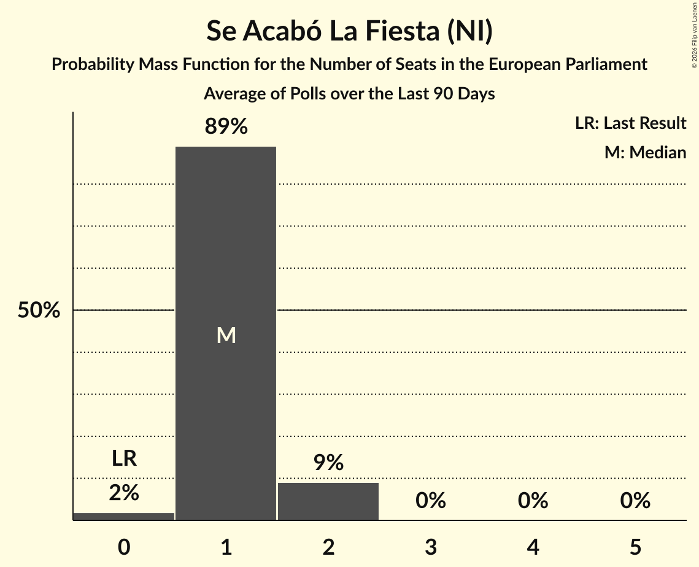

# Se Acabó La Fiesta (NI)

<a href="#voting-intentions">Voting Intentions</a> | <a href="#seats">Seats</a>

## Voting Intentions

Last result: **0.0%** (General Election of 9 June 2024)

### Confidence Intervals

| Period     | Polling firm/Commissioner(s) | Median | 80% Confidence Interval | 90% Confidence Interval | 95% Confidence Interval | 99% Confidence Interval |
|:----------:|:----------------:|:-----------:|:-----------------------:|:-----------------------:|:-----------------------:|:-----------------------:|
| N/A | [Poll Average](average.html) | 3.8% | 2.9–4.9% | 2.7–5.2% | 2.6–5.4% | 2.3–5.9% |
| [3–6 September 2024](2024-09-06-HamalgamaMétrica.html) | Hamalgama Métrica   VozPópuli | 3.9% | 3.2–4.8% | 3.0–5.1% | 2.9–5.3% | 2.6–5.8% |
| [2–6 September 2024](2024-09-06-Celeste-Tel.html) | Celeste-Tel   Onda Cero | 3.3% | 2.7–4.1% | 2.5–4.3% | 2.4–4.5% | 2.1–4.9% |
| [2–6 September 2024](2024-09-06-CIS.html) | CIS | 2.9% | 2.6–3.3% | 2.5–3.4% | 2.4–3.5% | 2.3–3.7% |
| [26–31 August 2024](2024-08-31-SocioMétrica.html) | SocioMétrica   El Español | 4.5% | 4.0–5.1% | 3.8–5.3% | 3.7–5.4% | 3.5–5.7% |
| [22–29 August 2024](2024-08-29-SigmaDos.html) | Sigma Dos   El Mundo | 3.4% | 3.0–3.9% | 2.8–4.1% | 2.7–4.2% | 2.5–4.5% |
| [20–23 August 2024](2024-08-23-NCReport.html) | NC Report   La Razón | 3.8% | 3.0–5.0% | 2.8–5.3% | 2.6–5.6% | 2.3–6.2% |
| [19–23 August 2024](2024-08-23-40dB.html) | 40dB   Prisa | 4.7% | 4.1–5.4% | 4.0–5.6% | 3.9–5.7% | 3.6–6.1% |
| [1–9 August 2024](2024-08-09-SimpleLógica.html) | Simple Lógica   elDiario.es | 3.7% | 2.9–4.9% | 2.7–5.2% | 2.5–5.5% | 2.2–6.1% |
| [5–8 August 2024](2024-08-08-SigmaDos.html) | Sigma Dos   El Mundo | 3.1% | 2.7–3.6% | 2.5–3.8% | 2.4–3.9% | 2.2–4.2% |
| [22 July 2024](2024-07-22-TargetPoint.html) | Target Point   El Debate | 4.1% | 3.2–5.2% | 3.0–5.6% | 2.8–5.9% | 2.4–6.5% |
| [18–20 July 2024](2024-07-20-SocioMétrica.html) | SocioMétrica   El Español | 4.1% | 3.4–4.9% | 3.2–5.2% | 3.1–5.4% | 2.8–5.8% |
| [12–18 July 2024](2024-07-18-SigmaDos.html) | Sigma Dos   El Mundo | 2.9% | 2.5–3.4% | 2.4–3.5% | 2.3–3.6% | 2.1–3.9% |
| [1–10 July 2024](2024-07-10-SimpleLógica.html) | Simple Lógica   elDiario.es | 3.1% | 2.4–4.2% | 2.2–4.5% | 2.0–4.8% | 1.7–5.4% |
| [1–4 July 2024](2024-07-04-HamalgamaMétrica.html) | Hamalgama Métrica   VozPópuli | 3.7% | 3.0–4.6% | 2.9–4.8% | 2.7–5.1% | 2.4–5.5% |
| [1–4 July 2024](2024-07-04-CIS.html) | CIS | 2.7% | 2.4–3.1% | 2.3–3.2% | 2.2–3.2% | 2.1–3.4% |
| [25–28 June 2024](2024-06-28-TargetPoint.html) | Target Point   El Debate | 3.8% | N/A | N/A | N/A | N/A |
| [21–28 June 2024](2024-06-28-SigmaDos.html) | Sigma Dos   El Mundo | 2.7% | 2.3–3.2% | 2.1–3.4% | 2.1–3.5% | 1.9–3.8% |
| [21–24 June 2024](2024-06-24-40dB.html) | 40dB   Prisa | 4.4% | 3.9–5.0% | 3.7–5.2% | 3.6–5.4% | 3.3–5.7% |
| [11–15 June 2024](2024-06-15-NCReport.html) | NC Report   La Razón | 4.3% | 3.4–5.5% | 3.2–5.8% | 3.0–6.1% | 2.6–6.8% |
| [10–14 June 2024](2024-06-14-Invymark.html) | Invymark   laSexta | 0.0% | N/A | N/A | N/A | N/A |
| [1–11 June 2024](2024-06-11-SimpleLógica.html) | Simple Lógica   elDiario.es | 0.0% | N/A | N/A | N/A | N/A |

### Probability Mass Function

The following table shows the probability mass function per percentage block of voting intentions for the [poll average](average.html) for Se Acabó La Fiesta (NI).

| Voting Intentions | Probability | Accumulated | Special Marks |
|:-----------------:|:-----------:|:-----------:|:-------------:|
| 0.0–0.5% | 0% | 100% | Last Result |
| 0.5–1.5% | 0% | 100% |  |
| 1.5–2.5% | 2% | 100% |  |
| 2.5–3.5% | 38% | 98% |  |
| 3.5–4.5% | 39% | 60% | Median |
| 4.5–5.5% | 20% | 21% |  |
| 5.5–6.5% | 2% | 2% |  |
| 6.5–7.5% | 0% | 0% |  |
| 7.5–8.5% | 0% | 0% |  |

## Seats

Last result: **0** seats (General Election of 9 June 2024)

### Confidence Intervals

| Period     | Polling firm/Commissioner(s) | Median | 80% Confidence Interval | 90% Confidence Interval | 95% Confidence Interval | 99% Confidence Interval |
|:----------:|:----------------:|:------:|:-----------------------:|:-----------------------:|:-----------------------:|:-----------------------:|
| N/A | [Poll Average](average.html) | 2 | 1–3 | 1–3 | 1–3 | 1–4 |
| [3–6 September 2024](2024-09-06-HamalgamaMétrica.html) | Hamalgama Métrica   VozPópuli | 2 | 2–3 | 2–3 | 2–3 | 1–3 |
| [2–6 September 2024](2024-09-06-Celeste-Tel.html) | Celeste-Tel   Onda Cero | 2 | 1–2 | 1–2 | 1–3 | 1–3 |
| [2–6 September 2024](2024-09-06-CIS.html) | CIS | 1 | 1–2 | 1–2 | 1–2 | 1–2 |
| [26–31 August 2024](2024-08-31-SocioMétrica.html) | SocioMétrica   El Español | 3 | 3 | 2–3 | 2–3 | 2–3 |
| [22–29 August 2024](2024-08-29-SigmaDos.html) | Sigma Dos   El Mundo | 2 | 2 | 1–2 | 1–2 | 1–3 |
| [20–23 August 2024](2024-08-23-NCReport.html) | NC Report   La Razón | 2 | 2–3 | 2–3 | 2–3 | 1–3 |
| [19–23 August 2024](2024-08-23-40dB.html) | 40dB   Prisa | 3 | 3 | 2–4 | 2–4 | 2–4 |
| [1–9 August 2024](2024-08-09-SimpleLógica.html) | Simple Lógica   elDiario.es | 2 | 2–3 | 1–3 | 1–3 | 1–4 |
| [5–8 August 2024](2024-08-08-SigmaDos.html) | Sigma Dos   El Mundo | 2 | 1–2 | 1–2 | 1–2 | 1–2 |
| [22 July 2024](2024-07-22-TargetPoint.html) | Target Point   El Debate | 2 | 2–3 | 2–3 | 1–4 | 1–4 |
| [18–20 July 2024](2024-07-20-SocioMétrica.html) | SocioMétrica   El Español | 2 | 2–3 | 2–3 | 2–3 | 2–3 |
| [12–18 July 2024](2024-07-18-SigmaDos.html) | Sigma Dos   El Mundo | 2 | 1–2 | 1–2 | 1–2 | 1–2 |
| [1–10 July 2024](2024-07-10-SimpleLógica.html) | Simple Lógica   elDiario.es | 2 | 1–2 | 1–3 | 1–3 | 1–3 |
| [1–4 July 2024](2024-07-04-HamalgamaMétrica.html) | Hamalgama Métrica   VozPópuli | 2 | 1–3 | 1–3 | 1–3 | 1–3 |
| [1–4 July 2024](2024-07-04-CIS.html) | CIS | 1 | 1–2 | 1–2 | 1–2 | 1–2 |
| [25–28 June 2024](2024-06-28-TargetPoint.html) | Target Point   El Debate |  |  |  |  |  |
| [21–28 June 2024](2024-06-28-SigmaDos.html) | Sigma Dos   El Mundo | 1 | 1 | 1 | 1–2 | 1–2 |
| [21–24 June 2024](2024-06-24-40dB.html) | 40dB   Prisa | 3 | 2–3 | 2–3 | 2–3 | 2–4 |
| [11–15 June 2024](2024-06-15-NCReport.html) | NC Report   La Razón | 3 | 2–3 | 2–3 | 2–3 | 2–3 |
| [10–14 June 2024](2024-06-14-Invymark.html) | Invymark   laSexta |  |  |  |  |  |
| [1–11 June 2024](2024-06-11-SimpleLógica.html) | Simple Lógica   elDiario.es |  |  |  |  |  |

### Probability Mass Function

The following table shows the probability mass function per seat for the [poll average](average.html) for Se Acabó La Fiesta (NI).

| Number of Seats | Probability | Accumulated | Special Marks |
|:---------------:|:-----------:|:-----------:|:-------------:|
| 0 | 0% | 100% | Last Result |
| 1 | 13% | 100% |  |
| 2 | 56% | 87% | Median |
| 3 | 30% | 31% |  |
| 4 | 1.1% | 1.1% |  |
| 5 | 0% | 0% |  |

