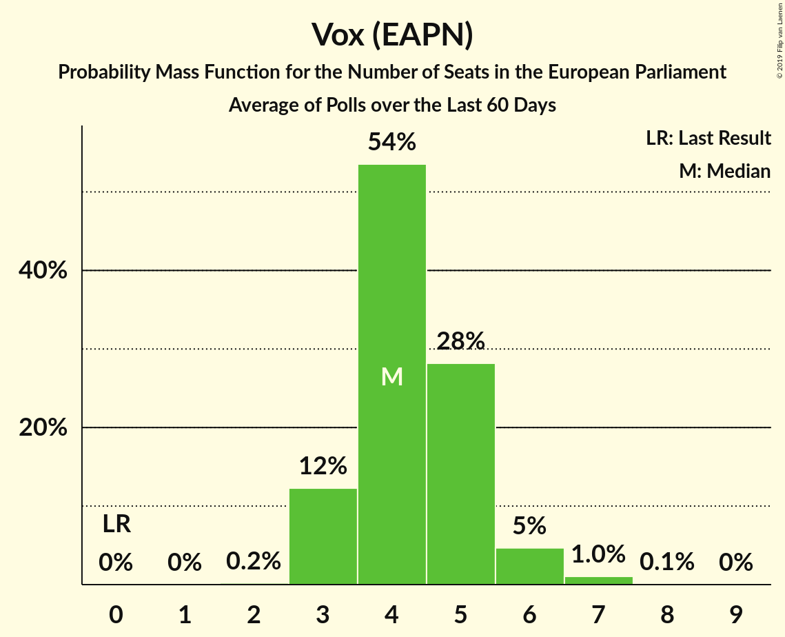

# Vox (EAPN)

<a href="#voting-intentions">Voting Intentions</a> | <a href="#seats">Seats</a>

## Voting Intentions

Last result: **0.0%** (General Election of 25 May 2014)

### Confidence Intervals

| Period     | Polling firm/Commissioner(s) | Median | 80% Confidence Interval | 90% Confidence Interval | 95% Confidence Interval | 99% Confidence Interval |
|:----------:|:----------------:|:-----------:|:-----------------------:|:-----------------------:|:-----------------------:|:-----------------------:|
| N/A | [Poll Average](average.html) | 11.2% | 8.8–13.3% | 8.1–14.0% | 7.6–14.6% | 6.8–15.7% |
| [14–21 April 2019](2019-04-21-SocioMétrica.html) | SocioMétrica   El Español | 12.6% | 11.6–13.7% | 11.4–14.0% | 11.2–14.2% | 10.7–14.8% |
| [13–20 April 2019](2019-04-20-SocioMétrica.html) | SocioMétrica   El Español | 11.8% | 10.9–12.8% | 10.6–13.1% | 10.4–13.4% | 9.9–13.9% |
| [14–20 April 2019](2019-04-20-IMOP.html) | IMOP   El Confidencial | 10.0% | 9.0–11.1% | 8.8–11.4% | 8.5–11.7% | 8.1–12.2% |
| [15–20 April 2019](2019-04-20-Celeste-Tel.html) | Celeste-Tel   eldiario.es | 7.9% | 7.0–9.1% | 6.7–9.4% | 6.4–9.7% | 6.0–10.2% |
| [12–19 April 2019](2019-04-19-SocioMétrica.html) | SocioMétrica   El Español | 10.9% | 10.0–11.9% | 9.7–12.2% | 9.5–12.4% | 9.1–12.9% |
| [15–19 April 2019](2019-04-19-NCReport.html) | NC Report   La Razón | 9.0% | 7.9–10.3% | 7.6–10.6% | 7.4–10.9% | 6.9–11.6% |
| [15–19 April 2019](2019-04-19-Invymark.html) | Invymark   laSexta | 12.7% | 11.5–14.0% | 11.2–14.4% | 10.9–14.7% | 10.4–15.3% |
| [1–19 April 2019](2019-04-19-GAD3.html) | GAD3   ABC | 11.4% | 11.0–11.8% | 10.9–11.9% | 10.8–12.0% | 10.6–12.3% |
| [11–18 April 2019](2019-04-18-Sondaxe.html) | Sondaxe   La Voz de Galicia | 10.5% | 9.3–11.8% | 9.0–12.2% | 8.7–12.6% | 8.2–13.2% |
| [11–18 April 2019](2019-04-18-SocioMétrica.html) | SocioMétrica   El Español | 11.0% | 10.1–12.0% | 9.8–12.3% | 9.6–12.5% | 9.2–13.0% |
| [15–18 April 2019](2019-04-18-DemoscopiayServicios.html) | Demoscopia y Servicios   ESdiario | 12.4% | 11.1–13.9% | 10.8–14.3% | 10.5–14.7% | 9.9–15.4% |
| [15–18 April 2019](2019-04-18-40dB.html) | 40dB   El País | 12.5% | 11.6–13.5% | 11.3–13.8% | 11.1–14.0% | 10.7–14.5% |
| [10–17 April 2019](2019-04-17-SocioMétrica.html) | SocioMétrica   El Español | 10.6% | 9.7–11.6% | 9.5–11.9% | 9.3–12.1% | 8.9–12.6% |
| [15–17 April 2019](2019-04-17-InstitutoDYM.html) | Instituto DYM   El Independiente | 10.4% | 9.3–11.8% | 9.0–12.1% | 8.7–12.5% | 8.2–13.1% |
| [11–17 April 2019](2019-04-17-Celeste-Tel.html) | Celeste-Tel   eldiario.es | 7.7% | 6.8–8.9% | 6.5–9.2% | 6.3–9.5% | 5.9–10.0% |
| [9–16 April 2019](2019-04-16-SocioMétrica.html) | SocioMétrica   El Español | 10.9% | 10.0–11.9% | 9.7–12.2% | 9.5–12.4% | 9.1–12.9% |
| [11–16 April 2019](2019-04-16-Metroscopia.html) | Metroscopia   Henneo | 11.1% | 10.5–11.7% | 10.4–11.9% | 10.2–12.0% | 10.0–12.3% |
| [10–16 April 2019](2019-04-16-IMOP.html) | IMOP   El Confidencial | 9.6% | 8.6–10.7% | 8.4–11.0% | 8.1–11.2% | 7.7–11.8% |
| [13–15 April 2019](2019-04-15-TopPosition.html) | Top Position | 14.2% | 12.9–15.5% | 12.6–15.9% | 12.3–16.3% | 11.7–16.9% |
| [8–15 April 2019](2019-04-15-SocioMétrica.html) | SocioMétrica   El Español | 11.0% | 10.1–12.0% | 9.8–12.3% | 9.6–12.5% | 9.2–13.0% |
| [9–15 April 2019](2019-04-15-GAD3.html) | GAD3   ABC | 11.8% | 10.9–12.8% | 10.7–13.0% | 10.5–13.3% | 10.0–13.8% |
| [12–15 April 2019](2019-04-15-DemoscopiayServicios.html) | Demoscopia y Servicios   OKDIARIO | 12.2% | 10.9–13.7% | 10.5–14.1% | 10.2–14.4% | 9.6–15.2% |
| [30 March–14 April 2019](2019-04-14-NCReport.html) | NC Report   La Razón | 9.1% | 8.0–10.4% | 7.7–10.7% | 7.5–11.1% | 7.0–11.7% |
| [7–13 April 2019](2019-04-13-IMOP.html) | IMOP   El Confidencial | 9.5% | 8.6–10.6% | 8.3–10.9% | 8.1–11.2% | 7.7–11.7% |
| [5–12 April 2019](2019-04-12-SocioMétrica.html) | SocioMétrica   El Español | 11.2% | 10.3–12.2% | 10.1–12.5% | 9.8–12.8% | 9.4–13.3% |
| [8–11 April 2019](2019-04-11-Invymark.html) | Invymark   laSexta | 12.7% | 11.5–14.0% | 11.2–14.4% | 10.9–14.7% | 10.4–15.3% |
| [9–11 April 2019](2019-04-11-GAD3.html) | GAD3   La Vanguardia | 11.2% | 9.9–12.8% | 9.6–13.2% | 9.2–13.6% | 8.6–14.4% |
| [8–11 April 2019](2019-04-11-DemoscopiayServicios.html) | Demoscopia y Servicios   ESdiario | 11.7% | 10.5–13.2% | 10.1–13.6% | 9.8–14.0% | 9.2–14.7% |
| [4–10 April 2019](2019-04-10-Celeste-Tel.html) | Celeste-Tel   eldiario.es | 7.8% | 6.9–9.0% | 6.6–9.3% | 6.4–9.6% | 5.9–10.1% |
| [3–9 April 2019](2019-04-09-IMOP.html) | IMOP   El Confidencial | 9.8% | 8.9–10.9% | 8.6–11.2% | 8.4–11.5% | 7.9–12.0% |
| [8–9 April 2019](2019-04-09-GAD3.html) | GAD3   ABC | 11.2% | 10.3–12.2% | 10.1–12.4% | 9.9–12.7% | 9.5–13.1% |
| [22 February–7 April 2019](2019-04-07-electoPanel.html) | electoPanel   electomania.es | 11.7% | 11.3–12.1% | 11.2–12.3% | 11.1–12.4% | 10.9–12.6% |
| [22 February–7 April 2019](2019-04-07-NCReport.html) | NC Report   La Razón | 9.4% | 8.3–10.7% | 8.0–11.1% | 7.7–11.4% | 7.2–12.0% |
| [31 March–6 April 2019](2019-04-06-IMOP.html) | IMOP   El Confidencial | 9.3% | 8.4–10.4% | 8.1–10.7% | 7.9–10.9% | 7.5–11.4% |
| [1–5 April 2019](2019-04-05-SimpleLógica.html) | Simple Lógica | 9.8% | 8.7–11.1% | 8.4–11.4% | 8.1–11.7% | 7.6–12.4% |
| [1–5 April 2019](2019-04-05-GESOP.html) | GESOP   El Periódico | 10.6% | 9.6–11.7% | 9.4–12.0% | 9.1–12.3% | 8.7–12.8% |
| [26 March–4 April 2019](2019-04-04-GAD3.html) | GAD3   ABC | 9.8% | 9.2–10.4% | 9.1–10.6% | 8.9–10.8% | 8.6–11.1% |
| [26 March–3 April 2019](2019-04-03-Celeste-Tel.html) | Celeste-Tel   eldiario.es | 8.7% | 7.7–9.9% | 7.4–10.3% | 7.2–10.5% | 6.7–11.1% |
| [27 March–2 April 2019](2019-04-02-IMOP.html) | IMOP   El Confidencial | 9.6% | 8.6–10.7% | 8.4–10.9% | 8.2–11.2% | 7.7–11.8% |
| [22 February–31 March 2019](2019-03-31-electoPanel.html) | electoPanel   electomania.es | 11.9% | 11.5–12.4% | 11.3–12.5% | 11.2–12.6% | 11.0–12.8% |
| [28–30 March 2019](2019-03-30-NCReport.html) | NC Report   La Razón | 10.3% | 8.4–12.9% | 7.8–13.7% | 7.4–14.3% | 6.5–15.6% |
| [24–30 March 2019](2019-03-30-IMOP.html) | IMOP   El Confidencial | 9.5% | 8.6–10.6% | 8.3–10.9% | 8.1–11.2% | 7.7–11.7% |
| [25–29 March 2019](2019-03-29-SocioMétrica.html) | SocioMétrica   El Español | 11.9% | 10.9–13.0% | 10.6–13.3% | 10.4–13.6% | 9.9–14.1% |
| [25–29 March 2019](2019-03-29-Invymark.html) | Invymark   laSexta | 12.9% | 11.7–14.2% | 11.4–14.6% | 11.1–14.9% | 10.6–15.6% |
| [24–27 March 2019](2019-03-27-DemoscopiayServicios.html) | Demoscopia y Servicios   OKDIARIO | 11.2% | 10.1–12.5% | 9.8–12.9% | 9.5–13.2% | 9.0–13.8% |
| [21–27 March 2019](2019-03-27-Celeste-Tel.html) | Celeste-Tel   eldiario.es | 9.1% | 8.1–10.3% | 7.8–10.6% | 7.5–10.9% | 7.1–11.6% |
| [20–26 March 2019](2019-03-26-IMOP.html) | IMOP   El Confidencial | 10.1% | 9.1–11.2% | 8.8–11.5% | 8.6–11.8% | 8.2–12.3% |
| [20–25 March 2019](2019-03-25-SigmaDos.html) | Sigma Dos   El Mundo | 9.6% | 8.5–10.9% | 8.2–11.3% | 7.9–11.6% | 7.4–12.2% |
| [18–25 March 2019](2019-03-25-Metroscopia.html) | Metroscopia   Henneo | 11.7% | 10.9–12.5% | 10.7–12.7% | 10.5–13.0% | 10.2–13.4% |
| [22 February–24 March 2019](2019-03-24-electoPanel.html) | electoPanel   electomania.es | 11.3% | 10.9–11.8% | 10.7–11.9% | 10.6–12.0% | 10.4–12.2% |
| [17–23 March 2019](2019-03-23-IMOP.html) | IMOP   El Confidencial | 11.0% | 10.0–12.2% | 9.7–12.5% | 9.5–12.8% | 9.0–13.3% |
| [18–22 March 2019](2019-03-22-NCReport.html) | NC Report   La Razón | 10.7% | 9.5–12.1% | 9.2–12.4% | 8.9–12.8% | 8.4–13.5% |
| [1–22 March 2019](2019-03-22-GAD3.html) | GAD3   ABC | 11.5% | 11.0–12.0% | 10.9–12.1% | 10.8–12.3% | 10.6–12.5% |
| [15–20 March 2019](2019-03-20-Sondaxe.html) | Sondaxe   La Voz de Galicia | 13.9% | 12.6–15.4% | 12.2–15.8% | 11.9–16.2% | 11.3–16.9% |
| [14–19 March 2019](2019-03-19-40dB.html) | 40dB   El País | 10.2% | 9.3–11.3% | 9.0–11.6% | 8.8–11.8% | 8.3–12.4% |
| [1–18 March 2019](2019-03-18-CIS.html) | CIS | 11.9% | 11.6–12.2% | 11.5–12.3% | 11.4–12.4% | 11.2–12.6% |
| [22 February–17 March 2019](2019-03-17-electoPanel.html) | electoPanel   electomania.es | 13.4% | 12.9–13.9% | 12.8–14.1% | 12.6–14.2% | 12.4–14.5% |
| [11–15 March 2019](2019-03-15-NCReport.html) | NC Report   La Razón | 10.3% | 9.2–11.6% | 8.8–12.0% | 8.6–12.3% | 8.0–13.0% |
| [4–13 March 2019](2019-03-13-SimpleLógica.html) | Simple Lógica | 8.6% | 7.6–9.8% | 7.3–10.1% | 7.1–10.4% | 6.6–11.0% |
| [8–11 March 2019](2019-03-11-Celeste-Tel.html) | Celeste-Tel   eldiario.es | 9.6% | 8.6–10.9% | 8.3–11.2% | 8.0–11.5% | 7.5–12.1% |
| [22 February–10 March 2019](2019-03-10-electoPanel.html) | electoPanel   electomania.es | 13.3% | 12.8–13.8% | 12.6–14.0% | 12.5–14.1% | 12.3–14.4% |
| [5–8 March 2019](2019-03-08-SocioMétrica.html) | SocioMétrica   El Español | 12.1% | 11.1–13.2% | 10.9–13.5% | 10.6–13.8% | 10.2–14.4% |
| [4–8 March 2019](2019-03-08-Invymark.html) | Invymark   laSexta | 11.5% | 10.4–12.8% | 10.1–13.1% | 9.8–13.4% | 9.3–14.1% |
| [4–8 March 2019](2019-03-08-GAD3.html) | GAD3   ABC | 12.1% | N/A | N/A | N/A | N/A |
| [22 February–3 March 2019](2019-03-03-electoPanel.html) | electoPanel   electomania.es | 13.4% | N/A | N/A | N/A | N/A |
| [25–28 February 2019](2019-02-28-SigmaDos.html) | Sigma Dos   El Mundo | 8.4% | N/A | N/A | N/A | N/A |
| [19–22 February 2019](2019-02-22-SigmaDos.html) | Sigma Dos   El Mundo | 13.3% | N/A | N/A | N/A | N/A |
| [18–22 February 2019](2019-02-22-GAD3.html) | GAD3   ABC | 10.8% | N/A | N/A | N/A | N/A |
| [13–21 February 2019](2019-02-21-Sondaxe.html) | Sondaxe   La Voz de Galicia | 14.2% | N/A | N/A | N/A | N/A |
| [18–21 February 2019](2019-02-21-Invymark.html) | Invymark   laSexta | 11.3% | N/A | N/A | N/A | N/A |
| [13–15 February 2019](2019-02-15-SocioMétrica.html) | SocioMétrica   El Español | 11.8% | N/A | N/A | N/A | N/A |
| [11–15 February 2019](2019-02-15-NCReport.html) | NC Report   La Razón | 10.0% | N/A | N/A | N/A | N/A |
| [13–15 February 2019](2019-02-15-GESOP.html) | GESOP   El Periódico | 13.0% | N/A | N/A | N/A | N/A |
| [12–15 February 2019](2019-02-15-GAD3.html) | GAD3   La Vanguardia | 8.8% | N/A | N/A | N/A | N/A |
| [11–13 February 2019](2019-02-13-Metroscopia.html) | Metroscopia   Henneo | 12.7% | N/A | N/A | N/A | N/A |
| [1–8 February 2019](2019-02-08-SimpleLógica.html) | Simple Lógica | 11.7% | N/A | N/A | N/A | N/A |
| [4–8 February 2019](2019-02-08-Celeste-Tel.html) | Celeste-Tel   eldiario.es | 8.9% | N/A | N/A | N/A | N/A |
| [28 January–1 February 2019](2019-02-01-Invymark.html) | Invymark   laSexta | 11.2% | N/A | N/A | N/A | N/A |
| [26–30 January 2019](2019-01-30-electoPanel.html) | electoPanel   electomania.es | 13.0% | N/A | N/A | N/A | N/A |
| [21–25 January 2019](2019-01-25-NCReport.html) | NC Report   La Razón | 9.4% | N/A | N/A | N/A | N/A |
| [14–24 January 2019](2019-01-24-GAD3.html) | GAD3   ABC | 9.8% | N/A | N/A | N/A | N/A |
| [14–18 January 2019](2019-01-18-Invymark.html) | Invymark   laSexta | 8.9% | N/A | N/A | N/A | N/A |
| [9–15 January 2019](2019-01-15-Metroscopia.html) | Metroscopia   Henneo | 12.1% | N/A | N/A | N/A | N/A |
| [6–13 January 2019](2019-01-13-electoPanel.html) | electoPanel   electomania.es | 13.0% | N/A | N/A | N/A | N/A |
| [1–13 January 2019](2019-01-13-CIS.html) | CIS | 6.5% | N/A | N/A | N/A | N/A |
| [3–9 January 2019](2019-01-09-SimpleLógica.html) | Simple Lógica | 11.5% | N/A | N/A | N/A | N/A |
| [2–8 January 2019](2019-01-08-Celeste-Tel.html) | Celeste-Tel   eldiario.es | 8.1% | N/A | N/A | N/A | N/A |
| [22 December 2018–5 January 2019](2019-01-05-SocioMétrica.html) | SocioMétrica   El Español | 15.6% | N/A | N/A | N/A | N/A |
| [21–27 December 2018](2018-12-27-SigmaDos.html) | Sigma Dos   El Mundo | 12.9% | 11.6–14.4% | 11.3–14.8% | 11.0–15.1% | 10.4–15.9% |
| [17–21 December 2018](2018-12-21-Invymark.html) | Invymark   laSexta | 7.8% | N/A | N/A | N/A | N/A |
| [16 December 2018](2018-12-16-SigmaDos.html) | Sigma Dos   Antena 3 | 9.2% | 8.1–10.5% | 7.8–10.8% | 7.6–11.2% | 7.1–11.8% |
| [10–14 December 2018](2018-12-14-SocioMétrica.html) | SocioMétrica   El Español | 8.6% | 7.5–9.9% | 7.1–10.2% | 6.9–10.6% | 6.4–11.2% |
| [3–14 December 2018](2018-12-14-SimpleLógica.html) | Simple Lógica | 8.7% | 7.8–9.9% | 7.5–10.2% | 7.3–10.5% | 6.8–11.0% |
| [5–14 December 2018](2018-12-14-NCReport.html) | NC Report   La Razón | 8.7% | 7.7–10.0% | 7.3–10.3% | 7.1–10.6% | 6.6–11.2% |
| [10–14 December 2018](2018-12-14-GAD3.html) | GAD3   ABC | 8.7% | 7.6–9.9% | 7.3–10.3% | 7.1–10.6% | 6.6–11.2% |
| [10–13 December 2018](2018-12-13-IMOP.html) | IMOP   El Confidencial | 8.0% | 7.0–9.2% | 6.7–9.5% | 6.5–9.8% | 6.1–10.4% |
| [10–12 December 2018](2018-12-12-Metroscopia.html) | Metroscopia   Henneo | 11.5% | N/A | N/A | N/A | N/A |
| [3–11 December 2018](2018-12-11-Celeste-Tel.html) | Celeste-Tel   eldiario.es | 6.8% | N/A | N/A | N/A | N/A |
| [3–7 December 2018](2018-12-07-Invymark.html) | Invymark   laSexta | 7.3% | N/A | N/A | N/A | N/A |
| [5 December 2018](2018-12-05-SocioMétrica.html) | SocioMétrica   El Español | 11.0% | N/A | N/A | N/A | N/A |
| [3–4 December 2018](2018-12-04-electoPanel.html) | electoPanel   electomania.es | 10.4% | N/A | N/A | N/A | N/A |
| [2–14 November 2018](2018-11-14-SimpleLógica.html) | Simple Lógica | 0.0% | N/A | N/A | N/A | N/A |
| [5–9 November 2018](2018-11-09-NCReport.html) | NC Report   La Razón | 2.1% | N/A | N/A | N/A | N/A |
| [5–9 November 2018](2018-11-09-Invymark.html) | Invymark   laSexta | 0.0% | N/A | N/A | N/A | N/A |
| [5–9 November 2018](2018-11-09-Celeste-Tel.html) | Celeste-Tel   eldiario.es | 1.5% | N/A | N/A | N/A | N/A |
| [2–7 November 2018](2018-11-07-GAD3.html) | GAD3   La Vanguardia | 3.4% | N/A | N/A | N/A | N/A |
| [22–30 October 2018](2018-10-30-GESOP.html) | GESOP   El Periódico | 4.3% | N/A | N/A | N/A | N/A |
| [20–26 October 2018](2018-10-26-electoPanel.html) | electoPanel   electomania.es | 3.6% | N/A | N/A | N/A | N/A |
| [22–26 October 2018](2018-10-26-Invymark.html) | Invymark   laSexta | 0.0% | N/A | N/A | N/A | N/A |
| [16–18 October 2018](2018-10-18-Metroscopia.html) | Metroscopia   Henneo | 5.1% | N/A | N/A | N/A | N/A |
| [1–11 October 2018](2018-10-11-NCReport.html) | NC Report   La Razón | 1.9% | N/A | N/A | N/A | N/A |
| [1–9 October 2018](2018-10-09-CIS.html) | CIS | 1.3% | N/A | N/A | N/A | N/A |
| [30 September–5 October 2018](2018-10-05-electoPanel.html) | electoPanel   electomania.es | 2.5% | N/A | N/A | N/A | N/A |
| [1–5 October 2018](2018-10-05-SimpleLógica.html) | Simple Lógica | 0.0% | N/A | N/A | N/A | N/A |
| [1–5 October 2018](2018-10-05-Celeste-Tel.html) | Celeste-Tel   eldiario.es | 1.0% | N/A | N/A | N/A | N/A |
| [2 October 2018](2018-10-02-SimpleLógica.html) | Simple Lógica   eldebate.es | 2.0% | N/A | N/A | N/A | N/A |
| [24–28 September 2018](2018-09-28-Invymark.html) | Invymark   laSexta | 0.0% | N/A | N/A | N/A | N/A |
| [17–19 September 2018](2018-09-19-Metroscopia.html) | Metroscopia   Henneo | 0.0% | N/A | N/A | N/A | N/A |
| [17–19 September 2018](2018-09-19-InstitutoDYM.html) | Instituto DYM   El Independiente | 0.0% | N/A | N/A | N/A | N/A |
| [10–14 September 2018](2018-09-14-Invymark.html) | Invymark   laSexta | 0.0% | N/A | N/A | N/A | N/A |
| [6–11 September 2018](2018-09-11-IMOP.html) | IMOP   El Confidencial | 3.0% | N/A | N/A | N/A | N/A |
| [1–11 September 2018](2018-09-11-CIS.html) | CIS | 1.4% | N/A | N/A | N/A | N/A |
| [7–9 September 2018](2018-09-09-electoPanel.html) | electoPanel   electomania.es | 1.6% | N/A | N/A | N/A | N/A |
| [3–7 September 2018](2018-09-07-SimpleLógica.html) | Simple Lógica | 0.0% | N/A | N/A | N/A | N/A |
| [3–7 September 2018](2018-09-07-GAD3.html) | GAD3   ABC | 1.5% | N/A | N/A | N/A | N/A |
| [3–7 September 2018](2018-09-07-Celeste-Tel.html) | Celeste-Tel   eldiario.es | 0.0% | N/A | N/A | N/A | N/A |
| [27–31 August 2018](2018-08-31-NCReport.html) | NC Report   La Razón | 0.0% | N/A | N/A | N/A | N/A |
| [22–30 August 2018](2018-08-30-SocioMétrica.html) | SocioMétrica   El Español | 1.8% | N/A | N/A | N/A | N/A |
| [1–7 August 2018](2018-08-07-Celeste-Tel.html) | Celeste-Tel   eldiario.es | 0.0% | N/A | N/A | N/A | N/A |
| [27 July–3 August 2018](2018-08-03-electoPanel.html) | electoPanel   electomania.es | 1.0% | N/A | N/A | N/A | N/A |
| [1–3 August 2018](2018-08-03-SimpleLógica.html) | Simple Lógica | 0.0% | N/A | N/A | N/A | N/A |
| [23–27 July 2018](2018-07-27-NCReport.html) | NC Report   La Razón | 0.0% | N/A | N/A | N/A | N/A |
| [23–27 July 2018](2018-07-27-Invymark.html) | Invymark   laSexta | 0.0% | N/A | N/A | N/A | N/A |
| [24–26 July 2018](2018-07-26-GAD3.html) | GAD3   ABC | 0.0% | N/A | N/A | N/A | N/A |
| [16–25 July 2018](2018-07-25-Metroscopia.html) | Metroscopia   Henneo | 0.0% | N/A | N/A | N/A | N/A |
| [22–25 July 2018](2018-07-25-DemoscopiayServicios.html) | Demoscopia y Servicios   OKDIARIO | 0.0% | N/A | N/A | N/A | N/A |
| [17–22 July 2018](2018-07-22-electoPanel.html) | electoPanel   electomania.es | 1.7% | N/A | N/A | N/A | N/A |
| [9–13 July 2018](2018-07-13-Invymark.html) | Invymark   laSexta | 0.0% | N/A | N/A | N/A | N/A |
| [9–12 July 2018](2018-07-12-SigmaDos.html) | Sigma Dos   El Mundo | 0.0% | N/A | N/A | N/A | N/A |
| [1–10 July 2018](2018-07-10-CIS.html) | CIS | 0.0% | N/A | N/A | N/A | N/A |
| [2–6 July 2018](2018-07-06-SimpleLógica.html) | Simple Lógica | 0.0% | N/A | N/A | N/A | N/A |
| [2–6 July 2018](2018-07-06-Celeste-Tel.html) | Celeste-Tel   eldiario.es | 0.0% | N/A | N/A | N/A | N/A |
| [25–30 June 2018](2018-06-30-NCReport.html) | NC Report   La Razón | 0.0% | N/A | N/A | N/A | N/A |
| [19–22 June 2018](2018-06-22-SocioMétrica.html) | SocioMétrica   El Español | 2.1% | N/A | N/A | N/A | N/A |
| [18–22 June 2018](2018-06-22-Invymark.html) | Invymark   laSexta | 0.0% | N/A | N/A | N/A | N/A |
| [11–13 June 2018](2018-06-13-GESOP.html) | GESOP   El Periódico | 0.0% | N/A | N/A | N/A | N/A |
| [11–12 June 2018](2018-06-12-InstitutoDYM.html) | Instituto DYM   El Independiente | 0.0% | N/A | N/A | N/A | N/A |
| [1–9 June 2018](2018-06-09-NCReport.html) | NC Report   La Razón | 0.0% | N/A | N/A | N/A | N/A |
| [4–8 June 2018](2018-06-08-SimpleLógica.html) | Simple Lógica | 0.0% | N/A | N/A | N/A | N/A |
| [4–8 June 2018](2018-06-08-Invymark.html) | Invymark   laSexta | 0.0% | N/A | N/A | N/A | N/A |
| [7–8 June 2018](2018-06-08-GAD3.html) | GAD3   ABC | 1.1% | N/A | N/A | N/A | N/A |
| [4–8 June 2018](2018-06-08-Celeste-Tel.html) | Celeste-Tel   eldiario.es | 0.0% | N/A | N/A | N/A | N/A |
| [26 May–2 June 2018](2018-06-02-electoPanel.html) | electoPanel   electomania.es | 4.6% | N/A | N/A | N/A | N/A |
| [28–29 May 2018](2018-05-29-Invymark.html) | Invymark   laSexta | 0.0% | N/A | N/A | N/A | N/A |
| [26–28 May 2018](2018-05-28-electoPanel.html) | electoPanel   electomania.es | 3.1% | N/A | N/A | N/A | N/A |
| [23–28 May 2018](2018-05-28-IMOP.html) | IMOP   El Confidencial | 0.0% | N/A | N/A | N/A | N/A |
| [17–26 May 2018](2018-05-26-SocioMétrica.html) | SocioMétrica   El Español | 1.9% | N/A | N/A | N/A | N/A |
| [16–25 May 2018](2018-05-25-NCReport.html) | NC Report   La Razón | 0.0% | N/A | N/A | N/A | N/A |
| [3–10 May 2018](2018-05-10-SimpleLógica.html) | Simple Lógica | 0.0% | N/A | N/A | N/A | N/A |
| [7–9 May 2018](2018-05-09-Metroscopia.html) | Metroscopia   El País | 0.0% | N/A | N/A | N/A | N/A |
| [26–30 April 2018](2018-04-30-Celeste-Tel.html) | Celeste-Tel   PSOE | 0.0% | N/A | N/A | N/A | N/A |
| [12–18 April 2018](2018-04-18-GESOP.html) | GESOP   El Periódico | 0.0% | N/A | N/A | N/A | N/A |
| [9–13 April 2018](2018-04-13-NCReport.html) | NC Report   La Razón | 0.0% | N/A | N/A | N/A | N/A |
| [9–13 April 2018](2018-04-13-Invymark.html) | Invymark   laSexta | 0.0% | N/A | N/A | N/A | N/A |
| [1–10 April 2018](2018-04-10-CIS.html) | CIS | 0.0% | N/A | N/A | N/A | N/A |
| [2–9 April 2018](2018-04-09-SimpleLógica.html) | Simple Lógica | 0.0% | N/A | N/A | N/A | N/A |
| [2–6 April 2018](2018-04-06-Celeste-Tel.html) | Celeste-Tel   eldiario.es | 0.0% | N/A | N/A | N/A | N/A |
| [4–5 April 2018](2018-04-05-Metroscopia.html) | Metroscopia   El País | 0.0% | N/A | N/A | N/A | N/A |
| [19–29 March 2018](2018-03-29-SocioMétrica.html) | SocioMétrica   El Español | 1.5% | N/A | N/A | N/A | N/A |
| [23–27 March 2018](2018-03-27-SigmaDos.html) | Sigma Dos   El Mundo | 0.0% | N/A | N/A | N/A | N/A |
| [13–16 March 2018](2018-03-16-MyWord.html) | MyWord   Cadena SER | 0.0% | N/A | N/A | N/A | N/A |
| [12–16 March 2018](2018-03-16-Invymark.html) | Invymark   laSexta | 0.0% | N/A | N/A | N/A | N/A |
| [12–14 March 2018](2018-03-14-GAD3.html) | GAD3   La Vanguardia | 0.0% | N/A | N/A | N/A | N/A |
| [1–7 March 2018](2018-03-07-SimpleLógica.html) | Simple Lógica | 0.0% | N/A | N/A | N/A | N/A |
| [1–7 March 2018](2018-03-07-Celeste-Tel.html) | Celeste-Tel   eldiario.es | 0.0% | N/A | N/A | N/A | N/A |
| [2–5 March 2018](2018-03-05-Metroscopia.html) | Metroscopia   El País | 0.0% | N/A | N/A | N/A | N/A |
| [26 February–2 March 2018](2018-03-02-NCReport.html) | NC Report   La Razón | 0.0% | N/A | N/A | N/A | N/A |
| [26 February–2 March 2018](2018-03-02-Invymark.html) | Invymark   laSexta | 0.0% | N/A | N/A | N/A | N/A |
| [22–27 February 2018](2018-02-27-IMOP.html) | IMOP   El Confidencial | 0.0% | N/A | N/A | N/A | N/A |
| [12–16 February 2018](2018-02-16-Invymark.html) | Invymark   laSexta | 0.0% | N/A | N/A | N/A | N/A |
| [7–14 February 2018](2018-02-14-MyWord.html) | MyWord   Cadena SER | 0.0% | N/A | N/A | N/A | N/A |
| [5–9 February 2018](2018-02-09-Celeste-Tel.html) | Celeste-Tel   eldiario.es | 0.0% | N/A | N/A | N/A | N/A |
| [5–8 February 2018](2018-02-08-Metroscopia.html) | Metroscopia   El País | 0.0% | N/A | N/A | N/A | N/A |
| [1–7 February 2018](2018-02-07-SimpleLógica.html) | Simple Lógica | 0.0% | N/A | N/A | N/A | N/A |
| [31 January–7 February 2018](2018-02-07-GAD3.html) | GAD3   ABC | 0.0% | N/A | N/A | N/A | N/A |
| [22–26 January 2018](2018-01-26-Invymark.html) | Invymark   laSexta | 0.0% | N/A | N/A | N/A | N/A |
| [2–14 January 2018](2018-01-14-CIS.html) | CIS | 0.0% | N/A | N/A | N/A | N/A |
| [9–11 January 2018](2018-01-11-Metroscopia.html) | Metroscopia   El País | 0.0% | N/A | N/A | N/A | N/A |
| [8–11 January 2018](2018-01-11-GAD3.html) | GAD3   ABC | 0.0% | N/A | N/A | N/A | N/A |
| [2–8 January 2018](2018-01-08-SimpleLógica.html) | Simple Lógica | 0.0% | N/A | N/A | N/A | N/A |
| [2–5 January 2018](2018-01-05-Celeste-Tel.html) | Celeste-Tel   eldiario.es | 0.0% | N/A | N/A | N/A | N/A |

### Probability Mass Function

The following table shows the probability mass function per percentage block of voting intentions for the [poll average](average.html) for Vox (EAPN).

| Voting Intentions | Probability | Accumulated | Special Marks |
|:-----------------:|:-----------:|:-----------:|:-------------:|
| 0.0–0.5% | 0% | 100% | Last Result |
| 0.5–1.5% | 0% | 100% |  |
| 1.5–2.5% | 0% | 100% |  |
| 2.5–3.5% | 0% | 100% |  |
| 3.5–4.5% | 0% | 100% |  |
| 4.5–5.5% | 0% | 100% |  |
| 5.5–6.5% | 0.2% | 100% |  |
| 6.5–7.5% | 2% | 99.8% |  |
| 7.5–8.5% | 6% | 98% |  |
| 8.5–9.5% | 12% | 92% |  |
| 9.5–10.5% | 17% | 80% |  |
| 10.5–11.5% | 24% | 63% | Median |
| 11.5–12.5% | 20% | 39% |  |
| 12.5–13.5% | 11% | 19% |  |
| 13.5–14.5% | 5% | 8% |  |
| 14.5–15.5% | 2% | 3% |  |
| 15.5–16.5% | 0.6% | 0.6% |  |
| 16.5–17.5% | 0.1% | 0.1% |  |
| 17.5–18.5% | 0% | 0% |  |

## Seats

Last result: **0** seats (General Election of 25 May 2014)

### Confidence Intervals

| Period     | Polling firm/Commissioner(s) | Median | 80% Confidence Interval | 90% Confidence Interval | 95% Confidence Interval | 99% Confidence Interval |
|:----------:|:----------------:|:------:|:-----------------------:|:-----------------------:|:-----------------------:|:-----------------------:|
| N/A | [Poll Average](average.html) | 6 | 5–7 | 4–8 | 4–8 | 4–9 |
| [14–21 April 2019](2019-04-21-SocioMétrica.html) | SocioMétrica   El Español | 7 | 6–8 | 6–8 | 6–8 | 6–8 |
| [13–20 April 2019](2019-04-20-SocioMétrica.html) | SocioMétrica   El Español | 6 | 6–7 | 6–7 | 6–7 | 5–8 |
| [14–20 April 2019](2019-04-20-IMOP.html) | IMOP   El Confidencial | 5 | 5–6 | 5–6 | 4–6 | 4–7 |
| [15–20 April 2019](2019-04-20-Celeste-Tel.html) | Celeste-Tel   eldiario.es | 4 | 4–5 | 3–5 | 3–5 | 3–5 |
| [12–19 April 2019](2019-04-19-SocioMétrica.html) | SocioMétrica   El Español | 6 | 5–6 | 5–7 | 5–7 | 5–7 |
| [15–19 April 2019](2019-04-19-NCReport.html) | NC Report   La Razón | 5 | 4–5 | 4–6 | 4–6 | 4–6 |
| [15–19 April 2019](2019-04-19-Invymark.html) | Invymark   laSexta | 7 | 6–8 | 6–8 | 6–8 | 5–8 |
| [1–19 April 2019](2019-04-19-GAD3.html) | GAD3   ABC | 6 | 6 | 6 | 6 | 6–7 |
| [11–18 April 2019](2019-04-18-Sondaxe.html) | Sondaxe   La Voz de Galicia | 5 | 5–7 | 5–7 | 5–7 | 5–7 |
| [11–18 April 2019](2019-04-18-SocioMétrica.html) | SocioMétrica   El Español | 6 | 5–7 | 5–7 | 5–7 | 5–7 |
| [15–18 April 2019](2019-04-18-DemoscopiayServicios.html) | Demoscopia y Servicios   ESdiario | 7 | 6–8 | 6–8 | 6–8 | 5–8 |
| [15–18 April 2019](2019-04-18-40dB.html) | 40dB   El País | 7 | 6–8 | 6–8 | 6–8 | 6–8 |
| [10–17 April 2019](2019-04-17-SocioMétrica.html) | SocioMétrica   El Español | 6 | 5–6 | 5–7 | 5–7 | 5–7 |
| [15–17 April 2019](2019-04-17-InstitutoDYM.html) | Instituto DYM   El Independiente | 5 | 5–6 | 5–6 | 4–7 | 4–7 |
| [11–17 April 2019](2019-04-17-Celeste-Tel.html) | Celeste-Tel   eldiario.es | 4 | 3–5 | 3–5 | 3–5 | 3–5 |
| [9–16 April 2019](2019-04-16-SocioMétrica.html) | SocioMétrica   El Español | 6 | 6 | 5–7 | 5–7 | 5–7 |
| [11–16 April 2019](2019-04-16-Metroscopia.html) | Metroscopia   Henneo | 6 | 5–6 | 5–6 | 5–6 | 5–7 |
| [10–16 April 2019](2019-04-16-IMOP.html) | IMOP   El Confidencial | 5 | 5–6 | 4–6 | 4–6 | 4–6 |
| [13–15 April 2019](2019-04-15-TopPosition.html) | Top Position | 8 | 7–8 | 7–9 | 7–9 | 6–9 |
| [8–15 April 2019](2019-04-15-SocioMétrica.html) | SocioMétrica   El Español | 6 | 5–7 | 5–7 | 5–7 | 5–7 |
| [9–15 April 2019](2019-04-15-GAD3.html) | GAD3   ABC | 6 | 6–7 | 6–7 | 5–7 | 5–7 |
| [12–15 April 2019](2019-04-15-DemoscopiayServicios.html) | Demoscopia y Servicios   OKDIARIO | 7 | 6–7 | 6–8 | 5–8 | 5–8 |
| [30 March–14 April 2019](2019-04-14-NCReport.html) | NC Report   La Razón | 5 | 4–6 | 4–6 | 4–6 | 4–6 |
| [7–13 April 2019](2019-04-13-IMOP.html) | IMOP   El Confidencial | 5 | 4–6 | 4–6 | 4–6 | 4–6 |
| [5–12 April 2019](2019-04-12-SocioMétrica.html) | SocioMétrica   El Español | 6 | 6–7 | 6–7 | 5–7 | 5–7 |
| [8–11 April 2019](2019-04-11-Invymark.html) | Invymark   laSexta | 7 | 6–7 | 6–8 | 6–8 | 5–8 |
| [9–11 April 2019](2019-04-11-GAD3.html) | GAD3   La Vanguardia | 6 | 6–7 | 5–7 | 5–7 | 5–8 |
| [8–11 April 2019](2019-04-11-DemoscopiayServicios.html) | Demoscopia y Servicios   ESdiario | 6 | 6–7 | 5–7 | 5–8 | 5–8 |
| [4–10 April 2019](2019-04-10-Celeste-Tel.html) | Celeste-Tel   eldiario.es | 4 | 3–5 | 3–5 | 3–5 | 3–6 |
| [3–9 April 2019](2019-04-09-IMOP.html) | IMOP   El Confidencial | 5 | 5–6 | 5–6 | 4–6 | 4–7 |
| [8–9 April 2019](2019-04-09-GAD3.html) | GAD3   ABC | 6 | 5–6 | 5–7 | 5–7 | 5–7 |
| [22 February–7 April 2019](2019-04-07-electoPanel.html) | electoPanel   electomania.es | 6 | 6–7 | 6–7 | 6–7 | 6–7 |
| [22 February–7 April 2019](2019-04-07-NCReport.html) | NC Report   La Razón | 5 | 4–6 | 4–6 | 4–6 | 4–7 |
| [31 March–6 April 2019](2019-04-06-IMOP.html) | IMOP   El Confidencial | 5 | 4–6 | 4–6 | 4–6 | 4–6 |
| [1–5 April 2019](2019-04-05-SimpleLógica.html) | Simple Lógica | 5 | 4–6 | 4–6 | 4–6 | 4–7 |
| [1–5 April 2019](2019-04-05-GESOP.html) | GESOP   El Periódico | 6 | 5–6 | 5–6 | 5–6 | 4–7 |
| [26 March–4 April 2019](2019-04-04-GAD3.html) | GAD3   ABC | 5 | 5 | 5–6 | 5–6 | 4–6 |
| [26 March–3 April 2019](2019-04-03-Celeste-Tel.html) | Celeste-Tel   eldiario.es | 5 | 4–5 | 4–5 | 4–6 | 3–6 |
| [27 March–2 April 2019](2019-04-02-IMOP.html) | IMOP   El Confidencial | 5 | 5–6 | 5–6 | 4–6 | 4–6 |
| [22 February–31 March 2019](2019-03-31-electoPanel.html) | electoPanel   electomania.es | 7 | 6–7 | 6–7 | 6–7 | 6–7 |
| [28–30 March 2019](2019-03-30-NCReport.html) | NC Report   La Razón | 5 | 4–7 | 4–7 | 4–8 | 3–8 |
| [24–30 March 2019](2019-03-30-IMOP.html) | IMOP   El Confidencial | 5 | 4–6 | 4–6 | 4–6 | 4–6 |
| [25–29 March 2019](2019-03-29-SocioMétrica.html) | SocioMétrica   El Español | 6 | 6 | 5–6 | 5–7 | 5–7 |
| [25–29 March 2019](2019-03-29-Invymark.html) | Invymark   laSexta | 7 | 6–7 | 6–7 | 6–8 | 6–8 |
| [24–27 March 2019](2019-03-27-DemoscopiayServicios.html) | Demoscopia y Servicios   OKDIARIO | 5 | 5–7 | 5–7 | 5–7 | 5–8 |
| [21–27 March 2019](2019-03-27-Celeste-Tel.html) | Celeste-Tel   eldiario.es | 5 | 4–6 | 4–6 | 4–6 | 4–6 |
| [20–26 March 2019](2019-03-26-IMOP.html) | IMOP   El Confidencial | 5 | 4–6 | 4–6 | 4–6 | 4–6 |
| [20–25 March 2019](2019-03-25-SigmaDos.html) | Sigma Dos   El Mundo | 5 | 4–6 | 4–6 | 4–6 | 4–7 |
| [18–25 March 2019](2019-03-25-Metroscopia.html) | Metroscopia   Henneo | 6 | 6–7 | 6–7 | 5–7 | 5–7 |
| [22 February–24 March 2019](2019-03-24-electoPanel.html) | electoPanel   electomania.es | 6 | 6–7 | 6–7 | 6–7 | 6–7 |
| [17–23 March 2019](2019-03-23-IMOP.html) | IMOP   El Confidencial | 6 | 6–7 | 5–7 | 5–7 | 5–7 |
| [18–22 March 2019](2019-03-22-NCReport.html) | NC Report   La Razón | 6 | 5–6 | 5–6 | 5–7 | 5–7 |
| [1–22 March 2019](2019-03-22-GAD3.html) | GAD3   ABC | 7 | 7 | 6–7 | 6–7 | 6–7 |
| [15–20 March 2019](2019-03-20-Sondaxe.html) | Sondaxe   La Voz de Galicia | 8 | 7–8 | 7–9 | 6–9 | 6–9 |
| [14–19 March 2019](2019-03-19-40dB.html) | 40dB   El País | 5 | 5–6 | 5–6 | 4–6 | 4–7 |
| [1–18 March 2019](2019-03-18-CIS.html) | CIS | 6 | 6–7 | 6–7 | 6–7 | 6–7 |
| [22 February–17 March 2019](2019-03-17-electoPanel.html) | electoPanel   electomania.es | 8 | 8 | 8 | 8 | 8 |
| [11–15 March 2019](2019-03-15-NCReport.html) | NC Report   La Razón | 5 | 5–6 | 4–6 | 4–6 | 4–6 |
| [4–13 March 2019](2019-03-13-SimpleLógica.html) | Simple Lógica | 4 | 4–5 | 4–5 | 4–5 | 3–5 |
| [8–11 March 2019](2019-03-11-Celeste-Tel.html) | Celeste-Tel   eldiario.es | 4 | 4–5 | 4–6 | 3–6 | 3–6 |
| [22 February–10 March 2019](2019-03-10-electoPanel.html) | electoPanel   electomania.es | 8 | 7–8 | 7–8 | 7–8 | 7–8 |
| [5–8 March 2019](2019-03-08-SocioMétrica.html) | SocioMétrica   El Español | 6 | 6–7 | 6–7 | 6–8 | 5–8 |
| [4–8 March 2019](2019-03-08-Invymark.html) | Invymark   laSexta | 6 | 5–7 | 5–7 | 5–7 | 5–7 |
| [4–8 March 2019](2019-03-08-GAD3.html) | GAD3   ABC |  |  |  |  |  |
| [22 February–3 March 2019](2019-03-03-electoPanel.html) | electoPanel   electomania.es |  |  |  |  |  |
| [25–28 February 2019](2019-02-28-SigmaDos.html) | Sigma Dos   El Mundo |  |  |  |  |  |
| [19–22 February 2019](2019-02-22-SigmaDos.html) | Sigma Dos   El Mundo |  |  |  |  |  |
| [18–22 February 2019](2019-02-22-GAD3.html) | GAD3   ABC |  |  |  |  |  |
| [13–21 February 2019](2019-02-21-Sondaxe.html) | Sondaxe   La Voz de Galicia |  |  |  |  |  |
| [18–21 February 2019](2019-02-21-Invymark.html) | Invymark   laSexta |  |  |  |  |  |
| [13–15 February 2019](2019-02-15-SocioMétrica.html) | SocioMétrica   El Español |  |  |  |  |  |
| [11–15 February 2019](2019-02-15-NCReport.html) | NC Report   La Razón |  |  |  |  |  |
| [13–15 February 2019](2019-02-15-GESOP.html) | GESOP   El Periódico |  |  |  |  |  |
| [12–15 February 2019](2019-02-15-GAD3.html) | GAD3   La Vanguardia |  |  |  |  |  |
| [11–13 February 2019](2019-02-13-Metroscopia.html) | Metroscopia   Henneo |  |  |  |  |  |
| [1–8 February 2019](2019-02-08-SimpleLógica.html) | Simple Lógica |  |  |  |  |  |
| [4–8 February 2019](2019-02-08-Celeste-Tel.html) | Celeste-Tel   eldiario.es |  |  |  |  |  |
| [28 January–1 February 2019](2019-02-01-Invymark.html) | Invymark   laSexta |  |  |  |  |  |
| [26–30 January 2019](2019-01-30-electoPanel.html) | electoPanel   electomania.es |  |  |  |  |  |
| [21–25 January 2019](2019-01-25-NCReport.html) | NC Report   La Razón |  |  |  |  |  |
| [14–24 January 2019](2019-01-24-GAD3.html) | GAD3   ABC |  |  |  |  |  |
| [14–18 January 2019](2019-01-18-Invymark.html) | Invymark   laSexta |  |  |  |  |  |
| [9–15 January 2019](2019-01-15-Metroscopia.html) | Metroscopia   Henneo |  |  |  |  |  |
| [6–13 January 2019](2019-01-13-electoPanel.html) | electoPanel   electomania.es |  |  |  |  |  |
| [1–13 January 2019](2019-01-13-CIS.html) | CIS |  |  |  |  |  |
| [3–9 January 2019](2019-01-09-SimpleLógica.html) | Simple Lógica |  |  |  |  |  |
| [2–8 January 2019](2019-01-08-Celeste-Tel.html) | Celeste-Tel   eldiario.es |  |  |  |  |  |
| [22 December 2018–5 January 2019](2019-01-05-SocioMétrica.html) | SocioMétrica   El Español |  |  |  |  |  |
| [21–27 December 2018](2018-12-27-SigmaDos.html) | Sigma Dos   El Mundo | 7 | 5–8 | 5–8 | 5–8 | 5–9 |
| [17–21 December 2018](2018-12-21-Invymark.html) | Invymark   laSexta |  |  |  |  |  |
| [16 December 2018](2018-12-16-SigmaDos.html) | Sigma Dos   Antena 3 | 4 | 4–6 | 4–6 | 4–6 | 4–6 |
| [10–14 December 2018](2018-12-14-SocioMétrica.html) | SocioMétrica   El Español | 5 | 5 | 5–6 | 4–6 | 4–6 |
| [3–14 December 2018](2018-12-14-SimpleLógica.html) | Simple Lógica | 4 | 4–5 | 3–5 | 3–5 | 3–6 |
| [5–14 December 2018](2018-12-14-NCReport.html) | NC Report   La Razón | 4 | 4 | 4 | 4–5 | 4–6 |
| [10–14 December 2018](2018-12-14-GAD3.html) | GAD3   ABC | 4 | 4 | 4 | 4 | 4 |
| [10–13 December 2018](2018-12-13-IMOP.html) | IMOP   El Confidencial | 4 | 4 | 4 | 4 | 4–5 |
| [10–12 December 2018](2018-12-12-Metroscopia.html) | Metroscopia   Henneo |  |  |  |  |  |
| [3–11 December 2018](2018-12-11-Celeste-Tel.html) | Celeste-Tel   eldiario.es |  |  |  |  |  |
| [3–7 December 2018](2018-12-07-Invymark.html) | Invymark   laSexta |  |  |  |  |  |
| [5 December 2018](2018-12-05-SocioMétrica.html) | SocioMétrica   El Español |  |  |  |  |  |
| [3–4 December 2018](2018-12-04-electoPanel.html) | electoPanel   electomania.es |  |  |  |  |  |
| [2–14 November 2018](2018-11-14-SimpleLógica.html) | Simple Lógica |  |  |  |  |  |
| [5–9 November 2018](2018-11-09-NCReport.html) | NC Report   La Razón |  |  |  |  |  |
| [5–9 November 2018](2018-11-09-Invymark.html) | Invymark   laSexta |  |  |  |  |  |
| [5–9 November 2018](2018-11-09-Celeste-Tel.html) | Celeste-Tel   eldiario.es |  |  |  |  |  |
| [2–7 November 2018](2018-11-07-GAD3.html) | GAD3   La Vanguardia |  |  |  |  |  |
| [22–30 October 2018](2018-10-30-GESOP.html) | GESOP   El Periódico |  |  |  |  |  |
| [20–26 October 2018](2018-10-26-electoPanel.html) | electoPanel   electomania.es |  |  |  |  |  |
| [22–26 October 2018](2018-10-26-Invymark.html) | Invymark   laSexta |  |  |  |  |  |
| [16–18 October 2018](2018-10-18-Metroscopia.html) | Metroscopia   Henneo |  |  |  |  |  |
| [1–11 October 2018](2018-10-11-NCReport.html) | NC Report   La Razón |  |  |  |  |  |
| [1–9 October 2018](2018-10-09-CIS.html) | CIS |  |  |  |  |  |
| [30 September–5 October 2018](2018-10-05-electoPanel.html) | electoPanel   electomania.es |  |  |  |  |  |
| [1–5 October 2018](2018-10-05-SimpleLógica.html) | Simple Lógica |  |  |  |  |  |
| [1–5 October 2018](2018-10-05-Celeste-Tel.html) | Celeste-Tel   eldiario.es |  |  |  |  |  |
| [2 October 2018](2018-10-02-SimpleLógica.html) | Simple Lógica   eldebate.es |  |  |  |  |  |
| [24–28 September 2018](2018-09-28-Invymark.html) | Invymark   laSexta |  |  |  |  |  |
| [17–19 September 2018](2018-09-19-Metroscopia.html) | Metroscopia   Henneo |  |  |  |  |  |
| [17–19 September 2018](2018-09-19-InstitutoDYM.html) | Instituto DYM   El Independiente |  |  |  |  |  |
| [10–14 September 2018](2018-09-14-Invymark.html) | Invymark   laSexta |  |  |  |  |  |
| [6–11 September 2018](2018-09-11-IMOP.html) | IMOP   El Confidencial |  |  |  |  |  |
| [1–11 September 2018](2018-09-11-CIS.html) | CIS |  |  |  |  |  |
| [7–9 September 2018](2018-09-09-electoPanel.html) | electoPanel   electomania.es |  |  |  |  |  |
| [3–7 September 2018](2018-09-07-SimpleLógica.html) | Simple Lógica |  |  |  |  |  |
| [3–7 September 2018](2018-09-07-GAD3.html) | GAD3   ABC |  |  |  |  |  |
| [3–7 September 2018](2018-09-07-Celeste-Tel.html) | Celeste-Tel   eldiario.es |  |  |  |  |  |
| [27–31 August 2018](2018-08-31-NCReport.html) | NC Report   La Razón |  |  |  |  |  |
| [22–30 August 2018](2018-08-30-SocioMétrica.html) | SocioMétrica   El Español |  |  |  |  |  |
| [1–7 August 2018](2018-08-07-Celeste-Tel.html) | Celeste-Tel   eldiario.es |  |  |  |  |  |
| [27 July–3 August 2018](2018-08-03-electoPanel.html) | electoPanel   electomania.es |  |  |  |  |  |
| [1–3 August 2018](2018-08-03-SimpleLógica.html) | Simple Lógica |  |  |  |  |  |
| [23–27 July 2018](2018-07-27-NCReport.html) | NC Report   La Razón |  |  |  |  |  |
| [23–27 July 2018](2018-07-27-Invymark.html) | Invymark   laSexta |  |  |  |  |  |
| [24–26 July 2018](2018-07-26-GAD3.html) | GAD3   ABC |  |  |  |  |  |
| [16–25 July 2018](2018-07-25-Metroscopia.html) | Metroscopia   Henneo |  |  |  |  |  |
| [22–25 July 2018](2018-07-25-DemoscopiayServicios.html) | Demoscopia y Servicios   OKDIARIO |  |  |  |  |  |
| [17–22 July 2018](2018-07-22-electoPanel.html) | electoPanel   electomania.es |  |  |  |  |  |
| [9–13 July 2018](2018-07-13-Invymark.html) | Invymark   laSexta |  |  |  |  |  |
| [9–12 July 2018](2018-07-12-SigmaDos.html) | Sigma Dos   El Mundo |  |  |  |  |  |
| [1–10 July 2018](2018-07-10-CIS.html) | CIS |  |  |  |  |  |
| [2–6 July 2018](2018-07-06-SimpleLógica.html) | Simple Lógica |  |  |  |  |  |
| [2–6 July 2018](2018-07-06-Celeste-Tel.html) | Celeste-Tel   eldiario.es |  |  |  |  |  |
| [25–30 June 2018](2018-06-30-NCReport.html) | NC Report   La Razón |  |  |  |  |  |
| [19–22 June 2018](2018-06-22-SocioMétrica.html) | SocioMétrica   El Español |  |  |  |  |  |
| [18–22 June 2018](2018-06-22-Invymark.html) | Invymark   laSexta |  |  |  |  |  |
| [11–13 June 2018](2018-06-13-GESOP.html) | GESOP   El Periódico |  |  |  |  |  |
| [11–12 June 2018](2018-06-12-InstitutoDYM.html) | Instituto DYM   El Independiente |  |  |  |  |  |
| [1–9 June 2018](2018-06-09-NCReport.html) | NC Report   La Razón |  |  |  |  |  |
| [4–8 June 2018](2018-06-08-SimpleLógica.html) | Simple Lógica |  |  |  |  |  |
| [4–8 June 2018](2018-06-08-Invymark.html) | Invymark   laSexta |  |  |  |  |  |
| [7–8 June 2018](2018-06-08-GAD3.html) | GAD3   ABC |  |  |  |  |  |
| [4–8 June 2018](2018-06-08-Celeste-Tel.html) | Celeste-Tel   eldiario.es |  |  |  |  |  |
| [26 May–2 June 2018](2018-06-02-electoPanel.html) | electoPanel   electomania.es |  |  |  |  |  |
| [28–29 May 2018](2018-05-29-Invymark.html) | Invymark   laSexta |  |  |  |  |  |
| [26–28 May 2018](2018-05-28-electoPanel.html) | electoPanel   electomania.es |  |  |  |  |  |
| [23–28 May 2018](2018-05-28-IMOP.html) | IMOP   El Confidencial |  |  |  |  |  |
| [17–26 May 2018](2018-05-26-SocioMétrica.html) | SocioMétrica   El Español |  |  |  |  |  |
| [16–25 May 2018](2018-05-25-NCReport.html) | NC Report   La Razón |  |  |  |  |  |
| [3–10 May 2018](2018-05-10-SimpleLógica.html) | Simple Lógica |  |  |  |  |  |
| [7–9 May 2018](2018-05-09-Metroscopia.html) | Metroscopia   El País |  |  |  |  |  |
| [26–30 April 2018](2018-04-30-Celeste-Tel.html) | Celeste-Tel   PSOE |  |  |  |  |  |
| [12–18 April 2018](2018-04-18-GESOP.html) | GESOP   El Periódico |  |  |  |  |  |
| [9–13 April 2018](2018-04-13-NCReport.html) | NC Report   La Razón |  |  |  |  |  |
| [9–13 April 2018](2018-04-13-Invymark.html) | Invymark   laSexta |  |  |  |  |  |
| [1–10 April 2018](2018-04-10-CIS.html) | CIS |  |  |  |  |  |
| [2–9 April 2018](2018-04-09-SimpleLógica.html) | Simple Lógica |  |  |  |  |  |
| [2–6 April 2018](2018-04-06-Celeste-Tel.html) | Celeste-Tel   eldiario.es |  |  |  |  |  |
| [4–5 April 2018](2018-04-05-Metroscopia.html) | Metroscopia   El País |  |  |  |  |  |
| [19–29 March 2018](2018-03-29-SocioMétrica.html) | SocioMétrica   El Español |  |  |  |  |  |
| [23–27 March 2018](2018-03-27-SigmaDos.html) | Sigma Dos   El Mundo |  |  |  |  |  |
| [13–16 March 2018](2018-03-16-MyWord.html) | MyWord   Cadena SER |  |  |  |  |  |
| [12–16 March 2018](2018-03-16-Invymark.html) | Invymark   laSexta |  |  |  |  |  |
| [12–14 March 2018](2018-03-14-GAD3.html) | GAD3   La Vanguardia |  |  |  |  |  |
| [1–7 March 2018](2018-03-07-SimpleLógica.html) | Simple Lógica |  |  |  |  |  |
| [1–7 March 2018](2018-03-07-Celeste-Tel.html) | Celeste-Tel   eldiario.es |  |  |  |  |  |
| [2–5 March 2018](2018-03-05-Metroscopia.html) | Metroscopia   El País |  |  |  |  |  |
| [26 February–2 March 2018](2018-03-02-NCReport.html) | NC Report   La Razón |  |  |  |  |  |
| [26 February–2 March 2018](2018-03-02-Invymark.html) | Invymark   laSexta |  |  |  |  |  |
| [22–27 February 2018](2018-02-27-IMOP.html) | IMOP   El Confidencial |  |  |  |  |  |
| [12–16 February 2018](2018-02-16-Invymark.html) | Invymark   laSexta |  |  |  |  |  |
| [7–14 February 2018](2018-02-14-MyWord.html) | MyWord   Cadena SER |  |  |  |  |  |
| [5–9 February 2018](2018-02-09-Celeste-Tel.html) | Celeste-Tel   eldiario.es |  |  |  |  |  |
| [5–8 February 2018](2018-02-08-Metroscopia.html) | Metroscopia   El País |  |  |  |  |  |
| [1–7 February 2018](2018-02-07-SimpleLógica.html) | Simple Lógica |  |  |  |  |  |
| [31 January–7 February 2018](2018-02-07-GAD3.html) | GAD3   ABC |  |  |  |  |  |
| [22–26 January 2018](2018-01-26-Invymark.html) | Invymark   laSexta |  |  |  |  |  |
| [2–14 January 2018](2018-01-14-CIS.html) | CIS |  |  |  |  |  |
| [9–11 January 2018](2018-01-11-Metroscopia.html) | Metroscopia   El País |  |  |  |  |  |
| [8–11 January 2018](2018-01-11-GAD3.html) | GAD3   ABC |  |  |  |  |  |
| [2–8 January 2018](2018-01-08-SimpleLógica.html) | Simple Lógica |  |  |  |  |  |
| [2–5 January 2018](2018-01-05-Celeste-Tel.html) | Celeste-Tel   eldiario.es |  |  |  |  |  |

### Probability Mass Function

The following table shows the probability mass function per seat for the [poll average](average.html) for Vox (EAPN).

| Number of Seats | Probability | Accumulated | Special Marks |
|:---------------:|:-----------:|:-----------:|:-------------:|
| 0 | 0% | 100% | Last Result |
| 1 | 0% | 100% |  |
| 2 | 0% | 100% |  |
| 3 | 0.4% | 100% |  |
| 4 | 8% | 99.6% |  |
| 5 | 29% | 92% |  |
| 6 | 34% | 63% | Median |
| 7 | 22% | 29% |  |
| 8 | 6% | 7% |  |
| 9 | 0.6% | 0.6% |  |
| 10 | 0% | 0% |  |

