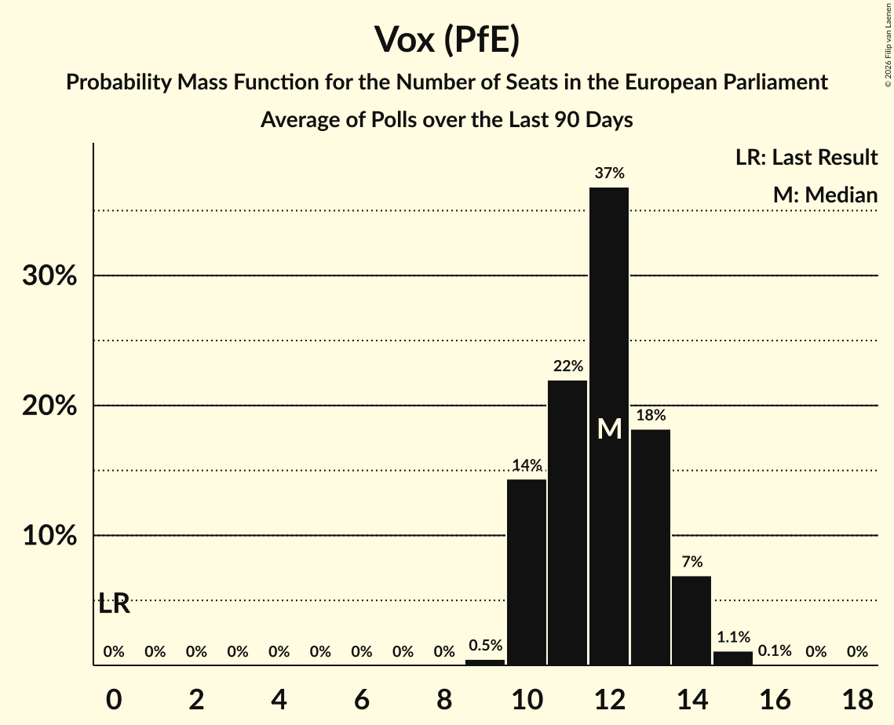

# Vox (PfE)

<a href="#voting-intentions">Voting Intentions</a> | <a href="#seats">Seats</a>

## Voting Intentions

Last result: **0.0%** (General Election of 9 June 2024)

### Confidence Intervals

| Period     | Polling firm/Commissioner(s) | Median | 80% Confidence Interval | 90% Confidence Interval | 95% Confidence Interval | 99% Confidence Interval |
|:----------:|:----------------:|:-----------:|:-----------------------:|:-----------------------:|:-----------------------:|:-----------------------:|
| N/A | [Poll Average](average.html) | 13.8% | 11.9–15.8% | 11.5–16.3% | 11.2–16.8% | 10.6–17.7% |
| [10–12 December 2024](2024-12-12-HamalgamaMétrica.html) | Hamalgama Métrica   VozPópuli | 13.2% | 11.9–14.7% | 11.6–15.1% | 11.2–15.5% | 10.7–16.2% |
| [5–11 December 2024](2024-12-11-Sondaxe.html) | Sondaxe   La Voz de Galicia | 14.3% | 13.0–15.7% | 12.7–16.1% | 12.4–16.5% | 11.8–17.2% |
| [25 November–4 December 2024](2024-12-04-SigmaDos.html) | Sigma Dos   El Mundo | 11.9% | 11.0–12.9% | 10.8–13.2% | 10.5–13.4% | 10.1–13.9% |
| [2–4 December 2024](2024-12-04-GESOP.html) | GESOP   Prensa Ibérica | 14.9% | 13.5–16.4% | 13.1–16.9% | 12.8–17.2% | 12.2–18.0% |
| [25–29 November 2024](2024-11-29-NCReport.html) | NC Report   La Razón | 13.5% | 12.2–15.0% | 11.8–15.4% | 11.5–15.8% | 10.9–16.5% |
| [25–27 November 2024](2024-11-27-40dB.html) | 40dB   Prisa | 13.1% | 12.2–14.1% | 11.9–14.4% | 11.7–14.7% | 11.2–15.2% |
| [22–24 November 2024](2024-11-24-SocioMétrica.html) | SocioMétrica   El Español | 13.5% | 12.3–14.9% | 12.0–15.2% | 11.7–15.6% | 11.2–16.2% |
| [20–22 November 2024](2024-11-22-TargetPoint.html) | Target Point   El Debate | 14.6% | 13.4–15.9% | 13.0–16.3% | 12.8–16.6% | 12.2–17.3% |
| [18–22 November 2024](2024-11-22-Ipsos.html) | Ipsos   La Vanguardia | 14.5% | 13.3–15.9% | 12.9–16.3% | 12.6–16.7% | 12.0–17.3% |
| [7–15 November 2024](2024-11-15-Celeste-Tel.html) | Celeste-Tel   Onda Cero | 12.4% | 11.2–13.7% | 10.8–14.1% | 10.5–14.4% | 10.0–15.1% |
| [11–14 November 2024](2024-11-14-GAD3.html) | GAD3   Mediaset | 15.6% | 14.3–17.2% | 13.9–17.6% | 13.5–18.0% | 12.9–18.7% |
| [8–11 November 2024](2024-11-11-DYM.html) | DYM   Henneo | 12.6% | 11.4–14.0% | 11.0–14.4% | 10.7–14.8% | 10.1–15.5% |
| [5–8 November 2024](2024-11-08-HamalgamaMétrica.html) | Hamalgama Métrica   VozPópuli | 12.5% | 11.2–13.9% | 10.9–14.3% | 10.6–14.7% | 10.0–15.4% |
| [24–31 October 2024](2024-10-31-SigmaDos.html) | Sigma Dos   El Mundo | 10.5% | 9.6–11.5% | 9.4–11.8% | 9.2–12.0% | 8.8–12.5% |
| [21–24 October 2024](2024-10-24-GAD3.html) | GAD3   ABC | 12.9% | 11.6–14.3% | 11.2–14.7% | 10.9–15.1% | 10.4–15.8% |
| [16–18 October 2024](2024-10-18-TargetPoint.html) | Target Point   El Debate | 10.6% | 9.4–11.9% | 9.1–12.3% | 8.8–12.6% | 8.3–13.3% |
| [16–18 October 2024](2024-10-18-SocioMétrica.html) | SocioMétrica   El Español | 11.2% | 10.4–12.1% | 10.2–12.4% | 10.0–12.6% | 9.6–13.0% |
| [16–18 October 2024](2024-10-18-DYM.html) | DYM   Henneo | 11.2% | 10.0–12.6% | 9.7–13.0% | 9.4–13.3% | 8.8–14.0% |
| [8–11 October 2024](2024-10-11-HamalgamaMétrica.html) | Hamalgama Métrica   VozPópuli | 11.4% | 10.2–12.8% | 9.9–13.2% | 9.6–13.5% | 9.0–14.2% |
| [4–9 October 2024](2024-10-09-Celeste-Tel.html) | Celeste-Tel   Onda Cero | 10.7% | N/A | N/A | N/A | N/A |
| [20–27 September 2024](2024-09-27-SigmaDos.html) | Sigma Dos   El Mundo | 9.5% | 8.7–10.4% | 8.4–10.7% | 8.2–10.9% | 7.9–11.3% |
| [25–27 September 2024](2024-09-27-40dB.html) | 40dB   Prisa | 10.5% | 9.7–11.4% | 9.4–11.7% | 9.2–11.9% | 8.8–12.4% |
| [23–26 September 2024](2024-09-26-GESOP.html) | GESOP   Prensa Ibérica | 13.0% | 11.8–14.5% | 11.4–14.9% | 11.1–15.3% | 10.5–16.0% |
| [16–20 September 2024](2024-09-20-InvyMark.html) | InvyMark   laSexta | 10.9% | 9.8–12.2% | 9.5–12.5% | 9.3–12.8% | 8.8–13.4% |
| [18–19 September 2024](2024-09-19-TargetPoint.html) | Target Point   El Debate | 10.0% | 8.9–11.3% | 8.6–11.7% | 8.3–12.0% | 7.8–12.7% |
| [1–13 September 2024](2024-09-13-SimpleLógica.html) | Simple Lógica   elDiario.es | 10.5% | 9.3–11.8% | 9.0–12.2% | 8.7–12.5% | 8.2–13.2% |
| [3–6 September 2024](2024-09-06-HamalgamaMétrica.html) | Hamalgama Métrica   VozPópuli | 11.3% | 10.1–12.7% | 9.8–13.1% | 9.5–13.4% | 8.9–14.1% |
| [2–6 September 2024](2024-09-06-Celeste-Tel.html) | Celeste-Tel   Onda Cero | 10.4% | 9.3–11.6% | 9.0–12.0% | 8.7–12.3% | 8.2–12.9% |
| [2–6 September 2024](2024-09-06-CIS.html) | CIS | 13.1% | 12.4–13.8% | 12.3–14.0% | 12.1–14.2% | 11.8–14.5% |
| [26–31 August 2024](2024-08-31-SocioMétrica.html) | SocioMétrica   El Español | 11.1% | 10.3–12.0% | 10.1–12.2% | 9.9–12.4% | 9.5–12.9% |
| [22–29 August 2024](2024-08-29-SigmaDos.html) | Sigma Dos   El Mundo | 9.6% | 8.9–10.4% | 8.7–10.7% | 8.5–10.9% | 8.1–11.3% |
| [20–23 August 2024](2024-08-23-NCReport.html) | NC Report   La Razón | 9.6% | 8.3–11.2% | 7.9–11.7% | 7.6–12.1% | 7.0–13.0% |
| [19–23 August 2024](2024-08-23-40dB.html) | 40dB   Prisa | 10.6% | 9.8–11.5% | 9.5–11.8% | 9.3–12.0% | 8.9–12.5% |
| [1–9 August 2024](2024-08-09-SimpleLógica.html) | Simple Lógica   elDiario.es | 10.4% | 9.0–12.1% | 8.6–12.6% | 8.3–13.0% | 7.7–13.9% |
| [5–8 August 2024](2024-08-08-SigmaDos.html) | Sigma Dos   El Mundo | 9.9% | 9.1–10.8% | 8.9–11.0% | 8.7–11.2% | 8.3–11.7% |
| [22 July 2024](2024-07-22-TargetPoint.html) | Target Point   El Debate | 10.8% | 9.3–12.5% | 8.9–13.0% | 8.6–13.4% | 8.0–14.3% |
| [18–20 July 2024](2024-07-20-SocioMétrica.html) | SocioMétrica   El Español | 11.2% | 10.1–12.4% | 9.8–12.8% | 9.5–13.1% | 9.0–13.7% |
| [12–18 July 2024](2024-07-18-SigmaDos.html) | Sigma Dos   El Mundo | 9.0% | 8.3–9.8% | 8.1–10.0% | 7.9–10.2% | 7.6–10.6% |
| [1–10 July 2024](2024-07-10-SimpleLógica.html) | Simple Lógica   elDiario.es | 10.5% | 9.1–12.2% | 8.7–12.7% | 8.4–13.1% | 7.7–14.0% |
| [1–4 July 2024](2024-07-04-HamalgamaMétrica.html) | Hamalgama Métrica   VozPópuli | 11.3% | 10.1–12.7% | 9.8–13.1% | 9.5–13.4% | 8.9–14.1% |
| [1–4 July 2024](2024-07-04-CIS.html) | CIS | 12.2% | 11.6–12.9% | 11.4–13.1% | 11.2–13.3% | 10.9–13.6% |
| [21–28 June 2024](2024-06-28-SigmaDos.html) | Sigma Dos   El Mundo | 10.9% | 10.0–11.8% | 9.8–12.1% | 9.6–12.3% | 9.2–12.8% |
| [25–27 June 2024](2024-06-27-TargetPoint.html) | Target Point   El Debate | 9.8% | N/A | N/A | N/A | N/A |
| [21–24 June 2024](2024-06-24-40dB.html) | 40dB   Prisa | 10.4% | 9.6–11.3% | 9.3–11.6% | 9.1–11.8% | 8.7–12.3% |
| [11–15 June 2024](2024-06-15-NCReport.html) | NC Report   La Razón | 10.3% | 8.9–12.0% | 8.5–12.4% | 8.2–12.8% | 7.5–13.7% |
| [10–14 June 2024](2024-06-14-Invymark.html) | Invymark   laSexta | 11.0% | 9.0–13.6% | 8.4–14.4% | 7.9–15.1% | 7.1–16.4% |
| [1–11 June 2024](2024-06-11-SimpleLógica.html) | Simple Lógica   elDiario.es | 11.5% | N/A | N/A | N/A | N/A |

### Probability Mass Function

The following table shows the probability mass function per percentage block of voting intentions for the [poll average](average.html) for Vox (PfE).

| Voting Intentions | Probability | Accumulated | Special Marks |
|:-----------------:|:-----------:|:-----------:|:-------------:|
| 0.0–0.5% | 0% | 100% | Last Result |
| 0.5–1.5% | 0% | 100% |  |
| 1.5–2.5% | 0% | 100% |  |
| 2.5–3.5% | 0% | 100% |  |
| 3.5–4.5% | 0% | 100% |  |
| 4.5–5.5% | 0% | 100% |  |
| 5.5–6.5% | 0% | 100% |  |
| 6.5–7.5% | 0% | 100% |  |
| 7.5–8.5% | 0% | 100% |  |
| 8.5–9.5% | 0% | 100% |  |
| 9.5–10.5% | 0.5% | 100% |  |
| 10.5–11.5% | 5% | 99.5% |  |
| 11.5–12.5% | 15% | 95% |  |
| 12.5–13.5% | 23% | 80% |  |
| 13.5–14.5% | 25% | 56% | Median |
| 14.5–15.5% | 18% | 31% |  |
| 15.5–16.5% | 9% | 13% |  |
| 16.5–17.5% | 3% | 4% |  |
| 17.5–18.5% | 0.6% | 0.7% |  |
| 18.5–19.5% | 0.1% | 0.1% |  |
| 19.5–20.5% | 0% | 0% |  |

## Seats

Last result: **0** seats (General Election of 9 June 2024)

### Confidence Intervals

| Period     | Polling firm/Commissioner(s) | Median | 80% Confidence Interval | 90% Confidence Interval | 95% Confidence Interval | 99% Confidence Interval |
|:----------:|:----------------:|:------:|:-----------------------:|:-----------------------:|:-----------------------:|:-----------------------:|
| N/A | [Poll Average](average.html) | 9 | 8–11 | 7–11 | 7–12 | 7–12 |
| [10–12 December 2024](2024-12-12-HamalgamaMétrica.html) | Hamalgama Métrica   VozPópuli | 8 | 7–9 | 7–10 | 6–10 | 6–11 |
| [5–11 December 2024](2024-12-11-Sondaxe.html) | Sondaxe   La Voz de Galicia | 10 | 9–10 | 9–10 | 9–10 | 8–11 |
| [25 November–4 December 2024](2024-12-04-SigmaDos.html) | Sigma Dos   El Mundo | 8 | 7–8 | 7–8 | 7–9 | 7–9 |
| [2–4 December 2024](2024-12-04-GESOP.html) | GESOP   Prensa Ibérica | 10 | 9–11 | 9–11 | 9–12 | 8–12 |
| [25–29 November 2024](2024-11-29-NCReport.html) | NC Report   La Razón | 9 | 8–10 | 8–10 | 8–10 | 7–11 |
| [25–27 November 2024](2024-11-27-40dB.html) | 40dB   Prisa | 9 | 9–10 | 8–10 | 8–10 | 8–11 |
| [22–24 November 2024](2024-11-24-SocioMétrica.html) | SocioMétrica   El Español | 10 | 8–10 | 8–10 | 7–10 | 7–10 |
| [20–22 November 2024](2024-11-22-TargetPoint.html) | Target Point   El Debate | 10 | 9–11 | 9–11 | 9–11 | 8–12 |
| [18–22 November 2024](2024-11-22-Ipsos.html) | Ipsos   La Vanguardia | 9 | 9–11 | 8–11 | 8–12 | 8–12 |
| [7–15 November 2024](2024-11-15-Celeste-Tel.html) | Celeste-Tel   Onda Cero | 8 | 8–9 | 7–9 | 7–9 | 7–10 |
| [11–14 November 2024](2024-11-14-GAD3.html) | GAD3   Mediaset | 11 | 10–12 | 10–12 | 9–13 | 9–13 |
| [8–11 November 2024](2024-11-11-DYM.html) | DYM   Henneo | 9 | 8–10 | 8–10 | 7–10 | 7–11 |
| [5–8 November 2024](2024-11-08-HamalgamaMétrica.html) | Hamalgama Métrica   VozPópuli | 8 | 8–9 | 7–9 | 7–9 | 6–10 |
| [24–31 October 2024](2024-10-31-SigmaDos.html) | Sigma Dos   El Mundo | 7 | 6–8 | 6–8 | 6–8 | 6–8 |
| [21–24 October 2024](2024-10-24-GAD3.html) | GAD3   ABC | 9 | 8–10 | 7–10 | 7–10 | 7–11 |
| [16–18 October 2024](2024-10-18-TargetPoint.html) | Target Point   El Debate | 7 | 6–8 | 6–8 | 6–9 | 5–9 |
| [16–18 October 2024](2024-10-18-SocioMétrica.html) | SocioMétrica   El Español | 8 | 7–8 | 7–8 | 7–8 | 6–9 |
| [16–18 October 2024](2024-10-18-DYM.html) | DYM   Henneo | 8 | 7–9 | 7–9 | 6–9 | 6–10 |
| [8–11 October 2024](2024-10-11-HamalgamaMétrica.html) | Hamalgama Métrica   VozPópuli | 8 | 7–8 | 7–9 | 6–9 | 6–9 |
| [4–9 October 2024](2024-10-09-Celeste-Tel.html) | Celeste-Tel   Onda Cero |  |  |  |  |  |
| [20–27 September 2024](2024-09-27-SigmaDos.html) | Sigma Dos   El Mundo | 7 | 6–7 | 6–7 | 5–7 | 5–7 |
| [25–27 September 2024](2024-09-27-40dB.html) | 40dB   Prisa | 7 | 7–8 | 6–8 | 6–8 | 6–9 |
| [23–26 September 2024](2024-09-26-GESOP.html) | GESOP   Prensa Ibérica | 9 | 8–10 | 8–10 | 7–10 | 7–11 |
| [16–20 September 2024](2024-09-20-InvyMark.html) | InvyMark   laSexta | 8 | 7–9 | 7–9 | 6–9 | 6–10 |
| [18–19 September 2024](2024-09-19-TargetPoint.html) | Target Point   El Debate | 7 | 6–8 | 6–8 | 5–8 | 5–9 |
| [1–13 September 2024](2024-09-13-SimpleLógica.html) | Simple Lógica   elDiario.es | 7 | 6–8 | 6–8 | 6–8 | 5–9 |
| [3–6 September 2024](2024-09-06-HamalgamaMétrica.html) | Hamalgama Métrica   VozPópuli | 8 | 7–8 | 7–8 | 6–8 | 5–9 |
| [2–6 September 2024](2024-09-06-Celeste-Tel.html) | Celeste-Tel   Onda Cero | 6 | 6–7 | 6–7 | 6–8 | 5–8 |
| [2–6 September 2024](2024-09-06-CIS.html) | CIS | 9 | 8–9 | 8–9 | 8–10 | 8–10 |
| [26–31 August 2024](2024-08-31-SocioMétrica.html) | SocioMétrica   El Español | 8 | 7–8 | 7–8 | 6–8 | 6–8 |
| [22–29 August 2024](2024-08-29-SigmaDos.html) | Sigma Dos   El Mundo | 6 | 6–7 | 5–8 | 5–8 | 5–8 |
| [20–23 August 2024](2024-08-23-NCReport.html) | NC Report   La Razón | 6 | 6 | 6 | 5–7 | 5–8 |
| [19–23 August 2024](2024-08-23-40dB.html) | 40dB   Prisa | 7 | 7–8 | 6–8 | 6–8 | 6–9 |
| [1–9 August 2024](2024-08-09-SimpleLógica.html) | Simple Lógica   elDiario.es | 7 | 6–8 | 6–9 | 5–9 | 5–9 |
| [5–8 August 2024](2024-08-08-SigmaDos.html) | Sigma Dos   El Mundo | 7 | 6–7 | 6–7 | 5–7 | 5–8 |
| [22 July 2024](2024-07-22-TargetPoint.html) | Target Point   El Debate | 7 | 6–8 | 6–9 | 6–9 | 5–10 |
| [18–20 July 2024](2024-07-20-SocioMétrica.html) | SocioMétrica   El Español | 7 | 7–8 | 6–8 | 6–8 | 6–9 |
| [12–18 July 2024](2024-07-18-SigmaDos.html) | Sigma Dos   El Mundo | 6 | 5–6 | 5–6 | 5–7 | 5–7 |
| [1–10 July 2024](2024-07-10-SimpleLógica.html) | Simple Lógica   elDiario.es | 7 | 6–8 | 6–8 | 5–9 | 5–9 |
| [1–4 July 2024](2024-07-04-HamalgamaMétrica.html) | Hamalgama Métrica   VozPópuli | 7 | 7–8 | 7–8 | 6–8 | 6–9 |
| [1–4 July 2024](2024-07-04-CIS.html) | CIS | 8 | 8–9 | 7–9 | 7–9 | 7–9 |
| [21–28 June 2024](2024-06-28-SigmaDos.html) | Sigma Dos   El Mundo | 7 | 7 | 7 | 7 | 6–8 |
| [25–27 June 2024](2024-06-27-TargetPoint.html) | Target Point   El Debate |  |  |  |  |  |
| [21–24 June 2024](2024-06-24-40dB.html) | 40dB   Prisa | 7 | 6–8 | 6–8 | 6–8 | 6–8 |
| [11–15 June 2024](2024-06-15-NCReport.html) | NC Report   La Razón | 7 | 5–7 | 5–8 | 5–8 | 5–8 |
| [10–14 June 2024](2024-06-14-Invymark.html) | Invymark   laSexta | 7 | 6–9 | 5–10 | 5–10 | 4–11 |
| [1–11 June 2024](2024-06-11-SimpleLógica.html) | Simple Lógica   elDiario.es |  |  |  |  |  |

### Probability Mass Function

The following table shows the probability mass function per seat for the [poll average](average.html) for Vox (PfE).

| Number of Seats | Probability | Accumulated | Special Marks |
|:---------------:|:-----------:|:-----------:|:-------------:|
| 0 | 0% | 100% | Last Result |
| 1 | 0% | 100% |  |
| 2 | 0% | 100% |  |
| 3 | 0% | 100% |  |
| 4 | 0% | 100% |  |
| 5 | 0% | 100% |  |
| 6 | 0.3% | 100% |  |
| 7 | 8% | 99.7% |  |
| 8 | 24% | 92% |  |
| 9 | 23% | 68% | Median |
| 10 | 32% | 45% |  |
| 11 | 10% | 13% |  |
| 12 | 3% | 3% |  |
| 13 | 0.3% | 0.3% |  |
| 14 | 0% | 0% |  |

